## Teil I. Vorfahren und Kindheit

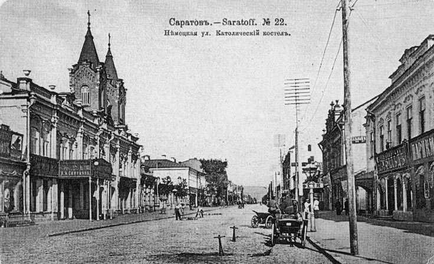

### Kapitel 1. Umsiedler

Ein trüber Herbstmorgen im Jahre 1765. Die freie Stadt Lübeck liegt hoch im Norden Deutschlands. Kleine, ordentliche Häuser mit Gärten. Gotische Gebäude mit spitzen, in den Himmel gerichteten Türmen. Der altehrwürdige, zu Beginn des 13. Jahrhunderts erbaute, Dom, die majestätische und strenge Marienkirche, das Rathaus und die Stadttore: Burgtor und Holstentor, an denen die jungen Leute gern zusammentrafen. Etwas weiter entfernt, am Trave-Fluss, nahe seiner Mündung in die Lübecker Ostsee-Bucht, der Hafen. Im Dunst des Nebels ein ganzer Wald von schlanken Masten. An einer der Anlegestellen eine kunterbunte Menge: Bauern, Bürgerliche, Soldaten. Männer, Frauen und Kinder. Es sind besonders viele Kinder. Noch nicht ganz ausgeschlafen und ein wenig verfroren drängen sie sich an ihre Eltern. Hier sieht man Ballen, Körbe, Bündel und Kisten. Die Sachen werden auf ein Schiff geladen, das nach Russland aufbrechen wird.

Nach allem zu urteilen haben diese Leute in ihrer Heimat nicht gerade wohlhabend gelebt. Ständige Kriege (diesen Zeitraum wird man später den Siebenjährigen Krieg nennen), Überfälle, Plünderungen und Kämpfe, die Willkür der Fürsten und örtlichen Mächte, religiös begründete Verfolgungen. Aber dort, in Russland, haben die Anwerber Katharinas II ihnen goldene Berge versprochen. Aus ihren Berichten konnte man ableiten, dass die «Zarin in den warmen Gefilden ihres Imperiums ein Paradies für ihre zukünftigen Landsleute geschaffen hatte», dass «Familien, die über keinen eigenen Besitz verfügen, in Russland zu Besitzern von Häusern, Ackerböden, Weinbergen werden würden», dass «dass man an der Wolga für nur zwei Pfennige eine achtköpfige Familie mit Mittagessen versorgen könnte».

Die Menschen schenkten dem Glauben, verließen ihre angestammten Wohnorte und trafen, den Behörden verborgen, auf Umwegen, teils allein, teils mit ihren Familien, in Lübeck ein, um sich von dort aus, gemäß der Vereinbarungen, die sie mit den Anwerbern getroffen hatten, auf den Weg ins geheimnisvolle und beängstigende Russland aufzumachen.

Unter den mit diesem Schiff abreisenden Personen befand sich auch unser männlicher Vorfahr, der Auswanderer aus dem südwestlichen Deutschland, der dreiunddreißigjährige gebürtige Katholik, Drucker und Buchbinder Johann Maier. Mit ihm ins ferne, noch nie gesehene Russland machten sich seine Ehefrau Anna und zwei kleine Söhne auf den Weg. In ihrem Städtchen, das von Krieg und Feuer zerstört worden war, gab es keine Gelegenheit zum Drucken von Büchern, und Johann musste sich mit Tischler- und Ofensetzer-Arbeiten befassen. Aber dort, in Russland, wie der Anwerber, ein netter und würdiger Herr, ihnen bestätigt hatte, entfalteten sich gerade die Schulen und man wollte oder hatte sogar schon eine Akademie der Wissenschaften beziehungsweise Universität gegründet, so dass infolgedessen auch Bücher benötigt würden, viele Bücher. Die mussten alle gedruckt und gebunden werden! Die alten Eltern ließen ihn zu sich ins Dorf kommen, wo jetzt, nach dem Ende des Krieges, kräftige Männerhände so sehr gebraucht wurden, versetzten sie mit ihren Berichten über grimmigen Frost, bärtige russische Männer und Bären in Angst und Schrecken. Sie erinnerten sie daran, dass es verboten war den deutschen Boden zu verlassen. Doch die Hoffnung, den Beruf auszuüben, den man liebte, siegte.

Und nun stand Johann an Deck des ablegenden Schiffes und nahm mit wehmütigem Schmerz in der Seele und Tränen in den Augen Abschied von seinem Vaterland - vermutlich für immer.

Unterwegs erhielten die Umsiedler Brot, Zwieback, getrocknetes und geräuchertes Fleisch, Wein. Den schlecht gekleideten, und es gab davon nicht wenige, händigte man Kleidung aus. Außerdem schenkte man jedem von ihnen vor der Abfahrt 16 Schillinge. Dises Geld verwendeten die Umsiedler zum Kauf von zusätzlichen Lebensmitteln für die Fahrt. Die Reise von Lübeck nach Kronstadt über die Ostsee dauerte 10 Tage. Zehn Tage herrschten Nebel, Nässe und Seegang. Endlich, am 2. September 1765 betrat die nächste Partie Umsiedler russischen Boden.

Ausländer aus dem Westen hatten russische Regenten schon lange eingeladen und angeworben. Einen besonderen Umfang nahm dieser Prozess während der Regierungszeit Iwans III an, auf dessen Initiative Künstler, Ingenieure, Bergleute, Gießereiarbeiter (zum Gießen von Kirchenglocken), Juweliere und Ärzte eingeladen wurden. Mitte des 16. Jahrhunderts schickte Iwan IV (der Schreckliche) den ausländischen Agenten Schlitte nach Deutschland, um für den Dienst an Russland Handwerker, Techniker, Heimarbeiter und Gelehrte anzuwerben. Schlitte warb 123 Personen an, unter denen sich auch Ärzte, Apotheker, Juristen, Architekten, Ingenieure für den Bau militärischer Befestigungen, Büchsenmacher, Glaser, Uhrmacher und andere befanden. Aber auf Befehl des preußischen Königs wurden alle diese Leute in Lübeck festgehalten und Schlitte verhaftet. Ein tatkräftiger Vorkämpfer der westeuropäischen Kultur war Boris Godunow. Er lud Industrielle aus England, Holland, Dänemark und den freien deutschen Städten Hamburg, Lübeck und Bremen nach Russland ein. Neben Technikern, Ärzten und Handwerkern holte Boris Godunow auch Soldaten ins Land. In dem Wunsch in Russland eine Universität zu gründen, schickte er den Ausländer Johann Kramer nach Deutschland, der für Moskau Professoren anwerben sollte. Über die Ergebnisse dieser Aktion ist nichts bekannt.

Während der Regierungszeit Wassilij Schuiskis und in den Jahren der Smuta (Zeit der Wirren; Anm. d. Übers.) wandelte sich die Haltung gegenüber den Ausländern in Russland jäh zum Schlechten. Der Aufstand des russischen Volkes gegen Polen wurde zum Protest gegen alles Fremde. Die Moskauer Vorstadt «Deutsche Siedlung» wurde zerstört und vernichtet. Die Umsiedler, die früher nach Russland gekommen waren, hatten ein schlechtes, schweres Leben. Erst nachdem die Ordnung im Lande wiederhergestellt worden war und der Thronbesteigung des ersten Zaren aus der Dynastie der Romanows, Michail Fjodorowitsch, beschloss die russische Regierung, erneut Ausländer einzuladen. Besonders erfolgreich war darin der zweite Zar aus der Romanow-Dynastie, Aleksej Michailowitsch, auf dessen Anweisung die «Deutsche Siedlung» wiedererrichtet wurde und die nächste Welle an Umsiedlern aus dem Westen nach Russland einreiste.

Gegen Ende des 17. Jahrhunderts lebten in Russland etwa 18000 Ausländer. Und obwohl sich unter ihnen Vertreter der unterschiedlichsten Nationalitäten befanden, wurden sie im Volk für gewöhnlich alle als Deutsche bezeichnet. Die Haltung ihnen gegenüber war weiterhin alles andere als eindeutig. Zu der Zeit, als die Regierung in ihrer Tätigkeit großen Nutzen für den Staat sah, waren das einfache Volk und zahlreiche Höflinge der Ansicht, dass die Präsenz von Ausländern Russland nur Schaden bringen würde. Eine ähnliche Meinung wurde auch vom Klerus unterstützt und befeuert, der sich allen Andersgläubigen gegenüber feinselig verhielt. Dennoch wuchs der Einfluss der Westeuropäer in Russland. Es näherte sich die Epoche der großen Reform Peters I. Nachdem er persönlich im Ausland gewesen war und gesehen hatte, wie die Europäer leben und arbeiten, begann Peter für seinen Staat Spezialisten anzuwerben. Anfangs holte er vorwiegend Techniker und Soldaten ins Land, aber schon bald darauf auch Pädagogen, Gärtner, Förster und unterschiedliche Meister der «Alltags»-Kunst. Peters Reformen betrafen zahlreiche Aspekte des staatlichen, gesellschaftlichen und wirtschaftlichen Lebens in Russland. Seine Untergebenen mussten sich neue Sitten und Gebräuche, neue Formen des gesellschaftlichen Umgangs aneignen. Während der Regierungszeit Katharinas II nahm die Emigration von Westeuropäern nach Russland stark zu und nahm im Zeitraum zwischen 1763 und 1767 Massencharakter an. Dabei wurden, im Unterschied zu früher, keine Spezialisten eingeladen, sondern gewöhnliche Bauern und Handwerker, vor allen Dingen aus deutschen Ländern. Ausgelöst wurde dies selbstverständlich nicht von den nationalen Gefühlen der Zarin, sondern von der schwierigen Lage an der Unteren Wolga. Nach erfolgreichen militärischen Operationen in dieser Region Russlands waren dort zahlreiche menschenleere, unbearbeitete Ländereien entstanden, auf denen Kalmücken, Baschkiren und Kasachen mit ihren Viehherden nomadisierten. In der ersten Hälfte des VIII. Jahrhunderts gründeten sich auf diesen Flächen aufständische Meuten und Räuberbanden. In den Jahren 1730-1740 schickte Zarin Anna Johannowna Truppen in diese Gegenden, aber es gelang nicht dort Ordnung herzustellen. Als erfolglos erwiesen sich auch die Versuche der Regierung durch die Schaffung einer kompakten Besiedlung dieser Orte einen Abwehrriegel gegen die Nomaden und räuberischen Banden zu bilden. Hier ließen sich vorwiegend Altgläubige, Sektierer und auch flüchtige Leibeigene sowie Kriminelle nieder, deren Mehrheit in der Landwirtschaft tätig war und wenige Gedanken verlor. Entgegen den Hoffnungen der Regierung wurden solche Siedlungen häufig zu einem Refugium für räuberische Banden. Daher wurde mit der Thronbesteigung Katharinas II beschlossen, zur Besiedlung dieser Gegenden Umsiedler aus dem Westen anzuwerben.

Zu damaligen Zeiten nannte man den Prozess der Besiedlung menschenleerer Landstücke Kolonisierung, und die Menschen, die zu ihrer Urbarmachung bestellt worden waren – Kolonisten. Später, Ende des 19. Jahrhunderts, erhielten diese Wörter einen neuen, aggressiven Sinn, und man gab den Kolonisten in diesem Zusammenhang zur Vermeidung von Missverständnissen die Bezeichnung Siedler – Grundeigentümer. Sie selbst nannten sich zumeist Umsiedler. In diesem Kapitel werden wir neben dem Terminus Kolonist den weiter gefassten und weniger kränkenden Begriff Umsiedler verwenden.

Für die Durchführung des gefassten Beschlusses brachte Katharina II 1762-63 zwei Manifeste heraus, nach denen allen Ausländern, die gewillt waren nach Russland zu kommen, gestattet wurde, ad libitum sowohl ihren Siedlungsort als auch die Art ihrer Tätigkeit selbst zu wählen. Zudem wurde jeder migrierten Familie ein großzügig bemessenes Flurstück (30 Desjatinen pro Familie), ein zinsloses Darlehen, eine Befreiung Steuerzahlungen (für einen Zeitraum von 30 Jahren) sowie die Freistellung von der Wehrpflicht, das Recht auf freien Handel und Reisefreiheit versprochen. Garantiert wurde ebenfalls die Nichtausweitung der Leibeigenschaft auf die Umsiedler und, was für viele sehr wichtig war, man erlaubte ihnen nach ihren Sitten, Bräuchen und ihrem Glaubensbekenntnis zu leben.

Gleichzeitig mit der Veröffentlichung des Manifests wurden in die westlichen Länder, vornehmlich nach Deutschland, äußerst kompetente Anwerber geschickt, denen man für jede angeworbene Familie gute Bezahlung zusicherte. Ihre Versprechungen und Überredungskünste fielen auf fruchtbaren Boden. Gerade erst war der Siebenjährige Krieg zu Ende gegangen (1756-1763), der Zentral-Europa mit einem Feuersturm überrollt hatte. Zahlreiche Ortschaften waren zerstört; die Familien, die ihren Ernährer verloren hatten, lebten in großem Elend. Die Bauern, die sich unter Besatzung befanden, wurden doppelt unterdrückt. Rekruten wurden nicht nur für den Dienst in den Fürstenarmeen oder zur persönlichen Verfügung der Fürsten mobilisiert, sondern auch für den Dienst in fremdländischen Armeen. Die Bevölkerung wurde wegen religiöser Meinungsverschiedenen verfolgt. So ist es nicht verwunderlich, dass viele den Versprechen der Anwerber erlagen. Die Aussichten auf ein großes Stück Land und ein Darlehen, die Befreiung von der Wehrpflicht schien für viele der benachteiligten Bewohner West-Europas sehr verlockend zu sein. Dass die Umsiedler und ihre Nachfahren in Russland unter schweren und gefährlichen Bedingungen leben werden müssten, argwöhnte die Mehrheit von ihnen nicht. Anfangs verlief die Anwerbung erfolgreich, doch schon bald änderte sich alles. Die Massen-Ausreise von Bauern und Handwerkern widersprach den Interessen des im Entstehen befindlichen Bürgertums, denen es an freien Arbeitshänden gelegen war. Unter diesen Bedingungen brachten die Herrscher, vor allem die deutschen Staaten, Dekrete heraus, die ihren Untertanen Fahrten außerhalb der Grenzen ihres Landes verboten. Der Versuch, das Land heimlich zu verlassen, wurde mit der Konfiszierung des Besitzes und der Androhung bestraft, dass, für den Fall, dass die Emigranten in ihre alte Heimat zurückkehren wollten, die Grenze für sie nicht geöffnet werden würde. Trotzdem wurden die Anwerbungen fortgesetzt, obwohl dies auch mit Gefahren für die Anwerber selbst verbunden war. Eine offizielle Erlaubnis zur Ausreise erhielten in der Regel nur die am schlimmsten verelendeten Bauern und Handwerker. Alle anderen reisten in aller Heimlichkeit aus. Unter ihnen befanden sich Künstler, Offiziere, Ärzte, Lehrer, Studenten und sogar unbedeutendere Adlige. Sie alle hofften, in Russland ihr Glück zu finden. Es gab unter den Emigranten auch degradierte Personen: Faulenzer, Trinker und sogar Kriminelle, welche die Bevölkerung in den Dörfern gern loswerden wollte. 1768, nach dem von Kaiser Josef II herausgebrachten Edikt über ein strengstes Verbot jedweder Emigration aus deutschen Ländern kam die Ausreise und Anwerbung nach Russland vorübergehend zum Erliegen.

Für die Entscheidung allgemeiner strategischer Aufgaben, die im Zusammenhang mit der Ansiedlung der Kolonisten standen, wurde in Russland auf Minister-Grundlage eine staatliche Kommission für die Umsiedlung von Ausländern geschaffen. Im weiteren Verlauf erhielt dieses Organ die Bezeichnung «Vormundschaftskanzlei für Ausländer», im Volk schlicht «Kanzlei» genannt.

Gemäß Beschluss der Regierung mussten die eingetroffenen Kolonisten sich in den Niederungen der Wolga ansiedeln, an ihrem linken und rechten Ufer, von Samara bis nach Kamyschin. Die Kolonisten sollten in Dörfern (Kolonien) siedeln. Für jede Ortschaft wurden zwischen 40 und 60 Tausend Desjatinen Land zugeteilt, die, nach Ansicht der Kanzlei, unter Berücksichtigung des Bevölkerungswachstums, für tausend Familien ausreichen sollten. Die Landzuteilung sollte mit einer solchen Berechnung erfolgen, dass zwischen den Ortschaften keine leerstehenden Ländereien übrigblieben. Bei der Verteilung der Siedler auf die Dörfer wurden ihre Nationalität und ihre Glaubenszugehörigkeit berücksichtigt. Für die Entscheidung der laufenden konkreten Aufgaben in der Stadt Saratow wurde ein «Vormundschaftskontor» für Ausländer organisiert. Ihm stand der oberste Richter voran, der von der Zarin persönlich ernannt wurde. Zur Kompetenz des Vormundschaftskontors gehörten alle Lebensbereiche der Kolonisten. Die von ihm veröffentlichten Befehle und Instruktionen reglementierten jeden Schritt der Kolonisten: was, wo, wann gesät werden sollte; wann geerntet, wo der Herbstacker bestellt, wo das Wintergetreide gesät werden sollte. Es gab detaillierte Hinweise auf die Abfolge der Arbeiten bei der Heu-Ernte, den Zeitpunkt für den Beginn und das Ende dieser Arbeiten. Mehr als hundert Jahre waren diese Anweisungen gültig, und es war den Kolonisten verboten, irgendwelche Ergänzungen einzubringen, Initiative zu zeigen. Alles musste so gemacht werden, wie es auch in den umliegenden russischen Dörfern gehandhabt wurde.

Insgesamt kamen von 1763 bis 1767 per Rekrutierung ungefähr 27000 Menschen (etwa 8000 Familien) nach Russland. Hier gab es Franzosen, Österreicher, Dänen, Schweden, Polen, Holländer, Italiener. Allerdings waren die meisten von ihnen Deutsche. Unter ihnen – Vertreter praktisch aller deutschen Stämme aus allen Fürstentümern, Grafschaften und ritterlichen Ländereien Deutschlands. Mehr als die Hälfte der Ankömmlinge machten die Kinder aus (in vielen Familien belief sich ihre Zahl auf vier bis fünf), und die meisten unter ihnen waren noch minderjährig. Entsprechend den Plänen der Kanzlei wurden die ersten Umsiedler, die in Russland im Herbst 1764 eintrafen, entgegen dem im Manifest proklamierten Recht auf freie Wahl des Wohnortes und der Art der Berufsausübung, aufgefordert, an die Wolga-Niederung oder die ufernahen Schwarzmeer-Steppen zu fahren und dort Landwirtschaft zu betreiben. Vielen von ihnen gefiel das nicht. Besonders empörten sich die Handwerker, Offiziere und Angehörigen der Intelligenz (Ärzte, Lehrer, Studenten). Aber der Weg zurück war ihnen abgeschnitten. Die Zeit der Navigation auf dem Meer war vorbei, und die Mittel für die Rückzahlung der Kredite und die Rückreise besaßen sie nicht. Nach einem kurzen Wortwechsel und einer langen kräftezehrenden Reise durch Zentral-Russland wurden alle am rechten, hochgelegenen Ufer der Wolga angesiedelt: von Saratow bis zur Bezirksstadt Kamyschin, die etwas weiter südlich lag.

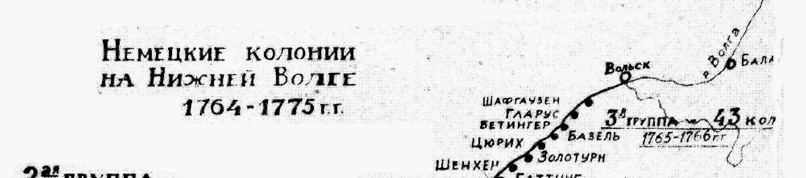

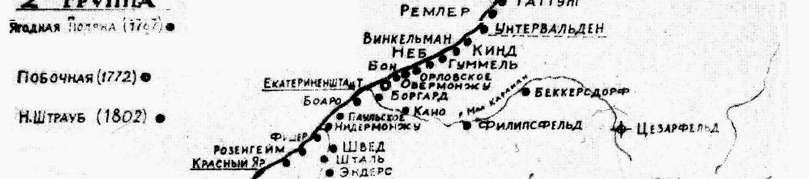

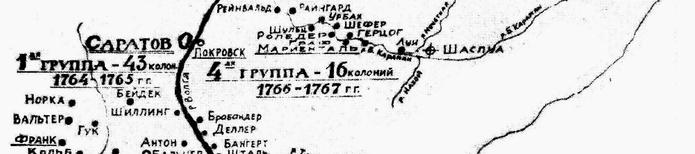

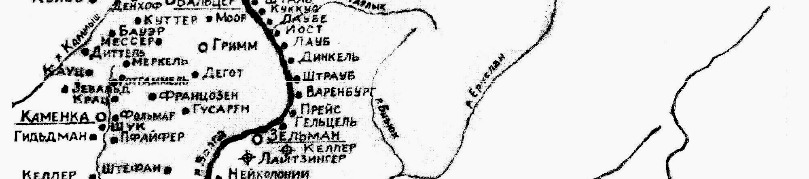

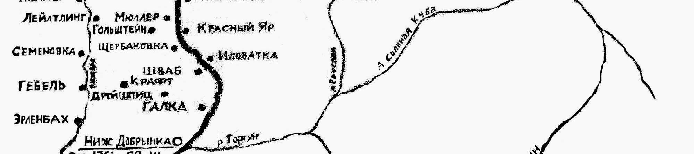

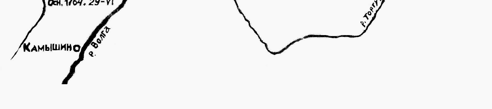

Немецкие колонии на Нижней Волге / Deutsche Kolonien an der Unteren Wolga Insgesamt entstanden 43 Kolonien, von denen sich 10 entlang der Wolga erstreckten, 17 – am Fluss Karamysch, 12 – am Fluss Ilowlja und 4 – am Fluss Medweditza. Die Organisierung der meisten Kolonien wurde von der Regierung geleitet.

Diese Kolonien wurden Kron-Kolonien genannt. Lediglich 8 Kolonien am Karamysch und 3 an der Ilowlja wurden auf Befehl Katharinas der II von Privatpersonen gegründet – den Direktoren Prekur und Boffe. Daher wurden diese beiden Kolonien in der ersten Zeit auch «Boffsker Kolonien» genannt. In jenen Jahren wurde von der religiösen Gemeinde der Gernguter etwa 28 Werst südlich der Stadt Zarizyn am Flüsschen Sarpa eine weitere Kolonie, die Kolonie Sarepta, gegründet.

Die Partie Umsiedler, zu der auch Johann und Anna gehörten, traf im Herbst 1765 in Russland ein. Ihr widerfuhr das gleiche Los wie ihren Vorgängern. Nach dem Ausschiffen wurden die Umsiedler mit Fuhrwerken von Kronstadt nach Oranienbaum gebracht, wo man ihnen die Beschlüsse der Kanzlei verkündete, nach denen sie sich alle am linken Ufer der Wolga ansiedeln sollten. Von Oranienburg transportierte man die Umsiedler auf dem Wasserweg nach Petersburg, wo sie vorübergehend in der nahe der Stadt neu gegründeten deutschen Kolonie «Neu-Saratow» untergebracht wurden. Von diesem Augenblick an verschlechterte sich die Haltung gegenüber den Umsiedlern. Die Größe der Lebensmittelrationen verringerte sich merklich. Die Erwachsenen erhielten so viel, wie man anfangs an die Kinder ausgeteilt hatte. Aus Petersburg wurden sie in Kolonnen verschickt. Für ihre Begleitung wurde Militärpersonal ernannt. Die Reise fand auf dem Wasserweg, auf der Newa, statt, weiter über den Schlisselburger Kanal, den Fluss Wolchow flussabwärts bis nach Nowgorod. Hier wurden die Kranken ausgeschifft und zum Überwintern zurückgelassen. Die anderen wurden nach kurzer Weiterfahrt auf Fuhrwerke verladen und in Richtung Wolga geschickt. Die Fahrt auf den unbefestigten Straßen war nicht leichter als die Reise zu Wasser. Die Fuhrwerke waren von dem Hab und Gut, den Kindern und Frauen überladen. Die Männer gingen die ganze Zeit zu Fuß nebenher. Der Winter rückte näher.

Die meisten Umsiedler waren nicht entsprechend der Jahreszeit gekleidet. Viele erkrankten aufgrund von Hunger und Kälte. Einige ließen unterwegs ihr Leben. Trotzdem – solange der Winter noch nicht endgültig hereingebrochen war, beeilten sich die Umsiedler voranzukommen, weiter in Richtung Süd-Osten. Die meisten Kolonnen, unter anderem auch die, in der sich die jungen Maiers befanden, verbrachten den Winter in den um die Stadt Torschka, im Twersker Gouvernement, gelegenen Ortschaften. Die Umsiedler lebten dort bei russischen Familien, in denen sie die Möglichkeit hatten, die Sitten und Gebräuche der russischen Bauern kennenzulernen, und ein paar Sätze in russischer Sprache zu erlernen. Zum ersten Mal sahen sie, wie in einem einzigen Raum (unter einem Dach) Menschen und Haustiere (Schweine, Hühner und andere Tiere) zusammenlebten. Die meisten Katen wurden ohne Rauchabzug beheizt. Die Umsiedler aßen mit den Wirtsleuten am gemeinsamen Tisch. Fast jeden Tag standen die berühmte russische Kohlsuppe und Hirsebrei auf dem Tisch. Getrunken wurde russischer Kwas. Außerdem gab es in jedem Haus genügend Milch, und die Umsiedler brachten ihren Wirtsleuten bei wie man gute Butter und Käse herstellt. Die besonders Fleißigen und Geschickten halfen den ortsansässigen Bauern beim Korndreschen mit Dreschflegeln auf der Tenne. Damit konnten sie ein wenig Geld verdienen. Auch für die Handwerker fand sich Arbeit.

Von Zeit zu Zeit schickte die Regierung Geistliche (Lutheraner und Katholiken) in die Dörfer, in denen die Umsiedler vorübergehend untergebracht waren. Sie tauften Kinder, hielten Totenfeiern und Predigten ab und trösteten die Umsiedler so gut sie es vermochten. In einigen Kolonnen gab es ständige Kirchenvertreter. Sie begleiteten die Umsiedler bis zu den Siedlungsorten, wo sie anschließend kirchliche Tätigkeiten organisierten. Vereinzelte Kolonisten, unter ihnen auch Johann, erlernten in diesem Winter recht gut die russische Sprache. Allerdings wurde das von den Behörden nicht gefördert, und so blieb die überwiegende Mehrheit der Kolonisten viele Jahrzehnte in ihrer neuen Heimat «deutsch».

Gleichzeitig entstanden unter den Umsiedlern, die Tag und Nacht nur wenige Schritte voneinander getrennt waren, nicht selten ernsthafte Konflikte, die in blutigen Prügeleien und sogar Morden endeten. Die Lage wurde noch dadurch verschärft, dass es unter den Umsiedlern auch richtige Kriminelle gab, die sich in ihrer Heimat der Verfolgung entzogen hatten. Diejenigen, die durch Entscheidung der Ältesten und des Anführers des Konvois für schuldig befunden wurden, wurden mit Stockschlägen bestraft. Mitunter fiel dieses Los auch Frauen zu. Und trotz aller Reibereien waren sich die Umsiedler in einem Ziel einig: nachdem sie die Heimat verlassen hatten, hofften sie trotzdem für sich und ihr Kinder auf eine neues, würdigeres und glücklicheres Los – dort, an der Unteren Wolga, wohin sie die Zarenregierung anschließend schickte.

Im Frühjahr, sobald der Schiffsverkehr wieder aufgenommen worden war, schickte man die Umsiedler auf Booten und Lastkähnen an den Unterlauf der Wolga. Hier brachte man sie auf der Wiesenseite unter, etwa dreißig Werst flussaufwärts von der Siedlung Pokrowsk entfernt. Aufgrund der großen Überschwemmungen der Siedlungsorte (künftigen »Kolonien») stiegen sie in einiger Entfernung zur Wolga aus, in der Nähe ihres alten Flussbettes. Insgesamt wurden dort 43 Kolonien organisiert.

Acht von ihnen, die in den Niederungen des Flusses Bolschoi Karaman und am Flüsschen Teljause lagen, sollten von der Regierung (Kronkolonien) gelenkt werden. Neun Kolonien, die am mittleren Karaman gelegen waren, wurden von den Direktoren Lekur und Piktet gegründet. Schließlich zogen sich 26 Kolonien, geleitet von den Direktoren Borgardt und Monschu, vom Fluss Teljause entlang der Wolga Richtung Norden, bis zum Fluss Irgis, hin und nach Osten, in die Steppe, bis zur Quelle des Malij Karaman.

An einem dieser Orte, der zukünftigen Ortschaft Gattung (Zug), Nikolajewsker Landkreis, Gouvernement Samara, trafen dann auch im Frühjahr 1766 Johann und Anna mit ihren Kindern ein. Und hier sahen sie, wie tausende andere Kolonisten an anderen Orten der Unteren Wolga auch, keine blühenden südlichen Ländereien, von denen die Anwerber ihnen in so malerischen Bildern berichtet hatten, sondern öde salzhaltige Steppen, malträtiert von heftigen Winden, alles austrocknenden Dürren und grimmigen Frösten. Und nichts, was auch nur im Entferntesten an eine Behausung erinnert hätte.

Zu einem Haufenzusammengekauert blickten die Umsiedler auf die endlose Steppe, die sich vor ihnen ausbreitete. Die Strahlen der kalten Morgensonne, die sich nur mit Mühe einen Weg durch den Nebel und über den dampfenden Fluss bahnte, beleuchtete sie mit einem gespenstischen Licht. Es war kalt und unheimlich. Sie hatten Angst um sich und besonders um die Kinder, die, eingewickelt in Decken, auf den Kisten mit dem häuslichen Hab und Gut, Bündeln und Körben vor sich hindösten. Die Wirklichkeit war noch viel schrecklicher als die düstersten Vorhersagen der Skeptiker.

Enttäuschend war für die Umsiedler auch die Begegnung mit den Vertretern des Vormundschaftskontors, in dem sich alle registrieren lassen und die ihnen laut Vertrag zustehenden Geldanleihen, Lebensmittel, Arbeitswerkzeuge, Vieh sowie Getreide für die zukünftige Aussaat erhalten sollten. Bürokratie und Wucher blühten im Kontor in keinem geringeren Maße als bei jeder anderen staatlichen Behörde auch. Der Zeitraum für die Ausgabe der Geldanleihen, Baumaterialien, des Viehs und des Inventars an die Kolonisten zog sich maßlos in die Länge. Um an diese Dinge zu gelangen, mussten die Umsiedler mehrmals und für längere Zeit nach Saratow fahren. Zudem war eine derartige Fahrt für die Bewohner der linken Uferseiteля mit Gefahren bei der Querung der Wolga verbunden.

Der ganze Sommer ging für Johann und die anderen Dorfbewohner für den Erhalt der im Vertrag vorgesehenen Pferde und Kühe dahin: jeweils zwei kleinwüchsige, nicht an Pferdegeschirre gewöhnte Kalmücken-Pferde und jeweils eine Kuh pro Familie. Das zur Bodenbearbeitung unerlässliche Handwerkszeug – Zoche (Pflug), Deichseln, Räder u.a. wurde erst Mitte Juni an sie ausgegeben und Saatgut noch viel später. Es versteht sich von selbst, dass unter derartigen Bedingungen von einer Durchführung der Aussaat keine Rede sein konnte. Kaum einer der Kolonisten war in der Lage sich einigermaßen gut auf den Winter vorzubereiten. Die meisten beschränkten sich auf den Bau von Erd- oder Lehm-Hütten und vertagten das Errichten von Häusern aus Holzbalken auf den nächsten Sommer. Aber einen Stall für das Vieh bauten sie alle. Notgedrungen sammelten die Kolonisten wilde Äpfel, Birnen und Schlehen und trockneten sie für den Winter. Einigen Haushalten gelang es bereits in diesem ersten Herbst ein paar Dutzend Desjatinen Neuland zu pflügen und darauf Roggen anzusäen. Erschwert wurde das Leben der Kolonisten auch durch das Verbot russische Ortschaften aufzusuchen, zur Jagd zu gehen und Handel zu treiben. Zudem wurde dies auch durch Nichtkenntnis der russischen Sprache behindert. Auf Anweisung des Vormundschaftskontors wählten die Kolonisten in jeder Ortschaft bei ihrer Ankunft in offener Abstimmung einen Ältesten und seine Gehilfen (Beisitzer). In der Regel wurden die besten Leute im Dorf gewählt – vernünftige, besonnene, die sich in der Landwirtschaft gut auskannten, erfahrene Männer im Alter zwischen 30 und 60 Jahren. Die Ältesten wurden für ein Jahr gewählt, die Gehilfen – für ein halbes. Kleine Dörfer verfügten über zwei Beisitzer, große über entsprechend mehr. Das Amt des Ältesten war in den ersten Siedlungsjahren nicht leicht zu bewältigen. Vor Beginn des 19. Jahrhunderts standen den Ältesten keine Sekretäre zur Verfügung. Aber das Kontor forderte eine strenge Aufsicht über alle Kolonisten sowie genaue Informationen über ihr Verhalten und ihre Tätigkeit. Was haben sie damals nicht alles den Ältesten gefragt! Er musste, gemeinsam mit den Gehilfen, regelmäßig die an ihn gebundenen Familien aufsuchen und darauf achten, dass in den Höfen und Häusern alles sauber war, dass die Rauchabzüge in Ordnung waren usw. Sie hatten auch darauf zu achten, dass die Kolonisten bescheiden, im Rahmen ihrer Möglichkeiten, lebten. An Feiertagen, unter anderem auch zu Hochzeiten, war es nicht gestattet, mehr als zehn Gäste einzuladen. Verfolgt wurden Kartenspiele. Der Älteste sollte auf allen Feierlichkeiten Hochzeiten, Taufen usw.) anwesend sein und zusehen, dass die allgemeine Ordnung eingehalten wurde, und er hatte ebenfalls darauf acht zu geben, dass keiner der Kolonisten lasterhaften Männern oder Frauen Obdach gewährte und dass niemand ohne seine Erlaubnis Vieh schlachtete oder verkaufte. Der Älteste musste von Zeit zu Zeit die Grenzen der Gemeinde-Ländereien abschreiten, ihre Markierungen kontrollieren und sein Augenmerk darauf richten, ob alle Höfe der Kolonisten mit Flechtzäunen umgeben waren. Der Älteste erhielt 30 Rubel pro Jahr (zum Vergleich erwähnen wir, dass zu der Zeit eine Kuh auf dem Markt durchschnittlich 7 Rubel kostete, ein Schaf 1 Rubel und 20 Kopeken, ein Schwein 1 Rubel). Jemanden, der sich ein Vergehen hatte zu Schulden kommen lassen, konnte der Älteste höchstpersönlich mit einer Geldstrafe oder Zwangsarbeit belegen. Aber jemanden zu einer Prügelstrafe verurteilen (mit Knute oder Peitsche) durfte er nur mit dem Einverständnis der Gehilfen.

Als erste Verwalter und Vertreter des Vormundschaftskontors wurden unmittelbar in den Dörfern zumeist die Offiziere, die die Umsiedler bis an ihre neuen Wohnorte begleitet hatten, ernannt. Über eine Gruppe von Dörfern stellte man einen Amtsbezirks-Offizier und -Kommissar, der in der Regel aus den Reihen der Balten-Deutschen gewählt wurde, die im Staatsdienst standen.

Ihren ersten Winter am neuen Wohnort überstanden die Kolonisten, auch wenn sie unter den für sie ungewohnten Frösten litten, mehr oder weniger gut. Sie beschafften Holz für Baumaßnahmen, bereiteten Handwerkszeug und Saatkörner für die Aussaat vor. Die Kolonisten erahnten wohl kaum, welche «Überraschungen» Natur und Menschen für sie bereithielten. Den ersten Schlag versetzte ihnen die Natur. Im zeitigen Frühjahr überflutete die stürmisch überlaufende Wolga in zahlreichen Kolonien auf der linken Uferseite die provisorischen Unterkünfte der Umsiedler. Viele Menschen kamen ums Leben. Diejenigen, die am Leben blieben, mussten noch einmal ganz von vorn anfangen – an neuen Stellen, die von einer Überschwemmung verschont bleiben würden. Im Sommer begann eine Fieber-Epidemie, die bis in den tiefen Herbst hinein wütete und ebenfalls zahlreiche Leben, insbesondere von Kindern, dahinraffte. Anschließend stellte sich heraus, dass der Boden, den man den Umsiedlern der Ortschaft Gattung und acht weiteren Kolonien am Kleinen Karaman zugewiesen hatte, für den Ackerbau völlig ungeeignet waren. Nach zwei Jahren absoluter Missernten siedelten all diese Dörfer an neue Orte, von der Kolonie Remmler weiter flussaufwärts, wobei sie die vorherigen Ortsnamen beibehielten. Schließlich kam es an der Wolga beinahe ein ganzes Jahrzehnt immer wieder zu Dürrekatastrophen.

Den zweiten Schlag versetzten ihnen Nomadenstämme und räuberische Banden. Das Gebiet an der Unteren Wolga mit seinen riesigen Weiten «ungezähmter Felder» hatte ihnen schon seit langem als Zufluchtsort gedient. Hier gab es geflohene oder freigelassene Leibeigene, in fremden Ländern gekaufte Sklaven, aber auch Hörige, die zusammen mit ihren Nachkommen verkauft wurden und, schließlich und letztendlich – einfache Räuberники – Leute, die leichtes Geld machten. Ihre Reihen wurden ergänzt durch desertierte Soldaten und örtliche Nomaden.

Anfangs litten die Kolonisten der rechten Uferseite (Bergseite) am schlimmsten von allen unter den herumstreunenden Banden, denn ausgerechnet durch ihre Kolonien verlief der große astrachaner Trakt, neben dem die Räuber in den nahegelegenen Wäldern und Schluchten ihre geheimen Schlupfwinkel besaßen. Mit Waffen in den Händen tauchten die Banditen in den Dörfern auf und trieben «mitten am helllichten Tag» das Vieh fort, vor allem Pferde. Nächtliche Überfälle und das Ausrauben einzelner Haushalte waren eine gängige Erscheinung. Besonders häufig plünderten und töteten sie Kolonisten unterwegs, wobei sie nicht nur vereinzelte Reisende übervielen, sondern auch ganze Trecks. Um sich gegenseitig vor herannahenden Gefahren zu warnen, wurden in den Dörfern Signaltürme errichtet, auf dem ständig ein Wachhabender aus den Reihen der Kolonisten seinen Dienst versah. Manchmal vereinten sich mehrere Ortschaften und verjagten die Plünderer. In der Nähe nomadisierende Kalmücken und Zigeuner trieben das Vieh mitunter in ganzen Herden mit sich. Sie entführten auch Kinder. Allerdings überfielen sie niemals Kolonien mit dem Ziel, diese vollständig zu zerstören.

Am linken Ufer machten sie sich zuerst daran, Pferde und Eigentum zu stehlen. Mord und Vertreibung von Kolonisten besaß keinen Massen-Charakter. Doch zu Beginn der siebziger Jahre änderte sich die Lage jäh. Es kam zu groß angelegten Überfällen der Nomaden auf die deutschen Ortschaften. Der erste dieser Überfälle wurde 1771 auf die Dörfer Schaslua und Lui am Fluss Bolschoi Karaman verübt. Eine aus 50-60 Reitern bestehende Gruppe Nomaden, die sich die Tatsache zunutze machte, dass die erwachsene Bevölkerung sich beim Einbringen der Ernte auf den Feldern befand, nahm nicht nur den Besitz mit, sondern auch einen Großteil der zu Hause gebliebenen Kolonisten; sie vertrieben sie weit gen Osten und verkauften sie auf den Basaren von Chiwa und Buchara. In jenem Jahr wurde die Kolonie Zaserfeld am Oberlauf des Flusses Maly Karaman zerstört.

Drei Jahre später, am 28. August 1774, beging Khan Nurali, der sich die Tatsache zunutze machte, dass die Zarenregierung mit der Unterdrückung des pugatschowsker Aufstands beschäftigt war, einen grausamen und zerstörerischen Überfall auf die am Großen Karaman gelegene Ortschaft Marienthal. Es war ein heißer Sonntag, die Kolonisten, die den Gottesdienst besucht hatten, traten aus der Kirche. In diesem Augenblick drang ein großer Trupp zu Pferd in das Dorf ein. Panik kam auf. Die Angreifer schwangen ihre blanken Säbel, ergriffen die Menschen, fesselten sie und jagten sie anschließend zusammen mit dem Vieh und dem gestohlenen häuslichen Hab und Gut Richtung Osten in die Steppe.

Die Nachricht über das Geschehene verbreitete sich schnell in der Region. Aus den Nachbardörfern rekrutierten sich Freiwillige zur Verfolgung der Nomaden und Befreiung der gefangenen Kolonisten. Es entstand eine Truppe aus 150 Mann, die von Pastor Ludwig Wernborner angeführt wurde und sich zur Jagd auf die Banditen auf den Weg machte. Allerdings fiel die Truppe schon bald darauf selbst in die Hände einer mehr als tausendköpfigen Nomaden-Horde, die ebenfalls darauf aus war, die deutschen Dörfer zu plündern. Fast der gesamte Trupp Kolonisten wurden vernichtet. Die Überlebenden wurden an den Sätteln festgebunden und gezwungen neben den Pferden herzulaufen. Die Geschwächten wurden an Ort und Stelle abgemurkst. Nach dem sie in der Steppe genächtigt hatten, setzten die Nomaden am Morgen ihre Reise gen Westen fort, um dort nach deutschen Dörfern zu suchen. Die am Leben gebliebenen Gefangenen, von denen man verlangte, dass sie ihnen den Weg zu den nächstgelegenen Dörfern wiesen, führten sie an Marienthal vorbei. Die Nomaden begriffen das erst, als sie weit abseits Glockenläuten vernahmen, welches die Marienthaler zum Abendgebet rief. Rasend vor Wut stürzten sie sich auf ihre Gefangenen und töteten sie auf bestialische Weise.

Als sie auf dem Beobachtungsturm der Ortschaft Marienthal die Staubwolke der sich nähernden großen Menge bemerkten, dachten sie, dass ihr Trupp mit den befreiten Artgenossen zurückkäme, aber schon sehr bald erkannten sie ihren Irrtum. Das ganze Dorf begann sich vorzubereiten. Sie versteckten die Frauen und Kinder, bewaffneten sich mit allem Möglichen, was griffbereit war (Harken, Sensen. Äxten) und zerstörten die Brücke. Doch es war bereits zu spät. Nachdem sie den Fluss durchschwommen hatten, drangen die Nomaden auf ihren Pferden in das Dorf ein und plünderten es vollständig aus. Diejenigen, die Widerstand leisteten wurden umgebracht, Frauen und Kinder vergewaltigt.

An demselben Tag zerstörten andere Nomaden-Trupps weitere acht Kolonien, die weiter flussabwärts am Großen Karaman gelegen waren. Die unversehrt gebliebenen Kolonisten verließen in Scharen ihre Dörfer und begaben sich nach Katharinenstadt, die Pokrowsker Freisiedlung und Saratow. Die Plünderung der verlassenen Ortschaften wurde durch die Jaizker Kosaken aus der aufgelösten Pugatschow-Armee vollendet. Am 24. Oktober 1774 waren fünf Tarlyksker Kolonien einem analogen Überfall ausgesetzt.

Insgesamt gerieten ungefähr 1200 Kolonisten bei den Nomaden in Gefangenschaft, die Zahl der Getöteten wurde nicht einmal annähernd ermittelt. Die Kolonisten wurden vollkommen terrorisiert. Viele dachten daran, aus den Kolonien zu fliehen, sich an einem anderen, ruhigeren Ort niederzulassen. Man schickte sogar Vertreter in den Kaukasus, um die Lage dort zu erkunden. Doch die Gesandten kehrten mit schlechten Nachrichten zurück. Auch dort war es unruhig, Bergstämme des Kaukasus überfielen Umsiedler aus der Ukraine und den zentralen Gebieten Russlands.

Im Vormundschaftskontor war man alarmiert von der Stimmung der Umsiedler und unternahm Schritte zur Gewährleistung der Sicherheit in den deutschen Kolonien. Ständige Truppenteile wurden in die Dörfer ausgesendet. Die Kolonisten selbst errichteten Erdwälle und andere Schutzvorrichtungen. Doch nicht alle waren damit zufrieden. Einige unternahmen auf eigenes Risiko den Versuch, in aller Heimlichkeit in ihre alte Heimat zurückzukehren, aber sie wurden von Kosaken aufgegriffen in wieder in ihr Dörfer zurückgebracht. Viele bezahlten den Versuch mit ihrem Leben. Aber dem einem oder anderen gelang es trotzdem zu fliehen und sich in den zentralen Gebieten Russlands niederzulassen. Nur vereinzelten Personen gelang es in ihre historische Heimat zurück zu gelangen. Insgesamt verließen in diesem Zeitraum nicht weniger als 2000 Kolonisten ihre Kolonien an der Unteren Wolga. Die zurück Gebliebenen lebten noch viele Jahre mit der Angst vor Überfällen.

In diesen ersten Jahren ihres Lebens in Russland hatten es die Kolonisten äußerst schwer. Die Ernten fielen aufgrund der in dieser Region herrschenden jahrelangen Dürre sehr schlecht aus, zudem traf das Saatgut der Regierung mit großen Verzögerungen ein, so dass die Aussaat nicht rechtzeitig erledigt werden konnte. Die Kolonisten, die an ein Leben unter kontinentalen Klimabedingungen nicht gewöhnt waren, litten unter Malariaanfällen. N den Dörfern brachen regelmäßig Epidemien aus, sowohl unter den Menschen als auch beim Vieh. Die Todesrate in diesen ersten Jahren war sehr hoch. In manchen Dörfern starben bis zu 80% der eingetroffenen Kolonisten.

Für Johann und seine Familie erwiesen sich diese ersten zehn Jahre an der Wolga, ebenso wie für die anderen Kolonisten als sehr schwierig. Besonders die ersten drei Jahre. Zu den physischen Erschwernissen und materiellen Entbehrungen, die das Ausmaß dessen, was sie einst zu Hause in Deutschland hatten ertragen müssen, bei weitem überstiegen, kam noch die unbändige Sehnsucht nach der Heimat. Das warme, milde Klima, der Nieselregen und der Nebel, das saftige Grün, die gemütlichen, von Efeu und Weinreben umrankten Häuschen, die Frauen mit ihren weißen, gestärkten Schürzen, die wohlrasierten Männer, die gewaschenen und gekämmten Kinder – das alles lag nun in ferner Vergangenheit und erschien Johann nur noch im Traum. Er konnte und mochte gern gut arbeiten, scheute keine Arbeit, aber das Verlangen nach einem Leben in der Stadt verfolgte ihn noch lange. Anna, die den größten Teil ihres Lebens auf einem Vorwerk verbracht hatte, litt, wie es schien, weniger, während es ihm offenkundig an städtischen Gebäuden, mächtigen Straßenzügen, Geschäften und, vor allen Dingen, Büchern fehlte. Zwei Gebetsbücher, ein Gesangbuch und ein Kinderbuch mit deutschen Volksmärchen hütete er wie ein Kleinod. An langen Winterabenden las er seinen Söhnen im trüben Lampenlicht mit angestrengten Augen Märchen vor. Anna setzte sich zugleich dazu und nähte: sie flickte und stopfte die abgenutzten Kleidungsstücke.

Johann liebte seine erzwungenen Fahrten zum Vormundschaftskontor und murrte nicht wie die anderen über den Papierkrieg und die verantwortungslosen Mitarbeiter dort. Ihm gefiel Saratow, besonders in den frühen Morgenstunden, wenn in den Straßen noch keine Passanten, Fuhrwerke und Equipagen unterwegs waren und die hinter der Wolga aufgehende Sonne sanft die Kuppel der Kirche und eine Reihe aus Stein und Holz gebauter Häuser anstrahlte. Er mochte die Kette der nicht sehr hohen, bläulich schimmernden Berge, die die Stadt umrahmten, und sie mit einer wahren Brandung aus grünen Eichenhainen überfluteten. Er mochte die Wolga in diesen frühen Morgenstunden, die so groß und ruhig dahinfloss. Tagsüber erwachte sie. Hunderte Schiffe, Lastkähne, Boote – die einen unter Segeln, die anderen mit Rudern betrieben, doch zumeist von Treidlern gezogen – hatten am Saratower Ufer festgemacht. Hier blühte der Handel – Fisch, Eingesalzenes, Getreide, Manufakturwaren, Kurzwaren. Am Tage ging er über den Markt, in der vergeblichen Hoffnung, einen in der Stadt wohnenden Artgenossen kennenzulernen. Aber davon gab es damals in Saratow nur sehr wenige, nicht mehr als hundert Menschen, vor allem wohlhabendere Vertreter der Intelligenz. In den tiefsten Tiefen seiner Seele bewahrte Johann die Hoffnung, hier in Saratow eines Tages eine Buchbinderei zu eröffnen. Aber dieser Traum war nicht dafür bestimmt in Erfüllung zu gehen. Die Sorgen des Landlebens sogen ihn immer mehr auf. Eine signifikante Verlagerung zum Besseren im Leben der Kolonisten stellte sich erst 1775 ein, als sie nach starken Regenfällen ihre erste gute Getreideernte einbrachten. Nachdem sie ihr eigenes Saatgut ausgesät hatten, wurden die Kolonisten in ihrer eigenen landwirtschaftlichen Tätigkeit unabhängig. Mit diesem Jahr endete die Ausgabe von Geldanleihen und Mittel für den Unterhalt der Umsiedler. Die Folgejahre gestalteten sich den Siedlern zum Gefallen. Sie pflügten eine Menge Neuland, bauten gediegene Häuser und Hofgebäude, legten Gärten an, begannen Pferde, vor allem der Orlowsker Rasse, Kühe und Yorkshire-Schweine zu züchten, zogen an der neuen Stelle Kartoffeln, welche die Ortsansässigen erst 50 Jahre später anbauten, und befassten sich mit dem Anbau von Tabak. Tabak fand in den Jahren einen reißenden Absatz. Zuerst kauften Nomaden ihn, später erschienen Kaufleute aus den zentralen Regionen Russlands. Die Preise für Tabak und Getreide stiegen, die Höfe erholten sich und erstarkten.

Bereits Ende des 18. Jahrhunderts verkauften die Kolonisten in die benachbarten Gouvernements und die Hauptstadt baumwollene und halbseidene Tücher, feines Baumwollgarn, Baumwollstrümpfe und -Mützen, verschiedene halbseidene Materialien, Tabak, Kerzen, Seife, Leder usw. In den Kolonien entstanden kleine Lederund Ziegelwerke, Tabak- und Senffabriken, Wasser- und Windmühlen. In Russland und im Ausland war der Baumwollstoff Sarpinka (benannt nach der Kolonie Sarepta)

sehr gefragt. Der Sarepter Tabak wurde nach Persien und in die Türkei verkauft. Allerdings führten bei weitem nicht alle Kolonisten ein derartiges Leben. Mit dem Anwachsen der Familie begann die für einen Siedler vorgesehene Bodenzuteilung schnell kleiner zu werden. Wenn im Jahre 1767 auf eine Person noch 17 Desjatinen Land entfallen waren, so waren es 1816 nur noch 10.5 Desjatinen, 1848 - 3.8 und 1914 - 1.5. Die Zahl der landlosen Bauern nahm schnell zu. Infolgedessen war die Regierung gezwungen, den Kolonisten die gewerbliche Jagd und häusliches Handwerk zu gestatten.

Das Leben in den Kolonien selbst war nach den Prinzipien der Gemeinschaft und des Glaubens organisiert, nach denselben Mustern und Analogien, die schon jahrhundertelang in die Herzen der Umsiedler eingeprägt waren, die nicht dazu in der Lage waren, ihr zurückgelassenes Vaterland nicht mehr zu lieben. In den Dörfern wurden Schulen und Kirchen gebaut, häufig zur gleichen Zeit eine katholische und eine lutherische, weil man der Ansicht war, dass die nationalen Gefühle mit ihrer Hilfe leichter zu bewahren seien. Die Kolonisten, deren Mehrheit aus Schwaben (historische Bezeichnung für das im Südwesten der Bundesrepublik gelegene Bundesland Baden-Württemberg) stammten, verständigte sich hauptsächlich im schwäbischen Dialekt der deutschen Sprache. Später muss auch jeder die russische Sprache als Amts- und Staatssprache ihrer neuen Heimat können.

Das geistige Leben in den Kolonien jener Zeit wurde vollständig von der Tätigkeit der Gottesdiener definiert, die mit den Umsiedlern alle Erschwernisse des Alltagslebens teilten und unter ihnen großen Respekt genossen. Dass passte den Hierarchen der orthodoxen Kirche nicht. Aus Furcht vor einer Verbreitung des fremdländischen Glaubens in den russischen Dörfern erwirkten sie beim Vormundschaftskontor ein Verbot der Einmischung von Geistlichen in die alltäglichen Belange der Kolonisten. Infolgedessen wurde der geistige Einfluss der Kirche geschwächt. Das Vormundschaftskontor versuchte diesen Einfluss durch zahlreiche Instruktionen und Anordnung zu verändern, die das Familienleben der Kolonisten reglementierten. Von den Amtsbezirks- und Dorfältesten verlangte man, dass sie auf allen Versammlungen und bei privatem Umgang mit den Kolonisten diesen begreiflich machten, wie sie sich gegenüber ihren Eltern zu verhalten, wie sie ihre Kinder zu erziehen hätten, damit diese zu guten, fleißigen Menschen heranwüchsen. In den Anweisungen des Vormundschaftskontors wurde darauf hingewiesen, wie die Freizeit an den Sonntagen zu verbringen sei und dass man sich an Feiertagen beschenken dürfe. Verboten waren Tanz und Musik an den großen Kirchenfesttagen, das Singen und Spazierengehen der jungen Leute auf den Dorfstraßen zur Abendund Nachtzeit. Besonders streng wurde Diebstahl bestraft. Neben einer vorgegebenen Anzahl von Peitschenhieben, wurde der Schuldige durch die Dorfstraßen geführt, wobei man ihm den gestohlenen Gegenstand auf den Rücken band. Nicht selten endete eine derartige Bestrafung in einer regelrechten Prozession, die vorwiegend aus jungen Menschen bestand, welche mit Ausrufen und Gejohle den Dieb bloßstellten. Für groß angelegten Diebstahl wurde der Täter aus der Gemeinde ausgeschlossen und nach Sibirien verbannt.

Weniger streng wurde Trunksucht verurteilt. Obwohl es auch hier besondere Anweisungen des Kontors und Beschlüsse der örtlichen Behörde im Kampf gegen dieses Übel gab, wurden Verstöße selten bestraft. Die Bekanntschaft der Siedler mit Wodka begann noch in der Zeit ihrer Migration nach Russland. Auf den Schiffen bekamen sie diesen Zaubertrunk jeden Tag. Nach ihrer Ankunft an der Wolga verbot man den Kolonisten sich mit Bierbrauerei zu beschäftigen, obwohl es nicht wenige Bierbrauer unter ihnen gab. Nachdem man den Kolonisten ihr heißgeliebtes Getränk entzogen hatte, gewöhnten sie sich allmählich an den Wodka, manche missbrauchten ihn, besonders an Festtagen, aber echte Alkoholiker waren in den Kolonien nur sehr selten anzutreffen. Ihre Namen wurden einmal im Jahr dem Vormundschaftskontor mitgeteilt.

An den langen Winterabenden, wenn es weniger Arbeit gab, trafen sich die erwachsenen Männer abwechselnd bei dem einen oder anderen, erzählten sich Geschichten, teilten ihre Eindrücke, spielten Karten und tranken. Die Frauen kamen ebenfalls in Gruppen zusammen, sie strickten oder machten andere Arbeiten, sangen Volkslieder und tratschten und klatschten ohne Ende.

Die alten Familienpfeiler zerfielen. Als der deutsche Historiker A.N. Minich die Sitten und Bräuche der Umsiedler beschrieb, schrieb er: «Die Kolonisten sind größtenteils grob und unhöflich, ihr Charakter ist hartnäckig und eigensinnig». Und das ist nicht verwunderlich. So wurden sie erst durch die alle Kräfte übersteigende Arbeit mit primitiven Werkzeugen, die häufigen Dürren, die alle Mühen zu Nichte machten, all die Qualen des landwirtschaftlichen Jahres, die laufenden Überfälle der Nomaden, die Demütigungen der Behördenvertreter und die Steuerabgaben. Es ist kein Zufall, dass in den ersten zehn Jahren fast die Hälfte der Kolonisten «das Zeitliche segnete». Doch das war ein echtes Vermächtnis an die Übriggebliebenen: unbedingt zu überleben.

In all diesen Jahren vergaßen die Umsiedler nicht ihre Kinder zu unterrichten. Die ersten Lehrer waren traditionsgemäß die Schulmeister – Gehilfen der Gottesdiener, die auf Kosten der Gemeinde unterhalten wurden. Die Schulmeister wurden aus den Reihen der Lehrer und Studenten gewählt, von denen es unter den Kolonisten nicht wenige gab. In der ersten Zeit, bis zum Bau der Schulen, fand der Unterricht in der Wohnung des Lehrers statt. Dafür bezahlte die Gemeinde ihn extra. Später fand der Unterricht in zünftigen Schulen statt, die in allen Ortschaften neben den Kirchen gebaut wurden. Dort lernten die Jungs Lesen, Schreiben und Rechnen sowie das Göttliche Gesetz. Die Mädchen – nur Lesen und das Göttliche Gesetz. Der Unterricht erfolgte in der Muttersprache. Insgesamt stand es in den ersten zehn Jahren um die schulischen Dinge in den Kolonien nicht schlecht. Bei keiner anderen Volksgruppe in Russland gab es zur damaligen Zeit allgemeine Volksschulen. Das Ergebnis war die höchste Alphabetisierungsrate in Russland. Allerdings zeigte sich die Isoliertheit der Kolonisten von kulturellen Prozessen in Deutschland und Russland. Noch viele Jahre, wenn nicht Jahrzehnte, blieben ihnen die Werke der in jenen Jahren noch jungen F. Schiller und W. Goethe unbekannt. Die Unkenntnis der russischen Sprache machte es unmöglich, Bekanntschaft mit den Werken D.I. Fonwisins, N.M. Karamsins, A.N. Radischtschewa zu machen. Trotzdem verschaffte das deutsche Wolgagebiet Russland nicht wenige Akteure aus dem Bereich der Kultur und der Wissenschaft: der Dekabrist und Mittelasien-Forscher A.J. Knobloch; der Kritiker, Poet, Übersetzer und Mitarbeiter des Puschkinschen «Zeitgenossen», E.I. Guber (Grubber); der Historiker, Heimatkundler, Autor zahlreicher wissenschaftlicher Arbeiten A.N. Minich und viele andere.

Mit der Aufteilung des russischen Staates in Gouvernements wurde die Vormundschaftskanzlei in Petersburg, wie auch das Vormundschaftskontor in Saratow, entsprechend eines Dekrets Katharinas II vom 30. April 1782, d.h. weniger als zwanzig Jahre nach Herausgabe des Manifests, liquidiert. Aufgehoben wurden auch alle anderen Rechte, die das Manifest den Kolonisten gewährt hatte, aber auch die lokale Selbstverwaltung. Alle Kolonisten waren nun den russischen Kron- (staatlichen) Bauern gleichgestellt, und die allgemein geltenden Staatsgesetze wurden auf sie ausgeweitet. Jetzt bekamen die Kolonisten es mit der Schatzkammer, mit Isprawniks (Landkreis-Polizisten; Anm. d. Übers.), Gerichtsvollziehern, Boden- und Landkreisgerichten zu tun. Die Beamten verhielten sich ihnen gegenüber in grober Weise und ohne viel Federlesens zu machen. Vielfach kam es zu Erpressungs- und Bestechungsversuchen. Besonders zu leiden hatten sie aufgrund ihrer Unkenntnis der russischen Sprache. Und so war es ihr größter Wunsch, eine Führung und Verwaltung zu haben, die in der deutschen Sprache bewandert war. In dieser «unkontrollierten Zeit» verloren die Kolonisten viele der fruchtbarsten Böden, die ihnen im Augenblick der Ansiedlung zugeteilt worden waren. Sie wurden unter russischen Kron-Bauern und russischen Adelsfamilien aufgeteilt.

Gleichzeitig beanspruchten die wachsenden Familien der Kolonisten gemäß Vertrag neues Land. Anscheinend löste dieser Umstand die Verabschiedung des Dekrets vom 9. Mai 1785 aus, welches den Kolonisten eine Umsiedlung in den Nord-Kaukasus, in das Gebiet um Mosdok, erlaubte. Allerdings fand die geplante Umsiedlung nicht statt. Ende der achtziger Jahre wurde anstelle der Familienzuteilung eine Aufteilung des Ackerlandes auf die Anzahl der männlichen Seelen in der Bevölkerung eingeführt. Lediglich Weiden und Wald blieben zur allgemeinen Nutzung der Gemeinde.

Zu dieser Zeit hatten sich Johann und Anna, die nun schon mehr als ein Vierteljahrhundert in Gattung lebten, vollständig an das Leben in der neuen Heimat eingewöhnt: sie bauten Weizen, Roggen, Lein und Hanf an, pflanzten Kartoffeln und Tabak, kümmerten sich um ihr Vieh. Die älteren Söhne, die mit ihnen aus Deutschland gekommen waren, waren herangewachsen, hatten sich verselbständigt, nachdem sie von der Gemeinde und dem Vormundschaftskontor ihre Bodenzuteilung (jeweils 20 Desjatinen pro Kopf der männlichen Bevölkerung) erhalten hatten. Der Jüngste, Jakob, der 1776 bereits in Russland geboren worden war, wohnte noch bei den Eltern. Nach damals geltendem Recht sollte er, der jüngste Sohn in der Familie, nach dem Tod des Vaters dessen Hof erben. Johann starb 1805 i Alter von 73 Jahren. Anna lebte noch 8 Jahre in Jakobs Familie.

Jakob Johannowitsch Maier war auch der Urgroßvater meines Vaters (mein Ururgroßvater). In Jakobs Familie gab es vier Söhne. Den ältesten, der 1802 geboren wurde, als Jakob 26 Jahre alt war, nannten sie zu Ehren des Großvaters Johann; den zweiten, geboren 1804, zu Ehren des Vaters - Jakob; den dritten, geboren 1806, -Genrich (Heinrich; Anm. d. Übers.); den vierten, geboren 1810, - Anton. Es war die zweite Generation der Maiers, die auf russischem Boden geboren war.

Die Jahre gingen dahin, die heranwachsenden Söhne wurden immer aktiver ins wirtschaftliche Leben der Familie einbezogen. Doch ihre Aktivitäten wurden durch den Mangel an freiem Land eingeschränkt. In einer analogen Situation befanden sich zahlreiche Familien, nicht nur in Gattung. In den zwanziger Jahren des 19. Jahrhunderts begann die eigenmächtige Umsiedlung der Kolonisten auf die Orenburger Ländereien, wo sie von ortsansässigen Grundherrn Land als Besitz «für immer» erwarben. Zur Unterbindung derartiger eigenmächtiger Aktionen der Kolonisten und zur Stärkung der inneren Ordnung unter ihnen führte der Staat eine Einrichtung von Gebietsaufsehern ein. Sie waren die Ohren und Hände des Innenministeriums. Die Gebietsaufseher verfügten über umfangreiche Vollmachten, und viele unschuldige Menschen mussten unter ihnen leiden. Doch die sich fortsetzende Landknappheit und der Rückgang des landwirtschaftlichen Einkommens taten das Ihre. Es setzte eine Abwanderung ganzer Familien und einzelner Mitglieder von Großfamilien in die Städte ein, insbesondere nach Saratow. Hier gründeten sie die «Deutsche Siedlung», die im Laufe der Zeit mit der Stadt verschmolz und später zu ihrem Zentrum wurde (die Deutsche und die Nikolskaja Straße).

Jakob Johannowitsch Maier starb 1831, er wurde 55 Jahre alt. Den Hof erbte, entsprechend dem Gesetz, sein jüngster Sohn Anton, der damals gerade einundzwanzig Jahre alt war. Die Situation der älteren Brüder – Johann, Jakob und Heinrich, die zu der Zeit schon ihre eigenen Familien gegründet hatten, wurde komplizierter. Das Land, das der größer gewordenen Familie zur Verfügung stand, konnte sie schon nicht mehr ernähren. Johann und Jakob waren gezwungen etwas hinzuzuverdienen, Zimmermannsarbeiten zu erledigen. Heinrich und Anton arbeiteten auf dem Feld.

Unter Berücksichtigung der Lage, die sich an der Unteren Wolga eingestellt hatte, teilte die Regierung Nikolais I den deutschen Kolonisten 1840 neue Landstücke zu, vor allem östlich der vorherigen Kolonien. Dorthin siedelten zwischen 1848 und 1867 zahlreiche Familien aus den alten Kolonien (Mutterkolonien) über und gründeten 66 neue (Tochterkolonien): 12 auf der Berg- und 54 auf der Wiesenseite der Wolga. Unter den Ersten, die in die neuen Kolonien umzogen befanden sich Johann und Jakob mit ihren Familien. In Gattung blieben Anton und Heinrich zurück. In Heinrichs Familie gab es drei Söhne: Friedrich, geboren 1830, Karl, geboren 1836 und Franz, geboren 1840. Sechs Jahre später wurde Töchterchen Anna geboren. Auch Anton besaß eine große Familie. Sie hatten kein leichtes Leben, doch Heinrich Jakowlewitsch entschied sich dafür, nicht auf die neuen Ländereien umzuziehen. Ers t drei Jahre nach seinem Tod, er starb 1857 im Alter von 51 Jahren, machte sich sein ältester Sohn Friedrich zusammen mit einer großen Gruppe Auswanderer aus den Ortschaften Gattung, Solothurn, Watman und Schenchen auf den Weg nach Marienburg – eines der neuen Dörfer im Wjerchnekaramansker Amtsbezirk, Nowousnensker Landkreis, Gouvernement Samara.

Für die nach Marienburg Umgesiedelten begann alles wieder von vorn: der Bau einer Behausung, die Urbarmachung von Neuland, die Anschaffung von Vieh, mit dem einzigen Unterschied, dass ihnen die finanziellen nun nicht der Staat zuteilte, sondern die Kolonien, welche die Umsiedler verlassen hatten, und ihre Familien selbst. Die von bitterer Erfahrung gebeutelten Kolonisten kamen auch auf den neuen Ländereien schnell wieder auf die Beine. Aufgrund all dieser Abwanderungen wurde Jakob Johannowitschs Familie, seine Kinder und Enkelkinder auf dem gesamten riesigen Territorium der Wolga-Steppen verstreut. Ihre Kontakte zueinander gingen nach und nach verloren. Die schwere landwirtschaftliche Arbeit ließ keine Zeit für Briefwechsel und erst recht nicht für persönliche Besuche, die viel Geld und tagelanges Reisen erfordert hätten und außerdem mit nicht geringen Gefahren verbunden gewesen wäre.

In Marienburg heiratete Friedrich Genrichowitsch Maier, der Vater meines Vaters und mein Großvater die Tochter des Kolonisten Faller aus Katharinenthal. Sie hieß Dorothea. In Marienburg bekamen sie drei Söhne: 1864 – Karl, 1867 – Adolf, 1870 – Eduard und 1873 Tochter Amalia. Die Haltung des russischen Staates und der Gesellschaft gegenüber den Russland-Deutschen begann sich nach dem Zusammenschluss der germanischen Länder und des 1871 gegründeten geeinten deutschen Imperiums schnell zu verschlechtern, da dessen geopolitische Interessen auf dem Balkan mit analogen Interessen Russlands in dieser Region stießen aufeinanderprallten. Es kam zur Konfrontation zwischen den beiden Reichen, die schließlich zum Ausbruch des Krieges im Jahre 1914 führte.

Vieles in der Aktivität der deutschen Kolonisten ärgerte die russische Öffentlichkeit: sowohl, dass ihre Bevölkerung so schnell anwuchs, als auch ihr im Vergleich größerer Wohlstand, die vermeintlichen Vergünstigungen, das Aufkaufen von Land bei heruntergewirtschafteten Gutsherrn und nicht zuletzt ihre Sturheit gegenüber einer Assimilation, besonders der religiösen. Der 1907 herausgegebene «Reiseführer entlang der Wolga und ihrer Nebenflüsse» erklärte: «Die deutschen Kolonisten führen ein abgeschlossenes Leben, halten sich streng an ihre lutherische oder katholische Religion, die Sitten und Gebräuche ihres Landes, untergeben sich kaum der russischen Lebensweise; sie bewahren ihre deutsche Sprache und sprechen kaum Russisch, und wenn, dann nur, wenn es für sie unerlässlich ist. Ehen mit Russen gibt es nicht, und in ihrer gesamten Lebensweise und mentalen Einstellung sieht man den Einfluss des Heimatlichen».

In dieser Hinsicht unterschieden sich vor allen Dingen die Mennoniten, die sich in zwei Partien in Russland niedergelassen hatten: die erste – zur Zeit der Zarinnen-Herrschaft Katharinas II und die zweite – während der Zarenregentschaft Alexanders II. Das Mennonitentum entstand in den Niederlanden in den dreißiger Jahren des 16. Jahrhunderts. Ein Element ihres Glaubensbekenntnisses war die Verweigerung, in jedweder Form Staatsdienste zu leisten, unter anderem auch die Verweigerung des Wehrdienstes. In ihrer Heimat wurden die Mennoniten grausam verfolgt, so dass sie gezwungen waren, zunächst nach Polen und Preußen und dann nach Russland umzusiedeln.

Sowohl Katharina II als auch Alexander II riefen die Mennoniten ins Land, in der Hoffnung, dass ihre umfangreichen Kenntnisse und ihre reiche Erfahrung in der Landwirtschaft, vor allem aber in der Viehzucht, die Entwicklung letzterer in Russland fördern könnte. Beide Regenten versprachen den Mennoniten und ihren Nachfahren Freiheit in der Ausführung ihrer religiösen Bräuche, Befreiung von der Wehrpflicht, große Landzuteilungen (bis zu 60 Desjatinen pro Familie), eine Steuerbefreiung für zehn Jahre usw. Infolgedessen bildeten gerade die Mennoniten die unzugänglichste, einheitlichste und materiell gut gesicherte Umsiedler-Gruppe. Die Ausbreitung und Festigung einer solchen Einheit auf russischem Boden, verbunden mit der wachsenden Macht des deutschen Imperiums und «Vorherrschaft» der deutschen in den staatlichen Einrichtungen löste offenes Missfallen in der russischen Gesellschaft aus. Es erschienen Artikel, Bücher, in denen davon die Rede war, dass die Deutschen planmäßig «Russland eroberten», sein Land aufkauften und übernahmen. Die Regierung, alarmiert durch die sich entwickelnde Situation und die öffentliche Meinung, verabschiedete 1874 eine Reihe von Gesetzesakten, die den Kolonisten die letzten Reste ihrer Selbstverwaltung, ihrer kulturellen Autonomie sowie die Freistellung vom Militärdienst entzogen.

Das Saratower Vormundschaftskontor, das seinerzeit von Pawel I eingerichtet worden war, wurde erneut liquidiert. Es wurde eine neue Führungsgruppe eingesetzt – die Kreis-Selbstverwaltung, der sich unmittelbar die Landkreis-Regierungen unterordneten und die auch die schulischen Angelegenheiten leitete. Es wurde vorgeschlagen, den Unterricht in russischer Sprache abzuhalten. Das war ein heftiger Schlag für die Kolonisten, die kein Russisch konnten. Selbst die Bezeichnung «Kolonist» wurde durch eine andere ersetzt - «Siedler- Eigentümer». Und die Steuern wurden erhöht – zu denen des Staates, des Amtsbezirks und des Dorfes kamen nun noch die Selbstverwaltungssteuern hinzu.

Als natürliche Reaktion der Kolonisten auf derartige Maßnahmen der Regierung erfolgte eine Massen-Migration, hauptsächlich nach Kanada und die Vereinigten Staaten, wo alle Umsiedler erwünschte Personen waren. Dort gab es jede Menge freies Land und keine Wehrpflicht. Die russische Regierung ihrerseits legte den Kolonisten, die aus Russland ausreisen wollten, keinerlei Hindernisse in den Weg. Infolgedessen wanderten Ende der siebziger Jahre mehrere hunderttausend Personen nach Südamerika, Kanada und die Vereinigten Staaten aus.

Außerdem zog es tausende deutscher Familien in den Süden West-Sibiriens, wo es nach Informationen, die ihnen zu Ohren gekommen waren, viele verödete Ländereien gab und keine so grausame Aufsicht seitens der zentralen Machtorgane.

Mein Großvater, Friedrich Genrichowitsch Maier, wie im Übrigen auch seine Brüder Karl und Franz, unternahm keinen Versuch aus Russland auszuwandern. Alles lief darauf hinaus, dass er 1875, nachdem er seinen Besitz in Marienburg verkauft hatte, zusammen mit der Familie nach Saratow zog, wo er ein kleines zweistöckiges Haus in der Zarizynsker Straße 50 erwarb. Im ersten Stock richtete er eine Buchbinderei ein, mit der er endlich den schon seit ewigen Zeiten von Generation zu Generation weitergegeben Traum seines Urgroßvaters Johann über ein Leben in der

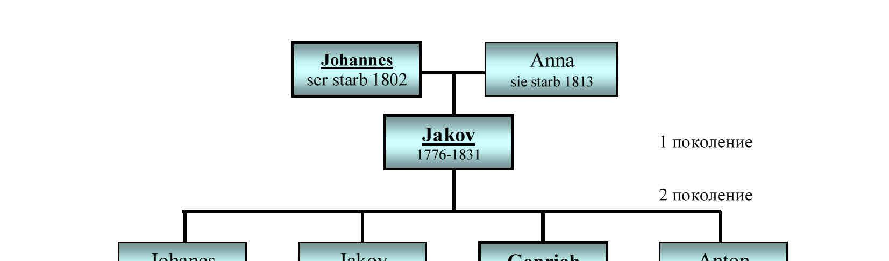

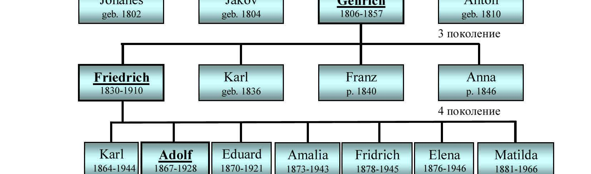

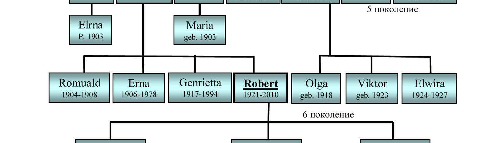

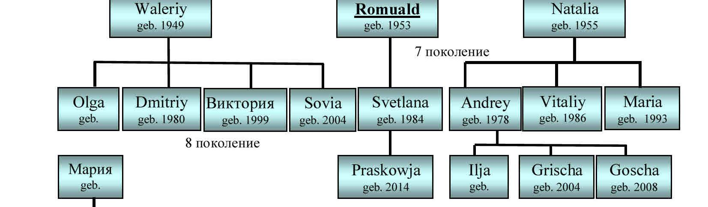

Stadt verwirklichte. In der Buchbinderei arbeitete er selbst, wobei er seine herangewachsenen Söhne mit hinzuzog. Hier in Saratow wurden ihm und seiner Frau Dorothea 1876 Jelena, 1878 Friedrich und 1881 Mathilda geboren. Das war die vierte Generation der Maiers auf russischem Boden.

Stammbaum der Familie Maier auf russischem Boden Der entsprechende Stammbaum wird auf der nächsten Seite aufgezeigt. In Bezug darauf müssen wir zusätzlich anmerken, dass Jakob noch zwei weitere Söhne hatte, die in Deutschland geboren wurden und mit den Eltern nach Russland kamen, allerdings ist mir über ihr Schicksal nichts bekannt, und im Stammbaumно werden sie überhaupt nicht benannt. Nicht bekannt ist mir auch das Schicksal von Jakobs Kindern: Johann, Jakob und Anton sowie der Kinder von Heinrich: Karl und Franz. Über die Familie des Großvaters, Friedrich Genrichowitsch, bin ich besser informiert. Nach der Revolution wurde in allen Dokumenten der Vorname Friedrich auf die russische Variante Fjodor abgeändert: der Vater wurde zu Adolf Fjodorowitsch und Onkel Friedrich Friedrichowitsch zu – Fjodor Fjodorowitsch.

Eine enge Verbindung unterhielt mein Großvater, Friedrich Genrichowitsch, mit seiner Schwester Anna Dorzweiler, die einige Jahre nach der Abreise des älteren Bruders aus Marienburg ebenfalls, zusammen mit ihrem Ehemann, nach Saratow zog. Sie hatten eine Tochter – Jelisaweta Befort, welche die Kusine meines Vaters war. In unserer Familie nannte man sie Tante Lieschen. Tante Lieschen hatte zwei Kinder: einen Sohn und eine Tochter. Der Sohn, der während der Zeit der Neuen Ökonomischen Politik eine Konditorei (Produktion und Handel) besaß, war praktisch nie bei uns. Auf jeden Fall erinnert sich keiner von uns daran. Eine andere Geschichte – seine Tochter Jelena, die bei uns mal Lendi, mal Lenchen gerufen wurde. Lenchen wohnte bei ihrem Bruder und kam oft zu uns. Obwohl Lenchen 9 Jahre älter war als Ernotschka, war sie dicke Freundinnen. Lalja (Henriette) wiederum war sehr gut mit Olja Maier befreundet, der Tochter von Onkel Fedja (Friedrich Friedrichowitsch Maier), der 1918 geboren wurde.

Da die weitere Erzählung mit Adolf Fjodorowitsch Maiers Familie im Zusammenhang steht, halte ich es für notwendig, euch, meinen Kindern und Enkeln, das Wenige mitzuteilen, was mir über unsere anderen Verwandten väterlicherseits bekannt ist.

Karl Fjodorowitsch (Friedrichowitsch) Maier (1862 - 1944), starb in der Ortschaft Kailach, Gebiet Nowosibirsk, wohin er während der Massen-Deportation der Wolgadeutschen im Alter von 79 Jahren ausgesiedelt wurde; er lebte in schrecklichem Elend und starb faktisch an Hunger. Seine Ehefrau – Maria Michailowna – starb bereits 1940 und entging so der Aussiedlung. Die beiden hatten zwei Kinder: einen Sohn, der infolge eines Peitschenschlags auf sein Bein eine Knochen-Tuberkulose erlitt und noch sehr jung starb, und Tochter Jelena, die 1903 geboren wurde und später den Agronom Lebedew heiratete. Die Tatsache, dass Lebedew Russe war, rettete sie vor der Massen-Deportation des Jahres 1941.

Eduard Fjodorowitsch Maier (1870 - 1921), starb in Saratow in dem Jahr, in dem ich geboren wurde. Er war verheiratet. Seine Tochter Maria Eduardowna war mit einem Trinichin verheiratet, was sie ebenfalls später vor der Deportation 1941 bewahrte.

Fjodor Fjodorowitsch Maier (1878 - 1945) arbeitete bis zur Aussiedlung in der Hauptbibliothek der Staatlichen Universität Saratow, der N.G. Tschernyschewsky-Universität. Er war verheiratet und besaß drei Kinder: zwei Töchter namens Olga und Elvira sowie Sohn Viktor. 1941 wurde er zusammen mit seiner Ehefrau und Tochter Elvira in die Ortschaft Narym im Nowosibirsker Gebiet ausgesiedelt, wo er 1945 verstarb. Seine Tochter, Olga Fjodorowna Maier, geboren 1918, war mit einem Russen verheiratet und wurde deshalb nicht 1941 aus Saratow ausgesiedelt. Lange Zeit lebte sie mit ihrem Ehemann im elterlichen Haus in einer Einzimmer-Wohnung. Fjodor Fjodorowitsch Maiers Sohn, Viktor Fjodorowitsch, wurde 1941 in die Arbeitsarmee mobilisiert, in der sich Leben und Arbeit nur wenig von denen in einem Lager unterschieden. Er verstand es zu überleben. Nach der Sonderansiedlung lebte er in der Nähe von Tula. Es wird eure Aufgabe sein, meine Kinder, herauszufinden, in welchem Alter er starb, ob er Kinder hatte und, wenn ja, wo sie sich heute befinden. Fjodor Fjodorowitschs jüngste Tochter, Elvira Fjodorowna, heiratete Lew Ernestowitsch Buchheim. Sie haben drei Kinder: zwei Söhne – Alexander und Sergej – sowie eine Tochter namens Olga; sie lebten in Nowosibirsk.

Amalia Fjodorowna Maier (1873 - 1943) wurde 1941 im Alter von 68 Jahren zusammen mit dem ältesten Bruder Karl in die Ortschaft Kailach im Nowosibirsker Gebiet ausgesiedelt; sie lebte in schrecklichem Elend und verhungerte 1943.

Jelena Fjodorowna Maier (1876 - 1946). Sie starb wie ihr jüngster Bruder und ihre ältere Schwester in der Verbannung.

Mathilda Fjodorowna Maier (1881 - 1966) wurde als Deutsche ebenfalls ins Nowosibirsker Gebiet ausgesiedelt. Anfangs lebte sie in großer Armut, aber später gelang ihr der Umzug zu ihrer Nichte, meiner ältesten Schwester Erna Adolfowna Gunger, die sich ebenfalls in Sonderansiedlung im Nowosibirsker Gebiet befand. Sie war die letzte der einst zahlreichen und einmütigen Familie von Friedrich und Dorothea Maier. Mathilda Fjodorowna starb im Alter von 85 Jahren in der Ortschaft Sdwinsk, Gebiet Nowosibirsk, in den Armen ihrer geliebten Nichte.

Dem Leben und Schicksal der Kinder von Adolf Fjodorowitsch Maier ist die weitere Erzählung gewidmet.

Von Mamas Verwandten ist mir lediglich bekannt, dass ihr Großvater Robert Irgang, der in den dreißiger Jahren in Dresden lebte, zwei oder drei Söhne besaß, die nach den Berichten der Mutter Ärzte waren.

Ergänzung, die nicht mit ins Buch aufgenommen wurde.

Fjodor Fjodorowitsch Maiers (wir nannten ihn Onkel Fedja) Ehefrau hieß Antonina. Ihr Vater war Tscheche, der möglicherweise im ersten Weltkrieg flüchtete oder hinter dem tschechoslowakischen Korps zurückblieb. Die beiden hatten vier Kinder, drei Töchter und einen Sohn. Eine der Töchter, ich weiß ihren Vornamen nicht, starb im Alter von 18 Jahren an der Cholera, die andere, Olga (1918), war mit meiner Schwester Henriette (Tante Lalja) gut befreundet. Noch vor dem Krieg heiratete sie einen Russen und wurde deshalb 1941 nicht aus Saratow ausgesiedelt. Lange Zeit lebte sie mit ihrem Mann in einer Ein-Zimmer-Wohnung im elterlichen Haus.

Viktor Fjodorowitsch Maier wurde 1941 in die Arbeitsarmee einberufen, er überlebte. Nach der Sonderansiedlung lebte er nahe Tula. Er starb in den neunziger Jahren. Er hatte zwei Söhne (Valentin Viktorowitsch und Igor Viktorowitsch) sowie eine Tochter, deren Namen ich nicht in Erfahrung bringen konnte.

Fjodor Fjodorowitsch Maiers jüngste Tochter, Elvira Fjodorowna, wurde zusammen mit Vater und Mutter 1941 nach Narym ausgesiedelt. In Sibirien heiratete sie Lew Ernestowitsch Buchheim. Sie haben drei Kinder: zwei Söhne – Alexander und Sergej und eine Tochter namens Olga. Alexander Lwowitsch (geb. 1948) Buchheim ist mit Tatjana verheiratet, seine Söhne – Sascha und Lew. Sergej Lwowitsch Buchheim hat einen Sohn – Sergej – und eine Tochter – Jelena. Über Kinder von Olga Lwowna Buchheim (Ehename Kolerowa) ist mir bislang nichts bekannt.

### Kapitel 2. Saratow

Im Leben der deutschen Kolonisten spielte Saratow eine sehr große Rolle. Hier befand sich die über sie herrschende Staatsmacht. Hierher fuhren sie, um eine Entscheidung in Eigentumsstreitigkeiten zu erwirken, hier befand sich auch der wichtigste Markt für den Absatz ihrer Waren. Letztendlich war Saratow nicht nur administratives Zentrum der Statthalterschaft, sondern ab 1897 – auch das Zentrum des Saratower Gouvernements sowie das kulturelle Zentrum der großflächigen Region, in das die mehr oder weniger wohlhabenden Kolonisten anstrebten, ihre Kinder zur Ausbildung schickten.

Am abfallenden, erhöhten Ufer der Wolga gelegen und an drei Seiten von Bergen umgeben, verfügte Saratow über ein sehr malerisches Aussehen, besonders, wenn man vom Sokolowa-Berg herunterblickte – der höchsten Erhebung in der Umgebung der Stadt. Breite Straßen, Gebäude, Gärten – ihre akkurate, lineare Anordnung unterstrich die Bedeutsamkeit der Stadt. Fast genau gegenüber, am linken Ufer der Wolga konnte man die Pokrowsker Siedlung und die unabsehbare Steppe sehen, die sich über die Wiesenseite bis weit zum Horizont erstreckte. In der Ferne, am rechten Ufer, Richtung Süden, erhob sich der Berg Uvek, einst der Sitz der berühmten Goldenen Horde. Die Wolga, sich majestätisch ausbreitend mit ihren Inseln, Sandbänken und Nehrungen, ergänzte die Schönheit dieses herrlichen Panoramas. Das gesamte rechte Ufer südlich von Saratow schimmerte von einer Vielzahl Datschen, Vorwerke, Dörfer; all das versank im Grün der Gärten, all das belebte die Gegend. Noch etwas weiter, etwa 20 Werst unterhalb von Saratow, änderte das Ufer jäh seinen Charakter, stellte sich in einer Reihe kahler Klippen dar, welche die gemeinsame Bezeichnung Stolbitschi trugen.

Doch das Saratow jener Jahre ist nicht nur eine schöne Stadt und das Verwaltungszentrum der Wolga. In ihr begannen sich in der zweiten Hälfte des 19. Jahrhunderts schnell Industrie und Handel zu entwickeln. Dampfmühlen und Molkereien wurden errichtet. Die Stadt wurde zum Zentrum des Mehlmahlens und des Getreidehandels. Anfang des 20. Jahrhunderts wurden hier mehr als 3 Millionen Pud Mehl hergestellt. Die Bevölkerungszahlen stiegen schnell an. Lebten im Jahre 1838 45000 Menschen in Saratow, so waren es nach der Volkszählung von 1897 bereits 137000.

Die wichtigste Handelsader der Region in jenen Jahren war die Wolga. Der Warenumschlag an den Saratower Anlegestellen war dermaßen groß, dass das Stadtufer der Wolga, das sich über eine Länge von 6 Werst erstreckte, oft nicht in der Lage war, sämtliche in Saratow zusammengekommenen Schiffe unterzubringen. An den Anlegestellen sah man während der schiffbaren Zeit des Jahres einen ganzen Wald von Masten, dazwischen schimmerten die Schornsteine der Dampfschiffe, und am Ufer liefen die Menschen aufgeregt herum und lärmten, beschäftigt mit dem Beund Entladen der Schiffe. Zur Belebung dieses Ortes, der einen reinen Fabrik-Charakter aufwies, trug auch das hier vorbeiführende Zweiggleis der Gütereisenbahn bei. Das Dröhnen der Züge, der Qualm aus den zahlreichen Fabrikschloten, die Karren mit Mehl, Getreide und allen möglichen Waren verliehen diesem Eckchen von Saratow das Aussehen kaufmännischer Aktivität und Lebhaftigkeit.

Eine bemerkenswerte Rolle im Leben und in der Entwicklung Saratows spielten die deutschen Kolonisten. Den reichsten von ihnen, wie den Industriellen und Kaufleute Reinike, Schmidt, Seifert und anderen, gehörten Ende des 19., Anfang des 20. Jahrhunderts, die größten Dampfmühlen, Mehl-Anlegestellen und viele bekannte Läden. Ihnen gehörte die Produktion von Sarpinka – eines Stoffes, der sich in Russland großer Nachfrage erfreute. «Für die deutschen Kolonisten ist Saratow, im wahrsten Sinne des Wortes, die Hauptstadt. Hierhin streben sie, um Einkäufe zu tätigen und um den ganzen Liebreiz einer großen Stadt zu bestaunen. Deshalb begegnet man in Saratow sowohl in den Straßen als auch in den Läden, auf dem von Händlern wo geliebten Sennaja-Platz überall den typischen Gestalten deutscher Kolonisten in ihren langen Wämsern, mit glatt rasierten Gesichtern und Kolonistinnen mit ihren Hauben und großen Schürzen; deswegen sieht man in vielen Schankwirtschaften und Tavernen deutsche Aushängeschilder, ja, und die Hauptstraße von Saratow trägt den Namen Deutsche Straße», – schrieb 1913 der Autor des Buches «Entlang des mächtigen russischen Flusses» - A. P. Walujew.

Die älteste Straße in Saratow ist die Moskowskaja. Sie verlief fast von der Wolga bis ganz an den Stadtrand, wo sich der komfortable und schöne Bahnhof der Rjasan-Ural-Eisenbahnlinie befand. Die Moskowskaja-Straße bildete den zentralen Nerv von Saratow und konzentrierte die wichtigsten Handels- und Administrationsgebäude in sich. Beinahe auf seiner halben Länge befand sich der ausgedehnte Chlebnaja-Platz. In jenen fernen Jahren lagen auf seiner einen Seite Marktreihen und Brotläden, auf der anderen – der neue Markt und links von ihm, in der Mitte des Platzes, wurde das Theater erbaut.

Wenn die Stadtbewohner in jenen Jahren in diesen Bezirk gerieten, fühlten sie sich sogleich in eine Basar-Atmosphäre versetzt. Belebter Betrieb bei den Anspännern, Marktschreier für Esswaren und allerlei Klimbim, ein über das andere Mal vorbeihuschende Gestalten «kleiner Jungen», die zu den Tavernen eilten, um kochendes Wasser zu holen, Menschen in abgetragener Kleidung, Krämer usw. – alles zeugte davon, dass hier ein ausgedehntes Marktwesen stattfand. Wenn die Menschen diese Sperre durchschritten, gerieten sie geradewegs auf den Basar. Die große Markthalle für Fleisch, Grünzeug und Fischhandel, das Feilschen mit Vögeln und Boote mit allem möglichen Kleinkram, Verkaufsstände mit Möbeln, Särgen, ausgekochten Esswaren, Gasthäuser, Schankstuben, Schneidereien usw. usw.

Eine große Rolle im Leben der Stadt spielte auch die zweitbedeutendste Straße Saratows – die Nemezkaja (die Deutsche). -Sie verlief parallel zur Moskowskaja-Straße in geringer Entfernung zu ihr. Zwischen beiden verliefen lediglich zwei Straßen: die Zarizyner und die Bolschaja Kasatscha. Allerdings war die Nemezkaja merklich kürzer als die Moskowskaja. Beginnend an der Nikolsker Straße endete sie am Mitrofanowsker Platz an der Kreuzung zur Ilinsker Straße.

Nach Einschätzung von Zeitgenossen war die Nemezkaja die prächtigste und eleganteste Straße in der Stadt. Es gab von Anfang bis Ende der Straße verschiedenartige und zahlreiche Etablissements. Das große Hotel der Gudkows, Kornejews «Wintergarten», Restaurants und Konditoreien, Redaktionen und typografische Anstalten der Zeitungen, Juweliergeschäfte und Geschäfte mit Kolonialwaren, jede Menge Fotoateliers. Hier befand sich auch die katholische Kirche des Heiligen Kliment mit seinen beiden prächtigen gotischen Glockentürmen, zwischen denen sich die Statue des Apostels Peter erhob. Die Deutsche Straße zeichnete sich in jenen Jahren durch den ständigen Verkehr von Equipagen und Fußgängern, einer Menge müßiger Leute aus. Ganz besonders belebte sie sich nach vier Uhr nachmittags, wenn sich das gewohnte Publikum noch zusätzlich durch Liebhaber des Spazierengehens und Herumlaufens vervielfältige.

Die Bedeutung dieser beiden Straßen für die Familie Maier wurde, neben ihrem allgemeinstädtischen Status, dadurch definiert, dass die Zarizyner Straße, auf deren unterem Ende sich ihr Haus befand, genau zwischen der Moskowskaja und der Deutschen Straße gelegen war. Von der Moskowskaja war sie lediglich durch einen Häuserblock, von der Deutschen Straße durch zwei getrennt. Über die Moskauer begaben sie sich zum Bahnhof, und zur Wolschsker Anlegestelle. Später fuhren Onkel Karlusch und mein Vater durch diese Straße zur Arbeit bei der Verwaltung der Rjasan-Ural-Eisenbahnlinie (RUSchD). Auf der Deutschen Straße gingen sie mit der ganzen Familie zum Gottesdienst in die Kirche. Oft gingen dort auch heimlich, ohne Wissen der Eltern, die jungen Mitglieder der Familie spazieren. Später benutzte Ernotschka die Straße, wenn sie zum Unterricht am Konservatorium ging, und Lalja und ich rannten dort auf dem Weg zur Schule entlang, allerdings wohnten wir da schon in einem anderen Haus.

Die Zarizyner Straße unterschied sich sehr von ihren bedeutsamen Nachbarstraßen. Bebaut war sie vorwiegend mit kleinen einstöckigen Häusern. Es gab weder Geschäfte noch Verwaltungsgebäude, nicht einmal eine Schule. Und keinen speziellen Stadtverkehr. Dafür gab es in den Höfen und auf der Straße sehr viel Grün, und es herrschte eine derartige Stille, dass es einem schwerfiel zu glauben, dass das Stadtzentrum in unmittelbarer Nähe lag.

Das Leben der Familie Maier verlief ruhig und gemessen, ohne besondere Vorkommnisse und Streitereien. Die Kinder gingen zur Schule und halfen den Eltern bei der Arbeit in der Werkstatt und im Haus. Die Familienmoral wurde in dieser Zeit voll und ganz durch die Eltern, ihre Erziehung, ihre Gewohnheiten und Ansichten bestimmt.

Friedrich und Dorothea, die Eltern meines Vaters, stellten ein typisches Ehepaar des römisch-katholischen Glaubensbekenntnisses dar. Tiefer und aufrichtiger Glaube, strenge Beachtung der katholischen Bräuche, makellose Ehrlichkeit, Fleiß und akribische Sauberkeit vereinten sich in ihrem Leben mit der Liebe zum Buch und jedem gedruckten Wort, wobei dies eher durch den in der Familie ausgeübten Beruf definiert war. Starken Einfluss auf ihre Ansichten und Überzeugungen hatte auch das Leben in Marienburg, die Landsleute in ihrem Umfeld und die jahrelange Arbeit als Bauern. Anscheinend lag hier ihr hochentwickeltes Nationalgefühl und die Sehnsucht zum fernen Vaterland begründet. Zuhause sprachen sie, sofern keine Fremden anwesend waren, Deutsch, sangen deutsche Lieder, lasen deutsche Bücher. Zudem konnten aber Friedrich Genrichowitsch selbst als auch alle seine Kinder Russisch und sprachen beinahe akzentfrei, eine äußerst seltene Erscheinung für die Kolonisten der damaligen Zeit. Auf der Straße und bei Anwesenheit Fremder benutzten sie ausschließlich die russische Sprache.

Der Großvater besaß eine kleine Bibliothek, die hauptsächlich Bücher religiösen Charakters umfasste, die in deutscher Sprache geschrieben und dazu in gotischer Schrift geschrieben waren. Es gab auch ein Klavier. Wer was darauf spielte – ich weiß es nicht. Vermutlich wurden darauf deutsche Volkslieder und Kirchenlieder begleitet.

Zuhause war alles streng reglementiert. Die Kinder wurden im Glauben und Respekt gegenüber den Alten unterwiesen und mit zur Arbeit herangezogen. Besonders viele Sorgen kamen auf, als heftiger Rheumatismus ihre Mutter an den Rollstuhl fesselte. Großes Vergnügen bereitete ihnen das Baden in der Wolga. Mein Vater konnte gut schwimmen; er durchschwamm sie, als er bereits erwachsen, sogar mehrmals. Bei einer dieser Schwimmaktionen erlitt er einen Krampf im Bein und wäre um ein Haar ertrunken.

Die Jahre gingen dahin, die materielle Lage der Familie festigte sich. Die Werkstatt, in der nun neben dem Familienoberhaupt auch die erwachsen gewordenen Söhne während der unterrichtsfreien Zeit arbeiteten, sicherte ihnen ein festes Einkommen. Regelmäßige Aufträge wurden vom Rat der katholischen Kirche, von Geistlichen, mit denen die Familie Maier ständig in Verbindung stand, erteilt. 1888 brachte Friedrich Genrichowitsch auf eigene Kosten auf Bestellung von Bischof A. Zerr das erste Gebetsbuch in Saratow heraus, mit dem schwer zu übersetzenden Titel «Geistliche Chalezierde» (?). Verfasst in gotischer Schrift auf gutem Papier (eine Arbeit der eigenen Werkstatt) erwies sich dieses Werk eher als Gesangbuch denn als Gebetsbuch. Fast jede Familie katholischen Glaubens erwarb es. Auf dem in unserem Besitz befindlichen Familienfoto, das im Jahre 1893, 18 Jahre nach Gründung der Familie in Saratow, aufgenommen wurde, sind alle Kinder bereits erwachsen. Das Familienoberhaupt ist 63 Jahre alt.

s.Saratov 1893 jahr Vierte Generation der Familie Maier auf russischem Boden.

In der Mitte – Familienoberhaupt Friedrich Genrichowitsch Maier und seine Ehefrau Dorothea. Im Vordergrund von links nach rechts: die Töchter Jelena (1876-1946), Matilda (1861-1966), Amalia (1873-1943).

Im Hintergrund die Söhne: Eduard (1870-1921), Adolf (1867-1928), Friedrich (1878-1945), Karl (1864-1944).

Mehr oder weniger erfolgreich war auch die Erziehung der Kinder. Sie alle absolvierten die deutsche Schule, aber die Söhne erhielten auch noch eine Berufsausbildung. Karl wurde Buchhalter, Eduard – Schlosser bei der Eisenbahn, Friedrich -Buchbinder. Für Adolf hatte man das geistliche katholische Seminar vorgesehen – eine geschlossene Einrichtung, die Geistliche, Pater, ausbildete.

Doch die jungen Leute, die ständig mit der Stadtjugend zusammenkamen, hatten für die konservative Lebenseinstellung im väterlichen Haus nicht viel übrig, und so waren sie nach Möglichkeit bestrebt, aus der elterlichen Vormundschaft auszubrechen. In erster Linie betraf das die religiösen und nationalen Ansichten. In Verletzung der Gesetze der katholischen Kirche, welche gemischte Ehen verbot, und zum Verdruss der Eltern heirateten Karl und Eduard Russinnen und Friedrich eine – Lutheranerin. Aus Sicht der Eltern verlief auch Adolfs Leben nicht in richtigen Bahnen. Nachdem er nach der Schule vier Jahre am geistlichen Seminar studiert hatte, kehrte er der künftigen geistigen Würde den Rücken und war zunächst als Lehrer in deutschen Dörfern, später als Buchhalter in der Verwaltung der RUSchD tätig, wo zuvor auch schon sein ältester Bruder Karl gearbeitet hatte. Allerdings heiratete er eine Deutsche, die Katkolikin Sophia Oswaldowna Irgang, und setzte dadurch die Familien-Tradition fort.

Über Mamas Eltern ist mir weniger bekannt als über Papas. Ich weiß, dass sie preußische Staatsangehörige waren, jedenfalls gibt es in der Mama 1896 ausgehändigten bescheinigung über ihren Abschluss am Saratower Mädchen-Gymnasium den Hinweis, dass sie preussische Staatsbürgerin und gebürtig aus Wilna war. Ihr Vater, mein Großvater mütterlicherseits, Oswald Irgang (1845 - 1882), war Amtsbezirksschreiber und bereiste ständig die deutschen Dörfer. Bei einer dieser Fahrten zog er sich eine heftige Erkältung zu, erkrankte an einer kruppösen Lungenentzündung und starb im Alter von 37 Jahren an Tuberkulose.

Michalina Franzewana Lintschewskaja stammte aus einer Familie kleiner polnischer Landadeliger. Ihr Bruder, Iwan Franzewitsch Lintschewskij, General, erkrankte an Asthma, litt sehr unter den häufigen Anfällen und erschoss sich schließlich. In unserer Familie wurde davon gesprochen, dass Michalina Franzewna ohne Erlaubnis der Eltern heiratete, indem sie heimlich deren Anwesen verließ.

Meine Mana, Sophia Oswaldowna Irgant wurde 1874 in der Stadt Wilna geboren. Als ihr Vater starb, war sie erst acht Jahre alt. Sie lebte die ganze Zeit mit der Mutter in Saratow, in einem eigenen Haus, ebenfalls in der Zarizyner Straße, zwischen der Gymnasitscheskaja- und der Prijutskaja-Straße. Michalina Franzewna war Weißzeug-Näherin und konnte sehr gut kochen. Nach dem Tod ihres Mannes hielt sie Untermieter inklusive Verpflegung. Onkel Robert half ihnen. Michalina Franzewna war eine stolze und kalte Frau. Nach Mamas Erinnerungen schlief sie sogar in Korsett und Handschuhen. Mama hatte ein Schwesterchen, das an Pocken starb.

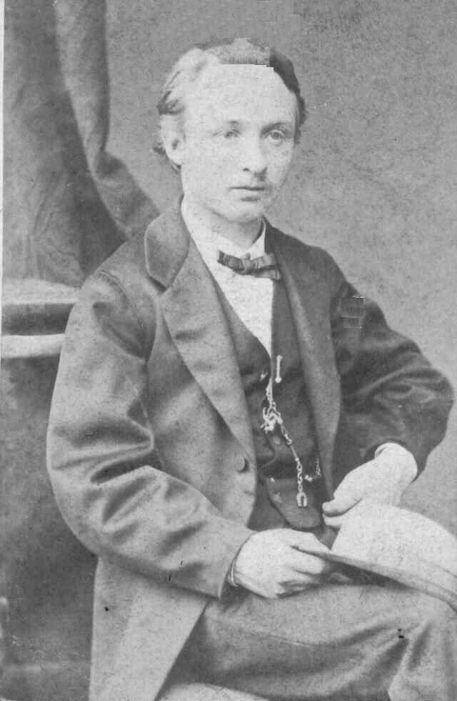

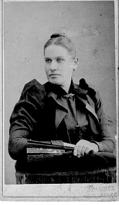

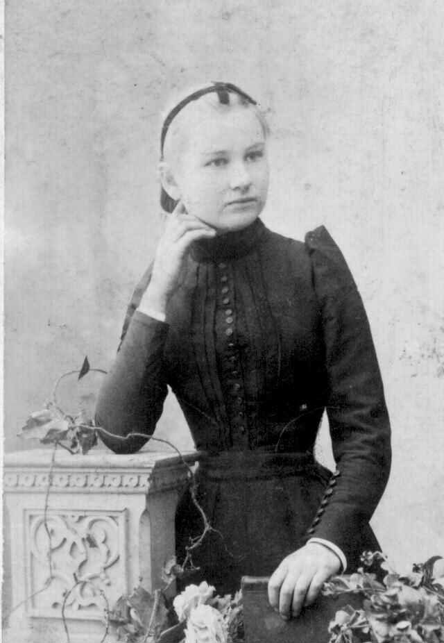

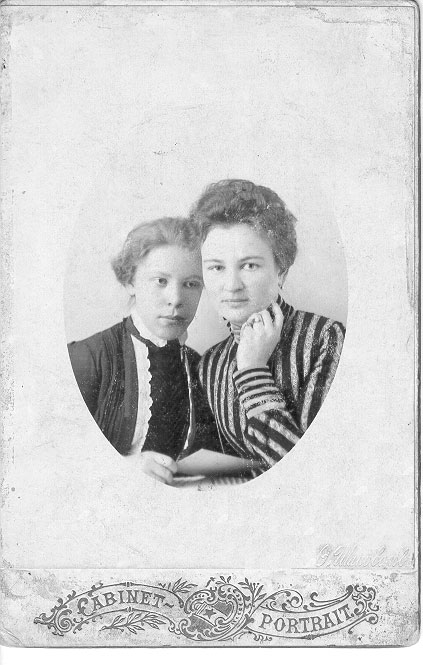

Saratow. Saratow. Oswald Irgang (1845-1882) Michalina Franzewna Vater meiner Mutter Lintschewskaja, Mutter meiner Mutter Saratow.

Saratow. Sophia Oswaldowna Irgang, Sophia Oswaldowna Irgang mit meine Mutter während Freundin, als sie als Grafikerin der Lehrjahre in der Zeit am in der RUSchD-Verwaltung arbeitete Gymnasium 1887, nach Abschluss der Grundschule, besuchte Mama das Mädchen-Gymnasium, das sie 1894 mit einer Goldmedaille beendete. Anschließend besuchte sie ein weiteres Jahr die achte, ergänzende pädagogische Klasse an demselben Gymnasium. Dort lernte sie Arithmetik, Pädagogik und Didaktik, übte sich in pädagogischer Praxis und stellte fest, dass sie äußerst erfolgreich war. Das gab ihr das Recht Arithmetik als Heimlehrerin zu unterrichten. Es ist charakteristisch, dass in der ihr ausgehändigten Bescheinigung stand, dass «... sie als Nicht-Staatsangehörige des Russischen Imperiums, die Vorteile und Privilegien des erworbenen Titels nicht nutzen darf».

Aus diesem oder einem anderen Grund suchte Mama sich nach dem Ende ihrer Ausbildung eine Arbeit als Grafikerin bei der Rjasan-Ural- Eisenbahn-Verwaltung. Dort lernte sie 1895 Adolf Fjodorowitsch Maier kennen, meinen Vater. Sieben Jahre waren sie miteinander befreundet. Aus dieser Zeit stammt Mamas Album. Ein gewöhnliches Mädchen-Album, in das ihre Freundinnen und Freunde für die Gastgeberin etwas in Form von Gedichten hineinschrieben. Fast die Hälfte der Gedichte ist in deutscher Sprache verfasst. Darunter sind drei, die mit dem Buchstaben «А» unterzeichnet wurden; sie sind dem Vater zuzuordnen, der in dieser Zeit um Mama geworben hat. Leider wurden die Verse in gotischer Schrift geschrieben, so dass ich sie nicht lesen und erst recht nicht übersetzen konnte. Zwei sehr traurige Gedichte mit philosophischem Unterton, die aus der Feder des englischen Poeten Shelley stammen, wurden mit Mamas kalligraphischer Handschrift ins Album eingetragen. Im Großen und Ganzen muss man anmerken, dass Mama sich in ausländischer und russischer Literatur sehr gut auskannte und zahlreiche Gedichte auswendig konnte, von denen ich einen Teil in meinen jungen Jahren von ihr lernte. Auch Papas Tagebuch lag seinerzeit in meinen Händen. Neben rein geschäftlichen Aufzeichnungen fand ich darin zu meiner Verwunderung auch viele recht pessimistische Verse, beispielsweise «Die Fliegen» von Apuchtin. Im Allgemeinen bevorzugte er, nach Mamas Worten, die deutsche Literatur und kannte sich darin auch recht gut aus.

In diesem Siebenjahres-Zeitraum, welcher dem Eheleben vorausging, gingen Mama und Papa häufig ins Theater oder Kino, zu Abend Vergnügungen im engsten Bekanntenkreis. Mama mochte sehr gern tanzen. Papa spielte lieber Schach. Welche Einstellung ihre Eltern gegenüber dieser Freundschaft hatten, ist mir nicht bekannt, aber wie Tante Mathilda berichtete, die ihren Bruder sehr liebte, versuchte sie auf alle nur erdenkliche Weise diese Freundschaft zu stören. Die beiden heirateten 1902, als Mama 28 Jahre alt war und Papa 35. Anfangs lebten sie in der Familie von Papas Verwandten in der Zarizynsker-Straße 50. Das Haus war überfüllt, und nur eine strenge Einhaltung der Ordnung bewahrte die Familie, insbesondere die jungen Leute, vor Streitigkeiten.

Karl war der erste, der sich anderswo niederließ. Nachdem er Maria Michailowna geheiratet hatte, kaufte er ein einstöckiges Haus in der Oktjabrskij-Straße N° 113, aus Holz gebaut und mit Nebengebäuden. Dort wurde 1903 Töchterchen Lenotschka geboren.

Bald darauf kaufte auch Papa mit Hilfe der Eltern ein Häuschen «in den Bergen» (in der Berg-Straße) im nordöstlichen Randbezirk von Saratow. Hier kam 1904 mein ältester Bruder Romuald – Romotschka, wie ihn die Eltern nannten, zur Welt und 1906 – Erna- Henrietta (in den deutschen Familien gab man den Kindern bei der Geburt zwei Namen; mit Eintritt der Volljährigkeit konnte der junge Mensch sich dann einen von beiden aussuchen).

Mama und Papa besuchten mit ihren kleinen Kindern Romotschka und Erna oft die Eltern in der Zarizynsker Straße 50. Wir besitzen noch eine Fotografie aus dem Jahr 1907, auf dem Papa, Mama, Romotschka und Ernotschka im Hause des Großvaters abgebildet sind. Michalina Franzewna besuchten sie nur selten, Papa mochte sie, seine Tante, nicht und ihr Verhältnis war angespannt.

Den Sommer verbrachten meine Eltern zusammen mit den Großeltern auf Onkel Karluschas Datsche, die im Bezirk des Eisenbahnzweigs Trofumowka gelegen war, etwa fünf Kilometer von der Stadt entfernt. Wir haben noch ein Foto davon. Auf der Terrasse – Großvater, Mama mit Romotschka, die Großmutter in einem Schaukelstuhl und Papa. Sechs Jahre später kauft er mit Onkel Karluscha im Bezirk Poliwanowka ein Grundstück und baut eine Datsche, die derjenigen ähnelt, die auf dem Foto abgebildet ist. Mit dieser Datsche und dem umliegenden Garten werden viele meiner Kindheitserinnerungen verbunden sein.

1908 ereilte die Eltern großes Unheil. Romotschka starb an einer eitrigen Blinddarmentzündung. Viel zu spät wurde die Erkrankung erkannt. Nach Mamas Erinnerungen war er ein wundervolles Kind, sehr gescheit und hübsch. Zu sehen bekam ich ihnen leider nicht, denn ich wurde erst 13 Jahre nach seinem Tod geboren. Deswegen ist er in meiner Erinnerung so verankert, wie ich ihn auf dem Foto gesehen habe, auf dem er wie schlafend in seinem Sorg liegt. In demselben Jahr verstarb auch Großmutter Dorothea.

Man begrub sie auf dem katholischen Friedhof, der zur linken Seite der Straße nach Moskau und und zwei Kilometer vom Bahnhof am östlichen Berghang gelegen war. Auf ihren Gräbern wurden Gedenksteine aus Marmor aufgestellt, der Friedhof selbst versank im Grün der weitverzweigten Bäume.

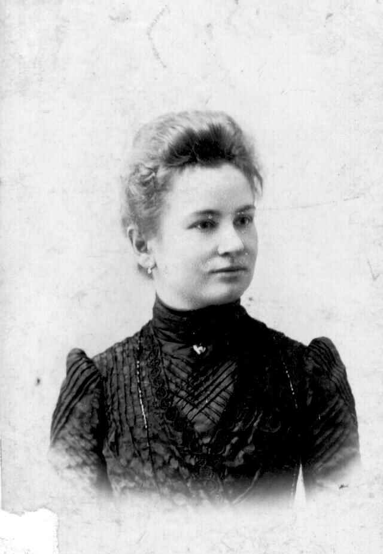

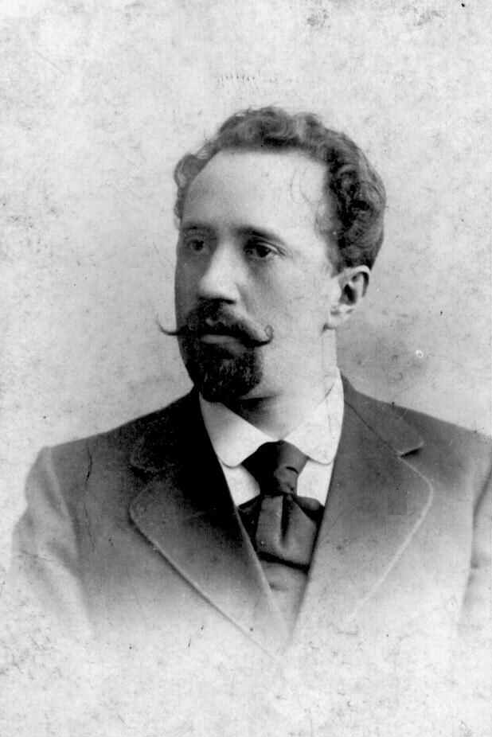

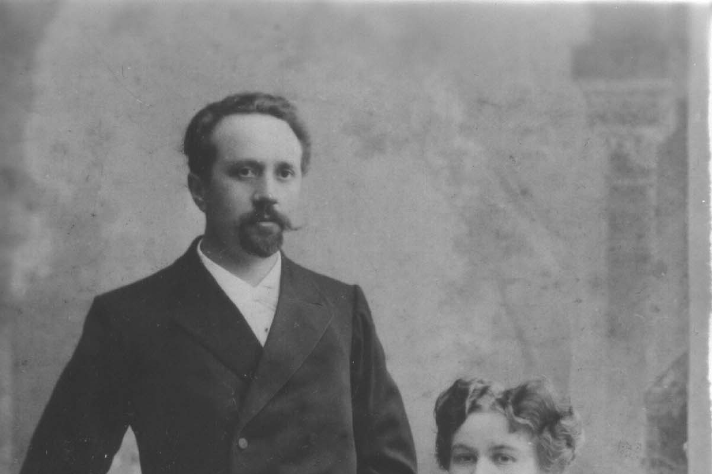

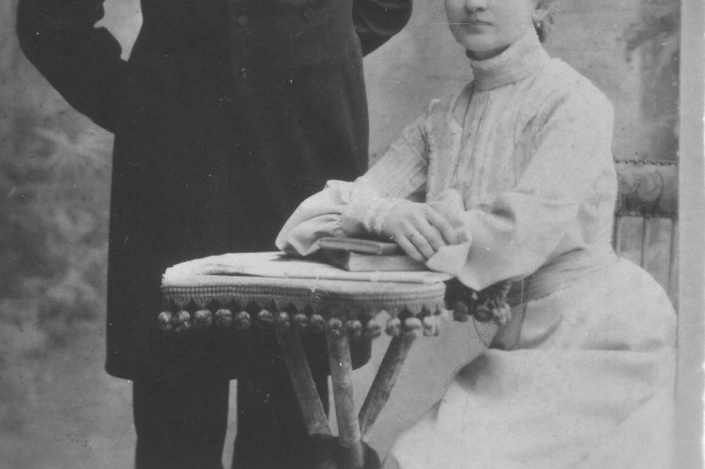

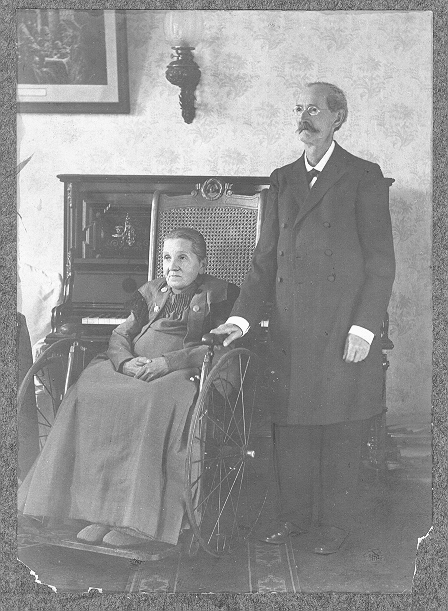

Saratorw, 1907 Saratow, 1902. Letztes Foto von Friedrich Sophia Oswaldowna und Adolf Fjodorowitsch Fjodorowitsch Maier am Tag ihrer Hochzeit und seiner Ehefrau Dorothea Saratow Saratow Adolf Fjodorowitsch Maier am Sophia Oswaldowna Irgang Tag der Eheschließung am Tag der Eheschließung

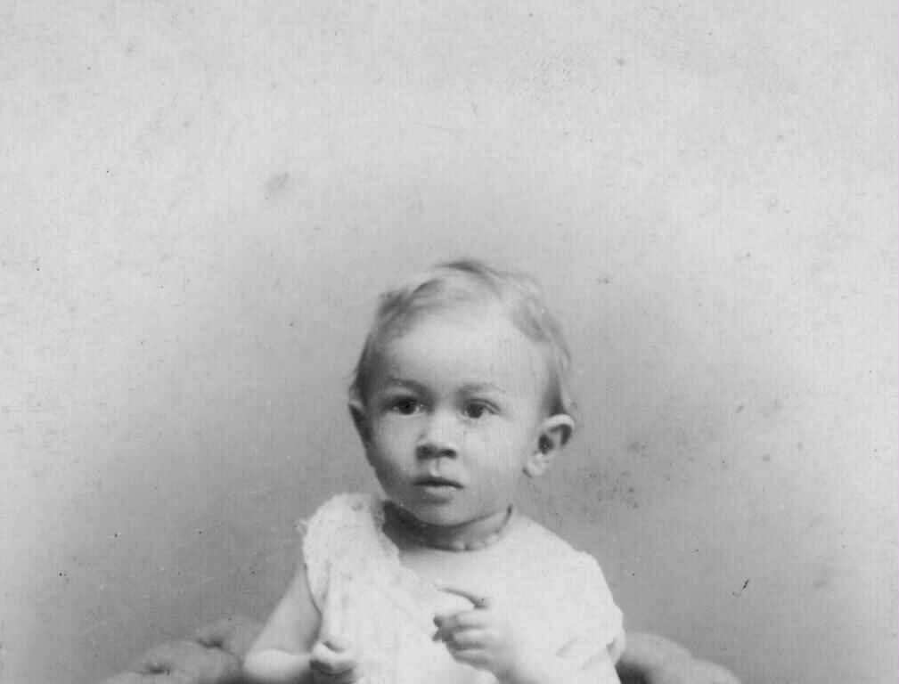

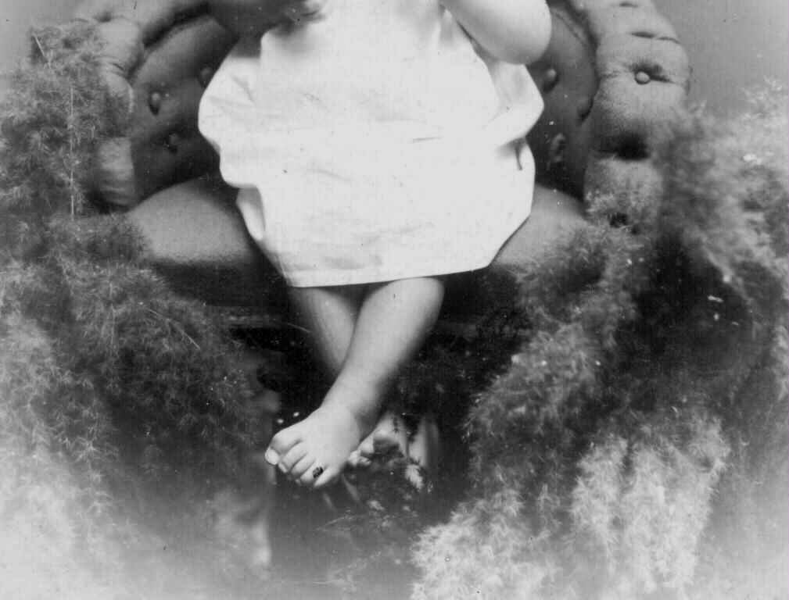

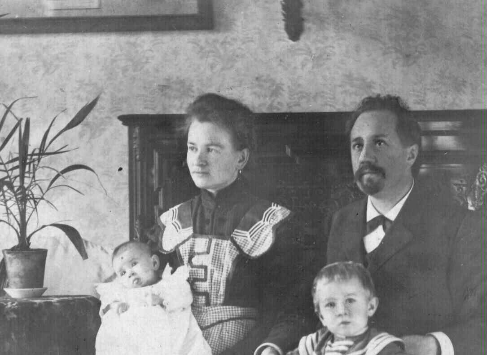

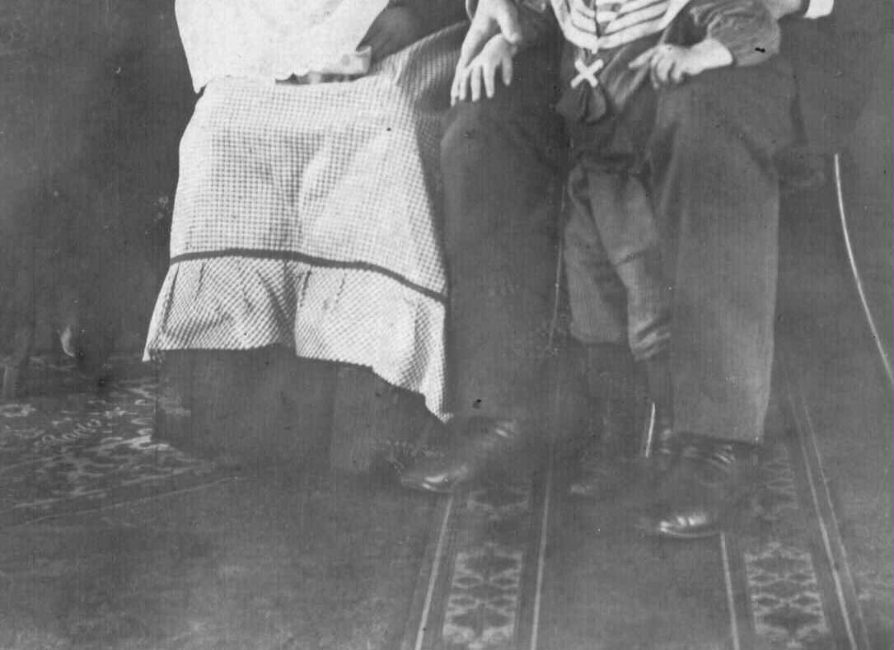

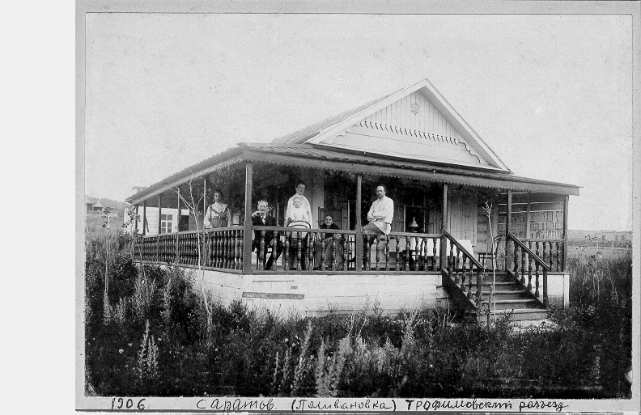

Saratow, 1905 Saratow, 1907 Mein älterer Bruder Auf Mamas Armen – Ernotschka Romuald – Romotschka Auf Papas Knien - Romotschka Saratow 1906 Diese Datsche fotografierten meine Eltern am Trofimowsker Bahnabzweiger.

Auf der Terrasse: Großvater, Mama und Romotschka, Großmutter im Schaukelstuhl, Papa.

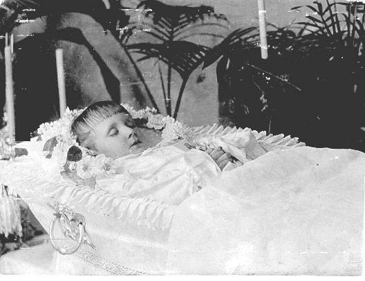

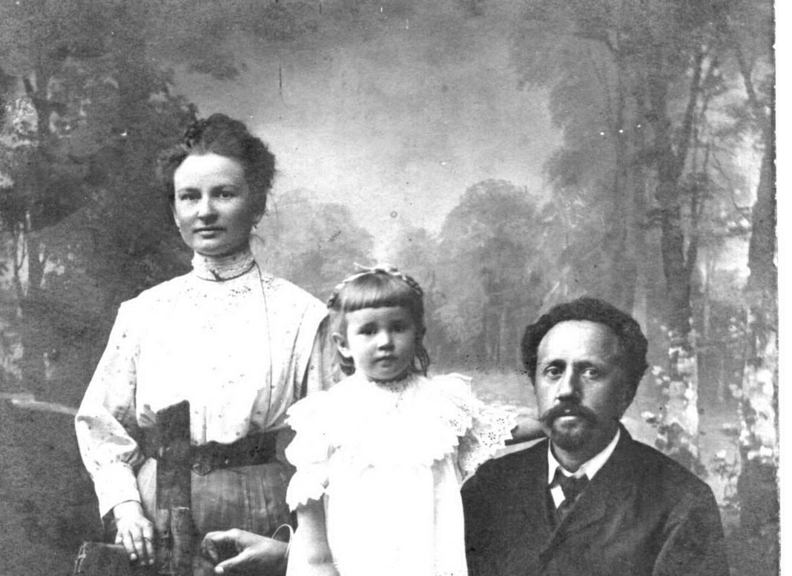

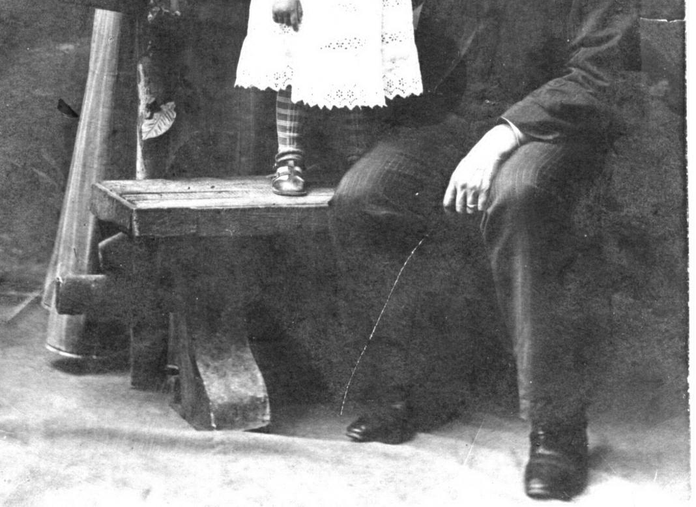

Saratow, 1908 Romotschka. Er starb im Sommeran einer eitrigen Blinddarmentzündung im Alter von vier Jahren.

Der Tod des Sohnes erschütterte die Eltern. Um aus ihrer Depression herauszukommen, reisten sie mit der dreijährigen Ernotschka für einige Zeit zu Onkel Robert nach Deutschland. Aus der Zeit gibt es noch ein Foro, auf dem Ernotschka zu sehen ist, wie sie zwischen Mama und Papa auf einer Bank steht. Später, besonders in der Stalin-Epoche, hängten die Eltern den Tatbestand über diese Reise nicht an die große Glocke und führten keinerlei Gespräche zu diesem Thema.

1910 starb der Großvater im Alter von 80 Jahren. Das Haus in der Zarizynsker Straße 50 und die Buchbinderei erbte der jüngste der Bruder – Friedrich Friedrichowitsch (Fjodor Fjodorowitsch) Maier.

In diesen Jahren erschien Otto in unserer Familie – ein kleiner Junge von vier Jahren, den seine vor Elend und Entbehrungen geflüchteten Eltern in Saratow zurückgelassen hatten.

Irgendwie erinnerte er meine Eltern an Romotschka. Otto wurde adoptiert und mit der Zeit sehr geliebt. Die Sorge um ihn half dabei, die Berlin, 1909 Mama, Papa und Ernotschka seelischen Wunden zu heilen. Fast drei Jahre lebte er bei uns. 1913 holten ihn völlig unerwartet die an die Wolga zurückgekehrten Eltern wieder zu sich. Alle weinten, und der arme Otto wehrte sich heftig, weil er seine Mutter nicht erkannte, und schrie: «Ich will nicht weg, ich habe schon eine Mama». Aber sie nahmen ihn mit sich fort. Und wieder blieb Ernotschka allein im Haus zurück.

Ob meine Eltern in ihrer Ehe glücklich waren – ich vermag es nicht zu sagen. Äußerlich schien alles gut zu sein. Papa trank und rauchte nicht, er war ein aufmerksamer und fürsorglicher Familienvater, er widmete seine gesamte Freizeit der Arbeit. Mama war eine interessante Frau, eine gute Hausfrau, sehr akkurat und fleißig. Ihre gesamte freie Zeit widmete sie den Kindern und dem Handarbeiten, in der sie sich meisterlich verstand. Zwischen ihnen, zumindest in Anwesenheit der Kinder, gab es nie Zank und Streit. Mehr noch, niemals hörten wir innerhalb der Familie auch nur ein einziges rohes Wort. Sie waren zutiefst gläubige Menschen. Doch das hinderte sie nicht daran viel zu lesen und ins Theater zu gehen. Papa machte Zuhause gymnastische Übungen nach dem System irgendeines Mannes namens Müller und rubbelte sich im Winter mit Schnee ab. Sehr viel Mühe wandten sie bei der Ernotschkas Erziehung auf.

Und dennoch war nicht alles so gut, wie es mir vorkam. Wie sich meine ältere Schwester Ernotschka erinnerte, fand sie Mama in jenen Jahren mehrmals weinend vor. Mama weinte lautlos, verbarg ihre Tränen vor den Kindern. Ich fand meine Mama immer sehr liebevoll und sanft. Aber aus Gesprächen mit meiner anderen Schwester Henrietta, die wir bis ins hohe Alter Lalja nannten, verstand ich, dass das keineswegs der Fall war. Nach ihren Worten war Mama ein recht kalter und verschlossener Mensch, die in gewisser Weise Merkmale ihrer Mutter geerbt hatte. Sanftmütig und sogar sentimental hingegen war unser Vater. Sie hatte freilich einen besseren Blick dafür, denn schließlich war sie fünf Jahre älter als ich und hatte mehr Umgang mit den Eltern. In meinen Erinnerungen habe ich sie beide als sehr liebe Menschen behalten.

1912 kaufte mein Vater gemeinsam mit Onkel Karluscha, als Angestellte der RUSchD im Bezirk der kleinen Eisenbahnstation «Poliwanowka» zu vergünstigten Bedingungen ein Grundstück mit einer Fläche von 0,8 Desjatinen. Sie bepflanzten das Grundstück mit Bäumen, die ein paar Jahre später einen lebenden Zaun mit einer Breite von ungefähr fünf Metern gebildet hatten. Dort wuchsen Ahorne, Ulmen, Eichen und irgendein Dornenbusch. Das Grundstück befand sich in einem endlosen Meer von Getreidefeldern, und von außen schien es so, als sei dies kein Garten, sondern ein kleines Wäldchen. Von innen war es, wie den Garten besuchende Verwandte und Bekannte sagten, ein «irdisches Paradies». Als Weg in diesem «Paradies» diente

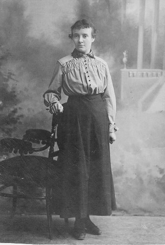

eine Allee, die mit unterschiedlichen Fliedersorten bepflanzt war. Im Zentrum des Gartens war eine Datsche mit drei Zimmern und einer sie umgebenden Terrasse angelegt. Separat befanden sich die Küche, das Bad, ein Winterquartier für Bienen, eine Gartenlaube und ein Brunnen. Vor der Datsche war ein Blumengarten angelegt, hier wuchsen Kastanien und zwei Silbertannen. Und drum herum ein Obstgarten. Das Grundstück, das ein leichtes Gefälle aufwies, war unterteilt in horizontal angeordnete Streifen – Terrassen. Der obere Teil war für das Bienenhaus reserviert (etwa 20 Bienenstöcke). Etwas weiter unten wuchsen auf einem Streifen Bäume mit verschiedenen Birnensorten. Noch weiter unten – eine Reihe Apfelbäume: Weißer Klarapfel, Weißer Astrachaner, Gruschowka, Gestreifter Zimtapfel, Pepin, Skrischapel und viele andere, für diese Gegenden üblichen Apfelsorten. Dieses Apfelmassiv wurde von einem Streifen verschiedener Johannisbeer- und Stachelbeersträucher durchkreuzt. Im unteren Teil des Gartens wuchsen Kirsch- und Pflaumenbäume. Vollendet wurde das alles durch Himbeerbüsche. Einer der Seitenteile des Gartens war als Weinberg angelegt. Hier gab es Tafeltrauben und die Sorte „Damenfinger“. Die Reben wurden für den Winter auf den Boden herabgelassen, mit Matten bedeckt und mit Sägemehl bestreut. Den Garten durchkreuzten Wege, die mit gelbem Sand bestreut waren. Sie endeten jeweils mit Bänken, welche mit gelber, roter und blauer Farbe gestrichen waren. Entlang der Wege wuchsen Blumen.

Selbstverständlich entstand das alles nicht mit einem Mal. Für den Bau der Datsche, das Pflanzen der Bäume und ihrer Pflege verstrichen mindestens zehn Jahre schwerer Arbeit.

Eine große, aufrichtige und fast einzige Helferin bei der Arbeit im Haus und auf der Datsche war Jelisaweta (Elisabeth) Davidown Rosenberg, Lisa, wie wir sie alle nannten. Geboren wurde sie 1885 in Katharinenstadt. Als sehr junges Mädchen verliebte sie sich in einen jungen Mann aus dem Nachbardorf und wollte mit ihm und seiner Familie in die USA emigrieren. Doch Lisas Eltern gaben ihr Einverständnis zu dieser Ehe und der damit verbundenen Ausreise nach Amerika nicht. Damals lief sie aus dem Dorf fort und kam in die Pokrowsker Siedlung, Saratow und später auf Empfehlung des Paters in Saratow Jelisaweta (Elisabeth) in unsere Familie, wo sie für immer blieb. Sie Davidowna Rosenberg - Lisa

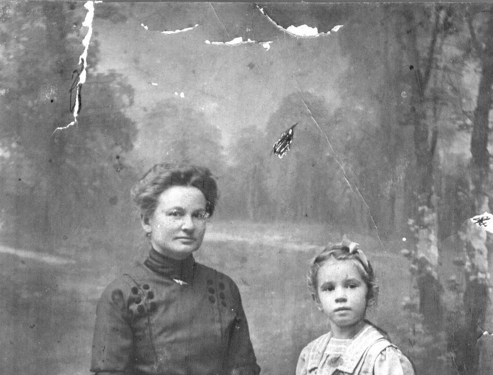

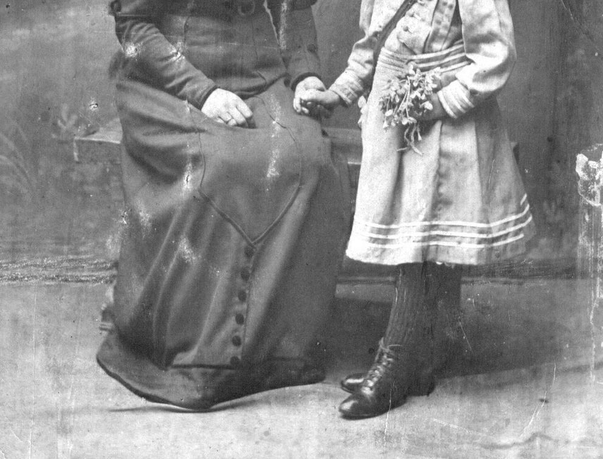

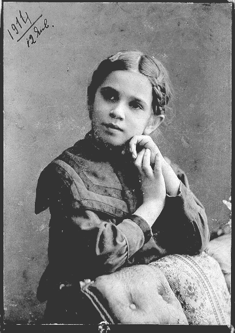

führte bei uns den Haushalt und kümmerte sich um die Kinder. Es fällt schwer, sie als Haushälterin oder Gouvernante zu bezeichnen. In vielen Fällen verhielt sie sich sehr selbständig und unabhängig. Meine Eltern mischten sich nur bisweilen in ihre Angelegenheiten ein. Für uns alle – die Kinder – war sie einer der uns am meisten nahestehenden Menschen. Mit ihr besprachen wir oft viele unserer Probleme. Auf der hier gezeigten Fotografie ist Lisa im Alter von 28 Jahren abgebildet.

Unsere Familie führte in diesen Jahren ein abgeschiedenes Leben. Lediglich drei-viermal im Jahr gab es eine Art Abendgesellschaft, zur der neben unmittelbaren Verwandten und ihren Kindern noch ungefähr sechs Personen aus der nächsten Bekanntschaft kamen. Nach Ansicht von Tante Mathilda wurden derartige Begegnungen weniger zum bloßen Vergnügen, als vielmehr wegen der Kontakte unter den jungen Leuten veranstaltet.

Als der Vater sich seinem fünfzigsten Lebensjahr näherte, tauchten in seinem Charakter neue Merkmale auf; nach Tante Mathildas Aussagen wurde er sehr misstrauisch, las medizinische Bücher und entdeckte bei sich zahlreiche Anzeichen Berlin 1914 Berlin 1914 Mama und Ernotschka Ernotschka, hier 8 Jahre alt irgendwelcher Krankheiten. Gequält von Zweifeln beschloss er zur Untersuchung und Behandlung nach Deutschland zu fahren. Seine Entscheidung konnte erst 1914 realisiert werden. Mama und Papa ließen sich mit der achtjährigen Ernotschka in Ketenbrode, einem Vorort von Dresden, nieder, wo zu der Zeit Onkel Robert mit seinen Söhnen wohnte. Aus der Zeit stammen noch zwei Fotografien. Das eine zeigt Ernotschka - mit Mama, das andere – sie allein, ganz wie eine Große.

Tagelang schlenderten sie durch und Parkanlagen Dresdens, abends teilten sie ihre Erinnerungen mit den Hausherren. Papa ging zur Therapie, allerdings konnte er die Behandlung nicht beenden. Im Sommer 1914, mit Beginn des ersten Weltkriegs, musste er in aller Eile nach Hause zurückkehren. Die Landesgrenzen mit Russland waren geschlossen. Den Rückweg musste er über die Ostsee antreten, so dass er in gewisser Weise die Reise seiner fernen Vorfahren wiederholte. Trotz aller Schwierigkeiten trafen die Eltern wohlbehalten wieder zu Hause ein. Im Zusammenhang mit dieser Reise erinnert Mama sich, dass alle Rückkehrer gezwungen wurden, ein Schriftstück darüber zu verfassen, dass Deutschland in Chaos und Panik verfallen und auf einen großen Krieg mitnichten vorbereitet sei. Allerdings weigerte Papa sich, derartige Angaben zu machen, woraufhin er trotz seiner vielen, tadellosen Dienstjahre degradiert wurde.

In diesen ersten Jahrzehnten des 20. Jahrhunderts verschlechterte sich die Haltung gegenüber den deutschen Umsiedlern in Russland noch mehr. Den Anlass dafür gab explizit oder implizit die Stolypinsche Agrar-Reform 1906-1916, deren Hauptziel die Schaffung einer starken Schicht gesunder Bauernhöfe war, auf die sich die Staatsmacht stützen konnte. Entsprechend der Reform war es jedem Herrn erlaubt, sich vom Gemeinwesen abzusondern und sein eigenes Stück Land zu erhalten. Die in der Gemeinde praktizierte systematische Umverteilung von Landstücken, bei denen es keinen Sinn machte, den Boden zu kultivieren, wurde eingestellt. Die Böden, die Eigentum des Bauern waren, wurden sorgsamer und kultivierter bearbeitet und brachten bessere Erträge. Zugleich führte die Reform zu einer Polarisierung der Kräfte im Dorf: reiche Bauern wurden noch reicher, arme noch ärmer. Unter den Kolonisten verlief dieser Prozess besonders schnell. Der Boden wurde in Abschnitte unterteilt und wurde Eigentum der Hofinhaber. Diejenigen mit wenig Land zogen aus, um ihr Glück woanders zu suchen: ein Teil migrierte ins Ausland, nach Amerika, ein Teil ließ sich innerhalb Russlands nieder: im Kaukasus, in Sibirien und Mittel-Asien. Die Mehrheit der Umsiedler kam nach einigen schwierigen Jahren gut zurecht. Allerdings kehrte manch einer wieder an die Wolga zurück, und sie hatten es in der Regel sehr schwer. Insgesamt gesehen wurden die Wolga-Ländereien besser bearbeitet und die Ernteerträge stiegen.

Ein Teil der besonders reich gewordenen Kolonisten, die zu der Zeit einen bemerkenswerten Reichtum angesammelt hatten, kauften Land von abgewirtschafteten Landbesitzern auf. Das ging so weit, dass sie im Kamyschinsker sowie in anderen Landkreisen beinahe die Hälfte des Ackerlandes in ihren Besitz brachten. Die reichsten unter ihnen, die Eigentümer großer Mühlen waren – Reinike, Borel, Dumler, Schmidt – waren faktisch Monopolisten der Mühlenindustrie im Wolgagebiet, eines der getreidereichsten Territorien Russlands. Sie wurden auch Eigentümer vieler der bekanntesten Geschäfte von Saratow. Infolgedessen begann unter den Russen an der Wolga, und nicht nur an der Wolga, die Unzufriedenheit gegen die Politik der Regierung in Bezug auf die Kolonisten zu reifen. Die russische Bauernschaft besaß schon selbst nicht genug freie Ländereien und besonders die Großbauern. Neidisch blickte sie auf die Kolonisten, die sich auf den Ländereien Süd-Russlands und an der Unteren Wolga niedergelassen hatten.

Während des ersten Weltkriegs befand sich die Haltung gegenüber «unseren» – denn Russland-Deutschen in Russland am Rande der Feindschaft: die einen sahen in ihnen Kapitalisten und Ausbeuter, den anderen stellten sie sich als innere Feinde, als Komplizen Deutschlands, dar. Im Volk sprach man von der «deutschen Vorherrschaft». Die öffentliche Meinung übte Druck auf den Beschluss der Regierung aus, die bereit war, die Deutschen aus dem Wolgagebiet nach Sibirien auszusiedeln. Lediglich die Februar-Revolution verhinderte die Verwirklichung entsprechender Gesetzesprojekte. Kerenskis provisorische Regierung stoppte die Umsetzung dieser Gesetze und die Oktoberrevolution schaffte sie ab.

Unter diesen schwierigen Bedingungen begann unsere Familie ein noch mehr zurückgezogenes und vorsichtigeres Leben zu führen. Das Hauptaugenmerk richtete sich, neben den Sorgen materieller Art, auf die Erziehung der einzigen Tochter. Im Alter von sechs Jahren ging Ernotschka zum Unterricht bei einer Privatlehrerin, wo sie vier Jahr lang das Klavierspielen lernte. Gleichzeitig gab es auch Hauslehrer für Sprachunterricht und allgemeine Fächer. Zu der Zeit besuchte sie auch die Schule von Pater Fleck bei der katholischen Kirche, wo Mama in diesen Jahren Handarbeitsunterricht erteilte. In dieser Schule wurden Mädchen aus wohlhabenden katholischen Familien auf den Eintritt ins Mädchengymnasium vorbereitet. An einem dieser Gymnasien (das private Chramzowa-Gymnasium) begann Ernotschka 1915 den Unterricht zu besuchen. Trotz der großen schulischen Belastungen am Gymnasium, setzte Ernotschka den privaten Musikunterricht beim Professor des Saratower Konservatoriums, Boris Jakowlewitsch Radugin, fort. Dreimal die Woche ging das zehnjährige Mädchen zu ihm. Jedes Mal nahm die Mutter, die sie begleitete, ein Körbchen mit Äpfeln oder einen wunderbaren Strauß Blumen mit, die so zahlreiche auf unserer Datsche wuchsen.

1915 wurden meine Eltern Besitzer des Hauses № 173 in ihrer vertrauten Zarizynsker Straße (jetzt Pjerwomaiskaja 151), wo ihre Kindheit und Jugend verlaufen war. Es bestand aus zwei einstöckigen Holzhäusern, von denen eines mit der Fassade zur Straße zeigte (sie vermieteten es), während das andere, aus Ziegelsteinen gemauert, im Hof stand. In diesem Flügel ließ sich auch unsere Familie nieder. Es

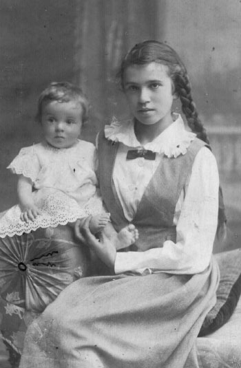

gab darin vier Zimmer (ein Schlafzimmer für die Eltern, ein Kinderzimmer, Esszimmer und Gästezimmer), außerdem eine Küche, ein Bad und eine Toilette.– брандмауэром. Auf der Rückseite war der Flügel von den Gebäuden, die zur anderen Straße zeigten, durch eine hohe Ziegelmauer eingegrenzt (die Brandmauer).

Saratow 1918 Ernotschka und Lalja (Henrietta)

Aus diesem Grund befanden sich im Esszimmer keine gewöhnlichen Fenster. Stattdessen gab es in der Decke – eine große gläserne Installation in der Form einer abgestumpften Pyramide, die dem Vater eine Menge Verdruss bereitete, vor allem im Winter. Gerade mit diesem Ort in Saratow sind bei unseren Familienmitgliedern alle Erinnerungen an Freud und Leid verbunden. In diesem Haus wurde 1917 meine zweite Schwester Henriette-Charlotta (Lalja, wie sie innerhalb der Familie genannt wurde) geboren. Auf dem hier vorliegenden Foto ist Lalja eineinhalb Jahre alt, und Ernotschka, auf deren Schoß sie sitzt – zwölf.

Unterdessen reiften in unserem Land die revolutionären Ereignisse heran, die auch unsere Familie berührten und selbstverständlich im Kreise der dem Vater nahestehenden Menschen diskutiert wurden. Gegenüber den Geschehnissen, die im Zusammenhang mit der bürgerlich-demokratischen Februar-Revolution und besonders mit der Abdankung des Imperators Nikolai II standen, zeigte der Vater, gelinde gesagt, große Missbilligung. Er war der Politik und noch mehr den aktiven politischen Tätigkeiten stets aus dem Weg gegangen. Das Wichtigste in seinem Leben waren die Familie und die Arbeit. Darüber hinaus nahm die Pflege des Gartens den Löwenanteil seiner freien Zeit in Anspruch. Alles, was zu Chaos und Anarchie führte, und die im Land ablaufenden Ereignisse verstand er als Zerstörung sämtlicher Lebensgrundlagen, war ihm zutiefst befremdlich. Man muss auch berücksichtigen, dass unsere Familie zu denen mit mittlerem Einkommen gehörte, und die kommenden Veränderungen, zu denen die zahlreichen Losungen aufriefen, verhießen meinem Vater nichts Gutes. Auch seine tiefe Religiosität machte sich bemerkbar.

Doch das Leben entwickelte sich entgegen seiner Wünsche. Gen Oktober entstand in Saratow, wie im Übrigen im gesamten Land, eine äußerst angespannte Lage. Die wirtschaftliche Misere, die ständigen Unterbrechungen bei der Versorgung, aber auch die Verschlechterung aller städtischen Dienstleistungen gaben zu keinerlei Hoffnung auf Besserung Anlass. In den Straßen war es entsetzlich schmutzig. Sie wurden nicht nur nicht gefegt, man warf sogar den Müll aus den Häusern und kippte dort das Spülwasser aus. Die Fälle von Typhus-Erkrankungen wurden häufiger. Plünderungen und Gewalttätigen waren gang und gäbe. Es gab Fälle von Selbstjustiz. Mit jedem Tag wuchs die Zahl der Hungernden und der Spekulanten. Die Arbeitslosigkeit nahm aufgrund des Defizits an Brenn- und allen anderen Arten von Rohstoffen sowie deiner teilweisen Demobilisierung zu. Es kam zu Streiks. Das Ganze ging so weit, dass die Anzünder der Straßenlaternen zur damaligen Zeit gab es einen solchen Beruf) in den Ausstand traten und Saratow abends in tiefe Dunkelheit getaucht war.

Die Zahl der Soldaten in der Stadt stieg jäh an. Die Übermüdeten, Abgezogenen, die weder die militärische noch die bürgerliche Macht anerkannten, forderten unverzüglich ihre Umsiedlung aus den nicht für den Winter vorbereiteten Baracken der «Soldaten-Siedlung» in zivile Gebäude der Stadt Saratow.

Bereits seit mehreren Monaten war in der Stadt nun schon ein scharfer politischer Kampf zwischen den Saratowsker Bolschewiken und den moderaten Sozialisten und Liberalen im Gange. Organisatorischer Rivale der Bolschewiken, die den Saratowsker Rat leiteten, war die Stadt-Duma. Einige Tage nach der Erstürmung des Winterpalasts durch die Bolschewiken blieb es in Saratow verhältnismäßig ruhig. Doch bereits am Morgen des 26. Oktober begannen sowohl die Bolschewiken als auch die Sozialisten mit hektischen Vorbereitungen. Dennoch bemühten sich beide Seiten Zeit zu schinden: die Bolschewiken warteten auf eine Direktive aus dem Zentralkomitee; die Moderaten setzten ihre Hoffnung auf die baldige Befreiung der Stadt durch Kosakentruppen. Niemand wusste, wie der Aufstand in Petrograd ausgegangen war. Im Verlauf des frühen Morgens des 26. Oktober führten die bolschewistischen Agitatoren Agitationsarbeit in den Fabriken und Kasernen durch, wo sie versuchten, die Soldaten dahingehend zu überzeugen, dass diese sich nur den Befehlen des Rats unterordneten. Es gab keinerlei Aufforderungen zum Handeln oder Bemühungen, eine Demonstration zu veranstalten.

Die gemäßigten Soldaten waren während dieser Zeit ebenfalls beschäftigt. Im Büro des Gouvernements-Kommissars, das sich zusammen mit dem Exekutivkomitee des Rats im Haus des ehemaligen Gouverneurs befand, herrschte Aufregung. Dort waren Mitglieder der Duma, die Stadtführung, der Kommissar der Miliz und gut bewaffnete Offiziere bemüht, sich die Abwesenheit der bolschewistischen Kader im Offiziersblock bestmöglich zunutze zu machen.

Auf der an jenem Abend stattfindenden Plenumssitzung des Rats, der in den Räumlichkeiten des Konservatoriums stattfand, wurde der Beschluss über die Schaffung eines Kriegs-Revolutions-Komitees verabschiedet, das im Namen des Saratowsker Rats die Übernahme der Macht in seine Hände verkündete.

Die Bürger, die am Morgen des 27. Oktober auf die Straßen hinaustraten, waren verwirrt von den Nachrichten, mit denen sie überrannt wurden. Durch die Hauptstraßen der Stadt fuhren Automobile, aus denen Flugblätter mit widersprüchlichen und sich weitgehend ausschließenden Informationen geworfen wurden.

Beide Seiten begannen mit den Vorbereitungen für den bewaffneten Kampf, falls es dazu kommen würde. Die mit Maschinengewehren bewaffneten Streitkräfte der Duma ließen sich auf den Glockentürmen der Kirche des Heiligen Erzengels Michael nieder. Gegen Abend konfiszierte ein Trupp von Junkern das Waffenlager und begann ein Waffenlager innerhalb des Duma-Gebäudes anzulegen. Die Junker entwaffneten die Arbeiter und Soldaten und verhafteten die Rats-Anhänger. Der Gouvernements-Kommissar der provisorischen Regierung rief zum Schutz der Duma Kosaken zur Hilfe.

Am frühen Morgen des 28. Oktober umstellten auf Anordnung des Rats etwa 3000 Soldaten und Rotarmisten das verbarrikadierte Dima-Gebäude. Auf dem Sokolow-Berg und neben der Handelsbörse in der Moskowsker Straße hatte sich die Artillerie niedergelassen und zielte auf das Gebäude der Duma. Die Duma wurde von 300 Offiziersschülern, etwa 100 Offizieren und mehreren hundert privaten Bürgern verteidigt. Verhandlungsversuche waren nicht von Erfolg gekrönt. Es begann ein Schusswechsel, der mal abflaute, mal sich verstärkte, dauerte die ganze Nacht an. Auch die Artillerie feuerte. Die Bewohner versteckten sich in den Kellern. Und draußen regnete es in Strömen.

Gegen Abend ergaben sich die Verteidiger der Duma der Gnade der Sieger. Es waren 373 Mann, unter ihnen 298 Junker und 75 Offiziere, einschließlich General Gorskij, der an der Spitze der Garnison stand. In jener ersten Nacht kamen zwei der belagernden Soldaten ums Leben und einer der Duma-Verteidiger. Mehrere Personen waren verwundet worden. In Saratow waren es die ersten Schüsse des beginnenden Bürgerkriegs.

Als man die Gefangenen aus dem Duma-Gebäude ins ehemalige Haus des Gouverneurs brachte, wo sie festgehalten werden sollten, begleitete die zusammengeströmte Menge sie mit feindlichen Ausrufen: «Mörder!», «Man soll sie alle erschießen!», «In die Wolga mit ihnen!». Dann stürzte sich die Menge auf die Verhafteten und begann sie zu verprügeln. Auch General Gorskij bekam seinen Teil ab, den auch sein fortgeschrittenes Alter nicht vor dieser Erniedrigung bewahrte.

In den Dörfern zog sich der Kampf um die Bestätigung der Macht der Räte bis in den Sommer 1918 hin. Freilich wirkte der wohlhabende Teil der Kolonisten diesem Prozess am aktivsten entgegen, denn sie hatten Dank der Stolypin-Reform die Möglichkeit einer rationalen Hofführung und die Vergrößerung ihrer Wirtschaften bekommen. Dieser Teil der Kolonisten proklamierte auf seiner Tagung in Warenburg die «sowjetische» (ohne sozialistische) Autonomie und wählte eine Zentralen Rat. In dieser Zeit führte die dem entgegenstehende Union der deutschen Sozialisten Verhandlungen mit Stalin, der innerhalb der Regierung für die nationale Politik verantwortlich war. Die Unterredungen endeten mit der Veröffentlichung der Satzung des Kommissariats für die Sozialisten-Vereinigung. Im Juni 1918 fand in Saratow der 1. Räte-Kongress der deutschen Kolonien statt. Auf dem 2. Kongress der Deutschen Räte in Rowno (Oktober 1918) wurde das Dekret über die Proklamation der Autonomen Arbeitskommune im Gebiet der Wolgadeutschen bekannt gegeben. Dies war der erste Test für die praktische Umsetzung des nationalen Programms der Sowjets. Das Dekret wurde unterzeichnet von W.I. Lenin und Fotijewa. Als Zentrum des deutschen nationalen Gebiets wurde die Stadt Jekaterinenstadt ernannt. So entstand das erste nationale Gebilde dieser Art unter sowjetischer Herrschaft.

Doch dies führte nicht zu einer Versöhnung. Der Klassenkampf in den Kolonien wurde immer erbitterter. Der grimmige Zorn des Bürgerkriegs zerstörte die menschlichen Leben und die mit viel Mühe von ihnen geschaffenen materiellen Werte. Die Kolonien waren verwüstet. Es wütete das Bandenwesen. Die Verzweiflung verstärkte sich noch durch den Hunger. Der wohlhabendere Teil der Kolonisten, der es sich zunutze machte, dass es im Vertrag von Brest-Litowsk einen Punkt über die ungehinderte Ausreise der Kolonisten nach Deutschland sowie die Überweisung ihres Kapitals gab, gingen nach Deutschland und in die USA. In dieser Zeit emigrierte mehr als die Hälfte der Gesamtbevölkerung der Kolonien. Über eine in Berlin gegründete Bank überwiesen die Kolonisten innerhalb kürzester Zeit 10 Millionen Rubel ins Ausland.

Am 25. Oktober 1918 übermittelte Trotzkij per Telegraph den Befehl nach Saratow: das Erste Kommunistische Katharinenstädter Regiment zu formieren. Es war ein Akt des erzwungenen, berechnenden Vertrauens. Er bewährte sich. Bereits am 10. Dezember war das Regiment, das 2000 Bajonette zählte, bereit zu Verschickung in die von den Deutschen besetzte Ukraine. Das Regiment kämpfte gegen die deutsche Armee und russische Offizierstruppen. Im Sommer 1919 hielt es innerhalb von 32 Tagen 30 Schlachten stand, und verlor, nachdem es von den übrigen Truppenteilen der Roten Armee abgeschnitten worden war, zwei Drittel seiner Soldaten. Insgesamt kämpften an den Fronten des Bürgerkriegs vier deutsche Regimenter, zwei von ihnen – in Budjonnys Armee. 1919 wurden die am rechten Wolga-Ufer gelegenen Kolonien von Denikin-Leuten und Banditen Saposchko

### Kapitel 3. Kindheit

Es kam das Jahr 1920. Der Bürgerkrieg war im Wesentlichen beendet, doch die Lage im Land gestaltete sich sehr schwierig. Der Weltkrieg, die Revolution, der Bürgerkrieg und schließlich die Politik des «Kriegskommunismus» hatten sie zugrunde gerichtet. Eine abgrundtiefe Krise erfasste alle Seiten des öffentlichen Lebens, der Industrieь, der Landwirtschaft.

Die Nahrungsmittel-Politik, mit deren Hilfe vom Lande gewaltsam mehr als 300 Millionen Pud Nahrungsmittel herausgepumpt worden waren, führte zu einer allgemeinen Kürzung der Anbauflächen, einem Rücklauf der Viehzucht, der Einstellung der Aussaat von Industriepflanzen. Besonders schwerwiegend war die Situation an der Unteren Wolga. Die Anbauflächen schrumpften in zwei aufeinanderfolgenden Jahren fast um ein Drittel, die Anzahl der Pferde – um mehr als die Hälfte, beim Rindvieh um ein Drittel, bei Ziegen, Schafen und Schweinen – um ein Fünftel. Ungeachtet dieser Tatsache wurden in den Jahren 1918 und 1919 aus dem Gebiet der Wolgadeutschen 30 Millionen Pud Nahrungsmittel abtransportiert.

Zu diesem Unheil gesellte sich 1921 die Dürre, welche die Getreidebezirke der Ukraine, des Kaukasus, der Krim, der Ural-Regionen und des Wolgagebiets heimsuchte. Infolgedessen litten 1921-22 etwa 40 Gouvernements mit einer 90-Millionen-Bevölkerung an Hunger, von denen 40 Millionen Menschen an den Abgrund des Todes gerieten. 5 Millionen starben. In den Städten wurden die Lebensmittel in Form von Rationen verteilt, vor allem unter den Arbeitern. Die Rationen waren winzig und es war praktisch unmöglich davon zu leben. In Moskau beispielsweise erhielten Arbeiter, die körperliche Tätigkeiten ausübten, laut Berechnungen 225 Gramm Brot, 7 Gramm Fleisch oder Fisch, 10 Gramm Zucker pro Tag. Die Lebensmittel auf dem Markt waren kaum zugänglich. Die Preise waren im Vergleich zu den Vorkriegspreisen um das 100-200-Fache gestiegen. Die Hausfrauen mussten zum Markt oder Laden mehrere Millionen mitnehmen, um die für den Mittagstisch notwendigen Lebensmittel kaufen zu können. Das Einkommen reichte für 3-5 solcher Einkaufsgänge. Und wieder herrschte an der Wolga Dürre, und die Folgen nahmen katastrophale Ausmaße und Formen an. Von einer ganzen Desjatine Land erntete man lediglich 5,5 Pud Weizen oder 2,4 Pud Roggen, bei einer für diese Orte üblichen Norm von 40 Pud. Doch auch in diesem absoluten Notjahr wurden aufgrund der Ablieferungspflicht 7 Millionen Pud Getreide abtransportiert. Von vielen Höfen holten sie die kompletten Ernteerträge fort, ohne auch nur ein Saatkörnchen wenigstens für die nächste Aussaat dort zu lassen.

Infolgedessen brach 1921 im Wolgagebiet eine schreckliche Hungersnot aus. Beinahe 48000 Kolonisten starben. Mehr als 80000 flohen in andere Bezirke des Landes und, insbesondere, in den Kaukasus. Doch dort nahm man sie nicht auf. Die meisten mussten wieder zurückgehen. Halb verhungert und ohne Kleidung blieben auf diese Weise viele von ihnen auf den endlosen Straßen Russlands zurück. Die Bevölkerung des Gebiets sank von 452000 Personen im Jahr 1920 auf 359000 zum August des Jahres 1921. Die überwiegende Mehrheit litt an schrecklichem Hunger. Massen von Flüchtlingen, Bettlern und obdachlosen Russen, Deutschen, Ukrainern und Zigeunern überfluteten die Bahnhöfe, die Anlegestellen und Märkte Saratows. Die unglücklichen Kolonisten, die kein Russisch konnten und sich ihrer Armut schämten, klopften ängstlich en die Türen ihrer Landsleute, die in der Regel selbst nur mit Mühe ihr Leben fristen konnten. Durch die Stadt fuhren Sonderbrigaden, welche an den Bahnhöfen, Anlegestellen, Parkanlagen und Straßen die Körper der Toten einsammelten. Sie wurden in eine Matte gewickelt und auf Fuhrwerken in unbekannte Richtung fortgebracht. In jenem Jahr wurde unsere Familie hauptsächlich durch das Gemüse und die Früchte aus dem Garten gerettet, aber auch durch Ziegenmilch. Die Ziegen, für gewöhnlich zwei an der Zahl, hatte sie schon lange gehalten, seit Romotschkas Geburt, denn Mama hatte keine Milch, und alle Kinder in der Familie wuchsen mit Ziegenmilch auf.

Im Dezember dieses für die Wolgadeutschen so tragischen Jahres wurde mir das Schicksal beschieden geboren zu werden. Es näherten sich Weihnachten und das neue Jahr. Doch die Familie war bei weitem nicht in Festtagsstimmung. Unlängst hatte man Onkel Eduard beerdigt. Lalja hatte eine doppelseitige Lungenentzündung und sehr hohes Fieber. Als man mich, fest in Windeln gewickelt, die Geburt war zu Hause erfolgt, hineintrug und Lalja zeigte, konnte sie nur sagen: «Pfui, wie rot und hässlich!» Ernotschka befand sich zu dem Zeitpunkt bei Jelena Iwanowna Befort – der Tochter von Papas Kusine. Bei uns hieß sie manchmal Lendja, aber häufiger – Lenchen. Sie war 9 Jahre älter als Ernotschka, was im Übrigen ihrer freundschaftlichen Beziehung keinen Abbruch tat. Unsere Eltern verließ sich bei unserer Erziehung in vielen Dingen auf sie.

Meine Erinnerungen an die ersten Jahre meines Lebens sind nebelhaft. Zudem fällt es mit schwer, das, was ich unmittelbar erinnere, von dem zu unterscheiden, was mir später die Erwachsenen erzählten. Sehr dunkel erinnere ich mich daran, wie man mich, in ein Laken gewickelt, aus dem warmen Badezimmer ins kühle Schlafzimmer hinübertrug. Wer mich trug, wie alt ich war, vermag ich nicht zu sagen, aber das Empfinden, was mit dieser Prozedur verbunden war, ist in mir lebendig. Vielleicht, weil es sich Tag für Tag, über einen Zeitraum von mehreren Jahren, wiederholte. Derartig dunkle, man kann noch nicht einmal sagen Erinnerungen, sondern Sentiments, verbinde ich auch mit dem morgendlichen Wecken: im Haus ist es ganz still, und man kann deutlich hören, wie in den Holländer-Öfen, die vor dem Wecken der Kinder angeheizt wurden, das Brennholz knisterte.

Aus irgendeinem Grund kann ich mich auch noch an einen stillen Winterabend, die Straßenlaterne, unter der mein hoher Korbschlitten stand und die langsam zu Boden sinkenden Schneeflocken erinnern. Im Licht der Lampen kamen sie mir wie große weiße Fliegen vor. Ich war damals nicht mehr als vier Jahre alt, denn mit fünf Jahren gab es diese Schlitten, in denen nur ganz kleine Kinder transportiert wurden, nicht mehr. Wo diese Szene sich abspielte und wer dabei war, weiß ich nicht mehr. Ich erinnere aber das Gefühl der Ruhe und stillen Freude, die in dem Moment von mir Besitz ergriffen hatten.

Zahlreiche Erinnerungen sind mit dem Feuer verbunden. Ich sehe noch unsere Küche vor mir, in der Lisa herumwirtschaftete, und ich, daneben auf einem Stuhl oder in der Hocke sitzend, schaute auf die tanzenden Flammen und die glühenden Kohlen. Ich erinnere mich an ein Feuer in unserer Straße, die aufgeregten und weinenden Menschen, die Feuerwehr, deren Pumpe aus irgendeinem Grund nicht funktionierte, das eingestürzte Dach und das Meer von tobenden Flammen. Ich weiß, wie im Garten ein Haufen trockener Blätter angezündet wurde, aber sie qualmten nur; ich kniff wegen des Rauchs die Augen zusammen, aber gehen wollte ich nicht, ich wollte das Feuer sehen.

In unserem Haus lebten zwei Hunde: die dünne und anmutige, eher an ein Spielzeug erinnernde, Daisy und ihr Welpe mit dem prosaischen Namen Tusik – dick und ungeschickt, die Kreuzung zwischen der reinrassigen Mutter und irgendeinem Mischling. Wenn Papa von der Arbeit nach Hause gekommen war und sich auf den Diwan legte, sprang Daisy vorsichtig hinauf und kuschelte sich an die Beine des Herrchens. Tusik, der erbärmlich winselte und mit den Krallen am Diwan kratzte, konnte seinen kugeligen Bauch nicht vom Boden hochbekommen. Ich entrüstete mich immer darüber, mit welcher Gleichgültigkeit Daisy ihren ungeschickten Sohn ansah, und selbstverständlich lief ich zu ihm, um ihm behilflich zu sein. Bei uns lebte auch ein Kater, riesengroß und flauschig, aber sehr unzugänglich und irgendwie entrückt. Gegenüber den Hunden verhielt er sich von oben herab, den Vater liebte er über alles, aber mich mied er. Ich hatte Angst vor im und bemühte mich ihn nicht anzufassen.

In jenen fernen Jahren kam mir unser Haus riesig vor. Eine ganze Welt von verborgenen und manchmal aufgrund der herrschenden Dunkelheit auch beängstigenden Orten. Ich mochte das Esszimmer nicht, vermutlich wegen seiner ungewöhnlichen Beleuchtung, besonders um Winter, wenn das Fenster in der Decke mit Schnee zugeweht war. Dann herrschte sogar tagsüber in den Zimmerecken Dämmerung, und es kam mir so vor, als ob sich dort etwas Schwarzes, Zotteliges verbarg. In der Mitte des Esszimmers stand ein großer, schwerer Tisch aus Eichenholz. Um ihn herum sechs ebensolche massive Stühle. Das Mittagessen nahmen wir gewöhnlich am frühen Abend ein, nachdem der Vater vom Dienst gekommen war. Ich saß auf einem hohen Anbaustuhl, auf dem ich, wie Mama erzählte, stets sofort nach dem ersten Gang einschlief. Ich besaß auch ein Dreirad, auf dem ich stundenlang durch die Zimmer fuhr, wobei ich die Türrahmen und Möbel mit der Hinterachse abschürfte. Dafür bekam ich nicht nur einmal von Lisa meinen Teil ab, besonders dann, wenn ich versuchte über den noch nassen Boden zu fahren.

Im Großen und Ganzen war ich ein ruhiger und folgsamer Junge, doch die Liebe zu neuen Erfahrungen und Versuchen ließ mich dann oft im Stich. Einmal, so erzählte die Mutter, wurde in unsere Fenster böhmisches Glas eingesetzt, von denen der Glaser sagte, dass es sehr bruchsicher wäre. Selbstverständlich wollte ich die Richtigkeit seiner Worte auf jeden Fall prüfen. Ich nahm meinen Kinderhammer und schlug damit auf eine der Fensterscheiben – und war vollkommen verwundert und erschrocken, als das Glas in lauter kleine Stücke zerbrach. Nachdem ich begriffen hatte, dass ich um eine Bestrafung nicht herumkommen würde, versteckte ich mich im Kleiderschrank, aus dem man mich jedoch recht schnell herausholte. Für kleinere Vergehen wurden Lalja und ich gewöhnlich damit, dass wir uns auf einen Stuhl setzen und dort still sitzenbleiben mussten. Für schlimmere Vergehen mussten wir in der Ecke stehen, genauer gesagt, in die Ecken, die von Kleiderschrank und Wand gebildet wurden. Dabei verfügte diese Strafe in der Regel über einen kollektiven Charakter. Im vorliegenden Fall bestanden die Ungewöhnlichkeit und Tragik der Situation darin, dass ich ganz allein bestraft werden sollte. Mich bewahrte Lisas Fürbitte, die den Glaser dafür verantwortlich machte:

– Es war unnötig zu erwähnen, – sagte sie, und stellte sich schützend zwischen mich und en Vater.

– Wollen wir hoffen, dass seine kostspieligen Experimente eines Tages die Menschheit bereichern, – erwiderte mein Vater mit betont ärgerlicher Stimme.

Nach den Erinnerungen der Erwachsenen fing ich erst spät an zu sprechen. Die Eltern wandten sich sogar an Ärzte. Nur einmal, als ich im Alter von ungefähr zwei Jahren am späten Abend von der Haltestelle zur Datsche getragen wurde, sagte ich, mit dem Finger auf den Mond zeigend, plötzlich ganz deutlich: «Mond». Wie sehr sie mich später auch baten, das Wort noch einmal zu wiederholen – ich schwieg beharrlich. Erst im dritten Lebensjahr begann ich zu sprechen, und zwar auf Deutsch, wobei ich die Wörter deutlich aussprach.

Noch etwas aus den Erinnerungen der Älteren. Als ich etwa 3-4 Jahre alt war, war es schwierig mit mir auf der Straße zu gehen. Wo immer sich eine offene Gartenpforte zeigte, versuchte ich sie zu schließen. Egal, was mich erschreckte – ein böser Hund oder ein ärgerlicher Onkel, der mich fangen und verhauen wollte, - nichts half. Um mich zu beruhigen, mussten meine Begleiter hingehen und die Pforte schließen. Anfangs tolerierten sie meine Kapriolen, in der Meinung, es sei eine Erscheinung meiner zukünftigen Häuslichkeit. Doch als ich auch unter ähnlichen Bedingungen verlangte das Tor zu schließen, nahm die Situation Konfliktcharakter an. Die Situation wurde von einem in der Nähe befindlichen Hausmeister gerettet, der aus Mitgefühl mit meiner Mutter und nachdem er mich vorwurfsvoll angesehen hatte, das unglückselige Türchen schloss.

Als ich fünf Jahre alt wurde, begann meine «Begeisterung» für Mädchenю Als ich vor mir ein Mädchen in ungefähr meinem Alter gehen sah, gesellte ich mich zu ihm, schaute ihm ins Gesicht und ging nebenher. Einmal lief ich, laut Mamas Erinnerungen, neben einem Mädchen mit einer riesigen Schleife im Haar her. Mama beschloss zu prüfen, wie weit ich wohl mit meinem «Flirt» gehen würde, und ließ meine Hand los, die ich beharrlich aus der ihren zu befreien versuchte. Ich ging fast einen ganzen Block neben der Unbekannten und ihrer Mutter her und beruhigte mich erst wieder, nachdem ich ihre prächtige Schleife berührt hatte.

Freilich sind meine lebendigsten Erinnerungen aus der Kindheit mit dem Garten verbunden, in dem Mama, Lalja und ich vom zeitigen Frühjahr bis in den späten Herbst hinein wohnten. In der datschenlosen Saison, wenn die Familie sich in der Stadt befand, musste ich die meiste Zeit entweder zu Hause oder im Hof verbringen, in dem man, obwohl er nicht sehr groß war, immer etwas Interessantes und Unerforschtes entdecken konnte. Wie sich das, zum Beispiel, mit den Ziegen verhielt, die in einem von einem Metallgitter eingezäunten Pferch zwischen dem Haus und der Holzhütte lebten. Als ich mich der Hecke näherte, begann Manka, eine hornlose Bartziege, die offensichtlich von mir irgendeinen Schelmenstreich erwartete, das Gitter mit den Hörnern zu stoßen. Dabei baumelten ihre beiden großen Ohrringe wie Glöckchen. Die zweite Ziege, deren Spitznamen ich jetzt nicht erinnere, beobachtete, gehörnt und majestätisch, ihre unruhige, unausgeglichene Gefährtin. Diese Diskrepanz hat mich lange verfolgt. Lisas Erklärung, dass «Gott einer stoßenden Ziege keine Hörner mitgibt», genau so sprach sie das Sprichwort in gebrochenem Russisch aus, obwohl es die Weisheit des Allmächtigen bewies, aber irgendwie passte mir das nicht, und ich entschied, dass es hier nur um die Ohrringe ging, denn die Ziege mit den Hörnern besaß keine (oder fast nicht). Meine naive Frage: «Was ist, wenn man Manka die Ohrringe abschneidet, ob sie dann nicht gutmütiger wird?», - versetzte die Eltern in Entsetzen. Im Haus versteckten sie die Scheren, und mit mir führten sie ein pädagogisches Gespräch, das in mir ein Gefühl schrecklicher Schuld vor dem hornlosen und deswegen schutzlosen Lebewesen erweckte. Allerdings hinderte dieses Wesen mich daran zu der Leiter zu gelangen, die auf den von mir so geschätzten Dachboden führte. Die Leiter stand direkt vor dem Fenster des elterlichen Schlafzimmers, und der Vater ließ Lalja morgens die Sprossen zählen. Doch der Weg zur Leiter führte durch den Pferch, in dem sich die Ziegen befanden. In diesem Moment kamen mir ihre gelben Augen mit den länglichen grünen Pupillen besonders böse und heimtückisch vor. Und am Abend, beim Gebet, bat ich Gott um Verzeihung für meine schlechten Gedanken.

Im Hof gab es auch noch andere Sehenswürdigkeiten, beispielsweise Hühner. Mein Versuch eines von ihnen zu jagen, hätte für mich beinahe einen tragischen Ausgang genommen. Der Hahn beobachtete mich eifersüchtig, flog mir auf den Kopf und pickte mir ins Gesicht – gerade einen Zentimeter vom Auge entfernt. Mit blutüberströmtem Gesicht und lautem Gebrüll rannte ich nach Hause, und der Hahn, dessen böses Gemüt allen Hofbewohnern wohlbekannt war, landete im Suppentopf.

Laljas und meine Schandtaten machten den Eltern viele Scherereien, und dennoch, soweit ich es heute verstehe, war Ernotschka damals das Hauptproblem in der Familie – ihre Ausbildung und ihre nicht in allzu weiter Ferne liegende Aussicht auf Heirat.

In den ersten Jahren der Sowjetmacht herrschte in Saratow auf dem Gebiet der Volksbildung völliges Chaos. Einige Gymnasium, und in erster Linie private, wurden geschlossen. Andere wurden in allgemeinbildende Schulen umgewandelt. 1918 wurde das Gesetz «über die vereinigte Arbeitsschule der RSFSR» verabschiedet, dementsprechend eine vereinigte 9-jährige Arbeitsschule geschaffen wurde, die in eine erste (5 Jahre) und zweite (4 Jahre) Stufe unterteilt war. An den Schulen wurde die sogenannte Projektmethode eingeführt.

Nachdem Ernotschka all diese Reformen mehr oder weniger glimpflich überstanden hatte, beendete sie 1922 die Schule im Alter von 16 Jahren. Bald darauf legte sie die Aufnahmeprüfung am Sobinow-Konservatorium in Saratow für die Klavier-Klasse ab. Ihre Beschäftigung mit der Musik wurde zu Hause intensiver. Abends schliefen Lalja und ich in der Regel unter den Klängen der Musik von Chopin, Schubert und Beethoven ein. Ernotschka war ein talentiertes Mädchen. Außer der Musik, begeisterte sie sich für das Malen, schrieb Gedichte, und das gelang ihr recht gut. Sie war eine emotionale und schwärmerische Natur. Sie brauchte immer eine Persönlichkeit, die sie verehren konnte. Anfangs waren es ihre Lehrer, beispielsweise der damals in Saratow bekannte italienische Mathematiklehrer Butamo, in den alle Mädchen der Oberstufen verliebt waren. Später waren es Jungs, und schließlich junge Leute wie Sascha Pjasuk, Jascha Kwatkowskij, Bruno Staub, Arthur Altergot. Fast alle waren sie nähere Verwandte und Katholiken. Die Eltern fingen an sich Sorgen zu machen und Lenchen ernsthaft zu ermahnen.

1923, als Ernotschka 17 Jahre alt war, freundete sie sich mit dem Bruder einer ihrer Schulfreundinnen an – Sascha Leman, Sohn eines in Saratow bekannten Arztes. Doch Sascha stammte aus einer lutherischen Familie, und das schien ein unüberwindbares Hindernis zu sein. Die Eltern beschloss, sich um jeden Preis in Lenchens Freundschaft einzumischen, und Lenchen wurde erneut ins Gebet genommen. Und Papa förderte das Zerwürfnis mit aller Sorgfalt. Hilfreich dabei war die Versetzung des in der katholischen Kirche bekannten Geistlichen Paters Baumtrog von Astrachan nach Saratow. Mit ihm kamen zwei junge Männer von etwa zwanzig Jahren: Josef Gartman (Hartmann) und Adam Gaag (Haag). Letzterer, sehr wohlerzogen, hübsch und dazu noch ein talentierter Sänger, füllte die in Ernotschkas Herz entstandene Leere schnell auf. Doch schon bald stellte sich heraus, dass diese beiden Männer, obwohl sie aus reichen Bauernfamilien stammten, jetzt, nach der Enteignung ihrer Eltern, völlig mittellos waren und vom Pater voll unterstützt werden mussten. Das passte meinen Eltern ebenfalls nicht. Ernotschka wurde verboten zu den Gesangsproben in der Kirche zu gehen, wo sich an den Abenden die jungen Leute trafen.

Erneut Sorgen und Nöte. Vor ihrem Hintergrund verblassten die Probleme der jüngeren Familienmitglieder. Wenn sie nur alle gesund, satt, mit Schuhwerk und Kleidung ausgestattet wären und ihre einfachen täglichen Pflichten erfüllten. Dagegen interessierten Lalja und mich Ernotschkas Probleme nur wenig. Allerdings gefiel es uns, wenn abends die Jugendlichen bei uns zusammenkamen. Lachen, Musik, Gesang, Tanz und mitunter auch Tee und Kuchen. Lalja und ich bemühten uns, die Situation in größtmöglicher Weise auszunutzen, doch manchmal trieben wir es etwas zu bunt, und dann brachten sie uns ins Kinderzimmer und ließen uns zu Bett gehen. Das war sehr kränkend, und wir ermittelten lange, wer von uns beiden eigentlich an der entstandenen Lage schuld war: Lalja oder ich.

Zu dieser Zeit begann das Leben im Land sich dank der Neuen Ökonomischen Politik merklich zu verbessern. Die Ablösung der Lebensmittelabgabepflicht durch Steuern, die Erlaubnis privater Handelsgeschäfte und sogar der privaten Produktion in der Nahrungsmittel- und Kleingewerbe-Industrie, die Geldreform der Jahre 192224, nach der der sowjetische Tscherwonjez («goldener Rubel») in Umlauf gebracht wurde, dessen Gold-Gehalt dem der vorrevolutionären 10-Rubel-Münze entsprach, belebten Industrie und Handel. Die Bauern, die wirtschaftliche Freiheit erhielten, ergänzten schnell den städtischen Markt mit preiswerten landwirtschaftlichen Produkten, es tauchten Waren aus dem Bereich der Leichtindustrie auf. Der sowjetische Tscherwonjez wurde auf dem Weltmarkt höher gewertet als das englische Pfund Sterling und entsprach dem Wert von 5 US-Dollar.

In der Republik der Wolgadeutschen war die Einstellung gegenüber der Kollektivierung nicht eindeutig. Die Neigung vieler Deutscher zum Sozialismus ist bekannt. Die Deutschen hatten nicht nur Friedrich Barbarossa und Friedrich den Großen, sondern auch ihren Friedrich Engels. Auch die einfachen Deutschen zog es zu den sozialistischen Idealen. Die ersten Kolchosen und Kommunen im deutschen Wolgagebiet wurden bereits in den Jahren 1918-19 gegründet. Bis 1921 zählte man schon mehr als hundert. Trotzdem zerfielen während der NÖP die meisten Kolchosen und Kommunen, die der Konkurrenz nicht standhalten konnten. Es tauchten zahlreiche starke und wohlhabende Höfe auf. Besonders stürmisch entwickelte sich die Viehzucht. Im Wolgagebiet akklimatisierten die Rinder sich am besten. Aber der beliebteste Zweig war die Schweinezucht. 1925 begann der Bau einer großen Speck-Fabrik in Pokrowsk, deren Produktion für den Export bestimmt war. In der Republik gab es eine Vielzahl Käsereien und Butterfabriken, in denen qualitativ hochwertige Käsesorten (Backstein, Holländer), drei Sorten Butter (französische, russische, Süßrahm) hergestellt wurden, die über Zentrosojus, den Zentralverband, in den Export gingen, aber auch in andere Regionen des Landes verbracht wurden. Spontan, ohne staatlichen Zwang, entstanden landwirtschaftliche Genossenschaften, unter denen es Kredit- und landwirtschaftliche Kooperationsgenossenschaften, Genossenschaften für gemeinsame Bodenbearbeitung, Bodenverbesserung, Maschinen, Saatgut, Obstgärten, die Verarbeitung von Zuckerrüben, Artels zur Herstellung von Butter usw. gab. In den landwirtschaftlichen Gegenden entwickelte sich eine kleine Handwerker-Industrie. Nach Angaben der Volkszählung von 1923 befanden sich im deutschen Gebiet 63 staatliche Unternehmen, 6 kooperative und 242 private.

In diesen Jahren veränderte sich das Stadtbild von Saratow, wie auch von vielen anderen Städten des Landes, schnell. Eröffnet wurde eine große Zahl privater Geschäfte, Läden und Stände, Restaurants, Kantinen und Teestuben. Erneut kam es zu einer Zwischenschicht reicher Leute – der Nepmannen, die Geschäftemacher während der Zeit der Neuen Ökonomischen Politik. Eingeschränkt in ihren Möglichkeiten der Produktionsausweitung und mit jedem Tag ihre Enteignung erwartend, über die die Zeitungen ständig schrieben, versuchten sie die ihnen von der Geschichte zugewiesene Zeit zu ihrem Vergnügen zu nutzen. Viele benahmen sich zumindest unbesonnen: sie zechten und amüsierten sich vor aller Augen. All das führte zur Unzufriedenheit der breiten Bevölkerungsmassen hinsichtlich der NÖP. Viele sprachen Hass erfüllt von den «Untergrund-Millionären». Diesbezüglich charakteristisch ist ein Brief des Kommunisten P. Murajew, der in der «Handels- und Industrie-Zeitung» veröffentlicht wurde: «Während des «Kriegskommunismus» war das Leben hart, der Hunger und die Kälte quälten einen, sogar gefrorenen Kartoffeln galten als seltene exotische Frucht. Aber das Gerippe, das Knochengerüst der in den Jahren 1918-1920 existierenden Struktur war tatsächlich kommunistisch. Alles war verstaatlicht, das Privateigentum ausgerottet, das private Kapital vernichtet, die Bedeutung des Geldes war auf null heruntergeführt, und anstelle des Handels nach kapitalistischem Muster – die im Prinzip für alle gleiche Verteilung. Wir realisierten den Aufbau, der von Marx angedacht war...». Diese Ansicht über die NÖP teilten viele. Die Psychologie dieser Gleichstellung: wenn auch in Armut, aber dafür sind alle gleich – wurde zur dominierenden Aussage.

Im Herbst 1924 kam auf Einladung von Pater Baumtrog, mit dem mein Vater gut befreundet war, Stanislaw Iwanowitsch Gosdek nach Saratow – Pole, Katholik, Kandidat der Wissenschaften, der an einer der Universitäten in Astrachan Physik unterrichtete. Einziger Sohn eines Nepmanns, Besitzer eines Juweliergeschäfts, schien Stanislaw Iwanowitsch unseren Eltern ein äußerst hoffnungsvoller Bräutigam zu sein. Einziger Mängel – er war 10 Jahre älter als Ernotschka. Das Kennenlernen fand in unserem Haus unter Anwesenheit des Paters statt. Es folgten einige Begegnungen, nach denen Stanislaw Iwanowitsch mit der Hoffnung auf Erfolg nach Astrachan zurückkehrte. Während der Winterferien kam er erneut nach Saratow, wo dann auch die Verlobung gefeiert wurde. Gozdek, der sich voll in der Rolle des Bräutigams fühlte, begab sich nach Hause, nach Astrachan, zurück. Ernotschka setzte indessen ihre musikalische Ausbildung fort. Auf den Fotos jener Jahre sieht sie äußerst romantisch aus.

An Stanislaw Iwanowitsch kann ich mich nur sehr vage erinnern. An etwas sehr Korrektes, Kultiviertes, Glattes. Mit seinem Erscheinen im Haus wurde mit einem Mal alles ruhig. Die Abendpartys, das Gelächter und der Gesang hörten auf. Dafür füllte sich das Haus jedes Mal, wenn er auftauchte, mit Blumen, und Lalja und mir wurden ständig Schokolade und Kekse vorgesetzt. In dieser Zeit erhielt Ernotschka nicht wenige wertvolle Geschenke: eine goldene Uhr, Ketten, Armreifen usw. Doch sie selbst wurde auf irgendeine Art und Weise glanzlos, spielte seltener. Immer häufiger las sie dicke Bücher oder saß nachdenklich am Fenster.

Die Eltern waren furchtbar verärgert. Ernotschka weigerte sich irgendwelche Erklärungen abzugeben. Wie sich Lenchen erinnerte, war sie nicht wiederzuerkennen, war furchtbar aufgeregt und neigte zu hysterischen Ausbrüchen.

Erst als sie bereits hochbetagt war, in Sdwinsk, vertraute Ernotschka mir an, dass der Anlass für den Bruch mit Gosdek die Freizügigkeit gewesen war, die er sich ihr gegenüber herausgenommen hatte.

Es vergingen einige Monate, und am Horizont unserer Familie erschien Petja – Peter Bartholomäewitsch Gunger, Student im ersten Kurs der deutschen Sektion der Saratower Universität. Er stellte das genaue Gegenteil zu Gosdek dar. Materiell schlecht abgesichert, liederlich gekleidet, ein wenig düster, hart in seinen Urteilen und mitunter absichtlich unhöflich. Sein Vater war Bauer in der Ortschaft Marienthal und besaß einen eigenen kleinen Hof: eine Kuh und ein paar Pferde. Außer Petja gab es in der Familie noch einen weiteren Sohn – Johann sowie zwei Töchter: Tekla und Lydia. Alle waren deutlich jünger als Petja. Ihre Mutter war 1920 gestorben.

Petja und Ernotschka! Vollkommen unterschiedliche Charaktere, eine unterschiedliche Erziehung, unterschiedliche Gewohnheiten und Interessen, ein unterschiedliches Umfeld. Und dennoch kreuzten sich ihre Wege. Sie kreuzten sich in der Wohnung von Lenchen Befort. Und so beschreibt Petja selbst seine Bekanntschaft mit Ernotschka und die weitere Entwicklung der Geschehnisse. Er und Lenchen lernten sich in Vorbereitungskursen kennen. Mehrmals war er bei ihr Zuhause in der Tschassowaja-Straße. Sie wohnte in dieser Zeit beim Bruder – einem reichen Nepman, der Konditoreiwaren herstellte und mit ihnen handelte. Bei ihnen wurde man immer reichlich bewirtet, was für den armen Studenten nicht unwichtig war. Im Studienjahr 1925-26, nachdem er bereits Student an der Universität geworden war, ging er oft zu ihnen zu Besuch. Während einer dieser Besuche sah er Ernotschka zum ersten Mal. Sie saß mit der Zeitschrift «Ogonjok» in den Händen am Tisch. Nach einer kurzen Vorstellung und einem ausgiebigen Abendessen wurde der Abend mit dem Lösen eines Kreuzworträtsels aus der Zeitschrift und dem Lesen Jesseninscher Gedichte verbracht, die damals sehr modern waren. Spät am Abend begleiteten Petja und Lenchen Ernotschka nach Hause, aber zu uns hereinkommen wollte er nicht. Ihre nächste Begegnung fand erst einen Monat später statt, und zwar erneut bei den Beforts.

Im Frühjahr 1927 reiste Petja für ein paar Tage nach Hause nach Marienthal, mit dem ihn, wie er zugab, nicht nur Familienbande verknüpften. Mit schwerem Herzen und in völlig niedergeschlagener Stimmung kehrte er nach Saratow zurück und fuhr danach nicht wieder nach Hause. Nun wurden die Begegnungen mit Ernotschka häufiger. Hochwasser an der Wolga, gemeinsame Bootsfahrten. Einmal geschah es, dass Ernotschka veim Sprung aus dem Boot ins Wasser fiel. Völlig durchnässt brachte er sie zu sich in die Wohnung in der Malaja Segijewskaja, unweit der Wolga. Während Ernotschka trocknete, ging er zum Kinotheater und holte Karten für den Film «Spiegel des Lebens». Seit der Zeit begann er, nach seinen eigenen Worten, sie zu umwerben.

Nach Petjas zweitem Besuch in unserem Haus fingen die Eltern an unruhig zu werden, besonders Mama, die sogleich Verdacht schöpfte. Petja gefiel weder ihr noch Papa. Der Gedanke daran, dass Ernotschka sich in diesen düsteren, wenig gesprächigen und kurz angebundenen jungen Mann verlieben könnte, versetzte sie in Angst und Schrecken. Und diese Gefahr war sehr real, denn hier kreuzten sich Romantik, die Suche nach einem starken Charakter, aber auch die allgegenwärtige Begeisterung von Gymnasiastinnen für «Jungs von der Werkbank“. Das Einzige, was den Eltern an Petja gefiel, war sein katholischer Glauben. Petja seinerseits war von unserer Familie nicht begeistert, und er wertete unsere Lebensweise als spießbürgerlich.

Im Sommer 1927 arbeitete Petja in Militärlagern der 32. Division, die im Bezirk der Eisenbahnstation «Tatischtschewo» stationiert war, der zweiten Haltestelle nach «Poliwanowka», wo sich unsere Datsche befand. An den Sonntagen kam er dorthin 7und lernte die restlichen Familienmitglieder näher kennen. Auf der Datsche gab es immer viel Arbeit, vor allem körperliche, was ihm, wie er gestand, gerade recht kam. Seine Fahrten erfolgten fast regelmäßig.

Im Herbst, nach Beendigung der Lagerdienste, fand Petja Arbeit bei der statistischen Behörde der Deutschen Republik. Dort bezahlten sie gut, allerdings musste man viel in den Dörfern der Wolgarepublik herumreisen. Nachdem er eine anständige Summe verdient hatte, kehrte er nach Saratow zurück. Er schaute bei uns vorbei. Ernotschka hatte es zu er Zeit bereits geschafft, in der Familie eine erträgliche Atmosphäre zu schaffen. Dann wurde entschieden, dass er sich anständiger anziehen müsste. Mama suchte mit ihm das Geschäft «Bendera» auf, und sein sommerlicher Verdienst wurde fast vollständig mit den Einkäufen verbraucht. Ein grauer Anzug, ein brauner Zwischensaison-Mantel, Hosen, Oberhemden, Wäsche бельё wanderten aus dem Geschäft in sein Studentenzimmer. Und im Zimmer selbst wurde ebenfalls einiges umgeändert. Jetzt lud er gern zu sich ein, anstatt zu uns zu kommen. «Irgendetwas hielt mich davon ab – erinnerte sich Petja, - sowohl die Gesellschaft als auch die Etikette waren mir fremd. Erst im darauffolgenden Jahr, nach meiner nicht unerheblichen Hilfe im Garten und der Vermittlung Ernotschkas zum Eintritt in die Literatur-Abteilung der Universität, verbesserte sich meine Beziehung zur Familie Maier erheblich, und ich fand mich damit ab, Ernotschka häufiger zu Hause zu besuchen».

Freilich zogen all diese Ereignisse an meinem kindlichen Bewusstsein vorüber. Ums o mehr, als sie nicht mit meiner eigenen Erinnerung verbunden waren, wie im Fall von Gosdek – weder mit Geschenken noch mit Bewirtungen. Vielmehr hat Petja nie versucht, Lalja und mich für sich einzunehmen. Er spielte nicht mit uns und diskutierte auch nicht unsere zahlreichen kindlichen Probleme. Wie sich später herausstellte, verdrossen ihn die in unserer Familie angewandten Methoden bei der Erziehung der Kinder, das Fehlen, wie er meinte, von Härte uns gegenüber, und das ständige «Gelispel». Es gefiel ihm nicht, dass am Tisch gemeinsam Erwachsene und Kinder saßen, wobei letztere, also Lalja und ich, Einmischungen in die Unterhaltungen der Älteren erlaubten. Seiner Meinung nach sollten Kinder separat ihre Mahlzeiten einnehmen. Es ärgerte ihn auch, dass Ernotschka uns vor dem Einschlafen jeden Abend noch etwas ernste Musik vorspielen sollte. Und obwohl er selber gern sang, und er tat es nicht schlecht, hielt er nur etwas von deutschen Volksliedern, in denen er einen Sinn sah. Klassische Musik mochte er nicht.

Die angenehmsten und fröhlichsten Erinnerungen bringe ich mit dem Sommer in Verbindung. Im zeitigen Frühjahr wurden wir alle: Kinder, Ziegen, Hunde und Katze – zur Datsche gebracht, in den Garten. In jenen Jahren kam er mir grenzenlos vor. In ihm gab es so viele unerforschte und geheimnisvolle Ecken, dass es einem nicht einmal in den Sinn kam, sich außerhalb aufzuhalten, umso mehr, als es draußen außer Weizenfeldern nichts gab.

Zudem fan sich im Garten stets viel Arbeit, sogar für Lalja und mich, die jüngsten Familienmitglieder. Jeden Morgen sammelten wir das Fallobst ein und trugen es auf die Terrasse. Man zog uns auch zum Begießen der Bäume heran; zu diesem Zweck wurden vom Brunnen lange Holzrinnen verlegt, und unsere Aufgabe war es aufzupassen, dass das Wasser, welches der Vater aus dem Brunnen schöpfte, auch bis zum Baum lief. Lalja bemühte sich mit aller Kraft, wobei sie allerdings auch ihre eigenen Interessen nicht außer Acht ließ: wir setzten Papierschiffchen aufs Wasser, bauten kleine Dämme in die Rinnen sowie Abflüsse in die Erdwälle, die den Baum umgaben und beobachteten, wie das fließende Wasser durch den von uns angelegten Durchlass spülte. Aber die Eltern fanden sich damit ab, in der Meinung, dass sie uns so ans Arbeiten gewöhnten. Was der Vater nicht ausstehen konnte, und wofür wir häufig unser Teil abbekamen, war im Garten weggeworfener Apfel-Griebsch oder ein angebissener Apfel.

Auf der Datscha hatten wir ein gutes Leben: Obst und Beeren der unterschiedlichsten Sorten, Honig, Ziegenmilch. Dazu ein Laib luftigen, philippowsker Weißbrots, das der Vater jeden Tag aus der Stadt mitbrachte. Die einzige Unannehmlichkeit war, dass im Garten kein Gemüse gezogen wurde: weder Kartoffeln noch Kohl, Möhren, Gurken oder Tomaten. All diese, wie auch andere, Produkte mussten aus der Stadt herbeigeschafft werden. Eine Ausnahme von dieser Regel ließ der Vater nach Ernotschkas Erinnerungen nur während der Hungerjahre (1921-22)

zu. Zu gewöhnlichen Zeiten wollte der Vater noch nicht einmal etwas über das Pflanzen von Gemüse hören, denn er war der Ansicht, dass sich daraus nur Schädlinge entwickelten und er im Kampf dagegen viel Zeit und Kraft aufwenden müsste. Der gesamte Garten wurde zweimal im Jahr ausgejätet, unter den Apfelbäumen umgegraben, die Obstbäume und der Flieder mit irgendwelchen Tinkturen bespritzt, an denen der Vater herumzauberte. Zu diesem Zweck besaß er ein spezielles Sprühgerät, welches er sich auf den Rücken schnallte und an das man uns nicht nahe herankommen ließ, obwohl ich persönlich sehr gern den Pumpengriff gezogen oder unter dem künstlichen Regen gestanden hätte, unter dem Regenbogenteilchen so schön funkelten.

Seltener begaben wir uns in den oberen Teil des Gartens, in dem die Bienen herumschwirrten, vor allem seitdem Lalja einmal beim Frühstück, nachdem sie in ein mit Honig bestrichenes Brötchen gebissen hatte, eine Biene mit ihren Lippen erfasste, die auf der Unterseite saß. Es ist schwer, die Schreie und die Panik wiederzugeben, die am Tisch entstand. Zuerst konnten wir nicht verstehen, was geschehen war. Die Lippe schwoll schnell an, und Lalja hatte offenbar starke Schmerzen. Papas Erklärungen, dass die Biene sich verteidigt und noch viel größere Schmerzen litt, weil ihr, zusammen mit dem Stachel, auch die Eingeweide mit herausgerissen worden wären, konnten Lalja wenig beruhigen. Vom Vater unbemerkt, begann sie sich an den Bienen zu rächen, wobei sie sich aller verfügbaren Mittel bediente.

Ich weiß noch, wie wir im Herbst Honig schleuderten. Dafür wurde im Sommerbadehaus ein spezielles Fass aufgestellt, in dem sich eine Zentrifuge befand, in die wiederum die Rahmen mit den Waben gesetzt wurden. Oben war ein Handgriff, mit dem das System in Bewegung gebracht wurde. Die Zentrifuge rotierte, und aus der Wabe floss flüssiger, bernsteinfarbener Honig, der sich am Boden des Fasses sammelte und durch eine kleine Öffnung in den ans Fass gestellten Behälter floss. Wenn Honig geschleudert wurde, entstanden im Badehaus ganze Wirbel von Honigaromen, und an seinen Wänden – ein ganzes Meer an bösen, verabscheuungswürdigen Bienen, die nicht nur das Badehaus belagerten, sondern auch den gesamten Garten. An solchen Tagen fürchteten wir uns, die Nase hinauszustecken und saßen lieber mit dicht verschlossenen Türen, Fenstern und Lüftungsschlitzen im Zimmer.

An gewöhnlichen Tagen konnte man ohne besondere Gefahr durch die Imkerei gehen. Man brauchte nur auf den Vater hören und keine jähen Bewegungen machen. Bei uns Zuhause gab es eine Fotografie, auf der die ganze Familie sich zwischen den Bienenstöcken befand, allerdings in etwas angespannter Pose. Nein – nur Lalja. Nicht einmal mit einem Lebkuchen konnte man sie dorthin locken.

Ich weiß noch, wie der Vater den Schwarm einmal einfing. Eine lange Stange, an deren Ende ein Beutel aus Birkenrinde aufgehängt ist. Er hielt ihn unter etwas, das an einem hohen Baum hing, eine Ulme oder ein Ahorn, und es sah aus wie ein aufgescheuchter Ameisenhaufen. Der Vater hatte schreckliche Angst, dass der Schwarm aus dem Garten hinausfliegen würde. Ich konnte nicht verstehen, wie die Bienen, die in so einem Haufen zusammenklebten, fliegen könnten und warum sie bei der ganzen Sache nicht zu Boden fielen.

Die grüne Hecke, die den Garten umsäumte, wuchs mit der Zeit und bildete einen eigenartigen, sehr schmalen, nicht mehr als drei-vier Meter breiten schützenden Waldstreifen, der den Garten von der Außenwelt abriegelte. In diesem Waldstreifen, wir nannten ihn «Wäldchen», war es selbst an heißen Tagen kühl und feucht. Dorthin gingen Lalja und ich zum Pilze sammeln, für gewöhnlich nicht weit von der Eingangspforte entfernt. Doch einmal ließen wir uns hinreißen und gingen (außen am Garten entlang) weiter als sonst. Und obwohl es nicht schwierig war, zwischen den Baumstämmen die Datsche auszumachen, bekamen wir Angst. Und da sahen wir eine echte Schlange. Sie lag da, ausgestreckt in voller Länge, und rührte sich aus irgendeinem Grund nicht. Auf unsere verzweifelten Schreie kam Daisy als erste angelaufen. Sie blieb in einiger Entfernung stehen und fing an zu bellen. Hinter ihr kam Tusik angerannt, stieß sie mit der Nase an, wich jedoch schnell zurück. Dann erschienen die Erwachsenen, und obwohl sie maßgeblich erklärten, dass sie harmlos und zudem tot sei, entschieden Lalja und ich uns, bis zum Ende des Sommers nicht wieder allein auf eine so riskante Reise zu begeben.

Ich erinnere mich, wie ich einmal nachts von schrecklichem Donner wach wurde. Blitz und Donner folgten unaufhörlich aufeinander. Die Datsche erzitterte von den Windstößen und der Regen peitschte gegen die Fenster. Es schien, als befänden wir uns geradewegs im Zentrum der Hölle, und um uns herum, auf viele Werst, keine Menschenseele. Vater und Mutter knieten vor dem Kruzifix und beteten. In dem Moment erkannte ich, dass der Vater nicht allmächtig war. Die Furcht vor der Einsamkeit und Schutzlosigkeit befiel mich und zwang mich, mein Gesicht im Kissen zu vergraben. Am Morgen sahen wir im Garten Pfützen, abgebrochene Äste, verstreut herumliegende Äpfel, an den Boden gepresste Blumen, und am Himmel eilten graue und tiefhängende Wolkenfetzten vorüber. Alle hatten schlechte Laune, sogar der auf der Terrasse erschienene Tusik, wedelte, nicht wie sonst, wenn er zur Begrüßung kam, mit seinem Küken-Schwänzchen.

In meiner Kindheit spielte ich gern Indianer. Ich besaß einen guten Bogen und einen Köcher mit Pfeilen. An einer verborgenen Stelle im Garten (meistens im Himbeergesträuch) baute ich mir einen Wigwam. Anschließend “begab ich mich auf den Kriegspfad”, zog mich aus (mitunter splitternackt), steckte mir eine Feder ins Haar und stürzte mit einem kichernden Schrei auf meine imaginären Feinde los. Meine

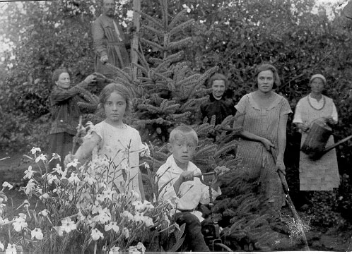

Auskleide-Aktionen, die, wie ich mich erinnere, Nachahmungen einer Lithografie aus einem der väterlichen Bücher waren, wurden von den wachsamen Eltern schnell unterbunden. Sie untersagte mir auch das Aufbauen von «Wigwams» im Himbeerdickicht, wo ich angeblich schwer zu finden war. Aber einmal haben sie mich trotzdem verloren. Alle suchten mich – die Hausherren wie die Gäste. Sie suchten sogar im Brunnen, obwohl er mit einer Abdeckung versehen war, die man mit einem Schloss verriegelt hatte. Es herrschte eine schreckliche Panik. Schließlich fand mich mein Vater, als er gegen Abend aus der Stadt zurückkehrte. Er fand mich in süßem Schlaf unter dichtem Weinlaub.

Auf unserer Datsche war stets irgendjemand zu Besuch: Verwandte, Bekannte oder Bekannte von Bekannten. Wenn sie abreisten, waren sie stets mit Obst und Blumen beladen.

Saratow 1926 Ein Teil unseres Gartens. Im Vordergrund Lalja und ich.

Im Hintergrund – Mama, Papa, Tante Mathilda, Ernotschka, Lisa Auf einer Fotografie, die im Sommer 1927 aufgenommen wurde, sieht man ein Stück von der Datsche und den Weingarten.

Etwas deutlichere Erinnerungen beginnen etwa mit dem Alter von sechs Jahren. Viele von ihnen stehen mit religiösen Bräuchen im Zusammenhang. Heute bin ich nicht mehr so naiv, um an Gott zu glauben. Aber meine kindlichen Vorstellungen waren nicht dieser Art. Wir wurden im Glauben erzogen und befolgt streng alle katholischen Riten. Verpflichtend waren unbedingt das Morgen- und besonders

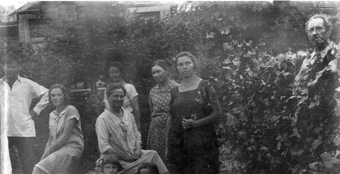

das Abendgebet, in denen man sich, in Vergegenwärtigung der Geschehnisse des vergangenen Tages, an all seine großen und kleinen Sünden erinnern musste. Die Gewohnheit, aus dem erlebten Tag die Bilanz zu ziehen, ist bis heute erhalten geblieben. Die Kirche besuchten wir normalerweise an den Sonntagen, und zwar mit der ganzen Familie. Den Sinn der Predigt begriff ich nur schlecht, und das interessierte mich auch nicht. Großen Eindruck hinterließen bei mir die allgemeine Atmosphäre, Saratow 1926 Im Vordergrund – ich, Lalinas Freundin und Lalja. Zwischen uns dreht sich Daisy mit erhobenen Pfoten.

In der zweiten Reihe – Lendi Befort, auf dem Foto ist sie aus irgendeinem Grund abgeschnitten.

Petja, Ernotschka, Mama (sie ist 54 Jahre alt), hinter ihr – Lisa, dann Mutters Bekannte und schließlich, ganz rechts, in den Weinreben, - Papotschka (59 Jahre alt)

die Helligkeit der Farben, der feierliche Gottesdienst, der Chorgesang, den Ernotschka häufig begleitete, und die irgendwie erhabene, reine und aufrichtige Stimmung, in der mir zum Weinen zu Mute war und ich meine ganzen kindlichen Sünden hätte zugeben können. Der Geistliche dieser Kirche, Pater Baumtrog, besuchte unsere Familie häufig. Er war ein sehr gebildeter und gutmütiger Mensch. Besorgt um das Schicksal seiner Herde, schleppte sich der Pater, ein schon älterer und nicht sehr gesunder Mann, der zudem wegen seiner religiösen Tätigkeit von den Behörden verfolgt wurde, durch die ganze Stadt bis an den Stadtrand von Saratow zu einer gewissen Frau Berte, um mit Worten des Trostes, Ratschlägen und mitunter auch materieller Hilfe ihre bedürftige Familie zu unterstützen. In den dreißiger Jahren wurde er, zusammen mit hunderten anderen Kultdienern verhaftet und in ein Konzentrationslager gesperrt. Dort kam er ums Leben. In den Jahren meiner Kindheit unterhielt er sich oft mit meinem Vater. Worüber? Freilich weiß ich es nicht, denn damals war ich noch sehr klein, aber ich erinnere mich, dass sie häufig Schach spielten und ich, danebenstehend, die wunderschönen, aus Elfenbein geschnitzten und, wie Mama sagte, sehr teuren Figuren betrachtete. Er unterhielt sich auch mit mir. Über Gott, die Eltern, Ehrlichkeit, Edelmut und Mitleid.

Sehr gut erinnere ich mich daran, wie ich einmal, ich war damals sechs Jahre alt, zusammen mit irgendwelchen anderen Jungen dem Pater Messdienste erwies. Die Kirche war voll. Die Leute saßen auf langen Bänken, knieten nieder, mit Gebetsbüchern in den Händen. Vor ihnen flackerten die Kerzen mit ihrem warmen Licht. Auf den steinernen Bodenplatten wurde das Sonnenlicht in allen Farben reflektiert. Der Chor sang. Es herrschte eine freudige und zugleich beängstigende Stimmung. Beängstigend, weil Mama und Papa nicht in der Nähe saßen, sondern irgendwo unter all den fremden Leuten, und ich trug so ein ungewohntes langes Kleidungsstück, und mir kam es so vor, als ob alle auf mich schauten und ich nicht das tat, was ich sollte, und niemand mich beschützte. Auch der Pater schien mir unbekannt, feierlich und entrückt. Am Abend hatte ich einen nervösen Anfall. Danach habe ich am Messdienst nicht mehr teilgenommen.

Die religiöse Thematik ist auch in vielen meiner anderen Erinnerungen präsent. Das Kinderzimmer – dort hängt ein Kruzifix an der Wand neben dem Bett. Wie viele Male sprach ich, auf den Knien sitzend und den geneigten Kopf des gekreuzigten Christus ansehend, die Worte des Kindergebets: Vater unser, der du bist im Himmel. Im Esszimmer zwei Bilder. Auf einem, in ovaler Form, eine Darstellung des Kopfes von Jesus Christus mit der Dornenkrone. Unter den spitzen Dornen sickern Blutstropfen hervor. Bis heute erinnere ich mich an das seelenvolle Gesicht und den traurigen, verzeigenden und verständnisvollen Blick Christus‘. Das zweite – das genaue Gegenteil des ersten. Ein warmer, sonniger Tag. Jesus klopft an eine verschlossene Tür. Er trägt ein blaues, fließendes Gewand, eine Art Umhang oder Robe, an den Füßen Sandalen, in den Händen einen Hirtenstab. Woher ist er gekommen, an wessen Tür klopft er, was erwartet ihn hinter dieser Tür? Das durchdringende Licht, das von dem Bild ausgeht, die hellen Farben beruhigen, und es entsteht die Überzeugung, dass alles gut werden wird. Und wieder wird das Auge von der Dornenkrone angezogen, dem Leid, welches auch das erste dieser Bilder durchdringt.

Das Wohnzimmer... Mit ihm hängen meine Erinnerungen vorwiegend an die Weihnachtsfeste zusammen. Ich weiß noch, wie sich in Sotschelnik die schwere, mit großen Messinggriffen versehene Tür schloss, die vom Esszimmer ins Wohnzimmer führte, und Lalja und ich versuchten, durch den Spalt zwischen Tür und Rahmen zu schauen, um festzustellen, was dort vor sich ging. Dann knallten die Türen, die in die Diele führten, durch die Ritzen strömte kalte Luft, man hörte gedämpfte, vollkommen unbekannte Stimmen, Geraschel und erneut Stille – langsam, sehr langsam verrann die Zeit. Im Licht der Deckenlampe schimmerten die Fensterscheiben blau, die Dämmerung wurde stärker. Und endlich öffnete sich die Tür. In der rechten Ecke des Wohnzimmers, zwischen Fenster und Klavier – die majestätische Tanne, die bis an die Zimmerdecke emporragte, geschmückt mit Spielzeug und glitzernd im Schein der echten, lebendig wirkenden Kerzen, und das ist ganz etwas anderes als die heutzutage verwendeten entseelten, wenngleich bunten, Glühbirnen der elektrischen Lichterketten. Nach den ersten Ausrufen und einer langen Pause stillen Entzückens ertönte ein leises Klopfen an der Tür. Das sind Väterchen Frost und das Schneemädchen, an das wir heute alle gewöhnt sind, und ein sanfter Engel mit Flügeln mit Halbmaske und einem geflochtenen, wunderschön geschmückten Körbchen in den Händen. In dem Körbchen liegen Geschenke. Doch nicht sie waren es, die meine Aufmerksamkeit an sich zogen. Ein Engel, ein lebendiger Engel in unserem Zimmer, den man richtig anfassen konnte! Und diese durchsichtigen, glitzernden Flügel! Viel später, bereits nach dem Tod des Vaters, als es nicht nur die persönlichen Weihnachtsmänner und Engel, sondern auch die Weihnachtstannen nicht mehr gab, erfuhr ich, dass Lenchen die Rolle des Engels gespielt hatte. Das war für mich eine große Enttäuschung, ein tiefer Schlag gegen meinen Glauben. Aber damals, als ich diese göttliche Schöpfung ansah, erschauerte ich und hatte plötzlich auch das Gedicht völlig vergessen, das ich zuvor eingeübt hatte.

Zu den recht deutlichen Erinnerungen aus der Kindheit würde ich auch noch die Erinnerungen an die Fahrten in den Süden nennen. Zu Lebzeiten des Vaters, d.h. bis 1928, waren es für mich immerhin drei: in den Kaukasus, nach Tuaps und zwei auf die Krim – nach Feodosia und Sarygol. Freilich habe ich letztere am besten von allen in Erinnerung, obwohl ich nicht ausschließen kann, dass es in meinem Gedächtnis einige in solchen Fällen unvermeidliche Überschneidungen gab. Aus Saratow fuhren wir zu dritt ab: Mama, Lalja und ich. Papa musste arbeiten und sollte später zu uns stoßen. Ernotschka konnte den Unterricht am Konservatorium nicht unterbrechen, und sie wollte wohl auch nicht gern mit uns zusammen reisen, denn sie war bereits zweiundzwanzig Jahre alt und hatte sich bereits mit Petja angefreundet. Im Zug nahmen wir ein gesondertes Abteil ein, in dessen Mitte ein großer geflochtener Korb in Form einer Truhe stand. Dieser Korb, in dem Mama die gesamte Bettwäsche mitnahmen, begleitete uns auf allen langen Reisen, denn, wie sie wohl schon verstanden haben, wurde Bettwäsche auf Reisen in der damaligen Zeit nicht zur Verfügung gestellt. Dem Zug war auch kein Speisewagen angeschlossen. Deswegen wurde das Essen direkt im Abteil zubereitet. Dafür hatten wir einen von den Eltern aus Deutschland mitgebrachten Feld-Spirituskocher – Gegenstand meines fortwährenden Interesses. Auf den ersten Blick war er sehr einfach konstruiert: eine lange Röhre, an deren einem Ende eine glänzende Kugel befestigt war, und am anderen – der Brenner. Der gesamte Aufbau ruhte auf einem langen Metallständer, der von oben mit einem Griff verschlossen wurde.

Wenn Mama anfing zu kochen, sperrte sie zuerst das Abteil zu, dann goss sie Spiritus in die Kugel und zündete den Brenner an. Obwohl auf dem Behälter in hübschen gotischen Buchstaben Sicherheit gewährleistet wurde, setzte man mich vorsorglich in die entfernteste Ecke des Abteils. Und diese Entfernung von dem lebendigen, flackernden Feuer bereitete mir großen Verdruss. In Gedanken schob ich alles in die Flamme des Brenners, was meiner Meinung nach brennen konnte, aber, wie Lisa sagte, «hat Gott der stoßenden Ziege kein Horn gegeben». In den Pausen, wenn sich der Wunderkocher unter Verschluss in dem Korb befand, saß ich für gewöhnlich am Fenster und bewunderte die vorüberziehenden Bilder. Die mit saftigem Grün überzogenen Felder; die Birkenhaine; die Blockhütten der Weichensteller; die Weichensteller selbst, die unseren Zug mit Flaggen begrüßten; die mit Nieten übersäten Brückenübergänge, und wieder Felder. Ich mochte gern in Fahrtrichtung des Zuges hinausschauen, was es mir mitunter ermöglichte, den vorderen Teil des Zuges zu sehen. Besonders verblüffte und faszinierte mich der Anblick de Dampflokomotive, wenn es bergauf ging: sie schnaufte und strengte sich an, warf aus ihrem Inneren Funkenbündel, die, sich mit den schwarzen Rauchwolken vermischend, am Fenster vorbei wirbelten, und dann schien es, als ob der Zug, seine Fahrtgeschwindigkeit verzehnfachend, in einen schwarzen Abgrund stürzte. Das Abteil füllte sich im Nu mit Rauch und Brandgeruch. Mama schob mit Laljas Hilfe den Fensterrahmen hoch, und verdonnerte uns zu der drückenden Hitze im Waggon. Doch nach einiger Zeit senkte sich durch das Gerüttel und meine von Mama unbemerkte Mithilfe der Rahmen wieder.

Generell sind bei mir mit diesen Waggonfenstern recht merkwürdige Erinnerungen verbunden. Ich wunderte mich beispielsweise sehr, weshalb die Zugbegleiter vor der Einfahrt in einen Tunnel allen Passagieren die strikte Anweisung erteilte, die Fenster fest zu schließen. Anfangs dachte ich, dass das eine Frage des Qualms wäre, der den gesamten Tunnel ausfüllte, wenn ein Zug hindurch fuhr. Allerdings kam ich, nachdem ich mich erinnert hatte, dass die gleiche Anordnung auch gegeben wurde, wenn der Zug über eine große Brücke fuhr, zu dem Schluss, dass dies getan werden musste, damit nicht irgendeiner der Passagiere eine Bombe hinauswarf. Aber dann wäre der Fahrgast selbst ja auch umgekommen, wozu also sollte er das tun? Weil ich auf die quälende Frage keine Antwort fand, wollte ich mich an den Zugbegleiter wenden, aber Mama verbot mir strengstens, irgendwem eine, wie sie es ausdrückte, derart schwachsinnige Frage zu stellen, und warnte mich, dass man sie und Papa dafür ins Gefängnis bringen, Lalja und ich mutterseelenallein zurückbleiben und verhungern würden. Diese Warnung übte eine heftige Wirkung auf mich aus, und ich kam später in meinen Gedanken mehrmals darauf zurück, wobei ich mir Gefängnisgitter und die dahinter verborgenen Gesichter von Vater und Mutter vorstellte. Das war die erste Schramme in meinem kindlichen Bewusstsein, die erste Schramme der Angst vor dem allmächtigen Staat.

Das Meer, das unverändert großen Eindruck auf mich machte, überdeckte auch dieses Mal in meiner Erinnerung die meisten Ereignisse jener Zeit. Stundenlang konnte ich meinen Blick darauf richten. Es ließ in mir ein süßes Gefühl der Freiheit und von noch irgendetwas anderem entstehen, das ich heute als geistige Befreiung bezeichnen würde. Dieses Empfingen erfasst mich auch jetzt immer dann, wenn sich nach der Biegung im Schienenverlauf zum ersten Mal der Blick auf die endlose Weite des Meeres eröffnet.

Wir wohnten in einem Privathaus in der Nähe des Meeres. Ich erinnere mich an ein großes kühles Zimmer mit geschlossenen Fensterläden, durch deren Ritzen die glühenden Sonnenstrahlen mit darin tanzenden Staubpartikeln drangen. Stets ein frisch aufgewischter Fußboden und der sehr hohe Treppenaufgang, dessen steile Stufen in ein kleines Gärtchen führten, das mit Blumen bepflanzt war. Mit dieser Treppe ist noch eine weitere Erinnerung verbunden: wir sitzen am Tisch und frühstücken. Lalja erhebt sich, geht zur Vordertreppe und wirft heimlich, damit Mama es nicht merkt, das von ihr so wenig geliebte Eigelb hinaus. Und sie wäre um ein Haar auf Papa gestoßen, der gerade aus Saratow zu uns gekommen war.

Ich erinnere mich an die Bucht, die sich tief ins felsige Ufer einschnitt; die sandige, von Muscheln übersäte seichte Sandbank und der abgebrochene Felsen, den man beim Verlassen der Bucht aus dem Wasser herausragen sah. Ich erinnere mich an die glühende Sonne, das durchdringend blaue Meer und den einsamen Strand, an dem sich in kleine Gruppen nicht mehr als fünfzig Urlauber niedergelassen hatten.

Am Ufer, in einiger Entfernung, ein Basar, auf dem man verschiedene Kleinigkeiten erwerben konnte, unter anderem ein Getränk mit der merkwürdigen Bezeichnung «Busa». Lalja und ich wollten es so gern probieren, aber Mama ließ nicht einmal den bloßen Gedanken daran zu.

Und nun die schlimmsten, traurigsten Erinnerungen an meine Kindheit. Papa fühlte sich bereits im Süden nicht gut. Schwächegefühl, Appetitverlust, abends ein wenig erhöhte Temperatur. Nach Saratow kehrten wir etwas früher als sonst zurück, etwa Mitte August. Aber auch hier verschlechterte sich seine Gesundheit weiter. Bald darauf brachten sie Papa ins Eisenbahner-Krankenhaus. Egal, womit sie ihn auch behandelten, aufhalten konnten sie den Prozess nicht. Morgens sank seine Temperatur unter 36 Grad, abends stieg sie auf über 40. Und so ging es Tag für Tag, über einen Zeitraum von beinahe drei Monaten. Die ganze Zeit über saßen Ernotschka und Mama, immer im Wechsel, an seinem Bett. Mehrmals traf ein Ärzte-Konsilium zusammen, aber erst im November konnten sie dann endlich die Diagnose stellen: eine besondere Art von Blutvergiftung. Medikamente gegen diese Erkrankung gab es in Russland nicht. Onkel Robert schickte sie aus Deutschland, doch es war bereits zu spät, die Krankheit war bereits zu weit fortgeschritten.

Anfang Dezember 1928 entließen sie ihn als hoffnungslosen Fall aus dem Krankenhaus und brachten ihn nach Hause. Sie legten ihn ins Kinderzimmer, den hellsten Raum im Haus. Ich erinnere mich, wie ich mit Furcht und sogar Grauen diesen, nun in ein Krankenzimmer verwandelten, einst so freundlichen und Freude bringenden Raum betrat. Das Bett des Vaters stand etwas schräg in der hintersten Ecke. Am Kopfende ein Nachttisch. Darauf befanden sich Fläschchen mit aufgeklebten länglichen Papierstreifen, auf denen in unleserlicher Handschrift Rezepte vermerkt waren, Pulver, die bekannte braune Tasse mit der Zahnprothese und an der Wand das schwere bronzefarbene Kruzifix. Der Vater, erschöpft und abgezehrt, mit spitzen Gesichtszügen, lag beinahe unbeweglich da. Freilich war er es, mein heiß geliebter Papotschka, der mich noch kürzlich, auf den Knien kriechend, durch die Zimmer reiten ließ und dem Lalja und ich immer so gern Zöpfe geflochten und Schleifchen umgebunden hatten. Und gleichzeitig war es doch wieder nicht. Das Gesicht, mit dunklen, grauen Stoppeln bewachsen, die tiefliegenden Augen, in denen anstelle der gewohnten Wärme, Zärtlichkeit und Liebe nun Schwermut und Verzweiflung flackerten. Und die Hände! Erst kürzlich waren sie doch noch so geschickt und gut gewesen, hatten mit dabei geholfen, einfaches Spielzeug zu basteln, und mich manchmal auch gerechterweise bestraft – und nun lagen sie auf der Bettdecke, so mager und kraftlos.

Ich stand da, bemüht, den vertrauten, aber mich dermaßen erschreckenden Menschen nicht anzuschauen. Die Augen brannten mir von den aufsteigenden Tränen, und ich hatte das Gefühl, dass ich trotz der strengen Warnungen der Mutter gleich weinen würde.

Von dem Tag an sprachen alle im Haus nur noch flüsternd, die Türen wurden bedächtig geschlossen, man versuchte, sie nicht laut zuschlagen zu lassen. Es roch nach Medizin. Mama, Ernotschka und Lisa liefen mit verweinten Augen herum. Häufiger als sonst kamen Verwandte, Bekannte und unbekannte Leute und unterhielten sich flüsternd in der Küche. Fast täglich kam Pater Baumtrog.

In den letzten Tagen wurde Papa von einer unbestimmtem Unruhe heimgesucht. Er wollte sich irgendwohin auf den Weg machen und bat darum, seine Kleidung vorzubereiten. Auf sein hartnäckiges Bestehen hin wurde das Bett in die Mitte des Zimmers geschoben. Die Rosatöne des Lüsters änderten sich in blaue. Am nächsten Tag rasierte wurde Papa auf seinen Wunsch von Petja rasiert. Das war für ihn offenbar sehr schmerzlich, denn die Tränen rannen ihm aus den Augen. Als die Rasur beendet war, - erinnert sich Petja, - ergriff er meine Hand, küsste sie und flüsterte:

– Petja, pass gut auf Ernotschka auf, sie ist eine gute Seele.

Am 14. Dezember ging es Papotschka plötzlich besser. Er sprach mit uns, strich Lalja und mir über den Kopf, bat uns darum ehrlich zu sein und der Mama zu helfen. Danach bat er um Kaffee und sein Lieblingsgericht – Piroggen, mit Butterkrümeln bestreut (Ribelkuchen). Heute weiß ich, dass dies ein Zeichen des nahenden Endes ist, aber damals habe ich mich schrecklich gefreut und dachte, dass er nun wieder gesund wird. Doch die Freude währte nur kurz. Als ich die andächtigen Gesichter der Älteren sah, bekam ich Angst und wurde still.

Gegen Abend ging es dem Vater schlechter. Ernotschka lief zum Arzt. Pater Baumtrog kam, und man brachte uns aus dem Zimmer. Offensichtlich fand die Zeremonie des Abendmahls statt. Mit jeder Minute ging es ihm schlechter. Er schlug auf das Bett und rief irgendjemanden. Man brachte Lalja und mich zum Papotschka. Am Kopfende stand der Pater, daneben Mama, Onkel Karlusch, Tante Mathilda, Lisa. Papotschka betrachtete uns, versuchte den Kopf zu heben und sagte etwas, aber der Kopf fiel sofort auf das Kissen zurück. Dann machte er noch drei tiefe Atemzüge, zitterte mit dem ganzen Körper und wurde still. Jemand schrie auf, es entstand eine Hysterie. Man brachte mich ins Schlafzimmer und legte mich ins Bett. Ich kauerte mich wie ein Ball zusammen und zog mir die Decke über den Kopf. Ein leichtes Schaudern überlief mich.

### Kapitel 4. Das Leben ohne Vater

Das für unsere Familie so schreckliche Schaltjahr 1928 näherte sich dem Ende. Mitte Dezember – die Beerdigung. Seit dem Morgen sah der Himmel düster aus, bedeckt von zottigen, tiefhängenden dunklen Wolken. Der Schnee fiel in schweren, nassen Flocken. Auf dem katholischen Friedhof in Saratow die Grabsteine der Verwandten: Großmütter, Großeltern, Romotschka. Die wohlbekannte Tanne, deren zottigen Zweige unter der Last des Schnees herabhingen. Wie oft waren wir mit der gesamten Familie, mitunter auch nur mit Mama, hierhergekommen. Und immer hatte mich eine leichte Trauer befallen, war der Gedanke an den Tod aufgekeimt und wieder verschwunden. Aber niemals hatte ich daran gedacht, dass sie hier, ganz in der Nähe, meinen Vater begraben würden. Und nun war diese Stunde gekommen. Das Grab. Geöffnet, der vom kalten, feuchten Wind umwehte Sarg, und darin der Vater!

Ich stand da, Mamas kalte Hand umklammernd, und sah, wie sich die Schneeflocken auf sein vom Schmerz vor dem Tode gequältes Gesicht legten. Sie blieben liegen und schmolzen nicht. Ich fand das schrecklich. Mit meinem ganzen Wesen fühlte ich, wie kalt im sein musste. Er war tot und nicht mehr bei uns, und wir blieben ganz allein zurück. Aber warum ausgerechnet er, mein Papotschka? Ich hatte doch Gott so sehr gebeten, Erbarmen mit ihm zu haben, hatte doch so viel gebetet. Warum nur hatte Er, der Barmherzige und Allmächtige, meine Gebete nicht erhört, war Er denn so grausam? Und jetzt begruben sie den Vater, und wir sind allein, ganz allein. Da fallen bereits Erdklumpen auf den Sargdeckel. Nein! Nein!

Als wir vom Friedhof nach Hause zurückkehrten, bat ich Gott wieder und wieder in völliger Verzweiflung, mir den Vater zurückzugeben, und hoffte insgeheim, dass er uns, wenn wir eintreten, entgegenkommt, um uns zu begrüßen – gesund und mit einem Lächeln im Gesicht. Nein, wenn er wenigstens nur am Leben wäre. Aber etwas Derartiges geschah nicht. Zuhause erwarteten uns leere, kalte Zimmer und unbekannte, fremde Leute, die aus irgendeinem Grund im Saal lange, schmale Tische gedeckt hatten. Konnte ich noch weiter an Gott glauben? Konnte ich in Zukunft noch beten? Gegen Morgen bekam ich Schüttelfrost, meine Temperatur stieg, vor meinen Augen erschienen bunte, gleichmittige Kreise und verschwanden wieder. Und ein nervöses Gähnen, welches ich mit aller Macht zu unterdrücken versuchte, denn ich hatte Angst, dass mit dem dritten Atemzug, wie bei Papa, meine Seele entfliehen würde. Weder Ärzte noch Medizin, und nicht einmal ein Hypnotiseur, konnten mir helfen. Wie immer heilte auch hier die Zeit. Zum Frühjahr hin konnte ich meine Umgebung bereits wieder normal aufnehmen, konnte mich wieder freuen oder betrübt sein.

Aber in dieser Zeit ereigneten sich im Land gravierende Veränderungen. Die Neue Ökonomische Politik wurde liquidiert und der Kurs auf die Industrialisierung und Kollektivierung des Landes proklamiert, die Repressalien verstärkten sich. Das Land kehrte in den Lauf deswarenlosen Sozialismus zurück. Verboten wurde der Privathandel mit Getreide, es kam zu Absperrungen, die keine Durchfahrten für Fuhrwerke mit Getreide in die Stadt mehr zuließen. Getreide wurde nicht verkauft, sondern konfisziert und verteilt. Praktisch wurde die Ablieferungspflicht wieder eingeführt, nur nannte man es jetzt staatliche Planungsaufgabe. Mehr noch, wenn der «Kriegskommunismus» nur den Bauern das Getreide weggenommen, ihnen die Freiheit zum Pflügen und Säen jedoch überlassen hatte, so entzog man dem Bauern nun auch dieses Recht.

In jenem Jahr wurde in allen Städten Russlands das Kartensystem für die Verteilung von Produkten eingeführt. Dabei fanden viele diese Form der Versorgung der Bevölkerung dem Geiste des Sozialismus entsprechend und deswegen gerechter, denn jetzt konnten die Nepmannen sich nicht mehr «auf Kosten der arbeitenden Bevölkerung überfressen». Bei der «Hilfestellung» zur kommunistischen Reform der Dörfer schickte die Landesregierung 25000 Industriearbeiter dorthin, vorwiegend Kommunisten. Es begann die Zwangsvergesellschaftung der Häuser, des Kleinviehs und sogar des Geflügels. In den Dörfern verschärfte sich die Jagd auf wohlhabende Bauern. Im Februar-März des Jahres 1930 setzte die Massen-Entkulakisierung ein. Das Land wurde von einem Netz an Lagern, den Siedlungen der „Sondersiedler“ überzogen. Hunderttausende ehemalige Farmer wurden gewaltsam von ihren Ländereien fortgerissen und man machte aus ihnen unbezahlte Arbeitskräfte auf Baustellen des Fünfjahresplans.

Das Aussehen Saratows veränderte sich. Auf den zentralen Straßen der Stadt gab es immer weniger Reklame, aus den Vitrinen verschwanden als Erstes Luxusartikel, welche die Menschen verrückt gemacht hatten, und dann auch die allernötigsten Waren. Die von den Nepmannen konfiszierten Geschäfte und Restaurants wurden geschlossen. In der Deutschen Straße schloss die Lieblingskonditorei der Kinder, die Konditorei Philippow, in der sie so leckere Kuchen und Waffelröllchen mit einer göttlichen Creme-Füllung verkauft hatten. Praktisch verschwanden die rücksichtslosen Droschkenfahrer, ihr aufforderndes Geschrei: «He, lasst mich vorbei» war nicht mehr zu hören. Es bildeten sich Schlangen, die von Monat zu Monat länger wurden. Es gab immer mehr rote Tafeln, entlang und über den zentralen Straßen der Stadt. Auf diesen forderte die Partei die Bürger in Briefen verschiedener Größe und unterschiedlichen Stils auf, den Fünfjahresplan in vier Jahren zu erfüllen, die Industrialisierung und Kollektivierung des Landes zu verwirklichen, Bourgeoisie, Kulaken und Schädlinge auszurotten. Die Gesichter der Menschen wurden fokussierter und strenger.

Für unsere Familie begannen nach dem Tod des Vaters schwere Tage. Für ärztliche Behandlung, Beerdigung, Grabstein wurden sämtliche Ersparnisse verbraucht, es entstanden Schulden. Wir lebten von der Rente für den Vater und dem Geld, welches zwei Familien uns zahlten, die in dem zur Straße zeigenden Haus wohnten. Auf materielle Hilfe der Verwandten, besonders von Papas Seite, konnten wir nicht rechnen, denn sie machten selbst schwere Zeiten durch. Onkel Fedja hatten sie die Werkstatt weggenommen, obwohl er darin allein gearbeitet und nie irgendwelche Arbeiter angestellt hatte. Dabei hatte er eine kranke Ehefrau und zwei Kinder: Sohn Viktor und Tochter Olga. Erst ein Jahr später fand er endlich Arbeit als Buchbinder in der Bibliothek der Saratower Universität. Onkel Karlusch, der 1929 sein 63. Lebensjahr vollendete, musste für den Unterhalt von vier Personen aufkommen: seine Ehefrau, zwei Töchter und die älteste Schwester – Tante Amalie. In der Familie von Onkel Eduard waren nach dessen Tod zwei Töchter hinterblieben, und ihre Mutter fristete nur mit Mühe ihr Dasein. Tante Lena begab sich nach Kasachstan, wohin ihr Ehemann ausgewiesen worden war – Konstantin Jakowlewitsch Kwitkowski. Von ihren drei Söhnen war nur Jascha noch am Leben. Tolja, der an Tuberkulose gelitten hatte, starb recht jung. Sascha wurde Repressalien ausgesetzt und kam im Lager ums Leben. Tante Mathilde, die als Kassiererin in einem der Geschäfte Saratows arbeitete, lebte allein.

Hilfe kam von Onkel Robert aus Deutschland. Er, der seinen Neffen sehr gern hatte, schickte uns Überweisungen und Pakete, und im Frühjahr 1929 traf er selbst bei uns ein. Er kam völlig unerwartet, hatte niemandem vorher Bescheid gegeben. Ich kann mich noch sehr gut an den Tag erinnern. Wir frühstückten gerade. Plötzlich schlug das Tor zu und der Hund fing an zu bellen. Mama schaute aus dem Fenster und sah einen stattlichen Herrn mit einer Reisetasche in der Hand. Zuerst erschrak sie, hielt ihn für einen Steuerinspektor, doch als sie genauer hinsah, erkannte sie ihn, stieß einen Schrei aus und lief zur Tür, um diese zu öffnen. Wir begriffen anfangs nichts. Mit wem umarmt Mama sich denn da, wen küsst sie und warum weint sie? Dann waren wir an der Reihe ihn zu küssen. Zwanzig Minuten vergingen mit Gesprächen, bevor meine Mutter sich vorsichtig nach seinem Koffer erkundigte. Er war sicher nicht nur mit leichtem Gepäck aus Deutschland gekommen. Woraufhin der Onkel sehr ruhig antwortete, dass er die Sachen draußen beim Droschkenkutscher gelassen hätte, der wohl erraten könnte, dass er es ins Haus bringen sollte. Mama geriet in helle Aufregung und versuchte zu erklären, dass dafür gerade nicht die Zeiten seien und dass der Kutscher vermutlich längst mit den Sachen über alle Berge sei. Wie groß war ihre Überraschung, als sich herausstellte, dass der Mann immer noch an Ort und Stelle stand und lediglich mit brummigem Unterton fragte, weshalb er so lange hatte warten müssen. Auf die Frage des Onkels, weshalb er das Gepäck nicht ins Haus getragen hätte, bemerkte er vernünftig:

– Soll ich etwas die Equipage (er benutzte genau dieses Wort «Equipage») unbeaufsichtigt lassen, - und dabei wies er mit einer ausdrucksstarken Geste auf eine Horde Kinder, die interessiert die Kutsche und die beiden großen Lederkoffer betrachteten.

Was der Onkel mitbrachte, vermag ich nicht zu sagen, aber ich denke, dass sich auch Lebensmittel darunter befanden, denn für eine gewisse Zeit standen auf dem Tisch wieder süßer Kaffeeе, Käse, Wurst und andere Delikatessen. Mir hatte er eine Spielzeuglokomotive mitgebracht, die mit Dampf fuhr, genau wie einen echte, nur dass in den Feuerraum eine Spirituslampe mit drei Dochten gestellt wurde. Die Lok paffte und pfiff auch wie eine richtige und rate über die Schienen, wobei sie einen Zug aus vier Waggons hinter sich herzog. Als der Onkel abreiste, ließ er alles zurück, was möglich war, sogar die Reisedecke, mit der er sich unterwegs zugedeckt hatte.

Und wieder Alltag, Mühsal und Sorgen. Mama hatte es wahrscheinlich sehr schwer. Die Rente reichte lediglich für Brot. Sich eine Arbeit zu suchen machte keinen Sinn, denn dann hätte sie ihre Rente verloren. Mit dem Tode des Vaters drohte Ernotschka der Ausschluss aus dem Konservatorium, denn sie war nicht mehr abhängig, arbeitete nicht, sondern studierte an der Universität. Und da entschloss Petja sich zu einem Schritt, der, nach seinen Worten, ganz und gar nicht typisch für ihn war: er schloss eine fiktive Ehe mit Ernotschka. Nachdem er das letzte Studienjahr abgeschlossen hatte, erhielt er seine Ernennung als Lehrer im Jagodna-Poljansker Bezirk. Von dort schickte er Ernotschka eine Bescheinigung, dass sie seine Ehefrau und von ihm abhängig sei, was es ihr ermöglichte, ihr Studium fortzusetzen. Es kam der Winter, das Lehrjahr ging zu Ende. Nachdem Petja sich einige Tage in Saratow erholt hatte, fand er Arbeit bei der statistischen Verwaltung und begab sich auf eine statistische Arbeitsreise in die Deutsche Republik. Ernotschka verließ, nachdem sie den dritten Kurs an der pädagogischen Fakultät abgeschlossen hatte, ebenfalls die Universität und schrieb sich für pädagogische Fremdsprachenkurse ein. Am 1. September 1929 ließen sie sich in der römisch-katholischen Kirche von Saratow durch Pater Freilich trauen. Mama, Lalja und ich befanden uns zu diesem Zeitpunkt, den letzten kostenlosen Zug nutzend, auf der Krim, Lisa auf der Datsche.

Petja kommentiert diese Ereignisse in seinen Erinnerungen folgendermaßen: «Nach der kirchlichen Trauung ein kleines festliches Mittagessen im «Astoria» (damals das beste Restaurant in der Stadt) im engsten Freundeskreis. Wäre Sophia Oswaldowna zu Hause gewesen, hätte die Hochzeit möglicherweise nicht stattgefunden! Und wieder gehen wir in verschiedene Richtungen auseinander – ich nach Krasnij Kut für meine Tätigkeit als Lehrer an der deutschen Oberschule, Ernotschka blieb in der Stadt, um ihre Prüfungen abzulegen».

Ich weiß noch, wie Mama und ich im «Lipki»- Stadtpark auf das Ende ihres Abschluss-Konzerts warteten. Soweit ich mich erinnere, bestand es aus den von uns allen so geliebten Werken Schumanns, Liszts, Chopins, und wir bedauerten, dass wir es nicht hören durften. Das Konzert verlief erfolgreich. Das Konservatorium war beendet. Und nun stand vor Ernotschka die Frage nach ihrem weiteren Familienleben. Sie, die die Stadt und die städtische Lebensweise leidenschaftlich liebte, versuchte Petja dazu zu überreden, sich in Saratow niederzulassen. Doch er setzte seinen Dickkopf auf: «Wir werden nur auf dem Lande leben, näher am Volk, an unseren Quellen und Wurzeln». Offenbar hatte er reichlich genug von unseren familiären Problemen. Und dann, nachdem Ernotschka Neujahr 1930 zu Hause gefeiert hatte, fuhr sie zu Petja nach Krasnij Kut. Sie fuhr mit gemischten Gefühlen. Einerseits freute sie sich auf das Wiedersehen, andererseits – hatte sie wie bei einem Feuer Angst vor dem Dorf, der dörflichen Lebensweise, den ländlichen Sitten und Gebräuchen und dem Bauern Petja, der sie mit seiner Grobheit, seinem Despotismus und seiner Einstellung zu Frauen in Schrecken versetzte. In Krasnij Kut arbeitete sie an der Schule – sie unterrichtete Musik und Chorgesang. Doch bereits im Herbst, nachdem sie in Mutterschaftsurlaub gegangen war und das neue Schuljahr nicht mehr begonnen hatte, kehrte sie nach Saratow zurück.

In diesen Jahren verschärfte sich in Saratow, wie überall im Land, vehement die politische Lage. Zu den gegen Kulaken, Nepmannen und Gottesdiener gerichteten Repressalien kamen nun Verfolgungen der technischen Intelligenz, Führungskräfte, Beamten hinzu, welche, die man beschuldigte, terroristische Akte, Sabotage und Schädlingstätigkeit verübt zu haben. In der Stadt munkelte man, dass es Massenverhaftungen geben würde. Einige sprachen darüber flüsternd und voller Angst, andere – sagten es lauthals frohlockend heraus, die Dritten hatten, wie sich jetzt herausstellte, nichts gehört und nichts gewusst. Mama war furchtbar besorgt. Und obwohl unsere Familie bei keinerlei Terrorakten, Sabotagen und Schädlingstätigkeiten involviert war, waren ihre Befürchtungen nicht grundlos. In den Jahren 1929-30 wurden viele von Papas Kollegen verhaftet, aber auch bekannte Gottesdiener. Mama wartete, dass man sie auch bald holen würde.

Das geschah 1930. Die Stille der Nacht durchdrang ein jähes, anhaltendes Klopfen. Alle sprangen auf. Mama begriff sofort und öffnete klaglos die Tür. Lalja und ich schauten verängstigt aus dem Kinderzimmer. Vier Männer traten ein. Einer von ihnen, der mit einer schwarzen Lederjacke bekleidet war und weder grüßte noch den erschrockenen, halb bekleideten und barfüßigen Bewohnern die geringste Aufmerksamkeit schenkte, ging durch alle Zimmer und wollte dann, nachdem er nur uns entdeckt hatte, mit lauter Stimme wissen: «Und wo ist der Hausherr?«. Nach einer längeren Pause fragte Mama fassungslos zurück: «Welcher Hausherr?» - wodurch sie den Tschekisten auf das Äußerste verärgerte. Es folgte eine lange wütende Tirade, der wir entnehmen konnten, dass sie gekommen waren, um Papa zu verhaften. Mamas Versuche anhand der Dokumente in ihren Händen zu beweisen, dass Papa bereits vor mehr als zwei Jahren verstorben war, fasste der Tschekist als persönliche Beleidigung auf. Der zweite der nächtlichen Besucher, mit einem Soldatenmantel bekleidet, ließ sich auf einem Stuhl an der Eingangstür nieder. Er streckte seine durch die nächtlichen Märsche ermüdeten, in Schweineleder-Stiefeln steckenden, Beine aus, lehnte sich an die Stuhllehne zurück und zeigte mit seinem ganzen Erscheinungsbild, dass sie für lange Zeit hierhergekommen wären und sich nicht so leicht würden entfernen können. Neben ihm, von einem Fuß auf den anderen tretend, standen zwei unserer Wohnungsmieter, die, wie ich es heute verstehe, als Zeugen geladen worden waren. Neben ihren Füßen breiteten sich auch schlammige Pfützen von den Füßen der Soldaten aus. Nachdem das Wortgefecht zwischen dem Sicherheitsbeamten und Mama einen recht scharfen Charakter angenommen hatte, räusperte sich einer der Zeugen, der in der Stadt bekannte Schneider Mitzmacher und versuchte mit unkenntlich heiserer Stimme den Tod des Vaters zu bestätigen. Doch der Tschekist verlangte in groben Worten, dass er schweigen sollte.

Unterdessen begann Mama, die für gewöhnlich so schüchtern und ängstlich war, besonders wenn es um das NKWD ging, urplötzlich, wahrscheinlich gebrochen von all dem über sie hereingestürzten Unglück, mit verzweifelter Entschlossenheit den Tschekisten der Unmenschlichkeit und Grausamkeit zu beschuldigen. Wir alle erstarrten vor Angst. Aber zu unserer Verwunderung, und wohl auch zum nicht geringeren Erstaunen des Soldaten, zog der Tschekist schweigend aus seiner Brusttasche irgendwelche Papiere hervor und zeigte sie Mama. Es handelten sich um den Befehl für Papas Verhaftung und die Durchsuchung der Wohnung. Nach all dem, was wir erlebt hatten musste ich plötzlich dringend zur Toilette, doch der Soldat ließ mich nicht, und ich, von einem auf den anderen Fuß springend, quälte mich so sehr, dass ich an allem anderen, was vor sich ging, das Interesse verlor. Die Situation wurde durch eben jenen Mitzmacher gerettet, der mir mit Erlaubnis des Soldaten einen Topf aus der Toilette holte. Leider war es bereits zu spät.

Danach begann die Durchsuchung. Sie nahm nach Mamas Erinnerungen einen gewissen formellen Charakter an und entsprach nicht den damals geltenden Standards. Er Tschekist erwachte erst wieder zum Leben als er sich an die Kommode machte und in ihren Schubladen die Vielzahl sorgfältig zusammengerollter Beutel, Bündel und Säckchen sah. Wohl in der Annahme, dass darin Listen geheimer Organisationen, Terroristen oder andere nicht weniger wichtige Dinge aufbewahrt wurden, begann er die Schleifchen zu lösen, die sich in seinen für derartige Tätigkeiten ungeschickten Händen gelegentlich noch mehr verknoteten. Er wurde wütend, riss an den Faltungen des nächsten Bandes, entdeckte, nachdem er es entwirrt hatte, jedoch wieder nur irgendwelche Fetzen, Bändchen und Schleifchen. Müde geworden, holte der Tschekist den zweiten Zeugen zur Hilfe. Aufgrund ihrer fast zweistündigen Arbeit war der gesamte Fußboden um die Kommode herum mit Fetzen übersät, aus denen Mama so kunstvoll Überwürfe für die Betten, Matten und Läufer genäht hatte. Sie gingen fort als vor den Fenstern die Morgendämmerung graute. Von nun an sahen wir jeder hereinbrechenden Nacht mit Angst und Sorge entgegen, weil wir dachten, dass sie kommen würden, um Mama zu verhaften. Im Kinderzimmer stellten wir die Betten so zusammen als wäre es ein gemeinsames großes und legten uns zusammen schlafen. In der Mitte Mama, an den Bettkanten Lalja und ich. Die Nächte verrannen wie im Fieberwahn. Jedes Mal, wenn ein Auto am Haus vorüberfuhr oder die Pforte zuschlug, erwachten wir und sprangen auf. Seitdem habe ich mich noch lange Zeit vor dem Einbruch der Nacht gefürchtet.

Sie kamen nicht, um Mama abzuholen. Sie kamen wegen Petja. Sie verhafteten ihn in Krasnij Kut am 25. Dezember 1930, zwei Tage vor der Raingolds (Reinholds) Geburt - Goldi (Holdi), wie Ernotschka ihren Erstgeborenen nannte. Drei Monate lang stürmten Ernotschka und Mama die Schwellen der Gefängnis-Kanzleien, fuhren nach Krasnij Kut, Pokrowsk. Es stellte sich heraus, dass er ins Untersuchungs-Isolations-Gefängnis von Saratow gebracht worden war. Mit viel Mühe gelang es, ihm Wäsche und etwas Essen zukommen zu lassen. Hier, im Besucherraum des Gefängnisses, konnte er zum ersten Mal seinen Sohn sehen. Er kehrte im Sommer zurück und machte sich sogleich an die Gartenarbeit. Und obwohl er vollkommen freigesprochen wurde, berichtete er nichts von den Ereignissen, die sich in den Kerkern des NKWD zugetragen hatten.

Mit der Ablehnung der NÖP und dem Beginn der Massen-Kollektivierung verschärfte sich auch jäh der Druck auf die Einzelbauern. Für sie erhöhte man, im Gegensatz zu den Kolchosbauern, die Normen der Pflichtabgaben an den Staat, setzte die Agrarsteuersätze herauf und senkte die Preise für die abzugebenden Produkte. Infolgedessen nahm die Zahl der Bauern, die nur ein Pferd oder überhaupt keins mehr besaßen, dramatisch zu. Die Getreideproduktion sank erheblich. Ab dem Jahr 1928 lebte das Land auf Karten. Alles, was man im erntereichen Jahr 1930 aus den Dörfern herausholen konnte, ging an den Staat. Im Frühjahr 1932 lebten die Menschen von der Hand in den Mund. Sobald die ersten Ähren gereift waren, gingen die Mütter der hungernden Kinder nachts mit Scheren aufs Feld. Als das Einbringen der Ernte begann, trugen die Kolchosbauern, aus Angst, dass sie nach der Zwangsabgabe an den Staat ohne Brot dastehen würden, das Getreide in ihren Taschen und an der Brust nach Hause. Als Antwort darauf kam am 7. August 1932 das Gesetz zum Schutz des sozialistischen Eigentums heraus, welches im Volk das «Drei-Ähren-Gesetz» genannt wurde. Gemäß diesem Gesetzwurde sollte für das Sammeln von Ähren der Tod durch Erschießen oder ein Freiheitsentzug von nicht weniger als 10 Jahren mit Konfiszierung des Besitzes angewendet werden. Innerhalb von 5 Monaten des Jahres 1932 wurden 55000 Personen verurteilt, darunter 2100 zur Erschießung. Unter den Verurteilten befanden sich zahlreiche Frauen. Und trotzdem wurden, ungeachtet der großen Hungersnot, 18 Millionen Zentner Getreide ins Ausland exportiert - zum Erhalt von Valuta für die Industrialisierung.

Im Winter 1932 brach vor dem Hintergrund der «vollständigen Kollektivierung» im Land eine in Friedenszeiten noch nie dagewesene Hungersnot aus. Sie suchte etwa 25-30 Millionen Menschen heim. Es waren die Getreidebezirke der Ukraine, des Don, des Nord-Kaukasus, des Wolgagebiets, des Süd-Urals und Kasachstans.

Bei dem Versuch, das Ausmaß der Tragödie zu verbergen, untersagte die Regierung des Landes den Hunger in den Masseninformationsmitteln zu erwähnen. Eine Verletzung dieses Verbots wurde als kriminelle Handlung gewertet, die mit 3-5 Jahren Gefängnis bestraft wurde. Die Zeitungen kamen mit lächelnden jungen Leuten heraus, die Banner in ihren Händen hielten, mit Artikeln über die gigantischen Bauten des Fünfjahresplans und Auszeichnungen der Bestarbeiter. Aber in dieser Zeit starben ganze Dörfer aus, und es kam sogar zu Kannibalismus.

Die Wellen der Entkulakisierung, die die Republik in den Jahren 1930- 32 überrollten, richteten diese zugrunde. 1933, wie seinerzeit auch, füllten sich die Bahnhöfe und Märkte Saratows mit aus den Dörfern geflohenen hungrigen Kolonisten. Hunger und Repressalien führten zu einem starken Rückgang der Einwohnerzahl in der Republik. Wenn laut der landesweiten Volkszählung des Jahres 1926 in der Republik der Wolgadeutschen noch 650000 Menschen lebten, so waren es 1938 nur noch 379000. Dementsprechend gab es in der Schwarzmeer-Region von ursprünglich 600000 lediglich noch 355000.

Die materielle Lage unserer Familie war 1932 kritisch. Die Steuern für Datsche, Garten und Hausbesitz stiegen gravierend. Unter Berücksichtigung der Einnahmen von den Mietern wurde die Rente von 70 auf 30 Rubel im Monat gekürzt.

Mama begann nach und nach unseren Besitz zu veräußern. Bereits zuvor, 1929, gleich nach dem Tod des Vaters hatte sie das Bienenhaus verkauft. Dieser Verkauf war in gewisser Weise normal gewesen, denn es hatte niemanden mehr gegeben, der sich um die Bienen kümmerte. Dann wurde das teure Service verkauft, und schließlich kam das Haus an die Reihe – Laljas und mein angestammtes Nest. Fast die Hälfte der dafür eingenommenen Summe musste für Schuldentilgungen und Steuerzahlungen verwendet werden. Der Rest war durch die Lebenshaltungskosten schnell verbraucht. Wir zogen in das Haus, welches zur Straße zeigte, und bezogen dort zwei Räume, von denen einer das Durchgangszimmer war. In dem abgetrennten Zimmer wurden Ernotschka, Petja und Goldi untergebracht, im Durchgangszimmer – Mama, Lalja und ich. Es begann eine für uns vollkommen unbekannte Lebensweise. Ein Leben vor den Augen anderer Leute. Die Wohnungsmieter, welche die anderen beiden Zimmer (in einem davon wohnten die Mitzmachers) bewohnten, waren zu jeder Zeit, Tag und Nacht, gezwungen, auf dem Weg in die Küche, ins Badezimmer oder zur Toilette, durch unser Zimmer zu gehen. Auch die Wandschirme, die Mamas und Laljas Betten umgaben, waren nicht sehr hilfreich. Besonders litt Lalja unter dem Zustand, da sie inzwischen bereits 16 Jahre alt geworden war.

Bald darauf zogen Ernotschka, Petja und Goldi in die Wohnung meines Patenonkels – Karl Iwanowitsch Staub, der dort ein kleines Zimmerchen bewohnte. Dort wurde ihr zweiter Sohn geboren - Adolf. Petja schrieb in Anbetracht der beengten Wohnverhältnisse: «Wenn Adolf Fjodorowitsch hätte sehen können, mit was für einem schrecklichen Schicksal meine geliebte Ernotschka bedacht worden war». Karl Iwanowitsch selbst war Professor am Lehrstuhl für Chemie an der Universität Saratow. Seine Familie stand mit unserer in einer verwandtschaftlichen Beziehung, in welcher genau, weiß ich nicht. Seine Frau hieß Alexandra Iwanowna. Die beiden hatten eine Tochter in meinem Alter, mit hübschem Gesicht, doch, ebenso wie Karl Iwanowitsch, hinkte sie stark. Wir hielten uns selten bei ihnen auf. Von diesen Besuchen ist in meiner Erinnerung das Bild eines großen und aus irgendeinem Grund immer dunklen Raums geblieben. Zwischen den Fenstern ein Schreibtisch, dessen Oberfläche von einem grünen, mit Tintenflecken übersäten Tuch bedeckt war; darauf stand eine Tischlampe mit einem Schirm aus grünem Glas – und der Onkel saß dort mit gebogenem Rücken in einer braunen Samtjacke. Wenn Mama und ich Karl Iwanowitsch besuchten, riss er sich nie lange von seiner Arbeit los; er erkundigte sich nach der Familie, dem gesundheitlichen Befinden, strich mir über den Kopf, bot mir Konfekt an und beugte sich erneut über seinen Schreibtisch. Mama, die sich zu Alexandra Iwanowna gesellt hatte, unterhielt sich leise mit ihr. Und mir war entsetzlich langweilig.

Das freigewordene Zimmer vermietete Mama an Artisten eines Zirkus, der sich zwei Blocks von uns entfernt befand. Es versteht sich von selbst, dass ich unter diesen Bedingungen oft, und nach Mamas Ansicht zu oft, alle neuen Zirkusvorstellungen aufsuchte. Die prächtigen Farben, die Dynamik der Abläufe, die nervliche Anspannung und ganz besonders die mysteriösen Darbietungen der Magier faszinierten mich. Aufgeregt, voller lebendiger Eindrücke, kehrte ich nach Hause zurück und konnte lange nicht einschlafen. Mama war darüber besorgt. Außerdem war der systematische Wechsel der Mieter und deren übermäßig lautes Verhalten recht strapaziös. Infolgedessen tauchte im Zimmer ein neuer Bewohner auf – Wladimir Plotnikow, Ingenieur der Saratower Funkstation, ein junger Mann von 23 Jahren, wohlgebaut, militärisch fit und voller Energie. Zu meinen Aufgaben gehört keine detaillierte Beschreibung seines Äußeren, daher werde ich mich auf einen einzigen Satz beschränken: er war schön. Nicht umsonst gaben Laljas Freundinnen, die damals 16, 17 Jahre alt waren, ihm den Spitznamen «Schönling». In jenem Zimmer brachte Mama gemäß der Vereinbarung auch mich unter. Soweit ich das verstehe, wollte Mama damit zwei pädagogische Aufgabenstellungen zugleich lösen. Erstens, den Beginn meiner Männlichkeit bei der Erziehung zu stärken, und mich, zweitens, für den Beruf eines Funkers zu interessieren.

Nach allem zu urteilen wurde die zweite Aufgabe am besten gelöst. Ich nahm begierig Wolodjas Erklärungen auf und begann schon bald unter seiner geschickten Anleitung mit dem Zusammenbau eines Detektorempfängers. Jetzt werden solche Singe ganz einfach gemacht. Man kauft einen Bausatz, zu dem die Baupläne und Montageanleitungen gehören, die Platine und alle notwendigen Teile mit Markierungen, die einem zeigen, was wo angelötet werden muss. Dabei besteht keinerlei Notwendigkeit jene Prozesse zu verstehen, die in dem gebauten Gerät ablaufen. Alles ist sehr einfach, aber wenig interessant.

Ich musste fast alles komplett selbst machen: die Basis für die Spulen kleben, die Windungen - ohne mich zu verzählen, den Draht darauf wickeln, der mit einer grünen, seidigen Ummantelung versehen war, nach einer bestimmten Anzahl Windungen die Ableitungen herstellen und sie mit Kabelklemmen zu befestigen. Und wie mühselig es war, die Rückkopplungsspule zu befestigen, die sich innerhalb der Hauptleitung (Kontur) frei drehen können sollte. Die einzigen Fabrikteile waren die Kopfhörer und der Detektor. Aus irgendeinem Grund fand letzterer mein besonderes Interesse, wahrscheinlich wegen des geheimnisvoll schimmernden Kristalls, der an bestimmten Punkten über eine einseitige Leitfähigkeit verfügte. Die Punkte mussten jedes Mal mit einer in eine Glasröhre eingebettete Feder ertastet werden.

Aber was für eine Freude, als ich zum ersten Mal die Stimme des Ansagers einer lokalen Radiostation in den Kopfhören vernehmen konnte. Später habe ich in meinem Leben viele Radios gebaut, zuerst batterie- und dann auch netzbetriebene, aber das Gefühl, das ich damals, als ich zum ersten Mal die Geräusche des Äthers vernahm, empfand, ist mir für immer in der Erinnerung geblieben. Allerdings gab es auch bittere Minuten. Ich weiß noch, wie Wolodja mir eine Skalenscheibe mitbrachte – eine schwarze, mit einem mit weißen, nummerierten Markierungen versehenen Griff, der zum Drehen der Rückkopplungsspule bestimmt war. Meine Freude kannte keine Grenzen. Und man durfte nicht ungeschickt sein. Als ich anfing, die Scheibe an der Vorderseite des Empfängers anzubringen, glitt sie mir aus den Händen, fiel zu Boden und zerbrach. Mir schien es so, als ob ich nice wieder im Leben eine derartige Freude erleben würde. Egal womit ich auch versuchte, den zerbrochenen Griff wieder zusammenzukleben, er ging jedes Mal unwiderruflich wieder entzwei. Und diese Versuche, das Zerbrochene wieder ganz zu machen, zogen meine Erfahrungen nur noch in die Länge.

Anfangs war meine Beziehung zu Wolodja mehr als gut. Ich erriet jeden seiner Wünsche, und er hielt an seinem väterlichen Tonfall fest. Doch diese Idylle begann nach und nach aufgrund von Umständen zu zerbrechen, die nicht von mir abhängig waren. Zwischen Wolodja und Lalja, die sich zu jener Zeit von einem zickigen, mich ständig aufziehenden Mädchen in ein sympathisches Wesen verwandelt hatte, entstand eine besondere Beziehung. Sie gingen häufig ins Kino, mitunter auch ins Theater. Ich, die Rechte eines Bruders nutzend, wünschte mir, mehr in Wolodjas Nähe zu sein, doch ich störte ständig. Unsere Beziehung verschlechterte sich. Alles endete kläglich.

Wolodja machte sich daran einen Fernseher zu bauen. Damals gab es nichts von dem, was als Grundlage eines heutigen Fernsehgeräts dient. Die Rolle der zeitgenössischen Bildröhre nahm die Nipkow-Scheibe (Bildabtastscheine; Anm. d. Übers.) ein. Die Nipkow-Scheibe baute Wolodja aus einer großen (1 x 1 Meter) Ebonit-Platte, die er von der Arbeit mitbrachte und in seinen Schrank stellte. Zu der Zeit war ich besessen von der Idee, einen batteriebetriebenen Zwei-Röhren-Rundfunkempfänger zu bauen, wofür ich ein Untergestell benötigte. Mir schien, dass Ebonit am besten dafür geeignet wäre. Und so sägte ich aus der Platte, die Wolodja mitgebracht hatte, mit großer Mühe mittels einer Laubsäge das Stück heraus, das ich brauchte. Als Wolodja die verdorbene Platte entdeckte, wurde er furchtbar wütend, drückte mich in die Bett-Ecke und schlug mich mehrmals mit seinem breiten Soldatengürtel. So hat sich mir gegenüber niemals irgendjemand verhalten. Ich war zutiefst gekränkt. Aber ich wusste nicht, was ich unternehmen sollte. Mich bei meiner Mutter zu beschweren wagte ich nicht, und sie war auch nicht zu Hause; auch Lalja war nicht da, auf die ich einen Teil Meiner Kränkung übertrug. Meine Tränen hinunterschluckend rannte ich nach draußen und ging ziellos durch die Gegend. Doch allmählich verwandelten sich meine Gefühle in einen konkreten Plan. Ich beschloss, in den Garten zu fahren. Es war Spätherbst. Die Datsche war schon vernagelt. Und weder im Garten noch in der näheren Umgebung konnte man auch nur eine einzige Menschenseele antreffen. Aber davor fürchtete ich mich nicht. Das Wichtigste war, dass ich verschwand, alle mit mir Mitleid hatten und Wolodja seine Tat bereute. Obwohl – nein, das war nicht nötig. Sollten doch alle auf ihn böse sein, einschließlich Lalja. Vielleicht war dies genau der Punkt meines hinterlistigen Plans, meiner Rache. Ich stieg in die halbleere Straßenbahn, die in Richtung Datschen fuhr, kaufte einen Fahrschein und setzte mich ans Fenster. Und erst da fiel mir plötzlich ein, dass ich eigentlich in die Schule musste. Zuerst bekam ich Angst, aber dann beschloss ich, dass dieser Umstand allem, was passiert war, eine besondere Schärfe verleihen würde. Es war eine lange Fahrt, allmählich ließ die nervliche Anspannung nach, und ich begann die Situation kritisch zu bewerten. Nun war ich schon nicht mehr überzeugt von der Richtigkeit meines Vorgehens. Selbstverständlich hatte Wolodja kein Recht gehabt mich zu schlagen, davon war ich überzeugt, aber einfach fortzulaufen – damit rächte ich mich nicht an ihm, sondern zwang Mama sich Sorgen zu machen. Ich konzentrierte mich auf diesen Gedanken und stellte mir vor, wie sie weinend durch das Haus lief und schließlich zur Miliz eilte. Als ich schließlich an meiner Endhaltestelle ausstieg, war ich beinahe vollständig sicher, dass meine Aktion falsch war.

Nachdem ich einige Dutzend Meter auf dem mir wohlbekannten Pfad gegangen war, hielt ich am Waldrand inne. Die Blätter hatten sich zu hellen Gelb- und Rottönen verfärbt, stellenweise standen die Bäume vollkommen kahl da, und ihre vom Wind zerbrochenen Äste erinnerten an aus den Gelenken gedrehte Arme. Aus der Niederung, die ich nun durchschreiten musste, wehte ein feuchter, moderiger Geruch herüber. Und ich fühlte mich plötzlich so verlassen, so verwaist und wünschte mir so sehr Mamis Zärtlichkeit und beruhigenden Worte herbei, dass ich auf dem Absatz kehrtmachte und durch das raschelnde Laub in Richtung, zur Straßenbahn rannte, die Richtung Stadt fuhr. Ich sprang auf das Trittbrett und stieg ein. Mir wurde leichter ums Herz und aus irgendeinem Grund erinnerte ich mich daran, dass Mama heute meine Lieblingsnudeln kochte. Der Waggon war ein Anhängewagen, und es gab keinen Schaffner. Auf den vorderen Sitzen saßen zwei alte Frauen mit Eimern. Ich machte mir die Situation zunutze, trat auf die Trittstufe hinunter, lehnte mich ein wenig zurück und sah zu, wie die Schienen unter den Rädern davoneilten. Und plötzlich ein Schlag, ein greller Lichtblitz und dann Dunkelheit. Unten an der Böschung erwachte ich irgendwann wieder. Oben stand die Straßenbahn, der es nicht gelungen war, sich weit von dem unglückseligen Stützpfeiler zu entfernen, und gab ein Ruf-Signal. Ich stand auf, winkte dem Straßenbahnführer mit der Hand zu und ging, mühsam ein Bein vor das andere setzend, in Richtung eines in der Ferne sichtbaren Hauses. Aus der Kurve der Dorfstraße kam eine Kutsche herausgefahren, die sich schon bald mit mir auf einer Höhe befand. Als der Kutscher mich sah, hielt er das Pferd an und rief: «Junge, wer hat dich denn so zugerichtet?». Erst da, als ich meinen Kopf berührte, bemerkte ich, dass meine Haare blutverklebt waren. Der Mann war äußerst teilnahmsvoll: er brachte mich zu einer Holzhütte, half mir mich zu säubern und fuhr mich dann zur nächstgelegenen Haltestelle. Als ich in die Stadt zurückkam, dämmerte es bereits. Doch ich ging nicht nach Hause, sondern zu Ernotschka. Entsetzt von meinem Anblick, desinfizierte sie vorsichtig meinen ziemlich verletzten Hinterkopf, wobei sie beinahe eine ganze Flasche Jod verbrauchte. Es ist mit nicht gelungen, mich daran zu erinnern, womit die Geschichte endete, wie ich Mama wieder begegnete und vor allem Wolodja.

Jetzt sollte ich über das Lernen und die Schule sprechen, aber gerade in dieser Sache hat mich mein Gedächtnis vollends verlassen. Zweifelsohne gehörte ich nicht zu den Wunderkindern. Ich glaube vielmehr, dass ich an einer gewissen Verzögerung in der Entwicklung litt. Jedenfalls begann ich erst später als meine Altersgenossen zu sprechen, und Lesen lernte ich erst im sechsten Lebensjahr. Ich besuchte nie einen Kindergarten. Es waren die Eltern, die mich auf die Schule vorbereiteten. In dieser Zeit zog ich es vor, zu malen und einfache arithmetische Aufgaben innerhalb der ersten zwanzig Zahlen zu lösen. Ich hörte gern zu, wenn Mama, Lalja und Ernotschka der Reihe nach einen Roman vorlasen. Zur Schule schickten sie mich erst im Alter von acht Jahren. Der Unterricht dort fand in deutscher Sprache statt. An derselben Schule, in der vierten Klasse, lernte Lalja. Die Schule befand sich irgendwo in der Nähe der Deutschen Straße. Sehr schattenhaft erinnere ich mich an die riesige kubische Form der Eingangshalle. Eine gusseiserne Treppe führte in den zweiten Stock. Ans Foyer schloss sich ein langer Korridor mit kahlen Wänden an. Ich mochte diese Schule nicht. Ich ging ohne großes Verlangen dorthin, denn ich zog es vor, mich zu Hause zu beschäftigen, aber um meine Noten war ich besorgt. In Arithmetik bekam ich in der Regel die Note «sehr zufriedenstellend», das war damals die höchste Bewertung. Aber es gab auch Vieren, die man damals als «nicht zufriedenstellend» bezeichnete. An einen derartigen Fall kann ich mich noch sehr gut erinnern. Ein dünnes Schreibheft mit großen Kästchen. Mit roter Tinte durchgestrichene Beispiele (das war in der dritten Klasse) und in schwungvoller, aber akkurater Schrift, die Note «nicht zufriedenstellend». Das Heft verbrannte mir die Hände, und ich wusste nicht wohin damit. Zu Hause versteckte ich das unglückselige Heft ganz unten in einer der Kommoden-Schubladen. Jahre später geriet es mir erneut in die Hände, und ich habe es lange Zeit zur Erinnerung an meine Kindheit aufbewahrt. Was die Sprache betrifft, fühlte ich mich viel schwächer, besonders nachdem 1933 die Schule russisch wurde. In diesem Fach waren meine Noten «zufriedenstellend».

Ich hatte in jenen Jahren auch keine wirklichen Freunde und Kameraden. Während der Pausen im Korridor drückte ich mich an den Wänden herum und schaute mit einer gewissen Angst auf die rennenden, hüpfenden, schreienden und schubsenden Jungs. Wohl fühlte ich mich nur zu Hause, im Kreis der mir vertrauten Menschen.

In diesen Jahren wurde das Leben für uns von Monat zu Monat schwieriger. Die Rente (40 Rubel) und die Zahlungen der Mieter (60 Rubel) reichten gerade für den Kauf der Lebensmittel, die uns laut Karten zustanden. Aber es gab von diesen Produkten viel zu wenige. Manches musste man auf dem Markt kaufen. Und gerade dafür war nicht genug Geld vorhanden. Ich weiß noch, wie Mama geweint hat, als sie vom Basar ein kleines Fläschchen Pflanzenöl mitbrachte und merkte, dass sie betrogen worden war. Die Flasche war aus dunklem Glas, und Mama hatte nicht gesehen, dass sein wesentlicher Inhalt aus Wasser bestand und nur ein wenig Öl im Flaschenhals stand.

Um uns die Lage etwas zu erleichtern, arbeitete Lisa zeitweise als Haushaltshilfe in der Familie eines Parteileiters. Und Mama ging im Juni 1932 arbeiten – zuerst als Statistikerin, später als Rechnungsführerin. Sie erhielt 90 Rubel im Monat. Das Leben wurde ein wenig leichter. Aber schon im Januar 1933 wurde sie wegen Personalabbau, und wieder wurde die Situation kritisch.

Eine gewisse Erleichterung brachte der Sommer mit sich, als wir mit der ganzen Familie, einschließlich Lisa, Petja, Ernotschka, Holdi und Adjuscha auf die Datsche fuhren. Hier, wie es uns schien, so weit wie möglich von der verrückt gewordenen Welt abgeschirmt, versuchten wir, die Vergangenheit zu reanimieren. Es gelang uns nicht gut. Die Veränderungen innerhalb der Gesellschaft und auch in uns selbst waren zu bedeutsam. Auf den ersten Blick war alles an Ort und Stelle: der Garten, die Datsche, die Laube, der Brunnen, die Baumreihen, die Wege. Alles war wie immer – und doch war es anders. Die Bäume standen dort mit nicht geweißten Stämmen, zwischen den Stämmen wucherte das Gras, von den Bänken blätterte die Farbe ab, auf den einst so üppigen Blumenbeeten wuchsen Tomaten, und dort, wo bis vor kurzem die Bienen angesiedelt waren – Kartoffeln. Hinter der Küche grasten zwei Ziegen und ein am Bein festgebundenes Ferkel. Sein Quieken und Grunzen befand sich überhaupt nicht im Einklang mit dem blühenden Flieder und den wilden Kastanien.

Außerdem hatten wir Hunger, vor allem in der ersten Hälfte des Sommers, als Gemüse und Obst noch nicht herangereift waren. Aus Saratow brachte man nun anstelle des fülligen, schneeweißen Filippowsker Brotes sorgfältig nach der Kartennorm abgewogenes, schweres und feuchtes Schwarzbrot mit einer Beimischung aus Kleie. Wir kochten Suppe aus Brennnesseln und Sauerampfer. Wir buken Fladen mit Salz. Anstelle von Brot konnte man auch Mehl nehmen. Grobes Salz ersetzte das Öl. Es wurde in die Pfanne geschüttet und so stark erhitzt, dass es zu «schießen» anfing, und danach wurden die Fladen hineingelegt. Wenn der letzte braun geworden war, schüttelte man das Salz herunter. Wir mochten diese Fladen, besonders dann, wenn es süßen Tee dazu zu trinken gab. Doch das kam nicht sehr häufig vor.

Als Flieder und Boule-de-Neige-Rosen blühten, stellte Mama daraus Blumensträuße zusammen und nahm sie mit nach Saratow zum Verkauf. Es war schrecklich demütigend. Denn als Papa noch lebte, wurde aus dem Garten keine einzige Blume, kein einziger Apfel verkauft. Aber die Not schnürte einem die Kehle zu, und so ging Mama, nachdem sie die Blumen in einer großen schwarzen Tasche untergebracht hatte, in die Deutsche Straße, in den Bezirk Lipok. Besonders erfolgreich lief es mit der Boule-de-Neige-Rose - einer dekorativen Garten-Variante des Schneeballs, deren kleine Blüten zu kugelförmigen Blütenständen von grell-weißer Farbe verschmolzen, die wie ein Schneeball aussahen. Vor dem Hintergrund der dunkelgrünen Blätter sahen sie sehr effektvoll aus und lösten allgemeine Begeisterung aus. Aber damit Handel treiben... Ich kann mir gut vorstellen, in welcher Verfassung sich Mama befand. Zweimal nahm Mama mich mit, und ich sah, zu welchem Preis dieser Handel erfolgte. Einmal, als in der Ferne irgendwelche Bekannten auftauchten, versteckte sie in aller Eile die Blumen und brachte ein dermaßen gequältes Lächeln hervor, dass ich beinahe angefangen hätte zu weinen. Später, nachdenklich und als würde sie etwas Böses von sich abgeschüttelt haben, nahm sie mich bei der Hand und begann ihre Lieblingsgedichte zu zitieren. Und sie kannte viele, die sie auch auswendig wusste. Eines von ihnen, «Das Luftschiff», lernte ich bereits hier in der Deutschen Straße. «Wenn es mich einmal nicht mehr gibt, - sagte sie, - dann sage es auf und erinnere dich an mich».

Als das Gemüse und die Früchte herangereift waren, gestaltete sich unser Leben fröhlicher. Wir kochten Kartoffeln und aßen sie mit Gurken und Tomaten. Die Äpfel tauschten wir gegen Honig- und Wassermelonen ein, die auf einem benachbarten Melonenfeld wuchsen. Manchmal wurden Äpfel en gros auf dem Markt von Saratow verkauft. Dabei wurde die Sorte «Choroschawka» gern genommen, eine sehr schöne aussehende, aber nicht besonders wohlschmeckende Apfelsorte.

In dieser Zeit, wie auch in den vergangenen Jahren, kamen Verwandte und Bekannte zu uns auf die Datsche. Hier lernten wir Petjas Schwestern Tjokla und Lida kennen. Sie sprachen sehr schlecht Russisch, und es war lustig zu hören, wie sie die einfachsten Wörter entstellten. Ständig war bei uns irgendeine von Laljas Freundinnen zu Besuch. Ich liebte es um sie herumzuschleichen und war so eine Art Page für sie.

Zugleich brachte der letzte Herbst auch neue Sorgen mit sich. Nachts, und mitunter auch tagsüber, kamen aus den Nachbardörfern (Poliwanowka und Rasboischtschina) finster dreinblickende Männer mit Säcken und schüttelten, ohne sich großartig zu verstecken, die Äpfel von den Bäumen. Dann zogen sie, nachdem sie uns als Bürgerliche, die zu viel des Guten hatten, bezeichnet und versprochen hatten, unser «bürgerliches Nest» in Brand zu stecken, mit krummen Rücken und den Säcken voller Äpfel ab. Das Leben auf der Datsche begann gefährlich zu werden. Im Familienrat wurde beschlossen: den Garten und die Datsche zu verkaufen, bevor es zu spät war. Hier wurde eine noch radikalere Idee geboren: von Saratow nach Tambow umzuziehen, wo das Leben, wie Augenzeugen berichtet hatten, erheblich billiger war und wo man auf dem Markt zu einem vernünftigen Preis Milch, Sahne und Eier kaufen konnte.

Die bevorstehende Trennung vom Garten brachte eine starke Moll-Note in unser Leben. Was wir auch taten, womit wir es auch zu tun hatten, die ganze Zeit ging es uns im Kopf herum, dass es vielleicht das allerletzte Mal war, dass bald jemand anders auf diesen Wegen gehen, unsere Äpfel essen und die wunderschönen Blumen ausreißen würde.

Den Garten verkauften wir im Herbst 1933 zu einem lächerlich niedrigen Preis, und im Sommer 1934 reiste Mama mit mir und Lalja nach Tambow.

### Kapitel 5. Tambow

Nach Tambow begaben wir uns Ende Mai 1934 in leichter Kleidung, wobei wir nur das Allernötigste mitgenommen hatten. Die ganzen Sperrgüter blieben in Saratow. Ernotschka und Petja sollten sie zusammen mit dem Haus verkaufen. Es war vorgesehen, von dem Geld hier in Tambow ein Häuschen oder den Teil eines kleinen Hauses sowie ein paar Möbel zu erwerben. Vorerst mussten wir allerdings in einer Wohnung leben und eine zum Kauf geeignete Behausung suchen.

Mama verließ Saratow mit schwerem Herzen. Hinter den roten Signalleuchten des letzten Waggons blieben ihr gesamtes vergangenes Leben, die Gräber der Familienangehörigen zurück. Sie wurde von schweren Gedanken gequält. In den etwas mehr als fünf Jahren, die seit dem Tod ihres Ehemannes vergangen waren, hatte sie alles verkaufen müssen, was von ihnen geschaffen und mit so viel Mühe angeschafft worden war: das Haus, die Datsche, der Garten. Alles, was ihr zur Gewohnheit geworden, was vertraut gewesen war, was als Symbol ihres glücklichen Lebens in der Vergangenheit gewesen war, hatte sie für praktisch nichts verkauft – es war zerronnen. Und nun, nachdem sie ihre letzte Zuflucht verlassen und alle Verbindungen mit den gewohnten Orten du Menschen abgebrochen hatte, fuhr sie ins Ungewisse, und es wäre einfacher gewesen, wäre sie allein gefahren. Sie fuhr mit den Kindern, um deren Schicksal sie sich große Sorgen machte.

Tambow – was wusste sie schon über diese Stadt, außer dass Lebensmittel dort erheblich billiger waren als in Saratow. Ernotschka, die zur Erkundung dorthin gereist war, charakterisierte sie als ausgesprochen widersprüchlich. Provinziell, kaufmännisch. Drei- bis viermal weniger an Einwohnern. Flach, staubig. Sie steht am Ufer eines kleinen, aber malerischen Flüsschens mit dem merkwürdigen Namen – Zna. Grün, fast an jedem Haus ein kleines Gärtchen. Schöner Häuser – sehr wenige. Zwei asphaltierte Straßen, eine höhere Lehreinrichtung, ein Theater, ein Museum. Dafür auf dem Markt zahlreiche erschwingliche Lebensmittel: Milch, Sahne und sogar Eier. Und die Menschen? Menschen wie überall, ganz unterschiedliche.

Hätten wir vielleicht doch bleiben sollen? – dachte sie, als ihr Blick auf die halb verfallenen Hütten eines vorüberziehenden Dorfes fiel. Aber wie sollte man dann leben? Das Letzte, was ihr geblieben war, war das mit Brettern beschlagene Haus gewesen, in dessen kleinem Durchgangszimmer sie die letzte Zeit mit ihren Kindern elendig gehaust hatte. Sie hatten es verkaufen müssen, bevor man es ihnen wegnahm. Verkaufen und davon leben, genauso, wie sie alles andere verkauft und es dann zum Leben verbraucht hatten. Leider wird das Geld, das sie in Saratow bekommen haben, für nicht mehr als ein Jahr, ein halbes, reichen. Und dann wird schnell das Elend über sie hereinbrechen. Mit sechzig Jahren, ohne einen vernünftigen Beruf,

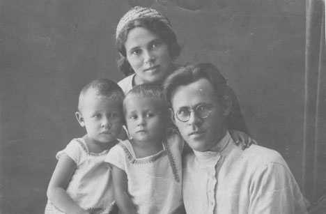

wird sie, eine Frau, und dazu noch eine Deutsche, in Saratow, wo es so viele fachmännische und gebildete Menschen gibt, keine Arbeit finden. Die ganze Hoffnung liegt auf Lalja. Sie ist bereits 17 Jahre alt, hat aber noch keinen konkreten Beruf im Auge. Und was soll aus Robotschka werden, der erst 13 ist? Nein, wir müssen fahren und wenigstens noch 8-10 Jahre durchhalten – dachte sie – und ihm zu einer Ausbildung verschaffen. Eine Ausbildung um jeden Preis.

Es gab noch einen weiteren Grund, weshalb Mama aus Saratow fortwollte. Sie hatte panische Angst vor einer Verhaftung. Die Verhaftung, deren Möglichkeit sie seit jener denkwürdigen Nacht, als erbarmungslose Hände die Bänder an ihren Taschen und Bündeln zerrissen hatten, nicht eine Minute aus ihrem Gedächtnis hatte verbannen können. Sie empfand keine konkrete Schuld bei sich und glaubt auch nicht an irgendeine Schuld ihres Mannes. Außer Gedanken! Gedanken, die sie nie laut auszusprechen wagte. Aber gerade für derartige Gedanken, bei nur einem einzigen Stadt Tambow 1934 Ernotschka mit ihrem Ehemann – Petr Bartholomäjewitsch Gunger Und den Kindern: Holdi (Reinhold) und Aljuscha (Adolf) Verdachtsmoment, dass sie existieren könnten, würden sie nicht nur einen ihrer Bekannten und Verwandten arrestieren. Und nun, da sie Saratow verließ, hoffte sie in naiver Weise ihr Schicksal zu täuschen – das Schicksal in schwarzer Lederjacke und chromledernen Stiefeln.

Wieviel leichter wäre es, wenn Ernotschka hier wäre, - führte sie ihre Gedanken fort. Aber dort war Petja, mit tausend Fäden an die deutsche Republik, an Marienthal, gebunden. Er bemühte sich, auch Ernotschka an die dörfliche Lebensweise zu gewöhnen. Doch sie wusste, wie wenig geeignet ihre Tochter für ein Leben auf dem Lande geeignet war, wieviel Angst sie davor hatte. Sie wusste, wie sehr Ernotschka Saratow liebte, wie wichtig es für sie war, dass es irgendwo in der Nähe ein Opernhaus, ein Konservatorium, eine Universität gab; dass sie sich, wenn sie nach Hause gekommen war, ans Klavier setzen und Chopin, Schumann und Grieg spielen konnte. Mama machte sich auch Sorgen um die angespannte Beziehung zwischen ihr und Petja. Sie begriff, dass sie wegen ihrer Tochter mit seiner vorsätzlichen Grobheit und seiner Ablehnung der in unserer Familie üblichen Form von Umgang und Erziehung klarkommen musste. Sie anerkannte viele seiner Tugenden: er rauchte nicht, er trank nicht, er war fleißig, zweifellos nicht dumm und belesen. Aber all das vereinigte sich in ihm auf merkwürdige Weise mit seiner domostrojewsker Einstellung gegenüber seiner Frau und den Kindern. Bei Tisch musste er, der Hausherr, das erste und beste Stück Fleisch auf den Teller gelegt bekommen, nicht die Kinder, wie es bei uns üblich war. Innerhalb der Familie mussten seine Forderungen widerspruchslos erfüllt werden. Er geriet außer sich, als man anfing den Kindern zu erklären, warum sie es so machen sollten und nicht anders. Dazu dieser Wolga-Dialekt mit seiner grobkehligen Aussprache, der, wie es ihr schien, ideal für einen derartigen domostrojewsker Umgang geeignet war. Dabei kannte er sich gut in den Werken Schillers und Goethes aus – er liebte, wie er selbst sagte, deren Sprache. Wie konnte er sich da dieses Barbarische «Was hotterst du gesat» erlauben. Die arme Ernotschka, die armen Kinder, wie schwer musste es für sie mit einem solchen Vater sein. Wenigstens Lalja hat mit ihrem Mann Glück gehabt – dachte sie.

Und Lalja, die neben ihr in dem stickigen Liege-Waggon saß, dachte daran, dass sie Wolodja Plotnikow wohl niemals wiedersehen würde, der bereits vor einem Jahr zu seiner kranken Mutter nach Wolsk gefahren war und in der Zeit lediglich drei Postkarten geschickt hatte. Sie dachte auch an ihre Freundinnen, die in Saratow geblieben waren, und daran, was sie in Tambow erwarten würde. Sie hatte begriffen, dass die Mutter allein nicht mit den aufkommenden Problemen zurechtkommen würde, dass sie nun selbst in die Situation der ältesten geraten war, auf der eine große Verantwortung ruhte.

Und ich versuchte, auf der oberen Pritsche liegend, beim Licht der untergehenden Sonne «Die Zeitmaschine» von Welles zu Ende zu lesen. Damals kam ich nicht auf den Gedanken, dass meine goldene, sorglose Kindheit, zusammen mit den vorüberziehenden Kilometer-Markierungen, in die Vergangenheit fortgetragen wurde - Erinnerungen, auf die ich später in schwierigen Augenblicken meines Lebens Bezug nehmen werde.

Und so gehen wir nun durch Tambow. Im Vergleich zu Saratow kam es auch uns wie ein großes Dorf vor. Besonders abends. Bereits gegen neun Uhr waren alle Fenster dunkel. Nur hier und da war durch die Ritzen der Fensterläden Lichtschein sichtbar. Nachdem wir uns in den unbeleuchteten Straßen verlaufen haben, finden wir schließlich das Haus, das wir suchen. Der Hausherr, ein Schneider, leicht buckelig und mit unverhältnismäßig langen Händen, musterte uns mit abschätzendem Blick und zeigte uns dann unser Zimmer. Klein, mit einem einzigen Fenster, das zum Nachbarhof zeigte. Ein Tisch, zwei Stühle und zwei Betten. Direkt unter der Decke, an einem kurzen Draht, eine von Fliegen bedeckte Glühbirne.

Am Morgen machten wir uns mit den anderen Bewohnern bekannt. In der Hälfte, die unserem Hauswirt gehörte, lebte außer uns, in einem ebenso kleinen Zimmer, noch eine weitere Familie. Mutter und Sohn. Er war mit mir im gleichen Alter. Er hieß Ljowa, Ljowa Petersson. Später freundeten wir uns an. In der zweiten Hälfte des Hauses, die zum Hof zeigte, wohnte ein Mädchen, etwa so alt wie Ljowa und ich oder ein Jahr älter. Es war kraushaarig, schwarzäugig und lächelte oder lachte ständig über irgendetwas. Ihr Name war Ira. Sie gefiel mir sehr gut, und es war mir lange peinlich, auf dem Weg zur draußen befindlichen Toilette an ihrem Fenster vorüberzugehen.

Leider erwies sich unser Hauswirt als Trinker und Wucherer. Nachdem er die Wohnungsmiete für drei Monate im Voraus erhalten hatte, fing er bereits nach einem Monat an, Amok zu laufen und uns aus dem Haus zu jagen, wobei er damit drohte, die Tür mit der Axt einzuschlagen. Wir und die Peterssons banden, nachdem wir in so eine Lage geraten waren, nachts die Türklinken an den Betten fest. Es ging so weit, dass wir zum Verlassen des Zimmers mehrfach aus dem Fenster klettern mussten. Die Zwillingsbrüder Zaretzkij, die gerade in jenem Hof wohnten, zu dem unser Fenster zeigte, halfen uns. Sie waren 16 Jahre alt, trieben Sport und hielten den ganzen Bezirk in Angst und Schrecken. Lalja gefiel ihnen auf den ersten Blick. Sie begannen miteinander zu flirten, was darin zum Ausdruck kam, dass sie bei uns unter dem Fenster herumstanden, Hand in Hand gingen, am Reck die «солнце» drehten. Nachdem sie erfahren hatten, dass der «Buckelige», so nannten sie unseren Vermieter, uns traktierte, ergriffen sie die «notwendigen Maßnahmen», woraufhin sich die Einstellung des Hauswirts uns gegenüber merklich verbesserte. Aber Laljas Situation wurde komplizierter. Mama machte sich nicht zum Spaß Sorgen. Es begann die Suche nach einer neuen Unterkunft.

Bald darauf zogen wir in die Wohnung irgendwelcher Polen um. Für den Umzug war nicht viel Zeit nötig. Von der August-Bebel-Straße, in der wir bei dem «Buckeligen» gewohnt hatten, bis zur neuen Wohnung in der Karl-Marx-Straße waren es keine zehn Minuten Fußweg. Die neuen Vermieter sahen sehr anständig aus, aber das uns zugeteilte Zimmer gefiel mir überhaupt nicht. Es war dunkel. Sein einziges Fenster war von Flieder zugewuchert, der zum Zeitpunkt unseres Einzugs bereits verblüht war. Der Raum war mit dunkelroten Tapeten tapeziert. Fast in der Mitte stand ein großer Kleiderschrank der Wirtsleute, der, ebenso wie die Tapeten, von dunkelroter Farbe war. Nach Mamas Idee sollte er die Ecke, in der Lalja untergebracht werden sollte, abteilen. Drei Betten, ein Schrank, und ein kleiner Tisch, auf dem wir kochten und an dem wir aßen, nahmen den gesamten Raum ein. Für Stühle blieb kein Platz mehr. Es gab lediglich einen Schemel.

In der ersten Nacht waren wir einem Überfall der Wanzen ausgesetzt, denen wir vorher noch nie begegnet waren. Am nächsten Tag stellten wir die Bett-Füße auf Anraten der Wirtsleute in Konservendosen, die mit Kerosin gefüllt waren, aber die Wanzen krochen an die Zimmerdecke und ließen sich von oben auf unsere Betten fallen. Es begann ein aufreibender, viele Tage dauernder Kampf, wobei sämtliche zugängliche Mittel zum Einsatz kamen.

Ich erinnere mich auch noch an das Eisengittertor, den kleinen Hof, darin eine alte Ulme, auf der ich, zu Mamas Missfallen, gern herumklettern und durch ein selbstgebasteltes «Teleskop» den Mond und die Sterne beobachten mochte. Hinter dem Haus gab es einen Garten mit einem Dutzend Obstbäume, den ein Schäferhund an der Kette bewachte. Die Kette glitt über einen langen Draht, der sich von einer Ecke des Gartens zur anderen erstreckte. Der Hunde lebte in einer blechbeschlagenen Hütte, die in eben jener dunkelroten Farbe gestrichen war. Ich konnte den Hund nicht ausstehen und ärgerte ihn, indem ich seine Hütte mit Steinen bewarf.

Und das Leben ging weiter. Lalja meldete sich zu Lehrgängen für Rechnungsführer an, nach deren Beendigung sie eine Arbeit als Kassiererin in der Überweisungsabteilung des Tambowsker Postkontors aufnahm. Mama erteilte Nachhilfeunterricht, und ich besuchte die 8. Klasse der Schule N° 8. Sie befand sich in der Lermontow-Straße, fast direkt an der Zna – dorthin liefen wir während der Pausen.

Mit dieser Periode unseres Lebens in Tambow ist ein Ereignis verknüpft, das in meiner Erinnerung ein Gefühl von Verlegenheit und Scham hinterließ. Ich hatte hohes Fieber und lag im Bett. Neben dem Bett stand der Hocker, darauf befanden sich Bücher. Mama bereitete irgendetwas auf dem Kocher zu. Im Zimmer war es dunkel und dunstig, und in dem Moment klopfte es an der Tür. Mama öffnete. In der Tür stand Ira, unsere Nachbarin mit den schwarzen Augen aus dem Hof des «Buckligen». Vor lauter Scham über unsere Behausung, unsere elende Lage, unsere Armut zog ich mir die Decke bis über den Kopf. Mamas Überredungsversuche brachten keine Abhilfe. Nachdem Ira fortgegangen war, erklärte Mama mir lange, dass es eine Sünde wäre, sich vor Armut zu schämen. Man muss sein Kreuz mit Würde und Tapferkeit tragen. Diesem ihrem Gebot versuchte ich so gut es ging Folge zu leisten. Doch es gelang mir nicht immer.

Und dann endlich war unser Haus in Saratow verkauft. Ein beträchtlicher Teil der erhaltenen Geldmittel wurden durch Steuerzahlungen aufgebraucht, ein bestimmter Betrag viel Ernotschka zuteil. Für das restliche Geld kaufte Mama einen Teil eines Hauses in der Karl-Marx- Straße 73. Dort gab es insgesamt zwei Zimmer, eins mit 18, das andere mit 20 Quadratmetern Größe, sowie eine kleine Abstellkammer. Eine Küche war nicht vorhanden. Eines der Räume zeigte mit seinen beiden Fenstern zur Straße, das andere – in den Hof, genauer gesagt, in den engen Durchgang zwischen Haus und Zaun. Zu diesem Durchgang führte auch die Eingangstür unserer Wohnung, und von dort – eine kleine Pforte zur Straße hinaus. Hinter dem Haus befand sich ein Gemeinschaftshof und dahinter ein von einem Holzschuppen abgeteiltes Gärtchen. In dem uns gehörenden Teil standen drei Apfelbäume, zwei Kirschbäume und ein Johannisbeerstrauch.

Von der Lermontow-Straße waren wir nun durch zwei Häuser getrennt, so dass die Schule ganz in der Nähe lag, nicht mehr als 15 Minuten zu Fuß. An der Kreuzung mit der Karl-Marx-Straße wurde die Lermontow-Straße breiter, bildete einen kleinen Platz, der mit dürren Bäumen bepflanzt war. Man sprach darüber, dass hier ein Denkmal für M.J. Lermontow errichtet werden sollte. Auf der anderen Seite der Karl-Marx-Straße stand ein gedrungen wirkendes, eingeschossiges Gebäude, ohne Fenster, mit eisernen, an Tore erinnernden, Türen, welches die Ortsansässigen aus irgendeinem Grund «das Arsenal» nannten. Das «Arsenal» bildete einen Einschnitt die Lermontow-Straße, so dass diese sich gabelte.

Auf der anderen Seite des Platzes – ein Lebensmittelgeschäft. Dort gab es Brot, Nudeln, Graupen. Vor allem aber Hirse und Perlgraupen, manchmal Reis und Grieß. An Fetten – Pfanzenöl. An Süßigkeiten: Quarktaschen, Lollys, Halwa, Pfefferkuchen. Mitunter Marmelade und Pastilas. Eingewickelte Bonbons gab es nur sehr selten. An Getränken, neben Wodka und Wein, Zitro und Creme-Soda. Auf der Straße ein Fass mit Kwas. Im Vergleich mit den Geschäften in Saratow schien hier alles reichlich vorhanden zu sein. Alle anderen Lebensmittel: Fleisch, Eier, Milch, Sahne, Quark, Butter, Gemüse und Obst konnte man nur auf dem Markt kaufen. Und obgleich sie erheblich billiger waren als in Saratow, waren sie doch für uns kaum erschwinglich. In der Hauptstraße (der Lenin-Straße) und im Stadtpark gab es Sahne-Eis aus «Eismaschinen». Zwei Waffelscheiben, dazwischen, abhängig vom Preis, zwanzig, dreißig oder vierzig Gramm Sahne-Eismasse. An heißen Sommertagen drängten sich die Kinder um den Eiskarren, um zu beobachten, wie die Tante im weißen Kittel ihr Werkzeug schwang: eine Blechform in der Art eines kurzen Zylinders mit Kolben.

Auf den Boden des Zylinders wird eine Waffelscheibe gelegt, dann zwei, drei geschickte Bewegungen mit dem Löffel, und der Zylinder ist gefüllt mit der schneeweißem, vor Kälte dampfenden Masse. Obendrauf – die zweite Waffelscheibe. Und schließlich drückt die Verkäuferin auf den Kolben und hebt das fertige Eis aus dem Zylinder. An heißen Tagen stehen die Menschen Schlange. Einige kaufen sich gemeinsam ein Eis, lecken immer der Reihe nach daran und passen auf, dass der Kamerad nicht etwa ein Stückchen abbeißt.

Als ich bereits in der achten Klasse lernte, entstand im städtischen Park ein Pavillon, in dem Sprudel verkauft wurde. Zwei lange, unterteilte Glaszylinder, die an einem vertikalen Pfosten montiert sind. Darin zwei Arten Sirup: Apfel- und Birnen-Sirup. Die Verkäuferin dreht ein Ventil und der Sirup fließt in einem dünnen Strahl ins Glas. Die mit Apotheker-Genauigkeit abgemessene Dosis wird mit einem prallen Strahl zischendem, kaltem Sprudelwasser verdünnt. Es gab wohl nichts Angenehmeres, was man sich an heißen Sommertagen denken konnte.

Die wohlhabenden Bürger bestellen die zwei- oder dreifache Menge Sirup. Wichtigtuer bevorzugen das reine Wasser ohne Sirup, sie sind der Ansicht, dass es den Durst besser löscht. Wir trinken auch meistens das klare, sprudelnde, kalte Wasser, allerdings aus einem ganz anderen Grund.

Abends amüsieren sich im Park Gruppen junger Leute mit kräftigem Bizeps und Stiernacken: sie bestellen Sprudelwasser für die ganze Gesellschaft und, nachdem sie ein wenig zur Seite getreten sind, trinken sie lachend und ohne Eile das zischende Getränk. Es gibt keine leeren Gläser mehr. Die Menge wartet geduldig. Dann bestellt die Gruppe eine zweite, anschließend eine dritte Portion. Die Menschen in der Schlange sind empört, es wird laut. Aber die sportlichen jungen Leute lachen schallend und haben ihren Spaß.

Wir führten in jenen Jahren ein schweres Leben, Mama schaffte es eben gerade uns durchzubringen. Sie und ich erhielten eine Rente. Laljas Gehalt war gering. Das Geld reichte nur zum Erwerb der Allernötigsten Lebensmittel, besonders, nachdem 1935 die Marken abgeschafft worden waren. Kleidung nähte Mama aus alten Sachen. Schwieriger war es mit Schuhwerk. Vor allem mit meinem. Ich musste in Galoschen gehen, die ich mit Schnürsenkeln durch Löcher an der Rückseite festband.

Aber ich muss dazusagen, dass ich mich selbst in derartiger Kleidung nicht sonderlich von den anderen Schülern unterschied. Und auch in der Ernährung gab es keine großen Unterschiede. Selten brachte jemand zum Frühstück ein Butterbrot mit Wurst oder Käse mit in die Schule. Der am meiste begüterte Schüler in unserer Klasse war wohl Petrow, dessen Vater eine Bäckerei leitete. Da er mit meiner Hilfe bei der Erledigung der Hausaufgaben in Mathematik rechnete, lud er mich gelegentlich zu sich nach Hause ein. Dort bewirtete seine Mutter uns mit schneeweißen, heißen Brötchen und kalter Milch. Mir kam das wie eine Mahlzeit für die Götter vor. Ich war nur verwirrt wegen der vielen Wanzen, die aus der hinter der Wand liegenden Bäckerei in ihre Wohnung krochen.

Im Juni 1935 ereignete sich ein Unheil. Bei Lalja auf der Arbeit war ein Fehlbestand entstanden, der ihr Jahresgehalt um ein Vielfaches überschritt. Da die Kasse täglich abgegeben wurde, konnte dieses Manko nur in Folge einer Fehlberechnung zustande gekommen sein: entweder bei Zahlung einer Überweisung oder bei Schichtwechsel. Ich erinnere mich, wie Mama und ich die Wohnungen der Klienten aufsuchten, die an jenem unheilbringenden Tag Überweisungen erhalten hatten. Doch natürlich erreichten wir, außer Demütigungen, nichts. Die Situation wurde erneut kritisch. Es drohte die Konfiszierung unseres Besitzes, infolgedessen wir uns auf der Straße wiedergefunden hätten. Ungefähr in der gleichen Zeit wurde in Krasnij Kut, wo Petja und Ernotschka wohnten und arbeiteten, Petja verhaftet. Nach einem sechsmonatigen Ermittlungsverfahren und seiner Verurteilung nach § 58, Punkt 10 и 11, schickten sie ihn für drei Jahre in den hohen Norden in die Uchto-Petschorsker Lager. Ernotschka wurde als Ehefrau eines Verfolgten von der Arbeit entlassen. Im Herbst kam sie mit Lisa, Holdi und Adjuscha zu uns nach Tambow. Nun waren wir sieben Personen. Und keiner von uns arbeitete. Lalja war entlassen worden, aber ihre Papiere bekam sie erst, wenn die Schulden getilgt waren. Ernotschka stand auf den Schwellen der Stadt- und Bezirksverwaltungen für Volksbildung sowie der Schulen, reiste zweimal nach Moskau – aber ohne Ergebnis. Lehrer für Deutsch und Musik wurden benötigt, aber sobald sich herausgestellt hatte, dass sie die Frau eines Verfolgten war, verweigerte man ihr einen Arbeitsplatz. Erfolglos blieben auch Mamas Versuche, eine Arbeit zu finden. Aus der Patsche half uns, wie schon früher, Onkel Robert, der aus Deutschland so viel Geld schickte, wie für die Abzahlung von Laljas Schulden notwendig war.

Erst um März 1936 fand Lalja endlich Arbeit als Buchhalterin beim Eisenbahner-Krankenhaus. Auch bei Ernotschka keimte Hoffnung auf. Auf ihren endlosen Wanderungen durch die Korridore der Behörden hatte sie einen gewissen Tkatschenko kennengelernt – seines Zeichens Inspektor des Kommissariats und pensionierter Diplomat, der ihr dabei behilflich war, einen Posten als Lehrerin der deutschen Sprache in der Eisenbahner-Schule N° 51 in Tambow zu beziehen. Schließlich, im Dezember 1937 fand auch Mama, trotz ihrer 63 Jahre, Arbeit im Sanitärbereich der Eisenbahn und anschließend, bis September 1938 – als Rechnungsführerin bei der Bezirksverwaltung für Volksbildung.

Es schien, als hätte sich alles zum Besseren gewendet, doch 1938 wurde zuerst Lalja, dann auch Ernotschka, wegen Onkel Robert zum Untersuchungsrichter des NKWD bestellt. Sie wollten herausfinden, wann und warum er Russland verlassen hatte, und weshalb er 1929 hergekommen wäre und mit welcher Absicht er Geld geschickt hätte. Schließlich kam auch die Frage nach Ernotschkas Reise nach Deutschland auf den Tisch. Der Tatsache, dass dies vor dem 1. Weltkrieg geschehen und sie damals gerade erst 8 Jahre alt gewesen war, wurde keinerlei Aufmerksamkeit beigemessen. Die Einbestellungen wiederholten sich. Der Fragenkomplex wurde ausgeweitet, die Antworten in den Protokollen dagegengehalten. Täglich erwarteten sie, dass man auch Mama vorladen würde.

Es war beängstigend, dass diese Vorladungen und Verhöre unter Bedingungen stark zunehmender politischer Repressalien stattfanden. Welle um Welle hochkarätiger Prozesse schwappte über das Land: 1936 der Prozess in Sachen des «trotzkistisch-sinowjewschen terroristischen Zentrums», wonach 16 Personen zum Tod durch Erschießen verurteilt wurden, unter ihnen Sinowjew und Kamenew. 1937 – der Prozess in Sachen des «parallel- trotzkistischen Zentrums» (Zweiter Moskauer Prozess), in dem G. Pjatakow, L. Serbrjakow und andere zur Erschießung verurteilt wurden. 1938 – der Prozess in Sachen des «antisowjetisch-trotzkistischen Blocks» (Dritter Moskauer Prozess), in dem weitere 29 Personen verurteilt wurden, unter ihnen N. Bucharin und A. Rykow. An allen Straßenkreuzungen wurde darüber mittels langer Lautsprecher, in der Art von Gramofon-Röhren, ausposaunt, die Zeitungen waren voll davon, sie wurden in den Vorprogrammen vor beinahe jedem Film gezeigt, man studierte sie eingehend in Bildungseinrichtungen, Fabrikhallen und Feldlagern. Die Suche nach Feinden wurde verschärft. Der Stempel «Volksfeind» wurde den eigenen Leuten und den «anderen», Bekannten und Verwandten, Bauern, die nicht lesen und schreiben konnten und Akademikern aufgedrückt. Jede Republik, jedes Gebiet, jede Fabrik und Kolchose waren bemüht, die Leitung mit neuen Errungenschaften zu erfreuen. Die Gesellschaft, die die Politik der Partei im Kampf gegen die «Volksfeinde» guthieß, baute noch mit großem Enthusiasmus neue Städte und Straßen, die erste Metro im Land und unterirdische Züge. Das Land wurde durch eine unsichtbare und bewegliche Grenze in zwei Lager geteilt: «wir» und «die Feinde». Mit Hilfe der Repressionen wurde eine riesige Armee von Lagerarbeitern geschaffen, die es erlaubte, den Lebensunterhalt für diejenigen zu sichern, die sich einstweilen noch auf dieser Seite des Stacheldrahts befanden, auf Kosten des Lebens derer, die bereits auf die andere gelangt waren. Das Land, das Kurs auf den warenlosen Sozialismus genommen hatte, war zu einem Rückfall in die vorkapitalistische Form der Ausbeutung verdammt. Das System schuf das Fundament für eine «glänzende Zukunft», die sich nicht nur auf Enthusiasmus stützt, sondern sich auch legaler halbfeudaler und sogar sklavischer Ausbeutungsformen bedient.

Freilich verfügte damals keines unserer Familienmitglieder auch nur über einen winzigen Teil jener Informationen, die heutzutage jedem Schüler zugänglich sind. Doch manche Gerüchte erreichten uns trotzdem. Ich erinnere mich, dass es mir trotz der unbarmherzigen Funkstörungen der Störsender gelang, einige Sätze aus einem offenen Brief von Fjodor Raskolnikow mitzubekommen, der von irgendeinem englischen Radiosender, wahrscheinlich BBC, übertragen wurde. Flüsternd berichteten sie von W.I. Lenins Vermächtnis und die angeblich wahren Gründe für S.M. Kirows Tod, über die Gräueltaten der Armee Tuchatschewskijs, der in der Region Tambow die aufständischen Trupps Antonows vernichtet hatte, und vieles mehr. Doch die Zwietracht in den oberen Machtebenen beunruhigten Mama nur wenig. Als viel schmerzhafter empfand sie die Verhaftungen von nahestehenden und vertrauten Menschen, an deren persönlichem Anstand und loyaler Haltung gegenüber dem Staat sie keinerlei Zweifel hegte. Erstaunen lösten die politischen Prozesse aus, in denen leseund schreibunkundige Kolchosbauern angeklagt wurden: Wärter, Pferdepfleger, Melkerinnen.

Die allgemeine Atmosphäre der Angespanntheit, und für manche – der Angst, wurde durch alle möglichen Bagatellen verstärkt, beispielsweise die Kampagne der Konfiszierung von Schreibheften, auf deren Umschlägen Wereschtschagins Ritter abgebildet waren. Einige der besonders wachsamen Genossen hatten es fertiggebracht, aus der Ligatur der Zeichnung irgendeine antisowjetische Losung herauszulesen. Und da begannen die kreidebleichen und verängstigten Lehrer, geleitet von der geltenden Richtlinie, mit gespensterhaftem Blick die Umschläge von unseren Heften abzureißen. Interessiert an dieser Aktion, führten wir selbst Untersuchungen durch, und schon bald schafften es die gescheitesten von uns sogar einige Wörter zu verbergen, deren kriminellem Charakter schon keine politische Färbung mehr innewohnte, sondern eine rein moralische Schattierung. Wahrhaftig findet jeder das, was er sucht.

Freilich warteten wir unter diesen Bedingungen mit ängstlich darauf, wie die Ermittlungen ausgehen würden, die von den NKWD-Organen im Hinblick auf Onkel Robert durchgeführt wurden. Wie bereiteten uns auf das Schlimmste vor. Wir beschlossen die Wohnung auf Lisa zu überschreiben, das einzige Familienmitglied, dessen soziale Herkunft bei den Behörden keine besonderen Beanstandungen hervorrufen würde. In ihrer Obhut sollte, im Falle einer Verhaftung Mamas, Ernotschkas und Laljas, außer mir, Holdi und Anjuscha bleiben. Doch die Einbestellungen hörten völlig unerwartet auf. Sie wurden ohne irgendwelche Erklärungen eingestellt. Wir waren ratlos, uns quälten schlimme Vorahnungen. Doch Woche um Woche verging, und allmählich ließ die Furcht nach. Sie ließ nach, aber die Narbe blieb.

Im Herbst 1938 fuhr Ernotschka mit den Kindern in die Siedlung Tschakino, um am landwirtschaftlichen Technikum Deutsch zu unterrichten. Lalja ging als Buchhalterin zur landwirtschaftlichen Bezirksverwaltung und begann gleichzeitig mit zehnmonatigen Kursen zur Erlernung der deutschen Sprache. Mama wurde aufgrund von Personalabbau entlassen. Doch jetzt konnte auch ich bereits meinen Beitrag zum Familienbudget leisten. Im Nachbarhaus wohnt ein Fünftklässler, der mit Mathematik nicht zurechtkam. Auf Bitten seiner Eltern erledigte ich mit ihm die Hausaufgaben, wofür sie einen gewissen Betrag an mich zahlten. Eine andere Einnahmequelle bei mir war das Reparieren elektrischer Haushaltsgeräte (Herde, Wasserkocher, Bügeleisen) und Rundfunkempfänger, selbstverständlich nur bei Bekannten und das auch nicht immer gegen Bezahlung. Ich erinnere mich, dass ich einen leistungsstarken Wasserkocher für einen mir bekannten Schuster in Ordnung brachte, wofür er mir eine Art tiefer Laufschuhe nähte, so dass ich endlich die lästigen Galoschen ausziehen konnte.

Die Schule, an der ich den Unterricht besuchte, war nach heutigen Maßstäben nicht groß. Ein zweigeschossiger Steinbau und sehr gemütlich. An der Schule ein Garten, von der Straße abgegrenzt durch eine hohe Backsteinmauer. Ich habe ihn aus irgendeinem Grund herbstlich in Erinnerung. Wunderbarer Sonnenschein. Feuchte Erde. Gelbe und rote Ahornblätter. Wir schaufeln sie auf einen Haufen und versuchen sie anzuzünden, und sie qualmen. Der Rauch brennt in den Augen. In der Schule ist es warm und gemütlich. An den Fenstern Blumen. Über der Tafel das für jene Zeiten unabänderliche Portrait des «Führers und Lehrmeisters». Die Lehrer! Gut erinnern kann ich mich noch an die Klassenleiterin, eine gutherzige Deutschlehrerin namens Klykowa; die kleine, energische und sehr strenge Mathematik-Lehrerin Anninskaja, die wir alle mochten und die wir «Tausendfüßler» nannten, weil sie immer so schnell ging und ihre hohen Absätze einen hölzernen Klang verursachten. Ich erinnere mich an unseren Geschichts- und Geografielehrer, Teilnehmer am ersten Weltkrieg. Hinter seinem strengen Schnauzbart verbarg sich stets ein freundliches Lächeln. Von besonderem Respekt ihm gegenüber war ich er füllt als er, über den Krieg im Jahre 1914 berichtete, sagte, dass von allen Soldaten, die auf Seiten der dreifachen Allianz gekämpft hätten, nur die Deutschen den russischen Bajonettattacken Stand gehalten hätten. So etwas damals zu sagen, war nicht ungefährlich.

Die konkreteste frühe Periode meines Schullebens, die in meinem Gedächtnis verwahrt ist, hängt mit Karbid zusammen. Es war in der fünften oder sechsten Klasse. Die Jungs hatten irgendwo Karbid aufgetrieben und es in ein Tintenfass gegossen.

Mein Tintenfass blieb als erstes auf der Strecke. Damit niemand in der Klasse meine mit Tinte bespritzte Gestalt sah und anfing zu lachen (wie bekannt, ist dies das schlimmste Los, das einen Jungen ereilen kann), versteckte ich mich unter der Schulbank und kroch dann Richtung Ausgang, in der Hoffnung, vor dem Eintreten des Lehrers hindurchgeschlüpft zu sein. Es misslang! Die Begegnung fand in der Tür statt. Ich musste mich unter dem amüsierten Gelächter der Klasse auf die Füße stellen.

Viele Probleme hatte ich beim Sport. Die Erziehung durch die Frauen zeigte wohl ihre Auswirkungen. Körperlich schlecht entwickelt, erfüllt ich zwar die für mein Alter vorgegebenen Normen, stand aber bei vielen Sportarten hinter meinen Klassenkameraden zurück, was sie zu ständigem Spott verleitete. Besonders hilflos war ich in den Sportarten, bei denen die Muskelkraft der Arme gefordert war. Mit Mühe zog ich mein Kinn bis zur Querlatte und warf meinen Kopf verzweifelt, bis der Hinterkopf schmerzte, zurück; mit Mühe stemmte ich mich vom Boden ab, um die erforderliche Anzahl Liegestütze zu schaffen, und an den Ringen hing ich wie ein Sack. Dafür stand ich beim Laufen und Springen, aufgrund meiner langen und ausreichend kräftigen Beine, den meisten anderen Jungs meiner Klasse in nichts nach. Eine Zeit lang spielte ich sogar in der Schul-Fußballmannschaft. Sie stellten mich als Verteidiger auf. Und wenn ich mich herabbeugte und mit großen Sprüngen den Ball hinüber schoss, liefen alle auseinander. Freilich sah das sehr komisch aus. Jedenfalls pfiffen und johlten die Fans, die sich am Rande des Spielfelds drängten und mich beobachteten. Doch das Ganze währte nicht lange. In der achten Klasse fing ich an, mich sehr gekränkt gegenüber den taktlosen und manchmal nur recht unhöflichen Bemerkungen des Sportlehrers und dem Gelächter meiner Kameraden zu fühlen. Nach einer seiner erneuten Zwischenbemerkungen bezüglich meiner langen und tölpelhaften Beine verließ ich die Unterrichtsstunde und nahm von dem Tag an nicht mehr am Sportunterricht teil. In jenen Jahren, als das ganze Land sich auf Arbeit und Verteidigung vorbereitete, sah das wie eine Kampfansage, wenn nicht gegen die gesamte sowjetische Gesellschaft. So doch zumindest gegen das ganze Schulkollektiv aus. Ich bestand darauf, der Skandal weitete sich aus. Gerettet wurde ich durch den Leiter des Schul-Schachclubs, zu dem ich (entsprechend meiner Altersgruppe) gehörte. Außerdem zwangen sie mich, an allen Schwimmwettkämpfen teilzunehmen, bei den ich für meine Altersgruppe gute Resultate erzielte. Das Schwimmen hatte mir schon der Vater beigebracht, als ich sechs Jahre alt war. Seitdem hasste ich unseren Sportlehrer und zugleich auch alle Sportler und den Sport überhaupt.

Später, in der 9. Und 10. Klasse, übertrug ich meine Einstellung zum Sport auch auf den militärischen Vorbereitungsunterricht und auf alle, die mit Stiefeln und einer militärischen Uniform bekleidet waren. Am allerwenigsten mochte ich die Mitarbeiter des NKWD, welche Schirmmützen mit roten Bändern und dunkelblauem Aufsatz trugen. In jenen Zeiten hieß es, dass diese Farben das Blut und die Tränen des Volkes symbolisieren. Dieses mein Unbehagen gegenüber dem Sport, der bloßen Körperkraft, des militärischen Drills, habe ich durch mein ganzes Leben getragen.

Der Freund, der mir in jenen Jahren am nächsten stand, war mein Klassenkamerad und Namensvetter Robert Stoks. Er war in Wladiwostok geboren. Seine Mutter war bei der Geburt gestorben, und sein Vater, ein englischer Seemann, in die Heimat zurückgegangen. In Tambow lebte Stoks bei seiner Tante Jewgenija Aleksandrowna in einem kleinen Zimmer in der Lermontow-Straße, nicht weit von uns entfernt. Er war sehr mager und kränklich. Sommers wie winters trug er einen feuerroten Pullover, dessen Kragen seinen Hals eng umschloss. Unsere Lieblingsbeschäftigung war das Krieg-Spielen, für das wir unterschiedliche Waffen aus Papier klebten, aus Holz schnitzten oder aus Eisen zurechtbogen: Geschosse, Waffen, Panzer, Flugzeuge und sogar Soldaten. Wir erarbeiteten auch strenge Regeln für das Kommando und die Kontrolle der Truppen. Manchmal spielten wir Schach. Nie gab es zwischen uns irgendwelche Rivalitäten: weder beim Spielen noch beim Lernen. Aber vielleicht kam mir das auch nur so vor, denn sowohl beim Lernen als auch beim Spielen lag ich immer mit deutlichem Vorsprung vorn. Und trotzdem gerieten wir Jungs einmal in Streit. Es war ein Streit, der bis zur Prügelei führte. Weder ich noch er hegten irgendwelche Absichten einander zu verhauen, und doch erforderte unsere Jungenehre es. Nach dem Unterricht gingen wir in Begleitung anderer Jungs aus der Klasse zum Ufer der Zna. Es war kühl und ungemütlich. Vom Fluss wehte ein feuchter Wind herüber. Unter den Füßen knirschten Sand und Kies. Auf den Steinen und hier und da verstreuten Brettern und Kisten -Aktentaschen, Taschen und Jacken. Ein dichter Halbkreis von Jungs. Alle warteten. Die Lage war ausweglos. Der Anfang musste gemacht werden. Stoks, der anscheinend die seemännischen Gewohnheiten seines Vaters geerbt hatte, stürzte sich als erstes auf mich. меня. Ich schloss die Augen und begann wahllos mit meinen Fäusten in die Luft zu schlagen. Und was geschehen musste, geschah: mit dem ersten Schlag traf ich meinen Freund auf die Nase. Blut spritzte. Und im selben Moment war alles zu Ende. Er stand da, wie immer blass, mit herabhängenden Armen, und das Blut tropfte ihm vom Kinn auf den Pullover. Die Jungs begriffen, dass ein Kampf nicht zustande kommen würde; sie nahmen enttäuscht ihre Taschen, Jacken und Mützen und zerstreuten sich einer nach dem anderen. Und wir standen da und schämten uns einander in die Augen zu sehen. Nachdem wir abgewartet hatten, bis alle fortgegangen waren, wuschen wir den Pullover und gingen zu uns nach Hause, um ihn zu trocknen.

Ich erinnere mich an noch einen Fall. Mama und Jewgenija Aleksandrowna waren in die Schule zur Elternversammlung gegangen. Nachdem Robert und ich diskutiert hatten, wie wir auf die Beschwerden der Lehrer reagieren sollten, legten wir uns auf das Sofa und schliefen ein. Als sie aus der Schule zurückkam, klopfte Mama. Erst leise, dann immer lauter. Doch im Haus war es vollkommen still. Die von innen mit Fensterläden verschlossenen Fenster waren dunkel. Nun wurde das Klopfen schon mit vier Händen wiederholt. Aber Robert und ich hörten nichts und setzten unseren süßen Schlaf fort. Schon bald hatte sich an Fenstern und Türen eine Menschenmenge versammelt. Von verschiedenen Seiten kamen Ratschläge und Vorschläge. Jemand, der den inneren Verschluss des Fensterladens ausgehakt und die Luft eingesogen hatte, verkündete sachverständig: «Gas! Da lebt keiner mehr!». Ein anderer versuchte die Eingangstür einzuschlagen. Und in diesem Augenblick erwachte ich, machte das Licht an, um auf die Uhr zu schauen, und erst da bemerkte ich den Fensterladen, der nur noch in einer Angel hing, auf dem Fußboden Glasscherben und vor dem Fenster eine Menge bleicher, neugieriger Gesichter.

Meine Freundschaft mit Stoks dauerte bis zum Ende der Schule. Dann trennten sich unsere Wege. Er machte eine Ausbildung zum Zahntechniker und wurde ein guter Spezialist. Während des Krieges wurde er in die Armee einberufen, wo sich seine Spuren für mich verloren.

Schwieriger gestalteten sich die Beziehungen zu Lew Petersson. Nachdem wir uns bereits beim «Buckligen» kennengelernt hatten, waren unsere Familien weiterhin miteinander befreundet. Seine Mutter kam oft zu uns. Ich verbrachte mit Lew und seinen Freunden die langen Sommertage an der Zna. Unsere Mütter waren sehr besorgt und beunruhigt, doch unser Drang zum Wasser erwies sich als stärker.

Mit der Zna verbinden mich zahlreiche Erinnerungen. Ich kann mich beispielsweise noch gut an unsere Invasion auf dem Frauen-Strand erinnern. An dem Tag verspäteten wir uns. Lews Freunde erwarteten uns schon längst am anderen Ufer der Zna, und wir traten kräftig in die Pedale unserer Fahrräder. Der Weg zur Brücke führte bergab, und wir hofften die Brücke zu überqueren, bevor die Herde Kühe, angeführt von den Hirten, von der Wiesenseite her sie betrat. Als Lew merkte, dass wir es nicht rechtzeitig schaffen würden, bremste er plötzlich scharf ab. Meine Bremse funktionierte nicht, und nachdem ich in der Kurve zur Brücke weggerutscht war, sauste ich über einen steil abfallenden Pfad geradewegs in das Dickicht des Frauen-Strandes hinein. Der Tumult, der nun entstand, war ebenso groß, als wenn ein Fuchs in den Hühnerstall eingedrungen war. Ich stieß das Fahrrad von mir, bedeckte demonstrativ mit den Händen meine Augen und kletterte mühsam den Hang zur Straße hinauf, wo Lew bereits auf mich wartete. Zum Glück war es bereits Abend und wir mussten nicht lange dort verharren. Als die letzten Besucherinnen den Strand verlassen hatten, stieg Lew hinunter und holte mein unglückseliges Fahrrad zurück. Später beschrieb er alles sehr farbenfroh in einem scharfsinnigen, aber boshaften Epigramm. Über einen Monat sprachen wir nicht mehr miteinander.

Eine andere Erinnerung ist mit dem «Ratten»-Spiel verknüpft. Der Führer verschwand, die anderen mussten ihn fangen. Dieser Prozess wurde dadurch erschwert, dass die «Ratte» auf der Flucht häufig einen der Verfolger mit der Hacke im Gesicht traf. Wir spielten gern in der Nähe der städtischen Bäder: eins für Männer, eins für Frauen. Sie lagen etwa einhundert Meter voneinander entfernt und waren durch Abgrenzvorrichtungen miteinander verbunden, die sich am Ufer entlangzogen. Die Badeanlagen selbst ruhten auf, wie auf einem Floß, auf leeren, geteerten Fässern. Auf der Rückseite jeder Anlage waren zwei Boxen für diejenigen installiert, die nicht schwimmen konnten. Von der Außenwelt waren sie durch inen hohen Zaun abgetrennt.

Ich war mit dem «Führen» an der Reihe. Ich verschwand. Ich schwamm in die Tiefe, und tauchte mit einer jähen Wende unter das Schwimmbecken. Auf dem Weg durch ein Gewirr aus rutschigen Fässern, Befestigungsklammern und irgendwelchen Seilen bemerkte ich mit Schrecken, dass die Lücke, die ich am Vorabend in einer der Boxen entdeckt hatte, verstopft war. Zur Umkehr fehlte die Zeit, ich bekam schon keine Luft mehr. Zwischen Wasser und Boden des Schwimmbeckens gab es so gut wie keine Lücke. Ich hielt mich an ein paar Klammern fest, trat mit den Füßen ein Brett aus seiner Verankerung und schoss wie ein Torpedo in die Box hinein – voller Blut und mit aufgerissenem Oberschenkel. Zum Glück hatte ich niemanden niedergeschlagen. Taumelnd stieg ich die Leiter hinauf und legte mich sofort auf den Boden. Hier, im inneren Teil des Beckens, wehte kein Wind, die Sonne wärmte mich und ich döste unbemerkt ein. In der Zwischenzeit waren Lew und seine Freunde um das Becken herumgetaucht und hatten angefangen sich Sorgen zu machen, weil sie mich nicht finden konnten. Sie wandten sich an die Diensthabenden mit der Bitte um Hilfe, und die machten sich nun, mit Stangen bewaffnet, auf die erfolglose Suche nach meinem «Körper». Nachdem ich das Chaos bemerkt und erkannt hatte, dass dort jemand ertrunken war, begab ich mich arglos auf die Außenseite des Beckens. Es ist nicht schwer sich die Empörung Lews und seiner Freunde vorzustellen, als sie mich in der Menge der Neugierigen sahen.

In der achten Klasse freundete ich mich mit einem stadtbekannten Funkamateur mit dem für unsere Zeit ungewöhnlichen Vornamen Serafim und dem in Tambow äußerst seltenen Nachnamen Akulinin an. Er wohnte in unserer Straße, nicht weit von uns entfernt. Seine Freunde nannten ihn Simatsch. Er war ein oder zwei Jahr älter als ich. Er besuchte ein Technikum und verdiente nebenbei Geld, um seine Mutter und die kranke Schwester zu unterstützen. Viel zu ernst für sein Alter und den Faktor Zeit hoch einschätzend, unterband er entschieden alle Versuche ihn in ein Spiel mit einzubeziehen. Simatsch stammte aus einer enteigneten Großbauern-Familie. Er erzählte mir viel über Tambow, seine Umgebung, den Antonowsker Aufstand und Tuchatschewskij, durch dessen Hände, soweit ich es verstand, sein Vater getötet wurden war. Sein wichtigstes Hobby war die Funktechnik, was eigentlich auch die Grundlage unserer Freundschaft bildete. Wir tuschten Einzelheiten, Schaltpläne, Gedanken aus. Wir analysierten Artikel, die in der Zeitschrift «Radio» veröffentlicht worden waren. Dann meldeten wir uns zusammen im Radio-Club der städtischen DOSAAF an und legten die Standardprüfung für Funker ab. Unsere Freundschaft war von einer systematischen Konkurrenz begleitet: wessen Empfänger, und die bauten wir natürlich selbst, die weitest entfernte und schwächste Station empfangen kann, wer die wenigsten Störungen, den reinsten Ton hatte. Um die nervigen «Störsender» loszuwerden, welche Tag und Nacht die ausländischen Stationen «ausixten», bauten wir gerahmte Antennen, bei deren Drehung es, wie es uns schien, gelang, die «Störfaktoren» zumindest ein wenig abzuschwächen.

In der Schule setzte ich mein Wissen auf dem Gebiet der Radiotechnik bei der Wartung des Schulfunkzentrums ein, manchmal allerdings zum Nachteil der Sache. Es war in der achten Klasse, im Winter. Wir hatten in der zweiten Schicht Unterricht, und die letzten Stunden sollten bei elektrischer Beleuchtung stattfinden. Um den Unterricht zu unterbrechen, schaltete ich das Licht im Klassenzimmer aus, durchbohrte die Drähte, die zur Glühbirne führten mit einer dicken Nadel und schaltete das Licht wieder ein. Die Stecker am Schild vor dem Amtszimmer des Direktors brannten durch, und das Licht ging zur Freude aller Schüle in unserem gesamten Flügel aus. Man rief den Hausmeister. Er wechselte die Stecker, doch sie brannten erneut durch. Nachdem er den Vorgang mehrere Male ohne Erfolg wiederholt hatte, ging er los, um einen Monteur zu holen, und wir wurden nach Hause entlassen. Bevor ich wegging, zog ich die Nadel heraus und die Stecker, die der Elektriker eingeschraubt hatte, brannten zur Verwunderung des Hausmeisters nun nicht mehr durch. Lange musste ich nicht als Held herumlaufen. Das Gerücht über meinen Streich verbreitete sich in der Schule und drang schließlich auch bis zu den Lehrern vor. Es folgte mein erster bedingter Ausschluss von der Schule.

Viel Zeit verbrachte ich mit der endlosen Vervollkommnung von Rundfunkempfängern. Nachdem ich viel über Verbesserungsmöglichkeiten gelesen oder von irgendjemandem, zumeist war es Simatsch, erfahren hatte, nahm ich Änderungen in den Plänen vor, die mitunter nicht zum Erfolg führten. Da es bei uns damals keine elektrischen Lötkolben gab und Mama es nicht erlaubte, jedes Mal den Primus-Kocher anzuzünden, wurden diese Änderungen alle ohne Löten vorgenommen, wie wir damals sagten, - «mit Rotz». Allmählich sammelten sich die Veränderungen und Korrekturen an, und schließlich kam der Augenblick, dass das Gerät seinen Geist vollständig aufgab und die Montage eines neuen begann. Mama war ärgerlich. «Wenn das Radio wenigstens einen Monat gehalten hätte». Besonders viel Zeit beanspruchte das Regulieren des Rundfunkempfängers. Damit befasste ich mich für gewöhnlich nachts, wenn es von außen weniger Störungen gab. Das Pfeifen und Knattern während der Justierung verursachten bei allen im Haus Verdruss. Besonders von Lisa bekam ich meinen Teil ab, die auf einen guten Schlaf ihrer Kinder achtete. Nach solchen nächtlichen Justierungsarbeiten schlief ich gewöhnlich aus und brauchte mit Mamas Erlaubnis nicht zur Schule gehen.

Mit Mädchen freundete ich mich während der Zeit nicht an. Ich hegte keine starken Gefühle, außer bei der schwarzäugigen, lockigen Irinka. Erst ganz zum Ende der achten Klasse fing ich plötzlich an Interesse zu einem Mädchen zu bekunden, die auf der Schulbank hinter mir saß. Was der Grund dafür war und was mir an ihr besonders gut gefiel, erinnere ich nicht mehr, aber in der Klasse bemerkten sie, dass ich mich öfter als gewöhnlich zu ihr umdrehte, Spickzettel warf und sie sogar zweimal nach Hause begleitete. Besonderes Gespött löste das nicht aus. Im Sommer wartete ich mit Ungeduld auf das Ende der Ferien, in der Vorfreude auf ein Wiedersehen. Doch wie groß war meine Verwunderung, als ich am ersten September in die Schule kam und bei ihrem Anblick keinerlei Gefühle mehr empfand. Sie war daran nicht schuld. Etwas hatte sich in mir selbst verändert. Mit aller Macht versuchte ich das alte Gefühl wieder hervorzulocken, doch es geschah nichts. Vor mir stand ein gewöhnliches Mädchen, nicht schlechter, aber auch nicht besser als die anderen. Diese Enthüllung verwirrte mich sehr, und ich fühlte mich schuldig. Die Zeit des Knabenalters war vorbei, die Jünglingszeit hatte begonnen. Eine Jugend, die durch Krieg und Lager zerstört wurde!

### Kapitel 6. Das Jahr vor dem Krieg

Meine Lernerfolge bis zur 9. Klasse können nicht gerade als herausragend bezeichnet werden. Gut war es um Mathematik und Physik bestellt. Passabel in den Fächern Chemie, Biologie, Geschichte und Geografie. Schlechter verhielt es sich mit der russischen Sprache, denn die ersten vier Jahre hatte ich die deutsche Schule besucht. Oft gab es Probleme mit Literatur. Ich las viel. Häufig versäumte ich wegen eines guten Buches den Unterricht. Doch, wie sich herausstellte, las und mochte ich nicht das, das erforderlich war. Ich weiß noch, dass ich mich in der achten Klasse für Dickens begeisterte, obwohl ich Gorkij hätte lesen sollen. Mama mochte Gorkij ebenfalls nicht und verhielt sich in Bezug auf meine Dreien in Literatur recht gelassen.

Eine Wende gab es in der zehnten Klasse. Nach Ernotschkas Erinnerungen veränderte ich mich in diesem Jahr sehr. Ich hörte mit den Kinderspielen auf, wandte mich ernsthafter dem Lernen zu und begann, was sie besonders verwunderte und in Besorgnis versetzte, mich lebhaft für die Lage im Land und in der Welt zu interessieren. Wenn ich mich an jene Zeit zurückerinnere, denke ich, dass die Grundlage für diese Veränderungen nicht so sehr an meinem Alter, ich wurde im Dezember 1938 siebzehn Jahre alt, lag, sondern am systematischen Lesen ernsthafter Bücher, Unterhaltungen mit Ernotschka über den Sinn des Lebens und die Vorbestimmungen des Menschen sowie Gespräche mit Simatsch über akute politische Themen. Eine große Rolle spielte auch die allgemeine Weltlage im Zusammenhang mit der Aktivierung des Faschismus.

Faschismus! In meinem Bewusstsein, ebenso wie im Bewusstsein jedes sowjetischen Menschen, konzentrierte sich in diesem Begriff alles Negative, Düstere, Aggressive. Alle Handlungen der faschistischen Staaten bestätigten das. In den Jahren 1935-36 fiel das faschistische Italien in Äthiopien ein, das zu dem Zeitpunkt Abessinien hieß. Im November 1936 schlossen Deutschland und Japan den «Anti-Komintern-Pakt», dem sich das faschistische Italien ein Jahr später anschloss. Drei Jahre lang, von 1936 bis 1939, führten Deutschland und Italien, die die Franco-Rebellen unterstützten, Krieg gegen die spanische Republik. Im März 1938 realisierte Deutschland, indem es sich die Ergebnisse der Volksbefragung in Österreich zunutze machte, den «Anschluss» dieses unabhängigen, souveränen Landes. Mit dieser Methode wurde im Oktober ein wesentlicher Teil der Tschechoslowakei (die Sudeten) und das Memel-Gebiet Litauens an Deutschland angeschlossen.

Jede dieser Aktionen wurde in unseren Masseninformationsmitteln ausführlich beleuchtet und erörtert. Zeitungskorrespondenten, Journalisten schrieben darüber, es gab Informationssendungen im Radio. Über einzelne Episoden des Kriegsgeschehens berichteten Foto- und Filmkorrespondenten. Besonders detailliert wurden die Ereignisse des Bürgerkriegs in Spanien beschrieben. Viele seiner Helden kannten die sowjetischen Menschen mit Namen. Sie wussten, dass sich in der internationalen Brigade, die auf Seiten der Republik kämpfte, viele unserer Freiwilligen befanden. Alle Sowjetmenschen freuten sich über Siege der Republikaner und waren betrübt über ihre Misserfolge. In den höheren Klassenstufen, in Unternehmen und in staatlichen Einrichtungen wurden der Verlauf der Kriegsoperationen und die politische Situation in Spanien im politischen Unterricht diskutiert. Eine Niederlage der Republikaner in diesem Krieg erlebte jeder sowjetische Mensch als wäre es sein eigenes Unglück.

Seit dieser Zeit war in den Augen der Sowjetmenschen der größte Feind unseres Landes der Faschismus, der spanische, italienische und deutsche gleichermaßen. Die Gleichsetzung des Faschismus mit der deutschen Nation erfolgte bereits 1938-39, als klar wurde, dass Deutschland die führende Rolle unter den faschistischen Staaten einnahm. Diese Veränderung im gesellschaftlichen Bewusstsein war für mich schmerzlich. Wenn sich Anfang der dreißiger Jahre massenhaft die Vorstellung über Deutschland als Land mit tiefen revolutionären Traditionen, der Heimat der Begründer des wissenschaftlichen Kommunismus, in der es zahlreiche Kommunisten gab, die dem Faschismus aktiv entgegenstanden, verbreitet hatte, so war davon Ende der dreißiger Jahre immer weniger die Rede. Immer seltener erinnerte man sich daran, dass Deutschland nicht nur die Heimat Hitlers, Himmlers und Göbbels‘ war, sondern auch Thälmanns, Liebknechts und Rosa Luxemburgs. Auf dem berühmten Plakat der vier Führer wurden, wie mir schien, die Profile von Marx und Engels zunehmend von den Profilen Lenins und Stalins verdeckt, gerieten in deren Schatten des großen Führers und Lehrmeisters.

In der Schule begann der Beiname «Deutscher» im Sinne von «Faschist» aufzuflackern. Die Jungs zeichneten mit Kreide ein Hakenkreuz auf ihre Handflächen und verliehen ihnen, indem sie ihnen auf den Rücken klopften, ein Schandmal. Allerdings beinhaltete in jenen Jahren der Begriff Faschismus noch nicht jenen glühenden Hass, der während des Großen Vaterländischen Kriegs aufkam. Vielmehr gab es Spott und Verachtung, ein Gefühl moralischer Überlegenheit. Und fast keine Furcht. Es herrschte die Überzeugung, dass die Grenze zuverlässig geschützt war, und falls die Faschisten in unser Land einmarschieren sollten, dann würde die Rote Armee sie schon mit Leichtigkeit auf ihrem Boden zerquetschen. Auf Plakaten malten sie ein Spinnen-Hakenkreuz, das vom Bajonett eines Rotarmisten im Boden festgenagelt war.

Trotz der angespannten internationalen Lage schien für viele Sowjetbürger das Leben jener Jahre ungetrübt und glücklich zu sein. Ganz anders stellte es sich für mich dar. Seit meinen Kindertagen hatte ich in der Angst gelebt, hatte mich gefürchtet, dass sie Mama verhaften würden, wobei ich den Unterhaltungen der Älteren aufmerksam zugehört hatte, die über die Verhaftungen und Verbannungen und Bekannter Leute, diskutierten, von denen die meisten zu den Russland-Deutschen gehörten. Im Alter von siebzehn Jahren begann ich die Unsicherheit unserer Existenz heftig zu spüren, denn ich begriff, wie viel im Leben der Russland-Deutschen von den gegenseitigen Beziehungen zwischen der Sowjetunion und Deutschland abhing. Und diese Beziehungen gestalteten sich damals nicht in der besten Weise. Es bedeutet nicht, dass wir als Deutsche verfolgt wurden. Nein, äußerlich sah alles ordentlich aus, aber in all diesen Jahren lebte in mir eine innere Anspannung, die sich besonders mit der Aktivierung des Faschismus in Deutschland zuspitzte.

Wie alle sowjetischen Menschen hasste auch ich den Faschismus, las Feuchtwangers antifaschistischen Romane und war schmerzlich besorgt über die Identifikation der Deutschen mit den Nazis. Nachdem ich mich mit dem Werk einiger deutschen antifaschistischen Dichter vertraut gemacht hatte, übersetzte ich einige ihrer Gedichte ins Russische. Eines davon, «Der Stern», wurde in meiner Übersetzung anscheinend im «Tambowsker Komsomolzen» veröffentlicht. Für diese und eine weitere Publikation erhielt ich ein kleines Honorar, und vor allen Dingen nahm mein Ansehen in der Schule stark zu. Es tauchten neue Kameraden, wenn auch nicht Freunde – die alten blieben mir wie bisher erhalten – auf, unter denen sich auch Mädchen befanden. In der warmen Jahreszeit fuhren wir mit der ganzen Gruppe mit Fahrrädern in den Wald oder zum wilden Strand, wo wir badeten und uns sonnten. An den freien Tagen begaben wir uns mit Booten nach Eldorado – einen beliebten Erholungsort der Einwohner von Tambow. Hier, auf dem letzten Kilometer vor der Eisenbahnbrücke über die Zna, waren ihre Ufer mit Wald bewachsen. Vorwiegend wuchsen hier Eichen, Ahorne, Ulmen und Weiden. Es gab jede Menge saftig-grünes Gras, verlockende Wiesen, begrenzt von dichtem Gebüsch. Es gab auch viel Sonne und Schatten. Nur Sand fehlte. Aber wir tauchten vom Ufer aus und benötigten im Grunde genommen auch keinen Sand. Die Zeit in Eldorado verging wie im Flug. Wenn ein Motorboot uns passierte, sprang die ganze Gesellschaft einvernehmlich ins Wasser, um auf den Wellen zu schaukeln. Wenn die Hitze nachließ, entfachten wir, obwohl es verboten war, ein Lagerfeuer und erhitzten darauf Kartoffeln. Anschließend, bemüht uns nicht mit Ruß zu beschmieren, kauten wir sie in angebranntem und oft noch halbrohem Zustand. Das Hauptnahrungsmittel bei diesen Fahrten waren Brot, Gurken und Tomaten. Als Snack zwischendurch Äpfel, an denen es in Tambow nicht mangelte. Mitunter nahmen die Jungs auf gemeinsame Kosten Wein mit. Obwohl ich auch meinen Beitrag dazu geleistet hatte, nahm ich an der Trinkerei nicht teil. Ich beteiligte mich auch nicht an den Kartenspielen, mit denen unser Besuch in Eldorado oft seinen Abschluss fand. Stattdessen zog ich mich zurück und las ein Buch. Wenn die Dämmerung hereinbrach, sangen wir Lieder. Und obwohl es keine Transistorradios, keine Tonbandgeräte, keine Sneakers und keine Pepsi-Cola gab, waren wir alle fröhlich. Wir wollten nicht zurückfahren, zumal wir dafür gegen die Strömung rudern mussten. Doch die Zeit lief uns davon. Wir mussten bis zur Schließung der Bootsstation wieder zurück sein.

Mädchen! Welchen Platz nahmen sie in meinem Leben ein? In der Kindheit waren, entsprechend der katholischen Traditionen, alle Gespräche über Probleme des Kinderkriegens sorgsam vermieden worden. Bis zum Alter von zehn Jahren glaubte ich weiterhin, dass der Storch die kleinen Kinder bringt. Der Sinn der Zaun-Aufschriften, von denen es damals sehr viele gab, wurde mir erst viel später begreiflich. Mit sechzehn hatte ich, verglichen mit heutigen Maßstäben, eine äußerst primitive Vorstellung vom Intimleben. Mit siebzehn wurde meine Beziehung gegenüber Mädchen durch den Einfluss der familiären Erziehung und besonders durch Ernotschka höchst romantisch: ich vergötterte und fürchtete sie. Ich fürchtete sie aus der Tiefe des Unterbewusstseins meiner Instinkte heraus. Doch ich erlaubte mir keinerlei Freiheiten gegenüber den Mädchen. Und überhaupt vergingen bis zu meinem ersten und für viele Jahre letzten Kuss noch fast drei Jahre. Aber Schwärmereien gab es.

Ich erinnere mich, dass in der Schule der Neujahrs-Maskenball stattfand. Ich spielte die Schallplatten ab und genoss meine Bedeutung. Ab und zu kamen Mädchen angelaufen, die darum baten, ihre Lieblingstanzmusik aufzulegen. Ich selbst tanzte nicht, mochte aber gern den anderen dabei zusehen. Und plötzlich bemerkte ich in Mädchen. Es war hochgewachsen, schlank, und trug ein langes, bis zu den Füßen reichendes, schwarzes Kleid, einen schwarzen Hut mit Feder und eine schwarze Halbmaske. Na, genau wie Bloks «Unbekannte». Beim Tanzen erschien sie mal in der Tür, mal verschwand sie. Meine Verpflichtung vergessend, verließ ich den Radioraum, lehnte mich an den Türrahmen und verfolgte das tanzende Paar mit meinen Augen, um zu erraten, wer sich hinter der Maske der Unbekannten verbarg. Wenn ich doch nur hätte tanzen können…. Doch ich konnte es nicht, außerdem drehten sich so viele Jungs um sie herum. Sportliche, schneidige Jungs. An jenem Abend fühlte ich deutlich, wie unzugänglich ein solches Wesen für mich ist, und wahrscheinlich dachte ich zum ersten Mal mit Groll über meine unsportliche Figur und meinen schüchternen, verlegenen Charakter nach. Den ganzen folgenden Tag lief ich unter dem Eindruck der «Unbekannten» herum und wagte es nicht, jemanden nach ihr zu fragen. Ab da, endlich, wurde das Geheimnis enthüllt. Die Unbekannte war Nina Wanina, eine an unserer Schule bekannte Sportlerin. Sie selbst war es, die mich im Korridor fragte, weshalb ich ihr so lange Zeit gefolgt und nicht an sie herangetreten war. Der Zauber zerbrach. Eine Sportlerin konnte in meinem Verständnis niemals die Bloks Unbekannte gewesen sein, außerdem verfügte sie über ansehnliche muskulöse Beine und eine raue Stimme. Ich erzählte ihr von meinen Empfindungen und dann lachten wir lange darüber.

Im März 1939 kehrte Petja aus der Haft zurück. Er kam zurück und machte sich sofort auf die Suche nach Arbeit. Er suchte lange. Erst nach einigen Monaten gelang es ihm eine Stelle als Buchhalter im Kontor «Glawtabak» zu finden. Zu dieser Zeit kehrte Ernotschka mit den Kindern aus Tschakino zurück. Bald darauf gelang es auch ihr eine Stelle als Leiterin des Büros für Fremdsprachen am Tambowsker Institut für Lehrerfortbildung und Teilzeit-Musiklehrer in der Schule zu bekommen. Petja kehrte aus dem Lager noch düsterer und verschlossener als zuvor zurück. Ständig erwartete er seine neuerliche Verhaftung. Im Kleiderschrank hing sein Rucksack mit allen für diesen Fall nötigen Sachen. Niemals berichtete er irgendeinem von uns über die Zeit in Haft, über die Haftbedingungen. In seinen Tagebuch-Aufzeichnungen ist dieser Periode keine einzige Zeile gewidmet.

Trotz all seiner Härte und offenkundigen Missbilligung meines Verhaltens respektierte ich ihn und hätte sehr gern mit ihm über Themen gesprochen, die politische und nationale Fragen betrafen. Aber wer war ich schon für ihn: eine verwöhnter Junge, der nie richtige Arbeit gekostet hatte. Nicht einmal mit Ernotschka redete er über diese Themen, aus Angst, dass dies, falls sie sie verhafteten, woran er keinerlei Zweifel hegte, ihre Situation bei den Verhören erschweren könnte. Und er tat richtig daran; davon konnte ich mich zwei Jahre später überzeugen, als der Ermittlungsrichter, der mich verhörte, plötzlich verlangte:

– Und nun erzählen sie, welche antisowjetischen Unterhaltungen Sie mit Peter Bartholomäjewitsch Gunger geführt haben. Bald zerfiel unsere Familie in zwei Teile. Anscheinend begannen Petja, Ernotschka und die Kinder auf Petjas Drängen getrennt zu essen. Lisa kochte für sie. Der signifikante Unterschied in der Ernährung verursachte einige Spannungen. Ernotschka und Lisa halfen uns so gut sie konnten, was bei Petja Missfallen hervorrief. Mama, Lalja und ich wohnten in dem Zimmer, welches zur Straße zeigte. Ernotschka mit ihrer Familie sowie Lisa – in dem Raum, der zum Hof gelegen war. Im Sommer errichtete Petja einen Anbau in der Art einer isolierten Veranda, wo anschließend das Schlafzimmer eingerichtet wurde.

1939 gelang es Mama einen Posten als Rechnungsführerin im Kontor der «GlawTraktorSbyt» (Hauptverwaltung für den Vertrieb von Traktoren; Anm. d. Übers.) zu bekommen. Von dort brachte sie ihre Aufstellungen mit und ich half ihr dann abends bei den Konten. Ich lernte meisterhaft mit den Konten zu arbeiten. Ich addierte, subtrahierte, multiplizierte und dividierte. Später hat mir das sehr geholfen. Außerdem gelang es ihr und mir, Aufträge für die Herstellung von Lehr-Plakaten zu erhalten, auf denen die Teile und Baugruppen von Traktoren und Autos abgebildet waren. Mein Unterricht mit den Nachbarskindern ging weiter. Manchmal reparierte ich mit Simatsch die damals erscheinenden allerersten Massen-Netzempfänger vom Typ SI-235.

Und in der Zeit lernte Lalja, die als Buchhalterin bei der ländlichen Kreisabteilung für Volksbildung arbeitete, Igor Aleksandrowitsch Krassawzew kennen, der in derselben Organisation als Inspektor für politische Aufklärung tätig war. Er war auf dem Land aufgewachsen, hatte eine technische Ausbildung erhalten und seinen Armeedienst als Panzersoldat abgeleistet; er sah wesentlich älter aus als seine sechsundzwanzig Jahre es hätten vermuten lassen. Bis dahin hatte Lalja viele Fans gehabt, von denen manche den Weg zu ihr über eine Freundschaft mit mir gesucht hatten. Mir gefiel das, und ich stellte diese Freundschaft so gut wie möglich zur Schau. Die Bekanntschaft mit erwachsenen, starken jungen Leuten verschaffte mir ein entsprechendes Image, das mich vor denen beschützte, die sich gerne über Mamas Sohn, der ich nun einmal war, lustig machten. Igor Aleksandrowitsch brauchte meine Freundschaft nicht, deshalb nahm ich sein Erscheinen ohne Enthusiasmus auf, zudem ließen mich seine militärische Körperhaltung und die Uniform, die er trug, aufmerken. Doch nach und nach fing er sogar an mir zu gefallen. Er, ein einfacher, lebensfroher Mensch, der Scherze liebte und verstand, hatte schnell auch den Rest unserer Familie in seinen Bann gezogen.

Bald wurde Igorka auf Fortbildungskurse für Kommandopersonal der Roten Arbeiter- und Bauern-Armee geschickt, man verlieh ihm den Rang eines Unterleutnants der Reserve. Ich erinnere mich noch, wie Lalja und ich nach Moskau fuhren, und von dort zu seinem Truppenteil, der in Narofominsk stationiert war. Als Igorka nach Beendigung der Kurse nach Tambow zurückkehrte, arbeitete er noch einige Zeit auf seinem vorherigen Posten und war 7unser häufiger Gast. Im Unterschied zu Petja war es mit ihm relativ einfach über politische Inhalte zu sprechen. In meinen Augen war er Wortführer der Staats- und Parteipolitik. Mit der mir charakteristischen Eigenschaft eines Streiters feilte ich an ihm meine deduktiven Fähigkeiten aus. Er wehrte sich nicht gerade überzeugend, weil er offensichtlich den Kontakt nicht verderben wollte. Jedenfalls schien es mir so, als ob er weit davon entfernt war, alle Deutschen, und umso mehr die Russland-Deutschen, für Faschisten zu halten, und das war mir nur recht. Die Zukunft sollte zeigen, dass er in dieser seiner Position hinreichend aufrichtig war.

Während des Winters kam Igorka manchmal mit dem Pferd zu uns, das vor einen ordentlichen Schlitten gespannt war. Man erlaubte mir und Simatsch, der die Feinheiten des bäuerlichen Handwerks verstand, durch die Stadt und ihre Umgebung zu fahren, wovon wir selbstverständlich gerne Gebrauch machten.

Im Sommer 1939, ganz um Ende der Schulferien, kam der Außenminister des faschistischen Deutschlands Ribbentrop nach Moskau, der von Molotow höchstpersönlich empfangen, umarmt und geküsst wurde. Und am 23. August wurde zwischen der UdSSR und Deutschland der Nichtangriffspakt geschlossen. Für alle Sowjetmenschen, die nicht in die Geheimnisse dessen eingeweiht waren, was sich hinter den Kulissen der Regierung abspielte, war dies eine völlige Überraschung, obwohl es bereits Andeutungen für Veränderungen in der Außenpolitik gegeben hatte. Dieser Prozess begann mit der Rede Stalins auf dem 18. Parteitag der Allrussischen Kommunistischen Partei (Bolschewisten) und fand seine Fortsetzung in der Auswechslung des damaligen Außenministers Litwinow durch Molotow und der Reise des Letztgenannten nach Berlin zur Führung von Verhandlungen mit Hitler.

Freilich konnten wir damals nur das wissen, worüber die Massenkommunikationsmittel Mitteilung machten. Über die wahren Motive der Handlungen der Führer der beiden Staaten und die geheimen Zusätze zu den geschlossenen Verträgen wussten die gewöhnlichen Bürger des Landes nichts, und sie verloren sich in Rätseln um den Sinn der Geschehnisse.

Nach dem Abschluss des Paktes kam es zu ernsthaften Veränderungen bei der Berichterstattung über unsere Außenpolitik durch die Medien. Die Angriffe auf den Faschismus und auf Deutschland hörten auf. Mehr noch, es erschienen Artikel, in denen über die Ähnlichkeiten beider Systeme die Rede war, über die wirtschaftlichen und militärischen Errungenschaften Deutschen, und man schimpfte über die Engländer, die beschuldigt wurden, den Krieg angestiftet und unsere beiden Staaten gegeneinander ausgespielt zu haben. Unser Radiosender begann mehrmals am Tag bravouröse Militärmärsche zu übertragen. Dabei hatte man sie noch wenige Monate zuvor mit demselben Eifer, gedrosselt wie die antisowjetischen Reden der westlichen Führer, und für den Versuch sie zu hören, hätte man für sehr lange Zeit sehr weit fortgebracht werden können.

Sofort nach Schließung des Paktes, marschierten die Deutschen, als ob sie nur auf diesen Moment gewartet hätten, in Polen ein. Dies geschah am 1. September 1939, an dem Tag, als der Unterricht in der Schule begann. Das feurige Kriegsrad drehte sich auf Hochtouren. Im Gegenzug erklärten England und Frankreich nun Deutschland den Krieg. Zur Verwunderung der Leser schrieben die Zeitungen, die erst kürzlich noch die Handlungen der deutschen und italienischen Faschisten enthüllt und stigmatisiert hatten, jetzt mehr über die polnische Regierung, die angeblich ihr Volk verraten und unter dem Schutz der bürgerlichen britischen Regierung nach London geflohen war. Bei ihren Beschreibungen der Kriegsaktivitäten in Polen beschränkten sich die Zeitungen auf eine Aufzählung von Fakten und hielten sich von jeglichen Kommentaren und Einschätzungen zurück. Die Mitglieder unserer Familie, wie auch die Mehrheit der Sowjetmenschen «litten» mit den Polen. Besonders schwer war es zu beobachten, wie die mechanisierten Truppen der Deutschen die in den Süden zurückweichende polnische Kavallerie verfolgten.

Damals wurde viel über die Notwendigkeit gesprochen, die Verteidigungsfähigkeit des Landes zu stärken. Die Bewegung zur Norm-Abgabe GTO (bereit zu Arbeit und Verteidigung) wurde ausgeweitet. Die jungen Leute waren stolz auf die Abzeichen mit der Darstellung eines Sportlers mit dem Zielband auf der Brust. In der Schule wurden Gedichte und Lieder einstudiert, in denen der Heroismus unserer Soldaten, die Stärke und Unzerstörbarkeit der Roten Armee, die Tapferkeit der Feldherren und Führer gelobt und besungen wurden. Dem Volk wurde die Unbesiegbarkeit unserer Armee eingeschärft. Man tat alles dafür, damit ein Mensch mit dem Gewehr in der Hand und einem Abzeichen am Helm allgemeinen Respekt und Liebe genoss.

Als am 17. September 1939, auf dem Höhepunkt der militärischen Handlungen, welche die deutschen Truppen in Polen durchführten, unsere Truppen die polnische Grenze von Osten her überschritten und damit begannen, die West-Ukraine und den Westen Weißrusslands zu befreien, erstarrten alle, weil sie den Zusammenprall unserer Armee mit der Armee der Faschisten erwarteten. Schließlich wussten wir damals nicht, dass die Teilung Polens und die Demarkationslinie bereits durch eine geheime Übereinkunft mit Deutschland festgelegt worden war. Ich erinnere mich, dass in der politischen Stunde, die diesem Ereignis gewidmet war, der Gedanke geäußert wurde: «Jetzt werden wir den Deutschen einheizen!». Ausgerechnet den Deutschen und nicht den deutschen Faschisten. Allerdings begruben die gemeinsame Parade der sowjetischen und deutschen Truppen in Brest-Litowsk am 22. September 1939 und der am 28. September desselben Jahres geschlossene Freundschaftsvertrag mit Deutschland diese Hoffnungen.

Es fällt mir heute schwer jene Gefühle wiederzugeben, die damals von mir Besitz ergriffen hatten. Wie alle sowjetischen Menschen jener Zeit, hasste ich den Faschismus und glaubte an die kommunistische Zukunft der Welt. Aber gleichzeitig war ich stolz auf die deutschen Wissenschaftler, Forschungsreisenden, Schriftsteller und Musiker. Ich war stolz darauf, dass die Begründer des wissenschaftlichen Kommunismus Deutsche waren. Und, was ich niemals jemandem gestand, ich war stolz auf die militärischen Erfolge der Deutschen. Wären sie doch nur keine Faschisten, wären ihre militärischen Anstrengungen doch nur nicht auf die Unterdrückung, sondern die Befreiung der Völker gerichtet – dachte ich damals. Solche Gedanken waren wohl die Reaktion auf den Spott, dem alles Deutsche in unserem jugendlichen Milieu ausgesetzt war.

In der zehnten Klasse war mein Leben bis an die Grenzen gesättigt. Nun, da ich erwachsen wurde, traf ich die Entscheidung, nach dem Schulabschluss, mich am Institut für Fernmeldewesen einzuschreiben; ich beteiligte mich viel ernsthafter am Unterreicht, besonders in den Mathematik- und Physikstunden. Auf die Physikstunden bereitete ich mich sogar vor dem Zeitplan vor, befasste mich mit dem Stoff, der in der nächsten Stunde durchgenommen werden sollte. Auf der Suche nach kniffligen Fragestellungen versuchte ich, die Physiklehrerin Anna Petrowna in Streitgespräche über den Kern der einen oder anderen physikalischen Erscheinung zu verwickeln. Einmal, als ich mit ihr in einen Streit über die Art und Weise geriet, in der sie das Unendlichkeitssymbol und die Division durch Null verwendete, machte ich eine taktlose Bemerkung. Infolgedessen verließ Anna Petrowna weinend die Klasse, und ich bekam zum zweiten Mal eins auf den Deckel. Nach diesem Vorfall änderte ich meine Taktik: ich vertraute meine Fragen einem der leistungsschwächsten Schüler in der Klasse an, und erst nach Anna Petrownas Antwort nötigte ich sie durch irgendeine Zwischenbemerkung oder Anmerkung zum Streitgespräch. Mehrmals flog Anna Petrowna auf, aber schon sehr bald, nachdem sie begriffen hatte, worum es hier ging, hörte sie auf, ihre traditionellen Worte «wer hat noch Fragen?» an die Klasse zu richten.

Hier, in der zehnten Klasse, begann meine Begeisterung für Philosophie. Ich begann Bücher zu lesen, die noch vom Vater zurückgeblieben waren. Ich las «Prolegomenon» und «Die Kritik der reinen Vernunft» von Kant und irgendetwas von Hegel. Ich begriff wohl nicht allzu viel, unterstützte aber meine Antworten gerne mit Meinungen und Aussagen aus diesen Werken. Nach der jähen Wendung in den Beziehungen zu Deutschland dachte ich immer häufiger darüber nach, worin die Gemeinsamkeiten, aber auch die Unterschiede, in unseren beiden Systemen lagen. Petja verhielt sich sehr ablehnend gegenüber dieser meiner Begeisterung und warnte mich, dass sie nicht nur mich, sondern die gesamte Familie ins Gefängnis bringen könnte.

Im November fand in Pady, dem Dorf, in dem Igorkas Mutter und Brüder lebten, seine Hochzeit mit Lalja statt. Mama und ich fuhren auch dorthin. Langen Reihen von Tischen und Bänken, ein Überfluss an alkoholischen Getränken und Häppchen. Gesetzte Männer und angespannte, Frauen, die sich und die Braut anschauen. Überreichen der Geschenke mit entsprechender namentlicher Auflistung, Dankesreden, der Geruch von Schweiß, Machorka und Teeröl von reichhaltig eingefetteten Stiefeln. Am Tisch angeordnet Igorkas Mutter, Sofia Wladimirowma, eine große, herrische Frau, vor der nicht nur Lalja erbebt, sondern auch meine alte und in solchen Bedingungen so wehrlose Mama. Die Hochzeit nimmt Fahrt auf. Die Reden werden immer lauter, die Zwischenbemerkungen rauer, Frauen und Männer werden frecher. Die Harmonika spielt, man tanzt, hört trunkenes Gerede, man küsst sich. Es wird dunkel. Kerosin-Lampen werden angezündet. Auf der Straße schaut eine neugierige Menge in die geöffneten Fenster. Es schmerzt und kränkt mich wegen Lalja. Ich hatte mir ihre Hochzeit, unter dem Einfluss der Gedichte Bloks und meiner blassen Kindheitserinnerungen, wohl anders vorgestellt: Champagner, Kristallgläser, gestärkte Tischtücher, silberne Serviettenringe, gedämpftes Licht und leise Musik. Ich gehe hinaus in die nächtliche Dunkelheit. Hinter der Schwelle klärt ein betrunkener Mann im Matsch des regnerischen Herbstes die Beziehung zu seiner eifersüchtigen Ehefrau. Mit dem heutigen Tag geht die Hochzeit zu Ende, damit sie am nächsten Morgen weitergefeiert werden kann. Auf dem Tisch umgestürzte Gläser und Pfützen von vergossenem Wein, Teller mit Essensresten und darin steckenden Zigarettenstummeln. Frauen schwirren umher, bemüht die Dinge wieder in Ordnung zu bringen. Im Nebenzimmer wird eine gemeinsame Schlafstelle für etwa zehn Personen ausgelegt. Hier werden Seite an Seite die Gäste schlafen, die aus den Nachbardörfern hergekommen sind. Die Männer und Frauen sind stark betrunken. Eine heiße Fantasie malt kranke Bilder. Zusammen mit Sergej, Igorkas jüngerem Bruder, begebe ich mich auf den Heuboden, wo ich lange Zeit keinen Schlaf finde. Die Hochzeitsfeier setzte sich noch zwei Tage lang fort. Bald darauf fuhren Igorka und Lalja in die Ortschaft Donskoje, so Igor die Leitung der Schule übernommen hatte und Lalja Deutschunterricht erteilte. Und ein paar Tage später, am 30. November 1939 brach der Krieg mit Finnland aus.

Informationen über diesen Krieg flossen nur sehr spärlich. Die Gründe dafür sind kaum bekannt. Man hatte das Gefühl, dass auf unserer Seite keine großen Erfolge zu verzeichnen waren. Die Finnen verteidigten sich verzweifelt. Der Krieg zog sich hin, der Winter setzte ein. Eine Wiederholung der deutsch-polnischen Kampagne, die insgesamt 36 Tage dauerte, funktionierte nicht. Die Krankenhäuser füllten sich mit Verwundeten und Erfrorenen. Die Zahl der Toten stieg dramatisch an. Die Presse erklärte dies mit den ungewöhnlich starken Frösten und damit, dass an den Kriegshandlungen lediglich Truppen einiger nördlicher Kreise teilnahmen. Jedenfalls war dieser Krieg wenig populär. Es starben zu viele Menschen, die Erfolge waren zu unbedeutend. Es war schwierig, die Misserfolge der finnischen Kampagne zu verbergen. Die Erwachsenen erörterten am Abend flüsternd die Situation und warteten darauf, dass sie von einem Tag zum anderen aus einem anderen Bezirk einberufen werden könnten. Freilich sorgte Lalja sich vor allen Dingen um Igorka, Erna um Petja, Mama um mich. Der Krieg gegen Finnland endete nach 105 Tagen ebenso unerwartet und unbemerkt, wie er begonnen hatte.

Im April 1940 okkupierten die deutsch-faschistischen Truppen Dänemark und Norwegen, im Mai – die Niederlande, Belgien und Luxemburg. Im Juni «befreite» die Sowjetunion Bessarabien und die Nord-Bukowina. Italien erklärte Frankreich und England den Krieg. Und plötzlich, am 22. August 1940, erschütterte uns die Nachricht, dass Frankreich kapituliert hatte.

Und zu dem Zeitpunkt beendete ich die 10. Klasse. Die Noten im Zeugnis hätten besser sein können, aber die Noten, die ich in der Acht-Klassen-Schule bekommen hatte, zeigten ihre Auswirkungen. Die letzte meiner schulischen Erinnerungen hängt mit dem Abschlussabend zusammen.

An den Beginn des Abends erinnere ich mich schlecht, aber wie er zu Ende ging weiß ich noch. Er wurde mir durch meine Klassenkameradin Lusja Sobolewa verdorben. Sie war die Tochter des Gebietsstaatsanwalts. Drei- oder viermal hatten bei ihr zu Hause kollektive Abendfeiern stattgefunden, zu denen fast die gesamte Klasse gekommen war. Auch ich war dort gewesen. In der Regel saß ich in dem halbdunklen Zimmer und legte die Schallplatten auf. Wi gewohnt schaute ich aus dem Halbdunkel in das hell erleuchtete Zimmer, in dem die anderen sich amüsierten und vergiftete meine Seele mit Selbstmitleid. Offensichtlich gefiel ich ihr, und das war ein wenig peinlich und belastend für mich, weil ich keine besonderen Empfindungen verspürte und mich deshalb vor ihr schuldig fühlte. Als wir nach dem Abschlussabend fast bis zum Morgengrauen mit der ganzen Klasse am Ufer der Zna spazieren gingen, wich Lusja mir nicht von der Seite und klagte darüber, dass ihr kalt wäre. Ich bot ihr meine Jacke an. Lusja war eine gute Kameradin, sie ließ einen nie fühlen, wer ihr Vater war. Sie kleidete sich bescheiden und nahm, wie alle anderen auch, an den allen Subbotniks teil. Nur einmal wurde sie mit dem Auto abgeholt. Ich schätzte diese Eigenschaften an ihr und bemühte mich, mit ihren Gefühlen sorgsam umzugehen. Und jetzt, als ich sie nach Hause begleitete, dachte ich ängstlich daran, dass ich einer Knutscherei nicht entgehen würde. Doch alles ging gut aus. Auf der Straße, direkt vor ihrem Haus, wartete Lusjas Vater auf uns.

Mit Beendigung der Schule verringerte sich der Kreis meiner Freunde und Kameraden. Andrej Orlow, der sich an der Militärschule für Übersetzter angemeldet hatte, verließ die Stadt. Robert Stoks trat in die stomatologische Abteilung der medizinischen Fachschule ein, und danach trafen wir uns nur noch selten. Lew Petersson ging zum Militär. Von den alten Freunden blieb nur Simatsch übrig. Unsere gemeinsame Begeisterung für Radiotechnik wurde erweitert und vertieft. Mit dem Aufkommen der Überlagerungsempfänger mussten wir uns energisch ans Theoretische machen. Im Radioklub der DOSAAF bauten wir einen Fernseher. Die Bildauflösung wurde mit einer «Spiegelschraube» verwirklicht, die wie ein Fächer aus Metallplatten zusammengesetzt war und deren Kanten, wie ein Spiegel, auf Hochglanz poliert waren. Das pulsierende Licht einer Neonlampe, das abwechselnd an den Rändern reflektiert wird, faltet sich zu einem unscharfen Bild, das mit horizontalen Linien gezeichnet und etwas größer als eine Streichholzschachtel ist. Das Bild wurde vom Moskauer Sender «RZS» übertagen, die Tonbegleitung von der Station «WZSPS». Die Übertragung fand, soweit ich mich erinnere, jeweils zwei Stunden pro Woche statt. Trotz der Unvollkommenheit eines derartigen «Fernsehers», kamen ganze Klassen in den Radio-Klub, um sich die Übertragung anzusehen.

In diesem letzten friedlichen Sommer stellten Simatsch und ich unsere traditionellen Fahrrad-touren in den Wald und nach Eldorado nicht ein. Ich weiß noch, wie auf einer dieser Fahrten, über einen Baumstamm fuhren, der über einen Bach geworfen worden war, welcher in die Zna floss, und ich ьшср auf dem schmalen, rindenlosen Streifen nicht halten konnte. Die Reifen rutschten weg, ein Pedal stieß auf den Baumstamm, das Fahrrad kippte um und ich fiel rücklings in den schlammigen, mit Schilfrohr bewachsenen Bach, und auf mich - mein weit gereistes Radl. Ich kroch voller Schlamm, mit einem blauen Fleck unter dem Auge und einer aufgeschlagenen Lippe heraus. Nur gut, dass Simatsch der einzige Zuschauer war. Nach diesem Vorfall demonstrierte ich mein Können auf dem Fahrrad weitaus vorsichtiger.

In demselben Sommer, vielleicht war es auch in dem Jahr davor, denn Ljowa Petersson war damals noch mit dabei, wurden wir auf dem Weg aus dem Wald von einem schweren Gewitter und heftigem Regen überrascht. Es war später Abend. Der Weg führte über offenes Feld. Um uns herum kein einziger Baum, kein Strauch. Die im Nu durchnässte Kleidung klebte unangenehm am Körper. Matschklumpen spritzten von den Reifen auf unsere Rücken. Es war kalt. Und bis nach Hause waren es auf der von strömenden Wassermassen überfluteten Straße noch mehrere Kilometer. Nach einem besonders grellen Blitz und einem Donnerschlag, der den Himmel förmlich spaltete, erinnerten sich einige von uns daran, dass die bei Bewegung entstehenden Luftströmungen nicht nur Kugelblitze mit sich reißen. Hier waren auch noch die Fahrräder aus Metall. Heute hat man, wenn man in der warmen, gemütlichen Wohnung eines mehrgeschossigen, von Blitzableitern geschützten Hauses sitzt, gut lachen über die durch ein Gewitter generierten Urängste. Aber damals, mitten in der Nacht, unter freiem Himmel, der ganze Ströme kalten Wassers über unseren Köpfen ausschüttete, mit Blitzen, die den schwarzen Himmel zerrissen und unseren vor Angst zusammengepressten Gemütern, war uns nicht danach, die wütenden Elemente zu bewundern. Als wir einen kleinen See entdeckten, ließen wir unsere Räder zu Boden fallen und rannten in gebeugter Haltung dorthin. Wir rissen uns die durchweichten und schmutzigen Kleidungsstücke vom Leib, versteckten sie aus irgendeinem Grund in den Büschen am Ufer und gingen ins Wasser. Und schon ragten nur noch drei Köpfe mit klappernden Zähnen über der Wasseroberfläche hervor.

Donner und Wolkenbruch endeten genau so plötzlich wie sie eingesetzt hatten. Es war bereits Mitternacht, als wir nass, dreckig und zitternd, die Brücke passierten und in die Stadt hineinfuhren. Am nächsten wohnte Ljowa, wohin wir auch den Lauf unserer Reifen lenkten. Hier probierte ich zum ersten Mal in meinem Leben Wodka, den seine Mutter uns vorsorglich zu trinken zwang. Zu Hause tauchte ich erst gegen 1 Uhr in der Nacht auf. Auf der Straße kam mir Petja entgegen, den meine Mutter nach etlichen Überredungsversuchen und unter Tränen losgeschickt hatte, um das vermisste Kind zu suchen. Nachdem er mich gesehen und irgendetwas wenig Schmeichelhaftes über unsere Familie geknurrt hatte, begab er sich, ohne ein einziges Wort zu mir zu sagen, in sein Zimmer, wobei er die Tür heftig hinter sich zuschlug. Ich selbst, durchgewärmt vom Alkohol, benahm mich recht beherzt, wenn nicht sogar frech. Nachdem Mama meine Fahne gerochen hatte, geriet sie in Verzweiflung: «Robotschka, du bist ja betrunken», konnte sie gerade noch hervorbringen, während ihre Augen sich mit Tränen füllten. Später musste ich mich erbrechen, und ich fühlte mich sehr schlecht. Das zweite Mal sollte ich erst elf Jahre später wieder einen Becher Wodka trinken, als ich das Lager verließ.

Nach dem Schulabschluss plante ich mich beim Institut für Kommunikation an der Fakultät für Radiotechnik einzuschreiben. Dich wir hatten kein Geld für die Fahrt nach Moskau und schon gar nicht, um dort zu leben. Ich musste an die Fakultät für Mathematik und Physik am Tambowsker pädagogischen Institut. Es lag am hochgelegenen Ufer der Zna, an einem recht malerischen Ort. Das aus Ziegelsteinen erbaute, zweigeschossige Gebäude eines ehemaligen Gymnasiums. Vor dem Institutsgebäude eine kleine Parkanlage, und dahinter die Zna. Ans Institut gelangte ich ohne große Schwierigkeiten und studierte in der mir vom Schicksal zugewiesenen Zeit nicht nur Mathematik und Physik recht gut.

Die Lehrstunden am Institut begannen erwartungsgemäß am 1. September. Die Vorlesung über mathematische Analyse hielt der Dozent Sergej Sergejewitsch Treskin, ein hagerer und sehr beweglicher Mann mit feinen Gesichtszügen und kreischender Stimme. Wenn er vom Pult das Verhalten der Funktionen darstellte, setzte er sich mal hin, mal stellte er sich auf die Zehenspitzen. Er manipulierte seine Stimme, ließ sie flüsternd und ging dann zu einem Schrei über, vor dem das gesamte Auditorium erschauderte und diejenigen, die eingedöst waren, von ihren Sitzen aufsprangen. Im Großen und Ganzen war er nach meinem heutigen Verständnis ein guter Mathematiker und Lehrer. Die Vorlesungen in höherer Algebra hielt der Dozent Medwedjew. Seinen Vor- und Vatersnamen erinnere ich nicht mehr, aber ich weiß noch, dass er die Lektionen klar und verständlich abhielt, wo bei er in sehr akkurater und rationaler Weise die Tafel benutzte. Es war sehr einfach, sich Notizen dazu zu machen, und dafür vergaben ihm die Studenten seine häufigen Auftritte in betrunkenem Zustand, zumal dies so gut wie keinen Einfluss auf die Vorlesungen hatte. Reduziert war nur der nutzbare Teil der Tafel, denn mit der linken Hand hielt er sich krampfhaft an ihrem linken Rand fest. Es kam vor, dass er zu Beginn der Lektion überhaupt nicht erschien, und dann begaben sich die Studenten, die Verwaltung umgehend, zu ihm nach Hause, da er zum Glück ganz in der Nähe wohnte.

Die Vorlesungen für analytische Geometrie hielt der Dozent Korenjew, und das tat er mit grauer, ausdrucksloser, matter Stimme. Einen solchen Eindruck hinterließ bei mir auch die analytische Geometrie selbst. Allgemeine Physik unterrichtete der Dekan der Fakultät, Dozent Artjomenko. Ein großer Mann mit grauem Haarschopf und erstaunlich dünnen Lippen. In welchem Bereich sich seine wissenschaftlichen Interessen bewegten, weiß ich nicht, aber ich erinnere mich, dass er auf einer der wissenschaftlichen Konferenzen einen Vortrag hielt, in dem er versuchte, den Erdmagnetismus mit dem Vorhandensein elektrischer Ströme in den oberen Schichten der Ionosphäre zu begründen.

Eine große Rolle in meiner mathematischen Entwicklung während des ersten Ausbildungsjahres am Institut spielte Assistent Markow, der bei uns den praktischen Unterricht in mathematischer Analyse führte. Ab dem zweiten Semester fing er an sich mit mir individuell zu befassen. Markow bereitete sich auf Prüfungen vor und wollte einerseits das Gespräch in deutscher Sprache trainieren, andererseits – ein Objekt finden, dem man den Inhalt der durchgenommenen Kapitel des Lehrbuchs erzählen könnte. Ich erinnere mich, wie ich stundenlang seine Beweisführungen für Fredholms Theoreme aus der Theorie der Integralgleichungen anhören musste. Oft zog sich der Unterricht bis spätabends in die Länge, so dass Mama, die mich in solchen Fällen am Eingang seines Hauses abholte, sich schon Sorgen machte. Mein Interesse für die Philosophie erlosch nicht. Ich ging bei Weitem über das eigentliche Programm hinaus und las Utopisten, Sozialisten, revolutionäre Demokraten und Altmeister des wissenschaftlichen Kommunismus. Von Lenins Werken las ich, ebenfalls voraneilend, den «Materialismus und Empiriokritizismus». Dieses Werk sollten wir entsprechend dem Programm im zweiten Kurs lesen. Ich muss gestehen – es gefiel mir nicht. Es gab darin zu viel unbegründete Kritik, die oft in Geschimpfe überging.

Es war schwer zu begreifen, worin die zu kritisierenden Theorien eigentlich bestanden. Danach begann ich etwas aus den Werken von Bogdanow, Walentinow, Juschkewitsch und anderen Philosophen herauszusuchen, die von Lenin beschimpft worden waren. In den Bibliotheken danach zu suchen, war nicht nur sinnlos, sondern auch gefährlich, denn all diese Bücher waren längst verboten und aus allen Büchereien konfisziert worden. Ich wendete mich an einen bekannten, alten Antiquar. Doch der konnte mir nur den «Psychophysischen Monismus» ohne Umschlag und Titelblatt beschaffen, in dem der Nachname des Autors in allen Autorenlisten sorgfältig herausgeschnitten worden war. Später besorgte ich einige Arbeiten von Fichte, Schelling, Schopenhauer über ihn und las sie.

Mitgerissen von der Philosophie kam ich so auch nicht dazu Lenins andere Werke zu lesen. Für den Hauptschuldigen aller Übel und Ungerechtigkeiten hielt ich Stalin, den ich hasste. Die landesweite Liebe und grenzenlose Ergebenheit gegenüber dem Führer, Gedichte und Lieder, in denen seine unzähligen Tugenden und Weisheiten gepriesen wurden, entmutigten mich.

Meine Angelegenheiten am Institut verliefen äußerst erfolgreich. Neben den gewöhnlichen akademischen Unterrichtsstunden nahm ich an der Arbeit des Mathematik-Kreises, der von eben jenem Markow geleitet wurde, sowie im physikalischen Laboratorium bei Artjomenko und einem astronomischen Kurs teil. Initiator der Gründung des letztgenannten war der Student Schaposchnikow, der sich schon seit er die Schulbank gedrückt hatte ernsthaft mit der Frage der kleinen Planeten beschäftigt hatte und einen Vortrag über die allrussische Konferenz der Astronomie-Liebhaber gehalten hatte. Auf dem Dachboden des Hauptgebäudes hatte er mit Hilfe einiger weiterer Enthusiasten, zu denen auch ich gehörte, einen Beobachtungsplatz eingerichtet. Dort stellten wir ein altertümliches «Teleskop» auf, mit dem unser junger Kursleiter sehr zufrieden war. Heute schäme ich mich zu gestehen, dass wir das Teleskop (ich vermute, dass es ein ausreichend scharfes Fernrohr war), wenn Schaposchnikow abwesend war, oft zur Beobachtung von Pärchen, die sich am linken Ufer der Zna befanden, und weiter entfernte Objekte am Waldrand benutzten. Freilich war das von uns nicht sehr anständig.

Als gemeinnützige Arbeit, zu der damals jeder Student verpflichtet wurde, wurde mir die Bedienung des Instituts-Radiozentrums zugeschrieben. Wie schon in der Schule, drehte ich die Schallplatten auf den wöchentlich stattfindenden Abenden. Jeder dieser Abende sollten einen positiven Hauptteil beinhalten: irgendein Vortrag über ein politisches oder kulturelles Thema oder ein Amateur-Auftritt. Tanzen war nur im Anschluss daran erlaubt, zeitlich aber sehr begrenzt. Das Tanz-Repertoire wurde vom Komitee der Allrussischen Leninistisch Kommunistischen Jugend-Organisation abgestimmt und bestätigt. Wegen des Abspielens einer Schallplatte mit schädlicher bürgerlicher Musik konnte einem lediglich ein Verweis erteilt werden. Ein Komsomolzen-Sondertrupp achtete auf Anstand beim Tanzen. Studenten, die sich nach Meinung der Komitees-Angehörigen irgendeinen Affentanz erlaubten und solche, die unverhältnismäßig nahe beieinander tanzten, wurden einfach vom Abend ausgeschlossen. Davon, dass man das Licht dimmen könnte, um eine intimere Atmosphäre zu schaffen, konnte keine Rede sein. Allerdings muss man anmerken, dass sich die Studenten selbst gegenüber einer derartigen moralischen Zensur recht gelassen verhielten. Wenn jemand versuchte sich dagegen aufzulehnen, und es gab solche Leute, dann wurden sie auf den Sitzungen des Komsomol-Büros schnell wieder beruhigt.

Ich war nie Teilnehmer irgendwelcher politischen Jugend-Organisationen. Ich war weder Pionier noch Komsomolze. Auf den Versammlungen hielt ich mich nur bei absoluter Notwendigkeit auf und hielt selbstverständlich nie eine Rede. Eine andere Sache waren die Seminare zur Parteigeschichte. Sie wurden geleitet vom Lektor und Dozenten Filin. Hier war ich recht aktiv, besonders wenn es sich um Fragen philosophischen Charakters handelte. Filin stimulierte die Diskussionen auf jegliche Art und Weise, was für die damalige Zeit, wie ich es heute verstehe, äußerst ungewöhnlich und sogar riskant war. Auf dem Höhepunkt entstandener Streitgespräche überschritt ich, wie die weitere Entwicklung der Ereignisse zeigen sollte, gelegentlich die bei politischen Diskussionen zulässige Grenze. Ich bin weit von dem Gedanken entfernt, dass es sich dabei um eine speziell ausgearbeitete Provokation handelte. Dafür war ich eine viel zu kleine und unbedeutende Gestalt. Doch irgendjemand fixierte die Angelegenheit und machte dort Meldung, wo es geboten war. Davon war ich während der Ermittlung überzeugt. Und später, als ich bereits Dekan war, erfuhr ich, dass sogar zurzeit Breschnjews jede Studiengruppe des KGB ihre eigenen Informanten besaß. Und obwohl ich nach meiner Rehabilitation die Möglichkeit hatte, herauszufinden, wer mich «verpfiffen» hatte, beschäftigte ich mich nicht damit. Widerlich! Besonders wenn sich herausgestellt hätte, dass es einer meiner Kameraden gewesen war. Kameraden! Im Institut hatte ich nur wenige davon, und unter ihnen gab es keinen einzigen echten Freund. Von einigen weiß ich noch die Nachnamen. Selten die Vor- und Zunamen. Den riesigen Batzen, den ich im Lager erlebt habe, hat einen Großteil meiner Vergangenheit überschattet. Isvjekow – irgendein Komsomol-Aktivist in der Fakultät oder in der Gruppe. Seine Freundin Inessa. Saschin – groß, schwarzhaarig, mit schönen schneeweißen Zähnen, der Sohn eines Geistlichen, Nina Petschonkina – die ständig mit den Jungs kokettierte, Boschew – hochgewachsen, muskulös, kräftig, der von der Ost-Chinesischen Eisenbahn nach Tambow gekommen war. Er spielte in unserem Schulorchester auf einem großen Kupferrohr. Seine linke Hand war beschädigt und verkümmert. Aber er schlug sich verwegen. Sich links mit dem Rohr verdeckend, produzierte er mit der rechten Hand exakte und kräftige Schläge.

Was mich ihm nähergebracht hat, ist schwer zu sagen. Auf jeden Fall waren es weder die Mathematik noch die Astronomie oder der Rundfunk, nicht einmal die Politik war dafür der Grund. Und auch nicht die Liebe. Mir gefiel ein anderes Mädchen – die Studentin unserer Gruppe Rita Konjuchowa. Sie war hübsch und nicht dumm. Alle meine Freunde erkannten das, und nach ihrem Verhalten zu urteilen, war sie sich dessen ebenfalls bewusst. Zumindest besaß sie innerhalb des männlichen Teils unserer Studentenschaft mehr als genug Anhänger. Nicht zum ersten Mal begeisterte ich mir für ein Mädchen, das für mich eindeutig nicht zugänglich war. Daher liebte ich sie auf Entfernung. Ich vermied den direkten Kontakt und jegliches Flirten mit ihr, weil ich Angst hatte mich lächerlich zu machen. Sehr stark irritierte mich der rätselhafte Blick ihrer grauen, orientalisch geschnittenen, aufmerksamen und ruhigen Augen. Ihr widmete ich Gedichte, von denen ich die gelungensten unbemerkt in die Mitschriften der Vorlesungen legte. Ich wurde erst mutig, als unsere Meinungen in den Diskussionen aufeinanderstießen. In der Regel gewann ich dabei ohne große Mühe die Oberhand. Und dann verdunkelten sich ihre Augen und ihre Stimme wurde gedämpft. Und in diesem Augenblich brach, wie es mir schien, die Schranke zwischen uns zusammen.

Unsere Runde ging ins Kino. Für gewöhnlich war es das von den Studenten geliebte Miniatur-Kinotheater «Modern». Dort gab es ein kleines gemütliches Foyer, und es wurde Jazz gespielt. Sängerinnen und Sänger traten auf. Sie sangen gut, aber nach den damals existierenden Regeln äußerst akademisch, indem sie beinahe reglos und feierlich dastanden, in strengen Anzügen und Kleidern. Außer vielleicht ein kleines Dekolleté und unbedeckte Arme. Das Einzige, was eine Sängerin sich erlauben durfte, warn Bewegungen mit den Armen. Im Foyer, das mit grünem und blauem Samt besetzt war, standen Schach-Tischchen, und manchmal gingen wir dorthin, um ein wenig zu spielen und die Musik zu hören.

Mit der gesamten Truppe gingen wir auch in den städtischen Park. Er lag am Ufer der Zna und man gelangte in Abstufungen hinunter. Auf dem untersten Absatz befand sich eine Tanzfläche, die von einem Weidezaun eingegrenzt war. Der Zugang war kostenpflichtig. Am Eingang, neben dem Kontrolleur, eine Patrouille. Die Radiostation ein wenig höher, in einem kleinen Haus, in dem in diesen Jahren Simatsch schaltete und waltete. Wenn wir in den Park gingen, trennte ich mich für gewöhnlich von den anderen und gesellte mich zu Simatsch. Die anderen gingen tanzen. Aus irgendeinem Grund gab es im letzten Sommer vor dem Krieg eine Menge Soldaten in Tambow, Schüler irgendwelcher Offiziersschulen und -Lehreinrichtungen. Welche genau weiß ich nicht mehr, aber eine davon war eine Fliegerschule. Abends gingen Patrouillen durch die Parkalleen, aber trotzdem kam es häufig zu Prügeleien zwischen den Vertretern der unterschiedlichen Truppenarten. Die meisten von ihnen begannen auf der Tanzfläche. Begonnen wurden sie in der Regel von den Piloten. Die Nachricht darüber, dass «unsere sich prügeln», verbreitete sich im Park in Windeseile, und dutzende Füße strebten im Nu zum Tanzplatz. Am Eingang bildeten sich zwei Ströme. Auf der einen Seite versuchten die Mädchen und ihre zivilen Kavaliere aus der Falle zu entkommen, von der anderen kamen die Vertreter des Militärs der gegnerischen Parteien, um den „Ihren“ zur Hilfe zu eilen. Es war klar, dass der leichte Weidezaun, der die Tanzfläche umgab, und der für die zivilen «Hasen» gedacht war, die aufflammenden Leidenschaften nicht lange halten konnte. Zerstört und umgerissen wurde alles -–bis hin zu den Stützpfosten. Später löste sich die allgemeine Prügelei in kleinere lokale Gruppen auf und verteilte sich in den dunkleren Ecken des Parks. Zu der Zeit, als zusätzliche Trupps der Miliz auftauchten, schien bereits alles «in Ordnung» zu sein, bis auf ein paar verletzte Zivilisten und die zerstörte Tanzfläche.

In diesem Zeitraum lernte ich eine Studentin der literarischen Fakultät namens Faina kennen. Zwischen uns war nichts Besonderes. Mit Ausnahme des gemeinsamen Interesses zur Poesie. Denn ich liebte ja Rita Konjuchowa, während ich Faina als Gegengewicht brauchte. Mehrere Male gingen wir ins Kino und den Stadtpark. Und da sah ich sie plötzlich, als ich am Abend den Platz überquerte, der zum Institut führte, auf einer Bank sitzen, als sie gerade irgendeinen Piloten umarmte. Und dabei war er zehn Jahre älter als sie. Gerade dieser Altersunterschied verblüffte mich ganz besonders. Als wir uns am nächsten Tag trafen, überreichte ich ihr einen Zettel und ging. Auf dem Zettel stand ein vierzeiliges Gedicht:

So tief fallen, so tief sinken, Ein Chaos von Gefühlen tropfenweise verteilen, Brocken von Gedankenfetzen, - dieser Abend Nein, der Verstand kann es nicht rechtfertigen.

Dieser Fall ist mir nicht deswegen in Erinnerung geblieben, weil ich mich durch Fainas Verhalten verletzt fühlte, sondern die Konsequenzen, die er für mich mit sich brachte. Eine der Teilnehmerinnen aus Fainas Kurs, die sich für die Verteidigung ihrer Freundin einsetzte, beschwerte sich beim Komsomol-Komitee darüber, dass ich angeblich mit meinem Vierzeiler Faina beleidigt hätte, denn der Pilot war, wie sie bestätigen konnte, ihr Bruder. Und obwohl ich nie Pionier oder Komsomolze gewesen war, bestellte man mich zur Sitzung des Komitees der allrussischen Leninistischen Kommunistischen Jugend-Organisation.

Ein kleiner Raum, dunkelrote Banner aus Samt, die Portraits der Führer und ungefähr ein Dutzend junge und schon so strenge Mädchenи mit widerlich zusammengepressten Lippen. Ich geriet zum ersten Mal vor ein derartiges Gericht und war verwundert darüber, mit welcher Leidenschaft und, wie mir schien, mit welchem Vergnügen, die weiblichen Komitee-Angehörigen mit ihren roten Schals, dem Komsomolzen-Abzeichen an den sich vor Empörung hebenden Brüsten, von Faina ermittelten, in welcher Beziehung sie zu dem Piloten stand.

Mich klagten sie an, dass ich angeblich mit meinem vierzeiligen Vers die Ehre eines sowjetischen Offiziers beleidigt hätte, weil ich ihm Gedanken zuschrieb, die für unser Militär nicht charakteristisch sind. Ich meinerseits versuchte herauszufinden, welche Gedankengänge sie zu einer derartigen Schlussfolgerung geführt hatten. Erst nachdem ich das Gedicht vollständig laut vorgelesen hatte, ließen mich die Mädchen, von denen die meisten Studentinnen der literarischen Fakultät waren, mich endlich gehen.

Bis zum Kriegsbeginn waren es nun nicht einmal mehr zwei Monate.

### Kapitel 7. Krieg

22. Juni 1941! In wie vielen Romanen und Geschichten, Erzählungen und Gedichten sind dieser Tag und die mit ihm verbundenen Erlebnisse der Menschen beschrieben! Und welche Erinnerungen habe ich daran? Wer hat mir zuerst diese schreckliche Nachricht überbracht? Der schwarze Teller des Lautsprechers oder einer von den Nachbarsjungen? Was habe ich in dem Augenblick gemacht, als das schreckliche Wort «Krieg» in mein Bewusstsein drang? Wie habe ich diese Nachricht aufgenommen? Welche Gefühle erfassten mich in dem Moment?

In meiner Erinnerung befinden sich zahlreiche Ereignisse, teilweise unbedeutende, die aus unbekanntem Grund in meinem Unterbewusstsein hinterlegt sind. Und dieser Tag!? Man sollte meinen, dass ich mich daran bis in die kleinsten Einzelheiten erinnern würde. Schließlich erinnere ich mich auch noch an einige Episoden aus meiner frühen Kindheit. Und hier geschieht nun etwas, was das ganze Land erschüttert, und ich bin nicht fünf oder sieben, sondern neunzehn Jahre alt. Aber so viel ich in den Ecken der alten Erinnerung auch stöbere, ich find nichts darin. Und wenn manchmal ein vages Bild erscheint, dann begreife ich, darüber nachdenkend, dass es nichts Persönliches mit mir zu tun hat, dass ich darüber irgendwo gelesen oder gehört habe. In der Vielfalt der Bilder und Ideen, die aus der Fiktion und der historischen Literatur geschöpft wurden, sind meine persönlichen Empfindungen, Gefühle und Gedanken, die mit den ersten Tagen des Krieges zusammenhängen, hoffnungslos verlorengegangen.

Und die Ereignisse entwickelten sich rasant und keineswegs so, wie wir alle erhofft hatten. Die Truppen zogen sich derart schnell zurück, dass es wie Flucht aussah. Alle erwarteten einen Auftritt Stalins, doch er schwieg. Erst am 3. Juli hörten wir seine Ansprache: «Brüder und Schwestern...». Zum ersten Mal sprach er, wie es mir schien, in einer menschlichen Art und Weise, indem er sich an die Bürger seines Landes wie an seinesgleichen wandte. Und in diesem Moment, als ich ihn hörte, war ich bereit vieles zu verstehen und zu verzeihen.

Schon bald erhielt ich meinen Einberufungsbescheid und begab mich zur Einberufungsstelle. Sie lag in der ehemaligen Kirche hinter dem Hauptpostamt, in dem einst Lalja gearbeitet hatte. Vor der Kirche der Kirchplatz. In vorrevolutionären Zeiten war er an den Tagen, an denen Gottesdienste abgehalten wurden, wie sich die alten Leute erinnerten, voller frommer Stadtbewohner gewesen. In Sowjetzeiten, nach der Schließung der Kirche, verödete der Platz. Höchstens ein seltener Passant durchschritt ihn auf dem Weg zur Post oder zur Malariastation. Nun war der Platz wieder voll. Menschen drängten sich darauf: Männer, Frauen, irgendwelche Kinder.

Doch vor allem waren es Jugendliche. Einige bereits geschoren und mit Kleiderbündeln. Man sieht Autos, Fuhrwerke.

In der Kirche selbst – noch mehr Menschen. Vor allem Soldaten und Einberufene. In der Mitte, wo sich einst der Altar befand, eine Karte mit roten Fähnchen. In den Ecken, unter den Ikonen der Heiligen, Tische. An den Tischen Militärs mit roten Armbinden. Unter den widerhallenden Gewölben der Kirche gleichförmiges Stimmengewirr. Von der Kanzel aus ruft ein schnurrbärtiger Feldwebel mit heiserer Stimme die Listen der zu formierenden Einheiten aus. Mit Mühe fand ich den Tisch, der für mich nötig war. Ich gab meinen Einberufungsbefehl ab. Das war‘s! Jetzt brauchte ich nur noch auf den Aufruf warten. Früher hatte ich stets auf Hilfe in Form von Paketsendungen von Verwandten und Nahestehenden zählen können, zumindest aber auf moralische Unterstützung. Jetzt stand ich mit meinem unerbittlichen Schicksal vollkommen allein da. Alles um mich herum voller Menschen, aber kein einziges bekanntes Gesicht. Jeder konzentriert sich auf seine eigenen Probleme. Niemand schert sich um mich, meine Gefühle und das, was ich gerade durchlebe. Ein heftiges Gefühl der Einsamkeit, der Einsamkeit in der Öffentlichkeit, überfiel mich zum ersten Mal. Auch später überkam es mich nicht nur einmal. Das Leben riss gnadenlos die Nabelschnur durch, die mich mit der Vergangenheit, mit meiner Familie, verband.

Die medizinische Kommission. Die lange Reihe entblößter Männer und Jungen bewegte sich nur langsam von Tisch zu Tisch. Hinter den Tischen Soldaten in Uniformen, Ärzte, hauptsächlich Frauen, noch junge Krankenschwestern in weißen Kitteln. Ihre skrupellosen, abschätzenden Blicke, die uns von Kopf bis Fuß musterten, lassen einen erschauern. Und die kurzen, abgehackten Kommandos: «Mund auf», «Zahnfleisch zeigen, «Arme runter», «vorbeugen», «Gesäß auseinander» - zwingen einen dazu, an Sklaven-Handel zu denken. Jemand aus der Reihe versucht Witze zu reißen, doch die überwiegende Mehrheit schweigt und ist bemüht, einen möglichst großen Teil des Körpers mit den Armen zu bedecken. Wie viele Male habe ich später im Gefängnis und im Lager diese Prozedur durchlaufen, oft in einer Art und Weise, die noch viel demütigender und erbarmungsloser war. Aber das war dort, hinter Stacheldraht. Hier, in Freiheit, war es der erste Schlag gegen meine menschliche Würde.

Und dann endlich, kahlgeschoren, mit Kleidersäcken, und ziviler Kleidung und Schuhwerk gehen wir in einer langen grauen Kolonne die Tambower Hauptstraße entlang. Wir gehen, ohne auf den Schritt zu achten. Auf dem Bürgersteig, parallel zu uns, bewegt sich die Menge der Begleitenden. Es ertönen Rufe, letzte Ermahnungen und Wünsche. Manch einer weint, ein anderer versucht auf der Harmonika zu spielen, doch er wird angezischt – er stört die Kommunikation. Im Bereich des Kinotheaters «Avantgarde» bemerke ich Mama, Ernotschka und Lalja. Sie winken. Sie zeigen mir mit den Händen, dass ich schreiben soll. Schließlich biegen wir ab und gehen in Richtung Stadtbrücke. Dann gehen wir über das wohlbekannte Feld, über das wir so viele Male in Richtung Wald gegangen oder gefahren sind. Es herrscht herrliches Wetter. Während wir gehen lernen wir uns kennen. Es macht mehr Freude zu gehen. Bald darauf erfahren wir, dass man uns nach Raskasowo bringt. Das ist ein etwa 30 km langer Fußweg, hauptsächlich durch den Wald. Nachdem wir ungefähr die Hälfte geschafft haben, machen wir in einem kleinen Dörfchen halt für die Nacht. Nachdem wir die Trockenrationen mit mitgebrachten Lebensmitteln von Zuhause ergänzt haben, verzehren wir sie – manche allein, andere in Gesellschaft. Wir schlafen in den uns zugewiesenen Hütten auf Matten. Die Besitzer sind nicht sehr gastfreundlich. Sie schreien ihre Töchter an, die hinter der Trennwand hervorlugen. Am nächsten Tag treffen wir in Raskasowo ein. Hier wird ein Regiment oder eine Division formiert. Das Städtchen ist klein. Großes Gedränge, Verwirrung. Es ist ein Problem seine Ration zu erhalten. Am zweiten Tag beschlossen ein paar «Waffenbrüder» zusammen mit Mitreisenden – «nach Hause zu entfliehen», um «Proviant aufzutanken» und noch einmal die Angehörigen zu sehen. Am Abend bewegten wir uns zu Fuß nach Tambow. Wir gingen durch den Wald, ohne uns auf die Straße zu begeben, und erahnten nur dunkel die uns drohende Gefahr. Spät in der Nacht trafen wir Zuhause ein. Im Haus herrschte Aufregung. Und sowohl Freude über die unerwartete Begegnung als auch Angst vor der Entdeckung. Petja, der mich als Idiot bezeichnete, verließ das Haus und warnte vorab, dass er es erst wieder betreten werde, wenn ich wieder in Raskasowo sei. Am Morgen buk Mama irgendetwas, und ich machte mich mit den neu gewonnenen Kameraden auf den Rückweg. Das Glück begleitete uns. Nachdem wir wohlbehalten die Kontrollpunkte passiert hatten, trafen wir nach dem Mittagessen, völlig erschöpft, in Raskasowo ein. Die Hausherren, die nichts von unserer Abwesenheit aus der Stadt wussten, teilten wir mit, dass die Kommandantur uns seit dem Morgen suche. Mit zitternden Beinen betrat ich die mir angewiesene Amtsstube. Ein Angehöriger eines hohen militärischen Rangs – mit den Bezeichnungen kannte ich mich damals nicht besonders aus – begegnete mir mit der Frage: «Wie sind Sie hierher geraten?» und verlangte, dass meine Füße innerhalb von 24 Stunden in Raskasowo nicht mehr vorzufinden sein sollten. Gut erinnere ich mich an den Inhalt des mir ausgehändigten und für das Tambowsker Kriegskommissariat bestimmten Dokuments: «Der Kriegsdienstverpflichtete Maier, Robert Adolfowitsch, kehrt zu ihrer weiteren Verfügung zurück, angesichts der Unmöglichkeit, ihn in den von mir formierten Truppenteilen zum Einsatz zu bringen». Und weiter unten – eine umfassende Unterschrift und ein offizielles Siegel. Nicht ohne Grund nahm ich an, dass dies mit meiner Nationalität zusammenhing, und nachdem ich an die Jungs alles, was ich von Zuhause mitgebracht hatte, verteilt hatte, machte ich mich noch an dem Abend, nun schon völlig legal und ohne irgendwelche Durchsuchungen zu fürchten, auf den Weg nach Tambow.

Später gingen Petja und ich noch lange jeden Tag zur Einberufungsstelle. Wir erwarteten unsere Einberufung in die Arbeitsarmee, wohin zu der Zeit bereits Wehrdienstleistende deutscher Nationalität aus der aktiven Armee geschickt worden waren, ebenso wie arbeitsfähige Männer und Frauen aus der Deutschen Wolgarepublik, die älter als 16 Jahre waren. Endlich schickten sie Petja fort, aber mich nicht. Sie sagten, ich solle ich ans Institut gehen und lernen sollte, und dass sie mich einberufen würden, wenn dies notwendig sei.

Es begannen die Alltagsabläufe zu Kriegszeiten: der Erhalt von Lebensmittelkarten, das Stehen in der Schlange, für den Winter die Beschaffung von - nicht Brennholz (für die Mehrheit der Bewohner von Tambow war es nicht zugänglich), sondern Reisig und Tannenzapfen. Die steigenden Preise auf dem Markt zwangen einen dazu, nach einem Zuverdienst zu suchen. Und an der Front lief es grottenschlecht. Die roten Flaggen, die den Standort der Truppen markierten, bewegten sich stetig gen Osten.

In den ersten Tagen des Septembers hörten wir Gerüchte über die Aussiedlung der im Wolgagebiet lebenden Deutschen. Die Gerüchte waren widersprüchlich und kaum zu glauben. Es hieß, dass die faschistischen Truppen in den Gebieten, in denen Russland-Deutsche lebten, Landetruppen abgesetzt hätten, die von der Ortsbevölkerung unterstützt würde, dass die Sowjetische Armee den Verrätern eine Niederlage bereitet hätte und nun alle Sowjet-Deutschen als Spione und Verräter entweder erschossen oder zur Zwangsarbeit nach Sibirien geschickt würden.

Man schenkte den Gerüchten Glauben. Die Landung von Streitkräften war eine Maßnahme, die von der deutschen Armee häufig angewendet wurde. Mit Hilfe derartiger Landetruppen wurde 1940 Norwegen eingenommen. Zweifel ließ in uns lediglich die Behauptung aufkommen, dass die Sowjet-Deutschen die angelandeten Truppen aktiv unterstützten. Denn alle Männer und Frauen älter als 16 Jahre waren in die Trudarmee mobilisiert worden. In den deutschen Ortschaften, ebenso wie in den russischen, waren nur noch alte Menschen und Kinder anzutreffen. Man konnte nicht glauben, dass die fleißigen und häuslichen Kolonisten militärische Objekte sprengten und in Brand steckten, die auf dem Territorium ihrer Republik gelegen waren.

Später erzählten aus Saratow eingetroffene Bekannte hinter vorgehaltener Hand, dass im Wolgagebiet Gerüchte im Umlauf wären, nach denen die Landetruppe eine Lüge war und sie aus verkleideten Rotarmisten bestanden hätte, die den Zweck gehabt hätte, die Loyalität der Kolonisten zu überprüfen und festzustellen, dass die Deutschen sie nicht verrieten. Andere hingegen bestätigten, deutsche Bauern, die Angehörigen der Landetruppe aufgegriffen und sie beinahe mit Mistgabeln erstochen hätten, und dass sie sie die „Landetrupps“ dann den rechtzeitig herbeieilenden NKWD-Trupps übergeben hätten.

Die Gerüchte vermehrten und spalteten sich und nahmen die unglaubwürdigsten Formen an. Wie später bekannt wurde, beruhten sie auf einem Dekret, welches das Präsidium des Obersten Sowjets der UdSSR am 28. August 1941 verabschiedet hatte und in dem es um die Umsiedlung der in den Wolga-Rayons lebenden Deutschen ging. Der Beschluss wurde damit begründet, dass es «nach glaubhaften, von den Militärbehörden erhaltenen Angaben, innerhalb der in den Wolgagebieten lebenden deutschen Bevölkerung tausende und abertausende Diversanten und Spione gibt, die, auf ein entsprechendes Signal aus Deutschland hin, in den von Wolgadeutschen besiedelten Regionen Sprengstoffanschläge verüben sollen”. Weiter hieß es in dem Ukas: «Über das Vorhandensein einer derart großen Menge von Diversanten und Spionen unter den Deutschen, die in den Gebieten entlang der Wolga leben, war der Sowjetmacht bislang nichts bekannt. Infolgedessen muss man davon ausgehen, dass die deutsche Bevölkerung an der Wolga in ihrer Mitte Feinde des sowjetischen Volkes und der Sowjetmacht versteckt hält. Für den Fall, dass es zu Diversionsakten kommt, die aufgrund einer entsprechenden Weisung aus Deutschland von deutschen Umstürzlern und Spionen in der Republik der Wolgadeutschen oder den angrenzenden Regionen durchgeführt werden, wird es ein Blutvergießen geben und die sowjetische Führung nach den für Kriegszeiten geltenden Gesetzen gezwungen sein, Strafmaßnahmen gegen die gesamte (von mir hervorgehoben – R.M.) deutsche Bevölkerung in den Wolgagebieten einzuleiten.»

Ferner hieß es in dem Dekret: «Zur Vermeidung solcher unerwünschten Entscheidungen und zur Verhinderung großen Blutvergießens hält das Präsidium des Obersten Sowjet der UdSSR es für unerlässlich, die gesamte deutsche Bevölkerung aus den Regionen an der Wolga in andere Gebiete umzusiedeln, mit der Maßgabe, dass den Umsiedlern dort Land zugeteilt und ihnen staatliche Hilfe beim Einrichten ihres neuen Lebensraumes gewährt wird.

Für die Neuansiedlung sind die Regionen Nowosibirsk und Omsk, das Altai-Gebiet, Kasachstan und andere benachbarte Örtlichkeiten vorgesehen, wo reiches Ackerland im Überfluss vorhanden ist.»

«In diesem Zusammenhang, - hieß es in dem Ukas, - ist dem Staatlichen Komitee für Verteidigung der Befehl erteilt worden, die Umsiedlung aller Wolga-Deutschen unverzüglich durchzuführen, den wolgadeutschen Umsiedlern ein Stück Land sowie nutzbaren Ackerboden in den neuen Gebieten zuzuweisen». Das Dekret wurde unterzeichnet vom Vorsitzenden des Präsidiums des Obersten Sowjets M. Kalinin und dem Sekretär des Präsidiums A. Gorkin.

Mit diesem Text des Dekrets machte ich mich erst in den Jahren des «Tauwetters» bekannt. Zur Zeit seiner Verabschiedung war es im Wesentlichen geheim, hauptsächlich bestimmt für seine Vollstrecker; in der öffentlichen Presse wurde es nicht publiziert. Deswegen wussten wir damals nur von der Existenz dieses Dekrets und von den Folgen seiner Verwirklichung. Und hier war vieles sehr frappierend. Sie siedelten aus rein nationalen Beweggründen aus, sie siedelten ausnahmslos alle aus – vom eben erst geborenen Säugling bis hin zu bereits an Altersschwäche sterbenden Menschen. Ausnahmen wurden nur im Hinblick auf Familien zugelassen, deren Oberhäupter Russen waren. Zum Packen gaben sie uns 24 Stunden Zeit. Verschickt wurden wir in Güterwaggons (Kälber-Wagen) unter verschärfter Bewachung. Mitnehmen durften wir nicht mehr als 50 kg persönlichen Besitzes pro Person. Überflüssige Dinge nahmen die Wachsoldaten sofort an den Waggons weg. Wohin sie uns brachten, warum und für wie lange teilten sie uns nicht mit. Und vor uns lag der Winter, und auf den Armen trugen die völlig verängstigten Mütter ihre Säuglinge. Unterwegs wurden die Umsiedler verpflegt und bewacht wie Gefangene. Bei der Ankunft an den Bestimmungsorten war man bemüht die Leute in kleinen Gruppen auf die Dörfer zu verteilen. Ortsansässige Kolchosbauern fuhren die gequälten, erschöpften Menschen in ihre Dörfer. Was für Deutsche man ihnen geschickt hatte – das wusste niemand, aber die Jungs schrien: «Faschisten haben sie hergebracht, Faschisten!».

Wie jetzt bekannt wurde, wurden insgesamt aus der Deutschen Wolgarepublik und dem Gebiet Saratow 423000 Menschen (93000 Familien) ausgesiedelt. Von ihnen gelangten in die Region Krasnojarsk - etwa 75000, in s Altai-Gebiet – ungefähr 95000, ins Gebiet Omsk – 85000, ins Gebiet Nowosibirsk – 100000, nach Kasachstan - 125000. Für die Durchführung der Operation wurden 1450 NKWD-Mitarbeiter, 3000 Mitarbeiter der Miliz und 9650 Rotarmisten eingesetzt.

Die wohlgeordneten und gepflegten deutschen Dörfer und Ortschaften des Wolgagebiets verödeten. In den Ställen brüllten die nicht gemolkenen Kühe, blökten die nicht gefütterten Schafe, und in den Nächten heulten die Hunde aus Sehnsucht nach ihren Herren. Ein paar Tage später strömten Massen von Flüchtlingen aus dem Westen in diese Ortschaften. Wir sie war hier alles fremd. Sie brauchten etwas zu essen, etwas, womit sie die Öfen heizen konnten. Und so holzten sie die Gärten ab, schlachteten das Vieh, entwendeten den Hausrat, und die Felder wurden von Unkraut überwuchert. Die Republik der Wolgadeutschen hatte aufgehört zu existieren.

Um den Zweck meiner Geschichte zu erfüllen, ist es notwendig, das Schicksal der Deutschen zu verfolgen, die nach dem Willen des Schicksals in die Region Krasnojarsk gerieten. Viele von ihnen wurden 1942, zwischen Juni und September, unter Wachbegleitung in den Jenisseisker Norden fortgebracht. Man transportierte sie in den Frachträumen und an Deck von Leichtern und Lastkähnen, in schrecklicher Enge und unter unhygienischen Bedingungen. Sie transportierten Frauen, Kinder und alte Leute ab. Die Männer befanden sich in der Arbeitsarmee. An den öden, oft menschenleeren Ufern des Jenisseis, auf Inseln, setzte man sie ab. Hier mussten die Ausgesiedelten buchstäblich wieder von Null anfangen, mit bloßen Händen, an einem Ort, an dem es nichts gab. Sie hausten in Erd-Hütten und Verschlägen, Schuppen und Zelten, auf Dachböden und Speichern, ohne warme Kleidung und Schuhwerk, zum Verhungern verurteilt, ohne Licht, Wärme, medizinische Betreuung, in vollständiger Isolation von ihren Angehörigen, von der Welt, ohne Radios, Zeitungen oder Bücher. Alle, Groß und Klein, befanden sich unter der Aufsicht der NKWD-Kommandantur. Viele konnten kein Russisch, und es war ihnen verboten, in ihrer Muttersprache zu kommunizieren. Die Deutschen, die überwiegend an landwirtschaftliche Arbeiten gewöhnt waren, waren nun, um zu überleben, gezwungen, Erd-Hütten zu bauen, Brennholz zu beschaffen, Fische zu fangen und zu verarbeiten. Der Strudel der Ereignisse jener Tage alle Brüder und Schwesternmeines Vaters mit sich fort, die bis dahin überlebt hatten. Sie alle wurden in die entlegensten Orte des Nowosibirsker Gebiets geschickt und kamen dort ums Leben.

Der Aussiedlungsprozess der Deutschen aus dem Wolgagebiet wurde in den Masseninformationsmitteln nicht erwähnt. Im Netzwerk der politischen Bildung wurde es auf keiner Ebene diskutiert. Schließlich waren Menschen, die dieser Prozess nicht betraf, unter den Bedingungen des schrecklichen Kriegs dazu auch einfach nicht in der Lage. Die wahren Motive für die getroffene Entscheidung lassen sich nur erraten. Sie lagen wohl kaum in der Furcht vor einer Wiederholung der Ereignisse begründet, die in Österreich und dem Sudetenland vorgefallen waren, deren Bevölkerung sich bei der Durchführung des Plebiszits für einen Zusammenschluss mit Deutschland ausgesprochen hatte. Ebenso fällt es schwer zu mutmaßen, dass die Urheber des Dekrets tatsächlich daran glaubten, dass die Republik der Wolgadeutschen von tausenden Spionen und Saboteuren überflutet sei. Unter den Bedingungen einer totalen Bespitzelung und der Massenrepressionen war das im Prinzip überhaupt nicht möglich, und schon gar nicht nach der Mobilisierung der gesamten arbeitsfähigen deutschen Bevölkerung in die Arbeitsarmee, Männer, ebenso wie Frauen, die älter als 16 Jahre alt waren. Dass die pauschalen Anschuldigungen, die mit dem Ukas vom 28.8.1941 gegen die an der Wolga lebenden Personen deutscher Nationalität erhoben wurden, unbegründet waren, wurde durch ein Sonderdekret des Präsidiums des Obersten Sowjets der UdSSR vom 28.08.1964 «Über Änderungen des Dekrets des Präsidiums des Obersten Sowjets der UdSSR vom 28.08.1941 «Über die Aussiedlung der in den Wolga-Rayons lebenden Deutschen»« zugegeben.

Es stimmt, dass nicht nur Deutsche ausgesiedelt und in die Trudarmee geschickt wurden, aber sie hatten es schwerer als Personen anderer Nationalitäten, man verhielt sich ihnen gegenüber anders, vor allem seitens der Menschen, die an der Front Verwandte und Nahestehende verloren hatten. Viele hielten die Sowjetdeutschen für Helfershelfer der Faschisten. Die Feindseligkeit wurde noch verstärkt durch die Massenagitation und durch Artikel I. Ehrenburgs, von denen einer, veröffentlicht in der «Prawda», unmittelbar dazu aufrief: «Töte den Deutschen!». Nicht den Faschisten, sondern den Deutschen!

Am 19. Mai 1942 erging ein zusätzliches Dekret über die Umbenennung der Bezirke und Ortschaften der Deutschen Republik. Die Vergangenheit wurde weggekratzt, ausgelöscht. Über die Ortsbezeichnungen wurde nicht groß nachgedacht: das ehemalige Priwalnaja wurde zu Priwolnoje, Potschinnaja zu Podtschinnaja. Aus Balzer wurde Krasnoarmejsk, Gnadenflur verwandelte sich in Pjerwomajsk, Eckheim in Komsomolskoje usw. In den Bibliotheken wurde alles vernichte, was in deutscher Sprache erschienen war: Bücher, Zeitungen, Zeitschriften, Karten, Alben u.a. Im Feuer wurden einzigartige Ausgaben des XVIII. – XIX. Jahrhunderts vernichtet. Es gab keine Gnade.

Verständlicher Weise erwartete unsere Familie unter diesen Bedingungen täglich die Aussiedlung. Und obwohl schon bald bekannt wurde, dass aus Tambow und dem Tambowsker Gebiet, wo es fast keine Deutschen gab, keine Aussiedlung erfolgen würde, war die Stimmung äußerst schlecht.

Am ersten September, mit Beginn der ersten Unterrichtsstunde, schickte man uns, die Studenten der Physik und Mathematik, in eine der nahegelegenen Kolchosen, um bei der Ernte mitzuhelfen. Im Dorf blieben nur die alten Leute und die Kinder zurück. Die Mithilfe der Studenten unter solchen Bedingungen war tatsächlich unerlässlich. Doch auch unter uns befanden sich vorwiegend Mädchen, aber sehr wenige Burschen. Sie arbeiteten bei der Getreideernte – vom frühen Morgen bis zum späten Abend. Einmal in zwei Wochen entließen sie uns planmäßig nach Hause, damit wir uns waschen und umziehen konnten. Eine dieser Reisen habe ich noch in Erinnerung. Wir, Iswjekow mit Inessa, Boschew mit seiner Freundin ich und noch ein weiteres Mädchen von unserer Fakultät, aber nicht aus unserer Gruppe, aus der Stadt auf die Kolchose zurück. An ihren Vor- und Nachnamen kann ich mich heute nicht mehr erinnern. Wir fuhren am späten Abend und hofften, gegen Morgen an Ort und Stelle zu sein. Wir gingen über ein Feld. Es wurde schnell dunkel. Das Gehen fiel schwer. Wir beschlossen auf den Mondaufgang zu warten. Wir ließen uns an einem großen Heuhaufen nieder und suchten dahinter Schutz vor dem Wind. Wir nahmen einen Imbiss ein. Boschew hatte, wie immer, eine Flasche Wein dabei. Alle, außer mir, tranken. Nachdem Boschew und Iswjekow mich kritisiert hatten, weil ich das Unternehmen nicht unterstützen wollte, verschwanden sie mit ihren Freundinnen irgendwohin – glücklicherweise gab es viele Heuhaufen in der Nähe. Meine Gefährtin und ich blieben zurück. Es war kalt, und ich trug lediglich ein Hemd und fing nun an zu zittern. Sie nahm meine Hände und rief: «Kalt wie Eis, komm her, ich werde sie aufwärmen», und legte sie an ihren Busen. Es entstand eine unangenehme Pause. «Sag ein Gedicht auf; es gefällt mir immer so gut, wie du sie rezitierst», - bat sie, und unterbrach damit das langgezogene Schweigen. Und ich sitze da, in den Heuhaufen gepresst, und sie sitzt fast auf meinem Schoß. Meine Hände sind an ihre warmen, festen Brüste gedrückt. Ich sage Verse auf. Ich spreche hastig, Worte und Speichel hinunterschluckend. Ich sage sie auf und denke dabei an Rita Konjuchowa und an meinen Verrat ihr gegenüber, aber meine Hände herausziehen und die Glückseligkeit unterbrechen kann ich nicht. Es verging nicht weniger als eine halbe Stunde, ehe der Mond aufging und Iswjekow und Boschew auftauchten. Die Teufelei ging zu Ende, wir haben uns nicht einmal geküsst. Später versuchte ich, in meiner Seele stolz auf meine Beherrschung zu sein, aber ich begriff, dass es wohl eher Feigheit war und dass ich das Mädchen möglicherweise mit meinem Verhalten gekränkt hatte.

An der Front standen die Dinge, wie zuvor, ungeachtet vereinzelter erfolgreich durchgeführter Gegenangriffe und dem Massenheroismus der Soldaten, im Großen und Ganzen schlecht.

Mitte September drangen die deutsch-faschistischen Truppen, nachdem sie die Verteidigungslinie am Fluss Luga durchbrochen hatten, nach Leningrad vor und verhängten dort die Blockade. Am 21. September gaben unsere Truppen, nachdem sie umzingelt worden waren, Kiew auf und versuchten sich in Kämpfen nach Charkow durchzuschlagen. Und Ende September, als wir bereits aus der Kolchose zurückgekehrt waren und uns wieder ans Lernen gemacht hatten, begann der Einmarsch der deutsch-faschistischen Heeres-Gruppe «Mitte» auf Moskau. Sie drangen aus den Bezirken südlich von Brjansk und nördlich von Smolensk vor. Als die deutschen Truppen Jelez einnahmen, und damit blieben bis nach Tambow weniger als 200 Kilometer, fingen wir an Lauf- und Schützengräben auszuheben. Jedem Studenten wurde für die Teilnahme am Bau von Befestigungsanlagen für die Verteidigung eine zusätzliche, kostenlose Portion Salamata zugesprochen – ein Brei aus Roggenmehl. In der Stadt selbst, in den Innenhöfen von Institutionen und Privathaushalten, grub man «Spalten» - zum Schutz vor möglichen Bombenangriffen. Auf die Fensterscheiben wurden Papierstreifen geklebt. Die Forderung nach Verdunklung wurde verschärft. Man formierte Trupps, die mit dem Löschen von Brandbomben beauftragt wurden. Die Stadt lebte in sorgenvoller Erwartung.

Anfang Oktober gelangte auf einem mir unbekannten Weg eine für die damalige Zeit einzigartige kalorimetrische Anlage ins Institut. Es gingen Gerüchte, dass sie irrtümlich bei der Evakuierung eines wissenschaftlichen Forschungsinstituts aus Leningrad gekommen war, aber um welches es sich handelte, wusste niemand. Sich den Zufall zunutze machend, richtete Artjomenko an der Fakultät ein Labor für Wärmetechnik ein, um den Heizwert verschiedener lokaler Holz- und Torfarten zu erforschen. Er zog dafür mehrere Studenten mit heran, unter anderem auch mich. Nachdem er alle anderen Dinge verworfen hatte, widmete er sich der neuen Sache mit großer Begeisterung: er zerkleinerte die gelieferten Holzproben, drückte sie mit Hilfe einer Presse zu speziellen Briketts mit darin eingebetteten Nickeldrähten zusammen. Nachdem er alle Komponenten mit einer Apothekenwaage abgewogen hatte, befestigte er die Enden der Drähte an stromleitenden Stäben, die am Deckel eines dickwandigen Stahl-Kalorimeter-Glases (Kalorimeter-Bombe) festgemacht waren, welches von innen, wie es in der Anleitung hieß, mit einer Platinschicht bedeckt war (lag nicht darin die Einzigartigkeit der Installation?). Anschließend, nachdem er eine kleine, genau abgemessene, Menge Wasser eingefüllt hatte, schraubte er die Abdeckung mit einem speziellen Hebel vollständig fest. Dann füllte er die «Bombe» unter Druck mit Sauerstoff, schloss die Zündkabel an und senkte sie vorsichtig, als wäre es ein Kind, in das mit Wasser gefüllte Zylindersystem.

Und dann kam der feierliche Augenblick. Ich sitze in einem hohen Drehstuhl, schaltete das Aufzeichnungsgerät ein, lege die Hand auf den Zündschlüssel. Drehung! Und die Pfeile erzittern, die Federn des Aufzeichnungsgeräts zucken, nachdem sie die Wärmewelle registriert haben, die sich in der Anlage ausbreitet und nun ein Gefäß nach dem anderen erfasst. Und ich im weißen Kittel, neben mir Rita Konjuchowa, die Artjomenko zur Bearbeitung der Materialien hinzugezogen hat. Und in dem Augenblick existierten für mich weder der Krieg noch die Schlangen der Hungernden, weder die nächtlichen Lagerfeuer noch die Erwartung von Bombenangriffen.

Mitte Oktober tauchte am Institut Professor Benjamin Fjodorowitsch Kagan auf, ein bekannter russischer Landvermesser, Spezialist auf dem Gebiet der Geometrie und besonders im Bereich der Geometrie Lobatschewskijs. Er traf als Evakuierter aus Leningrad ein. Hochbetagt, etwas 66-70 Jahre alt. Nicht sehr groß, untersetzt, mit Bart und Schnurrbart, genau wie Tschechow. Die Haare stark ergraut. Die Weste immer sorgfältig zugeknöpft, eine gestreifte Krawatte. Nach Tambow war er entweder zu seiner Tochter oder zu seiner Schwester gekommen. Im Institut hielt er für die Kursälteren Vorlesungen über Differenzialgeometrie und die Grundlagen der Geometrie, und für Lehrer und Aspiranten – einen Kursus über Tensor-Analyse. Er hielt den Kurs über die Grundlagen der Geometrie ohne Eile ab, gemessen, wobei er tiefgehende historische Exkursionen unternahm und sich mit jeder Einzelheit befasste. Ich erinnere mich, wie besorgt ich war, als er, nachdem er die Tafel abgewischt hatte und versuchte, den Lappen auf die nicht vorhandene Kante der Tafel zu legen, diesen auf den Boden fallen ließ. Keiner der Studenten, die in den ersten Reihen saßen, kam ihm zu Hilfe, und er beugte sich mit offenkundiger Mühe hinunter, um ihn aufzuheben. Und das wiederholte sich nicht nur einmal, bis endlich eine Kante angenagelt wurde. Den Kurs in Tensor-Analyse für Lehrer hielt er in ganz anderer Art und Weise ab, indem er die Berechnungen wegließ und sich auf die Anwendungen konzentrierte.

Seit den ersten Tagen meines Eintritts ins Institut hatte ich mich bemüht, keine einzige seiner Vorlesungen zu versäumen, besonders die über Grundlagen-Geometrie. Dafür musste ich einige meiner Unterrichtsstunden, die ich im zweiten Kurs absolvieren sollte, ausfallen lassen. Die Zulassungen zu den mathematischen Kursen sagten mir Adieu. Schlimmer war es um die sozialen und pädagogischen Disziplinen bestellt. Besonders empört waren die Lehrer der sozialen Disziplinen. Öl ins Feuer goss W.F. Kagan. In der zweiten oder dritten Lektion, nachdem er Fragen ans Auditorium gerichtet (das war im vierten Kurs) und von mir korrekte Antworten erhalten hatte, begann er erfolglos im Journal meinen Nachnamen zu suchen, um eine angemessene Note darin zu vermerken. Nachdem er festgestellt hatte, dass ich Student des zweiten Kurses war, unterhielt er sich nach dem Unterricht mit mir und schlug mir vor, an der Arbeit seines Seminars über Tensor-Analyse teilzunehmen. Ich bemühte mich mit ganzer Kraft. Ich gab alle anderen Dinge auf: das Labor für Wärmetechnik, die Astronomie-Plattform, den Radioklub.

Die Abende verbrachte ich bei Benjamin Fjodorowitsch zuhause, wo ich ihm dabei half, Abschriften und irgendwelche Zeichnungen anzufertigen. Mir schein es so, als ob er zufrieden wäre. Jedenfalls gab Benjamin Fjodorowitsch, wie mir Artjomenko erzählte, auf einer der Sitzungen des wissenschaftlichen Rats, als die Sozialwissenschaftler anfingen, sich über meine nachlässige Haltung gegenüber der Geschichte der Partei zu empören, eine Antwort, deren Sinn darin bestand, dass es für mich im zweiten Kurs nichts mehr zu tun gäbe und man mich unverzüglich zu einem individuellen Arbeitsplan versetzen müsse. Das brachte das Fass der Geduld der Sozialwissenschaftler zum Überlaufen, und sie erwirkten in der Entscheidung des Rats einen besonderen Eintrag, der den Dekan dazu zwang, Ordnung herzustellen und durchzusetzen, dass ich keine Vorlesungen ausließ. Als Antwort auf diesen Beschluss las ich künftig während der Vorlesungen zur Geschichte der Allrussischen Kommunistischen Partei (Bolschewiken) demonstrativ Zeitungen, wobei ich diese in vollem Umfang aufschlug. Auf den Seminaren bemängelte ich jede Ungenauigkeit oder vereinfachte Behandlung einer Frage. Das zu tun war ziemlich einfach, denn in den Urtexten wurden nur die Werke W.I. Lenins und J. W. Stalins studiert, sowie einige Arbeiten von K. Marx und F. Engels.

Im Oktober wurden die Kriegshandlungen an der Front besonders gewalttätig. Gleichzeitig mit dem Angriff auf Moskau begannen die Deutschen mit dem Einmarsch ins Donez-Becken und auf die Krim, und am 16. Oktober starteten sie eine Offensive in Richtung Tichwin, mit dem Ziel, Leningrad einzuschließen. Doch die Siege wurden für sie immer schwieriger. Nachdem sich unsere Truppen von den ersten Schlägen erholt hatten, leisteten sie immer heftigeren Widerstand. Außerdem wirkte sich die Wirkung eines geheimen Befehls aus, nach dem Strafbataillone und Sperrtrupps eingeführt wurden.

Der Strom der Verwundeten nahm zu. Sämtliche Krankenhäuser in Tambow waren überfüllt. Schon sehr bald wurde auch das Institutsgebäude zum Hospital umfunktioniert, während das Institut selbst in den Räumlichkeiten irgendeines Technikums untergebracht wurde. Ein dreistöckiges Gebäude in der Hauptstraße der Stadt. Enge Korridore, Durchgänge. Das Amtszimmer des Rektors im ersten Stock, die Aula – im dritten. Daneben ein kleiner Raum. Während der Schulzeit wurde dort Fremdsprachenunterricht abgehalten. An Samstagabenden und Feiertagen verwandelte er sich in einen Radioraum, in dem ich die Schallplatten abspielen ließ. In diesen Fällen zogen sich «bei mir» die engsten Kameraden aus und kleideten sich um: Iswjekow und Inessa, Saschin, Boschew, Petschonkina und Rita Konjuchowa. Ich tat immer noch so, als wäre sie mir gleichgültig, und sie ahnte es natürlich. Ihr wurde häufig Schach gespielt. Ich war damals in der zweiten Leistungsklasse. Mein wichtigster Rivale war Jakowlew, Student im dritten Kurs; er gehörte zur ersten Kategorie und war Schachmeister des Instituts. Schon bald begriff ich, dass er nicht nur beim Schach mein Rivale, sondern dass Rita das Objekt seiner besonderen Aufmerksamkeit war. Meine Begegnungen mit ihm am Schachbrett wurden für mich unerträglich. Alles ärgerte und reizte mich. Die Nachlässigkeit, mit der er sich bewegte, die langen, dünnen Finger, die in besonders künstlerischer Weise die Figuren Griffen und seine arroganten, lehrmeisterhaften Bemerkungen.

Ab Mitte Oktober tauchten über Tambow faschistische Flugzeuge auf. Von irgendwoher aus Richtung Süd-Westen kommend überflogen sie die Stadt, als ob sie sie nicht bemerkt hätten, mit einem widerlichen, bedrückenden Brummen und verschwanden dann gen Nord-Osten. Dann kehrten sie zurück, nachdem sie ihre tödliche Fracht irgendwo abgeworfen hatten. Ende Oktober warf eines dieser Flugzeuge, das offensichtlich von seinem Auftrag zurückkehrte, ohne seine vollständige Ladung verbraucht zu haben, drei Bomben auf Tambow. Eine davon explodierte auf der Lermontowskaja, etwa fünfhundert Meter von unserem Haus entfernt. Es war schrecklich mit ansehen zu müssen, wie die Eltern zu ihren Kindern rannten und statt ihres Hauses nur einen tiefen Krater vorfanden.

Nach Petjas Fortgang zur Trudarmee fingen wir alle wieder an gemeinsam zu essen. Ernotschka war die Einzige, die arbeitete. Mama bekamt eine miserable Rente, ich – mein Stipendium. Außer uns dreien waren noch Lisa und die Kinder da: Holdi und Adja. Alle, mit Ausnahme von Ernotschka und mir, erhielten Lebensmittelkarten, die aber nur das absolute Existenzminimum sicherstellten. Viel Zeit und Energie brauchte der Prozess sie in Lebensmittel umzusetzen. Die Warteschlangen waren endlos lang, die Menschen stellten sich abends an, warteten die ganze Nacht und wärmten sich währenddessen an Lagerfeuern. Laut Gesetz durfte man Brot auf drei Tage im Voraus kaufen, was viele anfangs auch taten. Aber später gingen sie täglich zum Geschäft, weil sie die auf einmal erhaltene Menge zu schnell aufgegessen hatten. Manche zogen es vor, für die Brotkarten Mehl zu erwerben. Mama buk ebenfalls gelegentlich Fladen, wobei sie das fehlende Öl, wie damals in den Hungerjahren, durch in der Pfanne erhitztes grobes Salz ersetzte.

Die Brotmarken besaßen unterschiedliche Farben. Wenn ich mich nicht irre, hatten die Arbeiter rote, Beamte blaue, Pflegekinder gelber. Da die anstehenden alten Leute meist für mehrere Personen gleichzeitig Marken vorlegten, bewegten sich die Schlangen nur sehr langsam voran. Nachdem die Verkäuferin vom nächsten Käufer ein Bündel Marken erhalten und sich von der Echtheit derselben überzeugt hatte, sortierte sie sie nach Farben und schnitt dann, mit einer Schere bewaffnet, in jede ein kleines Quadrat mit dem entsprechenden Datum. Die ausgeschnittenen Quadrate «entwertete» sie anschließend durch ein Kreuzchen. Anschließend wog sie unter den aufmerksamen und kritischen Blicken des Käufers die vorgesehenen Portionen (Rationen) ab. Nur wenige Menschen waren mit dem Gesamtgewicht einverstanden. Die Portionen waren klein, zwischen 300 und 600 Gramm. Es gelang nur selten, das erforderliche Gewicht exakt abzumessen. Es gab Zugaben. Um sie nicht durcheinander zu bringen, legten sie jede Ration in ein separates Täschchen oder wickelten sie in ein Tuch. Dann begann die Berechnung des Geldbetrags. Dabei bevorzugten sie, jede einzelne Portion gesondert zu berücksichtigen. Infolgedessen riskierten diejenigen, die sich nicht schon seit dem Abend angestellt hatten, es nicht bis zur Ladentheke zu schaffen.

Der Bezug von Zucker, Graupen und Sonnenblumenöl mittels Marken gestaltete sich noch schwieriger. Diese Produkte wurden meistens einmal im Monat in unterschiedlichen Läden verkauft: Zucker in dem einen, Graupen in einem anderen, Fett im dritten. Die Warteschlangen zählten mehr als hundert Personen, und wanden sich auf den Bürgersteigen an den Häusern entlang, reichten um die Eckgebäude herum und zweigten in die angrenzenden Straßen ab. Für den Rest meines Lebens erinnere ich mich an eine dieser Schlangen. Es ging um Zuckermarken, wohl für den Monat November. Ein riesiger Hof, eingegrenzt von mehreren Häuschen, Schuppen und Zäunen. In einem der Schuppen befindet sich ein kleines Fenster. Durch dieses Fenster findet auch die Transaktion statt. Entlang der Scheune zieht sich ein vereister Schneewall. Um bis zum Fensterchen zu gelangen, sind diejenigen, die nicht so groß sind, gezwungen, auf die Schneewehe zu klettern, aber diese bröckelt und fällt in sich zusammen. In der Mitte des Hofes steht ein bereits nicht mehr in Betrieb befindlicher Wasserturm. Die Schlange erstreckt sich um den Hof herum, beginnt dann sich am letzten Haus zu lösen, sich um den Turm zu winden, bis sie den ganzen Hof eingenommen hat. Schaut man von der Seite – eine Unmenge Menschen. Um darin nicht verlorenzugehen, klammert jeder sich fest an den vor ihm Stehenden. Eine betagte Frau hält mich hinten am Gürtel fest. Vor mir ein Mädchen, dessen Gesicht ich nicht sehe, aber ihre Figur gefällt mir. Ich möchte sie, dem Beispiel anderer folgend, umarmen. Doch ich beschließe es nicht zu tun, mir fehlt der Mut. Die Schlange schiebt sich sehr langsam voran, indem sie ihren eigenen Kurven folgt. Mehr zum Schein versuche ich ein Buch zu lesen. Und plötzlich bewegt sich die Schlange schneller vorwärts. Alle wundern sich, versuchen herauszufinden, was los ist, schimpfen, aber stehenbleiben können sie nicht. Und in diesem Moment taucht von irgendwoher aus dem allgemeinen Gedränge ein abgeteiltes Stück der Warteschlange auf, die zwar einen Anfang hat, aber das Ende ist nicht zu sehen. An der Spitze des Stumpfes – eine große, einem Mann ähnelnde Frau. Sie umfasst die Taille des vor mir laufenden Mädchens, und schon gerate ich an die Spitze eines neu entstehenden Schlangenteils. Eine Zeitlang laufe ich parallel neben der anderen her. Die Frau hinter mir schlägt mir heftig auf den Rücken und fordert Gerechtigkeit. Alle Kräfte zusammennehmend komme ich aus der Schlange heraus. Und so gelang es an diesem Tag nicht Zucker zu erstehen.

Im Winter gab es an der Front endlich einen Wendepunkt. Der General-Offensive der Nazis auf Moskau, die am 16. November begonnen hatte, ging Anfang Dezember, je näher sie der Hauptstadt kam, der Atem aus. Am Morgen des 5.

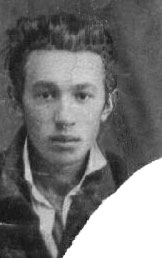

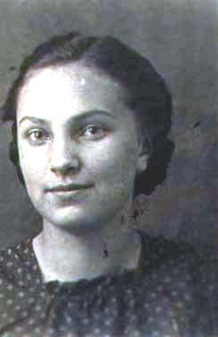

Dezember 1941 begann mit einem Schlag des linken Flügels der Kalininsker Front der Gegenangriff der sowjetischen Truppen bei Moskau. Am 6. Dezember gingen die Truppen des West- und des rechten Flügels der Süd-West-Fronten in die Offensive. Diesen Truppen wurden auf den Hauptachsen strategische Reserven hinzugefügt. Ende Februar 1942 wurden die deutsch-faschistischen Truppen unter für sie großen Verlusten auf 350-400 Kilometer gen Westen von Moskau zurückgeworden. Das Volk atmete erleichtert auf. Es wurde klar, dass die Faschisten «großräumig» niedergeschlagen werden konnten, dass ihr Plan eines «Blitzkriegs» gescheitert war. Die Winterprüfung legte ich ohne Dreien ab, sogar in der Geschichte der Allrussischen Kommunistischen Partei (Bolschewiken). Aber besonders stolz war ich auf die Eins, die mir auf Grundlage der Geometrie auf Seiten 15 des Studienbuchs (für das 7. Semester) W.F. Kagan verpasst hatte. Artjemenko nominierte mich als Kandidaten für das Stalin-Stipendium.

Die Winterferien verbrachte ich mit häuslichen Sorgen und Ruhelosigkeiten. Ernotschka drohte die Entlassung. Es wurde häufig gesagt, dass man sie nach Sibirien schicken könnte. Und von dort trafen bereits Briefe von Verwandten mit einer Das einzige erhaltene Foto aus Studentenjahren.Sie mit meinem Rita Konjuchowa Studentenausweis. Beschreibung aller Schrecken, die eine Umsiedlung mit sich brachte, ein. Auch von Petja kam ein Brief. Er riet Ernotschka beharrlich, mit den Kindern zu seinem Vater zu fahren, der nach der Aussiedlung in die Ortschaft Sarbalyk im Gebiet Nowosibirsk geraten war. Man begann die Sachen zusammenzupacken. Auch Lisa beschloss sich Ernotschka anzuschließen. Viele Male wurde über diese Entscheidung diskutiert. Ernotschka sprach plötzlich in Petjas Sprache: «Wir sollten mit unserem leidenden Volk zusammen sein». Mama und ich waren zu einer derartigen «Selbstverbrennung» nicht bereit. Es kam uns so vor, als ob sich mit Ernotschkas und Lisas Abreise der Zerstörungsprozess unserer Familie vollzog. Lalja und Alik, der zu diesem Zeitpunkt gerade ein Jahr alt war, lebten bei der Schwiegermutter in Danilowka, die Dort in den Klassen 5-7 Deutschunterricht erteilte. Und obwohl sie kein leichtes Leben hatte, vor allem, wenn man den unverträglichen Charakter Sophia Wladimirownas berücksichtigte, die unsere Familie und Lalinas intelligenten Angewohnheiten nicht leiden konnte, gab es keinerlei Hoffnung, dass sie nach Tambow umziehen würde. Alles ging so weit, dass Mama und ich allein blieben. Dabei war sie schon 67 Jahre alt. Ich begriff, dass irgendeine Quelle für den Lebensunterhalt notwendig war und wurde als Mathematiklehrer an einer der Vorort-Schulen eingestellt. Doch Mama lehnte diesen Schritt kategorisch ab. Sie war nur von dem einen Wunsch geleitet, dass ich den Abschluss am Institut machen würde. Zu diesen Sorgen kamen noch meine Gedanken an Rita. Sie suchten mich immer häufiger auf. Unsere äußerlichen Beziehungen gingen über eine Kameradschaft nicht hinaus. Doch wir fingen an uns öfter zu treffen, unsere Gespräche wurden offener. Ich versuchte mit aller Kraft mich vor ihr zu öffnen. Ich demonstrierte meine Begeisterung für Poesie, Philosophie und Mathematik. Ich berichtete ihr über den Inhalt der gelesenen Bücher. Einige davon gab ich ihr zum Lesen. Das letzte davon war die Arbeit des deutschen Philosophen und Idealisten G. Fichte mit dem floriden und anspruchsvollen Titel: «Eine Botschaft, klar wie die Sonne, an die breite Öffentlichkeit über das wahre Wesen der modernen Philosophie». Sie versuchte die Bücher zu lesen und führte mit mir sogar Streitgespräche über bestimmte Stellen. Jakowlew verschwand vollkommen unmerklich aus meinem Gesichtsfeld. Unsere Beziehungen hörten auf, für meine Freunde ein Geheimnis zu sein. Zu Hause wussten sie nichts. Und erst irgendwann im Februar 1942, als Mama die Fotografie entdeckte, die Rita mir geschenkt hatte, forderte Mama eine Erklärung. Ob ich Rita liebte? Freilich liebte ich sie, doch mit einer jugendlichen, meinem Alter nicht entsprechenden, Liebe. Das löste beständige Spöttereien seitens meiner Freunde aus. Der 8. März. Tag der Frauen. Der Abend ist dieser Veranstaltung gewidmet. Ein Vortrag, Laienspiel; entsprechend der Kriegslage ein wenig Tanzerei. Zahlreiche eingeladene Soldaten. Ich lege im Radiozentrum die Platten auf. Es geht gegen elf Uhr. Der Abend muss beendet werden, es herrschen Kriegszeiten. Iswjekow mit Inessa und Saschin kommen herein. Sie ziehen sich an und gehen. Zurück bleiben Rita und ich. Ich muss sie begleiten. Ich schalte die Geräte aus und schließe die Tür des Raumes ab. Wir gehen hinunter. Am Wachthäuschen gebe ich den Schlüssel ab. Ich knöpfe den pelzgefütterten Studentenmantel zu. Wir treten auf die Straße hinaus. Es ist unerwartet kalt. Wir gehen nebeneinander, tauschen ab und an unsere Eindrücke über den vergangenen Abend aus. Ich unternehme einen schüchternen Versuch ihre Hand zu nehmen und bekommen selbst Angst. Der Frost sticht in den Ohren, die gestrickte Baskenmütze wärmt nicht. Rita trägt eine breite Pelzboa, für sie ist es nicht so schlimm. Zitternd stelle ich den schmalen Kragen mit dem Samtbesatz auf. Ich halte ihn abwechselnd gegen das eine und gegen das andere Ohr. Wir haben einen weiten Weg, unser Gespräch ergibt keinen Sinn. Das ist keine Liebe, das ist Qual. Und dann die letzte Biegung, die Reihe mit den kleinen Privathäuschen, die Gartenpforte. Ich suche meine Gedanken zusammen, um noch etwas geistvolles zum Abschied zu sagen. Und in dem Augenblick gibt Rita, die die Ecken meines Kragens zusammennimmt und meinen Kopf zu sich heranbeugt, mir einen Kuss auf die Lippen. Sie küsst mich, öffnet das Türchen und rennt, ohne mir Zeit zur Besinnung zu geben, nach Hause. Das war mein erster Kuss. Bis zur Verhaftung blieben weniger als acht Stunden...

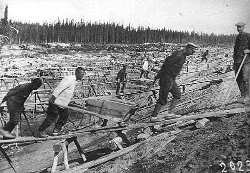

## Teil II. Hinter Stacheldraht

### Kapitel 8. Verhaftung

Der 9. März 1942. Früh am Morgen. Ich erwachte in dem Gefühl, dass etwas sehr Schönes geschehen war. Wie sollte es? In Ernotschkas Zimmer brennt Licht. Sie macht sich für die Arbeit fertig. Mama kommt leise herein, um mich nicht aufzuwecken, nimmt etwas aus der Schublade, legt es daneben auf den Stuhl – vermutlich Socken. Sie schließt die Tür und geht. Wie spät ist es? Denn heute muss ich früher los. Im Radioraum ist nichts aufgeräumt. Und da begreife ich, worin der Grund für meine gute Laune liegt: der gestrige Abend, Rita. Ich ziehe mich an und denke dabei an das, was geschehen ist. Wie konnte es passieren, dass sie zu mir fand, warum hat sie mich geküsst – ausgerechnet auf die Lippen? Es konnte nicht sein, es hätte nicht passieren dürfen. Vielleicht ein Witz, ein Streich, eine Laune? Die gute Laune ist dahin.

Ich frühstücke in aller Eile, stopfe die Hefte, die ich benötige, unter meinen Gürtel und verlasse das Haus. Es ist deutlich wärmer geworden, ab und zu fallen in paar Schneeflocken aus dem düsteren Himmel. Aber es ist mir egal. Ich muss rechtzeitig vor Beginn des Unterrichts den Raum vorbereiten. Ich rutsche auf dem schneebedeckten Eis, stoße auf Leute, die zur Arbeit eilen und renne durch die noch dunklen Straßen der erwachenden Stadt. Im Kopf habe ich nur den einen lastigen Gedanken: «Wie soll ich mich jetzt, nach dem, was geschehen ist, ihr gegenüber verhalten? Nur gut, wenn unsere Begegnung in Anwesenheit von anderen Leuten stattfindet, aber was ist, wenn wir allein sind?».

Endlich taucht das Gebäude des Instituts vor mir auf. Die schäbige, unansehnliche Tür öffnet sich mit einem dumpfen Stöhnen. Ich hole beim Wärter den Schlüssel ab, begebe mich in den dritten Stock und schließe die Tür auf. Rita ist nirgends zu sehen. Dabei kommt sie normalerweise sehr früh, lange vor dem Klingelzeichen. Eine Musterstudenten, sie hat Angst zu spät zu kommen. Schließlich hat sie einen weiten Weg. Aber heute ist sie aus irgendeinem Grund nicht da. Warum? Vielleicht hat sie, genau wie ich, Angst vor der Begegnung?

Ich räume die Geräte auf, wickle die Leitungen ab, stelle die Tische und Stühle auf. Schritte ... Jemand geht auf dem Korridor. Ich lausche, halte den Atem an. Aber es ist nicht sie, nicht sie. Schlurfende Schritte, heiseres Atmen. Der Wärter. Der Direktor lässt mich holen. Wozu denn das? Ich begebe mich in den ersten Stock, klopfe an die mit schwarzem Kunstleder bezogene Tür. Ich trete ein. Im Kabinett elektrische Beleuchtung. Die Fenster sind mit schweren Vorhängen verhängt (Verdunklung!). Der Parteiorganisator schließt die Tür hastig mit einem Schlüssel ab. Merkwürdig?! Der Direktor, der mich sonst immer so gut behandelt hat, verhält sich diesmal streng und kurz angebunden: «Setzten sie sich dorthin, von den Organen erhielten wir...». Ohne ihn zu Ende reden zu lassen erhoben sich vom Tisch, der mit dem des Direktors eine T-Form bildete, zwei Personen. Beide zivil gekleidet. Beide mit wässrigen, ausdruckslosen Augen und hölzernen Gesichtern. Einer von ihnen, der ältere, legt den Haftbefehl vor. Der andere betastet mit schnellen, geübten Händen meinen wie vor Kälte zitternden Körper. Nur ein kurzer Augenblick – und schon stehe ich mit umgedrehten Taschen, aufgeknöpftem Kragen, geöffnetem Hosengürtel und aufgeschnürten Stiefeln da. IUn meinem Kopf Verwirrung und Bestürzung. Eine Flut von Gefühlen und die gewöhnliche Frage in solchen Situationen: «Wofür?». Ob ich das hörbar ausgesprochen habe, weiß ich nicht mehr. Ich erinnere mich nur noch, dass der erste brennende Gedanke der Gedanke an Mama war. Die unglückliche, alte Frau, was werde ich ihr jetzt sagen, wie wird sie ohne mich leben, wird sie auf meine Freilassung warten? Und Rita, was wird sie denken?

Als sie mich aus dem Gebäude führten, hatte der Schneefall bereits aufgehört und eine kalte Sonne schien zwischen den zerrissenen Wolkenfetzen hindurch. Verspätete Studenten kamen uns entgegen. Ob sie begriffen, wer mich fortbrachte und wohin? Dann fand die erste Fahrt mit einem PKW in meinem Leben statt. Als wir uns unserem Haus näherten, war mir klar, dass es eine Durchsuchung geben würde. Aus Gewohnheit wollte ich ans Fenster klopfen, um meine Ankunft anzukündigen. Doch die Tschekisten, die mich begleiteten, fingen meine Hand mit einer derartigen Schnelligkeit und Kraft ab, als ob sich eine Granate darin befände.

Bei unserem Erscheinen begriff Mama sofort, was los war, und, während die Haussuchung lief, traf sie Vorbereitungen für meine Reise. Sie buk Fladen auf dem Kerosinkocher, nahm frische Unterwäsche aus der Kommode, Seife, eine Zahnbürste und packte alles in ihre alte Einkaufstasche. Einen Moment stand sie unschlüssig da, dann holte sie Petjas Wollsocken, steckte sie ebenfalls in die Tasche und ließ sich, erschöpft von dem, was sie erlebte, auf einen Stuhl nieder. Alt, runzlig, mit Tränen in den Augen. Und keine einzige Frage, kein Wort des Vorwurfs. Nur stille Verzweiflung und Hoffnungslosigkeit. Und keine Möglichkeit Worte des Trostes auszusprechen. Jeder Versuch etwas zu sagen, wurde unverzüglich von den Tschekisten unterbrochen, die eifrig in Büchern, Heften und Wäsche wühlten. Ich versuche ihr wenigstens durch einen Blick Mut zu machen, sie zu beruhigen, aber sie antwortet nur mit einem erbärmlichen Lächeln, schüttelt mit dem Kopf, und über ihre schlaffen Wangen rollen in einem fort die Tränen.

Und dann ist die Durchsuchung beendet. Eifrig packen die Tschekisten in eine große Segeltuchtasche konfiszierte Bücher, vorwiegend deutsche, in gotischer Schrift geschriebene. Die Zeugen gehen, nachdem sie einige Protokolle unterschrieben haben. Ich blicke mit Schrecken auf meine stumme, alte Mama, die wie benommen auf ihrem Stuhl sitzt. Nun wird sie zwischen den auf den Boden geworfenen und auf den Stühlen herumliegenden Büchern und Wäschestücken ganz allein zurückbleiben. Auge in Auge mit ihrem unermesslichen Kummer.

Das war‘s! Die letzten Schritte zur Tür. Und in dem Augenblick stürzt sie sich auf mich, umarmt mich und flüstert: «Robotschka, mein Liebling, das war’s, in diesem irdischen Leben werden wir uns nicht mehr wiedersehen, möge Gott dich beschützen». Grob wird sie fortgezerrt, die Eingangstür schlägt zu, und sie schleppen mich zum Auto. Der Motor brummt. Und schon trägt das Fahrzeug, über den unebenen Boden ruckelnd, mich fort in den ersten Kreis der Hölle. Das war‘s! Auf Wiedersehen, meine geliebte, gute Mamotschka. Niemals wird irgendjemand so lieben können wie du: mit so viel Geduld und Selbstlosigkeit. Niemals wird irgendjemand dich ersetzen können.

Und dann kam das innere Gefängnis des NKWD. Ein riesiges graues Gebäude auf dem Tambower Marktplatz. Scheinbar endloses Sitzen in irgendeinem dunklen, aus Brettern zusammengehauenen Schrank oder Kabuff. Sorgfältige Durchsuchung, splitternacktes Ausziehen; Kahlscheren; Waschen, nachdem sie mir Wäsche, Oberbekleidung und Schuhe ohne Knöpfe und Schnürbänder zurückgaben. Schließlich das Abnehmen der Fingerabdrücke und Fotografieren im Profil von links, rechts und vorn. Mit der linken Hand meine rutschende Hose festhaltend, unterschreibe ich irgendwelche Auflistungen, Protokolle, Schriftstücke. Doch die übliche Frage in solchen Fällen «wofür?» stelle ich nicht. Für sie bin ich ein Verbrecher und Feind. Ich hatte Angst vor Schlägen und Misshandlungen, aber das geschah nicht. Die am meisten demütigende Prozedur war wohl das «Scheren», als eine junge und recht sympathische Frau in der Uniform einer Mitarbeiterin des NKWD ohne viel Federlesens, wie es auch bei Vieh gemacht wird, alle behaarten Teile meines nackten Körpers rasierte.

Und dann schließlich die Einzelzelle, lang und schmal, wie die Federtasche eines Schülers. Ein Eisenbett, ein Tisch und ein Hocker. Am fernen Ende, an der Decke, ein mit einem Eisengitter versehenes Fenster oder Fensterausschnitt. An der gegenüberliegenden Seite eine schwere, eisenbeschlagene Tür, in deren Mitte sich ein kleines Ausgabetürchen befindet, und darüber ein Guckloch, durch das ab und zu der Wärter hereinschaut. Über der Tür, in einer Aussparung, eine grelle, mit einem Gitter umgebene, Glühbirne, vor dessen durchdringendem Licht man sich weder am Tag noch in der Nacht verbergen kann. Auf dem Boden neben der Tür der ständige Begleiter des Gefängnislebens – der Eimer für die Notdurft. Hier sind links an der Wand Anweisungen aufgeklebt: «Rechte und Pflichten des Häftlings».

Als die Tür mit einem metallischen Klirren zugeschlagen worden war du sich der Schlüssel bedrohlich im Schloss gedreht hatte, starrte ich, niedergeschlagen von all den Geschehnissen, als erstes auf diese Instruktionen. Und nicht deswegen, weil ich wissen wollte, was mir in diesem Kerker erlaubt war, sondern weil mich der eigentliche Vorgang des Lesens beruhigte. Wieder und wieder las ich den primitiven Text, bewegte dabei sogar die Lippen, konnte aber nichts davon begreifen. In meinem Kopf krochen völlig andere Gedanken herum, völlig andere Bilder.

Nach dem ich mich ein wenig beruhigt hatte, trat ich zum Fenster. Selbst für mich war es schwierig dort heranzureichen. Ich wollte das nicht genauer nachprüfen, dafür konnten sie mich in den Karzer stecken. Vor dem Fenster sah man lediglich einen kleinen Wolkenfetzen, so weit entfernt, so unerreichbar. Der Tisch, der Hocker und das Eisenbett, fest im Zementboden verankert. In der Luft hing der schwere Geruch des Kübels für die Notdurft und der in der Trocken-Kammer gedämpften, groben Decke. Ich war todmüde, wollte mich gern hinlegen, aber bis zum Appell war das kategorisch verboten. Mittagessen. Der Aufseher steckte mir durch die geöffnete Klappe ein 200-Gramm-Stück Brot, eine heiße Schüssel aus Metall mit Wasserbrühe und ein paar Löffeln Haferbrei. Aber mir war nicht nach Essen zumute. Außerdem befanden sich in der Tasche, eingewickelt in Papier, Mamas Fladen. Am Abend das Abendessen: ein dünnes Stückchen Brot und gesüßter Tee. Für Kriegszeiten erträglich.

Die Nacht war aufreibend. Das grelle Licht der Glühbirne blendete. Jeder Versuch sich umzudrehen oder die Augen mit der Decke zu bedecken wurde unverzüglich vom Aufseher unterbunden. Als ich endlich eingeschlafen war, kamen die Alpträume. Immer wieder wurde ich wach, und jedes Mal kam mir das Geschehene wieder ins Bewusstsein, und ich machte alles noch einmal durch.

Und die Tage des Gefängnislebens zogen sich in einer langen, eintönigen Folge hin. Aufstehen, Gang zur Latrine, Frühstück, Mittagessen, Abendessen, Signal zur Nachtruhe – das waren die zeitlichen Orientierungslinien. Zweimal die Woche «Spazierengehen» am Boden eines steinernen Brunnens, welcher als Wanderhof bezeichnet wurde. Und völlige Ungewissheit. Weswegen haben sie mich festgenommen? Wegen meiner Nationalität? Wegen Onkel Robert? Wegen meiner Begeisterung für Radiotechnologie? Für meine Gespräche mit Simatsch? Für meine Streitigkeiten mit Filin? «Meine Nationalität kann kaum ein Grund dafür sein», dachte ich. Auf jeden Fall werden sie nicht darauf herumdrücken. Man kann sich auf Marx, Engels und Thälmann beziehen. Onkel Robert? Aber über den wusste ich nichts Genaueres. Ich wusste nicht einmal, ob er noch am Leben war. Schließlich musste er schon weit über siebzig sein. Das Radio? Aber ich hatte doch schon in den ersten Kriegstagen, sobald die Verfügung der Behörden gekommen war, den Rundfunkempfänger mitsamt allen Einzelheiten, bis hin zum letzten Draht, abgegeben. Sogar den Lötkolben hatte ich weggebracht. Auch während der Haussuchung wurde absolut nichts gefunden, und es scheint, dass sie auch nach nichts gesucht haben. Die Gespräche mit Simatsch? Das ist schon eine schwerwiegendere Angelegenheit. Dafür konnte man tatsächlich eingesperrt werden. Aber die waren schon lange her und wurden auch nur zu zweit geführt. Und was hatten sie eigentlich beinhaltet? Es hatte doch keine Pläne, keine Verschwörungen gegeben. Lediglich allgemeine Ansichten über die Geschehnisse im Lande. Außerdem hatte hauptsächlich Simatsch geredet, während ich vorwiegend zugehört hatte. Nein, hier muss man alles zurückweisen, beschloss ich. Zurückweisen, um nicht einem Freund Unheil zu bereiten. Bleibt nur noch Filin! Möglicherweise haben Sozialkundler sich beschwert. Aber all diese Streitgespräche betrafen doch hauptsächlich philosophische Probleme der Mathematik und Physik. Worüber hatten wir denn das letzte Mal gestritten? Ja, natürlich, über die Natur der mathematischen Kenntnisse: entdeckt ein Mathematiker seine Theoreme als Naturwissenschaftler oder knobelt er sie als Ingenieur aus? Interessiert mich diese Frage wirklich, oder ist sie nur der Anlass, um ein Streitgespräch zu führen, um den Kameraden und vor allem Rita mein Wissen zu demonstrieren? Wem konnte das schaden und worin besteht hier der Tatbestand eines Verbrechens? Was noch? Freilich gab es verborgene Gedanken und Gefühle, aber über sie hatte ich niemals, außer mit Simatsch, gesprochen. Obgleich in den Gesprächen mit Rita meine Antipathie gegenüber dem Führer, der Partei, den Tschekisten hindurchgeschlüpft sein mochte. Ich wollte so gern originell, nicht standardisiert, sein. Im Großen und Ganzen erinnerte ich mich schlecht daran, worüber ich mit ihr sprach. Ich wusste nur, dass es nicht um Liebe ging. Wenn doch nur bald das Verhör käme, dachte ich.

Abends, nach dem Signal zur Nachtruhe, als ich mich auf der harten, knarrenden Bettstelle herumwälzte, wanderten meine Gedanken nach Hause. Ich versuchte mir vorzustellen, was Mama, Ernotschka, Lisa, die Kindchen machten. Aber immer wieder tauchte das Bild von der Haussuchung auf. Wie hatte sie das alles überstanden? War sie gesund? War sie am Leben? Und wenn sie sie nun ebenfalls verhaftet hatten? Denn für die war ihr fortgeschrittenes Alter kein Hindernis. Sie steckten auch Achtzigjährige ins Gefängnis. An Rita dachte ich merkwürdigerweise nur selten.

Erst einen Monat nach der Verhaftung ließ der Ermittlungsrichter mich zu sich rufen, als meine Seele bereits ganz den Vermutungen und Erlebnissen verfallen war. Sie holten mich mitten in der Nacht. Verschlafen, ungewaschen, die rutschende Hose festhaltend, gehe ich über lange, widerhallende Korridore. Vor und hinter mir jeweils ein Wachmann, an den Seiten eine endlose Reihe eisenbeschlagener Türen. Dann eine Wendeltreppe in einem engen Steinbrunnen, welche die oberen Etagen des Gebäudes durchschneidet – die Hochburg des Tambower NKWD. Über und unter mir das stampfende Geräusch von Stiefeln auf den Eisenstufen. Eine letzte Wende, eine Plattform – und wieder ein Korridor mit einer Reihe Türen. Nur ist der Korridor hier merklich höher, es sind weniger Türen, und sie sind auch nicht aus Eisen. Wir betreten einen abgedunkelten Raum. Ein großer Schreibtisch. Auf dem Tisch eine Scheinwerferlampe, die genau auf mein Gesicht gerichtet ist. Es ist schwierig irgendetwas zu erkennen. Eher anhand der Stimme als am Habitus komme ich zu dem Schluss, dass der Untersuchungsrichter noch sehr jung ist. Die Stimme ist leise, ruhig, fast sogar einschmeichelnd.

Nach mehreren Protokollfragen begann das Verhör, welches, wie ich jetzt verstehe, anfangs einen ungewöhnlichen Charakter in sich trug, es war eher wie eine Unterhaltung zwischen zwei Bekannten. Der Ermittlungsrichter befragte mich sachkundig über das Institut, das Lernen, die Lehrer, die Kameraden. Er hatte hinreichende Kenntnisse über sie, wusste häufig mehr als ich. Die Lehrer nannte er mit Vor- und Vatersnamen. Besonders beharrlich fragte er mich über Saschin aus. Und das wunderte mich. Ihn kannte ich nicht so gut wie die anderen. Kein Wort fiel über Simatsch, Onkel Robert und meine Begeisterung für die Radiotechnik. Und das beruhigte mich. Nach und nach ging die Unterhaltung auf philosophische Themen über. Ich geriet problemlos in den mir präsentierten Kommunikationsstil und stürzte mich, jegliche Vorsicht verlierend, in eine Diskussion über abstrakte philosophische Themen. Der Ermittler war sehr geduldig, ermutigte mein Gerede auf alle nur erdenkliche Weise. Nur bisweilen stellte er Zwischenfragen, welche die Bedingungen konkretisierten, in denen ich zuvor einen entsprechenden Gedanken geäußert hatte, wann und wo, wer dabei anwesend gewesen war. Immer wieder kehrte er zu einer von mir auf einem der Seminare ausgesprochenen Überzeugungen zurück, dass man die Gesetze der Dialektik in Bezug auf die Mathematik nicht vereinfacht interpretieren darf, dass es zwischen Addition und Subtraktionen, Differenzierung und Integration keinen «Kampf der Gegensätze» gibt, wie einer der Studenten behauptet hatte.

Das zweite Verhör, das ebenfalls nachts stattfand, verlief härter und beschäftigte sich mit für mich sehr merkwürdigen Fragen. Beispielsweise interessierte sich der Ermittler dafür, ob ich beim Schachspiel im Foyer des Kinotheaters «Modern» gesagt hätte, dass, dort eine rote Laterne fehle. Ich erinnerte mich an den Fall. Tatsächlich hatte ich bei einem der Besuche dieser geliebten Einrichtung, nachdem ich entdeckt hatte, dass sämtliche blauen und grünen Samtvorhänge durch roten Chintz ersetzt worden waren, gesagt, dass in diesem Fall auch die blauen Deckenleuchten gegen rote ausgetauscht werden müssten. Ich konnte allerdings nicht begreifen, was dem Untersuchungsrichter daran nicht gefiel. Und das brachte ihn in Wut: «Wie kann es sein, dass du so gebildet bist und Kuprins «Grube» nicht gelesen hast, - sagte er, wobei er mich zum ersten Mal mit «du» anredete. Ich hatte es tatsächlich nicht gelesen. Doch er glaubte mir nicht und beschuldigte mich, ich hätte die Farbe des Blutes und der Revolution des Volkes verspottet. Anschließend war die Rede von irgendeiner, offenbar sehr patriotischen, Kinozeitschrift, die dem Film «Der große Walter» vorangegangen war, aus dessen Anlass ich sehr unklug von «blauem Bodensatz» gesprochen hatte. Obwohl ich mich kaum an den Inhalt der besagten Zeitschrift erinnern konnte, war doch «blauer Bodensatz» in jenen Jahren meine Lieblingsbewertung, und es konnte gut sein, dass ich sie so ausgesprochen hatte, was ich dem Ermittler auch sagte.

Schließlich kam der Satz «Wird es auch in unserer Straße einen Festtag geben», den angeblich einer von uns beiden – entweder ich oder Saschin – ausgesprochen hatte. Ich hatte so etwas nicht gesagt. Er fand sich schlicht und ergreifend nicht in meinem Wortschatz, und mit gutem Gewissen beharrte ich darauf. Der Untersuchungsrichter, der meine Aussage ignorierte, verlangte eine Erklärung, welchen Sinn wir in diesen Satz gelegt hätten.

Später, zurückgekehrt in die Zelle, zerbrach ich mir den Kopf darüber, wer der Informant gewesen war. Den größten Verdacht in mir hegte Saschin, doch die folgenden Ereignisse zeigten mir, dass ich mich irrte. Wie sich herausstellte, war Saschin ebenfalls verhaftet worden, und unsere Strafsache überkreuzte sich mit diesem unglückseligen Satz über den Festtag in unserer Straße. Man veranstaltete sogar eine Gegenüberstellung zwischen uns, in der Saschin steif und fest alles leugnete. Ich war verblüfft darüber, wie er mit dem Ermittler redete, scharf und kategorisch. Freilich war er drei Jahre älter als ich, hatte in der Armee gedient, war erfahrener und selbständiger. Und trotzdem war das Wichtigste der Unterschied in unseren Charakteren. Ich hätte nicht einmal meine Zunge gedreht, um alles so abzustreiten.

Nach einem der nächsten Verhöre führten die Wachmänner mich in eine andere Zelle, und ich geriet sogar in Missstimmung, denn ich hatte mich an meine alte bereits gewöhnt. Die neue Zelle war bereits belegt: ein großer Mann mit blassem Gesicht und einem zotteligen roten Bart saß auf der Pritsche, den Kopf in die Hände gestützt und leise stöhnend. Er rührte sich nicht einmal bei meinem Erscheinen. Die zweite Bettstelle war frei und gehörte offensichtlich mir. Als der Wärter ging, machte er eine kurze Pause, sah mich aufmerksam an und meinte mit dumpfer Stimme «Was bist du, die nächste Lockente? Bist du dafür nicht zu jung?» Aus irgendeinem Grund erinnere ich mich an seine blauen, tief eingesunkenen Augen. Ich versuchte mich zu rechtfertigen, meine Geschichte zu erzählen. Aber je mehr ich sprach, um so misstrauischer hörte er mir, wie mir schien, zu. Ich fühlte mich gekränkt und verstummte. Bis zum Wecken waren es noch zwei Stunden. Unmerklich schlief ich ein. Wir sprachen fast den ganzen Tag nicht miteinander. Aber am folgenden Tag redeten wir trotzdem. Am Ende erzählte er auch etwas von sich. Er sagte, dass er mit Nachnamen Stakun hieße, dass er vor dem Krieg zweiter Sekretär des Weißrussischen Zentralkomitees gewesen sei, dass er entweder in Kriegsgefangenschaft oder in Umzingelung gewesen sei (ich weiß es jetzt nicht mehr), und dass sie jetzt durch Schläge ein Geständnis wegen Anwerbung aus ihm herausprügeln wollten. Ich hörte ihm ungläubig zu und verdächtigte ihn, wie er mich am Vortag, der Spitzelei. Vieles schien mir verdächtig: nicht nur, dass sich ein solcher Dienstgrad nicht im Moskauer Gefängnis befand, dass man mich, einen Alltagsverbrecher, ein Plappermaul zu ihm in die Zelle gesteckt hatte, dass er einen Bart trug (ich dachte, dass alle rasiert und geschoren würden), sondern auch, dass mitten in der Nacht, als man mich zum Verhör geführt hatte, er nicht auf seinem Bett gelegen hatte, womit er gegen die strengen Regeln verstieß, und dann noch der merkwürdige Nachname. Aber es war interessant ihm zuzuhören. Er berichtete von vielen in der Politik wohlbekannten Leuten, häufig über Dinge, die uns erst jetzt bekannt wurden. Er brachte mir bei, wie man sich bei Verhören verhält (wäre das doch nur früher geschehen!). Und ich, verstört von all dem, was ich vernahm, hörte ihm schweigend zu, ohne ihn zu unterbrechen, ohne zwischendurch eine Frage zu stellen, ohne irgendein Interesse zu bekunden.

Als der Ermittlungsrichter beim nächsten Verhör erfuhr, dass ich einige Tage zusammen mit Stakun in einer Zelle verbracht hatte, tat er entweder nur so oder wurde tatsächlich wütend und rief sogar (in meiner Anwesenheit!) jemanden herbei und forderte ihn auf, mich in meine vorherige Einzelzelle zurückzubringen.

Ich war überzeugt, dass die Begegnung mit Stakun eine extra gespielte Provokation darstellen sollte, allerdings konnte ich nicht verstehen, mit welchem Ziel sie durchgeführt worden war. Für mich hatten die Geschehnisse keine Folgen. Und der Untersuchungsrichter ging in den Gesprächen mit mir auch nicht mehr darauf ein. Aber das, was Stakun erzählt hatte, sank tief in meine Seele ein.

Nach fünf, maximal sechs Verhören begründete der Ermittler, indem er die schlimmsten «kriminellen» Passagen ins Protokoll schrieb, die Inhaftierung damit, dass Saschin und ich antisowjetische Agitation unter den Studenten betrieben hätten. Ich protestierte und verkündete, dass ich niemals irgendwo Agitation betrieben hätte, und selbst wenn ich ab und zu auf Seminaren Streitgespräche geführt hätte, dann nur deswegen, weil ich mir unverständliche Dinge verstehen wollte. Irgendein NKWD-Dienstgrad, der bei diesem letzten Verhör anwesend war, offensichtlich der Chef meines Untersuchungsrichters, verkündete mit einer Stimme, die keine Widerrede zuließ: «Es geht nicht darum, was du tun wolltest, sondern um das, was geschehen ist. Du hast Gedanken ausgesprochen, die schädlich für unseren Aufbau, unser Land sind, und hast damit dem Staat Schaden zugefügt, der nun bestraft, hart bestraft werden muss».

Später, nachdem ich in die Zelle zurückgekehrt war, dachte ich lange darüber nach, was passiert war. Niemand hat mich zu irgendetwas gezwungen, an meiner Zunge gezogen. Ich selbst habe dem Ermittler wie im Geiste fast alles dargelegt, was mich quälte. Ich habe praktisch nichts zurückgewiesen. Meistens wimmelte ich mit den Worten ab: «Ob ich das gesagt habe oder nicht, erinnere ich nicht mehr, aber möglich ist es». Aber was wäre gewesen, wenn ich, wie Saschin, alles abgestritten hätte?

Anscheinend war für ein derart vorbildliches Verhalten die Haltung mir gegenüber recht erträglich: niemand schlug, niemand folterte mich. Man erlaubte mir die Gefängnis-Bibliothek zu benutzen, wobei sie mir überraschenderweise hauptsächlich politische und philosophische Literatur zu lesen gaben. Allerdings durfte ich keine Briefe schreiben, keine Briefe und Pakete empfangen und auch niemanden wiedersehen. Der Prozess fand am 3. Juni 1942 statt. Saschin und ich wurden beide nach den traurig-berühmten Paragrafen 58-10,11, Abs. 2, verurteilt. Punkt 10 bedeutete antisowjetische Agitation, Punkt 11 – Gruppen- Aktivitäten, und Abs. 2 – dass die Tätigkeit in Kriegszeiten begangen worden waren. Der Prozess war nichtöffentlich. Nichts Vergleichbares mit dem, was in solchen Fällen heutzutage im Fernsehen gezeigt wird. Keine Stühle mit übermäßig hohen Lehnen, keine Roben, keine speziellen, abgegrenzten Gehege für die Angeklagten, keine Verwandten, keine Bekannten oder einfach Zuschauer, die einen Prozess beleben, kein feierliches «Aufstehen, der Richter kommt!».

Alles vollkommen alltäglich. Ein recht großer, langgezogener Raum. Am entfernten Ende drei große und schmale Fenster, wie in einer Kirche. Das mittlere ist mit Steinen zugemauert. Die anderen beiden sind mit dunklen Vorhängen verhängt. Im Raum ist es schummrig. Hinter einem großen Schreibtisch sitzen drei oder vier Leute in Zivilkleidung. Offenbar Richter und Ankläger. Lotrecht zum Haupttisch ein weiterer, schmal und lang. An seinem entfernten Ende, näher bei den Richtern, ein alter Mann, grau und unscheinbar, der Pflichtverteidiger. Ihm gegenüber - die Zeugen. Links der Tür zwei Stühle. Für Saschin und mich. In den Türen, an die Pfosten gelehnt, zwei Wachleute. Ich betrachte die Anwesenden. Die Gesichter der Zeugen sind nicht zu sehen, ihre Rücken zeigen zu uns, aber zwei erkenne ich, sie sind aus unserer Gruppe. Neben ihnen ein Mädchen, ganz in Schwarz, sogar der Kopf ist mit einem schwarzen Tuch bedeckt. Wie auf einer Beerdigung, dachte ich. Ich schaue genauer hin. Irgendetwas kommt mir bekannt vor, was ich nicht genau verstehen kann. Und plötzlich... mein Herz gefriert. Ist das nicht Rita?! Aber warum in so einer merkwürdigen Kleidung und dann noch mit einem Kopftuch? Nie zuvor habe ich sie in so einer Kleidung und schon gar nicht mit einem Kopftuch gesehen. Ich versuche genauer hinzusehen, aber die Stuhllehne und das Halbdunkel hindern mich daran. Nie zuvor hätte ich gedacht, dass ich einen Menschen, zudem noch einen geliebten, auf fünf Schritte Entfernung nicht erkennen kann. Ich versuche von der Seite hinzuschauen, aber der Ruf des Wachmanns hält mich auf.

Der Prozess begann. Ein paar allgemeine Fragen zur Bestätigung unserer Identität. Danach die Rede des Anklägers, der die Höchststrafe forderte. Einige Fragen an die Zeugen. Sie erhoben sich der Reihe nach und bestätigten die Anklagepunkte: «Ja, das hat er gesagt, das habe ich gehört». Und dann endlich erhob sich auch das Mädchen in Schwarz. Welche Frage man ihr stellte, konnte ich nicht hören. Aber die Hauptsache – es war nicht Rita. Meine Seele jublte «nicht Rita, nicht Rita». Und plötzlich, als ob mir Watte aus den Ohren gefallen wäre, vernahm ich ihre Stimme:

– Ich erinnere mich nicht, ich habe es nicht gehört, in meiner Anwesenheit hat er das nicht gesagt.

Wer ist sie, was hat sie nicht gehört, wie kann sie es wagen zu leugnen? Möglich, dass diese Worte sich auf Saschin bezogen oder zu unserem Nachteil gesagt wurden. Ich kannte die Frage nicht, also konnte ich darüber nicht urteilen. Doch der Tatbestand des Leugnens an sich war für sie ungewöhnlich und gefährlich.

Der Verteidiger, erschrocken von seinen eigenen Worten, stammelte etwas Unverständliches, und schon wird uns das letzte Wort erteilt. Zuerst spricht Saschin. Zu meiner Verwunderung leugnet er nichts, mehr noch, er bereut die begangenen Verbrechen und bittet darum, ihn an die Front zu schicken, damit er seine Schuld in Blut waschen kann. Was ich sagte, weiß ich nicht mehr, ich war wie im Fieberwahn, ich weiß nur eines, alles, was gesagt wurde, war nicht so sehr für die Richter bestimmt, als vielmehr für Rita in Gestalt der geheimnisvollen Unbekannten in Schwarz. Es war mir so wichtig in ihre Augen zu schauen, mutig und beherzt. Nach allem zu urteilen, gefiel den Richtern mein Auftritt nicht. Jedenfalls hob der Richter mein seltsames Verhalten während der Verhandlung vor der Verkündung des Urteils hervor.

Und dann das eigentliche Urteil. Saschins Bitte wird erfüllt, man schickt ihn an die Front in ein Strafbataillon. In meinem Fall hielt es das Gericht für unerlässlich, entsprechend Artikel 58-10- 11, Absatz 2, die Höchststrafe zu verhängen. Hier machte der Richter eine kleine Pause, und das Mädchen in Schwarz senkte seinen Kopf.

– Allerdings, – fuhr der Richter fort, – wäre es angesichts des Alters des Angeklagten und seines Verhaltens während der Ermittlungen möglich, die Höchststrafe durch zehn Jahre Besserungs-/Arbeitslager mit allgemeinem Haftregime zu ersetzen.

Ich nahm das Urteil ruhig, sogar gleichgültig auf. Immerhin hatte der Ermittlungsrichter mich viele Male vorgewarnt, dass mir zehn Jahre garantiert wären. Erheblich mehr beunruhigte mich die Frage, wer dieses Mädchen war. Ich hoffte, dass jetzt alle aufstehen würden und ich ihr Gesicht sehen könnte. Aber Saschin und ich wurden als erste hinausgeführt, und so blieb ich im Dunkeln.

Sofort nach der Verhandlung transportierten sie mich in einem «schwarzen Raben» ab. Aber nicht ins Ermittlungsgefängnis, in dem ich 90 Tage verbracht hatte, und an das ich mich bereits gewöhnt hatte, sondern ins städtische Gefängnis, das sich am gegenüberliegenden Ende der Stadt befand. Ein altes Gefängnis, erbaut lange vor der Revolution. Vor seinen Fenstern hängen «Maulkörbe» - eiserne Abschirm-Vorrichtungen, welche die Häftlinge daran hindern, Signale in die Freiheit zu geben. Wegen dieser «Maulkörbe» scheint das Gefängnis blind zu sein. Die Zelle, in die mich der Wachmann stieß, wird beinahe vollständig von hölzernen zweistöckigen Pritschen eingenommen. Auf den Pritschen etwas zwölf Mann. Alle mit nacktem Oberkörper. S herrscht eine ungeheure Hitze und Schwüle. Zwischen Pritschen und Wänden nur wenig freier Raum. Dort steht ein riesiger Kübel für die Notdurft. Kein Tisch, kein Stuhl. Ich stehe mit Mamas Tasche in den Händen da und erinnere mich mit Sehnsucht an meine Einzelzelle. Scheinbar schenkt mir niemand Beachtung. Alle sind mit ihren eigenen Angelegenheiten beschäftigt. Einer flickt, mit einer Nadel in der Hand, nach Männerart ungeschickt seine Kleidung, einer sucht in den Nähten seines Hemdes, das er ausgezogen hat, nach Ungeziefer, einer liest, ein anderer liegt einfach nur so auf seiner Pritsche da. Man sieht sofort, dass die Haftbedingungen hier milder gehandhabt werden als im Untersuchungs-Isolationsgefängnis. Die Pause zieht sich hin. Ich bleibe weiter stehen, wechsle von einem Bein auf das andere. Ich weiß nicht, was ich als nächstes tun soll. Auf den Pritschen ist kein einziger freier Platz zu sehen. Nach und nach drehen die Zellenbewohner ihre Gesichter in meine Richtung. In ihrem Blick verbirgt sich eine Frage. Ich grüße, teile ihnen meine Gefängniskoordinaten mit: den Paragrafen und die Haftdauer. Alle schweigen. Vielleicht habe ich eine Dummheit begangen, und alle werden gleich lachen. Aber nein, alle schweigen. Scheinbar sind alle älter als ich. Aber vielleicht kommt mir das auch nur so vor, wegen der vielen Borsten, die sie im Gesicht tragen. Manche haben einen Bart. Endlich winkt einer mit akkuratem Professorenbart mich zu sich heran, schlägt seine Beine unter und gibt mir die Möglichkeit mich zu setzen. Er war tatsächlich Lehrer an einer Universität, wenn auch kein Professor. Verurteilt, ebenso wie ich, nach Artikel 58, mit der gleichen Haftstrafe – zehn Jahre. Er war ein interessanter Gesprächspartner und guter Mensch, aber der Altersunterschied bestimmte seine bevormundende Haltung mir gegenüber.

Unter den Zellengenossen befanden sich Leute unterschiedlicher Berufsgruppen: zivile und militärische. Die meisten von ihnen waren nach Paragraf 58 verurteilt worden, fast alle waren zu zehn Jahren verurteilt worden. Ihr Alter war unterschiedlich. Einige von ihnen waren bereits in Lagern gewesen, und hatten nun neue Strafen erhalten. Viele hatten die Grausamkeit der vorliegenden Ermittlungen in voller Härte erlebt. Sie wunderten sich über die Milde, mit der alles bei mir abgelaufen war. Außerdem wunderten sie sich, dass ein Gericht das Urteil über mich verhängt hatte und nicht eine Sondersitzung, wie in den meisten Fällen. Ihrer Meinung nach spielte dabei die entscheidende Rolle der Tatbestand, dass ich die gegen mich erhobenen Anschuldigungen nicht abgestritten hatte und deswegen für einen Gerichtsprozess geeignet war. Bei den Akten derer, die beharrlich ihre Schuld leugneten, zog das Ermittlungsverfahren es vor, diese an einen Sonderausschuss weiterzuleiten. Ihre Berichte öffneten mir die Augen für den Maßstab der Repressionen und die Grausamkeit der Ermittler. Einige der Verurteilten trugen immer noch Spuren von Schlägen. Diejenigen, die bereits im Lager gewesen waren, machten mich mit den Bräuchen und Gesetzen des Lagerlebens bekannt.

In dieser Zelle verbrachte ich weniger als einen Monat. Ende Juni wurde ich zur Etappe gerufen. Es fiel mir schwer mich von den gerade erst neu erworbenen Kameraden zu trennen und mich auf den Weg ins Unbekannte zu machen. Aber ich konnte nichts machen. So sind die Gesetze des Gefängnislebens, und es sollte in meinem Leben noch viele solcher Etappen geben. Allerdings ist diese Etappe ungewöhnlich – sie besteht lediglich aus mir und einem Wachmann. Sie bringen mich zum Bahnhof und setzen mich in einen Waggon. Nichts von dem, was die ehemaligen Lagerinsassen mir berichtet haben. Keine lange Reihe von Häftlingen, keine Vielzahl von Wachsoldaten, keine Hunde. Was bedeutet das? Wohin bringen sie mich, weshalb? Ich beschließe den Wachmann zu fragen. Er antwortete ruhig, dass er mich ins mitschurinsker Durchgangsgefängnis begleiten sollte, mehr wüsste er auch nicht. Bis nach Mitschurinsk warn es siebzig Kilometer. Das sind höchstens zwei Stunden Fahrt. Aber einstweilen steht der Zug noch. In den Waggon kommen Menschen mit Koffern, Taschen, nehmen ihre Plätze ein. Der Wachmann und ich sitzen nebeneinander, Schulter an Schulter. Erraten die Passagiere, dass ich ein Gefangener bin und der neben mir sitzende gutmütige, dicke Mann mit dem runden Gesicht in der paramilitärischen Uniform – mein Bewacher?

Wenn ich doch nur Mama eine Nachricht übermitteln könnte. Jetzt könnte sie bei mir sein. Wenigstens anstelle dieser Bäuerin mit dem schwarzen Kleid und den beiden großen Körben. Allein bei diesem Gedanken schnürt es mir vor Sehnsucht das Herz zusammen. Ich muss sie unbedingt noch einmal, wenigstens für ein paar Minuten, sehen, sie umarmen, an mich drücken und ihr vor allen Dingen sagen, wie sehr sie mir fehlt, wie sehr ich sie liebhabe. In meinem Kopf schwirrt ein völlig unsinniger Gedanke herum: fliehen. Mit einem nagenden Gefühl und voller Schmerz koste ich ihn aus. Bis zur Tür sind es gerade einmal drei Schritte. Der Wachmann scheint zu dösen. Ich erinnere mich daran, wie Saschin und ich, als wir uns vor dem Schaffner aus dem Staub machten, aus dem Waggon des fahrenden Zuges gesprungen waren. Damals war alles gut ausgegangen. Vielleicht habe ich auch jetzt Glück. Wenigstens nach Hause laufen und Mama sehen, und dort komme dann, was wolle, ich werde mich selbst ins Gefängnis begeben. Ich muss nur den richtigen Augenblick erwischen, wenn der Zug Fahrt aufnimmt und sich von der Bahnstation entfernt. Alles verkrampfte sich, ich beugte mich vor, stellte Mamas Tasche an die Seite, warte, dass der Zug sich in Bewegung setzt. Mein Herz klopft. In Gedanken gehe ich den Weg, den ich damals mit Sumatsch gegangen bin. Ob er schießen wird? Und wenn, wird er dann aus dem fahrenden Zug fallen? Nein, wahrscheinlich wird er ebenfalls abspringen. Aber hier wird es für mich leicht sein, vor ihm fortzulaufen. Er hat so kurze Beine. Wunsch und Angst kämpfen in mir. Die Brust wird von dem heftig klopfenden Herz erschüttert, die Muskeln sind angespannt, die Hände ruhen auf dem harten Sitz, der Körper ist vornübergebeugt. Ich kniff die Augen zusammen und sah aus dem Fenster, jetzt bewegt sich der Zug. Und in diesem Augenblick erscheinen auf der Plattform zwei Milizionäre, fangen an zu rauchen und sprechen irgendetwas miteinander. Der Zug fährt, das Rattern der Räder nimmt zu. Das war’s! Mit Erleichterung begreife ich, dass es meinem wilden Plan nicht vergönnt ist verwirklicht zu werden. Eine schreckliche Schwäche befällt mich, als ob ich mindestens ein Dutzend Kilometer weit gerannt wäre. Mit Schrecken denke ich daran, was für eine Dummheit ich hätte begehen können. Es wäre schlimmer gewesen als der Abschied von Raskasowo. Ich lehnte mich ans Fenster und döste ein.

Ich kam erst wieder zu mir als wir uns Mitschurinsk näherten. Am Bahnhof erwartete uns bereits ein „schwarzer Rabe“. An manche Tage, die ich im mitschurinsker Gefängnis verbrachte, kann ich mich nur schlecht erinnern. Hier wurde eine große Etappe in den Osten zusammengestellt, wohin genau – das wusste niemand. Man transportierte uns zwei Tage in Güterwaggons. Wir durchfahren Kirssanow, Rtischtschewo, Atkarsk. Das heißt – bald sind wir in Saratow. Das Herz zieht sich zusammen. Bald kommt Poliwanowka, unsere Datschen-Haltestelle. Ich versuche an die kleine Fensteröffnung, in Fahrtrichtung auf der rechten Seite des Waggons, zu kommen. Von dort kann man unseren Garten sehen. Doch es gelingt mir nicht daran zu kommen. Die Pritschen am Fenster sind von Kriminellen besetzt, und sie darum zu bitten ist nutzlos. Ich finde einen kleinen Spalt, ein herausgeschlagenes Holzstück. Aber das Sichtfeld ist zu klein. Alles fliegt vorbei. Ich konnte nichts sehen, aber umso stärker fühlte ich, dass wir an den heimatlichen Orten vorüberfuhren. Das war alles! Die Vororte von Saratow kamen. Mehr als zehn Jahre war ich nicht mehr dort gewesen. Wir wurden auf einem Abstellgleis abgestellt. In der Nacht bewegen wir uns weiter, wir fahren langsam, wobei wir immer wieder anhalten. Endlich sind wir anscheinend angekommen. Bis zum Morgengrauen standen wir auf einem freien Stück Land. Am Morgen das Abladen. «Sarlag», KOLP – die Kommandanten-Sonderlagerstelle in der Nähe Saratow. Hierher gehen die Etappen aus sämtlichen Lagern des Landes. Zwei Tage, und neu formierte Etappen werden für den Bau von Erdöl-Cracking-Anlagen und Bahnlinien entlang der Wolga nach Stalingrad in die Lager geschickt. Lediglich Häftlinge deutscher Nationalität werden zurückbehalten. Aus ihren Reihen wurde eine Etappe in den Ural zusammengestellt. Aber einstweilen stehen sie in Diensten. Zur Arbeit außerhalb der Lagerzone werden nur Freiwillige geschickt. Das verschafft ihnen dreihundert Gramm Brot zusätzlich. Das Durchgangsgefängnis ist riesig, ich habe bisher kein größeres gesehen. Der Staketenzaun mit Stacheldraht, der es umgibt, und die Wachtürme verlieren sich in der Ferne. Mehrere Reihen langgezogener Baracken oder in den Boden eingegrabener Erdhütten. Tagsüber «steckt» dort das Lagervolk. Mitunter nach Volkszugehörigkeit. An einer Stelle, hockend, eine Gruppe Usbeken in langen, zerrissenen Kitteln; sie trinken Tee. Es hieß, dass sie den Aufguss gegen Brot eintauschten und vor lauter Hunger Ödeme hatten. An einer anderen Stelle eine Gruppe Kaukasier, die, wütend gestikulierend, irgendwelche Probleme diskutieren. Und keinerlei Anzeichen nationaler Feindschaft. Inmitten der Lagerzone zwei hohe, in den Boden eingegrabene Pfähle. An ihnen ist eine riesige Leinwand angebracht. Wenn es dunkel wird, laufen hier Filme. Hauptsächlich Dokumentarfilme. Die Gefangenen setzen sich direkt auf den Boden zu beiden Seiten der Leinwand.

Die Baracke, in der man mich unterbrachte, erwies sich als riesig. Drei Reihen niedriger Pritschen, auf denen die Gefangenen, nachdem sie ihren Mantel, ihren Überrock oder ihre Steppjacke darauf ausgebreitet hatten, schliefen, in ihrer Mehrheit Deutsche, die zur Etappe ausgewählt worden waren. In der Baracke Halbdunkel. Es gibt nur wenige kleine Fenster, in deren Nähe die untere Strippe der Pritschen gerissen ist. An einer dieser Stellen wurde mit Hilfe alter Lagerdecken ein kleiner Raum abgeteilt – so eine Art kleines Zimmerchen. Darin stehen zwei Bettstellen, ausgelegt mit neuen Wolldecken, Kissen in sauberen weißen Bezügen. Zwischen den Liegen ein Nachttisch. Dort wohnten zwei Deutsche. Kaiser und Gorn (Horn). Kaiser – betagt, hager, mit ein paar grauen Haaren. Gorn – jung, um die dreißig, kräftig gebaut, mit einem starren schwarzen Haarschopf. In ihrer Nähe liefen ständig irgendwelche verdächtigen Gestalten herum, die irgendetwas brachten oder wegholten, über irgendetwas beratschlagten, manchmal schauten die Wärter vorbei. Während der Kontrollen, wenn sich alle, selbst die schwer Erkrankten, entlang der Pritschen aufstellen mussten, blieben Kaiser und Gorn weiter in ihrem Koben sitzen und, was besonders merkwürdig schien, die Wachen befahlen ihnen während des Durchzählens nicht, ebenfalls Aufstellung zu nehmen. Zum Mittagessen brachte man ihnen aus der Krankenhaus-Küche Essen, von dessen Geruch allein mir schon der Magen schmerzte. Und niemand fiel über sie her, niemand versuchte ihnen etwas davon wegzunehmen oder zu stehlen.

Abends mochte Kaiser gern Schach spielen, aber er spielte nicht besonders gut. Ich, der genau über ihm lag, machte mir das zunutze und, nachdem ich meinen Mut zusammengenommen hatte, erklärte ich Kaiser, welche Folgen der von ihm unbedacht ausgeführte letzte Zug haben könnte. So lernten wir uns kennen. Kaiser erwies sich als interessanter Gesprächspartner; er war belesen, hatte Vieles gesehen und erfahren. Aus seinen Erzählungen folgte, dass er in seinem Leben bereits in zahlreichen Lagern und Gefängnissen gewesen und einer Menge interessanter Menschen begegnet war. Er kannte eine große Anzahl Gaunerlieder und, was mich besonders verblüffte – Schillers Balladen. Horn war einfacher und offenkundig dem Willen Kaisers unterstellt. Sie protegierten mich. Halfen mir, mich auf die Etappe und den herannahenden Winter vorzubereiten. Sie beschafften mir, wenn auch keine neue, so doch ausreichend warme, wattierte Mütze und eine recht anständige Steppjacke. Sie statteten mich mit einem Kochgeschirr und einem Holzlöffel aus, ohne die ein Leben im Lager nicht möglich ist.

Mitte August wurde endlich eine Etappe in den Ural zusammengestellt. Auf dieser Etappe gab es ausschließlich Deutsche. Verladung – am späten Abend. Und ich litt unter Nachtblindheit. Nur mit Mühe erkenne ich den langen Zug aus Güterwaggons. An jedem Waggon zwei Begleitsoldaten und 50-60 Menschen, die sich auf das Einsteigen der Häftlinge vorbereiten. Außerdem um den Gesamten Zug ein allgemeiner Absperrdienst – Maschinengewehr-Schützen mit Hunden. Und so gut wie keine Beleuchtung. Nur die Lichtflecken von den Taschenlampen in den Händen der Bewachungsführer. Kaiser, Gorn und ich kommen entsprechend der Listen zusammen in einen Waggon. Bis heute kommt mir das merkwürdig vor.

Endlich das Einsteigen. Im Waggon, direkt an der Decke, ein kleines Lämpchen. Links und rechts der Türen Pritschen, welche ihn in zwei Etagen einteilen: eine obere und eine untere. Es ist bereits kühl, besonders nachts, und alle wollen einen Platz auf den Kojen einnehmen. Doch auch hier hat Kaiser das letzte Wort. Er und Gorn nehmen die besten Plätze ein: auf einer Koje auf der rechten Seite, in Fahrtrichtung, an einer kleinen vergitterten Fensteröffnung. Dort fanden sie auch für mich einen Platz.

Worin liegt ihre geheimnisvolle Kraft? Kein Schimpfen, kein Geschrei, keine Drohungen. Ihrem Willen ordnen sich die meisten der in den Waggon geratenen Gefangenen unter. Und was noch viel merkwürdiger ist, dass die Wachen respektvoll mit ihnen sprechen. Lager- «Paten» solcher Art bin ich, wenn sie es denn waren, nie wieder begegnet. Wie dem auch sei, ihre Schirmherrschaft erleichterte mir den Eintritt ins Lagerleben erheblich.

Endlich schlossen sich die schweren Türen. Die Wachen klopften mit langen hölzernen Hämmern die Bodenplatten und Wände der Waggons ab. Die letzten Kommandos ertönten. Die allgemeine Absperrung wurde entfernt. Im Waggon begeben sich die Häftlinge im Halbdunkel auf ihre Nachtlager, nachdem sie das in einer Ecke liegende Stroh auseinandergezogen haben. Aber es gab zu wenig davon. Es entstand ein Streit. Hinzu kam noch, dass niemand in der Nähe des Fäkalieneimers liegen wollte.

Ein Pfeifsignal ertönte, der Zug setzte sich in Bewegung, und unter dem gemessenen Rattern der Räder begann unsere Fahrt in den Ural. Der Zug fuhr langsam, er ließ Militär-, Passagier- und sogar Güterzüge passieren. Lange Zeit hielten wir an Halbstationen und auf Abstellgleisen, oft auch auf freiem Feld. An großen Bahnhöfen fuhren wir vorbei, ohne anzuhalten, und das häufig nachts oder auf Umwegen. Jeden Morgen und Abend, sobald der Zug auf einem Abstellgleis stand, fingen sie an zu kontrollieren. Die Wache jagte sämtliche Häftlinge in eine Hälfte des Waggons, und schickten sie dann einzeln in die andere. Dabei legte der Wachmann, der die Buchführung innehatte, es darauf an, jedem vorübergehenden mit seinem Holzhammer auf den Rücken zu schlagen. Das beschleunigte die Kontrolle merklich. Bereits am zweiten Tag unserer Fahrt hatten wir begriffen, dass die Begleitwache nicht aus dem SarLag stammte. Wir merkten es daran, dass auch Kaiser und Gorn der allgemeinen Vorgehensweise bei den Überprüfungen ausgesetzt waren. Doch das erschütterte ihre Autorität in unserem Arrest-Milieu nicht.

Im Waggon befinden sich ausschließlich Deutsche, fast alle stammen von der Unteren Wolga. Die überwiegende Mehrheit von ihnen hatte in der Vergangenheit als Bauern gearbeitet. Kräftige Leute, die an körperliche Tätigkeiten und Entbehrungen gewöhnt waren. Niedergeschlagene, unterdrückte, unglückliche Menschen. Verurteilt worden waren sie vorwiegend nach § 58 oder nach dem Ukas «vom 7. August» über den Diebstahl von Staatseigentum (Gesetz über die drei Ähren). Da sie nur schlecht Russisch können, ziehen die meisten es vor Deutsch zu sprechen. Sie unterhalten sich in erster Linie über Ereignisse, die im Zusammenhang mit der Aussiedlung der Deutschen aus dem Wolgagebiet im Zusammenhang stehen. Jeder hat seine eigene Geschichte, sein eigenes Schicksal. Ein verwüstetes Heim, umgekommene Eltern, verloren gegangene Kinder, Misshandlungen durch die Wachen und manchmal auch seitens der Ortsbewohner. Und all das nur deswegen, weil sie Deutsche sind. Diese Menschen verhielten sich ruhig gegenüber den Unbilden ihres persönlichen Lebens. Das, was sie am meisten quälte, waren die Ungewissheit und die vollkommene Hilflosigkeit, die Unmöglichkeit den, wie sie glaubten, zum Untergang geweihten Angehörigen zu helfen. Mit schlechten Worten sprachen sie über Hitler, der ihr ganzes Unglück provoziert hatte, aber auch über ihre Vorfahren, die den Versprechungen Katharinas II Glauben geschenkt und beschlossen hatten, nach Russland zu kommen. Und kein Wort der Verurteilung, zumindest kein laut ausgesprochenes, gegen die Sowjetregierung. Man war beeindruckt von ihrer vollkommenen Demut vor ihrem Schicksal.

Aber im Waggon gab es auch Menschen eines anderen Schlags: entschlossene, knallharte. Die meisten von ihnen waren Bürger, die der russischen Sprache mächtig waren. Unter ihnen Berufssoldaten, die in den ersten Monaten des Krieges aus der Armee entlassen worden waren, sowie Kriminelle. Letztere verhielten sich im Waggon im Zusammenhang mit dem allgemeinen Unglück, welches die Deutschen ereilt hatte, relativ tolerant und unterwarfen sich auf geheimnisvolle Weise dem Willen Kaisers.

Die Verpflegung während der Fahrt war schlecht. Pro Tag 300 Gramm Brot und ein Stück gesalzenen Fischs, aber besonders litt man infolge der Unterbrechungen bei der Versorgung mit Wasser, und diejenigen, die rauchten – auch noch wegen des Tabakmangels. Allerdings verstanden es die Raucher mit der Zeit mit den Wachen zu verhandeln, woraufhin die wenigen Sachen, die ihnen gehörten in die Freiheit wanderten und dort gegen Machorka eingetauscht wurden. Schon bald wurden die Tauschoperationen zu einem beständigen System. Kleidung und Geld wurden nicht nur gegen Tabak eingetauscht, sondern auch gegen Lebensmittel. Ungefähr zur selben Zeit sickerte die Information durch, dass man uns ins UsolLag brächte, eines der zahlreichen Holzfäller-Lager, welches im Norden des Permer (damals Molotowsker) Gebiets lag. Sogar das Endziel der Bahnreise wurde bekannt – die Stadt Solikamsk. Geübt im «Stadt»-Spielen versuchte ich vorherzusagen, durch welche großen Bahnhöfe unser Zug fahren würde, und dabei irrte ich mich praktisch nicht. Die Reise führte über Syrsan. Uljanowsk, Kasan, Ischewsk, Perm (heute Molotow).

In unserem Waggon befand sich ein gewisser Adler, der diese Orte, nach seinen eigenen Worten, gut kannte. Er gab uns auch die ersten Informationen über das UsolLag, die Arbeits- und Haftbedingungen. Die Hauptsache war, dass es sich nicht um ein Regime-Lager handelte, infolgedessen man Briefe schreiben und erhalten durfte. Jemand erinnerte sich, dass es beim Lager Angehörige der Arbeitsarmee gab – mobilisierte Deutsche, die ebenfalls unter Wachbegleitung standen.

Adler selbst zeichnete sich durch seine militärische Haltung, einen hervorragenden Körperbau, einen unabhängigen und offensichtlich starken Charakter aus.

Seine Beziehungen zu Kaiser gestalteten sich kühl. Aus seinen spärlichen Erwiderungen konnte man schließen, dass er im Ural aufgewachsen war und in der Armee im Rang eines Oberleutnants gedient hatte. An der Front hatte er eine Aufklärungskompanie kommandiert. Als der Befehl zur unverzüglichen Demobilisierung kam, weigerte er sich zu gehorchen und begab sich mit seiner Gruppe zum nächsten Aufklärungseinsatz, aber er wurde abgefangen und von einem Militär-Feldgericht verurteilt. Später kamen wir im UsolLag in dieselbe Lagerstelle, aber dazu später mehr.

In Solikamsk trafen wir erst am zehnten Tag ein, erschöpft von Durst, Hunger und der stickigen Luft. Schon bald tauchten Absperrungen auf, man hörte das Schreien von Kommandos, Hundegebell, die schweren Waggontüren wurden mit lautem Quietschen geöffnet, und wir, alle gleichzeitig hinausspringend, nahmen mit unseren Kleidersäcken Aufstellung. Es folgten mehrfache Kontrollen, das Vergleichen von Formularen, und dann führen sie uns auch schon in einer langen grauen Kolonne zu den Toren der Kommandanten-Lagerstelle. Sie befand sich ganz in der Nähe. Eine spezielle Bahnzweiglinie verhinderte, dass die Bewohner der Stadt die tägliche Bewegung der Häftlinge wahrna

### Kapitel 9. Am Rande des Lebens

Gefangenenlager tauchten in der Sowjetunion in den ersten Jahren nach der Revolution auf. Verteilt über das gesamte Territorium des unermesslich weiten Landes, verschmolzen sie im Laufe der Zeit zu einer Art Archipel, welches nicht auf unseren Landkarten markiert ist – dem von A. I. Solschenizyn so eingehend erforschten «Archipel Gulag». Der Archipel wuchs und entwickelte sich zusammen mit dem Land. In einem nicht endenden Strom trieb man die Häftlinge hinein: von Schachtanlagen, Feldern, aus Instituten und Akademien, aus der Armee. Während des Krieges nahm die Zahl der Gefangenen nicht nur nicht ab, sie stieg vielmehr an. Zu dem Strom der nach den traditionellen politischen und alltäglichen Paragrafen Verurteilten gesellte sich der Schwall derer, die «Gerüchte verbreitet» und «Panik gesät» hatten. Sie alle bekamen gemäß einem Sonder-Dekret, welches in den ersten Kriegstagen verabschiedet worden war, jeweils fünf Jahre aufgebrummt. Anschließend kam der Strom derer, die «Rundfunkempfänger und Radio-Bauteile nicht abgegeben hatten ». Für eine einzige gefundene (nach Denunzierung) gefundene Funkröhre gab es zehn Jahre. Ab dem Ende des Sommers 1941, und noch mehr im Herbst, ergoss sich der Strom derer, die eingekesselt worden waren. Sie, die sich in der Umzingelung befunden hatten und von dort vor allem vor den Kämpfen geflohen waren, wurden auf Beschluss einer Troika mit zehn Jahren bestraft. Der Sieg bei Moskau brachte den Schwall an Gefangenen hervor, die nach Meinung der Behörden, in Erwartung des Eintreffens der Deutschen, nicht aus der besetzten Hauptstadt evakuiert wurden. Der Strom der nach §58 verurteilten Menschen wollte nicht enden. Bestraft wurden nach ihm Evakuierte, wenn sie von den Schrecken des Rückzugs berichteten. Nach ihm wurden auch Frontsoldaten verurteilt, die es gewagt hatten zu sagen, dass die Deutschen über gute Technik verfügten. Im Hinterland bestraft man nach diesem Paragrafen jene, die sich über die schwierigen Lebensbedingungen beklagten und angeblich verleumderische Gerüchte verbreiteten, dass im unter Blockade stehenden Leningrad die Menschen verhungerten.

Die Behörden bezeichneten die Gefangenenlager als Besserungs-/Arbeitslager (ITL), als wollten sie darin jemanden verbessern. In Wirklichkeit waren sie hauptsächlich dafür bestimmt, dem Land auf billige Art und Weise Erz, Kohle und Holz zu beschaffen, Fabriken, Bahnlinien, ganze Städte zu bauen. Zu den Millionen Gefangenen des Archipel-Lagers kamen während der Kriegsjahre hunderttausende Angehörige der Arbeitsarmee hinzu, von denen ein bedeutender Teil Russland-Deutsche waren. Die Bedingungen, unter denen sie gehalten wurden, unterschieden sich nur wenig vom Leben der Häftlinge: Lagerzone, Stacheldraht, bewaffnete Wachen, Arbeit und Fortbewegung unter Aufsicht, Hunger-Rationen. In Abhängigkeit von dem Kontingent (Paragraf und Haftstrafe) wurde das ITL in Lager mit allgemeiner Haftordnung, Regimelager und Sonderlager unterteilt.

Das UsolLag, in dem unsere Etappe eintraf, war ein Holzbeschaffungslager mit allgemeinen Haftbedingungen, und es gehörte zum System der Lagerhauptverwaltung der Forstindustrie (GULLP). Kurz vor unserem Eintreffen war aus ihm das NyrobLag hervorgegangen. Diese beiden Lager nahmen den nördlichen Teil des damaligen Molotowsker, heute Permer Gebiets ein, und umfassten ein Territorium, das mit europäischen Ländern wie Belgien, die Niederlande und Dänemark vergleichbar war. Die Leiter dieser Lager waren souveräne Herren über das ihnen anvertraute Territorium. Das dort beschaffte Holz wurde teils in Flößen auf dem Fluss Kama weitertransportiert, teils in den im Gebiet Molotow gelegenen Papier-, Furnier- und Wohnungsbau-Kombinaten weiterverarbeitet.

Das UsolLag bestand aus einigen Dutzend separaten Nebenlagern, OLPs. Unter ihnen gab es ein Kommandanten-Lager (KOLP), das in der Stadt Solikamsk stationiert war. Gewöhnlich nannte man es Durchgangslager. Alle Gefangenen, die ins UsolLag kamen oder es verließen, mussten es durchlaufen. Zum UsolLag gehörten auch das Nischne Moschewsker Krankenhaus und das landwirtschaftliche Nebenlager «Soljanka». Es gab auch Bau-Nebenlager. Aber bei der überwiegenden Mehrheit der OPLs handelte es sich um Holzbeschaffungslager.

Jedes Holzfäller-OLP grenzte an einen Fluss, an den das Holz der gefällten Bäume transportiert und auf dem es dann geflößt wurde. Die Hauptwasserarterie für das UsolLag waren die Kama sowie ihr Nebenfluss, die Wischera, aber auch ihre kleineren Zuflüsse: Jaswa, Kolba. Pilwa, Kosa, Uralka und andere. Das OLP bestand aus mehreren Nebenlagerstellen – Lagerpunkten (LPs), welche als «Komandirowkas» bezeichnet wurden. Unter ihnen ein «Stabs-» OLP, in dem sich die Leitung des OLP befand. Die übrigen Nebenstellen waren Produktionsstellen. Jede Nebenstelle beinhaltete in der Regel eine Wohn- und eine Produktionszone, ein Städtchen der militarisierten Wachen (WOCHR), wo außer dem Begleit- und Aufsichtspersonal auch die Familien des leitenden und des diensthabenden Zivilpersonals wohnten. Hier befanden sich Lagerhallen, ein Kraftwerk und die Telefonzentrale.

Die Wohnzone nahm für gewöhnlich die Form eines Rechtecks mit einer Fläche von einem bis zu drei Hektar ein und war von einem zwei-drei Mann hohen Staketenzaun mit oben gespanntem Stacheldraht umgeben. An den Ecken Wachtürme. Innerhalb dieses Vierecks, an seiner Innenseite, eine zwei Meter breiter Sperrbereich – die «Sapretka» (Verbotszone; Anm. d. Übers.) – ein aufgegrabener und geharkter Erdstreifen, an der Innenseite umgeben von demselben Stacheldraht. Diejenigen, die den Fuß auf diese «Sapretka» setzten riskierten viel, sogar ihr Leben. Der Ausgang aus der Zone erfolgte am Wachthaus vorbei, neben der sich ein Tor und ein Pfosten mit einem daran gehängten Schienenstück befanden. Durch Schläge darauf wurden die Häftlinge über das Aufstehen, den Arbeitsausmarsch und die Nachtruhe benachrichtigt.

Innerhalb der Zone Baracken, von denen eine als Großküche fungierte (Küche, Essraum, Brotschneidestelle), eine andere als Badehaus, Wäscherei, Friseurladen. Separat in verschiedenen Baracken, manchmal auch in einer einzigen konzentriert, waren Krankenhaus, Ambulatorium und Sanitätsstelle untergebracht. Die übrigen waren Wohnbaracken. Näh- und Reparatur-Werkstätten, Kleiderkammer, Kultur- und Erziehungsstelle (KWTsch), Erfassungs- und Verteilungsstelle (URTsch), Büro und andere Dienststellen befanden sich gewöhnlich in abgetrennten Sektionen der Wohnbaracken. In jedem Lagerpunkt gab es mit Sicherheit auch einen Strafisolator oder eine Baracke mit verschärfter Haftordnung (BUR).

Das ist in gewisser Weise die allgemeine, abstrakte Architektur eines Lagerpunktes. In jedem konkreten Fall waren jedoch Abweichungen von diesem Schema keine Seltenheit.

Der Solokamsker Kommandanten-Lagerpunkt. Hier verbrachten wir nicht mehr als eine Woche, nur so lange, bis unser weiteres Schicksal festgelegt worden war. Während der gesamten Zeit hielt man uns in der Quarantäne-Zone, die von der Hauptzone durch einen schmalen, mir Drahtzaun versehenen, Korridor gegrenzt war. Auf diese Weise kam ein direkter Kontakt mit der ansässigen kriminellen Welt nicht zustande kam. Freilich hatte es auch auf unserer national artgleichen Etappe Kriminelle gegeben, aber es waren nur sehr wenige gewesen und sie hatten auch nicht den Ton angegeben. Eindeutig dominierten ländliche Bewohner, die zwar ein wenig verstört waren, aber dennoch ihr Gefühl für bäuerliche Würde wahrten. Ihre schwieligen Hände, die an körperliche Arbeit gewöhnt waren, erweckten Vertrauen, und die deutsche, wenn auch nicht sehr literarische, Sprache weckte Erinnerungen an die Kindheit.

Es gab deutlich weniger Städter. Sie wurden abgesondert gehalten, redeten viel, führten Streitgespräche, häufiger auf Russisch. Einen von ihnen, einen ehemaligen Studenten des pädagogischen Instituts in Engels, lernte ich kennen. Wenn ich mich nicht irre, lautete sein Nachname Fisch. An den Vornamen kann ich mich nicht mehr erinnern. Während der Aussiedlung der Deutschen floh er in eines der russischen Dörfer, um sich von seiner Braut zu verabschieden. Sie war Russin und konnte lange nicht begreifen, wollte nicht glauben, dass ihre Trennung unausweichlich war. Hier Abschied zog sich in die Länge. Als er zurückkehrte, schickten sie ihn in die Arbeitsarmee, und alles hätte ein verhältnismäßig gutes Ende gefunden, wenn die Braut nicht gewesen wäre. Als sie Zuhause ankam, bekam sie vor ihrem Vater einen hysterischen Anfall und beschuldigte ihn, die Partei und die Landesführung, dass sie an all dem Unheil schuld wären. Während dessen war ein Fremder anwesend. Fisch wurde ausfindig gemacht, nach Engels gebracht und zusammen mit seiner Braut nach § 58-10 verurteilt; beide bekamen 10 Jahre Besserungs-/Arbeitslager aufgebrummt.

Fisch konnte besser Deutsch als ich und bekam leichter Kontakt zu den ehemaligen Kolonisten, von denen viele sehr schlecht Russisch sprachen. Ihr Schicksal war ebenso absurd und tragisch wie das Schicksal Fischs selbst. Ich erinnere mich an das Schicksal eines alten Mannes. Wie im Falle Fischs hing auch seine Verhaftung mit der Aussiedlung der Deutschen zusammen. Der Zug fuhr lange Zeit nicht ab. Am späten Abend begab er sich, nachdem er die Aufmerksamkeit der Wachen getäuscht hatte, zurück in sein Dorf, welches zum Glück nicht weit entfernt lag, um die angebundene Kuh freizulassen. Als er dort ankam, berichtete er den anderen Dorfbewohnern mit lauten Worten, wie schrecklich die Nacht im Dorf gewesen wäre, wie die Hunde geheult und die Kühe gemuht hätten. Selbstverständlich fand sich sofort jemand, der ihn denunzierte. Er bekam zehn Jahre und wurde in ein Holzfäller-Lager geschickt.

Es gab in unserer Etappe auch alte Lagerinsassen, die nach mehreren Jahren Kolonnenarbeit wie durch ein Wunder am Leben geblieben waren. Sie bereiteten sich mit Sachkenntnis auf den Winter vor: sie besserten ihr Schuhwerk aus, flickten die mit Fell verbrämten Westen, Überzieher, Handschuhe. Freilich gab es auch Streitereien und Geschimpfe. Die jungen Leute fluchten auf Russisch, die älteren zumeist auf Deutsch. Und ich glaubte in meiner Naivität, dass es derartige Wörter in der deutschen Sprache überhaupt nicht gab. Und doch fühlte ich mich gut, so gut es eben unter Lagerbedingungen ging. Freilich, wir wurden äußerst knapp verpflegt, aber dafür jagten sie uns auch nicht zur Arbeit. Wir lungerten in dem begrenzten Raum der Quarantäne-Zone herum, genossen die unerwartete Erholung und die frische Luft und rätselten, was uns wohl als Nächstes erwarten würde. Kaiser und Gorn führten schwierige Verhandlungen mit den Barackenführern, offenkundig war ihnen an mir nichts gelegen, und ich war in gewisser Weise auch froh darüber. Es war eine Sünde sich über das Schicksal zu beklagen. Nur das Brackwasser bereitete mir Sorgen – und der beleidigende Spitzname «Faschisten», die uns die Gefangenen der Haupt-Lagerzone über den Stacheldraht herüber verliehen hatten.

Leider endete das alles schnell. Es wurde eine Etappe zusammengestellt, die ins Beresowsker OPL verschickt werden sollte. Eine lange Kolonne, begleitet von einer verstärkten Wachbegleitung und Hunden, bewegte sich auf dem Solikamsker Trakt Richtung Norden. Leichter Herbstregen nieselte herab und durchnässte Kleidung und Schuhwerk. Auch die unter dem Hemd verborgene Brotzuteilung weichte auf, die als Trockenration für unterwegs ausgegeben worden war. Und das beunruhigte am meisten. Um alles Unheil noch zu vervollständigen, riss der Riemen, mit dem die abgefallene Schuhsohle festgebunden war. Anhalten war unmöglich, und so musste ich mein Bein ruckartig nach vorne werfen, damit die unselige Sohle, die nun umgeknickt war, sich nicht vollständig löste. Wir nächtigten in Baracken irgendeines verlassenen Lagerpunktes. Ihre kleinen Fenster waren mit dicken Brettern zugenagelt, die Türen abgesperrt. Drinnen herrschte wahre Dunkelheit. Einige schliefen auf den Pritschen, andere direkt auf dem Fußboden. Und es gab nichts in der Art eines Aborteimers. Ich habe mich lange Zeit an diese Nacht erinnert. Der Morgen war klar und sonnig, die Luft war vom Duft der Tannennadeln erfüllt. Aber die durchweichte Kleidung klebte widerlich am Körper, und das Fehlen der Essensration, die ich gezwungen war in der stockdunklen Baracke aufzuessen, machte das Leben leer und sinnlos.

Gegen Abend trafen wir am Stabslagerpunkt des Beresowsker OLP ein. Hier wurden wir auf «freie» Plätze in den Baracken gestopft. Viele, unter anderem auch ich, mussten sich auf dem blanken Fußboden einrichten. Jeder Protektion entzogen, herausgerissen aus dem Milieu mir bis zu einem gewissen Grad nahestehender Menschen, war ich in einem einzigen Augenblick allein unter mir feindselig gesinnte Elemente geraten. Dann, später, im Arbeitsnebenlager, als ich Mitglied einer Brigade wurde, war dieses Gefühl schon nicht mehr so stark, denn die Brigade – sie stellte trotzdem einen gewissen Schutz da. Hier fühlte ich mich vollkommen schutzlos. Nur gut, dass ich keine Sachen besaß, welche das Interesse der Kriminellen hätten wecken können. Schlimmer waren diejenigen dran, die etwas zum Wegnehmen besaßen. Am Morgen jagten sie uns zur Kommission. Wir betraten eine kleine Amtsstube, wo an einem Tisch mehrere Militärpersonen saßen, drehten uns mit den Rücken zu ihnen und ließen unsere Hosen fallen. Anhand der Rundheit unserer, verzeihen Sie, Gesäßbacken bestimmte die hohe Leitung die Kategorie für unsere Arbeit. Mir fiel die erste zu, und das war folglich der Holzeinschlag. Am selben Tag schickten sie alle, die für das Arbeiten im Wald für tauglich befunden worden waren, mit einer Etappe zum Arbeitseinsatzkommando «Kolynwa» (verwechseln sie es nicht mit Kolyma!).

Kolynwa – der gewöhnlichste Produktionslagerpunkt des Holzbeschaffungs-OLP. Holz schlagen, Baumstämme rücken, Abtransport des geschlagenen Holzes. Zur Durchführung der Holzbeschaffungsarbeiten wurde für gewöhnlich ein rechteckiges Revier mit einer Fläche von 20-30 Hektor zugeteilt. An seinen Außenseiten wurde eine Absperrzone eingerichtet. Die Bäume wurden nahe der Wurzel in einem breiten, zehn Meter langen Streifen abgeholzt, Büsche und hohes Gras abgeschnitten und niedergetreten. An den Ecken des Reviers, mitunter auch in größerer Anordnung, standen Wachtürme. Nachdem die Absperrzone eingerichtet und die Wachtürme von Wachleuten besetzt worden waren, wurden die Arbeitsbrigaden eingelassen. Zumeist befanden sich in solchen Brigaden Holzfäller, Asthauer, Feueranmacher, Ablänger. Aber mitunter wurden all diese Arbeitsvorgänge von einer Gruppe erledigt. Holzfällerei galt immer schon als eine sehr schwere Arbeit. Aber in jenen Jahren, als man die Bäume mit einer gewöhnlichen Zweihand-Säge fällte, war diese Tätigkeit mit Zwangsarbeit gleichzusetzen, besonders im Winter. Es war kein Zufall, dass die Lagerinsassen während des Krieges (bei Kriegsverpflegung) drei Wochen Bäumefällen als trockene Erschießung bezeichneten.

Dabei hatte ich noch Glück. Die Bekanntschaft mit der Holzfällerei begann für mich im Herbst, als noch kein Schnee lag und es keinen klirrenden Frost gab. Und mein Arbeitskollege erwies sich als gut. Ein alter, weiser Lagerinsasse, der in der Vergangenheit ein lettischer Schütze gewesen war. Er hieß Jan, an seinen Nachnamen kann ich mich nicht mehr erinnern. Er war 20-30 Jahre älter als ich und hatte zu der Zeit, als wir uns begegneten, bereits ungefähr fünf Jahre abgesessen. In seiner Person gewann ich einen neuen Gönner und war darüber sehr froh. Jan war riesengroß, körperlich kräftig und nicht gerade mager. Sein blassgraues Gesicht bildete einen scharfen Kontrast zu seinem leuchtend roten Zottelbart. Und obwohl er weder belesen noch gebildet war, steckte er randvoll mit Lebens- und vor allem Lager-Weisheit. Als der Brigadeführer ihm befahl, mich innerhalb einer Woche mit den grundlegenden Arbeitsmethoden mit Säge und Axt vertraut zu machen, meinte er, wobei er mich skeptisch ansah, mit dumpfer Stimme und starkem lettischen Akzent «ich wird’s versuchen». Er war ein guter Lehrer und ein sehr guter Mensch, aber mit einer Gerissenheit, ohne die man im Lager, und erst recht bei Kolonnenarbeiten, nicht auskam. Bereits in den ersten Tagen der Arbeit im Wald hatte er begriffen, dass es lange dauern würde mir etwas beizubringen. Ich sägte ruckartig, zog und stieß die Säge hastig hin und her, traf oft daneben, woraufhin sie ein stöhnendes Klagen von sich gab und sich verkantete. Ausatmend kniete ich mich nieder, und da ließ der Schwung nach, die Armbewegungen wurden kurz und abgehackt. In solchen Fällen ließ Jan den Griff der Säge los, richtete sich auf, holte schweigend seinen aus farbigen Lumpen zusammengenähten Beutel heraus, drehte sorgfältig eine Zigarette und, fing, abgewandt vom Wind, an zu rauchen. Während er rauchte beruhigte ich mich, stand auf, nahm die erforderliche Haltung ein, und dann ging alles wieder von vorne los. Gegen Ende der ersten Einweisungswoche für die Neulinge, als man von ihnen noch keine Norm verlangte, war ich, Dank Jans Geduld, in der Lage, mit Säge und Axt umzugehen. Ab der zweiten Woche wurde die Situation schwieriger. Nun forderte man von uns die Erfüllung der festgelegten Norm. Mit äußerster Mühe schafften wir (natürlich meinetwegen) gerade die Hälfte. Doch Jan beruhigte mich: «Hetze nicht, überanstrenge dich nicht, sollen sie ruhig die Strafration austeilen, wenn sie einen nur nicht in den Isolator stecken. Diejenigen, die sich vorzeitig verausgaben, um auf Biegen und Brechen die Norm zu schaffen, werden unweigerlich umkommen, die Verpflegung ist einfach zu schlecht». In Vollendung beherrschte er die Kunst, dem Vorarbeiter zwei-, dreimal denselben Baumstamm abzuliefern, wobei er eine dünne Scheibe mit dem schon aufgedrückten Stempel absägte. Wichtig war nur es nicht zu weit zu treiben, nicht die zulässige Abweichung in der Baumlänge zu unterschreiten; außerdem musste die abgesägte Scheibe verbrannt oder vergraben werden. Er brachte mir bei, die richtige Richtung zu wählen, in die der fallende Baum zu liegen kommen sollte. Wir mussten fast nie Haken oder Spieße zu Hilfe nehmen. Er versuchte mir beizubringen, wie man die Säge richtig schrägte, blieb damit aber erfolglos.

Der Herbst war warm, aber regnerisch. Wir wurden schnell nass, vor allem wenn wir Fichten fällen mussten. Die Füße, die in paipaki (langen wattierten Strümpfen) steckten und mit Fußlappen umwickelt waren, nässten bis zum Knie durch. Uns quälte der Hunger. Alle Gedanken drehten sich nur um die Essensration. Während sie zum Arbeitsplatz gingen, war sie, in einen Lappen eingewickelt, sicher an der Brust verwahrt. Doch zu Beginn der Arbeit musste die Ration ins Kochgeschirr umgelagert werden, denn sonst wäre sie zerdrückt und zerkrümelt worden. Aber das Gefäß war am Gürtel festgebunden und baumelte hin und her, so dass man das Essen hätte verlieren können, mehr noch – jemand hätte es wegnehmen können. Am sichersten war es sie gleich zu essen, doch Jan erlaubte das nicht:

– Die Ration kommt nirgendwohin. Iss sie zusammen mit der Wassersuppe, das wird dich mehr besser sättigen, – behauptete er.

Aber ich war davon nicht überzeugt, und so tastete ich in jeder freien Minute mit der Hand danach, um zu prüfen, ob sie noch an Ort und Stelle wäre. Hinzu kam, dass die Zeit endlos langsam verging und ich nichts anderes wollte als essen. Als sie uns endlich die wässrige Brühe brachten, rannten alle zu den Behältern. Ich saß auf einem frisch gefällten Baumstamm und begann die mir zugeteilte Portion zu erforschen. Ich war zufrieden, wenn es mir gelang, am Boden einen Satz aus Graupen, Fischgräten und wenigstens ein paar kleine ungeschälte Kartoffeln zu entdecken. Doch meistens befand sich nichts in der Brühe, und man konnte sie einfach wie Tee trinken. Und trotzdem wurde sie mit Schöpfkellen eingefüllt. Jan behauptete, dass es auf diese Weise reichlicher wäre. Schade nur, dass die Wasserbrühe kaum warm war. Heißes Essen, so schien es uns, konnte den Hunger besser stillen. Nach dem Mittagessen lief das Arbeiten schlechter. Natürlich war der Grund dafür nicht der gefüllte Bauch. Es fehlte einfach an Kraft. Die Zeit wurde damit verbracht, die restlichen Zweige zu verbrennen und das Buschwerk zu zerhacken. Dabei musste man sich zum Schluss auch noch zur Wohnzone zurückschleppen.

Endlich brechen wir auf. Wir eilen zur Kontrollstelle, stellen uns nach Brigaden auf. In den Händen Sägen, Äxte. Wer die Hälfte der Norm nicht bewältigen konnte, muss einen «Passierschein» tragen – einen dicken Zweimeter-Baumstamm, nur gut, wenn er trocken ist. Es handelt sich dabei nicht nur um eine Strafe. Schließlich wird für die Küche Brennholz benötigt. Pferde werden für hauswirtschaftliche Arbeiten nicht zugeteilt. Dafür setzt man Häftlinge ein. Manche tun es freiwillig, aber häufiger bringen sie auf Befehl des Brigadeführers Brennholz-Bündel für die Baracke. Der Weg bis zur Wohnzone beträgt nicht weniger als drei Kilometer durch Waldschneisen mit hervorstehenden Baumstümpfen, Knorren und Erdsenken. Dabei bekommt man die Füße schon nicht mehr hoch. Wenn dann endlich die Wohnzone sichtbar wird, kommt wieder Leben in die bedrückt einherschreitende Kolonne. Nun müssen die Werkzeuge in der Werkzeugkammer abgegeben werden. Die Bestraften werfen die «Passierscheine» ab und nehmen eilig ihre Plätze ein, um der Brigade keine Verzögerung zu bereiten. Das «Filzen» beginnt, sorgfältiger als am Morgen: die Aufseher achten darauf, dass keine metallischen Gegenstände in die Lagerzone gebracht werden.

Endlich sind wir in der Zone. Als erstes geht es in die Wohnbaracke, um die Abendration entgegenzunehmen. Der Gehilfe des Brigadeführers zaubert bereits an der flachen Holzkiste mit den darauf ausgelegten Brotstückchen herum. Da sie klein sind (die Abend-Norm besteht aus 100-150 Gramm), gibt es so gut wie keine Hoffnung, den ersehnten Knust zu bekommen. Ich erhalte in plattes Stückchen, nass wie Lehm, mit einer daran befestigten Zugabe. Sorgsam wickle ich es in dasselbe Tuch und verberge es an meiner Brust. Jetzt geht es in die Kantine. Ein langer, gedrungener Bau, ähnlich einer Scheune, kleine rußgeschwärzte Fenster, Halbdunkel. In der Mitte lange, aus schlecht gehobelten Brettern zusammengehämmerte Tische, Bänke. Am fernen Ende das Ausgabefenster. Dort steht eine Schlange. Ganz vorn die Bestarbeiter. Ihnen steht, neben der Kelle Wasserbrühe, das «Prämiengericht» – eine Kelle Haferbrei oder ein paar Stöckchen gekochter Rübe zu, ab und zu ein kleines Küchlein mit Kartoffeln, selbstverständlich ungeschält. Man ist der Meinung, dass die Vitamine in der Schale stecken. Durch das Ausgabefenster dringt der berauschende Duft gekochter Kartoffeln – dort wird das Abendessen für den privilegierten Teil der Häftlingsbevölkerung zubereitet: den Kommandanten, den Arbeitsanweiser, den Meister. Während ich meine Kelle Wassersuppe erhalte wird es dunkel. In der Kantine beginnt der Diensthabende damit, die tagsüber vorbereiteten langen Holzspäne anzuzünden. Den verbrannten Teil schüttet er in eine Schüssel mit Wasser. Obwohl durch sie mehr Qualm als Licht entsteht, geht es ohne sie nicht. Sonst wäre es vollkommen dunkel.

Das war‘s! Der Tag ist zu Ende. Wir müssen in die Baracke gehen. Bald beginnt die «Inspektion» - die Übergabe der Häftlinge an die neue Wachschicht. Das Zählen verläuft pro Kopf. Auf dem Weg von einer Baracke zur anderen zählen Vertreter beider Schichten in Begleitung der Wärter die Gefangenen, die an den Pritschen aufgereiht stehen. Während dieser Zeit ist das Herumlaufen in der Lagerzone streng verboten. Und trotzdem stimmen die Ergebnisse der Zählung nicht immer mit den Listen überein, und dann beginnt die ganze Prozedur wieder von vorn. Manchmal ist so eine Diskrepanz eine Folge des Kartenspiels: der Verlierer soll sich verstecken und die Kontrolle unterbrechen. Gibt es mehrere Verliere, kann sich so eine Durchzähl-Aktion bis in die tiefe Nacht hinziehen. Derartige Späße der Kriminellen kamen uns teuer zu stehen. Die wütenden Wachen ließen ihre Boshaftigkeit am Morgen beim Ausmarsch zu Arbeit an uns aus.

Aber nun ist die Kontrolle beendet, und wir können uns zur Nachtruhe begeben. Die Wohnbaracke ist in vier Sektionen unterteilt. In jeder Sektion – eine Brigade (zwischen 30 und 50 Mann). Innerhalb der Sektion, entlang den Wänden, zwei Etagen durchgehender, nackter Pritschen. Anstelle von Kissen ein Brett, welches mit der Oberfläche der Pritschen einen 45°-Winkel bildet. Und selbstverständlich keine Matratzen, keine Decken. Wir schlafen, eingewickelt in unsere wattierten Jacken oder Überzieher. Unter dem Kopf die Mütze mit dem daran befestigten Essgeschirr, damit sie uns nicht gestohlen wird. Schwache alte Männer urinieren nachts dort hinein, um nicht von der Pritsche klettern zu müssen, und nehmen sie, wenn sie sie am Morgen ausgespült haben, wieder mit in die Kantine. Das ist nichts Schlimmes. Manche trinken den Urin auch, weil er gesund sein soll. Schlimmer ist es, wenn es tagsüber bei der Arbeit regnet. Dann muss man die Oberbekleidung zum Trocknen abgeben und nachts auf den nackten Brettern schlafen. Dabei sind die meisten Häftlinge nur Haut und Knochen. Die nächtlichen Qualen wurden noch durch ganze Horden von Wanzen verschärft, die wie Brennnesseln auf der Haut brennen und von deren Bissen sich am gesamten Körper Blasen bilden.

Tiefer Herbst. Im Dunst des Morgennebels sieht man die dunklen Stämme der Kiefern, die dunklen, feuchten Nadeln der Tannen. Zwischen ihnen, hier und da, das gelbe, verblasste Laub der von der Kälte verbrannten Birken, in den Mulden die purpurroten Kronen der Espen. Eine Landschaft wie bei Lewitan. Aber all diese Schönheit ist nicht für uns gemacht. Der Wald wurde seltener, es gab zahlreiche Espen.

Hier erfüllst du die vorgegebene Norm nicht. Die Zeit der Pilze und Beeren ist zu Ende. Zudem regnet es beinahe jeden Tag: leichter Nieselregen, manchmal mit Schnee vermischt. Wenn um sechs Uhr morgens dumpf der Schlag auf das Schienenstück ertönt, wache ich völlig zerschlagen auf. Es ist noch vollkommen dunkel. In der Wach-Zone strahlen grell die Glühbirnen, von den Wachtürmen entlang der Verbotszone leuchten die Scheinwerfer, wodurch der Himmel noch dunkler erscheint. Aber in den Baracken zünden sie Holzspäne an. Man möchte nicht nach draußen gehen und sich waschen. Man möchte sich solange es geht die Barackenwärme erhalten. Draußen ist es kälter geworden, in den Pfützen knirscht gefrorenes Wasser. Vom schwarzen Himmel fallen ein paar Schneeflocken. Eine für das Bäume Fällen schreckliche Zeit rückt näher. Und ich bin nach nur drei Wochen Arbeit schon völlig kraftlos. Jan und ein paar weitere ehemalige lettische Schützen hat man auf Etappe in ein anderes Außenlager geschickt, und der Brigadeführer hat mich zum Stubben Roden eingesetzt. Jetzt, nachdem ich Jans Unterstützung verloren habe, ist mir meine Geistesgegenwart vollkommen abhandengekommen. Alle Gedanken kreisten um die Essensration, und die wurde nach meiner Versetzung zum Stubben Roden signifikant geschmälert.

Zu all dem kam noch die Einsamkeit hinzu! Die Einsamkeit unter Menschen. Von denen gab es genug. Sie gab es überall. Sowohl am Tag als auch in der Nacht. Ihr Schnarchen, ihr Stöhnen, ihr Fluchen, ihr gieriger Blick, der jede Bewegung des Nachbarn beobachtete, der an einem versteckten Stück Brot kaute, und die schwere verbrauchte, miefige Luft in der nächtlichen Baracke. Und keine Ecke, in die man sich wenigstens für eine Minute zurückziehen konnte. Es sei denn, man zieht sich seine Steppjacke über den Kopf, wie in der Kindheit, wenn man sich vor irgendetwas fürchtete. Und bei all dem gab es niemanden, der sich über sein Schicksal beschwerte oder auf Mitleid zählte. Jeder ist nur mit sich selbst beschäftigt, mit seinem Hunger, seinem Schmerz, seinen Problemen. Damals, im Solikamsker Durchgangslager hatte ich, als ich mit ehemaligen Kolonisten sprach, davon geträumt, meine Kenntnisse der deutschen Sprache wieder aufzufrischen. Wie naiv. Seit jener Etappe hatten sie uns alle sorgfältig in verschiedene Lagerstellen, Brigaden und Gruppen auseinandergerissen. Und die Deutschen, die in ein- und dieselbe Brigade geraten waren, und demzufolge auch in dieselbe Baracke, hatten nicht nur Angst Deutsch zu sprechen, sondern sich überhaupt zu unterhalten. Wenn beim Anwesenheitsappell ihre deutschen Nachnamen ausgerufen wurden, verkrampften sie sich, zogen die Köpfe zwischen die Schultern und bedauerten, dass sie sich nicht in einem Lager mit strenger Haftordnung befanden, wo die Häftlinge anstelle ihrer Familiennamen Nummern trugen. Sie nahmen es nicht übel. Das Leben der Gefangenen hatte sich seit Kriegsausbrauch erheblich verschlechtert. Die Verpflegungsnormen wurden um ein Dreifaches weniger, Verkaufsstände, Schlafkojen, Matratzen, Decken verschwanden, das Regime wurde härter. Natürlich war die Haltung gegenüber den Deutschen – ganz egal welchen, denen aus Deutschland oder den hiesigen – zu der damaligen Zeit nicht die beste. Auf jeden Fall dachten sie so.

Manchmal, meistens nach dem Zapfenstreich, setzten in den Baracken allgemeine Unterhaltungen ein. Man redete vor allem über das Essen, wie gut es einem in der Vergangenheit, in der Regel einer ausgedachten, gegangen war. Mitunter auch über Frauen, hauptsächlich Anstößigkeiten. Doch das letzte Thema berührte die ausgehungerten Menschen zu jenen Zeiten nicht besonders, und so kam man in den Gesprächen bald wieder auf das Essen zurück. Ab und zu wurde über den Krieg geredet. Hier war die Realität tief mit Fiktion vermischt. Schließlich gab es keinerlei offizielle Informationen. Es gab weder Zeitungen noch Radio. Über die Situation an der Front wurde anhand der Laune der Wachmänner geurteilt. Einige Nachrichten erhielt man von frisch eingetroffenen Etappen. Doch die Informationen waren veraltet. Die Lage an der Front hatte sich, nach einigen Erleichterungen während des Sommers, zum Herbst erneut verschlechtert. Nachdem sie bei Moskau eine Niederlage erlitten hatten, verlagerte das deutsch-faschistische Kommando nun all seine Kräfte in südliche Richtung. Zum Herbst 1941 gelang es dem Gegner vollständig die Ukraine, das Kuban-Gebiet, den Nord-Kaukasus einzunehmen, die Brückenköpfe von Kertsch und Sewastopol auf der Krim zu liquidieren und auf Woronesch und die Wolga im Bezirk Stalingrad vorzudringen. Die blutige Schlacht um Stalingrad begann.

In Tambow lief Mama sich die Hacken über die Schwellen der Gefängnisse und Kanzleien des MWD ab, um zu versuchen meine Spur nachzuverfolgen. Erst Ende Oktober teilte man ihr endlich meine Anschrift mit: AM-244/8. Mit rotgeweinten Augen packte sie das erste Paket für mich: warme Socken, ein Stück Speck, Trockenbrot und Machorka. In den ersten Novembertagen fuhr Ernotschka mit Lisa und den Kindern nach Sibirien, in die Ortschaft Sara-Balyk im Gebiet Nowosibirsk, wo sich Petjas Vater und Schwestern in Sonderansiedlung befanden. Petja selbst war in der Trudarmee, Lalja in Pady. Mama blieb allein zurück. Sie ist 68 Jahre alt, erhält nur eine kleine Rente. Das Brot, das sie für zu unterstützende Personen erhalten hatte, zerschnitt sie für Trockenbrot. Es war für mich gedacht. Für sich selbst nicht mehr als 100 Gramm pro Tag. Sie ernährte sich hauptsächlich von den Kartoffeln, die Lalja ihr aus dem Dorf schickte. Bei Tageslicht strickte sie Pullover. Sie strickte, indem sie die in alten Zeiten gestrickten Sachen aufribbelte, unter anderem auch ihr Jäckchen. In diesen sechs Monaten war sie sehr alt geworden und stark abgemagert. Das Gesicht voller Falten, die Hände zittern, die grauen Augen sind glanzlos geworden. Bekannte rieten ihr, das Haus zu verkaufen und zu Lalja zu ziehen. Doch sie weigerte sich. Hier erinnerte sie alles an mich. Hierher könnte ein Brief von mir kommen. Was bedeutete für sie schon der Krieg, die Schwierigkeiten des Lebens, die Entbehrungen, der Hunger. Alles, was sie brauchte, war eine Nachricht von mir.

Und ich zerhackte Äste. Und die ganze Welt hat sich für mich auf den sichtbaren Teil des Raums beschränkt. Nein, selbstverständlich dachte ich an Mama, an die Verwandten, aber das sind hauptsächlich wehmütige Erinnerungen. Den ersten Brief nach Hause gab ich erst im Oktober bei der Kultur- und Erziehungsstelle ab, einen kleinen dreieckigen Brief, wie ihn die Soldaten schrieben. Den folgenden erst nach einem Monat. Im Brief keine bedeutungsvollen Wörter. Sonst hätte die Zensur ihn nicht durchgelassen.

Anfang November lag endgültig Schnee. Unter seinem Gewicht bogen sich die Äste der jahrhundertealten Tannen zu Boden und drückte das welke Gras platt. Von den Birken und Espen fielen die allerletzten Blätter herab. Die Baumstümpfe mit Mützen aus Schnee bedeckt. Und die Kälte! Sie kriecht schnell durch die dünne Steppjacke, die löchrigen Handschuhe. Am längsten halten Strümpfe und Fußlappen die Wärme. Doch an jenem Morgen hatte ich Pech. Ich brach in ein mit Wassergefüllte Grube ein, die oben mit einer Eisschicht und Pulverschnee bedeckt war. Auf den durchweichten Fußlappen klebten Schneeklumpen. Es war unerträglich über die gefällten Kiefern zu klettern, um die richtige Position einzunehmen, die von den Sicherheitstechnik vorgeschrieben war. Ich hackte einen dicken Ast ab und stellte meine Füße dabei zu beiden Seiten des Baumstammes auf. Ein Schlag, noch einer. Die Axt, die von der erfrorenen Hand nicht gehalten werden konnte, rutschte über die Oberfläche des Stammes und traf mit einer Ecke der Klinge mein Bein. Sie durchschlug die Fußlappen, verletzte den Knöchel am Schienbein des rechten Beines. Ich fühlte keinen besonderen Schmerz, aber ich verlor eine Menge Blut. Am Abend legten sie mir in der Sanitätsabteilung einen Verband an und gaben mir ein Attest für drei Tage Freistellung von der Arbeit.

Es ist sehr einfach sich beim Holzeinschlag eine Verletzung zuzuziehen, besonders im Winter, wenn Schneewehen das Manövrieren erschweren. Ein Baum oder dicker Ast, der nicht richtig fällt, eine Kerbe, die nicht tief genug ist, so dass der Stamm oberhalb der Schnittfuge bricht und auf Holzfäller herabstürzt, die nicht rechtzeitig zur Seite springen konnten, und natürlich die Axt, besonders wenn sie von geschwächten Händen gehalten wird. All das stellte eine Gefahr dar. Und so kehrten die Gefangenen mit gebrochenen Armen und Beinen, eingeschlagenen Schädeln, Hackwunden an Armen und Beinen und manchmal auch ohne Finger oder sogar ohne Hände in die Lagerzone zurück. Aber ein Trauma im Lager, besonders in Kriegszeiten, bedeutet nicht nur Schmerz, Verlust der Arbeitsfähigkeit, Verkrüppelung. In ihm verbirgt sich noch etwas viel Gefährlicheres: der Verdacht auf vorsätzliche Selbstverletzung, Sabotage, für die man nach geltendem Kriegsrecht zum Tod durch Erschießen verurteilt werden kann. Wenn die Verletzung mit dem Tod des Leidtragenden endete, dann suchte man selbstverständlich die Schuldigen unter den Häftlingen. Zur Verantwortung gezogen wurden der Brigadeführer, der Vorarbeiter, der Meister. Blieb der Geschädigte am Leben, dann brachte man gegen ihn einen neuen Fall ins Rollen und versuchte zu beweisen, dass er es absichtlich getan hatte, um den allgemeinen Arbeiten zu entgehen. Besonderen Verdacht zeigte man denjenigen gegenüber, die in ihrer persönlichen Akte den Vermerk «ausschließlich für allgemeine Arbeiten einzusetzen» stehen hatten.

Wieder hatte ich Glück. Erstens legten sie keine neue Strafakte über mich an, zweitens verheilte das Bein recht schnell, und schließlich, nach einer Woche Erholung in der Lagerzone, hatte ich mich mit Johann, Arzt in der Sanitätsabteilung der Lagerstelle, angefreundet. Er war bereits 1937 nach § 58-10 verhaftet worden und eine fünfjährige Haftstrafe erhalten. Im Sommer zweiundvierzig war seine Haftstrafe zu Ende gegangen, aber sie holten ihn nicht zur Freilassung, und so war er nervös und erwartete nicht ganz ohne Grund, dass man ihm möglicherweise eine neue Strafe aufbrummen würde, eine Erscheinung, die in jenen Jahren durchaus nichts Ungewöhnliches darstellte. Unsere Annäherung war, ebenso wie seinerzeit die mit Kaiser und Gorn, Dank des Schachspiels zustande gekommen. Johann erwies sich als großer Fan dieses Spiels. Nun, da er spielen wollte, verschaffte er mir Befreiung, ein Glück, zu dem es allen Anlass gab. An solchen Tagen fiel für mich auch immer etwas zu essen ab. Ich lebte wieder auf. Doch dieses Glück währte nicht lange. Bereits Ende November, mit dem Eintreffen einer neuen Etappe, wurden alle, für die es bei Arbeiten im Holzeinschlag keine Perspektiven gab, unter dazu gehörte auch ich, auf Etappe zur Lageraußenstelle «Wolim» geschickt.

«Wolim» - ein Nebenlager, in dem sämtliche «Abfälle» des Produktionsbetriebs zusammenkamen: Traumatisierte, chronisch Kranke, Entkräftete, aber auch Kriminelle, vor allem Gewohnheitsverbrecher und Diebe im Gesetz, bei denen es der Leitung nicht gelungen war, sie zum Bäume Fällen zu schicken. Für einen Lagerneuling war dies ein gewisses Geheimnis, vor allem wenn man berücksichtigt, dass diese Kategorie von Gefangenen für ihrer kühnen Weigerung «wir haben ihn nicht gepflanzt und wir werden ihn auch nicht fällen» nicht die geringste Verantwortung trug. In Wolim gab es ein Krankenhaus, in das aus sämtlichen Nebenlagern des Beresowsker OLP die Schwerkranken eingeliefert wurden. Hier befanden sich Reparatur- und Nähwerkstätten, eine Strohflechterei, in denen das Arbeiten den ultimativen Traum aller geschwächten, aber noch nicht um den Verstand gekommenen Häftlinge darstellte. Und obwohl die Essensration hier nur sehr gering ausfiel, saßen sie hier im Warmen und mussten keine schwere körperliche Arbeit leisten. Auch hier gab es einige Holzfäller-Brigaden, und in eine von ihnen wurde auch ich geschickt. Und alles begann für mich wieder von vorn. Aber jetzt war Winter, es herrschte Frist, es lag Schnee. Bevor ein Baum gefällt werden konnte, musste man um ihn herum den bis zur Brust reichenden Schnee platttreten. Anschließend, wenn eine unter großen Qualen abgesägte Kiefer oder Fichte im schneeweißen, funkelnden Schnee versank, musste man bis an ihr Geäst vordringen, wobei die weit verzweigten Äste tief in den Schnee gedrückt wurden. Schließlich mussten die abgehauenen Zweige durch die Schneewehen gezogen, auf einen Haufen geschichtet und angezündet werden, aber sie verbrannten nicht, sondern qualmten nur. Und nirgends ein Ort, an dem man seine Hände hätte wärmen können. Aber auch das ist noch nicht alles. Mit den taub gewordenen Fingern musste das von Ästen und Zweigen befreite Holz nach bestimmten Maßstäben markiert und zersägt werden, und zwar so, dass dabei möglichst wenig Abfall anfiel. Die Holzfäller waren daran äußerst interessiert, denn die Norm für zwei betrug 10 Kubikmeter Holz. Aber das waren nicht zwei oder drei und nicht einmal zehn Stämme. Es geht nicht immer so glücklich aus, dass eine gefällte Eiche gleich einen ganzen Kubikmeter Holz ergibt, und alle Bäume mussten hintereinander gefällt werden: sowohl die profitablen als auch die unrentablen. Und schon halten meine Hände nur noch mit Mühe die Axt, meine Beine, wie mit Blei gefüllt, wollen sich nicht mehr bewegen, das Kreuz will sich nicht mehr beugen und sogar die Seele schein vollständig durchgefroren zu sein.

Ich gab schnell auf. Die Wunde, die zu heilen begonnen hatte, brach wieder auf. Es bildete sich ein rundes Geschwür, gut von der Größe eines Fünf-Kopeken-Stücks, in deren Mitte der blanke Knochen zu sehen war. Die Wunde klebte am Filzstiefel. Ich war gezwungen ein rundes Loch hineinzuschneiden. Es wurde vom Schnee verstopft. Als ich mich an die Sanitätsabteilung wandte, wollte eine ältere Sanitäterin – ich weiß noch genau, dass sie Olga Iwanowna Popenja hieß – nachdem sie meine Wunde lange betrachtet hatte, wissen, unter welchen Umständen ich zu dieser Verletzung gekommen war. Wahrscheinlich dachte sie, ich hätte sie mir absichtlich beigebracht. In diplomatischer Weise überbrachte ich ihr die Grüße von Johann, indem ich ihr zu verstehen gab, dass ich persönlich mit ihm bekannt sei. Schließlich erhielt ich für drei Tage eine Arbeitsbefreiung.

Tagsüber, während der Arbeitszeit, ähnelt die Lageraußenstelle Wolim, ihre Wohnzone, keineswegs dem, was ich von Kolynwa gewohnt war. Dort herrscht nach dem Arbeitsabmarsch Leere und Stille, es sind fast keine Menschen zu sehen. Hier wimmelt es von Leuten. Nach dem Abmarsch zur Arbeit laufen in den Werkstätten (sie befinden sich innerhalb der Zone) und im Kontor Handwerker, Normsachbearbeiter, Planer herum. Die Pfleger, die ihren Dienst beendet haben, kehren in die Baracken zurück. An der Wachstation gehen Wärter und Wachleute in ihren weißen, gegerbten Schaffell-Halbmänteln auf und ab. Sie warten auf den Arbeitsanweiser und den Kommandanten. Es wird eine morgendliche Überprüfung geben. Diejenigen, die nicht zur Arbeit gegangen und in der Zone geblieben sind, ohne auf der Liste der Arbeitsbefreiten zu stehen, werden hinausgeschleppt, manchmal an den Füßen durch den Schnee bis zum Isolator oder den Wirtschaftshof gezogen: um Brennholz für die Küche zu hacken. Einige Häftlinge, die sich zwischen den Baracken verborgen haben, rennen zur Sanitätsabteilung, um eine Arbeitsbefreiung zu erbitten. Doch ihre Hoffnungen sind vergebens, die den Ärzten vorgegebene zulässige Norm ist längst vergeben. Und die Kranken wissen das, aber sie gehen trotzdem hin, in der Hoffnung, dass man sie hier, in unmittelbarer Nähe des Krankenghauses zumindest nicht schlagen wird. Nach der Überprüfung schleppen sich die bereits Halbtoten zur Küche. Geisterhafte, hagere Gestalten, nur noch Schatten ihrer selbst. Den ganzen Tag werden sie nun bei den Köchen und Tellerwäschern betteln, in den Küchenabfällen stöbern, sich streiten, klagen und jammern. Aber verurteilen sie sie nicht, seien sie nicht so streng mit ihnen, denken sie niemals, dass sie nicht auch in so eine Situation hinabsinken könnten. Wenn ein Mensch systematisch Tag für Tag, über einen Zeitraum von vielen Monaten, immer nur die Hälfte der Kalorien bekommt, die für seine biologische Existenz unerlässlich sind, dann magert er nicht nur ab und verliert nicht nur seine Kräfte. Mit seiner Psyche geschieht eine vollkommene Veränderung. Ein solcher Mensch ist schon nicht mehr in der Lage, in den Hungerstreik zu treten und den Hungertod ganz bewusst auf sich zu nehmen. Für eine solche Aktion benötigt man einen gesunden Kopf und einen ungetrübten Verstand. Ein halbverhungerter Lagerinsasse – das bedeutet ein ganz bestimmtes Stadium, einen Grad, eine Phase im Leben des Häftlings, der durch den Willen des Schicksals zu allgemeinen Arbeiten verschickt wurde und keinerlei warme Zusatzkost bekommt. Schritt für Schritt geht er die Stufen in den Abgrund des Hungers, der Kälte, der Abstumpfung hinab. Zuerst der Holzeinschlag und die 700 Gramm-Ration, welche die Verluste an Energie nicht wieder zurückbringt. Nach einiger Zeit, zumeist nach drei bis fünf Wochen, versetzt man den geschwächten Holzfäller an einen Einsatzort mit leichterer Tätigkeit – dem Abschlagen der Äste und dem Ablängen, aber dafür wird die Ration auf fünfhundert Gramm reduziert, der Prozess der Kräfteaufzehrung setzt sich fort. Der nächste Schritt – die Versetzung als Feueranzünder und eine Ration von vierhundert Gramm. Der Prozess des Verfalls ist nun irreversibel. Nur etwas Außergewöhnliches kann ihn jetzt noch aufhalten, beispielsweise der Erhalt eines Pakets oder eine Arbeit im Kontor, wenigstens als Wärter, aber auch das nur unter der Bedingung, dass die Entkräftung eine bestimmte Grenze nicht überschreitet, nach der der Magen die Fähigkeit verliert, Nahrung zu verdauen.

Unter den bereits Dahinsiechenden – Vertreter unterschiedlicher Gesellschaftsschichten: Arbeiter, Bauern, Beamte, wissenschaftliche Mitarbeiter, Soldaten; Junge und Alte, Niedergeschlagene und Unverzagte. Der Unterschied liegt lediglich in der Schnelligkeit, mit der sie auf dieser Leiter hinuntergestiegen sind. Ihre Reihen wurden systematisch wieder aufgefüllt. Die Lagerzone wäre mit ihnen überfüllt gewesen, hätte es nicht die hohe Sterblichkeitsrate gegeben. Es verging kein Tag, an dem nicht zwei-drei an Erschöpfung Verstorbene aus der Zone gebracht wurden. Dort wurden sie splitternackt ausgezogen (die Kleidung wurde für die anderen benötigt, die arbeitsfähig waren), man band ihnen Hände und Füße zusammen, befestigte am großen Zeh ein Schild mit der Lagernummer und legte sie zur Überprüfung, ob sie auch tatsächlich tot waren, in einen extra dafür errichteten Schuppen – das Lager-Leichenhaus. Einmal pro Woche, wen genug zusammengekommen waren, legte man die entkleideten Leichen in eine auf einem Schlitten befestigte breite Kiste, bedeckte sie mit Sackleinen und transportierte sie in den Wald ab. Dort kippte man sie in eine große, noch während der warmen Jahreszeit ausgehobene Grube, auf deren Boden ebenfalls, gänzlich vom Schnee bestäubte, Leichen lagen. Die Grube wurde im Sommer mit Erde zugeschüttet, wenn der Boden aufgetaut war. Aber bis dahin wurde Schicht um Schicht vom Schnee zugeweht. Habt Mitleid mit ihnen. Ich werde auch diese Leiter hinabsteigen. Den zweiten Schritt habe ich bereits gemacht. Wird mich irgendetwas vor diesem scheinbar unvermeidlichen Ende retten?

Drei Tage vergingen. Ich befinde mich erneut in der Sanitätsabteilung. Olga Iwanowna, die mir den Verband anlag, schlug mir vor, ihr aushilfsweise, bis der Statistiker das Krankenhaus verließe, ihr bei der Berechnung des Kaloriengehalts des Verpflegungskessels zu helfen. Das war schwer zu glauben, aber es stellte sich heraus, dass, gemäß den Anweisungen der übergeordneten Behörden, in jedem Lager jeden Tag anhand spezieller Tabellen, der Kaloriengehalt der zubereiteten warmen Gerichte berechnet wurde. In den Instruktionen, mit denen Olga Iwanowna mich vertraut machte, stand es so geschrieben - «Gericht». Aus irgendeinem Grund verblüffte mich ganz besonders dieses Wort. Ich stellte mir eine halbdunkle, verräucherte Lager-Kantine vor und einen dienstbaren, lächelnden Kellner, der die dünne Lagerbrühe in silbernen Schalen servierte. Auch die Tabelle selbst versetzte mich in Erstaunen, in der, neben dem Kaloriengehalt von Brot, Graupen, Hafer, Fisch und Pflanzenöl, auch Angaben über Kalbfleisch, Rindfleisch, Schweinefleisch, Eier, Milch, Sahne, Butter und zahlreiche andere Produkte aufgeführt waren, deren Existenz die Mehrheit der Gefangenen seit langem völlig vergessen hatte. Der Kaloriengehalt wurden unter Zugrundelegung der Töpfe und Kessel berechnet, für die angegeben war, wie viel Gramm Fisch, Graupen, Kartoffeln, Kohl und Pflanzenöl pro Portion hinzugegeben werden würden. Wenn ich den Kaloriengehalt der «Mahlzeiten» summiere, die ein einzelner Gefangener pro Tag, das Brot nicht mit eingerechnet, erhielt, habe ich nie Werte erhalten, die 10000 Kalorien überstiegen, selbst unter Berücksichtigung der Prämienmahlzeiten nicht, die für Bestarbeiter vorgesehenen waren. Wenn ich die 700 Gramm Brot mit hinzurechne, die einem Holzfäller bei Erfüllung der Arbeitsnorm zustanden, ergibt das insgesamt etwa 2500 Kalorien, d.h. gerade einmal die Hälfte dessen, was ein Mensch bekommen sollte, der schwere körperliche Arbeit leistet. Häftlinge, die Arbeiten ausführten, welche nicht mit körperlicher Tätigkeit verbunden waren, und denen eine Ration von 400 Gramm Brot zustand, erhielten nicht mehr als 1600 Kalorien bei einer Norm von 3000 Kalorien pro Tag, und nicht arbeitende, vollkommen entkräftete Menschen nicht mehr als 1200-1400 Kalorien. Das Bild um den Kaloriengehalt der Nahrung gestaltet sich noch düsterer, wenn man die schreckliche Kälte im Winter 1942-43, die Qualität der Lebensmittel (Kartoffeln und Kohl waren in der Regel gefroren und halb verfault) berücksichtigt, und vor allem die Tatsache, dass zumindest ein Drittel der Fische, des Pflanzenöls und der Graupen beiseitegeschafft wurden. Mit diesen Produkten, die nicht in den Häftlingskochtopf wanderten, futterte sich das leitende Zivilpersonal heraus, Aufseher, Wachleute. Eine ständige Sorge der Köche war die Zubereitung besonderer Mahlzeiten für den Kommandanten, den Arbeitsanweiser, den technischen Leiter, den Ober-Buchhalter und die Verbrecher-Elite, welche für das Küchenpersonal schlimmer waren als heutige Gangster.

Die Kriminellen im Lager. Ein großes und schwieriges Thema. Hierum ranken sich zahlreiche Mythen, von denen sie selbst die meisten in Umlauf bringen, beispielsweise, den Mythos über die grausame Disziplin innerhalb ihres Milieus; den Mythos über Zusammenhalt und gegenseitiges Aushelfen; den Mythos über Verbrecher-Ethik und Romantik in ihrem Leben. Wenn man von Kaiser und Gorn absieht, bin ich mit ihnen nicht lange unmittelbar in Berührung gekommen, und mir persönlich haben sie auch nichts Schlechtes getan, aber ihren destruktiven Einfluss auf das Leben der Gefangenen hatte ich seit den ersten Tagen meines Aufenthalts im Lager beobachtet.

Zum ersten Mal stößt ein Häftling auf Kriminelle, wenn sie ihm die aus der Freiheit mitgebrachten Sachen wegnehmen, das Paket aufteilen, dass ihm geschickt hat oder ihn auf den Boden niederdrücken, um ihm eine Goldkrone aus dem Mund zu reißen. Dass derjenige, der ein «Dieb im Gesetz» ist, niemals einem Gefangen die Ration wegnimmt, ist ebenfalls ein Mythos. In der Zelle nehmen die Kriminellen die besten Plätze ein, zwingen einen Neuankömmling, sich mit einem Platz auf dem Boden neben dem Kotkübel zu begnügen. Im Lager waren der Brigadeleiter und der Vorarbeiter dazu gezwungen, einen Teil der von den Arbeitern erfüllten Normen eben jenen «Dieben im Gesetz» zuzuschreiben, die sich in der Baracke beim Kartenspiel rühmten, dass sie während ihrer Zeit der Inhaftierung noch kein einziges Mal eine Säge oder Axt in die Hand genommen hätten. Alltagsverbrecher und Großkriminelle besaßen im Lager, im Vergleich zu den politischen Gefangenen, zahlreiche Vorteile. Nur aus ihren Reihen wurden die Kommandanten, Arbeitsanweiser, Brigadeführer, Vorarbeiter, Begutachter, Erzieher ernannt. Nur aus ihnen setzte sich das Personal im Dienstleistungssektor zusammen: Köche, Friseure, Bademeister, Büropersonal. Nur sie konnten die Lagerzone (mit Erlaubnisscheinen) ohne Wachbegleitung verlassen. Wenn es an Zivilangestellten mangelte, und das kam zu Kriegszeiten nicht selten vor, formierten sich aus ihren Reihen die Wachen. Sie zogen nicht nur den eintreffenden Etappen Schuhe und Kleidung aus, sondern verkauften ihre Beute auch in der Lagerzone gegen Tabak und Wodka (oder Selbstgebrannten). Besondere Nachfrage bei den Zivilangestellten genossen Offiziersstiefel, Soldatenmäntel und andere militärische Bekleidung.

Wenn man die Arbeiter gebeten hätte, die Ursachen der zahlreichen Übel in eine Rangliste einzustufen, die im Lager über sie hereinbrachen, dann hätten sie an erster Stelle Zweifels ohne den Hunger, die systematische Mangelernährung, an zweiter – die schwere körperliche Arbeit, an dritter – die Unterbringung und die Kälte genannt. Die Kriminellen würden in dieser Reihe kaum den vierten Platz belegen. Tatsächlich schien es auf den ersten Blick so, dass sie lediglich den begütertsten Teil der Lagerbevölkerung traktierten. Doch das war ein tiefer Irrglaube. In Wirklichkeit existierte diese ganze Armee von Kriminellen, und von ihnen gab es in der Lager-Außenstelle Wolim besonders viele, auf Kosten der Arbeit derjenigen, die dabei waren ihre Kräfte zu und ihr Leben zu verlieren. Außerdem verschärften die Kriminellen innerhalb der Lagerzone die Atmosphäre der Gesetzlosigkeit und des Terrors.

Die Arbeit in der Sanitätsabteilung stellte für mich, wenn nicht die Rettung, so auf jeden Fall doch eine Erholungszeit dar. Ich bemühte mich, mit allen Kräften meine Lage zu festigen. Neben der Kalorien-Berechnung führte ich sämtliche Bürotätigkeiten aus, hielt die Kartei der Kranken, der Krankengeschichten in Ordnung. Olga Iwanowna war äußerst zufrieden und half mir im Rahmen ihrer Möglichkeiten: sie war mir dabei behilflich, meine zerrissene Steppjacke in eine wattierte Jacke einzutauschen, beschaffte mir eine wattierte Lagermütze mit Ohrenklappen, vermachte mir gelegentlich ihre abendliche Ration der dünnen Suppe. Allerdings verhielt es sich mit meinem restlichen Leben schlechter als in Kolynwa. Nachdem ich wegen Krankheit aus der Brigade ausgesondert worden war, wurde ich in eine herrenlose Baracke mit ständig wechselnden Häftlingen verlegt. Hier lebten völlig Entkräftete, Arbeitsverweigerer, chronisch Kranke, kleine Diebe und Gauner. In der Mitte der Baracke – ein Ofen, bei dem von oben die metallische Herdplatte entfernt worden war, genauer gesagt, die Metallstreifen, welche die Platte ersetzten. Nur die Wände standen da. In dem Ofen schwelten mehrere Holzscheite. Die ganze Baracke war voller Qualm. Doch niemand hat etwas dagegen, zumindest einige nicht, und – es ist warm. Um den Ofen hatten sich die Kriminellen geschart und rauchten. Jemand zieht aus einer Pritsche ein Brett heraus, zerbricht es und wirft es in den Ofen. Funken fliegen. Purpurrote Spiegelungen flackern an der Decke, an den Wänden. In der Baracke herrschen nicht mehr als 6-8 Celsius. Die kleinen Fenster sind mit einer dicken Schicht Eis und Schnee bedeckt. Die völlig verzogene Tür lässt sich nur mit Mühe öffnen. Jeder, der hereinkommt, bringt einen eisigen Luftstrom mit herein. Er wird von allen Seiten mit Flüchen übersät. Wanzen gibt es nicht, sie sind wohl allesamt erfroren. Dafür gibt es Läuse und Ratten. Viele Ratten. Und nicht nur in unserer Baracke. Tagsüber jagen die Entkräfteten, die einen Ring gebildet haben, sie durch den Schnee zur Lichtung hinter der Baracke. Wenn die Gejagte, schwer atmend und die Zähne fletschend, verstummt ist, wird sie erdrosselt und anschließend, auf Kohle gebraten, aufgegessen. Sie sagten, es würde gut schmecken. Ich weiß es nicht, ich musste nie welche essen. Aber trotzdem kreuzten sich einmal unsere Interessen. Es war Mitte Dezember. Nachdem ich meine Abendration Wassersuppe gegessen hatte, beschloss ich die Portion von Olga Iwanowna für den nächsten Morgen aufzuheben. Nachdem ich anstelle des Deckels meine Lagermütze auf das Kochgeschirr gelegt hatte, schob ich es unter die Pritsche, damit die Nachbarn es nicht sähen. Der Gedanke, dass mich am Morgen eine zusätzliche Ration Wasserbrühe erwartete, erwärmte mich. Nachdem ich mich in meine Jacke gewickelt und meine Handschuhe unter den Kopf gelegt hatte, schlief ich ein. In der Nacht wachte ich mehrmals auf und prüfte, es war zum Glück stockdunkel, mehrmals, unbemerkt von meinen Nachbarn, ob der Topf noch da war. Und am Morgen entdeckte ich verärgert, dass sich in der Mütze Löcher befanden, aus denen von allen Seiten Wattebüschel herausragten. Mein erster Gedanke betraf nicht die Mütze, die konnte man wieder reparieren, sondern die Wassersuppe. Wenn die Ratte darin ertrunken war, dann musste ich sie weggießen. Ich prüfte mit dem Löffel, da war keine Ratte. Ausgerechnet in der Brühe war viel Bodensatz. Man durfte sie nicht weggießen. Vielleicht konnte man sie ein bisschen erwärmen, aber wo? Und überhaupt war die Entfernung von der Mütze bis zur Suppe ziemlich groß. Bis auf den Bodensatz konnte eine Ratte wohl kaum gelangen. In Gedanken stellte ich sie mir als fette, schnurrbärtige Ratte, mit einem langen rosafarbenen Schwanz vor. Übelkeit steigt in meiner Kehle auf, aber der Hunger ist größer. Vorsichtig gieße ich die Flüssigkeit ab und esse das Dicke.

Jeden Abend nach der Aufnahme der Kranken trägt Olga Iwanowna meinen Nachnamen in die Liste derer ein, die morgen von der Arbeit freigestellt werden sollen. Ich verstehe, dass dies nicht lange so weitergehen kann. Der Arbeitsanweiser war bereits hier und hat mit ihr über irgendetwas verhandelt, wobei sie meinen Nachnamen erwähnte. Wahrscheinlich muss ich schon bald wieder in den Wald hinaus. Dabei bin ich völlig kraftlos. Nach den beiden vergangenen Wochen hat sich meine Ration von vierhundert auf dreihundert Gramm reduziert. Es ist fast kein Fleisch an mir, ich kann es deutlich fühlen. Mein Hinterteil ist flach wie ein Brett. Meine Haut ist uneben, sie ist mit Grind behaftet. Nachts drehe ich mich von einer Seite auf die andere, die Knochen und Muskeln schmerzen, ich werde nicht warm und fühle mich schwach. Morgens habe ich keine Kraft aufzustehen. Und außerdem, obwohl ich die ganze Zeit essen möchte, hat die Nahrung für mich jeglichen Geschmack verloren. Selbst Salz prickelt nur auf meiner Zunge. Zudem beginnen die Beine anzuschwellen, und das Geschwür ist größer geworden, seine Ränder haben sich gerötet und dazu die Nachtblindheit. Schließlich verlegten sie mich Ende Dezember ins Krankenhaus. Für die Mehrheit der Gefangenen bedeutet das die letzte Stufe vor dem Abgrund

### Kapitel 10. Überleben

Das neue Jahr 1943 begrüßte ich im Krankenhaus des Wolimsker Lagerpunktes, wohin man mich Ende Dezember mit der Diagnose Pellagra gebracht hatte. Später erklärte mir der Oberarzt des Krankenhauses, Kasatschonok, dass ich in Wirklichkeit an Dystrophie litt, es allerdings praktisch nicht möglich gewesen wäre, mich mit einer derartigen Diagnose ins Krankenhaus zu verlegen. Dem widersprach kategorisch der Lagerleiter, indem er verkündete, dass die gesamte Zone voll von Dystrophikern sei, und wenn man die alle ins Krankenhaus brächte, würde niemand mehr das für das Land so unerlässliche Holz beschaffen. Zudem wurde meine Dystrophie nach Meinung Kasatschonoks tatsächlich durch Pellagra- Symptome erschwert, aufgrund derer auch das Geschwür am Bein so lange Zeit nicht verheilt war.

Das Krankenhaus befand sich in einer gewöhnlichen Baracke, die in zwei Sektionen unterteilt war – die Krankenzimmer. Zwischen ihnen – das Behandlungszimmer und die Krankenhaus-Küche. Die Zubereitung der Mahlzeiten und besonders der Einsatz der Lebensmittel wurde streng vom Oberarzt kontrolliert, der sehr gut wusste, dass die wichtigste Medizin für die meisten seiner Patienten eine verbesserte (nach Lager-Maß) Ernährung war. Trotz der Verbote seitens der Lagerleitung gelang es ihm, qualitative bessere Produkte zu bestellen, im Vergleich zu denen, die in den allgemeinen Lager-Kochtopf gelangten. In der Ration der Kranken-Nahrung fand sich stets Haferbrei, und in der Wasserbrühe – ein Stückchen Kartoffel.

Im Zentrum unserer Abteilung stand ein Eisenofen mit langem Knierohr. Er wurde fast rund um die Uhr beheizt, wodurch sich das Hauptrohr aufheizte, bis es rotglühend war. Neben dem Ofen drängten sich die Kranken, um sich die vor Schwäche kalten Hände zu wärmen und ein Stück Brot warm zu machen, und mitunter auch ein paar in der Küche ergatterte Kartoffelstückchen. Ranzige Kohlenmonoxid-Luft verbreitete sich im Krankenzimmer. Ärzte und Pfleger schimpften, konnten die Lage jedoch nicht verbessern. Im Krankenzimmer herrscht Halbdunkel, die Fenster sind klein, vereist, die Decke verrußt. Anstelle von Pritschen – Wagonki, Schlafkojen, vom Aufbau, von der Konstruktion her, aber, was ihre Ausführung betrifft, erinnern sie nicht an die, die in Waggons aufgestellt werden. Daher stammt auch die Bezeichnung. Wagonki sind locker, sie quietschen und sind über Kreuz mit ungehobelten Brettern befestigt. Die Kranken, welche die oberen Plätze einnehmen, stoßen sich beim Hinuntersteigen den Kopf an der Decke. Diejenigen, welche unten, besonders nahe der Tür liegen, frieren. Aber im Großen und Ganzen waren die Bedingungen nach Lager-Maßstäben gut. Auf den Kojen liegen Matratzen, Kissen, Decken und sogar Laken. Es ist nicht schlimm, dass die Watte in den Matratzen und Kissen klumpig verfilzt ist, die Laken fleckig und streifig. Die Hauptsache ist, dass man nicht auf nackten Brettern liegt und dass es verhältnismäßig warm ist.

An die Kranken wurde auch Wäsche ausgegeben, wenn diese auch vergilbt war, aber gewaschen, mit mehrfarbigen Mustern und Stöckchen anstelle von Knöpfen, aber immerhin Wäsche.

Die meisten Kranken litten an – Pellagra, so jedenfalls stand es in ihren Krankengeschichten geschrieben. Nach meinen damaligen Vorstellungen war Pellagra irgendeine Mischung aus Dystrophie und Skorbut. Es hieß, dass im dritten Krankheitsstadium der Magen der Pellagra- Kranken seine Fähigkeit verliert, das Essen zu verdauen, und dass sie nur noch auf Kosten der verbliebenen Muskeln weiterlebten. Heute weiß ich, dass das eine sehr naive Vorstellung von dieser Erkrankung ist. Es war wohl eher so, dass Kasatschonok ein falsches Spiel trieb, indem er hinter dieser exotischen, einfachen Sterblichen wenig bekannten Diagnose einfache Dystrophie verbarg. Es war schrecklich diese Kranken anzuschauen – Skelette, bedeckt mit einer rauen, gelben Lederhaut. Bei einigen von ihnen war die Psyche zerstört. Sie waren fast alle Todeskandidaten. Nur einzelne überlebten. Aber in unserem Krankenzimmer befanden sich auch gewöhnliche Kranke, die an Kolitis, Geschwüren, nervlich bedingten Störungen, Blindarmentzündungen litten. Hauptsächlich kamen sie vom Dienst- und verwaltungstechnischen Personal. Die Arbeiter klagten normalerweise nicht über solche «intellektuellen» Krankheiten. Ins Krankenhaus gerieten sie meistens mit Erkältungen, Erfrierungen und Verletzungen.

Mich retteten Mamas Paket und die guten Beziehungen zum Oberarzt. Das Paket traf Mitte Januar ein. Darin befanden sich Zucker, ein Stück Speck und Tabak. Den Tabak hatte sie dazugelegt, weil sie nach Petjas Worten wusste, dass er im Lager gegen Brot eingetauscht werden konnte. Auf Anraten Kasatschonoks gab ich den Zucker und den Speck zur Aufbewahrung in der Krankenhausküche ab und den Tabak über den Krankenpfleger – in der Brotschneidestelle, von wo aus ich danach, für einen Zeitraum von beinahe zwei Monaten, jeden Tag zusätzlich zweihundert Gramm Brot erhielt. Ich begann mich schnell zu erholen. Nachtblindheit, Schwäche du Schläfrigkeit verschwanden. Das Geschwür fing an abzuheilen. Ich verfolgte diese Veränderungen mit großer Angst, denn mir drohten damit die schnelle Entlassung und erneut allgemeine Arbeiten. Besonders morgens fühlte ich mich unwohl, wenn die aufgrund der Entfernung gedämpft durch die Barackenwände hallenden Schläge auf das Schienenstück ertönten: der erste, der zum Aufstehen rief, der zweite, der dazu drängte Aufstellung zu nehmen. Wenn ich durch die blau verlaufenen Krankenhaus-Scheiben sah, stellte ich mir die aus dem Schlaf erwachenden Baracken vor, die ausgemergelten Menschen darin, denen es nur mit Mühe gelang sich zu erheben, den Mief, durchdrungen vom Geruch der trocknenden Fußlappen, wattierten Strümpfe und Filzstiefel. Während ich in meinem Krankenbett lag, fühlte ich mit meinem eigenen Körper, in welchem Zustand sich die Häftlinge vor der Wache befinden mussten. Bald würde auch ich wieder dorthin müssen. Vielleicht schon morgen. Denn das Geschwür am Bein war praktisch abgeheilt. Möglicherweise wartet Kasatschonok darauf, dass mein Gewissen erwacht und ich selbst um die Entlassung aus dem Krankenhaus bitte.

Schon bald kam dieser Tag, allerdings nicht auf meine Initiative. Man erwartete das Eintreffen einer hohen Kommission und räumte innerhalb des Kranken-Kontingents auf. Mich schickte der Arbeitsanweiser auf den Wirtschaftshof, um Wasser für die Küche herbeizutragen. Anfangs freute ich mich sogar. Arbeit nahe der Küche – wovon konnte man sonst noch träumen. Doch die Tätigkeit war schlimmer als das Bäume fällen. Das Wasser musste vom abschüssigen, beinahe steilen Ufer der Kama, das nicht weniger als 20 Meter hoch war, herangeschleppt werden, wobei man über im Schnee liegende, abgeholzte Baumstämme steigen musste. Eine schneebedeckte Treppe führte zum Fuße des Staketenzauns der Lagerzone. Es waren mehr als hundert Stufen. Über der drei Meter hohen Hecke befand sich eine Art Trichter, von dem aus eine vereiste und mit Eiszapfen bewachsene Rutsche in die Zone, zur Kantine, führte. Vom Fuße des Stakets führte eine Holzleiter bis zum Trichter. Gleich daneben ein Wachturm. Darauf ein Wachsoldat mit Maschinenpistole. Vier sind zu viert – ich und drei weitere Häftlinge. In der Küche wird jede Menge Wasser benötigt. In den Kesseln, in denen die Brühe gekocht wird, in den Tanks für kochendes Wasser, in dem Bottich mit Tannennadel-Sud, in den Fässern zum Waschen des Gemüses und des Geschirrs. Jeder von uns soll sechzig Eimer dort hochbringen. Vierzig bis zum Mittagessen und zwanzig hinterher. Für unsere damalige körperliche Verfassung war das sehr viel. Bereits nach fünf-sechs Gängen waren wir kaum noch am Leben. Aber stehenbleiben, einen Gang auslassen oder seine Bewegung verlangsamen durfte man nicht. Darauf achtete der Wachmann sorgfältig.

Ich habe es noch vor Augen: das Eisloch, in den Händen zwei vereiste Eimer. Kniend schöpfe ich das Wasser. Ich stehe auf. Ich werfe einige Handvoll Schnee in den Eimer, damit das Wasser nicht so schwappt. Ich gehe los. Zuerst über das schneebedeckte Eis der Kama, anschließend über die in den Schnee gehauenen Stufen. Die ersten zwanzig meistere ich ohne große Anstrengung. Dann die Biegung, etwas verschnaufen und die nächsten zwanzig. Mit jeder neuen Kurve wird das Gehen beschwerlicher. Die Beine zittern, die Hände wie mit Peitschen geschlagen, die Eimer stoßen an die Beine. Das Wasser nässt die Strümpfe und Fußlappen. Endlich die letzte Biege – und da ist sie, die Holzleiter, die zum Trichter führt. Ihre Sprossen sind vereist. Ich nehme einen Eimer und krieche mit meinen vereisten Strohschuhen hinauf, erreiche den Trichter. Mit der Kraft meines Willens zwing ich mich, den Eimer über den Kopf zu heben und auszugießen. Das eisige Wasser läuft mir in die Handschuhe, ergießt sich über meinen Kopf, rinnt hinter den Kragen. Dasselbe mit dem zweiten Eimer. Danach der Abstieg über die mit Wasser begossenen, vereisten und zum Fluss abfallenden Stufen. Vor Schwäche zittern meine Beine, im Kopf dreht sich alles. Ich möchte mich hinabstürzen, den steilen Hang des Ufers entlang rutschen, sie Hände in Schnee und Eis bis aufs Blut häuten und entweder sterben oder wieder ins Krankenhaus kommen, weit fort von diesem Grauen. Aber dafür reicht der Mut nicht, und wir bewegen uns erschöpft weiter voran: zwei oben, zwei unten. Und am Fluss weht unaufhörlich ein durchdringender Wind mit harten, das Gesicht schneidenden Schneekörnern.

Am Abend, als es zu dämmern begann, kam der Wachsoldat und brachte uns zurück in die Lagerzone. Wir gingen, kaum in der Lage, einen Fuß vor den anderen zu setzen, und träumten nur von einem, - uns so schnell wie möglich hinzulegen. Doch es gab auch angenehme Minuten. In der Küche, etwas weiter von den Augen der anderen Gefangenen entfernt, bekam jeder von uns eine Schale Brei. Das war eine wichtige Hilfe, aber trotzdem konnte das den Energie-Verbrauch nicht kompensieren. Wir verloren ständig an Kraft. Zum Glück verlegten man uns nach einigen Wochen zur Holzbeschaffung für die Küche. Die von den bestraften Häftlingen aus dem Wald herbeigeschleppten zwei Meter langen «Passierscheine» zersägten wir in Stücke und spalteten sie. Aber solch «linkes» Brennholz reichte für gewöhnlich nicht, denn einen bedeutenden Teil davon nahmen sich die Wachen zum Beheizen ihrer Wachstube, des Wohnheims der militarisierten Wache und der Wohnungen des Personals der Lagerleitung. Und dann führten sie uns in den Wald, aber nicht in die Arbeitszone, sondern zum nahegelegenen Holzeinschlagsrevier, wo wir zurückgelassenes, nicht dem Standard entsprechendes Brennholz sammelten und es zum Wirtschaftshof schleppten. Wir trugen es auf unseren Armen, denn im Lagerpunkt gab es nicht genügend Pferde. Und trotzdem war die Arbeit auf dem Wirtschaftshof leichter als in der Produktionszone, und auch die Verpflegung war besser.

Man brachte uns in der Dienstbaracke unter. Und das bedeutete einen gewissen Komfort, ein Zeichen der Zugehörigkeit zum ersten, privilegierten Lager-Stand. Auf den Pritschen Unterlagen. Unter unseren Köpfen so etwas wie Kissen, alte Wattejacken oder Säcke, gefüllt mit Stroh oder Holzspänen. Manche verfügten über eine Decke oder sogar ein Laken. Fast alle konnten sich morgens waschen, manche putzten sich sogar die Zähne. Der Diensthabende achtete auf Ordnung, wischte den Boden auf, sorgte für Wasser. Mit der Zeit bekam auch ich eine Matratze und eine alte Decke. Allerdings kamen damit auch Sorgen auf: während ich bei der Arbeit war, konnte es passieren, dass sie gestohlen wurden. In der Baracke lebten hauptsächlich Leute, die wegen kleiner Delikte verurteilt worden waren: wegen Verspätung am Arbeitsplatz, Amtsmissbrauchs, geringfügigen Diebstahls, rowdyhaften Benehmens und besonders häufig – nach dem Gesetz vom 07.08.1932. Doch es gab auch Politische, vorwiegend «Quatschköpfe», die, wie ich, nach § 58-10 verurteilt worden waren. Diese Leute arbeiteten in unterschiedlichen Abteilungen des Lagerdienst-Systems. Unter ihnen gab es Köche, Bademeister, Wäscherei-Arbeiter, Pfleger, Schuster, Schneider, Barackenwarte und Kuriere. Vor allen Dingen ältere oder chronisch Kranke, die aufgrund ihres Gesundheitszustands ausgemustert worden waren.

Das Wohlergehen der Bewohner unserer Baracke wurde in vielerlei Hinsicht durch ihren Arbeitsplatz definiert. Freilich hatten die Küchen-Mitarbeiter, die an ihren Arbeitsplätzen aßen und möglichst keine Lebensmittel mit in die die Baracken brachten, es am besten von allen. Ein gutes Leben hatten Schuster und Schneider, denen für ihre Dienstleistungen am Zivil-Personal aus der Lagerzone als Bezahlung zufiel. In erheblichem Maße hing das von ihrem Können ab. Jeder bemühte sich, wie es auch in der Freiheit der Fall war, die Möglichkeiten maximal zu nutzen, die ihm durch seine Position und seinen Beruf gegeben waren. Abends war es schwierig an den Herd heranzukommen. Jeder kochte sich das, was er tagsüber hier und da hatte ergattern können. Ein paar erfrorene Kartoffeln, halb verfaulten Kohl, ein Stück Fisch. Die Gerüche waren häufig äußerst unangenehm. Doch diese zusätzliche Nahrung rettete den meisten das Leben. Unsere Vier hatten nichts zum Kochen. Wir mussten mit der zusätzlichen Portion zufrieden sein, die wir in der Küche bekamen. Allerdings war das jetzt nicht mehr Brei, sondern eine Kelle Brühe. Brei bekamen die neuen Wasserträger. In der Baracke lebten außer mir noch zwei weitere Deutsche – beide schon in die Jahre gekommen, beide arbeiteten in der Schuhflechter-Werkstatt. Sie verstanden ihr Flechthandwerk meisterlich. Sie hatten stets zahlreiche Auftraggeber, sogar unter dem Zivilpersonal. Ich versuchte mehrmals mich mit ihnen bekannt zu machen, aber ohne Erfolg. Im Allgemeinen waren die Deutschen im Lager in jenen Kriegszeiten, im Gegensatz zu anderen Nationalitäten, nicht sonderlich geneigt, sich gegenseitig zu unterstützen, und selbst wenn sie es taten, dann möglichst unbemerkt.

In der Baracke gab es viele Gespräche. Meistens wurden irgendwelche Gerüchte und Gemunkel diskutiert, besonders dann, wenn es darin um mögliche Änderungen bei den Verpflegungsnormen und Alltagsbedingungen ging. Man fürchtete sich davor, jene kleinen Vorteile zu verlieren, die man gerade besaß. Im Februar, nach der Umzingelung und Vernichtung von Paulus‘ Armee, besserte sich die Laune bei Lagerleitung, Aufsehern und Wachen merklich. Bei den Häftlingen keimte die Hoffnung auf bessere Verpflegung und Alltagsbedingungen auf, auf eine vorzeitige Entlassung. Aber tatsächlich änderte sich nichts. Tag um Tag verging. Wir freuten uns über die zusätzliche Kelle Suppe, regten uns auf, wenn es nicht genügend Trockenholz gab und wir es aus dem Wald heranschleppen mussten. Nur gelegentlich wurde die Alltagsroutine von einzelnen, außergewöhnlichen Ereignissen unterbrochen, die mir in Erinnerung geblieben sind.

Eines dieser Ereignisse steht im Zusammenhang mit meiner unfreiwilligen Beteiligung an der Arbeit der Bestattungs-Brigade. An jenem Wintertag wurde die Bestattungs-Brigade zum Holzeinschlagsrevier geschickt, und die traurige Pflicht wurde uns Vier auf die Schultern gelegt. Und da ist der schmale, vom Lager-Tischler zusammengehauene Schlitten, die schwere, aus nassen Brettern gezimmerte Kiste. Die völlig nackten, gefrorenen und mit einem gelben Schimmer bedeckten Leichen. Vorsichtig, voller Angst, mit der traurigen Fracht umzukippen, ziehen wir den Schlitten durch Schlaglöcher und Furchen. Schließlich sind wir am Ziel. Neben hundertjährigen Fichten, über unseren Köpfen ein Quadrat aus finsterem Himmel, zu Füßen eine tiefe Grube, auf dessen Grund nackte, mit Schnee bedeckte Körper liegen. Wir halten an, schweigen. Jeder ist in seine eigenen düsteren Gedanken versunken. Ich dachte an meiner Kinderjahre zurück, den Friedhof in Saratow, den mit weißem Atlasstoff ausgeschlagenen Sarg und darin der Vater. Damals war ebenfalls Winter und es schneite, und neben dem Grab wuchsen Fichten. Benommen stehen wir da. In der entstandenen Stille höre ich, wie der Nachbar zur Linken ein Gebet flüstert. Aber der Begleitsoldat drängt zur Eile. Wir nehmen die Leichen aus der Kiste und lassen sie vorsichtig, eine nach der anderen ins Massengrab hinab. Bis zum Boden der Grube können wir nicht gelangen, und die vom Frost verglasten Toten fallen auf die, die bereits unten liegen. Aus irgendeinem Grund kommt es einem so vor, als ob sie von dem Aufschlag klirren und in Stücke zerbrechen müssten. Doch es klingt dumpf, und der Aufschlag wird durch den Schnee abgemildert. Zutiefst erschüttert kann ich lange nicht wieder zu mir selbst finden. Ich stelle mir vor, wie sie, genauso nackt und ruhelos, meinen Vater, meine Mutter, mich selbst ins Massengrab werfen.

Es gibt noch etwas, an das ich mich erinnere, ein nach Lager-Maßstäben unbedeutendes Ereignis, welches mich aber sehr aufwühlte. Es betraf eine Fahrt, um Brot zu holen. Wir bekamen es aus der Bäckerei, die sich außerhalb der Lagerzone befand. Von dort erhielten auch das zivile Personal des Lagerpunktes sein Brot. An jenem Tag stürzte das Gewölbe des Ofens ein, und sie schickten uns zum Brotholen in die benachbarte Lager-Stelle (Lagerpunkt). Und wieder der Schlitten, und darauf eine hohe, extra für diesen Anlass zusammengezimmerte Kiste. Wir ziehen diesen absurden Aufbau über die lange nicht mehr befahrene, schneebedeckte Straße. Nachdem wir die Kiste mit dem noch heißen, direkt aus dem Ofen entnommenen Brot beladen haben, machen wir uns auf den Rückweg. Zwei vorneweg, in gebeugter Haltung, ziehen am Seil, ich und mein frommer Begleiter, ebenfalls gebeugt, schieben von hinten. Drei Schritte von uns entfernt der Wirtschaftsleiter, hinter ihm zwei Wachmänner. Die Kiste verfügt über eine Abdeckung, eine Abdeckung mit Vorhängeschloss. Aber die Kiste ist nur lose zusammengehauen, es gibt zahlreiche Ritzen. Aus der Kiste dringt der Duft des frischen Brotes, der das Bewusstsein trübt und einem den Willen raubt – das Wasser läuft einem im Mund zusammen. Ich taste den Spalt etwas weiter ab, stecke Daumen und Zeigefinger hinein. Der Rand eines warmen, leibhaftigen Brotes. Ich breche ein Stück heraus. Dann stecke ich es langsam, damit weder mein Nachbar noch der Wirtschaftsleiter etwas bemerken, in den Mund. Ich kaue. Ein neuer Versuch und ein neues Stückchen Brot hinein in den Mund. Ich bin verstört. Alles, was sie mir in meiner Kindheit gepredigt haben, alles, was man mir beigebracht hat, wovon ich überzeugt war, dem ich zwanzig Jahre lang strikt Folge geleistet habe, ist mit dem unwiderstehlichen Wunsch in Konflikt geraten, im Mund diese warme Kruste des aromatisch duftenden Brots zu fühlen. Insgesamt habe ich nicht mehr als zweihundert Gramm gegessen, aber ich fühlte mich wie ein echter Verbrecher. In meinen Schläfen hämmerte es: «Ich bin ein Dieb, ich bin ein Dieb, ich habe fremdes Eigentum entwendet!». Die Heftigkeit meiner damaligen Gemütsbewegung kommt mir heute erstaunlich vor. Schließlich aß ich doch auch ohne Gewissensbisse Brei oder Wasserbrühe, die man mir in der Küche außerhalb der Norm gegeben hatte, wenngleich das genaugenommen auch Diebstahl war. Zu den Gewissensbissen gesellte sich Angst. Ich hatte Angst, dass die abgezupfte Brotkante entdeckt und man sich ausrechnen würde, wer das getan haben könnte. Und wie man dafür verprügelt wurde, hatte ich mehr als einmal gesehen. Allerdings geschah das, wenn sie einen Dieb aufgriffen, der von einem konkreten Häftling Brot entwendet hatte, während ich so zu sagen aus dem allgemeinen Topf gestohlen hatte. Aber trotzdem quälte mich die Angst, und ich beschloss bis zur Entwarnung nicht die Baracke zu betreten. Vielleicht habe ich diesen Fall hauptsächlich wegen dieser Angst in Erinnerung behalten. Aber alles ging gut aus. Das Geschehene wurde von niemandem mehr erwähnt.

Es näherte sich der Sommer des Jahres 1943. Ich arbeitete immer noch auf dem Wirtschaftshof und obwohl ich ständig essen wollte, «langte ich nicht hin». Und plötzlich, Ende Mai – die Etappe zur Lageraußenstelle «Tschetyrnadzaty Kvartal». Im Lager bedeutet jede Etappe für einen Häftling – eine Naturkatastrophe. Gerade erst hat man die Orientierung wiedergefunden, sich eingerichtet und eingelebt, und schon schicken sie eine an einen völlig neuen Ort, wo man keine Menschenseele kennt, und niemanden hat, der einen verteidigt oder zumindest unterstützt. Und trotzdem empfand ich das nun schon nicht mehr als so schlimm wie vorher. Mein Lager-Horizont hatte sich merklich erweitert, ich war reicher an Erfahrungen geworden. Ich war inzwischen schon nicht mehr jener verstörte und kopflose Häftling als der ich im Wolymsker Lagerpunkt angekommen war.

Das «Tschetyrnadzaty Kvartal» war, wie auch Kolynwa, ein Produktionslagerpunkt mit dem vollen Zyklus der Holzfällerarbeiten. Ebenso wie in Kolynwa gab es hier im Vergleich wenige Dahinsiechende und Kriminelle. Sie alle waren offenbar in den Wolymsker Lagerpunkt geschickt worden, der innerhalb des Beresowsker OLP die letzte Zufluchtsstätte der dahinsiechenden Seelen darstellte. Alle Neuankömmlinge, und wir waren insgesamt zwanzig, wurden in der Holzrücke-Brigade eingesetzt. Das Holzrücken – der auf das Bäume Fällen folgende Schritt bei den Holzbeschaffungsarbeiten. Das gefällte und im Revier verstreut herumliegende Nutzholz musste gesammelt, beiseite gezogen und an einer bestimmten Stelle gestapelt werden, die man das obere Lager nannte. Die durchschnittliche Rücke-Distanz betrug fünfhundert Meter. Von den oberen Lagern wurde das Holz dann von anderen Gefangenen mit Pferden über einen Knüppeldamm aus Rundhölzern zum am Fluss liegenden unteren Lager abtransportiert. Der Knüppeldamm erinnerte an eine Bahnlinie. Nur dass sich anstelle der Schienen dünne Baumstämme befanden, die an ebensolche Spielzeugschwellen angenagelt waren. Das Holz wurde darüber auf doppelflanschigen Karren, deren in der Mitte hohlen Räder an den Rändern Ausbuchtungen besaßen, befördert, so dass sie über die Stangen rollen konnten, ohne nach links oder rechts abzukommen. In jenen Kriegsjahren erfolgte das Rücken entweder per Hand oder mit Hilfe von Pferden. Das Pferd wurde vorne angespannt (zwei Räder mit der Achse). Darauf wurde das dicke Ende eines Baumstamms gepackt, mit einer Kette festgezurrt und, Baumstümpfe und Schlaglöcher umgehend, zum oberen Lager gezogen. Nachdem sie ihn abgeladen hatten, fuhren sie zurück und das Ganze ging wieder von vorne los. Mit Worten einfach zu beschreiben, besonders für diejenigen, die über Erfahrung im Umgang mit Pferden verfügten, und diese Voraussetzung erfüllten die meisten in unserer kleinen Etappe. Bis zu dem Zeitpunkt hatte ich noch nie etwas mit Pferden zu tun gehabt. Allerdings waren Simatsch und ich einmal mit dem Igorewsker Traber durch Tambowsk gefahren, aber damals hatte er das Pferd angespannt, gelenkt und alles andere gemacht. Ich hatte noch nicht einmal die Zügel in den Händen gehalten. Weshalb sie ausgerechnet mich in diese Etappe einbezogen, konnte ich überhaupt nicht verstehen. Wahrscheinlich hatten sie beschlossen, dass ich, da ich nun schon einmal in der Wirtschaftsbrigade war, auch mit Pferden umgehen konnte. Dabei mussten wir doch das Trockenholz in unseren Armen tragen. Auch die Schlitten mit Brot zogen wir mit den Händen. Aber mit der oberen Etage diskutiert man nicht, und erst recht nicht im Lager. Man musste das neue Handwerk erlernen.

Das Pferd, welches ich bekam, war groß, unbeholfen und dünn. An den Beinen ragten die Gelenkte wie Knoten hervor. Das Fell war rot, sah schäbig aus und war an den eingefallenen Flanken von weißer Färbung. Der Rücken war aufgeschürft und verkrustet. Mähne und Schwanz waren verfilzt und offensichtlich nie gekämmt worden. Als der Pferdewärter es irgendwann am Morgen anspannte, blickte er mich mitfühlend an und meinte:

– Na, dir ist ein Viech zu Teil geworden, nix wirst du damit verdienen. Der hat lange nix mehr zwischen die Rippen gekriegt.

Diese Worte erschütterten mich, und bestimmten für lange Zeit meine Haltung gegenüber dem mir zugeteilten Gaul. Wenn ich in seine riesigen, wie es schien, alles verstehenden, leidgeprüften Augen blickte, wäre ich bereit gewesen, aus lauter Mitleid mit ihm in Tränen auszubrechen. Im Holzeinschlagsrevier konnte er kaum gehen und döste bei jeder nur sich bietenden Gelegenheit ein, wobei er den Kopf nach unten hängen ließ. Zudem wollte er, der saftiges Fluchen und Tritte gewöhnt war, keineswegs auf meine Überredungskünste reagieren. Wenn ich den Aufbau mit dem daran festgezurrten Baumstamm über einen Baumstumpf, Windbruch oder aus einer Grube zog, musste ich auch immer das Pferd vorwärts stoßen. Waren wir dann am Lager angekommen, blieb es selten an der richtigen Stelle stehen und zog stattdessen den Baumstamm weiter als nötig, so dass ich hinterher, unter Anstrengung meiner Allerletzten Kräfte, gezwungen war, den Stamm wieder zurückzuziehen. Meine Kräfte verließen mich schnell. Schon bald ähnelte ich meinem Pferd, ich lehnte mich an das Tier und weinte vor lauter Kraftlosigkeit und Mitleid mit mir selbst und dem Pferd gegenüber. Es blinzelte mich mit seinen riesigen, wässrigen Augen an, rührte sich aber nicht von der Stelle.

Später, nachdem der Brigadeführer begriffen hatte, dass ich für die Arbeit mit dem Pferd nicht den geeigneten Charakter besaß und auch nicht die dafür notwendigen Worte kannte, wurde ich zum Holz Stapeln abgestellt. Doch es war bereits zu spät. Ich konnte meine Beine kaum vorwärtsbewegen. Ich bekam die Arbeit am Haken nicht. Ich war nicht, wie die anderen, in der Lage, den Stachel des Hakens mit Schwung in die Mitte der Schnittfläche zu stechen. Die Arbeiter verfluchten mich, ich war für sie nur eine Last. Das brachte mich zur Verzweiflung. Ich versuchte den Baumstamm mit den Händen zu schieben, rutschte aus, fiel hin und störte den Arbeitsablauf dadurch nur noch mehr. Verzweifelt trat ich zur Seite und sah zu, wie die erfahrenen Verlader die Stämme, geschickt den Haken schwingend, auf den Holzstapel rollten. Für den Betrachter sah die Arbeit so leicht aus: den seitlichen Dorn des Hakens in die Mitte der Stirnseite stecken und schieben. Der Baumstamm schien wie von selbst zu rollen. Aber genau das schaffte ich nicht, und bei Arbeitsverweigerung drohten mir die Strafration und die Isolationszelle. Der herantretende Brigadeführer brachte mich dazu, die Holzscheite vom Stapel auf die doppelseitigen Karren zu laden. Aber dafür benötigte man Kraft. Und die hatte ich nicht. Schon der vierte Stamm entsprach eindeutig nicht meinen Möglichkeiten. Ich hob ihn unglücklich an und zerrte mir eine Sehne. Ein stechender Schmerz fuhr mir durch die Hand, und ich ließ das Stammende los. Zum Glück hielt mein Gehilfe sein Ende fest und fluchte nur in sehr grober Weise. Andernfalls wäre ich den Schlägen nicht entronnen. Ich hatte vollends jeglichen Mut verloren, meine Hand, die sich schnell gerötet hatte und geschwollen war, schmerzte heftig. Zu all dem verpasste ich in der Verwirrung auch noch das Mittagessen. Vollkommene Gleichmütigkeit erfasste mich. Ich kann mich nicht erinnern, wie ich in die Lagerzone zurückgelangte. Im Sanitätsrevier stellten sie die Diagnose – Sehnenscheidenentzündung. Über eine Woche stand mein Familienname in den Listen derer, die von der Arbeit freigestellt waren. Wenn man wenigstens normal verpflegt worden wäre, aber das war nicht so. Die Arbeiterration wurde mir entzogen. Übrig blieben dreihundert Gramm Brot und Wasserbrühe. Das hätte sehr gut das Ende sein können. Gerettet wurde ich dadurch, dass ich in einem Gespräch mit dem Arzt der Sanitätsabteilung Johann, Olga Iwanowna und Kasatschonok erwähnte. Ich wurde zu der mir bereits vertrauten Tätigkeit des Statistikers im Sanitätsbereich herangezogen, die rechte Hand funktionierte einwandfrei, und sie fingen wieder an mich zu verpflegen. Später, als die Hand wieder gut war, teilten sie mich für den Lagerpunkt Kur- und Prophylaxe-Maßnahmen ein, die unlängst an dieser Lagerstelle zur Wiederherstellung der Kräfte der Arbeiter auf allgemeinen Arbeitsstellen eröffnet worden war. Der Prophylaxe-Gesundheitspunkt erinnerte in irgendeiner Weise an das Wolymsker Krankenhaus. Eine ebensolche Abteilung, Wagonki – Schlafkojen, Bettwäsche. Ungefähr die gleiche Verpflegung. Aber anstelle der Dahinsiechenden gab es hier, wenn auch sehr geschwächte, aber hauptsächlich recht junge und kräftige Menschen, von denen die Leitung sich erhoffte, dass sie sie nach einmonatigem Aufenthalt in diesem Lagerpunkt zum Holzeinschlag schicken könnte. Es war Ende August, die Sommersonne schien noch. Auf der Wiede neben der Baracke wuchs das Gras, und die Kranken gingen, nachdem sie sich in der Baracke hingelegt und ein wenig geschlafen hatten, hinaus, um sich aufzuwärmen, und einige nahmen sogar ein richtiges Sonnenbad. Ich verbrachte ganze Tage im Sanitätsrevier und erledigte die Arbeit, die ich seinerzeit bei Olga Iwanowna Popenja am Wolymsker Lagerpunkt verrichtet hatte.

Hier traf nach langer Irrfahrt auch der erste Brief von Lalja ein. Ein kurzer Brief. Darüber hinaus waren mehrere Zeilen von der Zensur unkenntlich gemacht worden. Worum es in dem Brief ging, weiß ich nicht mehr genau, wahrscheinlich darum, wie es ihnen zu Hause ging, aber ich kann mich gut daran erinnern, dass sie mich darum bat, Mama nicht zu vergessen und ihr einen Brief zu schreiben. Ich erinnere mich an die Scham, die ich beim Lesen des Briefes empfand. Meine geliebte Mamotschka. Wie oft hatte ich an sie gedacht, doch jedes Mal hatte ich vor allem mein eigenes Unglück im Kopf gehabt, und nur selten überlegt, wie schwer sie es haben musste, mit welcher Ungeduld sie auf Nachrichten von mir wartete. Beschämt, leidvoll und reuig setzte ich mich hin, um ihr zu schreiben. Eine einzige erlaubte Schreibheftseite. Wie schwierig es war, alles dort hinein zu quetschen, was ich Mama gern schreiben wollte.

Ende September 1943 starb der Statistiker des Lagerpunktes. Es hieß, dass er am Vorabend, nachdem er einen Passierschein erhalten hatte, die Zone verlassen, seine gediegene Offiziersfeldbluse gegen einen Laib Brot eingetauscht und alles auf einmal gegessen hätte, weil er nicht die Kraft besessen hätte, es sich einzuteilen. Er starb an einer Darmverschlingung. Zu den Pflichten des Lagerpunkt-Statistikers gehörte das Sammeln und Übermitteln der wichtigsten statistischen Daten per Telefon an die Stabs-Lagerstelle: die Liste der Häftlinge, ihr Einsatz für die verschiedenen Arbeiten, die Menge des geschlagenen, weggezogenen und abtransportierten Holzes und eine Reihe anderer Informationen. Papier gab es nicht, und all diese Angaben wurden auf eine kleine Tafel geschrieben, ähnlich unserer Küchen-Schneidebrette, allerdings ohne jegliche Muster und Zeichnungen. Nachdem man eine Zusammenfassung übermittelt hatte, wurden diese Angaben vorsorglich in eine Sammelliste übertragen, mit einer Glasscherbe abgekratzt, damit man die Tafel neu beschreiben konnte.

Als man mich auf Empfehlung des Arztes auf diesen Posten ernannte, waren die mit dem Bleistift gekritzelten Zahlen nicht gelöscht worden. Und obwohl es zu ihnen keinerlei Erklärung gab, entschlüsselte ich recht schnell ihren Sinn. Ich erinnere mich, wie ich den ersten Bericht aus dem Büro des Lagerleiters übermittelte. Ein kleiner Raum, zwei Fenster, dazwischen der Chef. Vor ihm ein Schreibtisch mit Tintenfass. Über seinem Kopf das Porträt eines Mannes mit Zwicker. Ebenfalls dort, aber etwas weiter unten, ein Telefon mit einer Kurbel, die beim Anrufen eines Teilnehmers kräftig gedreht werden musste. Entlang den Wänden – Sitzbänke. Auf ihnen die Vorarbeiter, Auftragnehmer, der Kommandant, die Führer der Holzbeschaffungsbrigaden. Auf einem Stuhl, seitlich vom Tisch – der technische Leiter. Die meisten von ihnen rauchen. Die Luft ist blau vom Rauch. Und alle reden. Ich drehe die Kurbel, rufe die Planungsabteilung, übermittle meinen Bericht und erkläre nebenbei die Bedeutung einiger Codes. Jemand gibt mit dünner, quietschender Stimme Erklärungen ab. Man wundert sich, wo der Statistiker abgeblieben ist. Auf die Frage antworte ich nicht, ich weiß nicht, ob es möglich ist. Aber der Gesprächspartner bleibt beharrlich. Ich übergebe den Hörer an den Leiter. Schweißgebadet von der stickigen Luft und dem Erlebten verlasse ich das Büro. Ich versuche mich daran zu erinnern, was der Gesprächspartner mir zu einigen, von mir nicht entschlüsselten, Codes gesagt hat. Bis heute weiß ich, dass der letzte, der sechsunddreißigste Code die Anzahl der geflochtenen Bastschuhe bedeutete. Nun, es stellte sich heraus, dass die Lagerleitung, wenn sie wünschte, dass die Erörterung eines Problems zu Ende gehen sollte, sagte: “Wir sind also beim Bastschuh-Flechten angelangt.” Als mein Aufenthalt im prophylaktischen Gesundungspunkt zu Ende war, brachten sie mich in der verwaltungstechnischen Baracke (ATP) unter. Hier waren die Lebensbedingungen besser als in der Dienstleistungsbaracke. Bettstellen, Hocker, allgemeiner Mittagstisch mit langen Sitzbänken. Man durfte in der Baracke essen, musste die Mahlzeiten nicht in der Kantine einnehmen. Hier machte ich zum ersten Mal die Bekanntschaft mit Vertretern der mittleren Lagerschicht: Buchhaltern, Rechnungsführern, Norm-Sachbearbeitern. Mit einem von ihnen, der in der Vergangenheit Lehrer an der Frunse-Militärfachschule gewesen war, freundete ich mich an. Vorsichtig, damit die anderen es nicht hören konnten, diskutierten wir über die Ereignisse an der Front. Sein Nachname passte zu seinem Beruf – Woinow (Krieger). Wie man ihn nannte und weswegen er einsaß – ich weiß es nicht mehr. Ich erinnere mich aber noch, dass er systematisch an Stalins Kanzlei schrieb und darum bat, an die Front geschickt zu werden. Im Herbst 1943 wurde seine Bitte erfüllt. Woinow war Kettenraucher. Er rauchte sogar nachts. Direkt in der Baracke. Er schlug mit einem Stein auf den Feuerstein, weckte die Nachbarn auf, und der scharfe Qualm von Machorka vollendete das Wachwerden. Alle waren empört und stießen Flüche gegen ihn aus. Einmal, als ich die Baracke von seinem nächtlichen Rauchen befreien wollte, befeuchtete ich die Spitze des Dochtes mit Zunder. Immer wieder stieß er den Stein auf den Feuerstein, funken sprühten, aber der Docht, der in das Eisenrohr eingefädelt war, fing kein Feuer. Die gesamte Baracke schlief bereits, irgendjemand bot ihm ein Feuerzeug an, doch er schlug weiter den Stein gegen den Feuerstein.

Während ich die Aufgaben des Statistikers im Lagerpunkt erledigte, erlernte ich auch die Arbeit des Norm-Sachbearbeiters. Dieser Beruf gehörte im Lager zu einem der privilegierten. Von der Arbeit des Norm-Sachbearbeiters hing in vielerlei Hinsicht das Wohlergehen der Arbeiter ab. Die offiziellen Normen überstiegen alle menschlichen Kräfte, vor allem bei der spärlichen Verpflegung, welche sie erhielten. Die Brigadeführer bewiesen ein Maximum an Erfindungsreichtum, um aus den Brigadearbeitern hundertein Prozent an Produktivität herauszuholen. Sie schrieben viele Kilometer an gar nicht existenten Rollwegen und Straßen, Kubikmetern gesammelten Totholzes, abgeholzten Büschen und plattgetretenem Schnee hinzu. Häufig wurde mit dem Einverständnis der Vorarbeiter auch das Volumen des geschlagenen, weggezogenen und abtransportieren Holzes hinzugeschrieben. Das wurde vielfach mit Genehmigung der Leiter der Lagerpunkte und sogar der Lager-Außenstellen so gehandhabt, von denen die oberste Solikamsker Leitung die Planerfüllung um jeden Preis verlangte. Infolgedessen entstand in den Lagern ein riesiger Mangel an Nutzholz, der später als natürlicher Verlust abgeschrieben wurde, der besonders beim Abflößen anfiel. Der Norm-Sachbearbeiter sollte die bearbeiteten Aufträge auf eine gesetzliche Grundlage stellen. Dafür brauchte man sich nicht oft in den Forstrevieren aufhalten, die Güte des Holzes und die Arbeitsbedingungen der Brigaden ermitteln.

Im Frühjahr 1944 wurden alle Häftlinge aus dem Lagerpunkt entfernt und an ihrer Stelle eine Etappe von Frauen aus der Arbeitsarmee dorthin gebracht, die vorwiegend eine Strafe als Kriminelle verbüßten. Etwa dreihundert junge Frauen. Von den ehemaligen Gefangenen blieben 14 im Lager. Die Techniker, Meister und Vorarbeiter, der Kommandant, der Arbeitsanweiser, der Planer und Normierer (das war ich), die Buchhalter, der Lagerist. Das konnte man sich gut merken: vierzehn Personen im vierzehnten Block. Man brachte uns in der Sanitäts-Durchlassstelle unter, einem kleinen Bereich, der an die Hauptzone angrenzte und durch den früher alle neu angekommenen Etappen Zutritt bekamen. Dort gab es ein Badehaus, eine Wäscherei, eine Kammer zum Dampferhitzen. Unsere kleine Zone wurde von mehreren Schützen sowie zwei Aufsehern bewacht. Ob auch die Hauptzone, in der di Frauen aus der Arbeitsarmee untergebracht waren, bewacht wurde, erinnere ich nicht mehr. Wir wohnten und arbeiteten in behelfsmäßigen Räumlichkeiten, die in aller Eile in Kabinen umgerüstet wurden.

Mit den ersten Tagen des Erscheinens der Arbeitsarmistinnen begannen der Kommandant und der Arbeitsanweiser, die sich oft in der Zone aufhielten, meiner Meinung nach, völlig unwahre Geschichten über Unzucht, Grobheiten, virtuose Zankereien und sogar Grausamkeiten der neuen Lagerzonen-Bewohner zu erzählen. Ich weigerte mich ihnen Glauben zu schenken. Weder Gefängnis noch Lager haben meine Ehrfurcht vor Frauen erschüttert. Umso mehr, als bis zu diesem Zeitpunkt nur eine einzige Frau im Lager gesehen hatte – Olga Iwanowna Popenja, eine gutmütige, aufgeschlossene und äußerst intelligente Person. Doch die Geschichten splitterten sich auf, es wurden immer mehr, angefüllt mit immer neuen fantasievollen Einzelheiten.

Einmal, als der Leiter sich zu seinem turnusmäßigen Rundgang um die Baracken fertigmachte, verlangte er, dass ich ihn begleiten solle, um eine Klarstellung anlässlich der angewendeten Normen und Kostensätze zu geben. Und da bin ich auch schon in der Frauen-Zone - zum ersten Mal, seit die Frauen aus der Arbeitsarmee dort untergebracht wurden. Voran der Leiter, hinter ihm die Aufseher, der Kommandant, der Arbeitsanweiser und ich. Das, was ich dort sah, erschütterte mich. Die Frauen liefen ohne jegliche Scham, nackt bis zur Taille, durch die Baracken, lagen auf den Pritschen, hoben ihre nackten Beine, und luden den Lagerleiter zum Rauchen ein. Er geriet in Wut, fing an zu schreien und spuckte aus, aber sie antworteten mit obszönen Worten und zweideutigen Witzen, und schlugen ihm vor, ihn in der Nacht zu besuchen. Freilich führten sich bei weitem nicht alle Frauen so auf. Aber gerade sie habe ich in Erinnerung. Jung, zügellos und ausgesprochen arrogant. Ihr kehliges Lachen, ihre aufreizenden Lippen, ihr schlüpfriges Gerede erschütterten mich und weckten in mir längst keine puritanischen Gedanken. Mit aller Kraft versuchte ich, die in mir aufbrausenden Gefühle zu unterdrücken. Ich gelangte zu der Überzeugung, dass ihre Zuchtlosigkeit und ihr Zynismus nur eine Maske waren, hinter der sich die gequälten und missbrauchten Frauenseelen verbargen. Ich rief die Gestalt von Bloks Unbekanntem zur Hilfe, erinnerte mich an Fragmente aus Fausts Walpurgisnacht. Doch nichts half. Meine puritanische Erziehung verursachte bei mir einen ernsthaften Riss. Das Ideal der unzugänglichen, stolzen und schönen Unbekannten unterlag dem Wunsch, ein lebendiges, erreichbares, vielleicht sogar zügelloses weibliches Wesen zu besitzen. Und unter den Frauen um uns herum gab es weder «Schreckgespenster» noch «Ohrfeigen-Gesichter». An diesem Tag empfand ich zum ersten Mal den Prozess einer in mir beginnenden Spaltung.

Ein paar Tage später trafen bei uns in Block vierzehn der Leiter der Kulturund Erziehungsabteilung (KWTSch) aus dem OLP sowie eine Zivilperson, welche die Patenschaft über die Frauen aus der Arbeitsarmee innehatte, ein. Unser Leiter berief eine außerordentliche Versammlung einе, zu der die Brigadeleiter, genauer gesagt die Brigadeführerinnen aller Frauenbrigaden geholt wurden. Sie sahen recht anständig aus und verhielten sich zurückhaltend. Nachdem die Brigadeführerin eben jener tollkühnen Brigade entsprechend bearbeitet worden war, entschuldigte sie sich für das Benehmen ihrer Mädels, wie sie sie nannte.

Gegen Ende der Versammlung, offenbar zum Zeichen der Versöhnung, nahm der Lagerpunkt-Leiter sein Bajan, und die Frauen sangen recht liebreizend und berührend einige Volkslieder und sogar ein rotwelsches. Als der Leiter, der wie immer angetrunken war, bemerkte, dass ich nicht mitsang, fing er an herumzumeckern und versprach mir, mich in die Isolationszelle zu stecken.

– Zu ihren Mädels, – fügte er hinzu und wies dabei auf die Brigadeleiterin der tollkühnen Brigade.

Ich kam nur deswegen davon, weil ich damit einverstanden war, ein paar Gedichte zu rezitieren. Jessenin passte zur Situation. Seine Verse gefielen den Frauen, und diejenigen unter ihnen, die etwas älter waren, bekamen sogar feuchte Augen.

Das Badehaus, in dessen hinteren Räumlichkeiten wir untergebracht waren, wurde an Samstagen und Sonntagen für seinen vorgesehenen Zweck genutzt. Dort wuschen die Frauen aus der Arbeitsarmee sich und ihre Kleidungsstücke. Um Kontakte zu vermeiden, die in der Lagersatzung nicht vorgesehen waren, wurden die Türen, die aus dem Bad in die rückwärtigen Räume führten, von innen abgeschlossen. An einem der Samstage saß ich in meiner aus einer Abstellkammer umgerüsteten Zelle und bearbeitete Aufträge. Plötzlich öffnete sich meine Brettertür, und mit den Worten: “Puh, wie heiß, kann ich hier bei dir eine rauchen”, - trat ein junges und vollkommen nacktes Mädchen ein. Nachdem sie sich mir gegenüber auf die Bank gesetzt hatte, inhalierte sie tief und begann mich mit einem ironischen Lächeln zu betrachten. Schwer wiederzugeben, was ich empfand. In der Erinnerung ist nur noch der rosa Fleck ihres entblößten Körpers. Ich versuchte nicht zu ihr hinüberzusehen, und tat es dennoch. Die nassen Haare, die an ihrem Kopf klebten, verliehen ihr ein rundes Kindergesicht. Schweißtropfen perlten um ihren prallen Mund. Ich schwieg, denn ich wusste nicht, was ich sagen sollte. Die Pause zog sich hin. Sie legte ihre selbstgedrehte Zigarette beiseite und sagte mit tiefer, rauchiger Stimme: “Man sagt, dass du viele Gedichte kennst. Sag wenigstens eins auf, am liebsten von Jessenin”. Und ich besann mich wieder. Die Erziehung siegte. Zuerst langsam und holprig, dann immer ruhiger und sicherer, zitierte ich Verse von Jessenin und Blok. Unbemerkt verschwand der nackte Körper, nur ihre großen Augen blieben. Irgendwo quietschte eine Tür. Sie stand auf und ging mit den Worten: “Na, du bist mir vielleicht einer!” – hinaus. Und ich saß noch lange unbeweglich und mit geballten Fäusten da. Ich dachte an Tambow zurück, den Heuhaufen, dasselbe Zitieren von Gedichten. Diese flüchtige Begegnung hatte weder eine Fortsetzung noch Konsequenzen.

Zum Ende des Sommers wurde der «Vierzehnte Block» geschlossen und wir vierzehn Gefangene zur stabsaußenstelle des Beresowsker OLP verlegt. Wie man schon vermuten konnte, waren alle Gaunerplätze besetzt. Einzelnen gelang es sich niederzulassen. Die anderen, unter ihnen auch ich, gerieten zum Holzeinschlag. Und wieder begann die aufreibende Arbeit im Wald, der Hunger. Wieder, zum wievielten Mal nun schon, setzte der Prozess der Entkräftung ein. Die Rettung kam im Herbst. Im Stab der Militarisierten Wache ging das Telefon kaputt. Der ehemalige Leiter der Außenstelle „Vierzehnter Block“ war dort als Gehilfe des Zug-Kommandeurs tätig. Und der erinnerte sich, dass ich mehrere Male bei ihnen im Büro das Telefon repariert hatte, und so befahl er dem Arbeitsanweiser, mich ihm zur Verfügung zu stellen. Man machte mich beim Holzeinschlag ausfindig und brachte mich zum Stab der Militarisierten Wache. Ich brachte das Telefon in Ordnung und geriet einige Tage später ins Büro. Der Kreis hatte sich geschlossen und ich - wieder einmal überlebt. Doch es währte nicht lange. Im Oktober 1944 – die Etappe nach Ust-Jaswa.

Das Ust-Jaswinsker OLP lag am linken Ufer der Jaswa, nahe ihrem Zufluss in die Wischera. Sein wichtigster Funktionszweck – das Abflößen von Nutzholz. Es begann im Frühling, mit dem Flößen von Treibholz, als die Produktions-Lagerpunkte, welche das Holz an die Jaswa abtransportierten, es ins Wasser warfen, wo es lose, ungebündelt, mit der Strömung driftete. Im Bezirk der Ust-Jaswinsker Reede kam das Holzу, dem Bogen des Flusses und den Besonderheiten der Strömung folgend, am linken Flussufer an. Hier waren Auffang- und Sortier-Netze aufgestellt. Die aufgehaltenen Stämme wurden entsprechend dem Lieferprogramm verteilt und gebündelt. Aus ihnen wurden Flöße zusammengestellt, die anschließend mit Bugsierschiffen auf Wischera und Kama abgeflößt wurden.

Im Sommer, als der Wasserstand in Jaswa ständig sank, blieb an ihren Ufern jede Menge Holzmaterial zurück. Um es ins Wasser zu rollen, wurden Sonder-Brigaden formiert, die sich entlang des Flusses bewegten und teils mit Haken und manchmal auch mit den Händen die Stämme ins Wasser stießen. Diese Operation wurde als Schwanzrasur bezeichnet. Auf den ersten Blick schien die Arbeit recht leicht und sogar interessant zu sein. In Wirklichkeit verhielt es sich nicht so. Hauptsächlich verausgabten die Häftlinge sich durch das Wegräumen von Geröll, die durcheinanderliegenden Baumstamm-Haufen, deren Höhe mitunter bis zu zehn Meter betrug. Diese Arbeit war nicht nur schwer, sondern gefährlich. Durch eine einzige unachtsame Bewegung konnte das aufgetürmte Holz zum Einsturz gebracht werden. Und dann flogen meterlange Stämme mit Krachen und Getöse auf die Menschen. Sofort geriet wieder Bewegung in die Gefangenen, und sie zerstreuten sich in verschiedene Richtungen. In solchen Fällen fingen die Wachen, die an Stellen standen, welche von den Bäumen nicht erreicht werden konnten, an zu schießen – mitunter auch auf die Beine der Davonlaufenden. Sie konnten schließlich nicht wissen, ob dies absichtlich geschah, als Deckung für eine Flucht. Manchmal zwangen sie die Brigade, Senk-Holz aus dem Wasser zu ziehen, das häufig Ursache für Stockungen war, die unangenehmste Erscheinung beim Abflößen von Triftholz.

In der Regel sollte die Schwanzrasur im Sommer vorgenommen werden, schlimmstenfalls im frühen Herbst. Wir kamen im Oktober an. Die Arbeit war schwer. Es war kalt, rutschig, die Beine waren fast ständig nass. Im November fiel Schnee, doch der Fluss war noch nicht mit Eis bedeckt. Die auf dem Boden liegenden Stämme wurden vom Frost erstarrt. Sie mussten mit zerspaltet werden. An einem solcher Tage fingen die Wachen, die entschieden hatten, dass jemand aus der Brigade seine Flucht plante, an zu schießen, trieben uns alle bis zum Gürtel ins Wasser und hielten uns dort fest, bis Hilfe kam. Infolgedessen kam ich und ein paar andere aus unserer Brigade danach ins Krankenhaus. Das Fieber stieg bis vierzig. Mehrmals verlor ich das Bewusstsein. Aus dem Krankenhaus wurde ich entlassen, als ich mich noch kaum auf den Beinen halten konnte. Der Arbeitsanweiser teilte mich für Wirtschaftsarbeiten ein. Einmal, als ich die Kantine der Militarisierten Wache saubermachte, entdeckte ich unter dem Fußboden ein Gestell zur Funkübertragung. Zu meiner Verwunderung war sie äußerlich in gutem Zustand. Sogar die Röhren befanden sich an den richtigen Stellen, waren ganz und ohne Beschädigungen. Es ist schwierig, die Gefühle wiederzugeben, die ich erfuhr, als ich die matte Oberfläche des Gestells, die Einzelteile berührte. Über den Fund unterrichtete ich den Disponenten. Ich sagte ihm, dass ich die Installation wieder hinbekommen könnte. Nach fast einem Monat zäher Verhandlungen und Vereinbarungen, die der Leiter des OLP Duwalow mit den Solikamsker Behörden führte, wurde die Erlaubnis zur Montage des Verstärkers erteilt. Am selben Tag rief man mich in sein Büro.

Ich kann mich noch gut an das zweistöckige Gebäude mit dem Türmchen in der Mitte, das direkt am Ufer der Jaswa lag, erinnern. Über dem Türmchen eine rote Fahne. Das Ufer fällt steil zum Fluss ab. Im Winter ist es mit einer weißen Schneehülle bedeckt. Die Schwimmhölzer, aus den im Sommer die Sperre und das Sortiernetz gebaut wurden, befinden sich am Ufer. Im ersten Stock – die Buchhaltung, das Flößerei-Kontor, die Planungsabteilung, der Raum des Norm-Sachbearbeiters. Im zweiten, in der Mitte, unter dem Türmchen mit der Flagge – das Büro des Chefs: hell, mit Rundumsicht, wie das Steuerhaus eines Schiffes. Ein massiver Schreibtisch. Ein Läufer. Am Tisch Duwalow, zierlich, gut gebaut, mit gleichmäßigen Gesichtszügen und vollem Haar. Die Hände schmal und gepflegt. Und dabei spricht er grob, unhöflich, und sein Gerede ist von anstößigen Worten durchsetzt. Er erklärte mir die Aufgabe. Er signalisierte mir, dass ich alle Arbeiten nur in Anwesenheit des Ober-Bevollmächtigten ausführen dürfte. Er stand hier, am Fenster. Schwerfällig und unfreundlich.

Ein paar Tage später wiesen sie mir einen Platz zu. Ein kleiner Raum gegenüber von Duwalows Büro. Man brachte die Platte für das Gestell und befestigte sie. Ich begann mit der Montage. Es gab überraschend wenige Beschädigungen. Hauptsache alle Röhren waren in Ordnung, und das war wirklich ein Wunder, wenn man bedenkt, wo der Verstärker «aufbewahrt» worden war. Der Empfänger, der auf Moskau ausgerichtet und in einem extra dafür hergestellten Schränkchen verschlossen war, wurde nach langem Zweifeln und Zögern in den Funkraum gebracht. Die Tür würde zusätzlich mit einem Wachssiegel verschlossen. Die ersten Rundfunkstellen richtete ich im Büro Duwalows, des operativen Bevollmächtigten, im Stab der Militarisierten Wache ein. Ich schloss sie an die vom Wirtschaftsleiter aus Solikamsk mitgebrachten Lautsprecher an. Fertig! Die Funkstation funktionierte. Die Kraftreserve ist groß. Nun brauchte mich die Leitung nicht mehr, und ich wurde wieder zu den gewöhnlichen Arbeiten geschickt. Ich schimpfte mit mir selbst, weil ich mich so beeilt, mich so bemüht hatte, eine qualitativ gute Arbeit abzugeben. Ich betete zu Gott, dass irgendetwas kaputt ging. Doch der Verstärker arbeitete, und ich ging wieder in den Wald.

Endlich holten sie mich. Irgendetwas war passiert. Am Geruch ahnte ich es: der Leistungstransformator war durchgebrannt. Einen neuen bekamen sie nicht. Ich begann mit dem Aufwickeln. Fand die Bruchstelle; es war zum Glück nicht so schlimm, nur fünf Schichten. Ohne mich zu beeilen, reparierte ich den Fehler. Auf die Fragen der Leitung antwortete ich, dass der Verstärker regelmäßig gewartet werden müsste. Ich bekam einen Job in der Buchhaltung, um Formulare zu zeichnen und gleichzeitig den Stand der Dinge im Funkraum zu überwachen. Allerdings versetzten sie mich bereits nach wenigen Monaten ins Flößerei-Kontor, wo ich unter der Aufsicht von Ober-Buchhalter Lonja Swiridow stand. Er war Häftling, besaß jedoch einen Passierschein. Er lebte in der Lagerzone, in einem separaten Zimmer – nicht groß, ein von der Sektion der Wohnbaracke abgegrenzter Raum: ein Zeichen für seine Zugehörigkeit zur Lagerelite. In ebensolchen Kabinen wohnten auch der Kommandant, der Disponent und der Ober-Normsachbearbeiter.

Anfang 1945 installierte ich auf Anweisung Duwalows in seiner Wohnung und in den Wohnungen des technischen Leiters und des Bevollmächtigtenо, sowie in dem Hotelzimmer, in dem hohe Gäste aus Solikamsk untergebracht waren, Funkanschlüsse. Anschließend richtete ich derartige Anschlüsse mit Erlaubnis Duwalows auch in den Wohnungen einiger weiterer, ebenfalls in der Siedlung wohnender, Leiter ein. Jedes Mal bekam ich nach Beendigung der Arbeit etwas zu essen. Manche Lebensmittel konnte ich mit in die Zone bringen. An solchen Tagen aßen Lonja und ich in seiner Kabine zu Abend. Im März wurde ich zu Dubalow gerufen. Im Amtszimmer saß ein Mann in Lederjacke, Stiefeln und Schulterriemen. Er war der Chef über irgendwelche Sondersiedler in einer nahegelegenen Siedlung, wohl der Kommandant.

Und er wollte in seiner Siedlung ebenfalls eine Funkstation haben. Und so fahren er und ich mit dem Schlitten los. Die Beine waren mit einem Fell zugedeckt. Ausgelassen läuft das wohlgenährte, gepflegte Pferd und wirft dabei Schneeklumpen in die Luft. Mit Bitterkeit erinnere ich mich an mein Lagerpferd. Ob es wohl noch lebt? Ich frage, welche Art von Ausrüstung sie haben. Ich begriff, dass sie außer eines veralteten SI-235 nichts weiter zur Verfügung haben. Ich erkläre, dass das ziemlich wenig ist, und dass man zumindest Bauelemente und ein Schema benötigt. Einiges fand sich bei ihnen dennoch, einiges brachten sie aus Solikamsk mit. Dabei hatte man doch zu Beginn des Krieges für nicht abgelieferte Teile eine hohe Haftstrafe bekommen. Schließlich hatte ich den Verstärker zusammengebaut, freilich war er nicht so leistungsstark wie unser Ust-Jaswensker. Ins OLP kehrte ich eine Woche später mit zwei Sack Kartoffeln zurück. Ich gab sie bei der Gemüse-Einlagerung ab, und nun konnte ich zu jeder beliebigen Zeit die für mich notwendige Menge abschreiben, allerdings nicht mehr als fünf Kilogramm. Nach Lagermaßstäben führten Lonja und ich nun ein mehr als glückliches Leben.

Im Mai 1945 feierten zivile Mitarbeiter und Häftlinge im Ust-Jaswensker OLP den Tag des Sieges. Die Arbeit wurde gestrichen, und zur Ration gab es zusätzlich zweihundert Gramm Brot und eine Kelle Brei.

Im Sommer 1945 wurde auf der Reede eine Strecke für das sogenannte Gridnewsker Abflößen eingerichtet. Ihr Hauptzweck war es, die großen Verluste an Takelage-Material zu reduzieren: Ketten, Seile, Drähte, die beim Zusammenbinden der Flöße verbraucht wurden. Das Aggregat des Gridnewsker Flößsystems erinnerte an eine Anlande-Stelle. Es stand, auf dem Wasser schwimmend, direkt am Ufer. Darauf ein Dieselmotor, der durch die gesamte Siedlung dröhnte. Entlang der Anlegestelle ein Zufluss, durch den die Stämme selbst, einer nach dem anderen, schwammen. Zuerst wurden mit einem riesigen Bohrer einen halben Meter von jedem Stammende entfernt Löcher in die Stämme gebohrt. Anschließend wurde die Hälfte der durchlöcherten Stämme «kleingemacht» – der Länge nach mit einer Kreissäge zersägt. Hier wurden auch Dübel geschnitzt – meterlange Holznägel, entsprechend den in die Stämme gebohrten Öffnungen. Aus diesen Rohlingen wurde eine hölzerne Kette zusammengefügt: der ganze Baumstamm wurde am Ende mit einem Dübel an den ihm zu beiden Seiten anliegenden Hälften befestigt; am Ende erneut ein ganzer Baumstamm usw. Die entstandene Kette war von mehreren Dutzend Bündeln umgeben. Aus ihnen entstand dann das eigentliche Floß. Ich wurde für die Berechnungsarbeiten herangezogen, die mit der Zusammenstellung und Steuerung der Flöße zusammenhingen, welche das Gridnewsker Floßsystem passierten.

Im Juni traf zur Beschleunigung der Organisationsarbeiten am Gridnewsker Floßsystem mit einem behördlichen Sonder-Kutter der Flöß-Leiter des UssolLag Umnow ein. Man erzählte sich, dass der Rumpf seines Kutters mit Panzerplatten verstärkt worden war, so dass er bei Notwendigkeit eine zehn Zentimeter dicke Eisschicht zerbröckeln konnte. Es hieß, dass es auf dem Boot einen mit Keramikfliesen ausgestatten Duschraum und einen mit Mooreiche eingefassten, exotisch anmutenden Aufenthaltsraum gäbe. Und noch vieles mehr erzählte man sich über diesen Kutter und seinen Eigner. Im letzten Jahr meines Aufenthalts im Lager musste ich mit dem Umnowsker Kutter fahren, und ich kann nur bestätigen, dass die Leute nicht sonderlich weit von der Wahrheit entfernt waren.

Umnow selbst war, wie Lonja mir versicherte, ein kompetenter Spezialist. Hager, hochgewachsen, ein wenig gebeugt, bekleidet mit Militärjacke und Stiefeln, war er schnell, entschlossen und mächtig. Er war in der Lage, sich schnell in das Wesentliche hineinzudenken und seine Entscheidung vernünftig zu rechtfertigen. Es heißt, dass der Leiter des UssolLag ihn sehr respektierte und schätzte. Vielleicht kamen seine Entschlossenheit und Autorität daher. Meine Bekanntschaft mit ihm verlief und äußerst bekannten Umständen. Es war ein freier Tag. Niemand hielt sich im Kontor auf. Lonja und ich trinken in der Kabine Tee. Plötzlich stürmt der Disponent herein.

– Schnell ins Hotel zu Umnow. Sein Radio funktioniert nicht. Der Begleitsoldat steht am Wachhaus.

Ich treffe im Hotel ein. Die Diensthabende bringt mich zum entsprechenden Zimmer. Ich klopfe an. Aus dem Zimmer ertönt eine Stimme:

– Kommen Sie herein!

Ich öffne die Tür. Ein großes Zimmer, ein Ankleidespiegel, ein Tisch, bedeckt mit einer hübschen Samt-Tischdecke, ein mit Plüsch bezogener Diwan. Links ein Bett. Im Bett Duwalows halb entkleidete Sekretärin. Auf der Bettkante, halb zur Tür gewandt, sitzt Umnow. An seinen Füßen Hausschuhe. Neben mir die Diensthabende. Hinter mir der Wachmann. Eine stumme Szene.

– Und? Was wollen Sie? – fragt Umnow, als wäre nichts gewesen.

Als er begreift, dass ich gekommen bin, um das Radiogerät zu reparieren, verlangt er:

– Aber schnell. Der Wetterbericht kommt gleich. Die Steckdose ist beim Fenster.

Mit dem Rücken zu Umnow stelle ich eilig die Verkabelung wieder her. Ich verlasse das Zimmer seitwärts, ohne in Richtung des Bettes zu schauen. Kein Dankeschön, kein Auf Wiedersehen. Im Flur schnalzt der Wachmann mit der Zunge:

Was für eine Frau.

Am folgenden Tag ist die Begegnung etwas gründlicher. Die Parameter des Floßes, welches das Gridnewsker Floßsystem, passiert hatte, wurden erörtert. Mit Vorsicht berichte ich über die Ergebnisse meiner Berechnungen. Umnow ist zufrieden. Am Abend, als er das Flößerei-Büro betritt, wendet er sich an mich:

– Man sagt, dass Sie gut Schach spielen können. Kommen Sie am Abend in mein Hotelzimmer.

Wieder Schach spielen. Und ich weiß nicht, ob ich gewinnen oder verlieren soll. Ich «gähne» den Elefanten. Er kehrt zurück. Ich muss gewinnen.

Ende November 1945, mit dem Ende der Flöß-Arbeiten, holten sie die Häftlinge des Ust-Jaswinsker OLP fort. Hier sollten nun Zivilpersonen und Angehörige der Arbeitsarmee arbeiten. Lonja und mich schickten sie im Auftrag Umnows ins Kuschmangortsker OLP, um dort eine Tätigkeit im Flößerei-Kontor aufzunehmen. Seit meiner Verhaftung waren 1335 Tage vergangen. Vor mir lagen noch 2315. Doch jetzt herrscht kein Krieg mehr, und, wie es scheint, bin ich endgültig aus dem Abgrund herausgekommen, habe mich etabliert, überlebt.

### Kapitel 11. Frauen im Lager

Ins Kuschmangortsker OLP schickten sie Lonja und mich mit einer Sonderwache. Zu damaligen Zeiten war das eine eher seltene Erscheinung. Mit einem Sonder-Konvoi wurde man zur Untersuchung bei Gericht, zwecks Erhalts einer erneuten Haftstrafe und mitunter zur Durchführung einer Gegenüberstellung geschickt. Für die Erledigung fest definierter Aufgaben – ausschließlich Spezialisten. Lonja war tatsächlich ein erfahrener Buchhalter, der sich sehr gut in den Feinheiten der Flößerei-Arbeiten auskannte, aber wer war ich schon? Ein unfertiger Student, der über die zweite Leistungsklasse im Schach verfügte, der sich zur damaligen Zeit recht leidlich mit der Radiotechnik auseinandersetzen und gut rechnen konnte. Mit Flößerei-Angelegenheiten war ich nur oberflächlich vertraut, hauptsächlich als Teilnehmer am Treibholz-Flößen. Meine theoretischen Kenntnisse auf diesem Gebiet waren minimal, wenngleich man mich auf Anweisung Umnows auch schon mehrmals zur Berechnung der Floß-Parameter hinzugezogen hatte. Und trotzdem ging ich nicht mit einer allgemeinen Etappe ins Unbekannte, sondern mit einem Sondertrupp, und das hieß – ich hätte wieder einmal Glück gehabt.

Wir gingen, nach dem Stand der Sonne zu urteilen, gen Westen. Wir gingen über schneebedeckte Feldwege, Jägerpfade, Überreste von Rundholz-Straßen. Zwei Gefangene und zwei Begleitsoldaten. Die Wachbegleitung in Filzstiefeln, gegerbten Pelzjacken und Maschinenpistolen in den Händen. Lonja und ich in langen wattierten Strümpfen und den wie Matrosenblusen geschnittenen Lagerjacken. Hinter uns ein Schlitten. Darauf der Rucksack der Bewacher, meine Kiste für Funkgeräte und Lonjas Kleidersack. In dem Kleidersack Wäsche und unsere Trockenration. In der Kiste hauptsächlich Bücher. Doch das erfuhr Lonja erst bei unserer Ankunft am Ziel, während der Durchsuchung beim Wachhaus, und danach knurrte er lange Zeit herum. Wir gingen friedlich, wir wurden nicht angeschrien, nicht durch die Hunde verletzt. Wir hatten keine Angst vor dem Unbekannten, keine Furcht, wieder zum Holzeinschlag, an eine schlechte Lager-Stelle, in eine schlechte Brigade zu kommen. Allerdings, tief in unserer Seele, lauerten Zweifel: plötzlich – ein Fehler, plötzlich – wieder zu den allgemeinen Arbeiten. Die Tatsache, dass das Kontor mich mit Arbeiten betrauen könnte, auf die ich überhaupt nicht vorbereitet war, störte mich nicht. Ich war überzeugt, dass ich mit jeder beliebigen Büroarbeit zurechtkommen würde. Gegen Abend des ersten Tages überquerten wir den Solikamsker Trakt, auf dem sich in Richtung Norden, nach Tscherdan, seltene Lastkraftwagen voran bewegten. Voraus, leicht links, direkt über dem Horizont, loderte die unglaublich große, purpurrote Sonne auf. Der rosafarbene Schnee ist von den langen, schwarzen Schatten Bäumen spärlich wachsender Bäume gezeichnet. Wir übernachteten in irgendeinem kleinen Dörfchen. Der Morgen begrüßte uns mit durchdringendem Wind und Schneetreiben, das einem wie Stacheldraht ins Gesicht schnitt. Das Gehen fiel schwer. Erst nachdem wir die zugefrorene Wischera überquert und den Wald erreicht hatten, konnten wir endlich wieder frei atmen. Nach dem Mittagessen trafen wir am Stabslagerpunkt des Kuschmangortsker OLP ein.

Das Kuschmangortsker OLP war damals ein hochmechanisierter Holzverarbeitungsbetrieb. Hier wurden mechanische Sägen vom Typ Wakkop un K-5, Schlepp-Traktoren der Serie KT-12 und Seilwinden benutzt. Das Holz wurde zum unteren Holzlager an der Kama mit einer Schmalspurbahn transportiert. Zum OLP gehörten fünf Lagerpunkt-Außenstellen: Schtabnaja, wo sich die Verwaltung des OLP befand; Golownaja, welches die unteren Vorratslager bediente; Traktowaja, das am Bandjug-Tscherdyn-Trakt gelegen war und in jenen Jahren die gleiche Rolle erfüllte, wie die Außenstelle Wolim im Beresowkser OLP. Schließlich noch die beiden Holzbeschaffungs-Außenstellen Lesnaja und Sewernaja.

Das Revier, auf dem die Wohnzone des Stabslagerpunktes gelegen war, hatte eine merkliche Neigung von Nord nach Süd. Daher taute der Schnee im Frühjahr in der Zone früher als außerhalb, und an den vor den Nordwinden geschützten Stellen tauchten die Schneeglöckchen früher auf als im Wald. Die Wache befand sich an der Westseite der Zone, näher an seinem oberen Rand. Von der Wache, die das Territorium in zwei nicht ganz gleiche Hälften unterteilte, führte unsere Lager- «Allee» – die Trennungslinie. Zu beiden Seiten, im rechten Winkel dazu, lagen die Baracken.

Die erste Baracke rechts von der Wache – die Verwaltung. Dort befand sich die Leitung des OLP. Die Baracke war ein wenig höher als die anderen, die Fenster etwas größer. In ihrer Nordhälfte, die näher an der Wache gelegen war, waren Planungsabteilung und Buchhaltung untergebracht. In der südlichen – die Büros des Lagerleiters des OLP, seines Stellvertreters für den Bereich der Produktion, des Sekretärs der Parteiorganisation und der URTsch (der Berechnungs- und Verteilungsstelle).

Leiter des OLP war im Jahr unserer Ankunft Hauptmann Makarenko. Mitarbeiter aus dem Kader des MWD, groß, schwarzhaarig, mit dicken Augenbrauen. Sein herrschaftliches Gehabe vereinte sich in ihm mit den Streichen eines Don-Kosaken. Laut und cholerisch. Das ganze Gegenteil von ihm war sein Stellvertreter im Produktionsbereich – Pawel Jewsejewitsch Fajerstajn. Zivil-Ingenieur, Spezialist auf dem Gebiet der Holzverarbeitung. Vor dem Krieg hatte er als Oberingenieur einer Möbelfabrik, anscheinend in Berditschew, gearbeitet. Nicht sehr groß. Die Haare aschblond, rötlich schimmernd. Blaue Augen. Still, bescheiden, intelligent, jedoch mit hinreichend hartem Charakter.

Am dritten Tag nach unserer Ankunft schickten sie Lonja entsprechend seinem Arbeitseinsatz als Oberbuchhalter des Flößerei-Kontors zur Lagerstelle «Golownoj». Für mich fand man dort keinen Platz, allerdings wurde ich, da man sich entschlossen hatte, Umnows Anweisung nicht vollständig zu ignorieren, vorübergehend als Statistiker in der Planungsabteilung des OLP untergebracht. Die Trennung von Lonja frustrierte mich, aber ich konnte nichts machen. Ich musste froh darüber sein, dass ich, wenn auch nur vorübergehend, den Einsatz bei allgemeinen Arbeiten entgangen war. Nun hing vieles vom Erfolg meiner Tätigkeit am neuen Arbeitsplatz ab.

Leiter der Planungsabteilung, in der ich nun tätig sein sollte, war der Gefangene Mustafa Ainulowitsch Jangulatow – Usbeke, hochgewachsen, hager, mit rasiertem Kopf und einem geheimnisvollen Lächeln auf den schmalen Lippen. Gebildet, intelligent und auf orientalische Art weise. Etwa sechzig Jahre alt. Äußerlich erinnerte er ein wenig an Ulugbek – den bekannten usbekischen Astronomen und Mathematiker aus dem 14. Jahrhundert. Vor seiner Verhaftung hatte er das Labor irgendeines wissenschaftlichen Forschungsinstituts in Samarkand geleitet. Außer ihm arbeitete in der Planungsabteilung Sascha Fetissow – ein stiller, hagerer, intelligent aussehender junger Mann. In jenen letzten Monaten des ausklingenden Jahres arbeiteten sie am Produktionsfinanzplan für das Jahr 1946. Ich als Neuling wurde mit der laufenden operativen Arbeit betraut: Berichte sammeln und abarbeiten. Meine Tätigkeit begann am Abend, nach dem Abendessen, wenn die Statistiker für die Geschäftsreisen zur Übergabe der Berichte bereit waren. Es war schwierig, die Lagerpunkte telefonisch zu erreichen, besonders die Lager «Sewernij» und «Wostotschnij», die Verständigung war äußerst schlecht. Oft musste man auf die Hilfe der Vermittler zurückgreifen, deren Rolle für gewöhnlich Telefonistinnen der Lagerstelle «Sewernij» ausübten. Die Bilanzdaten, die mit Jangulatow und Fajerstajn abgesprochen waren, mussten am selben Tag, nicht später als zehn Uhr abends per Telefon nach Solikamsk übermittelt werden. Um zehn Uhr begann der Aufruf, den der Leiter des UssolLag Oberst Tarasjuk durchführte. Zu diesem Zeitpunkt musste Makarenko alle unerlässlichen statistischen Materialien über den erledigten Umfang und die Produktivität der Arbeit pro Tag auf dem Tisch liegen haben – seit Beginn des Monats, seit Jahresbeginn sowie die Perspektiven für die Erfüllung der Planaufgaben. Bei der Bearbeitung des Materials benutzte ich in breitem Umfang Vergleichstabellen, Diagramme und Grafiken, was zwar Fajerstajn sehr gefiel, aber, wie ich später erfuhr, Jangulatow verdross.

Wenngleich sich die materielle Grundlage meiner Lager-Existenz mit dem Umzug ins Kuschmangortsker OLP praktisch nicht änderte und auch weiterhin der Hunger an meinem Magen nagte, so änderte sich doch merklich meine Laune. Die Freundschaft mit Lonja, die wohlwollende Haltung Fajerstajns und Makarenkos verschafften meinem Lagerleben eine gewisse Standfestigkeit und Zuversicht. Und obwohl mich der Hunger nicht losließ und ich so manches Mal als vorübergehender Mitarbeiter zur Holzbeschaffung hinausgehen musste, war ich überzeugt davon, dass das Schlimmste hinter mir lag, dass man mich zumindest unterstützte und nicht jämmerlich umkommen ließ. Wahrscheinlich gab es ein solches Gefühl auch einst unter den ruinierten Adeligen. Schließlich durfte ich eine leichte und sogar interessante Arbeit verrichten, mit der ich die Hoffnung auf eine verlässliche Lagerexistent verband.

Eine gewisse positive Rolle spielte auch die allgemeine Lage in der Lagerzone, die sich vorteilhaft von der unterschied, mit der ich in anderen Lagerpunkten konfrontiert gewesen war. Hier war es sauberer, es herrschte mehr Ordnung, in allen Wohnbaracken gab es Schlafkojen und Bettzeug. Dahinsiechende waren nicht zu sehen. Es gab nur wenige Kriminelle. Dafür zahlreiche Angestellte und Bedienstete. In der Kantine wurden gelegentlich Filme gezeigt oder es trat eine Kultur-Brigade auf.

Das Lagerleben war vertraut und banal geworden. Es stellte sich heraus, dass man sich auch auf diesem Sklaven-Existenzniveau über Dinge freuen konnte. Beispielsweise einen guten Platz in der Baracke, einen sauberen Satz Wäsche, einen gebackenen Laib Brot. Mehr noch, ich erledigte meine Arbeit mit Vergnügen, dachte nicht daran, dass es Fronarbeit war. Nach und nach erwachte mein Interesse an Büchern, Gedichten, der Mathematik. Es war, als ob ich mein Augenlicht wiedererlangt hätte. Der sichtbare Raum erweiterte sich, bekam Farben und Gerüche. Und schließlich bemerkte ich, dass es in der Lagerzone Frauen gab. Sie lebten in zwei Sektionen der Wohnbaracke. Sie arbeiteten in der Buchhaltung, im Krankenhaus, in der Küche, in der Wäscherei, wuschen den Fußboden auf und reinigten die Büros der Leitung. Unter ihnen befanden sich zahlreiche junge, sympathische. Sie stachen unter der Lagerbevölkerung in der Zone merklich heraus. Und es war nicht nur so, dass ihre Wattejacken und wattierten Hosen akkurat auf ihre Figur abgestimmt waren und unter ihren Kragen elegante Schals hervorragten. Das wichtigste war – sie lächelten! Natürlich nicht alle und nicht immer, aber sie lächelten! Mein Gott! Wie viele Jahre hatte ich ausschließlich düstere, sorgenvolle, und oft einfach nur böse Gesichter gesehen? Und plötzlich, kaum merklich, ein angespanntes Lächeln, welches an ein Schneeglöckchen auf einer aufgetauten Wiese erinnert.

Allmählich erwachten die Gefühle, die durch Hunger, Erniedrigung und Angst unterdrückt gewesen waren, wieder in mir. Es zog mich unwiderstehlich zu den Frauen, zum Kontakt mit ihnen. Ich wollte ihr Lächeln sehen, ihr Lachen hören, mich mit ihnen unterhalten. Nein, nein! Mich leitete damals nicht der Wunsch nach körperlicher Nähe. Das Gefühl, das mich einst am 14. Lagerpunkt befallen hatte, hatte zu der Zeit seine Schärfe verloren und war auf das Niveau des Unterbewusstseins übergegangen. Und jetzt wollte ich, wie schon zuvor, reinen, selbstlosen und erhebenden Umgang haben.

Wohl nicht zufällig war das erste Mädchen, das ich kennenlernte, eine zivile Telefonistin, welche an einem Schalter außerhalb der Lagerzone arbeitete und deswegen für eine körperliche Beziehung vollkommen unzugänglich war. Sie trug den merkwürdigen, wohl weißrussischen Nachnamen Soroka. Nelja Soroka. In den Abendstunden half sie mir dabei, mich mit den Lagerstellen in Verbindung zu setzen und die Berichte zu sammeln. Nachts, als sie aufhörten, sie mit Anrufen zu stören, las ich ihre Gedichte, erzählte den Inhalt der gelesenen Bücher nach, teilte meine Gedanken über das Erlebte und, natürlich, wie ich einst mit Rita ein hohes Risiko eingegangen war. Obwohl sie nicht sehr gesprächig war, erzählte sie mir von ihren Problemen. Ihre weiche Bruststimme gefiel mir. Wenn ich ihr zuhörte, stellte ich mir vor, wie sie wohl aussehen mochte, wie groß sie wäre, was für Augen sie hätte, wie alt sie sein mochte. Was sie von mir dachte, welche Vorstellung sie von mir hatte, weiß ich nicht. Diese Themen vermieden wir. Von ihr wusste ich nur, dass sie Komsomolzin war und allein mit der Mutter lebte. Erst ein Jahr später gelang es uns, uns zu sehen.

Meine Beziehung zu den Frauen wurde durch die nächtlichen Unterhaltungen mit Nelja nicht ausgeschöpft. Die gesamte erste Tageshälfte, in der ich in der Planungsabteilung nicht arbeiten brauchte, verbrachte ich in meiner Baracke. In der Regel waren zu dieser Tageszeit fast all ihre Bewohner bei der Arbeit, und das nutzten die Mitglieder der Kulturbrigade, um hier ihre Proben durchzuführen. Und da hatte ich keine Zeit zum Schlafen. Ich ließ mich in meinem Koben nieder, nahm einen ernsten und konzentrierten Blick an und begann die langen Papierstreifen, die ich aus der Planungsabteilung mitgebracht hatte, mit Versen und Formeln vollzuschreiben. Freilich gab es hier auch eine Zeichnung. Die Leute traten heran, betrachteten sie und summten respektvoll, als sie die lange Reihe von Integralen sahen. Und trotzdem war da nicht nur die Zeichnung. Jedes Mal, wenn sie ein neues Lied lernten, erörtern sie die Absicht des Dramaturgen oder stellten ein Konzertprogramm zusammen, und dann ergriff mich Sehnsucht. Sehnsucht nach den Studentenjahren und die Studienzeit. Ich wollte die entrückte Zeit bändigen, noch einmal nachvollziehen und wenigstens ein bisschen von dem festhalten, was in der Erinnerung noch geblieben war.

Hier fand auch meine Bekanntschaft mit einigen Teilnehmern der Kulturbrigade statt. Einer von ihnen, Ninel Manikowskaja, hatte ich bereits beim ersten der Konzerte, die ich besucht hatte, meine Aufmerksamkeit gerichtet. Sie konnte gut singen und rezitieren, besonders Gedichte der von mr so geliebten Poeten des Silbernen Zeitalters, und wohl aus diesem Grund schien sie mir erlesen und unzugänglich zu sein. Erreichbarer und einfacher war eine andere Teilnehmerin der Kulturbrigade – Verotschka Miller. Ein liebes, rundes Gesichtchen, riesige, schwarze und immer traurig dreinblickende Augen, in denen versteckte Angst lag. Um sie noch einmal zu sehen, fing ich an, die Kultur- und Erziehungsstelle (KWTSch) zu besuchen. Dort versammelten sich abends die Mitglieder der Kulturbrigade um den gusseisernen Ofen. Sie studierten Lieder ein, lasen Gedichte. Aus der halb geöffneten Tür heraus sah man purpurfarbene Lichtflecken der Hände und Gesichter zucken. Und wir vergaßen, dass wir im Lager waren, dass es um uns herum Wachtürme, Wachen mit Maschinenpistolen und auf Menschen trainierte, wilde Schäferhunde gab. Am späten Abend, zwischen dem Geplauder mit Nelja und der Bearbeitung der Berichte verfasste ich Gedichte, die Verotschka Miller gewidmet waren. Bei den regelmäßigen Treffen in der KWTsch, übergab ich sie ihr wortlos und, wie mir schien, unbemerkt von den anderen. Doch es schien mir nur so.

An einem der frostigen Novemberabende, kurz vor dem Signal zur Bettruhe, als ich nur noch allein in der Planungsabteilung war, trat Ninel Manikowskaja ein. Sie schloss die Tür, setzte sich an den Tisch und sagte, sich vornüberbeugend, beinahe im Flüsterton zu mir:

– Vergiss Verotschka, sie ist Lutzews Freundin, und dein Flirten könnte sowohl für dich als auch für sie ein schlechtes Ende nehmen. Immerhin schlägt er sie auch so schon gnadenlos.

Das hatte ich nicht gewusst. Fedja Lutzew – der Arbeitsanweiser des Lagerpunktes, ein Deutscher, der hier seine Haft nach dem Alltagsparagrafen verbüßte, war grob und unbeherrscht.

– Aber nicht genug, um ein zerbrechliches und wehrloses Mädchen zu schlagen, dachte ich, sprach es jedoch nicht laut aus.

Ninel lehnte sich in ihrem Stuhl zurück und sah mich lächelnd an. Flachsblonde Haare, graue Augen.

– Nun, siehst du, habe ich dich gewarnt. Wenn mit dir irgendetwas geschieht, dann würde es mir leidtun.

Mit diesen Worten legte sie zwei vollgeschriebene Blatt Papier auf den Tisch. Gedichte. Gedichte, geschrieben in einer klar leserlichen Handschrift, ähnlich ihrer Art zu singen, zu deklamieren, wobei sie jedes Wort deutlich artikulierte. Gedichte, wie gewöhnlich, über die Liebe, aber hastig geschrieben, unter Verletzung von Rhythmus und Reim. Mechanisch begann ich sie zu korrigieren, ohne mir wirklich ihrer Bedeutung bewusst zu werden.

Ich hätte etwas sagen sollen, doch mir fiel nichts ein, was dem Niveau des Gastes entsprochen hätte. Und in dem Augenblick klingelte das Telefon. Nelja! Sie will wissen, warum ich schon so lange schweige. Ich beginne mich zu rechtfertigen, aber meine Stimme verrät mich.

– Bist du nicht allein?

– Ja.

Pause. Sie legt den Hörer auf. Nun, war, wie es schien, Ninels weiteres Interesse geweckt:

– Wer ist es?

Ich antworte:

– Die Telefonistin!

– Und warum hast du so eine komische Stimme?

– Was für eine?

– So eine merkwürdige. Handelt es sich hier auch um Liebe?

Sie lacht. Ich rechtfertige mich erneut:

– Immerhin ist sie Zivilangestellte, Komsomolzin.

Nina schweigt, dann fährt sie fort:

– Übrigens, was kritzelst du da? Der Brief ist für dich. Lies ihn, antworte, – und mit diesen Worten ging sie hinaus.

Laut schlug die Brettertür zu, danach – leiser – die Eingangstür, und ich war wieder allein. Allein in der Stille und in Fassungslosigkeit. Und es gab einen Grund verwirrt zu sein: Nina Manikowskaja höchstpersönlich, gestand mir, grau und unscheinbar, der ich gerade erst der untersten Lagerstufe entstiegen war, ihre Liebe ein – die Primadonna unseres Lagertheaters, die so stolz und unzugänglich war, вum die stets von so vielen Männern umgeben war. Was konnte das bedeuten? Das konnte keine Liebe sein. Auf keinen Fall. Es gab nichts an mir, dass sie hätte anziehen können. Was war es also dann? Keine materielle Berechnung. Ich saß doch selbst hier bei meiner Lagerration und hatte ständig das Bedürfnis zu essen. Und ich hatte auch keinerlei Verbindungen, die ihr von Nutzen sein könnten.

Aber sie kam jeden Abend, sobald Jangulatow und Fetissow die Planungsabteilung verlassen hatten, setzte sich auf den neben meinem Schreibtisch stehenden Holzstuhl und erzählte mir von ihrem Lagerleben und dem Schicksal zahlreicher anderer Frauen, denen sie auf ihrem Weg begegnet war.

Die Frauen im Lager. In jenen Jahren unterschied sich ihr Kreuzesweg nur wenig von dem der Männer: Verhaftung, Gefängnis, Ermittlungsverfahren, Gericht, Etappe, Lagerzone, allgemeine Arbeiten und schließlich die Erschöpfung, die häufig mit dem Tod endete. Leichter hatten es diejenigen, die mit einem gemischten Häftlingsbestand in Lager-Außenstellen gerieten. Hier gelang es vielen von ihnen im Dienstsektor unterzukommen, was zumindest ein Überleben garantierte, und manchen sogar eine mehr oder weniger leidliche Existenz. Oft gelang ihnen ein solches Wohlergehen um den Preis einer Beziehung zu den Männern. Eine solche Beziehung entstand, wie im freien Leben, auf alle möglichen Arten und Weisen und war nicht immer die Folge von Belästigung oder Gewalt seitens der Männer. Dabei störte auch die Tatsache nicht, dass viele von ihnen im freien Leben Ehemänner und Kinder hatten. Es war schwierig sie dafür zu verurteilen. Denn für die meisten von ihnen, auch für die Männer, stellte das Lager keine vorübergehende, kurze Erscheinung dar, sondern einen großen Einschnitt im Leben. Wenn also ein Mann jung und nicht durch schwere körperliche Arbeit zermürbt war, dann zog es ihn zu den Frauen. Und wenn sich diese auch noch in seiner Nähe befand, dann keimten Gefühle auf, und vielleicht auch Liebe. An solchen Gefühlen fehlte es auch den Frauen nicht, bei denen noch der Wunsch hinzukam, in der Person des Mannes zumindest einen gewissen Schutz und Hilfe zu finden. Außerdem wirkte sich auch die Tatsache aus, dass eine Frau, die nicht über eine derartige Gönnerschaft verfügte, nicht irgendjemandes «Lager-Ehefrau» war, zum Objekt ständiger Belästigungen seitens des aggressiveren Teils der Männer innerhalb der Lagerbevölkerung wurde.

Allerdings war der Weg der Annäherung dornenreich und gefährlich, besonders wenn die entstandene Beziehung nicht nur eine kurze physische Nähe vermuten ließ, sondern eine inhaltsvolle menschliche Verbindung, gegenseitige Fürsorge und vor allem ein echtes Gefühl. Objektiv richteten sich die Ordnungsregeln vor allem gerade auf solche Beziehungen, denn sie wurden am ehesten entdeckt. Die Verletzung des Lagerregimes in diesem Teil wurde mit Karzer oder, in von der Lagerleitung als besonders «böswillig» angesehenen Fällen, damit bestraft, dass die Schuldigen, und das waren hauptsächlich Frauen, auf Etappe in andere Lagerstellen geschickt wurden, wo für sie alles wieder ganz von vorn begann. Besonders schwer war es, wenn tiefe, lebensnahe Liebesbeziehungen abgebrochen wurden. Dann vermischten sich in mangelhafte Ernährung, alle Kräfte übersteigende Arbeit, Sehnsucht, Reue und mitunter auch Eifersucht in einem einzigen Knäuel.

Leider nahm das ewige Streben gesunder und nicht durch körperliche Arbeit und unzureichende Ernährung beschwerter Männer zur Liebe im Lager häufig abnorme, erniedrigende Formen an, sowohl für Frauen als auch für Männer. Wenn eine Frauenetappe, besonders eine mit Frauen, die noch nie im Lager gewesen waren, eintraf, kam es außerhalb und innerhalb der Lagerzone zu einer Belebung. Außerhalb der Lagerzone hielten zivile Vertreter der Leitung und Offiziere der Militarisierten Wachen Ausschau nach «Haushälterinnen» und «Kindermädchen», die sie für such gebrauchen konnten. Mitunter, damit sie bei ihrer Auswahl keine Fehler machten, ließen sie eine «medizinische Untersuchung» durchführen, wobei sie die vollkommen nackt ausgezogenen Frauen vor den Tisch einer Kommission trieben.

Anschließend, bereits auf der anderen Seite der Wache, wurden die Neuankömmlinge vom Kommandanten, dem Arbeitsanweiser den Brigaden und Vertretern der Buchhaltung in Empfang genommen. Etappen in Empfang zu nehmen – das war ihre dienstliche Pflicht. Hier befand sich auch der Leiter der KWTsch, um Kandidaten für die Kulturbrigaden und für sich persönlich auszusuchen. In einiger Entfernung einer Menge Neugieriger. Manche kamen hierher in der Hoffnung, Landsfrauen zu treffen, andere – um Neuigkeiten aus der Freiheit zu erfahren, Dritte wiederum – um sich eine Freundin zu nehmen. Nein, sie stürzten sich nicht auf die Neuankömmlinge. Viele wollten lediglich helfen, unterstützen. Am Abend zog der männliche Teil der Lagerbevölkerung, einzeln, aber mitunter auch in Gruppen, manche schüchtern, andere selbstbewusst, als wären sie hier die Herren, zur Baracke, in der die Neuankömmlinge untergebracht waren. Bei der Auswahl wurde die Rangordnung eingehalten. Auf eine Frau, an der bereits der Arbeitsanweiser oder Kommandant Gefallen gefunden hatte, konnte in der Regel weder der Brigadeführer noch der Vorarbeiter Ansprüche erheben, natürlich mit Ausnahme der kriminellen Autoritäten. Nachdem die Objekte ausgewählt worden waren, begann das «Sich-Kennenlernen» und das «Flirten». Viele Frauen gaben, erschöpft von dem Unglück, welches sie getroffen hatte, verschreckt durch die Geschichten erfahrener Lagerinsassinnen, und manchmal auch nur, weil sie Hunger litten, den Vereinbarungen nach und ließen sich auf die Annäherungen ein. Manche leisteten Widerstand. In der Regel wurden sie zu allgemeinen Arbeiten geschickt und wurden, nachdem sie die Schrecken der Holzfällerarbeit kennengelernt hatten, gefügiger. Die Nähe, die zu einem solchen Preis erreicht wurde, erwies sich für die Frauen nicht immer als Belastung. Mehr noch, viele von ihnen begannen mit der Zeit sogar auf ihre neuen „Lager“-Ehemänner eifersüchtig zu werden.

Manikowskaja war der Ansicht, dass all das sich wenig von dem unterschied, was auch ständig in Freiheit passierte. Nur spielte es sich im Lager in schärfer Form und hüllenloser ab, alles geschah vor den Augen der anderen. Von den Menschen wurde die Hülle der Konventionen abgerissen, und sie selbst wurden in enge Berührung miteinander gebracht: sie wurden zusammengedrückt, zusammengepresst – zeitlich wie auch räumlich. In unseren langen Unterhaltungen bestand Ninel beharrlich auf der These: im Wesentlichen beruht das Verhalten der Menschen auf ihrem Sexualtrieb und sozialer Ungleichheit. Selbst die Poesie und Musik waren, nach ihrer Meinung, nicht mehr als ein Mittel zur Anlockung von Personen des anderen Geschlechts, so wie der Duft von Blumen oder der Gesang der Vögel.

– Warum hast du mir eben diese Verse vorgetragen? – fragte sie ruhig.

– Weil sie mir gefallen, ich liebe Tjutschew, und ich wollte die gefallen, - antwortete ich.

– So, so! Mir gefallen! Und wozu? Wovon willst du mich überzeugen? Ich habe doch schon lange zugestimmt, und die Sache liegt nun bei dir!

Und so ging es jedes Mal. Egal, wovon wir sprachen, egal, welche erhabenen und poetischen Fragen wir auch diskutierten, sie brachte es immer fertig, auf die Geschlechterfrage zu kommen. Ninel war Zweifels ohne nicht nur hübsch, sondern auch gescheit. Es war interessant mit ihr zu reden, aber schwierig mit ihr zu streiten. Allerdings entmutigte mich die Beharrlichkeit, mit der sie unsere Beziehung zu körperlicher Nähe lenkte. Es passte nicht so gut zu dem Bild, welches ich für mich selbst gezeichnet hatte. In meinem Bewusstsein verdoppelte sich alles. Es kam mir so vor, als ob sie sich nur verstellte. Es war schwierig zu begreifen, wann sie echt war: wenn sie eindringlich Gedichte las oder wenn sie Trivialitäten aussprach. Schritt für Schritt löste sich das von meiner Vorstellungskraft geschaffene Bild von der schönen Unbekannten auf. Der reinste moralische Striptease. Um sich daran zu gewöhnen, brauchte es Zeit. Doch je beharrlicher sie wurde, umso weniger gefiel sie mir.

Bis heute erinnere ich mich mit Scham und Schaudern an den dunklen, verlassenen Raum, der an einen Schrank erinnert, die Steppjacke, die hastig auf dem schmutzigen Boden ausgebreitet worden war und darauf Ninel. Ich knie vor ihr, das Herz schlägt wild und – keine Gefühle, keine Anziehung. Nur Scham und Kränkung, und das Verständnis, dass aus dieser ihrer Idee nichts werden wird. Also, im Schmutz, in aller Eile, und man hört Stimmen und das Knarren der Dielen ... Nein, ich konnte mich nicht überwinden. Ninel war wütend, und ich entmutigt und beleidigt. Etwa zwei Wochen lang sahen wir uns danach nicht. Die Samstagskonzerte besuchte ich nicht. Meine harmlosen Telefongespräche mit Nelja lebten wieder auf. Auf dem Grunde meiner Seele lauerte etwas Dunkles, Zotteliges, das sich manchmal drehte und wendete.

In der zweiten Dezemberhälfte unternahm Ninel den zweiten Versuch. Am Abend kam der Diensthabende und sagte, dass mich der Leiter der KWTsch Worobjow dringend zu sprechen wünsche. Ich hege keinerlei Verdacht und gehe hin. Im Zimmer herrscht Halbdunkel, im gusseisernen Ofen knistern fröhlich die Holzscheite, auf der Chaiselongue (so etwas gab es in der KWTsch) liegt Ninel. Worobjow begrüßt mich eilig, verlässt den Raum und schließt die Tür von außen ab. Ich hatte verstanden, und große Wut ergriff mich. Wie konnte sie nur Worobjow in diese Sache einweihen! Wahrscheinlich machten sie sich über mich lustig!

Ninel sagt mit einem unverhohlenen, spöttischen Lächeln:

– Na ja, wie es aussieht, sind jetzt alle Bedingungen geschaffen. Wie in den besten Häusern. Allerdings gibt es keine Kerzen, und der Kamin ist auch recht primitiv.

Pause. Ich schweige beharrlich, sammle meine Gedanken. Nachdem sie eine Weile geschwiegen hat, fährt sie fort:

– Ich bin auch ins Badehaus gegangen und habe einen Bademantel angezogen.

In ihrer Stimme lagen Herausforderung und Spott. Ich war empört:

– Aber wir haben doch alles geklärt. Du hast dich davon überzeugt, dass ich ein schlechter Liebhaber bin. Und überhaupt verstehen wir den Sinn unserer Beziehung auf vollkommen unterschiedliche Weise. Du reduzierst alles auf körperliche Nähe. Und nun hast du in diese Sache auch noch Worobjow mit hineingezogen. Wie konntest du bloß zu so einem Entschluss kommen?

Ninel reagierte lediglich auf die letzte Frage:

– Na was denn? Glaubst du, das sei das erste Mal für ihn?

– Ja, ich kann es mir vorstellen! Und wahrscheinlich ist es auch nicht das erste Mal, dass dir so ein Dienst angeboten wird.

Als ich diesen Satz ausspreche, lege ich meinen ganzen Sarkasmus hinein, zu dem ich fähig bin. Die Antwort folgt prompt.:

– Selbstverständlich! Und ich versichere dir, dass niemand so viel wertvolle Zeit mit dummem Gerede verschwendet hat wie du. Vielleicht möchtest du auch ein paar Gedichte aufsagen? Oder etwas singen?

In ihren Worten der reine Hohn. Sie saß da, lehnte sich zurück, der Bademantel öffnete sich, ihre weißen Knie werden von den Flammen erhellt, aber ihr Gesicht befindet sich im Schatten, und ich kann ihre Augen nicht erkennen.

Es fällt mir schwer, das Gefühl wiederzugeben, welches von mir Besitz ergriffen hatte. Durch Kränkung, Wut und Empörung bahnen sich ganz andere Gefühle und Wünsche ihren Weg. Der Schleier des Geheimnisvollen und des Charmes wurden fallengelassen. Die Zerrissenheit ist zu Ende. Vor mir eine reife Frau; ein herausfordernde, verführerische, Glückseligkeit versprechende Frau, wie sie mir bisher noch nicht bekannt war. Und diese weißen, seidigen Knie und die flammend roten Lichtflecken darauf. Ich fühlte, dass ich den Verstand verlor, dass ich bereit war für eine Nähe ohne Liebe.

In diesem Moment ertönt ihre gereizte Stimme:

– Na, wollen wir noch lange so dasitzen? Denk dran, wir haben für alles eine halbe Stunde Zeit. Was fehlt dir denn noch? Musik? Wäre mir ein Vergnügen, aber es geht nicht, man könnte uns hören. Schließlich gehen sie davon aus, dass hier niemand ist.

Und plötzlich mit völlig veränderter Stimme:

– Robotschka, du Dummkopf! Was quält dich so? Hast du Angst dich anzustecken? Das brauchst du nicht, ich habe gerade erst eine Untersuchung über mich ergehen lassen.

Und nach kurzem Schweigen, beinahe flehentlich:

– Nur sag niemandem, dass wir nichts gemacht haben. Sie werden mich auslachen, und dich auch.

Und so gingen wir auseinander: sie fuhr am Morgen mit er Kulturbrigade zu einem Gastspiel in den Lagerpunkten des OLP. Ich war mit geschäftlichen Dingen befasst.

Zu meinen Verpflichtungen gehörte neben dem Sammeln, der Bearbeitung und dem Übermitteln von Informationen auch der Abgleich statistischer Daten mit den Buchhaltungsunterlagen. Im Verlauf dieser Abstimmungen und Genehmigungen lernte ich auch den Oberbuchhalter des OLP kennen. Das war damals Jakob Jakowlewitsch Weber, ein großer, kräftig gebauter, sportlicher Mann von etwa fünfzig Jahren. Ein rassiges Gesicht, ein hartes, willensstarkes Kinn, braune Augen. Eine kleine Narbe am rechten Augenlied verlieh seinem Erscheinungsbild eine gewisse Pikanterie. Immer akkurat und schneidig. Er trug eine Reithose, Stiefel und eine Militärbluse mit breitem Gürtel. In seiner Vergangenheit, vor seiner Verhaftung, war er eine großer Armee-Mitarbeiter im Finanzbereich gewesen.

Als der Industriefinanzplan ausgesetzt wurde und es keine Notwendigkeit mehr für einen temporären Mitarbeiter gab, versetzten sie mich auf Jakob Jakowlewitschs Vorschlag in die Buchhaltung des OLP. Dort teilte man mich für die Produktionsgruppe ein, welcher der Sohn des OLP-Lagerleiters – Iwan Makarenko – voranstand. Iwan war ein sehr hübscher junger Mann: dunkle Haare, braune Augen, gut gebaut, elastischer Körper, charmantes Lächeln. Allerdings gab es bei ihm eine Unvollkommenheit – sein linker Arm war gelähmt und geschrumpft. Ungeachtet dieses Makels mochten ihn die Frauen sehr. Er war sich dessen bewusst und machte es sich zunutze. Er hatte die Arbeit nicht erfunden, und vertraute sie gern seinen Kolleginnen an. Insgesamt waren in der Buchhaltung des OLP, den Oberbuchhalter nicht mitgerechnet, zwölf Personen, u.a. in der Materialgruppe fünf, in der Abrechnungsgruppe vier, in der Produktionsgruppe drei. Alle, außer Makarenko, waren Häftlinge, die meisten von ihnen nach politischen Paragrafen verurteilt. Alle, ausgenommen ich, waren sachkundige, erfahrene Mitarbeiter. Ich allein – ein Anfänger, den niemand bequemte zu unterweisen, und es bestand auch keine Möglichkeit dazu. Mit der Technologie der buchhalterischen Rechnungsführung machte ich mich im Verlauf der Arbeit und anhand alter Konten vertraut. Meine Situation wurde durch die ständige Abwesenheit Iwan Makarenkos komplizierter, und auch durch das rasche Herannahen der Jahresabrechnung, als auf die Produktionsgruppe der schwierigste und verantwortungsvollste Teil der Arbeit fiel: das Schließen der Produktionskonten, die Ermittlung der Arbeits- und Produktionskosten, die Erstellung der Kalkulationen, Bilanzen und zahlreicher Rechenschaftsformulare.

In jenen Jahren waren das Hauptinstrument der buchhalterischen Tätigkeit Konten, Kartotheken und ein System der Auftragslenkung. Die älteren Buchhalter der Gruppe schrieben bei der Bearbeitung der Dokumente (Erklärungen, Rechnungen, Konten, Protokolle usw.), Buchungsaufträge zur Vormerkung, in denen sie Anweisungen erteilten, von welchen und auf welche Konten eine in den Dokumenten ausgewiesenen Summe überwiesen werden sollte. Anschließend wurden diese Vormerk-Order mit den angehefteten Dokumenten «reihum» geschickt: von einem Buchhaltertisch zum nächsten. Buchhalter und Kontenführer trugen die zu ihren Konten gehörenden Summen, unter Berücksichtigung der materiell verantwortlichen Personen und Produktionsarten, in Karteikarten ein.

Mir gefiel dieses System, und ich eignete es mir schnell an. Bereits Ende Januar erledigte ich, im Wesentlichen selbständig, den Abschluss der zu unserer Gruppe gehörenden Konten und nahm alle erforderlichen Kalkulationen vor. Jakob Jakowlewitsch, der mit meiner Selbständigkeit und den erlangten Resultaten zufrieden war, verhielt sich mit gegenüber wie zu einem Sohn: er kümmerte sich, half mir in materieller Hinsicht und leitete mich an. Mit Beginn des Monats Februar lud er mich ein, bei sich in der Kabine zu wohnen. Wir verpflegten uns gemeinsam, bestellten die uns zustehenden Lebensmittel als Trockenration. Unter seinem Schutz konnte ich mich vollständig der Arbeit widmen. Und ich arbeitete vom frühen Morgen bis zum späten Abend. An den Abenden, den Tagen, an denen Nelja Dienst hatte, rief ich sie an, aber unsere Gespräche waren schon nicht mehr so lang und offen wie früher. Die Wunde, die Manikowskaja mir beigebracht hatte, heilte nur langsam.

Gut entwickelte sich auch meine Beziehung zu Iwan Makarenko. Unter seiner Patenschaft brauchte ich die allgemeinen Arbeiten nicht zu fürchten. Schon bald erwirkte er für mich durch seinen Vater die Erlaubnis eine Haartracht zu tragen, was ein Zeichen für eine sehr hohe Position war. Der Bestand des Buchhaltungspersonals war recht vielschichtig. Gefangene mit unterschiedlichen Paragrafen, Haftfristen und Charakteren. Mit dem einen kam ich gut und leicht zurecht, mit den anderen war die Kommunikation schwierig. Heute, wenn ich an jene Jahre zurückdenke, muss ich leider erkennen, wie wenig ich über das Leben der meisten von ihnen außerhalb der Diensträume wusste, und umso mehr über ihr zurückliegendes Lagerleben.

Enge Beziehungen kamen zwischen mir und den jungen Mitarbeitern der Buchhaltung zustande, Häftlingen, die bereits zum Nachkriegs-«Aufruf» gehörten: Jefim Nesteruk, Wasja Sereda und Wasja Schindin. Den Kontakt mit ihnen hielt ich auch nach meiner Entlassung.

Jefim Nesteruk oder einfach «Jefimtschik», – der aus der West-Ukraine stammte, war zwei-drei Jahre jünger als ich. Man hatte ihn noch als Junge verhaftet, weil er Bandera-Anhängern auf Anweisung der Erwachsenen Essen in den Wald gebracht hatte. Verurteilt wurde er nach Art. 58-1b, er bekam 10 Jahre. Aufgrund seines runden, mondförmigen Gesichts wurde er im engen Freundeskreis „Raschka“ genannt. Das Gesicht weiß, sanft, mit leicht rosigen Wangen – solche Gesichter werden auf Matroschkas gemalt. Er war jugendlich offen und spontan, erinnerte sich oft an sein Dorf, das Elternhaus, aber von Gesprächen über die Bandera-Bewegung hielt er sich fern. Soweit ich verstehen konnte, waren dort, unter ihnen, auch seine Verwandten, vielleicht sogar der Vater. Im Lager nach derartigen Dingen zu fragen war nicht angebracht. Ich weiß noch nicht einmal, ob er die Mittelschule beendet hatte. Jedenfalls war er nicht sonderlich belesen, nicht sehr geneigt zu theoretischen Überlegungen, dafür auf bäuerliche Art sparsam und praktisch veranlagt.

Wasja Sereda – ein hübscher, geschickter Bursche. Weißrusse. Hatte im Krieg gekämpft. Nach der Demobilisierung, als er in seinen Heimatort zurückkam, nahm er dem ortsansässigen operativen Bevollmächtigten die Braut weg und ließ sie dann fallen. Nach seinen Berichten zu urteilen ging Wasja gern in Gesellschaft seiner Freunde und Freundinnen spazieren. Bei einem dieser Spaziergänge, für den sie nicht genügend Proviant mitgenommen hatten, «staubten sie», wie Wasja es ausdrückte, bei seinem Onkel einen Frischling ab. Der Onkel, der keine Ahnung hatte, dass dieser Streich seinem Neffen zuzuschreiben war, meldete den Diebstahl bei der Miliz. Später, als sich alles geklärt hatte und der Onkel seine Anzeige zurückziehen wollte, sträubte sich der operative Bevollmächtigte dagegen. Wasja wurde verurteilt und erhielt nach dem Ukas vom 4. Juni eine Strafe von 10 Jahren. Ob das tatsächlich so war, weiß ich nicht, aber nach Wasjas Charakter zu urteilen schien es der Wahrheit zu entsprechen. Wasja war ein paar Jahre älter als ich und merklich erfahrener, besonders was Frauen anging. Sein beständiger Erfolg bei ihnen hatte ihn übermütig und arrogant gemacht. Er lachte offen über meine Sentimentalität und ärgerte mich in dem Bestreben, meine romantischen Vorstellungen über Frauen zu zerstören, er führte sie in Versuchung und ließ sie dann fallen. Aus diesem Anlass gerieten wir häufig in Streit.

Wasja Schindin – ehemaliger Leiter des Finanzsektors einer der Schiffsabteilungen der baltischen Flotte. Er bekam 10 Jahre, weil er für die Feierlichkeiten zum Tag des Sieges auf Anweisung seiner Leitung erheblich mehr Geld zuteilte, als es in den Instruktionen vorgesehenen war, indem er es für die Reparatur von Schiffen abschrieb. Später nahm er alle Schuld auf sich, wofür die dankbaren Chefs ihm reichhaltige Pakete schickten. Sein Äußeres erinnerte mich aus irgendeinem Grund an britische Seeleute. Das längliche, asketische Gesicht, die Borsten auf den Wangen, eine Art Koteletten, die Pfeife zwischen den Zähnen. Fehlten nur noch Matrosenkittel und Mantel. In Leningrad hatte er eine schöne Ehefrau, einen Sohn, eine umfangreiche Bibliothek zurückgelassen. Er war belesen, gebildet, an Kontakten interessiert. Aber, wie es in solchen Fällen häufig zu sein pflegt, trieb er Missbrauch mit Alkohol. Wo und wie er ihn beschaffte, weiß ich nicht, aber häufig kam er berauscht zur Arbeit. Er rechtfertigte sich, versicherte, dass eine kleine Dosis Wodka die Güte seiner Arbeit nur noch verbesserte. Diese Theorie wurde durch unser Experiment widerlegt: nachdem er «nur» hundert Gramm Wodka getrunken hatte, machte er beim «Abschießen» des Kontrolljournals drei Fehler, was ihm in nüchternem Zustand niemals passiert wäre. Das bereitete ihm Verdruss, aber selbstverständlich hörte er mit dem Trinken nicht auf, und ich musste ihn häufig helfen. Schwieriger als bei den anderen gestalteten sich meine Beziehungen zum Oberbuchhalter der Materialgruppe – Arkadij Fedossejewitsch Gaudajenko. Er stammte aus Odessa. Ein erfahrener, sachkundiger Buchhalter. Er war schmerzlich besorgte um meine unerwartete Beförderung. Er hielt sich für ungerecht behandelt und benachteiligt. In der ersten Zeit trug er, während er mich überprüfte, provokante Transaktionen ein, indem er Materialien auf Produktionskonten abschrieb, die eigentlich für den Kapitalaufbau ausgegeben werden sollten, oder für Konten eine falsche Korrespondenz nutzte. Anschließend trank er einen kräftig gebrühten Tee, und beobachtete meine Reaktion, wobei er hinter seinem dicken, schwarzen Schnurrbart ein Grinsen versteckte.

Das größte Ansehen in unserem Buchhaltungskollektiv genoss Wassilij Wassiljewitsch Fedossew, der bereits seine dritte Haftstrafe wegen politischer Paragrafen absaß. Das erste Mal hatte er, noch zu Zarenzeiten, drei Jahre wegen aktiver Revolutionstätigkeit eingesessen. Später, in den ersten Jahren nach der Revolution, acht Jahre in Solowki, weil er in der falschen Partei war. Und schließlich, 1938, erhielt er zehn Jahre für etwas, das er unvorsichtigerweise ausgesprochen hatte. Er war weit über sechzig, erzählte viel, hatte viel erfahren und war für uns alle eine wandelnde Enzyklopädie des Lagerlebens. Manchmal, abends, nach Beendigung des Arbeitstages, zitierte er im engsten Freundeskreis mit heiserer Stimme Lagergedichte. Eins davon gefiel mir besonders gut:

Hinterm Polarkreis, wo die fremde, kohlenschwarze Nacht über der Erde ruht. Lässt einen die Wolfsstimme des Windes nicht einschlafen, Wäre doch nur ein einziger Sonnenstrahl in dieser Dunkelheit, dieser Unheimlichkeit . . . usw.

Wohl unter dem Eindruck dieser «literarischen» Abende dachte auch ich daran ein Poem über das Schicksal der Mädchen im Lager zu verfassen. Die Grundlage bildete ein Bericht der Manikowskaja über das Schicksal ihrer Lagerfreundin. Sie war noch sehr jung, frisch, lebensfroh. Hatte gerade erst die Schule beendet. Ihr Schulfreund, den sie hingebungsvoll liebte und der dies ebenso erwiderte, war an die Front gegangen. Sie fand Arbeit und sagte dort irgendetwas Unerlaubtes. Dafür bekam sie zehn Jahre und wurde ins UssolLag geschickt. Dort, im Kolwinsker OLP, begegnete sie dann Manikowskaja. Von den ersten Tagen an wurden sie vom Kommandanten des Lagerpunktes umworben. Sie blieben hartnäckig und wurden zum Holzeinschlag geschickt. Eine Woche später – zweiter Versuch und erneute Verweigerung. Danach beließ man sie für mehrere Monate bei allgemeinen Arbeiten, bis sie sich im Zustand einer vollständigen Erschöpfung befanden. Sie verloren ihr Aussehen, ihre äußerliche Anziehungskraft und hörten auf, beim Kommandanten, aber auch bei den kleineren Lager-Dämlingen irgendein Interesse zu wecken. Schließlich wurde Manikowskaja von einem Künstler aus der KWTsch «aufgeklaubt» (so drückte sie es aus), und ihre Freundin, die von ihrem keinen Brief erhalten und beschlossen hatte, dass er umgekommen war, erlag den Belästigungen des Brigadeführers. Später, als letztgenannter in eine andere Lageraußenstelle versetzt wurde, fiel sie seiner Ablösung zu, der sie bald darauf an den nicht mehr unter Wachbegleitung stehenden Spediteur weiterreichte. Und zu der Zeit beschloss der Geliebte, der inzwischen demobilisiert worden war, seine Freundin zu besuchen. Nachdem er die Erlaubnis für ein Wiedersehen erhalten hatte, machte er sich auf den weiten Weg. Auf dem letzten Abschnitt der Reise erzählte der gesprächige Fahrer des Dreitonners, der keine Ahnung hatte, wohin und weshalb jener unterwegs war, dem Mitfahrenden von dem Leben, das sein Mädel führte. In seiner Seele zutiefst gekränkt, versetzte der Offizier ihr beim Wiedersehen mehrere Ohrfeigen und fuhr wieder ab, ohne sich ihre Rechtfertigungen bis zu Ende anzuhören. Nachdem die Unglückliche in ihre Baracke zurückgekehrt war machte sie sich die Abwesenheit des Diensthabenden zunutze und erhängte sich. Diese einfache und für das Lagerleben so typische Geschichte versuchte ich auch in meinen Versen festzuhalten. Das Gedicht war naiv und technisch schwach gestaltet, doch es fand Erfolg unter meinen Freunden. Ich kann mich nur noch an den Anfang und einige kurze Auszüge erinnern.

In der tiefen Taiga, unter Hunden, Fallholz, In rauer Kälte, Schnee und Schneesturm, Hast du in einer dünn wattierten Jacke, bis zur Taille im vereisten Schnee, Holz gesägt. Die gefrorene Hand drückt auf den Griff. Die Säge kreischt, kreischt, kreischt, Aber in den Gedanken ist das Brot, der Hunger quält, Und der Wind rauscht in den Kiefern Wie ich mich erinnere, kamst du von der Arbeit Aus dem Wald nach Hause, müde, Aus den verquollenen, angeschwollenen Augen Lief dir eine Träne nach der anderen. Es waren Tränen der Erschöpfung, Tiefer Sehnsucht und bitterer Gedanken . . . usw.

Als der Oberaufseher, Leutnant Terkow, bei der nächsten Durchsuchung in der Kiste in meinem Büroschreibtisch Schreibblätter mit diesen Versen entdeckte, begriff ich, dass ich kurz davorstand, eine zusätzliche Strafe wegen Verleumdung der sowjetischen Realität zu erhalten. Der Leutnant konnte mich nicht ausstehen. Und er hatte Grund dazu. Anders als seine Kollegen war er belesen. Er war auch in seinem Bemühen zu zeigen, dass es unter den Mitarbeitern des MWD Leute gab, die sich in Literatur auskannten, sehr stolz darauf, und er ging so weit, dass er einmal bei uns in der Buchhaltung anfing Gedichte zu zitieren. Zu meinem Kummer brachte er die Autoren durcheinander und manchmal auch den Text. Selbstverständlich konnte ich nicht an mich halten und korrigierte ihn. Das brachte ihn in Wut, und er fing an nach Gelegenheiten zu suchen, um mich zu schikanieren und, natürlich hätte er mich wegen der kleinsten Bagatelle in die Isolationszelle stecken können, doch das störte die Gönnerschaft, unter der ich beim Leiter des OLP stand. Besonders ärgerte ihn seine Notiz, in der schwarz auf weiß geschrieben stand: «Dem Gefangenen R.A. Maier sind die Haare nicht zu scheren. Makarenko».

Nun hatte er eine gute Gelegenheit sich an mir zu rächen. In dieser kritischen Situation beschloss ich, mir seinen Ruf als Kenner der Literatur zunutze zu machen. Bei seinem fragendfeierlichen Blick machte ich ein naives Gesicht und sagte:

– Was denn? Ist Nekrassow etwa verboten? In der Buchhaltung schwebte eine besorgniserregende Stille, lediglich das Brennholz im Ofen knisterte. Der Hauptmann geriet in Verlegenheit, wendete die Papierblätter in seinen Händen und erwiderte, indem er sie auf den Tisch legte:

– Natürlich ist das erlaubt, – und fügte, nachdem er einen Moment geschwiegen hatte, hinzu, dass ihm die Verse auch bekannt vorgekommen seien.

Als er hinausging, wetteiferten alle mit Vorschlägen, wo man die Blätter verstecken könne. Aber ich zögerte keine Minute, warf sie in den Ofen und schaute mit Erleichterung zu, wie die vollgeschriebenen Blätter im Feuer schwarz wurden und sich wanden. Und ich hatte es genau richtig gemacht. Es verging keine Stunde, als der Leutnant erneut in der Buchhaltung auftauchte, diesmal in Begleitung des diensthabenden Aufsehers. Er trat mit den Worten an meinen Tisch:

– Was schwafelst du mich voll, das Nekrassow so etwas geschrieben haben könnte! – und verlangte nach den Blättern. Als er erfuhr, dass ich sie verbrannt hatte, wurde er schrecklich wütend, und nahm eine allgemeine, sorgfältige Durchsuchung vor. Freilich fand er nichts. Danach wurde ich zweimal zum operativen Bevollmächtigten, dem («Kum») gerufen. Lediglich die Fürbitte Makarenkos bewahrte mich vor einem offiziellen Ermittlungsverfahren.

Lonja Swiridows Angelegenheiten in Golownaja verliefen bei weitem nicht so erfolgreich. Und dafür gab es gleich mehrere Gründe. Vorrangig, ein Produktionsproblem. Beim Flößerei-Kontor gab es recht viel Personal. Neben dem Oberbuchhalter gab es dort einen Buchhalter und zwei Kontenführer, einige Dutzend Gutachter und Leute, die die Rechenschaftsberichte schrieben. In allem, was die technische Seite der Sache betraf, waren die Gutachter und Schreiber der Rechenschaftsberichte dem technischen Leiter der Flößerei-Reederei, Arkadij Petrowitsch Kalinowski, unterstellt, bei den Statistiken und der Dokumentenausfertigung – dem Oberbuchhalter, d.h. Swiridow. Eine derartige Zerrissenheit bei den Bereichszuständigkeiten führte zu häufigen Missverständnissen und Konflikten. Arkadij Petrowitsch, genoss, ungeachtet der Tatsache, dass er zu den Häftlingen zählte und wegen eines politischen Paragrafen eine Strafe absaß, große Autorität und Macht, die sich einerseits mit seiner hohen Qualifikation, andererseits – mit seinem besonderen Charakter begründen ließen. Er war ein harscher und fordernder Mann, und zum Erreichen der vor ihm aufgestellten Ziele sogar grausam. Man erzählte sich, dass er Meister, Brigadiere, Vorarbeiter, die etwas ausgefressen hatten, im Winter in seinem Kabinett in voller Winterkleidung, am gut geheizten Ofen Aufstellung nehmen und sie dort in strammer Haltung mehrere Stunden ausharren ließ. Mithin bemühte er sich beharrlich darum, dass alle Mitarbeiter des Flößerei-Kontors, einschließlich Swiridow, sich ihm vollständig unterordneten. Lonja hingegen, der sich auf die Bestimmungen des Oberbuchhalters stützte, beharrte auf seinem Recht Kalinowskijs Aktivitäten zu kontrollieren, der, seiner Meinung nach, zahlreiche illegale Operationen durchführte.

Ein ernsthafter Konflikt flammte auf. Auch das Führungspersonal des OLP war darin involviert. Kalinowskij wurde von Makarenko und Fajerstajn unterstützt, Swiridow – von Weber und Jangulatow. Die Kräfte waren zu ungleich. Die meisten von Kalinowskijs «Machenschaften» zielten auf die Planerfüllung um jeden Preis ab und wurden von der Leitung unterstützt. Allerdings vertuschten sie ihre Unterstützung durch Gespräche über die Notwendigkeit die staatliche Finanzdisziplin zu wahren. Jakow Jakowlewitsch blieb nur ein einziges Mittel: on einem OLP-Befehl die materielle und finanzielle Subkontrolle Kalinowskijs vor der Buchhaltung des OLP in Person ihres Sachverwalters, des Oberbuchhalters des Flößerei-Kontors, festzulegen.

Bestimmte Schwierigkeiten bereitete auch Zujew, den Lonja auf den Posten des Oberbuchhalters des Flößerei-Kontors setzte. Hier wurde der Krieg ruhig und für Außenstehende nicht sichtbar, allerdings nicht weniger aufreibend, geführt.

Zu diesen beiden Problemen kam ein weiteres von persönlicher Natur hinzu. Lonja, der etwa zehn Jahre älter war als ich und mir deswegen zu jugendlicher Begeisterung und Romantik bereits nicht mehr fähig erschien, verliebte sich. Objekt seiner Liebe war eine gewisse Nina Tereschtschenko. Jedes Mal, wenn er mir von seinem Leben und seinem zermürbenden Kampf gegen Kalinowskij erzählte, glitt er auch unweigerlich in ein Gespräch über Nina über. Sie kam ihm sehr erschöpft, gequält von den Verfolgungen der Freier, vor, unter denen der Arbeitsanweiser des Hauptlagerpunktes, David Andrejewitsch Rudi, Wolgadeutscher, ehemaliger Staatsanwalt einer der Wolga-Kantone, verurteilt zu 10 Jahren nach Artikel 58-1а, eine wesentliche Rolle spielte. Lonjas Berichten zufolge stellte David Andrejewitsch Nina nach und erreichte eine gewisse Gegenseitigkeit. In diesen Bemühungen unterstützte ihn erneut Kalinowskij, was dem ewigen Dreiecksverhältnis eine besondere Spannung, wenn nicht sogar dramatische Züge, verlieh. Nach Lonjas Ansicht trug Nina das Problem hinsichtlich David Andrejewitschs Flirterei schwer mit sich herum, umso mehr, als dieser noch fünf Jahre älter als Lonja war und äußerlich, gelinde gesagt, nicht sehr attraktiv wirkte. Dafür hatte David Andrejewitsch große Möglichkeiten auf Ninas Leben Einfluss zu nehmen. Er konnte sie beispielsweise nicht ins Flößerei-Kontor, sondern zu allgemeinen Arbeiten schicken oder sie sogar in eine Etappe zu einer anderen Lageraußenstelle einbeziehen. Dem konnte Lonja nicht widerstehen. Der einzige Weg – sich der der Gnade des Siegers zu unterwerfen und Kalinowskij um Schutz bitten.

Die Problem, in die Lonja sich verrannt hatte, schnürten sich zu einem engen Knoten zusammen, und darunter litt, nach seinen Worten, vor allen Dingen Nina. Da er also von meinem gefestigten Status im OLP und der Gönnerschaft, die mir durch Iwan Makarenko zu Teil wurde, wusste, bat er mich zu ihm zu kommen, Ninas Bekanntschaft zu machen und ihr meine Hilfe anzubieten. Er war davon überzeugt, dass, wenn ich sie erst einmal kennengelernt hätte, ihm diese Bitte nicht abschlagen würde.

– Tu es nicht für mich, tu es für sie. Soll sie selbst entscheiden, was sie machen will, aber hol sie aus dem Spinnennetz heraus, in das sie immer enger hineingerät, bat er. Selbstverständlich versprach ich alles zu tun, was in meinen Kräften stand. Die ganze Situation diente als herrliche Illustration dessen, was mir seinerzeit schon die Manikowskaja erzählt hatte. Und ergab sich die Gelegenheit am Kampf gegen dieses Böse Teil zu nehmen. Aber würde meine Kraft für eine Konfrontation mit Kalinowskij und Rudi ausreichen? Davon war ich nicht überzeugt.

Ende April 1946 ergab sich eine günstige Lage. Jakow Jakowlewitsch schichte mich mit Makarenkos Einverständnis nach Golownaja, angeblich wegen einer Revision, aber tatsächlich wegen der Erarbeitung, gemeinsam mit Lonja, eines Dokuments über den Stand des Flößerei-Kontors als Unterabteilung der zentralen Buchhaltung des OLP. Die befohlene Aufgabe war nicht einfach und in mancher Hinsicht gefährlich.

Und so gehe ich, mir meiner bedeutenden Aufgabe voll bewusst, die Waldstraße entlang. Im Rücken – ein Wachmann. Voraus der Wachdienst des Golownaja-Lagerpunktes, wo mich wohl schon Lonja mit seinen schwer zu lösenden Problemen erwart

### Kapitel 12. Nina Tereschtschenko

Otradowka – ein kleines, staubiges Dorf, fast ohne Grün, im Alexandrowsker Bezirk, Gebiet Rostow, etwa hundert Kilometer südwestlich von Rostow und ungefähr dreißig von der Taganroger Bucht entfernt gelegen. Ringsum Steppe, umwachsen von den Schilf-Auen des Jeja, einzelnen Bauminseln, aufgeforsteten Waldstreifen. In der Mitte des Dorfes – die Verwaltung der Kuryschko-Kolchose, der Club, ein Denkmal für die Helden des Bürgerkriegs. Vor der Verwaltung ein Platz, umrahmt von Hütten. In einer von ihnen, die mit zwei ihrer Fenster zur Straße steht, wurde am 25. Mai 1923 in der Familie des ländlichen Angestellten Georgij Iwanowitsch Tereschtschenko eine Tochter geboren. Sie nannten sie Nina.

Georgij Iwanowitschs Jugendjahre vergingen mit Feldzügen und Kämpfen. Zuerst an den Fronten des Ersten Weltkriegs, dann im Bürgerkrieg, wo ihm das Los zu Teil fiel, in Tschapajews Division zu kämpfen. Das Schicksal hielt seine Hand über ihn: ihn traf weder eine Kugel noch eine Bajonettspitze. Nachdem er in sein Heimatdorf zurückgekehrt war, fand er Arbeit in der Kolchos-Buchhaltung. Georgij Iwanowitschs Eltern starben früh, und in seinen Armen blieben die drei minderjährigen Schwestern. Daher wählte er ein Mädchen aus einer armen Familie zur Ehefrau, keine Schönheit, aber dafür fleißig, kräftig und duldsam. Sie hieß Olja. Schon in frühen Jahren hatte sie das Arbeiten auf den Feldern und im Gemüsegarten kennengelernt. Fleiß, Bescheidenheit, Ehrlichkeit und grenzenlose Güte vereinten sich in ihr mit Mut und einer beinahe kindlichen Courage. Sie liebte Pferde, Wettrennen. Selten konnte ein Bursche aus dem Dorf sie einholen. Nun, nach der Heirat, konnte Olja Fedotowna nicht mehr an solchen Rennen teilnehmen. Wenn sie von früh bis spät auf den Kolchos-Feldern gearbeitet hatte und nach Hause zurückgekehrt war, musste sie die zahlreiche Familie versorgen: ihren Mann, seine drei Schwestern, die Tochter. Außerdem lag auf ihren Schultern auch noch der zwar kleine, aber doch viel Mühe bereitende Haushalt. Besonders schwer hatte sie es, als drei Jahre nach Nina Sohn Witja geboren wurde. Georgij Iwanowitsch erwies sich in Haushaltsangelegenheiten als schlechte Hilfe. Die gesamte arbeitsfreie Zeit widmete er vollständig der Jagd, deren leidenschaftlicher Liebhaber er schon in jungen Jahren gewesen war. Von der Jagd brachte er hauptsächlich Hasen mit nach Hause. Und, soweit Nina sich erinnern konnte, waren es viele Hasen gewesen. Außerdem bracht er ihr, dem damals noch kleinen Mädchen, jedes Mal von der Jagd ein Stückchen hart gewordener Brotkruste mit, das angeblich von einem Häschen geschickt worden war.

Wenn Nina an ihren Vater zurückdachte, hob sie jedes Mal seine Ehrlichkeit hervor. Sie erzählte, dass er einmal, als ein paar Betten in die Dorf-Konsumgenossenschaft gebracht worden waren und der Ladenleiter eines davon,

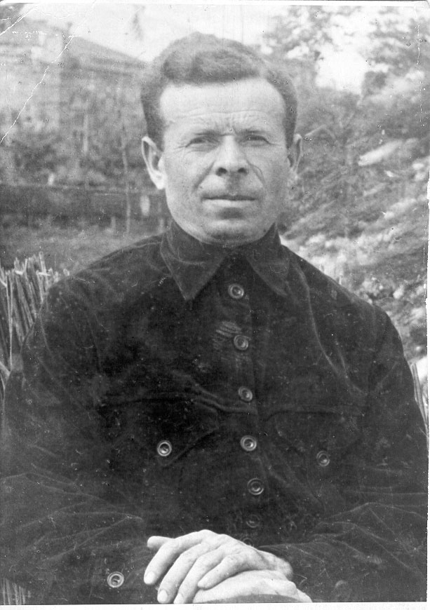

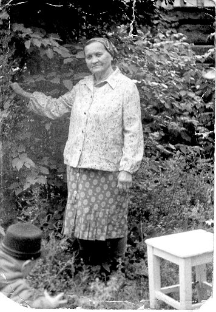

ohne Georgij Iwanowitschs Wissen, für seine erwachsen gewordene Tochter mit nach Hause genommen hatte, sehr böse wurde und Olga Fedotowna zwang, es ins Lager zurückzubringen. Laut Ninas Erinnerungen war er ein äußerst akkurater Mann. Soweit sie sich erinnern konnte, trug er immer dieselbe Samtjacke. Im Winter wie im Sommer trug er zur Arbeit stets dieselben Stiefel. Selbst bei schlimmstem Regenwetter brachte er es fertig so zu gehen, dass nur die Sohlen schmutzig wurden.

Jenisseisk, 1956 Otradowka, 1940 Olga Fedotowna Tereschtschenko Georgij Iwanowitsch Tereschtschenko Ninas Vater (Oma Olja), Ninas Mutter Nina besuchte sieben Jahre die Schule. In der Klasse war sie die jüngste und saß in der ersten Bank. In der sechsten Klassesteckte einer ihrer Klassenkameraden ihr einen Zettel mit einer Liebeserklärung in die Jackentasche. Als Olga Fedotowna die Notiz fand, verabreichte sie der Tochter eine kräftige Tracht Prügel und versprach ihr, dass sie sie beim nächsten Mal auf einem Bein stehen lassen und das zweite in zwei Teile zerreißen würde. In der Schule bekam Nina in fast allen Fächern gute Noten, in Geometrie, Geschichte und Deutsch sogar „sehr gut“. Lediglich in Chemie und Zeichnen waren ihre Leistungen nur durchschnittlich. In den Wirren des Lebens bin ich nicht dazu gekommen, sie über die Schuljahre, über das, was sie dachte, über das, wovon sie träumte zu befragen. Ich weiß lediglich, dass sie bis in die Tiefen ihrer Seele Stalin und dem stalinistischen Zentralkomitee erge-

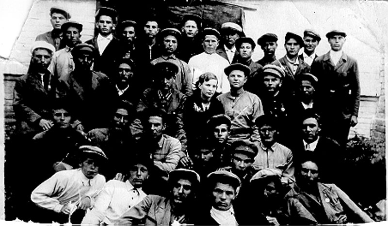

ben war und voller Stolz ein Abzeichen mit der Profilansicht W.I. Lenins trug. Hingebungsvoll glaubte sie alles, was in den Zeitungen und Losungen stand, und das rote Tischtuch auf dem Tisch des Präsidiums brachte sie ehrfürchtig zum Erschauern. Und obwohl die Kuryschko-Kolchose bei weitem nicht zu den besten zählte und ihre Mutter für die geleistete Tagesarbeitseinheit viel zu wenig erhielt, war sie von der Überlegenheit des Kolchos-Aufbaus überzeugt, hasste die Großbauern und deren Gehilfen und grundsätzlich alle Gegner des sowjetischen Aufbaus. Selbstverständlich las sie ausschließlich Werke sowjetischer Schriftsteller mit ideologischem Inhalt. Na ja, und auch Werke einiger von der Partei gut geheißener und anerkannter Volksschriftsteller und Dichter. 1937 trat sie in die Komsomolzen-Organisation ein. Nachdem sie in demselben Jahr die Sieben-Klassen-Schule absolviert hatte, wollte sie weiterlernen, doch ihr Vater war dagegen, denn er war der Ansicht, dass sie dafür nicht die finanziellen Mittel, nicht die Möglichkeiten zur Verfügung hatten, Alexandrowka, 1941 Nina beim Militärkommissariat, umgeben von Komsomolzen (10 Tage vor Ausbruch des Krieges)

Diese Entscheidung des Vaters nahmen sowohl sie als auch Olga Fedotowna sich sehr zu Herzen.

Nach der Schule fand Nina zunächst Arbeit als Sachbearbeiterin, später als Maschinenschreiberin im Bezirkskomitee des Komsomol. Sie lebte in der Ortschaft Alexandrowka – dem Bezirksverwaltungszentrum. Und zu der Zeit verschlechterten sich die Beziehungen der Eltern zu Hause in Otradowka immer mehr. Erschöpft von der Arbeit auf den Kolchos-Feldern, dem eigenen Haushalt, der Versorgung der drei

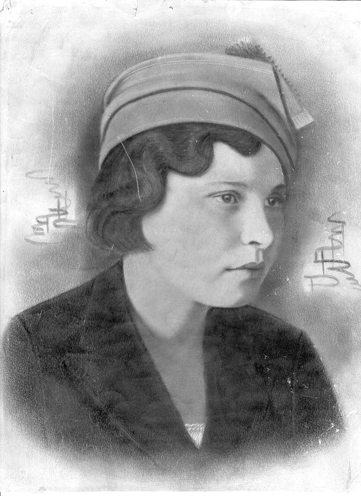

Schwestern ihres Ehemannes und ihres Sohnes, war Olga Fedotowna nicht in der Lage, jene Sauberkeit und Gemütlichkeit im Haus herzustellen, von der Georgij Iwanowitsch träumte. Er verlor die Beherrschung, verlangte, dass seine Frau seine heranwachsenden Schwestern zum Arbeiten zwang, aber dazu sah sie sich außerstande. Das ärgerte ihn. Er, der in einer recht wohlhabenden Familie aufgewachsen war, in der die Mutter, die nicht mit schwerer körperlicher Arbeit belastet war, Ordnung und Bequemlichkeit sicherstellte, empörte sich, als er die im Zimmer verstreuten Kleidungsstücke, das nicht abgewaschene Geschirr sah. Oft gab es Konflikte aus religiösem Anlass. Olga Fedotowna war eine gottesfürchtige Frau, während Georgij Iwanowitsch, auch wenn er kein Kommunist war, verlangte, dass in ihrem Haus keine Ikonen aufgestellt wurden. Nach Ninas Erinnerungen riss er einmal eine Ikone von der Wand und warf sie aus dem Fenster auf die Straße. Vorbeigehende Frauen bekreuzigten sich wütend, während Olga Fedotowna leise weinte. Kurz vor Kriegsbeginn ging Georgij Iwanowitsch mit einer Dorfbewohnerin, Krankenschwester, einer alleinstehenden jungen Frau fort. Bei ihr fand er Sauberkeit, schmackhaftes Essen, Ruhe und Zärtlichkeit. Wenngleich Nina ihn niemals verurteilte, litt sie lange an dem Syndrom, dass die Untreue ihres Ehemannes verursacht hatte.

Alexandrowka, 1940 Nina während ihrer Zeit als Sekretärin Beim Bezirkskomitee der Komsomolzen-Organisation 1940 wählte man Nina zur zweiten Sekretärin des Komsomol-Bezirkskomitees. Ihr Leben war bis an die Grenzen ausgefüllt: Leitung der Pionier- und Komsomolzen-Organisationen, Bezirksjugendzeitung, Wandzeitung, Klub-Tätigkeit und schließlich ihre persönliche Mitwirkung in der Kulturbrigade. In jenem Jahr lernte sie Kolja Pokatilo kennen, mit dem sie sich später anfreundete, einen Schüler der zehnten Klasse, der das Lernen mit der Arbeit in der Redaktion der Bezirkszeitung vereinbarte. Schon bald verwandelte sich die Freundschaft in Liebe. Sie war häufiger und gern gesehener Gast in seiner Familie. Es gibt noch Fotos aus jenen Jahren, auf denen Nina und ihre damaligen Freunde und Freundinnen zu sehen sind. Unter ihnen befindet sich Kolja. Auf der Rückseite des Fotos steht geschrieben: «Mein Kolja Pokatilo». Nina musste auch mit Rekruten arbeiten. Auf einer Fotografie vom 12. Juni 1941 (10 Tage vor Kriegsausbruch!) sieht man sie in einer Gruppe Einberufener, sehr junger Männer, neben einem Militärangehörigen, offensichtlich dem Kriegskommissar, und ringsherum vierunddreißig Rekruten.

Krieg! An seinen Beginn, genauer gesagt, den Tag und die Stunde, als sie zum ersten Mal davon hörte, kann Nina sich, im Gegensatz zu mir, noch sehr gut erinnern. An jenem Tag inszenierte ihre Kulturbrigade in Otradowka das Stück «Die Zigeuner», in dem sie die Semfira spielen sollte. Das Leben wurde ihr in den rosigsten Farben gemalt. Sie war gesund, besaß zahlreiche Freunde, wurde von Jung und Alt respektiert, und vor allem hatte sie Kolja, den sie liebte und der sie liebte. Und außerdem liebte sie das Tanzen, vor allem Zigeunertänze, und wenn sie abends in den Klub kam, begann sie sich ab der Türschwelle im Walzertakt zu drehen. An jenem Tag, als sie das Haus verließ und vor der Kolchos-Verwaltung eine Menschenmenge stehen sah, hegte sie noch keinen Verdacht, sondern wunderte sich nur: so viele Menschen sind noch nie zu meinen Auftritten gekommen. Aber als sie näher herantrat und die düsteren Gesichter der Männer und der weinenden, jammernden Frauen und stillgewordenen Kinder sah, begriff sie: es herrschte Krieg!

Und alles brach im Nu zusammen: Träume, Hoffnungen, die Freude des morgendlichen Erwachens und des abendlichen Wiedersehens. Die Blumen wurden glanzlos und verloren ihren Duft, lautlos wurde das Zirpen der Heuschrecken und das Gezwitscher der Vögel. Das Leben war erfüllt von schrecklichen Kriegsberichten, der Hektik der Rekrutierungsbüros, den Tränen der Frauen und Mütter. Die ersten Todesnachrichten trafen ein, die ersten Verwundeten, die ersten Flüchtlinge, deren Zahl rasch anstieg. Nina gehörte zu der Gruppe, die für ihre Aufnahme und Unterbringung verantwortlich war. In ihrer Obhut befanden sich die Kinder. Die ersten Flüchtlinge wurden im Klub, im Kontor untergebracht. Nina ging bei den Dorfbewohnern von Hütte zu Hütte, um für sie Kleidung, Essen und für die Kinder Spielzeug und Bücher zu sammeln.

Bereits am dritten Kriegstag wurde Kolja eingezogen. Und ein paar Tage später – der Vater. Als Georgij Iwanowitsch sich verabschiedete sagte er: «Zwei Kriege habe ich durchgemacht, aber aus dem dritten werde ich nicht mehr zurückkehren», und er und seine Mutter erinnerten sich daran, wie er die Ikone weggeworfen hatte, und es zog ihnen die Herzen zusammen. Die Tage verrannen voller Sorgen und Erwartungen. Von Kolja trafen zwei Briefe ein, zwei Dreiecksbriefe, wie die Soldaten ihn versendeten. In ihnen versicherte er seine Liebe und Treue, erwähnte aber mit keinem Wort, wo er sich befand und was er machte. Dann eine lange Zeit des Schweigens und plötzlich der Schock: Koljas Eltern erhielten die Todesbenachrichtigung, in der man ihnen mitteilte, dass Kolja gefallen war. Nina besuchte sie fast täglich, trauerte mit ihnen, beweinte ihre erste Liebe. Als sich im Herbst 1941 gemäß geheimem Befehl eine Partisanentrupp formierte, meldete sie sich, zusammen mit anderen Mitgliedern des Komsomol-Bezirkskomitees an. Zum Kommandeur des Trupps wurde der Vorsitzende des Bezirksexekutivkomitees Fomenko ernannt, zum Kommissar – der erste Sekretär des Bezirkskomitees der Partei Psalomschtschikow, zum Chef der Aufklärung – das Mitglied des Komsomol-Bezirkskomitees Malij. Der Trupp bestand vorwiegend aus Männern. Es gab lediglich vier Frauen: Romanzowa – Parteimitglied seit 1919, Sekretärin der Parteiorganisation des Bezirkskomitees, Leiterin des Parteibüros, Nina und noch zwei weitere Mädchen, ihre Freundinnen, von denen eine die Ehefrau des Kommandeurs des Trupps war, die zweite – die zukünftige Ehefrau des Kommissars des Trupps.

Heute ist den Problemen des Partisanenkrieges eine umfangreiche Literatur gewidmet. Aber damals gab es eine solche Erfahrung noch nicht, und viele Handlungen des neu geschaffenen Trupps erwiesen sich zumindest als schlecht durchdacht. So begannen unmittelbar nach dem Erhalt des geheimen Befehls und der Schaffung der Partisaneneinheit nicht geheime praktische Aktivitäten vor den Augen der Einwohner von Alexandrowka. Im März 1942nahm der Trupp am Streifzug nahe Taganrog teil. Dabei erledigte Nina die Aufgaben einer Krankenschwester. Und obwohl sie in dieser Rolle eigentlich am Ende des Trupps mit dem Tross hätte gehen sollen, um den Bedürftigen ihre Hilfe zu erweisen, versuchte sie stets in den ersten Reihen mitzulaufen. Diese Angewohnheit hatte sie auch schon im Lager gehabt und war von mir nicht nur einmal beobachtet worden. Nachdem sie von ihrem Marsch zurückgekehrt waren, veranstalteten seine Teilnehmer einen prunkvollen Empfang in der Ortschaft Margaritowka, während die Bezirkszeitung über den Marsch einen Artikel druckte, in dem sie lediglich die leicht veränderten Nachnamen erwähnte. Die Zusammensetzung des Trupps war für keinen der Bezirksbewohner ein Geheimnis. Bald darauf traf die Nachricht von Georgij Iwanowitschs Tod ein. Nach einer schweren Bauchverletzung starb er am 12. März 1942 und wurde in der Ortschaft Bolobenkowo im Petrowsker Bezirk, Gebiet Charkow, beigesetzt.

Im Sommer 1942 passierten motorisierte Teile der deutsch-faschistischen Heeresgruppe «Süd» mit mehreren Kolonnen die nach Süden führenden Straßen im Alexandrowsker Bezirk. In den auf dem Weg liegenden Dörfern und Ortschaften setzten sie ihre Ältesten und Bürgermeister ein, hauptsächlich aus den Reihen sowjetischer Bürger, und marschierten weiter ins Kuban-Gebiet und den Nord-Kaukasus. In Alexandrowska wurde eine deutsche Kommandantur eingerichtet. Ein Teil der Soldaten aus dem zweiten Zug der einmarschierenden Truppen nahm ihre Posten in den nahegelegenen Dörfern ein. Zwei von ihnen wurden Olga Fedotownas Haus zugewiesen. Laut ihren Erinnerungen wurde sie von ihnen nicht beleidigt, aber sie verhielten sich nach unseren russischen Maßstäben nicht ganz anständig. Sie scheuten sich nicht «Gas abzulassen», wie sie es ausdrückte. Es waren hauptsächlich die Polizeiangehörigen, die wüteten. Aufgrund einer Anzeige kamen sie, um bei ihr ein Berdan-Gewehr zu suchen, mit dem Georgij Iwanowitsch zur Jagd gegangen war. Das Gewehr war gut versteckt, und Olga Fedotowna versuchte sie davon zu überzeugen, dass sie keine Ahnung hatte, wo es sich befand. Da stellten sie sie an die Wand und schossen um ihren Kopf herum, aber sie beharrte weiter auf ihrer Aussage. Das Gewehr, das zwischen den Brettern der doppelten Decke verborgen war, erlebte dort noch das Ende des Krieges.

Der Partisanentrupp, über dessen Existenz fast alle Einwohner des Bezirks Bescheid wussten, war mit dem Eintreffen der Deutschen gezwungen, sich ins Jelisawetinsker Moorgebiet zurückzuziehen, wo es sich in den schwer zugänglichen Sümpfen und Schilfdickichten verbarg. Seine Aktivitäten waren nun sehr erschwert. Unter diesen Kommando-Bedingungen formierte das Truppen-Kommando separate Gruppen (von jeweils 2-5 Personen) und sandte sie zur Ausführung der Aufklärungsund Sabotage-Arbeiten in die Ortschaften des Bezirks. Der Kern des Trupps wechselte an einen anderen Ort, aber die Verbindung zu den Gruppenleitern wurde über den Aufklärungsleiter aufrechterhalten. Die Gruppen durften die Leitung des Trupps nicht in eigener Initiative übernehmen, denn sie wussten nicht, wo er sich befand.

Romanzewa und Nina wurden nach Otradowka geschickt. Es war nur natürlich, dass in ihrer kleinen Gruppe Romanzewa das entscheidende Wort hatte, die für Nina gleichzeitig eine alte Partei-Genossin und Kommandeurin war. Über die Art der Aufgaben, die Nina auszuführen hatte, weiß ich nichts Genaues. Auf die Frage, welche Aufgaben nun vor ihnen lägen, erwiderte die Romanzewa:

– Wir werden herausfinden, ob es deutsche Soldaten im Dorf gibt, und wenn ja – wie viele es sind und in welchem Rang sie stehen.

Vor Ausführung der Aufgabe wurde ihnen befohlen die Waffen zu verstecken, und für die Notfall-Verbindung wurde ein gewisser Saizew angegeben, ein Förster, der unweit von Alexandrowka lebte. Bei Einbruch der Dunkelheit kamen sie nach Otradowka. Sie gingen durch die zu der späten Stunde leeren Dorfstraßen und begaben sich anschließend, ohne auf den Dorfplatz hinauszugehen, durch die Gemüsegärten zu Ninas Haus. Dort schliefen alle. Nur Olga Fedotowna bereitete in der Küche noch das Futter für die Kuh. Das Eintreffen der Besucher bemerkte sie nicht. Es war nicht der erste Besuch dieser Art. Mitunter musste sie für die Partisanen die Wäsche waschen und ausbessern. Sie setzten sich, flüsterten miteinander, erfuhren, dass die Deutschen Otradowka verlassen hatten, tranken Tee und begaben sich, nachdem sie ein wenig dahingedöst hatten, im Morgengrauen, wie vereinbart, zu Saizew. Wir durchquerten ein Sonnenblumenfeld und Gehölze und mieden zufällige Passanten. Es war schon vollständig hell geworden, als wir an die Tür des Försters klopften. Doch er weigerte sich sogar nur mit uns zu reden, wobei er verlauten ließ, dass er von einem Trupp und von Partisanen nichts wüsste. Empört über das derartige Verhalten ihres Landsmannes, kehrten sie ins Sonnenblumenfeld zurück und machten sich am Abend auf den Weg zur Schlucht, wo der Kommandeur der Aufklärung Malij sie abholen sollte. Ohne ihnen konnten sie nicht zum Trupp zurückkehren.

Am Morgen traf jedoch am Erscheinungsort anstelle von Malij der Älteste von Alexandrowka (in der Vergangenheit Sekretär der Parteiorganisation in der Ortschaft Christitschewo) mit einer Kutsche ein, der, wie Nina gehört hatte, aus dem Jelisawetinsker Moor desertiert war. Wie es Nina schien, wunderte sich die Romanzowa nicht über das Erscheinen des Ältesten, und im ersten Augenblick dachte Nina sogar, dass die Begegnung mit ihm in ihrem Auftrag vorgesehen war und dass er möglicherweise kein Verräter war, sondern ein verschwörerisches Mitglied des Trupps. Der Gedanke daran, dass die Romanzewa sich als Verräterin erweisen könnte, kam ihr in diesem Moment nicht in den Kopf. Zweifel kamen erst auf als man sie zur deutschen Kommandantur brachte, wo der ortsansässige Deutsche Burgart als Bürgermeister fungierte, der sie alle kannte. Zuerst wurde Romanzewo zu ihm zum Verhör gebracht, die sehr lange bei ihm zubrachte und von der er alle ihn interessierenden Informationen erhielt. Nina wurde das klar, nachdem Burgart Fakten nannte, die ausschließlich der Romanzowa hätten bekannt sein dürfen.

Da Nina offenbar für die deutsche Kommandantur, die bereits alle notwendigen Angaben von Romanzewo bekommen hatte, und vielleicht auch aus anderen Überlegungen, kein besonderes Interesse darstellte, ließ man sie gehen. Von den ersten Tagen an versteckte sie sich, doch schon bald, nach der nächsten Partisanen-Aktion, nahm man siezusammen mit anderen Dorfbewohnerinnen als Geiseln fest. Ihnen allen drohte der Tod. Die Aufgegriffenen wurden ins örtliche Untersuchungszelle gesteckt, wo sie mehrere schreckliche Tage und Nächte verbrachten. Romanzewa befand sich nicht unter ihnen. In den sich langsam dahinziehenden, sorgenvollen Tagen kehrte Nina wieder und wieder zu jenem Morgen zurück, als am Erscheinungsort nicht Malij, sondern der Älteste eingetroffen war. Was konnte sie tun, selbst wenn sie von Romantsewas Verrat wusste? Sie besaß keine Waffe, aber der Älteste war bewaffnet. Vor ihm wegzulaufen war unmöglich. Aber vielleicht traf Romanzewa ja auch keinerlei Schuld. Vielleicht war ihr gleichmütiger Gesichtsausdruck beim Auftauchen des Ältesten nur Maskerade gewesen? Wie sonst hätten sich die beiden Frauen verhalten sollen, die sich nach einem langen Marsch hingesetzt hatten, um ein wenig auszuruhen? Aber wohin war sie gegangen? Niemand bekam sie wieder zu Gesicht. Es gab Gerüchte, dass sie in der Vergangenheit eine edle Dame, so etwas wie eine Gräfin, gewesen sein sollte – nach den damaligen Vorstellungen hätte dies alles erklären können.

Tag für Tag verstrich, und die Deutschen hatten es mit der Wahrmachung ihrer Drohungen nicht eilig, änderten daran aber auch nichts. Gerettet wurden sie durch einen in der Kommandantur Dienst habenden, ehemaligen Mitarbeiter der Miliz, der ihnen allen die Möglichkeit anheimstellte zu fliehen. Nina erinnerte sich, dass sie, als alle hinausgelassen wurden und in verschiedene Richtungen davonrannten, Olga Fedotowna sah. Später, vor dem Eintreffen der Sowjetarmee, hielt sie sich in Otradowka bei den Ortsansässigen Subko und Makarowo versteckt. Einige Zeit hauste sie hinter dem Ofen, in einem Raum, eng wie ein Federmäppchen, das extra zu diesem Zweck mit einem Gemäuer aus Ziegelsteinen vom Zimmer abgeteilt worden war.

Sofort mit dem Eintreffen der sowjetischen Truppen brachte man Nina, auf einstimmigen Wunsch der Dorfbewohner, vor die Kommission zur Wiederherstellung der Sowjetmacht im Otradowker Dorfrat. Einige Tage später holte man sie zur Ausübung ihrer Verpflichtungen ins Bezirkskomitee der Komsomolzen-Organisation. Während der Wahlen der führenden Komsomolzen-Organe wurde sie einstimmig zum Plenumsmitglied und Mitglied des Büros des Komsomol-Bezirkskomitees gewählt.

1944 nahm die primäre Parteiorganisation des Bezirkskomitees der Partei Nina als Mitgliedskandidatin der Partei an. Empfohlen worden war sie von Fomenko und Psalomschtschikow, den damals einflussreichsten Menschen im Bezirk. In der Parteikommission kam die Frage über ihren Marsch, gemeinsam mit Romanzewa, nach Otradowka auf. Auf die Frage der Kommissionsmitglieder, weshalb er nicht zum festgesetzten Ort gekommen sei, antwortete Malij, dass die Leitung des Trupps von Romanzewas Verrat bereits gewusst hätte, und er nicht das Recht gehabt hätte, nur wegen Nina die anderen Kameraden in Gefahr zu bringen.

– Woher konnten wir wissen, dass sich hinter euch keine Deutschen befinden, sagte er, als er leicht gereizt zu Nina umwandte.

Ein paar Tage später, als Nina in einer dienstlichen Angelegenheit sein Kabinett betrat, benahm sich Malij, zu der Zeit zweiter Sekretär des Bezirkskomitees der Partei, ihr gegenüber wie zu einem Mädchen, beleidigend, woraufhin sie ihm eine Ohrfeige gab und versprach, alles seiner Ehefrau zu erzählen, mit der sie gut befreundet war. Wütend krächzte er:

– Ach, so eine bist du, du wirst dich noch an mich erinnern!

Vier Tage vergingen. Nina machte sich zum Tanz im Klub fertig und zof ihr graues Lieblingskleid an, das so schön mit ihren Augen harmonierte. Sie nahm ihre schwarze Lacktasche mit. Darin befanden sich der Komsomolzen-Ausweis und die Kandidaten-Karte. In dem Moment kam ein Bote angelaufen und sagte, dass sie dringend ins Bezirkskomitee kommen solle. Nichtsahnend öffnete sie, so wie sie war, in festlicher Kleidung und mit guter Laune, die Tür des Büros des Sekretärs des Bezirkskomitees... Und dort endete ihr freies Leben. Bei der Verhaftung nahm man Nina den Komsomolzen-Mitgliedsausweis, den sie in all den Monaten der Besatzung sorgfältig verwahrt hatte, und die Registrierungskarte. Beschuldigt wurde sie der Zusammenarbeit mit den Deutschen, dass sie ihnen Informationen über den Trupp gegeben hätte. In der Zeugenaussage Malijs während des Untersuchungsverfahrens hieß es, dass er angeblich zum Erscheinungsort gekommen wäre, Romanzowa und Nina jedoch nicht angetroffen hätte. Nina bat um eine Gegenüberstellung mit Malij und Romanzewa. Das wurde ihr verweigert. Im Verlauf des zweimonatigen Ermittlungsverfahrens machte keine einzige Person, außer Malij, eine Zeugenaussage, welche sie diffamierte.

Das städtische Kriegsgericht der Stadt Rostow sah keine Möglichkeit, sie anhand des vorgelegten Materials zu verurteilen, und so wurde ihre Akte an ein Sonderkollegium weitergeleitet. So begann ihr Leben auf der anderen Seite des Stacheldrahtzauns. Sowohl damals als auch viele Jahrzehnte später beschuldigte sie ausschließlich Malij an dem, was geschehen war, und vielleicht noch den Untersuchungsrichter, der ihr die Gegenüberstellung verweigert hatte. Ihre Liebe und Treue zur Heimat, der Partei, dem Großen Stalin gerieten nicht ins Wanken. Ich bin überzeugt davon: wenn dieser Kelch an ihr vorübergegangen wäre, hätte sie niemals an die Existenz einer solchen Welt geglaubt, in die sie so unerwartet hineingeraten war.

Im Solikamsker Durchgangslager traf Nina im Dezember 1944 ein, ohne den Paragrafen zu kennen, nach dem sie verurteilt worden war, ohne Information über die Haftdauer. Mit dem Beschluss des Sonder-Kollegiums machte man sie erst im Sommer bekannt, als sie sich bereits im Kuschmangortsker OLP befand. In einem derart unsicheren Zustand befand sich damals viele Gefangene.

Und dabei hatten sie uns gegenüber sogar einen Vorteil, denn sie konnten noch Hoffnung hegen und waren manchmal auch fest davon überzeugt, dass es sich bei all dem, was geschehen war, um einen Irrtum handelte, dass gleich ein Dokument käme und sie freigelassen würden. Viele von ihnen verhielten sich sogar ganz anders als wir, weil sie der Meinung waren, dass sie ohne Paragrafen und ohne Haftzeit mit Sicherheit keine Gefangenen wären. Naiv wie sie waren, begriffen sie nicht, wollten nicht begreifen, dass jedem, der erst einmal innerhalb der Gefängnistore und hinter Stacheldraht gelandet war, auch eine Haftstrafe sicher war. Aber die Lagerleitung, die Aufseher wussten das nur zu gut und verhielten sich ihnen gegenüber in entsprechender Art und Weise, ohne sie von uns, den vollständig formalisierten Lagerinsassen, zu unterscheiden.

Nachts, wenn Nina auf ihrer harten Pritsche lag, kehrte sie immer wieder in Gedanken zu jenen unglückseligen Tagen zurück, als sie, in einem Waldstück vergraben, zusammen mit Romanzowa auf Malijs Erscheinen gewartet hatte. «Weshalb ist er nicht gekommen? Hatte der Trupp tatsächlich von Romanzewas Verrat gewusst? Aber warum hatten sie sie dann zur Aufklärung geschickt? Und welche Besonderheiten hätte Romanzewa schon vom Trupp berichten können? Schließlich war er doch praktisch zerfallen und existierte nicht mehr. Und Malij ist ein Dreckskerl, dachte sie. – An allem ist er allein schuld, nur er. Sich so zu rächen, aber weswegen? Ich war doch schließlich mit seiner Frau befreundet! Wie konnte er sich so etwas erlauben, und dazu noch im Parteibüro? Was für ein Kommunist ist er danach. Und ich bin auch gut. Denn ich wusste, fühlte, wie er sich mit gegenüber verhält und ertrug seine dummen Witze, seine Klapse. Oder hätte ich es vielleicht weiter erdulden, nachgeben sollen? Ich wäre um alles herumgekommen und hätte meiner geliebten Arbeit weiter nachgehen können. Und was nun?

Eine Welle der Verzweiflung überrollte sie. Sie weinte still vor sich hin, damit ihre Nachbarin, eine gottesfürchtige Alte, nichts merkte, die sich beharrlich davon zu überzeugen versuchte, ihren Stolz zu bändigen und Gott zu vertrauen. Aber das konnte sie nicht, denn sie glaubte nicht an Gott, sondern an die Partei. Ganz besonders missfielen ihr und verschreckten sie die vorsichtigen Andeutungen der Alten, dass am Unglück vieler im Lager befindlichen Menschen gerade die Partei schuld sei, und, ein schrecklicher Gedanke – es kam ihr sogar so vor, dass sie, wenn sie von der bösen Macht sprach, Josef Wissarionowitsch höchstpersönlich meinte, der für die einfachen Menschen und für den Sieg so viel getan hatte. All die Frauen, die hier neben ihr auf den Pritschen lagen, waren selbstverständlich schuldig. Bei ihr handelte es ich lediglich um einen Irrtum. Malij hatte sich als schlechter Kommunist erwiesen, darin lag das ganze Problem. Anschließend dachte sie an die Komsomol- und Partei-Angelegenheiten und schlief schließlich mit ihren Gedanken darüber ein.

Frauen sind wohl besser als wir, die Männer, in der Lage, sich ihr persönliches Leben unter ungewohnten, extremen Bedingungen einzurichten. Als ich Ninas Erinnerungen analysierte hatte ich jedenfalls ständig das Gefühl, wie unterschiedlich sie und ich ins Lagerleben eingetreten waren. Ich verwahrloste schnell, ließ mich gehen und hörte zu einem gewissen Zeitpunkt sogar auf mich zu waschen. In den allerersten Monaten wollte ich vor allem nur daliegen, die Augen schließen, mich nicht bewegen, nichts sehen und hören und so sterben. Nina verfügte über wesentlich mehr Optimismus. Der Hunger quälte sie nicht so sehr. Sie achtete auf ihre Kleidung, reinigte sie morgens. Nach dem Aufstehen wusch sie sich und putzte sogar ihre Zähne. Ich glaube, sie besaß auch eine Spiegelscherbe und einen schwarzen Stift für ihre Augenbrauen. Nach Erzählungen zu urteilen konnte sie Witze machen und lachen. Hier, im Solikamsker Durchganslager, das auch ich zwei Jahre zuvor durchlaufen hatte, lernte Nina Olja kennen – Olga Pawlowna Butenko, geboren 1923, aus Rostow stammend, verurteilt nach Paragraf 58-1а zu fünf Jahren mit anschließender Verbannung für weitere fünf Jahre. Olja war sich sehr still und unauffällig, sowohl in ihrem Verhalten als auch in der Art, wie sie gekleidet war, vielleicht konnte man sie sogar als gottesfürchtig bezeichnen. Sie verstand sich schnell mit jener Alten, ebenso wie Nina, durch die ihre und Oljas Bekanntschaft und Freundschaft zustande gekommen war. Diese Freundschaften hielt über die gesamten Lagerjahre und auch die Zeit danach.

Nachdem die Quarantäne beendet war, wurde eine Etappe ins Kuschmangortsker OLP zusammengestellt. Zu ihr gehörten auch Nina und Olja. Sie gingen drei Tage lang. In einer gemeinsamen Kolonne aus Männern und Frauen. Rast, Übernachtung in Zwischenlagern, leichter Frost, die Bäume in Schneewehen. Um die Kolonne herum eine Kette von Begleitsoldaten mit Maschinenpistolen und auf Menschen trainierten, grimmigen Schäferhunden. Nina, wie damals in der Partisanen-Abteilung bei Taganrog, in der vordersten Reihe. Sie trug einen Herbstmantel und neue, noch nicht abgetragene Filzstiefel; Olga Fedotowna hatte sie ihr vor der Verschickung aus Rostow übergeben. Auf dem Kopf trug sie eine schwarze Schute. Die Stiefel scheuerten an den Füßen, jeder Schritt war von Schmerzen begleitet.

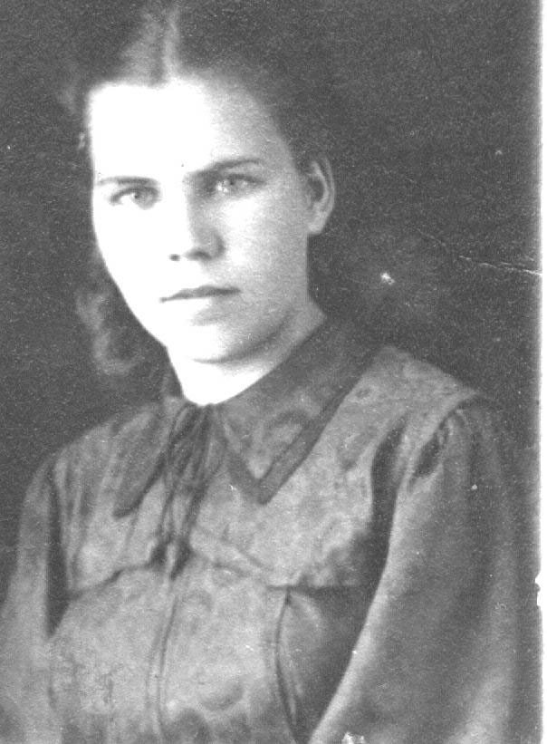

Einer der Wachleute, er war kein Russe, mit leicht schräg stehenden Augen und dunkler Gesichtsfarbe, gab ihr in schlechtem Russisch den Rat, die Stiefel auszuziehen und stattdessen die Füße mit Fußlappen zu umwickeln. Offenbar sympathisierte er mit ihr und war bemüht, eine Unterhaltung anzufachen, obwohl die Satzung für den Wachdienst dies kategorisch verbot. Neben Nina ein junger, lausiger Odessit, genauso einer, mit denen die alten Kolpowsker Frauen sie und Olja Schrecken eingeflößt hatten. Aber dieser war sympathisch und scharfsinnig. Und seine Ratschläge ähnelten keineswegs denen, welche ihnen die ehemaligen Lagerinsassinnen gegeben hatten. Der Odessit litt, weil er nichts zu rauchen besaß, und Nina bat den netten Begleitsoldaten um eine Papirossa. Der weit vorausschreitende Wachmann legte einen Stein auf den Weg und darauf eine selbstgedrehte Zigarette. Als die Etappe endlich in Stabnaja eintraf, fragte einer der Begrüßenden Nina: «Na, warum bist du den hergekommen?» - worauf Nina lachend zur Antwort gab: «Um als Partisanin tätig zu sein!»

Sie wurden in der Frauenbaracke untergebracht, und schickten sie ein paar Tage später zum Holzeinschlag. Brigadeführer Lyssenko unterwies sie und Olja im Umgang mit der Zweihand-Säge. Alles war wie gewohnt: Schnee, riesige Kiefern, eine unfügsame Säge in unerfahrenen und schwachen Frauenhänden und der eisige Frost, der Gesicht und Hände zum Erstarren brachte.

Bereits am dritten Tag kam Nina mit aufgeschürften und aufgequollenen Händen in die Sanitätsstelle, wo sie eine Arbeitsbefreiung erhielt, und einige Tage später wurden die meisten Frauen der neu eingetroffenen Etappe zur Lagerstelle Traktowaja geschickt. Hier gab es ein Zentral-Krankenhaus, eine Nähstube und eine Reparaturwerkstatt. Im Krankenhaus wurden ihre Beine behandelt. Einmal, als sie von der Baracke in die Kantine ging, hörte sie Schreie, die von irgendwo oben kamen, und sie begriff nicht sofort, dass diese Rufe ihr galten. Es stellte sich Kurmangort, 1947 heraus, dass derselbe Begleitsoldat sie wiederer- Olga Parlowna Butenko kannt hatte, der ihr auf dem Weg aus dem KOLP die selbstgedrehte Zigarette überlassen hatte. Nun hatte er sich über das Geländer seines Wachturms gebeugt, rief «Nina» und winkte mit der Hand. Ein paar Tage später kam er in die Lagerzone und brachte ihr ein wenig Brot, Zucker und Tabak. Bald darauf begann der zivilangestellte Spediteur Bagirow Interesse für sie zu bekunden. Er gewährte ihr eine materielle Unterstützung, bewahrte sie vor allgemeinen Arbeiten, verlangte aber ständig eine Gegenleistung. Ihre Beziehungen entwickelten sich auf einer reinen Lager-Basis. Sie trafen sich in einem Nebengebäude der Kantine, in dem er als Spediteur sein eigener Herr war. Zur Bekräftigung seiner Gefühle für sie schenkte er ihr eine richtige kleine Damenuhr, wie Nina sie noch nie zuvor besessen hatte. Damit man sie ihr nicht wegnahm, band sie sie ans Handgelenk und befestigte sie von oben. Auf dem Höhepunkt des Sommers kam die Nachricht: nach § 58-1b hatte das Sonder-Kollegium sie zu fünf Jahren Arbeits-/Besserungslager mit anschließender Verbannung für weitere fünf Jahre auferlegt. Sie weinte, aber Kadyrow beruhigte sie, indem er sagte, dass fünf Jahre immerhin keine zehn Jahre wären.

Der Sommer verging. Im Herbst 1945 wurden alle arbeitsfähigen Frauen aus Traktowaja nach Golownaja gebracht, wo sie zu Flößerei-Arbeiten herangezogen werden sollten. Golownaja war zum damaligen Zeitpunkt eine reine Produktions-Außenlagerstelle. Dort wurden Häftlinge gehalten, die im unteren Lager arbeiteten, wohin aus den Holzeinschlag-Lagern des Kuschmangortsker OLP mittels einer Schmalspurbahn das bereitgestellte Nutzholz abtransportiert wurde. Hier, am Ufer der Kama, rollten spezielle Ladearbeiter-Brigaden, die es verstanden, geschickt mit langen, biegsamen Haken zu hantieren, riesige Baumstämme über Schwellen auf mehrlagige Holzstapel. Dann wurden sie gekennzeichnet, die Enden geweißt, mit Punkten versehen und, nachdem die Abnahme-Bescheinigungen erstellt worden waren, füllten sie dicke Bücher mit Zahlenreihen. Die Holzstapel zogen sich auf einer Länge von beinahe zwei Kilometern an der Kama entlang, wobei sie über die steilen Flussufer hingen. Das gesamte Territorium des unteren Holzlagers waren von der Waldseite mit mehreren Reihen Stacheldraht eingezäunt. Auf der Flussseite gab es eine derartige Eingrenzung nicht. Stattdessen wurden im Sommer, während der Flößzeit, im Wasser, entlang des Ufers, sogenannte «poplawki» eingerichtet – mit Ankern befestigte überdachte Flöße, auf denen Wachen standen. Im Winter zogen die Wachen ans Ufer um. Von der Wohn- bis zur Arbeitszone waren es ungefähr drei Kilometer. In der Arbeitszone befand sich außer den Holzstapeln auch das Flößereikontor, in dem die Fluktuation des Nutzholzes, die Angelegenheiten des Lokomotiven-Depots und des Wasserturms dokumentiert wurden, an dem die eleganten tschechoslowakischen Schmalspur-Loks der Firma «Skoda» betankt wurden.

In der Wohnzone befand sich die Frauenbaracke, die von den anderen Bereichen, ebenso wie die gesamte Lagerzone, mit einem Staketenzaun abgegrenzt war. Darin gab es kleine Tore. Tagsüber standen sie offen. Am Abend, nach dem Signal zur Nachtruhe, wurden sie bis zum Morgen verschlossen. Die Baracke war in zwei Sektionen unterteilt. In der einen lebten die «Schokoladen-Mädchen» - hauptsächlich Frauen, die nach dem Paragrafen 58 verurteilt worden waren. In der zweiten – die «Steckrüben-Mädchen» - die wegen nichtpolitischer Bagatellvergehen verurteilt worden waren. Unweit der Frauenzone lag die Kontor-Baracke. Darin die Amtsstube des Leiters der Lager-Außenstelle Woltschenok. Daneben das Büro des Leiters des Flößereibetriebs sowie des technischen Leiters der Lager-Außenstelle Arkadij Petrowitsch Kalinowskij. Hier war auch das Büro des Arbeitsanweisers David Andrejewitsch Rudi untergebracht. Weiter, in derselben Reihe, die Wohnbaracken für die Arbeiter, dahinter die Kantine, die Küche und die Brotschneidestelle. In der zweiten Reihe, die parallel zur zweiten lag, ebenfalls Wohnbaracken. In der Mitte der ersten – Kalinowskijs Kabine. In dieser Reihe befanden sich die Sanitätsstelle und das Krankenhaus, welches von dem inhaftierten Arzt Aleksandrow geleitet wurde. Hinter dem Krankenhaus das Badehaus und die Wäscherei.

Das Kontingent der Lagerstelle war ungewöhnlich. Hier gab es praktisch keine alten Männer, keine Dahinsiechenden. Sie schickte man nach Traktowaja. Die Arbeiter wurden speziell ausgewählt. Von ihrer Arbeit hingen in einem großen Maße die Ergebnisse der Tätigkeit des gesamten OLP ab. Gerade hier, am Lagerpunkt «Golownaja», wurde das bereitgestellte, fortgezogene und zu den Holzstapeln verbrachte Nutzholz von den Abnehmern der Kertschewsker Flößerei-Reede in Empfang genommen, die hundert Kilometer flussabwärts an der Kama gelegen war. Besonderes Augenmerk wurde auf die Qualität der geleisteten Arbeit gelegt. Die Holzstapel – wie Spielzeug. Gleichmäßig, Stamm an Stamm, schimmernd ihre weißgetünchten Enden. Es war wichtig, Holz in bestmöglicher Qualität und, sofern es gelang, auch mit einem größtmöglichen Volumen abzuliefern. Im letzten Fall ruhten alle Fehlbestände auf der Bilanz der Kertschewsker Reede und wurden als im Wasser versunken abgeschrieben. Doch die Abnehmer waren Fremde – Jungs von der Kertschewsker Reede, in der Regel Zivilangestellte. Die Kuschmangortsker Leitung war bemüht ihnen zu schmeicheln. Gott bewahre, dass nur keiner von ihnen zurückschreckt, den Holzstapel nicht oder in schlechter Qualität abnimmt. Da konnte sogar der Leiter des OLP von seinem warmen Platz auffliegen, ganz zu schweigen von den Chefs eines niederen Ranges. Und wie sie ihnen schmeichelten! Vor allem dadurch, dass sie junge und attraktive Mädchen aus den Reihen der Gefangenen mit der Holzabgabe beauftragten. Mehr noch, letzteren wurde erlaubt in Zivilkleidung zu gehen und sich sogar die Lippen anzumalen. Der Wache gefiel das keineswegs. Aus diesem Anlass kam es zwischen dem Chef der militarisierten Wachmannschaften von Golownaja und Kalinowskij immer wieder zu schwer lösbaren Konflikten. Einmal beschloss der wütende Baschkirzew alle Frauen nach Schtabnaja zu schicken. In letzter Minute näherte sich Makarenko auf einem Schlitten und schickte sie alle wieder zurück.

Die ersten Tage ihres Aufenthalts im Lagerpunkt Golownaja arbeitete Nina, wohl nicht ohne die Protektion Wagirows, in der Kantine. Sie wusch das Geschirr ab, wischte die Tische ab und feudelte die Fußböden. Einmal, als sie das Bühnenbild für das abendliche Konzert vorbereitete, betrat der Leiter der Kultur- und Erziehungsstelle (KWTsch) und Leiter der Kulturbrigade die Kantine. Auf die Frage, was sie denn könnte, führte sie, so wie sie war, in Arbeitskleidung und mit einem Putzlappen in der Hand, ohne eine Antwort zu geben, einen Zigeunertanz auf. Man nahm sie in die Kulturbrigade auf. Mehrmals reiste sie mit ihr zu den verschiedenen Lagerstellen des OLP. Anfangs Konzert-Tätigkeit, sie entsprach am besten ihrem Charakter und ihren Gewohnheiten. Nina gefiel das sehr. Ihr «Zigeunertanz» und ihr «Äpfelchen» genossen Erfolg. Wenn sie die Bühne betrat, vergaß sie mitunter, wo sie sich befand und warum. Es kam ihr so vor, als wäre sie in Otradowka. Aber sobald das Knopfakkordeon verstummte und sie sich dem Publikum zuwandte, verschwand die Vision. Anstelle der barfüßigen, braungebrannten Kinder, der bedächtigen alten Männer und der alten Frauen mit ihren Kopftüchern in den ersten Reihen – der Leiter der Lagerstelle, der Kommandeur der militarisierten Wache, der Oberbevollmächtigte. Alle in NKWD-Uniformen und mit vergoldeten Schulterklappen. Die Gesichter wohlgenährt, selbstzufrieden, der Blick kalt und angespannt. Viele mit Ehefrauen und sogar mit Kindern. Weiter an den Rändern, weniger Leute von der Obrigkeit. Und kein einziges offenes, freundliches Gesicht. Hinter ihnen die privilegierten Lagerinsassen. Und schließlich, ganz hinten, im Halbdunkel, die gewöhnlichen Gefangenen.

Nach dem Konzert das Abendessen. Sogar ein wenig feierlich, auf dem Niveau einer Prämien-Mahlzeit. Übernachtung in einem Dienstraum, manchmal sogar im Badehaus. Männer und Frauen. Künstler- Alltag. Der Brigadeleiter fing an sich an sie zu heften. Sie wies seine Belästigungen ab und fand sich bald darauf erneut bei allgemeinen Arbeiten wieder. Bagirow war nicht da, er war nach Solikamsk umgezogen.

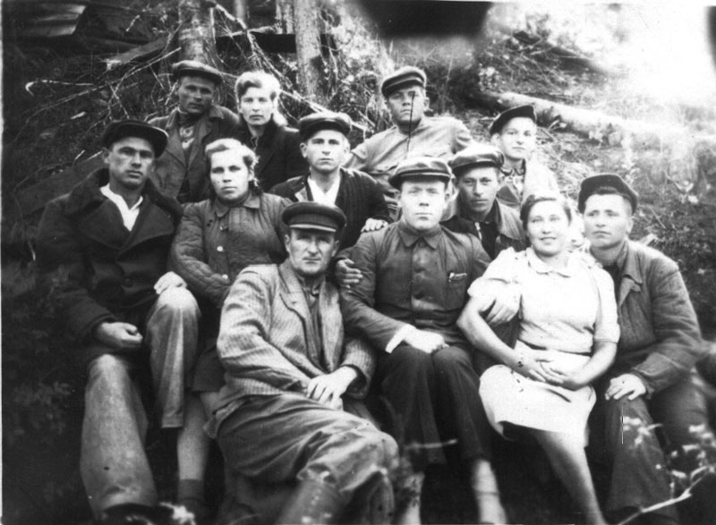

Lagerpunkt Golownaja, 1947 Im Vordergrund von links nach rechts: Arkadij Petrowitsch Kalinowskij und David Andrejewitsch Rudi. In der zweiten Reihe, zweite von links – Olga Butenko. In der dritten Reihe - Nina Zusammen mit einigen anderen Frauen des Lagerpunktes wurde Nina zum Räumen der Flächen für die Holzstapel geschickt. Es war keine sehr schwere Arbeit, aber für Frauen doch recht ermüdend. Sie schleppten Bruchstücke der Baumstämme und Tauwerk fort. Ebneten den Boden. Die Tage, Wochen, Monate gingen dahin. In dieser Zeit wurde Olja Kalinowskijs Freundin, während Nina ein Auge auf David Andrejewitsch geworfen hatte, der sie ins Flößerei-Kontor schickte. Und so befand sie sich wieder an einem warmen Arbeitsplatz bei leichter Tätigkeit. Das gefiel dem damaligen Oberbuchhalter des Flößerei-Kontors Nikolaj Sujew nicht, dessen Beziehungen zu Kalinowskij und Rudi schon lange angespannt waren. Es kam zu Reibungen und Schikanen. Hinzu kamen Probleme mit der Gesundheit. Nina war nervös, weinte häufig, verlor an Gewicht. Und dann auch noch David Andrejewitsch. Abends kam er in die Baracke und saß stundenlang seufzend da. Im November tauchte im Flößerei-Kontor Lonka Swiridow auf. Vom ersten Tag an gefiel ihm das bescheidene und schweigsame Mädchen mit den traurigen Augen, das mitunter vor Fröhlichkeit und frechem Humor förmlich explodierte. Nur mit Mühe gelang es ihm, seine Sympathie gegenüber Nina zu verbergen, die mit der Zeit zu einem ausgeprägten Gefühl entwickelte. Lonjas Werbung erschwerte ihre Situation in der Wohnzone. Und obwohl David Andrejewitsch keinerlei Schritte gegen sie unternahm, stellten sich all ihre Bekannten und Freundinnen, darunter auch Olja, auf seine Seite und versuchten Nina zu überreden, die Verbindung mit ihm nicht abreißen zu lassen. Ihre Situation wurde schnell kompliziert. Sie lachte immer seltener. In dieser für Nina sehr schwierigen Zeit begab ich mich, ohne irgendetwas über sie zu wissen, zum Lagerpunkt Golownaja, um mich mit Lonja zu treffen. Ein paar Schritte hinter mir ging, schwer atmend, ein Wachmann. Es war warm. Die Frühlingssonne schien. Die sandige, durch die Holzlastwagen ausgefahrene Straße war frei von Schnee. Wir gehen auf dem Seitenstreifen. Unter den Füßen, wie angeschwollene Adern, die knorrigen Baumwurzeln. Die Stämme der majestätischen Kiefern schimmern golden im Licht der Morgensonne. Die Laune ist gut. Ich bin angefüllt von der Bedeutung meiner Mission. Ich denke über die Schritte nach, die zu unternehmen sind, um die gestellte Aufgabe zu lösen. Nach und nach schweifen die Gedanken zu Lonjas persönlichen Problemen ab. Ich frage mich, wie seine Nina wohl sein mag. Groß, klein, braunhaarig oder blond? Lonja und ich haben nie über das Thema gesprochen. Fast genauso wie bei Nelja. Während ich nachdenke, beschleunige ich meinen Schritt. Und plötzlich ein jäher Ruf: - Na, geh langsamer! Es ist der Begleitsoldat. Er hat seinen Grund. Sie haben ihn früher aus dem Bett geholt als üblich. Sie haben ihn nach seinem nächtlichen Dienst nicht ausschlafen lassen, sondern ihn losgeschickt, um ein eingebildetes Jungchen zu begleiten. Als ob man den nicht mit der nächsten Etappe hätte schicken können. Und dann mit einem Sonder-Konvoi - was für eine Ehre. Dieser Schrei brachte mich auf die sündige Erde zurück und änderte jäh meinen Gedankengang. – Aber wirklich, was bin ich denn für einer, warum bin ich denn so arrogant? – Hier gehe ich, wohlgenährt und angezogen, angefüllt mit dem Bewusstsein der Wichtigkeit der mir auferlegten Mission. Und dabei befinden sich dort, in Lesnoje oder Sewernoje, und überhaupt auch in den anderen OLPs und Lager-Außenstellen tausende und abertausende erschöpfte und hungrige Gefangene, wie ich einst einer in Kolynwa war, sie fällen Bäume, zersägen sie und, ziehen, sich die Sehnen herausreißend, die schweren harzigen Bäume fort. Sie haben keine Zeit und Kraft für die Schönheit des Kiefernwäldchens, für die Frauen, für die Intrigen der bevorzugten Lagerinsassen. Sie werden vom Hunger und der harten körperlichen Arbeit beherrscht. Die Wandlungen der Nachkriegszeit haben ihr Leben nur wenig verändert. Und wenn sich auch die Todesrate ein wenig verringert hat, aber wie viele sind bereits umgekommen und wie vielen ist es noch beschieden, durch die alle menschlichen Kräfte übersteigende Schwerstarbeit, die Mangelernährung und die Sehnsucht nach Zuhause in die andere Welt hinüberzugehen. Wie konnte ich, der ich nun unter warmen Gewächshaus-Bedingungen lebte, den mich umgebenden Sumpf des Leidens und der Grausamkeit vergessen?

### Kapitel 13. Meine schwierige Liebe

Beladen mit düsteren Gedanken setzte ich meinen Weg zum Lagerpunkt Golownaja fort. Hinter mir spielte der verärgerte Wachmann offen auf Zeit. Er ging ohne Eile und ließ sich ab und an nieder, um zu rauchen. Infolgedessen benötigten wir für die acht Kilometer, die Stabnaja von Golownaja trennten, fast drei Stunden. Es kam mir vor, als ob der Weg kein Ende nähme. Kiefern, Tannen, schneebedeckte Lichtungen und wieder Kiefern. Doch dann schließlich schimmerten durch eine Schneise des Waldwegs die Wachtürme und der Staketenzaun der Lagerzone. Sie schimmerten hindurch und verschwanden wieder. Der Weg führte erneut durch den Wald, aber nicht sehr lange. Schon bald tauchten die mit langen Stangen eingezäunten und von schmutzigem geschmolzenem Schnee bedeckten Gemüsebeete auf. Dann das Sägewerk, der Wirtschaftshof. Allmählich wurde der Weg gerader und führte in die Siedlung der Zivilangestellten. Zur rechten Seite einige aus Kiefernstämmen zusammengebaute und mit finnischen Holzschnitzen gedeckte Zwei-Wohnungshäuser. Nach sibirischer Art kleine Fenster, Gardinen, Blumen. Noch eine scharfe Biegung und dann endlich die Wache des Lagerpunktes Golownaja.

In der Zone nahm mich Lonja in Empfang und brachte mich sofort zur Leitung. Er stellte mich als Revisor vor, was mich sehr irritierte. Dieses Amt passte schlichtweg nicht zu meinem Alter, meiner Kleidung und meiner Lage als Häftling. Eine gewisse Seriosität verlieh Fajerstejns Fernspruch, den der Leiter des Lagerpunktes mit Zweifeln im Gesicht betrachtete.

Nachdem alle Formalitäten erledigt waren, begaben wir uns in die Baracke des verwaltungstechnischen Personals, in der Lonja wohnte. Die Baracke war zu dem Zeitpunkt leer, so dass Lonja und ich in aller Ruhe den Plan für meine Tätigkeit während der Dienstreise erörtern konnten. Die Situation schien schwieriger als sie Jakob Jakowlewitsch vorgekommen war. Verletzung der Formalitäten bei den Empfangs- und Abgabe-Dokumenten, Veränderungen bei den Bilanzen, nachträgliche Eintragungen, fiktive Papiere zur Abschreibung von nicht standardgemäßem Holz. All das roch nach einem Skandal, der sich leicht gegen uns wenden konnte, denn die Schuld lag zur Zeit der Leitung durch Sujew zweifellos bei den Mitarbeitern des Flößerei-Kontors.

Das Problem mit Nina Tereschtschenko war, meiner Ansicht nach, einfacher zu lösen. Man hätte sie ins Krankenhaus des Lagerpunktes Stabnaja bringen sollen, dessen Oberarzt mit Jakob Jakowlewitsch befreundet war. Aber Lonja gefiel diese Variante nicht sonderlich. Er sehnte sich nach einem offenen Kampf mit Kalinowskij und Rudi und wollte von Nina nicht getrennt werden.

Nach dem Willen des Zufalls stellte sich heraus, dass an diesem Tag, nach dem Abendessen, dass die am Vorabend in Golownaja eingetroffene zentrale OLP-Kulturbrigade auftreten sollte, und, dem zufolge, auch die Manikowskaja. Für mich kam das völlig unerwartet und änderte jäh meinen Gedankengang. Ninel bereitete mir immer noch große Sorgen. Zweifel kamen auf – zum Konzert gehen oder nicht. Entschieden wurde die Frage durch Lonja, indem er verkündete:

– Dort werde ich dich mit ihr bekanntmachen!

Seine Stimme zitterte dabei. Man merkte, dass er sich schämte. Er schämte sich für seine Schwärmerei, die bei weitem nicht seinem jugendlichen Alter entsprach und dafür, dass er gezwungen war, bei mir, den er kürzlich erst selbst protegiert hatte, Hilfe zu suchen.

Als wir in die Kantine kamen, waren die vordersten Reihen, mit Ausnahme der ersten, die für die Lagerleitung vorgesehen war, bereits besetzt. Wir fanden irgendwo in der Mitte einen Platz. Lonja wandte den Kopf und sagte zu mir, nachdem er Nina gefunden hatte:

– Da, in der fünften Reihe, die dritte von rechts.

Ich stemmte mich ein wenig vom Sitz hoch und sah an der Stelle einen Kopf, bedeckt mit einem Kopftuch, unter dem man auf Papierstücke aufgedrehte Haare sehen konnte – den Prototyp unserer Lockenwickler.

– Na, und nun? Machst du uns miteinander bekannt? – fragte ich. – Freilich, – antwortete er. Er erhob sich und schrie, den Lärm des Essraums übertönend:

– Tereschtschenko!

Sie stand auf, drehte sich um und kam, nachdem sie Lonja mit den Augen ausfindig gemacht hatte, heran. Ein schlankes Mädchen in einer pelzbesetzten Weste. Große, orientalisch geschnittene, graue Augen, ein großer ausdrucksvoller Mund. Unter dem Kopftuch schaut eine Locke im damals modischen Styling und mit gewissem Witz hervor.

Es fand ein kurzes Kennenlernen statt, nachdem Lonja Nina mit gedämpfter Stimme von der Notwendigkeit zu überreden versuchte, sich am Morgen zur Arbeit zu begeben.

– Aber Sie haben doch beschlossen, Olga und mich morgen in der Lagerzone zu lassen. Wir müssen irgendwann unsere Wäsche waschen und Ihr Hemd auch, versuchte Nina zu protestieren.

Doch Lonja war abgeneigt. Sie blickte missbilligend in meine Richtung und kehrte zu ihrem Platz zurück. Lonja und ich schwiegen. Ich fühlte mich äußerst unwohl. Alles hatte nicht so begonnen, wie ich es mir vorgestellt hatte. Lonja war ebenfalls verstimmt. Wahrscheinlich hatte er eine derartige Reaktion von ihr nicht erwartet, und von mir ebenfalls nicht.

Schließlich erschien die Lagerleitung samt Ehefrauen und Kindern. Das Konzert begann. Aber die Gedanken waren weit entfernt, und ich wäre gern gegangen, wenn nicht der Auftritt Manikowskajas noch bevorgestanden hätte. Nach dem Konzert, auf dem sie eine Romanze gesungen und einige Verse zitiert hatte, die mir nicht gefielen, kehrten Lonja und ich in die Baracke zurück. Er wollte offen meine Meinung wissen. Doch meine Gedanken waren mit der Manikowskaja beschäftigt, und mir stand der Sinn überhaupt nicht nach seiner Nina, und was konnte ich denn schon nach der Kürze unserer Begegnung sagen. Nachdem Lonja meine Verfassung völlig falsch interpretiert hatte, verstummte er beleidigt.

Am Morgen der Weckruf. Eine große Absperrkette, etwas dreihundert Mann. Sie bringen uns in die Arbeitszone. Man kann ein wenig miteinander reden, halblaut versteht sich, ohne die Wachleute zu reizen. Aber das Gespräch läuft nicht. Frustriert über den gestrigen Streit mit Nina, schweigt Lonja mürrisch. Ich bin auch nicht geneigt zu reden, schon gar nicht morgens; als ich zur Arbeit ging, bemerkte ich Nina, wie sie aus der Bude des Arbeitsanweisers trat. Vielleicht habe ich mich auch geirrt, und sie war es gar nicht, denn es war noch etwas dämmrig, und zuvor hatte ich sie ja nur ein einziges Mal gesehen, und das auch nur flüchtig. Aber wenn sie es war, dann änderte das eine Menge. Auf jeden Fall entschloss ich mich damals, Lonja nichts davon zu erzählen, was passiert war. Um mich von den unangenehmen Gedanken abzulenken, zog ich aus der Tasche meines Überziehers einen kleinen Band mit Gedichten und fing, mich dem allgemeinen Rhythmus der Schritte anpassend, an, die «Briefe der schönen Dame» durchzulesen. Ich hegte die Hoffnung, dass sie auch dieses Mal die Anspannung nehmen und mich beruhigen würden. Doch das geschah nicht. Anstatt die wunderbaren Verse zu genießen, kehrte ich in meinen Gedanken immer wieder zu den mir bekannten Mädchen zurück. Keine von ihnen entsprach auch nur annähernd dem von Blok geschaffenen Muster: weder Rita Konchowa noch Nelja Soroka oder Ninel Manikowskaja. Dabei gefiel jede von ihnen mir auf irgendeine Art und Weise, irgendetwas in ihnen erregte mich und zog mich an. War vielleicht nur einfach die Zeit der Liebe gekommen?

Vermutlich hatte es in Bloks Umfeld Frauen gegeben, die der Schönen Dame ähnelten. Mir waren sie noch nicht einmal im Traum begegnet, und in den von ihm geschriebenen Versen erschienen sie mir zu abstrakt und erinnerten mich eher an eine Ansammlung zerbrechlicher, vertrockneter Schmetterlinge. Die Zeit hat die wunderschöne Zeichnung, die Verflechtung rätselhafter Linien und Farben verschont, aber es fehlte der Nervenkitzel des Lebens. Und auch das Ebenbild der Schönen Dame rief jetzt in mir ernsthafte Zweifel hervor. Von solchen Frauen konnte man nur träumen, es wäre wohl interessant gewesen sich mit ihnen zu unterhalten, doch sie waren wenig für ein langes und schwieriges Familienleben geeignet. Langsam, aber ständig, überwand ich in all den Jahren die Hypnose von Bloks Unbekannten.

Nachdem ich Kuprins „Die Grube“ gelesen hatte und herangewachsen war, begann ich dem fleischlichen Prinzip mehr Aufmerksamkeit zu schenken als zuvor. Die aus den Tiefen der Psyche aufsteigenden erotischen Vorstellungen ergriffen immer häufiger von mir Besitz. Heutzutage kennt sich selbst ein fünfzehnjähriger Heranwachsender besser auf diesem Gebiet aus als ich damals mit meinen beinahe fünfundzwanzig Jahren. In diesem Teil war die kommunistische Moral, obwohl sie auf materialistischen Prinzipien beruhte, nicht weniger asketisch als die katholische, und meine jugendliche Einstellung gegenüber der Frau. Über Probleme der Erotik wurde nicht nur nichts in Büchern geschrieben, man schämte sich darüber zu sprechen und sogar nur daran zu denken. Der Katholizismus meiner Kindheit ging ohne große Verformungen über in die Prinzipien der kommunistischen Moral und festigte sich darin. Und nun, erleuchtet durch die Autoren einst in unserer Familie verbotener Bücher, Erzählungen von Manikowskaja und eigenen Beobachtungen, war ich ziemlich besorgt über den Zusammenbruch alter Ideale und die Entstehung einer neuen Haltung gegenüber den Frauen. Eingebettet in diese Gedanken ging ich die schwarze, holprige Straße entlang, ohne das schmutzige Fluchen der Wachen und das Bellen der Hunde zu bemerken.

Die Kolonne bewegte sich durch ein spärliches Wäldchen. Birken, Espen, Sträucher. Die Zweige kahl, ohne Blätter. Nicht einmal Knospen waren zu sehen. Wir durchquerten das Bett eines kleinen Baches. Unter unseren Füßen knirschte wie Eis die feuchte Erde, vermischt mit dem Laub des vergangenen Jahres und dem Schnee, der am Morgen gefallen war. Dann verschwanden die Birken, und wir gelangten in dichte Espendickichte. Ein verlorener Ort, nach Meinung der Wachen geeignet für eine Flucht, den wir fast im Laufschritt, angetrieben von den Schreien und dem schmutzigen Fluchen der Begleitwachen, dem Klicken der Gewehrverschlüsse und dem Bellen der Hunde überwanden. Nach einer leichten Anhöhe drängte sich die Kolonne, die ein wenig aus der Reihe gekommen war, am Kontrollpunkt. Über eine halbe Stunde dauerte es, bis die Wachen ihre Plätze auf den Wachtürmen eingenommen hatten und durch Schlagen auf ein Eisenstück die Bereitschaft der Arbeitszone zur Empfangnahme der Gefangenen verkündete. Schließlich begaben sich Lonja und ich, nachdem wir den Durchlassposten passiert hatten, zusammen mit den anderen Häftlingen, die ohne Eile ihre Arbeitsplätze verließen (die Perrons, Holzstapel, Reparatur-Werkstätten), ins Flößerei-Kontor. Ein kleines mit Brettern gedecktes Häuschen. Zwei Zimmer und ein Lagerraum für Dokumente. Lonja wies mir sein Büro zu: ein kleines Fenster, ein langer, aus Holzbrettern gefertigter Tisch, zwei Sitzbänke. Auf dem Tisch ein Tintenfass und ein Packen Spezifikationen. Hierhin wurden mir ein Stapel Dokumente mit Lesezeichen an den notwendigen Stellen geliefert. Die Dokumente trug Nina. Sie trägt eine weiße Bluse mit einem arabesken Kragen und einen streng geschnitten Rock, der bis unter die Knie reicht. Auf Fragen antwortet sie einsilbig und sogar wütend, aber in ihren Augen liegt – Sehnsucht.

Das Mittagessen rückte heran. Die Mädchen begannen Kartoffeln zu braten, die sie höchstwahrscheinlich in den Baracken der Zivilangestellten erhalten hatten. Da ich nicht wusste, ob sie mich zum Essen hinzubitten würden und um mich nicht unter ihrem Appetit anregenden Geruch zu leiden, ging ich zum Ufer der Kama, zu einer einsam stehenden, traurig aussehenden Birke mit hässlich gebogenem Stamm. Wie ich bemerkte, eignete sich eine der Krümmungen als Sitzplatz. Nachdem ich mich niedergelassen hatte, zog ich mein Buch hervor. Doch lesen konnte ich nicht. All meine Gedanken rankten sich um die Manikowskaja und Nina.

– Ob sie es nicht doch gewesen war? Und warum fühlte sie sich dann, wie Lonja erzählte, durch die Aufmerksamkeit, die David Andrejewitsch ihr entgegenbrachte, bedrängt? Irgendetwas stimmte hier nicht. Um das beurteilen zu können, musste man alle Umstände der Angelegenheit erkennen. Ich kannte sie nicht, und sowieso war im Lager alles durcheinander. So viel Gewalt und Ungerechtigkeit – rechtfertigte ich Nina gedanklich.

Und zu der Zeit überredete Lonja Nina im Kontor hinauszugehen und mich zum Mittagessen zu rufen. Sie war empört:

– Warum denn schon wieder ich? Soll es doch jemand anders machen- oder Sie selbst. Und überhaupt – ich mag ihn nicht.

– Wie kommt das? – interessierte sich Lonja.

– Es ist mir klar geworden. Er geht hinter die Absperrkette, neben ihm der Wachsoldat, Hunde, und er liest. Und jetzt hat er sich auch wieder mit einem Buch auf einen Baumstamm gesetzt. Tut so, als ob er ein Gelehrter wäre.

– Er tut nicht so. Er liest immer viel, dafür raucht und trinkt er nicht. Und außerdem liebt er die Mathematik und kennt viele Gedichte – verteidigte mich Lonja auf nicht ganz logische Weise.

Nina, die sich mit der Notwendigkeit mich zu holen, abgefunden hat, murrt immer noch:

– Und was er für riesige Schnürschuhe angezogen hat!

– Na, daran trägt er nun keine Schuld, er hat so große Füße, – parierte Lonka, der langsam ärgerlich wurde.

– Und dann noch gelbe, – fuhr Nina fort, ohne auf Lonjas Unmut zu achten.

– Füße? – wunderte sich Lonja.

– Nein, Schuhe. Er ist generell widerwärtig. Verteildigen Sie ihn also nicht, – meinte Nina.

– Aber warum denn?

– Darum!

Später erfuhr ich, dass «darum» - ihre Lieblingsredensart war.

Das Mittagessen verlief schweigend. Als ich ihren eindeutig feindseligen, auf mich gerichteten Blick spürte, wurde ich verlegen und schwieg. Doch nach dem Mittagessen geschah etwas, die Atmosphäre entspannte sich. Sie merkte wohl, dass ich meine eigenen schwierigen Probleme hatte. Und schließlich ertönte, für mich vollkommen unerwartet:

- Zitieren sie ein paar Gedichte. Aleksej Nikolajewitsch sagt, dass Sie eine Menge kennen.

Selbstverständlich war ich einverstanden. Zuerst, wie gewöhnlich, Puschkin, Lermontow, Nekrassow. Dann Blok, Jessenin, Byron.

Wir saßen an Lonjas langem Tisch, mit den darauf herumliegenden Dokumenten-Ordnern. Durch das kleine staubige Fenster viel düsteres Licht. Nina, die Arme auf den Tisch gestützt und den Kopf in die offenen Handflächen gelegt, hörte aufmerksam zu, ohne irgendwelche Emotionen zu zeigen. Lonja war offensichtlich ungehalten, weil er der Meinung war, dass ich mich nicht mit den Dingen befasste, mit denen ich mich befassen sollte.

Bald darauf wurde er in einer dringenden Angelegenhiet hinausgerufen. Wir blieben allein zurück. Unmerklich gingen wir zu Themen unseres Lagerlebens über. Wie gewohnt öffnete ich mich und erzählte von meinen Beziehungen zu Nelja und Manikowskaja. Vor allem sprach ich über Nelja, vermutlich deshalb, weil meine Beziehungen ihr gegenüber reiner waren. Dann berichtete ich ein wenig von meiner Kindheit und Jugend.

Sie schwieg und war wachsam. Sie hörte mehr zu. Widerwillig beantwortete sie nur direkte Fragen, erzählte etwas über ihre Kinder- und Jugendjahre und hob dabei besonders ihre bäuerliche Herkunft hervor. Sie blühte ein wenig auf, als sie von ihrer Mitwirkung im Partisanentrupp und die Umstände ihrer Verhaftung berichtete. An ihrem ganzen Unheil beschuldigte sie einzig und allein Maly, der von Anfang an sämtliche Anspielungen auf die Verwerflichkeit des Aufbaus zurückgewiesen hatte. Am Anfang dachte ich, dass sie einfach nur Angst hätte politische Themen vor einem Fremden anzusprechen, doch schon bald begriff ich, dass dies die Ebene für ihr Verständnis dessen war, was sich ereignet hatte. Als Kind ihrer Zeit, prinzipielle Komsomolzin, die mit Leib und Seele dem sowjetischen Aufbau und den Kreml-Führern ergeben war, hatte sie, wie es mir damals schien, nichts begriffen. Ninel stand mir in dieser Hinsicht näher und war für mich besser verständlich.

Dafür war sie in allem, was die menschlichen Wechselbeziehungen betraf, zumindest im Gespräch mit mir, viel zurückhaltender und keuscher. Aber ihre offensichtliche Abgeneigtheit die Lagerzeit in ihrem Leben anzusprechen, war alarmierend.

Im Großen und Ganzen stellte sich heraus, dass ihre Seele im tiefsten Inneren für mich verschlossen war. Nicht der kleinste Durchlass. Man fühlte, dass ihre Gedanken und Gefühle mit völlig anderen Problemen befasst waren. An diesem ersten Tag unserer Bekanntschaft wollte sie sie mit mir nicht teilen.

Die nächsten zwei Tage änderten wenig an meinem Verständnis für ihre innere Welt. Es gelang keineswegs durch das Netz unserer Gespräche zu ihrer Seele vorzudringen, wenngleich unsere äußeren Beziehungen beinahe kameradschaftlich wurden. Irgendetwas quälte sie. Etwas für sie sehr Wichtiges, was ihr das Interesse zum Leben und zu allem, was um sie herum geschah, nahm. Auf meine Frage, wie Lonja und ich ihr helfen könnten, antwortete sie:

– Für mich gibt es keine Hilfe.

Bei meiner Rückkehr nach Stabnoje verhandelte ich mit Hilfe von Jakob Jakowlewitsch über Ninas Einweisung ins OLP-Krankenhaus. Sie war tatsächlich krank: starke nervliche Erschöpfung, Vitaminmangel, leichtes Fieber. Nun belastete mich eine neue Sorge. Fast täglich nach der Arbeit besuchte ich Nina, erkundigte mich nach ihrem Befinden, nach ihrer Stimmung. Ich brachte ihr auch Bücher mit. Mitunter, wenn es mir gelang etwas zu beschaffen, ein paar Leckereien. Und ganz bestimmt einen Gruß oder eine Notiz von Lonja, selbst dann, wenn es keine gab.

Bald darauf wurde mit der nächsten Etappe Olga Butenko von Golownaja nach Stabnaja geschickt. Sie sollte wegen ihrer Verbindung zu Kalinowskij außerhalb des Kuschmangortsker OLP geschickt werden. Kalinowskij konnte oder wollte das nicht verhindern. Ständig kam es zwischen ihm und dem Kommandanten der Militarisierten Wachen des Golowner Lagerpunktes Baschkirzew zu Konflikten. Jener konnte Kalinowskij selbst nichts anhaben und zahlte es dafür Olga heim. Auf Bitten Ninas sorgte er dafür, dass Olga in Stabnoje blieb, weil es ihre engste Freundin war, die durch Iwan Makarenko handelte.

Einen Monat später wurde Nina aus dem Krankenhaus entlassen, unter der Bedingung, sie für leichte Tätigkeiten mit einem verkürzten Arbeitstag einzusetzen. Auf meine Bitte hin trug Jakob Jakowlewitsch sie für Arbeiten in der Buchhaltung, in der Materialgruppe, ein. Später versetzte man sie zu uns zur Kartothek für die Pro-

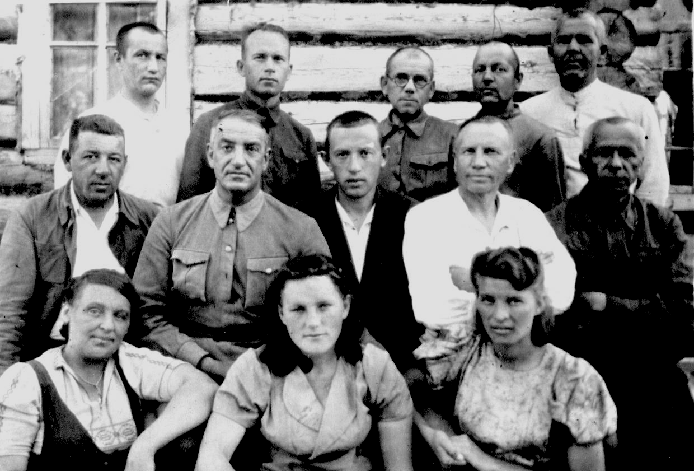

duktionskonten. Ihr Tisch stand Rücken an Rücken zu Iwans und meinem, wenn man von der Eingangstür aus schaute, in der linken Ecke der Buchhaltung.

Sie wohnte jetzt in der Frauen-Sektion der des verwaltungstechnischen Personals. Die Sektion erinnerte an den Behandlungsraum einer Poliklinik. Mit Decken und Laken, die an den Kopfkreuzen der Pritschen aufgehängt waren, hatten die Frauen eine Art kleiner Abteil-Kabinen gebaut. In jeder dieser Kabinen standen zwei Betten – die beiden unteren benachbarten jeweils mit einem Hocker in der Mitte. Auf den Hockern Servietten und Toilettenartikel. An der Wand über den Hockern – aus Zeitschriften ausgeschnittene Bilder, mitunter auch Fotos. Die Aufseher zerstörten immer wieder die «Zigeuner-Wirtschaft», wie sie es nannten, rissen die Zelte, die hängenden Decken, herunter, doch sie tauchten unausweichlich erneut auf. Die Sehnsucht nach häuslicher Gemütlichkeit und der Möglichkeit für eine Privatsphäre waren stärker als die Drohungen der Aufseher und möglicher Strafen. In der Mitte der Sektion ein langer, aus Holzbrettern gefertigter, sorgfältig abgeschabter Tisch. Zu beiden Seiten ebenso lange Bänke. In der Baracke ist es immer sauber und im Rahmen der Lager-Möglichkeiten gemütlich.

Kuschmangort, Lagerpunkt „Golownaja“, 1947 Ein Teil der Mitarbeiter der Buchhaltung des OLP. Alles Gefangene.

Ich befinde mich in der Mitte des Fotos. Neben mir im Militärhemd Oberbuchhalter Jakob Jakowlewitsch Weber. Links neben ihm – Arkadij Fedossewitsch Gaidajenko. Rechts neben mir, im weißen Hemd, – Wassilij Wassiljewitsch Fedossejew. Vor ihm in der ersten Reihe, ganz rechts, - Nina.

In einer dieser Decken-Kabinen waren Nina und Olga untergebracht. Olja feudelte die Fußböden im Büro des Leiters von Stabnaja Schischin und in der Buchhaltung. Die ganze Zeit über fühlte sie Kalinowskijs Unterstützung. Regelmäßig, häufiger als mir lieb war, kam Rudi nach Stabnaja, angeblich, angeblich wegen Angelegenheiten, die die Registrierungs- und Verteilungsstelle betrafen. Er hielt sich dann bei Fedja Lutzew, was meine Abneigung ihm gegenüber verstärkte. Freilich verbrachte er alle Abende bei Nina. Ihr und Olga brachte er immer etwas mit. Von sich und Kalinowskij. An diesen Tagen standen auf ihrem Hocker, und mitunter auch auf Ninas Bürotisch, Blumen. Mich ärgerte das ganz besonders, so dass sie anfangs glaubte, dass ich Blumen nicht ausstehen könnte.

Wenn es Liebe im Lager gab, dann flammte sie meistens auf und verbrannte wie ein Meteorit. Die Beziehungen zwischen Nina und mir entwickelten sich nach Lagermaßstäben zu urteilen äußerst langsam. Es vergingen Tage, Wochen, Monate. Das Frühjahr ging zu Ende, der kurze nordländische Sommer begann. Nina hatte sich, wie mir schien, vollständig erholt, hatte ein frischeres Aussehen bekommen, lächelte häufiger und machte Witze. Jetzt arbeitete sie den ganzen Tag über. In der Anfangszeit hatte mich die Notwendigkeit, mich um sie zu kümmern, ein wenig belastet, war aber allmählich zur Gewohnheit geworden. Ich teilte mit ihr meine Probleme und Erlebnisse, berichtete ihr darüber, wie sich die Beziehungen zwischen Nelja und Manikowskaja entwickelten. Ihre Angelegenheiten wollte sie hingegen mit mir nicht erörtern. Dafür hatte sie Olja. Abends – wir blieben oft sehr lange -, wenn ich sie von der Arbeit zur Baracke begleitete, küsste ich sie zum Abschied auf die Stirn. Für mich war es so etwas wie ein väterlicher Kuss. Sie war der Ansicht, dass nur Verstorbene so geküsst werden, sagte mir davon aber nichts, sondern duldete es.

Die ganze Zeit versuchte ich, die Rolle von Lonjas Vertrautem zu spielen. Ich lenkte oft die Gespräche auf ihn. Aber Nina unterstützte sie nicht, und einmal meinte sie:

– Was redest du andauernd über Aleksej Nikolajewitsch? Er und ich waren lediglich drei-vier Monate miteinander bekannt, und auch nur während der Arbeit, er hat inzwischen längst eine Freundin – eine Krankenschwester aus der Siedlung.

Das kam für mich völlig unerwartet. Lonja hatte mir davon nichts gesagt, obwohl er in der letzten Zeit tatsächlich aufgehört hatte, sich für Ninas Belange zu interessieren.

– Wer hat dir das gesagt? – Kalinowskij hat es Olga erzählt, und er wird nicht lügen.

– Aber ihr habt euch doch sogar geküsst, das hat mir Lonja selbst erzählt, und er hat mich auch nie angeschwindelt.

– Wir sollen uns geküsst haben? Das ist nie geschehen. Obwohl – ein paarmal auf die Wange hat er mich geküsst, so wie du auf die Stirn.

Dieser Übergang zum «Du» blieb von mir nicht unbemerkt.

Freilich hatte Ninas Abfahrt aus Golownaja Lonja in gewisser Weise die Hände im Kampf gegen Kalinowskij gebunden, was er, wie mir bekannt war, erfolgreich ausnutzte. Mit seinen Gefühlen für Nina war er wohl nicht sehr weit gegangen. Die paar Küsse, von denen er mir einst erzählt hatte, hatten in seiner Seele keine merklichen Spuren hinterlassen. Mit diesen Überlegungen beruhigte ich bis zu einem bestimmten Maß mein Gewissen. Denn es viel mir immer schwerer, die Rolle des Beschützers auszuüben. In dem Maße wie ich mich Nina annäherte, kühlte meine Beziehung zu ihm ab. Eineinhalb Jahre später wurde er freigelassen und heiratete tatsächlich die zivilangestellte Krankenschwester aus der Siedlung. Bald darauf reisten sie in die Ukraine ab.

Die Beziehung zwischen Nina und mir entwickelte sich und radierte nach und nach meine Gedanken an Nelja und die Manikowskaja aus. Ich kann mich noch gut an den Tag erinnern als ihre Addierbuchungsmaschine kaputt ging. Sie brachte sie in Webers Büro, welches ich in diesen Tagen wegen Jakow Jakowlewitschs Abreise nach Solikamsk einnahm.

– Was soll ich jetzt nur machen? – fragte sie, wobei sie das defekte Gerät vor mich auf den Tisch stellte. Nachdem ich es hin und her gewendet hatte, schraubte ich mit einer Zange und einem Schraubenzieher alles ab, was möglich war, zog die Achse heraus, woraufhin der gesamte Inhalt des „Felix“ in Rädchen und Zahnräder zerfiel. Nina rief erschrocken:

– Na, das war’s. Jetzt lässt es sich nicht mehr reparieren.

– Selbstverständlich mache ich es wieder heil, - entgegnete ich zuversichtlich.

– Nein, das ist unmöglich, – beharrte Nina.

Ich schlug eine Wette vor: wenn ich es wieder hinkriege, werde ich sie küssen.

Selbst heute wundere ich mich noch, mit welcher Hartnäckigkeit ich den „Felix“ wieder zusammenbaute. Und dann kam mein wohlverdienter Kuss. Ein Kuss direkt auf die Lippen. Ich tat mein Bestes, um diese Episode wie einen Scherz aussehen zu lassen, aber für Nina blieb das anscheinend nicht unbemerkt. Auf jeden Fall hörte sie seit dem Tag auf, meine Gespräche über Nelja und Ninel zu unterstützen.

Bald darauf mischte sich Olga ein, die mir vorwarf, ein unehrenhaftes Spiel mit Nina zu treiben: ohne Liebe würde ich ihr nur blauen Dunst vormachen. Sie bat und forderte, dass ich entweder mit meiner Flirterei aufhörte oder unserer Beziehung eine entschiedenere Form verlieh.

– Du weißt wahrscheinlich, dass Nina bereits seit zwei Monaten jede Begegnung mit David Andrejewitsch meidet und von ihm keinerlei Hilfe mehr annimmt? – fragte sie.

– Nein, das weiß ich nicht. Ich sehe nur, dass er ab und zu in Stabnaja auftaucht. Wenn Nina ohne ihn nicht leben kann, soll sie es sagen, dann werde ich ihr bei der Rückkehr nach Golownaja helfen. Dann kann sie dort Erbarmen mit ihm haben.

– Du Dummkopf! – empörte sich Olga. – Zwischen ihnen ist nie irgendetwas gewesen und jetzt erst recht nicht. Und im Übrigen ist David Andrejewitsch ein sehr ordentlicher und seriöser Mann. Nicht so einer wie du. Du hast deine drei „N“ durcheinander bekommen und verwirrst ihnen den Kopf.

Nina, die von unserem Gespräch erfahren hatte, zeigte sich sehr verärgert und bat darum, zur Material-Gruppe zurückkehren zu dürfen. Wir fingen an zu streiten und sprachen dann nicht mehr miteinander. Meine abendliche Begleitung und die väterlichen Küsse nahmen ein Ende. Nd da fühlte ich, wie sehr mir der Umgang mit ihr, ihr Lächeln mir fehlten. Schon über eine Woche saß sie neben mir, am Nachbartisch, trug irgendetwas in ihre Karteikarten ein, beantwortete Fragen, welche die Arbeit betrafen, doch ihr Gesichtsausdruck blieb traurig und zerstreut. Ich hielt es nicht länger aus und schrieb ihr einen Zettel:

Wenn ich mir dein Lächeln ansehe, scheint es mir, dass durch die aufgebrochenen Wolken Mir wieder freudig die Sinne entgegenlacht, Und in mein Herz einen warmen, sanften Lichtstrahl schickt.

P.S. Ich bitte dich, lächle mich an!

Sie las den Text durch und brachte ein bedauernswertes, leidvolles Lächeln hervor. Ihre Wangen zitterten, Tränen traten in ihre Augen, und sie rannte aus der Buchhaltung. Die Aussöhnung verlief langwierig und schwierig. Vermutlich deshalb, weil keiner von uns dem anderen irgendwelche Versprechungen machte; wir beide waren vollkommen frei in unseren Gefühlen und gleichzeitig eifersüchtig: sie auf mich – wegen Nelja und der Manikowskaja, ich auf sie – wegen David. Wir waren eifersüchtig, konnten aber unsere Kränkungen nicht in heftigen, die Seele erleichternden Worten ausdrücken und uns versöhnen.

Anfang August traf ein Brief von Lalja ein. Ein blauer Dreiecksbrief, zusammengeklebt aus dem Umschlag eines Schülerschreibhefts und am oberen Rand durch die Zensur geöffnet. Gebracht wurde er vom Diensthabenden während der Mittagspause, direkt in die Buchhaltung. Das war äußerst ungewöhnlich und alarmierend. Mein Herz zog sich voller Besorgnis zusammen.

Nachdem ich mich zum Fenster gewandt hatte, damit die anderen meinen Gesichtsausdruck nicht sahen, nahm ich die doppelt gefalteten und mit Laljas Handschrift beschriebenen Seiten des Schulheftes heraus. Mehrere von der Zensur durchgestrichene Zeilen fielen mir ins Auge. In der rechten oberen Ecke das Datum: 10. Mai 1946. Auch merkwürdig: früher hatte Lalja, im Gegensatz zu Ernotschka, ihre Briefe nicht mit einem Datum versehen. Dann einige unbedeutende Sätze. Wie ein Blitz kam mir der Gedanke: vielleicht machst du dir umsonst Sorgen. Aber nein, da stand es:

– Mein liebes Brüderchen, – schrieb Lalja, – etwas irreparables ist geschehen: am 6. Mai ist unsere Mamotschka verstorben. Es folgten nähere Einzelheiten, aber ich las sie nicht, ich konnte sie nicht lesen, weil ich immer und immer wieder nur diese zwei Zeilen las.

Die Sonne strahlte ins Fenster, aber mir kam es so vor, als wenn die Nacht hereingebrochen war. Das war’s! Nichts war hier zu korrigieren, nichts mehr zu ändern. Mamas Worte, dass wir uns hier im Erdenleben nicht wiedersehen würden, Worte, die sie bei meiner Verhaftung ausgesprochen hatte, hatten sich als Vorhersehung erwiesen. Zum ersten Mal in meinem Leben fühlte ich einen tiefen Schmerz in meinem Herzen. Ich muss wohl aufgestöhnt haben, denn Nina fragte besorgt: was ist passiert? Ich antwortete nicht. Ich wollte nicht reden. Tränen traten in meine Augen, meine Kehle verkrampfte sich.

Wie viel Zeit verging – ich weiß es nicht. As ich mich schließlich ein wenig beruhigt hatte, konnte ich weiterlesen. Lalja schrieb, dass Mama nur ein paar Tage krank gewesen war, eine Art Tularämie. Sie verlor das Bewusstsein, schlug im Delirium um sich und rief meinen Namen. Als sie erwachte, fragte sie, ob nicht ein Brief von mir gekommen sei. Sie erlebte ihn nicht mehr. Er traf zwei Tage nach ihrem Tod ein. Es fiel mir schwer, mir das zu verzeihen. Schließlich hatte ich hier, in Kuschmangort, die Möglichkeit, wenigstens einmal die Woche einen Brief zu versenden. Aber ich hatte es nicht getan. Wie es bei vielen der Fall ist, hatte ich nur wenig Zeit, um mit meinen Angehörigen zu kommunizieren. Ich war der Ansicht, dass sie es verstehen und warten würden. Aber der Tod wartete nicht, er hatte kein Erbarmen. Vieviele Male hatte ich mich in diesen vier Lagerjahren gedanklich an meine Mutter gewandt, mich beruhigt, dass ich sie irgendwann nach meiner Freilassung, sofern ich überleben würde, um sie kümmern und für sie sorgen würde. Ich würde ihr ein stilles und ruhiges Alter bereiten. Ich erinnere mich noch, wie ich in meiner Kindheit, als wir noch in Tambow bei dem «Buckligen» wohnten, davon geträumt hatte, einmal Ingenieur zu werden, einen Radiosender, ein Haus, eine Datsche zu bauen, um meiner Mama alles zu zurückzugeben, was sie nach Papas Tod verloren hatte. Es stellte sich also heraus, dass es mir nicht beschieden war, diesen Wunsch, wenn auch nur teilweise, wenn auch nur ein klein wenig, zu realisieren. Die Gedanken schwirrten herum, und ich stellte mir die Bilder ihres schweren, freudlosen Lebens vor.

Doch wie düster ich sie mir auch vorstellte, die Realität war noch viel schlimmer. Nach meiner Verhaftung hatte Mama unseren Teil des Hauses verkauft. Ein Drittel des erhaltenen Geldes hatte sie Ernotschka gegeben, ein Drittel – Lalja, und für das letzte Drittel hatte sie ein paar Goldmünzen für mich erstanden und im Futter ihrer alten, noch aus vorrevolutionärer Zeit stammenden Tasche verwahrt. Darin hatte sie auch Laljas und meine Kinderfotos aufgehoben: ich glattgekämmt und mit Krawatte, Lalja mit einer großen Schleife im Haar.

Bald darauf fuhren Ernotschka, Lisa, Adjuscha und Holdi zu Petjas Vater in irgendein entlegenes, gottverlassenes Dorf namens Sarabalyk im Gebiet Nowosibirsk. Mama zog nach Pady, wo Lalja unterrichtete. In der ersten Zeit wohnte Lalja mit den Kindern und der Mutter bei Igor. Doch es dauerte nicht lange, bis Sofia Wladimirowna, die eine Abneigung gegen Mama empfand, weil sie ihrer Meinung nach als Deutsche am Tod ihrer beiden Söhne Oleg und Slawa an der Front schuld war, sie in ihrem Haus nicht mehr sehen wollte. Lalja weinte, und Mama reiste mehrmals nach Tambow, um dort bei Bekannten Unterschlupf zu finden. Während einer dieser Fahrten riss man ihr ihre alte Tasche mit den Münzen und den Fotografien aus den Händen. Dieser Vorfall ließ sie endgültig zerbrechen. Das Leben verlor für Mama seinen Sinn. Schließlich brachte Lalja sie bei bekannten alten Leuten in Pady unter und kaufte ihr von dem Geld, das Mama noch verblieben war, eine Ziege. Während des Sommers hütete und molk Mama sie und bezahlte für ihre Unterbringung mit Milch. Doch dann kam der Winter, es gab kein Futter, und die Ziege verendete. Und Mama blieb ohne jede Existenzmittel zurück. Die alte, schutzlose Frau, die nicht für sich allein aufkommen konnte und wollte, die niemals irgendjemandem ein böses Wort gesagt hatte, stand am Ende ihres Lebens völlig allein da, ohne Lebensunterhalt, ohne Ziele und Hoffnungen. Lalja unterstützte die Mutter ohne Wissen der Schwiegermutter, doch ihre Möglichkeiten waren äußerst begrenzt. Begraben wurde Mama auf dem Friedhof in Pady. Ich erinnere mich, wie ich, nachdem ich nach meiner Entlassung zu Lalja gefahren war, an dem kleinen Hügel stand, auf dem sich ein durch schlechtes Wetter nachgedunkeltes Holzkreuz erhob. Bittere Tränen der Reue brannten auf meinen Wangen. Aber man konnte schon nichts mehr ändern.

Die Tage und Wochen vergingen. Der Schmerz kam allmählich zur Ruhe, die Wunde verheilte. Die alltäglichen Sorgen und Wirren, trugen wie Sand, Schicht für Schicht, die Vergangenheit davon. Meine Beziehung zu Nina, die mir in diesen schweren Tagen Fürsorge und Feingefühl entgegenbrachte, wurde milder und aufrichtiger. Um sie zu schonen, versuchte ich in unseren Gesprächen weder Nelja noch Manikowskaja zu erwähnen. Und dennoch brachte es erst die eine, dann die andere, fertig, unsere mit Mühe zustande gekommene Beziehung zu zerstören, obwohl sie es wahrscheinlich beabsichtigten.

Sie rief einmal gegen Ende des Sommers Nelja an und verkündete mit geheimnisvoller Stimme:

– Meine Freundin und ich kommen jetzt in die Buchhaltung. Ich werde eine Nelke im Knopfloch meiner Jacke tragen, – und legte den Hörer auf.

Ich beschloss, Nina über den bevorstehenden Besuch nichts zu sagen. Ich dachte sie würde es nicht bemerken. Schließlich würde Nelja nicht zu mir kommen. Doch es ging nicht so aus, wie ich angenommen hatte.

Als die Tür aufging und die beiden Mädchen zu uns in die Buchhaltung traten, versuchte ich, da ich die Blume noch nicht gesehen hatte, zu erraten, wer wohl Nelja sei. Nicht sehr groß, gut gebaut, dunkle, lockige Haare, braune Augen. Sie warf einen Blick in meine Richtung und wandte sich dann an den neben der Tür sitzenden Fedossejew. Von seiner weichen, lieblichen Stimme erschauerte ich und begann unwillkürlich rot zu werden. Gesicht, Ohren, Hals erröten langsam und unüberwindlich. Ich hasste mich dafür, konnte aber nichts dagegen unternehmen. Nina, die mit dem Rücken zur Tür saß, fragte, als sie mein Erröten bemerkte:

- Das ist Nelja, oder?

Überrascht von ihrer Intuition nickte ich mit dem Kopf und wandte mich zum Fenster. Warum war ich nur so rot geworden? Worin lag meine Schuld und vor wem war ich schuldig? Doch nicht vor Nina. Schließlich hatte ich ihr doch alles erzählt, nichts verborgen, nichts versprochen. Auch vor Nelja empfand ich keinerlei Schuldgefühle. Und ich hatte ihr nichts versprochen und konnte das ja auch keineswegs. Mehr noch, unsere Telefonate hatten bald nach Ninas Auftauchen in Stabnoje aufgehört. Eine vollkommen lächerliche Situation, aber erklären konnte ich sie Nina nicht, und ihr blieb noch lange ein unangenehmer Nachgeschmack auf der Seele zurück.

Mit der Manikowskaja kam es noch schlimmer. Ungefähr Mitte Oktober, während des Aufenthalts der Kulturbrigade in Stabnoje, betrat sie Jakob Jakowlewitschs und mein Büro und bat darum, ihr meine Uniformjacke für den abendlichen Auftritt zu geben. Woher ich ihn hatte, erinnere ich nicht mehr. Sie versprach, ihn am frühen Morgen zurückzugeben, gleich nach dem Morgenappell, denn anschließend sollte die Kulturbrigade, nach ihren Worten, zum Lagerpunkt Traktowy aufbrechen.

Ich wollte sehr gern mit ihr sprechen, und es machte mir nichts aus, umso mehr als Jakob Jakowlewitsch sich nicht in Stabnoje aufhielt und Nina nie morgens früh bei uns im Amtszimmer auftauchte. Selbstverständlich sagte ich ihr auch diesmal nichts von der bevorstehenden Visite.

Am Morgen, als der erste Schlag auf dem Schienenstück ertönte, sprang ich auf, wusch und kämmte mich, machte mein Bett, setzte mich auf den Hocker und begann, nachdem ich eine saloppe Haltung eingenommen hatte zu warten. Bald darauf ertönte ein leises Klopfen. Ich rif in freudiger Bereitschaft:

– Ja, kommen Sie herein.

Die Tür ging auf und herein trat Nina... Ich erstarrte, wusste nicht, was ich denken, und vor allem was ich sagen sollte.

– Wo willst du denn so früh schon hin? – fragte Nina.

Während ich fieberhaft darüber nachdachte, was ich jetzt tun sollte, klopfte es erneut. Wieder sagte ich:

– Ja, kommen Sie herein, – allerdings lagen nun in meiner Stimme Sehnsucht und Untergang. Herein trat die Manikowskaja mit meiner Uniformjacke in der Hand. Allgemeine Verwirrung. Eisige Begrüßung. Schließlich ging Ninel wieder, nachdem sie sich für den erwiesenen Dienst bedankt hatte. Nina und ich blieben zu zweit zurück. Der schüchterne Versuch sich mit ihr auszusprechen, wurde unerwartet zu einer Liebeserklärung. Endlich sprach ich das für mich so schwierige Wort «Liebe» aus. Und hier hätte ich aufhören sollen, aber ich konnte nicht. In einem jähen Ausbruch gab ich ihr zu verstehen, wie sehr mich ihre Begegnungen mit Rudi gequält hatten. Jetzt war ihre Zeit der der Rechtfertigung gekommen. Sie versicherte mir, dass es zwischen ihm und ihr keine körperliche Annäherung gegeben hatte, dass David Andrejewitsch einfach ein sehr guter Mensch sei, dass sie seine Besuche nicht unterbinden könne. Ich hörte zu, nickte und dachte selbst an den Morgen, als sie aus seinem Büro gekommen war. Dazu befragen wollte ich sie nicht. Ich fürchtete, von einer Täuschung überzeugt zu werden.

Im Großen und Ganzen waren meine Gefühle gegenüber Nina von den ersten Tagen an mit Eifersucht gemischt. Eifersucht wegen David, Lonja, wegen ihrer gesamten Lager- und nicht nur Lager-Vergangenheit, in der es, wie ich vermutete, auch noch andere Männer gegeben hatte. Das, was ich ihr gegenüber fühlte, unterschied sich deutlich von dem, was mir an der Manikowskaja imponiert hatte. Wenn es mich im Umgang mit letztgenannter zu Streitgesprächen, zur Diskussion politischer, moralischer und ethischer Probleme hinzog, und ich in diesen Auseinandersetzungen vergaß, dass meine Gesprächspartnerin eine Frau war, so zog mich bei Nina gerade die Tatsache an, dass sie eine Frau war. Sie begeisterte sich nicht für Poesie oder klassische Musik. Philosophische, ästhetische und ethische Fragen rührten sie nicht. Politische Gespräche mied sie offenkundig. Entweder, weil sie sich davor fürchtete, oder, weil sie mit mir nicht in unausweichliche Streitigkeiten darüber geraten wollte. Dafür war sie mild, feinfühlig, nachgiebig und sehr empfindsam gegenüber fremdem Kummer und Leid. Mit ihr konnte ich über meine Schwächen reden, ohne verspottet zu werden. Und ich musste nicht, wie im Umgang mit Manikowskaja, so tun, als ob ich stark, männlich und klüger war, als es tatsächlich der Fall war.

Mit Nina konnte man sich entspannen, mit ihr ging es ruhig und gemütlich zu, wenn nicht der Schmerz der Eifersucht gewesen wäre. Etwas Häusliches, Familiäres ging von ihr aus. Später begriff ich, dass diese Einschätzungen in gewisser Weise nicht ganz der Wahrheit entsprachen. Ihr Charakter erwies sich als härter, als es mir damals vorkam, sie las viel und mit Begeisterung, sog mit Leichtigkeit in sich auf, was in meinen geliebten Büchern geschrieben stand, und ihre ästhetischen Empfindungen waren hinreichend entwickelt.

Wir versöhnten uns. Alles war gut. Abends, wenn Olja den Fußboden in Schischins Büro aufgewischt und Nina ihr dabei geholfen hatte, kam ich vorbei, um sie bis zur Baracke zu begleiten. Dort, in dem kleinen, engen Flur, der zum Büro führte, standen wir lange, schmiegten uns aneinander, und unsere Küsse waren echt und warm und ein Zittern erfasste den Körper.

Unser stilles Glück wurde durch einen Brief Davids zerstört, den Nina im November erhielt. Geschrieben in ungelenken Buchstaben mit zahlreichen orthografischen Fehlern (er konnte schlecht Russisch), war er durchdrungen von einer solchen Ladung an Liebe und Zärtlichkeit und ebenso viel Sehnsucht und Trauer, dass ich völlig verwirrt war. Nina, die selbst darauf bestand, dass ich ihn las, weinte still vor sich hin.

Wie wir aus dem Brief verstanden, hatte man David aufgrund einer Anordnung – er wusste nicht von wem – die Möglichkeit genommen, Stabnoje zu besuchen und Nina zu sehen. Später stellte ich fest, dass Iwan dies auf Jakob Jakowlewitschs Bitte hin veranlasst hatte, der es, wie er es ausdrückte, leid war, meine Gemütsregungen zusehen.

– Wie sehr kann man sich selbst und Nina quälen, – warf er mir vor. – Man muss eine Entscheidung treffen. Schließlich bist du nicht Turgenjew und Nina nicht die Viardot, und ihr befindet euch nicht in Paris, sondern in einem echten Lager. Hier muss man schnell Liebe machen und vor allen Dingen im Bett. Aber ihr wartet so lange, bis man euch in verschiedene Lager-Außenstellen auseinandertreibt.

Wie dem auch sei, auf mein Betreiben wurde das Verbot aufgehoben, und schon bald darauf erschien David Davidowitsch erneut in Stabnoje. Wie ich mich jetzt erinnere, betritt der diensthabende Friseur die Buchhaltung und reicht Nina eine Notiz von David. Darin die flehentliche Bitte in den Friseurladen zu kommen und die Drohung, sich andernfalls mit dem Rasiermesser entweder die Venen oder die Kehle durchzuschneiden.

Nina, erschrocken von der Drohung, versucht loszurennen, um ihn zu überzeugen, zu beruhigen. Ich lasse sie nicht. Der Diensthabende kommt wieder und wieder. Er berichtet, dass David Schnaps getrunken hat, stark betrunken ist, in seinen Händen das Rasiermesser hält, mit dem der Friseur normalerweise den Leiter des OLP rasiert, dass er niemanden an sich heranlässt und immer nur stöhnt: Nina, Nina, Nina. Bald darauf kam Olga angelaufen und flüsterte Nina aufgeregt etwas zu. Schließlich mischt Jakob Jakowlewitsch in die Angelegenheit ein. Ohne ein Wort zu sagen, nahm er Nina bei der Hand, führte sie aus dem Büro und schloss die Tür von außen. Nachdem er in die Buchhaltung zurückgekehrt war, rief er mich in sein Kabinett und verkündete in einem Ton, der keine Einwände zuließ:

– Du wirst bei Nina schlafen, und ich übernachte hier im Büro. Und jetzt an die Arbeit. Ich erinnere mich nicht, wie die Geschichte mit David dieses Mal ausging, aber ich ging nicht in die Kabine, sondern verbrachte die Nacht mit Jakob Jakowlewitsch in der Sanitätsabteilung. Danach entwickelte sich meine Beziehung zu Nina mit unterschiedlichem Erfolg.

An mir nagten immer wieder Zweifel. Mal die Eifersucht, mal der Verdacht des Selbstinteresses. Ich begriff, dass es für sie sowohl geistig wie materiell schwierig war. Ein paarmal schob ich Geld unter die kleine Tischdecke auf dem Hocker. Manchmal ließ ich auch Lebensmittel darauf liegen. Später versuchten und Olja und Nina herauszufinden, wer das getan hatte: ich oder Kalinowskijs und Rudis Leute. Ich verneinte es, aber der Gedanke, dass Nina im Prinzip Davids Handzettel benutzen könnte (falls nicht ich das Geld und die Lebensmittel hingelegt hätte), brachten mich auf, und ich schmollte oft lange über Nina und besonders über Olja, die ich für Rudis Komplizin hielt.

Das neue Jahr näherte sich, und David Andrejewitsch tauchte erneut in Stabnoje auf. In diesen Tagen hatten Nina und ich eine Reihe von Streitereien, und sie kam, weil sie sich schlecht fühlte, nicht aus der Baracke. Jakob Jakowlewitsch und einige seiner engsten Freunde, naja, und auch ich natürlich, feierten das neue Jahr in unserer Kabine. Unter den Gästen befand sich auch eine erst unlängst mit einer Etappe eingetroffene junge, äußerst hübsche und hellhäutige

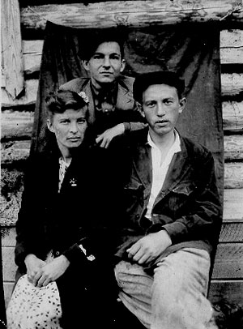

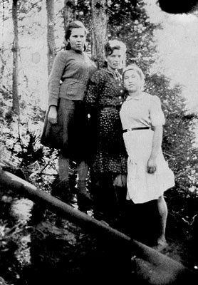

Kuschmangort 1947 Ich, Nina und Jefimtschik Kuschmangort 1947 Olja, Nina und Nastenka – ihre Freundin aus dem Lager Jüdin, Studenten der philologischen Fakultät der Staatlichen Moskauer Universität. Durch die Einladung erhoffte sich Jakob Jakowlewitsch, der genug von Ninas und meine Zwistigkeiten hatte, dass wir auf Grundlage allgemeiner Interessen zur Literatur zueinander finden würden. Sie war, ebenso wie ich, wegen antisowjetischer Agitation unter den Studenten verhaftet worden, allerdings bereits in den Nachkriegsjahren. Aber sie gefiel mir nicht. Sie war einfach zu schön und hell, viel zu anmaßend. Aber die Hauptsache war, dass ich ja schon Nina liebte und sie für eine Vertraute hielt.

Als es zwölf schlug, stand ich auf, um zu Nina zu gehen und ihr alles Gute für das neue Jahr zu wünschen. Auch Jakob Jakowlewitsch kam mit. Und dann sind wir in der Frauenbaracke. Auf dem Tisch ein kleiner Tannenbaum und zwei Kerzen. In den Zeltkabinen männliche Gestalten. Ganz in der Ecke, in der Nina und Olja untergebracht waren, stand David, sich auf die oberen Querstücke der benachbarten Wagonki stützend. Als erster trat Jakob Jakowlewitsch heran, drängte David beiseite und betrat die halbdunkle Kabine. Er küsste Nina und beglückwünschte sie zum neuen Jahr. Dann kam ich an die Reihe. Als ich aus der Kabine trat berührte David mich an der Schulter und meinte mit leiser, rauer Stimme:

– Warte, wir müssen reden.

Und dann gehen wir auf unserer Lagerallee – der Trennungslinie. Der Mond scheint, der Schnee knirscht, der Frost beißt in den Ohren. David redet, ich höre zu. Seine Motive sind die gleichen wie bei Olga. Er ist der Ansicht, dass ich Nina nicht wirklich liebe, sondern mich nur amüsiere und sie dann sitzenlasse. Aber er würde ihr auch nach seiner Freilassung treu sein und ihr eine Existenz ohne Elend sichern. Noch viele andere Dinge sagte er mir damals, bat mich, mich von Nina fernzuhalten und sie nicht mit meinen Gedichten betrunken zu machen.

In meinem Kopf gibt es nur einen Gedanken, eine Frage – habe ich mit Nina geschlafen oder nicht? Zu meiner Schande muss ich gestehen, dass ich ihm diese Frage stellte. Das ist niederträchtig, das ist nicht männlich. Aber die Eifersucht macht aus den Menschen etwas anderes. David zeigte sich edler als ich: er ging hinaus, ohne auf die Frage geantwortet zu haben. Was blieb mir nun zu denken? Ich verlor mich im Rätselraten und quälte mich mit verschiedenen Vermutungen.

Zwei Wochen verflogen in der Hetze des jährlichen Rechenschaftsberichts. Am Zwölften reiste Jakob Jakowlewitsch mit einer Aktentasche, gefüllt mit Buchhaltungsunterlagen, nach Solikamsk, und am Dreizehnten beschlossen Jefimtschik, Wasja Sereda, Wasja Schindin und ich das alte Neue Jahr zu feiern. Als materielle Grundlage für unser Treffen diente ein Paket, welches Schindin erhalten hatte und dessen Inhalt er beim Aufseher gegen eine Flasche Wein eingetauscht hatte. Wir überredeten Nina ebenfalls zu kommen.

Aus unserem Unternehmen kam jedoch nichts Gutes. Wasja Sereda, der mich offenbar verärgern wollte, begann Nina offen zu umwerben und versuchte sie zu küssen. Jefimtschik, der Nina sich Nina gegenüber sehr respektvoll verhielt und sie, ebenso wie ich, bedauerte, wies ihn zurecht. Wasja Schindin grämte sich, dass nicht genügend Wein vorhanden war, obwohl er eigentlich der Einzige war, der trank. Ich war verschlossen, konzentrierte mich auf meine Gedanken an Mama. Nina, wie sie später erklärte, empört über Wasja Seredas Benehmen und beleidigt über meine Gleichgültigkeit gegenüber seinem Verhalten, verabschiedete sich und ging. Ihr folgten nach und nach auch die anderen.

Entgegen meiner Gewohnheit legte ich mich früh schlafen. Ich löschte das Licht. Ins Fenster schienen die Wachlichter der Lagerzone. Es war kühl. An frostigen Tagen kühlte die Kabine sehr schnell aus. Ich wickelte mich in meine Decke und dachte über das Geschehene nach. Ich machte mir Vorwürfe, weil ich Wasja nicht zurechtgewiesen, Nina nicht zurückgehalten hatte. Schließlich wäre heute ein guter Tag für eine Versöhnung gewesen. Nun musste ich mich erneut rechtfertigen.

Ein leichtes, schüchternes Klopfen an der Tür brachte mich in die Wirklichkeit zurück. Wer konnte das denn sein? Das Nachtsignal war doch schon längst ertönt. Ob das etwa Nina war? So etwas zu riskieren!

Sie war es tatsächlich.

– Kann ich reinkommen, schläfst du noch nicht?

– Freilich! – stieß ich hastig und voller Freude aus.

Sie zog ihre Wattejacke aus und ordnete, ohne Licht zu machen, die Dinge, die auf dem Tisch lagen.

– Dieses Geschirr kannst du wegwerfen. Es gibt eh kein warmes Wasser, um es abzuspülen.

Sie setzte sich brav hin, legte ihre Hände auf die Knie. Ich erwartete Vorwürfe, doch sie schwieg.

– Willst du dich vielleicht hinlegen? – Ich versuchte diesen Satz so ruhig wie möglich hervorzubringen, als ob er nichts besonderes besagte.

Sie legte sich hin. Sie lag auf der Decke, in ihrem Kleid, so wie sie war. Nur die Filzstiefel zog sie aus. Ich daneben, unter der Decke. Und wieder Schweigen.

Mit Mühe kam es aus mir heraus:

– Vielleicht ziehst du das Kleid aus und legst dich unter die Decke – es ist kalt.

Ich sage es, aber es erschüttert mich, und mein Herz fällt in einen Abgrund. Nur gut, dass es in der Kabine dunkel ist und Nina mein Gesicht nicht sehen kann.

Ruhig und ohne ein Wort zu sagen, stand sie auf und begann ihr Kleid auszuziehen. Es zog sich in die Länge, als wäre es etwas Gewohntes, Häusliches und wir schon seit hunderten von Jahren zusammenwären. Sie öffnete den Reißverschluss auf ihrem Rücken. Ich half ihr schnell, und meine Finger zitterten. Und dann lag sie schließlich wirklich neben mir. Nur mit ihrer Unterwäsche bekleidet. Sie schmiegte sich an mich und weinte.

Am Morgen in der Buchhaltung gab ich ihr einen Zettel mit einem Vierzeiler:

Am Anfang ein leises Klopfen, Nun bist du in mein Leben getreten, Und in meine verwirrte Seele Hast du Wärme und Freude gebracht.

Seit der Zeit haben wir, mehr als vierzig Jahre lang, gemeinsam das neue Jahr nach altem Stil gefeiert, als wenn es unser Hochzeitstag wäre.

### Kapitel 14. Trennung

Nach dem Ende des Krieges vergingen etwa zwei Jahre. Der große Sieg, den das sowjetische Volk errungen hatte, stärkte die Autorität des Landes und erweiterte die Sphäre seines politischen Einflusses in bedeutender Weise. In einer Reihe der von uns befreiten Länder wurden prokommunistische Regime bekräftigt. Dort, aber nicht nur in den besetzten Gebieten Deutschlands und Österreichs, blieben unsere Truppen zurück. Das Land hatte mit der Abrüstung keine Eile. Fabriken und Schiffswerften produzierten auch weiterhin Waffensysteme: Panzer, Flugzeuge, Schiffe. All das erschwerte unsere Beziehungen mit denen, die noch kürzlich unsere Verbündeten gewesen waren und die nun vermuteten, dass die Führer des Landes beabsichtigten, den Kommunismus in Europa gewaltsam zu etablieren. Es begann die Zeit des «kalten Krieges», der durch eine beispiellose Jagd bei der Schaffung von Atomwaffen belastet war.

Im Landesinneren lief der Prozess der Wiederherstellung der zerstörten Wirtschaft. Es entstanden Städte, Ortschaften. Betriebe und Fabriken, die während der Kriegsjahre in den Osten abtransportiert worden waren, blieben dort. Zum Teil wurden Einrichtungen, die als Reparationen aus den besetzten Gebieten Deutschlands kamen, verwendet. Züge mit Ausrüstungen und technischen Gerätschaften kamen in einem nicht enden wollenden Strom aus dem Westen.

Am Bau der Anlagen, Fabriken, Straßen, Wohnhäuser waren neben der Zivilbevölkerung auch Truppenteile, Kriegsgefangene, Angehörige der Arbeitsarmee sowie hunderttausende, wenn nicht Millionen Häftlinge beteiligt. Letztere setzte man für die schwersten Arbeiten in den entlegensten und rauesten Ecken des Landes ein. Zu den traditionellen Arbeiten (Förderung von Erzen, Kohle, Holzbeschaffung, Abbau in Steinbrüchen) kam nun die Förderung von Uran hinzu, was in den meisten Fällen zu einer Verstrahlung und zum Tod der Gefangenen führte.

Das Leben im Lande blieb auch weiterhin sehr schwierig. Brot, Salz, Graupen, Pflanzenöl, Hering, Zucker sowie auch Manufakturwaren und Schuhe wurden in den Läden nur gegen Marken abgegeben. Die Normen waren niedrig, und oft gab es nicht genügend Waren. Als andere kaufte man auf dem Markt. Dort handelte man mit Brot (70 Rubel der Laib), amerikanischem Schmalzfleisch, das im Rahmen des Land-Lease-Vertrags zu uns geliefert wurde, Militärkleidung, aus Beute-Wolldecken genähter Bekleidung, Sachen, welche die Soldaten aus den besetzten Gebieten Deutschlands mitgebracht hatten.

Im Lande florierte das Schattengeschäft, Einzelpersonen und kriminelle Strukturen sammelten ein riesiges Vermögen an. Jede Menge Falschgeld kam in Umlauf. Infolgedessen befand sich das Finanzsystem des Landes in einer schwierigen Lage.

Unter diesen Bedingungen wurde 1947 eine Geldreform durchgeführt. Die neuen Banknoten wurden im Verhältnis zehn zu eins getauscht. Zum Umtausch waren Summen akzeptiert, welche achttausend Rubel nicht überschritten. Um den Anstieg der Marktpreise, vor allem den für Brot, zu stoppen, organisierte man den kommerziellen Handel. Nach der Abschaffung der Marken wurden die Preise in den Geschäften auf das Niveau der kommerziellen Preise festgesetzt.

Das Land lebte in der Erawar6ung auf Veränderungen. Armeeangehörige und Repatrianten, die im Westen gewesen waren und gesehen hatten, wie die Menschen, hofften, dass auch in der Sowjetunion entsprechende Umgestaltungen vorgenommen werden würden. Ein Teil der Intelligenz rechnete mit der Lockerung der Zensur, der Möglichkeit, seine Gedanken und Gefühle freier zu äußern. Die Angehörigen der Arbeitsarmee zählten auf ihre Demobilisierung. Die unterdrückten Völker – auf eine Rückkehr an ihre ehemaligen Wohnorte. Die Gefangenen – auf ihre Amnestie.

Manches geschah: einige Alltagsparagrafen fielen unter die Amnestie, die Verpflegung und Unterbringung der Häftlinge verbesserten sich ein wenig. Die Arbeitslager wurden aufgelöst. Die deutschen Arbeitsarmisten wurden in den Status von Verbannten versetzt. Doch im Großen und Ganzen schrumpft die Armee der kostenlosen Arbeitskräfte nicht. Mehr noch, in die Lager fluteten neue Häftlingsströme. Dorthin trieb man Soldaten, die in Gefangenschaft oder feindlicher Umzingelung gewesen waren, und, vor allen Dingen, «Wlassow-Leute». Man trieb diejenigen dorthin, die, nachdem sie in besetztes Gebiet geraten waren, «mit den Deutschen zusammengearbeitet» hatten. Unter ihnen befanden sich viele, die, um ihre Kinder, ihre alten Eltern vor dem Hungertod zu retten, in staatlichen Einrichtungen tätig gewesen waren – als Lehrer, Ärzte, Leute, die Reparaturen ausgeführt und an Bauarbeiten beteiligt gewesen waren.

Anfang 1947 drang ein Gerücht in den Stabnojer Lagerpunkt vor: alle Frauen sollen in Frauen-Sonderlager verschickt werden. Von wem ich diese Neuigkeit zum ersten Mal hörte, weiß ich nicht mehr. Sie ging von Mund zu Mund, wie das Rascheln der Blätter im Wald, bevor ein Gewitter losbricht. Für die weiblichen Gefangenen stellte diese Botschaft eine Bedrohung dar. Die Frauenlager hatten einen schlechten Ruf. Vor allem, weil dort die Mehrheit von ihnen schwere Männerarbeit verrichten musste. Die Aussichten, im Dienstleistungssektor oder gar in einem Büro untergebracht zu werden, waren merklich geringer als in den gemischten Lagern.

Anfangs gab es die Hoffnung, dass es sich lediglich um ein Gerücht handelte, doch schon bald darauf bestätigte Jakob Jakowlewitsch die Existenz eines entsprechenden Befehls. Bei einem der nächtlichen Appelle, die der Leiter des UssolLag Tarasjuk durchführte und bei denen Jakob Jakowlewitsch als Oberbuchhalter des OLP gelegentlich hinausgerufen wurde, ging es gerade um den Zeitpunkt seiner Umsetzung. Makarenko spielte auf jede erdenkliche Weise auf Zeit. Er benötigte die Mädchen dringend im unteren Lager. Umnowa überredete Tarasjuk die Versendung der Frauen bis zum Ende der Flöß-Arbeiten zu verschieben. Gleichzeitig begann am Lagerpunkt Golownaja der Bau eines neuen OLP-Kontors neben der Produktionszone. In das neue geräumige Gebäude sollte im Sommer das gesamte Verwaltungspersonal des OLP übersiedeln. An die Lagerzone anschließend wurde eine Siedlung für die zivilen Mitarbeiter errichtet.

Obwohl die Aussiedlung der Frauen aus Stabnoje sich verzögerte, wurde das Lager-Regime verschärft. Einander außerhalb des Büros zu begegnen war beinahe unmöglich. Die Frauen, die sich eines Vergehens schuldig gemacht hatten, wurden nach Golownaja oder Traktowaja gebracht. Im Büro selbst hielt sich ständig einer der Aufseher auf. Eine derart plötzliche Sorge um die Moral der Gefangenen war verwunderlich. Die unglaublichsten Vermutungen wurden angestellt. Es hieß beispielsweise, dass dies die Rache des Leiters der operativen tschekistischen Abteilung des UssolLag – Gerus – sei, dessen Ehefrau, welche sich zur Behandlung im Nischne-Moschewsker Krankenhaus befand, eine Beziehung mit einem inhaftierten Arzt angefangen hätte. Und obwohl man über dieses Verhältnis und seine tragischen Folgen schon lange und beharrlich gesprochen worden war, war nicht klar, weshalb Gerus auf diese Art und Weise Rache üben sollte. Man hörte auch die Meinung, dass die Angehörigen der Häftlinge die Trennung von Männern und Frauen verlangt hätten. Dass Stalin höchst persönlich eine solche Entscheidung getroffen hatte, wäre uns damals nie in den Sinn gekommen.

Im März 1947 wurde Jakob Jakowlewitsch in die Freiheit entlassen. Es war ein trauriger Abschied, zumindest für mich. Mit seinem Fortgang verlor ich nicht nur meinen Beschützer, sondern auch einen aufrichtigen und fürsorglichen Freund. Und auch Jakob Jakowlewitsch selbst verließ die Lagerzone ohne besonderen Enthusiasmus. Er begab sich in ein entlegenes sibirisches Dorf, in dem sich seine Familie in Sonderansiedlung befand. Was erwartete ihn dort?

Für den frei gewordenen Posten des Oberbuchhalters des OLP wurde Iwan Makarenko ernannt. Ich bekam mehr Arbeit. Es gab auch mehr Sorgen. Wie ein Damokles-Schwert hing über mir die Bedrohung der Verschickung der Frauen auf Etappe. Was würde mit Nina werden? Welche Maßnahmen konnte man ergreifen? Die Lage wurden noch komplizierter durch die bevorstehende Verlegung des Verwaltungspersonals des OLP nach Golownaja. Für Nina und mich bedeutete der Umzug nichts Gutes. Schließlich waren dort Kalinowskij und David Andrejewitsch die Herren der Lage.

Im März setzte Bewegung ein. Frauen aus einen Lageraußenstellen des Kuschmangortsker OLP wurden zur Lagerstelle «Lesnaja» verlegt, welches ein reines Holzbeschaffungs-Frauenlager wurde. Achtzig Frauen wurden nach Golownaja gebracht, wo seit ewigen Zeiten eine spezielle Frauenlagerzone existierte, die vom restlichen Lager-Territorium durch einen zwei Mann hohen Staketenzaun abgegrenzt war. Das erlaubte es, zumindest formell, den Stalin-Befehl über die «Geschlechter-Trennung» nicht zu verletzen. Ein Teil der Frauen blieb im Außenlager Traktowaja am zentralen OLP-Krankenhaus und in den Nähereien. Die Bewegung betraf auch unseren Lagerpunkt Stabnoje. Von hier wurden fast alle Frauen nach Golownaja und Lesnaja gebracht, mit Ausnahme derer, die in der Buchhaltung tätig waren. Auch Nina blieb. Erneut ängstliche Erwartung.

Schließlich, Anfang April 1947 zog die gesamte OLP-Leitung nach Golownaja und ließ sich dort in den für sie fertiggestellten Büros und Wohnungen nieder. Ihnen folgten wir (per Etappe) – die Gefangenen, die in der OLP-Buchhaltung und der Planungsabteilung arbeiteten. In Golownaja wurde mir ein Platz in der Baracke für das verwaltungstechnische Personal zugewiesen, wurde in der Frauenzone in der Baracke der «Schokoladen-Frauen» untergebracht, in der sich bereits Olga Butenko befand, die bereits mit der ersten Frauen-Etappe nach Golownaja gekommen war.

Zur Arbeit wurden wir jetzt in zwei Schritten gebracht: zuerst mit einer allgemeinen Absperrung in die Arbeitszone, und dann von dort aus, in Begleitung von zwei oder drei Wachmännern, ins Kontor. Dort bewachten sie uns weiter und beaufsichtigten uns während des gesamten Arbeitstages.

Bald nach dem Umzug kam es zu einem Wechsel in der Leitung des OLP. Makarenko schied aus dem „System“ aus und reiste ab. Iwan fuhr mit ihm. Zum Leiter des OLP wurde Fajerstajn ernannt, zum Ober-Buchhalter – der Armee-Finanzmitarbeiter Aleksander Mironowitsch Jerschow. Fajerstejns Beziehung mir gegenüber, die bereits am Lagerpunkt Stabnoje zustande gekommen war, war sehr gut. Nach seinen Worten gefielen ihm mein Fleiß und meine guten Kenntnisse in Produktionsfragen. Jerschow erwies sich als lebensfroher und aufgeschlossener, entgegenkommender Mann. Als ehemaliger Frontsoldat und vergleichsweise jung, hatte er es noch nicht geschafft, die Lager-Ideologie zu durchschauen und wandte sich an uns, die Lager-Insassen, mit einer für uns ungewöhnlichen Einfachheit und Natürlichkeit. Er war leidenschaftlicher Préférence-Spieler und, nachdem er sich in seinem Büro eingeschlossen hatte, «kloppte er oft stundenlang Karten» mit den Zivilangestellten des OLP. Er spielte ausschließlich um Geld und das, wie seine Partner bestätigten, äußerst professionell. Mit den ersten Arbeitstagen setzte er mich als seinen Stellvertreter ein und verließ sich in allen Fragen hinsichtlich der Produktionsaktivitäten des OLP auf meine Erfahrung. Ich musste rotieren, besonders an den Tagen, als die Quartals- und Jahresabrechnungen erstellten wurden.

Ninas Schreibtisch stand, wie auch in Stabnoje, neben meinem. Sie arbeitete in der Produktionsgruppe und führte die Produktionskonten, unter anderem die Kartothek für die Objekte der großen Bauvorhaben. Über letztere, in der besonders häufig der Begriff «Objekt» verwendet wurde, ärgerte sie sich aus irgendeinem Grund. Nach der Tradition, die bereits in Stabnoje zustande gekommen war, bereitete sie das Mittagessen aus Lebensmitteln zu, die sie und ich in Form der Trockenration erhielten. Manchmal gesellte sich auch Jefimtschik zu uns.

Zu der Zeit, als für mich die dienstlichen Angelegenheiten sehr gut liefen, war es um das Leben in der Lagerzone, besonders in den ersten Monaten, äußerts schlecht bestellt. Zwischen mir und David spielte sich ein noch verborgener Kampf ab. Die Kräfte waren eindeutig ungleich. David fühlte sich in der Zone als Herr. Das gesamte Dienstpersonal und die Aufseher standen auf seiner Seite. Sie achteten ihn, waren an ihn gewöhnt und von ihm abhängig. Schließlich wurde er von Kalinowskij unterstützt. Ich dagegen war, wie alle meine Mit-Bediensteten auch, in Golownaja Neuling und vor allen Dingen für den Lagerpunkt ein Fremdling, den man nicht brauchte. Iwan Makarenko gab es nicht. Mich an Fajerstejn zu wenden, hielt ich für unpassend.

Besonders heftig erlebte ich meine Hilflosigkeit abends, wenn ich von der Arbeit in die Lagerzone zurückkehrte. Ich und Nina wurden aufmerksam von dutzenden, David treu ergebenen, Augen verfolgt. Wenn sie zu mir in die Baracke trat, tauchte sofort der Aufseher auf. Für mich war ein Besuch bei Nina vollkommen unmöglich. Männer wurden in die Frauenzone nicht hineingelassen. Zugang hatten, neben den Aufsehern und den zivilen Leitern, lediglich der Kommandant und der Arbeitsanweiser. David machte sich das zunutze, indem er seine Sonderrechte demonstrierte. Während er sich in der Frauenzone aufhielt, konnte ich für mich keinen Platz finden. Minuten wurden zu Stunden. Nina und besonders Olga hörten nicht auf, mich davon zu überzeugen, dass David ein ordentlicher, entgegenkommender, guter Mensch war, der sich, ungeachtet seiner Liebe zu Nina, nichts Schlechtes erlauben würde. Mich ärgerten diese Gespräche nur. Besonders Olga. Sie verschwand von früh bis spät in Kalinowskijs Kabine. Nina war häufig bei ihr. Der Gedanke, dass sich dort auf David aufhielt, ließ mir keine Ruhe, aber ich konnte mich nicht zu einer Bespitzelung hinreißen lassen.

Es ist wohl nicht sehr männlich, aber ich muss zugeben, dass mir nicht nur einmal die Idee kam, meine Beziehung zu David mit den Fäusten zu klären. Mehr noch, ich fühlte keinerlei Hass ihm gegenüber. Ich quälte mich selbst, quälte Nina.

Ein paar Mal, in Minuten der Verzweiflung, fasste ich den Entschluss, mich von Nina zu trennen, aber jedes Mal hielten mich ihre Tränen und Liebesversicherungen zurück. Erschöpft und am Boden zerstört schrieb ich in jenen Tagen:

An welche Türen habe ich nicht alle geklopft Um Stille und Ruhe zu finden, Man antwortet mir überall nur mit einem Lachen, Verjagt mich von der fremden Tür.

Trost fand ich bei der Arbeit. Zum Glück gab es davon mehr als genug. Das OLP ging zur Aufbereitung von Baumstämmen und dem Abtransport von Holz über. Das wurde als fortschrittlicher angesehen, weil die Abläng-Arbeiten aus dem Wald in den stationären Bereich des unteren Lagers verlegt wurden. Allerdings entstanden dabei unerwartete Schwierigkeiten. Die ins OLP entsandten Kubatur-Fachleute erwiesen sich als alles andere als perfekt. Die von ihnen berechneten Volumina an bereitgestelltem Holz überstiegen gravierend jene, die sich nach der Bearbeitung der Stämme in den Sortimenten ergaben. Im Mai nahm der im unteren Lager entstandene Fehlbestand bedrohliche Ausmaße an. Die Kubator-Angaben mussten schnellstens korrigiert werden. Mit dieser Arbeit beauftragte Fajerstejn mich. Tagsüber lief ich in den Holzeinschlagsabschnitten herum, definierte die “außer Kontrolle geratenen” Koeffizienten der unterschiedlichen Holzarten und zeichnete einen Abriss der Stammprofile. Abends erledigte ich im Büro des technischen Leiters des OLP Sadikow die Buchführung. Dort saß ich bis zum späten Abend, bis der Begleitsoldat anfing zu revoltieren. Nach einem Monat angestrengter Arbeit war die neue Volumen-Berechnung fertig. Der Wachmann und ich erhielten jeder eine Prämie in Höhe von 200 Rubel zugeschrieben.

Meine Sonder-Beziehungen zu Fajerstejn und Sadikow, die mich häufig abends in ihr Kontor riefen und mich manchmal mitnahmen, wenn sie zu den Holzeinschlag-Gebieten fuhren, wurden im Lagerpunkt bekannt. Allmählich änderte sich auch hier die Einstellung mir gegenüber zum Besseren: man teilte mir eine Kabine am Ende einer der Baracken zu, und die ständige Bespitzelung wegen Nina hörte auf. Sie erhielt die Möglichkeit mich zu besuchen und sogar Ordnung im Büro zu schaffen. Allerdings durfte sie nicht über Nacht bei mir bleiben.

Fajerstejn schickte mehrmals einen Antrag auf Ausstellung eines Passierscheins für mich, für eine Fahrt ohne Begleitsoldaten, nach Solikamsk. Die Erlaubnis kam erst im Juni 1947. Ein kleines unscheinbares Dokument, in Karton gebunden, ähnlich einem Dienstausweis. Foto, Unterschriften, Stempel. Aber was für eine Freude, was für ein Glück für den Gefangenen verbarg sich dahinter. Ich kann mich noch gut an jenen Tag erinnern, als ich allein, ohne Begleitwache, am Wachhäuschen vorbei zur Arbeit schritt. Ich wählte extra einen schmalen Weg, der weit entfernt von der Hauptstraße lag, über den sie uns immer zur Arbeit gebracht hatten. Er führte durch den Wald, dann über ein Feld, so dass ich die Produktionszone umgehen konnte. Es war ein klarer, sonniger Morgen. Über den blauen Himmel zogen langsame Schäfchenwolken. Auf einer Seite – der Waldesrand, auf der anderen – eine Wiese, üppig bewachsen mit saftigem, grünem Gras. In der Ferne ein paar abgekoppelte Pferde. Und niemand ging hinter mir. Ich erinnere mich an meine zögernden Schritte. Die Beine gehorchten mir nur schwer, wie nach einer schweren, Kräfte zehrenden Krankheit. Ich wollte an nichts denken. Ich ergab mich vollständig dem Gefühl der Freiheit hin, die mich durchdrang. Ich durfte gehen, anhalten, mich ins sonnige, grüne Gras legen und in den endlosen Himmel schauen. Ich durfte den Weg verlassen und Blumen pflücken. Und niemand würde mit dem Gewehrschloss klicken und schreien: «Ein Schritt nach rechts, ein Schritt nach links – das gilt als Fluchtversuch», und kein Schäferhund würde als Antwort darauf knurren.

Der Gedanke an Blumen, die ich Nina ins Büro mitbringen könnte, brachte mich in die Realität zurück. Nachdem ich einen Strauß zarter Feldblumen gepflückt hatte, rannte ich fast im Laufschritt ins Kontor. Ein paar Tage später erhielten auch noch ein paar andere Kontor-Mitarbeiter einen Passierschein. Unter ihnen auch Nina. Nun begann für uns ein neues Leben. Endlich konnten wir am Ufer der Kama sitzen, in den Wald gehen, uns ins Dickicht zurückziehen. Aber wir mussten Vorsicht walten lassen. Obwohl dies bei Vorhandensein eines Passierscheins nicht als Fluchtversuch galt, konnte es trotzdem als Verletzung des Regimes gewertet werden, wodurch eine unverzügliche Konfiszierung des Erlaubnisscheins drohte. Wir mussten uns verstecken. Nina erinnerte sich noch lange an das Eichhörnchen, welches uns zu Tode erschreckte.

Freilich war die «Freiheit», die der Ausweis uns gab, relativ. Um sich von der Lagerzone mehr als einen Kilometer weit entfernen zu können, war eine besondere Route vorgeschrieben. Außerdem war der Erlaubnisschein auch zeitlich begrenzt: er galt von sieben Uhr morgens bis acht Uhr am Abend. Für eine spätere Rückkehr benötigte man eine Sonder-Genehmigung.

Für mich persönlich eröffnete der Passierschein eine Menge über das Lagerleben. Und vor allen Dingen über das Leben der deutschen Trudarmee-Angehörigen, mit denen ich recht gut bekannt wurde. Im UssolLag waren sie Anfang 1942 eingetroffen. Sie arbeiteten beim Holzeinschlag unter Wachbegleitung. Sie lebten unter Bedingungen, die sich nur wenig von denen unterschieden, unter denen Gefangene gehalten wurden. Eine ebensolche Zone mit Wachtürmen, Wachmannschaften, Hunden, Durchsuchungen am Morgen und am Abend. Dieselbe Verpflegungsnorm, dieselbe hohe Sterblichkeitsrate, dieselben «Bestattungen», bei denen die vor Erschöpfung umgekommenen Menschen in Sammelgruben geworfen wurden. Einen Unterschied gab es allerdings: viele der Trudarmisten behielten ihre Komsomolzenund sogar Partei-Mitgliedsausweise. Sie berichteten, dass man die deutschen Kommunisten unter den Bedingungen des Lagerlebens unter Wachbegleitung zu den Partei-Versammlungen brachte, dass man gegen viele von ihnen aus unterschiedlichen Anlässen Strafverfahren (selbstverständlich politische), meistens ohne ihre Anwesenheit, einleitete, ihnen jeweils zehn Jahre aufbrummte und sie dann, nun schon als Gefangene, in die Lagerzone schickte. Eine gewisse Nachsicht wurde erst nach Kriegsende geübt: man schaffte die Wachbegleitung ab, erlaubte ihnen, einen kleinen privaten Gemüsegarten zu besitzen, wodurch viele von ihnen ihr Leben retteten. Ab Ende 1946 siedelte man die deutschen Trudarmee-Angehörigen auf dem Territorium des UssolLag an, ohne das Recht, sich außerhalb der Grenzen aufzuhalten. Einige Familien siedelten sich in der Umgebung des Lagerpunktes «Golownaja» an. Hier errichteten sie sich Häuser, legten Gärten an, hielten Schweine und Hühner.

Mit einem von ihnen freundete ich mich an. Er hieß Fedja - Franz Faber. Seit den ersten Tagen des Krieges hatte er im Artillerie-Regiment gekämpft. Im Herbst 1941, entfernten sie ihn, weil er Deutscher war, von der Front und schickten ihn in den Ural. Dort geriet er ins UssolLag. Er sägte Holz, hungerte, magerte immer mehr ab, wurde immer schwächer. Nach Kriegsende entband man ihn von der Wachbegleitung und ernannte ihn erst zum Vorarbeiter danach zum Forstmeister. Er heiratete eine Frau, die so war, wie er, Angehörige der Trudarmee, die in deutscher Gefangenschaft gewesen war und deswegen nach der Repatriierung in den Ural ausgewiesen wurde. Zum Zeitpunkt unserer Bekanntschaft war Faber als Lagerverwalter für Lokomotiven-Brennstoff angeführt. Zu seinen Pflichten gehörten die Beschaffung und Verteilung von Brennholz für die Loks. Mit der Umstellung des Transports von Baumstämmen in die oberen Lager blieben nur noch Äste und Zweige zurück, die praktisch für diese Zwecke ungeeignet waren. Die aus den Vorjahren verbliebenen Vorräte gingen schnell zur Neige. Es begannen Probleme mit dem Abtransport der Stämme, und Faber musste bei der Leitung «antanzen».

Und da kam Faber und mir die Idee, als Betriebsstoff Bahnschwellen zu verwenden, die in den Holzeinschlagsrevieren nach der Abschaffung der provisorischen Bahnlinien (Knotenpunkte) liegengeblieben waren, um sie in Holzschläge zu verbringen, die noch abzuholzen waren. Mit Hilfe seiner kleinen Brigade organisierte Faber ihren Abbau, Abtransport, Zerlegung und Einlagerung an den Hauptabschnitten der Magistrale. Und ich kümmerte mich um das Außenbilanz-Konto. Der Leitung sagten wir über diese Operation nichts. Aber als am Ende des Folgemonats die Stoßarbeit begann und Tarasjuk von Fajerstejn zusätzliche Kubikmeter verlangte, konnten Faber und ich ihm ein Geschenk machen: mehrere hundert fehlende Kubikmeter Holz. Fajerstejn wusste unsere Initiative zu würdigen, und wir freuten uns. Doch bald darauf wurde die Kehrseite der Medaille entdeckt. Jetzt rief Fajerstejn uns jedes Mal, wenn es Stress mit der Planerfüllung gab, zu sich ins Kontor, schloss die Tür zu und fing an, die fehlenden Kubikmeter aus uns herauszuquetschen. Im Empfangszimmer sammelten sich Menschen an, mitunter von recht hohem Rang. Alle waren empört. Besonders ärgerte sie die Tatsache, dass ein Gefangener schuld an der Verzögerung war. Allmählich verankerte sich in mir der mit Gefahren verbundene Spitznamen «Fajerstejns Geheimrat».

Bei einer derartigen Einstellung mir gegenüber vermag ich in der Bewertung P.J. Fajerstejns kaum objektiv urteilen, aber zu seinem Schutz muss ich sagen, dass er nach Meinung all derer, die mit ihm zu tun hatten, ein hervorragender Spezialist im Bereich der Holzbeschaffung, aber auch kein schlechter Lager-Leiter war. Seine Haltung gegenüber den Gefangenen war ausgeglichen, ohne Lärm und Geschrei, aber auch ohne Tändeleien. Ich kann mich nicht erinnern, dass irgendein Arbeiter sich schlecht über ihn geäußert hätte. Aber in all seinen Handlungsweisen, die meiner Aufmerksamkeit zugänglich waren, lag Berechnung. Eine Episode, an die ich mich erinnere, ist in dieser Hinsicht charakteristisch.

Es war ein heißer Sommertag. Fajerstejn, Trojanowskij, der im OLP die Bauarbeiten leitete, und ich gingen entlang der Schmalspurbahn. Wohin und warum und aus welchem Grund wir nicht mit Fajerstejns Sonderwaggon fuhren, weiß ich nicht mehr. Uns entgegen kam mit einem Schraubenschlüssel in der Hand – die Streckenwärterin. Eine junge Frau in Lager-Kleidung. Nachdem wir weit genug weg waren, damit sie Fajerstejn nicht mehr hören konnte, wandte er sich an Trojanowskij und fragte ihn:

- Wissen Sie, wer diese Frau ist?

- Nein, - antwortete Trojanowskij.

- Das ist die Iwanowna – die Lager-Frau von Briagdier Karimow. Ihn kennen Sie doch sicher?

- Natürlich weiß ich das, aber warum müssen sie denn wissen, dass Iwanowa seine Frau ist? – wunderte sich Trojanowskij.

- Na ja! Ich bin verpflichtet Einzelheiten zu kennen, wenn ich das Personal sinnvoll einsetzen will, - entgegnete Fajerstejn und fügte nach kurzem Schweigen hinzu:

- Ich erinnere mich, dass es nicht nötig gewesen wäre, Karimow an den Lagerpunkt Sewernij zu verlegen. Hätte ich das getan, ohne von seinen Verbindungen zu Iwanowa zu wissen, dann wäre ich auf seinen tiefen, hartnäckigen Widerstand gestoßen. Freilich, man hätte eine entsprechende Verfügung herausbringen können, aber wie hätte Karimow dann auf seine Pflichten am neuen Ort reagiert. Aber so habe ich gewartet, bis für Iwanowna ein Passierschein ausgestellt und sie als Streckenwärterin nach Sewernij geschickt worden war. Ein paar Tage später kommt Karimow zu mir und bittet darum, nach Sewernij verlegt zu werden. Er verspricht gute Arbeit zu leisten, Arbeitsrekorde zu erbringen. Selbstverständlich erklärte ich mich einverstanden! Und, wie ihr wisst, hat Karimow sein Versprechen gehalten. Und nachdem er, wie um sich zu rechtfertigen, einen Moment geschwiegen hatte, fügte er hinzu:

- Aber hier geht es ihnen ja auch gut.

Trojanowskij antwortete nicht. Ihm, einem qualifizierten Bau-Ingenieur, der seinerzeit 10 Jahre verbüßt und im Bereich der Lagerzone geblieben war, gefiel Fajerstejns Bericht nicht, und das versuchte er auch nicht zu verbergen.

Es entstand eine schmerzhafte Pause. Entlang der Trasse wehte ein leichter Wind, der uns vor den lästigen Ural-Mücken bewahrte.

An den Sommer 1947 erinnere ich mich wegen zweier raffinierter Fluchtversuche, die leider nicht von Erfolg gekrönt waren.

Der erste wurde von einem ehemaligen Militärarzt, der mit seinem Freund von der Front in der medizinischen Station der Produktionszone tätig war, konzipiert und durchgeführt. Woher sie zwei beschädigte Gasmasken (ohne Filter) beschafften – ich weiß es nicht. Doch sie spielten in ihren Plänen eine entscheidende Rolle. Neben den Gasmasken bevorrateten sie sich mit Zwieback, Speck und Stricken, und schoben, nachdem sie einen geeigneten Tag ausgewählt hatten, an dem besonders aktiv Flöß-Arbeiten erledigt wurden, stießen sie vier große Baumstämme ins Wasser, banden sie paarweise mit den Stricken zusammen, zogen sich die Gasmasken über, tauchten ins Wasser ab, befestigten gewellte Röhren an der Wasseroberfläche und legten sich anschließend unter die Stämme. Unbemerkt zwischen den «Schwimmflößen» mit den Wachen mitrutschend, sollten sie entsprechend dem erarbeiteten Plan mindestens 1012 Kilometer weit die Kama abwärts schwimmen, um ein Gebiet außerhalb der Grenzen des OLP-Territoriums zu erreichen. Doch es ereignete sich etwas Unvorhergesehenes. Die Stämme, die von der ungleichmäßigen Strömung davongetragen wurden, fingen an auseinanderzudriften. Infolgedessen landeten sie an unterschiedlichen Stellen an, konnten nicht zusammentreffen und gingen, jeder für sich, tief in den Wald hinein. Der eine hatte in seinem Gummibeutel den Zwieback, der andere – den Speck. Derjenige, der den Zwieback bei sich trug, umging die auf seinem Weg liegenden Dörfer, Siedlungen und sogar vereinzelte Jagdhütten, schaffte es bis zu einer abgelegenen Bahnstation und wurde von Fahndern noch auf dem Weg zur Plattform festgenommen, wo er sich unter einer zerrissenen Plane versteckt hatte. Der Zweite verbrachte längere Zeit in Freiheit. Ohne den Zwieback nagte er am Speck, ernährte sich von Beeren und Pilzen. Bald bekam er blutigen Durchfall. Eine ganze Woche versuchte er sich selbst zu heilen, in dem er in großen Mengen, seiner Meinung nach, heilende Kräuter aß. Doch nichts half. Er verlor schnell an Gewicht. Mit allerletzter Kraft gelangte er ins nächstgelegene Dörfchen und klopfte an eine am Rande gelegene Hütte. Damit war sein Leben in Freiheit beendet.

Man brachte sie zurück nach Kuschmangort, wo sie verurteilt wurden. Den Untersuchungsrichter interessierte besonders die Frage, wie es ihnen möglich gewesen war, unbemerkt Gasmasken aufzusetzen, ins Wasser zu steigen und sich unter die Baumstämme zu legen. Der Ermittler war der Ansicht, dass sie hier nicht ohne Mithilfe anderer Häftlinge ausgekommen wären. Er suchte, fand jedoch niemanden. Die Geflohenen aber bekamen weitere 10 Jahre aufgebrummt und wurden zurück in die Lagerzone gebracht.

Der zweite Fluchtversuch endete blutig. Es begann alles damit, dass einer der Brigadiere, der das Hinaufwälzen auf die Stapel leitete, beschloss, darin eine Kabine für Treffen mit der zivilangestellten Buchhalterin einzurichten. Zu diesem Zweck wurden auf seine Anordnung entlang der Kanten acht Reihen mit 1-Meter langen Holzklötzen gefüllt, über die dann ein Längsstück geschoben wurde. Um in die Kabine zu gelangen, genügte es, zwei extra angespitzte Klötze herauszuziehen und in das so entstandene Einstiegsloch zu steigen. Fast ein Jahr lang stand der Holzstapel unberührt da. Im Sommer wurde der Brigadier freigelassen, und der Unterstand wurde von drei ehemaligen Frontsoldaten übernommen. Tag für Tag brachten sie Zwieback, gesalzenen Fisch, Speck mit in die Arbeitszone und versteckten alles in der Kabine; außerdem legten sie dort einen Vorrat an Wasser an. Dann endlich kam der Tag, als sie «sich in Deckung legten».

Ich kann mich noch gut an jenen Abend erinnern. Alle warteten ungeduldig darauf, dass die Begleitwachen zur Abnahme klopften, was bedeutete, dass die Listen in der Wache übereinstimmten und alle Arbeiter die Arbeitszone vollständig verlassen konnten. Doch es gab keine Abnahme. Es bedeutet, dass es keine Übereinstimmung gab. Auf dem Korridor des OLP-Kontors entstand lebhafte Bewegung. Offiziere der Militarisierten Wache liefen herum und redeten besorgt über irgendetwas.

Entlang der Absperrzone und auf der Seite des Kama-Flusses wurden zusätzliche Wachen aufgestellt. Am Abend, wenn die Dämmerung einsetzte, wurden Suchscheinwerfer eingeschaltet, die das Territorium des unteren Lagers an den Seiten und in der Mitte ausleuchteten. Die riesigen Holzstapel, die nach Beendigung der Flöß-Arbeiten entstanden waren, warfen lange, eckige Schatten. Überall huschten Hundeführer herum. Wir, die im Kontor Beschäftigten, wurden ungeachtet unserer Gesichter, in aller Eile in die Wohnzone geschickt. Am Morgen ließen sie uns nicht zur Arbeit gehen. Sämtliche Begleitwachen und Aufseher, aber auch ein Teil der Zivilangestellten, wurden zur Wachverstärkung in die Arbeitszone gebracht. Die Belagerung dauerte zwei Tage. Die Wachen liefen sich die Füße wund, konnten jedoch nichts entdecken. Am dritten Tag organisierten sie einen erlogenen Abzug. Das Ziel der Wachen lag in den Gebüschen und Hainen, die hundert Meter vom Stacheldraht entfernt waren und das Territorium des unteren Lagers umgaben. Am Abend schlugen die Wachleute auf den Wachtürmen zum «Abzug», verließen demonstrativ ihre Arbeitsplätze und gesellten sich zu ihren in den Büschen liegenden Kameraden. Die Suchscheinwerfer wurden ausgeschaltet. Alles erstarrte... In der Nacht war im zentralen Bereich der Zone ein undefinierbares Rascheln zu hören. Die über den Boden kriechenden Geflohenen wurden aus nächster Nähe, unter den blendenden Lichtstrahlen der sofort eingeschalteten Suchscheinwerfer, erschossen.

Am Morgen sahen die aus der Zone herausgeführten Häftlinge drei blutige, auf ein Fuhrwerk geworfene Leichen. Der Kommandeur des Zugs Baschkirzew verkündete, dass dieses Los jeden ereilen würde, der sich zu einem Fluchtversuch entschlösse.

Der Herbst verging mit Trubel und Sorgen. Die Hektik um die Rechenschaftsberichte ging zu Ende und da ist er, der frische, eben erst eingebundene und immer noch nach Kaliko und Leim riechende, vierteljährliche Bericht. Darin die Bilanz, drei Dutzend Formulare mit sorgfältig verifizierten Indikatoren und umfangreiche Erläuterungen – das Ergebnis der peniblen, mühsamen, viele Tage dauernden Arbeit unseres Kollektivs. Auf dem Titelblatt die Aufschrift - «Streng geheim » und die abgehackte Unterschrift Fajerstejns, ohne Linien und Übergänge.

Als Jerschow mit dem Bericht nach Solikamsk fahren wollte, beschloss er, mich mitzunehmen, was in Ninas und meiner Seele eine leise Unruhe auslöste. Würden wir uns noch einmal wiedersehen? Würde man sie nicht ohne mich aus dem Bereich des OLP entfernen? Das war mit anderen schon geschehen, und nicht nur einmal. Ich hoffte, dass Fajerstejn nichts derartiges unternehmen würde. Aber wusste er von meiner Beziehung zu Nina? Ich war überzeugt davon, dass es ihm bekannt war. Nina zweifelte und verfluchte den Tag, an dem man uns den Passierschein ausgehändigt hatte.

– Wenn sie nicht gewesen wären, dann müsstest du jetzt nicht nach Solikamsk fahren, – flüsterte sie. Wir standen hinter einem hohen Holzhaufen, der uns vor den Augen der anderen verbarg. Nina weinte, und ich küsste ihr tränennasses Gesicht und versuchte sie, so gut es ging, zu beruhigen. Doch das half wenig. Schließlich trennten wir uns zum ersten Mal, wenn auch nicht für lange Zeit.

Zuerst waren Jerschow und ich mit Pferden unterwegs, bis nach Tscherdan (ungefähr 20 Kilometer), und von dort mit dem Schiff bis Solikamsk (den Biegungen des Flusses folgend, etwa 140 Kilometer). Wir fuhren nach dem Mittagessen los. Eine nasse, sandige Straße. Zu beiden Seiten niedrig gewachsene, dunkelgrüne Fichten, gelb verfärbte Birken, im Wind flammend leuchtende Espen. Hier und da wurden sie von mächtigen Kiefern mit weit ausgebreiteten Zweigen überragt. Am Wegesrand durch das Alter schief und vom Herbstregen schwarz gewordene Telegrafenmasten mit Querbalken und bis zu einem makellosen Weiß abgewaschenen Isolatoren.

Unbemerkt näherten wir uns Tscherdan. Bis zur Abfahrt des Schiffes blieben noch drei Stunden. Wir gingen durch die Stadt. Sie war recht klein. Nicht mehr als sechs-siebentausend Einwohner. Die Häuser eingeschossig, aus Holz gebaut. Keine großen Straßen. Im Zentrum ein paar uralte Gebäude aus Ziegelsteinen. In einem von ihnen, es war groß und gepflegt, waren das Bezirkskomitee und das Bezirksexekutiv-Komitee untergebracht. In der Ferne, am Stadtrand, hinter einem Hain von hohen Bäumen, irgendein Gebäude aus roten Ziegelsteinen. Entweder ein Kloster oder eine halbverfallene Kirche. Später konnte ich in Erfahrung bringen, dass sich in diesem Gebäude ein Gasthaus befand, in dem man sogar übernachten konnte.

Bei dem Schiff handelte es sich um einen Raddampfer, wohl noch aus Zarenzeiten. Langsam mit seinen Schaufelrädern durchs Wasser plätschernd, schwamm er zunächst auf der Kolwa, wo es eine Anlegestelle gab, dann auf der Wischera, in welche die Kolwa mündete, und dann, ab Mitte der Fahrt auf der Kama. Bis in die tiefe Nacht hinein stand ich an Deck. Der schimmernde Weg des Mondes, die Lichter der Bojen. Ein Stück weiter eine einsame Frauengestalt. Der Winde zerzauste ihre Haare, blies den Saum ihres Regenmantels auf. Aber meine Gedanken waren bei Nina. Beim Abschied hatte sie sich so einsam und hilflos gezeigt. Irgendwie wird unser Leben zurechtkommen.

Entgegen den geltenden Regeln, brachte Jerschow mich in Solikamsk in einem Gasthaus in demselben Doppelzimmer unter, in dem auch er einquartiert war. Nachdem wir uns eingerichtet und gefrühstückt hatten, begaben wir uns zur Verwaltung. Dort schickten sie mich, nachdem der Rechenschaftsbericht abgegeben war, zum Arbeiten in die analytische Abteilung. Ich bemühte mich nach Kräften. Erstens, weil mir diese Arbeit zusagte, und zweitens, weil ich mich empfehlen und mich auf meinem Posten etablieren wollte, um weniger von Fajerstejns und Jerschows Launen abzuhängen. Denn in jedem beliebigen Augenblick konnte alles zusammenstürzen, und ich – würde wieder zu allgemeinen Arbeiten herangezogen werden.

Während ich in der Abteilung arbeitete, spielte Jerschow im Hotel Karten, wobei er aus seinen Mitspielern recht anständige Geldsummen herausholte. Auf mein Bitten erkundigte er sich während eines Telefonats mit der Buchhaltung des OLP nach Ninas Gesundheit.

Unser Aufenthalt in Solikmsk dauerte etwa 10 Tage. Während dieser Zeit lernte ich den Ober-Buchhalter des UssolLag Jakob Michailowitsch Schachanow und den Leiter der analytischen Abteilung kennen. Offenbar gefiel ihnen meine Arbeit. Jedenfalls beriefen sie mich seitdem mit jedem Quartalsrechenschaftsbericht in die Verwaltung, manchmal sogar ohne Jerschow. Dort in der Verwaltung lernte ich auch zwei Deutsche kennen, die Oberbuchhalter der in der Nachbarschaft von Kuschmangort gelegenen OLPs Spadi und Norden. Unter uns gab es einen geheimen Wettstreit darüber, wer den Rechenschaftsbericht zuerst einreichen würde. Einmal sandte Spadi, der ein großer Witzbold war, auf dem Höhepunkt der Arbeiten am Quartalsbericht ein Paket mit Saatkörnern in unsere Buchhaltung, womit er für einen ganzen Tag den Abschluss des Berichts verzögerte.

Ende Oktober kehrten wir, bereits im Schnee, nach Kuschmangort zurück. Nina sah müde aus, aber sie freute sich. Sie berichtete von einem für uns bemerkenswerten Ereignis, genauer gesagt Fajnstejns Reaktion darauf. Während unserer Abwesenheit hatte einer der neuen Buchhaltungsmitarbeiter angefangen, in Ninas Beisein in sehr schmutziger Art und Weise zu fluchen. Nina fand das äußerst kränkend und beleidigend; sie rannte unter Tränen aus der Buchhaltung und stieß im Korridor mit Fajnstejn zusammen. Nach einiger Zeit machte Fajnstejns Sekretär sie ausfindig und sagte:

– Mich hat Pawel Jewsejewitsch geschickt, um in Erfahrung zu bringen, weshalb Maiers Ehefrau weint.

Ich hatte recht gehabt: Fajerstejn war über meine Beziehung zu Nina auf dem Laufenden und verurteilte sie nicht. Unter Lagerbedingungen war das wichtiger als die Eintragung beim Standesamt.

Im Frühling 1948 wurde Nina krank. Sie bekam eine Angina, die sann in eine Lungenentzündung überging. Der Arzt wies sie ins Krankenhaus ein, das am Lagerpunkt Traktowaja gelegen war. Und so fuhr ich beinahe täglich am Ende des Arbeitstages und nachdem ich ein paar Schneeglöckchen gepflückt hatte, zu ihr. Es war jedoch nur möglich auf das Territorium von Traktowaja zu gelangen, wenn man mit einem Arzt einen Termin vereinbart hatte. Ich vereinbarte einen Termin mit dem Zahnarzt, da in meinem Mund nur noch wenige gesunde Zähne übrig waren. Jeder Besuch kostete mich, wenn nicht einen ganzen Zahn, so doch zumindest die Wurzel, und das waren nicht weniger als zehn. Nach dem ich die Exekution ausgehalten hatte, erhielt ich die Möglichkeit das Krankenzimmer aufzusuchen, in dem Nina lag.

Bei einem dieser Besuche fand ich bei Nina Nelja Soroka vor, die in demselben Krankenghaus lag, allerdings in einem Krankenzimmer für Zivilpersonen. Sie saß auf Ninas Bett hinter ihrem Rücken, mit ihren dunkelhaarigen Locken und dunkelbraunen Augen und sah in ihrem leuchtenden Bademantel sehr beeindruckend aus; sie wusste das auch genau und kokettierte offenkundig. Hin und wieder sah ich sie an und begriff, dass dies auf keinen Fall geschehen durfte, dass Nina den verrat schmerzhaft erlebte, sich aber nicht helfen konnte. Zum Glück kam die Krankenschwester herein und verlangte, dass Nelja in ihr Krankenzimmer zurückgehen sollte. Nachdem Nina mit mir allein zurückblieb, belohnte sich mich mit dem. Was ich verdient hatte. Dann sagte sie, als ob sie sich rechtfertigen wollte, dass Nelja sie mit ihrem Gerede über mich gequält hätte.

Unsere Begegnungen mit Nelja, die ich nach einiger Zeit aus den Augen verlor, gingen weiter.

Der Sommer war trocken und heiß. Durch die Funken, welche die Lokomotiven versprühten, besonders dann, wenn sie mit ihrer Fracht bergauf fuhren, wurde ab und an das trockene Gras entzündet und dann auch der Wald. Und obwohl es sich im Miniatur-Loks handelte, war der Rauch, den sie ausstießen, echt. In diesen Fällen wurden alle Kontrollpunkte alarmiert, vor allem das Service-Personal, und man machte sich an das Löschen des Brandes. An jenem Tag bewegte sich das vom Wind angetriebene Feuer vom Lagerpunkt Wostotschnij in Richtung Lageraußenstelle Sewernij. Es gab auf seinem Weg keinerlei natürliche Grenzen, keine Felder oder Flüsse. Lediglich eine Schneise, durch die irgendwann einmal ein Ausläufer der Bahnlinie verlaufen war. Wir wurden in einer Kette entlang der Schneise aufgereiht und gezwungen, Trockenholz heranzuschleppen, um der Feuerfront entgegenzuwirken. An alle wurden Streichhölzer und Birkenrinde verteilt.

Als das Getöse des herannahenden Feuers hörbar wurde und der Himmel sich mit schwarzem Rauch verdüsterte, entstand eine schreckliche Situation. Alle begriffen, was für ein Los viele von uns ereilen würde, wenn es nicht gelänge, das Feuer aufzuhalten. Unlängst war unter ähnlichen Bedingungen, allerdings nicht in Kuschmangort, eine ganze Brigade ums Leben gekommen.

Das Feuer kam von oben, unten lief es verzögert. Irgendwann spürten wir eine Luftbewegung in Richtung Feuer. Und da ertönte das Kommando «anzünden». Aufgrund der nervlichen Anspannung zerbrachen bei manchen die Streichhölzer, bei anderen entflammte die Birkenrinde nicht. Aber dann sprang ein Feuerschein auf. Das Trockenholz war entzündet. Die züngelnden Flammen leckten an den durchgetrockneten Fichtennadeln und schossen der Feuerlawine entgegen. Zwei Feuerstürme kollidierten miteinander und stoben brüllend in den Himmel auf. Einige Sekunden lang rasselte und brodelte die Flamme und erlosch dann mit einem Mal. Die verbrannten Stämme glühten noch, hier und da flogen noch Äste knisternd durch die Luft, aber es war bereits klar, dass man dem Feuer hatte Einhalt gebieten können.

Erschöpft, mit schmutzigen Händen und Gesichtern, rußverschmiert, verließen wir die endlos lange Schneise, die für uns zur Falle werden konnte. Endlich die Haupt-Magistrale, ein Güterzug. Die langen Gerten wurden auf die Ladeflächen gelegt, wobei sie noch einen gewissen Freiraum ließen. Einige setzten sich auf die hervorstehenden Stämme, andere, unter ihnen auch ich, direkt auf die Ladeflächen. Völlig erschöpft, döste ich ein, wobei ich den Kopf auf die Knie irgendeiner Frau sinken ließ, die auf der Kante eines Baumstammes saß, und fuhr so bis zum unteren Lager. Es stellte sich heraus, dass diese Frau Nelja war. Und Nina, die nicht weit von mir entfernt saß, hatte das gesehen, und alles in ihr brodelte vor Empörung. Alle Erklärungsversuche erwiesen sich ergebnislos. Eine Woche lang redete sie nicht mit mir und bereitete auch kein Mittagessen zu. Demzufolge hatte nicht nur ich zu leiden, sondern auch Jefimtschik, der mit uns aß.

An den Sommer 1948 erinnere ich mich wegen eines weiteren ungewöhnlichen Ereignisses. An jenem für mich so denkwürdigen Tag trieb man die Sondersiedler deutscher Nationalität ab dem Morgen in den Klub, angeblich zu einer Versammlung. Man trieb sie alle, ohne jede Ausnahme, dorthin: Männer und Frauen, alte Menschen, Erwachsene, Kinder. Man zwang sie auch die Säuglinge mitzunehmen. Man holte sie zusammen, ohne ihnen den Grund dafür zu erklären.

Dort warteten sie auf einen hohen NKWD-Beamten aus Solikamsk, der den Text für ein ekret der Regierung bei sich hatte. Die Stunden vergingen, es begann bereits zu dämmern. Doch er war immer noch nicht eingetroffen. Die hungrigen Kinder brüllten, die erschrockenen Mütter weinten leise vor sich hin, die Männer, vorwiegend Holzfäller und Lastträger ballten ihre Fäuste, liefen im Klubhaus hin und her, wie wilde Tiere im Käfig. Und draußen die Wachen mit Maschinengewehren und Hunden.

Der hohe Beamte traf erst um zehn Uhr abends ein. Alle wurden in die Aula getrieben, wo das Dekret des Präsidiums des Obersten Sowjets der UdSSR verlesen wurde. Darin hieß es, dass alle Personen deutscher Nationalität auf Dauer an ihre Siedlungsorte gebunden wären. Für den Fall, dass die im Ukas aufgeführten Forderungen verletzt würden, für eigenmächtiges Verlassen der Reservate drohten zwanzig Jahre Haft.

Im Saal erstarb alles. Nur die Säuglinge schrien weiter, während ihre Mütter erfolglose Versuche unternahmen, sie zu beruhigen.

Anschließend wurden alle Erwachsenen gezwungen, auf speziellen Dokumenten für sich und ihre minderjährigen Kinder zu unterschreiben, dass sie vom Inhalt des Dekrets Kenntnis erhalten hätten.

Etwa zu derselben Zeit, 1948, wurde das Erschießen abgeschafft und stattdessen als Höchststrafe eine Haftdauer von 25 Jahren eingeführt. Doch bereits ein Jahr später führte man die Todesstrafe wieder ein, die Inhaftierung für 25 Jahre wurde Usus, und nun begann ein kontinuierlicher Strom von Gefangen zu fließen, die für diese Zeitdauer verurteilt worden waren.

Im Herbst achtundvierzig brauten sich über den politischen Häftlingen schwarze Wolken zusammen. Es begann damit, dass man allen, die nach §58, mit Ausnahme derer, die wegen Absatz 10 verurteilt worden waren, den Passierschein entzog. Auch Nina verlor ihre Erlaubnis. In der Buchhaltung erschienen erneut Aufseher und Begleitwachen. Im November drang ein Gerücht durch, nach dem man in der URTsch Listen für die Verschickung aller § 58-er in irgendwelcher Sonderregime-Lager vorbereitete. Nach und nach entstanden aus der Neuigkeit Details. Es stellte sich heraus, dass der Verschickungsbefehl aus Moskau gekommen war, dass die Regime-Lager irgendwo in Kasachstan eingerichtet worden waren, dass in den Listen alle «Politischen» erfasst waren, unabhängig von ihrem Geschlecht, Alter, Gesundheitszustand und verbleibender Haftdauer, mit Ausnahme derer, die nach Absatz 10 dieses Paragrafen verurteilt worden waren. In den Listen tauchte auch Nina auf.

Bald darauf traf aus Solikamsk ein Fotograf ein. Die Verdammten wurden von rechts, von links und von vorne aufgenommen, wobei man ihnen vorsichtshalber ein kleines Brett mit ihrer Personennummer um den Hals hängte. Die Prozedur war erniedrigend. Einige, besonders diejenigen, denen bis zum Ende der Haftzeit nur noch wenige Monate nachblieben, verloren das Bewusstsein. Es kam ihnen so vor, als ob dies das Ende ihrer Hoffnungen auf Freilassung bedeutete. Um Nina zu beruhigen, bat ich darum, auch mich zu fotografieren. Ich muss gestehen, dass es ein unangenehmes Gefühl war, selbst wenn du weißt, dass es nichts Ernstes ist. Nina, die eine ernstzunehmende nervliche Erschütterung erlitt, kam erneut zum Lagerpunkt Traktornyj. Bald darauf traf auch Olga dort ein. Nina wurde es leichter ums Herz, wenngleich sie die tägliche quälende Sorge nicht verließ.

Meine Besuche in Traktowaja wurden schwieriger. Ich hatte bereits keine schmerzenden Zähne mehr, und jedes Mal musste ein neuer Passierschein ausgestellt werden. Ende November schichte Jerschow mich als Oberhaupt der Revisionsgruppe mit der nächsten planmäßigen Prüfung zum Lagerpunkt Traktornyj. Er schickte mich für eine ganze Woche dorthin. Es war eine außergewöhnliche Situation für Nina und mich. Ich reiste auf legaler Grundlage nach Traktornyj, besaß das Recht, alle Arten finanzieller und wirtschaftlicher Aktivitäten der Lagerstelle zu überprüfen. Als Wohnraum teilten sie mir die Kabine der Krankenschwester Alina Karlowna Bersinisch zu. Die Kabine gehörte zu dem Krankenhaus, in dem Nina in einem der Krankenzimmer lag. Endlich gab es Bedingungen, die wir früher nie gesehen hatten. Wenn es auch kein Honigmonat war, so doch wenigstens eine Honigwoche. Allerdings gab die Angst der bevorstehenden Trennung unseren Begegnungen einen bitteren Beigeschmack.

Ende Januar 1949 fuhren Jerschow und ich nach Solikamsk, um den Jahresrechenschaftsbericht abzuliefern. Ich fuhr schweren Herzens. Nina war krank. Schon einen halben Monat litt sie an Fieber, hatte keinen Appetit, und kein Medikament (von den verfügbaren) half ihr. Außerdem bestand die Gefahr, dass sie ausgerechnet während meiner Abwesenheit die §58-er auf Etappe schicken würden. Wir fuhren mit Lastwagen bis Solikamsk. Es herrschte strenger Frost, und sie gaben mir für unterwegs einen riesigen Pelzmantel, einen schwarzen, bei dem sich das Fell aus irgendeinem Grund außen befand.

Ich kehrte allein zurück. Ohne in Golownaja gewesen zu sein, begab ich mich zu Nina. So wie ich war, im Pelzmantel und im Schnee. Direkt aus der Eiseskälte betrat ich ihr Krankenzimmer und häufte auf dem Bett Geschenke auf: für sie und die Ärzte, und vor allem – für das Penizillin.

Aber auch das Penizillin half nicht: sie litt ständig an subfebriler Temperatur, wurde von Übelkeit gequält. Die Leiterin der OLP-Sanitätsabteilung, Nina Iwanowna Strjapkina, welche Nina auf mein Bitten hin persönlich behandelt hatte, gab sich Vermutungen hin. Erst im Februar entdeckte sie, dass Nina schwanger war. Sie brachte von Zuhause Borschtsch mit, den sie selbst gekocht hatte und zwang Nina, einen ganzen Teller davon zu essen. Dann rief sie mich an und gratulierte mir zu unserem zukünftigen Kind.

Im März 1949 wurden alle politischen Gefangenen – junge und betagte, gesunde und kranke, mit Ausnahme der nach §58-10 Verurteilten, - nach Traktowoj gebracht. Ihre weitere Verschickung außerhalb der Grenzen des OLP und des UssolLag verzögerte sich aufgrund der schlammigen Straßenverhältnisse. Es gab keine Gewissheit, dass es Nina gelungen war sich vor der Etappe zu retten und in Kuschmangort zu bleiben, obwohl sie bis zum Ende ihrer Haftstrafe nur noch vier Monate nach hatte, und außerdem war sie schwanger. Die Etappe wurde Ende Mai auf den Weg gebracht, in das traurig-berühmte Sonderlager «Spasskoje». Nina war die einzige der viele hunderte Personen langen Liste. Die blieb. Und niemand ließ erkennen, wem wir dieses unser Glück zu verdanken hatten.

Aber andere gingen: so auch Olja Butenko, Musja Olejnik, Wassilij Altynnikow, Jefim Nesteruk und viele, viele andere. Sie alle kamen in die schrecklichen Lager Kasachstans, in das Kupferminen-Gebiet Ekibastus, ins Lager «Spasskij». Viele von ihnen, besonders jene, die alt oder mit Krankheiten behaftet waren, beendeten dann dort auch ihren Lebensweg. Diejenigen, die jünger und gesünder waren oder eine Arbeit im Dienstleistungsbereich bekamen, überlebten. Unter ihnen Jefim Nesteruk, Olga Butenko, Musja Olejnik.

Im Juli wurde Nina mit einer Etappe nach Golownaja zur Entsendung in die Freiheit geschickt. Der Transport sollte mit einer allgemeinen Etappe auf einem Lastkahn erfolgen. Zuvor war bekannt geworden, dass sie anstatt «in die Freiheit entlassen» zu werden, für fünf Jahre in die Verbannung gehen sollte. Aber wohin – das wussten wir freilich nicht. Nina wurde von der gesamten Buchhaltung ausgestattet. Auch Faber half. Sie kauften einen kleinkarierten Wettermantel für Frauen, bestellten Stiefel und andere Sachen. Sie stellten Kontakt zu einer Autorität unter den Dieben her, der mit derselben Etappe geschickt werden sollte, damit er Nina unterwegs Immunität gewährte.

Der Lastkahn legte ab! In der Seele Leere und Verzweiflung. Lange saß ich am Ufer, schaute in die Richtung, wo hinter dem grünen Kap ein Kutter und der Lastkahn verschwanden. Nun konnte ich ihr mit nichts mehr helfen. Hilflos, im siebten Monat schwanger, brachten sie sie in die Verbannung, die für sie möglicherweise schlimmer war als das Lager. Mir blieb nur abzuwarten, und meine Ohnmacht drückte mich nieder bis zur völligen Verzweiflung.

Der langersehnte Anruf kam erst eine Woche später. Jakob Rodionowitsch Popow – Oberbuchhalter des Komendantsker OLP – teilte mit, dass man Nina morgen Früh in den Norden der Region Krasnojarsk schicken würde. Wie zum Trotz, waren weder Fajerstejn noch der Kommandeur der Division da, und es gab niemanden, der den Arbeitsbegleitschein unterschrieb. Aber das konnte mich nicht zurückhalten. Eine Stunde später war ich bereits unterwegs. Bis zum Ablegen des Schiffes von der Tscherdynsker Anlegestelle waren es noch zwei Stunden. Zwei Stunden für zwanzig Kilometer sandigen Waldweges. Als ich mich im Laufschritt der Anlegestelle näherte, hatten sie am Schiff bereits die Brücke hochgezogen. Ich eilte über den Steg und versuchte zum Heck des wendenden Schiffes zu gelangen. Doch ohne Erfolg. Tränen der Verzweiflung erstickten mich. Ich setzte mich auf irgendeine Kiste und empfand sogleich eine unwirkliche Müdigkeit und Leere. Aus irgendeinem Grund taten mir die Zehen schrecklich weh. Vorsichtig zog ich die dünnen Schuhe aus, sie waren voll von blutgetränktem Sand. Der Sand, der sich in die Schuhe gedrückt hatte, hatte nach und nach die Zehennägel abgerissen (ich trug keine Strümpfe), und besonders schlimm sahen die beiden großen Zehen aus. Es schien, als ob ich keinen einzigen Schritt weitergehen könnte.

Aber ich musste gehen, um jeden Preis, um Nina noch einmal zu sehen. Sie zu begleiten. Durch das Territorium zu gehen, welches von Lagerpunkten, Sicherheitsposten und Hinterhalten nur so gespickt war. Aber ich besaß keinen Arbeitsbegleitschein und, infolgedessen, war ich ein Geflohener, den man einfach erschießen durfte. Im günstigsten Fall würden sie mich festnehmen, verurteilen und mir noch einmal zehn Jahre aufbrummen. Zudem die heftigen Schmerzen in den Füßen, nur sehr wenig Geld – alles nur für Nina. Aber weitergehen musste ich, und nicht nur weitergehen, sondern auch ankommen. Und so humpelte ich den abgenutzten Solikamsker Trakt entlang. Vor mir lagen 120 Kilometer. Aber die Dämmerung setzte bereits ein, und infolgedessen blieben nicht mehr als zwölf Stunden –i zehn Kilometer pro Stunde. Ich erinnere mich nicht, wie weit ich gelaufen war und wie viel ich geschafft hatte, wohl nicht mehr als 15 Kilometer, als hinter einer Wegbiegung im trüben Licht ein Fluss schimmerte. Das war die Kolwa, und irgendwo dort unten musste es eine Fähre geben. Das stellte für mich eine große Gefahr dar. Gerade dort konnte sich ein Wachtposten befinden. Stockenden Herzens näherte ich mich dem Fährschiff. Doch dieses Mal verschonte das Schicksal mich. Es stellte sich heraus, dass der alte Fährschiffer allein war, und er brachte mich für fünf Rubel ans andere Ufer.

Der Aufstieg am steilen und vom Nieselregen rutschigen Ufer gestaltete sich schwierig für mich. Die klatschnassen Kleidungsstücke klebten am Körper. Die Hosenbeine bis zum Knie im Schlamm, der Saum völlig zerlumpt. Ich gehe fast vier Stunden. Der Regen hörte auf. Der Mond schaute hervor. Der Weg begann sich in eine Mulde abzusenken. Der Wald teilte sich. Und auf der sich öffnenden Lichtung, weiß wie Milch, Nebelwolken und – eine Herde Pferde. In dem gespenstischen Licht wirkten die Tiere märchenhaft riesig und wild. Ohne Koppel, bewegten sie sich in Sprüngen, entblößten die Zähne und schüttelten ihre Köpfe hin und her. Ihre Mähnen waren mit den Nebelfetzen verflochten. Mit Schrecken lief ich zwischen ihnen hindurch und marschierte hartnäckig vorwärts. Nachdem ich die Herde passiert hatte, ließ ich mich auf einen am Weg liegenden Baumstamm nieder und begriff, dass ich nun nicht mehr weitergehen konnte. Und es war sowieso nutzlos, denn bis zum Morgen würde ich es nicht schaffen.

Und ich stellte mir vor, wie sie Nina morgens zur Wache hinausbringen würden, und ich würde nicht da sein. Was für eine Verzweiflung würde sie ergreifen. Was für eine hoffnungslose Leere würde ihre Seele verzehren. Ich stand auf und ging. Einige Zeit später leuchteten vor mir Tannenwipfel im schwachen Licht auf. Ein Auto! In mir gefror alles. Mein erster Gedanke - Verfolgung. Jetzt greifen sie mich auf. Aber wer und weshalb? Wer könnte speziell hinter mir her sein? Im OLP konnten sie keinen Alarm auslösen, das hätte Fajerstejn nicht erlaubt. Das bedeutete, es war ein zufällig vorbeikommendes Fahrzeug. Hauptsache es war fahrbereit. Anhand des Motorgeräuschs konnte ich erraten, dass es sich um einen Lastwagen handelte. Ich beschloss stehenzubleiben. Der Fahrer, der mich mitleidig ansah, erklärte sich einverstanden, mich für dreißig Rubel nach Solikamsk mitzunehmen.

Und schon sitze ich im Wagenkasten. Nass, zitternd, mit geschwollenen Zehen. Das Fahrzeug schlingert über Unebenheiten, der Regen nieselt herab, der Wind geht durch und durch, die Zweige der Bäume peitschen mir ins Gesicht. Es dämmerte bereits, als der Fahrer gemäß Absprache am Tor des KOLP hielt.

Mir Mühe beuge ich meine Beine, stelle mich auf die Füße und bezahle. Und in dem Augenblick höre ich, dass jemand mich ruft. Ich schaue mich um. Ein betagter Wächter schwingt seine Hand und winkt mich zu sich heran. Neben der Wache eine Häftlingskolonne. In der Tür steht Nina! Der mir liebste Mensch auf der ganzen Welt! Deutlich tritt ihr Bauch hervor. Der Umhang ist nicht zugeknöpft. Ihr Gesichtsausdruck und voller Muttermale. Über der Schulter ein Kleiderbündel. Sie sieht mich an und weint. Die Tränen laufen ihr über das Gesicht, vermischen sich mit den Rinnsalen des Regens. «Robotschka, mein Lieber! Du bist gekommen!» Wir umarmten uns.

Sie weinte, in meine Schulter vergraben. Der Wachmann, die Begleitsoldaten und die ganze Häftlingskolonne starrten schweigend auf uns. Schließlich kamen wir wieder zu uns. Ich schob ihr verzweifelt das Geld zu, welches die Freunde gesammelt hatten, und den Sack mit Lebensmitteln. Leben kam in den Konvoi, es wurde zur Eile gedrängt. Sie ging in der Kolonne als Letzte, schaute sich um und geriet ins Stolpern. Das war es gewesen! Das schmerzhafte Gefühl eines irreparablen Verlustes drückte mir die Kehle zu. Was würde sie dort erwarten, in den Niederungen des Jenisseis? Was würde aus unserem Kind werden?

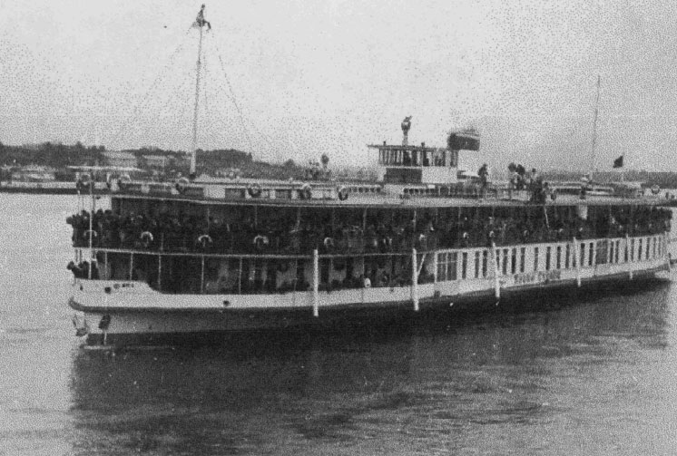

## Teil III. Verbannung

### Kapitel 15. Turuchansker Verbannung

Turuchansk, eine Siedlung am hohen Ufer des Jenisseis, an seinem Zusammenfluss mit der Unteren Tunguska gelegen. Entstanden aus einem Überwinterungsquartier, das 1607 gegründet wurde. Endgültig entstand es im ersten Viertel des 18. Jahrhunderts. Damals gab es dort 120-130 Höfe. Dorthin kam, zu den Märkten im Juni, zum Kaufen und Verkaufen, beinahe die gesamte erwachsene Bevölkerung des Turuchansk-Taimyrsker Bezirks. Haupthandelsware war Pelzwerk. Jäger brachten es von der Unteren Tunguska, aus dem Mündungsgebiet des Jenisseis und von zahlreichen nördlichen Flüssen hierher. Zobel, Eichhörnchen, Blaufüchse, Hundewelpen, Bären, Vielfraße, Schwarz-, Grau- und Rotfüchse, weiße Wölfe. Von den Turuchansker Märkten kamen die Mangasejer Pelze zu den August-Märkten nach Jenisseisk. Hier wurden sie von Kaufleuten gekauft oder eingetauscht, die aus Tobolsk oder von der chinesischen Grenze gekommen waren.

Im 19. Jahrhundert verwandelte sich das Jenisseisker Gouvernement in einen Ort der Verbannungen. Innerhalb der ersten 50 Jahre wurden etwa 40000 Verbannte hierhergeschickt, unter anderem einige tausend polnische Aufständische. Mit den Jahren nahm der Strom der Verbannten immer mehr zu. Allerdings wurden sie hauptsächlich in die zentralen und südlichen Bezirke des Gouvernements geschickt. Lediglich ein unbedeutender Teil ließ sich am Unterlauf des Jenisseis nieder.

Insgesamt zählte man Ende des 19. Jahrhunderts in Russland 300000 Verbannte gleichzeitig. Unter ihnen befanden sich viele von denen, die «aus zwei Provinzen» vertrieben worden waren. Beispielsweise aus dem Tabowsker Gouvernement in den Orenburger und umgekehrt. Entsprechend der Lage, die zu Zarenzeiten bestand, wurden politische Verbannte nicht nur nicht zur Arbeit getrieben, sondern erhielten sogar Geld, das ihnen eine gewisse Existenz sicherte. Finanzielle Unterstützung erhielten auch all diejenigen, die auf administrativem Wege verbannt worden waren.

Die Situation änderte sich jäh Ende der zwanziger, Anfang der dreißiger Jahre des 20. Jahrhunderts, als ein Strom Enteigneter nach Sibirien floss. Zu Hunderttausenden trieb man sie, Männer und Frauen, Kinder und alte Menschen, über endlose Steppen-Wege, Waldpfade, über Knüppeldämme durch Sumpfgebiete, in die rauesten und unwirtlichsten Ecken Russlands geradewegs in die Taiga, in glühende Sandlandschaften, unersättliche Sümpfe, an die tödlichen, leblosen Ufer der nördlichen Flüsse.

1942 wiederholte sich die Geschichte. Allerdings wurden die Verbannten jetzt nicht durch ihre soziale Herkunft oder politischen Ansichten definiert, sondern aufgrund ihrer nationalen Zugehörigkeit. Auf den gleichen Wegen, Pfaden, Flüssen transportierte man Deutsche nach Sibirien und Kasachstan. Keine Kriegsgefangenen, keine Faschisten, sondern die eigenen, vaterländischen Deutschen. Man brachte sie ohne Gerichtsentscheidung, ohne Ermittlungsverfahren dorthin. Man vertrieb Frauen., Kinder, alte Menschen. Im Gegensatz zum damaligen «Kulaken»-Strom, gab es in diesem keine Männer. Sie waren bereits zuvor, im Januar-Februar, von ihren Familien isoliert und in die Trudarmee geschickt worden. Viele kamen an den Unterlauf des Jenisseis, ins Taimyr-Gebiet. Ebenso wie die «Kulaken-Familie», transportierte man sie in den Frachträumen und an Deck von Leichtern und Barken, unter Wachbegleitung, in schrecklicher Enge. Genau wie damals wurden die Menschen an den leeren Ufern des Jenisseis abgesetzt, auf Inseln, sogar auf überfluteten Inseln.

Weitere sieben Jahre vergingen, und dann, im Jahre 1949, musste auch Nina denselben Weg gehen. Zuerst die übelriechende, erstickende Hitze im Güterwaggon, denn in der Luft hing noch der Geruch von zuvor transportiertem Vieh, dann der Gewaltmarsch bis zum Krasnojarsker Durchgangslager. Sie konnte nicht mithalten. Sie wurde angebrüllt, mit Gewehrkolben vorwärtsgestoßen, damit sie schneller ging, sie verlor das Bewusstsein. Sie wurde von einer Kriminellen gerettet, die sich auf den Wachmann stürzte. In der Nacht, als sie in der Zelle, unweit des Aborteimers, lag, fühlte sie mit einem schrecklichen Angstgefühl die Bewegungen des entstehenden neuen Lebens.

Schließlich, Mitte August, der Transport nach Turuchansk. Lastkahn. Frachtraum. Enge, aber wenigstens nicht so stickig. Besonders, wenn man an Deck geht. Aber sie wurden nur hinausgelassen, um zur Toilette zu gehen, und es war schwierig, auf der rutschigen Leiter zu gehen, die zudem über keinen Handlauf verfügte. Die Toilette befand sich achtern. In der Nähe der Wachposten. Und hinter dem Heck die erhabenen, bewaldeten Felsen, die den Jenissei wie in einem Schraubstock zusammendrückten. Was für eine Schönheit – stundenlang könnte man schauen, doch der Wachmann treibt zur Eile an. Und schon muss man sich wieder hinab in den Frachtraum begeben.

In Turuchansk trafen sie irgendwann nach dem 20. August ein. Dort wurden die Ankömmlinge von den Vorsitzenden der Fischerei-Kolchosen «geprüft», wie man es seinerzeit mit den Sklaven gemacht hatte, nur dass man nicht ihre Zähne untersuchte und ihre Muskeln befühlte. Nina wollte niemand nehmen. Wem sollte sie in ihrem Zustand auch nützen. Umso mehr, als die Schwangerschaft nicht nur ihre Figur ruiniert hatte. Die Augen sahen stumpf aus, die Haut ihres Gesichts hatte all seine Zartheit verloren und war voller Pigmentflecken, die Lippen rissig, ihr ungewaschenes Haar hing in Strähnen herunter. Ihr ganzes Ich war nach innen gerichtet, auf das neue Leben, das sich immer deutlicher bemerkbar machte.

Aber «Tschekisten» üben keine Nachsicht. Sie tippten den Vorsitzenden der Seliwanichowsker Fischerei-Kolchose an und zwangen ihn, Nina zu nehmen. Man brachte sie nach Seliwanicha – eine Siedlung (Stelle) zwei Kilometer den Jenissei flussabwärts. Erdhütten, einige windschiefe Hütten, ein Kontor. Sie wurde in einer Gemüsegärtner-Brigade geschickt, um Karotten zu ernten. In der Familie eines ortsansässigen Fischers kam sie unter. Seine Ehefrau, eine Deutsche aus den Reihen derer, die 1942 an den Ufern des Jenisseis ausgesetzt worden waren. In der Familie drei kleine Kinder. Mit großen rachitischen Bäuchen und den für Ortsbewohner charakteristischen Gesichtszügen. Von ihrer Mutter hatten sie nur die dunkelbraunen Augen geerbt. Sie verschwanden den ganzen Tag irgendwo am Jenissei, begrüßten die Boote mit den gefangenen Fischen und aßen die in ihren Händen zappelnden Fische.

Im Flur teilte man ihr einen Platz zu, eine Art Eingangsbereich, der die Erd-Hütte, in der die Familie hauste, von der Außenwelt abteilte, die voller Schmeißfliegen war. In der Nacht schützten sich die Wirtsleute und ihre Kinder mit Vorhängen, unter denen sie schliefen, und im Flur räucherten sie die Fliegen aus. Nina geriet von dem Qualm in Atemnot, aber ohne ihn hätten die Mücken sie aufgefressen. Am Morgen jagte der Vorsitzende, der Nina aus irgendeinem Grund nicht leiden konnte, zur Arbeit, und sie kroch durch die Beete und ernte Möhren. Obwohl sie noch Geld besaß, war es nicht möglich, irgendetwas käuflich zu erwerben. Die Hausherrin, die Mitleid mit ihr hatte, gab ihr, ohne es ihren Mann wissen zu lassen, täglich ein halbes Glas Milch.

Am Ende der Woche, völlig verzweifelt und am Boden zerstört, beschloss Nina ihrem Leben ein Ende zu setzen. Ohne das Ende des Arbeitstages abzuwarten, begab sie sich zum Ufer des Jenisseis. Sie setzte sich auf ein umgedrehtes Boot. Direkt an ihren Füßen plätscherte das bleischwere Wasser des Jenisseis. Hinter ihrem Rücken trockneten auf Stangen gespannte Fischernetze. Über ihr schimmerte auf mysteriöse Weise der tiefhängende, düstere Himmel. Und keine Menschenseele, nur die Möwen flogen mit ihrem Geschrei dahin, und irgendwo in der Ferne kämpften Hunde.

Sie wusste, dass die Ufer hier steil zum Wasser hinab führten. Ein einziger Schritt und das war’s, und die vollständige Befreiung von all den Schrecken wäre erreicht. Sie war seit langem zu diesem Schritt bereit. Nur der Gedanke an das Kind störte dabei.

Besaß sie das Recht ihm das Leben zu nehmen?

Sie dachte nach, und dann besann sie sich: «es hat sich schon lange nicht mehr geregt! Sonst hatte er doch immer so oft und kräftig «getobt», besonders wenn sie nervös gewesen war! Erschrocken begann sie zu lauschen! Eine Minute, noch eine. Keinerlei Lebenszeichen. Sie bewegte sich, wartete auf die gewohnte Reaktion. Doch da war keine. Abergläubische Angst befiel sie. Wie konnte sie derartige Gedanken zulassen. Und nun bestrafte Gott sie, indem er ihr das Kind nahm! Sie selbst hatte dieses Unheil auf sich, nein, nein, auf das Kind gelenkt! Sie sprang auf und rannte wie eine Verrückte zurück in die Siedlung, zu den Menschen. Und in diesem Augenblick rührte «es» sich!

Eine ungeheure Schwäche ergriff Besitz von ihr, die Beine gaben nach, und sie sank taumelnd, keinen Halt findend, am sandigen Ufer zusammen. Hier wurde sie von der Hauswirtin, die über ihr langes Fortbleiben beunruhigt gewesen war, gefunden. Sie brachte sie nach Hause, gab ihr heißen Tee zu trinken und deckte sie mit ihrer Decke zu. Im Morgengrauen setzten die Wehen ein. Die Hauswirtin brachte sie ans Ufer, setzte sie ins Boot und lieferte sie, an einer Schnur festgebunden, innerhalb einer Stunde in Turuchansk ab.

Das Entbindungsheim, ein sauberes Krankenzimmer, eine fürsorgliche Schwester. Wie in einer anderen Welt. In der Nacht setzten starke Wehen ein, die von Spritzen angeregt worden waren. Unter Qualen gebar sie einen Sohn. Sie nannte ihn Valerik. Zu Ehren Valerij Ukalows, in den sie sich verliebt hatte als sie noch ein Mädchen gewesen war. Ein Telegramm an mich, ein Telegramm von mir und eine Überweisung von 600 Rubel.

Valerik hatte häufig Fieber, und er verbrachte viele Monate im Krankenhaus. Sie war sehr einsam. Die Nachbarinnen besuchten ihre Verwandten und Bekannten. Zu ihr kam, freilich, niemand. Nur einmal betrat in einem über seine Matrosenjacke geworfenen Bademantel der Vorsitzende der Seliwanichowsker Kolchose das Krankenzimmer. Er wollte sie abholen, doch der Arzt erlaubte es nicht. Besorgt hörte sie stundenlang auf das Weinen der Säuglinge im benachbarten Raum und versuchte Valeriks Stimme zu erkennen. Meine Briefe trafen Ende der zweiten Woche ein. Alle nacheinander, mitunter zwei Briefe am Tag. Ich schrieb sie morgens und abends; dicke Briefe, wenn sie nur bei der Post angenommen wurden. Briefe mit Fortsetzungen. Ein ebensolcher Strom war auch von Nina an mich gerichtet.

Doch alles geht einmal zu Ende, auch der vorübergehende Aufenthalt im Krankenhaus. Und da steht sie am Eingang des Krankenhauses und drückt den in eine dünne Decke gewickelten Sohn an ihre Brust. Düsterer Himmel, niedrige Wolkenfetzen, ein kalter und scharfer Wind vom Jenissei. Wohin gehen? Wo Unterschlupf finden? Eine der Krankenschwestern half ihr. Sie brachte sie zu einer Bekannten, die in der Krestjanskaja-Straße 24 wohnte. Die Hauswirtin – eine Ortsansässige in fortgeschrittenem Alter. Ein Zimmer, groß, kalt. Ein Ofen mit Herdplatte. Daneben das Bett der Hausherrin. Ninas Lagerstatt wurde an der kalten Wand, unweit des Fensters, aufgestellt. Daneben auf Stühlen, eine kleine Wanne, Valeriks Bettchen. Wenn die Tür geöffnet wurde, strömten die kalte Luft direkt dorthin.

Für die Wohnmöglichkeit musste sie 100 Rubel im Monat bezahlen. Aber woher sollte sie die nehmen? Das Geld, das ich Nina bei ihrer Abreise aus Solikamsk gegeben hatte, und auch das, welches ich ihr zu Valeriks Geburt geschickt hatte, war schnell ausgegeben. O viele Dinge mussten für den Neugeborenen gekauft werden. Aber wie sollte es weitergehen? Arbeit gab es nicht, und es gab niemanden, bei dem sie Valerik lassen konnte.

In meinem letzten Brief versprach ich, ihr jeden Monat 450-600 Rubel zu schicken. Sie begriff, wie schwierig das für mich war. Mein «Lohn» betrug 200 Rubel. Außerdem hatten sie mir, im Zusammenhang mit häufigen Dienstreisen, auch in der Zeit als Nina sich noch in Kuschmangort aufhielt, Geldzuteilungen zu erhalten. Das machte weitere 400 Rubel aus. Aber wovon sollte ich leben, wovon mich ernähren? Und wie sollte ich dieses Geld übermitteln? Das war kein Brief, den ich irgendeinem Mitreisenden zur Weiterleitung aushändigen konnte. In den umliegenden Dörfern von Kuschmangort, unter anderem auch in Koltschuga, musste man zum Versenden von Überweisungen einen Ausweis vorlegen. Demzufolge war es notwendig, einen zivilen Mitreisenden nach Tscherdyn oder Solikamsk ausfindig zu machen. Oder Fajerstejn um Erlaubnis bitten, eine Überweisung tätigen zu dürfen. Allerdings nicht so oft.

Nina wusste das alles und, weil sie begriff, was für eine unzuverlässige Existenzquelle dies darstellte, machte sie sich auf die Suche nach Arbeit. Jeden Morgen ging sie, mit Valerik auf dem Arm, in Turuchansk von einem der wenigen Betriebe zum nächsten, von einer Amtsstelle oder Lehreinrichtung zur anderen, aber ohne Erfolg. Sobald man erfahren hatte, dass sie eine Verbannte war, erteilte man ihr, verlegen wegschauend, entweder sofort eine Absage oder riet ihr, in einer Woche oder einem Monat wiederzukommen oder sich an eine benachbarte Einrichtung zu wenden.

Anfangs verhielt man sich ihr gegenüber als wäre sie eine Lager-Schlampe (vielleicht kam es ihr auch nur so vor), später, als bekannt wurde, dass sie regelmäßig Überweisungen erhielt, änderte sich die Einstellung ihr gegenüber zumindest bei der Post. Es roch nach Romantik. Durch die Siedlung verbreitete sich das Gerücht, dass diese kraftlose Frau mit den traurigen Augen und dem Kind auf dem Arm jeden Tag Briefe erhält, mitunter mehrere, und alle von ein und demselben Mann. Das war so merkwürdig und ungewöhnlich. Denn viele von ihnen wären schon froh gewesen, wenigstens einen Brief im Monat zu bekommen. Wenn jetzt Passanten ihr mit dem Kind auf dem Arm begegneten und an ihr vorübergingen, schauten sie sich um und tuschelten miteinander.

Zum neuen Jahr hin wurden die Beziehungen zur Hauswirtin schwieriger. Letztere ärgerte sich über alles: Valeriks Weinen, sein tägliches Baden, Ninas Reinlichkeit. Besonders unerträglich wurde sie, als sie erfuhr, dass ich Deutscher war. Mehrmals bezeichnete sie Valerik in Ninas Anwesenheit als deutschen Abschaum. Verurteilt sie dafür nicht. In jenen Nachkriegsjahren bluteten die Wunden noch. Doch Nina musste sich schleunigst eine andere Behausung suchen. Eine gutartige Frau gewährte ihr Unterschlupf. An ihren Namen kann ich mich nicht mehr erinnern. Der Nachname lautete Inosemzewa. Sie lebte ohne Ehemann, aber mit sieben Kindern. Das älteste war zwölf, das jüngste fünf Jahre alt. Sie lebten in sehr ärmlichen Verhältnissen, aber in Würde. In einem einzigen Zimmer. Der Boden war mit einer Plane bedeckt. Entlang den Wänden die Betten. Immer ein Bett für zwei. Die Betten wurden auseinandergeschoben, um Nina und Valerik ein Platz am Ofen freizumachen. Sauberkeit, Ordnung, Herzlichkeit.

Nun verstärkte Nina ihre Suche nach Arbeit. Sie war besorgt über ihre ungewisse Situation, wenn das eigene Leben, und folglich auch das Leben ihres kleinen Sohnes, vollständig davon abhingen, ob ich, der ich mich im Lager befand, in der Lage war Geld zu schicken. Bisher hatten sie es regelmäßig erhalten, dreimal im Monat 150-200 Rubel. Aber was würde sein, wenn mir etwas passierte. Wenn plötzlich die Leitung wechselt und man mich zu allgemeinen Arbeiten schickt oder mir die Möglichkeit nimmt, Geldbezüge zu erhalten oder mir letztendlich verbietet, Geld zu überweisen. Was sollte sie dann tun? Schließlich hatten weder sie noch Valerik staatlichen Anspruch auf auch nur einen Pfennig. Und kein einziger Mensch, bei dem sie sich im Notfall Geld hätten leihen können. Allerdings gab es Bekannte, vorwiegend Nachbarinnen, die Mitleid mit ihr hatten, mit Interesse ihren Berichten über mich, über ihre Hoffnungen und Pläne für die Zukunft zuhörten. Ihre Erzählungen kamen ihnen unwahrscheinlich und ihre Hoffnungen unerfüllbar vor. Nina ereiferte sich, versuchte zu beweisen, dass ich ein guter Mensch sei, der bestimmt kommen würde, aber sie zweifelten daran und schürzten ihre Lippen. Doch sie alle waren ebenso arm, wie ihre Hauswirtin, und es war unmöglich, von ihnen Geld zu leihen.

Aber es gab immer noch keine Arbeit. Eigentlich gab es sie schon. Es gab sogar Werbung, in der Buchhalter, Schreibkräfte gesucht wurden. Nina lief dorthin, aber man versicherte ihr, dass gerade gestern erst ein Mitarbeiter eingestellt worden sei, und dass es nun keine freie Stelle mehr gäbe. Schließlich beschloss sie, sich, schon völlig verzweifelt, zum Bezirkskomitee zu begeben. Sie vereinbarte einen Ternin mit der ersten Sekretärin, ohne zu sagen, dass sie eine Verbannte war. Ihre Vorstellung von dieser Institution wurde weder durch die Widrigkeiten des Schicksals noch durch die Erfahrung der Kommunikation mit Menschen oder die Gespräche mit mir erschüttert.

Nina wurde angenommen. Hinter einem Tisch mit drei Telefonen (für Turuchansk war das ein wichtiges Zeichen der Macht), saß einer energischer, noch recht junger Mann in Lederjacke. Als sich herausstellte, dass sie Verbannte war, empörte er sich.

- Wie konnten Sie es wagen hierher zu kommen, - schrie er, wo bei er mit den Füßen aufstampfte und hinzufügte:

- Die Tatsache, dass Sie Sekretärin des Bezirkskomitees der Komsomolzen-Organisation und Mitglied der Partei waren, macht Ihre Schuld nur schlimmer. Die naive Ninotschka, Valerik an sich drückend, versuchte ein Wort einfließen zu lassen:

- Aber ich erkläre ihnen doch, dass es sich um einen tragischen Irrtum handelt, dass man mich verleumdet hat. Und an wen soll ich mich jetzt wenden? Main Söhnchen und ich könnten sterben.

- Ich habe nicht die Absicht ihren Erklärungen zuzuhören, und ich habe auch nicht das Recht dazu. Wenn man Ihnen eine Haftstrafe aufgebrummt hat, dann heißt das auch, dass Sie schuldig sind. Und vergessen Sie den Weg, den Sie hierher gemacht haben. Und schleppen Sie Ihr Kind nicht mit sich herum. Was eine Arbeit betrifft, gehen Sie zu den Organen oder zum Bezirksexekutiv-Komitee.

Er stützte seine muskulösen Hände auf die Tischplatte und drückte auf die Klingel. Eine hübsche, geschminkte Sekretärin trat ein und sah ihren Chef fragend an.

- Schauen Sie sich diese Frau aufmerksam an und merken Sie sich, dass diese Füße niemals das Bezirkskomitee der Partei betreten.

Das war‘s! Gebrochen, niedergeschlagen, vor Schwäche und Erniedrigung taumelnd, verließ sie die Behörde, die sich immer für das Symbol menschlicher Gerechtigkeit gehalten hatte.

Ein paar Tage später, nachdem sie wieder ein wenig zu sich gekommen war, beschloss sie, einen weiteren Versuch zu unternehmen und sich im Bezirksexekutiv-Komitee an die Vertreter der Sowjetmacht zu wenden. Ein betagter Mann mit gepflegt aussehendem Gesicht, zarten, etwas zittrigen Fingern und einer hellen Krawatte, an die sich auch später noch erinnerte, nahm sie dort in Empfang. Auf der geraden, schlanken Nase trug er einen goldenen oder vergoldeten Zwicker.

Ohne von ihm irgendetwas Gutes zu erwarten, begann sie zu sprechen. Und wunderte sich. Man hörte ihr zu, und, wie es schien, sogar voller Mitleid. Valerik saß still auf ihren Armen und betrachtete den Onkel. Froh darüber, dass man ihr zuhörte, hielt sie sich mit dem von ihr beabsichtigten, lakonischen Bericht zurück, ging ins Detail und verstummte plötzlich erschrocken.

Der Vorsitzende des Bezirksexekutiv-Komitees, denn das war, fragt:

- Ich habe alles verstanden! Womit kann ich ihnen helfen?

- Helfen Sie mir irgendeine Arbeit zu finden. Mein Ehemann unterstützt uns ein wenig, aber auch er befindet sich in einer äußerst schwierigen Lage. Ich war schon in der Schule, dort brauchen sie eine Sekretärin, ich war bei der Bezirkskonsum-Genossenschaft – dort wird ein Buchhalter gesucht, ich war in der Kantine – dort benötigen sie einen Rechnungsführer, aber alle erteilen mir eine Absage, weil ich Verbannte bin. Aber wovon soll ich leben? Ich selbst bin bereit zu sterben, aber ich habe doch meinen kleinen Sohn.

- Gut, ich habe von ihnen bereits gehört. Gehen Sie nach Hause, und morgen besuchen sie noch einmal die Institutionen und bringen in Erfahrung, wo wer gebraucht wird. Ich versuche Ihnen zu helfen. Aber gehen Sie nicht in die Schule, das ist gefährlich, da herrscht die Ideologie.

Von Hoffnung und der menschlichen Haltung ihr gegenüber beflügelt, ging Nina nach Hause. Einige Tage später stellte man sie als Buchhalterin der Kantine der Bezirkskonsum-Genossenschaft ein. Ihr Gehalt war nicht hoch - 350 Rubel im Monat. Janina Jossifowna Sakutilina, die Oberbuchhalterin, berichtete: “Ich habe diese abgemagerte Frau mit den grauen, traurigen Augen und dem Kind auf dem Arm schon lange bemerkt. Aber da ich wusste, dass sie eine Verbannte ist, konnte ich ihr nicht helfen. Mehrfach habe ich mich mit der Bitte an die übergeordneten Institutionen gewandt, sie einzustellen, aber ich bekam unverändert Absagen. Und erst gestern fiel dann plötzlich so eine Entscheidung.” Janina Jossifowna wies Nina einen Tisch, ein Rechenbrett und eine Addierbuchungsmaschine zu, brachte ihr Listen und bat sie, sie sie zu berechnen und die Ergebnisse zusammenzufassen. Nina versuchte verzweifelt sich an das zu erinnern, was ich ihr beigebracht hatte, aber sie konnte sich beim besten Willen nicht erinnern. Sie sah auf das mit Zahlen übersäte Blatt, das vor ihr lag, geschrieben mit violetter und roter Tinte, und wurde von Verzweiflung erfasst. Das war’s! Sie musste gehen. Aber sie ging nicht. Janina Jossifowna weckte in ihr sehr feinfühlig die erforderlichen Erinnerungen. Allmählich, Tag für Tag, taute sie auf, ihr Herz und ihr Gedächtnis wurden neu geboren. Sie machte sich an die Arbeit.

Valerik blieb Zuhause, bei der ältesten Tochter der Hauswirtin, die such auch vorher schon sehr freundlich ihnen gegenüber verhalten hatte. Und wenn die Umstände das Arbeiten am Abend erforderlich machten, nahm sie Valerik mit ins Büro, und er rollte begeistert die Rechenbretter über den Boden. Valerik war bereits 10 Monate alt. Bis zu meiner Freilassung waren es noch fast fünfhundert Tage.

Für mich war diese Zeit auch nicht leicht. Freilich litt ich keinen Hunger, musste nicht frieren, litt nicht unter kräftezehrender körperlicher Arbeit. Mehr noch, meine Lage war, nach Lagermaßstäben gemessen, mehr als günstig. Fajerstejn wertete mich als Spezialisten, in dem er mich zu Erörterungen über Produktionsfragen heranzog, insbesondere wenn sie die Interessen der Buchhaltung berührten. In den Sommermonaten beschäftigte ich mich mit seinem Sohn mit Mathematik und Physik und bereitete ihn auf seine Einschreibung an der Universität vor. Die besten, sogar freundschaftlichen Beziehungen kamen zwischen mir und Jerschow zustande. Er absolvierte ein Fernstudium am Institut, und wir studierten jetzt abends gemeinsam die Arbeiten der Klassiker des Marxismus-Leninismus.

Die Verbindung zur Zentral-Buchhaltung des UssolLag festigte sich, wohin man mich in letzter Zeit jedes Quartal einmal zur Mitwirkung bei der Erstellung des konsolidierten Rechenschaftsberichts bestellte. Schachanow, Ober-Buchhalter der Verwaltung hatte bereits mehrmals mit mir Gespräche geführt und mir vorgeschlagen, nach meiner Freilassung in Solikamsk zu bleiben. Er versprach gute Bezahlung und eine Wohnung. Sicher war das ein sehr verlockendes Angebot. Der Norden des Gebiets Molotow (heute Perm) gehörte zum Territorium der Ansiedlung von Sondersiedlern und Verbannten, so dass im Prinzip sowohl ich als auch Nina uns in Solikamsk niederlassen konnten. Aber ist Tarasjuk bereit, bei Ninas Verlegung behilflich zu sein, wir die Bitte Schachanows dafür ausreichen? Vieles hing von meiner Arbeit ab. Ich begriff das sehr wohl und arbeitete, ohne die Hände in den Schoß zu legen.

Jetzt, besonders nachdem es gelungen war, den «Archipel Gulag» durchzulesen, schäme ich mich, diesen Lebensstil zuzugeben. Es stellt sich heraus, dass ich nicht nur ein typischer «Schwachkopf», sondern auch ein Karrieremacher bin. Doch was sollte ich tun. Hunderte Male wendete ich verschiedene Varianten hin und her, auf der Suche nach einem Ausweg aus der Lage. Die näher rückende Freilassung erfreute und verängstigte mich zugleich. Ich hatte Angst vor der Verantwortung gegenüber dem Schicksal und möglicherweise auch gegenüber Valeriks und Ninas Leben.

Aber noch schwerwiegender, noch quälender verspürte ich die Trennung. Erst jetzt begriff ich wirklich, dass das Lager nicht nur eine Hungerexistenz bedeutete, nicht nur maßlos schwierige Lebensbedingungen, nicht nur Willkür und Demütigungen. Auch wenn du aus all diesem Grauen herausgekommen bist und im Lager ein vergleichsweise gutes Leben erreicht hast, findest du keine Ruhe. Da ist noch etwas, vielleicht das Wichtigste, das einen bis in den Wahnsinn treiben kann – die fehlende Freiheit, die Unmöglichkeit über sein eigenes Schicksal zu verfügen, mit den nahestehenden und liebsten Menschen zusammen zu sein. Bis heute hatte ich Glück. Durch den Preis beharrlicher Arbeit war es gelungen, die Gewogenheit der Leitung zu erlangen. Obwohl das ganze System sich dagegen auflehnte, dass der Mensch überlebte und wieder auf die Beine kam, doch auch da gab es Misserfolge: es fanden sich Menschen, die halfen, ohne Verrat zu verlangen. Das erlaubte es mir, ein gewisses materielles Wohlergehen zu erlangen. Doch nun erwies sich die Möglichkeit mich protegierender Leute als unerreichbar, und ich empfand mit ganzer Schärfe die unbarmherzige Grausamkeit der Staatsmaschinerie.

Jetzt waren Briefe das Bindeglied zwischen Nina und mir geworden, und die schrieben wir. Viele von ihnen sind bis heute erhalten geblieben. Ein Berg von Briefen. Es gab darin keine tiefgründigen Ideen, philosophischen Überlegungen, künstlerische Qualitäten. Dafür fanden sich darin Einzelheiten, Kleinigkeiten des Alltags, welche die Illusion der Anwesenheit schufen. In Ninas und Valeriks Leben war für mich alles von Interesse, alles wichtig.

Wie freute ich mich über die beigelegten Fäden, mit denen Nina seine Größe maß, die Umrisse seiner Hände, Abdrücke seiner Handflächen, seine Haarlocken und Krakeleien. Als er sich einmal in den Finger geschnitten hatte, beschmierte er den Brief mit seinem Blut und Nina kennzeichnete die Stelle mit einem Kreis. Ich küsste diesen kleinen Fleck lange. Seit der Zeit tauchte in jedem unserer Briefe ein Kreis auf, und wenn ich den Brief erhielt, küsste ich diese Stellen zuallererst. Abends, besonders bei Vollmond, wenn Moskau das Signal für die exakte Uhrzeit gab, schauten wir gleichzeitig auf den Mond, und es kam uns so vor, als ob unsere Seelen sich berührten.

Und dann die Erinnerungen! Ich fand sie überall: in Gegenständen, Ereignissen, Naturerscheinungen, Menschen. Ihre Suche führte mich nach Stabnaja, genauer gesagt zu dem, was von ihm nach der Schließung übriggeblieben war.

Wir schrieben Ende Juni 1950. Ein freier Tag. Ein herrlicher Tag, wolkenlos, Stille, Stille. Wasja Sereda und ich streiften durch den Wald, über die Felder, und das Herz zog sich an jeder bekannten Wegbiegung zusammen. Schomschino, der Brunnen, die lange schattige Allee mit den großen weitverzweigten Bäumen, dann der schmale Pfad. Wasja und ich entkleideten uns bis zur Gürtellinie, um wenigstens ein bisschen braun zu werden. Wir gingen langsam, atmeten genussvoll die frische, nach Fichtennadeln duftende Luft ein. Für Wasja war das alles neu, während mich alles an Nina erinnerte. Sie und ich waren hier nur ein einziges Mal gewesen, und doch erinnerte ich mich an alles ganz genau. Dort der Bach, der den Weg kreuzt, daneben der Baumstamm, auf dem Nina und ich uns manchmal ausgeruht hatten. Ich bog nach rechts ab, ging zwischen den Bäumen hindurch, wo uns einmal ein Eichhörnchen so sehr erschreckt hatte. Wasja sah mich verwundert an, bemerkte die Tränen in meinen Augen. Er wusste von nichts, und natürlich sagte ich ihm auch nichts.

Schließlich Stabnaja. Alles war zerfallen, von Gras überwuchert. Nachdem wir am Wachhaus vorbeigegangen waren, drehten wir nach rechts zum Kontor ab, betraten die ehemalige Planungsabteilung, Fajerstejns Kabinett, dann die Buchhaltung. Wir standen am Fenster, neben dem einst Ninas und mein Tisch gestanden hatten.

Der Boden war jetzt an dieser Stelle eingestürzt, man sah die Bodenbalken, Fragmente von Brettern ragten heraus, und zwischen ihnen die Büschel von Brennnesseln.

Das gegenüberliegende Fenster – hier stand damals Pustowoits Tisch. Nun gab es ihn nicht mehr. Ein paar Kisten waren in sich zusammengefallen. Ein Stück Telefonleitung hängt von oben herab. Genau hier, in dieser Ecke der Buchhaltung hatte ich mit Nina zum ersten Mal scharf gesprochen. Wir waren zu zweit gewesen, längst war der Gong zur Bettruhe ertönt. Ich hatte ihre vollständige Trennung von David gefordert, sie litt und quälte sich. Verstand, Gewissen und Gefühl kämpften in ihrem Inneren. Olja war angelaufen gekommen, hatte versucht, sie von mir wegzuführen. Nina hatte den allerletzten Kuss von mir gefordert. Mein Gott, was war damals in meinem Herzen geschehen, aber trotzdem hatte ich sie zurückgewiesen. Meine Arme, Liebe, wieviel Schmerz und Leid hatte ich ihr damals zugefügt, aber anders hatte ich doch nicht vorgehen können. Wir hätten eine Wahl treffen oder zu weit gehen und den Rahmen unserer einfachen freundschaftlichen Beziehungen überschreiten sollen. Ich hatte mich damals viel zu grausam benommen, aber dieser anstrengende mentale Kampf musste beendet werden. Ich erinnere mich an Oljas Empörung, die mir Leichtfertigkeit und Unmenschlichkeit vorgeworfen hatte. Ich weiß noch, wie sie Nina zugeredet hatte sich nicht demütigen zu lassen und zu David zurückzukehren. Aber unsere Gefühle waren stark gewesen. Nina blieb.

Dort drüben die Krankenbaracke (wir nannten sie Krankenstation), wo ich Nina ganz zu Beginn unserer Bekanntschaft ein Buch durch die Lüftungsklappe gereicht hatte und, nachdem wir zwei-drei bedeutungslose Sätze gewechselt hatten, verlegen fortgegangen War: Dort die Kabine der Sanitätsstelle, in der Musja Olejnik gearbeitet und wo mein letztes Gespräch in Stabnaja mit David Andrejewitsch stattfand, indem er von mir verlangt hatte, dass ich ihm Zutritt zu Nina gewährte.

Da drüben die Frauen-Baracke, an der ich mich, wenn ich Nina abends von der Arbeit begleitete, von ihr verabschiedete, anfangs durch Drücken der Hände, später mit einem zaghaften Kuss auf die Stirn. Wir traten ein. Und auch hier Spuren der Verwesung und der Zerstörung. Die Doppelstockbetten waren krumm und schief, auf allem lag eine dicke Staubschicht, und durch die Ritzen war das Gras hindurchgewachsen. Glasklar erinnerte ich mich an Neujahr, als ich, trotz unseres Streits, zu Nina hereingeschaut hatte, um ihr meine Glückwünsche zu übermitteln. Sie hatte krank darnieder gelegen, David an ihrem Fußende, gegen die oberen Pritschenbretter gelehnt, gestanden. Nachdem ich ihn beiseitegedrängt hatte, war ich zu Nina herangetreten und hatte sie, während ich ihr Glück für das neue Jahr wünschte, auf die Wangen geküsst.

Und dann schließlich betraten wir Jakob Jakowlewitschs und meine Kabine. Die Tür herausgerissen, der Ofen auseinandergefallen, das Fenster ohne Glas. Meine Liegestelle ist immer noch da, mit zerbrochenem Mittelteil. Ich weiß noch genau wie ich darauf lag, und Nina stand außen am Fenster, einen Birkenzweig in den Händen haltend. Die klare Herbstsonne spielte in ihren Haaren und den gelbverfärbten Blättern. Still lächelte sie mich an. Diese Blätter, die vertrocknet waren und bei jeder unachtsamen Berührung zerbröckeln konnten, habe ich noch viele Jahre aufbewahrt – als Zeugen des damals aufkeimenden Gefühls.

Wir verließen Stabnaja bereits am Abend, voller Erinnerungen und Trauer. Wir gingen bis Traktowaja und kehrten dann mit der Eisenbahn ins OLP zurück. Am Tag nach unserer Reise in die Vergangenheit begann die nächste Kalkulationsaktion. An dem Halbjahres-Rechenschaftsbericht arbeiteten wir unter neuen Bedingungen. Die abendliche Tätigkeit der Wachen wurde aus Sicherheitsüberlegungen abgeschafft. Alle, die keinen Ausweis besaßen, wurden um sechs Uhr abends in die Lager-Zone zurückgebracht.

Nur Wasja Sereda und ich blieben. Bis zu zwei-drei Nächten blieben wir auf. Während der Arbeit nagten wir am Hungertuch – es gab niemanden zum Kochen. Als wir in die Zone zurückkehrten, legten wir uns sofort schlafen. Ich wohnte jetzt in der Baracke des verwaltungstechnischen Personals. Die Kabine war für mich nutzlos, es gab nur überflüssige Sorgen und Erinnerungen an die Vergangenheit.

Mitte Juli die nächste Fahrt nach Solikamsk mit den Rechenschaftsberichten. Ich nutzte sie dazu, so viele Briefe wie möglich zu verschicken. Ninas Briefe kamen nach Kuschmangort, und ich konnte sie erst bei meiner Rückkehr bekommen. In den Tagen meiner Abwesenheit sammelten sich eine Menge davon an. Es ging darum vorwiegend um - Valerik. In einem von ihnen ein Foto: Nina und Valerik. Valerik mit zehn Monaten. Nina war sehr mager geworden, ihr Gesichtsausdruck traurig. Valerik pummelig, in einem kleinen Anzug, streichelt ihre Wange und sieht so aus, als ob er sagen will: «Mama, sei nicht so niedergeschlagen, mit mir wirst du nicht untergehen».

Ende August fuhr ich gemeinsam mit Wasja zu den oberen Lagerpunkten, um Jerschow bei der Heumahd zu helfen. Was war das für eine angenehme Zeit! Nach all den endlosen Zahlenreihen, dem Papierkram, den Akten aus den verrauchten, stickigen Räumen der Buchhaltung auf eine Wiese zu gelangen, die mit jungen, zarten Birken bewachsen war, die mit dem Duft von Blumen angereicherte frische Luft zu atmen, die körperliche Müdigkeit zu fühlen und zu sehen, wie mit jedem Sensenschwung das gemähte Heu zu den Füßen herniederfiel.

Am 19. September erhielt ich von Nina einen Brief mit einer weiteren Fotografie von Valerik. Er war nun ein Jahr alt. Auf dem Foto steht er in einem Samtjäckchen auf einer kleinen Truhe, die sich auf einem Stuhl befindet. Es sieht so aus, als ob der ganze Aufbau wackelt. Jedenfalls sieht Valerik angespannt aus und weint ein wenig. Vielleicht, weil er sich nirgends festhalten kann. Daneben auf einer Etagere eine Torte mit einer Kerze in der Mitte – eine Erinnerung an meine eigene Kindheit. Valerik sieht keineswegs schlecht aus: groß, wohlgenährt, pausbäckig und mit einem Band um die Stirn.

Anfang Oktober wieder der Quartals-Rechenschaftsbericht und die Fahrt nach Solikamsk. Jemand hatte eine Beschwerde geschrieben, dass ich im städtischen Gasthaus wohnte. Zur Vermeidung von Unannehmlichkeiten wohnte ich dann in einem der Lagerpunkte des KOLP – «Garasch». Die Bedingungen erwiesen sich dort für mich nicht schlechter als im Gasthaus und es war dort zudem auch noch billiger. Erneut Unterredungen mit Schachanow. Aber nichts Bestimmtes. Nur Überzeugungsarbeit, aber keine Garantien. Anfang November kehrte ich mit Umnows eigenem Boot zurück. Er folgte uns nach Kuschmangort. Der mit Stahlblech ummantelte Rumpf bebte von den häufigen Schlägen des Senkholzes und, weiß der Herrgott, woher die Eisschollen kamen. Es wurde früh kalt. Vom Oberlauf der Kama und der Wischera treibt ein dichtes Eisschlamm-Feld heran, es reibt am Rumpf und bröckelt auseinander. Auf dem Boot ist es warm, gemütlich. Die Mannschaftskajüte und Umnows Büro sind mit Mahagoni-Holz abgeteilt. Eine heiße Dusche, gutes Essen.

Zuhause in Kuschmangort erwartete mich ein Haufen Briefe von Nina. Nach ihnen zu urteilen, hatte sich ihr Leben ganz gut zusammengefügt. An die Arbeit hatte sie sich gewöhnt, das Gehalt war nicht hoch, kam aber regelmäßig. Plus meine Überweisungen. Allerdings hatte sie auch hohe Ausgaben: die Miete für die Wohnung, das Kindermädchen, ein wenig für Valeriks Kleidung, denn er war gewachsen, und das recht schnell. Für Lebensmittel blieb nur wenig übrig. Und die waren doppelt so teuer wie bei ins im Ural: ein Dutzend Eier – 25 Rubel, bei uns - 10; Milch - 4 Rubel pro Liter, bei uns – 2. Zudem war die Belieferung des Nordens im Winter 1950 sehr schlecht. Die Geschäfte waren so gut wie leer. Nina bereitete einmal am Tag eine warme Mahlzeit zu. Die übrige Zeit trank sie - Tee. Schon längst hätte sie Valerik abstillen sollen, aber sie konnte sich nicht dazu entschließen. Sie hatte stark abgenommen. Der Polarwinter nahte und Nina war praktisch nackt. Sie brauchte einen Wintermantel und vor allem Stiefel. Aber für derartige Einkäufe reichte das Geld nicht.

Im Brief vom 23. November schrieb sie: «Mir ist traurig ums Herz, das letzte Schiff ist abgefahren, die Zeit der Schiffbarkeit auf den Flüssen ist zu Ende, der Winter ist hereingebrochen, bald wird es starken Frost geben. Valerik ist nun schon fast ein Jahr und drei Monate alt, er läuft gut, spricht aber schlecht. Er singt sehr gern Lieder mit dem Onkel aus dem Radio – er tanzt, wodurch er sein linkes Bein ausgerenkt hat und beinahe einen Monat im Gips gelegen hat. Jetzt ist es bereits fünf Tage her, seit sie ihm den Gips abgenommen haben, er geht wieder. Mein süßer kleiner Tänzer.

Wenn ich nach Hause komme, begrüßt er mich mit den Worten «Ti-ti». Aber es ist, in der Tat, Zeit, ihn von der Brust zu entwöhnen, du hast recht, dass du schimpfst. Mir tut das alles leid. Ein sehr gescheites Jungchen; alles, wonach ich frage, findet er und bringt es mir. Ruhig und gelassen begibt er sich in die dunkelste Ecke, Hunde und Katzen liebt er über alles. Er ist ein guter Junge – er gibt allen etwas zu essen, teilt mit allen.

Er mag gern Schlitten fahren – man kann ihn den ganzen Tag herumfahren, und er hat nie genug davon. Er mag mit Kindern spielen, aber am liebsten geht er zu den Großmüttern. Zu den Onkeln – auf gar keinen Fall. Offensichtlich deswegen, weil der Onkel Doktor ihm in den Finger gepiekst hat – er hat Blut für eine Untersuchung abgenommen und ihn dann auch noch mit dem kranken Beinchen zum Röntgen gebracht, und da waren drei Onkel, und außerdem war es dort dunkel. Mit denen, die er kennt, spielt und lacht er, aber wenn ein Unbekannter ankommt – kannst du ihn nicht dazu bewegen zu lächeln. Da bleibt er sehr ernst».

Je näher die Zeit meiner Freilassung rückte, desto mehr quälte Nina sich mit Zweifeln. Ob ich überhaupt kommen würde, und wenn ich komme, ob ich dann Arbeit bekäme oder keinerlei Möglichkeiten hätte mich zu verwirklichen. Sie wollte, dass ich Valerik genauso liebhatte, wie sie selbst, und fürchtete doch gleichzeitig, dass ich nicht vorrangig wegen der Liebe zu ihr, sondern wegen eines Schuldgefühls gegenüber Valerik kommen würde. Ich versuchte sie vom Gegenteil zu überzeugen. Wenn ich jetzt meine und Ninas Briefe durchblättere, bin ich verwundert über die Kleinigkeiten, die sie quälten. Sie zitterte vor allem aufgrund ihrer Liebe zu ihm, aber auch, weil sie glaubte, er sei das Wichtigste, was uns miteinander verband.

Das neue Jahr 1951 begrüßten Wasja Sereda, Wasja Schindin, Arkadij Fedossejewitsch und ich in einer Baracke des Lagerpunktes Golownaja. In den Bereich außerhalb der Zone ließen sie niemanden. Das Regime war, wie immer in jenen Tagen, verschärft.

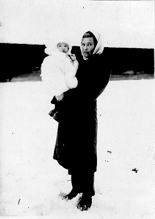

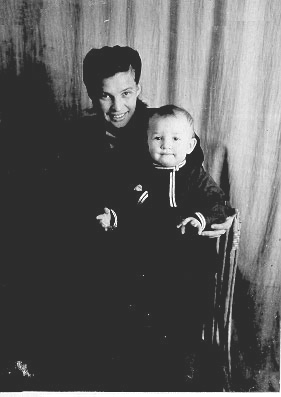

Turuchansk, Winter 1950 Nina und Valerik in der Verbannung Turuchansk, September 1950

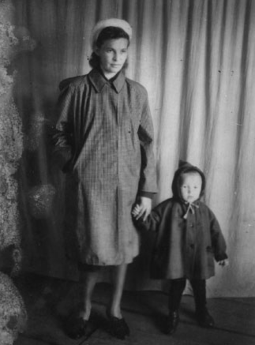

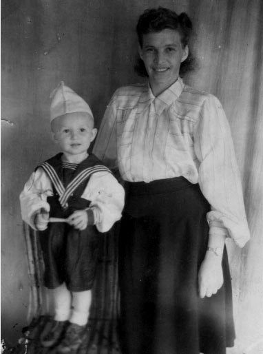

Turuchansk, September 1951 Valeik, 2 Jahre alt Turuchansk, 1952 Bis zum Wiedersehen waren es nur noch zwei Monate Trotzdem hatte Wasja Schidrin es fertiggebracht, eine Flasche Wein zu beschaffen. Wir feierten das neue Jahr dreimal: um 20 Uhr Moskauer Zeit gemeinsam mit den Turuchanskern, um 22 Uhr – mit den Ural-Bewohnern und um 24 Uhr mit den Moskauern.

Die Stimmung ist schlecht. Alle Gedanken sind bei Nina und Valerik, dabei, wie schlecht es ihnen gehen muss in dieser einsamen Neujahrsnacht. Ich versuche mir Turuchansk vorzustellen. Am hohen, steilen Ufer des Jenisseis niedrige, schneebedeckte Häuschen mit kleinen, mit Eisblumen besetzten, Fenstern. Der Wind heult. Wolken von feinem Schnee klopfen knisternd an die Scheiben. Nina kann sicher nicht schlafen. Sie beugt sich über Valeriks Bettchen und küsst ihn. Er zuckt zusammen, reibt sich mit den Fäusten die Augen. Nina löscht das Licht aus Angst, dass er aufwachen könnte, und tritt ans Fenster. Unendliche Finsternis umfängt sie. Und die Gedanken sind weit jenseits der weißen Weiten der Tundra, jenseits der in der winterlichen Kälte erstarrten Wälder, den weißen Schneemützen der Berge.

Aber vielleicht ist Valerik krank und sie haben nichts zu essen! Ein Gedanke ist sorgenvoller als der andere; sie quälen mich. Die Vorstellungskraft malt die dunkelsten Bilder, und es scheint – je düsterer sie sind, umso besser geht es ihnen dort.

In Wirklichkeit war alles nicht so, wie ich es mir ausmalte, zumindest nicht so romantisch. Das neue Jahr begrüßten Nina und Valerik bei den Sakutilins. Es ging recht fröhlich zu. Man scherzte, lachte und tanzte sogar. Wie Nina mir später in einem Brief schrieb, verließen sie allerdings die Gedanken an mich keine einzige Minute. Valerik spielte den ganzen Abend mit Rita – Janina Josifownas ältester Tochter. Um Mitternacht küsste Nina ihn und fing an zu weinen, und alle versuchten lange Zeit sie zu beruhigen.

Am Morgen ging sie mit Valerik zum Tannenbaum, der für die Mitarbeiter in der Kantine aufgestellt worden war. Eine schöne Tanne, reich geschmückt. Die Kleinen alle drumherum. Nina und Valerik verspäteten sich, die Kinder tanzten bereits zur Bajan-Musik, stampften mit den Füßen, jedes so wie es konnte. Fröhliche, zufriedene Gesichter. Valerik trug einen weißen Mantel aus Hasenpelz und eine ebensolche Mütze. Als sie hereintraten, riefen die Kinder: «Väterchen Frost, Väterchen Frost» und platzierten ihnи, ohne dass er die Gelegenheit hatte sich auszuziehen, unter der Tanne. Valerik, der all dies zum ersten Mal sah und nicht begriff, was vor sich ging, erstarrte mit weit aufgerissenen Augen. Und die Kinder fassten sich bei den Händen und sangen ein Lied vom Tannenbaum. An jenem Abend betete Nina zu Gott, dass dieses Neujahrsfest das letzte sein möge, welches wir getrennt voneinander verbrachten. Aber es gab wenig Hoffnung dazu, und ihre Briefe waren voller Sorge über die Zukunft.

Und ich hatte immer noch keine Gewissheit. Werden sie unsere Ehe in Abwesenheit registrieren? Wenn sie es tun, werden sie Nina dann nach Solikamsk kommen lassen? Und wenn nicht, was sollte dann werden? Vielleicht wäre es sicherer, sofort nach Turuchansk zu fahren? Aber was sollte ich dort tun, würde ich Arbeit finden? Dieses Problem ließ mir keine Ruhe. In meinen Briefen beruhigte ich Nina, in dem ich sie davon überzeugte, dass wir auch in Turuchansk unser Leben einrichten könnten, dass ich ein Gewächshaus einrichten würde, damit wir das für Valerik so wichtige Gemüse zur Verfügung hätten. Glaubte ich selbst an das, was ich da schrieb? Scheinbar tat ich es. Schließlich war ich ein aktiver Mensch, der bisher, zumindest in kleinen Dingen, Glückgehabt hatte.

Am 25. Februar traf aus der Verwaltung ein Fernspruch ein, in dem verlangt wurde, über mich einen Fragebogen auszufüllen. Derartige Anfragen trafen für alle inhaftierten Deutschen ein, um die Siedlungsort für ihre Zeit nach der «Freilassung» festzulegen. Am schwierigsten war für mich die Frage zum Familienstand: sollte ich von Nina und Valerik schreiben oder nicht? Schließlich gab es keinerlei Dokumente darüber, dass wir eine Familie waren. Und außerdem – wenn ich sie hineinschreibe, würde es mir dann gelingen, in Solikamsk zu bleiben? In der Nacht wurde ich von zweifeln gequält und beschloss am Morgen es zu versuchen: wenn sie es erlauben, schreibe ich es. Sie erlaubten es. Was danach kommen würde, war unklar.

Und das Regime im Lager wurde immer härter. Die Trennung von Männern und Frauen wurde beendet. Alle Politischen, mit Ausnahme derer, die nach § 58-10 verurteilt worden waren, wurden in Sonderlager geschickt. Immer häufiger trafen Gefangenen-Etappen mit Haftstrafen bis zu 25 Jahren ein. Besonders viele Personen kaukasischer Nationalität: Aserbeidschaner, Inguschen, Tschetschenen. Letztere fielen auf. Sie waren hart, entschlossen, engstirnig und gnadenlos. In ihrer Anwesenheit wurden selbst unsere tollkühnsten Kriminellen kleinlaut.

Ich erinnere mich an einen Vorfall, der unser OLP erschütterte. In der Arbeitszone verletzte einer der Kriminellen durch einen Messerstich einen Tschetschenen an der Hand. Seine Landsleute stürzten ihm zu Hilfe. Die Wachen leisteten der Bitte des Banditen Folge, brachten ihn in die Wohnzone und steckten ihn in die Isolationszelle. Als die Tschetschenen am Ende des Arbeitstages in die Lagerzone zurückkehrten, drangen sie in die Baracke der Kriminellen ein, wobei Letzteren weder ihre zahlenmäßige Überlegenheit noch ihre geschärften Messer und Schlagringe halfen. Die Tschetschenen verprügelten sie und warfen sie aus dem Fenster. Hinter ihnen hoben Sanitäter die kaum noch lebenden Banditen auf Tragen und brachten sie in die Krankenstation. Als die Tschetschenen den Urheber nicht ausfindig machen konnten und schließlich erfuhren, dass er sich im Isolator befand, schleppten die Tschetschenen Matratzen herbei und versprachen, nachdem sie die Isolationszelle mit Stroh ausgestreut hatten, diese in Brand zu stecken.

Fajerstejn, dessen Dienstreise abgesagt wurde, rettete die Situation. Er sicherte zu, dass der Bandit, der den Tschetschenen verwundet hatte, verurteilt würde und man die übrigen Kriminellen aus dem OLP entfernen wolle.

Ende März wurde Jerschow als stellvertretender Leiter der Finanzabteilung der Verwaltung nach Solikamsk versetzt. Für uns in Kuschmangort wurde der zivilangestellte Buchhalter des Amborsker OLP, Balakirew, zum Oberbuchhalter ernannt. Obwohl ich ihn schon lange aus der Verwaltung kannte, war er doch nicht so wie Jeschow. Die Rechnungslegung für das erste Quartal wurde bereits mit Balakirew vorgenommen. Bis nach Tscherdyn mit Pferden, und von Tscherdyn bis Solikamsk in einem kleinen zweisitzigen Flugzeug. Wir flogen die 100 km in drei ein Viertel Stunden. Es schaukelte fürchterlich. Um mich nicht übergeben zu müssen, biss ich mir in die Hände. Das bei diesem Flug erworbene Syndrom blieb mir für viele Jahre erhalten. Dafür kehrten wir per Schiff in einer Zwei-Mann-Kajüte zurück.

Zuhause erwartete mich ein Haufen Briefe. Nina schrieb, dass es ihr gelungen war, Valerik im Kindergarten unterzubringen, obwohl er noch nicht einmal zwei Jahre alt war. Er kam vollständig allein zurecht. Die Kindergärtnerinnen konnten sich nicht rühmen, und Nina war sehr stolz auf ihn. Doch eines Tages ließ er sie im Stich. Im Garten schaufelte der Ofensetzer, als er den Ofen reparierte, einen Haufen Ruß und Asche in die Badewanne. Valerik kletterte, so wie er war, im schneeweißen gebügelten Hemd und kurzen Hosen, in die Wanne und fing an zu «schwimmen».

Einer meiner Mai-Briefe ist Faber gewidmet. Ich habe seine Familie immer bewundert, so friedlich und umgänglich, und plötzlich stellte sich heraus, dass seine Ehefrau ihn schon lange betrog. Die Familie fiel auseinander: zwei Söhne, einer zehn, der andere sieben Jahre alt, waren nun ohne Vater. Dabei schien es, als wenn sie alles Glück der Welt hatten. Und vor allen Dingen waren sie zusammen, konnten jeden Tag miteinander reden, man ließ sie beisammen – nicht so wie wir, tausende Kilometer voneinander getrennt. Aber wie wird sich Ninas und mein Leben gestalten, wenn wir endlich zusammen sein werden? Welche neuen Probleme werden sich vor uns aus den Höhen des erlangten Glücks eröffnen?

Der Wurm des Zweifels baute sich in den tiefen meiner Seele sein Nest. Wieder die Eifersucht. Eifersucht gegenüber den Leuten, welche Nina umgaben. Schließlich waren wir bereits seit fast zwei Jahren getrennt. Wahrscheinlich gab es dort nicht wenige interessante Männer. Und Nina liebte doch das Tanzen so sehr.

Vermutlich gibt es dort auch einen Klub. Sicherlich wird sie nicht jeden Abend zu Hause sitzen. Er verjagte diese Gedanken aus meinem Inneren, aber sie tauchten immer wieder in meinem Bewusstsein auf. Aber trotzdem war meine Liebe stärker als die Eifersucht. Hier mein Brief vom 8. Juni 1951.

«Heute Morgen, als ich zur Arbeit ging, habe ich zum ersten Mal in diesem Jahr die Blumen gesehen, erinnerst du dich, jene wilden keinen Stiefmütterchen, die ich dir damals jeden Morgen mitgebracht habe. Was waren das für gute wenn auch beunruhigende Tage. Jeden Morgen hatte sah ich mit dem neuen Tag auch ein Ziel vor Augen, Anstrengungen, Freude und Sorgen, aber jeder Tag war von dir erfüllt.

Wenn ich ins Kontor ging, lief ich bewusst nicht den Weg entlang, sondern durch die Felder; meine Augen wanderten über das Gras, auf der Suche nach Stiefmütterchen, die hier und da schüchtern hervorschauten. Sie nickten und lächelten mich an, und mit ihnen lachte die gesamte Natur. Im Egoismus meiner Liebe pflückte ich sie, entzog ihnen erbarmungslos ihr Leben, und die Möglichkeit dir Freude zu geben rechtfertigte in meinen Augen alles.

Das ist schon so lange her, und so lange habe ich keine Stiefmütterchen mehr gepflückt, nicht die fröhlich lächelnde Sonne bemerkt, denn du warst nicht bei mir und der Morgen verhieß mir keine Begegnung mit dir. Die Tage waren eintönig und leer, und deine Gedanken sind fern, so fern.

Und nur bisweilen, so wie heute Morgen, als ich für einen Moment aus der Hektik des Lebens erwachte, bemerkte ich voller Verwunderung, dass die Natur, gleichgültig gegenüber den menschlichen Problemen, immer noch das gleiche unveränderte und schöne Leben führt.

Es war früh am Morgen, die ersten Strahlen der zarten nordischen Sonne beleuchteten die Gipfel der Kiefern; ihre schrägen Strahlen wärmten noch nicht, und die Luft war noch erfüllt von der nächtlichen Kühle. Ich ging, wie damals, langsam, nach Kräften bemüht, die mich umgebende Schönheit und die Erinnerungen in vollen Zügen zu genießen. Alles um mich herum erinnerte mich so stark an die Vergangenheit, dass ich unfreiwillig wieder mit meinen Augen das Gras absuchte, und die Stiefmütterchen mir wieder, genau wie damals, zunickten und mich anlächelten.

Oh, wie sehr ich mich über meine alten Bekannten freute. Ich blieb stehen, setzte mich nieder, streckte meine Hand einem der großen, zarten Blümchen entgegen, meine Finger ergriffen den Stengel weit unten, direkt am Boden, zerknitterten ein zartes Blütenblatt. Das Blümchen erzitterte, sein samtenes, violett-gelbes Kränzchen sah mir traurig entgegen und blieb leblos in meiner Hand liegen.

Früher einmal hatte es mir Freude gemacht, aber jetzt! Ich setzte mich aufrecht, in meiner Hand lag die tote, leblose Blume, und alles um mich herum erschien

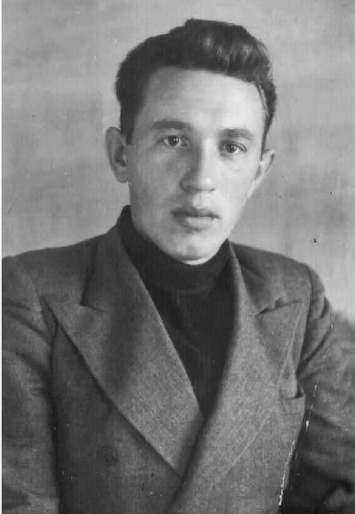

farblos und nutzlos. Denn es gab niemanden, zu dem man hineilen wollte, niemanden, für den man die Blume hätte pflücken wollen, denn du warst nicht bei mir.

Missgestimmt begab ich mich zum Kontor, wo mich die üblichen Sorgen und Akteien erwarteten. Erst jetzt, am Abend, wenn ich schon niemanden mehr um mich habe, bin ich erneut bei dir – und schreibe dir. Neben mir auf dem Tisch liegt sie verwelkte Blume, und sie erzeugt Traurigkeit. Ich schicke sie dir. Wenn sie getrocknet ist, verliert sie ihr Aussehen, wird faltig und verblasst. Doch sie wird von mir sein, und ich hoffe, du freust dich darüber».

Seit dieser Zeit sind 45 Jahre vergangen. Viele mir nahestehende Menschen weilen schon nicht mehr unter den Lebenden, auch Nina gibt es nicht mehr. Die einst in den Brief eingeheftete Blume ist erhalten geblieben.

So rannte die Zeit mit Kummer und Sorgen dahin. Immer weniger nicht angekreuzte Termine blieben in meinem Kalender, immer näher rückte die Zeit der Freilassung.

Eigentlich endete meine Lagerzeit laut Gerichtsbeschluss am 9. März 1952.

Doch während meiner Inhaftierung dort hatten sich etwa 150 Anrechnungstage bei mir angesammelt und somit hätte ich am 17.Oktober 1951 entlassen werden sollen.

Wir Nina und mich bedeuteten diese Tage vieles, und wir fürchteten, dass sie in den Kalendern des UssolLag verloren gehen könnten. So etwas war schon vorgekommen. Später, nach der Freilassung, hatte ich nicht nur einmal den gleichen Traum: ich gehe zu meiner Freilassung, aber dort verkünden sie mir: “Privilegierten Gefangenen steht keine Anrechnung zu, warten Sie bis zum 9. März!”.

Schließlich traf am 4. Oktober ein Solikamsk, 1951 Fernspruch mit der Anordnung ein, mich Während der Abgabe auf Etappe ins KOLP zuschicken, um dort der letzten Jahresbilanz die Formalitäten für meine Freilassung zu erledigen.

Und das bedeutete einen Fußmarsch auf ausgetretenen Wegen mit Übernachtungen in a Rande gelegenen Lagerpunkten und Begegnungen mit dort lebenden Kriminellen. Das war ordnungsgemäß. Egal welchen hohen Posten ein Gefangener eingenommen, egal welche Unterstützung er genossen hatte, mit welcher Art von Ausweisen er unterwegs war – seinen allerletzter Lager-Weg (in die Freiheit oder ins Grab) sollte er in Begleitung einer Begleitwache gehen. Deswegen überließ ich, als ich die Vorbereitungen für die Etappe traf, alle mehr oder weniger wertvollen Sachen (Mantel, Anzug, Halbschuhe) und Bücher Faber. Ich wollte die Kriminellen nicht provozieren und mich der Gefahr aussetzen ausgeraubt zu werden. Für einen alten Lagerinsassen wäre das viel zu erniedrigend gewesen.

Allerdings hatte ich wieder Glück. Fajerstejn traf mit der Verwaltung die Vereinbarung, dass ich nach Abschluss der Quartalsbilanz nach Solikamsk kommen sollte, und begleiten würde mich Balakirew, der, ebenso wie Jerschow, Leutnant des MWD war. Ich hatte nichts dagegen. Theoretisch hatte ich zwei Möglichkeiten: entweder im Gebiet Molotow zu bleiben, in der Hoffnung, dass mir die Leitung dabei behilflich wäre, Nina hierher zu holen, oder mit einer Etappe in die Region Krasnojarsk zu fahren und dort die Zusammenführung mit Nina und Valerik zu erwirken. Fajerstejn schlug vor im OLP zu bleiben – als Leiter der Planungsabteilung. Ich gab vorsorglich meine Zustimmung. Die Angelegenheit wurde mit der Verwaltung vereinbart, und man wartete nur noch auf die Ergebnisse aus Moskau bezüglich Ninas Verlegung. Aber sie waren nicht da.

Am 13. Oktober, nachdem ich die Bilanz abgeschlossen hatte, fuhr ich mit Balakirew nach Solikamsk. Noch ein paar Tage, um den Bericht einzureichen, und dann bin ich in der Abteilung, durch die alle müssen, die ihren Weg in die Freiheit machen. Ich warte, bis ich an der Reihe bin und betrete das Kabinett. Hinter der Absperrung, an ihren Arbeitsplätzen - Mädchen. In der Ecke, an einem massiven Schreibtisch, eine streng dreinblickende Frau – vermutlich die Leiterin.

- Nachname, Paragraf, Haftzeit? – fragt mich das unmittelbar an der Absperrung sitzende Mädchen.

Die für den Lagerinsassen übliche Frage tut dem Ohr unangenehm weh. Ich möchte herausschreien: “Ich bin kein Gefangener mehr!” Aber folgsam und wie ein Gebet gebe ich ihr die geforderten Informationen. Und plötzlich die Frage:

- Wohin wollen sie fahren?

Ich erstarrte. Ich hätte alles erwartet, aber mit einer derartigen Frage habe ich nicht gerechnet.

- Wie – wohin? Ich bin doch Deutscher, - quetschte ich halb fragend, halb bejahend aus mir heraus.

Das Mädchen, ein wenig unwirsch:

- Sie können fahren, wohin sie wollen, mit Ausnahme aller Regions- und Gebiets-Hauptstädte. Haben Sie sich denn immer noch nicht entschieden, wohin Sie wollen? Dann gehen Sie und denken Sie nach, ich habe zu tun.

- Aber ich bin doch Deutscher und unterliege der Anbindung, - versuchte ich mich zu rechtfertigen.

Die Leiterin mischte sich ein:

- Aus Tambow und dem Tambowsker Gebiet wurden keine Deutschen ausgesiedelt. Deswegen brauchen Sie einen Ausweis. Darin gibt es nur eine Einschränkung: sie dürfen ihren Aufenthaltsort nicht in Unions-, Regions- und Gebiets-Hauptstädten haben, der sogenannte Punkt 39. Also wählen Sie, und zwar schnell, denn wir haben keine Zeit, vor der Tür steht eine Schlange Menschen. Das sehen Sie doch selbst.

Leicht gesagt – wählen Sie. Für mich kam all das gesagte völlig unerwartet. Eigentlich war es die zweite Freilassung. Die erste – aus dem Lager, und dafür war ich bereit, die zweite – aus der Sonderansiedlung, und das war wirklich ein Geschenk des Schicksals.

Die Entscheidung hinauszögernd, erkläre ich:

- Und wenn ich nun einen Ort benenne und es mir dann anders überlege und mich an einen anderen begeben möchte?

- Das ist Ihr Recht, wir müssen nur wissen, bis zu welchem Ort wir Ihnen Geld für die Fahrt zuweisen sollen.

- Dann schreiben Sie: Turuchansk, Region Krasnojarsk. Dort leben meine Frau und mein Sohn, - verdeutliche ich aus irgendeinem Grund.

Und dann stehe ich an der Wache des KOLP, in meinen Händen halte ich den Ausweis, der, ungeachtet on Punkt 39, derartige Möglichkeiten eröffnet, von denen ich niemals zu träumen gewagt hätte.

Ein Ausweis! In jenen Jahren brachte der Besitz eines solchen erhebliche Vorteile mit sich: die Möglichkeit, verhältnismäßig leicht durchs Land zu reisen, den Wohnort und den Arbeitsplatz zu wechseln und die Lebensweise zu ändern. Allerdings besaßen nur Angehöriger der Arbeiterklasse und der Intelligenz einen derartigen Ausweis. Der größte Teil der Bevölkerung besaß keinen Ausweis. Keinen Ausweis erhielten Landbewohner und vor allen Dingen Kolchosbauern, Angehörige der Trudarmee, Sondersiedler, Verbannte und selbstverständlich Gefangene. Ohne diesen Ausweis war der Mensch in jenen Jahren im Grunde genommen ein Leibeigener.

Das Vorhandensein eines Ausweises eröffnete mir breite Perspektiven. Ich konnte, und das sollte ich auch tun, unverzüglich in die Region Krasnojarsk fahren und dort, nachdem ich mir Arbeit in einem Forstbetrieb gesucht hatte, Ninas und Valeriks Umzug zu mir zu erwirken. Ich konnte zu Lalja nach Bolschije Pady, im Tambowsker Gebiet, fahren und Mamas Grab besuchen. Ich konnte mich auch zu Ernotschka nach Sdwinsk aufmachen. Wann kann ich das sonst noch machen? Ich konnte mir ernsthaft Gedanken über eine höhere Ausbildung, höhere Qualifikation, die Wahl einer interessanten und gut bezahlten Arbeit machen und vieles, vieles mehr.

Nach langen und quälenden Überlegungen beschloss ich, zu Lalja nach Tambow zu fahren. Ich hatte Angst, dass man mich in der Region Krasnojarsk als Deutschen zur ewigen Ansiedlung anbinden könnten, und dann würde ich mich von den Hoffnungen auf Weiterbildung, ein Wiedersehen mit Lalja und Ernotschka verabschieden können. Und vor der Möglichkeit einer solchen festen Anbindung hatten mich zahlreiche sachkundige Menschen gewarnt. Zudem würde ich sowieso nicht rechtzeitig nach Turuchansk gelangen. Die schiffbare Zeit auf dem Jenissei war Anfang Oktober zu Ende gegangen. Und ob ich nun einen Monat früher oder später in Krasnojarsk einträfe – was machte das schon für einen Unterschied? Nur ein Zweifel blieb. Konnte Nina diese Zeit ohne meine materielle Unterstützung durchhalten und würde das nicht ihr Vertrauen zu meinem Bestreben nach unserem Wiedersehen untergraben?

Es siegte der Wunsch nach Tambow zu fahren, in die Vergangenheit, in meine Jugend einzutauchen.

### Kapitel 16. Ein weiteres Jahr der Trennung

In Tambow traf ich am 23. Oktober 1951 ein. Der Zug näherte sich gerade erst der Stadt, aber und mein Herz stockte süß und aufgeregt in meiner Brust: was erwartete mich in Tambow, was suchte ich hier? Lalja, Mamas Grab, die Wunder der Jugend, Rita? Und wie verhielt es sich mit Nina, Valerik? Während der gesamten Fahrt hatten widersprüchliche Gefühle in mir miteinander gekämpft. Einerseits die ängstliche Erwartung der Begegnung mit der Vergangenheit, mit der Jugend, andererseits – ein Gefühl der Schuld gegenüber Nina und Valerik. Warum war ich nicht direkt nach Krasnojarsk gefahren? Alles wäre näher bei ihnen gewesen. Ich hätte angefangen zu arbeiten, zu helfen, die Wiedervereinigung erreicht. Die Gedanken waren verwirrt, mein Herz versank in Angst. Unerträglich langsam zogen sich die letzten Minuten dahin.

Und dann, endlich, der Bahnhof. Mit angestrengt quietschenden Bremsen kam der Zug am Bahnsteig zum Stehen. Eine Schar von Menschen, welche zur Begrüßung der Ankömmlinge eingetroffen waren – und kein einziges bekanntes Gesicht. Niemand war gekommen, um mich willkommen zu heißen. Denn ich hatte Lalja von meiner Ankunft nichts mitgeteilt. Nachdem ich meinen alten Furnierholz-Koffer bei der Gepäck-Aufbewahrung abgegeben hatte, begab ich mich in die Stadt. Sie hatte sich während der letzten zehn Jahre kaum verändert. Dieselben Straßen, dieselben Gebäude. Waren es jetzt weniger Bäume oder kam mir das nur so vor – nach meinem langen Aufenthalt in der Taiga? Ich ging, beschäftigt mit der Besichtigung der Stadt. Die Beine trugen mich von selbst in die mir bekannten Straßen, vorbei an den bekannten Häusern. Der Arbeitstag ging zu Ende. Die Menschen drängten sich vor den Geschäften, stellten sich zu langen Schlangen auf. Mit klappernden Rädern fuhren Karren vorbei, mit surrenden Reifen brausten Autos dahin. Die Stadt lebte ihr alltägliches Leben, aber für mich fühlte es sich tot an – alles hier war meiner Gegenwart fremd, alles erweckte in mir nur Erinnerungen, und sie verfolgten mich wie ein Phantom.

Endlich unsere Straße. Sie hatte sich absolut nicht verändert. Kleine, mit Brettern verschlagene einstöckige Häuschen. Ein paar Ulmen, staubiges, abgeplatztes Pflaster. Und da steht unser Haus. Eine alte Frau, die mit dem Rücken zu mir stand, war am Fensterputzen. Mit gleichgültigem Gesichtsausdruck, um keine Aufmerksamkeit auf mich zu lenken, ging ich vorüber, konnte mich aber nicht beherrschen, machte kehrt und ging wieder zurück. Als ich mit der Frau wieder auf gleicher Höhe war, fragte ich sie, ob die Ischinas noch in diesem Haus wohnten. Sie drehte sich um, schaute mich aufmerksam an und rief plötzlich: «Roba!», - drückte mich an sich, gab mir einen Kuss und führte mich ins Haus.

Maria Iwanowna Ischina! Wie war es nur möglich gewesen, dass ich sie nicht erkannt hatte? Schließlich hatten wir doch zehn Jahre lang Seite an Seite gewohnt. Ihr Sohn Jura, der fünf Jahre jünger war als ich, hatte in der Armee gedient und studierte jetzt im vierten Semester an der historischen Fakultät des Pädagogischen Instituts in Tambow. Außerdem lebten zwei ihrer Töchter bei ihr: die ältere Dina und die mittlere Irina. Dina war verheiratet gewesen und inzwischen wieder geschieden, Irina war noch nicht verheiratet. Vieles erzählten sie mir über die Stadt, über Freunde und Bekannte, von denen fast keiner in Tambow geblieben war.

Als sie erfuhren, dass ich zu Lalja nach Pady wollte, verstimmten sie mich mit der Mitteilung, dass sie zu Beginn des Studienjahres bei ihnen gewesen sei und gesagt habe, dass sie mit Igorek und den Kindern nach Rostow zu Sofia Wladimirowna umziehen wolle, die dort als Lehrerin tätig war. Was sollte ich tun? Ich hatte viel Geld verbraucht, aber das Wichtigste nicht erledigt – Lalja und die Kinder wiedersehen, und an Mamas Grab war ich auch nicht gewesen. Für eine Fahrt nach Rostow reichten meine finanziellen Mittel schon nicht mehr, wenngleich mich, andererseits, die Möglichkeit reizte, nach Otradowaka zu fahren, um Olga Fedotowna wiederzusehen. Auf jeden Fall wäre Nina das recht, und glättete in gewisser Weise meine Schuld ihr gegenüber. Nachdem ich bei den Ischins übernachtet hatte, begab ich mich am Morgen zur Gebietsabteilung für Volksbildung, um herauszufinden, wo Lalja sich befand. Es stellte sich heraus, dass ihnen über ihre Abreise nach Rostow nichts bekannt war, und dass sie nach wie vor in ihren Verzeichnissen eingetragen war. Allerdings gaben sie mir den Rat, bei der Bezirksbehörde anzurufen, um dort Genaueres herauszufinden.

Von der Gebietsabteilung für Volksbildung machte ich mich auf den Weg zum Institut. Es war jetzt im Gebäude der ehemaligen Eisenbahnerschule untergebracht. Ich ging durch die Korridore, schaute ins Auditorium. Die Studenten drängten sich, Lehrer gingen vorbei, und wieder sah ich kein einziges bekanntes Gesicht. Ich machte das Dekanat ausfindig, öffnete ein Stück weit die Tür und erstarrte. Am Schreibtisch saß Artjomenko, groß und breitschultrig, mit dichten grauen Haaren auf seinem massigen Kopf.

Ich trat ein. Den Blick von den vor ihm auf dem Tisch liegenden Papieren abwendend, blickte Dmitrij Trofimowitsch mich fragend an. Strenges Gesicht, dünne Lippen, kleine graue Augen unter zottigen ergrauten Augenbrauen. Ich blieb schweigend stehen. Ob er mich wohl erkennt? Schließlich hatten wir so viele Abende, mitunter auch schlaflose Nächte zusammen in unserem damaligen wärmetechnischen Labor verbracht.

Er erkannte mich wieder! Das gutmütige, bekannte Lächeln verwandelte sein Gesicht. Er stand auf, klopfte mir auf die Schulter und führte mich ins unbesetzte Labor, fort von neugierigen Augen. Dort saßen wir über eine Stunde zusammen, erinnerten uns an die Vergangenheit und schmiedeten Pläne für meine Zukunft. Anschließend ließ er mich allein und ging zum Direktor, um ein wenig vorzufühlen. Er kehrte mit düsterem Blick zurück, unzufrieden mit seiner Unentschlossenheit zurück. Er bedauerte, dass unser alter Direktor nicht mehr da war. Bald darauf schaute Sergej Sergejewitsch Treskin ins Labor. Er hielt nach wie vor den Kursus für mathematische Analyse ab. Er erkannte mich sofort. Nachdem sie das entstandene Problem erörtert hatten, beschlossen sie, dass ich mich in der Abteilung Fernstudium einschreiben müsste. Sie hofften das Einverständnis der Organe zu erhalten. Nach ihrem Diktat schrieb ich meinen Antrag.

Vom Institut ging ich zum Postamt, um nach Snamenka zu telefonieren, wo sich die Bezirksabteilung für Volksbildung befand. Von dort antwortete man mir, dass Lalja nach wie vor als Lehrerin der deutschen Sprache an der Mittelschule der Ortschaft Bolschie Pady unterrichte.

Am nächsten Tag stand ich um zehn Uhr auf, frühstückte und begab mich erneut zum Postamt. Allerdings gelang es mir nicht zum Bolsche-Padowsker Dorfrat durchzukommen und Lalja oder Igorek ans Telefon holen zu lassen. Ich entschied, ohne Voranmeldung dorthin zu fahren. Die Entfernung betrug nicht mehr als 25-30 km. Mit Mühe fand ich ein vorüberfahrendes Auto, dessen Fahrer bereit war, mich bis zu der Abfahrt mitzunehmen, von der aus es, nach seinen Worten, bis nach Pady nicht mehr weit wäre. Dort stieg ich aus und machte mich auf die Suche nach Pady. Ich irrte mehr als eine Stunde über Felder und Wege, und als ich endlich an der Mühle herauskam, in der, wie man mir gesagt hatte, Igorek arbeitete, dämmerte es bereits.

Nach den traditionsgemäßen Küssen und Umarmungen berichtete Igorek, dass fünf Tage vor meiner Ankunft in der Nacht ihre Wohnung neben der Mühle abgebrannt sei. Und obwohl im Großen und Ganzen für sie alles vergleichsweise gut ausgegangen war, lediglich alle Kartoffeln waren Opfer der Flammen geworden, hatten sie nach Jablonewka umziehen müssen, welches nicht weiter als einen Kilometer von der Mühle entfernt lag. Wir gingen zu Fuß und unterhielten uns. Bald sah ich die Hütten. Ich schaute voraus, versuchte zu erraten, in welcher sie wohl nun wohnten. In Erwartung der Begegnung mit Lalja schlug mein Herz angstvoll. Wir hatten schon fast das ganze Dorf durchquert, als Igorek mich bei der Hand nahm, stehen blieb und leise sagte: “Hier!” Dann näherte er sich vorsichtig, damit man ihn vom Fenster aus nicht sah, der Tür. Er klopfte. Man hörte Schritte und eine schmerzlich vertraute

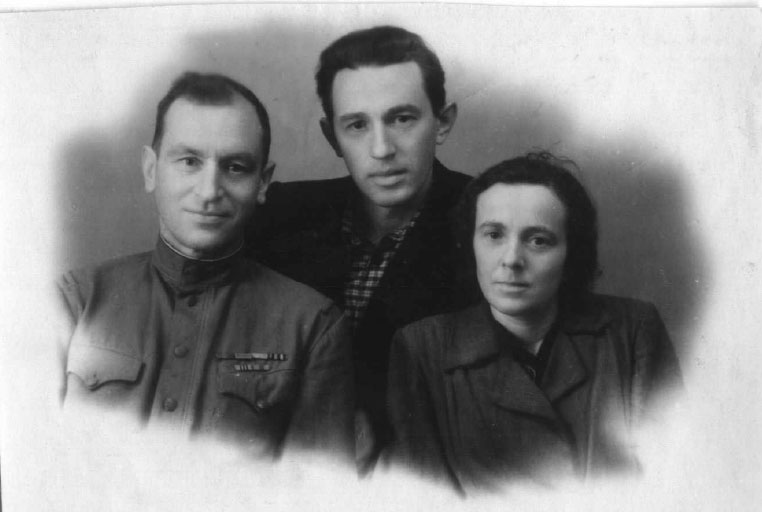

Stimme, die fragte: «Wer ist da?»“ Mach auf, hier sucht dich jemand”, - antwortete Igorek bewusst gleichgültig.

Der Riegel wurde beiseitegeschoben, die Tür ging auf und Lalja blickte in die fortgeschrittene Dämmerung hinaus. «Robotschka!» - schrie sie auf und warf sich in meine Arme. Es ist schwer die Eindrücke der ersten Begegnung, sie zu beschreiben. Doch alles geht vorüber. Auch diese Minuten. Wir betraten das Zimmer, und dort, beim Licht einer Kerosinlampe, konnte ich mein Schwesterchen anschauen. Wie sehr hatte sie sich in diesen zehn Jahren verändert! Aus dem jungen, interessanten Mädchen war eine durch die Strapazen des Lebens müde gewordene Frau geworden. In den Mundwinkeln waren kleine Fältchen aufgetaucht, aber noch auffälliger war ihre gebeugte Haltung. Bei ihrem Anblick wurden diese unwiederbringlich in der Vergangenheit liegenden zehn Jahre spürbar. Wie eigentümlich war es sie zu betrachten, die mit einer Ofengabel und einem Schürhaken um den russischen Ofen hetzte. Besonders verblüffte mich die Tatsache, dass sie sich mit diesem Leben vollkommen abgefunden hatte und sogar mit ihrem kleinen häuslichen Glück zufrieden war. Bald darauf kamen Alik und Tanja. Er, elf Jahre alt, besucht die vierte Klasse, und sieht Igorek sehr ähnlich. Tanjuscha ist neun Jahre alt, geht in die zweite Klasse, sie ist schelmisch, flink und läßt den Jungs nichts durchgehen.

Tambow, 1952 Igorek, Lalja und ich Am nächsten Tag, morgens, schickte ich Nina ein Telegramm:

“Angekommen Tambow. Am fünften abfahre Kranojarsk. Telegrafiere Snamensker Bezirk Bolschiye Pady Krasawtsewa. Kuss Robert.» Auf diese Weise markierte ich sowohl für mich als auch für Lalja meine Aufenthaltsdauer in Jablonewka.

Um die Mittagszeit, nachdem Lalja und die Kinder aus der Schule heimgekehrt waren, gingen wir zum Friedhof. Verwaist, vom Herbstwind zerzaust, die letzte Zufluchtsstätte der Toten. Keine Abzäunungen, keine Grabtafeln. Lediglich eine Reihe abgesenkter, vom Regen ausgewaschener Erdhügel mit von der Zeit und durch schlechtes Wetter geschwärzten Kreuzen. Einsam dastehende, mit vergilbtem Birkenlaub bedeckte, Büsche längst gelb gewordenen Flieders. Ich stehe da, mit unbedecktem Kopf, zerdrücke in meinen Händen meine alte Lagermütze. In den Augen Tränen. Ich bin zu spät gekommen! Ich habe es nicht geschafft! Hinter mir Lalja mit rotgeweinten Augen. Neben mir die still gewordenen Kinder. Über das gepflügte Feld eilt Igorek. Am Abend eine Art Gedenkfeier. Wodka, Kutja, Bliny. Kissel. Igorek erinnert sich, was für ein schutzloser und guter Mensch Sifia Oswaldowna war. Lalja und ich schweigen. Sie – unsere Mama, die beste, die einzige! In jenen letzten Tagen hatte sie die ganze Zeit auf meinen Brief gewartet. Aber ich hatte anderes zu tun, andere Sorgen. Ich dachte, sie wartet, ich schaffe es. Aber ich schaffte es nicht rechtzeitig, und sie wartete nicht.

Die acht Tage, die ich für meinen Aufenthalt in Jablonewka abzweigte, flogen vollkommen unbemerkt vorüber. An den langen Herbstabenden, wenn die Kinder eingeschlafen waren, erzählte ich von meinem Leben im Lager. Gespenstische Schatten fielen von der Kerosinlampe mit dem am Glas verkohlten Papierschirm. Igorek hörte interessiert zu, stellte viele Fragen: über die Arbeitsbedingungen, das Leben, die Haftordnung, die Kriminellen. Lalja seufzte immer lauter, versuchte erfolglos das Gespräch auf Nina und Valerik zu bringen.

Igorek seinerseits erzählte mir in diesen Tagen eine Menge über das schwere Los der Dorfbewohner. Er, von Geburt Bauer, der lange Jahre in einem entlegenen Tambowsker Dorf gelebt hatte, Kommunist per Überzeugung, Panzersoldat im Offiziersrang, der den ganzen Krieg miterlebt und viel gesehen hatte, nahm sich den Niedergang des russischen Dorflebens sehr zu Herzen.

Nach seinem Bericht zu urteilen hatten die Bauern ein sehr schweres Leben. Die Arbeit in den Tambowsker Kolchosen wurde praktisch nicht entlohnt. Über die staatlichen Aufkäufe wurde ihnen lediglich ein Fünftel der produzierten Milch vergütet, ein Zehntel des Getreides, ein Zwanzigstel des Fleisches. In der Jablonewsker Nachbarkolchose, die zu den führenden zählte, brachte man 150 Gramm Korn pro Tagesarbeitseinheit in Anrechnung.

Da die Kolchosarbeiter gezwungen waren, ihr Dasein hauptsächlich auf Kosten der Hilfswirtschaften zu fristen, versuchten sie auf jede nur erdenkliche Weise die Arbeiten in der Kolchose zu umgehen. Im Kampf gegen diese “kranke”, “privateigentümerische” Tendenz, verringerte der Stadt, beginnend mit dem Jahr 1946, nicht nur grundlegend die an den Häusern gelegenen Grundstücke und belegte den verbliebenen Teil mit unermesslich hohen Steuern, sondern beschränkte auch merklich die Möglichkeiten Handel zu treiben. Die Produkte aus seiner eigenen kleinen Wirtschaft auf dem Markt verkaufen konnte der Kolchosbauer nur dann, wenn er ein spezielles Dokument vorweisen darüber konnte, dass Die entsprechende Kolchose ihre Verpflichtungen gegenüber dem Staat vollständig erfüllt hatte. Gebühren und Steuern auf die Einkommen der Landbewohner aus Verkäufen auf dem freien Markt wurden stark angehoben.

In den Jahren 1947-48 griff die Regierung zu Zwangsmaßnahmen gegen die Kolchosbauern, die nach Igoreks Meinung an die schlimmsten Zeiten des ersten Fünfjahresplans erinnerten: so sahen die Dekrete, die am 4. Juni 1947 verabschiedet wurden, zwischen fünf und fünfundzwanzig Jahren Lagerhaft für jedwede “Übergriffe auf Staats- oder Kolchos-Eigentum” vor. Damals, 1947, wurde das Pflichtminimum an Tagesarbeitseinheiten bestätigt, welches bereits Ende der dreißiger Jahre eingeführt worden war. Bei Nichterfüllung drohte die Verbannung. Es setzte ein massiver Bauern-“Exodus”, vor allem der jungen Leute, aus den Dörfern ein, der ein noch viel größeres Ausmaß gehabt hätte, wenn die Kolchosarbeiter im Besitz eines Ausweises gewesen wären.

Aus allem, was Igorek erzählte, folgte offenkundlich, dass das Land sich erholte und nun auf Kosten einer grausamen Ausbeutung der Bauernschaft lebte. Ich wollte hinzufügen: “und auf Kosten der Sklavenarbeit von Gefangenen und Verbannten”.

Seine Überlegungen wurden von einer Gruppe von etwa zehn Frauen unterbrochen, die auf der vom Regen aufgeweichten Straße in Richtung der in der Ferne sichtbaren Farm gingen. In schäbigen, selbstgestrickten Pullovern, selbstgesponnenen, abgeschnitten Mänteln. An den Füßen abgetretene Stiefel, mit einer Schnur festgebundene Überschuhe. In den Händen Eimer und Forken. Sie gehen langsam, ohne Gelächter, ohne Gesang.

Igorek und ich sitzen auf dem Erdhügel. Die kaum wärmende Herbstsonne scheint. Am Himmel treiben dunkle Wolkenfetzen. Es scheint, als würden sie in den kahlen, flehentlich ausgestreckten Ästen der Bäume hängenbleiben. Die Luft ist mit Feuchtigkeit gesättigt, doch es regnet nicht. Es hatte die ganze Nacht geregnet und erst gegen Morgen aufgehört. Und ich musste ans Lager denken. Ein trüber Herbstmorgen im Jahr 1959. Der Holzverarbeitungspunkt des Frauenlagers «Lesnaja». Eduard Gustavowitsch Schmidgal, der Revisor des OLP, und ich waren zur Überprüfung der Buchhaltungsarbeiten gekommen und früh eingetroffen, die Leute gingen gerade zur Arbeit. Im Morgengrauen nieselte es. Hinter den Toren eine Frauen-Brigade. In Wattejacken, Westen, Pumphosen und Röcken. An den Beinen dicke, lange Strümpfe und viel zu große Bastschuhe. Auf den Köpfen tragen einige eine Soldatenmütze mit Ohrenklappen, andere ein Kopftuch. Darüber ein Stückchen Wachstuch – als Schutz vor dem Regen. Unter den Kopfbedeckungen lugen regennasse Haarsträhnen hervor. In den Händen Äxte und Sägen, an den Gürteln befestigtes Kochgeschirr. Die Gesichter blicken düster drein, nass – entweder vom Regen oder von Tränen. Schmidgal und ich stehen bei der Wache im Licht der Projektoren, und ich schäme mich furchtbar. Ich schäme mich meiner Jugend, für mein wenig lagergemäßes Aussehen, dafür, dass die Frauen losgehen, um das verhasste Holz zu sägen, während wir uns ins warme, trockene Kontor begeben, wo auf uns wahrscheinlich ein Frühstück wartet, dafür, dass ich hierhergekommen bin, weil Nelja Soroka in Lesnaja als Oberbuchhalterin tätig ist.

Die Erinnerung daran war derart lebendig, dass ich mich unwillkürlich auf der Suche nach dem Begleitsoldaten umsah, der mit den Frauen mitgehen sollte. Igorek schwieg ebenfalls; er dachte auch über sein schweres Los nach.

In all diesen Tagen quälte mich der Gedanke an Nina und Valerik. Wahrscheinlich hätte ich trotz allem sofort nach Krasnojarsk fahren sollen. Stattdessen hatte ich mir einen Urlaub verschafft. Das Geld, das ich für die Reise erhalten hatte, war schnell dahingeschmolzen, und für die Fahrt nach Krasnojarsk reichte es bereits nicht mehr. Konnte Nina diese Zeit ohne meine Hilfe durchhalten?

In der zweiten Novemberwoche, nachdem ich von Lalja Beistand in Form von Geld und Nahrungsmitteln erhalten hatte, machte ich mich auf den Weg nach Tambow. Die Abfahrt nach Krasnojarsk war für den 13. November festgelegt. Die verbleibenden Tage beschloss ich dafür zu nutzen, alte Bekannte, Freunde ausfindig zu machen. In Tambow gab es nur noch sehr wenige von ihnen.

Vor allem fand ich Lew Petersson mit Igoreks Hilfe. Nachdem er den Krieg mitgemacht und anschließend demobilisiert worden war, arbeitete er nun bei der Fahrzeuginspektion. Er war stolz auf seinen Offiziersrang und seine Medaillen. Vieles erzählte er, mit einem Gefühl der Überlegenheit, von seinem Leben an der Front. Er hatte Mitleid mit mir, aber es war irgendwie seltsam, als ob er einen Film sähe. Lew lebte zusammen mit seiner Mutter, Ehefrau und Tochter in einer Ein-Zimmer-Wohnung. Seine Frau, Kellnerin in einem örtlichen Restaurant, war mollig, hatte ein rundes Gesicht, rosige Wangen und einen dicken, blonden Zopf. Sie hatte bereits mehrmals mit ihrer Tochter das Haus verlassen, nachdem sie erneut einen Skandal verursacht hatte. Neben ihr machte Lew, beinahe hager und schmächtig in seiner Offiziersuniform, einen verlorenen, unsicheren Eindruck. Man konnte ihn um seine Frau kaum beneiden.

Es gelang mir die Orlows ausfindig zu machen: Andrej und Platon. Beide haben den Krieg mitgemacht, beide sind verheiratet. Andrej steht im Rang eines Majors. Er diente als Übersetzer (aus dem Deutschen und Rumänischen). Sie wohnten in dem alten Elternhaus, in dem ich manchmal, in meinem vergangenen Leben, so gern aufgehalten hatte. Damals hatte sich an den Abenden ihre ganze Familie auf der großen verglasten Veranda um den blitzblanken Samowar versammelt. Durch das gemusterte Gitter des Aschenkastens schimmerte die Glut, und es roch nach Rauch. Die Zuckerdose war randvoll mit schneeweißem, funkelndem Kandis – zur damaligen Zeit ein überzeugender Beweis für materiellen Wohlstand. In dem großen grünlichen Glasbehälter noch warmes hausgemachtes Gebäck. In ebensolchen grünen Schalen Kirschmarmelade.

Jetzt hatte sich alles verändert. Die alten Leute waren tot. Die Veranda war abgesackt und zur Seite geneigt. Der Garten hatte sich gelichtet, die Apfelbäume waren verschwunden, die einst mit ihren Zweigen an die Fenster der Veranda geklopft hatten. Die Familie war auseinandergegangen. Die Interessen ebenfalls. Aus irgendeinem Grund fühlte ich mich wie ein Fremder. Vor allem Platon brachte mich in Verlegenheit. Mit Andrej war es einfacher. Besonders wenn er versuchte, mir am Stadtrand das Motorrad-Fahren beizubringen, und ich es stets darauf anlegte, den einzigen Pfosten weit und breit umzufahren.

Ich fand auch Luda Sobolewa, mit der ich in der Schule gemeinsam gelernt hatte, und die ich nach dem Abschlussabend nach Hause begleitet hatte. Unter Missachtung der allgemein anerkannten Normen kam ich völlig unerwartet dorthin. Ich klopfe. Ein junger, hagerer Mann öffnet die Tür. Die Tür führt direkt ins Zimmer – groß, aber ärmlich eingerichtet. Quer durch den Raum sind Leinen gespannt, an denen Wäsche aufgehängt ist. Auf dem Fußboden spielen zwei Mädchen. Nichts mehr vom vergangenen Leben, dem Glanz der Staatsanwaltswohnung des Vaters. Lusja selbst ist nachlässig gekleidet und füllig geworden. Sichtlich verlegen und durcheinander. Sie macht mich mit ihrem Mann bekannt. Bietet mir einen Sitzplatz an. Das Gespräch stockt. Weshalb bin ich gekommen, womit habe ich gerechnet?

Ich ging in meine vertraute Schule. Traf mich mit den Lehrern. Von denen, die zu meiner Zeit unterrichtet hatten, war kaum noch jemand übrig. Lange und herzlich sprach ich mit der Deutschlehrerin, die damals unsere Klassenlehrerin war und uns in Mathematik unterrichtete, die wir damals sehr verliebt «Tausenfüßlerin» genannt hatten. Nachdem ich von ihnen Anna Petrownas Adresse erhalten hatte (unsere Physiklehrerin), begab ich mich zu ihr nach Hause, bat um Entschuldigung für unser dummes Verhalten und die Unterbrechungen im Unterricht. Wir tranken Tee, erinnerten uns an die Vergangenheit, das Leben vor dem Krieg.

Und das ist alles. Weder Robert Stoks noch Simatsch waren in der Stadt, und es gelang mir auch nicht irgendetwas über sie herauszufinden. Ich machte auch keinen der damaligen Kursteilnehmer ausfindig. Nicht einmal Rita Konjuchowna, mit der ich mir in tiefster Seele ein Treffen erträumt hatte.

Bevor ich mir die Fahrkarte nach Krasnojarsk besorgte, schaute ich beim Institut herein, und dort teilte Artjomenko mir mit, dass er die Erlaubnis erhalten habe, mich in der Abteilung für Fernunterricht einzuschreiben. Mit Genehmigung des Rektorats ging das ohne Aufnahme-Prüfungen, gleich für den zweiten Kurs, aber sie empfahlen, die Prüfungen und Tests für mindestens ein Semester vor meiner Fahrt nach Krasnojarsk abzulegen, um auf diese Weise die Ernsthaftigkeit meiner Absichten zu bestätigen. Dabei meinte Artjomenko, dass, wenn man mich im Rektorat nicht als ernsthaften und initiativen Studenten kennen würde, ich die Aufnahmeprüfungen und Prüfungen für den ersten Kurs noch einmal hätte ablegen müssen.

Vor mir stand ein schwieriges Problem. Um die Prüfungen und Tests für das zweite Semester ablegen brauchte es mindestens eineinhalb Monate. Und das bedeutete, dass ich nicht vor Januar nach Krasnojarsk käme. Wenn ich eine Arbeit finde, Lohn erhalte - vergeht ein weiterer Monat? Wie wird Nina einer solchen Perspektive gegenüberstehen, und wie werden sie und Valerik in diesen zwei-drei Monaten über die Runden kommen? Und dann schreibe ich ihr am 16. November einen dicken Brief, an dessen Ende ich die entstandene Situation mit folgenden Worten erkläre:

«... Meine liebe Ninotschka, verzeih deinem Ro, aber, ehrlich gesagt, habe ich einen so wilden Wunsch zu studieren, dass ich kaum widerstehen kann. Insgesamt nur eineinhalb Monate. Ich werde die Prüfung für den zweiten Kurs ablegen, ein Zeugnis erhalten, eine akademische Bescheinigung entgegennehmen und mich dann sofort bei meiner Ankunft in Krasnojarsk für das dritte Semester einschreiben. Mit der Vorbereitung beeile ich mich; ich sitze hier bereits den dritten Tag, ohne aufzustehen, von acht Uhr morgens bis zwei Uhr in der Nacht. Man könnte den Prozess beschleunigen, aber ich will mich nicht blamieren, sondern eine Eins schaffen.

Du weißt doch, mein Liebling, dass das Studieren mein ewiger Traum war. Wenn sich die Möglichkeit nun schon einmal ergibt, sollte ich sie auch nutzen. Schließlich haben wir uns jetzt schon so lange in Geduld geübt, da können wir uns auch noch ein-zwei Monate gedulden. Für meinen endgültigen Entschluss teile mir bitte mit, wie es um Valeriks und deine Gesundheit bestellt ist und wie es mit der finanziellen Situation aussieht. Ich habe so lange Zeit, so schrecklich lange Zeit von dir keine Briefe erhalten, keine einzige Nachricht, nur Telegramme. Ich bin so beunruhigt! Gute Nacht. Sei deinem Ro nicht böse. Ich küsse dich und Valerik ganz, ganz, ganz doll! Dein Ro, euer Papa.»

Für Nina war das ein ernster Schlag. Meine Entscheidung kam für sie völlig unerwartet und stellte meinen Wunsch, so nah wie möglich bei ihnen zu sein, die Familienzusammenführung zu erwirken, in Zweifel. Und vielleicht ist das ja auch das Ende und er versucht auf diese Weise, sich die Hände freizumachen – dachte sie. Hatten nicht die Verwandten sie davor gewarnt, die für sie beharrlich einen Bräutigam gesucht hatten? Und obwohl sie an eine derartige Möglichkeit nicht gedacht hatte, war es ihr trotzdem unangenehm, auf Fragen anlässlich des Datums meiner Ankunft zu antworten. Und es gab einfach zu viele Neugierige. Für sie war Ninas und mein Leben so eine Art zeitgenössischer mexikanischer Fernsehserien. Häufig war der Inhalt meiner Telegramme ihnen bereits bekannt, bevor es Nina ausgehändigt worden war, besonders dann, wenn es um die nächste Verschiebung meines Abreisedatums ging. Leider gab es von diesen Telegrammen später recht viele. Meine Pläne zur Erlangung der höheren Bildung und meine Lernerfolge waren ihr angenehm, und sie wollte gern allen davon erzählen, aber sie verblassten vor einer offensichtlichen Tatsache – ich hatte es mit meiner Abfahrt nach Krasnojarsk nicht eilig, mein Studium war für mich wichtiger als ihr Wohlergehen und unser gemeinsames Leben.

Für mich war mittlerweile das Wohnen zum Hauptproblem geworden. Absatz neununddreißig der Pass-Beschränkungen gestattete mir keine Zuzugsgenehmigung und keinen langen Aufenthalt in Tambow. Die erste Zeit lebte ich in Jablonewka und kam nur zu den Examina und der Abgabe der Tests nach Tambow. Aber das war sehr unbequem bei den engen Fristen, die ich mir selbst gesetzt hatte. Jedes Mal, wenn ich mich an die Vorbereitung für die nächste Prüfung machte, musste ich mit dem Prüfer zusammentreffen, was mitunter mehrere Tage in Anspruch nahm, einen Prüfungstermin vereinbaren, das Programm und die Anforderungen besprechen. Anschließend musste ich eine Kontrollarbeit vorlegen und den Lehrer dazu überreden, diese so schnell wie möglich zu überprüfen, dann bekam ich eine Zwischenprüfung auferlegt und schließlich musste ich den Prüfer an unsere Abmachungen erinnern und bereit sein für eine Änderung bei der abgesprochenen Frist. Und für all das - 7- 10 Tage. Daher entstand die Notwendigkeit, in regelmäßigen Abständen für jeweils zwei-drei Tage in der Woche, in Tambow zu leben und dort bei Freunden und Bekannten zu übernachten. Meistens bei Lew Petersson.

In den Fällen stellte er für mich in der Küche ein Klappbett auf, wodurch ich sie, freilich, alle sehr stark einengte. Und obwohl sie es mir nicht zeigten, war es mir doch recht peinlich. Zudem saß mir die Angst im Nacken, dass die Miliz mich entdecken könnte. Für das Leben ohne Anmeldung konnte man 10 Jahre aufgebrummt bekommen. Im Lager hatten sie Personen, die wegen des Aufenthalts ohne festen Wohnsitz verurteilt worden waren, Penner. Dort hatte es sehr viele von denen gegeben und sie bekamen niemals einen Ausweis. Außerdem setzte ich auch meine Hauswirte einer ernsthaften Gefahr aus. Deswegen war ich bemüht, so spät wie möglich zu kommen, aber noch bevor alle schlafen gingen. Dabei konnte man allerdings schnell einen Fehler machen – indem man zu spät kam, wenn das Licht in der Wohnung bereits gelöscht war. In solchen Fällen begab ich mich in Soja Kosmodemjanskajas Gartenanlage, richtete mich auf der entfernten, durch Fliederbüsche verborgenen Bank ein und wartete dort mit Müh und Not, die ganze Nacht mit den Zähnen klappernd, auf die ersten Autobusse, in denen man sich wenigstens ein bisschen wieder aufwärmen konnte. Ich riskierte es nicht, die Nacht auf dem Bahnhof zu verbringen, wie die heutigen Penner es zu tun pflegen. Dort wurden ständig Razzien durchgeführt und die Wohnungslosen nach kurzer Gerichtsverhandlung in Lager gebracht.

Auf die Examina bereitete ich mich hauptsächlich in Jablonewka vor. Ion den Tagen, in denen ich mich in Tambow befand, ging ich in den Lesesaal. Leider war es dort sehr kalt. Für mich völlig unerwartet fand ich einen geeigneten Platz: im Kontor der Treibstoffabteilung des städtischen Exekutivkomitees. Dort gab es stets lange Schlangen und irgendwelche Möbel, auf denen man zumindest sitzen konnte. Ich stellte mich in die Schlange, holte mein Lehrbuch hervor und bewegte mich langsam zu der Tür, die ins Kabinett führte, wo ich mich dann auf das nächste Examen vorbereitete. Als ich schließlich an der Reihe war, reihte ich mich woanders wieder ein, indem ich darauf hinwies, dass mein Bruder gleich mit den nötigen Dokumenten käme.

Noch schlimmer war es um die Verpflegung bestellt. Die Lebensmittel, mit denen ich von Lalja vor der Fahrt nach Tambow versorgt worden war, hatte ich bei den Peterssons zurückgelassen, aber es war mir peinlich, zum Mittagessen dorthin zu gehen und mich noch einmal bloßzustellen. Ich aß, wie es sich gerade ergab, wer von den Bekannten mich bei sich bewirtete. Manchmal ging ich auch in die Studenten-Kantine. Selten kaufte ich im Milchladen ein Brötchen und ein Glas Sahne, doch damit floss das Geld dahin, und das war bei mir äußerst knapp.

Ende Dezember verschaffte Igorek mir eine Wohn- und Ess-Möglichkeit bei ihm bekannten alten Leuten, die in ihrem eigenen Haus in der Kirow-Straße 56 lebten, unweit unseres einstigen Hauses. An ihren Nachnamen kann ich mich noch erinnern – Sirawin. Sie hieß Klawdia Iwanowna, seinen Vornamen weiß ich nicht mehr. Igorek bezahlte sie in Naturalien, die er aus Pady mitbrachte – vorwiegend Kartoffeln. Ob er ihnen von meinem Problem mit der Aufenthaltsgenehmigung erzählt hatte, vermag ich nicht zu sagen. Wohl eher nicht. Ich ließ davon jedenfalls nichts verlauten. Aber das Problem und die damit verbundene Gefahr blieben. Auf Anraten Artjomenkos und mit seiner Petition begab ich mich zur Deputierten des Obersten Rats im Tambower Gebiet, der Mittelschullehrerin Bystrowa, damit sie mir die Erlaubnis erteilten, mich während der Zeit meiner Examina in Tambow aufzuhalten. Nach kurzem Gespräch setzte sie auch mein Gesuch den Vermerk: «Mit der Bitte, dem Antrag stattzugeben» und riet mir zur Miliz zu gehen. Nach reiflichen Überlegungen beschlosss ich, um keine Aufmerksamkeit auf mich zu lenken, nirgendwo hinzugehen. Das Blatt Papier habe ich noch lange in meinem Archiv aufbewahrt, aber später ist es dann irgendwo verloren gegangen.

Die Prüfungen für den zweiten Kurs zogen sich in die Länge. Als ich mich daran machte, hatte ich Nina versprochen, sie Mitte Dezember beendet zu haben. Doch es gelang nicht, diesen Plan zu verwirklichen. Im Zusammenhang mit Änderungen des Unterrichtsplans tauchten neue Fächer und gesonderte Themen auf, in denen weitere Prüfungen für das erste Semester abgelegt werden mussten. Zudem hatte ich mit Begeisterung einige Prüfungen in mathematischen Disziplinen absolviert und dabei die in den humanitären Disziplinen für später gelassen. Dieses Sich-Stürzen auf das Gebiet der mathematischen Disziplinen wurde von der Leitung der Korrespondenzabteilung unterbunden. Demzufolge musste ich Anfang Dezember noch Prüfungen in drei Fächern ablegen: Physik, Pädagogik und Grundlagen des Marxismus-Leninismus.

Die Examina in den mathematischen Disziplinen verliefen ohne besondere Probleme. In allen Fachgebieten erhielt ich eine Eins. Die Sache hatte nur einen Haken. Bei der Ausführung der Kontrollarbeit auf Konvergenz der Reihen benutzte ich in einigen Beispielen, anstelle der Quotenkriterien von d’Alembert und Kosch die weniger aussagekräftigen Kriterien von Raabe und Gauss. Ich wollte zeigen, dass meine Kenntnisse über den Rahmen der Programmanforderungen hinausgingen. Wie verwundert war ich, als mir drei Tage später die Laborantin, schuldbewusst lächelnd, die Kontrollarbeit zurückgab, die komplett mit roter Tinte durchgestrichen war. Empört darüber, was geschehen war, bat ich um ein Treffen mit dem Lehrer, der die Arbeit geprüft hatte. Es war Boris Klukwin, der erst kürzlich das Institut beendet hatte und erst im zweiten Jahr an der Fakultät tätig war. Nachdem er zugegeben hatte, dass ich im Recht war, bat er mich dennoch darum, die Arbeit neu zu schreiben, denn sie in dieser Form in der Akte zu belassen, war ihm peinlich. Ich war einverstanden.

Zwischen uns entwickelten sich freundschaftliche Beziehungen, und in der Folge half er mir mehrfach aus der Klemme, indem er mir materielle Hilfe erwies.

Für den vollständigen zweiten Kurs zahlte ich erst Mitte Januar. In meinem Вrief vom 14., Januar bat ich Nina um ihre Zustimmung zur Verschiebung meiner Abfahrt nach Krasnojarsk:

«Ich kann mir vorstellen, wie quälend lang sich die Tage für dich hinziehen, wie viele unfreiwillige Qualen und Leiden ich dir mit meiner Verzögerung in Tambow bereitet habe.

Freilich wäre alles ganz anders gekommen, wenn ich sofort nach Krasnojarsk gefahren wäre. Aber du verstehst doch, dass ich die mir gebotenen Möglichkeiten nicht ablehnen konnte, zumal wir uns vor Eröffnung der schiffbaren Zeit sowieso nicht hätten wiedersehen können.

Ich verstehe sehr gut, dass es Momente gibt, die dieses Problem nur noch verschlimmern. Schließlich kommt der Glaube durch Glauben und die Zweifel durch Zweifel. Ich kann mir gut vorstellen, was die Leute sagen, die sich in deinem Umfeld befinden und nicht daran glauben, dass ich komme. Ihre Ungläubigkeit überträgt sich auf dich – und du leidest.

Meine Liebste, wenn ich doch nur ein Stündchen mit dir reden könnte, dann, davon bin ich überzeugt, würdest du neuen Glauben und neue Kraft gewinnen.

All meine Tage hier vergehen in harter Arbeit. Nur selten lege ich mich vor zwei-drei Uhr nachts schlafen. Von morgens bis in die tiefe Nacht sitze ich über den Büchern. Am 21. November habe ich mit den Examina begonnen, und innerhalb eines Monats und zwanzig Tagen 14 abgelegt und fast genauso viele Tests. Das sind vier Tage pro Examen, sogar weniger. Dabei habe ich nur drei von ihnen mit „gut“ bestanden, alle anderen mit einer „Eins“. Am 11. Januar haben sie im Protokoll vermerkt, dass ich den Lehrplan für das zweite Semester erfüllt habe und ins dritte versetzt worden bin, und außerdem den Abschluss des Lehrplans für die Wintersitzung im dritten Kurs. Überleg doch mal, bleibt denn dann noch zweit für irgendwelche Dinge nebenbei?

Das neue Jahr habe ich in Jablonewka begrüßt. An diesem Abend legten sich, wie gewöhnlich, Lalja, Igorek und die Kinder um zehn Uhr schlafen, während ich, bewaffnet mit Feder und Papier, mich hinsetzte, um dir zu schreiben und auf zwölf Uhr zu warten. In der Hütte (so nennt Igorek sein Häuschen) ist es ganz still. Vor mir auf dem Tisch die Kerosinlampe, von der ich ein ganz warmes Gesicht und warme Hände bekomme, aber die Füße frieren. Das Herz ist mir unsäglich schwer. In diesen Minuten kommt alles zusammen: die körperliche und seelische Müdigkeit, die Einsamkeit und die Sorge um euch.

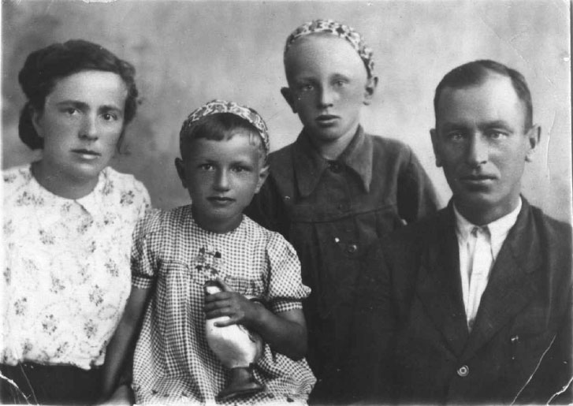

Am achtundzwanzigsten habe ich dir ein Telegramm geschickt, in dem ich dich zum neuen Jahr beglückwünschte. Leider war es mir, trotz meines sehnlichsten Wunsches, nicht möglich dir wenigstens einen kleinen Geldbetrag zukommen zu lassen.

Tambow, 1952 Lalja und Igor mit den Kindern Nur knapp übriggeblieben sind: 400 Rubel, von denen ich 300 für die Fahrt nach Krasnojarsk benötige. In demselben Glückwunsch-Telegramm schrieb ich, dass ich am 5. Januar Abreise, doch ich musste noch für einen speziellen Kursus eine Prüfung ablegen, ohne die sie mir die Versetzung vom zweiten ins dritte Semester nicht ausgestellt hätten».

Und ganz am Schluss desselben Briefes die unangenehme Überraschung für Nina – die Bitte um eine erneute Verschiebung des Abreisetermins.

«Nachdem am Elften alle Sachen erledigt waren, habe ich mich von den mir nahestehenden Lehrern verabschiedet: Dmitrij Trofimowitsch, Sergej Sergejewitsch, Aisek Asimowitsch Pjassetzkij, Boris Klukwin. Nachdem sie mich angehört hatten, fingen sie an sich zu empören: “Das ist schlichtweg ein Verbrechen, mittendrin alles aufzugeben”, «Man hat ihm die Möglichkeit gegeben, innerhalb eines Jahres gleich mehrere Kurse zu machen, und nun fährt er auf und davon», «Außerdem kannst du jetzt nicht Turuchansk fahren, du musst irgend woanders in der Region Krasnojarsk auf die Navigationszeit warten.”. Und Boris Klukwin, genau der, welcher seinerzeit meine Kontrollarbeit rot durchgestrichen hatte, gab mir 200 Rubel mit den Worten:

«Hol damit deine Frau hierher, aber leg wenigstens noch für das zweite Halbjahr des dritten Kurses deine Prüfungen ab».

Mein Liebes, ich verstehe, wie schwer es für dich sein muss, aber versteh auch meine Situation. Bisweilen kommt es mir so vor, als würde ich verrückt von all der Anspannung, den Ängsten und Sorgen, verlöre die Macht über mich. Dann möchte ich alles hinwerfen und abreisen, um nur etwas näher bei euch sein zu können. Mein Liebes, versteh die Wichtigkeit all dessen, was ich hier tue. Das sind keine Marotten, es ist der einzige für uns mögliche Weg in ein würdiges Leben.

Ich bitte dich, mein Liebes, glaube an deinen Ro, hege keine einzige Minute Zweifel in ihn. Wäge alles ab, und wenn du es, trotz der Unmöglichkeit unseres Wiedersehens vor Beginn der Schifffahrtszeit, für notwendig hältst, dass ich nach Krasnojarsk komme, schick mir ein Telegramm und, glaube mir, dann werde ich diese ganze Angelegenheit hier stehen und liegen lassen und abreisen.

Und nun zum Brief. Ich habe lange nicht geschrieben, erstens, weil ich keine Zeit vom Unterricht abzweigen wollte, was meinen Aufenthalt hier nur unnötig verlängert hätte, aber vor allen Dingen, weil ich ja jeden Tag abreisen wollte. Aber warum schreibst du denn nicht? Wie ist es um deine und Valeriks Gesundheit bestellt? Was macht die Arbeit? Bei wem wohnst du?

Küsse Valerik von mir, er soll auf den Papa nicht böse sein. Ich küsse dich ganz, ganz fest. Dein Ro, euer Papa.»

Am siebzehnten Januar erhielt ich ein Telegramm von Nina: "Studiere in Ruhe, habe zwei geschrieben, deinen erhalten, sind gesund, küssen dich = Nina". Erleichtert widmete ich mich meinem Studium. Bis zum 20. Januar mussten die Prüfungen für den dritten Kurs in Differentialgeometrie, die Geschichte der Pädagogik und der politischen Ökonomie (Kapitalismus) abgelegt werden.

Während ich meine Examina bestand, änderten sich meine Zukunftspläne. Während ich noch davon träumte, im November das zweite und im Dezember das dritte Jahr zu absolvieren, plante ich bereits Ende Januar, nachdem ich zwei weitere Mathematikfächer mit Bravour bestanden hatte, das Staatsexamen abzulegen. Natürlich war ich mir bewusst, welchen Schaden ich Nina mit jeder weiteren Verzögerung der Ankunft in Krasnojarsk zufügte. Alle meine Briefe aus dieser Zeit sind daher voll von Liebeserklärungen, Treuebekundungen, Erklärungen über die Zweckmäßigkeit einer weiteren Ausbildung, einer höheren Bildung. Das Hauptargument ist, dass es unmöglich ist, vor der Öffnung der Schifffahrt nach Turuchansk zu kommen. Was würde es nützen, wenn ich in einer Stadt oder einem Dorf in der Region Krasnojarsk leben würde? In Krasnojarsk selbst konnte ich auch nicht wohnen.

Doch all dies half wenig. Nina lebte in ihrem eigenen Umfeld. Ihre Bekannten dachten, ich würde sie nur "durcheinanderbringen". Dass ich wahrscheinlich schon längst eine Frau gefunden hätte und sicher nie in eine Absteige wie Turukhansk kommen würde.

In der zweiten Januarhälfte wurde Nina zum KGB vorgeladen. In ihrer Todesangst ging sie mit Valerik dort hin. Der diensthabende Wachtmeister verlangte, dass sie allein ins Büro des Chefs gehen und Valerik im Empfangsraum lassen solle. Nina, die sich dieser Forderung widersetzte, verlangte zu erfahren, warum sie vorgeladen worden war. Der Unteroffizier wusste es nicht oder wollte es nicht sagen und bestand darauf, dass sie Valerik zurückließe und versuchte sogar, ihn mit Gewalt fortzubringen. Erschrocken über das, was geschah, begann Valerik laut zu weinen Eine mit Kunstleder beschlagene Tür öffnete sich, und ein Stabshauptmann trat in den Empfangsraum. In voller NKWD-Uniform. Auf dem Kopf eine Mütze mit himbeerfarbenem Rand. Offensichtlich der Chef.

- Was ist los, warum ist das Kind hier? – fragte er den Sergeanten.

- Na, aufgrund Ihrer Vorladung, Ihrer Benachrichtigung, kam diese Bürgerin und hat ihr Kind mitgebracht, - antwortete der Sergeant.

- Warum sind Sie mit dem Kind gekommen? – wandte sich der Leiter nun an Nina.

- Es gab niemanden, wo ich es lassen konnte, - erwiderte sie.

- Lassen Sie es hier im Empfangszimmer beim Sergeanten, - verlangte der Leiter.

- Nein, nein, nur nicht das, - rief Nina aus und drückte Valerik noch fester an sich.

- Aber mit dem Kind – das geht nicht, - widersprach der Hauptmann überraschend ruhig, - ich muss eine Aussage aufnehmen.

- Was für eine Aussage, worüber, über wen?

- Kannten Sie Romanzewa?

- Freilich kannte ich sie. Und das ist alles? Wollen Sie mich lediglich über sie befragen? Warum haben Sie das denn nicht gleich gesagt, - fragte Nina, nachdem sie sich beruhigt hatte. Und dann erzählte sie alles, was sie wusste. Sie konnte nichts Neues mitteilen.

- Haben Sie mit ihr noch Kontakt?

- Selbstverständlich nicht, denn ich weiß ja nicht, wie ihr weiteres Schicksal verlaufen ist, und ich kann auch nichts über ihr vergangenes Leben sagen! Seinerzeit hatte ich den Ermittlungsrichter gebeten, eine Gegenüberstellung vorzunehmen. Dann hätte sich alles aufgeklärt.

Der Hauptmann schrieb das Protokoll und tat so, als sei damit alles erledigt.

Doch so schien es nur. Beim örtlichen KGB interessierte man sich dafür, weshalb sie, eine Verbannte, in Turuchansk wohnt und im Büro arbeitet, anstatt sich bei allgemeinen Arbeiten in Seliwanicha aufzuhalten. Über ihr hing die Bedrohung einer Entlassung oder bestenfalls einer Versetzung in irgendeine “Siedlung”, beispielsweise, in eben jenes Seliwanicha. Janina Jossifowna war gezwungen sie als Buchhalterin der Kantine an den Flughafen zu versetzen. Einige Zeit arbeitete sie nicht. Von all dem erfuhr ich erst später, aber bis dahin kam lediglich ein Telegramm, in dem Nina mir mitteilte, dass sie ohne Arbeit sei.

Was sollte ich tun? Lalja konnte nicht helfen. Sie arbeitete in der Schule, unterrichtete Deutsch und erhielt nicht mehr als 600 Rubel im Monat, möglicherweise auch weniger. Igorek, der als Leiter der Hilfswirtschaft tätig war, hatte ständig mit Leuten zu tun, mit denen die Beziehungen auf Wodka gebaut waren. Er, ein guter und teilnahmsvoller Mann, liebte Lalja allem Anschein nach, aber er trank – und das ziemlich viel. Von seinem Gehalt blieb nichts übrig. Und dabei gehörten vier Personen zur Familie. Alle mussten ernährt, gekleidet und mit Schuhen versorgt werden. Und nun war auch noch ich über ihren Köpfen herabgerollt. Wenn es nur für ein-zwei Tage gewesen wäre oder eine Woche. Das ging also nicht; zuerst ein Monat in Jablonenka, dann ein halbes Jahr in Tambow bei den Sirawins. Sie mussten ihre Miete für die Wohnung zahlen, wenn auch nicht mit Geld, so doch in Naturalien, aber bezahlen mussten sie. Sie mussten mich miternähren, denn ich hatte kein eigenes Geld.

Ich musste Nina zweihundert der vierhundert Rubel, die für die Fahrt vorgesehen waren, überweisen. Die mussten unbedingt ersetzt werden. Man wusste nie, was passieren konnte. Plötzlich musst du dringend nach Krasnojarsk! Außerdem benötigte ich selbst auch Geld, mindestens 4-5 Rubel am Tag. Ich konnte meiner Schwester nicht so lange auf der Tasche liegen, umso mehr als die Ärzte bei ihr eine Rippenfellentzündung festgestellt und ihr kräftigende Nahrung «verordnet» hatten. Es blieb nur ein Ausweg: ich musste in die Region Krasnojarsk fahren und mir Arbeit suchen. Erneut mischte sich Boris Klukwin ein. Er brachte mich zu einer bekannten Lehrerin – aus irgendeinem Grund entschied ich, dass es sich um seine Schwester handeln musste – und überredete sie, für mich Studenten zu finden, die mich gut bezahlten, aber nicht allzu leistungsschwach waren.

Sie murrte zwar anlässlich der gestellten Bedingungen, versprach aber trotzdem, zwei ihrer Fünfenschreiber auszuwählen. Das sollte mir zu 300-400 Rubel im Monat verhelfen. Einstweilen hatte sie bis zum Februar einen ausgesucht. Unterricht dreimal die Woche. Ich musste zu ihm nach Hause oder in die Schule fahren. Das machten 150 Rubel monatlich. Außerdem machte sie sechs Flugzeugführer ausfindig, die sich auf die Akademie vorbereiten mussten. Allerdings zeigten zwei von ihnen in ihren Leistungen derart schwach, dass keinerlei Hoffnung für ihre gute Vorbereitung innerhalb der gesetzten Frist bestand, so dass ich gezwungen war ihnen eine Absage zu erteilen. Zwei blieben übrig, und die nahmen unregelmäßig an den Stunden teil. Die hatten mal eine Besprechung, mal eine Sitzung oder sonst irgendetwas auf der Arbeit. Im Februar erhielt ich von ihnen lediglich 150 Rubel. Insgesamt verdiente ich 300, von denen ich teilweise meine Ausbildung im Fernunterricht bestreiten musste. Den Rest schickte ich Nina. Freilich hätte ich mehr Stunden geben könnten, aber das hätte viel Zeit gekostet und hätte meine Prüfungen in die Länge gezogen, mit denen ich schnell fertig werden wollte.

Die Lage wurde dadurch erschwert, dass ich von Nina nur vereinzelt Telegramme erhielt. Anscheinend hatte sie, verwirrt durch meine ständig sich ändernden Abreisetermine und weil sie nicht wollte, dass ihre Briefe in fremde Hände gerieten, einfach keine geschrieben. Da ich nicht wusste, ob sie arbeitete und von welchen Mitteln und wo sie wohnte, konnte keine richtige Entscheidung treffen. Außerdem vermisste ich einfach ihre Briefe, ihre Handschrift. Schließlich, am 10. Februar, erhielt ich gleichzeitig drei Briefe. Aus ihnen sprachen Sehnsucht und Sorge. Beharrlich, von Brief zu Brief, derselbe Gedanke: ich liebe sie nicht mehr, ihr Leben, ihr Schicksal seien mir gleichgültig, ich sei nur mit mir selbst, meinen Ideen beschäftigt und fröne meiner Selbstliebe. An meinem Arbeitsplatz halten sie mich entgegen den Forderungen des KGB. Jede Minute können sie mich davonjagen und was dann? So starker Frost, und sie haben nichts anzuziehen.

In meinen Briefen redete ich nach wie vor auf sie ein, versuchte zu überzeugen, zu beweisen, bat sie mir zu glauben, darauf zu bauen, dass wir eine gemeinsame, notwendige Sache betrieben. Zugleich wuchs ein Gefühl des inneren Protests. Ich war davon überzeugt, dass ich eine Heldentat beging, dass ich mich zu unserem gemeinsamen Wohl abmühte, während sie, der Mensch, der mir am nächsten stand, dass nicht begreifen konnte oder wollte. Immer wieder kam der Wunsch auf, alles stehen und liegen zu lassen und nach Krasnojarsk zu fahren, damit sie dann von Reue gequält wurde. Ich wollte, dass jemand Mitleide mit mir hatte, mich lobte. Denn wenn es die finanziellen Probleme nicht gegeben hätte, hätte ich ohne besondere Mühe innerhalb von sechs-sieben Monaten die mathematische Fakultät abgeschlossen. “Wenn das keine Heldentat ist, dann soll mir das mal einer nachmachen”, - dachte ich. Allerdings unterdrückte ich diese Gefühle in mir, indem ich mir vorstellte, in was für einer schwierigen Situation sich Nina befand und worauf ihre Zweifel sich gründeten. Und trotzdem wollte mich das Selbstmitleid nicht verlassen.

Aber egal wie schwierig es für mich war und welche düsteren Gedanken mich befielen – die Prüfungen gingen weiter, vielleicht nicht so schnell, wie ich es gern gewollt hätte. Am 28. Januar legte ich die Prüfung in Differential-Geometrie ab. Ich hatte mich nach dem Norden-Lehrbuch vorbereitet. Ich rechnete sämtliche dort verfügbaren Aufgaben durch. Ich fand eine Reihe von Antworten, die mir falsch erschienen. Aisek Asimowitsch Pjassezkij, der das Examen abnahm und sie nach seinen Aufzeichnungen überprüfte, war zufrieden und gab mir eine Eins, nachdem er meine Erklärungen angehört hatte.

Am zehnten Februar bestand ich auch die Prüfung in Zahlentheorie mit „sehr gut“ und am siebzehnten – die Grundlagen der Geometrie. Für mich hatte die Bewertung in Grundlagen-Geometrie vorrangige Bedeutung. Damals legte ich diese Prüfung, meinen Kommilitonen zuvorkommend, bei W.F. Kagan ab, dem größten Spezialisten und der größten Autoritätsperson auf diesem Gebiet. Ich wollte die ausgezeichnete Beurteilung, die er mir vor zehn Jahren gegeben hatte, unbedingt bestätigen, umso mehr, als ich in den tiefen meiner Seele davon träumte, meine Fern-Aspirantur bei ihm zu belegen. Pjassezkij, der mich prüfte, blieb zufrieden und machte mir zahlreiche Komplimente aufgrund meines Könnens und meiner Energie.

Jetzt, Mitte Februar, musste ich nur noch acht Semesterprüfungen bestehen, um die staatliche Zulassung zu erhalten. Ich begann mich auf die projektive und deskriptive Geometrie vorzubereiten. Ein äußerst umfangreiches Material. Für die Vorbereitung hatte ich eine Woche angesetzt, begriff aber schon sehr bald, dass ich nicht weniger als zehn Tage benötigen würde. Und so kam es auch. Am achtundzwanzigsten begab ich mich zur Prüfung. Leider erschien der Lehrer nicht, er war krank geworden. Was sollte ich tun? Ein anderes Fach vorbereiten, ohne diese Prüfung abgelegt zu haben, konnte ich nicht. Bei meiner Methode musste ich in einem vorbereiteten Fach erst die entsprechende Prüfung abgelegt haben, bevor ich die nächste in Angriff nahm. Andernfalls würde im Kopf nur alles durcheinandergeraten.

Ich war entsetzlich müde, fühlte, dass jedes neue Fach mir immer mehr Mühe abverlangte. Und die Zeit rannte, schnell wie ein Pfeil, dahin. Kaum war man morgens aufgestanden, zu den Schülern geeilt, hatte das beabsichtigte Lehrmaterial durchgearbeitet – da war schon wieder später Abend. Die Prüfung in deskriptiver und projektiver Geometrie absolvierte ich am dritten März mit „sehr gut“ und begann mich anschließend sofort auf die Methodik der Mathematik vorzubereiten. Ich machte das entsprechende Examen am zehnten März, ebenfalls mit „sehr gut“.

Bis jetzt hatte ich Glück gehabt, aber wie würde es nun weitergehen? Ich war entsetzlich müde. Zeitweise hätte ich am liebsten alles hingeworfen, um mich auszuruhen. Besonders schwer war es für mich nach der nächsten Prüfung: Erschöpfung, geistige Leere. Ich kam mir überall fremd und nutzlos vor. Die Leute wunderten sich über meine Erfolge, lobten mich, aber durch ihren Tonfall drang stets hindurch: «was kümmert uns das alles». Es schätzten wohl nur wenige Oberstufenschüler, in deren Gegenwart ich oft Prüfungen ablegen musste, meine Erfolge. Sie brauchten nichts erzählen. Alles geschah unmittelbar vor ihren Augen. In der Regel nahm der Lehrer, der die Prüfung abnahm, mich mit in seinen Unterricht. Während er seine Vorlesung hielt, saß ich in der ersten Bank und bereitete mich auf die Antwort vor. Das Examen selbst begann unmittelbar nach dem Klingeln, hier, im Auditorium, in Anwesenheit der Studenten. Einige von ihnen lernte ich kennen. Als im Januar die Zeit der Prüfungen in der Krankenstation begann, kam ich auf ihr Bitten in die Fakultät, setzte mich in den Korridor und löste die mir aus dem Auditorium gelieferten Aufgaben. Danach luden sie mich in die Mensa ein, um das Examen zu feiern.

Einmal, als ich wieder eine Prüfung abgelegt hatte, traf ich Nina Petschonkina, mit der ich früher einmal in derselben Gruppe unterrichtet worden war. Sie freute sich und lud mich zu sich nach Hause ein. Sie bereitete Tee zu und stellte etwas Süßes dazu. Wir fingen an uns zu erinnern. Vieles erzählte sie vom Schicksal unserer gemeinsamen Bekannten: über Saschin, Filin, Rita Konjuchowna. Es stellte sich heraus, dass Letztgenannte in der Suworowsker Fachschule tätig und mit Jakowlew verheiratet war. Ich verbarg sorgfältig die Aufregung, die mich ergriff.

Petschonkina selbst unterrichtete ebenfalls. Nach allem zu urteilen lebte sie allein. Sie sah jung aus mit ihren blond gefärbten Haaren und den gezupften Augenbrauen. Ich fragte nicht, ob sie verheiratet sei. Unser Teetrinken wiederholte sich noch zwei-, dreimal, wobei ich über mein Lagerleben berichtete, Nina und Valerik jedoch nicht erwähnte. Seitdem lud sie mich nicht mehr ein.

Schwierig und merkwürdig entwickelte sich die Beziehung zwischen mir und Sascha - Kljukwins «Schwester». Empört von Boris, wie es ihr schien, dreisten Forderung, für mich zahlungskräftige und nicht allzu verwahrloste Schüler zu suchen, sprach sie mit mir durch die Zähne, und untersuchte in meiner Gegenwart meine Schützlinge mit Leidenschaft. Das verstimmte mich. Es war so ungewohnt, dass jemand mich hassen konnte. Mit allen Kräften versuchte ich zu beweisen, dass ich ein aufrichtiger, ordentlicher Mensch sei. Nebenbei sprach ich, ebenso wie Petschonkina, über mein Leben im Lager, mein Studium, aber aufgrund meiner bitteren Erfahrung sprach in weder von Nina noch von Valerik. Umso mehr, als sie auch keine Fragen über meine familiäre Situation stellte. Zudem war ich überzeugt, dass Boris ihr mit Sicherheit darüber berichten würde. Nach und nach verbesserten sich unsere Beziehungen. Sascha begann sich systematisch für meine Lernerfolge zu interessieren, und das war wie Balsam für meine nach Lob dürstende Seele. Ein paarmal ging ich ins Kino. Wer der Urheber dieser Idee war, weiß ich heute schon nicht mehr. Nach ihrem Charakter zu urteile, hätte die Initiative von ihr ausgegangen sein können. Eine solche Wendung der Dinge machte mir Angst, aber ich konnte die Entwicklung der Dinge nicht aufhalten. In dem Gefühl auf eine schiefe Ebene zu geraten, schrieb ich lange, sehnsuchtsvolle und zärtliche Briefe nach Turuchansk. Und das, worüber ich schrieb, war nicht gelogen. Ich dachte tatsächlich ständig mit viel Liebe an die beiden, mir so teuren, Turuchansker, empfand riesige Zuneigung zu Nina. Damit Sascha nicht irgendwelche weitreichenden Pläne schmiedete, sagte ich, dass ich laut Vorschrift in Turuchansk bleiben müsste, wohin ich nach Abschluss des Instituts verpflichtend zurückzukehren hätte.

Indessen setzten sich meine Unterrichtsstunden am Institut fort. Sofort nach dem Examen in Methodik der Mathematik musste ich ein Referat schreiben und auf einem Sonder-Seminar einen Vortrag halten. An der Vorbereitung des Vortrags und des Referats saß ich, ohne Unterbrechung, zwei Tage und Nächte, wonach mir der Kopf dermaßen wehtat, dass ich kein Buch in den Händen halten konnte. Sobald es mir etwas besser ging, begann ich mich auf die Methodik der Physik und Technik des Schulexperiments vorzubereiten. Am zwanzigsten ging ich morgens zu Prüfung. Ich steckte den ganzen Tag im Laboratorium und bekam eine Zwei. Das hatte ich keineswegs erwartet, und im Übrigen bereitete es mir auch keinen Verdruss. Ich begriff, dass ich im Großen und Ganzen auf den Anspruch eine Eins zu bekommen verzichten musste.

Bis zum Beginn des Staatsexamens in der Krankenstation blieben noch eineinhalb-zwei Monate. Aber es mussten noch mindestens sieben Examina abgelegt werden, darunter zwei in theoretischer Mechanik, zwei in politischer Ökonomie, ein Examen in der Geschichte der Pädagogik, der Funktionstheorie, Astronomie sowie einige Tests. Im Großen und Ganzen eine für mich gewohnte Angelegenheit, aber mein Befinden beunruhigte mich – ich hatte häufig Kopfschmerzen, litt an Erkältungen. Vermutlich war mein Herbstmantel daran schuld. Ich beschloss, dass ich, wenn die Kraft nicht reichte, die Prüfungen im Herbst oder im nächsten Jahr absolvieren würde, aber dann bereits in Krasnojarsk. Auch die Sehnsucht nach Nina ließ mir keine Ruhe, der nahende Frühling zeigte wohl seine Auswirkungen! In meinem Brief vom 30. Mi an sie schrieb ich: «... Nun habe ich schon eine Woche lang nichts mehr von dir bekommen. Was ist los, ihr seid doch nicht krank? Jeden Morgen warte ich ungeduldig auf den Postboten. Aber er kommt mit leeren Händen. Von niemandem eine Nachricht, obwohl ich auch selbst an niemanden schreibe, nur an dich. Lalja ist an einer Lungenentzündung erkrankt – schon zum vierten Mal in ihrem Leben. Morgen oder übermorgen werde ich bei ihr vorbeischauen, ich habe sie bereits eineinhalb Monate nicht gesehen.

Ab dem 22. Bereite ich auf die theoretische Mechanik vor, aber die Dinge kommen langsam voran, mein Gehirn ist offenbar nicht mehr so stark, ich bin in diesen fünf Monaten sehr müde geworden. Es wäre schade, wenn ich es bis zu meiner Abreise nicht schaffe. Schließlich sind nur noch drei wichtige Fächer übriggeblieben: theoretische Mechanik, politische Ökonomie und die Geschichte der Pädagogik.

Auf der anderen Seite ist jeder Tag so mühevoll. Ich fühle mich einsam, heimatlos. Ich denke immer nur – ich war schon mehr als zehn Jahre in keinem richtigen Zuhause, habe nicht in meinem eigenen Bett geschlafen, habe nichts gegessen, ohne zu denken, dass es etwas Fremdes ist.

Egal wie die Bedingungen in Turuchansk auch sein mögen, aber ich möchte schnell bei euch sein, das heißt – zu Hause. Wie schön wäre es, wenn du bis zu meiner Ankunft das Zimmer halten könntest, damit wir für uns wären. Sonst hätten wir ständig die Öffentlichkeit um uns herum.

Wie sehr ich von jener Minute träume, wenn ich neben dir im sauberen Bett liege, deinen Herzschlag höre, deine Wärme spüre. Wenn du wüsstest, wie sehr ich mich nach dir sehne. Ja, genau, nach dir ganz persönlich. Freilich liebe ich Valerik, möchte ihn auf meinen Armen halten, mit ihm spielen, ihn großziehen, aber ich wiederhole immer wieder, dass ich ihn durch die Liebe zu dir liebhabe. Und mich motiviert nicht die Verpflichtung ihm gegenüber, sondern die Liebe zu dir und ihm!

Ich bin des Alleinseins so müde, sehne mich so sehr nach deinen Umarmungen, deiner Zärtlichkeit! Und an ihrer Stelle nur Bücher, Formulare, Zahlen, Daten, dass der ganze Kopf sich dreht. Der Stress kann dich dazu bringen, diese ganze Bücherweisheit zu hassen, die mir, bei aller Liebe zu ihr, nicht eine deiner Berührungen ersetzen kann.»

Aber Frühling ist Frühling, Müdigkeit ist Müdigkeit, Prüfungen sind Prüfungen. Am neunundzwanzigsten März habe ich mit der Vorbereitung des Kurses in theoretischer Mechanik begonnen. Am neunten April habe ich den ersten Teil der Prüfung abgelegt, am zweiundzwanzigsten – den zweiten. Beide mit „sehr gut“. Insgesamt habe ich für diese beiden Examina 24 Tage benötigt. Für kein einziges Fach habe ich so viel Zeit verbraucht. Ich habe mich besonders sorgsam darauf vorbereitet, denn die Prüfung wurde von einem Lehrer abgenommen, der, nach Auskunft der Studenten, noch nie niemandem jemals die Note „sehr gut“ erteilt hat, und eine Zwei nur Mädchen mit schönen Beinen. Es war eine Sache des Prinzips, und mein Sieg steigerte meine Autorität unter den Studenten des vierten Kurses merklich.

Die ganze Zeit ließ mir der Gedanke an eine Begegnung mit Rita keine Ruhe. Und dann schließlich, ermutigt durch die hervorragende Bewertung und weil es so ein durchdringend heller Frühlingstag war, machte ich mich auf den Weg zum alten Institutsgebäude, wo jetzt die Suworowsker Fachschule untergebracht ist. Eine strenge Architektur, ohne viel Drumherum. Von der Zeit nachgedunkelte Ziegelsteine. Die gusseiserne Ligatur an der Eingangstür. Die von grünem Dunst umgebenen Bäume. Und gegen über jene stille, ruhige und friedliche Grünanlage. Ich setze mich auf eine Bank und beobachte die Menschen, die hinein- und hinausgehen. Es sind nur wenige. Vor allem Männer in Militäruniform. Die Frühlingssonne wärmt meinen Rücken, mein Gesicht befindet sich im Schatten.

Es ertönte ein durch die dicken Mauern gedämpfter Glockenton. Aus der Tür quoll eine Horde Surowow-Schüler. Nachdem die Jungen die Straße überquert hatten, eilten sie zur Grünanlage. Sie warfen Steinchen, schubsten sich gegenseitig und kehrten dann sogleich wieder zurück.

Ich sitze hier schon über eine Stunde. Schwierige Gefühle kämpfen in mir. Ich möchte Rita gern sehen. Nur sehen. Umso mehr, als sie verheiratet ist. Schließlich ist das kein Verrat an meiner Beziehung zu Nina. Aber die Zeit! Hier vergeude ich sie nur. Vielleicht befindet sie sich heute, jetzt nicht im Gebäude. Und wie lange werde ich hier sitzen. Ich muss gehen, mit der Vorbereitung des nächsten Fachs beginnen.

Eine weitere Stunde vergeht. Die Sonne ist merklich gewandert und wärmt jetzt schon nicht mehr nur meinen Rücken, sondern auch meine linke Seite. Die nervliche Anspannung wächst. Weshalb sitze ich eigentlich hier, auf was hoffe ich, worauf warte ich?

Und dann, endlich, erschien sie in der sich kaum merklich öffnenden Tür. Ich erkenne sie sofort, trotz der Militäruniform und des ungewohnten Haarschnitts. In meiner Seele erbebt alles. Ich krallte mich an der Bank fest, bemüht, meine Aufregung nicht zu zeigen. Sie, vertieft in ihre Gedanken, geht vorüber. Minute um Minute vergrößert sich die Entfernung zwischen uns. Warum habe ich sie nicht angehalten? Wir hätten uns doch zumindest ein wenig unterhalten, einiges klären können. Doch die Zeit ist verloren, wir können sie jetzt nicht mehr einholen. Und dennoch stehe ich auf und folge ihr. Ich gehe in einiger Entfernung, kann mich weder entschließen, mich ihr schneller zu nähern noch den Rückweg anzutreten. Mir kommt der Gedanke eine rein zufällige Begegnung zu inszenieren. Dafür muss ich sie überholen, dann umkehren und ihr entgegengehen. Das zu machen ist einfach, zumal sie langsam geht. Und dann überlege ich, was ich zu ihr sage, was ich sie frage. Und dann – wozu das alles, wenn sie doch so wenig mit meiner Verhaftung zu tun gehabt hatte. Ob sie nicht denken wird, dass ich mich rächen will. Nein, das darf nicht sein! Ich bleibe stehen, beobachte noch ein paar Sekunden ihre sich weiter entfernende Gestalt, drehe mich um und gehe nach Hause, wo die Lehrbücher und Konspekte schon auf mich warten.

Den ganzen Abend, die ganze Nacht quäle ich mich mit Zweifeln. Am nächsten Tag ging ich zu ihr nach Hause und lief etwa eine Stunde lang auf der gegenüberliegenden Straßenseite herum, in der Hoffnung, sie noch einmal zu sehen. Aber schon bald begriff ich, dass ich mich ihr sowieso nicht nähern könnte, und wozu auch? Eine derartige Begegnung hätte keinerlei Perspektiven. Auf mich warten Nina, Valerik, ich liebe sie. Rita hat ihren – Jakowlew. Und das Alte wieder aufwühlen – wozu das? Ich machte auf dem Absatz kehrt und ging nach Hause, um mich auf das nächste Examen vorzubereiten.

Ende Mai waren nur noch die letzten «Ausläufer» nach: die Geschichte der Pädagogik für den dritten Kurs und politische Ökonomie für den vierten. Ich wusste nicht, wie ich in die Prüfungen eintreten sollte. Wären es nicht die letzten beiden, sondern reguläre Examina gewesen, zum Beispiel für den fünften Kurs, dann hätte ich sie abgeschlossen und wäre nach Krasnojarsk gefahren.

Zu allem Überfluss verschlechterten sich auch noch die Beziehungen zu den Hauswirtsleuten, besonders nachdem Sascha, die mich aus den Augen verloren hatte, meine Adresse bei den Kljukwins herausgefunden und die alten Leute aufgesucht hatte. Es stellte sich heraus, dass sie für mich noch einen Schüler gefunden hatte. Sie saß mit mir über eine Stunde zusammen, in deren Verlauf Klawdia Iwanowna im benachbarten Wohnzimmer heftig auf die umgestellten Möbel schlug. Offenbar hielt sie mein Verhalten für Verrat in Bezug auf Nina.

Seitdem sprach sie mit mir stets mit zusammengebissenen Zähnen, schimpfte über jede Kleinigkeit, vor allem über die hohen Stromkosten: “Man muss den Unterricht tagsüber abhalten und nicht stattdessen irgendwohin rennen”, - machte sie ihrem Ärger Luft.

All meine Erklärungsversuche führten zu nichts. Und das empfand ich als sehr kränkend, umso mehr als meine Beziehungen zu Sascha, so schien es mir zumindest, rein sachlicher Natur waren. Außerdem war ich schlichtweg zu erschöpft vom Hinund Herlaufen zu den Schülern, der Vorbereitung auf die Prüfungen und den alltäglichen Problemen. Meine Oberhemden waren abgetragen, von den Socken sah man nur noch Löcher. Viele Probleme gab es mit dem Wäschewaschen. Ich versuchte dies im Badehaus zu erledigen, aber dafür musste man eine Nummer ziehen, und das kostete sieben Rubel. Frei verfügbares Geld, außer den Beträgen, die ich für die Fahrkarte nach Krasnojarsk und zum Überweisen an Nina zurückgelegt hatte, besaß ich nicht. Ich wusch zu Hause im Handwaschbecken. Ganz schlimm war es ums Essen bestellt. Nach meinem Streitgespräch mit der Wirtin versuchte ich, so selten wie möglich zum Mittagessen nach Hause zu kommen. Verpflegt wurde ich von den Eltern meiner Schüler und von Sascha. Oft legte ich mich schlafen, ohne zu Mittag und zu Abend gegessen zu haben. Die Vorbereitung auf die Examina wurde durch die Nachhilfestunden erschwert. Den gesamten April und Mai beschäftigte ich mit drei Schülern, zu denen ich aus Mangel an eigener Heizkohle fahren musste, wobei ich wertvolle Zeit verlor. Auch meine entsetzliche Abgespanntheit machte sich bemerkbar. Und dennoch bereitete ich den ersten Teil in politischer Ökonomie (Kapitalismus) sehr gewissenhaft und in insgesamt vierzehn Tagen vor. Zum soundsovielten Mal sah ich den ersten Band des «Kapitals» und jede Menge anderer Literatur durch. Ich fühlte, dass ich das Material im Vergleich zu den anderen Studenten kannte. Umso mehr, als ich mich mit Gajdenko und Jerschow ausgiebig damit befasste. Aber trotzdem gab mir der Lehrer lediglich eine Zwei. Das war kränkend. Wenn ich mich irgendwo geirrt oder er mich korrigiert hätte – aber er tat es einfach deswegen, weil ich Fernstudent war und er es nicht gewohnt war, Fernstudenten eine Eins zu erteilen. Zudem, wie er dem Dekan sagte, hatte ich selbst zugegeben, dass mir erst jetzt die Konturen eines so großartigen Werkes wie dem “Kapital” klar geworden waren. Noch weniger Chancen hatte ich in der Ökonomie des Sozialismus sowie der Geschichte der Pädagogik hervorragende Noten zu bekommen.

Vom 11. Bis 16.Mai durchlief ich die pädagogische Praxis in der neunten Klasse der vertrauten Schule unter der Leitung meiner alten und geliebten Mathematik-Lehrerin Galina Aleksandrowna Aninskaja.

Am 27. Mai absolvierte ich dann endlich die Prüfung in der politischen Ökonomie des Sozialismus. Ich erhielt eine Zwei. Für eine Eins hatte meine Kraft nicht mehr gereicht, zudem gab es keinerlei Lehrbücher, alles musste aus fremden Konspekten und Mitschriften der Vorlesungen erarbeitet werden.

Bis zum Beginn der Staatsexamina blieb noch ein Monat Zeit. Dabei lagen noch drei nicht absolvierte Prüfungen vor mir: in der Geschichte der Pädagogik, in Astronomie, in der Theorie der Funktionen der Real-Variablen sowie ein Bericht über Schulhygiene. Und dann musste ich mich auch noch auf das erste Staatsexamen vorbereiten. Dafür reichte eindeutig die Zeit nicht. Es blieb nur eine Möglichkeit – die Staatsexamina zusammen mit den Fernstudenten zu absolvieren, aber die sollten laut Zeitplan vom 25. Juni bis 25. Juli stattfinden. Zweifel quälten mich. Sollte ich den Zeitpunkt meiner Abreise erneut verschieben – nun bis zum ersten August? Das war schlichtweg schrecklich. Für Außenstehende war es sehr einfach zu urteilen und sich über meine leichtfertige Entscheidung zu wundern, die Staatsprüfungen nicht zu absolvieren. Sie sagten: «Er hat solche Berge versetzt; nun bleiben nur noch Kleinigkeiten und plötzlich wirft er alles hin». Konnten sie den verstehen, dass ich erschöpft war, dass ich keine physischen noch geistigen Kräfte mehr besaß, um diese Hetze fortzusetzen. Ich leas zum zehnten Mal dasselbe, aber der Kopf nahm nichts mehr auf. Ich wollte alles hinschmeißen und mich mit etwas anderem beschäftigen. Der Organismus leistete Widerstand gegen meine allerletzten Bemühungen. Wenn ich doch wenigstens für einen Monat pausieren, nach Turuchansk fahren, Kopf und Seele ausruhen könnte, würde ich all das scherzhaft beenden, aber so ...

Und trotzdem fing ich am 27. Mai damit an, mich auf die Geschichte der Pädagogik vorzubereiten. Ein für mich schwieriges Fach. Im Lehrbuch mehr als vierhundert Seiten, von denen alle neuen sechs Seiten einem anderen Pädagogen gewidmet waren. Und alle ähneln einander so sehr, und jeder von ihnen hat irgendetwas gemacht, geschrieben, und niemand schert sich um sie, mit Ausnahme der Studenten und Prüfer. Ein wahres Sammelsurium. Ich las und las, konnte aber nichts behalten. Verzweiflung erfasste mich. Schließlich war das Ende des dritten Kurses, und ich musste die Prüfung unter allen Umständen ablegen. Und so beschloss ich am nächsten Morgen zur Prüfung zu gehen und sie mit einem “Hurra” zu bestehen. Wenn ich es schaffe – mein Glück, wenn nicht – dann werde ich sie nicht noch einmal machen, sondern den Marathon beenden und abreisen.

Es kam der Morgen des Siebten. Im Kopfe ging alles durcheinander: Locke, Kamenskij, Pestalozzi, Rousseau usw. Insgesamt 68 Pädagogen. Ich war überzeugt, dass ich es nicht schaffen würde. Als ich mir den Schein holte, war alles plötzlich ganz einfach und klar. Alles Unnütze fiel von mir ab. Ich bekam eine Zwei. Was da für eine Last von meinen Schultern fiel. Schließlich hatte ich diese Prüfung seit Januar immer wieder hinausgezögert. Sie wurde mehrfach angenommen und verschoben.

Am neunten Juni machte ich die Astronomie-Prüfung mit einem „Sehr gut“, am zehnten – schrieb ich den Test in Schulhygiene und am sechzehnten schaffte ich, ebenfalls mit „Sehr gut“ das Examen in der Theorie Funktionen einer reellen Variablen. Das letzte Examen bereitete ich mit Vergnügen vor: reine Mathematik, eindeutig und logisch.

Bis zum ersten Staatsexamen in der Fernstudien-Abteilung blieben noch zwei Wochen Zeit. Die Fernstudenten hatten sich bereits eingefunden und begannen mit der Vorbereitung. Ich half ihnen aktiv, sie verpflegten mich dafür. Der letztgenannte Umstand war von äußerster Bedeutung, denn all meine Privatstunden hatten mit dem Unterrichtsende an der Schule aufgehört, und ich saß ohne einen einzigen Groschen da. Und in diesem kritischen Augenblick traf Ninas Überweisung ein. Eine Überweisung über 200 Rubel. Das haute mich vollkommen um. Sie kam doch finanziell selbst nur mit Müh und Not zurecht. Wie hatte sie es erraten. Schließlich hatte ich ihr nichts von meinen Schwierigkeiten in finanzieller Hinsicht geschrieben. Selbstverständlich half mir das Geld ungemein.

Am Morgen des neunzehnten ging ich los, um den Zugang zu den staatlichen Prüfungen zu erwirken, und da stellte sich heraus, dass man zuvor noch einen Test über die “Theorie der komplexen Variablenfunktionen” ablegen musste. Und obwohl es sich um einen mathematischen Kursus handelte, musste ich für dieses Studium und das Ablegen der Prüfung fünf Tage verschwenden, so dass für die Vorbereitung zur ersten Staatsprüfung lediglich eine Woche Zeit blieb. Nur gut, dass das erste Staatsexamen in mathematischer Analyse stattfand. Alle verbleibenden Tage zur Vorbereitung des Tests in der Theorie der komplexen Variablenfunktionen vereinte ich mit der Vorbereitung auf das Staatsexamen. Letzteres garantierte mir gute Verpflegung bei den Fernstudenten.

Den Test in der Theorie der komplexen Variablenfunktion absolvierte ich am 23. Juni. Und am 27., drei Tage vor dem Staatsexamen, erhielt ich ein Telegramm von Nina: “Telegrafiere frühestes Datum der Abreise liege mit Valerij im Krankenhaus schwere Kolitis, machst du das Examen du schweigst so lange = Kuss Nina”.

Am 1. Juli absolvierte ich das Staatsexamen in mathematischer Analyse mit „Sehr gut“. Am 10. Das Staatsexamen in Physik – ebenfalls mit „Sehr gut“. Die Examina bereitete ich zusammen mit den Fernsudenten vor. Sie fütterten mich weiterhin durch. Das waren gute Tage. Herrliches Wetter: warm und sonnig. Zwei oder drei Mal unternahmen Sascha und ich in Eldorado eine Fahrt mit dem Boot, das wir von den Orlows liehen. Allerdings begannen danach schwere Tage für mich.

Auf die Examina über die Grundlagen des Marxismus-Leninismus und vor allem die Prüfung in Pädagogik bereiteten sich die Fernstudenten, die in ihrer Mehrheit Lehrkräfte waren, selbständig vor, und sie benötigten meine Hilfe auch nicht mehr. Ich war ohne jegliche materielle Unterstützung und hatte schlichtweg Hunger. Lalja lag im Krankenhaus, Igorek trank, zur Vermieterin hatte ich so gut wie keinen Kontakt, für Besuche bei Bekannten mangelte es mir an Zeit. Als ich mich auf dem Weg zum Examen in Pädagogik befand, näherte sich mir einer der Fernstudenten, an dessen Nachnamen ich mich nicht mehr erinnern kann, mit den Worten: “Warum blickst du so gequält drein?” Ich erklärte ihm, dass ich bereits zwei Tage und Nächte nichts gegessen hatte. Er brachte mir eine Tafel Schokolade und zwang mich, sie sofort vollständig aufzuessen. Das Blut stieg mit zu Kopf. Die Empfindung war so, als hätte ich ein Glas Wodka getrunken. Das Examen verlief wie im Nebel. Wie Artjomenko mir später erzählte, fing ich bei der Beantwortung einer Frage über die Willensbildung an, Beispiele aus dem Gefängnis- und Lagerleben anzuführen, wodurch ich die Vertreter des Lehrstuhls für Pädagogik schockierte. Allerdings gab man mir auf Drängen der in die Kommission einbezogenen Mathematiker auch in diesem Fach ein „Sehr gut“. Das war’s gewesen! Das verrückte Rennen war vorbei. Innerhalb von acht Monaten, von Ende November 1951 bis Juli 1952, hatte ich insgesamt 36 Examina, davon vier staatliche, abgelegt, von denen ich 7 mit Gut (Deutsch, zwei in politischer Ökonomie, Psychologie, Pädagogik, Geschichte der Pädagogik, Methodik des Unterrichtens der Physik) bestanden, die übrigen mit „Sehr gut“, und man hatte mir ein Diplom mit der Note „Sehr gut“ ausgehändigt. Eine Zuweisung für die Arbeit an einer Schule, mit der ich gerechnet hatte, bekam ich nicht. Und so blieb meine berufliche Zukunft unklar. Professor Kudrjazew, Experte in der Geschichte der Physik, der am pädagogischen Institut in Tambow tätig war, schlug mir vor, bei ihm meine Aspirantur zu durchlaufen, aber ich lehnte ab.

Nachdem ich das Diplom entgegengenommen hatte, fuhr ich für einige Tage nach Jablonewka. Es war ein trauriger Abschied. Die Abreise am Fünften missglückte. Auf Igoreks Bestellung hatte man mir schöne, weiche Filzstiefel gewalkt. Doch es stellte sich heraus, dass sie mir zu klein waren. Ich musste warten, bis man sie auseinandergenommen und erneut getrocknet hatte.

Am elften August fuhr ich ab. Lalja und Igorek begleiteten mich. Etwas abseits stand Sascha. Im allerletzten Augenblick, als ich schon den Waggon bestieg, drückte sie mir einen Umschlag in die Hand. Darin befanden sich 200 Rubel und eine kurze Notiz mit der Bitte zu schreiben und der Zusicherung ihrer Bereitschaft, in jeden beliebigen Winkel des Landes zu reisen.

Doch das las ich erst später, aber jetzt, nahm ich, am Fenster stehend, Abschied von mir vertrauten, nahestehenden und bekannten Menschen. Ich verabschiedete mich, wie ich glaubte, für immer. Ich war überzeugt davon, dass man mich in Turuchansk für immer und ewig an die dortige Ansiedlung binden würde.

### Kapitel 17. Der letzte Monat vor dem Wiedersehen

Der Zug nahm an Geschwindigkeit zu. Sich gelblich verfärbende Weizenfelder, Birkenwälder mit ihren dünnen Zweigen, Schranken und in die Steppe führende Straßen zogen vorbei. Bilder, die mir seit meiner Kindheit vertraut waren. Einst hatten sie von den angesammelten Sorgen abgelenkt und Seelenfrieden gebracht. Doch an diesem Tag trat er nicht ein. Wechselnde, widersprüchliche Gefühle überkamen mich. Mal war es die Trauer um die Trennung von Lalja, mal die Freude über den errungenen intellektuellen Sieg oder das Bedauern über die nicht zustande gekommene Begegnung mit Rita. Besonders quälte mich der Gedanke an Sascha, ich hätte ihr von Anfang an die ganze Wahrheit sagen sollen, aber ich hatte es nicht getan und sie mit meinem Schweigen betrogen. Und jetzt auch noch dieser Umschlag mit dem Geld. Ich musste ihn unverzüglich bei meiner Ankunft in Moskau zurückschicken. Aber wie sollte ich das erklären? Dazu war ich nicht bereit. Zudem hätte ich ohne diese finanzielle Unterstützung kaum bis zu Nina gelangen können.

Nina! Auch vor ihr bin ich schuldig, schuldig wegen meiner Gedanken an Rita, wegen des Abends, den ich mit Sascha verbracht habe, wegen der Bootstouren auf dem Zna. Seit meiner Kindheit hatten mir meine Eltern eine Abneigung gegen Täuschung, gegen Lügen, eingeimpft, und ich hatte mich bemüht, ihren Anweisungen so gut es ging zu folgen. Selbst bei der Gerichtsverhandlung hatte ich mich nicht eingeschmeichelt oder versucht, mich aus der Affäre herauszureden. Die Tatsache, dass ich mich diesmal in eine Lüge verstrickt hatte, war für mich entmutigend. Schließlich liebte ich Nina, und dieses Gefühl war tief und aufrichtig. Außerdem war sie für mich mehr als nur eine begehrenswerte Frau. Sie war mit einem großen und emotional intensiven Abschnitt meines Lebens verbunden, einem Komplex von Erinnerungen, glücklichen und traurigen, oft mit Herzschmerz und Leid gefüllt. Obwohl sich diese Gefühle in meiner Seele auf seltsame Weise mit Gedanken an Rita und Sasha verbanden, habe ich mich nie zu Vergleichen herabgelassen. Sie war wie eine Mutter für mich - die einzige und unersetzliche.

Die bevorstehende Begegnung mit Nina war sowohl erfreulich als auch beängstigend. Wie verhält man sich ihr gegenüber, wie stellt man Augenkontakt her? Vielleicht wäre es besser, die Wahrheit zu sagen, zumal ich mit Sasha noch nie körperlich intim gewesen war. Obwohl ich wusste, was es mich kostet! Gefühle, Gedanken und Worte waren in solchen Fällen wichtig. Würde Nina verstehen und verzeihen? Wäre sie dazu in der Lage?

Ich zwinge mich, an etwas anderes zu denken. Morgen früh, Moskau. Bahnhofsgetümmel. Fahrkartenschalter. Und in fünf Tagen die mir unbekannte Region Krasnojarsk. Werde ich mich dort weiterhin frei bewegen können, und was werde ich tun, wenn Nina Turuchansk nicht verlassen darf? Werde ich eine Stelle in meinem Beruf finden? Was ist, wenn ich in ein anderes Gebiet geschickt werde, zum Beispiel in den Taymir? Dorthin, so erzählte mir Faber, wurden mehrere Männer aus ihrem Kanton hingeschickt, von denen fast alle starben. Und welche Dokumente könnte ich als Begründung für unsere Verbindung vorlegen? Es sei denn, es handelt sich um das Zertifikat von Feuerstein. Aber es steht nichts über Nina und Valerik drin.

Je mehr ich über die Zukunft nachdachte, desto ängstlicher wurde ich. War es richtig, dass ich das Angebot, in Kuschmangort zu bleiben, abgelehnt hatte? Ich hätte dort einen guten Job, Autorität und einen Hauch von Freiheit gehabt, aber schlechte Aussichten, mit Nina und Valerik in Kontakt zu kommen. Aber das war für mich das Wichtigste. Die Freiheit, die sich plötzlich auftat, war so verlockend, dass ich nicht anders konnte, als sie zu nutzen. Ich habe nicht bereut, was ich getan habe. Bis jetzt lief alles gut: Ich hatte mir den Traum meiner Mutter erfüllt, und auch meinen eigenen: Ich hatte eine höhere Ausbildung erhalten. Außerdem habe ich Ljalja gesehen. Wenn ich jetzt noch Ernotschka sehen könnte, könnte ich bis ans Ende der Welt reisen! Aber was erwartet mich dort? Würde ich dafür nicht zu hoch bezahlen müssen?

Der Gedanke, zu Ernotschka zu fahren, hatte mich schon lange gequält, aber ich schämte mich und war zu feige, ihn in den Tiefen meines Gewissens zu verbergen. Jetzt brach er durch und verlangte nach einer sofortigen Lösung. Der Wunsch, Ernotschka zu sehen, war groß. Und die daraus resultierende Verzögerung schien unbedeutend zu sein. Auf jeden Fall würde ich es rechtzeitig bis zum Ende der Reise schaffen. Mit diesen Gedanken schlief ich ein. Am Morgen, als der Schaffner die Passagiere auf dem Weg nach Moskau weckte, hatte ich keine Zweifel mehr: ich fuhr zu Ernochka in Sdwinsk.

Noch in Tambow hatte ich mit Hilfe eines alten geografischen Atlas herausgefunden, dass Sdwinsk eines der Bezirkszentren des Gebiets Nowosibirsk ist und im südlichen Teil der Barabinsker Steppe liegt, etwa 90 Kilometer südlich des Barabinsker Bahnhofs. Barabinsker Steppe. Ein scharfes Kontinentalklima mit langen, kalten und trockenen Wintern und kurzen, sonnigen Sommern. Zahlreiche Sümpfe und Seen mit vielen kleinen Flüssen, die in sie münden. Im Sommer trocknen sie aus und verwandeln sich in überwucherte Tümpel, kleine Salzseen und trockene Mulden.

Viele deutsche Familien wurden im Herbst 1941 hierhin vertrieben. Darunter waren auch Petjas Vater und seine Töchter. Sie wurden in dem kleinen Dorf Sarabalyk im Bezirk Sdwinsk angesiedelt. Petjas Vater war bereits in einem Alter, in dem es unmöglich war, wieder einen Bauernhof aufzubauen. Außerdem konnten weder er noch seine Töchter, wie die meisten der vertriebenen Deutschen, Russisch, was die Feindseligkeit der einheimischen Bevölkerung ihnen gegenüber noch verstärkte. Sie wurden als Faschisten beschimpft, die Fenster ihres Hauses wurden eingeschlagen und ihre Wäscheleinen durchgeschnitten. Petja, der zu dieser Zeit in der Armee war, bestand darauf, dass Ernotschka und die Kinder nach Sarabalyk gehen sollten. Dies war kaum eine vernünftige Entscheidung. In Tambow, oder besser gesagt in Tschakino, wo Ernotschka als Lehrerin an der örtlichen landwirtschaftlichen Fachschule arbeitete, wären sie und die Kinder viel sicherer, dachte ich.

Im November 1942 gab Ernotschka dem Verlangen Petjas nach und begab sich mit Lisa und den Jungen auf die für die damalige Zeit riskante Reise. Sie war damals 36 Jahre alt, Lisa - 57, Holdi - 11, Adjuscha - 10. Sie reisten in einem Waggon voller Menschen, Kisten und Bündel. Unterwegs wurden sie bestohlen, so dass sie ohne warme Kleidung in Barabinsk ankamen. Und es war doch bereits Winteranfang. Nach Sarabalyk gelangten sie mit Pferden. Dort nahm man ihnen ihre Ausweise ab und registrierte sie als Sondersiedler. Sie wurden in einer engen, baufälligen Hütte untergebracht, deren Besitzerin, eine alte, blinde Deutsche aus Balzer, erst kurz vor ihrer Ankunft an Hunger gestorben war. Die größte Sehenswürdigkeit in der Hütte war ein riesiger russischer Ofen. Sie beheizten ihn mit Kuhfladen, die mehr Qualm als Wärme verursachten. Mitunter brachten die Kinder Reisig mit. Brennholz war Gold wert. Petjas Vater lebte am anderen Ende des Dorfes. In der ersten Zeit fürchteten wir uns davor zu ihm zu gehen. Die ortsansässigen Kinder, die alle deutschen Neuankömmlinge für Faschisten hielten, hetzten sie mit Hunden und warfen Steine nach ihnen. Elektrizität gab es im Dorf nicht, deswegen verbrachten wir die langen dunklen Abende am Ofen, dem einzigen warmen Platz in der Hütte, durch die der Wind pfiff. Dort erzählte Ernotschka Aljuscha und Holdi den Inhalt der Bücher, die sie früher einmal gelesen hatte. Viele Jahre hindurch erinnerte sie sich mit warmer Traurigkeit an die geistige Nähe, die zwischen ihre und den Jungen in jener Zeit des Hungers und der Kälte entstand.

Anfangs arbeiteten Ernotschka, Lisa und die Kinder auf der Darre, aber bereits zum neuen Jahr hin wurde sie offiziell Lehrerin der Grundschulklassen und der deutschen Sprache, und nach zwei Jahren versetzte man sie als Lehrerin für Musik und Gesang nach Sdwinsk. 1947 kehrte Petja aus der Trudarmee zurück und fand Arbeit in der Buchhaltung des örtlichen Industriekombinats. Bald darauf, nach Beendigung der zehnten Klasse, fingen zuerst Holdi, und danach Adja, an, in der Tischlerwerkstatt zu arbeiten. Das Leben wurde allmählich besser. Sie bauten ein kleines Häuschen – legten einen Gemüsegarten an, erwarben eine Kuh. Die Kinder arbeiteten genauso wie die Erwachsenen vom frühen Morgen bis zum späten Abend. 1948 wurde Ernotschka auf Anordnung der Gebietsabteilung für Volksbildung ihrer Lehrtätigkeit enthoben. Das war für sie ein harter Schlag, denn neben der Verschlechterung ihrer materiellen Lage entzog man ihr die Möglichkeit, weiter ihrer Lieblingsbeschäftigung nachzugehen. Eine Zeit lang leitete sie noch den Schulchor nach allgemeinen Grundlagen, doch dann wurde ihr auch das untersagt.

Und nun brachte mich der Zug, Kilometer für Kilometer, dem Wiedersehen mit meiner geliebten Schwester entgegen. Sie war siebzehn Jahre älter als ich und um ein ganzes Leben weiser. Und ihre Weisheit bestand nicht in der Logik, sondern in der Fähigkeit, in die Seele ihres Gesprächspartners vorzudringen, seine Probleme zu verstehen, sich auf die Resonanz seiner Gedanken und Gefühle einzustellen. Sie konnte, wie kein anderer der mir nahestehenden Menschen, mitleiden und verzeihen. Und es lag in dieser Vergebung keinerlei Hochmut und Scheinheiligkeit. Es hatte stets den Anschien, als würde sie von den gleichen Fehlern und Sünden betroffen. Ich hegte die Hoffnung, dass sie mir auch dieses Mal dabei helfen würde, mich in den dunklen Sackgassen meiner Seele zurechtzufinden.

Barabinsk begrüßte mich mit leichtem Nieselregen, was für diese Gegenden im August recht ungewöhnlich war. Das einstöckige, vorrevolutionäre Bahnhofsgebäude erinnerte mich an einen Ort mit vielen Bettlern und billigem, sättigendem Mittagessen. Der durchbrochene Viadukt, der sich über das Flechtwerk der Eisenbahngleise schwang, verwinkelte, schmutzige Straßen, die eingeschossigen, verdreckten Häuser. Mit Mühe machte ich ganz am Ende, an der Ausfahrt zum Sdwinsker Trakt, ein zufällig vorbeikommendes Fahrzeug ausfindig, dessen Besitzer bereit war, mich gegen ein maßvolles Entgelt bis nach Sdwinsk mitzunehmen. Und da stehe ich nun, wie damals in Kuschmangort, im Regen auf dem Wagenkasten des Anderthalbtonners, der sich, mal rutschend, mal sich drehend, langsam seinen Weg über den von Fahrzeugen zerstörten Trakt bahnt. Um mich herum endlose Steppe, durchwuchert von einer leuchtend grünen Pflanzenwelt, mit darauf verstreuten Arealen eines Birkenwäldchens. Vor uns 90 km Wegstrecke, der Himmel ist von dunklen Wolken verhangen, aber den Platz in der Fahrerkabine, auf den ich so gehofft hatte, nahm ein irgendwoher stammendes, im letzten Moment aufgegabeltes junges Mädchen ein. Trotzdem hatte ich noch Glück. Ungefähr nach einer Stunde hielt das Fahrzeug an einem niedrigen Gebäude ohne Dach, und das Mädchen verschwand im Regenschleier ebenso unerwartet, wie es aufgetaucht war. Bis aufs Hemd durchnässt, aber glücklich, dass ich nun endlich die Möglichkeit gefunden hatte, mich vor dem Regen zu schützen, setzte ich mich auf ihren Platz.

Der Fahrer schwieg, hielt konzentriert das Lenkrad, und das war mir auch vollkommen recht. Mir war nicht nach Unterhaltung zumute. Die durchnässte Kleidung klebte an meinem Körper, durch die schlecht schließende Tür zog die Luft herein, und meine rechte Seite wurde durch den Wind eiskalt. Zum Glück verließ das Fahrzeug schon bald und völlig überraschend die tiefhängende Wolkendecke und fuhr nun auf einer absolut trockenen, staubigen Straße weiter. Sofort wurde es wärmer, mir wurde fröhlicher ums Herz und ich verspürte Lust zum Reden. Der Chauffeur, der entweder unter dem Einfluss ähnlicher Gefühle stand oder meine veränderte Stimmung bemerkte, wollte nun wissen, zu wem in Sdwinsk ich fahren wollte. Nachdem er es erfahren hatte, teilte er mir mit, dass er in der Nachbarschaft wohne, und er fing an Adjuscha und Holdi wegen ihres Fleißes, ihren Respekt gegenüber den älteren Menschen, dafür zu loben, dass sie weder tranken noch rauchten. Von ihm erfuhr ich auch, dass sie das Technikum in einer kleinen, 10 km nördlich von Barabinsk gelegenen Stadt besuchten, sich zum gegenwärtigen Zeitpunkt jedoch in Sdwinsk in Ferien befanden. Aufgrund unserer Unterhaltung verlief die restliche Fahrt unbemerkt wie im Fluge.

Und schon stehe ich am Vorgarten, hinter dem das kleine Haus mit den drei Fenstern in der Fassade liegt. Ich öffne die Pforte, begebe mich zur aus Holzbrettern zurechtgezimmerten Außentür und klopfe. Die Tür ist unverschlossen. Ich trete in den dunklen Vorraum, ertaste den mit Folz überzogenen inneren Türgriff und ziehe die Tür auf. Alle sitzen bei Tisch, essen zu Abend. Petja, Adja und Holdi sitzen mir mit dem Gesicht zugewandt. Ihre fragenden Gesichter werden von einer Lampe erhellt. Vermutlich haben sie mich nicht erkannt, es waren immerhin zehn Jahre vergangen. Außerdem stehe ich im Schatten. Und Petja sieht nichts, er trägt keine Brille und blinzelt. Einer der Frauen, die mit dem Rücken zu mir sitzt, dreht sich um, springt auf und wirft sich in meine Arme. Ernotschka! Freilich hat sie sich verändert, aber nicht so stark wie Lalja. Und Lisa ist sehr alt geworden, aber immer noch so bodenständig wie eh und je. Die dritte erkannte ich nicht; es stellte sich heraus, dass es Tante Mathilde war, Papas kleine Schwester. Das letzte Mal, dass ich sie gesehen hatte, war noch in Saratow gewesen, vor unserer Abfahrt nach Tambow. Die Kinder waren sehr erwachsen geworden, hatten breite Schultern bekommen. Ihre braungebrannten, wettergehärteten Gesichter strahlten Ruhe aus und eine gewisse bäuerliche Weisheit. Am wenigsten hatte Petja sich verändert. Auf seinem Gesicht gab es keine einzige Falte.

Nach einem Moment der Verwirrung begannen die üblichen Umarmungen, Ausrufe und Tränen. Der Abend und auch der gesamte folgende Tag vergingen mit Unterhaltungen: man erinnerte sich an die Vergangenheit, diskutierte die Gegenwart. Petja, der sich die Liquidierung der Deutschen Republik besonders zu Herzen genommen hatte, erzählte mir eine Menge über das traurige Los der Russland-Deutschen. Dadurch, dass man sie verstreut, in kleinen Gruppen, in den hintersten Ecken Sibiriens und Mittel-Asiens angesiedelt hatte, waren sie zur völligen Assimilierung verurteilt. Die Hoffnung darauf, dass die von der Regierung durchgeführte Aktion nur vorübergehend wäre, dass man ihnen nach Kriegsende erlauben würde, wieder an die untere Wolga zurückzukehren, wurde zerschlagen, nachdem die Krim-Tataren, Tschetschenen, Inguschen, Kalmücken, Karatschaier, Balkaren wegen “Zusammenarbeit mit den Besatzern” deportiert worden waren. Es wurde klar, dass in der Sowjetunion für die Fehler der Eltern nicht nur deren Kinder verantwortlich gemacht wurden, die dies bereits gewohnt waren, sondern auch alle anderen Stammesangehörigen, vom Säugling bis hin zum sterbenden Greis. Nur eines war nicht klar – wofür man die Russland-Deutschen bestrafte. Ganz offensichtlich für Handlungen ihrer Stammesgenossen in Europa.

Die logische Vollendung der Repressionspolitik gegen die deportierten Völker stellte der Ukas des Präsidiums des Obersten Sowjets der UdSSR vom 26. November 1948 dar, in dem erklärt wurde, dass die Aussiedlung der “schuldigen Völker” für immer erfolgt sei, ohne das Recht auf Rückkehr an die vorherigen Wohnorte. Unglaublich schwer waren die ersten Jahre an den neuen Wohnorten für die Verfolgten. Es gab praktisch keine arbeitsfähigen Männer und Frauen unter ihnen. Sie waren bereits vorher in die Trud-Armee mobilisiert worden. Alte Menschen, Halbwüchsige und Frauen mit minderjährigen Kindern, die im Winter ohne jegliche Existenzmittel zurückgeblieben waren, starben aufgrund von Hunger, Kälte und den unhygienischen Bedingungen.

Der Wirbelsturm der Ereignisse jener Tage riss auch viele meiner Verwandten mit sich fort. Sie wurden alle in die entlegensten Orte der Region Nowosibirsk geschickt. Onkel Karluscha (Karl Fjodorowitsch Maier) wurde im Alter von 79 Jahren von seiner einzigen Tochter getrennt (sie wurde nicht ausgesiedelt, da sie mit einem Russen verheiratet war), aus seinem Haus in Saratow ausgesiedelt und nach Sibirien geschickt. Angesiedelt wurde er in der Ortschaft Gladen im Oljaschinsker Bezirk, Region Nowosibirsk. Auch zwei seiner Schwestern wurden dorthin gebracht: Tante Amalie, 68 Jahre, und Tante Mathilde, 60 Jahre. Sie lebten in großem Elend, ohne jegliche Existenzmittel und sahen einem langsamen Hungertod eintgegen: Amalie verstarb 1943, Karl – 1944. Tante Mathilde dand nach Karluschas Tod Unterschlupf bei Ernotschka in der Ortschaft Sdwinskoje, Gebiet Nowosibirsk, die dort mit Lisa, Petjas Vater und den Kindern angesiedelt worden war. Onkel Fedja, der jüngste Bruder meines Vaters, wurde, im Alter von 63 Jahren, ebenfalls von seiner Tochter fortgerissen und in die Ortschaft Narym, welche sich in der Taiga, im nordöstlichen Teil der Region Nowosibirsk befand, zum gewerblichen Fischfang geschickt. Dort starb er 1945. Mit Tante Mathildes Tod 1966 in Sdwinsk endete die vierte Generation der Maiers, die auf russischem Boden geboren worden war. Ein wenig besser verlief das Schicksal meines Paten Karl Iwanowitsch Staub. Nach mehrjährigem Leidensweg gelang es ihm und seiner Familie sich in Tomsk niederzulassen, wo er als Professor am Lehrstuhl der Universität Tomsk tätig war.

Gegen Abend des zweiten Tages bekam ich Schüttelfrost. Das Fieber stieg, die rechte Seite schmerzte. Ernotschka, der ich von meiner Fahrt im Regen berichtete, war beunruhigt: “Wann wirst du eigentlich erwachsen werden und an deine Gesundheit denken? Davon hängt doch in vielerlei Hinsicht auch das Wohlergehen Ninas und Valeriks ab”.

Wie in den Kindheitsjahren rannte sie bei mir hin und her, zwang mich irgendeine Medizin und heiße Milch mit Honig zu trinken, der Lisa versuchte einen Löffel Butter hinzuzugeben. Ich erduldete alles, denn ich hatte wirklich Angst, dass ich bis zum Ende der schiffbaren Zeit nicht mehr hier fortkäme. Erst am fünften Tag begann das Fieber zu sinken und ich stand aus dem Bett auf.

Die Krankheitstage verliefen für Ernotschka und mich nicht umsonst, wir konnten über vieles reden. Sie berichtete von den ersten Jahren ihres Lebens in Sibirien, von Petja und den Kindern, und ich – über das Lager, Nina, die Tage, die ich bei Lalja verbracht hatte, mein Studium. Ich machte mir die Tatsache zunutze, dass wir praktisch ganz allein im Zimmer waren, um ihr alles zu erzählen, was in Tambow geschehen war und was nicht aufhörte mich zu quälen. Genau wie ich es erwartet hatte, verhielt sie sich ruhig gegenüber meinen Problemen. Sie beschämte mich nicht, versuchte mich nicht zu überzeugen oder mir Lehren zu erteilen. Sie erzählte mir einfach von einer ähnlichen Episode in ihrem eigenen Leben.

Es kam das Jahr 1938, das dritte Jahr von Petjas Aufenthalt im Lager. Bei ihrer endlosen Suche nach Arbeit lernte Ernotschka durch Igorek den Inspektor der tambowsker städtischen Abteilung für Volksbildung und pensionierten Diplomaten Tkatschenko kennen und fühlte sich zu ihm hingezogen. Groß gewachsen, stattlich, mit breitgefächerter Bildung, sprach er hervorragend Deutsch, kannte sich gut in Literatur und Musik aus. Er saß stundenlang bei uns zu Hause und lauschte ihrem Klavierspiel. Er verhielt sich uns allen gegenüber sehr aufmerksam, besonders gegenüber den Kindern. Freilich wusste Ernotschka, dass das, was sie tat, falsch war, aber sie konnte sich nicht zurückhalten. Die Eskalation der Gefühle wurde von Mama unterbrochen. Obwohl sie sich immer über Petjas Grobheiten und sein rücksichtsloses Verhalten geärgert hatte, wehrte sie sich entschieden gegen eine derartige Entwicklung der Ereignisse.

Als Petja zurückkehrte erzählte Ernotschka, die ihr Gewissen zu beruhigen suchte, ihm alles und machte damit ihm und sich selbst das Leben zur Qual. Seine beharrliche Forderung, sie solle nach Sarabalyk zu ihren Eltern fahren, hing in vielerlei Hinsicht mit diesen Geschehnissen zusammen.

Ich begriff: ich durfte niemals Nina von meinen Abenteuern und Tambow, und schon gar nicht von Sascha, erzählen.

Nachdem das Fieber gesunken war, nahm mich Ernotschka mit Erlaubnis des Schulleiters mit in die Schule und spielte mir auf dem Klavier einige Werke von Chopin, Schubert, Liszt und Beethoven vor, die ich längst vergessen hatte. Wir erinnerten uns der Jahre in Saratow und weinten.

Es war ein trauriger Abschied. Es gab wenig Hoffnung, dass wir uns irgendwann noch einmal wiedersehen würden. Alle waren überzeugt, dass man mich als Deutschen in der Region Krasnojarsk ebenfalls für immer festsetzen würde. Vor meiner Abreise schrieb Petja einen Brief an einen seiner guten Bekannten in Krasnojarsk, in dem er darum bat, mir für ein paar Tage, bis zum Ablegen des Schiffes, Unterkunft zu gewähren. Der Chauffeur, mit dem ich von Barabinsk nach Sdwinsk gefahren war, brachte mich fort.

Und da sitze ich wieder im Zug und setze meine Reise gen Osten fort. Die Tage in Swdinsk sind wie im Fluge vergangen. In meiner Seele herrschen Verwirrung und ein Gefühl der Resignation. Der Glaube an die eigenen Fähigkeiten ist erschüttert und die Zukunft wird in den düstersten Farben dargestellt. Selbst mein Diplom, das noch vor kurzem mein Herz erwärmt und mir Zuversicht gegeben hatte, erscheint mir jetzt wie ein unbedeutendes Stück Papier. Visionen aus der jüngsten Vergangenheit häufen sich und verdecken die Realität um mich herum: die Wachtürme, der Stacheldraht, die roten Mützen, die selbstgefälligen Gesichter der Wächter und Ninas Weinen. Wie konnte ich so schwächlich werden, vergessen, in was für einer Zeit ich lebe. Ich wusste ja, dass nach dem Krieg die Repressionswellen stark zugenommen hatten. Die Lager wurden mit neuen Kategorien von Häftlingen gefüllt: ehemalige Kriegsgefangene, "fremde Elemente" aus Regionen, die erst kürzlich in die UdSSR eingegliedert worden waren; Kollaborateure der Besatzer, Vertreter spezieller Umsiedler und schließlich Personen, die eine zehnjährige Haftstrafe aufgrund politischer Artikel verbüßt hatten und auf der Grundlage von Verwaltungsentscheidungen zu neuen Strafen verurteilt wurden. Das Ausmaß der Strafen war schockierend: 15-25 Jahre waren üblich. Es war erstaunlich, wie viele ehemalige Militärangehörige auch in Zivil zu sehen waren, die man an ihrer Entschlossenheit und ihrem Zusammenhalt erkennen konnte. Mit ihrer Ankunft wurden sogar die Kriminellen, die normalerweise die Zivilbevölkerung des Lagers terrorisierten, beruhigt. Damals, als sich alle über den historischen Sieg und die enormen Schwierigkeiten beim Wiederaufbau der zerstörten Wirtschaft freuten, war es schwer zu verstehen, dass der Staat mit solchen Mitteln gegen die Gedankenfreiheit vorging, die die Gesellschaft zersetzte.

Der Zug näherte sich langsam Krasnojarsk. Die Gleise waren voll mit Güterwagen, Bahnsteigen und Zisternen. Auf der linken Seite, von den Gleisen mit Stacheldraht und niedrigen, umgestürzten Buckelzäunen abgegrenzt, befanden sich Metallkonstruktionen, Betonstahl, Spulen mit aufgewickelten Kabeln, Kisten mit Maschinenteilen. Viele Türme, Soldaten auf ihnen, aber keine gefangenen Menschen in Sicht. Die Lager befanden sich in der Regel abseits der Bahnlinie. Dann, näher am Bahnhof, kamen die gedrungenen Backsteingebäude mit abblätterndem Putz - das berühmte Lokomotivdepot, der Sitz des revolutionären Kampfes der Arbeiterklasse in Krasnojarsk.

Der Bahnhofsplatz ist von Notunterkünften und ungeschliffenen Bretterzäunen umgeben. Der Wind weht Papierfetzen und Zeitungen heran. Die Zäune sind mit Losungen, Plakaten, Karikaturen aus der Kriegszeit und Ankündigungen beklebt. Miliz, Militärpatrouillen. Ich vermeide möglichst eine Begegnung mit ihnen.

Nach ein paar Blocks erreiche ich das Stadtzentrum. Stalinstraße. Wie der Rest der Stadt sind die Häuser meist aus Holz. Die Ziegelsteinhäuser, die die sowjetischen Behörden von der vorrevolutionären Kaufmannsklasse geerbt haben, sind nur noch wenige und werden zumeist von Regierungs- und Parteieinrichtungen genutzt. Die Bürgersteige sind meist aus Holz, der Fahrdamm gepflastert. Es gibt nicht viel Grün und auch nur wenige Geschäfte. In den Schaufenstern stehen Wurst-, Schinken-, Käse-Atrappen sowie mit Slogans ausgestattete Dosen, Streichholz- und Zigarettenschachteln. Warteschlangen, besorgte Gesichter, Einkaufsnetze.

Mich interessierte in erster Linie der Flussbahnhof. Ich musste so schnell wie möglich eine Fahrkarte für das Schiff kaufen und mich auf diese Weise vor Überraschungen schützen. Sie würden mich kaum zurückhalten, wenn sie erfuhren, dass ich freiwillig nach Turuchansk wollte – den traditionellen Ort für die Ansiedlung politisch Verbannter.

Ich folge den Hinweisen entgegenkommender Fußgänger und erreiche schließlich das Ufer des Jenisseis. Der mächtige sibirische Fluss beeindruckt mich durch seine Weite und in gewisser Weise bedrohliche Größe. Das bleierne und schwere Wasser spült die Ufer aus, die damals noch nicht von Granit begrenzt waren. Der Horizont ist von niedrigen, bewaldeten Bergen eingerahmt. Entlang des Ufers Barken, Kutter, Anlegestellen. In der Ferne, zur Rechten, eine durchbrochene Eisenbahnbrücke, die noch zu Zarenzeiten gebaut wurde. Zur Linken das Gebäude des soeben erbauten, aber noch nicht in Betrieb genommenen Flussbahnhofs mit Säulen sowie einem fünfzackigen Stern an der Spitze. Sein Aussehen steht in starkem Kontrast zu der unbebauten Böschung. Stromabwärts befindet sich eine zweistöckige Anlegestelle, von der aus vorerst die Motorboote zum unteren Jenissei fahren. Hölzerne, mit Ölfarbe gestrichene Schalter, halbrunde Fenster an den Kassen, hölzerne, Diwan-Sitzbänke, ein Blechtopf für Trinkwasser mit einem zerbeulten Aluminiumbecher, der daran gekettet ist. An einer der Wände ist eine Karte des Jenisseis mit als spärliche Kreise markierten bewohnten Orten angebracht.

Und in diesem Innenraum wimmelt es von Menschen mit Sperrholzkoffern, Umhängetaschen und Bündeln. Aufgereiht an den Wänden in Richtung der Kassenfenster, auf den Bänken sitzend oder einfach auf dem Holzboden liegend, füllen sie den gesamten leeren Raum der Kassenhalle. Ich mische mich unter die Menge, mit einem Gefühl von Unsicherheit und vager Angst.

Mit Mühe finde ich heraus, dass die nächsten Schiffe alle ausverkauft sind. Die einzigen verbleibenden Fahrkarten sind für das Schiff "Joseph Stalin", das am 19. September abfahren soll. Außerdem ist eine Fahrt des Schiffes "Maria Uljanova" geplant, welches laut Fahrplan einen Tag früher abfahren soll. Es werden jedoch keine Tickets verkauft, da nicht klar ist, ob die Reise überhaupt stattfinden wird.

Ich begebe mich zu dem Schalter, den ich benötige. Es gibt eine lange Warteschlange. Ein Soldat mit einem Abzeichen auf der Brust versucht, eine Kabine der ersten Klasse zu bekommen, und die Kassiererin schickt ihn zum Regionskomitee der Partei, das, wie sie sagt, alle Plätze der ersten und teilweise der zweiten Klasse reserviert hat. Die anderen regen sich auf: seine Sorgen möchten wir haben, aber die Warteschlange kommt nicht voran. Eine alte Dame, die neben mir steht, ist beunruhigt: "Sie sagen, sie verkaufen keine Decktickets auf der Stalin, nicht einmal nach Jartzewo, und für eine Kabine reicht mein Geld nicht".

Als ich endlich an der Reihe war, gab es nur noch Fahrkarten für die vierte Klasse. Aber sie sind teuer. Nachdem ich ein Ticket erworben hatte, blieben mir nur noch dreißig Rubel. Und davon musste ich unterwegs fast drei Wochen lang leben. Das Einzige, was ich zur Verfügung hatte und verkaufen konnte, waren nagelneue Walzdrähte. Peinlich berührt, wie meine Mutter es einst mit den Blumen gewesen war, fand ich einen Käufer. Ein großer Mann mit Bartstoppeln und langen ungewaschenen und ungekämmten Haaren kaufte sie mir für dreihundert Rubel ab.

Nachdem ich meinen Koffer in der Gepäckaufbewahrung abgegeben habe, begebe ich mich zum Telegrafenschalter. Ich fülle ein Formular aus: “beglückwünsche valerij lege ab mit stalin ab am neunzehnten kuss = Ro” und gebe es am Schalter ab. Die alte Frau, die das Telegramm entgegennimmt, sah mich, nachdem sie den Text gelesen hatte, missbilligend an und rief:

- Was haben Sie hier geschrieben?

- Wie – was habe ich geschrieben? Ich gratuliere meinem Sohn zum Geburtstag und gebe die Information, dass ich mit Dampfer “Josef Stalin” am neunzehnten ablege.

- Dann schreiben Sie es auch so, sonst klingt es wie „ich fresse Stalin”, - und in ihrer Stimme schwingt große Empörung mit.

- Aber ich habe kein Geld für lange Telegramme, - versuche ich mich zu rechtfertigen.

- Wie Sie wollen, aber so ein Telegramm nehme ich nicht an, - verkündete sie entschieden und gab mir, durch ihre Brille funkelnd, das Formular zurück. Die Situation wurde gefährlich, und ich gab Klein bei.

Die Stimmung ist dahin. Genau wie im Jahr einundvierzig bei der Anwerbestelle in Tambow, fühle ich mich einsam und schutzlos. Und das nach zehn Jahren Lager. Eine Schande. Es ist an der Zeit, zur Sache zu kommen und vor allem über Übernachtungsmöglichkeiten nachzudenken. Wiederholte Versuche, von Passanten herauszufinden, wo sich die von Petja angegebene Straße befand, blieben erfolglos. Ich musste nach dem Kiosk des Stadtinformationsbüros suchen. Dort gab man mir zur Antwort, dass sie die auf dem Briefumschlag ausgewiesene Straße am rechten Ufer des Jenisseis befände und dass man am bequemsten mit dem Boot dorthin käme, obwohl man aber auch die Pontonbrücke benutzen könnte.

In jenen Jahren war das gesamte rechte Ufer eine geschlossene Baustelle. In den ersten Kriegsmonaten war eine große Anzahl von Rüstungsfabriken aus dem Westen hierher verlegt worden, die anfangs teilweise unter freiem Himmel in Betrieb gingen. Das verwaltungs- und technische Personal sowie die Arbeiter waren zunächst in eilig errichteten Baracken, beheizten Güterwaggons und Unterständen untergebracht worden. Jetzt, am Ende des Krieges, wurde alles wieder in Ordnung gebracht. Es wurden Fabrikgebäude errichtet, die äußerlich schwer und trist aussahen, aber im Inneren wurden gut ausgestattete Häuser gebaut, Kommunikationsnetze und Straßen angelegt. Die Hauptstraße, die sich wie ein Rückgrat durch das gesamte rechte Ufer zieht, wird später nach der Zeitung Krasnojarskij Rabotschi benannt werden.

Als ich 1951 abends aus dem Boot gestiegen war und die Straße suchte, in die ich wollte, geriet ich immer wieder in irgendwelche Gräben, stolperte über unordentlich herumliegende Baumstämme, Kisten und Drahtrollen. In der aufkommenden Dämmerung konnten wir Lagerhäuser, Zäune und Türme sehen. Mehrmals stieß ich auf einen in der Dunkelheit unsichtbaren Stacheldrahtzaun, der seit den Lagerjahren ein Gefühl des Grauens und der Abscheu hervorgerufen hatte. Und es war keine Menschenseele dort. Nur die Rufe der Wachen waren irgendwo in der Ferne zu hören.

Nachdem ich mehr als eine Stunde umhergeirrt war, stieß ich schließlich auf eine Hütte, aber der alte Mann, an dessen Tür ich klopfte, konnte mir nicht helfen:

- Es ist ein schrecklicher Ort, um sich tagsüber aufzuhalten, ganz zu schweigen von der Nacht", sagte er mir mit flüsternder Stimme.

- Komm wieder, wenn es dämmert, Kumpel, denn neulich wurde ein Mann wie du fast von Hunden zu Tode gebissen. Heutzutage werden sie ziemlich gewalttätig.

Die Aussicht, Hunden zu begegnen, passte mir keineswegs, und das letzte Boot legte, wie man mich bereits vorgewarnt hatte, um elf Uhr ab. Stolpernd und strauchelnd kämpfte ich mich zu dem schwer einsehbaren Steg vor und war nach einer halben Stunde am linken Ufer.

Wohin sollte ich gehen? Auf dem Bahnhof war es gefährlich. Dort kam es häufig zu Überfällen und ich wollte, obwohl ich eine Fahrkarte nach Turuchansk besaß, auf keinen Fall in die Hände der Miliz geraten. Ruhiger war es an der Anlegestelle, hier gab es weniger Milizionäre, denn der Jenissei ist nicht der wichtigste Weg, um aus dem Exilgebiet zu entkommen. Zudem hatte ich gute Chancen, dass jemand den nächsten Flug nicht antreten würde und ich das Ticket umbuchen und zumindest ein paar Tage früher nach Turukhansk fahren konnte. Ich wünschte mir nichts sehnlicher, als zusammen mit Nina und Valerik der feindlichen Welt zu entkommen, die mich von allen Seiten umgab. Wie habe ich die Engländer beneidet, für die "my home is my fortress". In dieser Nacht hatte ich Glück: Ich fand einen freien Platz auf einer Bank und wurde in der Nacht von niemandem gestört.

Am nächsten Morgen erwachte ich früh. Über dem Jenissei liegt dichter, undurchdringlicher Nebel. Die blutrote Morgendämmerung verleiht ihm einen bedrohlichen Anstrich. Wie viel Leid, wie viele Tränen hat dieser Fluss gesehen. Wie viele unschuldige Opfer in den Laderäumen von Leichtern und Kähnen wurden von den reißenden Fluten in die letzten Runden der Eishölle mitgerissen. Ich stehe auf dem Unterdeck der Anlegestelle und blicke in den Abgrund des unersättlichen Flusses. In der Nähe ist ein Fischer über seine Angelruten gebeugt. Er wartet auf sein Glück. Ich auch. Wird es mich auf meiner bevorstehenden Reise auf diesem mächtigen und gefährlichen Fluss begleiten?

Die düstere Stimmung in jenen Jahren, oder besser gesagt in jenem Alter, hielt bei mir nie lange an. Und da war ich nun und ging die Stalin-Allee entlang in Richtung Bahnhof. Der Arbeitstag hatte noch nicht begonnen, und ich hatte es nicht eilig, zumal die „Joseph Stalin“ noch einen halben Monat entfernt lag.

Die Sonne ging schnell am Himmel auf. Es wurde merklich wärmer. Die Eingänge zu den Häusern wurden von immer mehr Fußgängern frequentiert. Die ersten Busse tauchten auf. Der Duft von frischem Brot war verlockend. In einer der Bäckereien kaufte ich ein halbes Pfund Graubrot und aß es in einer Ecke stehend. Die Stimmung verbesserte sich, das Selbstvertrauen stieg. Ich ging weiter und studierte die Schilder der Behörden und die Schaufenster.

Plötzlich wurde meine Aufmerksamkeit auf ein altes, rotes Backsteingebäude auf der Rückseite der Straße gelenkt. Davor mehrere Pappelbäume und junge Menschen. “Staatliches Pädagogisches Institut Krasnojarsk” – las ich auf der Blechtafel. Und sofort begann mein Herz süß zu schlagen. Dorthin hatte ich mich von Tambow aus versetzen lassen wollen. "Ich frage mich, ob es hier einen Aufbaustudiengang in Mathematik gäbe, und wenn ja, in welchem Fachbereich", dachte ich. Ich überlegte und verwarf den Gedanken sofort wieder. Jetzt ist nicht der richtige Zeitpunkt für eine Graduiertenschule. Es ist notwendig, eine Arbeit und zumindest eine Unterkunft zu suchen. Als es fast neun Uhr war, machte ich mich auf den Weg zur regionalen Behörde für öffentliche Bildung.

So wie ich mich jetzt erinnere: die Personalabteilung, eine junge, blonde Frau, die gemächlich telefoniert und meine Anwesenheit nicht zur Notiz nimmt. Ich stehe vor ihrem Schreibtisch, wippe von einem Fuß auf den anderen und zögere, mich auf einen Stuhl in der Nähe zu setzen. Ich trage eine zerknitterte Hose, ein nicht mehr ganz so frisches Hemd und unsaubere Schuhe. Es ist gut, dass wir allein im Büro sind und niemand meine Demütigung sieht. Warum bin ich hierhergekommen, was habe ich mir erhofft? Schließlich fragte die Blondine, nachdem sie das Gespräch beendet hatte und mich mit einem abschätzenden Blick angesehen hatte:

- In welcher Angelegenheit kommen Sie? – Ihre Stimme klingt förmlich und trocken.

- Ich möchte gern eine Stelle als Mathematiklehrer bekommen, - begann ich zaghaft.

- Welche Hochschule haben Sie absolviert, wo wohnen Sie? – setzte sie ihre Fragerei fort, ohne mir eine Sitzgelegenheit anzubieten.

Da ich befürchtete, dass sie es nicht hören wollte, erklärte ich ihr eilig, dass ich Mathematik und Kinder liebe, dass ich das Pädagogische Institut in Tambow mit Auszeichnung abgeschlossen, aber noch keinen festen Wohnsitz hätte.

- Was soll das heißen, Sie haben keinen? Zeigen Sie Ihren Ausweis!

Als sie ihn aufschlug, erstarrte sie und machte ein Gesicht wie ein Cockerspaniel, der vor einem Stück Wild steht.

- Sie sind also Deutscher? Und wie sind sie nach Krasnojarsk geraten, und warum sind sie nicht gemeldet?

- Ich hatte bisher keine Zeit, Ihnen zu sagen, dass ich einmal in Tambow verhaftet wurde, von wo die Deutschen nicht ausgesiedelt wurden und daher nicht der festen Anbindung an den Ort unterlagen. Jedenfalls wurde mir das bei meiner Entlassung gesagt.

- Dann haben Sie also auch noch eine Haftstrafe verbüßt? Nach welchem Paragrafen? Weswegen?

Ich begann zu erklären, dass ich wegen unvorsichtig daher gesagter Worte verhaftet worden war, dass ich niemals die Absicht gehabt hätte, dem Staat zu schaden, dass ich zehn Jahre in Arbeitslagern gesessen hätte und infolgedessen geläutert wäre und dass ich schließlich meine Prüfungen in Parteigeschichte und Philosophie mit Bravour bestanden und bewiesen hätte, dass ich die Ideologie und die Politik der Partei und des Staates verstand und teilte.

- Ich glaube schon, dass Sie sich darin gut auskennen, aber dass Sie der gleichen Meinung sind, bezweifle ich, - meinte sie mit leichtem Lachen, während sie mein Diplom betrachtete.

- Und wie ist das zu verstehen: 1951 haben Sie angefangen zu studieren und das Studium 1952 abgeschlossen? – fragte sie mit hochgezogenen Augenbrauen.

- So wie es dort steht, ist es auch gemeint. Ich habe das Institut tatsächlich innerhalb von acht Monaten absolviert.

- Aber Praktika sind seit dem letzten Jahr verboten, sagte sie halb zaghaft, halb fragend.

- Aber das war kein Praktikum, sondern ein Fernstudium. Ich habe alle im Lehrplan geforderten Tests, Kursarbeiten und Praktika absolviert, Präsentationen in Seminaren gehalten, die geforderte Anzahl von Unterrichtsstunden in der Schule erteilt und alle Tests und Prüfungen bestanden, und zwar fast alle mit Auszeichnung", platzte ich mit Eifer und unverhohlenem Stolz heraus.

Sie schaute mich mit unverhohlener Neugierde an, als wäre ich eine Art Kuriosität, und fragte sich, wie das alles zusammenpasste, wenn sie einen Mann vor sich hatte, den nicht einmal ein Bahnhofspenner um sein Aussehen beneidet hätte.

Aber als sie sich vorstellte, dass ich rasiert wäre und einen anständigen Anzug und eine Krawatte trüge - eine Verwandlung, die sie schon einmal gesehen hatte -, stellte sie eine Frage, die sie quälte:

- Weshalb sind Sie hierhergekommen? Hier werden Sie doch als Deutscher registriert.

- In Turuchansk warten Frau und Sohn auf mich, - erklärte ich lakonisch, ohne den Wunsch, dieses Thema weiter auszubreiten.

Wieder eine Pause, nach der sie mit nun schon etwas weniger offiziellem Ton die Frage stellte:

- Ist Sie – eine Verbannte?

- Da haben Sie Recht, sie ist eine Verbannte, aber wir sind nicht gemeldet, und das bringt viele Probleme mit sich.

- Sie sind nicht gemeldet und fahren trotzdem nach Turuchansk, obwohl Sie wissen, dass Sie dort vermutlich Ihre Freiheit verlieren? – In ihrer Stimme klangen Verwunderung und Mitleid.

Ich war erstaunt über die Veränderung. Vor mir saß eine hübsche, vergleichsweise junge Frau. Die Sonnenstrahlen schimmerten golden in ihrem Haar, und ein zierlicher Fuß, bekleidet mit einem Hackenschuh lugte hinter ihrem Schreibtisch hervor. Das Wichtigste waren ihre Augen. Sie strahlten vor Freundlichkeit und Teilnahme.

Zwei Jahrzehnte später kreuzten sich unsere Wege erneut. Sie arbeitete als Lehrerin für russische Sprache und Literatur an der Schule, an der meine Schüler ein Praktikum absolvierten. Sie erinnerte sich an diese Episode und gestand:

- Ich weiß nicht, was damals mit mir passiert ist. Es war nicht so sehr, dass man in acht Monaten seinen Abschluss machte, sondern dass man an einen der schrecklichsten Orte des Exils ging, wie es mir schien. Sie waren nicht gezwungen, dorthin zu gehen, sondern nur aus Pflichtgefühl und Emotionen heraus. Immerhin hatte mich mein Mann kurz zuvor verlassen und mich mit zwei Kindern allein gelassen. Trotzdem war mein Gespräch mit Ihnen ein schwerer Fehler. Aber ich habe mich schnell zusammengerissen.

Ja, ich erinnerte mich. In einem Augenblick war alles wieder anders. Die goldenen Strähnchen in ihrem Haar, das zierliche Bein waren verschwunden, und vor allem ihre Augen. Vor mir saß eine klerikale Ratte und fragte mit trockener Stimme:

- Was wollen Sie eigentlich von uns?

- Ich möchte in einer Schule arbeiten, um Mathematik zu unterrichten.

- Verstehen Sie nicht, das kommt nicht in Frage. Erstens sind Sie Deutscher und zweitens haben Sie unter einem politischen Artikel gesessen. Jeder dieser Gründe reicht aus, um Sie von der Schule fernzuhalten. Sehen Sie", ihre Stimme wurde für einen Moment wieder leiser, "ich habe Ihnen schon zu viel erzählt.

- Und was ist mit der Dorfschule, dem Holzschuppen?", versuchte ich es ein letztes Mal.

- Nein, nein! In einem abgelegenen Dorf wird man Ihnen das Gleiche sagen, selbst wenn sie seit Jahren keine Mathematik mehr unterrichtet haben. Sie sollten über einen anderen Beruf nachdenken, der nichts mit Kindern zu tun hat.

Ich hatte einen solchen Beruf, und aus den Anzeigen in der Stadt wusste ich, dass es in der Region ein Holzunternehmen, das Kombinat "Krasdrev", gab. Also ging ich zu der in der Anzeige angegebenen Adresse. Es war ein zweistöckiges, barockes Gebäude aus Holz. Die Personalabteilung befindet sich in der ersten Etage. Es war mitten am Tag. Eine Menge Leute. Ein Personalinspektor in der Uniform eines Försters. Vor seinem Schreibtisch saß ein Mann mittleren Alters in der gleichen zerknitterten, halb verstaubten Kleidung wie ich. Er hat die Bartstoppeln von drei Tagen im Gesicht. Er bewirbt sich als Buchhalter bei einem Holzunternehmen. Der Inspektor prüft schweigend sein Arbeitsbuch, seinen Reisepass und einige abgenutzte Zeugnisse. Ohne den Besucher anzusehen, wirft er ein:

- Werden Sie sich zum Holzlager Partisanskij begeben?

- Als was? Wie hoch ist das Gehalt?

- Das werden Sie nach der Probezeit vor Ort herausfinden.

- Also gut, schreiben Sie es auf!

Nach einer kurzen Prozedur bezüglich seiner Zuweisung bin ich an der Reihe.

- Beschäftigungsgeschichte, Reisepass!

Ich gebe ihm meinen Reisepass und Fajerstejns Bescheinigung.

- Das Arbeitsbuch! - fordert der Inspektor mit ruhiger, farbloser Stimme.

- Ich habe noch keins, bisher habe ich studiert, - teile ich dem Inspektor mit und reiche ihm mein Diplom in der Hoffnung, dass seine rote Farbe den Leiter besänftigt. Doch nichts dergleichen geschieht. Nachdem der Inspektor hineingeschaut hat, fragt er mit der gleichen unscheinbaren Stimme:

- Und welchen Bezug hat ihr Diplom zu r Arbeit in der Forstindustrie?

- Ich möchte damit bestätigen, dass ich studiert habe.

Der Inspektor nach kurzem Schweigen:

- Wollen Sie in die Partisansker Waldwirtschaft?

- Wo ist das?

- Im Partisansker Bezirk. Ortschaft Skotoprogonnoje.

Ich war erstaunt über den einprägsamen Namen und traute mich nicht, weitere Fragen zu stellen, die für mich von Bedeutung gewesen wären, aber ich stimmte zu. Nachdem ich mich nach dem Weg erkundigt hatte und auf den Korridor hinausgegangen war, fand ich meinen möglichen Begleiter bis zum mysteriösen Skotoprogonnoje. Er unterhielt sich angeregt mit zwei Männern, die ihm ähnlich sahen. Die Gruppe verströmte einen würzigen Geruch von Schweiß, Tabak und Weinrausch. Ich wartete bis das Gespräch beendet war und schlug meinem möglichen Kollegen vor, gemeinsam nach Skotoprogonnoje zu fahren. Nach einigem Zögern willigte er schließlich ein, warnte mich aber, dass er erst zwei Tage später reisefertig sein würde. Es machte mir nichts aus, zumal ich ohnehin bis zum neunzehnten warten musste. Wir einigten uns auf einen Treffpunkt. Im Laufe des Gesprächs stellte sich heraus, dass er auch Strafgefangener gewesen war, zehn Jahre im Lager gesessen hatte, aber nicht im Usollag, sondern im Kraslag und nicht nach dem Paragrafen achtundfünfzigsten, wie ich, sondern nach gemäß den Paragrafen sieben und acht. Die letzten Jahre hatte er als Buchhalter der Lebensmitteltheke gearbeitet. Seine Frau, die irgendwo in der Ukraine lebte, hatte in den Jahren seiner Gefangenschaft geheiratet, und sein größter Wunsch war es nun, "zu dritt zu trinken". Meine kategorische Ablehnung überschattete ein wenig die "Freude des Kennenlernens".

Die Reise nach Skotoprogonnoje fand erst am 6. September statt. Er war die ganzen Tage zuvor nicht zu sehen gewesen und tauchte erst am Abend stark betrunken am Kai auf. Und wieder der Bahnhof, ein Zug in Richtung Osten, nach Kamarchaga, von wo aus es, zum zweiten Mal, auf der Ladefläche eines vorbeifahrenden Lastwagens weiterging. Mein Reisegefährte, der älter und unternehmungslustiger war als ich, saß in der Fahrerkabine. Die Fahrt, vor allem auf dem letzten Stück, war wie eine Zirkusattraktion. Um eine Abkürzung zu nehmen, fuhr der Fahrer über ein altes, baufälliges Gleis: zwei Gleise aus dicken, breiten Bohlen, die auf halb verrotteten Querbalken - Schwellen - lagen. Unter dem Gewicht des Lastwagens brachen die verrotteten Bretter immer wieder, und es war ein Wunder, dass das Auto nicht gegen die nahegelegenen Kiefern geschleudert wurde. Die Erschütterungen waren unglaublich und konnten nur im Stehen mit gebeugten Knien abgefangen werden. Aber dann gab es noch eine andere Gefahr: niedrige, durchhängende Drähte, die die Strecke öfter kreuzten, als mir lieb war. "Wenn du zögerst, wird dir der Kopf weggeblasen, also verbeuge dich öfter", warnte mich der Fahrer. Ich musste mich oft verbeugen, vor den realen und imaginären Drähten und noch öfter vor den Ästen der Bäume. Obwohl die Sonne warm vom Himmel schien, war meine Seele von einer eisigen Kälte gefesselt.

Gegen Mittag trafen wir in Skotoporgonnoje ein. Ein richtiges Dorf, welches sich durch seine Fülle an Vieh von anderen nicht unterschied. Aber die Nähe der Abholzungsstellen war spürbar. Viele der Hütten waren aus Baumstämmen und Holz gebaut. Hier und da standen Holzfällerfahrzeuge und spezielle Traktoren zum Abschleppen der Stämme. Unser Fahrer brachte uns direkt zum Büro der Holzfirma. Hier ergriff mein Mitreisender wieder einmal die Initiative. Er suchte den Hauptbuchhalter auf, zeigte ihm seine Unterlagen und begann zu erklären, welche verantwortungsvolle Arbeit er in seinem früheren Beruf geleistet hätte.

Sein aus Expertensicht nicht sehr verständliches Gerede wurde durch eine aus meiner Sicht absolut natürliche Frage unterbrochen:

- Trinken Sie viel?

Der Bewerber, der seine ausdrucksstarke Nase mit der Hand abdeckte und versuchte, nicht zu atmen, sagte bescheiden:

- Ganz und gar nicht! Es sei denn, es ist ein Feiertag.

Seine Worte standen in so starkem Kontrast zu seiner gesamten Erscheinung, dass der Hauptbuchhalter laut auflachte.

- Nun, schauen wir mal. Sie werden einen Monat lang hier vor mir arbeiten, und dann werden wir weitersehen.

Dann komme ich an die Reihe. Ich überlege krampfhaft, welche taktische Linie ich einschlagen soll, um auch in der zentralen Buchhaltung zu bleiben. Aber die Zeit drängt, und der Hauptbuchhalter auch. Ich übergebe ihm schweigend das vom Personalinspektor ausgestellte Empfehlungsschreiben, meinen Ausweis, mein Diplom und die Bescheinigung von Fajerstejn. In der sicheren Annahme, dass dies in positiver Weise meine Eigenschaft als Arbeitnehmer charakterisiert, füge ich noch hinzu:

- Ich trinke und rauche nicht!

- Du trinkst also nicht?

- Ich trinke nicht!

- Überhaupt nicht?

- Ganz und gar nicht.

- Und in den Ferien?

- Und an Feiertagen.

Der Hauptbuchhalter schaut mich neugierig an und sagt dann: "Das ist nicht wahr:

- Es ist schwer zu glauben, aber wenn es so ist, beneide ich Sie nicht!

- Wieso das? – wundere ich mich.

- Ein langweiliges Leben, das sie da führen, und wahrscheinlich haben Sie auch keine Freunde?

- Trinkkumpane, - korrigiere ich ihn.

Nach einer bedeutungsvollen Pause wirft der Hauptbuchhalter einen Blick auf meinen Pass und lässt ihn mit einem Hauch von Missbilligung in seiner Stimme fallen:

- Also deutsch?

- Deutsch!

- Trinken Sie deswegen nicht?

- Warum "deswegen"? Ich trinke eben nicht.

Ich merke, dass ich mit meiner Einstellung zum Schnaps sowohl Misstrauen als auch Ablehnung erwecke. Nach einem Moment des Schweigens, in dem er sich offenbar mit dem Gedanken abfindet, dass es in der Gesellschaft einige Männer gibt, die nicht trinken, meint der Hauptbuchhalter:

- Na gut, dann schicke ich Sie als Hauptbuchhalter in den Holzschuppen, denn alle, die ich dorthin schicke, trinken zu viel.

Ich sagte nichts, denn das konnte mich nicht einschüchtern. Ich fragte ihn bezüglich meiner Familie und meiner Arbeit im Lager, und er versprach mir eine Zweizimmerwohnung, ein gutes Gehalt und bot mir sogar an, mir einen Vorschuss zuzuschreiben, wenn ich einen Job finden und meinen Pass als Sicherheit hinterlassen würde. Ich konnte das nicht tun, obwohl ich das Geld dringend gebraucht hätte.

Nachdem er begriffen hatte, dass meine Ankunft nur eine Erkundung war und ich nach meinem Besuch in Turuchansk vielleicht nicht wiederkommen würde, begann der Hauptbuchhalter, das örtliche Klima, die Natur und die Menschen zu preisen. Er sagte, dass alle Angestellten schöne Gärten hätten, und am Ende des Gesprächs rief er eine Frau an und bat darum, uns in die Kantine zu geleiten und uns für die Nacht unterzubringen.

Am nächsten Tag, als ich mich auf die Rückreise vorbereitete, stellte ich dem Hauptbuchhalter eine Frage, mit der ich unser gestriges Gespräch hätte beginnen sollen oder sie vielleicht noch in Krasnojarsk dem Personalinspektor von Krasdrev hätte stellen sollen.

- Leben bei Ihnen in der Siedlung oder in der Nähe Verbannte?

Seine Antwort war für mich wenig tröstlich:

- Nein, sie wurden alle nördlich der Bahnmagistrale untergebracht. Aber warum fragen Sie? Sie haben doch gesagt, dass sie keiner festen Anbindung unterlägen.

- Na ja, ich habe nur so gefragt.

Es stellt sich also heraus, dass ich dumm gewesen bin und mein Geld verschwendet habe. Ich frage mich, wohin der Inspektor mich geschickt hätte und wie mein Schicksal verlaufen wäre, wenn ich ihm gesagt hätte, dass meine Frau in der Verbannung lebt.

Am achten September kehrte ich nach Krasnojarsk zurück. Geld hatte ich bestenfalls noch für die nächsten fünf – sechs Tage, aber durchhalten musste ich bis zum zweiundzwanzigsten, wenn laut Fahrplan die “Josef Stalin” an der Anlegestelle Turuchansk festmachen sollte. Zum Verkaufen besaß ich nichts. In meinem Koffer befanden sich außer der Steppjacke und Wäsche lediglich Bücher, und die waren über Mathematik, und demzufolge konnte niemand sie gebrauchen. Um irgendwo zu arbeiten, z. B. beim Be- oder Entladen von Lastkähnen, musste man seinen Ausweis mit einem obligatorischen Registrierungsstempel vorlegen. Schließlich war Krasnojarsk eine Stadt mit Sperrgebiet, voll mit NKWD-Offizieren, Milizionären und Militärs. Es blieb nur ein Mittel – die Fahrkarte von der “Josef Stalin” auf die “Maria Uljanowa” umzubuchen, auf der es weitaus billiger war und die, wie man mir erklärte, auch schon fast voll ausgebucht war, und die Fahrt mit Sicherheit antreten würde. Dass die “Maria Uljanowa” erst einen Tag später als die “Josef Stalin” in Turuchansk ankommt, erfuhr ich unterwegs, als lezterer die “Maria Uljanow” überholte und tmit einem Abschiedstuten der Sirene hinter einer Flussbiegung verschwand. Um Geld zu sparen und nicht Hungern zu müssen nahm ich eine Fahrkarte für die „Maria Uljanowa“ ohne festen Sitzplatz.

So kam es, dass ich am 18. September, nachdem ich mit einigen armen Passagieren wie mir auf dem Unterdeck der „Maria Uljanowa“, zwischen Kisten, Ketten, Draht und anderem Takelwerk, untergebracht worden war, endlich das letzte Hindernis auf dem Weg ins Eheleben überwinden sollte. Irgendwie würde es für

### Kapitel 18. Wiedersehen

Die „Maria Uljanowa“ ist ein schaufelradgetriebener Doppelstockdampfer. Sitze der vierten Klasse im Frachtraum, aber auch die sind für mich nicht verfügbar. Ich saß auf dem Deck zwischen zwei großen Kisten, auf denen in roter Schrift stand: "nicht kippen". Es gab nur Platz für eine Person, also gab es nicht viele Leute, die ihn besetzen wollten. Die meisten Passagiere, die wie ich auf dem Unterdeck sitzen, reisen mit ihren Familien und legen Decken und manchmal sogar Matratzen aus, die sie für die Nacht mitgebracht haben. Von meinem Sitz aus konnte ich ein Stück Himmel und die langsam vorbeiziehende Küste sehen. Die größte Unannehmlichkeit war, dass ich meine Beine nicht strecken konnte, dass ich Angst hatte, man könnte darauf treten und dass es ruckelte. Das genietete Metalldeck rüttelte im Takt der Maschinen. Es war schwer, darauf zu schlafen. Ich erinnerte mich an die Bohrinsel Gridnewskaja auf der Ust-Jaswensker Reede, deren Boden viel stärker bebte als das Deck der "Maria Uljanowa". Aber das hinderte mich damals nicht daran, in den kurzen Momenten meiner Mittagspause neben dem rumpelnden Motor in einen tiefen Schlaf zu verfallen.

Aber hier, eingewickelt in meinen Mantel und den Kopf auf den halbleeren und daher hallenden Sperrholzkoffer gestützt, konnte ich stundenlang nicht schlafen. Schwere, ängstliche Gedanken hielten mich wach. Der bevorstehende Winter in Turuchansk war beängstigend. Könnte ich in meinem Beruf eine Stelle finden? Schließlich ist es nicht weit vom Polarkreis entfernt und es gibt praktisch keinen Wald, also weder Holzunternehmen noch Flößereibetriebe. Und ich darf nicht zur Schule gehen. Es sieht so aus, als müsste ich den Beruf des Fischers erlernen.

Meine Seiten taten weh, meine gebeugten Knie schmerzten, mein Koffer klapperte, die Decksbeleuchtung brannte schummrig. Und in meinem Kopf gab es zwanghafte Ausschnitte aus dem Lieblingsgedicht meines Vaters, den "Fliegen" von Apuchtin.

Schwarze Gedanken, wie schwarze Fliegen, Bringen mir die ganze Nacht keine Ruhe;

Beißend und schwärend kreisen sie Um meinen armen Kopf!

Du musst nur eine fortjagen, Und schon steckt eine andere dir im Herzen, -Man kann sich nirgendwo verstecken, Überall gibt es das hasserfüllte schwarze Gesindel.

. . . . . . . . . . . . . . . . . . . . . . . . . . . . . . . . . . . . . . . . . . . .

Oh! Wenn die Nacht nur echt wäre, Schneller eine ewige Nacht!

Ich spürte, dass ich wegen etwas verwirrt war, aber ich konnte mich nicht erinnern, was es war. Ich schlief erst am Morgen ein, als der Himmel jenseits des Hecks sich in eine fahle Dämmerung zu verwandeln begann. Ich wachte auf, weil mir jemand auf den Fuß getreten war, ohne sich zu entschuldigen, der mich sogar noch ausschimpfte: "Du hast dich hier hingepflanzt, kein Mensch kann vorbei.

Es war bereits hell. Die Fahrgäste, die unserem Lager vorsichtig auswichen, liefen zu den Toiletten und den Tanks mit kochendem Wasser. Wir waren ihnen im Weg und sie murrten, vor allem die Passagiere der ersten und zweiten Klasse. Und trotzdem waren nicht wir es, die die soziale Unterschicht der Gesellschaft auf der "Maria Uljanowa" ausmachten. Wie ich beim Einsteigen festgestellt hatte, befanden sich im Frachtraum, aber sicher nicht in der vierten Klasse, Menschen, die normalerweise durch Stacheldraht, Wachpersonal und Deutsche Schäferhunde vom Rest der Gesellschaft getrennt waren. Die anderen Fahrgäste konnten nicht umhin, sie zu bemerken. Nach außen hin zeigten sie jedoch kein Interesse an ihnen. Und warum hätten sie überrascht sein sollen? Schließlich war nicht nur das Gebiet Krasnojarsk, sondern ganz Sibirien bis an die Grenzen mit Gefangenen gesättigt.

Nach ihrer Kleidung und ihrem allgemeinen Erscheinungsbild zu urteilen, handelte es sich bei den Gefangenen im Laderaum der "Maria Uljanowa" um keine einfachen Arbeiter. Sie wurden in den gefräßigen Rachen von Norilsk gestoßen. Höchstwahrscheinlich handelte es sich um Bergbauspezialisten: Ingenieure, Professoren, vielleicht sogar Akademiker, die vor der Revolution auf dem Oberdeck in Luxuskabinen reisten. Man hätte ihnen viel Geld bezahlt, aber jetzt schufteten sie für eine Ration Brot und eine Kelle Wasserbrühe. Unter den Gefangenen waren auch Frauen, meist junge Frauen, die nicht wie Wissenschaftlerinnen aussahen. Vielleicht waren sie auf dem Rückweg von einer erneuten Gerichtsverhandlung, in denen sie zu neuen Haftstrafen verurteilt worden waren.

Die Häftlinge wurden gelegentlich auf unser Deck gebracht, um die Toilette zu benutzen oder in eine Kabine, die von Sicherheitsbeamten besetzt war. Am zweiten Tag der Reise bemerkten wir, die Decksarbeiter, eine junge und hübsche Frau, die von der Wache in die "Offizierskabine" gebracht wurde. Diese Tatsache war nicht überraschend. Erstaunlich war, wie lange sie dort gewesen war, und vor allem, wie sie wieder herausgekommen war. Stirnrunzelnd, mit schlecht gekämmten Haaren und einem verlegenen Gesicht ging sie unsicher zwischen uns hin und her. Alle folgten ihr unwillkürlich und fragten sich, was geschehen war: ob sie gefoltert, geschlagen oder vergewaltigt worden war, oder ob sie sich freiwillig und zum Spaß dem unansehnlichen Sicherheitschef hingegeben hatte, der, wie man leicht feststellen konnte, allein in der Kabine war.

Zuerst war ich voller Hass auf den Vorgesetzten, aber als es am nächsten Tag wieder passierte und ich die Spuren der Freude auf ihrem Gesicht las, war ich verwirrt. Was trieb sie zu dieser Annäherung: Vergünstigungen bei den Haftbedingungen, eine Extraportion Wasserbrühe oder ihre Sehnsucht nach männlicher Intimität?

Ich versuchte, mich abzulenken, indem ich über die vor mir liegenden Schwierigkeiten nachdachte, ein Buch las oder die wilde Schönheit des Jenisseis bewunderte, aber es half nichts. Besonders nachts. In den dunklen Tiefen meiner Seele erwachte langsam der Wurm des Zweifels und der Eifersucht. Ich erinnerte mich an den Morgen, an dem Nina, wie es mir damals schien, aus der Kabine des Aufsehers gekommen war. Ich erinnerte mich an Bagirow, von dem sie mir selbst erzählt hatte, ohne an die Folgen zu denken. Und ihre erste Liebe, und die Befreiungsoffiziere, die in ihrer Hütte übernachtet und sie fast vergewaltigt hatten, und den Arzt Alexandrow, der ihr Schlaftabletten gegeben hatte. Ich wusste, dass all dies vor mir geschehen war, dass sie mir nach unserer Bekanntschaft und Intimität nie Anlass zur Eifersucht gegeben hatte, dass ich selbst nicht ohne Sünde war, aber ich war immer noch eifersüchtig und das Gefühl wurde stärker, je näher wir Turuchansk kamen. Seltsamerweise haben meine eigenen Sünden dieses Gefühl nur noch verstärkt. Wenn ich, der ich Nina liebte, es mir leisten konnte, mit Sascha zu flirten, warum sollte ich dann nicht annehmen, dass Nina in der Lage war, das Gleiche zu tun. Sie ist nun schon seit drei Jahren in Turuchansk, sieht nicht schlecht aus und hat etwas an sich, das die Männer eindeutig anzieht. Ich erinnerte mie an die Briefe, in denen sie schrieb, dass ihre Bekannten sich bemühten, Verehrer für sie zu finden, dass die Flieger des örtlichen Flughafens, wo sie mehrmals für die Kellnerin und die Bardame einspringen musste, ihr Heiratsanträge gemacht hatten, insbesondere ein gewisser Slawa, der behauptete, Stalins zweiter Sohn zu sein. Und die Silvesterparty, bei der sie beim Tanzen mit einem Exil-Esten den ersten Preis gewonnen hatte, woraufhin ihre Bekannten ihr rieten, diskret zu gehen, damit die Leidenschaften nicht aufflammten. Sie hatte den Abend sehr anschaulich beschrieben.

Damals war ich nicht allzu beunruhigt, als ich diese Briefe erhielt, da ich glaubte, dass Nina nur betonen wollte, dass sie ihre Anziehungskraft nicht verloren hatte, und mich vielleicht sogar eifersüchtig machen wollte. Außerdem war ich zu dieser Zeit zu sehr mit Prüfungen und den Schwierigkeiten in meiner Beziehung zu Sascha beschäftigt.

Die Dinge lagen jetzt anders. Als ich nachts wach auf dem harten, wackeligen Deck lag, erschöpft von der Hitze der nahen Kabine, überkam mich ein wachsendes Gefühl der Eifersucht. Es war wie eine Besessenheit. Alle Gedanken an die Gefahren, die mich in letzter Zeit verschlungen hatten, traten nun in den Hintergrund.

Mein gutes Gedächtnis lieferte mir immer mehr Einzelheiten. Auch die Tatsache, dass Nina in letzter Zeit in einem isolierten Zimmer gelebt hatte, war beunruhigend. Sie schuf die notwendigen Voraussetzungen für Begegnungen, und Valerik war noch sehr jung und hatte wahrscheinlich gut geschlafen. Ich erinnerte mich, dass sie in ihren letzten Briefen nicht so eindringlich nach Turuchansk gerufen hatte. Vielleicht lag es an ihrem verletzten Stolz und ihrer Verbitterung, und wenn nicht? Wenn sie sich nicht mehr nach unserem Treffen sehnte? Und woher waren plötzlich die 200 Rubel gekommen, die sie mir nach Tambow geschickt hatte?

Mein Verstand sagte mir, dass ich Nina mit derartigen Gedanken kränken würde, und mich selbst ebenfalls, doch ich konnte nichts dagegen tun. Ich hätte nie gedacht, dass ich zu solcher Eifersucht fähig bin. Ich war mir Ninas Liebe und Loyalität immer sicher gewesen. Immer? Und warum sollte sie mich wirklich lieben? Sie schien eine andere Art von Mann zu mögen: schwarzhaarig, mit einem Schnurrbart, temperamentvoll, ungehemmt. Vielleicht habe ich es mir aber auch nur eingebildet, nicht wahr?

Um diese Gedanken zu verdrängen, um das Gefühl der Eifersucht abzukühlen, verweilte ich stundenlang an Bord des Schiffes und bewunderte die endlose Weite des Jenisseis, die silbrige Spur des Mondlichts, die flackernden Lichter der Bojen. In der Zwischenzeit bereitete sich Nina auf das Treffen mit dem Motorschiff "Joseph Stalin" vor. Er sollte am frühen Morgen eintreffen und sie wartete gespannt auf die Begrüßung mit mir. Sie putzte das einzige Fenster in ihrem kleinen Zimmer. Noch einmal weißte sie den Herd, spülte das Geschirr ab, wusch und bügelte Valeriks Anzug. Sie kochte Borschtsch und stellte ihn zum Abkühlen in den Schrank. Und dann konnte sie lange Zeit nicht einschlafen, gequält von ängstlichen Vorahnungen.

Früh am Morgen, als die Sonne gerade aufging, kleidete sie den noch schläfrigen Valerik an und ging hinaus zum steilen Ufer des Jenisseis. In der Nähe der Anlegestelle herrschte reges Treiben. Obwohl die Ankunft des Schiffes im nördlichen Teil des Flusses immer ein Feiertag ist, und es ist ein besonderer Feiertag für ein Schiff wie die "Joseph Stalin", schien es Nina an diesem Morgen so, als ob viele Leute sie beobachteten, einige heimlich, andere mit unverhohlener Neugier. Eine Gruppe ihrer Kollegen war in der Nähe, zum Glück hatte der Tag noch nicht begonnen. Natürlich fragen sie sich, wie diese dreijährige Geschichte enden wird, wie das Treffen ablaufen wird. Nina ist sehr angespannt. Drei Tage zuvor hatte Janina sie zu einer guten Freundin gebracht, einer alten Lettin, die einst wegen ihrer prophetischen Tätigkeiten nach Sibirien verbannt worden war. Die alte Frau hatte lange gezögert und erklärt, dass sie so etwas schon lange nicht mehr gemacht habe, aber dann gab sie Janinas Bitten nach und stimmte zu. Sie setzte sich zu Ninas Füßen auf eine Bank, nahm ihre Hand in ihre alten Hände und sagte:

- Nun, Liebchen, frag mich, was du wissen möchtest.

- Mein Mann ist jetzt auf dem Weg zu mir. Sagen Sie mir, wie wird mein Leben mit ihm verlaufen?

Die alte Frau schaute durch ihre Brille auf Ninas Handfläche und sagte:

- Das Leben mit deinem Mann wird einen guten Weg nehmen, ihr werden drei weitere Kinder haben. - Nach einer Pause fügte sie mit Bedauern hinzu. - Aber in späteren Jahren wird es Erschütterungen für dich geben.

- Was für Erschütterungen? - fragte Nina sofort.

- Ich werde dir nichts davon erzählen, es muss dir genügen, dass du ein langes und ungetrübtes Leben mit deinem Mann führen wirst!

Kein Zureden half, die alte Frau lehnte kategorisch ab. Als sie sich verabschiedete, fügte sie wie beiläufig hinzu:

- Und Ihr Mann wird nicht mit der „Stalin“ kommen!

Nina, die über diesen offensichtlichen Fehler der Wahrsagerin enttäuscht war, sagte lächelnd:

- "Genau da liegst du falsch! Er kommt mit der "Joseph Stalin". Hier habe ich sein Telegramm!

Und sie hielt ihr mein Telegramm hin, von dem sie sich seit dem Tag, an dem sie es erhalten hatte, nicht mehr getrennt hatte. Die alte Frau nahm ihre Hand weg und sagte:

- Wenn er kommt, dann wirst du zu mir kommen.

Nun stand sie am Rande der Treppe, die steil zum Fluss hinabführte, und wartete gespannt darauf, ob die Vorhersage stimmte, und wenn ja, was dies bedeuten und wie sie sich verhalten sollte? Valerik, der auf ihrer Schulter döste, schlang seine pummeligen Arme um ihren Hals. Die Menschen in der Umgebung waren des Wartens müde und durchgefroren vom frischen Morgenwind und dem bleischweren Wasser des Jenisseis.

Plötzlich, wie das Rascheln von Blättern in einem Windstoß, gab es Unruhe in der Menge. Alle Köpfe drehten sich nach links, dorthin, wo das schöne Schiff im Dunst des Morgennebels erschien. Die halbe Stunde, in der es die letzten Kilometer zurückgelegt hatte und an der Anlegestelle angedockt war, kam ihr wie eine Ewigkeit vor. Sie stellte sich den Moment vor, in dem ich zum hundertsten Mal auf der Gangway erscheinen würde. Sie kannte, fühlte und verstand meinen Zustand und die Ängste, die mich beherrschten. Sie hatte auch Angst, dass ich, wenn ich nach Turuchansk käme und hier festsäße, meiner Zukunft beraubt würde. Es gab Momente, in denen sie schreien wollte: "Robotschka, geh nicht an diesen verfluchten Ort, verdamme dich nicht zu lebenslangem Stillstand in dieser Wildnis. Wie kann ich mit der Schuld vor dir leben, wie kann ich das Opfer annehmen, dessen Preis Wohlbefinden, Erfolg, kreatives, sinnvolles Leben ist". Das waren ihre Gedanken, und sie erschrak sofort darüber. "Schließlich hatte er doch so oft geschrieben, er könne überall Mathematik studieren, und ich würde mich um ihn kümmern und alle Voraussetzungen schaffen. Es wäre besser, wenn er nicht aus Pflichtgefühl hierherkäme, damit er mich nicht hasst, wenn er seine Freiheit verliert.

Langsam zog die Menge zur Landebrücke und stieg die steile Holztreppe hinunter. Sie folgte ihnen. Ihre Beine gerieten außer Kontrolle, ihre Knie gaben nach. Sie sah die ersten Passagiere mit ihrem Gepäck, ihren Koffern und Taschen. Sie waren die ersten, die das Schiff verlassen durften.

Aber was war das?! Der letzte Passagier mit seinem Gepäck ging von Bord, die Menge der weiterreisenden Passagiere stürmte an Land und er war nicht da. Das war's! Die Vorhersage der alten Frau hatte sich bewahrheitet. Wie sehr sie sie in diesem Moment hasste, als ob die Wahrsagerin, und nur sie, für das Geschehene verantwortlich war. Valerik, der endlich aufgewacht war, streckte jedem Neuankömmling seine kleinen Hände entgegen und flüsterte "Papa". Diese Worte können von anderen nicht gehört werden, sie werden von einem Windstoß weggeblasen, und für Nina klingt das Flüstern wie ein Schrei. Jedes Wiederauftauchen aus dem dunklen Abgrund des Dampfers gibt ihr einen neuen Funken Hoffnung, aber bevor er sich entzündet, erlischt er. Die letzten Passagiere, die in Turuchansk angekommen sind, sind längst fort. Über Funk ertönt eine Aufforderung an die Passagiere, nun auf das Schiff zu kommen. Allmählich, wie in das Maul eines gefräßigen Monsters, wird die Menge der weiterfahrenden Passagiere hineingezogen.

Plötzlich regte sich eine Angst in ihrer gefühllosen Seele: Vielleicht war er auf dem Schiff krank und konnte nicht herauskommen. Sie machte sogar ein paar Schritte in Richtung des Stegs. In diesem Moment begann das Schiff langsam abzulegen. Die übliche Musik ertönte, die Passagiere drängten sich an der Backbordseite, einige winkten. Und Nina stand wie versteinert da, mit Valerik in ihren Armen, unfähig, auch nur einen Schritt zu tun. Einige ihrer Kollegen und ein paar Neugierige standen in der Nähe. Sie erinnerte sich an nichts mehr. Sie halfen ihr den Hügel hinauf und brachten sie in die Baracke.

Als sie besorgt das Haus verließ, vergaß sie, die Außentür zu schließen, und die Hunde, die in die Abstellkammer gestürzt waren, warfen den Topf mit Borschtsch um. "Robotschka, Robotschka, was soll ich dir zu essen geben", dachte sie. Die Gedanken fügten sich wie ein verstreutes Mosaik nicht in ein Muster ein. Sie ging ins Zimmer und setzte sich auf das sorgfältig hergerichtete Bett. Das Gestell knarrte jämmerlich, die blaue Bettdecke, die sie erst vor kurzem so mühsam glattgestrichen hatte, wurde wieder kraus. Und die Tränen, die normalerweise Erleichterung bringen, blieben aus.

Der Raum füllte sich allmählich mit anderen Kollegen. Alle waren so still, als kämen sie von einer Beerdigung. Janina Josifowna setzte sich neben sie und versuchte sie zu beruhigen. Doch ihre Worte erreichten Ninas Bewusstsein nicht. Unaufhörlich, wie ein Vogel im Käfig, schlug ein Gedanke: "Angst! Er hat Angst und ist davongelaufen! Im letzten Moment, ohne jegliche Erklärung." Ihr Herz war voller Zorn: "Einen solchen Verrat werde ich niemals verzeihen. Ich werde keinen einzigen Brief, kein einziges Telegramm mehr von ihm annehmen und auch nie mehr an ihn schicken. Soll er doch nach Tambow, nach Kuschmangort zurückkehren. Und ich werde Valerik selbst aufziehen, und er wird keinen Vater haben".

Das Mitleid gegenüber Valerik überwältigte sie, und Tränen der Erleichterung flossen aus ihren Augen. Die Menschen um sie herum waren nicht mehr still. Alle redeten gleichzeitig. Einige versuchten, beruhigend auf sie einzureden, andere waren empört. Valerik, der sich verängstigt an seine Mutter schmiegte, verstummte. Und dann kam ihr ein Gedanke: "Was wäre, wenn er verhaftet, am Kai in Krasnojarsk festgehalten oder vom Schiff geholt worden wäre? Vielleicht sitzt er jetzt in einer Zelle und wird verprügelt, und wir schimpfen hier über ihn. Vielleicht ist er aber auch schwer krank und liegt bewusstlos im Krankenhaus.

Jemand stellte eine Vermutung an: "Vielleicht kommt er mit „Maria Uljanowa“. Sie kommt doch morgen früh?" Nina wollte nichts mehr hören. Sie war wütend und hatte gleichzeitig Angst um mich. Nach und nach zerstreuten sich die Menschen. Die Sorgen verschwanden, Hoffnung keimte auf, und Nina begann, Brei für Valerik zu kochen, fest entschlossen, morgen nicht zur "Maria Uljanowa" zu gehen.

Aber am Morgen wachte Valerik im Morgengrauen auf und ließ ihr keine Ruhe: "Lass uns gehen, Papa kommt“.

Schnell, ohne das Zimmer aufzuräumen, machte sie Valerik fertig und ging mit ihm zur Anlegestelle. Ein Dampfer kam hinter der Landzunge hervor. Es war die "Maria Uljanowa". Ihre Sirene weckte die Bewohner der Siedlung, und der Platz vor dem Steg füllte sich wie am Vortag wieder mit Menschen. Es war das letzte Schiff der Schifffahrtssaison, das den Unterlauf des Jenisseis ansteuerte.

Nina beharrte darauf, dass alles umsonst war, dass ich auf keinen Fall mit der "Maria Uljanowa" kommen konnte, dass sie umsonst hierhergekommen war, von allen aufrichtigen Menschen zum Narren gehalten, aber sie konnte nicht fortgehen.

Währenddessen geriet ich beim Anblick der Menschenmassen, die das Boot begrüßten, in Panik. Wo und warum hatten sich so viele Menschen am Ufer versammelt? Schließlich wollten nur zehn Personen mitfahren. Ich war mit den Sitten und Gebräuchen der Bewohner solcher abgelegenen Dörfer nicht vertraut. Und mir wie auch Nina kam der Gedanke, dass all diese Menschen, die sich um den Steg drängten und sich wie in einem Amphitheater am oberen Rand des Steilufers ausbreiteten, sich versammelt hatten, um unser Treffen zu beobachten. Darauf war ich nicht vorbereitet. Ich konnte meine Gefühle nicht in der Öffentlichkeit zeigen, also beschloss ich, als Letzter hinauszugehen, wenn die Menschenmenge abgeklungen war. Ich hatte einen Koffer zu meinen Füßen, ein Bündel Tomaten, das Nina so sehr liebte, in meiner linken und ein Buch in meiner rechten Hand, in dem ich zu lesen versuchte, um mich zu beruhigen. Aber ich kann nichts sehen oder verstehen. Am Ufer, ganz unten an der Treppe, sitzt Nina mit Valerik. Ich kann sie sehen, aber sie mich offensichtlich nicht. Ich wende mich an den jungen Mann, meinen Begleiter auf dem Unterdeck:

– Da, siehst du, die Frau mit dem Kind, das ist meine Frau. Geh zu ihr und sag ihr, dass ich als letzter das Schiff verlasse; sie soll sich keine Sorgen machen.

Nina beobachtet unterdessen mit angehaltenem Atem, wie eine Flut von Passagieren an Land kommt. Ich bin schon wieder nicht mitgekommen! Die letzte Hoffnung ist gescheitert. Ich will nicht in Ohnmacht fallen, ich will nicht umfallen.

Und in dem Moment tritt ein junger Mann an sie heran und fragt:

– Warten Sie auf Ihren Mann?

– Ja, wo ist er, was ist mit ihm? – fragt Nina, und ihr Herz wird von einer schrecklichen Vorahnung erfüllt.

– Es ist nichts, mit ihm ist alles in Ordnung, er hat mich nur gebeten, Ihnen mitzuteilen, dass er als Letzter vom Schiff gehen wird. Er liest sein Buch zu Ende.

Der letzte Satz erschütterte Nina. "Wie kann er jetzt nur daran denken, sein Buch erst zu Ende zu lesen!" Außer sich vor Wut drehte sie sich um und stolperte die Treppe hinauf.

Als ich sah, wie sich die Dinge entwickelten, schnappte ich mir meinen Koffer und lief ihr mit den Tomaten und dem Buch in der Hand hinterher. Ich holte sie auf halber Strecke ein, küsste sie auf die Wange, ging neben ihr her und versuchte, mich zu erklären. Sie blieb wütend.

- Nimm wenigstens deinen Sohn an die Hand, denn die Leute beobachten uns!

In der Tat gingen wir zwischen zwei Reihen von Menschen hindurch, die uns mit neugierigen Augen ansahen. Ich reichte ihr das Buch und das Bündel mit den Tomaten und nahm Valerie bei der Hand. Er schlang seine Arme um meinen Hals und flüsterte: "Papa."

Etwas erschütterte mich in meiner Seele. Ich wollte dieses liebe, vertraute Gesicht küssen. Aber es waren Leute da, die genau das von mir erwarteten. Das war mir peinlich und hielt mich zurück. Ich drückte ihn noch fester an mich und flüsterte zurück: "Mein lieber Valerik". Die Tortur der menschlichen Neugierde dauerte etwa zehn Minuten, bis wir uns der Holzbaracke mit den zahlreichen vorgebauten Brettereigängen näherten. Endlich schlug die Tür hinter uns zu und wir waren allein.

Ein kleiner, länglicher Raum. Vergilbte, zerkratzte Böden, getünchte Wände. Am anderen Ende befand sich ein kleines sibirisches Fenster, das mit einem Tüllvorhang verhängt war. Es gibt einen Tisch am Fenster. Darüber, unter einem orangefarbenen seidenen Lampenschirm, eine elektrische Lampe. Auf der linken Seite, fast am Eingang, befindet sich der Herd. Ninas Bett dahinter. Gegenüber steht Valeriks Kinderbett. Ein selbstgewebter Teppich am Eingang. Anstelle einer Garderobe befindet sich rechts vom Eingang ein mit einem Laken verhüllter Kleiderständer. Keine Bilder oder Fotos an den Wänden. Nur ein kleiner Stoffteppich ist neben Valeriks Feldbett an die Wand genagelt. Der Raum hätte wie eine Zelle ausgesehen, wäre da nicht das Bücherregal ganz rechts in der Ecke gewesen. Es bringt Lebendigkeit und Wärme in den Raum. Ein Spiegel, Fotos, Lippenstift, Augenbrauenstift, Thermometer und eine Schachtel mit Medikamenten. Darunter befinden sich einige einfache Nähutensilien, eine Schachtel mit Briefen und ein Stapel Bücher.

In diesem asketischen Interieur herrscht eine für Ninas Verhältnisse unübliche Unordnung: das Bett ist nicht gemacht, die Kleidung nicht fortgeräumt. Auf dem Tisch ein Teller mit Resten von Haferbrei. Alles trägt den Stempel von Eile und Resignation. Die herumliegenden Sachen sehen aus, als ob sie herausschrien: “Wozu denn, wenn er doch nicht kommt!” Wir sind allein im Zimmer. Keine Umarmung, kein Kuss. Schweigend nahm Nina mir Valerik ab und setzte sich auf den einzigen freien Stuhl. Mir blieb nur das Bett. Ich setzte mich. Die Federn quietschten erbärmlich. Schweigen. Ich bin immer noch beeindruckt von dem Kreuzfeuer aus offen neugierigen Blicken und Ninas unerwarteter Aggressivität. Nina ist verärgert: "Sein Buch erst noch zu beenden, das war nötig, oder? Und nicht auf die Idee zu kommen, Valerik an die Hand zu nehmen, sie zu drücken, ihm einen Kuss zu geben! Und so gar keine Freude zu zeigen! Und jetzt sitzt da ein Fremder, ein Unbekannter! Er kam aus Mitleid, aus Pflichtgefühl hierher!" So dachte sie und sagte laut:

– Wenn du Valerik wenigstens irgendein Spielzeug mitgebracht hättest. Er hat so darauf gewartet.

Ihre Zurechtweisung traf ins Schwarze und lenkte meine Gedanken in eine völlig andere Richtung. Es war tatsächlich meine Schuld. Ich hätte das Spielzeug sofort kaufen sollen, als ich meine Fahrkarte umbuchte. Aber als ich daran dachte, was mich in Turuchansk erwartete, erinnerte ich mich erst an Bord des Dampfers wieder daran. Ernotschka hatte Recht, als sie schrieb: "Nina hat dir das höchste Geschenk gemacht: Sie hat einen Sohn geboren, das ist ihr Stolz. Du hast dieses Geschenk von ihr gleichgültig angenommen und verletzt sie damit. Aber sie rechtfertigte mich auch, als sie schrieb: "Ich glaube, du hast keine besonderen Gefühle für ihn, weil er für dich nicht real ist, aber um Ninas willen musst du ihm gegenüber aufmerksam sein, mehr Interesse an seiner kleinen Person zeigen, die ein Teil von dir ist". Ich begriff das und glaubte, dass die richtigen Gefühle kommen würden. Außerdem konnte ich es schon spüren, als sich seine warmen Arme um meinen Hals legten. Aber hatte Nina das verstanden, und war das alles, was jetzt zählte? Schließlich war ich angekommen und wir waren endlich zusammen. Außerdem gab es noch so viele Probleme. Und ich hatte kein Geld. Und ich hatte nicht genug zu essen. Und anstatt mich zu füttern, belehrt sie mich. Eine Welle des Unmuts überkam mich. Ich unterdrückte das Gefühl und sagte: – Natürlich bin ich schuldig, aber ich hatte Probleme mit dem Geld. Die letzten zwei Tage reichte es nicht einmal, um mir in der Cafeteria ein Brötchen zu kaufen.

Nina verstand den Vorwurf, verkrampfte sich, brachte ein gequältes “verzeih” hervor, und ging zum Herd, um Feuer zu machen. Ich setzte mich daneben und begann Holzspäne anzustreichen. Es vergingen keine zehn Minuten, als ein fröhliches Feuer im Herd loderte und wir, wie damals im Lager, Schulter an Schulter dasaßen und Kartoffeln schälten.

Ich begriff, dass ich ihre Hände in meine nehmen, meine Wange an ihre Wange legen, sie umarmen, sie küssen sollte. Ich wünschte sogar, ich könnte es tun, aber die Anwesenheit von Valerik, der uns neugierig beobachtete, hielt mich davon ab. Ich wollte, dass Nina den ersten Schritt macht. Immerhin war ich trotz der Gefahren angekommen. Selbst Außenstehende, Fremde hielten das für eine noble Tat, und mein Mitreisender in Skotoprogonnoje nannte mich einen "Dekabristen". Nina, die daran gewöhnt war, dass die Initiative zur Versöhnung immer von mir ausging, war entrüstet:

- Er sitzt da wie eine Statue, ohne uns zu umarmen oder zu streicheln. Er glaubt, dass er uns mit seiner Ankunft glücklich macht, dass wir vor Freude tanzen, ihn umarmen und küssen sollten. Robotschka, Robotschka! Wie viel einfacher und zugänglicher warst du dort, im Lager, bevor du eine höhere Ausbildung bekamst.

In diesem Moment nutzte ich die Tatsache, dass Valerik mit dem Rücken zu seinem Spielzeug saß, umarmte sie und küsste sie heimlich. Als sie merkte, was los war, fragte sie im Flüsterton:

- Es geht um ihn, nicht wahr?

Ich nickte.

- Du bist ein Narr, - in ihrer Stimme schwang ein Hauch von Freude und Versöhnung mit.

Mir wurde klar: Der erste Schritt war getan! Die Zeit und die Gefühle würden den Rest erledigen.

Nach dem Frühstück, nachdem wir Valerik in den Kindergarten gebracht hatten, gingen wir in die Kommandantur, wo über unser Schicksal entschieden werden sollte. Wir hatten unglaubliches Glück. Der Leiter aller Verbannten und Sondersiedler in der Region, Oberstleutnant oder Oberst Koljagin, befand sich zu diesem Zeitpunkt in Turuchansk. Er empfing uns, hörte uns an und war damit einverstanden, dass wir nach Jenisseisk umzögen, das etwa vierhundert Kilometer nördlich von Krasnojarsk liegt. Dafür sollten Nina und ich unsere Ehe jedoch auf dem Standesamt anmelden. So schnell wie möglich, denn der letzte Dampfer, der Turuchansk verlassen würde, war die „Maria Uljanowa“, die aus dem Norden nach Krasnojarsk zurückkehrte. Mit Hilfe derselben Janina Josifowna wurde die Registrierung entgegen den geltenden Vorschriften für den 25. September angesetzt. Die Eintragung erfolgte auf die alltägliche Art und Weise. Als Trauzeugen fungierten Janina Josifowna und einer von Ninas Kollegen. Unser Antrag, Nina und Valerik unter meinem Nachnamen anzumelden, wurde mit aller Entschiedenheit abgelehnt. Nina war als Verbannte nicht dazu berechtigt, und Valerik musste zuvor adoptiert werden. Deshalb stand auf seiner Geburtsurkunde viele Jahre lang ein fetter Strich unter dem Namen seines Vaters.

Am Abend dann etwas, das eine Hochzeit symbolisieren sollte. Ich wehrte mich mit aller Kraft dagegen, aber ich konnte es nicht absagen. Ninas engste Mitarbeiter und Bekannte, etwa zehn Personen, kamen zusammen. Sie brachten mit, was sie konnten: Vinaigrette, Knödel, eine kleine Torte und sogar eine Flasche Sekt. Ich saß zusammengekauert in einer Ecke, mein Unterhemd unter der Jacke; ich hatte nichts anderes Weißes zum Anziehen. Ich weigerte mich, Nina den rituellen Kuss auf den Ausruf des Wortes "bitter" zu geben. Wie Nina mir später erzählte, hatte sich Jablonskaja, eine große Liebhaberin von lauten Festen, bereits verabschiedet und mich gefragt: "Und auf den hast du drei Jahre lang gewartet?

Die nächsten zwei Tage waren für Nina hektisch: Ich musste einige Geschäfte übergeben, einige ungewollte Gegenstände verkaufen, Geld besorgen und Fahrkarten für das Schiff kaufen. In der Zwischenzeit war ich mit Hausarbeit beschäftigt: Abendessen kochen, Geschirr spülen, mit Valerik spielen. Am siebenundzwanzigsten suchten wir erneut die Kommandantur auf. Koljagin war immer noch da. Er nahm mir meinen Pass weg und sagte:

- Nina Georgiewna Tereschtschenko wird auf Ihre Verantwortung nach Jenisseisk entlassen. Wir behalten Ihren Reisepass als Sicherheit zurück. Bei ihrer Ankunft in Jenisseisk muss sie sich sofort in der Kommandantur melden und registrieren lassen. Dort erhalten Sie auch Ihren Reisepass. Es ist jedoch möglich, dass Sie als Person mit deutscher Staatsangehörigkeit irgendwann ebenfalls registriert werden.

Am nächsten Morgen luden wir unser Gepäck auf eine von einem Nachbarn geliehene Schubkarre und machten uns auf den Weg zur Anlegestelle. Die Umgehungsstraße, die einen sanften Abstieg zum Jenissei ermöglicht, war durch Nieselregen und Schnee schlammig. Auf halber Strecke brach die Achse des Wagens, und wir mussten das in eine Decke eingewickelte Federbett und zwei Kissen auf dem Rücken tragen und dem Besitzer des Wagens fünfzig Rubel zahlen. Nach diesen Ausgaben hatten wir nur noch 250 Rubel übrig.

Und schon sind wir wieder auf dem Dampfer "Maria Uljanowa". Nina und Valerik sind in der Kabine der dritten Klasse, und ich bin an Deck, wie schon vor einer Woche, zwischen Kisten und Ketten. Aber jetzt habe ich ein Federbett und unsere Route führt nach Süden, nicht nach Norden. Außerdem ist das Essen besser. Wir drei essen in Ninas Kabine. Ihre Begleiterin stört das nicht, sie mag Valerik wirklich gern und spricht mit ihm wie mit einem Erwachsenen.

Das Gefühl der Beklemmung aber will mich nicht verlassen. Es hat sogar zugenommen. Die Verantwortung hatte zugenommen: für Nina, für Valerik. Ich war sehr besorgt, dass wir bei unserer Ankunft in Jenisseisk nicht mehr als zweihundert Rubel übrighaben würden. Dies ist ein Maximum für zwei Wochen. Und dann? Würde ich eine Arbeit oder eine Wohnung finden können? Und was für eine Stadt ist Jenisseisk? Aus dem Reiseführer, den Janina Josifowna uns zur Verfügung gestellt hatte, erfuhr ich, dass das moderne Jenisseisk - das Zentrum des Bezirks Jenisseisk 347 Kilometer nördlich von Krasnojarsk liegt. Ungefähr 16.000 Einwohner. Unternehmen des Schiffbaus und der Lebensmittelindustrie, Schiffsreparaturwerkstätten, Holzverarbeitungsbetrieb, Flößerei, Lehrerinstitut, Pädagogische Schule und Heimatmuseum.

Die Anwesenheit eines Holzunternehmens und eines Flößereiunternehmens gaben Hoffnung auf einen Arbeitsplatz. Die Erwähnung eines Lehrerinstituts löste eine Welle vager Hoffnungen aus. Meine Vorfahren hatten sich einen von Generation zu Generation weitergegebenen Traum erfüllen können, nämlich eine Buchbinderei zu gründen. Warum sollte ich mir meinen Traum, Mathematik an einer Universität zu unterrichten, nicht erfüllen können?

Die „Maria Uljanowa“ erreichte Jenisseisk am 3. Oktober 1952, dem sechsten Tag ihrer Reise. Vom Oberdeck aus, auf das wir uns begeben hatten, sah Jenisseisk aus wie eine russische Provinzstadt im tiefen Herbst. Es gab viele graue einstöckige Holzhäuser, vereinzelte zweistöckige Steinhäuser, die wahrscheinlich vor der Revolution Kaufleuten und Goldhändlern gehört hatten, und erstaunlich viele Kirchen, von denen in dem Reiseführer, den ich gelesen hatte, nichts erwähnt wurde. Das Ufer ist niedrig, von den reißenden Wassern des Jenisseis erodiert, mit Spuren von Erdrutschen aus jüngerer Zeit, der Uferrand von Bäumen gesäumt. Ihre kränklichkrummen Wurzeln ragen hilflos aus dem Boden. An den kahlen Ästen befinden sich einzelne, noch nicht vom schlechten Wetter abgerissene, gräulich verfärbte Blätter.

Das Schiff legte mit der Steuerbordseite an der Anlegestelle an. Auf dem Unterdeck drängten sich die Passagiere. Unter ihnen waren auch ich mit meinem Gepäck sowie Nina und Valerik. Sobald die Matrosen die Gangway gesichert hatten, erschien der Kapitän des Staatssicherheitsdienstes an Deck und rief, das Brummen der Menge übertönend:

- Wer ist hier Tereschtschenko?

Bevor Nina antworten konnte, antwortete die Frau vor ihr mit erschrockener Stimme:

- Ich bin Tereschtschenko, warum?

- Nein, nein! Sie meinen mich", mischte sich Nina in ihr Gespräch ein.

- Nina Georgiewna? - präzisierte der Kapitän.

- Ja, Nina Georgiewna, geboren 1923.

- Und Ihr Mann?

- Er ist genau hier. Wir gehen jetzt von Bord.

- Also gut, kommen Sie morgen früh und melden Sie Ihre Ankunft", kündigte der Kapitän an, drehte sich um und verließ den Dampfer.

Und hier befinden wir uns auf der Anlegestelle. Wie in Turuchansk nieselte es, aber es war nicht so kalt und es lag kein Schnee. Ich stehe an eine Feuerschutzwand gelehnt. Daneben liegen ein großes, hastig zusammengebundenes Bündel und zwei Koffer. Es wimmelt von Menschen: die zur Begrüßung, zum Abschied oder zur Abreise gekommen sind. Ein paar bärtige Männer in Segeltuch-Jacken mit roten, verwitterten Gesichtern verkaufen Fisch. Sie verkaufen ihn fassweise direkt von Bord der "Maria Uljanowa". Hier werden auch Beeren verkauft. Meistens reife, dunkelrote Preiselbeeren und leuchtend rote Moosbeeren, bei deren Anblick mir schon schlecht wird. Die Matrosen ziehen an den Seilen. Die Fahrgäste kommen ihnen in die Quere, und sie fluchen heftig.

Schließlich kam Nina mit Valerik und sagte, dass der Gepäckraum erst nach dem Auslaufen des Schiffes Sachen annehmen würde. Nach kurzem Schweigen fügte sie dann zögerlich hinzu:

- Es werden nur Koffer angenommen!

Das war keine erfreuliche Nachricht. Es bedeutete, dass das Bündel mit einem Federbett, einer Decke und zwei Kissen, der sperrigste und unbequemste Teil unseres Gepäcks, durch die Stadt geschleppt werden musste. Damals in Turuchansk hatte ich Nina gebeten, diese Dinge zu verkaufen. Aber nein, sie hatte sich geweigert.

- Sie hat immer geglaubt, das Bett sei der Mittelpunkt der Welt", dachte ich verärgert, aber ich sagte es nicht laut.

Als Nina meinen unzufriedenen Gesichtsausdruck bemerkte, meinte sie friedfertig:

- Seih nicht böse, ich habe das schon gut überlegt, wir kriegen das zusammen schon irgendwie hin", und mit diesen Worten begann sie das unglückselige Bündel umzupacken, indem sie die Decke und die Kissen herausnahm. Valerik und ich halfen ihr so gut es ging.

Mindestens eine Stunde verging, bis die "Maria Uljanowa" sich endlich zum Auslaufen bereitmachte. Die Seeleute entfernten die Gangway, auf dem Steg gaben sie den letzten Befehl, der Kapitän rief etwas ins Megafon und das Schiff begann langsam zu wenden und die Pier zu verlassen.

Ich sah ihm nach und verabschiedete mich, wie es mir schien, von der letzten Insel der Zivilisation in der Wildnis.

- Es wird keine schönen Häuser, keine asphaltierten Straßen, keine gemütlichen, schattigen Gassen mehr in meinem Leben geben", dachte ich traurig. Ich dachte darüber nach und erinnerte mich dann an Ernotschka. Bei meinem Besuch in Sdwinsk hatte sie gestanden:

- Weißt du, was ich am meisten vermisse? Du wirst es nie erraten: Den "Lipok"! Ja, ja, den Park in der Nähe des Konservatoriums in Saratow, wo du und Mama so oft auf mich gewartet haben. Der schattige Park, die schneeweißen Skulpturen, das Gebäude des Wintergartens - ich sehe sie noch immer in meinen Träumen. Werde ich diese Orte nie wieder besuchen können?

Petja hatte diese Art von Gerede gehasst. Bourgeoisie, Meyersche Bourgeoisie", hatte er gesagt, als er Ernotschkas Geständnis hörte.

Natürlich waren meine Sorgen über den Mangel an gepflasterten Straßen, schönen Gebäuden und schattigen Parks nur die äußere Schicht. Dahinter steckten offensichtlich tiefere Sorgen, die ich mir nicht einmal eingestehen wollte. Aber sie brachen aus meinem Unterbewusstsein hervor, und ich konnte nichts dagegen tun. Trotz aller Beteuerungen, dass ich nichts von dem bereute, was ich getan hatte, kamen mir tief im Inneren Zweifel. War es nicht besser, wie Petja riet, mir Zeit zu lassen, mich in einer Stadt niederzulassen, eine anständige Arbeit zu finden, Nina Geld zu schicken und auf das Ende von Ninas Verbannungszeit zu warten, das nur noch anderthalb Jahre entfernt war. Aber so war ich mir sicher, dass sie mich fest an die Siedlung anbinden würden und dass ich mich von all meinen ehrgeizigen Plänen, meinem Aufbaustudium und meiner wissenschaftlichen Arbeit verabschieden müsste. Es schien, als ob mein früheres Leben, oder besser gesagt, der Teil davon, der mit den naiven Träumen und Hoffnungen aus der Zeit vor dem Lager in Verbindung gestanden hatte, endgültig vorbei war, und alle Wege zum Rückzug waren abgeschnitten. Tambow, das Ufer des Flusses Tna, die Bank vor der Suworow-Schule kamen mir ganz unerwartet in den Sinn. Ich verdrängte diese Erinnerungen und die Gefühle, die mich einst besessen hatten. Ich verdrängte diese Gedanken mit reiner Willenskraft. Nein, ich kann es nicht bereuen, hierhergekommen zu sein, was ist sonst der Sinn meines Tuns? Und doch war dieses neue Leben für mich beunruhigend und beängstigend. Es war beängstigend wegen der schrecklichen Verantwortung, die ich nun übernommen hatte.

Die "Maria Uljanowa" war längst um die Flussbiegung verschwunden, und die Passagiere, die mit uns gekommen waren, hatten sich leise auf die Straßen verzogen und waren in den Häusern verschwunden, aber ich stand immer noch wie betäubt da und wagte mich nicht in die graue, von der Zeit und dem schlechten Wetter gezeichnete Stadt. Ich weiß nicht, wie lange ich dort gestanden hätte, wenn Nina nicht gewesen wäre:

- Robotschka, was ist los mit dir? - sagte sie ein wenig unsicher.

In ihrer Stimme waren Angst, Unmut und Mitleid zu hören. Sie verstand, und ich musste ihr versichern, dass ich es nicht bereute, gekommen zu sein, dass ich sie immer noch liebte. Aber in Valeries Gegenwart war dieses Gespräch unangebracht. Ich wollte auch nicht darüber reden. Wir ließen unsere Koffer fallen, trugen unsere Bündel auf den Schultern und gingen zu der Adresse, die Janina Josifowna uns gegeben hatte.

Wir hatten noch Glück, denn es stellte sich heraus, dass die Babkin-Straße, die wir suchten, genau dort begann, wo sich der Anleger befand. Senkrecht zum Jenissei durchquerte sie die Stadt und führte in das umliegende Ödland, hinter dem der Wald begann. Kleine Holzhäuser, regennasses Pflaster, bröckelnde Zäune und fast keine Bäume. Wenige Passanten, aber viele Hunde. Hunde der verschiedensten Rassen und Farben. Sie trotteten hinter uns her, fletschten gelegentlich ihre Zähne und knurrten.

Die Wirtsleute, ein alter Mann und eine alte Frau, begrüßten uns herzlich, wiesen uns eine Ecke zu, heizten den Ofen an und kochten Kartoffeln. Nina, breitete ein Federbett auf dem Boden aus und machte daraus ein Bett. Müde von den vielen Eindrücken, aß Valerij und schlief ein. Ich setzte mich mit den alten Leuten in die Küche. Krümelige Kartoffeln, Pflanzenöl, Roggenbrot. Draußen vor dem Fenster herrschte ungemütliches Herbstwetter. Die alten Leute fragten Nina nach Janina Josifowna, ihrem Mann und ihren Töchtern, nach den Veränderungen, die in den letzten Jahren in Turuchansk stattgefunden hatten. Und wir wollten alles über das Leben in Jenisseisk, die Arbeitsmöglichkeiten, die Versorgung und die Marktpreise wissen.

Danach konnte ich lange Zeit nicht schlafen. Es war heiß, irgendwo zirpte eine Grille, und Valerik lag zwischen uns und drückte auf meine Beine. Ich starrte in die schwarze Leere des Zimmers und versuchte, mich auf die Probleme zu konzentrieren, die mich quälten. Aber meine Gedanken waren verwirrt und sprangen von einem Problem zum anderen. An ihrem Atem konnte ich erkennen, dass auch Nina wach war. Auch sie hat sich Gedanken gemacht, aber wahrscheinlich auf eine andere Art. Aber ich konnte mich nicht erklären, und ich konnte sie nicht beruhigen. Im Zimmer nebenan wälzten sich die alten Leute seufzend im Schlaf hin und her. Aus irgendeinem Grund war ich darüber sogar froh. Die Probleme, die Nina plagten, erschienen mir einerseits weit hergeholt und andererseits unlösbar.

Am Morgen begaben wir uns, eingedenk der Warnung des Kommandanten, zunächst zur Kommandantur. Es hatte aufgehört zu regnen. Obwohl es düster war, schien die Herbstsonne, und Jenisseisk sah nicht mehr so düster und unfreundlich aus, wie es uns am Vortag erschienen war. Die Hauptstraße, die, wie es sich gehört, den Namen Lenins trug, verlief parallel zum Fluss Jenissei und mündete jenseits der Stadt in den Jenissei-Trakt, der Jenisseisk mit Krasnojarsk verband. Auf einer kurzen Strecke von der Babkin-Straße bis zum Fluss "Melnichnaya", der in den Jenissei mündet, befanden sich fast alle Verwaltungsbüros der Stadt und fast alle Geschäfte. Zwei Häuserblocks mit gutaussehenden Steinhäusern, die offensichtlich im letzten Jahrhundert gebaut wurden. Trotz abblätternder und abgeplatzter Fassaden an einigen Stellen hatten sie ihre Noblesse und Pracht aus alten Zeiten bewahrt. Ein dreistöckiges Schulgebäude, das 1886 errichtet wurde, ragte unter ihnen hervor, ebenso wie ein einstöckiges Gebäude des städtischen Parteikomitees, das vor der Revolution nach Aussage der alten Bewohner einem reichen Goldgräber gehört hatte.

Wie wir später erfuhren, gab es in Jenisseisk eine weitere kleine Insel mit Steinbauten. Sie befand sich ganz in der Nähe des Zentrums, am höchsten Punkt der Stadt. Sie bestand aus einem ehemaligen Kloster, von einer Steinmauer umgebenen und heute als Brauerei genutzten Kloster, einer Apotheke, deren Inneneinrichtung noch aus der Zeit vor der Revolution stammte, und einer in Betrieb befindlichen Kirche, was zu jener Zeit eine Seltenheit war.

Im zentralen Teil verbreiterte sich die Leninstraße zu einem kleinen Platz. Offenbar fanden hier die wichtigsten Massenveranstaltungen statt: Kundgebungen, Märsche und Demonstrationen. Das Herzstück des Platzes, das ihm eine besondere politische Bedeutung verlieh, war die weiße Marmorstatue Stalins. Streng und majestätisch, zog sie unwillkürlich die Aufmerksamkeit der Menschen auf sich, unabhängig von ihren politischen Überzeugungen und ästhetischen Vorlieben. Etwas weiter entfernt befand sich eine hölzerne Tribüne mit allen Attributen von Kundgebungen und Aufmärschen. An den beiden Säulen am Rande des Platzes waren große Metalllautsprecher angebracht, die wegen ihres Aussehens und vor allem wegen ihrer Funktion im Volksmund "Glocken" genannt wurden. Aus ihren metallischen Leibern ergossen sich die Klänge eine Art patriotischen Marsches. Am nächsten Tag, dem 5. Oktober, sollte die Eröffnungsfeier des 19. Parteitags übertragen werden. Hier flatterten Slogans mit Grüßen an die Führer der Partei und der Regierung sowie an die Delegierten des Kongresses im Wind.

Das Büro des Kommandanten befand sich auf der anderen Seite des Platzes im selben Gebäude wie die Polizei. Dort wurde Nina registriert und mir wurde eine Bescheinigung ausgehändigt, dass mein Pass in Krasnojarsk bearbeitet würde. Wir hatten gehofft, dass man ihn uns per Kurier zugeschickt hätte. Meine Frage, ob ich ohne Reisepass beschäftigt werden könne, wurde eher unhöflich beantwortet:

- In Jenisseisk würde dich mit dem Pass, den du hattest, ohnehin niemand ohne unsere Erlaubnis einstellen. Wenn es irgendwelche Probleme gibt, sollen sie uns anrufen.

Wir verließen die Kommandantur. Mit einem Knarren schlug die Tür zu, angezogen von einer steifen Feder. Jenisseisk schien nicht mehr so friedlich und gemütlich zu sein, wie ich es am Morgen empfunden hatte. Selbst die Sonne, die bis dahin noch spärlich geschienen hatte, war hinter einem grauen Dunstschleier verborgen. Die Farben waren verblasst und die Häuser um uns herum hatten ihren Reiz verloren. Nur die Statue des Häuptlings aus weißem Marmor schaute noch immer bedrohlich von ihrem Sockel auf uns herab.

Die Stimmung war schlecht. Die Wahrscheinlichkeit, dass ich meinen Pass nicht zurückerhalten würde, war stark gestiegen, und wir würden für viele Jahre, vielleicht für immer, von der zivilisierten Welt abgeschnitten sein. Es waren nur noch anderthalb Jahre bis zum Ende von Ninas Verbannungszeit, und wenn ich die Zeit in Zentralrussland abgewartet hätte, hätten wir uns in einer Stadt im Süden des Landes niederlassen können. Obwohl in den meisten Fällen die Verbannungsdauer willkürlich verlängert wurde, konnte diese Möglichkeit nicht völlig ausgeschlossen werden.

Wir gingen schweigend weiter. Nina, die ahnte, was ich dachte, klammerte sich nur noch fester an mich. Die Dinge sahen für sie nicht so düster aus. Die Hauptsache war, dass ich für sie da war. Das Einzige, was mir Angst machte, war meine Einstellung zu dem, was geschah. Das war zu untypisch für mich. Da sie sich daran erinnerte, dass ich Valerik versprochen hatte, schnell zurückzukehren, eilte sie zu den alten Männern. Ich machte mich auf die Suche nach einem Job, der nun das Wichtigste für uns war. Schließlich hatten wir nur noch für nicht mehr als zwei Wochen Geld übrig.

Ermuntert durch mein rotes Diplom und den Wunsch, an einer Schule zu arbeiten, begab ich mich zuallererst zum Jenisseisker Bezirksbüro. Ich ging trotz der Absage, die ich seinerzeit von der Regionalbehörde für das öffentliche Bildungswesen erhalten hatte, dorthin: "Was, wenn ich plötzlich doch Glück habe?" Aber auch dort wurde ich abgewiesen, ohne dass ich irgendetwas Substantielles erklärt hätte.

Vom Bezirksamt ging ich zum Buchhaltungsbüro des Holzunternehmens Jenissei, das sich in der gleichen Leninstraße, aber auf der anderen Seite der Melnitschnaja-Straße befand. Es war ein zweistöckiges Blockhaus. Die Buchhaltungsabteilung befindet sich im Erdgeschoss - sechs Personen in einem Raum. Alle arbeiten fleißig, und nur einer der Schreibtische ist leer, und wie mir meine Intuition sagte, arbeitet zumindest heute niemand an ihm. Dies war ermutigend. Diese Vermutung wurde jedoch vom Hauptbuchhalter schnell widerlegt.

- Es gibt keine freien Stellen und es ist auch keine in Sicht. Versuchen Sie es im Flößerei-Kontor. Jeder Passant wird Ihnen den Weg zeigen, und das war's.

Ich ging hinaus, begleitet von den neugierigen Blicken des Personals. Ich kam heraus wie ein geprügelter Hund. Nina und ich waren uns sicher gewesen, dass ich irgendwo Arbeit finden würde, aber die Holzfirma war wie ein Kartenhaus in sich zusammengefallen.

Nicht besser erging es mir im Flößerei-Büro, das ich über eine Stunde lang suchen musste, indem ich zwischen wahllos errichteten schiefen Stapeln, Schuppen und Takelagen herumstreunte. Auch in den anderen Einrichtungen, die ich vor Ende des Arbeitstages besuchen konnte, waren keine Stellen frei.

Am Abend beschloss ich nach Rücksprache mit Nina, am Morgen noch einmal zum Jenissei-Holzwerk zu gehen und mit großer Beharrlichkeit ein sinnvolles Gespräch mit dem Hauptbuchhalter zu erreichen, ihm die Bescheinigung von Fajerstejn zu zeigen und in letzter Konsequenz eine befristete Anstellung mit ihm zu vereinbaren.

Am nächsten Morgen wurden wir von der schwarzen Schüssel eines Lautsprechers geweckt, der Material aus der Rubrik "Auf dem Weg zum Kongress" ausstrahlte. Unternehmen und landwirtschaftliche Betriebe meldeten sich früher als geplant, Intellektuelle berichteten über ihre Leistungen in Literatur und Kunst.

Nach dem Frühstück ging ich wieder zum Holzverarbeitungsbetrieb Jenissei, allerdings nicht ohne zu zögern. Dieses Mal stellte sich die Situation als günstiger heraus. Iwan Kulakow, der Hauptbuchhalter, erklärte sich bereit, ein paar Minuten mit mir zu sprechen.

- Wissen Sie, wir sind gerade dabei, einen Bericht fertigzustellen", sagte er, als ob er sich entschuldigen wollte. - Aber ich habe wirklich keine freien Stellen in meiner Buchhaltungsabteilung.

Meine Schilderung der Positionen und der Arbeit in Kuschmangort sowie Fajerstajns Bescheinigung beeindruckten Iwan Sergejewitsch nicht sehr. Als ich jedoch sagte, dass ich bereit sei, jede Arbeit anzunehmen, auch eine befristete, wurde er hellhörig und bat mich, in ein paar Tagen wiederzukommen, wenn der Bericht fertig sei. Ein solches Angebot passte mir nicht. Mich in einer unsicheren Situation mit äußerst begrenzten Mitteln für den Lebensunterhalt wiederzufinden, konnte ich nicht. Nachdem ich die Situation erklärt hatte, bat ich um eine Antwort noch am selben Tag. Schwer seufzend und ohne eine Antwort zu geben, trat Iwan Sergejewitsch hinaus. Als er zurückkam, bot er mir eine befristete Stelle für die Zeit des Mutterschaftsurlaubs von Vera Iwanowna an. Die Position eines Buchhalters mit einem Gehalt von 450 Rubel. Natürlich war das Angebot nicht sehr verlockend. Mit einem solchen Gehalt konnte man mit einer dreiköpfigen Familie nur ein sehr bescheidenes, wenn nicht gar erbärmliches Leben führen. Es war jedoch nichts anderes in Sicht, und ich sagte zu, in der Hoffnung, dass ich mit der Zeit eine interessantere und besser bezahlte Stelle finden würde.

### Kapitel 19. Sondersiedlung

Bereits am Tag nach meiner offiziellen Einstellung begann ich mit meinen Buchhalterpflichten. Die Papiere waren in einem verwahrlosten Zustand, und die Karteikarten waren in den letzten drei Monaten nicht mehr geführt worden. Ich fing morgens um neun Uhr an und kam um acht oder manchmal um zehn Uhr abends zurück. Iwan Sergejewitsch selbst blieb auch lange dort sitzen, und wir sprachen gelegentlich miteinander. Er war ein gebürtiger Sibirer, irgendwo aus Keschma, Mitglied der Partei, und seine Frau war Ukrainerin, aus einer Familie von Enteigneten, was ihm, wie er sagte, gelegentlich sehr viel Ärger eingebracht hatte. Er interessierte sich, wie ich, für Politik, aber wahrscheinlich wegen seiner Parteipflichten. Neben ihm an der Wand befand sich ein Lautsprecher, den Iwan Sergejewitsch einschaltete, wenn wichtige Nachrichten gesendet wurden. Der Bericht von Malenkow wurde von allen Mitarbeitern der Buchhaltung gehört. Seine Ankündigung, dass die UdSSR eine Atombombe gebaut hatte, wurde mit Begeisterung aufgenommen. Sie erörterten ausführlich den Bericht Chruschtschows über die Änderungen der Parteisatzung: Ersetzung des Politbüros durch das Präsidium, Vergrößerung des Sekretariats des Zentralkomitees und des Zentralkomitees selbst, dessen Mitgliederzahl sich verdoppelt hatte. Mit besonderer Aufmerksamkeit verfolgten sie Stalins kurze Abschlussrede und versuchten, deren wahre Bedeutung zu erfassen.

Bald erfuhr ich, dass im ersten Stock des Gebäudes, in dem sich das Holzunternehmen befand, der neu gegründete Trust "Yeniseiskles" (Jenisseisker Forstwirtschaft; Anm. d. Übers.) untergebracht war, der alle Holzunternehmen der Region nördlich der Transsibirischen Eisenbahn übernommen hatte. Der Hauptbuchhalter der Stiftung, Michail Michailowitsch Maschukow, kam am Ende des Arbeitstages oft zu uns ins Erdgeschoss und besprach seine Buchhaltungsprobleme mit Iwan Sergejewitsch. Natürlich blieb ich nicht außen vor, und tief in meinem Herzen hoffte ich, dass er mich eines Tages als Mitarbeiter in seine Buchhaltung aufnehmen würde.

Die Suche nach einer Unterkunft zog sich hin. Aber am Ende ging alles gut aus. Es gelang uns, ein Zimmer von "Tante Tanja", wie wir unsere neue Vermieterin nannten, zu mieten. Es befand sich am Ende derselben Babkin–Straße, in der die alten Leute wohnten, aber drei Blocks weiter vom Zentrum entfernt. Eine mittelgroße Hütte mit einem russischen Herd in der Mitte, der, wie sich im Winter herausstellte, eine enorme Menge an Brennholz verbrauchte und erstaunlich wenig Wärme abgab. Im Inneren der Hütte Bretterwände, die sie in drei Teile unterteilen: zwei Zimmer und eine Küche. Die Vermieterin bot uns ein großes Zimmer mit drei Fenstern an, zwei zur Straße und eines zum Hof. Der wärmste Platz war natürlich am Herd. Dort stellten wir Valeriks Kinderbett auf, das früher der Vermieterin gehört hatte. Wir bauten uns ein Bett aus zwei großen Sperrholzkisten und einer alten Haustür, die uns das fürsorgliche Frauchen aus der Scheune mitbrachte. Die Konstruktion war wackelig und die Kissen fielen nachts immer wieder herunter. Allerdings konnten wir damals nicht im Traum daran denken, ein echtes, fabrikgefertigtes Bett zu kaufen. Ergänzt wurde das Mobiliar durch einen recht annehmbaren Herrenspiegel, einen runden Tisch und zwei klapprige Hocker. Im Winter fror die hintere Ecke des Zimmers zu, und wir schaufelten Schüsseln voller Schnee von den angrenzenden Wänden.

Ein großes Problem stellte das Brennholz dar. Iwan Sergejewitsch half mir, drei Kubikmeter Abfälle aus dem Sägewerk zu holen. Aber sie waren feucht und wollten nicht brennen. Nina kochte auf einem Dreifuß, in der schwarzen, rauchigen Öffnung des Kochers, unter dem sie ein Feuer aus Holzspänen machte. Sie brannten stark, der Rauch fraß sich in ihre Augen, ihr Gesicht und ihre Hände waren mit Ruß bedeckt. Valerik hatte Spaß, aber ich fand das nicht zum Lachen. Ich war für das Wohlergehen der Familie verantwortlich, welches sich im Vergleich zu Ninas Situation in Turuchansk verschlechtert hatte. Von meinem kleinen Gehalt in Höhe von 450 Rubel musste ich neben der Einkommenssteuer und den nicht unerheblichen Ausgaben für Brennholz und Miete noch einen Pflichtbeitrag für Anleihen (etwa 10 %) leisten. Die Folge war eine sehr bescheidene Ernährung: Kartoffeln, Brei, seltener Nudeln. Auch die bevorstehende Rückkehr meiner Stellvertreterin aus dem Mutterschaftsurlaub stimmte mich nicht optimistisch. Ich musste mir wieder einen Job suchen? Aber wo?

Viele Probleme gab es auch mit dem Wasser. In Jenisseisk gab es kein fließendes Wasser, weil der Boden hier zu tief gefroren war. Die Einwohner holten das Wasser aus dem Fluss Jenissei in kleinen Fässern, die im Sommer auf Karren und im Winter auf Schlitten transportiert wurden. Der schwierigste Ort, besonders im Winter, war das Ufer. Der Aufstieg war zwar nicht sehr lang, aber steil. Wasser spritzte aus den Fässern, die Anhöhe verwandelte sich in eine Schlittschuhbahn, die Füße rutschten weg, besonders bei diejenigen, die wie ich Stiefel anhatten. Normalerweise gingen zwei Personen durch das Wasser, eine zog und die andere schob. Ich ging meist allein, denn Nina ging es in letzter Zeit nicht gut.

Die Wäsche war eine elementare Katastrophe für uns. Die Wäsche musste im Jenissej gewaschen werden. Im Sommer von speziellen Brücken aus, im Winter in Eislöchern. Meine Hände erfroren und die nasse Wäsche erstarrte zu einem Stück Blech. Aber alle machten das hier so, und Nina wagte nicht, mit dieser Tradition zu brechen. Ich stand neben ihr und wärmte gelegentlich ihre Hände, aber ich konnte sie

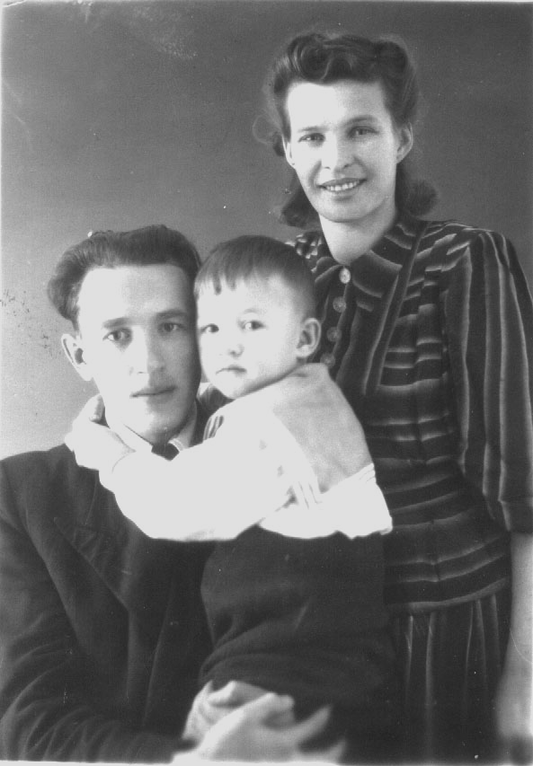

nicht ersetzen. Sie war strikt dagegen; sie wollte nicht, dass die ganze Stadt über uns lacht.

Anfang November fühlte sich Nina unwohl. Ihr war übel, sie fühlte sich schwach und litt an Schwindel. Der Arzt verkündete: "Sie erwarten ein Kind." In der ersten Zeit warf mich diese Nachricht nieder. Ein zweites Kind zu bekommen, obwohl es keine feste Arbeit, kein Geld und keine angemessene Wohnung gab. Es war verrückt. Aber nach außen hin gab ich mein Bestes, um Freude zu zeigen. Ich umarmte und küsste meine Nina. Aber sie weinte, als sie die Sorge in meinen Augen sah. Ich beruhigte sie, indem ich ihr sagte, dass sie es geschafft hätte, Valerik unter noch schwierigeren Bedingungen allein zu gebären und aufzuziehen; wie sollte es uns da zu zweit nicht gelingen, diese Aufgabe zu vollbringen und unseren Romotschka groß zu bekommen.

– Welchen Romotschka denn? – Nina war überrascht.

– Den Romotschka, den Romuald, den du bekommen wirst und den wir gemeinsam aufziehen werden.

– Und wieso hast du entschieden, dass es ein Junge und kein Mädchen wird, Sonja, Sofuschka, zum Beispiel, oder Natascha?

– Sonja wird die nächste. Auf jeden Fall.

Du wirst so lange Kinder gebären, bis Valerik und Romotschka ein Schwesterchen bekommen.

Ich versuchte sie zu beruhigen, aber mir war recht jämmerlich zumute. Es war in der Tat eine verzweifelte Situation. Ich konnte keine feste Arbeit finden, die Wohnung war kalt und feucht, es gab kein Geld für die Miete und auch kein Essen. Ich wurde auch zweimal in die Kommandantur gerufen, weil sie herausfinden wollten, wie ich es "fertiggebracht" hatte, bei meiner Entlassung einen Pass zu bekommen, und warum ich mich Jenisseisk über ein Jahr lang nicht gemeldet hatte.

Ich, Nina und Valerik Ich sagte Nina nichts von diesen Einbestellungen. Immer wieder quälte sie derselbe Gedanke: "Robotschka hat sich selbst geopfert, seine Zukunft, die Möglichkeit, ein Studium zu absolvieren, und das war meine Schuld". In solchen Fällen musste ich sie lange beruhigen, ihr versichern, dass ich ohne sie sowieso nicht leben konnte, ohne sie und Valerik, und mit Mathematik könnte ich mich schließlich auch hier befassen, wenn ich nur erst einen festen Job gefunden hätte.

Meine Beziehung zu Valerik verlief ohne Probleme. Er wuchs als gehorsamer, unabhängiger und ordentlicher Junge auf. Er war nicht unartig und bettelte nie um Geschenke. Nina fragte scherzhaft:

– Von wem hat er dieses Gefühl für innere Würde?

Valerik kannte viele Kinderreime, zählte bis zehn und freute sich, wenn er sein ABC–Buch "lesen" konnte, er malte gerne Bilder aus, aber er machte sein ABC– Buch nicht schmutzig. Abends las ich ihm Bücher vor und erzählte ihm Geschichten. Wenn ich von der Arbeit nach Hause kam, brachte ich ihm und Nina immer ein paar Süßigkeiten mit, meistens "Poduschetschki" (mit Marmelade gefüllte Bonbons; Anm. d. Übers.), und nach dem Abendessen gingen wir drei spazieren und ich ließ ihn mit dem Schlitten fahren, den Tante Tanja irgendwo in den Tiefen ihrer verfallenen Scheune gefunden hatte. Es gab bei ihm nur eine Unzulänglichkeit: e bat nie um Verzeihung. Ich fand seine Hartnäckigkeit irritierend und fragte Nina:

– Ist das auch ein Zeichen von innerer Würde? Ist es so schwer, um Vergebung zu bitten? Wie wird er sein Leben führen, wenn er erwachsen ist? Das wird ihm das Leben sehr schwer machen.

Nina, die Valerik verteidigte, meinte:

– Natürlich sollte man ihm beibringen, sich zu entschuldigen, aber nicht so, wie du es machst, indem du dich entschuldigst, obwohl du dir nichts hast zuschulden kommen lassen. Das ist auch nicht gerade das Richtige.

Ich widersprach nicht, obwohl ich seit meiner Kindheit daran gewöhnt war, um Vergebung zu bitten, ohne das Ausmaß meiner Schuld eruiert zu haben, und ich fand daran nichts auszusetzen.

Diese Meinungsverschiedenheit über eines der Erziehungsprobleme war der Grund, warum ich Valerik einmal den Hintern versohlte, was ich immer noch bereue.

Am nächsten Morgen erzählte Nina lachend, dass sie in der Nacht hatten dummen Traum hatte: Sie wäre einem Stück Wurst hinterhergejagt, das ihr immer wieder entkommen sei. Als sie es schließlich erwischt und zu kauen begonnen hätte, sei sie aufgewacht und hätte festgestellt, dass sie an einer Ecke des Bettbezugs gesaugt hätte.

Nachdem ich mit ihr und Valerik über diesen symbolischen Traum gelacht hatte, bat ich Iwan Sergejewitsch um die Mittagszeit, eine Wurst vom Buffet des Bezirkskomitees zu kaufen, und brachte sie Nina sofort, ohne bis zum Ende des Arbeitstages zu warten. Aber sie wollte die Wurst nicht essen, bevor ich von der Arbeit kam. Sie gab Valerik nur zwei Scheiben. Als sie am Abend mit der Zubereitung des Abendessens begann, bemerkte sie, dass die Wurst verschwunden war. Es stellte sich heraus, dass Valerik sie genommen und sie seinen Freunden auf der Straße servierte hatte. Diese letzte Tatsache verärgerte Nina besonders:

– Hätte er sie wenigstens selbst gegessen, aber er hat sie verschenkt, ohne an seine Mutter zu denken! – erklärte sie mir besorgt die Situation.

– Vielleicht ist es gut so, er wird ein guter Junge", versuchte ich sie zu beruhigen, aber ich war mir da nicht so sicher. – Wir müssen ihn nur davon überzeugen, dass es nicht gut ist, so etwas zu tun.

– Freundlich zu sein auf Kosten anderer?! – rief sie weder fragend noch überzeugt aus. – Gut, du bist der Pädagoge, und ich gehe los und hole ihn.

Valerik kam herein, glücklich und mit roten Wangen, und fing an Nina etwas zu erzählen. Sie nahm ihm leise Mantel und Hut ab und ging mit den Worten "Übertreibe es nicht" in die Küche.

Wenn ich eine erzieherische Aktion vorhatte, schloss ich immer erst einmal die Tür.

– Valerik! Wie konntest du nur? Immerhin habe ich diese Wurst Mama gekauft. Sie wollte sie so gern haben, – begann ich.

– Ich auch, – widersprach Valerik.

– Aber Mama ist krank, sie braucht die Wurst", versuchte ich meinem dreijährigen Sohn die Situation zu erklären.

– Ist Wurst denn etwa – Medizin?

– Nein, keine Medizin, aber Mama muss sie essen.

– Ich auch.

– Und? Hast du das ganze Stück gegessen?

– Nein, ich habe meine Freunde auch probieren lassen.

– Aber das war Mamas Wurst. Wenn es deine gewesen wäre, hättest du sie essen oder deinen Freunden schenken können. Das ist nicht nett, und du musst deine Mutter bitten, dir zu verzeihen. Du bist ein großer und kluger Junge, also geh und bitte deine Mutter um Vergebung.

Er war still und starrte auf den Boden. Ich begann ihm zu erklären, dass ein Mensch, der einen Fehler macht und jemanden verletzt, sich bei ihm entschuldigt. Ich führte Beispiele aus Märchen an, aber es waren erstaunlich wenige. Zum Abschluss des Gesprächs sagte ich:

– Du wirst zu Mami gehen und sagen: 'Mami, es tut mir leid, ich werde es nicht wieder tun', okay?

Er schwieg, ohne den Blick vom Boden abzuwenden.

Seine Sturheit, seine mangelnde Bereitschaft, Schuld einzugestehen und um Vergebung zu bitten, machte mich wütend. Um Strenge zu zeigen, gab ich ihm ein paar Mal einen Klaps auf das Hinterteil. Er weinte, hoffentlich nicht vor Schmerz, denn er hatte eine warme Hose an, sondern aus Unmut. Nina hörte ihn weinen. Sie kam herein. Schweigend zog sie Valerik an und schickte ihn hinaus, wobei sie mir vorwarf, ihn nicht zu lieben und ihn wie einen Fremden zu behandeln. Wir stritten uns, zum ersten Mal seit der Ankunft in Jenisseisk. Frustriert ging ich auf die Straße, stapfte mit meinen zerschlissenen Stiefeln durch den nassen Schnee und ging in Richtung Zentrum, während ich über die Irrigkeiten meiner Erziehung nachdachte.

Es wurde dunkel, und Jenisseisk versank in einen tiefen Schlummer. Das fahle Mondlicht durchflutete die Umgebung. Nachdem ich zwei Blocks gelaufen war, blieb ich schließlich vor einem Gebäude stehen, das mich schon lange fasziniert hatte. Es war ein rotes Backsteingebäude mit hohen Fenstern, wie die einer katholischen Kirche, und es überragte die baufälligen grauen Hütten, die sich an das Gebäude anschlossen. Obwohl ein Teil des Daches abgerissen war und die Fensterrahmen und die Tür erbarmungslos herausgebrochen waren, konnte ich mir gut vorstellen, wie das Gebäude früher ausgesehen hatte. Ein spitzes Dach, farbige Glasfenster, eine massive Eingangstür mit einem großen Bronzegriff, ein hohes Vordach aus Eisenguss.

Welche Macht und welcher Hass trieben die Menschen an, die dieses Gebäude so zerstörten und es dennoch nicht schafften, es vollständig zu vernichten? Es hatte etwas Geheimnisvolles an sich. In den schimmernden Glasscherben spiegelten sich die Reflexe eines rätselhaften vergangenen Lebens wider. Es war nicht das erste Mal, dass mir solche Häuser begegneten: das Asejew–Haus in Tambow, das Hotel in Tscherdyn, das Haus des Kaufmanns Gadalow in der Pariskaya Kommuna Straße (Straße der Pariser Kommune; Anm. d. Übers.) in Krasnojarsk. Und sie haben mir immer das Herz vor Schmerz schwer gemacht.

Ich konnte mich nicht erinnern, wie lange ich vor dem geheimnisvollen Haus gestanden hatte und mir den vernachlässigten Park, den Rosenstock und die graue Nachtigall aus meinem Lieblingsmärchen von Oscar Wilde vorgestellt hatte. Ich wachte erst auf, als ich Nina und Valerik neben mir fand. Er umarmte meine Beine und flüsterte:

– Lass uns nach Hause gehen, Daddy, sei nicht böse.

Ich war nicht wütend, meine Seele hatte sich beruhigt und war bereit für Versöhnung und Liebe.

Der November kam. Kaum waren die Plakate und Losungen zur Begrüßung der Teilnehmer des 19. Kongresses verblasst, begannen die Vorbereitungen für die Feierlichkeiten im November. Die roten Tücher wurden gewaschen und gebügelt, und es wurden neue Losungen, Appelle und Grüße darauf geschrieben, deren Inhalt von den höchsten Parteiorganen speziell genehmigt und in der "Prawda" veröffentlicht wurde.

Die Feiertage verliefen wie üblich mit Kundgebungen, Demonstrationen und Festgelagen. Nina, die alle revolutionären Feiertage verehrte und feierte, bereitete auch ein festliches Essen mit Borschtsch und Bratkartoffeln vor und versuchte sogar, mich zu einem Glas Wein zu überreden. Aber ich hatte keine Zeit für Festivitäten. Es gab kein Geld, die Zeit für die Arbeit im Büro wurde immer kürzer, Maschukow schwieg, obwohl ich wusste, dass die freien Stellen für Buchhalter und Rechnungsführer im Trust erst in den letzten Tagen besetzt wurden. Außerdem stand der Winter vor der Tür, und ich war praktisch ohne Kleidung, und Valerik brauchte einen neuen Mantel und neue Stiefel. Unter diesen Umständen verdross mich Ninas festliche Stimmung. Durch das Lager zu gehen, so viel zu sehen und nichts zu verstehen. Und dann war da noch das Radio, das von morgens bis abends vom glücklichen Leben des sowjetischen Volkes erzählte. Ich war kurz vor dem Zusammenbruch.

Trotzdem aß ich den Borschtsch und die Kartoffeln, zumal Nina sie perfekt zubereitet hatte, aber den Wein lehnte ich ab:

– Ich werde deine Partei und Komsomol–Feiertage nicht feiern", sagte ich leise und mit zusammengebissenen Zähnen.

Ich sagte es, und dann besann ich mich plötzlich. Was für ein kindisches Verhalten, was für ein Mangel an Beherrschung! Warum hatte ich Nina beleidigt? Warum hatte ich gesagt: "Das sind deine"? Doch es war zu spät. Nina, die mir sonst in allen anderen Fragen zustimmte, war jetzt entrüstet:

– Es ist überhaupt kein Komsomol–Feiertag, sondern ein nationaler, d. h. es ist auch deiner. Mein Vater kämpfte in der Tschapajew–Abteilung und starb dann einundvierzig an der Front. Wie kann ich diesen Feiertag also nicht feiern? – und nach einem kurzen Schweigen fügte sie mit Tränen in der Stimme hinzu:

– Und überhaupt, was hat der Komsomol dir getan, und warum hasst du mich so sehr?

Ich wusste, dass ich mit Nina nicht über dieses Thema sprechen durfte, vor allem nicht in ihrem derzeitigen Zustand. Ich musste die Situation in Ordnung bringen. Aber ich konnte meine Meinung nicht völlig ändern, und ich konnte nicht zugeben, dass ich etwas Dummes gesagt hatte:

– Ninok, Schatz, warum dachtest du, ich würde dich hassen, was hat das mit dem Komsomol zu tun? – Ich begann, mich zu entschuldigen. Und dann, bevor sie antworten konnte, fügte ich hinzu:

– Und ich wollte auch deinen Vater nicht beleidigen. Du weißt doch, dass ich den Tag des Sieges natürlich immer so gut es geht feiere. Man muss nicht notgedrungen Wodka bei der Gelegenheit trinken, – entschuldigte ich mich etwas unbeholfen.

Doch Nina ignorierte meinen Versuch, das Gespräch auf ihren Vater zu lenken:

– Was soll das heißen, es gibt keinen Zusammenhang? Du weißt doch, dass mein ganzes Leben mit dem Komsomol verbunden, ihm gewidmet war.

– Aber, Ninotschka, meine Liebe, sieh nur, was sie dir angetan haben. Hast du denn gar nichts begriffen? – Ich konnte es nicht ertragen.

– Was soll ich denn verstehen? Ich liebte meine Arbeit, ich liebte die Menschen, ich wollte, dass ihr Leben mehr Freude und Sinn hat. Und die Tatsache, dass ich zur Sekretärin des Komsomol gewählt, dass ich in die Partei aufgenommen wurde, bin ich daran schuld? Hätte sich Malych nicht als so ein Schurke erwiesen, wäre alles anders gekommen.

– Dann wären wir uns nicht begegnet", sagte ich, um einen Witz zu machen, und versuchte, sie zu küssen. Aber sie wandte ihr tränennasses Gesicht ab und sagte:

– "Robotschka! Robotschka! Kränke 'uns' nicht!

Ich schaute auf das mir so lieb gewordene Gesicht, das schon pränatale Flecken hatte, und dachte: "Es wird ein Junge".

Am Abend, als ich bereits im Bett lag, dachte ich immer wieder an unser Gespräch. Wie unterschiedlich waren unsere Einstellungen zum Leben, unsere Wahrnehmungen dessen, was vor sich ging. Nina war entweder nicht bereit oder nicht in der Lage, das, was ihr persönlich widerfahren war, mit den Geschehnissen im Land in Verbindung zu bringen. Für sie blieben Begriffe wie der Komsomol, die Partei, die Revolution, der Führer heilig. Ihr Verhältnis zu ihnen glich dem einer Tochter zu ihrer Mutter, die ihr zwar vertraut war, die sie liebte, von der sie jedoch schwer und unverdient gekränkt worden war. Ich verstand sie, aber ich konnte diese Haltung nicht akzeptieren. Dieses Missverhältnis verkomplizierte unsere Beziehung, und die Streitereien waren schmerzhaft und sinnlos. Wir verstanden uns offensichtlich nicht und setzten unseren nun schweigenden Streit noch lange in der Dunkelheit der Nacht fort.

Zwei Tage vergingen. Ich ging die Leninstraße hinunter, die nach den Feiertagen immer noch nicht aufgeräumt war. Ich ging zur Arbeit. Plakate, Losungen, Porträts von Führern an den Gebäuden. In den Schaufenstern stehen zwei Zahlen: 19 und 35, sowie, für das Auge noch ungewohnt, die Abkürzung "KPdSU". Gesäumt von Dosen, Zigaretten– und Streichholzschachteln und sogar Süßigkeiten symbolisierten sie den 19. Parteitag und den 35. Jahrestag der Großen Oktoberrevolution. Die Stimmung war schlecht. Zu den zahlreichen und fast unlösbaren häuslichen Problemen gesellte sich nun der Gedanke an die Ursachen und möglichen Folgen meines Streits mit Nina. Oberflächlich betrachtet hatten wir uns versöhnt, aber tief im Inneren hatte jeder von uns seine eigene Meinung, und das Feuer konnte jederzeit wegen jeder Kleinigkeit wieder auflodern. Ich wusste nicht, wie es ausgehen würde. Meine Gedanken eilten hilflos umher und suchten nach einer Lösung für die Probleme, die auf mich zukamen, aber ich konnte sie nicht finden. Das Leben schien hoffnungslos, wie ein Tunnel, aus dem es keinen Ausweg gab.

Doch an diesem Tag erwartete mich eine angenehme Überraschung: Maschukow bot mir die Stelle des stellvertretenden Hauptbuchhalters des Trusts an. Das kam völlig unerwartet. Ich, ein ehemaliger Sträfling, der keine offiziellen Dokumente besaß, die meine Berufsausbildung bestätigten, nicht einmal einen Ausweis, wurde in eine derart hohe Position bestellt. Aber würde die Kommandantur etwas dagegen haben? Das war ein sehr wichtiger Punkt. Ohne die Zustimmung und Genehmigung des Kommandanten konnte niemand in eine verantwortungsvolle Position berufen werden. Meine Freude könnte also verfrüht gewesen sein. Aber Maschukow beruhigte mich, indem er sagte, dass die Entscheidung von Wstowsky, dem Leiter des Trusts, getroffen worden war, einem sehr erfahrenen und in der Region bekannten Partei– und Wirtschaftsmann, der einen solchen Beschluss nicht fassen konnte, ohne sie mit den notwendigen Instanzen abzustimmen.

Natürlich habe ich zugestimmt. Innerhalb einer Stunde war der Befehl für meine Ernennung unterzeichnet und ich konnte meinen Dienst antreten. Maschukow erläuterte den Aufgabenbereich der Gruppe:

– Sie haben sehr überzeugend dargelegt, wie man eine ökonomische Berechnung in der Holzwirtschaft organisieren kann. Ihre Ideen haben mir gefallen. Versuchen Sie, sie jetzt umzusetzen. Darüber hinaus müssen Sie die Quartals– und Jahresberichte der Holzunternehmen entgegennehmen und analysieren und einen konsolidierten Bericht erstellen.

Ich war glücklich. Ein besseres Angebot hätte ich kaum erwarten können. Die wirtschaftliche Rechnungsführung in der Forstwirtschaft war eines meiner Lieblingsthemen. Ich hatte Jerschow geholfen, seine Doktorarbeit darüber zu schreiben, als ich noch in Kuschmangort war. Ich habe die letzten zwei Jahre in der zusammenfassend–analytischen Abteilung des UsolLag des Innenministeriums verbracht. Dieses Werk war mir gut bekannt.

Ich war hocherfreut über meinen Erfolg und eilte noch vor Ende des Tages nach Hause. Nina nahm die Nachricht gelassen auf:

– Ich habe immer gewusst, dass dein Wissen und deine Fähigkeit zu arbeiten geschätzt werden.

Zuerst wollte ich sogar beleidigt sein, aber dann wurde mir klar, dass meine Freude das Ergebnis der Lösung von Problemen war, die unlösbar erschienen waren. Nina, die von meiner Autorität in Kuschmangort verwöhnt war, dachte, dass ich auch hier in Jenisseisk einen Job haben würde. Sie interessierte sich nun für das Gehalt. Aber ich war zu schüchtern gewesen, Maschukow danach zu fragen:

– Wir werden es herausfinden", sagte ich zweifelnd.

Mitte Januar 1953 wurde in Presse und Rundfunk von einer "terroristischen Ärztegruppe" gesprochen. Fünfzehn prominente Ärzte wurden beschuldigt, ihre hohe Stellung im Kreml ausgenutzt zu haben, um 1948 Schdanow zu töten und Anschläge auf das Leben anderer wichtiger politischer und militärischer Persönlichkeiten des Landes zu verüben.

Die Menschen waren bereits an solche Nachrichten gewöhnt. In den letzten Jahren gab es einen aktiven Kampf gegen den Kosmopolitismus, und die Zeitungen berichteten immer wieder über die neuesten Enthüllungen und Prozesse. Dort drückten die Leser ihre Empörung, ihre Wut über die Aktionen der obdachlosen Kosmopoliten aus, aber sie verwendeten dafür abstrakte, klischeehafte Formulierungen.

Es war eiskalt und windig. Auf der Promenade des zentralen Platzes befanden sich zehn Personen. Unter ihnen, den weißen Kitteln nach zu urteilen, mehrere Ärzte. Um sie herum eine Menschenmenge mit Transparenten. Arbeiter aus den wenigen Unternehmen der Stadt, Angestellte, Schüler. Einige von ihnen waren aus Patriotismus hierhergekommen, andere, wie ich, aus Zwang.

Am Mikrofon sitzt eine junge Frau mit einer Brille. Sie liest von einem Zettel ab und schreit etwas Wütendes über die "Auftragsmörder". Bei jedem Wort kommt eine Dampfwolke aus ihrem Mund und sie wischt immer wieder über die beschlagenen Brillengläser. "Glocken" keucht sie verschnupft. Die Worte sind schwer zu verstehen. Aber ihre allgemeine Bedeutung ist klar:

– Tod den Mördern, die den heiligen Namen des Arztes entehren! – forderte die Rednerin.

Es war beängstigend. Besonders bedrückend war, dass die Ärzte von Ärzten gebrandmarkt wurden, ohne etwas zu wissen, ohne etwas zu verstehen, mit fremden Worten, angestiftet von kriminellen Politikern. Und mit was für Ausdrücken, mit was für Worten! Ich schloss meine Augen und stellte mir eine mit Speichel sabbernde, fluchende Verkäuferin vor.

In der zweiten Dekade des Januar 1953 kamen die leitenden Buchhalter der Holzfirmen. Ich ließ mich im Büro von Maschukow nieder, wo ich die Jahresberichte erhielt. Ihre schlechte Qualität verblüffte mich. Die Daten in den Berichtsformularen stimmten weder mit den Bilanzzahlen noch untereinander überein. In den Erläuterungen wurden die Probleme nicht erläutert. In einigen Fällen konnten die Buchhalter die Gründe für die Unstimmigkeiten nicht erklären und hatten die Fehler nicht korrigiert. Sie versuchten, einen Zugang zu mir zu finden, und luden mich in ein Restaurant ein. Aber ich weigerte mit strikt. Maschukow berichtete mir später, dass sie eines Abends mit ihm gesprochen hätten und empört gewesen seien:

– Wie um alles in der Welt haben Sie es geschafft, einen Buchhalter zu finden, der nicht trinkt?

Aber es wurde bald besser: Ich blieb die ganze Nacht auf, um die Berichte zu korrigieren, während die Buchhalter zum Essen ausgingen. Diese Aufgabenteilung kam ihnen sehr entgegen. Nach Beendigung der Arbeiten schenkten sie Nina und mir auf Anraten von Maschukow ein breites Doppelbett mit einem damals modischen Panzernetz. Nach und nach entstanden, wenn nicht Freunde, so doch gute Bekannte, die bereit waren, in Zeiten der Not zu helfen. Ich entwickelte eine besondere Beziehung zu Maschukow. Ein großes, knochiges, pockennarbiges Gesicht, geizig mit Worten und oft sogar unhöflich, schrieb er Gedichte für Kinder, kurz und zärtlich. Sie wurden gelegentlich in der Zeitung "Jenisseisker Prawda" veröffentlicht. Natürlich hatten er und ich eine Menge zu besprechen, und zwar nicht nur in Bezug auf Buchhaltungsfragen. Gelegentlich besuchten wir die Kulakows, meist in den Ferien.

Alles schien sich für mich zum Besten zu entwickeln. Ich begann sogar, meinen Lagerhintergrund und meine Nationalität zu vergessen. Ich begann, mich als gleichwertig mit den Menschen um mich herum zu betrachten. Plötzlich brach über Nacht alles zusammen. Am 28. Januar 1953 wurde ich in die Kommandantur vorgeladen und mir wurde gegen Quittung mitgeteilt, dass ich von nun an als Person deutscher Staatsangehörigkeit zur ständigen Ansiedlung in Jenisseisk verpflichtet wäre und mich zweimal im Monat in der Kommandantur zu melden hätte.

Obwohl Koljagin mich schon in Turuchansk vor dieser Möglichkeit gewarnt hatte, kam die Nachricht unerwartet. Bis dahin hatte ich gehofft, dass ich meinen Pass zurückbekommen würde. Die Passbeamtin in Solikamsk hatte mir gesagt, dass ich nicht der festen Anbindung an einen Ort unterläge. Sie muss eine entsprechende Anweisung gehabt haben. Warum also galt diese Anweisung hier in Jenisseisk nicht? Und es blieben weniger als anderthalb Jahre bis zum Ende von Ninas Exil, an dessen Ende wir an einen wärmeren Ort hätten gehen können. Nun sollten unsere Pläne nicht erfüllt werden. Und was würde ich jetzt zu Nina sagen. Sie war bereits im fünften Monat schwanger, und die Ärzte hatten sie gebeten, jeglichen Stress zu meiden.

Ich ging hinaus. Wie beim letzten Mal, als Nina und ich das Büro des Kommandanten aufgesucht hatten, knarrte die Tür mit ihrer festen Feder zu. Aber draußen war es nicht mehr Herbst, sondern es herrschte Winter, den ich am meisten hasste. Der Frost war in den Vierzigern. Der graupenartige Schnee knirschte unter meinen Füßen. Die kahlen Bäume, die in der Kälte so erbärmlich aussehen, knistern leicht im Frost. Gebeugte, unförmige Gestalten in ihrer Winterkleidung tauchen auf und verschwinden wieder im Dunst der Winterkälte. Und nur er, majestätisch in seinem weißen Marmorfleisch, grinst mich, wie vor vier Monaten, unter seinem schneebedeckten Schnurrbart an.

– Zur ewigen Ansiedlung", ärgerte ich mich in Gedanken, da wäre es doch besser, mich in die Verbannung zu schicken. Zumindest gibt es dort eine zeitliche Begrenzung. Aber hier heißt es "für immer", und was für Worte das sind. Ich frage mich, ob er sich wohl für ewig hält, – dachte ich und betrachtete die Gestalt des Führers.

Ich war in einer schrecklichen Stimmung, schlimmer als vor vier Monaten, als Nina und ich das Haus verlassen hatten. Damals bestand jedoch die Hoffnung, dass ich meinen Pass zurückbekommen würde. Nun war diese Hoffnung dahin. Petja hatte Recht gehabt. Wir würden uns kaum wiedersehen. Meine Seele brannte vor Groll, und ich konnte die Kälte nicht spüren.

– Und warum sind meine Vorfahren nach Russland gekommen, was haben sie sich erhofft, warum sind sie während der Revolution nicht nach Deutschland zurückgekehrt oder nach Amerika gegangen, und wie habe ich es geschafft, als Deutscher geboren zu werden? – Ich kochte weiter. – Aber warum sind sie nicht in Deutschland sitzengeblieben, sondern aus irgendeinem Grund in den Osten gegangen?

Schon vor dem Krieg, als ich zahlreiche Fragebögen ausfüllte, stockte ich, sobald es nötig war, das Wort "Deutscher" zu schreiben. In der Folgezeit vervielfachten sich die Schuldgefühle wegen des Handelns meiner Landsleute und verfolgten mich viele Jahre lang. Aber ich konnte und wollte meine deutschen Wurzeln nicht aufgeben. Ich liebte meine Eltern, meine Schwestern, meine Verwandten, ich liebte die deutsche Sprache, ich las deutsche Bücher, ich genoss die Gedichte von Goethe, Schiller und Heine. Außerdem träumte ich davon, Nina und meine Kinder Deutsch sprechen und lesen zu lehren, und ich war verletzt, als Nina mich in einem Brief an Olga Fedotowna als Pole vorstellte. Obwohl ich verstand, dass sie in Otradowka mit der Bemerkung verurteilt worden war: "Nina hat einen Deutschen geheiratet", gefiel mir nicht, was sie getan hatte.

– Nun, sie haben die Deutschen vertrieben, das ist noch verständlich: Sie hatten Angst, wenn auch vergeblich, vor Verrat, rächten sich an den Gräueltaten der Nazis gegenüber unserem Land. Und im Allgemeinen sind für Russland Ausländer, selbst wenn sie von der obersten Macht eingeladen wurden, immer Fremde geblieben, die Russland nur Schaden zufügen. Aber warum wurden die Tataren, Kalmücken, Inguschen und Tschetschenen vertrieben? Sie lebten auf dem Land ihrer Vorfahren – entrüstet ich mich weiter.

In jenen Jahren war es in unserem Land noch gefährlicher, eine unpassende Nationalität zu haben, als eine unpassende Ideologie zu teilen. Die in jenen Jahren übliche Praxis, dass Kinder ihre politisch verurteilten Eltern verleugneten, um sich selbst zu retten, half im Falle einer Abschiebung aus Gründen der Staatsangehörigkeit nicht weiter. Wer als Deutscher, Tataren, Kalmücke oder Tschetschene geboren wurde, musste auf unbestimmte Zeit in dem ihm zugewiesenen Reservat leben.

Ich verstand die Sinnlosigkeit und Gefahr solcher Gedanken und konzentrierte mich auf die Folgen des Geschehenen. Zunächst einmal hätte ich Nina die Wahrheit sagen und ihr erklären sollen, dass sie nichts damit zu tun hatte und dass meine "Umsiedlung" überall hätte stattfinden können, auch im europäischen Teil Russlands. Es war unklar, in welche Region Sibiriens ich deportiert worden wäre oder ob wir uns hätten vereinigen können. Das Wichtigste war, dass sie sich nicht schuldig fühlen sollte.

Aber die Dinge entwickelten sich nicht so, wie ich es geplant hatte. Kaum hatte ich mich ausgezogen, fragte Nina, die offenbar durch meinen Gesichtsausdruck alarmiert war:

– Was ist los, warum machst du so ein saures Gesicht?

Ich war nicht bereit, ein schwieriges Gespräch zu beginnen, also versicherte ich ihr, dass alles in Ordnung sei und dass mein Gesicht wahrscheinlich vom Frost säuerlich aussehe.

Aber es war unmöglich, Ninas Fragen so einfach loszuwerden. Sie strömten heraus wie aus einem Füllhorn, und ich war völlig verwirrt und gezwungen zu beichten, was geschehen war. Der halb scherzhafte Ton, mit dem ich ihr erzählte, dass ich als Deutscher in der Sonderansiedlung gemeldet war, machte die Sache nur noch schlimmer.

– Siehst du, ich hatte Recht, du hättest in Tambow bleiben, dich an der Graduiertenschule einschreiben und dein Schicksal in die Hand nehmen sollen, ohne auf uns zurückzublicken.

Ich wollte sagen, dass sie solche Vorschläge nie gemacht hatte, dass sogar Petja sie nie in dieser Form ausgesprochen hatte, aber stattdessen sagte ich den Satz, den ich im Voraus vorbereitet hatte:

– Wie kannst du nur nicht begreifen, dass meine "Sonderansiedlung" überall hätte stattfinden können, auch im europäischen Teil Russlands. Man weiß nicht, in welchen Teil Sibiriens ich deportiert worden wäre, oder ob wir wieder zueinander gefunden hätten.

– Bist du deshalb zu uns gekommen? Und wenn du dir nicht sicher warst, wärst du in deinem Tambow geblieben, oder? – fuhr Nina fort.

Die Dinge liefen nicht so, wie ich es geplant hatte, und hätten wahrscheinlich in Tränen geendet. Ich musste dringend die Richtung des Gesprächs ändern.

– Rede keine Dummheiten. Wie hätte ich wissen können, was sich unser Staat noch alles einfallen lassen und wohin er seine Russlanddeutschen schicken würde. Sie haben ja sogar früher als die anderen Völkern Russlands damit begonnen, Kommunen und Kolchosen zu organisieren. In der Tat waren es nicht die Deutschen, die die Idee einer sozialistischen Gesellschaft entwickelten. Und nun rächt sich der Staat, nachdem er die Hitlerhorden besiegt und die DDR geschaffen hat, an seinen eigenen unschuldigen Deutschen im eigenen Land. Sogar dir ist es peinlich, dass ich Deutscher bin, nicht wahr, gibst du es zu?

Nina schwieg einige Minuten und versuchte, all diese Verwirrung zu verdauen, dann sagte sie traurig:

– Robotschka, wenn du wüsstest, wie sehr ich dich liebe, würdest du nie so dumme Dinge sagen.

– Aber gib es zu: Wären deine Gefühle tiefer, stärker, wenn ich Russe wäre?

Nachdem sie darüber nachgedacht hatte, sagte Nina zweifelnd:

– Wahrscheinlich hast du recht, obwohl ich mir kaum vorstellen kann, dass meine Gefühle für sie stärker und tiefer sind als die, die ich für dich empfinde. Würdest du wollen, dass ich Deutsche wäre? – Nina beantwortete Frage um Frage.

Jetzt war ich an der Reihe zu denken. Unser Gespräch hatte uns in einen zu tiefen und gefährlichen Bereich der menschlichen Beziehungen geführt.

– Weißt du, wenn es um das Bett geht, ist mir deine Nationalität wahrscheinlich ziemlich egal. Außerdem glaube ich nicht, dass ich wollen würde, dass du Deutsche bist. Aber wenn ich an Kinder denke, an die Familie, dann muss ich zugeben: ich möchte, dass ihr Deutsche seid, dass ihr so denkt wie ich, dass wir die gleichen Gewohnheiten und Wünsche haben.

– Was sollen wir tun, schließlich kann ich keine Deutsche werden", unterbrach Nina meinen Monolog mit einem Schauer in der Stimme. – Das kannst du, aber es ist sehr schwierig. Man muss zumindest ein wenig Deutsch lernen, es als Kommunikationsmittel in der Familie akzeptieren, lernen, deutsches Essen zu kochen und sich an deutsche Bräuche gewöhnen. Katharina die Große hat das auch einmal erlebt. Aber für sie war es einfacher: Erstens war das Ziel groß, und zweitens war das Umfeld angemessen.

Das müssen wir nicht. Die Russlanddeutschen sind jetzt ohnehin zur völligen Assimilation verdammt. Das Einzige, worum ich dich bitte, ist, dass du dich nicht in meinen Deutschunterricht für Valerik einmischst, dass du mir nicht sagst, dass dich diese Sprache nach allem, was du durchgemacht hast, anwidert.

– Übrigens, vor dem Krieg mochte ich Deutsch in der Schule, und ich hatte nur Einsen darin, du kannst mein Zeugnis sehen", platzte sie heraus und ging in die Küche.

Es tat mir sehr leid, dass unser Gespräch diese Wendung genommen hatte, aber ich konnte es nicht verhindern. Es war zu schmerzhaft für mich, was geschehen war. Nina ging ein paar Tage lang grübelnd umher und begann sich zu fragen, welche deutschen Gerichte in unserer Familie gekocht wurden, und vor allem, wie sie gekocht wurden. Wie Sie verstehen werden, war es für mich nicht leicht, den zweiten Teil der Frage zu beantworten, und außerdem war ich mit Ninas Borschtsch ganz zufrieden. Später, während unseres Aufenthalts bei Ernotschka, lernte sie, einige deutsche Gerichte zu kochen, die sich aber in der Familie nie durchsetzten.

Anfang März kam im Radio die Nachricht von Stalins Erkrankung. Die Art der Nachricht ließ das Schlimmste vermuten. Nina war davon erschüttert. Sie verfiel in Verzweiflung und weinte leise. Ich redete auf sie ihn, versuchte ihr gut zuzureden, ärgerte mich. Aber sie sagte immer wieder:

– "Wenigstens hast du überlebt, wenigstens hast du überlebt!

Ich erinnere mich bis heute noch gut an diesen Tag, den 6. März 1953. Der Frost hatte etwas nachgelassen, die Schneeflocken fielen langsam vom Himmel. Wir gingen die Lenin–Straße entlang in Richtung der Kommandantur. Ninas Gesicht war abgemagert, ihr Gesicht zeigte die in der Schwangerschaft häufigen Pigmentflecken, ihr Bauch war deutlich sichtbar. Trauermusik ertönte aus an Masten befestigten "Glocken". Plötzlich, nach einigen Augenblicken der Stille, kam eine dringende Nachricht:

– Achtung, Achtung, hier spricht Moskau. Alle Radiosender der Sowjetunion sind in Betrieb. Das Zentralkomitee der Kommunistischen Partei der Sowjetunion und der Ministerrat der UdSSR geben in tiefer Trauer bekannt, dass Josef Wissarionowitsch Stalin am 5. März um 21.50 Uhr nach langer, schwerer Krankheit verstorben ist. Das Herz eines Mitarbeiters und brillanten Nachfolgers von Lenin, des weisen Führers und Lehrers der Kommunistischen Partei und des sowjetischen Volkes, hat aufgehört zu schlagen.

Lewitan las die offizielle Nachricht mit trauriger Stimme lange vor, und Nina, die meine Hand ergriff und sich dicht an mich kuschelte, flüsterte:

– Was wird jetzt passieren, wie werden wir jetzt leben?

Ich sah mich auf der Straße um, verlegen über ihr Verhalten. Nina war mit ihrem Kummer nicht allein. Hier und da konnte ich die Silhouetten von Menschen sehen, die wie in Trance erstarrt waren. Einige weinten hysterisch, andere waren angespannt still. Langsam näherten sich alle dem schneebedeckten weißen Marmordenkmal des Führers.

Nur mit Mühe konnte ich Nina nach Hause bringen. Meine Seele war ganz durcheinander. Verwirrung, Triumph, Scham über den Triumph und Sorge um Nina. Und sie bemerkte etwas in meinem Blick und platzte plötzlich heraus:

– Was, du bist glücklich?! – und brach in Tränen aus.

Stalin bedeutete ihr immer noch zu viel. In ihrer Seele tobte ein Sturm der Gefühle. Und ich hatte in diesen Gemütsbewegungen keinen Platz. In diesem Moment war ich ein "Fremder" für sie, ein freundlicher, liebevoller, aber dennoch ein "Fremder", ein "Deutscher".

Alles brodelte in mir. Von Trauer um den toten Anführer war keine Spur zu sehen. Ich hasste ihn und alles, wofür er stand. Und je mehr Nina litt, desto mehr wurde ich wütend. Worte, die Nina und alle ihre Komsomolzen und Parteivorbilder beleidigten, kamen mir über die Lippen. Aber ich hielt mich zurück und schwieg. Darüber war ich froh. Allmählich beruhigte sich Nina und wurde ruhiger. Ihr Drang zur Versöhnung war ebenso emotional wie der Wutausbruch, der mich gerade heimgesucht hatte.

In diesen Tagen war es nicht nur für diejenigen schwierig, die den Führer verehrten. Für diejenigen, die ihn hassten, war es nicht einfacher. Schließlich mussten sie ihre Gefühle verbergen und so tun, als wären sie schockiert über das Leid, das das Land und sie persönlich getroffen hatte. Ich musste mich nicht nur bei der Arbeit und auf der Straße verstellen, sondern auch zu Hause, und das war besonders schwierig.

In der Zwischenzeit spielten sich in Moskau geheimnisvolle und für Normalsterbliche unverständliche Vorgänge ab. Die Personen an der Spitze des Staates wechselten: Malenkow, der nach Stalins Tod die Macht in Partei und Staat gefestigt hatte, teilte sie mit Chruschtschow, der Sekretär des Zentralkomitees geworden war. Stalins Sekretariat wurde aufgelöst, und am 27. März folgte eine Amnestie für Gefangene, die nicht mehr als fünf Jahre abgesessen hatten. Es versteht sich von selbst, dass es sich dabei hauptsächlich um Kriminelle und nur in geringem Maße um politische Gefangene handelte. Schließlich wurden die meisten von ihnen zu Haftstrafen zwischen zehn und fünfundzwanzig Jahren verurteilt.

Am 4. April 1953 verkündete die Prawda, dass die "Arztmörder" Opfer einer Provokation gewesen seien und dass ihre "Geständnisse" in Wirklichkeit durch die Anwendung "unzulässiger und nach den sowjetischen Ermittlungsgesetzen streng verbotener Mittel" erlangt worden seien. Die Ereignisse wurden durch einen Erlass des Zentralkomitees der KPdSU "Über die Verletzung der Legalität durch die Sicherheitsorgane" noch weiter publik gemacht. Sie erklärte, dass der Fall der "mörderischen Ärzte" kein Einzelfall sei, dass die Staatssicherheitsdienste durch die Aneignung exorbitanter Rechte Gesetzlosigkeiten begangen hätten und dass die Partei durch die offene Bloßstellung dieser Methoden diese ablehne und die Allmacht der politischen Polizei verurteile.

All diese erstaunlichen Entwicklungen waren ermutigend. Überraschend war jedoch, dass der Kampf um die Wiederherstellung der "sozialistischen Legalität" von Beria selbst geführt wurde, der sich nach Stalins Tod auf mysteriöse Weise in den "Chef–Liberalen" des Landes verwandelte.

In der Zwischenzeit hielt der Frühling Einzug in Jenisseisk. Der Schnee schmolz schnell und legte Schlamm und Geröll frei. Das Eis auf dem Jenissei begann sich zu bewegen. Stromabwärts von Jenisseisk, in der Nähe des Dorfes Podtjossowo, bildete sich ein Stau, der dem Jenissei den Zufluss zum Meer hin versperrte. Der Wasserstand begann schnell zu steigen. Die Mjelnitschnaja, die in den Jenissei mündete, trat über die Ufer und überflutete die Stadt von hinten. Das Wasser kam aus den Gemüsegärten zu unserem Haus. Auch ein Teil der Babkin–Straße wurde überflutet. Unternehmungslustige Jungen bauten Flöße und transportierten die vom Zentrum abgeschnittenen Städter gegen ein geringes Entgelt. In der Stadt brach Panik aus, vor allem in den unteren Stadtteilen. Man erinnerte sich an das Jahr 39, als sogar Boote die Lenin–Straße hinunterfuhren. Einige zogen, ohne die Überschwemmung abzuwarten, zu Verwandten und Bekannten in den höher gelegenen Teil der Stadt.

Am nächsten Morgen, als die Situation kritisch wurde, waren dumpfe Explosionen zu hören. Man sprengte einen Eis–Stau. Das Eis war in Bewegung. Es Eis brach und bröckelte, während es sich übereinander schob. Der Wasserstand fiel schnell und hinterließ am Ufer riesige, blubbernde Eisschollen. Aus dem bläulichen, im Frühlingssonnenlicht funkelnden Bruchstücken tropfte Wasser. In der feuchten Luft war das Geräusch von berstendem Eis zu hören. Das ganze Ufer war voller Menschen, denn die Eis–Drift ist ein alter Feiertag der Nordländer. Nina und ich befanden uns auch unter ihnen. wir mochten die ungeahnte Kraft des Flusses.

Ein paar Tage später fand unser Umzug in eine neue Wohnung statt. Die Siedlung liegt am Rande der Stadt, nicht weit vom Stadtgefängnis entfernt. Sie ist deutlich hinter einem spärlich gewachsenen Tannenhain zu sehen, besonders morgens in der aufgehenden Sonne. Ein riesiges Backsteingebäude aus der Regierungszeit Katharinas II., umgeben von einer hohen Steinmauer mit traditionellen Wachtürmen. Im Vergleich dazu wirkten unsere Schildhäuser wie Spielzeug. Sie wurden aus speziellen, schmalen und dünnen Brettern hergestellt, die mit Nuten ineinandergesteckt wurden und im Alltag als "wagonki" bekannt sind. Zwischen die Bretter wurde eine Schicht aus Holzspänen gelegt, die durch dickes schwarzes Papier von den Brettern getrennt war. Obwohl die Dicke dieser Platten nicht mehr als 8 Zentimeter betrug, konnten sie nach Ansicht von Experten die ersten Jahre warmhalten. Um zu verhindern, dass die Bewohner dieser Häuser erfrieren, mussten die Bauherren zunächst die Zwischenfugen abdichten und Erdaufschüttungen vornehmen. Letzteres wurde jedoch in der Regel nicht getan. Die Häuser standen auf Pfählen, wie auf Hühnerbeinen, und wurden nicht nur von den Seiten, sondern auch von unten belüftet. Die Fußböden waren kalt, weshalb Nina sie mit selbstgesponnenen Matten auslegte.

Jedes Haus war in vier Zweizimmerwohnungen unterteilt. Trotz der geringen Größe und des Mangels an den grundlegendsten Annehmlichkeiten waren Nina und ich überglücklich. Wir hatten nun eine Ecke, in der wir uns verstecken konnten, wenn schon nicht vor den Behörden, wie die Engländer, die sagten "my house is my fortress", so doch zumindest vor Fremden. Wir waren froh, dass wir einen Brunnen im Dorf hatten, so dass wir nicht mehr zum Jenissei gehen mussten, um Wasser zu holen. Zwar hatte sich nun der Weg ins Stadtzentrum und damit zum Arbeitsplatz fast verdoppelt, und ich hatte keine Möglichkeit mehr, zu Hause zu Mittag zu essen. Aber ich war jung und ging gern zu Fuß.

Dort, im Dorf, trafen wir Erna Andrejewna Seidel, Krankenschwester im städtischen Krankenhaus. Die Patienten liebten sie über alles. Auch zu Hause kam jeder in unserem Dorf zu ihr und bat um Hilfe. Unsere Häuser standen einander gegenüber, und sie besuchte uns oft. Ihr Mann, ein guter Tischler, arbeitete in einem örtlichen Handwerksbetrieb und verdiente nicht schlecht. Deutscher, wie ich, war er ein starker Trinker. Nicht nur ein Trunkenbold, sondern ein skandalöser Trunkenbold. Jeden Monat, wenn er sein Gehalt bekam, trank er es bis auf den letzten Pfennig aus und zerhackte im Suff alles in der Wohnung, was ihm in die Finger kam. Am nächsten Tag wurde er wieder nüchtern und begann, die Wohnung mit Hilfe seiner goldenen Hände neu einzurichten. Mehr als einmal musste ich ihn als Stammesbruder beruhigen, was Nina dazu veranlasste, mir das Leben schwer zu machen:

– Hast du den Verstand verloren? Er hat eine Axt in der Hand! Ich weiß nicht, was er sich in den Kopf gesetzt hat, – und nach einem Moment des Schweigens fügte sie hinzu:

– Hast du vergessen, dass wir Romotschka erwarten, willst du zwei Waisenkinder hinterlassen?

Trotz Stalins Tod und der Verurteilung vieler Maßnahmen der Staatssicherheitsorgane schrumpfte die Armee der unterdrückten Bürger des Landes nicht.

Vor allem an Ninas und meinem Status änderte sich nichts: Nina blieb Verbannte und ich Sondersiedler.

Ich war damals 32 Jahre alt, Nina 30, Valerik 4. Es war nur noch ein Monat bis zu Romochkas Geburt.

### Kapitel 20. Entlassung aus der Siedlung

Nina kam 15. Juni 1953 nieder. Sie brachte einen Jungen zur Welt, den sie nach meinem toten Bruder Romuald nannte, wie wir es vereinbart hatten. Er war groß und gesund, Nina hatte viel Milch und es gab keinerlei Anzeichen von Problemen.

Auch auf der Arbeit lief es gut. Die Tätigkeit war interessant und in gewisser Weise sogar kreativ. Ein Gehalt von 1.200 Rubel war für die damalige Zeit recht hoch. Die Buchhalter erhielten nur 500 bis 600 Rubel, obwohl die meisten von ihnen auch eine Nordzulage erhielten. Ich hatte keinen Anspruch darauf, da ich als Sondersiedler registriert war. Wir konnten es uns jetzt leisten, Fleisch zu kaufen. Es wurde in einem Handelsgeschäft in der Lenin-Straße verkauft, welches sich in einem Halbkeller gegenüber der Schule Nr. 45 befand. Das Geschäft war im Volksmund als "Kamenushka" bekannt. Es gab immer eine Warteschlange, und wenn jemand anfing, ein besseres Stück zu wählen, schrien alle auf. Ich hatte Angst vor dem Geschrei, deshalb brachte ich meist nur Knochen mit nach Hause.

Auch in den Zeitungen herrschte Flaute. Es wurde viel über die Probleme der Landwirtschaft und der Leichtindustrie geschrieben, über die Notwendigkeit, den Wohlstand der Menschen zu verbessern. Aber fast nichts über die Feinde des Volkes. Plötzlich, am 10. Juli, wurde der allmächtige Beria verhaftet. Der Tradition folgend wurde er beschuldigt, für zahlreiche ausländische Geheimdienste, insbesondere die Briten, zu spionieren, und zu einem glühenden Volksfeind erklärt. Obwohl seine Vorgänger, Jagoda und Jeschow, zu ihrer Zeit wegen ähnlich falscher Anschuldigungen angeklagt worden waren, sah das Ganze jetzt, da Stalin tot war, sehr zweideutig aus. Was bedeutete die Absetzung von Beria? Eine Rückkehr zu "illegalen Praktiken" oder ein weiterer Schritt in Richtung Rechtsstaatlichkeit und Lockerung des Regimes?

Jenisseisk war voll von Gerüchten. Die Menschen erzählten in aller Heimlichkeit die unglaublichsten Geschichten über die Ereignisse im Kreml und in der Lubjanka. Es hieß, Beria habe Truppen des Innenministeriums in den Kreml verlegt und Schukow sei ihm erfolgreich mit Armeeeinheiten entgegengetreten. Es wurde ein starker Wandel in der Politik erwartet. Die Verbannten hofften auf eine Erleichterung, vielleicht sogar auf Freilassung und Rehabilitation. Doch nichts geschah, man beschränkte sich auf die Organisation von Sammelpetitionen und Massenkundgebungen zur Verurteilung des "gemeinen Verräters".

An einer dieser Versammlungen musste auch ich teilnehmen. Es war kühl und regnete. Wir wurden in dem neuen Hangar-ähnlichen Gebäude der zentralen Reparaturwerkstätten zusammengerufen. Ein eilig aufgebautes Podest. Werkstattleiter Martyniuk, Chefingenieur Kolpakow, Vertreter des Bezirksausschusses. Hauptamtliche Sprecher halten Reden. Sie brandmarken Beria und bezeichnen ihn als englischen Handlanger und Verräter. Die meisten der Anwesenden scheinen nicht daran zu glauben, dass die Anschuldigungen der Realität entsprechen. Aber dass Beria ein abscheulicher Mensch ist - der Ansicht sind viele. Allerdings nicht alle. Ich denke es auch, aber ich kann die Gründe für das, was geschieht, nicht verstehen. Eines ist sicher, jemand "an der Spitze", höchstwahrscheinlich Chruschtschow, hat die große politische Schlacht gewonnen. Die Frage ist nur, in welche Richtung sich die Ereignisse weiter entwickeln werden.

Nina, die von Berias Liebesaffären gehört hatte, befürwortete seinen Prozess. Ihre Haltung ihm gegenüber ließ sich gut auf ihr persönliches Schicksal übertragen. Ich wollte ihr wirklich sagen, dass die anderen da oben nicht besser waren als Beria und dass jeder das mit der Zeit herausfinden würde. Aber ich habe diese Gelegenheit nicht genutzt. Es hätte viel zu sehr wie ein Racheakt an ihr ausgesehen. Das konnte ich mir natürlich nicht erlauben.

Außerdem war das Nina und mir völlig egal. In letzter Zeit hatte sich der Gesundheitszustand von Romotschka stark verschlechtert. Nach jeder Fütterung würgte er und erbrach sich, was gelegentlich in Krämpfen endete. Sie konnten nur durch die Injektion einer physiologischen Lösung in seine Beinchen gestoppt werden. Er schrie vor unerträglichen Schmerzen auf und lief blau an. Ich geriet in Panik. Ich konnte mir nicht verzeihen, dass ich ihm den Namen meines toten Bruders gegeben hatte, denn man hatte mir gesagt, das bringe Unglück.

Bald darauf wurden er und Nina ins Krankenhaus eingeliefert. Doch das machte die Sache nur noch schwieriger. Das Krankenhaus verfügte über keinerlei Komfort. Sogar die Toilette war draußen. Romotschka konnte man nirgends waschen. Nina schlief auf Stühlen, die an seinem Bett befestigt waren. Andere Mütter auf der Station zeigten Argwohn und Vorsicht in Bezug auf Romotschkas Erkrankung: Was, wenn es ansteckend ist? Zu Hause bin ich immer für Nina eingesprungen, um ihr die Möglichkeit zu geben, sich auszuruhen. Im Krankenhaus kam das nicht in Frage, die Station war voller Frauen, und meine Anwesenheit hätte sie in Verlegenheit gebracht. Nina war nervös, sie litt unter Kopfschmerzen.

Vor allem aber hat sich Romotschkas Zustand nicht verbessert. Woche für Woche hielten das Erbrechen und die Krämpfe unvermindert an. Die gelang nicht, eine Diagnose zu stellen, die Behandlung half nicht. Die Bitte, einen Spezialisten aus Krasnojarsk hinzuzuziehen, wurde ignoriert. Wir hatten das Gefühl, dass sowohl die Ärzte als auch die Krankenschwestern Roman wie einen hoffnungslosen Patienten behandelten.

Natürlich stellte sich die Frage nach einer Reise nach Krasnojarsk, um sich mit Spezialisten zu beraten. Dazu musste ich zunächst in die Kommandantur gehen und die Erlaubnis, dass Nina mit Romotschka zum Regionalkrankenhaus fahren durfte.

- Es sind doch schließlich keine Tiere, redete ich mir ein.

Dieser Antrag wurde jedoch im Wesentlichen abgelehnt. Die Kommandantur benötigte eine Überweisung des Krankenhauses, und das Krankenhaus brauchte die Genehmigung der Kommandantur. Die letzten Reste des Glaubens an Gerechtigkeit und Menschlichkeit des Staates und seiner Führer schwanden dahin.

An einem der für uns so schrecklichen Tage sagte der Arzt, der Romotchka behandelte, zu Nina:

- "Mamachen, regen Sie sich nicht so auf. Sie hätten sich auf den Gedanken einstellen müssen, dass solche Kinder nicht am Leben bleiben.

Nina kam völlig hysterisch in mein Büro gerannt. In der Annahme, dass Romotschka gestorben sei, wäre ich fast in Ohnmacht gefallen: Meine Beine fühlten sich wie Watte an, und mir wurde schwarz vor Augen. Als meine Mitarbeiter endlich eine schlüssige Erklärung von Nina bekamen, fuhr ich ins Krankenhaus und brachte Romotschka nach Hause. Das war ein äußerst schwerwiegendes und riskantes Vorgehen.

Wie ich mich jetzt erinnere, kamen die Ärzte und Krankenschwestern angerannt. Sie waren entrüstet über mein, wie es einer von ihnen ausdrückte, "wildes" Verhalten, verlangten, dass ich eine Quittung ausstellte, und warnten mich, dass der Krankenwagen uns nicht helfen würde und ich die Verantwortung für die Folgen zu tragen hätte.

Aber ich konnte ihn nicht in den Händen der Ärzte lassen, die ihn zum Tode verurteilt hatten. Die Behandlungen, die man ihm im Krankenhaus hatte angedeihen lassen, konnten genauso gut zu Hause von Erna Andreewna, einer der erfahrensten Krankenschwestern des Krankenhauses, durchgeführt werden. Indem ich Romotschka mit nach Hause nahm, hatte ich außerdem die Möglichkeit, die Hilfe von verbannten Ärzten in Anspruch zu nehmen.

Harte Tage und noch schlimmere Nächte begannen. Erbrechen und Krämpfe hielten an. Roma verlor schnell an Gewicht. Ein großer Kopf mit unkindlichen, traurigen Augen, ein aufgeblähter Bauch, dünne, abgemagerte Knochen an Armen und Beinen. Er wurde untersucht und mit allem versorgt, was er brauchte. Aber nichts funktionierte.

Ich war verzweifelt. Jeden Morgen, bevor ich zur Arbeit ging, kniete ich vor seinem Bett nieder und bat Gott um Gnade und Hilfe. Ich versuchte sogar zu beten, konnte mich aber nur an die ersten Worte meines Kindergebets erinnern: "Vater unser der du bist im Himmel". Ich habe aus Verzweiflung gebetet, aber ich glaubte nicht an Gott.

Ein Monat verging, aber nichts änderte sich, Roma lag im Sterben und niemand konnte uns helfen. Jeden Tag zur Mittagszeit lief ich zum Ende unserer Straße und vergewisserte mich, dass die Windel, die an einem Stock vor dem Fenster hing, um zu zeigen, dass "er" noch lebte, an Ort und Stelle war, dann lief ich zurück. Die Zeit reichte nicht aus, um nach Hause und wieder zurückzugehen. Zumal da ich, sobald ich zu Hause angekommen war, nicht anders konnte als hineinzugehen, und wenn ich erst einmal an seinem Bettchen stand, konnte ich mich von ihm nicht wieder losreißen.

Eines Tages wurde die Windel vom Wind weggeweht, und ich eilte nach Hause, weil ich sie nicht gesehen hatte. Tränen bedeckten meine Augen, meine Beine reagierten nicht mehr, und mein Herz klopfte wie wild. Ich sprang über einen Graben, rutschte aus und fiel auf die rechte Seite. Etwas knirschte und ein scharfer Schmerz durchdrang mich. Ich weiß nicht mehr, wie ich nach Hause gekommen bin. Nina saß auf einem Stuhl und stillte Romotschka. Lebendig! Ich fiel vor ihm nieder und küsste seine dünnen Beine.

Nachdem ich zufällig erfahren hatte, dass ein bekannter Moskauer Therapeut namens Kulikow in der Stadt in der Verbannung lebte, eilte ich zu ihm. Das Krankenhaus bestätigte Kulikovs Existenz und gab sogar seine Adresse an, wies mich aber darauf hin, dass er aus unbekannten Gründen nicht als Arzt praktizieren dürfe. Er wohnte am anderen Ende der Stadt und arbeitete in einem kommunalen Büro. Nur mit Mühe gelang es mir, ihn zu überreden, sich Romotschka einmal anzusehen.

Kulikov begann mit einer Untersuchung Ninas, und er verkündete nach einigen Minuten, dass sie schwanger sei. Er erläuterte, dass das Stillen eine Frau nicht immer vor einer Schwangerschaft schützt, und empfahl, ihn vorsichtshalber auf künstliche Ernährung umzustellen. Das war leicht gesagt, aber unglaublich schwer umzusetzen. Der Versuch, die Molkerei zu nutzen, endete beinahe in einer Katastrophe. In dieser schrecklichen Nacht hörten das Erbrechen und die Krämpfe bis zum Morgen nicht auf. Wir brauchten Muttermilch. Wieder wurde uns von Erna Andreevna geholfen, die unter ihren Bekannten zwei Deutsche fand, die sich bereit erklärten, uns in der Not zu helfen. Aber Romotchka wollte nicht saugen - er verlangte Muttermilch. Dann nahm Erna Andrejewna Romotschka mit zu sich, und einige Tage lang sahen wir ihn nur schlafen.

Es ist schwer zu sagen, inwieweit ihm das geholfen hat. Das Erbrechen, wenn auch weniger häufig, hielt viele Monate lang an, die Anfälle wurden immer seltener, und im Herbst hatten sie ganz aufgehört. Nach Ansicht von Kulikov könnte entweder das Geburtstrauma oder eine Rhesus-Unverträglichkeit die Ursache für die Krankheit sein. Nina war Rh-negativ, und Romochka war wie ich Rh-positiv. Im Herbst kam die Frage der Beikost auf. Er benötigte hochwertige Produkte, insbesondere Obst. Aber in jenen Jahren war es schwierig, sie in Jenisseisk zu bekommen. Weder in Geschäften noch auf dem Markt wurden solche Produkte verkauft. Ein paar Mal haben wir in der Cafeteria des Bezirkskomitees Äpfel von Maschukow gekauft. Ein paar Monate später, als Romotschka etwas größer war, brauchten wir Buchweizen, aber es war unmöglich, ihn in Jenisseisk zu kaufen, selbst mit einem ärztlichen Attest. Die Verbannten Isserlis und Kapelewitsch, denen Kulikov mich vorstellte, halfen uns dabei. Ihm zufolge war der erste der zweite Sekretär des Leningrader Gebietsparteikomitees und der zweite ein Mitglied des Arbeits- und Verteidigungsrates. Ich weiß nicht, wie zuverlässig diese Informationen waren, ich habe sie nicht überprüft, aber aus ihren Erzählungen über ihr früheres Leben ging hervor, dass sie hohe Positionen bekleidet hatten und viele prominente Parteifiguren des Landes recht gut kannten. Ihre Verwandten schickten uns Buchweizen aus Moskau und etwas ausländische Babynahrung, die damals sehr knapp war.

Später, im September 1954, half Isserlis mir, eine so genannte "Aufsichtsbeschwerde" zu schreiben und an die Staatsanwaltschaft der RSFSR zu schicken, mit der Bitte, meinen Fall zu überprüfen und die fehlerhafte Entscheidung des Gerichts in Tambow aufzuheben. Solche "Beschwerden" wurden in jenen Jahren von praktisch allen, die aufgrund von politischen Artikeln unterdrückt wurden, verfasst.

In Jenisseisk wurden in jenen Jahren viele berühmte und weniger berühmte ehemalige Politiker, ihre Frauen und Kinder in die Verbanung geschickt. Unter ihnen, zum Beispiel, A.I. Todorowskij, Kommunist seit dem achtzehnten Jahrhundert. Während des Bürgerkriegs kommandierte er eine Division und diente später als Leiter der Militärakademie für Luftfahrt. Er wurde mit vier Orden des Roten Banners ausgezeichnet. Lenin selbst lobte sein Buch "Ein Jahr - mit Gewehr und Pflugschar". Dennoch wurde Todorowskij 1939 verhaftet und verbüßte nach fünfzehn Jahren Lagerhaft eine unbefristete Verbannung in Jenisseisk. Hier beförderte er Wasser auf einen alten Gaul. Trotz all seiner Erfahrungen blieb Todorowskij, zumindest nach seinen eigenen Worten, ein glühender Bolschewik. Der berühmte Physik-Theoretiker und Doktor der physikalischen und mathematischen Wissenschaften, Professor Juri Borissowitsch Rumer, der 1938 zusammen mit L.D. Landau und M.A. Korets verhaftet worden war, lebte von 1948 bis 1950 ebenfalls in Jenisseisk in der Verbannung. Den größten Teil seiner zehnjährigen Haftstrafe verbrachte er in den von Lawrentij Beria eingerichteten "Scharagas" - Laboratorien hinter Stacheldraht, in denen bedeutende Flugzeug- und Raketenkonstrukteure, Physik-Theoretiker und Akademiker versammelt waren: A.N. Tupolew, S.P. Korolew, W.P. Gluschko, L-D. Landau, A.I. Nekrassow, B. Stetschkin und viele, viele andere Wissenschaftler, die die sowjetische Wissenschaft und Technologie berühmt gemacht haben. In Jenisseisk, wo er nach seiner Inhaftierung fünf Jahre lang in der Verbannung lebte, gelang es ihm, eine Stelle als Lehrer am Jenissei-Lehrerbildungsinstitut und ein Zimmer in einer Hütte in der Rabochekrestjanskaja-Straße zu bekommen. Ende 1950 wurde er dank der Bemühungen seiner Kameraden und vor allem des Präsidenten der Akademie der Wissenschaften der UdSSR, S.I. Wawilow, nach Nowosibirsk versetzt.

Kerim Said-Galijev arbeitete in unserer Planungsabteilung als Wirtschaftswissenschaftler. Sein Vater, Vorsitzender des Rates der Volkskommissare der Tatarischen Republik, wurde 1936 erschossen. Kerim und seine Mutter wurden nach Jenisseisk verbannt. Sie wohnten in unserer Straße in einer Zweizimmerwohnung, genau wie wir. Kerim sprach nicht viel über die heldenhafte Vergangenheit seines Vaters, aber er hatte ihn geliebt und war stolz auf ihn. Er war ein gut ausgebildeter Wirtschaftswissenschaftler und hielt Kontakt zu seinen Freunden in Moskau. An langen Winterabenden besprachen wir in seiner Küche die neuesten Nachrichten, vor allem inoffizielle Nachrichten, die er von seinen Freunden erhielt. Meine Freundschaft mit Kerim hielt viele Jahre lang an.

Im Spätherbst 1953 kam es in Jenisseisk zu einem Ereignis, das alle Einwohner der Stadt beunruhigte. Das Stalin-Denkmal, an das man sich gewöhnt hatte, verschwand vom zentralen Platz, direkt vor der Nase der Stadtpolizei und der Kommandantur. Mitten in der Nacht verschwand es und hinterließ einen leeren Sockel und mehrere künstliche rote Nelken. Die öffentliche Meinung war noch nicht bereit für ein solches Ereignis. In den Augen der großen Mehrheit des sowjetischen Volkes blieb Stalin ein großer Staatsmann, der Führer, der den Sieg des sowjetischen Volkes im Großen Vaterländischen Krieg sichergestellt hatte. Bis zum 20. Parteitag der KPdSU und dem Geheimbericht Chruschtschows, mit dem die Entlarvung des Personenkults um Stalin begann, sollten noch mehr als zwei Jahre vergehen.

Schließlich kam ein Polizeibeamter zu der Menge, die sich an diesem Morgen auf dem Platz versammelt hatte und den leeren Sockel bestaunte, und verkündete, dass das Denkmal zur Restaurierung abtransportiert worden sei. Die Leute waren überrascht:

- Wieso Restaurierung, warum? Gestern hatte das aus strahlendweißem Marmor gefertigte Denkmal doch noch unversehrt, unzerkratzt, dagestanden. Was war in der Nacht geschehen?

Die Stadt war voll von Gerüchten. Es hieß, jemand habe das Denkmal in der Nacht mit einem schweren Hammer verunstaltet, und die Behörden hätten es noch in derselben Nacht vom Sockel genommen und zur Restaurierung geschickt, damit die Menschen das zerbrochene Gesicht des Führers nicht sähen. Der Täter sei in flagranti ertappt worden, sei psychisch krank und in die Psychiatrie gebracht worden. Andere spekulierten. Es waren vor allem die Verbannten, die unter Verdacht standen. Und wir waren noch lange Zeit bemüht, den Platz zu meiden, was das zusätzliche Misstrauen der wachsamsten Bürger erregte.

Der nachfolgende Wirbel der politischen Ereignisse, insbesondere der20. Parteitag der Kommunistischen Partei der Sowjetunion, führte dazu, dass die Restaurierung des Denkmals nicht mehr notwendig war. Acht Jahre später wurde auf das leerstehende Postament ein aus schwarzem Gusseisen gefertigtes Lenin-Denkmal gesetzt, welches weit weniger pompös aussah.

Am achtundzwanzigsten Mai 1954 endete Ninas Verbannung schließlich und sie erhielt ihren Ausweis. Obwohl dieses Dokument das gleiche Aussehen hatte wie der aller freien Bürger, sagten kundige Leute, dass alle Vergehen Ninas gegen den Staat in den Buchstaben der Seriennummer verschlüsselt waren. Jeder Mitarbeiter einer Spezialeinheit konnte diesen Code entschlüsseln. Obwohl der Erhalt des Ausweises unsere Familie in Wirklichkeit noch nicht frei machte, waren wir froh, dass wir dies noch miterleben durften. Immerhin war Nina jetzt ein freier Mensch und konnte überall hinfahren, zum Beispiel nach Krasnojarsk, um Romotschka behandeln zu lassen, oder zu ihrer Mutter nach Otradowka. Ich hingegen blieb in der Sondersiedlung und meldete mich weiterhin bei der Kommandantur.

Bald bekamen wir eine neue Wohnung zugewiesen, in einer benachbarten Straße, in einem ähnlichen verfallenen Haus. Es bestand aus zwei Standardwohnungen, die entlang der Längsseite des Hauses angeordnet waren. Das Ergebnis war eine Kette von vier kleinen Räumen, die mit Küchen begannen und endeten. Eine davon baute ich zu einer Toilette und einem Badezimmer um. Nun konnten wir Olga Fedotowna zu uns holen.

Ende September rief mich Zarkow, derselbe Kommandant, der Nina und mich zwei Jahre zuvor in der Jenissei-Werft getroffen hatte, zu sich und überredete mich unter Berufung auf den Leiter des Bezirksamtes, eine Stelle als Lehrer an der Schule anzunehmen.

Sein Angebot kam unerwartet und war nicht sehr attraktiv. Die Stelle als stellvertretender Hauptbuchhalter bei der Stiftung war sowohl prestigeträchtiger als auch besser bezahlt. Natürlich gab es Probleme, aber nicht so viele, dass ich mich für einen schwierigeren und schlechter bezahlten Job entscheiden musste. So dachte ich, bedankte mich bei ihm für das Angebot und sagte laut:

- Als ich hierhergekommen bin, hat man mich in Regionalabteilung für Volksbildung davor gewarnt, an einen Job an einer Schule zu denken, nicht einmal als Heizer", fügte ich zur Beruhigung hinzu.

Zarkow wies darauf hin, dass sich die Situation jetzt radikal geändert habe, und betonte, dass ich nicht gleichgültig bleiben dürfe, wenn in den Schulen kein Mathematikunterricht erteilt würde.

- Warum hat der Staat Sie dann so eine Ausbildung machen lassen? - fragte er mich.

Ich wollte sagen, dass ich die Ausbildung selbst vorgenommen hatte, mehr trotz des Staates als dank ihm, aber ich wagte natürlich nicht, das laut zu sagen.

Es war für mich nur sehr bewegend, als er mir sagte, dass Leitung und Schüler der Forstschule, an der ich zwei Jahre lang Mathematik, technische Mechanik und Elektrotechnik unterrichtet hatte, meine Lehrtätigkeit sehr gelobt hätten. Ich war sehr zufrieden damit. Im Hinterkopf hatte ich immer davon geträumt, Mathematik, Physik und Astronomie zu unterrichten. Ich hatte schon sehr früh angefangen, Nachhilfe zu geben, und zwar recht erfolgreich gewesen. Und nun dieses Lob. Vielleicht lohnte es sich doch, mein Einverständnis zu geben, zumal es die Voraussetzung für die Ausübung der Mathematik schuf, die ich so sehr liebte, und die Hoffnung weckte, eine Graduiertenschule zu besuchen. Nina, die das Angebot nicht sehr verlockend fand, sagte:

- Tja, du bist wie immer, man braucht dich nur zu loben, und schon gräbst du mit der Nase den Boden um.

Die endgültige Entscheidung, mich an die Schule versetzen zu lassen, wurde durch die Ereignisse im Trust beeinflusst. Von meinen ersten Tagen im Trust an hatte ich versucht, meine Pläne zur Organisation der Selbstversorgung in der Holzindustrie umzusetzen. Dies wurde jedoch durch die bestehende Managementpraxis behindert, bei der die Leiter der Unterabteilungen verpflichtet waren, die Mengen- und Sortimentsziele um jeden Preis zu erfüllen. Niemand interessierte sich für die wirtschaftlichen und finanziellen Probleme, die durch technische oder organisatorische Entscheidungen verursacht wurden. Die Verluste der Forstbetriebe wurden durch den Gewinn der Flößereien gedeckt, der sich aus der Differenz zwischen den Verkaufs- und den geplanten Abrechnungspreisen für das produzierte Holz ergab. Von welcher Art betrieblicher Rechnungsführung konnte denn die Rede sein, wenn überall im Land die wirtschaftlichen Grundsätze mit Füßen getreten wurden? Alle Versuche, diesen Prozessen zumindest teilweise entgegenzuwirken, und insbesondere

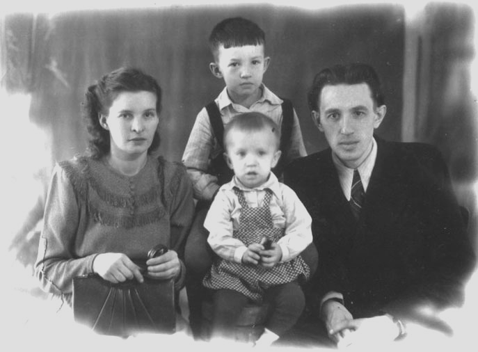

mein großer Artikel zu diesem Thema, der im "Krasnojarskij Rabotschi" veröffentlicht wurde, zerstörten schließlich meine Beziehung zu Anatoli Rytschkow, dem Chefingenieur des Trusts. Nach einer erneuten Konfrontation stimmte ich trotz Maschukows Abreden zu, an der Schule zu arbeiten.

Zwei Monate später, am 19. Oktober 1954, geschah das Unglaubliche: Sie riefen mich in die Kommandantur und gaben mir meinen Ausweis zurück. Der Passbeamte in Solikamsk hatte Recht gehabt: sie waren nicht berechtigt gewesen, mir meinen Pass wegzunehmen, und Moskau hatte ihn an Jenisseisk zurückgegeben. Es war derselbe Ausweis, den ich Koljagin in Turuchansk ausgehändigt hatte, grau und unansehnlich, mit Nummern, die mich in Misskredit brachten. Das einzig Neue war die Registrierung in Jenisseisk und der Stempel, aus dem hervorging, dass ich mit der Bürgerin Nina Georgiewna Tereschtschenko verheiratet war.

Jenisseisk. Wir sind bereits zu viert Es fühlte sich an, als hätte jemand plötzlich meine dunkle Brille abgenommen und die Watte aus meinen Ohren entfernt. Die Welt füllte sich mit Farben und Klängen. Ich fühlte mich wieder menschlich. Die Freude war noch größer als bei meiner Entlassung aus dem Lager. Das machte mich nicht zu einem vollwertigen Sowjetbürger, aber es gab mir einige, wenn auch begrenzte, Möglichkeiten, mich zu bewegen. Der neununddreißigste Punkt der Passbeschränkung, der die Möglichkeit ausschloss, in regionalen und provinziellen Zentren zu wohnen, war immer noch in Kraft. Aber Nina und ich hatten jetzt die freie Wahl und konnten von der Zukunft träumen. An diesem Tag konnte ich weder in der Schule noch zu Hause einen Platz für mich finden. Es war mir unangenehm, zu meinen Freunden zu gehen und meine Freude mit ihnen zu teilen. Die Situation war paradox. Die überwiegende Mehrheit der Russlanddeutschen befand sich immer noch im ewigen Exil, und ich und Bendik, ein berühmter Chirurg in Jenisseisk, bekamen unsere Pässe nur deshalb zurück, weil wir zur Zeit der Massenvertreibung in Gebieten lebten, aus denen keine solche Aussiedlung stattfand.

Aus diesem Anlass ging die ganze Familie an diesem Tag zum Ufer des Flusses Jenissej. Dort, hinter dem für Jenisseisker Verhältnisse riesigen Gebäude der Schule Nr. 45 und der Feuerwache, befand sich eine Art Stadtgarten.

Magere, dürre Espen mit den Resten braun verfärbter, verschrumpelter Blätter, die noch nicht vom Nordwind fortgeweht wurden waren, eine einsame, knorrige Birke und eine verfallene Bank. Wir ließen uns darauf nieder. Der Jenissei erstreckte sich vor uns. Das schwere, bleierne Wasser schien sich überhaupt nicht zu bewegen. Aber das war nur eine Illusion. Im Frühjahr konnten wir mit eigenen Augen sehen, wie schnell, wie zerstörerisch es sein konnte. Es ist wie mit der Zeit, die manchmal rasend schnell vergeht und gewohnte Lebensweisen zerstört, und manchmal, wie heute, in freudiger Erwartung stehen bleibt. Romotschka, die sich an Ninas Rock festhielt, suchte nach Kieselsteinen, und Valerik warf sie in Richtung Fluss, aber nur einige von ihnen erreichten das Wasser, und dann konnte man sehen, wie die entstandenen Kreise von der Strömung mitgerissen wurden.

Wir gingen hierher, an das Ufer des Jenissej, und dachten, wir könnten über die Möglichkeiten sprechen, die sich uns eröffneten. Aber die Spätherbstsonne wärmte so sanft und zärtlich, die Luft war so ruhig und still, die Kinder spielten so friedlich, dass wir nicht reden wollten. Ich wünschte mir, dass diese Momente ewig dauerten.

Zu diesem Zeitpunkt war ich bereits seit einigen Monaten an der Schule tätig. Ich unterrichtete Mathematik in sechs der sieben dort existierenden achten Klassen, außerdem unterrichtete ich weiterhin Mechanik und Elektrotechnik an der Forstwirtschaftsschule.

Die Schule Nr. 45, die heutige Schule Nr. 1, war die größte Schule in der Stadt und wahrscheinlich auch in der Region, sowohl in Bezug auf ihre Größe als auch die Anzahl der Schüler. Das Gebäude ist alt und stammt aus dem Jahr 1886. Drei Etagen. Die Wände einen Meter dick. Die Klassenräume geräumig, mit hohen Decken. Nur die Fenster schienen, für sibirische Verhältnisse, wenn nicht klein, so doch nicht groß genug. Da ich an die Verhältnisse im europäischen Teil Russlands gewöhnt war, fehlte es mir auch tagsüber an Licht, vor allem im Winter, also schaltete ich das elektrische Licht ein.

Die Fassade der Schule wies zur Leninstraße. In der Nähe befinden sich das historische Museum und der zentrale Platz, der seit dem Verschwinden des Stalin-Denkmals sein Aussehen verloren hat. Hinter der Schule ein kleiner Hof mit einigen Gewächshäusern, in denen die Jugendlichen Gurken und Tomaten anbauten. Und jenseits des hohen, halb verfallenen Zauns, quasi direkt am Ufer des Jenisseis, der Spielplatz, den Nina und ich scherzhaft einen Park nannten und den wir von Zeit zu Zeit gerne besuchten.

Im Sommer waren von den Bänken nur noch die Zementseiten übrig. Natürlich hätten die jungen Leute von heute auch sie zerstört, aber damals war das aus irgendeinem Grund noch nicht der Fall. Trotz der Verwahrlosung dieses Ortes, oder vielleicht gerade deswegen, kam ich in schwierigen Momenten des Lebens gerne hierher. Die Verwirrung der Seele und das starke Gefühl der Einsamkeit standen in guter Harmonie mit der Umgebung. Und die Weite des Jenisseis, die mich an das Meer erinnerte, wirkte beruhigend und spülte den Schmerz und den Groll von meiner Seele.

Die Schule verfügt über einen großen, langjährigen und erfahrenen Mitarbeiterstab. Es gibt allein etwa sieben Mathematiklehrer, darunter eine so wunderbare Lehrerin wie Klawdia Filippowna Sopotsko (zweite von links in der ersten Reihe auf dem Foto). Es gab also jemanden, von dem man lernen konnte. Leider hatten wir nicht genug Zeit. Jeden Tag sechs Unterrichtsstunden in der Schule und vier in der Fachschule. In den Pausen unterhielt ich mich hauptsächlich mit den Schülern und ging nur selten ins Lehrer-Zimmer, da ich mich nicht zu oft mit den Chefs treffen wollte. Außerdem hatte ich Angst, mich in politische Gespräche einzumischen. Immer wieder erinnerte ich mich daran, dass in der Schule die ideologische Reinheit des Lehrkörpers unter dem wachsamen Auge der Parteiorganisation und der staatlichen Sicherheitsorgane stand.

Die Direktorin der Schule war in jenen Jahren Anna Jefimowna Zwetkowa, eine sanfte, zarte Frau, die wegen einer Radikulitis der Halswirbelsäule sowohl im Winter als auch im Sommer ihren Kopf mit einem grauen Daunenschal bedeckte. Die Schulleiterin war Jewdokija Iwanowna Gorbatschowa, eine herrische und sehr strenge Lehrerin, die meiner Meinung nach nicht nur von den Lehrern, sondern auch von Anna Jefimowna selbst gefürchtet wurde.

Diese ersten Monate haben mich unglaublich viel Kraft gekostet: 36 Wochen in der Schule und 24 Stunden an der Hochschule. Die Rettung war, dass meine Tätigkeit in der Schule nur eine einzige Vorbereitung erforderte. Aber sechsmal hintereinander denselben Stoff erklären zu müssen, würde jeden in den Wahnsinn treiben. Besonders schwierig war es, wenn der Unterricht ausfiel. An solchen Tagen verließ ich gebrochen und gedemütigt die Schule. Ich wollte mit niemandem reden. Ich wollte in unseren Lieblings"park" gehen und dort die Schule und die Stadt hinter mir lassen, um mich meinen unglücklichen Gedanken hinzugeben. Aber selbst das konnte ich mir kaum leisten. Ich musste schnell zur Fachschule.

Leider muss ich gestehen, dass ich in den ersten Monaten meiner Arbeit an der Schule nicht wenige Unterrichtsstunden erlebte, die nicht so gut liefen. Ich redete zu viel allein, so dass keine Zeit für eigenständiges Arbeiten und Hinterfragen seitens der Schüler blieb blieb. Bei der Bewertung der Antworten zögerte ich quälend lange. Infolgedessen verlor ich die Kontrolle über meine Disziplin.

In gewisser Weise waren diese Misserfolge natürlich. Schließlich hatte ich so gut wie keine Erfahrung in der Arbeit mit Kindern im Rahmen des Unterrichts. Die drei Unterrichtsstunden, die ich während meines pädagogischen Praktikums in Tambow abgehalten hatte, zählten nicht. Und meine recht umfangreichen Erfahrungen mit Nachhilfeunterricht halfen mir wenig, da er auf individueller Basis stattgefunden hatte. Meine Schwierigkeiten rühren in erster Linie von meiner Unfähigkeit her, ein Team zu führen. Auch nicht meine Erfahrung als Lehrer an der Schule, wo meine Schüler erwachsene Menschen waren: Bremser, Leiter einer Zehnerbrigade, Forstmeister.

Aber es gab auch eigene, mir selbst innewohnende, ganz persönliche Gründe. Ich war nie in der Lage, auf die Erfüllung meiner Forderungen zu bestehen. Ich konnte nicht einmal meine eigenen Kinder dazu bringen, das zu tun, was ich für notwendig hielt, geschweige denn meine Schüler. Bei der geringsten Schwierigkeit, die sie beim Erlernen eines neuen Stoffes oder beim Lösen von Problemen hatten, eilte ich ihnen zu Hilfe, oft sogar gegen ihren Willen. Ich erklärte zu detailliert und ließ den Schülern keine Zeit, selbst darüber nachzudenken. Wenn ich Fragen stellte, hatte ich Angst, die Schüler in eine schwierige Situation zu bringen, und wenn ich das Gefühl hatte, dass sie nicht in der Lage waren zu antworten, begann ich zu fragen. Ich war geneigt, die meisten meiner pädagogischen Misserfolge in erster Linie auf Charakterschwäche zurückzuführen. Nina war jedoch ganz anderer Meinung:

- Du hast keinen schwachen Charakter. Es braucht mehr als einen, zehn Charaktere, um ein Lager zu überleben, nicht unterzugehen, so viele Hindernisse zu überwinden und, allen Widrigkeiten zum Trotz, eine Ausbildung und einen Beruf zu bekommen.

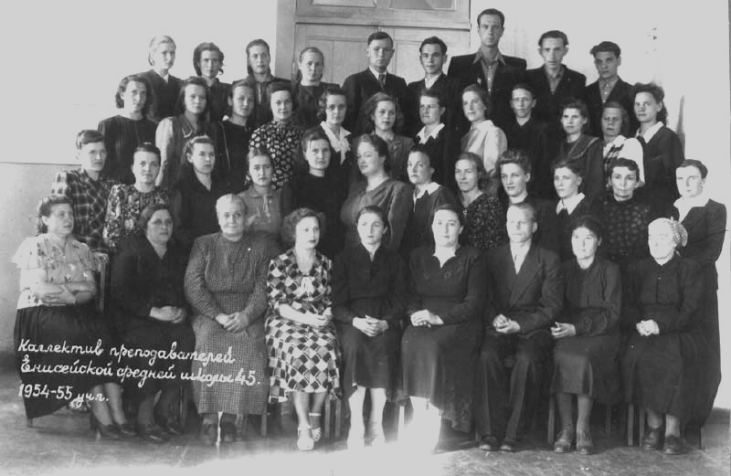

Ich hingegen war einer anderen Meinung. Ich glaubte, dass mein Überleben und mein Erfolg im Studium von ganz allein gekommen wären, ohne dass ich mich besonders hatte anstrengen müssen. Ich musste mich selten selbst brechen, um gegen meinen Willen zu handeln. Ich habe nicht so sehr mich selbst überwunden, was ich für ein Zeichen eines starken Charakters hielt, sondern die äußeren Umstände.

Nina hätte es genauso gut als Zeichen eines starken Charakters ansehen können, dass ich nicht trinke oder rauche.

Jenisseisk. Kollektiv der Schule N° 45.

Erste Reihe, Mitte, Fünfte von links, die Schuldirektorin Anna Jefimowna Zwetkowa, linker Hand von ihr, im dunklen Kleid – Die stellvertretende Schulleiterin Jewdokia Iwanowna Gorbatschowa Ich werde meine erste Unterrichtsstunde nie vergessen. An den Tischen sitzen Jungen und Mädchen. Alle sind so unterschiedlich, aber die Uniformen sind alle gleich: blaue Jacken, blaue Hosen, braune Kleider, schwarze Schürzen, weiße Kragen. Nur die Schleifen der Mädchen sind anders. Alle beobachten mich mit Neugierde. Wahrscheinlich suchen sie nach Schwachstellen. Außerdem haben sie fast ein ganzes Vierteljahr lang keine Matheaufgaben gelöst.

Ich wollte die Schüler mit meinem Unterrichtsfach fesseln und sie mit meinem Wissen verblüffen; ich erzählte ihnen von der Rolle der Mathematik in der Technik, der Wissenschaft, den praktischen, alltäglichen Aktivitäten der Menschen, den einzelnen Fakten aus dem Leben prominenter Mathematiker. Am Ende der sechsten Stunde war ich völlig erschöpft, aber ich war mit dem Unterricht zufrieden. Die Schüler hörten aufmerksam zu, stellten Fragen und folgten mir nach dem Klingeln in Scharen. Mir war nicht klar, dass viele von ihnen meinen Unterricht mochten, weil es keine Theoreme, keine Lösungen für Probleme und vor allem keine Fragen gab.

Mir war natürlich klar, dass ein echtes Interesse an der Mathematik nur durch mathematische Aktivitäten, vor allem durch das Lösen von Problemen, geweckt werden kann, aber trotzdem konnte ich meine Meinung lange Zeit nicht ändern. Ich selbst redete weiterhin viel, so dass keine Zeit für eigenständiges Arbeiten und Hinterfragen blieb, und provozierte so meine Schüler zu überflüssigen Gesprächen.

Die pädagogischen Probleme, mit denen ich konfrontiert war, waren in der Regel viel komplizierter als die mathematischen Schwierigkeiten, die ich mit meinen Schülern zu lösen hatte. Bei der Lösung der Aufgaben habe ich oft schwere pädagogische Fehler gemacht. In diesen Fällen war ich verzweifelt und wollte zum Trust zurückkehren. Doch mit der Zeit ging meine Arbeit an der Schule allmählich zur Normalität über. Schritt für Schritt lernte ich das ABC des Unterrichtens. Meine Liebe zur Mathematik, zu Kindern und eine Menge Geduld haben mir dabei geholfen. Am schwierigsten war es, die Beharrlichkeit in mir selbst zu entwickeln, die für jeden Lehrer so notwendig ist. Um das zu lernen, besuchte ich den Unterricht von Klawdia Filippowna Sopotsko. Nach solchen Besuchen ging ich oft deprimiert nach Hause, weil ich wusste, dass ich niemals in der Lage sein würde, so streng und in einem solchen Tempo zu unterrichten. Aber ich konnte besser rechnen und Probleme besser lösen. Und das stützte mich persönlich und meine Autorität in der Schule.

Während des gesamten ersten Jahres habe ich nach Schülern gesucht, die Mathematik lieben. Ich suchte und fand Valentin Saposchnikov, Ada Simonova, Tanja Smetjuk, Walja Misonowa, Galja Prokofjewa, Viktor Klimkin, Valentin Sjablikow und viele andere. Die meisten von ihnen waren in der 8. Klasse, einer Klasse, in der ich viel Freude hatte. Natürlich gab es Schüler, zu denen ich keinen Zugang finden konnte. Leider waren sie in der Mehrheit, und das quälte mich.

Am Ende des Schuljahres hatte sich eine Gruppe meiner engsten Schüler gebildet, in der Ada Simonowa, ein kleines, rundliches Tatarenmädchen mit dunkelbraunen Augen und einer hochgezogenen Nase, durch ihre Aktivität auffiel. Sie achtete wenig auf ihr Äußeres, löste aber ausgezeichnet, vielleicht besser als meine anderen Studenten, und mit großem Eifer Aufgaben und zog sie dem Studium der Theorie vor. Sie war scharfzüngig und bereitete den Lehrern und Verwaltungsangestellten der Schule eine Menge Ärger. Sie war nicht abgeneigt, eine Unterrichtsstunde zu stören. Aber sie war außergewöhnlich nett zu mir, auch wenn sie gerne über etwas lachte. Sie begleitete mich oft nach Hause und half Nina bei der Hausarbeit. Als es Nina gelang, ins Kino zu fliehen, wohin sie und ich abwechselnd gingen, blieb Ada zurück, um mir zu helfen und sich um Valerik und Romotschka zu kümmern. Schon bald begannen wachsame Nachbarn, die ihr ungesundes Interesse an ihrem Lehrer vermuteten, Nina etwas zuzuflüstern. Aber damals wusste ich noch nichts davon.

Solider und ruhiger hingegen verheilt sich Tanja Smetjuk. Sie oder Valentin Saposchnikow waren diejenigen, die ich an die Tafel rief, wenn einer der Schulverwalter oder Bezirksinspektoren meine Klassen besuchte. Sie konnten sicher sein, dass sie auf den Unterricht vorbereitet waren. Valja Misonowa, zierlich, zerbrechlich und klug, war für diesen Zweck nicht geeignet. In Anwesenheit von Fremden war sie immer sehr nervös, vor allem, wenn sie eine Aufgabe an der Tafel lösen musste; demzufolge verschonte ich sie. Saposchnikow schloss später sein Studium an der Universität Nowosibirsk ab, verteidigte seine Dissertation und arbeitet jetzt als Prorektor der Staatlichen Universität Krasnojarsk auf dem Gebiet der Wissenschaft.

Viktor Klimkin und Valentin Zyablikov zeichneten sich in der Klasse 8 durch ihr Interesse an der Mathematik aus. Klimkin führte anschließend einige interessante Forschungsarbeiten durch, verteidigte seine Dissertation und arbeitete als Dekan der mathematischen Fakultät der Pädagogischen Universität Kuibyschew. Sjablikow übte zu meinem Leidwesen Verrat an der Mathematik, indem er sein Leben der Medizin widmete.

Von allen Lehrern an der Schule hatte ich die engste Beziehung zu Aleksander Rykowzew. Er war ungefähr so alt wie ich, hatte einen Abschluss an der philosophischen Fakultät der Kiewer Universität und unterrichtete Geschichte an unserer Schule. Auf dem Foto oben steht er in der letzten Reihe, neben mir. Er ist groß, hat etwas schiefe Schultern, ist athletisch gebaut und ein Meister des Rennlaufsports. Seine Frau, Jewgenia Rykowzewa, die an der gleichen Fakultät studierte, war Schwimmmeisterin und unterrichtete ebenfalls an unserer Schule, aber ich weiß nicht mehr, welches Fach.

Sascha war sehr gebildet, verfügte über ausgezeichnete Geschichtskenntnisse und eine recht gute Literaturkenntnis. Seine Dissertation befasste sich mit dem geisteswissenschaftlichen Werk von Miklucho-Maklai. Aber in den Naturwissenschaften, insbesondere in den exakten Wissenschaften, war sein Wissen sehr bescheiden. Wir haben stundenlang über die Geschichte und das Schicksal Russlands gestritten. Ein besonderes Thema unserer Gespräche war die Religion. Sascha hielt sich selbst für einen Experten und hielt sogar Vorträge über Atheismus für Schulkinder. Sein gesamtes Wissen auf diesem Gebiet beschränkte sich jedoch auf moralische und ethische Probleme. Fragen nach der Erschaffung der Welt wich er sorgfältig aus, und es machte mir Spaß, ihn bei seiner völligen Unkenntnis der modernen kosmogonischen Theorien zu ertappen.

Nachdem er erfahren hatte, dass ich zehn Jahre in Lagern verbracht hatte, begann Sascha, mich mit Bitten zu überhäufen, mir vom Leben hinter Stacheldraht zu erzählen. Dieses Interesse an dem Thema erschien mir vollkommen natürlich. Nach Stalins Tod, der Rehabilitierung der Ärzte und vor allem nach der Veröffentlichung eines Artikels in der Prawda über die Anwendung verbotener Verhörtechniken durch die Ermittler wurde die öffentliche Meinung erschüttert und Zweifel in die Seelen der sensibelsten, denkenden und mitfühlendsten Menschen gesät. Außerdem hatte ich den Eindruck, dass die Hexenjagd bereits eingestellt worden war. Also ging ich das Risiko ein. An meinen freien Abenden, meist samstags, erzählte ich Sascha von den Jahren, die ich im Lager verbracht hatte.

Ich dachte, dass Sacha vor allem an den politischen Aspekten meiner Lager-Erfahrung interessiert sein würde. Wie sich jedoch herausstellte, interessierte er sich ebenso sehr für rein kriminelle Geschichten, Lagerjargon, Lagerpoesie und Lagerlieder.

Ich glaubte nicht, dass diese Haltung Saschas auf seine Parteizugehörigkeit zurückzuführen war. Unsere Gespräche waren immer sehr direkt und offen. Er hegte wirklich die Meinung, dass die meisten der aufgrund politischer Artikel Verurteilten im Wesentlichen gerecht verurteilt worden waren, auch wenn die Strafen vielleicht geringer hätten ausfallen müssen. Die Logik seiner Argumentation war typisch für die damalige Zeit. Demnach handelte es sich bei den politischen Gefangenen zumeist um Personen, die mit der Politik der Partei und der Regierung nicht einverstanden waren und daher Feinde waren, ob aktiv oder passiv, spielte keine Rolle. Und da sie Feinde waren, sollte der Staat sie isolieren.

Was konnte ich einer solchen Logik entgegensetzen? Sie war den Menschen seit den Anfängen des Militärkommunismus eingeimpft worden. Das war auch bei mir der Fall, vielleicht in geringerem Maße als bei Sascha. Wahrscheinlich war es dieser Logik zu verdanken, dass ich meine Verurteilung, die Ausweisung der Deutschen und viele andere Dinge ohne allzu großen Groll hingenommen habe.

Es hatte keinen Sinn, sich zu streiten. Es sollte erst der Parteitag mit Chruschtschows berühmtem Vortrag stattfinden, Solschenizyns Erzählung "Ein Tag im Leben des Iwan Denisowitsch" und Schalamows Kurzgeschichten mussten veröffentlicht werden, damit zumindest ein Teil der Gesellschaft verstand, dass ihre Bürger das Recht auf eine andere Meinung hatten.

Und doch wurde vieles von dem, was im ersten Teil meiner Memoiren steht, damals in Gesprächen mit Alexander Rikowzew zum ersten Mal geäußert.

Nina mochte meine Freundschaft mit Sascha nicht, vor allem wegen unserer Auseinandersetzungen über politische Themen. Besonders beunruhigt war sie jedoch über Saschas Auffassung von Familienbeziehungen, die er vor niemandem verbarg. Seine Theorie der Freiheit in der Ehe verärgerte Nina, und sie hatte offenbar Angst vor seinem "schlechten" Einfluss auf mich. In gewisser Weise waren ihre Befürchtungen nicht unbegründet. Meine Liebe zu Nina hat mich nie davon abgehalten, mich auch für andere Frauen zu interessieren. Die Gedichte von Ernotschka und Blok haben mich gelehrt, in den Frauen nicht nur ihre äußere Schönheit zu sehen, sondern auch ihre innere, geistige Schönheit. Jede Frau ist für mich ein Geheimnis und ein Rätsel. Ich habe mich immer gerne mit ihnen ausgetauscht.

Aber Pflicht, Familie und Kinder waren für mich immer noch höhere Werte als die Verliebtheit in Frauen. Es war wichtig, die Grenze nicht zu überschreiten, bei der meiner Meinung nach Verrat und Zerstörung der Familie beginnt. Ich wusste aus Erfahrung, dass eine Familie nicht nur auf der gegenseitigen Liebe zwischen den Eheleuten beruht, die sich mit dem Alter dramatisch verändern kann. Ebenso wichtig ist es, dass die Ehegatten gemeinsame Anliegen, gemeinsame Probleme haben. Jetzt, nach der Geburt von Romotschka und vor allem nach seiner schweren Krankheit, habe ich das klar verstanden.

Nina und ich hatten nur wenige solcher "verbindenden" Anliegen in unserem Leben. Ende Dezember empfahl der Arzt in der Entbindungsklinik, der Nina wegen ihrer extremen nervlichen Erschöpfung beobachtet hatte, einen Schwangerschaftsabbruch. Die Neurologin Andrejewa beharrte ebenfalls darauf. Beide warnten davor, dass das Baby nach all dem, was es durchgemacht hatte, wahrscheinlich nicht gesund zur Welt kommen würde. Wir verbrachten viele schlaflose Nächte, bevor wir uns zu diesem Schritt entschlossen. Nina war bereits im dritten Monat schwanger, aber ihr Zustand war zu bedrohlich. Wie uns später mitgeteilt wurde, sollte es ein Mädchen werden. Wir haben also Sonja verloren. Der Schmerz über den Verlust wurde durch die Tatsache verstärkt, dass wir diese Situation vor unseren Kindern verbargen. Dann ließ der Schmerz nach, ging hinunter in das Unterbewusstsein. Aber in schwierigen Momenten erinnerten wir uns an das, was geschehen war, und wurden gequält. Ich erinnere mich, dass Nina und ich Jahre später, als wir Nowy-Afon waren und die Kapelle auf dem Iberischen Berg besuchten, sie eine Kerze anzündete und um Vergebung für die Sünde bat, die sie auf ihre Seele genommen hatte.

### Kapitel 21. Rehabilitation

Unbemerkt kam das Jahr 1955. Nach dem Tod Stalins und der Hinrichtung Berias wurde das politische Leben des Landes von einem Machtkampf zwischen den beiden zentralen Figuren des politischen Olymps beherrscht: Malenkow und Chruschtschow. Die wichtigsten Mitarbeiter Stalins mussten einerseits die wichtigsten staatlichen Ämter unter sich aufteilen, um die Kontinuität des gesellschaftspolitischen Kurses zu gewährleisten, und andererseits bestimmte Veränderungen durchsetzen, deren Notwendigkeit in der herrschenden Elite nicht bezweifelt wurde.

Uneinigkeit herrschte über die Art dieser Veränderungen und darüber, inwieweit die breite Öffentlichkeit an ihnen beteiligt war. Malenkow und seine Anhänger sahen den Ausweg aus den wirtschaftlichen Schwierigkeiten in der Entwicklung der Leichtindustrie und in der Senkung der Preise für Konsumgüter. Chruschtschow seinerseits war sehr besorgt über die Situation in der Landwirtschaft und die großen Probleme dieses Sektors und bestand darauf, dem ländlichen Raum zu helfen: Anhebung der staatlichen Beschaffungspreise, Ausweitung der Anbauflächen, Erschließung von Neuland.

Sowohl Malenkow als auch Chruschtschow erkannten die Notwendigkeit, die sozialen Beziehungen in der Gesellschaft zu reformieren und insbesondere den Zwang als Prinzip für die Organisation dieser Beziehungen aufzugeben. Die dafür vorgeschlagenen Mechanismen waren jedoch unterschiedlich. Laut Malenkow sollte sie sich auf eine vorsichtige Übertragung der Macht auf die unteren Ebenen des Verwaltungsapparats ohne Beteiligung der Massen beschränken. Chruschtschow hingegen, der auf die Aktivierung aller Bevölkerungsschichten setzte, hielt es für notwendig, die soziale Aktivität in den Massen zu wecken und wandte sich oft über die Spitze des Parteiapparats an seine Mitbürger.

Obwohl all diese Widersprüche vertuscht und in den Zeitungen nichts, sondern nur die endgültigen Dokumente und Beschlüsse veröffentlicht wurden, wurde der Öffentlichkeit klar, dass Chruschtschow Malenkow Schritt für Schritt ablöste, der am 8. Februar 1955 vor dem Obersten Sowjet eine Rücktrittserklärung abgab. Die Führung der Regierung ging an Bulganin über, der sein Amt als Verteidigungsminister an Schukow abtrat.

Was dies für die Menschen in den Lagern, im Exil und in der Verbannung bedeuten könnte, war unklar. Trotz einer gewissen Entspannung der innenpolitischen Lage im Land verbüßten die meisten politischen Gefangenen weiterhin ihre meist hohen Haftstrafen. Die Spannungen in den Lagern wuchsen, und es kam zu Ausschreitungen, von denen die größte, wie heute bekannt ist, in Kimgir im Mai-Juni 1954 stattfand.

Auch in unserer Familie begannen sich Veränderungen zu vollziehen. Im April 1955 wurde bekannt, dass Nina ein Kind erwartete. Die Schwangerschaft verlief problemlos. Keine Intoxikation, gesunde Gesichtsfarbe, guter Appetit. Nina entschied, dass es ein Mädchen war.

Alles lief gut, bis im Juni ein Brief von Olga Fedotowna eintraf, die Nina einlud, Otradowka zu besuchen. Ich lehnte ab, weil ich um Ninas Gesundheit fürchtete. Schließlich war sie bereits im fünften Monat schwanger, und die Reise war nicht einfach: erst mit dem Bus oder Flugzeug nach Krasnojarsk, dann mit dem Zug nach Moskau. Von Moskau aus auch mit dem Zug nach Asow, und schließlich wieder mit dem Bus nach Otradowka. Dann, einen Monat später, alles in umgekehrter Reihenfolge. Die Fahrt, vor allem auf dem Rückweg, war riskant und ich versuchte Nina lange zu überreden, auf die Reise zu verzichten. Aber sie beharrte auf ihrer Entscheidung:

- Wenn das Baby geboren ist, werde ich meine Mutter mindestens eineinhalb Jahre lang nicht sehen können. Sie sollte hierhergebracht werden, sie ist eine alte Frau, und sie wird für mich eine Hilfe sein", beharrte Nina.

- Aber ich kann doch an deiner Stelle zu Olga Fedotowna fahren, das wäre schneller und sicherer. Ist es denn für dich gut, in einem Bus durchgeschüttelt zu werden? Frage wenigstens die Ärzte um Rat. Außerdem braucht Olga Fedotowna Zeit, um alle Probleme im Haushalt zu lösen, und du bist keine gute Assistentin für sie", wandte ich ein. Nina war hartnäckig, und ich stimmte schließlich zu, und zwar unter der Bedingung zu, dass sie von jeder Zwischenstation Telegramme schickte: Krasnojarsk, Moskau, Asow, Otradowka, und das galt auch für den Rückweg.

Der Tag der Abreise rückte unaufhaltsam näher. Ich unternahm noch mehrere Versuche, Nina davon abzubringen. Ich hatte Angst um sie. Sie könnte ausrutschen, fallen oder etwas Schweres heben. Aber Nina lachte nur über meine Befürchtungen. Ich hatte zudem das Glück, dass sich eine Reisegefährtin fand, die ebenfalls nach Asow wollte. Die Abreise war für Ende Juli geplant. Wir buchten die Fahrkarten, nahmen unbezahlten Urlaub, liehen uns etwas Geld und kauften ein paar Geschenke. Am Morgen des 26. Juli flogen Nina und ihre Begleiterin davon. Ich starrte auf die Lichter des Flugzeugs und konnte nicht glauben, dass ich Nina nicht mehr vorfinden würde, wenn ich nach Hause kam.

Am Abend kam ein Telegramm: "Sicher angekommen, verlasse Moskau am Abend, Kuss Nina. Am vierten Tag kam das gleiche Telegramm aus Moskau, zwei Tage später aus Asow. Und schließlich ein Telegramm aus Otradowka. Ich beruhigte mich, und noch am selben Tag gratulierte ich Olga Fedotowna und Nina per Telegramm zu ihrer Begegnung. Jetzt mussten wir warten! Wie langsam sich die Tage hinzogen. Was hatte ich mir nicht alles überlegt, welche Bilder hatte ich mir in den Nachtstunden nicht gemalt. Ich hatte solche Angst um Nina, um unsere Tochter.

Aber Nina fühlte sich gut, und meine Ängste waren ihr unbekannt. Auf dem untersten Regal des Abteilwagens liegend, lauschte sie dem Leben, welches von ihr Besitz zu ergreifen begann.

- Es ist alles in Ordnung, es wird alles gut", flüsterte sie zum Geräusch der Räder. - Ich werde Otradowka besuchen, meine Mutter, meine Freunde, mein altes Zuhause, und dann nach Hause kommen.

Sie erinnerte sich daran, dass Olga Fedotowna in einem ihrer Briefe geschrieben hatte, dass Maly aus der Partei ausgeschlossen und seines Amtes enthoben worden war, und dachte in Gedanken und nicht ohne Schadenfreude:

- Vielleicht werde ich Maly sehen und in seine hinterhältigen Augen schauen!

Sie wollte mit ihrer erfolgreichen Ehe prahlen, mit ihrem klugen, treuen und liebevollen Ehemann. Die einzige Peinlichkeit war meine Nationalität und die Tatsache, dass ich nicht mehr in einem Trust, sondern an einer Schule tätig war. Sie beschloss, mich weiterhin als Pole vorzustellen und nicht zu sagen, dass ich inzwischen an einer Schule tätig war. Sie hielt die Position des stellvertretenden Hauptbuchhalters des Trusts für seriöser. Im Großen und Ganzen fand sie, dass ihr Leben gut verlaufen war. Sie liebte mich und vertraute mir, nur Ada Simonowa hatte sie in letzter Zeit beunruhigt:

- Sie ist sehr aufdringlich und folgt Robotschka auf den Fersen. Eine Neuntklässlerin, aber sie redet und verhält sich wie eine Erwachsene. Natürlich würde Robotschka sich nichts erlauben, aber konnte er ihr widerstehen? - dachte sie, und die Flamme der Eifersucht loderte in ihr auf.

Nur mit Mühe unterdrückte sie ihre Gefühle und konzentrierte sich auf das bevorstehende Treffen mit ihrer Mutter:

- Und Mama ist gewiss sehr alt geworden, dachte sie. - Es ist nur gut, dass sie wenigstens nicht mehr von Anfällen gequält wird. Sie sollte das Haus verkaufen und zu uns ziehen.

Dann versank sie in ihren Erinnerungen. Es war der Gedanke an ihren Bruder, der sie am meisten quälte:

- Witja! Wie hatte er damals einen solchen Brief schreiben können, der sie so sehr verletzte. Wahrscheinlich war es gut, dass er jetzt nicht in Otradowka war. Das Wiedersehen wäre schwierig gewesen.

Dennoch liebte sie ihn, und sie wollte ihn umarmen und küssen, wie sie es getan hatte, als er noch ein Junge gewesen war.

- Jetzt war er erwachsen, ein Offizier, Panzersoldat, der irgendwo in Berditschew mit Werotschka lebte. Damals war sie noch ein Mädchen, und jetzt ist sie die Frau eines Offiziers. Warum hatte er nur einen solchen Brief geschrieben? Vielleicht war er als Offizier, als Kommunist dazu gezwungen worden? - dachte sie.

Sie wollte auch Maly treffen. Sie wollte es ihm sagen, ihm in aller Öffentlichkeit sagen, wie sehr sie ihn hasste und verachtete. - Ich sollte ihm in die Augen spucken, dachte sie, und dann stellte sie sich vor, wie ich auf solche Worte, auf solche Gedanken reagieren würde.

- Vielleicht sollte ich ihm danken. Wenn er nicht gewesen wäre, die Verhaftung, das Lager, hätte ich Robotschka nicht kennengelernt", wiederholte sie im Geiste den Satz, den ich einmal gesagt hatte.

Dann kehrten ihre Gedanken unwillkürlich zurück in die Region Krasnojarsk, nach Jenisseisk, zu unserem Haus: - Wie geht es ihnen ohne mich, was machen sie jetzt? Robochka ist wütend, aber er wird schnell darüber hinwegkommen. Hauptsache, Romotchka lässt mich nicht im Stich. Er ist ein feiner Kerl, er isst gut und er hat sogar zugenommen, und Valerik, mein lieber, mein Erstgeborener, ist jetzt groß und wird Papa im Haus helfen. Solange nur Ada dort nicht herumwirbeln würde.

Sie kam rechtzeitig zum Abendessen in Otradowka an, müde von der Reise, vor allem von der Busfahrt, staubbedeckt, unbemerkt, von niemandem erkannt, und ging durch die Höfe zu ihrem Haus. Olga Fedotowna wuselte auf dem Hof herum. Sie umarmten und küssten sich, weinten, und der Alltag begann. Gespräche, Erinnerungen, Geschichten über die Familie und Jenisseisk.

Maly sah sie nur ein einziges Mal. Er stand in Hose und Unterhemd auf der Veranda, vollschlank, selbstgefällig, mit Stiefeln in der Hand. Als er Nina sah, ging er, ohne sie zu grüßen, ins Haus und schloss die Tür fest hinter sich. Nina wiederum seufzte und eilte erleichtert nach Hause. Sie war froh, dass das Gespräch nicht stattgefunden hatte. Schließlich weiß niemand, wie es hätte enden können.

Und in Jenisseisk war ich mit den häuslichen Problemen beschäftigt: Frühstück, Mittagessen, Abendessen kochen, die Kinder füttern, Geschirr spülen. Ada schaute gelegentlich vorbei. Ohne sie hätte ich die Probleme, die auf mich zukamen, kaum bewältigen können. Es gab also keine Zeit, sich tagsüber Sorgen zu machen. Aber nachts, wenn die Kinder schliefen, schwebte ich im Geiste nach Otradowka und malte in meiner Fantasie ein schrecklicheres Bild als das andere. Ich wartete ungeduldig auf einen Brief oder ein Telegramm von Nina und markierte die langsam fortschreitenden Tage im Kalender.

Am 20. August traf endlich das lang erwartete Telegramm ein: "Abreise aus Krasnodar mit dem Zug Nummer (ich habe die Nummer vergessen) am 22. August. Küsse, Nina." Das ist alles. Kein Wort darüber, wie ich mich fühlte. Am selben Tag erreichte ich den Informationsdienst der Bahn und erfuhr, dass der Zug durch Rostow am Don fuhr. Dort wohnten L alja und ihre Familie seit Mai, wie ich nach Ninas Abreise erfahren hatte. Wenn ich die Nummer des Zuges gewusst hätte, hätte sie Nina sehen können. Ich schickte ein dringendes Telegramm nach Otradowka, um mich zu erkundigen, wie es Nina ging und wie die Nummer des Zuges lautete. Es kam keine Antwort. Erst auf das dritte Telegramm kam eine Antwort: "Nina geht es gut, die Wagennummer kenne ich nicht. Mama." Nina war also bereits in Krasnodar.

Er rief Lalja an, um Rücksprache zu halten. Ich bat sie, Nina im Zug zu suchen. Am Abend erhielt ich ein Telegramm: "Kein Glück bei der Suche nach Nina. Ich fragte erneut in Rostow nach, und Lalja erzählte mir, dass sie und Igor während des Aufenthalts im Zug an fünf Waggons vorbeigekommen waren, in denen Nina jedoch nicht saß. Ich habe noch einige Tage lang versucht, mit Otradowka Kontakt aufzunehmen, aber ohne Erfolg. Ich konnte nur warten. Es gab keine Telegramme von einer der vereinbarten Stationen.

Ihr, meine Kinder, die ihr meinen Charakter gut kennt, könnt euch meine Verzweiflung leicht vorstellen. Ich hatte mir in meiner kranken Fantasie alles Mögliche ausgemalt und nicht nur meine lang ersehnte Tochter, sondern auch Nina selbst schon längst mental begraben.

Und Nina, die sich von mir und den Kindern genug erholt hatte, die mit ihrer Mutter, ihren Tanten, Nichten und Neffen und vor allem mit ihren Freunden gesprochen hatte und die fast ihr ganzes Geld für Geschenke und Einkäufe ausgegeben hatte, war nun ohne einen Pfennig unterwegs. Sie aß, was man ihr in Otradowka für die Reise mitgegeben hatte. Die vereinbarten Telegramme aus Moskau und Krasnojarsk kamen nicht in Frage.

Als sie schließlich in Krasnojarsk ankam, stellte sie fest, dass sie nicht genug Geld hatte, um eine Busfahrkarte nach Jenisseisk zu kaufen. Mehr als einmal war ich bereits Zeuge ihrer leichtsinnigen Einstellung gegenüber Geld, ihrer mangelnden Bereitschaft, die anstehenden Ausgaben und ihre Möglichkeiten zu kalkulieren geworden. Erschwerend kam hinzu, dass wir zu dieser Zeit in Krasnojarsk keine einzige Person kannten. Aber sie hatte Glück. Am Busbahnhof traf sie Kommandant Zarkow, der ihr das fehlende Geld lieh. Es war eine gefährliche Reise: 340 Kilometer auf einer kaputten Straße in einem alten Reisebus, dessen blecherne Seiten klapperten. Zehn Stunden und im sechsten Monat schwanger.

Als sie auf unserer Küchentürschwelle erschien, fand ich keine Worte, um den Aufruhr auszudrücken, der in mir tobte. Und Wut auf sie wegen des ganzen Abenteuers und Freude darüber, dass sie lebte und gesund war. Sie stellte die Taschen auf dem Boden ab, umarmte und küsste die Kinder und setzte sich dann auf einen Stuhl und fragte:

- "Was ist los, warum schmollst du, Robotschka? Wir leben und es geht uns gut, ich habe dir gesagt, dass alles in Ordnung ist.

Ich ging ins Zimmer, ohne etwas zu sagen, durchwühlte die Schachtel und warf ihr einen Stapel von Postbelegen zu.

- Was soll das? - fragte sich Nina.

- Das ist mein monatliches Gehalt", antwortete ich gereizt. Nina verstand und sagte nur:

- Du bist verrückt! Was hätte mir schon passieren sollen. Ich hatte einfach nur kein Geld", sagte sie nach einem Moment der Stille:

- Und jetzt bin ich hungrig. Ich würde lieber etwas Salziges essen, zum Beispiel einen Fisch.

Drei Tage später, nachdem wir Valeriks Geburtstag gefeiert hatten, machte ich mich mit meiner geliebten 9 "W" auf den Weg zur Erntearbeit.

Als Schuljunge, der Tschernyschewski las, hatte ich nichts Besonderes daran gefunden, dass in Vera Pawlownas Träumen die Stadtbewohner während der landwirtschaftlichen Saison in die Dörfer fuhren und sich an der Erntearbeit beteiligten. Im Roman wirkte es sogar romantisch. Aber als ich selbst an einer solchen Arbeit teilnehmen musste, änderte sich meine Einstellung zu dieser Idee, und zwar nicht zum Besseren.

Wir kamen gegen Abend an. Es nieselte, es gab knietiefen Schlamm, graue, regennasse Hütten und schiefe Zäune. Wir wurden in dem noch nicht fertiggestellten Club untergebracht. Die Wände rochen angenehm nach Kiefernholz, zwischen den Balken hingen Moosbüschel. Die Fenster sind mit Folie abgedeckt. Drinnen ist es halbdunkel. Entlang der Wände befinden sich Bretter, darauf liegt Stroh. Darauf eine Plane. Mein Platz ist in der Mitte: auf der einen Seite die Jungs, auf der anderen die Mädchen. Zum Abendessen gab es Pellkartoffeln, Speiseöl, Bauernbrot und einen Becher Milch.

Meine Schützlinge, müde von der Reise, schliefen an diesem Abend früh ein. Es regnete die ganze Nacht hindurch. Am Morgen kam der Vorarbeiter gegen zehn Uhr. Er hat lange überlegt, welchen Auftrag er uns geben sollte. Er ging, ohne sich etwas dabei zu denken, aber er versprach, uns Fleisch zum Mittagessen zu geben. Mit Geschrei und Getöse wurden die Köche und Diensthabenden gewählt. Dann begannen die mühsamen Gänge um Lebensmittel: zum Kontor, zum Warenlager, zurück zum Kontor. Lange mussten wir den Vorsitzenden suchen, der die Rechnungen unterschreiben sollte.

Der Lagerleiter schimpfte:

- Sie haben noch mehr Schmarotzer ins Land geholt.

Erst am dritten Tag gingen wir auf das Feld. Wir gruben Kartoffeln aus. Die Erde war schwarz, klumpig und klebte an Spaten und Händen. Die Jungen gruben und die Mädchen sammelten. Unter ihnen gab es einige, die mit hochgekrempelten Ärmeln bis zu den Ellbogen im Boden steckten. Die meisten hoben jedoch nur die Kartoffeln auf, die an der Oberfläche lagen. Der Vorarbeiter brummte:

- Die Hälfte der Kartoffeln wird wieder in der Erde bleiben, und es ist zu früh, um zu graben, wir sollten warten, bis man sie sehen kann, aber es ist auch aufwendig, sich umsonst zu ernähren.

Nach ein paar Tagen kam die lang ersehnte Sonne heraus, und die Arbeit machte wieder mehr Spaß. Aber eine neue Sorge kam auf. Abends begannen die Dorfjungen, die meisten von ihnen betrunken, zu unserem Haus zu kommen. Die Mädchen flirteten eifrig, die Jungen ereiferten sich, ein Streit bahnte sich an. Ich konnte mich kaum zurückhalten. Am Ende musste ich den Vorsitzenden um Hilfe bitten. Aber auch die uns zugewiesenen "Verteidiger" waren beschwipst und gesprächsfreudig. Sie gingen erst gegen zwei Uhr, und ich konnte lange Zeit nicht schlafen. Am Morgen musste ich wegen der Zuteilung zum Vorstand.

In dem engen, verrauchten Raum befinden sich neben dem Vorsitzenden zehn Personen: die Vorarbeiter, der Betriebsleiter, der Mechaniker. Das Gespräch verläuft ohne Eile und ist voller Schimpfwörter. Alle klagen über den Mangel an Arbeitskräften, Inventar, Ersatzteilen und Werkzeugen. Der Vorsitzende ist empört über die Trägheit der Vorarbeiter, die seiner Meinung nach nicht in der Lage sind, die Mitglieder ihrer Brigaden auf die Felder zu "jagen".

- Man kann sie überall sehen, z.B. in Gemüsegärten, beim Mähen von Feldern, auf städtischen Märkten, aber nicht auf den Feldern der Kolchosen, schimpfte er.

- Aber was können wir tun? Sie alle haben Kinder, die sie ernähren müssen", sagte eine ältere, runzelige Frau, die Brigadierin des Außenteams, und aus irgendeinem Grund wandte sie sich mir zu, als wolle sie mir die Situation erklären:

- Wenn Sie im Sommer nicht an Ihrem Gemüsegarten arbeiten, werden Sie im Winter sterben.

Einer der Brigadeführer, die neben dem Tisch des Vorsitzenden saßen, schlug vor:

- Wir sollten den Bezirksausschuss bitten, die Arbeiter der Holzindustrie zu schicken. Sie haben letztes Jahr so gute Arbeit geleistet.

- Lieber Soldaten", rief ein Mann mit dünnem Bart, der neben mir saß, und fügte nach kurzem Überlegen hinzu: für die Holzfäller werden sie eine Menge bezahlen müssen.

Es folgte ein langwieriger und ziemlich sinnloser Streit.

Die Zuteilung war etwa gegen zehn Uhr beendet. Ich verließ die Versammlung, ohne eine klare Antwort auf irgendeine der Fragen erhalten zu haben, die mir Sorgen bereiteten: Warum war in den letzten Tagen kein Brot gebacken worden; wann würden wir endlich Fleisch bekommen; woher sollten wir frisches Stroh für die Einstreu bekommen; wann würden die Jungs sich endlich im Badehaus waschen können.

Erst am zehnten Oktober kehrten wir wieder nach Hause zurück.

Alles, was ich in diesem Monat gesehen, gehört und erlebt hatte, war deprimierend. Ich wusste sehr wohl, dass viele Kolchosen nach dem Krieg ein erbärmliches Dasein fristeten. Als ich in Laljas Haus in Bolschije Padi war, habe ich das mit eigenen Augen gesehen. Es war erstaunlich, dass sich in den Jahren, die seither vergangen waren, wenig im Leben der Dorfbewohner geändert hatte. Sie hatten immer noch keine Ausweise und durften die Kolchose nicht nach eigenem Ermessen verlassen, sie erhielten keine Renten, und die meisten von ihnen mussten weiterhin Zwangsarbeit verrichten.

Drei Tage nach meiner Rückkehr aus der Kolchose begann die Schule. Es belastete mich nicht mehr so sehr wie zu Beginn des letzten Jahres. Aber zu Hause gab es noch mehr zu tun. Ich musste Nina bei der Hausarbeit helfen. Die Wäsche war nach wie vor das Hauptproblem. Vom Jenissei bis zur neuen Wohnung waren es nun über drei Kilometer, es gab viel Wäsche und Nina war im letzten Monat ihrer Schwangerschaft.

Natascha wurde am 25. November geboren. Am Morgen brachte ich Nina in die Entbindungsklinik, in der auch Romotschka geboren worden war. Sie befand sich im ersten Stock eines Backsteingebäudes, das aus einem alten Kaufmannslager umgebaut worden war. Eine der Wände war dem örtlichen Stadion zugewandt. Eine steile Holztreppe führte hinauf in den Warteraum und zu den Krankenstationen. Nina wurde wie eine alte Bekannte begrüßt, und ermutigt durch diese Tatsache ging ich in die Schule, um meinen Unterricht zu erteilen. Als ich die Pause nutzte, um in die Entbindungsstation zu laufen, wurde ich mit Glückwünschen begrüßt:

- Herzlichen Glückwunsch zur Tochter! - Der Sanitäter beugte sich lächelnd über das Geländer des oberen Stocks und sagte. - Schon! - Ich konnte nur dieses eine Wort sagen. Und kaum hatte ich es ausgesprochen, erkannte ich die Absurdität der Bemerkung und musste lachen.

Jetzt waren wir zu fünft. Es war sehr schwierig, an diesem Tag zu unterrichten. Ich wollte Blumen kaufen und sie Nina ins Krankenhaus bringen, zum Arzt, zur Hebamme, zur Krankenschwester. Aber es war Spätherbst, und selbst das Gras, das mit Schnee bedeckt war, war schwarz.

Am Abend, als ich nach Hause kam, verkündete ich meinen Söhnen:

- Du hast jetzt ein Schwesterchen, Nataschenka.

Valerik wollte mit dem Blick eines Kenners wissen:

- Wie viel?

- Wie viel was? - Ich verstand nicht, was er meinte.

- Wie viel wiegt sie? - fragte er.

- Vierhundert, warum? - fragte ich nun meinerseits.

- Sie ist groß, - sagte er. - Ja, sie ist groß, - bestätigte ich.

- Und woher weißt du das?

- Na, Wowka hatte einen Bruder, dreihundertfünfzig, ich habe ihn gesehen", schloss Valerik das Gespräch.

Roma, der unser Gespräch neugierig verfolgt hatte, wollte wissen:

- Wo ist Natasha denn?

- Sie ist bei Mama im Krankenhaus, ich bringe sie bald nach Hause.

- Heute?

- Nein, in einer Woche.

Als Nina endlich nach Hause kam, starrte Romotschka seine kleine Schwester mit zusammengepressten Lippen an und weinte dann.

- Warum weinst du? - überraschte Nina.

- Das ist schade", antwortete er einsilbig und fügte nach einer Pause hinzu:

- Sie ist klein.

Anfang Dezember unterzeichnete die Schule einen Vertrag mit mir einen Vertrag als Lehrer, der in einem Gebiet lebte, das zum hohen Norden gehörte. Wie alle anderen Lehrer hatte ich nun Anspruch auf eine 50-prozentige Gehaltszulage und einmal alle drei Jahre auf kostenlose Beförderung zu meinem Urlaubsort und zurück. Unsere Finanzlage hatte sich deutlich verbessert. Im Großen und Ganzen verlief das Leben mehr oder weniger gut. Roma war, wenn auch nur langsam, genesen. Er konnte zwar schon laufen, aber jede Schwelle war für ihn ein ernsthaftes Hindernis, und wenn er davor stehen blieb, begann er zu weinen. Valerik wurde immer unabhängiger, er zeigte sich weder launisch noch schwindelte er, aber er bat immer noch nicht gerne um Vergebung. Er tat Romotschka nichts und war nicht eifersüchtig auf uns. Natascha bereitete uns keinerlei Schwierigkeiten. Sie lachte immer nur. Als sie acht Monate alt war, begann sie zu laufen, oder besser gesagt zu rennen. Sie rannte, fiel hin, sprang auf und lachte - mit einer Beule an der Stirn.

In der Hektik des Alltags ging unsere Vergangenheit verloren, geriet jedoch nicht in Vergessenheit: die Düsternis der Lagernächte, das Bellen der Wachhunde, die Schreie der Wachen, die mit Frost überzogene Luft und die scheinbar fleischlosen Menschen, die gierig ihre längst leeren Schüsseln leckten. Diese Bilder verfolgten Nina und mich in unseren Träumen, ließen uns erschaudern, wenn wir Uniformierten begegneten, und waren dafür verantwortlich, dass wir Kommandantur und Polizei mieden.

An normalen Tagen versuchten wir, diese Gefühle zu verdrängen, aber einmal im Jahr, am 13. Januar, dem Jahrestag unserer ersten Intimität, gaben wir uns bewusst diesen Erinnerungen hin. Wir erinnerten uns an Episoden aus unserem Lagerleben und an Freunde, über deren weiteres Schicksal wir damals meist nichts wussten. Erinnerungen, mal schwer und düster, mal hell und klar, stapelten sich übereinander. "Weißt du noch?", war wie so oft an solchen Abenden die Aufforderung sich der Vergangenheit zu entsinnen. In diesem seltsamen Wettstreit der Erinnerungen behielt Nina meist die Oberhand. Sie dachte an viele Episoden zurück, die damals an mir vorübergegangen waren. Ihre Rückbesinnungen waren in der Regel heller, lebhafter und detailreicher. Vor allem, wenn sie mit Liebe und Eifersucht vermischt waren.

An diesem Tag, an dem wir das neue Jahr feierten, saßen wir in einem Raum, den wir scherzhaft "Wohnzimmer" nannten. Neben uns stand in einem Eimer Wasser ein kleiner Weihnachtsbaum, den ich zum Jahreswechsel aus dem Wald mitgebracht und den die ganze Familie mit selbstgebasteltem Spielzeug geschmückt hatte. Die Kinder schliefen friedlich im Nebenzimmer. Vor den zugefrorenen Fenstern herrschte tiefschwarze Nacht.

Wie schon in den vergangenen Jahren betreffen unsere ersten Erinnerungen Olga. Es gab Briefe von ihr, die voller Verzweiflung und Tränen gewesen waren. Efimtschik hatte sich mit einer anderen Frau eingelassen, hatte zu trinken begonnen und war eines Nachts verschwunden. Schließlich war er, ohne etwas zu sagen, zu seinen Eltern in die Ukraine gefahren. Olja wurde allein gelassen, krank und am Boden zerstört. Nina war entrüstet gewesen, denn sie erinnerte sich daran, mit welcher Hartnäckigkeit er hinter dem Stacheldraht um Olgas Liebe geworben hatte, wie eifersüchtig er auf Kalinowskij gewesen war, wieviel Aufmerksamkeit er ihr anfangs entgegengebracht hatte.

- Da ist er, euer Anstand! - sagte Nina für mich völlig unerwartet.

- Warum "euer"? Denkst du, ich bin nicht anständig?" Ich reagierte, als wäre ich beleidigt.

- Ach, Robochtska, du bist auch gut! Erinnerst du dich an das Krankenhaus im Lager?

Traktowy, wo ich mit einer Lungenentzündung gelegen habe?

Ich erinnerte mich. Damals, als ich Nina besuchte, war Nelja, die auf der Station für Zivilangestellte lag, zu ihr gekommen und hatte sich im Bett hinter ihr niedergelassen. Nina erinnerte sich für mich an jedes Detail dieses peinlichen Moments. Sie erinnerte sich daran, dass ich schlecht rasiert war, dass an meinem Hemd der oberste Knopf fehlte, wie gut mein weißer Krankenhauskittel mir stand, und sie dachte: "Er hätte ein Arzt sein können. Sie erinnerte sich und schilderte lebhaft, wie ich unter ihren schiefen Blicken verlegen und rot wurde und wie ich, in dem Glauben, Nina würde es nicht bemerken, Neljas Blick auffing.

Sie erinnerte sich auch wie ich vom Waldbrand zurückgekommen war, als ich, schmutzig und erschöpft von der Brandbekämpfung, auf dem Bahnsteig zu ihren Füßen saß, döste und meinen Kopf auf Neljas Schoß legte, die neben mir saß. Nina, die damals vor Eifersucht schäumte, schaffte es, sich gleichzeitig um meine schmutzige und blutige Wange zu kümmern:

- Weißt du noch, wie wir damals alle aussahen, vor allem du? Und der blaue Rock von Nelina, auf dem du so süß geschlafen hast? Und die Art, wie sie dir Zweige und Tannennadeln aus den Haaren gezogen hat?

Nein, ich kann mich an nichts davon erinnern. Ich erinnerte mich nur an den Skandal, den Nina mir damals in der Zone bereitet hatte.

Ich war ratlos, was ich tun sollte. Was könnten diese Erinnerungen bedeuten? Hatte sich ihre Eifersucht auf Nelja immer noch nicht abgekühlt? Nein, es steckte wahrscheinlich etwas Neues dahinter, eine neue, gequälte Eifersucht. Aber gegenüber wem?

Ich lag mit meiner Vermutung richtig. Aber ich hätte nie gedacht, dass sie auf Ada Simonowa eifersüchtig war. Offenbar hat das Geflüster der Nachbarn dies bewirkt. Es ist erstaunlich, wie trügerisch ihre Intuition war. Ich hatte mich schon gefragt, warum Nina nicht mehr ins Kino gegangen war. Ihr Verdacht war völlig unbegründet. Ich lachte, redete, versuchte sie zu überzeugen. Im Eifer des Gefechts und fest entschlossen, sie umzustimmen, platzte ich heraus:

- Ich würde verstehen, wenn du auf Walja Misonowa eifersüchtig wärst, ich mag sie wirklich: gut gebaut, feminin, hübsches Gesicht.

Aber Nina reagierte nicht auf meinen Schritt, da sie glaubte, dass nur eine sehr unternehmungslustige und hartnäckige Frau mich verführen konnte. Walja war ein bescheidenes und schüchternes Mädchen und daher nach Ninas Meinung keine Gefahr für sie.

Um das unangenehme Gespräch zu unterbrechen, erinnerte ich mich daran, dass die meisten der uns bekannten politischen Exilanten, einschließlich Isserlis und auch Kopelewitsch, schon längst Rehabilitationsbescheide erhalten hatten, aber ich hatte immer noch nichts gehört. Doch Nina teilte meine Sorge nicht, sondern meinte nur, ich hätte meine Beschwerde später als sie abgeschickt, und es gäbe keinen Grund zur Sorge. Sie fügte ein wenig zurückhaltend hinzu:

- Du wirst es bald bekommen, ich denke im Januar.

Nina sollte Recht behalten, die Antwort auf meine "Aufsichtsbeschwerde" kam am 30. Januar 1956, zwei Monate vor Chruschtschows berühmter Rede. In der Antwort hieß es: "Der Fall des Robert Adolfowitsch Maier, der vom Bezirksgericht Tambow am 3. Juni 1942 gemäß Artikel 58-10 Teil 2 des Strafgesetzbuches zu einer zehnjährigen Haftstrafe verurteilt worden war, wurde vom Obersten Gerichtshof der RSFSR am 12. September 1955 geprüft. Das Urteil des Bezirksgerichts Tambow vom 3.VI.1942 wurde aufgehoben und das Verfahren aus Mangel an Beweisen eingestellt".

Die Freude über diese Botschaft war nicht vollkommen. Nina, die die Rehabilitierung viel mehr verdiente als ich, konnte nicht damit rechnen. Alle Personen, deren Strafe nicht mehr als fünf Jahre betragen hatte, wurden amnestiert, und ihre Fälle wurden überhaupt nicht berücksichtigt. Alle Anfragen, die wir abschickten, um ihren Fall überprüfen zu lassen, erhielten die gleiche Antwort: "Sie sind per Urteil amnestiert worden, und es macht keinen Sinn, Ihren Fall zu prüfen". Ich verstand ihren Gemütszustand und versuchte, dieFreude über meine Rehabilitierung zu zügeln, obwohl ich wusste, welche Aussichten sich dadurch für uns in der Zukunft eröffnen würden.

Am 14. Februar 1956 wurde der zwanzigste Parteitag der KPdSU im Kreml in Anwesenheit von 55 "brüderlichen Parteien" eröffnet. Nach Zeitungsinformationen fand sie acht Monate vor dem eigentlichen Termin statt, weil es dringend notwendig war, eine Bilanz der seit Stalins Tod eingetretenen Veränderungen zu ziehen und einen Kurs für die weitere Entwicklung des Landes festzulegen. Der Kongress endete mit dem berühmten "Geheimbericht" von Chruschtschow. Dieser schockierende Bericht, der hinter verschlossenen Türen nur den sowjetischen Delegierten vorgelegt wurde, ebnete den Weg für eine kontrollierte Entstalinisierung. Unmittelbar nach dem Kongress wurde der Text des Berichts in einem schmalen roten Buch veröffentlicht. Ursprünglich sollte sie nur für Parteimitglieder zugänglich sein. Die zuständigen Parteifunktionäre, jeder auf seiner Ebene, sollten ihn ihren Untergebenen vorlesen. Ende März war sie jedoch auf Anweisung Chruschtschows bereits für alle Bürger des Landes geöffnet. Die Parteiorgane wurden aufgefordert, überall Versammlungen abzuhalten, auch in Schulen für Schüler ab 14 Jahren, damit sie sich mit dem Inhalt des Berichts vertraut machen konnten.

Der Bericht wurde uns, den Lehrern der Schule Nr. 45, vom Vorsitzenden des Kreisparteikomitees vorgelesen. Er las nur zwei Stunden, während Chruschtschow selbst vier Stunden damit zugebracht hatte, woraus wir nun schließen konnten, dass der Ausbilder einige Teile des Berichts ausließ. Der Bericht zeichnete ein neues Bild von Stalin - das Bild eines Tyrannen, der Tag für Tag seinen Kult schuf, das Bild eines inkompetenten Diktators, der auf niemanden hören wollte, "abgeschnitten vom Volk" und verantwortlich für die katastrophale wirtschaftliche Lage, in der sich das Land am Ende seiner Herrschaft befand.

Das kleine Lehrerzimmer, in dem die Veranstaltung stattfand, war bis auf den letzten Platz gefüllt. Die Tür zum Korridor wurde nicht geöffnet, obwohl es stickig war. Am Tisch des Präsidiums saßen neben dem Sekretär des Bezirkskomitees, der den Bericht verlas, der Schuldirektor und der Parteivorsitzende, der, soweit ich mich erinnere, damals Physiklehrer Milewsky war. Die Kommunisten wurden bereits im Februar über den Bericht unterrichtet. Wir, die einfachen Sterblichen, hörten mit angehaltenem Atem zu. Ich wollte unbedingt die Gesichter meiner Kollegen sehen, um zu wissen, was sie über das Gehörte dachten, aber ich sah nur ihre Hinterköpfe und wagte nicht, mich umzudrehen. Das wäre der Gipfel der Indiskretion gewesen: Der Bericht zerstörte und stürzte die tiefsten, von der Propaganda geprägten Vorstellungen über Stalin. Ich wünschte, Nina wäre da gewesen.

Wir wurden zu Beginn gewarnt, dass es keine Fragen oder Diskussionen über den Bericht geben würde. Wir gingen schweigend weg, bedrückt von dem, was wir gehört hatten. In den ersten Tagen nach der Sitzung hüteten sich die Lehrer, die in dem Bericht dargestellten Fakten aufzunehmen. Aus einzelnen Kommentaren konnte man schließen, dass die meisten von ihnen mit dieser Entwicklung unzufrieden waren, insbesondere mit der Tatsache, dass das Zentralkomitee der Kommunistischen Partei, das Stalins Initiativen voll unterstützt hatte, als Hauptverräter auftrat. Die Weitsichtigeren unter ihnen erkannten die Komplikationen, die sich daraus für die gesellschaftliche Entwicklung ergeben könnten.

Sascha Rykowzew, dem das Geschehene sehr zu schaffen machte, vermied es zum ersten Mal, mit mir darüber zu sprechen. Der "Bericht" erschütterte sein gesamtes System politischer Ansichten und Überzeugungen. Auch sein Blick auf die Repressionsopfer wurde erschüttert. Wie er zugab, herrschte in seinem Kopf ein schreckliches Chaos. Aber am Ende gelang es ihm nach reiflicher Überlegung, ein Mindestmaß an Ordnung wiederherzustellen. Wie die meisten Parteimitglieder erklärte er sich, dass Stalin von den Feinden der Partei, insbesondere von Beria, "hereingelegt" worden war und dass Chruschtschow dies zu seinem eigenen Vorteil ausgenutzt hatte.

Sascha zweifelte nicht an der Richtigkeit der allgemeinen Linie der Partei zum Aufbau einer kommunistischen Gesellschaft. Ich muss zugeben, dass ich in jenen Jahren auch keine derartigen Zweifel hegte. Aber ich war überzeugt, dass eine solche Gesellschaft ohne Gewalt, durch Überzeugung und Erziehung aufgebaut werden kann und sollte. Sasha war anderer Meinung als ich:

- Hast du aus deiner Schulzeit nichts gelernt und glaubst du immer noch, dass Menschen allein durch Überredungskunst und Überzeugung zum Guten und zum Wohlbefinden geführt werden können?

- Das hat nichts mit unseren schulischen Dingen zu tun. Hier geht es nicht um kleine, ungebildete Kinder, sondern um erwachsene, mündige Bürger und ihr Recht, ihre eigene Meinung zu vertreten, auch wenn diese im Widerspruch zur Ideologie der Regierung steht. Oder bist du der Meinung, dass alle so denken und fühlen sollten wie du und deine Partei?

- Du gibst zu, dass das Ziel des Aufbaus einer kommunistischen Gesellschaft ein gutes, erstrebenswertes Ziel ist. Also muss man dafür kämpfen und alle aus dem Weg räumen, die sich der Verwirklichung dieses Ziels in den Weg stellen. Und das erfordert Entschlossenheit und Stärke.

Saschas Argumente gefielen mir nicht, insbesondere sein Hinweis auf meine pädagogischen Versäumnisse. Aber was hätte ich ihm in jenen Jahren sagen sollen? Ich konnte nicht sagen, dass ich die alltägliche Wahrheit nicht akzeptierte, dass ich zu allem eine eigene Meinung haben wollte, dass mich die Notwendigkeit, sich vor irgendjemandem zu verbeugen, selbst vor Lenin, Engels oder Marx, beleidigte, dass mir jede Äußerung Stalins hinterlistig und heimtückisch erschien. Aber ich traute mich nicht, Sascha das zu sagen, und unternahm stattdessen einen schwachen Versuch, mich zu verteidigen:

- Aus dem Bericht Chruschtschows geht jedoch hervor, dass jeder das Recht hat, seine eigene Weltanschauung zu haben, auch wenn sie nicht mit dem Staat und damit mit der Parteiideologie übereinstimmt.

- Wo hast du das gelesen? Davon steht in dem Bericht nichts. Und hast du nicht bemerkt, wie hart Chruschtschow auf alle Versuche reagiert, von der allgemeinen Linie der Partei zum Aufbau einer kommunistischen Gesellschaft in der UdSSR abzuweichen", erwiderte Sascha entschlossen.

- Und wie hast du damals Chruschtschows Bericht verstanden? - fragte ich.

- Ich sage es dir, aber nur unter einer Bedingung: Es muss unter uns bleiben, okay?

- Natürlich, - beeilte ich mich, ihm zu versichern, obwohl ich in meinem Herzen darüber lachte, dass er jetzt um Vertraulichkeit bat, wie ich es einst tat.

- Er räumt nur seinen Platz auf dem politischen Olymp frei, - sagte Sasha.

Es war schwer, dem zu widersprechen, und dennoch, trotz dieses nicht sehr würdigen Motivs, gefiel mir vieles von dem, was Chruschtschow tat und vor allem sagte, nicht nur, sondern ich hielt sogar sehr viel davon. Ich las gierig die Zeitungsartikel und wartete auf eine Fortsetzung, doch es kam keine. Es gab Artikel über die Aussaat, die Konsolidierung der Kolchosen und die Industrialisierung der Landwirtschaft sowie über die Schäden, die dem Land durch die Hinterhoflandwirtschaft entstehen. Gesetze und Verordnungen zur Verbesserung der materiellen Lage der Bevölkerung wurden veröffentlicht und kommentiert. Zugegeben, es waren ziemlich viele. Die Löhne im öffentlichen Sektor wurden angehoben. Das Renteneintrittsalter wurde auf 60 Jahre für Männer und 55 Jahre für Frauen gesenkt, die Renten wurden verdoppelt. Die Wochenarbeitszeit wurde um zwei Stunden verkürzt. Der Mutterschaftsurlaub, der unter Stalin auf 70 Tage verkürzt worden war, wurde wieder auf einhundertzwölf Tage erhöht. Obligatorische Staatsanleihen wurden abgeschafft. Die Zahlungen für frühere Darlehen wurden jedoch für 20 Jahre eingefroren. Ein umfangreicher Wohnungsbau begann. Natürlich konnten all diese Maßnahmen nur zu einer erhöhten Warenknappheit führen, das spürten wir, aber darüber schrieben die Zeitungen nicht. Im Allgemeinen wurden die traurigen Folgen all dieser populistischen Maßnahmen erst in den sechziger Jahren von der Bevölkerung wahrgenommen.

Im Sommer 1956 planten wir eine Reise nach Sdwinsk, um Ernotschka zu besuchen. Es sollte unser erster Familienausflug außerhalb der Region werden. Das Geld war knapp, die Kinder waren klein, Natascha war erst sieben Monate alt. Aber Ernotschka bat uns sehr zu kommen, also haben wir zugestimmt.

Doch schon bald traten Ereignisse ein, die unsere Pläne beinahe geändert hätten. Im März wurden Viktoria Fjodorowna Iwanowa und ich auf Empfehlung des Bezirksamtes in die Kommission aufgenommen, die die Arbeit des Pädagogischen Instituts in Jenisseisk überprüfte. Wie immer nahm ich meine Pflichten wohl zu ernst. Auf jeden Fall bot mir der Rektor des Instituts, Iwan Agapejewitsch Kiselew, nach Abschluss des Auftrags eine Stelle als Assistent in der mathematischen Abteilung an. Ich sollte sofort nach dem Ende des Unterrichts anfangen zu arbeiten. Natürlich sagte ich zu, aber unter der Bedingung, dass ich meine Schwester einen Monat lang besuchen und meine geliebte Klasse 9b bis zum Abgang weiterleiten durfte.

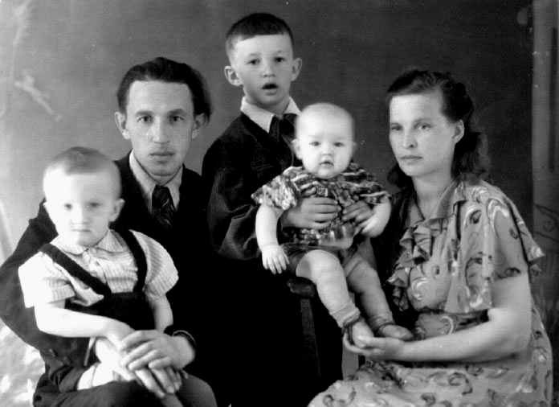

Im Mai 1956, ganz am Ende des Schuljahres, eine unerwartete Fahrt zur Kolchose, nun bereits nach Jepischino, um Kartoffeln im Kolchos-Gemüselager zu sortieren.

Endlich sind wir alle beisammen. Nur Oma Olja fehlt Ich erinnere mich noch an den Lastwagen, die aufgehängten Bretter - Bänke, darauf meine Schüler, die "monatslosen" Zehntklässler. Ich stand neben der Fahrerkabine. Neben mir saß Walja Misonowa, schlank, zierlich, mit einem hübschen Gesicht. Der Wind zerzauste unser Haar. Das Auto schaukelte hin und her, und Walja griff ab und zu nach meiner Hand. In diesen Momenten sank meine Seele sanft herab. Die Jungs im Auto sangen ein Lied und lachten. Ich betete zu Gott, dass niemand erfahren möge, wie ich mich fühlte. Im Gemüselager verbanden die Jungen Arbeit mit Spiel - sie warfen mit Kartoffeln, und ich konnte sie nicht beruhigen. Ich konnte nicht anders, als im Halbdunkel nach Walja Ausschau zu halten, weil ich befürchtete, jemand könnte sie beim Werfen mit einer Kartoffel treffen. Ich machte mir Sorgen und dachte über meine Gefühle nach.

Erst im Juni konnten wir endlich nach Sdwinsk aufbrechen. Wir nahmen so viel Geld mit, wie wir konnten, schlossen die Wohnung ab - Gott sei Dank brauchten wir keine Eisentüren und vergitterten Fenster - und machten uns auf den Weg. Wir fuhren mit dem Bus nach Krasnojarsk, dann einen Tag mit dem Zug nach Barabinsk und dann wieder mit dem Bus bis Sdwinsk. Im Zug fuhren wir im Wagen der zweiten Klasse. Valerik war sieben Jahre alt, Romotschka drei und Natasha sieben Monate. Valerik blieb am Fenster stehen, es war seine erste Zugfahrt, Romotschka war kapriziös, und Natasha lächelte alle an, ohne den Mund zu schließen.

Ich stand unter dem Einfluss von Kiselews Vorschlag, den er mir unterbreitet hatte. Mein sehnlichster Traum würde sich erfüllen: Ich werde am Institut arbeiten und Mathematik unterrichten. Was genau, wusste ich nicht, aber es hat mich auch nicht wirklich gestört. Der Unterricht am Institut begann mit einem Ausflug zur Kolchose, und ich hoffte, dass ich mich in dieser Zeit darauf vorbereiten konnte.

Am Abend, als ich auf der obersten Pritsche lag und die Ereignisse des vergangenen Monats Revue passieren ließ, musste ich an Valja denken. Es war wie eine Besessenheit. Es stellte sich heraus, dass es stimmte, als ich Nina am Silvesterabend sagte, dass sie nicht auf Ada, sondern auf Valja eifersüchtig sein sollte. Aber Valja war noch ein kleines Mädchen, ein Neuling in der zehnten Klasse. Wie konnte die Berührung ihrer Hand nur derartige Gefühle in mir auslösen?

- Dann hat das Auto uns einfach hochgeworfen, und Walja hat sich an mir festgehalten, das war doch normal, - redete ich mir ein. - Ich muss all diese Gedanken sofort aus meinem Kopf verbannen und an etwas anderes denken.

Ich blickte hinunter in das Halbdunkel. Nina fütterte Natascha, Valerik saß am Fenster und Romotschka schlief, zusammengerollt wie eine Kugel.

- Er friert bestimmt, dachte ich, es zieht im Waggon, und er ist nur Haut und Knochen, nichts hält ihn warm.

Ich stieg von der Schlafkoke herunter und setzte mich neben Nina. Dann holte ich ihr wollenes Tuch heraus, das wir für alle Fälle mitgenommen hatten, und bedeckte Roma damit.

- Hier ist sie, meine Welt, die Menschen, die mir am nächsten und liebsten sind. Die Hauptsache ist, dass wir zusammen sind und sich keine Aufseher in der Nähe befinden, was will man mehr.

In Sdwinsk trafen wir wie ein Zigeunerlager ein. Wir mussten elf Personen in einer Hütte mit zwei kleinen Zimmern unterbringen. Ernotschka, Tante Matilda, Lisa und Nina samt Natascha lagen auf den Betten. Alle anderen auf dem Boden: Petja, Holdi, Adja, ich, Valerik und Romotschka. Jeden Morgen melkte Liza die Kuh und gab uns allen dampfende Milch. Der Monat verging, vor allem für mich, wie im Flug, wie ein Märchen. Wir gingen mit Ernotschka, Valerik und Romotschka an den Fluss, in ein kleines Wäldchen und verbrachten Stunden damit, in Erinnerungen an die ferne und nicht so ferne Vergangenheit zu schwelgen, Eindrücke und Sorgen der Gegen-

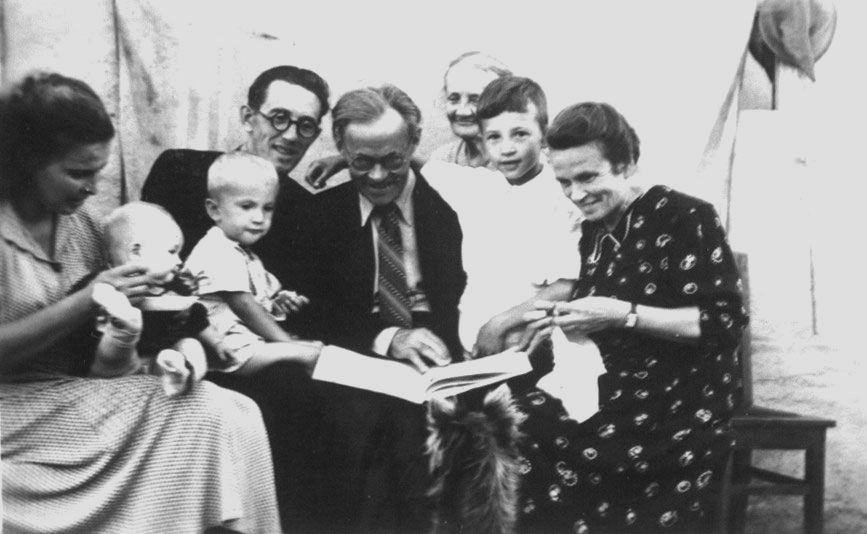

wart auszutauschen. Nina half Lisa bei der Hausarbeit und passte auf Natascha auf. Tante Matilda murrte, meinetwegen eifersüchtig auf Ernotschka. Gegen Ende konnte sie es nicht mehr aushalten und fragte Nina direkt:

- Nina, wusstest du, dass Ernotschkas Kuh gerade kalbt und sie jeden Tag Milch von einem Nachbarn kaufen muss?

Nina wusste das nicht und war besorgt, weil wir kaum noch Geld hatten. Als Ernotschka von dem Gespräch erfuhr, weinte sie und sagte, sie sei sehr froh, uns hier zu haben.

Wir sind in Sdwinsk. Nina mit Natascha, ich mit Romotschka, Petja mit Buch, Lisa, Valerik und Ernotschka mit Nähzeug Bei Petja ging es in allen Gesprächen auf die eine oder andere Weise um das Schicksal der Russlanddeutschen. Zu seiner Überraschung stellte sich heraus, dass ich nichts über den Erlass des Präsidiums des Obersten Sowjets der UdSSR vom Dezember 1955 "Über die Aufhebung der Beschränkungen der Rechtsstellung der in Sonderansiedlung befindlichen Deutschen und ihrer Familienangehörigen" wusste.

- Wie kannst du, ein gebürtiger Deutscher, in den sechs Monaten, die seitdem vergangen sind, nichts darüber gehört haben, was dein unglückliches Volk beunruhigt, -empörte er sich.

- Aber ich war von dem Erlass nicht betroffen, und die Kommandantur hatte mich nicht darüber informiert und hätte es auch nicht tun dürfen, da der Erlass, wie es heißt, geheim war, - rechtfertigte ich mich.

- Nun, nehmen wir an, dieser Erlass betrifft dich tatsächlich nicht, und du wurdest von der Kommandantur nicht benachrichtigt, aber außer dir gibt es wahrscheinlich noch andere Deutsche in Jenisseisk. Haben sie die denn nichts davon erzählt? - fragte Petja.

Ich schwieg. Und was hätte ich ihm auch sagen sollen? Dass es in unserem Bekanntenkreis keine Deutschen gab, dass Nina von der deutschen Sprache irritiert war und sich dagegen sträubte, sie in den Familienwortschatz aufzunehmen, konnte ich ihm nicht sagen. Ich verstand sie, aber würde Petja sie verstehen? Außerdem waren wir mit einer deutschen Familie verbunden. Warum hatte Erna Andrejewna kein Wort über dieses Dekret verloren?

- Also gut, vergessen wir es", sagte Petja, als er Ernotschkas flehenden Blick bemerkte, und las mir vor, was er und Ernotschka unmittelbar nach ihrem Besuch in der Kommandantur aus dem Gedächtnis wiederhergestellt hatten.

Der Erlass lautete: "In der Erwägung, dass die bestehenden Einschränkungen der Rechtsstellung der deutschen Sondersiedler und ihrer Familienangehörigen, die in verschiedene Teile des Landes deportiert wurden, nicht weiter erforderlich sind, beschließt das Präsidium des Obersten Sowjets der UdSSR:

1. Streichung der Deutschen und ihrer Familienangehörigen, die während des Großen Vaterländischen Krieges deportiert wurden, sowie der Deutschen aus der UdSSR, die nach ihrer Repatriierung aus Deutschland in eine Sondersiedlung geschickt wurden, aus dem Register der Sonderumsiedlung sowie deren Entlassung aus der administrativen Aufsicht der Organe des Innenministeriums.

2. festzustellen, dass die Aufhebung der Beschränkungen im Rahmen der Sonderansiedlung von Deutschen nicht die Rückgabe ihres bei der Vertreibung beschlagnahmten Eigentums zur Folge hat und dass sie kein Recht haben, an die Orte zurückzukehren, von denen sie vertrieben wurden.

Dieses Dekret wurde, wie die Dekrete von 1942 und 1948, ohne das Recht auf Veröffentlichung in der Presse erlassen. Offenbar war die Regierung der Ansicht, dass die sowjetischen Bürger nicht wissen sollten, dass viele Völker in der UdSSR aus ethnischen Gründen unterdrückt wurden. Dies widersprach nämlich grundsätzlich der offiziellen Politik des Landes und der von der UN-Generalversammlung verkündeten Allgemeinen Erklärung der Menschenrechte, der die Sowjetunion bereits 1948 beigetreten war.

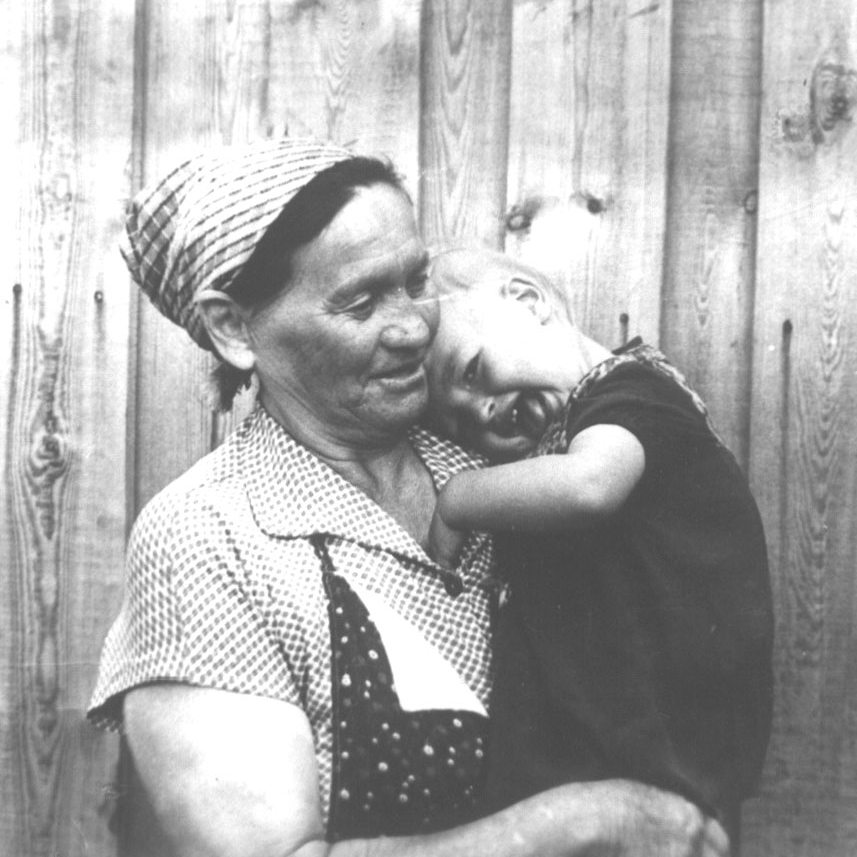

Die Deutschen wurden nacheinander in die Kommandantur bestellt und über den Inhalt des Erlasses informiert. Sie waren nicht besonders glücklich über diese Aktion. Es wurde ihnen kategorisch untersagt, in ihre Häuser, zu den Gräbern ihrer Mütter, Väter und Kinder zurückzukehren. Und wohin sonst könnten die unglücklichen Menschen gehen, die sich nur der unpassenden Nationalität schuldig gemacht haben. Da sie die Geheimhaltung des Dekrets kannten, hatten sie sogar untereinander Angst, darüber zu sprechen.

Ein weiteres Thema meiner Gespräche mit Petja war das Plenum des Zentralkomitees der KPdSU im Juni (1956), das mich in Sdwinsk erreichte. Verglichen mit Chruschtschows "Geheimbericht" war der auf der Sitzung gefällte Beschluss "Zur Überwindung des Personenkults und seiner Folgen" ein großer Rückschritt. Sie bezeichnete Stalin als "einen Mann, der für die Sache des Sozialismus gekämpft hat" und seine Verbrechen als "einige Einschränkungen der innerparteilichen und sowjetischen Demokratie, die unter den Bedingungen des erbitterten Kampfes mit dem Klassenfeind unvermeidlich sind". Das Urteil impliziert, dass die Verdienste Stalins seine Schwächen bei weitem überwiegen, die nach Einschätzung des Urteils nicht entscheidend waren und die Partei nicht vom rechten Weg abbringen konnten.

Oma Olja mit Natascha Es war, als ob Chruschtschow ins Wanken geraten wäre und der konservative Flügel der Partei die Macht übernommen hätte. Stalins Mitstreiter fürchteten weitere Enthüllungen, da sie wussten, dass sie an seinen Gräueltaten beteiligt waren. Das verhieß nichts Gutes für uns.

Wir fuhren Anfang August nach Hause. Tante Matilda lieh sich Geld für unsere Rückreise und konnte es kaum erwarten, dass wir abreisten. Unterwegs wurde Romotschka krank und wir hatten es sehr eilig. Als wir in Krasnojarsk ankamen, nahmen wir ein Taxi nach Jenisseisk. Wir haben sechs Stunden gebraucht, um dorthin zu gelangen. Wir haben bei allen Nachbarn Geld gesammelt, um den Taxifahrer zu bezahlen. Zu Hause gab es nicht einmal eine trockene Kruste Brot.

Ende August traf Olga Fedotowna ein. Ich holte sie in Krasnojarsk ab. Ich hatte Verspätung und verbrachte viel Zeit damit, im Wartesaal herumzulaufen, die Gesichter der Fahrgäste zu betrachten und mein Foto zu überprüfen. Aber Olga Fedotowna war die erste, die mich erkannte. Sie weigerte sich, das Flugzeug zu nehmen und musste mit dem Bus fahren. Dann, bei ihrer Ankunft in Jenisseisk, erzählte sie Nina:

- Er war so flink und trug eine Brille, dass ich ihn sofort erkannte. Er hat mir ein ganzes Kilo Halwa gekauft, und ich habe alles aufgegessen.

Jetzt ist unsere Familie endlich vollständig. Ein Vertreter der älteren Generation war in unser Haus gekommen, freundlich, sympathisch, fleißig. Großmutter Olja war auch eine sehr taktvolle Person. Sie hat sich nie in unsere Beziehungen zu Nina eingemischt oder versucht, uns etwas vorzuschreiben. Die Kinder liebten sie vom ersten Tag an, und ich auch.

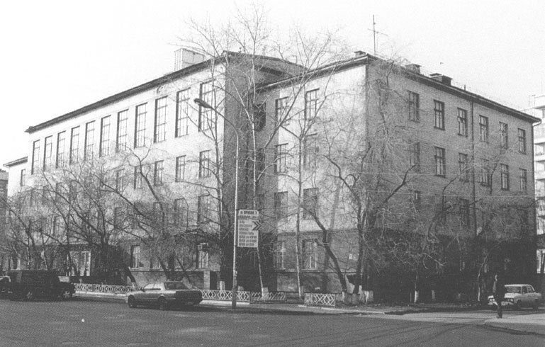

## Teil IV. Widrigkeiten der Freiheit

Krasnojarsk, physikalisch-mathematische Fakultät des Staatlichen

*Krasnojarkser Instituts für Pädagogik, 1978*

### Kapitel 22. Pädagogische Universität Jenisseisk (1956-60)

Am ersten September 1956 begann meine Arbeit am Pädagogischen Institut Jenisseisk. Ein zweistöckiges, rotes Backsteingebäude. Hohe, geräumige, helle Klassenzimmer und Ofenheizung. Die Eingangstür ist mit Brettern vernagelt, und vom Hof aus gelangt man durch eine kleine Tür, durch die sich die Schüler morgens drängen, um vor den Lehrern in die Klassenräume zu gelangen. Die Anwesenheit scheint streng kontrolliert zu werden. Ein kleiner Hof, ein Sportplatz, an dessen Eingang sich die üblichen zwei Skulpturen befinden: ein Sportler mit einem Paddel und ein Sportler mit einem Schläger. Vor der Revolution beherbergte das Gebäude eine Mädchenturnhalle, die nach Angaben der alten Leute von siebzehn Schülerinnen besucht wurde. Im Jahr 1940 wurde dort ein Lehrerinstitut eröffnet, an dem viele Lehrer aus Jenissejsk und dem Bezirk Jenissejsk ihren Abschluss gemacht haben. Im Jahr 1954 wurde es in eine Lehrerbildungsanstalt umgewandelt.

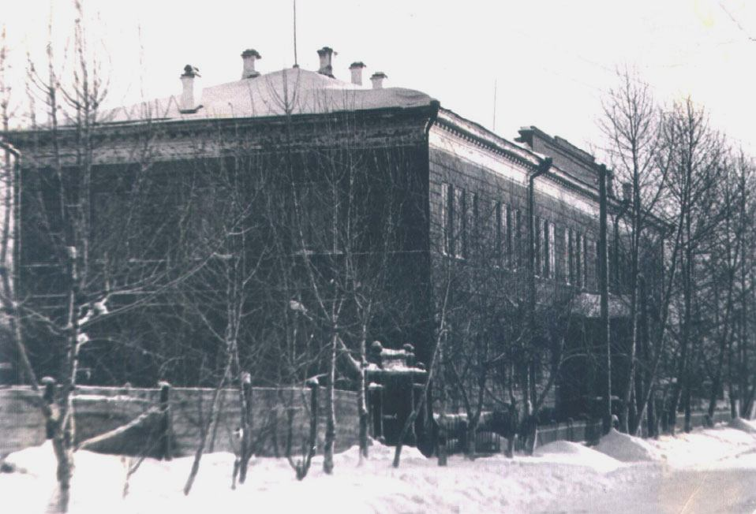

Jenisseisk. Hauptgebäude des Staatlichen Pädagogischen Instituts Es war sehr klein und sehr provinziell. Insgesamt gibt es zwei Fakultäten: Physik und Mathematik sowie Russische Sprache und Literatur; sechs Abteilungen und etwa fünfhundert Studenten. Das Lehrpersonal setzt sich aus Lehrern der drei inzwischen abgeschafften Lehrerbildungsinstitute Jenisseisk, Achinsk und Kolpaschewo zusammen, was in einigen Fällen zu Konflikten innerhalb des Lehrkörpers führte.

Der Direktor des Instituts in den ersten Jahren meiner Tätigkeit war Iwan Agapejewitsch Kiselew, Doktor der Geschichte und außerordentlicher Professor; der Vizerektor für Lehre und Forschung war Nikolai Dmitrijewitsch Wschiwzew, Doktor der Pädagogik und außerordentlicher Professor. Konstantin Archipovitsch Patyukow war Dekan der Fakultät für Physik und Mathematik. Die Abteilung für Mathematik wurde von Wassili Iwanowitsch Jatsejew geleitet, der sich Ende der 1956 in Tomsk aufhielt, wo er seine unter der Leitung von Juri Borissowitsch Rumer erstellte Doktorarbeit verteidigte.

Obwohl ich als Assistent eingeschrieben war, wurde ich für Vorlesungen eingeteilt, insbesondere für einen Kurs über projektive und darstellende Geometrie. Das Schuljahr begann, wie es damals üblich war, mit einem Ausflug zur Kolchose, soweit ich mich erinnere, im Bezirk Kasatschinsk. Ich war mit Studenten aus dem dritten Studienjahr unterwegs, für die es nicht die erste Reise war, so dass ich mir viel weniger Sorgen machen musste als sonst.

Unsere Gruppe kehrte erst Mitte Oktober zurück, als bereits Schnee lag. Der Unterricht begann sofort. Dieses erste Jahr an der Universität hat mir viel abverlangt. Ich hatte zwar einmal die Prüfung in projektiver Geometrie mit einer Eins bestanden, aber das war, wie zu erwarten, nicht genug. Ich musste die Lehrbücher von N.F. Tschetweruchin und N.W. Jefimow erneut lesen. Das größte Problem waren die praktischen Übungen. In Jenisseisk gab es kein einziges Aufgabenbuch für diesen Kurs. Ich musste die Aufgaben selbst zusammenstellen, und mal erwiesen sie sich als sehr einfach, mal sehr kompliziert.

Die Situation wurde dadurch erschwert, dass ich meine Arbeit am Institut mit meiner Schultätigkeit verband, während ich gleichzeitig weiterhin mit meiner geliebten 10 "B" Unterricht abhielt. Schließlich verbrachte ich viel Zeit damit, mich auf die Prüfungen für die Promotion in Fremdsprachen und Philosophie vorzubereiten, die ich in meinem zweiten Jahr am Institut ablegte. Und das alles inmitten einer chronischen Geldknappheit. Auch das Gehalt für einen Assistenten war in jenen Jahren niedrig, und ich bekam weniger als in der Schule. Es gab nicht einmal genug Geld für Lebensmittel und Medikamente, geschweige denn für Kleidung. Aber all diese Schwierigkeiten waren nur vorübergehend. Nachdem ich entdeckt hatte, dass Nina eine gute Schreibkraft war, wurde sie im Jahr siebenundfünfzig als Schreibkraft am Institut eingestellt, und ein Jahr später, 1958, wurde ich zum leitenden Dozenten befördert.

Die Studentenwohnheime und die Häuser der Lehrkräfte waren nur fünf Gehminuten vom akademischen Gebäude des Instituts entfernt. Gemeinsam bildeten sie eine Art Campus im Zentrum von Jenisseisk. Viele Lehrer waren Freunde der Familie. Im Auditorium des Instituts fanden fast jede Woche Themenabende und Konzerte statt, die dank des Einsatzes des bekannten Konzertmeisters und Pianisten Ananij Schwartsburg, der in Jenisseisk eine Exilstrafe verbüßte, ein sehr hohes Niveau hatten. An diesen Abenden nahmen neben den Schülern auch Lehrer und ihre Kinder sowie ein Teil der Exilintelligenz teil. Auf ein Konzert folgte das obligatorische Tanzen. Iwan Agapejewitsch nahm aktiv an allen diesen Veranstaltungen teil. Am Ende des Abends griff er gewöhnlich zum Knopfakkordeon und tanzte zusammen mit Schülern und Lehrern russische und Zigeunertänze. Nina, die mit mir kam, tanzte oft mit ihm.

In meinem zweiten Jahr am Institut erhielt ich eine Zweizimmerwohnung in einem zweistöckigen Backsteinhaus, das aus einem Kaufmannslager umgebaut worden war. In dem Gebäude gab es zehn Wohnungen, die alle von Fakultätsmitgliedern bewohnt wurden. Die mir zugewiesene Wohnung war sehr feucht, und die Kinder, insbesondere Roma und Natascha, waren oft krank. Es wurde gemunkelt,

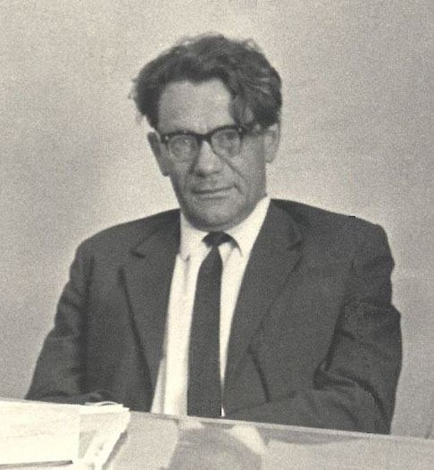

dass dieser Flügel des ehemaligen Lagerhauses für die Lagerung von Salz verwendet wurde. Um die Feuchtigkeit zu beseitigen, grub ich den Boden auf beiden Seiten des Fundaments aus, vertiefte ihn fast anderthalb Meter und bedeckte den entstandenen Graben mit trockenem Sand und Kieselsteinen. Das half jedoch nicht. Es war nicht zu erkennen, wo die Feuchtigkeit auf den Boden gesickert war, und Natascha und Roma husteten nachts verzweifelt. Keine Medikamente halfen. Fluoroskopie und Röntgenaufnahmen ergaben nichts. Auf Wunsch des Arztes nahm ich sogar nachts ihren Husten auf Band auf, denn tagsüber, vor allem in Anwesenheit des Arztes, funktionierte ihr Husten aus irgendeinem Grund nicht".

1957, während meines Aufenthalts in Krasnojarsk und als ich meine Doktorprüfungen ablegte, lernte ich Juri Gottholdowitsch Gorst und Nikolai Wassiljewitsch Loiko kennen – Doktoranden der mathematischen Abteilung des Pädagogischen Instituts Krasnojarsk. Ich erinnere mich, dass ich auf Einladung der Familie Gorst zum ersten Mal deren Haus besuchte. Sie lebten mit Raisa Iwanowna und ihrem Sohn Jurik in einer Privatwohnung in der Leninstraße. Die Vermieterin öffnete die Tür und führte mich in das Zimmer der Gorsts. Jura und Kolja hatten Schürzen umgebunden und formten Knödel. Hände und Gesichter in Mehl. Raja war weg. Wir begrüßten uns, unterhielten uns über ein paar Kleinigkeiten, und dann, nachdem Jura Kolja etwas zugeflüstert hatte, bat mich Jura,aus der "Blauen Donau" etwas Bier zu besorgen. Nachdem er mir den Weg dorthin erklärt hatte, gab er mir einen Emaille-Eimer mit Deckel und schickte mich grinsend zur Tür hinaus. Ich hasste Bier und war sehr besorgt bei dem Gedanken, die Verkäuferin um einen Eimer bitten zu müssen. Aber es war ein Kinderspiel. Ich, oder besser gesagt Jura und Kolja, hatten Glück. Als ich mich dem Ort näherte, zu dem ich gehen sollte, hatte die Verkäuferin gerade den Stand geöffnet, und schon bald bildete sich eine lange Schlange eifriger Menschen hinter mir. Sie trugen Dosen in verschiedenen Größen und Farben sowie Drei-Liter-Dosen in Tüten. Niemand schien meinem Eimer Aufmerksamkeit zu schenken.

Als ich zurückkam, schnupperten Juraj und Kolja ungläubig an der Flüssigkeit. Es stellte sich heraus, dass es zu dieser Zeit schwierig war, Bier zu bekommen, geschweige denn einen ganzen Eimer. Und sie hatten mich geschickt, weil sie wenig Vertrauen in meinen Erfolg hatten, vor allem, weil sie sich über mich lustig machen wollten. Und nun zweifelten sie selbst daran, dass es sich um einen Scherz handelte. Schließlich tauchte Jura seinen Finger in den Eimer und leckte vorsichtig den braunen Schaum ab, um die Zweifel zu zerstreuen. Es war Bier, richtiges Bier, ein ganzer Eimer voll! Sie freuten sich und lachten wie Kinder.

In jenem Sommer lebte ich fast einen Monat lang in Krasnojarsk und hielt Vorlesungen über mathematische Analyse für krasnojarsker Fernstudenten.

Seitdem trafen wir uns regelmäßig. Wenn ich geschäftlich nach Krasnojarsk kam, besuchte ich immer Juri. Wir verbrachten lange Abende und manchmal Nächte damit, über den Sinn des Lebens, Pädagogik und Politik zu diskutieren.

Wir lernten uns von Treffen zu Treffen besser kennen. Im Laufe der Jahre unserer Bekanntschaft, Kommunikation und Freundschaft lernte ich seine mathematischen Fähigkeiten, seinen Anstand und seine Einfachheit schätzen. Er stammte wie ich von den Wolgadeutschen ab, die während der Herrschaft Katharinas der Großen nach Russland eingewandert waren. Seine Vorfahren väterlicherseits waren Bauern gewesen. Doch der Großvater unterbrach diese Linie. Während seines Kriegsdienstes im Kaukasus absolvierte er die medizinische Militärschule und verbrachte den Rest seines Lebens als Dorfkrankenpfleger, wobei er diesen Dienst mit bäuerlicher Arbeit verband. In jenen Tagen vollbrachte er ein Kunststück: Alle fünf seiner Söhne absolvierten eine praktische Schule, drei von ihnen erhielten sogar eine höhere Ausbildung, und einer dieser drei, Jurins Onkel, wurde Doktor der chemischen Wissenschaften – ein Professor, eine angesehene Persönlichkeit der Wissenschaft. Juris Vater spezialisierte sich auf Getreidekulturen, promovierte und wurde zum außerordentlichen Professor befördert. Juris Vorfahren mütterlicherseits waren, ebenso wie meine, baltische und St. Petersburger Deutsche.

Nach der Revolution waren alle seine Verwandten, obwohl sie unpolitisch waren, wiederholt Repressionen ausgesetzt, und junge Familienmitglieder wurden aufgrund ihres nicht-proletarischen Hintergrunds an der Aufnahme eines Hochschulstudiums gehindert.

Im Jahr 1936 wurde sein einziger Bruder Wolodja, der fünf Jahre älter war als Jura und den Jura sehr liebte, verhaftet. Wolodja starb in den Kolyma-Lagern im Alter von 22 Jahren an einer beidseitigen Lungenentzündung.

1942 wurde Juris Familie zusammen mit anderen deutschen Familien aus ihrer Heimat Kamyschin nach Kasachstan umgesiedelt, wo Juri dann in die Arbeitsarmee mobilisiert und nach Solikamsk geschickt wurde, ganz in die Nähe der Orte, an denen auch Nina und ich unsere Strafzeit verbracht hatten.

Trotz harter Arbeitsbedingungen und großem Hunger überlebte Jura, kehrte nach Hause zurück, schloss das Pädagogische Institut in Semipalatinsk mit Auszeichnung ab und schrieb sich für ein Aufbaustudium am Pädagogischen Institut in Krasnojarsk bei Slobodski ein. Als Kind war er ein Wunderkind, das mit sieben Jahren las, was normale Kinder mit zwölf Jahren lesen, dann in der Schule und an der Universität ein hervorragender Student, dem alles ungewöhnlich leicht fiel.

Jura besaß zwar viele Tugenden, war aber kein rechtschaffener Mensch. Er liebte das Leben, er liebte die Frauen, er liebte den Wein, er liebte es, Préférence zu spielen, und er litt, wenn er nichts zu rauchen hatte. Diese Abweichungen von den Gesetzen der christlichen und kommunistischen Moral quälten ihn jedoch nicht. Obwohl er ein typischer russischer Intellektueller war, mochte er nicht tief in seine Seele zu blicken, vor allem nicht in der Öffentlichkeit, und erlaubte dies auch anderen nicht. Er liebte leidenschaftlich Bücher und las sie in großer Zahl. Er liebte die Gesellschaft, war die Seele der Gesellschaft und konnte die ganze Nacht über die verschiedensten Themen sprechen. Er liebte Scherze und verstand sie auch.

Er war im Grunde ein guter und einfühlsamer Mensch. Er war jedoch nicht verweichlicht. Er war entschlossen und unnachgiebig in seinen Einschätzungen von Menschen und Ereignissen, manchmal sogar rücksichtslos, vor allem wenn er seinen Gesprächspartner der Habgier, des Karrierismus oder der Täuschung verdächtigte.

Kolja kannte ich noch viel weniger. Er war zweifellos ein guter Mathematiker, ein hartgesottener Logiker und ein ehrlicher Mensch. Er verfluchte Stalin und die Partei nicht weniger vehement als Jura. Erst viel später erfuhr ich mit großer Verwunderung, dass er bis zum 20. Parteitag und der Rede Chruschtschows bedingungslos alles geglaubt hatte, was in den Zeitungen über die Feinde des Volkes, die Machenschaften der Imperialisten und den Aufbau des Kommunismus stand; er verehrte Lenin, Stalin und die Partei.

Jura berichtete, wie er, als er Kolja kennenlernte, versucht hatte herauszufinden, warum dieser im Gespräch oft seine Mutter und seinen Onkel erwähnte, aber über seinen Vater schwieg. Kolja antwortete düster, dass sein Vater ein Volksfeind war, den man 1937 verhaftet hatte. Auf Jurins Frage nach dem Schicksal seines Vaters antwortete Kolja mürrisch, er wisse es nicht und interessiere sich nicht dafür.

- Und wie sind Sie zum Komsomol gekommen? - fragte Jura.

- Ganz einfach. Ich sagte ihnen, ich hätte nichts mit meinem Vater zu tun", antwortete er.

Als Jura anfing, über die unschuldig Repressierten zu sprechen, verlangte Kolja Beweise. Und zu der Zeit, vor Chruschtschows Enthüllung, hatte er keine. Er konnte nur einige Zweifel in Koljas Seele pflanzen. Aber nur Zweifel. Die Worte des Deutschen, eines besonderen Siedlers, eines minderwertigen Bürgers, waren, wie Jura fand, nicht überzeugend für ihn. Aber als er ähnliche Behauptungen von anderen Doktoranden hörte, dachte Kolja darüber nach. Ich konnte sehen, so erinnerte sich Jura, dass es ihn schmerzte und quälte, dass eine so vertraute und bequeme Weltanschauung für ihn zusammenbrach.

Doch die Zweifel, die solche Gespräche in ihm weckten, hielten nicht lange an. Nach der Veröffentlichung von Chruschtschows "Geheimbericht" erklärte Kolja:

- So viele Jahre lang hat mich die Partei getäuscht, und ich, ein Esel, habe es aufrichtig geglaubt. Nun, das reicht, ich lasse mich nicht mehr täuschen.

Von da an hasste Kolja die Partei mehr als Jura selbst, wie er sagte.

Wir waren uns einig in unserer ablehnenden Haltung gegenüber der Persönlichkeit Stalins, und deshalb konnte diese Frage nicht Gegenstand einer sinnvollen Debatte sein. Eine andere Sache war die Leistung von Nikita Chruschtschow als Erster Sekretär der Partei. Mir persönlich, und auch Jura, gefiel vieles in der Anfangszeit von Chruschtschows Tätigkeit. Ich mochte die von ihm eingeleitete Entstalinisierung; auch wenn sie halbherzig und inkonsequent war, gab sie doch Hoffnung, dass die Partei endlich auf Sklavenarbeit, Gewalt und Blut verzichten würde. Man mochte Chruschtschows Wunsch, mit dem Volk über den Chef des Parteiapparats zu kommunizieren. Wir fanden es auch gut, dass, wenn auch nur gelegentlich und jedes Mal mit der persönlichen Genehmigung Chruschtschows, Werke veröffentlicht wurden, die zu Stalins Zeiten undenkbar gewesen wären.

Im Laufe der Zeit änderte sich jedoch unsere Einschätzung seiner Handlungen und seiner Persönlichkeit selbst. Die Halbherzigkeit und Inkonsequenz aller Unternehmungen war erschreckend. Es gefiel uns nicht, dass er die ganze Schuld für den blutigen Terror auf Stalin und seine politische Polizei schob, als ob die Partei, vertreten durch ihre Mitglieder, nicht alle seine Unternehmungen gebilligt oder unterstützt hätte.

Uns missfiel Chruschtschows Haltung gegenüber den Literaten und sein Bestreben, alle Beschränkungen aufrechtzuerhalten, die sich aus dem Prinzip der "Parteiliteratur" ergaben. Die Entfernung von Twardowskij aus der Führung der "Neuen Welt" und die zügellosen Schikanen gegen Pasternak sorgten für Empörung.

Zahlreiche Streitgespräche löste Chruschtschows Wirtschaftspolitik unter uns aus. Wir waren unterschiedlicher Meinung über die Rolle und die Möglichkeiten der staatlichen Betriebe, über den Wunsch, die Wirtschaft zu dezentralisieren, vertikale durch horizontale Verbindungen zu ersetzen und den Unternehmen mehr Autonomie zu geben. Ich persönlich unterstützte diese Vorhaben, denn sie entsprachen meinem Verständnis von wirtschaftlichem Kalkül. Jura und vor allem Kolja lehnten dies ab, da sie der Meinung waren, dass alle Probleme der wirtschaftlichen Entwicklung des Landes durch die Einführung der elektronischen Datenverarbeitung in die Verwaltung des Landes gelöst werden würden. Streit um Streit, aber die wirtschaftliche Lage des Landes verbesserte sich nicht. Chruschtschow ist es nicht gelungen, die Wirtschaft des Landes anzukurbeln und das stetige Wachstum des Warendefizits zu überwinden oder zumindest zu verlangsamen. Das Setzen auf den Mais als wichtigstes Mittel zur Ankurbelung der Landwirtschaft hatte offensichtlich nicht die erwartete Wirkung und führte nur zu einer Reihe von Scherzliedchen, ein Phänomen, das unter Stalin fatal war. Chruschtschows Slogan "Amerika einholen und überholen" erschien fantastisch. Die Leute scherzten: "Du kannst Amerika einholen, aber du kannst es nicht überholen - du wirst deinen nackten Hintern sehen".

Trotz der Rückschläge in der Wirtschaftspolitik, die ich auf die Notwendigkeit zurückführte, in dem schwierigen politischen Umfeld jener Jahre zu manövrieren, fand ich diese Zeit ungewöhnlich interessant und voller positiver Perspektiven. Unmerklich engagierte ich mich in der Öffentlichkeit, vor allem durch die Gesellschaft "Snanie". Sie begann kurz nach dem Start des ersten künstlichen Erdsatelliten am 4. Oktober 1957. Ich hielt Dutzende von Vorträgen über die Grundsätze des Starts und des Flugs künstlicher Satelliten, die Werke Ziolkowskis, die Perspektiven der Raumfahrt und die Möglichkeit des Lebens im Weltraum vor den Teams von Unternehmen und Organisationen der Stadt, Schülern und Studenten sowie im Kulturhaus der Stadt.

Das große Interesse aller Bevölkerungsschichten an diesem Thema hat mich angespornt. Ich begleitete meine Vorlesungen mit Experimenten, die die Bedeutung des Düsenantriebs erklärten, und baute einfache Raketenmodelle, die ich, um mögliche Komplikationen zu vermeiden, an einem unter der Decke des Hörsaals gespannten Draht starten ließ. Ein langes, dünnes Rohr, gefüllt mit einem Gemisch aus Schießpulver und Kohle, das in zwei Ringen am Draht aufgehängt war, spuckte Feuer, Funken und Rauch, gewann an Geschwindigkeit und glitt über die Köpfe der Zuschauer hinweg. Auf Ersuchen der Redaktion veröffentlichte ich mehrere Artikel über Ziolkowski in der Zeitung "Jenisseisker Prawda".

Ich habe viel Zeit und Energie in die Vorbereitung und Durchführung politischer Informationen in meiner betreuten Studiengruppe investiert. Ich bereitete Material über die Ereignisse in Kuba, im Kongo und in Indonesien, ausgewählte Dias mit Ansichten des Landes, Aufnahmen von Volksmusik und Gedichte vor. Auf Ersuchen der Leitung des Jenisseisker Forstbetriebs hielt er einen Vortrag über die möglichen Formen der Selbstversorgung in der Holzindustrie unter den neuen Bedingungen. Er leitete ein Seminar zur Netzplanung in den zentralen Reparaturwerkstätten.

Ende der fünfziger Jahre gelang es Nina und mir, den nach der Freilassung verloren gegangenen Kontakt zu den meisten unserer Freunde aus dem Lager wiederherzustellen. Nach dem Ende des Verbannungszeit und der Trennung von Jefimtschik verbrachte Olja etwa drei Jahre in Krankenhäusern in Karaganda. 1958 ging sie nach Rostow zu ihrer Mutter und ihren zahlreichen Schwestern. Wir erhielten regelmäßig Briefe von ihr und waren über alle ihre Probleme informiert. Musja, die wie sie einen Exilanten, Wladimir Jakowlewitsch Meitin, in Karaganda geheiratet hatte, lebte mit ihm und ihren beiden Kindern in Maklakowo, nur vierzig Kilometer von Jenisseisk entfernt. Nun besuchten wir uns oft gegenseitig. Ihr Sohn Wowa war genauso alt wie Valera, ihre Tochter Irina im gleichen Alter wie Roma. Jefimtschik ging zu seinen Eltern in die Ukraine. Wassja Schindin kam nach seiner Entlassung nach Jenisseisk und arbeitete auf meine Empfehlung hin eine Zeit lang als leitender Buchhalter in einem der Forstbetriebe, wurde aber wegen seiner Vorliebe für Alkohol entlassen und kehrte nach Aufhebung von Punkt 38 der Passbeschränkungen zu seiner Familie nach Leningrad zurück.

Nachdem ich von Olga gehört hatte, dass David Andrejewitsch Rudi im Bezirk Kansk lebt, beschloss ich, ihm einen Besuch abzustatten. Die Gelegenheit dazu ergab sich bei einer meiner Reisen zur Anwerbung von Abiturienten. Und hier gehe ich nun also die Straße entlang, die mir jemand aus Kansk gezeigt hatte. Rundherum Felder, die bereits im Herbst gepflügt worden sind. Telegrafenmasten entlang der Straße und kein einziges Gebäude am Horizont. Niedrige Wolken, beißender Herbstwind. Plötzlich sehe ich in der Ferne die Gestalt eines einsamen Mannes auf mich zukommen. Etwas Vertrautes war da. Ich dachte: "Ist das nicht David?" Aber ich verdrängte es, es war zu unwahrscheinlich.

Doch es war tatsächlichDavid. Wir umarmt uns und küssten uns sogar, wie ich mich jetzt erinnere. Nachdem wir eine Weile beratschlagt hatten, machten wir uns auf den Weg nach Kansk. Das Restaurant beim Hotel, in dem ich wohnte. Ein Tisch unter einem verstaubten Ficus, wie es in jenen Jahren üblich war. Vorsichtig, um uns nicht gegenseitig zu kränkenen, erinnerten wir uns an unser Leben im Lager. Ich verstand, dass der Schmerz und die Bitterkeit, die uns in der Vergangenheit getrennt hatten, ihre Schärfe verloren hatten. Er erzählte mir, dass er nach den schrecklichen Lagern in Karaganda zu seiner Familie zurückgekehrt war, dass seine älteste Tochter und sein Enkel, die er sehr liebte, bei ihnen lebten. Dann, nach einem Moment der Stille, fragte er:

- Und wie geht es Nina, ist sie glücklich? - und seine Stimme zitterte verräterisch.

Da ich merkte, dass in seiner Seele noch nicht alles erloschen war, und er mir leid tat, erzählte ich ihm, wie die Jahre für uns vergangen waren, nachdem er in ein Sonderlager geschickt worden war. Ich erzählte ihm von unserer Familie, unseren Kindern. Er hörte aufmerksam zu, ohne mich zu unterbrechen und, wie es mir schien,

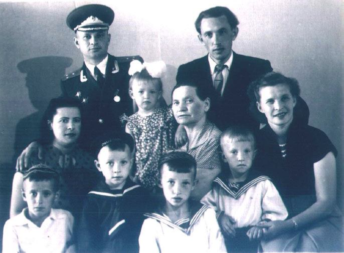

irgendwie gleichgültig. Er wurde hellhörig, als ich von Natascha erzählte. Als ich mich verabschiedete, bat er mich, Nina zu grüßen und dass er gerne Nataschas Patenonkel werden würde. Ich dachte, wenn unser Schicksal anders verlaufen wäre, hätte er ihr Vater sein können.

Als Nina von unserem Treffen und meiner Einladung zu einem Besuch bei uns erfuhr, fragte sie mich nach dem Zweck des Treffens. Ich konnte nicht verstehen, was ich getan hatte, geschweige denn es erklären.

Im Sommer 1958 kamen Witja, Vera und die Kinder Sascha und Schenja nach Jenisseisk. Nina war überglücklich und umarmte bei jeder Gelegenheit ihren kleinen Bruder, der sich von dem unbeholfenen jungen Mann, den Nina in Erinnerung hatte, in einen tapferen Panzersoldaten verwandelt hatte, der in seiner Offiziersuniform sehr imposant aussah. Vera war eifersüchtig, und Witja musste Nina bitten, nicht so viel Freude zu zeigen. Natürlich erinnerte sich niemand an den unglücklichen Brief, der Nina so viel Kummer bereitet hatte.

Jenisseisk, 1958 In der Mitte Oma mit Natascha, links Witja und Vera, Sascha mit seiner Frau, rechts ich mit Nina, Valera und Roma Nach ihrer Abreise Ende Juli nutzten wir das Recht auf kostenlose Beförderung zu und von unserem Urlaubsort, das uns laut Vertrag alle drei Jahre gewährt wurde, und besuchten Lalja in Rostow. Ernotschka wohnte zu dieser Zeit dort, und so konnten wir endlich wieder Zeit miteinander verbringen wie in unserer Jugend: Ernotschka, Lalja und ich. Was für eine tolle Zeit das war. Die Erinnerung daran ist in

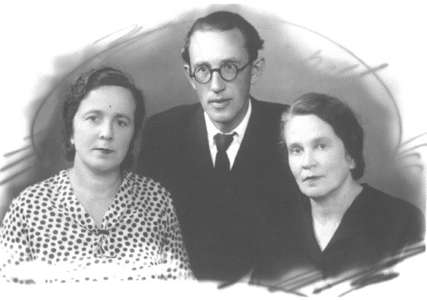

zahlreichen Fotos festgehalten. Leider war es schnell vorbei, Ernochka fuhr nach Hause nach Sdwinsk.

Rostow 1958. Lalja, ich und Ernotschka Hier kann ich nicht umhin, von einem Ereignis zu erzählen, das Ninas und meine Beziehung zum Handel anschaulich beschreibt. Kurz nach unserer Reise nach Otradowka kam Fjodor Wassiljewitsch, ein Freund ihres Vaters, nach Rostow, um auf dem Kolchosmarkt Wassermelonen zu verkaufen, und bat Nina, zwei Dutzend geschlachtete und gerupfte Hühner von seinem eigenen Hof zu verkaufen.

- Sei aber nicht zu billig. Ich war schon auf dem Markt und habe mich erkundigt: Hühner wie meine kosten fünfunddreißig Rubel pro Stück", sagte Fjodor Wassiljewitsch und reichte Nina den Koffer mit den Hühnern und allen für den Handel erforderlichen Bescheinigungen.

Nina war schockiert. Ihr gesamtes Komsomol-Gewissen war gegen die Aktion. Ich war auch nicht gut darin, aber nicht aus demselben Grund, sondern wegen meiner intellektuellen Skrupel. Ich dachte mir, wenn wir uns nicht schämen, auf den Markt zu gehen und Lebensmittel zu kaufen, warum sollten sich die Verkäufer schämen, sie zu verkaufen. Aber ich konnte mein Vorurteil nicht überwinden. Das Einzige, dem ich zustimmte, war, daneben zu stehen.

- Ich werde nur so tun, als würde ich dich nicht kennen und hätte mit den Hühnern nichts zu tun", sagte ich entschieden.

Igor half mir. Frühmorgens, vor der Arbeit, brachte er mich und Nina zum zentralen Markt, der nur sechs Straßenbahnhaltestellen entfernt war, bezahlte den Verkaufstresen, den Kittel und die Waage und verkaufte sogar zwei Hühner. Nachdem er sie verkauft hatte, ging er zur Arbeit. Wir, oder besser gesagt Nina, wurden mit den Kunden allein gelassen. Sie verkaufte ihr erstes Huhn zu dem von Fjodor Wassiljewitsch festgelegten Preis. Aber der zweite Käufer bat sie, es für fünfundzwanzig (ich nenne den Preis konventionell, weil ich mich nicht an den echten erinnere) abzugeben. Sie sagte, dass sie das Huhn brauche, um eine Brühe für ihren schwerkranken Sohn zu kochen, und dass sie nicht genug Geld habe. Nina, die sich daran erinnerte, was sie während Romas Krankheit durchgemacht hatte, lenkte natürlich ein. Ich bin sicher, dass sie bereit war, das Huhn sogar zu verschenken. Aber da empörte sich die Kundenschlange.

- Auch wir haben kranke Kinder und wenig Geld!

Nina, die über diese Reaktion verblüfft war, wandte sich an mich und suchte nach Unterstützung.

- Verkaufe es für fünfundzwanzig, wir melden die Differenz", flüsterte ich.

Die Hühner waren im Handumdrehen vergriffen und in einer Stunde waren wir wieder zu Hause. Aber wir hatten kein Glück. Zu Hause saß Fjodor Wassiljewitsch am Tisch und trank Tee. Er sah Nina misstrauisch an und fragte:

- Wie, jetzt schon? Du hast sie bestimmt zu billig verkauft. Genau das habe ich mir gedacht. Wozu ist ein Städter überhaupt gut!

- Nein, Fjodor Wassiljewitsch, wir haben für fünfunddreißig verkauft, so wie Sie es uns gesagt haben", log Nina munter vor sich hin.

- Fünfunddreißig, fünfunddreißig", spottete Fjodor Wassiljewitsch, "du hättest also für vierzig verkaufen müssen. Sie war ein Taugenichts, der nur mit ihren Komsomolzen plauderte, und ist es immer noch", schimpfte Fjodor Wassiljewitsch weiter.

In diesem Jahr sind wir nicht ans Meer gefahren. Wir ruhten uns am Don aus. In Begleitung von Tanjuscha fuhren wir mit dem Boot ans linke Ufer des Don, in den Schatten der Eichenwälder. Es gab dort einige schöne Sandstrände, aber das Wasser war schlammig, ganz anders als im Jenissei.

Wir hatten eine Menge Ärger mit der Taktlosigkeit der Leute. Zu Hause waren wir daran gewöhnt, dass Roma so dünn ist. Aber hier am Strand, inmitten von dicken, manchmal sogar übergewichtigen Kindern, war er die ständige Neugierde der Urlauber. Die stämmigen Mütter fragten Nina, warum sie ihr Kind so quälte. Der Zufall wollte es, dass Roma sich mit dem übergewichtigen Jungen anfreundete. Gemeinsam bildeten sie eine groteske Gruppe, die alle Aufmerksamkeit auf sich zog. Ab und zu gab es Geschrei:

- Schau mal, schau dir die Jungs da drüben am Ufer, direkt am Wasser an. Wie mager, direkt aus Auschwitz. Solche Eltern sollten verurteilt werden.

Es war schmerzhaft, ihm zuzuhören, und wir versuchten, uns so gut es ging zurückzuziehen. Roma, Valera und Natascha, die bereits drei Jahre alt war, zog es zu den anderen Kindern. Wie dem auch sei, wir haben uns in diesem Jahr recht gut erholt. Durchtränkt von Luft und Sonne kehrten wir nach Jenisseisk zurück.

Im Jahr 1960 gab es eine Reihe von Ereignissen, die das soziale Klima am Institut erheblich veränderten. Alles begann, als Iwan Agapejewitsch Kiselew am Ende seiner fünfjährigen Amtszeit zurücktrat und nach Nowomoskowsk zog. Alle erwarteten, dass Wassili Iwanowitsch Jatsejew zum Rektor ernannt würde, da er alle erforderlichen Qualifikationen mitbrachte: Kommunist, Veteran, Kandidat der Wissenschaften, ein außerordentlicher Professor, der die Arbeit des Instituts sehr gut kannte. Aber das Erwartete trat nicht ein. Das regionale Parteikomitee entsandte Nikolai Iwanowitsch Demko, Assistenzprofessor der Philosophieabteilung des Pädagogischen Instituts in Krasnojarsk, auf den Posten des Rektors in Jenisseisk. Was hinter dieser Entscheidung stand, weiß ich bis heute nicht. Es heißt, er habe schwierige Beziehungen zum Bezirks- oder Stadtparteiausschuss gehabt. Angesichts der Strenge seines Charakters und seiner hohen Integrität ist dies nicht schwer zu glauben.

Die Mitarbeiter des Instituts begegneten der Entscheidung des regionalen Parteikomitees mit ohrenbetäubender Unzufriedenheit, und soweit ich weiß, hatte Nikolai Iwanowitsch Demko anfangs eine schwere Zeit. Im Gegenteil, ich, der ich aufgrund meiner Position weit von diesem Kampf hinter den Kulissen entfernt war, hatte das Gefühl, dass die in solchen Fällen übliche Umgruppierung der Kräfte und Einflusszonen im Team stattfand.

Bald wurde der Vizerektor für Bildung und Forschung ersetzt. Anstelle des lange und schwer erkrankten Nikolaj Dmitriewitsch Wschiwzew wurde der sehr umgängliche und recht junge Kandidat der pädagogischen Wissenschaften Dmitrij Galaktionowitsch Scholudew ernannt.

Diese Veränderungen in der Leitung des Instituts, die das gesamte Team in Aufruhr versetzten, beunruhigten mich nicht sehr. Viel wichtiger und denkwürdiger war die Tatsache, dass Ende 1960 der unter Iwan Agapejewitsch begonnene Bau eines zweistöckigen Balkenhauses mit acht Wohnungen für die Lehrer endlich fertiggestellt wurde. Unserer Familie wurde eine Drei-Zimmer-Wohnung im Erdgeschoss zur Verfügung gestellt. Und obwohl es, wie alle anderen Häuser in Jenisseisk, über eine Ofenheizung und keinerlei Annehmlichkeiten verfügte - keine Toilette, kein Bad, nicht einmal fließendes Wasser - lebten wir dort gut, und das besonders Angenehme die Wohnung war trocken und warm.

Im Gegensatz zu den Bewohnern der Wohnhäuser in Krasnojarsk, welche ihre Nachbarn, die auf demselben Stockwerk wohnen, nur selten kennen, kannten wir uns alle, und unsere Kinder haben aktiv miteinander interagiert: Wir haben uns angefreundet, wir haben uns gestritten und wir haben uns wieder versöhnt.

Witalij Wladimirowitsch Baschurow, Dozent an der Fakultät für Physik, wohnte mit seiner Frau in unserer Haushälfte im Erdgeschoss. Sie waren etwa zehn Jahre älter als wir und sympathisierten offen mit Nina, insbesondere Witalij Wladimirowitsch. Bei jeder Gelegenheit, ohne den ersten April abzuwarten, spielte er ihr einen Streich und führte speziell Buch darüber, welche ihm gelungen waren. Er gab sich als Installateur aus und drohte damit, die Leitungen zu kappen, angeblich wegen Nichtzahlung, oder er drohte als Vertreter des Telefonnetzes damit, dass wir vom städtischen Netz abgeschaltet würden, wenn wir die Gebühren nicht bezahlten, oder er verlangte im Namen der Gewerbeaufsicht die Zahlung der Steuer für einen Standplatz auf dem Markt.

Nina, die seine Stimme, die er meisterhaft zu verändern wusste, nicht erkannte, war nervös und bewies, dass sie die Zahlung persönlich getätigt hatte, kramte in ihrer Handtasche und in Kästchen nach der unglückseligen Quittung, um die Nummer aufzugeben, und als sie sie nicht fand, wurde sie noch nervöser. Der Anruf des angeblichen Gewerbeaufsichtsamtes verärgerte sie besonders heftig. Sie schrie lange und aufgeregt in den Telefonhörer, um zu beweisen, dass sie nichts mit Marktspekulanten zu tun hatte, dass sie in ihrem ganzen Leben noch nie eine einzige Karotte oder einen einzigen Knopf verkauft hatte.

Nachdem er den Höhepunkt ihrer Wut abgewartet hatte, meldete sich Vitalij Wladimirowitsch mit seiner eigenen, nicht mehr verzerrten Stimme am Hörer:

- Hallo, Ninucha! Das Ergebnis war also 13:0 zu meinen Gunsten. Oh, fast hätte ich es vergessen: Elisabeth Iwanowna lädt Sie ein, den Kuchen zu probieren, den sie gerade gebacken hat.

Sinaida Wassiliewna Stefanskaja lebte mit ihrem Mann und ihren beiden Söhnen Andrej und Oleg über uns. Sie lehrte Philosophie und Atheismus am Institut und beschäftigte sich intensiv mit den Problemen der Sektenbewegung innerhalb des orthodoxen Glaubens.

In der zweiten Hälfte des Hauses, direkt neben uns, lebte anfangs Wassilij Jatsejew mit seiner Frau und seiner Tochter Lida und nach ihrem Umzug nach Perm der Dozent der mathematischen Fakultät Oleg Schirokolobow mit seiner Frau und drei Kindern: Boris, der so alt war wie Valera und mit ihm in dieselbe Klasse ging, Schenja, der so alt war wie Roma, und Natascha, die so alt war wie unsere Natascha. Oleg Grigorjewitsch hatte ein außergewöhnliches Gehör für Musik und spielte her-

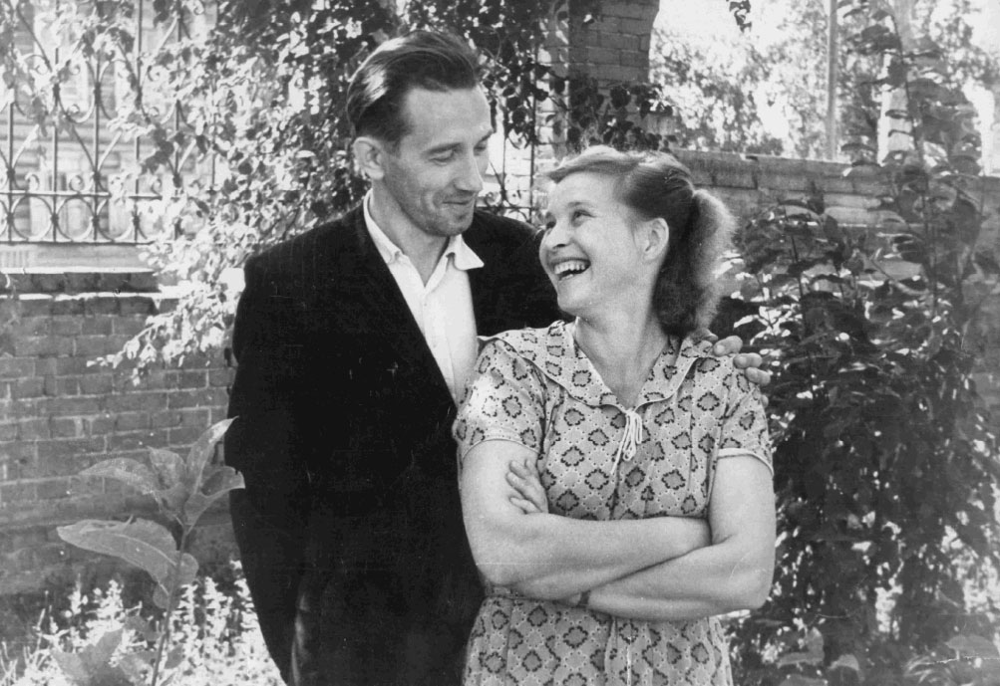

vorragend, ohne Noten, wobei er die Melodie mit Leichtigkeit in sich aufnahm. Er spielte alle ihm zur Verfügung stehenden Musikinstrumente: Klavier, Akkordeon, Ziehharmonika, Gitarre, Balalaika mit gleichem Erfolg. Keine einzige Party konnte ohne ihn stattfinden, zumal er, obwohl er genauso viel trank wie alle anderen, nie betrunken wurde, sondern sein Spiel sich nur noch mehr verbesserte.

Über den Schirokolobows lebten die Schdanows: Maria Michailowna, Englischlehrerin, ihr Mann Wladimir Sergejewitsch, Sportlehrer, und zwei Töchter, Ljusja und Sweta. Bei der Auflistung ihrer Familienmitglieder habe ich nicht zufällig mit Maria Michailowna begonnen. Sie war es, die meiner Meinung nach das geistige und moralische Bild der Familie und ihres äußeren Umfelds prägte. Ihr Einfluss auf ihre Mitmenschen reichte weit über die Familie hinaus. Sie war die Initiatorin der meisten Partys, die in unserem Haus stattfanden, und wusste, wie man sie hübsch dekoriert und veranstaltet. Ihre Wohnung war geschmackvoll eingerichtet, der Tisch schön gedeckt, die Weine gut ausgewählt, das Essen köstlich zubereitet. Klein, gut gebaut, immer modisch gekleidet und fröhlich, zog sie unbewusst viele unserer Teammitglieder in ihren Bann. Wladimir Sergejewitsch war im Gegensatz zu seiner Frau ein phlegmatischer Mensch, was nicht zu seinem Beruf passte. Morgens kam er oft zu uns, setzte sich auf eine niedrige Bank vor der offenen Tür des Heizofens, rauchte eine Zigarette und ging schweigend davon.

Wir im Institutsgarten Es war nicht so sehr die gemeinsame Arbeit im Institut, die die Mieter zusammenbrachte, sondern die gemeinsame Gartenarbeit, die Ausflüge in den Wald zum Pilze sammeln, das Angeln und vor allem die Feste, mit denen derartige Maßnahmen Veranstaltungen gewöhnlich endeten. Dazu trugen auch gemeinsame Festtagstreffen bei, insbesondere zum Jahreswechsel, die Maria Michailowna Schdanowa am häufigsten organisierte.

Nina und ich nahmen oft an Schdanows Partys teil. Ich mochte sie, vor allem in der Anfangsphase, als das frisch duftende Tischtuch noch nicht verschmutzt oder zerknittert, das strenge Bild der gedeckten Tische noch nicht durcheinandergeraten, das Geschirr sauber und das Kristall klar und wohlklingend war. Wir mochten die gedämpfte Musik, die ruhigen und einfachen Gespräche, die lächelnden und freundlichen Gesichter. Ich mochte die Gastgeberin und ihren schweigsamen Ehemann.

Mit Bedauern sah ich zu, wie Schritt für Schritt, Toast für Toast, die Harmonie zerfiel. Die kunstvoll verzierten Berge bunter Salate, das Mosaik aus dünnen Wurstscheiben, Rippchen, Käse und die komplizierte Schichtung meines geliebten "Herings unterm Pelzmantel" lösten sich in Nichts auf. Mit dem Absinken des Inhalts von Flaschen, Karaffen und Dekantern stieg die Stimmung auf der Party. Die Musik wurde lauter, die Gespräche und Linien schärfer. Der zunächst kollektive und organisierte Tanz löste sich nach und nach auf und wurde zur Domäne von Amateuren. Einige saßen am Tisch und besprachen ihre Probleme, andere stapften langsam im Nebenzimmer bei gedämpftem Licht umher, während manche es sich in Sesseln bequem machten oder, dicht gedrängt auf dem Treppenabsatz, rauchten.

Ich selbst wusste nicht, wie man Spaß hat, oder besser gesagt, ich hatte Angst davor, Spaß zu haben. Ich hatte immer den Eindruck, dass ein Unglück folgen würde, natürlich in erster Linie mit meinen Kindern. Ich war nur dann richtig glücklich, wenn meine Kinder bei mir waren. Aber ich habe es geliebt, anderen und vor allem Nina dabei zuzusehen, wie sie Spaß hatten.

Mein Verhalten auf diesen Partys war alles andere als kameradschaftlich: Ich lehnte ostentativ die leichtesten und unschuldigsten Weine ab, brachte keine Trinksprüche aus, aß mäßig, sang keine Tischlieder mit allen, tanzte nicht, obwohl ich, wenn ich hätte tanzen können, es wahrscheinlich den ganzen Abend hindurch getan hätte.

Anfangs waren unsere neuen Bekannten misstrauisch wegen meiner kategorischen Weigerung, Wein zu trinken. Ich erinnere mich, dass ich in einem Urlaub zum Haus der Jatsejews fuhr und mich weigerte, ein Strafglas Wodka zu trinken. Wassilij Iwanowitsch, der sich bereits in einem feierlichen Zustand befand, schrie vor Wut:

- Ich verstehe dich nicht, du musst Deutscher oder Jude sein!

Die Unnahbarkeit und die Isolation, die ich an den Tag legte und die auf meinen zahlreichen inhärenten Komplexen beruhten, vor allem auf meiner Angst, lächerlich zu wirken, wurden von Nina geglättet. Sie hatte sich in den letzten Jahren dramatisch verändert. Sie hat sich von einem schüchternen, ängstlichen und schweigsamen Mädchen mit traurigen grauen Augen zu einer recht frechen und fröhlichen Frau entwickelt. Ihre Offenheit für Kommunikation und Freude war natürlich und entspannt, im Einklang mit ihrem ursprünglichen Selbst und ihrer Komsomol-Vergangenheit. Diese Verwandlung war mir peinlich und machte mich sogar traurig, denn ich war dem Bild des traurigen Fremden von Blok näher.

Nina war keine Schönheit und ihre Figur war nicht perfekt, aber alle Männer in unserer Gesellschaft behandelten sie gut, manchmal sogar übertrieben gut, und wenn ich mir ihrer Gefühle für mich nicht sicher gewesen wäre, wäre ich wahrscheinlich sehr eifersüchtig gewesen. Besonders angetan waren sie von ihren tänzerischen Fähigkeiten, die Nina gut beherrschte und stundenlang ausüben konnte. Sie hat viel schlechter gesungen, wenn man das überhaupt singen nennen kann, und doch war sie immer bereit, mitzusingen. Sie nie Missbrauch mit Wein, obwohl sie einem Glas Sekt oder einem Glas trockenen Wein nicht abgeneigt war. Meine hartnäckige Weigerung, ihr dabei Gesellschaft zu leisten, wurde verurteilt, und sie versuchte mich zu überreden, ein Glas an meine Lippen zu bringen, damit es wenigstens so aussah. Aber ich blieb hartnäckig, und mit der Zeit gewöhnten sie sich daran, und ich wurde nicht mehr belästigt. Bei dem anderen war es noch schlimmer. Die Männer ärgerten sich, dass ihre Frauen mich ständig als Beispiel anführten: "Er trinkt nicht, raucht nicht, liebt seine Frau, kümmert sich um alles im Haus und um die Kinder. Das konnten sie mir kaum verzeihen.

Nicht nur bei festlichen Anlässen spürten wir Einigkeit und Unterstützung füreinander. Sie war auch in Zeiten der Gefahr und des Unglücks zu spüren. Ich werde nie vergessen, welche Unterstützung wir von unseren Nachbarn erhielten, als Natascha fast ihre Zunge verlor. Ich erinnere mich gut an diesen warmen Frühlingstag. Ich hielt eine Vorlesung über die Theorie der Funktionen einer reellen Variablen. Die Tür öffnete sich und Oleg rief:

- Laufen Sie schnell zum Krankenhaus, Natascha geht es nicht gut.

Ich kann mich nicht daran erinnern, dass ich die Treppe oder die Straße hinuntergelaufen und mit Leuten zusammengestoßen bin. Nina, mit Natascha auf dem Arm, gefolgt von Valerik. Ich holte ihn vor der Tür des Krankenhauses ein, denn es war ganz in der Nähe. Und dann sah ich Blut. Natashas Blut tropfte aus ihrem Mund, rann ihr Kinn hinunter und tropfte auf den staubigen Bürgersteig. Das Entsetzen packte mich. Meine Beine fühlten sich wie Watte an.

- Was ist passiert? - war das Einzige, was ich fragen konnte.

Ohne irgendeine Erklärung abzugeben, forderte Nina:

- Schnell in die Notaufnahme, zum Chirurgen!

Wir waren bereits in der Notaufnahme. Der Chirurg, der einen Spatel schwang, konnte Nataschas Zähne gerade noch öffnen. Ihre Zunge war durchtrennt und hielt nur noch an den Rändern. Natascha wurde in den Operationssaal gebracht, und wir blieben in quälendem Warten zurück.

Wie Nina mir später erzählte, stand Natascha auf der Bank im Hof und sprach durch das Fenster mit Romotschka. Plötzlich kippte die Bank um und Natascha schlug beim Fallen mit dem Kinn auf das Fensterbrett.

Armes kleines Ding, ich erschaudere immer noch, wenn ich mir vorstelle, wie sie ihr die Zunge mit einer Nadel angenäht haben. In den ersten Tagen nach der Operation öffnete sie den Mund nicht und weigerte sich, ihre Medikamente zu nehmen oder Wasser zu trinken. Dann, etwa einen Monat lang, sagte sie kein Wort mehr, sondern muhte nur noch. Während dieser langen, für uns und vor allem für Natasha schmerzhaften Tage verließ Valerik nie ihr Bettchen, las ihr Märchen vor und war der wichtigste Vermittler zwischen ihr und dem Rest der Welt, da er ihre Gesten mühelos deuten konnte.

Was Unterhaltung und Vergnügen angeht, waren unsere Kinder in jenen Jahren, glaube ich, auch nicht schlecht bedient. Ein riesiger gemeinsamer Innenhof, der von Lehrerhäusern und Studentenwohnheimen begrenzt wird. Eine Schar von Kindern, die jedem bekannt waren und die jeden kannten. Die Türen aller Fakultätswohnungen und Schlafsäle standen ihnen offen. Die Anführer waren allerdings die älteren: unser Valera, Wowa Borissow und Boris Schirokolobow. Hinter ihnen stand eine Gruppe von Kindern, die ihnen in den Mund schauten und sich von ihnen leicht provozieren ließen: Ljusja und Sweta Schdanow, Ljuda Borissowa, Roma, Natascha, Natascha Schirokolobowa.

Die Kinder hatten immer jemanden, mit dem sie spielen konnten, jemanden, mit dem sie befreundet waren, jemanden, mit dem sie sich streiten und jemanden, mit dem sie Frieden schließen konnten. Gemeinsam dachten sie sich kleine Kinderstreiche aus, und gemeinsam bereuten sie, was sie getan hatten. Ständiger Gegenstand ihrer Späße war der Ehemann von Kira Afanasjewa, einem Lehrer für russische Sprache, der oft und viel trank und in diesem Zustand den Kindern nachstellte. Aus diesem Grund gab es einen ständigen Krieg zwischen ihm und den Kindern, die ihn Afonja nannten. Sie bedrängten ihn, wo sie nur konnten. Einer ihrer "Scherze" bestand darin, einen Faden mit einer beschwerten Streichholzschachtel an einen Nagel über seinem Fenster zu binden - die Afanasjews wohnten im ersten Stock unseres Hauses. Der andere Faden aus der Kiste führte zu den Scheunen, in denen sich die Kinder versteckt hielten. Auf das Signal einer Laterne hin wurde an der Schnur gezogen und die Kiste schlug gegen die Scheibe. Im selben Moment rief Luda Borissowa 'Athos' an und teilte ihm mit leiser Stimme mit, dass es der Tod war, der ihm etwas zu trinken gebracht hatte.

Der "Krieg" mit Afanasjew endete in Schwierigkeiten. Um ungebetene Flaschensammler abzuwehren, verkleideten die Kinder eines Winters eine Vogelscheuche und stellten sie vor die Scheunen. Die Vogelscheuche stand zufällig direkt vor Afonias Fenster. Doch am Abend ließ ein starker Wind den "Hüter der Ordnung" fallen. Afanasjew, der ziemlich beschwipst war, rief die Polizei an und teilte ihr mit, dass sich unter seinem Fenster eine Leiche befinde. Die Polizisten kamen mit einem Schäferhund, weckten die ahnungslosen Mieter und nahmen "Afanasjew" mit. Dann mussten wir ihn retten.

Die sprudelnde Energie der Kinder hatte oft Folgen, die gar nicht in ihren Plänen lagen. Hinter einem niedrigen Zaun im Hof befand sich eine Art Garten. Im Winter türmten die Mieter, die den Bürgersteig reinigten, Berge von Schnee darauf. Am Ende des Winters hatte er sich gesetzt, und die Frauen, die die Wäsche aufhängten, trampelten ihn fest. Niemand bemerkte, dass die Kinder wie Maulwürfe in diesen Schneebergen Löcher, Gänge und ganze "Säle" gruben. An diesem Tag wurde bei uns die Wäsche gewaschen. Großmutter Olja nahm die saubere Wäsche mit auf den Hof und hängte sie an einem Seil auf, das über die Schneewehen gespannt war. Als sie längere Zeit nicht wieder zurückkehrte, wunderte sich Nina und trat in den Hof hinaus. Olga Fedotowna war nirgends zu finden, aber ihre Schreie waren deutlich zu hören. Mit vereinten Kräften holten wir sie zu guter Letzt aus dem Schnee heraus, woraufhin Nina, bewaffnet mit einer Schaufel, das Bauwerk schon zerstören wollte; dann tat es ihr aber um die mühsame Arbeit der Kinder leid, und außerdem war Baba Olja schließlich mit einem kleinen Schrecken davongekommen.

Aber es hatte schon schlimmere Streiche gegeben. Ich erinnere mich an den Aufruhr, der im Hof entstand, als aus einem der Holzschuppen Rauch aufstieg. Es stellte sich heraus, dass die Kinder in einem der Holzhaufen eine Art Ofen gebaut und ein Feuer angezündet hatten, um Futter für ein armes, halbtotes Kätzchen zu kochen, das sich im Hof verlaufen hatte. Und diese Holzschuppen, die neben dem Haus standen, enthielten etwa 60 Kubikmeter trockenes Brennholz. Glücklicherweise waren solche "Streiche" nicht sehr häufig. In der Regel waren die Spiele friedlich und nicht so gefährlich.

Um die Kinder, vor allem die jüngeren, zumindest teilweise bei der Stange zu halten, fuhren die Eltern im Sommer abwechselnd mit ihnen aufs Land, meist an den Fluss Kem. Dort badeten sie, machten Lagerfeuer und pflückten Blumen. An solchen Tagen war es in unserem Hof ungewöhnlich ruhig, und die Bewohner, vor allem diejenigen, die keine Kinder hatten, gönnten sich eine Pause vom Lärm und der Hektik. Ich ruhte mich nicht aus, sondern war vielmehr nervös und hatte ein Bild vor Augen, das mir mehr Angst machte als alles andere. Immerhin gab es einen Fluss, wenn auch nicht den Jenissei, so doch einen Fluss, in dem ein Kind ertrinken konnte, und in der Nähe war ein Wald, in dem es sich verirren konnte. Es wurden auch Lagerfeuer entfacht, über die die Kinder versuchten, hinwegzuspringen. Alles war gefährlich und ich konnte kaum Ruhe finden. Ich war nur dann gelassen, wenn ich die Gruppe begleitete.

Ein großes und wichtiges Ereignis im Leben der Bewohner von Jenisseisk war die Beeren- und Pilzsaison. Als es so weit war, strömte die gesamte Bevölkerung und vor allem die Frauen mit ihren Kindern, bewaffnet mit Eimern, Kisten aus Birkenrinde oder Weidenkörben, in den Wald, der nicht weit von der Stadt entfernt war. Die Männer bevorzugten Fischfang und Jagd.

Auch Nina und ich entkamen dem Pilzrausch nicht. Wir gingen zusammen mit den anderen Lehrern unseres Schulhofs in den Wald, sammelten jedoch mangels Erfahrung weniger Pilze als andere. Das verletzte mein Selbstwertgefühl, und ich tat so, als würde mich die Suche nach Pilzen überhaupt nicht reizen. Nina hingegen widmete sich dem Prozess mit ganzer Hingabe. Ich liebte es, ihr dabei zuzusehen, wie sie sich über jeden Pilz freute, den sie fand. Wenn ich also eine Lichtung voller Pilze oder einen Baumstumpf voller Buchenpilze sah, versuchte ich, Nina so unauffällig wie möglich dorthin zu führen, damit sie dachte, sie hätte sie ohne meine Hilfe gefunden.

Ich bin sicher, dass Valera, Roma und Natascha die meisten ihrer Kindheitserinnerungen mit diesem Haus und seinen Bewohnern verbinden.

### Kapitel 23. Parteibuch (1961- 62)

An einem Frühlingstag im Jahr 1961 wurde ich von Dmitrij Galaktionowitsch Scholudew eingeladen. Nach einem kurzen Einführungsgespräch über die Veränderungen im Land und in der Partei fragte er mich, was ich von einem Beitritt zur Partei halten würde. Die Frage überraschte mich. Ich hätte mir nie vorstellen können, dass man mir, einem ehemaligen Sträfling, der seine Zeit unter einem politischen Artikel abgesessen hatte, und zudem einem Deutschen ein solches Angebot machen könnte. Das ist wahrscheinlich nur eine persönliche Meinung von Dmitri Galaktionowitsch", dachte ich und fragte laut:

- Sie machen wohl Witze, ich habe eine Haftstrafe unter einem politischen Artikel verbracht, wer würde mich dort schon aufnehmen?

- Aber Sie sind rehabilitiert worden, rehabilitiert aus Mangel an Tatbeständen, wandte Dmitrij Galaktionowitsch halb fragend, halb bekräftigend ein, das ändert alles. Wir haben bereits mit dem Bezirksausschuss gesprochen. Wir brauchen nur Ihren Antrag, beendete Scholudew mit der Betonung auf "wir".

Jetzt wurde mir klar, dass das Angebot fast schon offiziell war und dass ich ernsthaft darauf reagieren musste. Dmitrij Galaktionowitsch erwartete natürlich, dass ich das Vertrauen sofort annehmen und mich dafür bedanken würde. Aber irgendetwas hielt mich zurück. Etwas Persönliches und Tiefgründiges. Da ich Chruschtschow vertraute, traute ich den Bolschewiki, den Kommunisten, der Partei nicht. Trotz allem, was bekannt wurde, hat die Partei nichts bereut. Ihre Verfassung, die bedingungslosen Gehorsam gegenüber allen, auch den grausamsten und blutigsten Entscheidungen ihrer Führer verlangte, blieb unverändert. Indem ich mich ihr anschloss, verriet ich meine Freunde, meine Lieben, meine Mutter. Aber natürlich konnte ich das alles nicht laut sagen. Es war zu gefährlich. Um mir einen gewissen Handlungsspielraum zu bewahren, beschloss ich, auf den unerwarteten Vorschlag und meine Unvorbereitetheit auf einen so wichtigen Schritt hinzuweisen.

- Na gut, denken Sie darüber nach, aber lassen Sie sich mit der Antwort nicht zu viel Zeit", sagte Scholudew und lächelte aufmunternd.

Fassungslos und bestürzt über das Gespräch ging ich nach Hause. Einerseits war das Angebot schmeichelhaft und zeugte einmal mehr von der guten Einstellung des Instituts mir gegenüber, andererseits war es erschreckend. Ich hatte es immer vorgezogen, mich zurückzuhalten. Mein Eintritt in die Partei würde für viele bedeuten, dass ich Aufstiegsambitionen hätte, und ich würde sofort in das Blickfeld der Hüter der ideologischen Reinheit der Partei geraten.

Dennoch hatte ich damals den Eindruck, dass das Angebot mehr Vor- als Nachteile mit sich brachte. Der Beitritt zur Partei stärkte meinen sozialen Status, eröffnete mir mehr Möglichkeiten für beruflichen Aufstieg und Beförderung und gab mir das Recht auf mehr Informationen und Entscheidungsbefugnisse. In Gesprächen mit Parteimitgliedern wurde mir klar, wie weit viele von ihnen von dem Bild des glasklaren Kommunisten entfernt waren, dass die sowjetische Propaganda den Menschen eingeimpft hatte. Arrogante Dogmatiker, die meinten, sie seien durch ihre Parteizugehörigkeit besonders einsichtig, besonders intelligent und mehr um das Land und die Institution besorgt als alle anderen, haben mich irritiert. Ich spürte ihre Unzufriedenheit mit der Politik Chruschtschows und ihren inneren Protest gegen seine Reformen mit meinem ganzen Wesen. In diesem Moment war ich davon überzeugt, dass ich mich genauso für die Institution und den Staat engagieren würde, wie sie, dass ich einen echten Beitrag zur Reform der Wirtschaft des Landes leisten könnte, auch wenn er nur mikroskopisch klein wäre.

Ideologische Erwägungen spielten für mich damals eine untergeordnete Rolle. Schließlich war mir der Gedanke an eine kommunistische Gesellschaft nicht fremd. Nur der Weg, den die Bolschewiki gewählt haben, hat mir nicht gepasst. Chruschtschows Aufstieg zur Macht und seine Kritik an Stalins Methoden weckten Hoffnung. Obwohl er die Richtigkeit des Hauptkurses der Partei nicht in Frage stellte und der Frage nach ihrer Verantwortung gegenüber dem Volk auswich, glaubte ich an Chruschtschows Tauwetter.

Als Nina von dem Vorschlag erfuhr, der mir gemacht wurde, war sie sie alarmiert:

- Robotschka, was wirst du jetzt tun? Du passt nicht in die Rolle eines Kommunisten, - fuhr sie fort, nachdem sie darüber nachgedacht hatte:

- Aber es ist auch gefährlich, sich zu weigern. Wie wird die Leitung des Instituts deine Entscheidung beurteilen? Werden sie dich dann nicht von deinem Arbeitsplatz verjagen?

- Sprich ehrlich und offen mit Dmitrij Galaktionowitsch und erkläre ihm, dass du den falschen Charakter hast. - Das habe ich ihm gesagt! - Und? Wie hat er reagiert?

- Er sagt, die Partei braucht auch Leute wie mich. Er verwies auf seine persönlichen Erfahrungen.

Nach einer langen Diskussion über die Situation beschlossen wir, mit Wassilij Iwanowitsch Jatsejew und der Dozentin für Geschichte der KPdSU, Maria Juljewna Chasina, zu sprechen, die als die orthodoxesten Kommunisten in unserem Institut galten, und sie um eine Empfehlung für die Partei zu bitten. Ich hoffte, dass zumindest einer von ihnen mir nicht die geforderte Empfehlung geben würde. Wenn ja, müssten wir einen Antrag schreiben; wenn nicht, gäbe es einen Grund für die Ablehnung, beschlossen wir.

Wie ich erwartet hatte, lehnte Wassili Iwanowitsch mich nicht ab, warnte mich aber, dass er sich vorher mit dem Kreisparteikomitee beraten würde, um zu sehen, ob meine Vergangenheit ein Hinderungsgrund wäre, der Partei beizutreten.

- Ich bin es nicht gewohnt, dass meine Kandidaten vom Bezirks- oder Regionalausschuss abgelehnt werden", sagte er.

Entgegen den Erwartungen begrüßte Maria Juljewna "meine", wie sie sich ausdrückte, Entscheidung, der Partei beizutreten, und versprach, eine Empfehlung auszuarbeiten.

Im Juni 1961 nahm mich der Parteitag des Instituts als Kandidaten für die Mitgliedschaft in der KPdSU auf. Dann wurde ich beim Kreisparteiausschuss zugelassen. Im Empfangsraum des ersten Sekretärs warten zehn Personen wie ich auf ihre Zulassung. Sie laden einen nach dem anderen ein. Ein kleines Büro mit vier Fenstern. Hinter einem breiten Schreibtisch sitzt der erste Sekretär. In diesem Jahr war es Kim. Die Mitglieder des Bezirksausschusses sitzen an einem langen Beistelltisch. Ich stehe wie ein Schuljunge vor den Prüfern. Sie stellen mir Fragen zu meiner Arbeit, zu meinen öffentlichen Aufträgen, zum neuen Parteiprogramm, zu den jüngsten Beschlüssen des Zentralkomitees, zur Situation im Bezirk. Und kein einziges Wort über meine Vergangenheit. Die Ergebnisse werden wie bei einem Staatsexamen mitgeteilt, nachdem der letzte der zur Zulassung eingeladenen Kandidaten das Büro aufgesucht hat. Alle sind angespannt und ängstlich. Das bin ich auch. Das Letzte, was ich brauche, ist, dass meine Kandidatur abgelehnt wird. Das wäre schlimmer, als wenn ich mich weigern würde, eine Bewerbung zu schreiben. Zur Bekanntgabe der Entscheidung wird immer nur eine Person aufgerufen, wodurch sich das Zulassungsverfahren stark von dem der staatlichen Prüfungen unterscheidet. Kim beglückwünscht mich zu meiner Annahme als Kandidat der Partei. Er gratuliert mir trocken und förmlich, ohne mir die Hand zu reichen. Ich frage mich, ob er das mit allen macht. Ich danke ihm dafür und verspreche, dem mir gezeigten Vertrauen gerecht zu werden.

Das war's! Dieses schwierige Verfahren ist für mich abgeschlossen. Ich trete aus dem kühlen Backsteingebäude des Parteikomitees auf die Straße und atme die Hitze und den Staub ein. Ich gehe, überwältigt von einem Wirrwarr an Gefühlen, deren wichtigste die Freude über den Sieg und die Scham über meine Tat, über den Verrat an meiner Vergangenheit sind. Ich gehe langsam, überwältigt von unglücklichen Gedanken. Ich habe keine Lust, nach Hause zu gehen. Bald holt mich Sinaida Wassiljewna Stefanskaja ein. Sie war auch schon dort, zur Bestätigung. Sie gratuliert mir. Ich imitiere Freude in meinem Gesicht, aber wahrscheinlich nicht sehr überzeugend. Sinaida Wassiljewna hat es jedenfalls bemerkt:

- Was soll das säuerliche Lächeln, es ist doch alles gut gegangen?

Ich wollte ihr unbedingt meine Zweifel mitteilen, zumal es immer ein Vergnügen war, mit ihr ein Gespräch von Herz zu Herz zu führen. Aber ich riskiert es nicht und berief mich auf Zahnschmerzen.

Mein Parteieintritt wurde vom Mitarbeiterkollektiv gut aufgenommen, zumal viele dachten, ich sei schon vor meiner Verhaftung Parteimitglied gewesen und wie viele in jenen Jahren einfach wieder in die Partei aufgenommen worden.

Dies rief bei meinen Freunden und Bekannten im Lager weder Protest noch Spott hervor. Die meisten von ihnen, wie Kalinowskij, Rudi, Kapelewitsch, Isserlis, Said-Galiew und Meitin, waren längst wieder in ihre Rechte gesetzt und Musa war ein Jahr zuvor in die Partei aufgenommen worden.

Das Hauptproblem war Jura Gorst. Wie er sagte, war ihm auch angeboten worden, der Partei beizutreten, aber er hatte es mit der Begründung abgelehnt, dass er kein vollwertiger Bürger seines Landes sei, da er nicht nach Kamyschin zurückkehren könne. Sie glaubten ihm nicht und wandten sich an die zuständigen Behörden. Die bestätigten Jurijs Worte, woraufhin das Institut ihn allein ließ. Ich konnte diesen Grund nicht anführen, denn ironischerweise galt das letzte Urteil nicht für mich, und ich konnte in jede beliebige Siedlung in der ehemaligen Wolgadeutschen Republik fahren.

Nun endete jedes Treffen mit Jura in einem Streit über den Sinn meines Handelns. Nachdem er endlich meine Schwäche entdeckt hatte, spielte er geschickt seinen Trumpf aus, indem er mich beschuldigte, ein Karrierist zu sein. Diese Anschuldigung erschien mir sehr beleidigend, aber ich konnte sie nicht überzeugend widerlegen. Der einzige Lichtblick war, dass wir uns nicht so oft trafen, wie ich es mir gewünscht hätte.

Im Juli 1961, kurz nach unserem Eintritt in die Partei, beschlossen wir, von unserer nächsten kostenlosen Reisemöglichkeit Gebrauch zu machen und nach Gorjachij Kljutsch zu fahren. In diese kleine Stadt und diesen schönen Ferienort in der Region Krasnodar waren sie 1960 gezogen. Sie hatten dort ein Haus mit Garten gekauft und luden uns nun beharrlich ein, bei ihnen zu wohnen. Valerik wurde den ganzen Sommer über nach Sdwinsk zu Ernochka geschickt. Wir fuhren durch Moskau, wo ich Isidor Aronowitsch Gibsch treffen sollte, der mein Buch redigiert hatte. Wir wohnten im Hotel "Wostok", was an sich schon fast ein Wunder war, denn in jenen Jahren war es äußerst schwierig, ein Hotel ohne Reservierung zu bekommen.

Der Zug nach Rostow, für den ich mir Fahrkarten besorgt hatte, fuhr in einem Tag ab, und wir mussten entscheiden, wie wir die Zeit, die sich uns bot, am besten verbringen wollten. Am Morgen musste ich zur Datscha von Isidor Aronowitsch. Es war unklar, wohin Nina und die Kinder gehen würden. Ich schlug vor, auf meine Rückkehr zu warten oder die Ausstellung der Errungenschaften der Volkswirtschaft zu besuchen, denn es war einfach dorthin zu gelangen. Nina, beleidigt über irgendetwas, vielleicht weil ich nicht angeboten hatte, die Kinder mit ins Landhaus zu nehmen, und ließ mich plötzlich wissen:

- Ich gehe morgen mit den Kindern ins Mausoleum.

- Wie zum Mausoleum, wozu? - Ich war verblüfft.

- Zum Mausoleum! Ich wollte schon immer einmal dorthin. Es ist auch gut für die Kinder", betonte sie.

- Weißt du denn, wie man dorthin kommt? - fragte ich mit etwas spöttischem Unterton.

- Ich schon! Jeder kann mir den Weg zum Roten Platz zeigen. Und von dort führen alleWege nach Rom, - meinte Nina zuversichtlich.

- Und wenn du dort angekommen bist, was dann?

- Was dann? Wir reihen uns in die Schlange ein, - erwiderte sie überrascht.

- Natürlich werdet ihr in der Schlange stehen, aber wusstest du, dass sie im Alexandrowsker Garten wartet, der um acht Uhr morgens geschlossen wird? Das Mausoleum öffnet um zehn Uhr. Werden die Kinder das ertragen können? - fragte ich.

- Das werden sie", sagte Nina mit weniger Zuversicht.

Ich kochte vor Wut, aber ich beherrschte mich.

- Erkläre mir bitte, warum du das tust? Dieses Monster in der Uniform eines Generalissimus zu sehen? Ich würde nicht gehen, nicht einmal für viel Geld.

- Gut, geh nicht hin, das ist deine Sache, aber als Kommunist solltest du wenigstens Lenin ehren. Ich gehe jedenfalls hin und die Kinder auch, - platzte Nina heraus, wobei sie die Betonung auf das Wort "Kommunist" legte.

- Als Kommunist sollte ich die Werke Lenins studieren und nicht eine Mumie verehren", erwiderte ich.

- Schon gut, schon gut, gehe nicht hin, bringe uns einfach morgen früh zum Alexandrowsker Garten, und dann kannst du zu deinem Gibsch oder jemand anderem fahren", sagte Nina und fügte nach einer Pause hinzu:

- Komme einfach um die Mittagszeit zurück, so gegen zwei Uhr. Wir warten auf dich auf den langen Bänken entlang der Kreml-Mauer rechts und links vom Mausoleum.

Als ich am nächsten Tag zur verabredeten Zeit auf den Roten Platz zurückkehrte, wurde mir klar, wie dumm ich gewesen war. Die Bänke, die Nina erwähnt hatte, waren leer. Die Polizei ließ niemanden in ihre Nähe. "Wo soll ich jetzt nach dieser Fanatikerin suchen?", dachte ich, und dann wurde es mir klar. Ich hatte noch nie daran gedacht, Nina mit solchen Bezeichnungen zu belegen. Die Suche begann. Ich fragte die Polizisten, die Fotografen, ob sie eine Frau mit zwei Kindern gesehen hätten: einem achtjährigen Jungen und einem sechsjährigen Mädchen. Die Polizisten zuckten mit den Schultern, und die Eisverkäuferinnen schickten mich zum einen Ende des Platzes und zum anderen, weil sie sagten, sie hätten sie gerade gesehen. Nachdem ich mehr als einmal um den Platz und das Kaufhaus GUM gelaufen war und niemanden gefunden hatte, war ich sicher, dass Nina und die Kinder bereits zu Hause waren. Sie hatte mir gesagt, dass alle Wege nach Rom führten. Als ich im Hotel ankam und auf mein Zimmer ging, war Nina schon da, wütend, wie ich sie noch nie gesehen hatte, und begann mir sofort Vorwürfe zu machen, weil ich vorgeschlagen hatte, auf den Bänken zu warten. Sie flüsterte halblaut, weil sie Angst hatte, die Jungen zu wecken, die auf dem Bett schliefen.

- Du weißt immer alles, - sagte Nina entrüstet. - Warum hast du mir nicht gesagt, dass niemand auf die blöden Bänke darf? Hast du es getan, um mich zu ärgern?

- Bist du verrückt? Wie könnte ich meine Kinder einer solchen Tortur unterziehen? Ich habe schlichtweg nicht daran gedacht, - rechtfertigte ich mich ebenfalls im Flüsterton.

Aber Nina wollte nichts hören. Erschöpft von der schrecklichen Hitze, die in jenen Tagen in Moskau herrschte, von den Launen der Kinder, von der Suche nach einem Hotel, an dessen Namen sie sich nicht erinnern konnte, und vor allem von der Tatsache, dass der Besuch des Mausoleums weder ihr noch den Kindern Freude bereitet hatte, schluchzte sie und beschuldigte mich aller denkbaren und undenkbaren Sünden. Von der Manikowska und Nelja bis zur Reise zu Isidor Aronowitsch, auf der ich sie und die Kinder aus ihr nicht bekannten Gründen nicht hatte mitnehmen wollen. Die Tatsache, dass wir uns im Flüsterton unterhalten hatten, verlieh dem Ganzen einen bedrohlichen Klang.

Von Ninas vermeintlich wütendem Zischen zum Äußersten getrieben und genau so müde wie sie vom Herumlaufen auf dem glühend heißen Roten Platz, explodierte ich:

- Ich sag dir was, hier sind deine Fahrkarten und das ganze Geld, und nun fahre zu deiner Musenka und Olechka, und ich reise zurück nach Jenisseisk.

Nina erstarrte und fragte plötzlich mit lauter, angestrengter Stimme:

- Ist dies also eine Scheidung?

- Nimm es wie du willst! Ich gehe zu Kerim, hole mir etwas Geld von ihm und fahre nach Jenisseisk, dort habe ich viel Arbeit.

Genau das sagte ich und begann, meine Sachen zu packen, wobei ich fieberhaft überlegte, was ich nun tun sollte. Nina stand da, verwirrt und am Boden zerstört, unfähig, Worte der Versöhnung zu finden. Sie tat mir leid, aber auch ich konnte mich nicht überwinden, den ersten Schritt zur Beilegung unseres Streits zu tun.

Natascha half mir. Von Ninas Geschrei geweckt, starrte sie uns erstaunt an und fragte dann, erschrocken über unseren Gesichtsausdruck, mit naivem kindlichem Scharfsinn: Was machst du denn da? - und ohne eine Antwort abzuwarten, stieg sie vom Bett und eilte barfuß zu mir:

- Papa! Wo willst du denn hin? Fahren wir schon nach Hause?

Ich hoffte, Nina würde etwas sagen, aber sie sagte nichts. Ich musste mich vor ihr verantworten.

- Nein, nein, Natascha, wir reisen morgen früh ab. Also geh ins Bett. Sie sollten sich gut ausschlafen können.

Erleichtert begann sie, ihre Eindrücke von diesem Tag zu schildern:

- Wir haben Lenin und Stalin gesehen. Sie liegen in Särgen. Und es war still, ganz still, und Roma schrie, und alle Polizisten flüsterten ihm "still, still" zu, und dann weinte Roma, und ich wollte ein Eis haben.

- Schon gut, schon gut! Leg dich hin! Du erzählst mir morgen von dem Mausoleum, gut?

Natascha nickte zustimmend, drückte Nina einen Kuss auf die Lippen, winkte mir zum Abschied zu und ging, Roma zur Seite schiebend, ins Bett.

Während ich darauf wartete, dass Natascha einschlief, sagte ich:

- Also gut, vergessen wir alles, was heute passiert ist. Wir haben morgen einen harten Tag vor uns, wir müssen uns ausruhen.

Die echte Versöhnung, die normalerweise unsere Streitigkeiten beendet, fand dieses Mal nicht statt. Jeder blieb bei seiner eigenen Meinung, seinen eigenen Wahrheiten und seiner gekränkten Haltung. In der Folge kamen wir mehrmals auf den Streit, seine Ursprünge und Folgen zurück.

Doch dann überdeckten alltägliche Dinge, Sorgen und Freuden, wie Treibsand, vorübergehend die Narben, dämpften den Schmerz. Einem anderen Paar wurden Fahrkarten für unsere Plätze im Zug verkauft, und wir warteten lange, bis die Schaffner unser Problem gelöst hatten. Aber ansonsten verlief die Reise gut.

Wir waren nur fünf Tage in Rostow, und aus dieser Zeit gibt es neben den Gesichtern, die Sie bereits kennen, auch ein Foto meiner Nichte, Liljas Tochter Tanja.

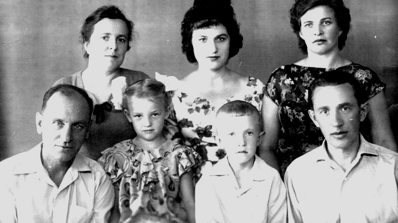

Alle Frauen, außer Natasha natürlich, waren beim Friseur gewesen, wo sie vor dem Foto dieses schwer erkennbare Aussehen erhielten.

Rostow 1961 In der ersten Reihe Igorek, Romotschka und ich.

In der zweiten Reihe: Ljalja, Tanja und Nina Nach Rostow fuhren wir mit dem Zug nach Krasnodar und von dort mit dem Bus nach Gorjachij Kljutsch. Dieser kleine Erholungsort am Fluss Psekups, der auf drei Seiten von Bergen umgeben ist, hat uns sehr gut gefallen. Wir mochten das ursprüngliche, milde und zarte Klima, die Parkanlagen des Sanatoriums, die Alleen, die vielen Blumen und die Ruhe. Keine Autohupen, keine verbitterten, eiligen, ängstlichen Menschen.

Morgens, nach dem Frühstück, gingen wir in Begleitung der Gastgeber und ihrer Kinder zum Psekups, um dort zu baden. Es gab nur zwei Badestellen, an denen das Wasser bis zum Hals reichte: in der Nähe der Hängebrücke und in der Nähe des "Hühnchens", so hieß ein Felsen, der einem Hahnenkopf mit Kamm ähnelte. In den anderen Abschnitten floss er schäumend und gurgelnd über Felsplatten und reichte nicht über die Knöchel hinaus. Die meiste Zeit ließen wir uns an der Hängebrücke im Schatten der alten, wuchernden Ulmen nieder. Wir breiteten eine alte Decke aus und legten etwas Proviant bereit, hauptsächlich Äpfel, Pflaumen und manchmal Trauben. Und dann badeten wir. Für Kinder, die nicht schwimmen konnten, war der Ort nicht der beste. Die Uferlinie verlief zunächst sanft und fiel dann steil ab. Da ich der einzige Schwimmer in unserer Gruppe war, können Sie sich vorstellen, wie erholsam das für mich war. Natascha kletterte kopfüber ins Wasser und ich brachte ihr ziemlich

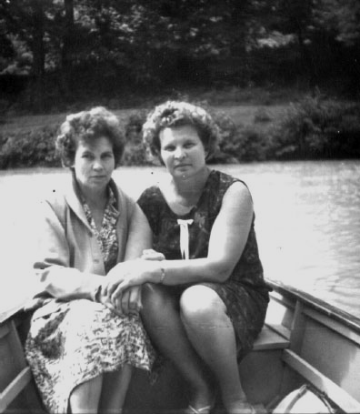

schnell das Schwimmen bei. Bei Romotschka war es schwieriger. Ihm wurde schnell kalt, zumal das Wasser im Psekups nicht sehr warm war, und er begann zu zittern. Nina wickelte ihn in ein Handtuch und setzte ihn in die Sonne. Natascha badete, bis sie blau anlief, ihr Körper war mit Luftblasen bedeckt, ihre Zähne klapperten, aber sie wollte nicht aus dem Wasser steigen, und wir befürchteten, dass sie eine Angina bekommen würde.

Gorjatschij Kljutsch Im Boot Olga und Nina Das "Hühnchen" lag auf der Stadtseite, und die Erholungsuchenden schwammen auf der gegenüberliegenden Uferseite. Unter dem "Hühnchen" war es sehr tief, es hieß, dass sich dort eine Grube von 6-8 Metern Tiefe befände, sowie einige Unterwasserströmungen und Strudel. Das zog junge Leute an, die auf die Felsvorsprünge des "Hühnchens" kletterten und von dort in den Psekups eintauchten. Einige von ihnen tauchten recht professionell, andere strampelten ungeschickt mit den Beinen und fuchtelten mit den Armen. Manchmal endeten solche Sprünge kläglich. Vor unseren Augen sprang ein Mann, der aussah, als hätte er viel getrunken, bei einer Mutprobe vom fünfundzwanzig Meter hohen Gipfel des "Hühnchens". Er sprang völlig unprofessionell und schlug, da er seinen Körper nicht kontrollieren konnte, mit dem Rücken auf dem Wasser auf. Er wurde ins Krankenhaus gebracht, wo er bald darauf starb. Nach dieser Szene gingen die verängstigten Kinder nicht mehr so

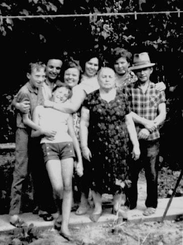

gerne zum "Hühnchen". Ich wollte dorthin, weil es der einzige Ort war, an dem ich schwimmen gehen konnte.

Nina blieb oft zu Hause und half Musa bei der Zubereitung des Mittag- und Abendessens. Abends, wenn die Hitze nachließ und die Zikaden zu zirpen begannen, saßen Gastgeber und Gäste auf Bänken an einem langen Tisch unter einem Baldachin aus geflochtenen Weinreben.

Gorjatschij Kljutsch.

Im Garten der Meitins Über unseren Köpfen hingen Weintrauben. Wolodja holte selbstgemachten Wein aus dem Keller und die Erinnerungen begannen. Die Kinder und ich bekamen frische Milch und mit Butter und Honig üppig bestrichenes Brot.

Mit dieser Zeit war ein Abenteuer verbunden, von dem wir unseren Freunden oft erzählten. Eines Nachmittags gingen Nina und ich die zentrale Gasse entlang. Die Kinder waren zu Hause geblieben und halfen Wladimir Jakowlewitsch bei der Apfelernte. Als Nina einen Friseursalon sah, beschloss sie, sich eine Maniküre machen zu lassen. Ich bin draußen geblieben. Nachdem ich eine Weile gewartet hatte, beschloss ich, dass es eine gute Idee wäre, mich rasieren zu lassen. Ich betrat den Fri-

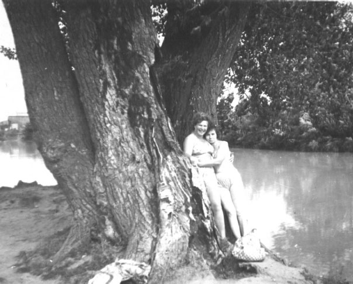

seursalon, sah Nina aus dem Augenwinkel an und setzte mich auf den Stuhl. Als ich zu zahlen begann, fragte Nina, ohne deutlich zu machen, dass wir uns kennen:

- Junger Mann! Vielleicht könnten Sie für mich bezahlen? Ich will nicht in meine Handtasche greifen und meine Maniküre ruinieren.

- Bitte, - sagte ich achselzuckend und wandte mich an Ninas Bedienung und fragte:

- Wie viel muss ich zahlen?

Nachdem ich den geforderten Betrag bezahlt hatte, trat ich auf die Straße hinaus und ging, ohne mich noch einmal umzudrehen, in Richtung des Sanatoriums.

Gorjatschij Kljutsch. Nina und Olja unter einer Eiche am Fluss Psekups Wie Nina mir später erzählte, herrschte im Friseursalon eine besorgte Stille. Nach einer langen Pause wandte sich die Friseurmeisterin, die mich gerade rasiert hatte, an Nina und fragte sie:

- Kennen Sie den überhaupt?

- Nein, warum? - antwortete Nina mit einem überraschten Gesicht. Nachdem sie sich verabschiedet hatte, ging sie hinaus und ging trotzig in die entgegengesetzte Richtung.

Abends, als sie von der Arbeit nach Hause kam, war Musja, die als Krankenschwester und Leiterin des Sanatoriums arbeitete, empört:

- Was ist nur aus diesen Urlaubern geworden! Keine Scham, kein Gewissen. Man hat mir heute eine wunderbare Geschichte erzählt. Und sie erzählte, mit leichten Verzerrungen, das Stück, das wir gespielt haben.

An allen Tagen, die sie in Gorjatschij Kljutsch verbrachte, war Nina gut gelaunt. An den Streit in Moskau konnte sie sich nicht erinnern.

In Jenisseisk erwartete uns eine Neuigkeit: Wassilij Iwanowitsch Jatsejew, der sein Zertifikat als Assistenzprofessor erhalten hatte, ging nach Perm, um dort zu arbeiten. Jeder war sich sicher, dass dieser Akt eine direkte Folge der Ernennung von Nikolai Iwanowitsch Demko war. Die Entlassung von Jatsejew war ein großer Verlust für das Institut. Schließlich gab es in jenen Jahren nur drei diplomierte Mathematiker an den Universitäten der Region Krasnojarsk: Lew Josifowitsch Slobodskij und Samson Lwowitsch Edelman - am Pädagogischen Institut Krasnojarsk und Wassilij Iwanowitsch Jatsejew - am Pädagogischen Institut Jenisseisk.

Nach Jatsejews Abreise nach Perm wurde ich zum Leiter der mathematischen Abteilung ernannt. Natürlich ließ sich Jura die Gelegenheit nicht entgehen, einen Witz zu machen:

- Und schon kommt doch der Eigennutz ins Spiel. Und dabei hast gesagt, dass du der Partei aus ideologischen Gründen beigetreten bist oder weil du dazu gezwungen wurdest.

Diese Anschuldigungen Jurins erschienen mir wie ein harmloser Scherz, den ich auch beliebig lange bereit gewesen wäre zu tolerieren., wenn er nur präsent gewesen wäre. Aber zu diesem Zeitpunkt war ich sehr besorgt. Wahrscheinlich lag es zum Teil daran, dass an seinem Vorwurf etwas Wahres dran sein musste. In jenen Jahren wurden die Führungskräfte nicht wie heute gewählt, sondern ernannt und bestätigt, insbesondere durch den Parteivorstand, der in der Regel das letzte Wort hatte. Bei den Gesprächen über meine Kandidatur wurden die meisten Fragen zur Organisation der wissenschaftlichen Forschungsarbeit am Lehrstuhl gestellt. Und das war nur natürlich. Nach dem Weggang von Wassilij Iwanowitsch gab es nur noch ein Fakultätsmitglied, das die Forschung in reiner Mathematik leitete: Jossif Grigorjewitsch Mulin. Alle anderen haben, wenn überhaupt, nur auf dem Gebiet der privaten Methoden gearbeitet. Ich war seit fünf Jahren am Institut tätig, und es war an der Zeit, den Bereich meiner Forschungsinteressen zu definieren. In den vorangegangenen zwei Jahren hatte ich mich eingehend mit Pontrjagins Buch "Topologische Gruppen" beschäftigt. Aber ich konnte kein engeres Feld definieren und kein konkretes Dissertationsthema finden. Loiko erzählte mir, und Edelman bestätigte später, dass in der Region Krasnojarsk niemand kontinuierliche Gruppen untersucht. Mit Schmerzen in der Seele beschloss ich, alle weiteren Versuche abzubrechen. Schließlich war ich bereits vierzig Jahre alt. Ich war schon hoffnungslos alt für reine Mathematik. Es gab nur noch eine Möglichkeit - die während der Schulzeit begonnene Forschung zu Problemen im Zusammenhang mit der Realisierung der Funktionslinie im Schulmathematikkurs fortzusetzen. Ich hatte auch keinen Schulleiter in diesem Bereich, aber das Institut für Unterrichtsmethoden, Abteilung Mathematik, der Akademie der pädagogischen Wissenschaften hat mir empfohlen, ein Handbuch zu veröffentlichen: "Aus der Erfahrung des Studiums der Eigenschaften von Funktionen in einer Acht-Jahres-Schule", mit einem Umfang von 5 gedruckten Seiten. Es ist schwer zu sagen, wie oft ich das Buch überarbeitet habe und wie oft Nina es nachgedruckt hat. Es wurde 1963 vom Verlag der Akademie der pädagogischen Wissenschaften in einer Auflage von 40.000 Exemplaren veröffentlicht. I. A. Gibsch hat es redigiert.

Ich sah dieses Buch zum ersten Mal in einer der Moskauer Buchhandlungen, die ich auf der Suche nach pädagogischer Literatur aufsuchte. Eine Frau mittleren Alters stand vor mir und blätterte in einem dünnen, grünen Buch. Ich wartete ungeduldig darauf, dass der Verkäufer frei war. Schließlich legte die Kundin das Buch auf den Tresen und ging weg. Ich blickte auf den grünen Umschlag und erstarrte. Sie trug meinen Namen. Es war mein Buch, das Ergebnis von schlaflosen Nächten, Meditationen und endlosen Überarbeitungen. So hatte ich mich noch nie gefühlt. Ich nahm drei Bücher mit und beobachtet beim Verlassen der Bücherei, ob es auch von anderen gekauft würde. Der Verlag zahlte mir etwa vierhundert Rubel, was damals eine Menge Geld war. Ich hätte damit zweimal nach Moskau hin- und zurückfliegen können.

Dann, 1964, veröffentlichte der Verlag "Aufklärung" mein zweites Buch unter dem Titel "Aus der Erfahrung des Studiums der Eigenschaften von Funktionen und Grenzwerten in der Oberstufe" mit einem Umfang von 6,8 gedruckten Seiten, das im Wesentlichen eine Fortsetzung des ersten war. Der Herausgeber war auch diesmal I.A. Gibsch. Meine persönliche Tätigkeit löste jedoch nicht das allgemeine Problem der Anhebung des Niveaus der Forschungsarbeit in der Abteilung. Dies erforderte mehrere Jahre harter Arbeit.

Am siebzehnten Oktober 1961 nahm der XXII. Parteitag seine Arbeit auf. Die Frage nach den Verbrechen Stalins und der Stalinisten wurde erneut aufgeworfen. Doch diesmal ging Chruschtschow in seinen Enthüllungen noch weiter und erklärte, dass sich die Massenunterdrückungen nicht nur auf Kommunisten, sondern auch auf normale Sowjetbürger erstreckt hätten. Die begangenen Verbrechen wurden nicht mehr wie 1956 Stalin allein zugeschrieben, sondern einer ganzen Gruppe seiner engsten Mitarbeiter, die fast identisch mit der zuvor entlarvten "Anti-Parteien"-Gruppe waren. Doch auch dieses Mal wich Chruschtschow der Frage nach der Verantwortung der Partei als Ganzes aus. Abschließend schlug Chruschtschow vor, ein Denkmal für die kommunistischen Opfer des Stalinismus zu errichten.

Am 30. Oktober sprach sich eine Mehrheit der Delegierten dafür aus, den Leichnam Stalins aus dem Mausoleum zu entfernen. Nina war zunächst entrüstet, aber dann, als sie die Unvermeidlichkeit der Ereignisse erkannte, war sie zufrieden damit, noch rechtzeitig im Mausoleum gewesen zu sein, während Valerik beklagte, dass er nie wieder einen "lebenden toten Stalin" zu sehen bekommen würde, und sehr eifersüchtig auf Roma und Natascha war. Die Tatsache, dass er darauf weniger eifersüchtig war als auf unsere Reise in den Süden, veranlasste mich, ihm zu versprechen, dass er beim nächsten Mal auf jeden Fall mitkommen würde.

Nach den am Ende des Kongresses verabschiedeten Dokumenten zu urteilen, gelang Chruschtschow kein bedeutender Durchbruch zu seinen Gunsten. Die Entschließung zur Entstalinisierung wurde verwässert. Weder der Vorschlag, ein Denkmal für die Opfer der "Säuberungen" zu errichten, noch ein Hinweis auf das Ausmaß der Massenrepressionen des Stalinismus waren darin enthalten. Sie bezog sich lediglich auf "Fehler" und "Abweichungen". Entgegen der in Chruschtschows Bericht hervorgehobenen Notwendigkeit, diese Fragen weiter zu untersuchen, wird in der Entschließung schließlich behauptet, dass "die Partei dem Volk die ganze Wahrheit über den Machtmissbrauch während des Personenkults gesagt hat". Mit dieser Formulierung wurde in dem Beschluss klar zum Ausdruck gebracht, dass die Angelegenheit abgeschlossen und die Debatte beendet sei.

Chruschtschows Schritte in der Innen- und Außenpolitik, insbesondere ihre Ergebnisse, weckten in letzter Zeit ernsthafte Bedenken. Es wurde immer deutlicher, dass alle seine Reforminitiativen scheiterten, was zu einer Rückkehr zu einer Politik der strikten Zentralisierung, Zensur und Repression führen könnte.

Auch die Außenpolitik des Landes stieß auf große Befürchtungen. Die Ereignisse von 1956 in Polen und Ungarn, der Skandal um den Abschuss des Spionageflugzeugs und die Inhaftierung von Powers 1960, der Bau der Berliner Mauer 1961, der Abbruch des Abkommens mit den USA, der Austritt der USA aus dem Vertrag von Lissabon 1956 und dem Vertrag von Moskau 1947.

Die Vereinbarungen zum Moratorium über atmosphärische Atomtests und die Serie massiver Atomexplosionen in der UdSSR Ende 1961 führten zu einer Verschärfung des Kalten Krieges. Die Verschlechterung der Beziehungen zu China, Rumänien und Albanien war ein Hinweis auf die Nachteile in den Beziehungen zwischen den Ländern des sozialistischen Lagers. Unsere Außenpolitik erreichte einen kritischen

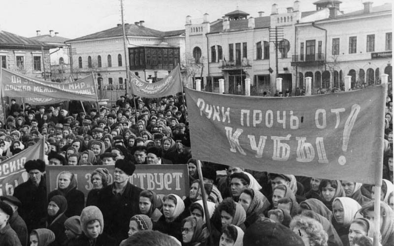

Punkt während der Kubakrise 1962, als die Regierung versuchte, Mittelstreckenraketen mit Atomsprengköpfen auf Kuba zu installieren. Daraufhin blockierte eine Armada amerikanischer Kriegsschiffe Kuba und behinderte unsere Schiffe, die Raketen nach Kuba brachten. Die Welt stand am Rande eines neuen Weltkriegs mit Atomwaffen.

Jenisseisk, 1962. Treffen zur Verteidigung Kubas Im Institut fanden ständig Zivilschutzübungen statt, und das Einberufungsamt rief alle Reservisten zur Umschulung. Ich wurde auch einberufen. Einen Monat lang gingen ich und einige unserer Lehrer zu einer Sammelstelle, wo wir Evakuierungstechniken für den Fall einer nuklearen Bedrohung übten, anstatt zu unterrichten. Ein älterer Lehrer erklärte uns die Prinzipien der Atombombe und die Mittel zum Schutz vor einer Atomexplosion. Es stellte sich heraus, dass er nichts von Kernreaktionen verstand, aber er lehrte uns mit einem wichtigen und bedeutungsvollen Blick. Auf die Frage eines unserer Mitarbeiter, woher in einem so relativ kleinen Ding wie einer Atombombe so viel Energie kommt, antwortete er mit einem wichtigen Blick:

- Das ist ein militärisches Geheimnis.

Alle Schüler wurden auch im Zivilschutz ausgebildet. Gemäß dem Aktionsplan wurden Einheiten organisiert, Älteste ernannt, Ketten gebildet, um Lehrer und Schüler schnell zu benachrichtigen und zu versammeln, und es wurden Übungen durchgeführt. An eine von ihnen werde ich mich für den Rest meines Lebens erinnern.

Tiefer Herbst, dunkle mondlose Nacht. Telefonanruf. Eine unbekannte Stimme im Namen des Zivilschutzes verlangt, in den Wirtschaftshof des Instituts zu kommen, um an einer Einsatzübung teilzunehmen. Die Uhr zeigt halb Eins. Ich gehe hinaus. Alle Fenster unseres Hauses sind hell erleuchtet. Es sieht wie ein Scherz aus. Ich warte auf meine Gefährten. Wir gehen auf den Betriebshof. Die Chauffeure sind dort bereits im Einsatz und bereiten die Ausrüstung für die Evakuierung der Lehrer und Schüler vor. Plötzlich erlöschen alle Fenster des Schlafsaals, der an den Wartungshof angrenzt - die Imitation einer Verdunklung. Die Fahrer schimpfen, dass man mehr Sitzbretter für die Schüler benötige und dass sie nichts sehen könnten. Auch im Studentenwohnheim herrscht Aufruhr. Die Zeit vergeht, das Personal und die Studenten, vor allem Studentinnen, versammeln sich. Schließlich schalten die Chauffeure trotz des Verbots die Scheinwerfer ihrer Fahrzeuge ein und organisieren das Hinsetzen, obwohl dies verboten ist. Der Hof wird von einem gespenstischen Schein erhellt, und die Gestalten der noch nicht ganz wachen, zusammengekauerten Schüler werden sichtbar. Blasse, ungeschminkte Gesichter, verängstigt. Sie tragen Hausschuhe, manche sogar Sandalen, Jacken und Westen, Schals auf dem Kopf und Strickmützen, die ihre Gesichter kindlich, naiv und hilflos wirken lassen.

Auf Aufforderung der Übungsleiter wird das Licht schnell ausgeschaltet und alles wird wieder in eine schwarze, undurchdringliche Dunkelheit getaucht. Endlich stehen die Wagen bereit und alle warten auf das Kommando zum Einsteigen. Weder die Schüler noch die Lehrer wissen, wohin sie uns führen. Ich wünschte, ich hätte wenigstens etwas Brot mitgebracht. Und in diesem Moment wird der Befehl "Abfahrt" gegeben. Aber sie schalten das Licht nicht ein. Wir bewegen uns in völliger Dunkelheit auseinander, stoßen gegen Kisten unbekannter Herkunft und gegeneinander. Der Himmel, der Boden, die Erde, die unter den Füßen knirscht, alles ist schwarz und schwarz. Jemand weint, jemand lacht, jemand berichtet verängstigt, dass er seine Dokumente verloren hat und bittet um Licht.

Und im Rektorat brennt noch lange das Licht, die Chefs und Übungsleiter feiern den Erfolg der Operation. Ich kann zu Hause lange Zeit nicht schlafen. Ich möchte gar nicht daran denken, was passiert wäre, wenn alles, was ich gesehen und erlebt habe, kein Spiel gewesen wäre.

Bald nach meiner Zulassung durch das Kreisparteikomitee wurde ich mit der Leitung der Propagandagruppe des Instituts betraut. Die Gruppe bestand hauptsächlich aus Studenten. Viele aus meiner Fraktion. Das Gebiet befindet sich am Stadtrand von Jenisseisk. Kleine Häuser, alte Männer und alte Frauen. Eine kleine, behauene Plattform, auf der die Mitglieder des Agitationskollektivs kleine Konzerte gaben. Nina trat manchmal mit ihnen auf. Ihr Zigeunerlied war ein regelrechter Erfolg. Nach dem Konzert ein Besuch bei den Gastgebern. Ich hörte mir ihre zahlreichen Beschwerden und Bitten an und half ihnen beim Verfassen von Anträgen, die ich dann dem Bezirksvorstand vorlegte. Sie waren mit diesem Aspekt meiner Arbeit nicht zufrieden:

- Sie und Ihre Agitationsgruppe sollten den Menschen die Politik der Partei erklären und für sie werben, nicht Beschwerden sammeln.

Ich verstand. Ich hätte meinen Auftrag nicht zu ernst nehmen dürfen. Aber ich konnte jetzt nicht aufhören und belagerte lange Zeit verschiedene Organisationen mit Anfragen meiner Schutzbefohlenen. Parteiaufträge, und davon hatte ich viele, waren zeitraubend. Noch mehr Zeit beanspruchten die Instituts- und Abteilungsversammlungen, die sich manchmal bis Mitternacht hinzogen. Ich musste zu ihnen sprechen, aktiv sein, "prinzipientreu" sein. Mein inhärentes Zögern und meine Zweifel, meine Angewohnheit, „von oben“ erteilte Weisungen zu analysieren und zu diskutieren, waren völlig unangebracht und konnten als Mangel an Parteikultur angesehen werden. Das war sehr schwierig für mich, und ich kam oft völlig gebrochen von diesen Treffen zurück.

Im Mittelpunkt der Bildungseinrichtungen jener Jahre stand eine Bildungsreform, die darauf abzielte, die Verbindung zwischen Schule und Leben zu stärken. Die Reform, die als Mittel zur "Versklavung" der Jugendlichen und zur Aufhebung des Gegensatzes zwischen körperlicher und geistiger Arbeit gedacht war, führte in Wirklichkeit zu Kampagnen für die "Verschmelzung von Schule und Leben", "Leben und Wissenschaft". Hunderttausende junger Menschen wurden in die unberührten Gebiete und auf die Komsomol-Baustellen geschickt, und die Vertreter der intellektuellen Arbeit zu den Gemüselagern, zur Straßen- und Gartensäuberung. Aber das Wichtigste an dieser Reform waren für mich die neuen Lehrpläne, die neuen Lehrbücher, in denen die angewandten Aspekte der Mathematik berücksichtigt wurden.

Ich habe gerne an der Universität unterrichtet. Vor allem in Form von Vorträgen. In den Jahren, in denen ich in Jenisseisk arbeitete, musste ich alle mathematischen Kurse im Lehrplan der Physikabteilung abhalten. Ich habe in den Vorlesungen nie auch nur die bescheidensten Notizen benutzt, auch nicht, als ich zusammen mit Viktoria Fjodorowna Iwanowa einen speziellen Kurs über mathematische Linguistik für die Studenten der Literarischen Fakultät abhielt.

Die Beziehungen zu den Studenten, insbesondere zu denen meiner Gruppe, waren informell, fast familiär. Viele von ihnen lagerten die von zu Hause mitgebrachten Lebensmittel in unserem Keller und kamen zum Mittagessen zu uns, vor allem am Ende des Monats, wenn ihnen das Stipendiengeld und die Lebensmittel ausgingen. Abends sangen wir Studentenlieder. Wenn es im Wohnheim kalt war oder es einen Sanitärdienst gab, blieben sie über Nacht, manchmal fünf oder sechs oder mehr. Sie brachten Matratzen mit und legten sie auf den Boden, und wenn wir nachts vom Schlafsaal zum Kinderzimmer gingen, mussten wir über ihre schlafenden Körper auf dem Boden gehen. Sie hatten eine besondere Beziehung zu Nina. Sie vertrauten ihr ihre mädchenhaften Geheimnisse an und suchten ihre Unterstützung. Mit Lida Kisilewskaja, Sina Tschelnokowa, Sina Lifenko, Mascha Tsygan und natürlich Rita Sakutilina, Tanja Smetjuk und Walja Misonowa, die an unserer Abteilung studiert und ihren Abschluss gemacht hatten, verbanden uns die herzlichsten und längsten Beziehungen.

Ich weiß noch, wie viel Ärger Tolja Maksimtschuk uns gemacht hat. Er war groß, schlank, gut aussehend, mit schwarzen funkelnden Augen und einem ebenso schwarzen Schnurrbart. Mehrere Studentinnen in meiner Gruppe waren in ihn verliebt, was natürlich zu vielen kleinen Tragödien führte. Die Mädchen, die in seiner unruhigen, zappelnden Seele keine Antwort finden konnten, wandten sich mit ihrem Kummer unter Tränen an Nina.

In jenen Jahren habe ich in der von mir betreuten Gruppe vor allem erzieherische Anstrengungen unternommen, um die Schüler an intellektuelle Arbeit zu gewöhnen und das Trinken zu bekämpfen. Meine Gruppe wohnte in einer zweigeteilten Baracke in der Mitte unserer Baracke. In der einen Hälfte, in der einst Professor Jurij Borissowitsch Rumer gewohnt hatte, waren die Jungen untergebracht, in der anderen die Mädchen. Ich besuchte sie jeden Tag nach der Arbeit, erkundigte mich, wie sie sich auf den regulären Unterricht vorbereiteten, und gab ihnen, wenn nötig, oft gegen ihren Willen, Ratschläge.

Eines Tages, in Vorbereitung auf die Novemberferien, beschloss ich, den Schülern zu zeigen, wie sie Spaß haben könnten, ohne sich der heißen Wirkung von Getränken auszusetzen. Gemeinsam mit dem Schulleiter, dem Komsomol und einigen anderen Gruppenaktivisten bereiteten wir Denkspiele vor und kauften Süßigkeiten und Erfrischungsgetränke. Die Mädchen buken mit Ninas Hilfe Kuchen und eine große Torte. Zum Entsetzen der Jungen und zur Überraschung der Verkäuferinnen gelang es mir, den Geschäftsführer des Ladens zu überreden, den von den Schülern gekauften Wodka und Wein durch Süßigkeiten, Kekse, Mineralwasser und Äpfel zu ersetzen.

Der Abend verlief zunächst schleppend und langweilig. Auch die Lieder klangen nicht mehr so wie sonst. Aber allmählich begannen die Leute zu reden. Die Spiele wurden lebhafter, die Lieder lauter und intimer. Als ich spätabends nach Hause kam, erzählte ich es Nina:

- Siehst du, man kann auch ohne den verdammten Wein Spaß haben.

Nina sah mich erstaunt an und sagte:

- Robotschka, bist du blind? Ist Ihnen nicht aufgefallen, wie oft die Jungen und Mädchen einzeln oder sogar in kleinen Gruppen in die andere Hälfte gingen, wo die Hauptquelle ihrer Inspiration lag?

Das hatte ich nicht gesehen, und vielleicht habe ich auch viele andere, wichtigere Dinge nicht gesehen.

### Kapitel 24. Prorektorat (1963-64)

In der ersten Hälfte der 1960er Jahre begann Chruschtschows Sozialpolitik zu scheitern, da sie nicht mit einem angemessenen Wirtschaftswachstum einherging. Regelmäßige Lohnerhöhungen (durchschnittlich 6 %), die Abschaffung der obligatorischen Staatsanleihen, die Abschaffung sämtlicher Studiengebühren und Rentenerhöhungen, die den Verbrauch von Grundnahrungsmitteln deutlich erhöhten, erforderten nicht nur Geld, sondern auch eine Steigerung der landwirtschaftlichen Produktion. Riesige Summen wurden auch für den raschen Bau von Wohnungen benötigt, die es ermöglichten, ein Viertel der Bevölkerung aus den Hütten und Gemeinschaftswohnungen herauszubekommen. Aber sie waren nicht verfügbar. Die verfolgte Wirtschaftspolitik, insbesondere in der Landwirtschaft, führte zu einem katastrophalen Rückgang des Wirtschaftswachstums. Um der drohenden Nahrungsmittelkrise zu entgehen, beschloss man, amerikanisches Getreide zu kaufen. Dies war, wie man damals dachte, eine vorübergehende Maßnahme und wurde für die nächsten Jahrzehnte zu einem festen Bestandteil der staatlichen Politik. Infolgedessen bereicherten sich die amerikanischen Landwirte, während die eigenen Landwirte, die versuchten, ihre Subsistenzlandwirtschaft auszuweiten, verfolgt wurden.

Zu Beginn der 1960er Jahre, als es im Handel an Fleisch, Milch, Butter und Brot mangelte, versuchte die Regierung eindeutig, die Wirtschaft auf Kosten der Arbeitnehmer zu korrigieren. Die Zollsätze für gewerbliche Waren wurden um etwa ein Drittel gesenkt, und die Einzelhandelspreise für Lebensmittel ab Mai 1962 im Durchschnitt um denselben Betrag angehoben.

Zur Rechtfertigung solcher Maßnahmen schrieb die offizielle Parteipresse: "Wenn unter kapitalistischen Bedingungen jede Arbeiterfamilie gezwungen ist, den größten Teil ihres Einkommens für Miete, medizinische Versorgung und die Ausbildung der Kinder auszugeben und für schlechte Zeiten zu sparen, verwendet unsere sowjetische Familie den größten Teil ihres Einkommens für besseres Essen und bessere Kleidung. Dies führt natürlich zu einer hohen Nachfrage nach Lebensmitteln wie Fleisch, Wurst und Butter. Daraus müssen die Leserinnen und Leser schließen, dass die Preise erhöht werden müssen, da es nicht genug Lebensmittel für alle gibt.

Für mich persönlich schien die Preiserhöhung gerechtfertigt, weil sie zumindest vorübergehend dazu führte, dass Butter, Fleisch und Wurst in den Regalen der Lebensmittelgeschäfte auftauchten. Die Situation der Arbeitnehmer, insbesondere der Akkordarbeiter, für die die Preiserhöhung mit einer Senkung der Tarife und der Ablehnung der versprochenen Abschaffung der Einkommensteuer zusammenfiel, war anders. In Moskau, Leningrad und einer Reihe anderer Städte kam es zu spontanen Demonstrationen von Arbeitern. Diese Unzufriedenheit war in Nowotscherkassk besonders groß, wo Truppen zur Wiederherstellung der Ordnung eingesetzt und Waffengewalt angewendet wurden, was zu Dutzenden von Opfern unter den Demonstranten führte.

Ich konnte aus den Gesprächen, aus dem Tonfall heraushören, dass unsere Institutskommunisten und vor allem die Lehrer der Sozialwissenschaften sogar froh über die Schwierigkeiten des Landes waren, denn das rechtfertigte in gewisser Weise ihre negative Haltung gegenüber Nikita Chruschtschow, die ganz andere Gründe hatte. Nach der Missernte 1963 war klar, dass Chruschtschow nicht in der Lage sein würde, das Land aus dieser wirtschaftlichen Sackgasse herauszuführen, und er tat mir leid.

Zu diesem Zeitpunkt hatte ich auch schon eine Menge neuer Probleme. 1963 war Natascha an der Reihe, zur Schule zu gehen. Im November würde sie sieben Jahre alt werden. Sie konnte bereits lesen und bis hundert zählen, und so beschlossen wir, sie am ersten September in die Schule zu bringen. Valera war in der siebten Klasse, und obwohl er keine einzige schlechte Note hatte und in Mathematik meistens Einsen bekam, lernte er nur halbherzig. Er verbrachte viel Zeit mit seinen Klassenkameraden. Nina hat ihn mehrmals beim Kartenspielen erwischt. Ich, der ich das Kartenspiel ebenso hasste wie Wein und Rauchen, machte mir Sorgen. Romotschka war derjenige, der die meisten Schwierigkeiten hatte. Er war in der dritten Klasse. Er verpasste viele Kurse wegen Krankheiten. Es war schwierig, die verlorene Zeit aufzuholen. Die geringste Anstrengung seinerseits bereitete ihm Kopfschmerzen. Seine Lehrerin, Maria Filippowna, bei der Valera Unterricht hatte, war sehr geduldig und nachsichtig. Unter diesen Umständen lag die gesamte Verantwortung für seinen Erfolg bei mir.

Leider hatte ich immer zu wenig Zeit. Ninas bissige Bemerkung war, dass ich nur an die Kinder denke, wenn sie krank oder in Gefahr seien. Das war zwar übertrieben, aber im Grunde hatte sie recht: Ich kümmerte mich wenig um die Schulprobleme und die Ausbildung der Kinder. Meine erste Priorität war immer ihre Gesundheit. Immer, wenn einer von ihnen krank war, konnte ich an nichts anderes denken. Und sie waren in jenen Jahren fast ständig krank. Anfangs, während Ninas Verbannungszeit, war ich sehr besorgt über Valerijs unerklärliche Temperatursprünge, die exorbitante Werte erreichten. Die Ärzte ließen ihn zu Untersuchungen ins Krankenhaus bringen, ohne eine gemeinsame Ursache, wie z. B. eine Angina, zu finden und ohne das Fieber senken zu können. In diesen bangen Tagen erhielt ich Telegramme voller Verzweiflung und Melancholie, während ich durch die Lagerzone eilte und nichts tun konnte, um ihnen zu helfen. In Jenisseisk wurde Romotschka dann sehr krank und stand an der Grenze zwischen Leben und Tod. Es ist schwer zu sagen, wie viel seelische Qualen es mir und Nina bereitet hat. Als er schließlich etwas kräftiger wurde und wir uns ernsthaft mit der Erziehung von Kindern beschäftigen konnten, fing Natascha an schwermütig zu werden. Im Gegensatz zu Romotschka wuchs sie zu einem kräftigen, gesunden Mädchen heran, bis sie etwa sechs Jahre alt war. Dann wurde sie jedoch von Halsschmerzen geplagt. Sie wurde mehrmals in schlimmem Zustand mit Verdacht auf Diphtherie in ein Krankenhaus für Infektionskrankheiten gebracht. In diesen schrecklichen Tagen saß ich die ganze Nacht auf der Veranda des Krankenhauses für Infektionskrankheiten in Jenisseisk und trotzte den Bitten der Ärzte, nach Hause zu gehen.

Seltsamerweise habe ich trotz der ständigen Krankheiten meiner Kinder keine Maßnahmen ergriffen, um sie zu stärken, um sie körperlich zu entwickeln. Das mag zum Teil an meiner allgemein negativen Einstellung gegenüber Sport und körperlicher Kraft als Grundlage menschlicher Beziehungen gelegen haben.

Ohne darüber nachzudenken, ging es mir in erster Linie um den Seelenfrieden und die Moral meiner Kinder. Ich nahm ihre Versäumnisse, Vergehen und schlechten Taten sehr ernst. Ich war immer bereit, ihnen nicht nur zu helfen, sondern auch zu erklären, was sie falsch gemacht hatten. Ich wusste auseigener Erfahrung, wie wichtig es ist, sich gebraucht und geliebt zu fühlen, vor allem als Kind, bevor die Seele abgestumpft ist. Ich war nie mit Eltern einverstanden, die glaubten, dass Liebe vor einem Kind versteckt werden sollte. Ich war mir sicher, dass kein Spielzeug, keine Kostüme oder Leckereien das Vertrauen der Kinder ersetzen können oder sollten, dass sie von ihren Eltern gebraucht und unendlich geliebt werden.

Das Gesagte sollte keinesfalls als eine Art Anleitung verstanden werden. Im Übrigen mache ich mir nicht einmal die Mühe, meinen Standpunkt zu vertreten. Ich habe einfach so über meine Kinder gedacht. Mein erzieherischer Einfluss war einseitig. Er bestand vor allem darin, die Liebe zur Natur und zu den Menschen zu wecken und ihnen die Fähigkeit zu vermitteln, mitfühlend zu sein. Am Abend las ich den Schülern Kurzgeschichten, Romane und Märchen vor. Am häufigsten las ich Andersens Märchen, romantische Märchen von Oscar Wilde und "Der kleine Prinz" von Saint-Exupery. Ich las und freute mich, wenn meine kleinen Zuhörer zu weinen begannen.

Nina war darüber verärgert:

- Was machst du denn da? Ein paar neurotische Kinder großziehen. Vor allem Romotschka. Er hat ohnehin schon oft Kopfschmerzen.

- Aber auch ich bin mit Märchen, Balladen, Gedichten aufgewachsen und sie haben keinen Neurotiker aus mir gemacht, - rechtfertige ich mich - außerdem erzähle ich ihnen viel über die Natur und zeige physikalische Experimente.

- Sie sollten nicht nur lernen, zuzuhören und mitzufühlen, sondern auch selbständig zu lesen und das Gelesene zu vertiefen. Man muss ihnen doch schließlich bestimmte Fächer beibringen, vor allem Valerik.

Ich wusste, dass Nina recht hatte, aber das erforderte zusätzliche Anstrengungen und Zeit, die mir langsam ausgingen. Nina war wieder anderer Meinung:

- Bei Studenten ist man bereit, Tag und Nacht herumzusitzen, und die eigenen Kinder werden vernachlässigt. Natürlich helfe ich ihnen so gut ich kann, aber man kann mehr tun und damit mehr Gutes bewirken.

Nina hatte sicherlich Recht. In meinem Umgang mit den Kindern rückte die Schularbeit eher in den Hintergrund. Ich war mir sicher, dass ich ihnen immer konkretes Wissen vermitteln konnte. Es war mir wichtiger, sie in ihrem Interesse und ihrer Liebe für die lebende und unbelebte Natur um sie herum zu erziehen, ihnen eine gesunde Neugier zu vermitteln, sie zu lehren, ihre Gefühle in die Gegenstände um sie herum hineinzulegen, so dass sie in jedem ramponierten Spielzeug ein lebendes Wesen sehen, das fähig ist, Schmerz und Leid zu empfinden.

Nachdem sich Nataschas Rachen beruhigt hatte, trat Romotschkas Gesundheit wieder in den Vordergrund. Er war immer noch sehr dünn, hatte oft Fieber und hustete. Die Ärzte diagnostizierten eine Bronchoadenitis und verlangten eine bessere Ernährung. In dieser Hinsicht haben wir alles getan, was wir konnten, und versucht, ihm jeden Wunsch zu erfüllen. In jenen Jahren wurden in Jenisseisk chinesische Äpfel zum Verkauf angeboten. In Reischips eingewickelt, hielten sie sich lange, sahen gut aus und schmeckten. Wir haben immer ein paar Kisten für den Winter mitgenommen. Wir lagerten sie in dem Keller, den ich ausgehoben hatte.

In der dritten Klasse empfahl die Ärztin, die Roma behandelte, dringend, ihn auf eine "Waldschule" zu schicken, die, wie sie sagte, in einem herrlichen Kiefernwald irgendwo in der Nähe des Dorfes "Saosernij" lag. Nina, die zu Radikalität neigt und an Ärzte glaubt, war dafür, Roma in eine "Waldschule" zu schicken. Ich, die ich immer zur Vorsicht neigte, weil ich Angst hatte, die Seele eines Kindes zu traumatisieren und den Ärzten nicht vertraute, war dagegen. Ich machte mir vor allem Sorgen, dass er dort missbraucht werden könnte und sich einsam und schutzlos fühlen würde. Nina bestand darauf, und ich stimmte zögernd zu.

Wir sind mit dem Bus unterwegs. Auf beiden Seiten der Straße stehen Kiefern, Lichtungen und mit Espen bewachsene Niederungen. Das Flackern der Sonne in den Lücken des Waldes lässt meine Augen glasig werden. Romy, die normalerweise gerne im Auto mitfährt, ist dieses Mal erschreckend still. Ein Halt. In der Nähe befinden sich keine Gebäude. Nur ein Pfahl mit einem Schild daran. Das Schild trägt den Namen der Haltestelle und einen Pfeil, der in den Himmel zeigt. Darunter steht mit Tinte und Bleistift "Waldschule, 2km". Vom Pfosten aus führt eine Straße tief in den Wald hinein. Ich gehe davon aus, dass es der Weg ist, der zur Schule führt. Roma kuschelt sich dicht an mich. Die Aussicht, in diesem Wald zu bleiben, allein unter Fremden zu sein, macht ihm wirklich Angst. Ich glaube, ich verstehe ihn gut, und mein Herz versinkt in Wehmut. Er läuft die zwei Kilometer, welche die Schule von der Bushaltestelle trennen und hält meine Hand fest.

Schließlich lichtete sich der Wald und ein Bild tat sich auf, welches mein Herz zum Stillstand brachte. Ein kahler Hügel. Das Schulgelände, das von einem hohen Zaun umgeben ist. Kasernenartige Gebäude. Ein Wachhaus. Nicht ein einziger Baum auf dem Schulgelände. Es erinnert mich auf unheimliche Weise an meine Lager-Vergangenheit. Nur gibt es keine Türme und keinen Stacheldraht, obwohl mir aufgefallen ist, dass eine der Lücken im Zaun mit Stacheldraht umflochten ist. Ich frage mich, ob diese Gebäude in der Vergangenheit nicht vielleicht ein Lagerplatz waren. Mein erster Wunsch ist es, Romotschka an meine Brust zu drücken und sofort nach Jenisseisk zurückzukehren.

Und doch trete ich ein. Eine hübsche blonde Frau, die sich als die diensthabende Lehrerin entpuppt, bittet mich in das Gebäude. Ich stelle mich vor und zeige ihr meinen Ausweis. Die Blondine öffnet ein dickes Register und beginnt, einige Daten einzutragen. Eine Gruppe von Jungen schwirrt vorbei und dreht sich im Kreis. Alle sind so gut wie kahlgeschoren. Sie schubsen Roma im Vorbeirennen, versuchen, ihn zu fangen. Er drückte sich mit voller Angst an mich. Die Erzieherin bemerkt solche Kleinigkeiten entweder nicht oder schenkt ihnen keine Aufmerksamkeit. Ich bin verletzt, aber ich sage nichts. Die Fragen über meine Eltern beginnen. Als sie erfährt, dass ich am Pädagogischen Institut Jenisseisk tätig bin, erzählt sie freudig, dass ihre jüngere Schwester früher bei uns studiert hat. Ich frage, ob es sich um Lagergebäude handelt und warum der Wald so weit weg ist und es auf dem Schulgelände keine Bäume oder Blumen gibt.

Die Blondine merkt, dass ich ihre Schule überhaupt nicht mag, und überredet mich:

- Schauen Sie sich den Wald hier in der Umgebung an, die hundertjährigen Kiefern und die Luft. Es riecht nach Kiefernholz und Harz, spüren Sie das?

Ich hatte keine besondere Empfindung, schwieg jedoch.

- Und die Tatsache, dass der Wald weit von der Schule entfernt ist, wird von der Feuerwehr so gefordert, für den Fall eines Waldbrandes, - so die Lehrerin weiter. - Aber die Luft, die Luft.

Sie fuhr fort, über die Schönheit und die heilenden Eigenschaften des Ortes zu sprechen, über die hohe Qualifikation des Pflegepersonals, zeigte recht anständige Schlafsäle und die Kantine. Auf die Frage, warum es im Garten keine Blumenbeete gebe, antwortete sie unschuldig:

- Wir haben es versucht, aber hier gibt es nur Jungs, und es gibt keine Aufseher.

Nun wurde mir alles klar. Alles, was sie sagte und was ich sah, machte mich traurig.

Bevor ich eine endgültige Entscheidung traf, beschloss ich, nach Saosernij zu fahren und die Angelegenheit mit einer meiner jüngsten Absolventinnen, Nina Kulikowa, zu besprechen. Mit Mühe überredete ich Romotschka, bei der Lehrerin zu bleiben, und versprach, am Abend zurück zu sein; dann machte ich mich auf den Weg zu Nina. Leider wusste sie nur wenig über die Schule, aber nachdem sie sich in der Nachbarschaft umgesehen hatte, berichtete sie, dass die Bewertungen überwiegend positiv sind. Verwirrt kehrte ich in zur Schule zurück. Ich ging um sie herum und blieb in der Nähe einer mit Stacheldraht verbarrikadierten Durchbruchstelle stehen. In der Mitte des Hofes stand Romotschka und hielt sich die dünnen Arme, wobei seine Hose aus irgendeinem Grund aufgeknöpft war. Die Jungen johlten und schrien um ihn herum und zeigten mit den Fingern auf ihn. Sein unglückliches und gejagtes Gesicht war tränennass.

Es ist nicht schwer, sich die Gefühle vorzustellen, die ich in diesem Moment empfand, und der Wunsch, der in mir erwachte. Aber ich kämpfte dagegen an und nahm Romotschka wieder mit, ohne einen Ton zu sagen. Bei Einbruch der Dunkelheit kehrten ich mit ihm nach Jenisseisk zurück.

Nina zeigte sich nicht überrascht und murmelte nur:

- Ich wusste es! Welchen Sinn hatte es dann, dorthin zu gehen?

- Begreifst du nicht, ich wollte sichergehen, dass meine Befürchtungen berechtigt waren.

- Und - konntest du dich davon überzeugen?

- Ich war mir sicher! Ihn dort zurückzulassen, wäre ein Verrat meinerseits gewesen.

An diesem Abend konnte Romotschka lange Zeit nicht schlafen, und wenn doch, wachte er immer wieder weinend auf. Wir unternahmen keine derartigen Versuche mehr und schickten Romotschka auch nicht in eine Waldschule oder ein Pionierlager. Wir beschlossen, dass wir die Kinder, solange es die finanziellen Mittel zulassen, den ganzen Sommer über in den Süden, ans Meer, bringen würden. In der Folge wurde diese Entscheidung für uns zu einer Lebenseinstellung. Mit den letzten Kräften, oder besser gesagt mit den letzten Mitteln, sind wir fast jedes Jahr in den Süden gefahren. Wir reisten mit dem Zug, in einem Waggon zweiter Klasse, lebten in Zelten, kochten unser eigenes Essen, das einfachste, und versuchten, das ganze Geld für Obst auszugeben. Um uns nicht zu verschulden, führten wir zu Hause in Jenisseisk einen mehr als bescheidenen Lebensstil. Wir sparten vor allem an gegenständlichen Dingen und Kleidung. Ein Tisch, Stühle, ein Schlafsofa und Kinderbetten, Bücherregale - all unsere Möbel. Die Küche hatte einen offenen Herd, für den man viel Brennholz brauchte, und einen Keller, den ich ziemlich geräumig und tief gegraben hatte. Ljalja und Ernotschka schickten Kinderkleidung, und zwar recht anständige, aus der ihre Kinder herausgewachsen waren. Wir hatten keine teuren Dinge im Haus, schon gar kein Gold. Keine Ohrringe, keine Perlen, nicht einmal Eheringe. Das Einzige, was von Wert war, waren Bücher, für die keine Geldausgabe bereute, die aber in jenen Jahren schwer zu bekommen waren. Als das Fernsehen in Jenisseisk auftauchte, weigerten wir uns, in den Süden zu gehen und kauften einen Fernseher "Isumrud" und 1972 einen Kühlschrank "Jurjusan", der noch immer in unserer Datscha steht.

Trotz unserer Reisen in den Süden hatte sich Ninas Gesundheit in den letzten Jahren verschlechtert. Ihre Kopfschmerzen begannen sie immer mehr zu plagen, vor allem im Winter und im Frühjahr. Zunächst dachten wir, sie seien die Folge ihrer Erlebnisse im Lager und im Exil, und hofften, dass die Schmerzen von selbst verschwinden würden. Aber das war nicht der Fall. Die Ärzte, die wir konsultierten, hielten sie für die Folge einer schweren Neurasthenie, einer Neurose infolge der Basedowschen Krankheit, und verschrieben entsprechende Medikamente. Diese zeigten jedoch keine sichtbare Wirkung. Ich durchforstete medizinische Bücher und Fachzeitschriften nach Hinweisen auf die Ursache von Ninas Zustand und kam immer mehr zu der Überzeugung, dass sie nicht an Morbus Basedow erkrankt war. Schließlich stimmten die behandelnden Ärzte zu.

Manchmal, vor allem im Sommer, hatte Nina monatelang keinen Anfall, so dass ich zu hoffen begann, dass es ganz aufgehört hatte, aber dann konnte es im Laufe eines Monats mehrere geben. Auf Anraten des behandelnden Arztes fuhr Nina zweimal nach Belokuricha, wo es in ganz Sibirien bekannte Radonquellen gab. Aber sie halfen nicht. Ninas Gesundheitszustand verschlechterte sich weiter. Zu einer Schachtel mit Medikamenten gegen ihre Kopfschmerzen gesellte sich nun eine Schachtel mit Medikamenten für ihr Herz. Der Arzt verschrieb immer mehr knappe Medikamente, die in normalen Apotheken nicht erhältlich waren. Sie wurden entweder über einen Freund von Sinaida Wassiljewna, die im Regionalkomitee der Partei die medizinischen Einrichtungen beaufsichtigte, oder über Igor, der als Teilnehmer des Großen Vaterländischen Krieges zusätzliche Möglichkeiten besaß, vermittelt. Die meiste Zeit bezog er sie vom Schwarzmarkt in Rostow.

Aus gesundheitlichen Gründen musste Nina oft zu Arztterminen gehen. Aus Angst, sie könnte verdächtigt werden, es vorzutäuschen, versuchte sie, so viel wie möglich über ihre Schmerzen zu erzählen. Sie sprach hastig und verwirrt. Die Ausschussmitglieder unterbrachen sie und verlangten kurze und präzise Antworten. Sie war nervös und unglücklich. Ich hatte Mitleid mit ihr, bedauerte sie und überredete sie, ihre Arbeit aufzugeben, aber damit war sie nicht einverstanden.

Um meine Erklärungen gegenüber den Ärzten zu erleichtern, führte ich ein spezielles Notizbuch, in dem ich jeden Tag die objektiven und subjektiven Symptome ihrer Krankheit festhielt: Temperatur, Blutdruck, Puls, Vorhandensein oder Fehlen von Kopfschmerzen, Herzschmerzen, Stimmung. Mit diesem Notizbuch ging Nina zu den Ärzten und zur Kommission, und nun musste sie nicht immer wieder das Gleiche erzählen. All dies konnte nicht verhindern, dass meine Einstellung zu ihr beeinflusst wurde. Sie verwandelte sich langsam von einer geliebten und begehrenswerten Frau in eine Patientin von mir. Ich war ständig mit dem Gedanken an ihre Gesundheit beschäftigt. Sie war mir immer noch unendlich lieb und teuer, aber jetzt war diese Liebe mehr mit Mitleid und Mitgefühl vermischt. Das verhieß nichts Gutes.

Man sollte nicht denken, dass Nina wegen ihrer Krankheit immer schlecht gelaunt war. Als der nächste Angriff sie wieder losließ, war sie wieder fröhlich und lebhaft, bereit für Scherze und Streiche.

Das Jahr 1964 war für unsere Familie voller Ereignisse. Am Ende des Schuljahres kamen Ernotschka und Petja nach Jenisseisk. Sie bewunderten unsere Natur, die Kirchen, das Kloster, den Jenissei. Sie gingen zusammen mit uns in den Wald. Ernotschka sprach ausführlich mit Nina, Olga Fedotowna und den Kindern. Petja unterhielt sich hauptsächlich mit mir. Das Thema war das übliche: das Schicksal der Sowjetdeutschen. Von ihm erfuhr ich, dass viele von ihnen, vor allem Kommunisten mit Vorkriegserfahrung, kollektive Briefe an das Zentralkomitee der KPdSU und die Regierung schreiben und die Wiederherstellung der wolgadeutschen Republik fordern.

Ich war äußerst skeptisch gegenüber dieser Idee, da ich sicher war, dass die Behörden die Wiederherstellung der Republik nicht zulassen würden. Außerdem dachte ich, dass die Sowjetdeutschen selbst, zumindest die meisten von ihnen, insbesondere die jungen Leute, die seit etwa zwanzig Jahren an ihren neuen Wohnorten lebten, eine solche Rückkehr nicht gutheißen würden. Schließlich mussten sie erkennen, dass ihre Häuser an der unteren Wolga von anderen Menschen besetzt, ihre Gärten abgeholzt und ihr Vieh geschlachtet worden war. Was erwartete sie dort schon, wenn sie zurückkehrten?

Petja war anderer Meinung: Die große Mehrheit der vertriebenen Deutschen träumte in ihren Gedanken von ihrer "kleinen Heimat", von der schönen Wolga, den weiten Wolgasteppen, den Apfelplantagen, dem Goldgrasweizen und den fetten Herden. Wenn man sie zurückkehren ließe, so Petja, würden sie ohne Probleme in das Leben der Wolgaregion integriert werden.

Aus Respekt vor Petja ließ ich mich nicht auf einen Streit mit ihm ein, aber ich äußerte viele Einwände. Natürlich hatte man die Sowjetdeutschen zu hart behandelt: verleumdet, vertrieben, ihnen alles genommen, was sie durch harte persönliche Arbeit, durch die Arbeit mehrerer Generationen, durch zahllose Opfer ihrer Landsleute erworben hatten. Es wurde ihnen alles weggenommen, ohne die Verluste zumindest teilweise zu kompensieren. Außerdem wurde die versprochene Hilfe an den neuen Orten nicht geleistet. Aber dann ging der Krieg mit Deutschland weiter, mit den Deutschen, wenn auch anders, aber immer noch mit den Deutschen. In diesem Krieg ging es nicht um Leben, sondern um Tod, und es bestand die Gefahr, dass der Feind, nachdem er die Wolga erreicht hatte, in den deutschen Dörfern und Weilern der Wolgaregion Unterstützung finden würde.

Natürlich ist es schade, dass man ihnen damals, zu Beginn des Krieges, nicht geglaubt hat. Ihre eigenen Landsleute, die Sowjetdeutschen, die die Sowjetregierung in den Jahren des Bürgerkriegs und der Kollektivierung unterstützt und die ersten Kommunen und Kolchosen in Russland gegründet hatten, glaubten ihnen nicht. Schlimmer noch: Sie wurden verleumdet und ihre Ängste als vollendete Tatsachen hingestellt, und heute, zwanzig Jahre nach Kriegsende, dürfen sie nicht zu den Gräbern ihrer Vorfahren zurückkehren.

Aber folgt daraus, dass die Republik wieder aufgebaut werden muss? Was hatten die Kolonisten tatsächlich, und was werden sie davon haben, wenn sie wiederhergestellt wird? Nationale Isolation, Abkopplung von den kulturellen Prozessen in der Welt, Schwierigkeiten beim Zugang zu höherer Bildung. Im ganzen Land gab es nur drei höhere Bildungseinrichtungen, in denen Deutsch unterrichtet wurde. Mir schien, dass diejenigen Deutschen, denen es gelungen war, sich außerhalb der Republik in der russischen Bevölkerung zu etablieren, in Russland ein viel besseres Leben hatten.

Petja widersprach, da er der Meinung war, dass eine Republik notwendig sei, damit die Sowjetdeutschen ihre Sprache und Kultur bewahren könnten. Petjas Pläne, die deutsche Kultur in den Dörfern und Weilern der Unteren Wolga wiederzubeleben, schienen mir naiv zu sein. Nach allem, was ich beobachtet und in Büchern über sie gelesen hatte, war ihre Wiederherstellung unvermeidlich.

Das Argument war zwecklos. Petja liebte das Landleben, die bäuerliche Arbeit, die Sitten und Gebräuche, die Sprache und die Kultur der deutschen Dörfer. Ich dagegen liebte die Stadt, das Stadtleben, die Sitten und Gebräuche meiner Familie, was Petja immer sehr irritierte, und das prägte meine Einstellung zu den Russlanddeutschen.

Nachdem Petja und Ernotschka abgereist waren, wurde ich von einer unserer Deutschlehrerinnen, der Deutschstämmigen Theresia Christianowna Chromowa, angesprochen und gebeten, einen an das Zentralkomitee der KPdSU gerichteten Brief zu unterschreiben, in dem die Wiederherstellung der Wolgadeutschen Republik im Namen der Deutschen des Jenisseisker Bezirks und der Stadt Jenissejsk gefordert wurde. Der Ton des Schreibens war hart und kategorisch; die Argumente beschränkten sich darauf, auf die Tatsache hinzuweisen, dass die Republik durch das von Lenin unterzeichnete Dekret errichtet worden sei. Neben Chromowas Unterschrift enthielt der Brief drei weitere Unterschriften von mir völlig unbekannten Personen. Als Chromowa meine Zweifel bemerkte, fragte sie:

- Sie wollen also nicht in einer wolgadeutschen Republik leben?

- Nein, das will ich nicht! Was soll ich dort? Landwirtschaft betreiben? Davon verstehe ich nichts, und ich könnte dort nichts erreichen.

- Aber andere wollen es! - beharrte sie.

- Die anderen, die es wollen, sollen es unterschreiben. Außerdem, was sollen meine Kinder dort machen?

Sie muss recht beleidigt gewesen sein, aber ich musste immer wieder daran denken. Ich konnte Nina nicht in die Diskussion einbeziehen. Jura hingegen teilte meine Ansichten vollkommen, obwohl er nichts dagegen gehabt hätte, in sein Elternhaus in Kamyschin zurückzukehren.

Bei einem unserer Treffen in Krasnojarsk erzählte mir Jura, dass ihm der Inhalt des Dekrets des Präsidiums des Obersten Sowjets der UdSSR vom 29. August 1964 zur Änderung des Dekrets von 1941 über die "Umsiedlung der Deutschen im Wolgagebiet" unter der Bedingung der Vertraulichkeit mitgeteilt worden war. Soweit Jura sich erinnerte, hieß es in dem feststellenden Teil des Dekrets, dass die Anschuldigungen gegen die Sowjetdeutschen im Jahr 1941 unbegründet und Ausdruck der Willkür von Stalins Personenkult gewesen waren, dass die deutsche Bevölkerung all die Jahre treu in Fabriken, auf Staatsbetrieben, in Kolchosen, in Einrichtungen gearbeitet und aktiv am gesellschaftlichen und politischen Leben teilgenommen hätte. Er erinnerte sich klar und deutlich an den Tenor des Dekrets und versuchte sogar, ihn aufzuschreiben.

1. Das Dekret des Präsidiums des Obersten Sowjets der UdSSR "Über die Umsiedlung der im Wolgagebiet lebenden Deutschen" ist in dem Teil, der pauschale Anschuldigungen gegen die deutsche Bevölkerung im Wolgagebiet enthält, aufzuheben.

2. in Anbetracht der Tatsache, dass die deutsche Bevölkerung an ihrem neuen Wohnort, in den Republiken, Regionen und Gebieten des Landes, verwurzelt ist und dass die Gebiete ihres früheren Wohnsitzes bewohnt sind, sind die Ministerräte der Republiken zur weiteren Entwicklung der Gebiete mit deutscher Bevölkerung anzuweisen, weiterhin Hilfe und Unterstützung für den wirtschaftlichen und kulturellen Aufbau zu gewähren, wobei ihre nationalen Besonderheiten und Interessen zu berücksichtigen sind.

Die von allen Russlanddeutschen erwartete Aufhebung des Dekrets vom 13. Dezember 1955, in dem es hieß, "dass die Aufhebung der Umsiedlungsbeschränkungen für Deutsche nicht die Rückgabe ihres bei der Vertreibung beschlagnahmten Eigentums zur Folge hat und dass sie nicht an die Orte zurückkehren dürfen, von denen sie vertrieben wurden", ist nicht erfolgt.

Letzteres machte Juri besonders wütend, da es ihm jede Hoffnung auf eine Rückkehr nach Hause, nach Kamyschin, raubte. Ich hingegen war von dem Dekret von 1955 nicht betroffen, da ich mich theoretisch auch in Saratow registrieren lassen konnte. Die Haltung gegenüber Bürgern deutscher Nationalität war jedoch beleidigend. Ich war auch empört über die Politik, alles zu verheimlichen, was mit ihrem Aufenthalt in Russland zusammenhing. Selbst die 1957 veröffentlichte sowjetische Enzyklopädie widmete den Sowjetdeutschen oder der Autonomen Sozialistischen Sowjetrepublik keine einzige Zeile. Auch wurde keines der Dekrete, die die Sowjetdeutschen betrafen, in der freien Presse veröffentlicht. Ich erinnere mich, wie überrascht ein Dozent der Universität Saratow, der zur Konferenz nach Krasnojarsk kam, war, als Jura und ich ihm von der Wolgarepublik der Deutschen erzählten. Er versicherte uns, dass er in den drei Jahren, in denen er dort gelebt hatte, nie etwas über die Deutschen, die dort lebten, gehört oder gelesen habe.

Im Sommer nutzte die ganze Familie ihr Recht auf die nächste freie Fahrt und machte sich auf den Weg nach Süden, nun mit der festen Absicht, ans Meer zu fahren. Die Route lautete: Moskau, Rostow, Krasnodar, Gorjachij Kljutsch, das Meer. Nachdem wir zwei Zelte und aufblasbare Matratzen in der Touristenbasis

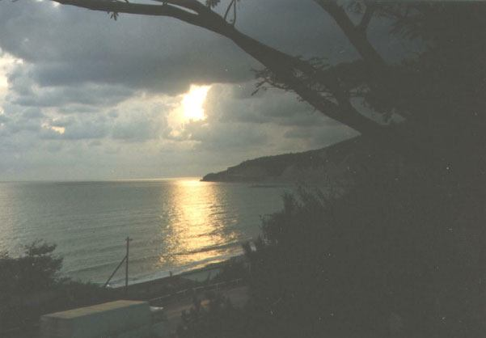

Gorjachij Kljutsch gemietet hatten, machten wir uns auf den Weg über Chadyschensk und Tuapse zum Dorf Lermontowo, vier Kilometer nördlich von Dschubga. Strahlend blaues Meer, weiter Strand und wenig Menschen. Dort, direkt am Ufer, nicht weit von einem Brombeerstrauch und einem Wasserhahn, schlugen wir unsere Zelte auf. Vor uns lag das Meer, hinter uns die Straße, auf der Tag und Nacht die Autos mit quietschenden Reifen vorbeirauschten. Hinter der Straße befanden sich ein Grenzposten und ein Dorf. Am Straßenrand gab es einen Markt, auf dem wir Grundnahrungsmittel kaufen konnten, und das Lieblingsessen aller, außer mir, Maiskolben. Tomaten, Gurken, Äpfel, Birnen, Pflaumen und Trauben gab es in Hülle und Fülle. Die Trauben wurden oft direkt an den Strand gebracht. Wir nahmen die Trauben in flachen Kisten mit, in denen sie in einer einzigen Schicht lagen. Wir kochten unser Essen auf einem Kerosingaskocher, den wir aus Gorjatschij Kljutsch mitgebracht hatten. Der Wind blies die Flamme aus und wir mussten eine Barriere gegen den Wind um den Kocher herumbauen.

Siedlung Lermontowo. Meeres-Landschaft Bald kam Olja aus Rostow. Wir hätten nicht alle in zwei Zelte gepasst. Jede Nacht musste einer der Erwachsenen, meistens ich, unter freiem Himmel schlafen. Am Morgen, als es kühler wurde und der Tau fiel, bedeckte ich mich mit einer Folie.

Valera verbesserte schnell seine Schwimmfähigkeiten und versuchte, sich so weit wie möglich vom Ufer zu entfernen. Natascha schwamm hinter ihm her. Alle bekamen schnell einen Sonnenbrand. Oljas Haut schälte sich in Fetzen ab. Nina, Olja und Roma planschten in der Nähe des Ufers. Ich musste die ganze Zeit auf der Hut sein und konnte nicht vom Ufer wegschwimmen, auch wenn ich es gern gewollt hätte.

Die Kinder haben ihre Ferien genossen. Ich träumte von einer Zeit, in der Nina und ich zusammen ans Meer fahren konnten. Wir würden unser Zelt irgendwo in einer Felsspalte aufschlagen, weit weg von Menschen. Und jeden Morgen würde ich einen Strauß Wildblumen vor das Zelt legen. Aber das war unmöglich. Wir konnten es uns nicht leisten, die Kinder zu Hause zu lassen und unsere Ruhe zu genießen.

Ende August kehrten wir, schwer beladen mit Obst, Marmelade und Honig, nach Jenisseisk zurück, nachdem wir die ganze Reise in umgekehrter Reihenfolge wiederholt hatten.

Zu Beginn des neuen Schuljahres ereignete sich am Institut ein Vorfall, der das ohnehin schon unruhige Leben des Lehrkörpers in Aufruhr versetzte. Bei der Diskussion über die fünfjährige Amtszeit von Nikolai Iwanowitsch Demko als Rektor sprachen sich die Mitarbeiter des Instituts nicht für seine Wahl für die nächste Amtszeit aus. Der Instrukteur des regionalen Parteikomitees, Feodosij Maximowitsch Popow, flog nach Jenisseisk. Nach langen Diskussionen und Absprachen mit dem Kreisparteikomitee und dem Parteikomitee der Region wurde die Leiterin der Abteilung für Sozialwissenschaften unseres Instituts, Sinaida Stefanskaja, zur Rektorin ernannt. Sie war nicht sehr erfahren in Verwaltungsangelegenheiten, zierlich und vor allem gehörte sie keiner der etablierten Gruppen des Instituts an, was den meisten Mitgliedern des Personals entgegenkam. Sie wurde auch vom Ministerium unterstützt. Die Ernennung von Stefanska hat mich nicht sonderlich überrascht. Sie hatte einen Doktortitel in Philosophie, war außerordentliche Professorin und eine aktive Kommunistin, die in der Region viel für den Atheismus getan hat, was zu jener Zeit sehr geschätzt wurde.

Nachdem Nikolai Iwanowitsch Demko, beleidigt durch die Haltung des Personals ihm gegenüber, nach Krasnojarsk zurückgekehrt war, zog Sinaida Wassiljewna in die frei gewordene Wohnung des Rektors. An ihrer Stelle zog Igor Wodinow, Lehrer für Radiotechnik und Absolvent unseres Instituts, mit seiner Frau Lilja Aleksandrowna und ihrer Tochter Ljuda dort ein. Lilja Alexandrowna war eine bekannte und hoch angesehene Gynäkologin in Jenisseisk und eine enge Freundin von Sinaida Wassiliewna Stefanskaja. Mit der Zeit lernte Nina auch Lilja Alexandrowna kennen. Wenn ich an diese Jahre zurückdenke, werden mir die Ähnlichkeiten zwischen den drei Frauen Nina Georgiewna, Sinaida Wassiliewna und Lilja Alexandrowna immer deutlicher. Alle sind gleich alt, gleich groß und gleich gebaut. Alle drei haben den gleichen Gang und weisen viele Gemeinsamkeiten in ihren Charaktereigenschaften auf. Wenn ich mir die Bilder aus jenen Jahren ansehe, auf denen wir von Kindern umgeben sind oder auch nicht, die auf dem Jenissei oder dem Kem schwimmen, bin ich erstaunt, dass ich damals die Ähnlichkeit nicht bemerkt habe. Ich genoss einfach die Gesellschaft dieser Frauen und unterhielt mich gerne mit ihnen über das Leben und die familiären Probleme, von denen Lilja Aleksandrowna, wie auch Sinaida Wassiliewna, viele hatte.

Kurz nachdem Stefanskaja zur Rektorin gewählt worden war, ging Dmitrij Galaktionowitsch Scholudew nach Mariupol. Auf Empfehlung von Stefanskaja wurde ich auf die frei gewordene Stelle des Prorektors berufen. Es war eine sehr mutige Entscheidung von ihr. Schließlich hatte ich keinen Abschluss, keinen Rang und nicht einmal Verwaltungserfahrung. Letzteres war umso gefährlicher, als Sinaida Wassiljewna selbst keine solche Erfahrung hatte. Als ich sie fragte, warum sie mich als Vizerektor ausgewählt hatte, antwortete sie:

- Die Mitglieder des Präsidiums und ich haben Ihre Kandidatur ausführlich erörtert, wobei wir Ihr Alter, Ihre Energie und die Glaubwürdigkeit, die Sie sich in Ihrer Dienststelle erworben haben, berücksichtigt haben.

Dann, nachdem sie darüber nachgedacht hatte, fügte sie hinzu:

- Ich persönlich finde es reizvoll, dass Sie sich noch keiner der bestehenden Fraktionen in unserem Team angeschlossen haben und - und da lachte sie - vor allem, dass Sie nicht trinken.

- Das ist sicher ein stichhaltiges Argument, - ich musste ebenfalls lachen, aber wie haben Sie es geschafft, die Gruppe davon zu überzeugen?

- Was hat das Personal damit zu tun? Ihre Kandidatur wurde vom Parteibezirksausschuss unterstützt, und das Ministerium verlangte nur, dass wir uns mit Ihrer Dissertation beeilen sollten, nachdem Sie Ihre Unterlagen bei der All-Russischen Eignungskommission eingereicht haben, um den Titel eines außerordentlichen Professors zu erhalten.

Die neuen Aufgaben, so wie ich sie mir damals vorstellte, schreckten mich nicht allzu sehr ab. Ich wusste, wie man Arbeit plant und verteilt, Pläne und Zeitpläne für Aktivitäten erstellt, Berichte und Erklärungen für sie schreibt. Leider war es nicht so einfach, wie ich es mir vorgestellt hatte, oder wie Sinaida Wassiljewna es sich vielleicht vorgestellt hatte.

Die Probleme begannen schon bei den ersten Schritten und hingen wie immer mit dem Zusammenbruch der längst etablierten Hierarchie im Team zusammen. Am Institut arbeiteten altgediente Lehrer wie K.A. Patjukow, S.M. Patjukowa, N.S. Nagajew und R.T. Grib, für den Sinaida Wassiljewna als Rektorin eher ein Opfer war. Ihre Ernennung verletzte ihr Selbstwertgefühl, da sich jeder von ihnen, vielleicht nicht zu Unrecht, für würdiger hielt, den Posten zu bekleiden. Da sie jedoch daran gewöhnt waren, Parteibeschlüsse zu befolgen, fanden sie sich damit ab und bemühten sich vor allem darum, Sinaida Wassiljewna in den Kreis ihrer Gruppeninteressen aufzunehmen.

Bei mir war die Sache etwas komplizierter. Meine Ernennung war zwar mit den Parteibehörden abgesprochen, kam aber von Sinaida Wassiljewna. Diese Entscheidung von ihr war besonders verletzend. Schließlich war ich ein Neuling im Team, mit einer zweifelhaften Vergangenheit im Lager. Außerdem wurde ich zu sehr geehrt: in kurzer Zeit vom Assistenten zum Abteilungsleiter und jetzt zum Vizerektor. War das nicht ein bisschen viel? Und dann auch Deutscher. Auch meine Einstellung zum Alkohol empfanden sie als besorgniserregend.

Die meisten Probleme hatte ich anfangs mit den Dekanen, die es vorzogen, mit dem Rektor zu verhandeln und sich bei jeder noch so banalen Angelegenheit an Sinaida Wassiljewna zu wenden. Die Dekanin wies sie taktvoll an mich weiter, zumal sie mit ihrer neuen Rolle noch nicht ganz vertraut war. Schließlich haben sich die Dekane mit mir arrangiert, und alle Fragen der akademischen Arbeit wurden unter meine direkte Aufsicht gestellt. Und hier war, wie ich jetzt beurteilen kann, alles mehr oder weniger in Ordnung.

Schlimmer war die wissenschaftliche Arbeit, insbesondere unter Mathematikern. Als Prorektor und Abteilungsleiter musste ich einige Anstrengungen unternehmen. Obwohl ich mich zu dem Zeitpunkt, als ich zum Vizekanzler ernannt wurde, bereits ernsthaft mit der Methodik der Mathematik beschäftigte, reichte dies eindeutig nicht aus, um eine eindeutige akademische Richtung einzuschlagen. Die Dinge kamen erst ins Rollen, als unsere Absolventen Subakin, Klimkin und Nabebin in die Abteilung eintraten. Die drei arbeiteten in verschiedenen Bereichen und produzierten bis zu zwanzig mathematische Arbeiten pro Jahr, von denen mehr als die Hälfte in zentralen Zeitschriften veröffentlicht wurden.

In diesen ersten Jahren meiner Tätigkeit als Prorektor habe ich Gorst systematisch als Vorsitzenden des staatlichen Prüfungsausschusses nach Jenisseisk eingeladen. Darüber hinaus hat Jura auf meinen Wunsch hin Seminare zur Funktionsanalyse mit Mitgliedern der Abteilung durchgeführt. Normalerweise hatte ich nicht genug Zeit, um mich auf seine Vorlesungen vorzubereiten, und ich war sehr nervös, weil ich befürchtete, die Fragen, die Jura den Zuhörern so gerne stellte, nicht beantworten zu können.

Bei solchen Besuchen in Jenisseisk blieb Jura natürlich bei uns. Es war eine Zeit der Ruhe und Entspannung für ihn. Er blieb die ganze Nacht auf und "plauderte", während er Wein trank. Aber für mich bedeutete es eine schreckliche, sehr anstrengende Belastung. Also musste ich Schirokolobow, Pljaskin und Speranski einladen, um ihn zu unterhalten oder, was noch häufiger vorkam, ihn zu ihnen zu begleiten.

Es fiel Jura schwer, sich an den Mangel an Annehmlichkeiten zu gewöhnen, vor allem nach ein paar Bieren. Er murrte und verfluchte die sowjetischen Behörden und die Kleinstädte. Das Problem für ihn, und auch für uns, war etwas so Einfaches wie der Abwasch. Wir besaßen ein Waschbecken in der Küche, für das ich den Tank und das Abflusssystem selbst vorbereitet hatte. Ich konnte keinen Nippel finden, wie wir ihn in Zugspülbecken haben, also musste ich einen Küchenhahn benutzen.

Ich erinnere mich gut an diesen Morgen. Die Küche. Jura, der ein Hemd und ein Handtuch auf der Schulter trug, wollte sich waschen. Er öffnet den Wasserhahn und spricht weiter mit mir. Das Wasser läuft in einem Rinnsal heraus. Eine Minute, zwei, drei. Ich stelle mir vor, wie schnell sich der Tank leert und der Eimer unter dem Waschbecken füllt. Olga Fedotowna gibt mir verzweifelte Zeichen, und ich warte darauf, dass Jura zu Ende spricht. Aber vergeblich, Jura erzählt leidenschaftlich, was für einen schönen Abend er bei den Speranskijs verbracht hat und was für hübsche Töchter sie haben. Olga Fjodotowna kann es nicht mehr ertragen:

- Jura, dreh den Wasserhahn zu!

- Wieso? - Jura ist überrascht.

Ich schalte mich in das Gespräch ein.

- Ist schon gut, Mama, wir schicken ihn mit Eimern zum Jenissei. Soll er es doch versuchen. Es ist nichts für ihn, Bier zu trinken.

Das Jahr 1964 endete mit Chruschtschows Entlassung. Diesmal geschah dies ohne Blutvergießen und politische Auseinandersetzungen. Am 15. Oktober 1964 wurde ein kurzes Kommuniqué in den Zeitungen veröffentlicht. Darin hieß es, dass das Plenum des Zentralkomitees am Vortag dem Antrag des Genossen Chruschtschow stattgegeben hätte, ihn aufgrund seines fortgeschrittenen Alters (er war damals 70 Jahre alt) und seines sich verschlechternden Gesundheitszustands von seinen Aufgaben als Erster Sekretär des Zentralkomitees der KPdSU, Mitglied des Präsidiums des Zentralkomitees der KPdSU und Vorsitzender des Ministerrats der UdSSR zu entbinden.

Zwei Tage später kritisierte die "Prawda" den "Projektionismus, die voreiligen Schlüsse, die voreiligen Entscheidungen und die realitätsfernen Handlungen, die Prahlerei und den Leichtsinn, die Leidenschaft für die Verwaltung und den Unwillen, das zu berücksichtigen, was die Wissenschaft und die praktische Erfahrung bereits entwickelt haben", die der Partei fremd sind. Obwohl Chruschtschow nicht erwähnt wurde, war jedem klar, um wen es sich handelte.

Nach Chruschtschows Rücktritt wurden die wichtigsten Posten an diejenigen vergeben, die seine Absetzung vorbereitet hatten. Das Amt des Ersten Sekretärs des Zentralkomitees der KPdSU wurde von Leonid Breschnew übernommen, während A. Kossygin die Regierung leitete. M. Suslow wurde der wichtigste Ideologe der Partei. Ich war zutiefst beunruhigt über das Geschehene. Ich hatte den Eindruck, dass Chruschtschows Absetzung kein gutes Omen für uns Ex-Sträflinge war. Aber alles ging gut. Wie zu erwarten war, wurden die Sowchosen abgeschafft, die zentralen Industrieministerien wiederhergestellt, neue Staatskomitees gebildet, die Unterteilung der Parteiorganisationen in Industrie- und Landwirtschaftsorganisationen aufgehoben und Anstrengungen unternommen, die Rolle der Partei in allen staatlichen und wirtschaftlichen Strukturen zu stärken. Obwohl die Rede von den Fehlern Stalins verstummte, verschlechterte sich die Haltung gegenüber den ehemaligen Häftlingen nicht merklich.

In unserem Institut beruhigte sich die Lage nach einiger Verwirrung in den Reihen der Partei wieder. Die Kommunisten, die bis vor kurzem entgegen ihrer inneren Überzeugung einstimmig abgestimmt und alle Vorhaben Chruschtschows ausnahmslos unterstützt hatten, brandmarkten sie nun ebenso einstimmig. Die Stimmung war mürrisch, vor allem, weil ich trotz des Unsinns, den Nikita Sergejewitsch oft zugelassen hatte, im Gegensatz zu vielen meiner Kollegen mit ihm sympathisierte. Ich hatte den Eindruck, dass er wie ein Fisch gegen das Eis ankämpfte und versuchte, das Unvereinbare unter einen Hut zu bringen: die neue Ideologie und die alte Wirtschaft.

Von den ersten Tagen ihrer Machtübernahme an unternahm die neue Führung erhebliche Anstrengungen, um die Autorität der Partei zu stärken und ihren Einfluss auf alle Aspekte der Gesellschaft zu vergrößern. Eine besondere Rolle in diesem Prozess spielte Suslow, der wachsame Hüter der Reinheit der Ideologie, der nie aufhörte, die führende Rolle des "Parteigeistes" als erste Voraussetzung für die Übernahme eines öffentlichen Amtes in jedem Bereich zu betonen. Es wurden Maßnahmen ergriffen, um dem kulturellen Tauwetter ein Ende zu setzen. Im September 1965 wurden die Schriftsteller A. Sinjawski und J. Daniel verhaftet, weil sie ihre Werke im Ausland unter Pseudonymen veröffentlicht und später in gedruckter Form in die Sowjetunion eingeführt hatten. Im Februar 1966 wurden sie zu mehreren Jahren Lagerhaft verurteilt. Es war der erste öffentliche politische Prozess in der Nach-Stalin-Zeit. Vermutlich war er als Beispiel und Warnung gedacht. Die Schriftsteller wurden nach Artikel 70 des neuen Strafgesetzbuchs verurteilt, der den berüchtigten Achtundfünfziger ersetzte. In der Folgezeit wurde dieser Artikel häufig zur Verfolgung verschiedener Formen von Dissidenz verwendet. Verhaftet wurden: A. Ginzburg, der das "Weißbuch" über den Prozess vom Februar 1966 verfasste, P. Litwinow und J. Galanskow, die die Samisdat-Zeitschrift "Phoenix" gründeten, A. Martschenko, Autor des ersten Buches über die Chruschtschow-Lager ("Mein Zeugnis"), das im Samisdat weite Verbreitung fand.

Im Vergleich zu dem, was zu Stalins Zeiten geschah, wirkten diese Vorgänge allerdings wie ein harmloses Kinderspiel. Für einen Teil der Bürger bedeuteten diese Maßnahmen der Regierung jedoch das endgültige Scheitern der mit dem Chruschtschow-Tauwetter aufgekommenen Hoffnung, dass die Sowjetbürger endlich das Recht haben würden, ihre Gedanken frei zu äußern. Es stellte sich jedoch heraus, dass die Partei immer noch versuchte, jeden Schritt des sowjetischen Volkes, jede Gedankenbewegung zu kontrollieren, indem sie für die Menschen entschied, was sie lesen, was sie hören, was sie sehen, worüber sie nachdenken und wovon sie träumen sollten. Es war demütigend, und ich drückte, wie schon in meiner Schul- und Studienzeit, meine Ablehnung gegenüber den Menschen aus, die mir am nächsten standen. Nina war nervös, und abends in der Küche, wenn die Kinder schliefen, schimpfte sie mich für jedes unbedachte Wort aus. Ich musste zustimmen: Ich wusste, dass es wie in den vergangenen Jahren in jeder Studiengruppe KGB-Informanten gab, einige unter Zwang, andere aus eigenem Antrieb. Auch unter den Lehrern gab es viele von ihnen. Ich habe das alles verstanden, aber ich konnte mir nicht helfen. Es stellte sich heraus, dass weder das Gefängnis noch das Lager mich gelehrt hatten, vorsichtig zu sein. Sogar Jura war vorsichtiger als ich und ließ solche Gespräche vor den meisten seiner Freunde aus.

### Kapitel 25. Weiterbildung (1965-68)

Das erste Jahr meiner Tätigkeit als Prorektor war nicht einfach für mich: Ich kannte die Anweisungen und die allgemeine Situation im Institut nicht gut genug, die für mich ungewohnte Art der Beziehungen zum Personal, die Notwendigkeit, auf verschiedenen Sitzungen zu sprechen, die Interessen des Instituts zu verteidigen, an der Lösung von Konflikten mitzuwirken und mir in meiner Rede Kritik anzuhören. In meinen Beziehungen zum Parteibüro gab es viele Irrungen und Missverständnisse. Nach den Direktiven des Zentralkomitees, die die Kontrolle der Partei über alle Bereiche der ideologischen und produktiven Tätigkeit forderten, begannen die Sekretäre der Parteiorganisation unseres Instituts, und das waren abwechselnd die Dozenten der sozialwissenschaftlichen Abteilung, Poluschin und Woronkow, sich systematisch und oft inkompetent in pädagogische und vor allem personelle Angelegenheiten einzumischen. Und wenn es darum ging, einen neuen Professor für das Institut einzustellen, fragten sie sich immer, ob die Person, die sich für die Stelle bewarb, «Franzose» war. Als diese Frage zum ersten Mal in meiner Gegenwart gestellt wurde, verstand ich nicht, worum es ging. Ich weiß nicht, ob der Befehl von oben kam oder ob es eine lokale Initiative war, aber aus irgendeinem Grund waren unsere Parteiführer sehr besorgt über die nationale Frage. Als ich Poluschin danach fragte, antwortete er mit trockener, bürokratischer Stimme:

- In der Intelligenz gibt es überproportional viele Menschen mit solchen Nachnamen. Aber denken Sie nicht, dass ich antisemitisch bin. Die objektive Realität erfordert die Berücksichtigung dieses Umstandes.

Auch für Sinaida Wassiljewna war es nicht leicht. Was anfangs ihre Stärke war - in keine Gruppe integriert zu sein - wurde zu einer Schwäche. Jede Gruppe versuchte, Stefanskaja unter Ausnutzung ihrer Unerfahrenheit, ihrer mangelnden Entschlossenheit und ihrer Härte in Managementfragen in ihren Interessenkreis zu ziehen. Am Ende ihrer fünfjährigen Amtszeit als Rektorin des Instituts gab sie zu, dass sie das Amt niemals angenommen hätte, wenn sie all das, was jetzt passiert, hätte voraussehen können. Sie träumte davon, einen Doktortitel zu erwerben, und plante, am Ende ihres Semesters ein Promotionsstudium aufzunehmen. Das Amt der Rektorin machte ihr kein Kopfzerbrechen, sie behandelte alle Mitarbeiter gleich, unabhängig davon, ob sie zum Personal gehörten oder nicht. Sie war die gleiche, ob sie nun ein Ein-Sterne-Generalsekretär oder der Sekretär des Parteibüros des Instituts war. Auch die Gesellschaft, mit der sie in den Wald ging, um Beeren und Pilze zu sammeln, hat sie nicht verändert.

Bei einem dieser Pilzsammelausflüge setzten sich Nina, Lilja Aleksandrowna und Sinaida Wassiliewna von den anderen Pilzsammlern ab und gelangten in das Sperrgebiet eines im Wald versteckten Raketenabschussbereichs. Sie wurden festgenommen und in das Hauptquartier der Militäreinheit «Poljus» gebracht. Ein dortiger Kapitän brauchte lange, um ihre Identität und den Grund für ihr Eindringen in das Sperrgebiet festzustellen. Der Leiter des Jenisseisker KGB, den Sinaida Wassiljewna persönlich kannte, half ihnen dabei. Ich habe erst am Abend von der Veranstaltung erfahren. Nina, verängstigt und deprimiert, wartete noch lange auf die Fortsetzung. Sie war der Meinung, dass sie, die ihre Zeit nach Artikel 58-1B abgesessen hatte, leicht der Spionage hätte beschuldigt werden können. Zum Glück ist es nicht dazu gekommen.

Am Ende des Schuljahres war ich erschöpft, und ich hatte ein hartes Jahr vor mir. Valerik war jetzt in der zehnten Klasse, und ich musste ernsthaft über seine Zukunft nachdenken. Seiner Denkweise und seinen Interessen nach zu urteilen, hätte er eine Universität besuchen sollen, wo Mathematik ein Hauptfach ist. Gleichzeitig schloss er aufgrund seiner gleichgültigen Haltung gegenüber der Technik technische Hochschulen aus. Von allen Universitäten in Krasnojarsk, die es damals gab, erfüllten die mathematischen Abteilungen der pädagogischen Institute diese Bedingungen am besten. Valera wollte nicht an unser Institut, er wollte nach Krasnojarsk. Wir waren uns einig, zumal im Lehrplan unseres Fachbereichs Physik und Mathematik zu viele Stunden für das Studium der Physik vorgesehen waren. Die Tatsache, dass er fern von seiner Familie leben und studieren musste, störte uns nicht sonderlich, denn Valera war ein ziemlich unabhängiger junger Mann, der ohne meine Hilfe lernte, nicht rauchte und keinen Alkohol trank. Außerdem hatten wir jetzt in Krasnojarsk mit Gorstow Leute, die ihm notfalls helfen konnten. Romotschka wurde in die fünfte Klasse versetzt und besuchte nun die Schule N° 45. Seine Kopfschmerzen machten ihm immer noch zu schaffen und beeinträchtigten sein Lernen. Natascha wurde von Nina betreut.

In Anbetracht der Schwierigkeiten des vergangenen Schuljahres und derer, die mich im nächsten Jahr erwarteten, zeigte Nina besondere Aktivität, was dazu führte, dass Igor Wodinow und ich im Sommer 1965 mit einem Reisegutschein nach Litauen fuhren. Unsere Route begann in dem kleinen, sauberen und gepflegten Dorf Ignolina. Hier an den Seen von Ignolina übernachteten wir vier Tage lang in großen stationären Zelten, in denen Touristen, die nicht wussten, wie man rudert, unterrichtet wurden. Igor und ich, die wir diese Kunst beherrschten, schlenderten derweil durch die malerische Umgebung von Ignolina.

Am vereinbarten Tag wurden uns Boote zugeteilt: ein Mann und drei Frauen, ein Campingzelt, vier Schlafsäcke, vier Schüsseln, vier Becher und vier Löffel. Der Proviant wurde separat befördert. Wir unternahmen eine siebentägige Reise über eine Kette von malerischen Seen, die durch Kanäle miteinander verbunden und manchmal so eng waren, dass wir an Land gehen mussten, um die Boote voranzuschieben.

Sie stachen in einer ungeordneten Gruppe in See, die an einen Zigeunertabor erinnerte. Für die meisten von ihnen war es die erste Bootsfahrt. Sie schlugen ungeschickt mit den Rudern auf das Wasser und bespritzten ihre Nachbarn von Kopf bis Fuß. Quietschen, Schreien. Die Frauen am Heck steuerten, so gut sie konnten. Die Boote stießen mit den Bordwänden aneinander und wurden auseinandergezogen. Es waren fünf Boote vor uns, darunter meins und das von Wodinow. Die Ruderer auf den anderen drei Booten kannten wir nicht, aber ich konnte erkennen, dass sie keine Anfänger waren, weil sie mit den Rudern umgehen konnten. Meine Begleitung bestand aus Frauen, die noch nie gerudert hatten. Igors Situation war ähnlich. In den ersten Minuten wetteiferten wir mit unterschiedlichem Erfolg, aber schon bald begann ich zu ermüden, denn ich spürte, dass Igor körperlich besser vorbereitet war. Schließlich war er ein begeisterter Angler, obwohl er in der Regel mit Motorbooten fuhr. Der Ausbilder bewahrte mich vor dem fast unvermeidlichen Verlieren. Über ihr Megaphon forderte sie uns auf, uns nicht von der Hauptgruppe zu trennen.

Drei Stunden später war es an der Zeit, eine Pause einzulegen. Die Neulinge rieben ihre Handflächen aneinander und betrachteten ihre blutigen Blasen. Igor und ich kamen mit unseren Händen gut zurecht. Wir entfachten ein Feuer und holten Wasser. Die Frauen kochten das Abendessen. Der zweite Teil der Tagesreise war schwieriger - unsere Muskeln schmerzten. Alle wurden schnell müde.

Wir gingen an Land. Die Frauen begannen das Abendessen zu kochen. Die Männer bauten ihre Zelte auf. Ich beobachtete Igor mit Neid. Wie ein echter Mann der Taiga meisterte er die Aufgabe mit Bravour. Ich lernte hinzu. Die in Lermontowo gesammelten Erfahrungen waren offensichtlich unzureichend gewesen. Aber ich bewältigte die Aufgabe dennoch zufriedenstellend. Als Nächstes stellte sich das Problem, wie man die Nacht verbringen sollte. Ich selbst und drei vergleichsweise junge Frauen. Zunächst hoffte ich, dass die Anweiserin die Männer in ein Zelt und die Frauen in ein anderes schicken würde. Doch sie schwieg. Auch die Frauen zeigten keine derartige Initiative. Ich berate mich mit Igor, er schaut mich verwirrt an und fängt dann an zu lachen. Beleidigt über sein Lachen ging ich weg. Ich beschloss, mich draußen hinzulegen und erklärte, dass es im Zelt stickig sei. Doch die schnell herannahende Dunkelheit, die Feuchtigkeit und vor allem die Mücken ließen mich meine Meinung ändern. Ich legte meinen Schlafsack auf die Kante und versuchte, so schnell wie möglich einzuschlafen. In den Nachbarzelten spielte jemand Gitarre und jemand sang. Meine «Mitreisenden» flüsterten und kicherten. Nur mit Mühe schlief ich ein, weil ich Angst hatte zu schnarchen. Ich wachte mitten in der Nacht auf und wusste lange Zeit nicht, wie ich hier herauskommen sollte. Die in Jenissejsk gesammelten Erfahrungen halfen mir, den Weg nach draußen zu finden, ohne auf jemanden zu treten. In der Nähe unseres Zeltlagers gab es ein Lagerfeuer. Unsere Instrukteurin stand daneben. An ihrer Seite zwei junge litauische Männer mit schwarzen Haaren. Sie unterhielten sich angeregt über irgendetwas, soweit ich verstand, in ihrer litauischen Muttersprache, aber bei meinem Anblick verstummten sie. Igor hatte mich schon vor seiner Ankunft in Ignolina gewarnt, dass die Litauer die Russen nicht besonders mögen.

Am Morgen wärmten wir uns im feuchten Nebel auf, entzündeten erneut ein erloschenes Feuer, packten unsere Zelte zusammen und setzten nach dem Frühstück unseren Weg fort. Von unserer ganzen Gesellschaft interessierte mich ein Boot, oder besser gesagt ein Paar im Boot, vom ersten Tag an. Er an den Rudern, sie am Steuer. Sie haben sich die ganze Zeit gegenseitig Vorwürfe gemacht. Sie wirft ihm vor, nicht rudern zu können, und ihr Boot dreht sich ständig nach links, er wirft ihr vor, nicht steuern zu können. Sie war wunderschön, im östlichen Stil. Morgens sah ich sie in ihrem Zelt stehen und ihr wunderschönes, teerschwarzes, glänzendes Haar bürsten. Ich war fasziniert von der Anmut ihrer Bewegungen und der Sanftheit ihrer gutturalen Stimme. Meine Begleiterinnen verstanden schnell und auf weibliche Art meine Gefühle und teilten mir mit offensichtlicher Freude mit, dass die Fremde Nelia heiße und die rechtmäßige Ehefrau des langweiligen Kerls sei, der an den Rudern sitze und ständig mit ihr schimpfe.

Wir wurden bald Freunde. Die Pantins waren wunderbare Menschen. Igor, den ich im Gegensatz zu Igor Wodinow wegen der Farbe seines Hemdes Igor Kletschatij (kariert, gewürfelt; Anm. d. Übers.) nannte, war außerordentlicher Professor an einer Moskauer Universität und hatte in Philosophie promoviert. Nelja Surenowna war Psychologin, Kandidatin der pädagogischen Wissenschaften und leitende Forscherin im Labor von Schedrawitskij. Jetzt verbrachten wir unsere Abende damit, über das Schicksal unserer Bildung und unseres Landes zu streiten, so wie ich es früher mit Jura getan hatte.

Sieben Tage später fuhren wir nach einer Paddeltour durch die Seenplatte zu unserem Ausgangsort zurück. Zu den Klängen eines Orchesters am Ufer kehrten wir in geordneter Bootsformation zurück. Dann ein paar Tage in Vilnius, dem ehemaligen Wilna, wo ich durch die engen Gassen der Altstadt schlenderte und daran dachte, dass meine Mutter vielleicht in ihrer Kindheit dort spazieren gegangen war. Dann war da noch Trakai mit seiner düsteren mittelalterlichen Burg. Boot fahren, Schach spielen. Und schließlich Palanga, wo Igor und ich die letzte Woche unserer Reise in einem luxuriösen Doppelzimmer verbrachten. Ein Ort von außergewöhnlicher Schönheit. Majestätische Pinien, Grün, Sand, Sauberkeit und Stille, die nur durch die Schreie der Möwen gestört wird. Ich erholte mich gut und kehrte voller Eindrücke nach Jenisseisk zurück.

1966 beendete Valera die Schule. Jura Gorst riet ihm, sich an der neu eröffneten Krasnojarsker Zweigstelle der Nowosibirsker Universität, Fakultät für Mathematik, zu bewerben. Die Aufnahmeprüfungen fanden, wie an der Universität Nowosibirsk selbst, früher statt als an anderen Universitäten des Landes, und Valera ging bald nach seinem Abschluss nach Krasnojarsk. Er lebte bei den Gorsts. Bei seinen Prüfungen erzielte er 13 Punkte, was sich als passabel erwies. Er war auch Schüler von Sascha Kuprikow und Boris Durakow, die ebenfalls die Schule N° 45 in Jenisseisk absolviert hatten, aber in seine Parallelklasse gegangen waren.

Jetzt musste darüber nachgedacht werden, eine Wohnung für ihn zu bekommen. Er konnte schließlich die Gastfreundschaft der Gorsts nicht missbrauchen. Ein Eckchen fanden wir durch eine meiner ehemaligen Studentinnen im Bereich der Straße der Metallarbeiter. Es war zwar sehr weit weg, aber sie war eine angenehme und sehr saubere Zimmerwirtin. Die Gruppe, in der Valera war, bestand aus vielen talentierten Jungs, unter denen Schamil Dautow und Kolja Podufalow hervorstachen. Die Vorlesungen in Algebra und analytischer Geometrie im ersten Jahr wurden von erfahrenen Lehrern wie Viktor Michailowitsch Busarkin und Nikolai Wassiljewitsch Loiko gehalten, was ihr hohes theoretisches Niveau und ihre strengen Wissensanforderungen bestimmte. Mir war klar, dass es unter diesen Bedingungen schwieriger sein würde, an der Universität zu bleiben als dort angenommen zu werden, und ich war sehr besorgt, weil ich in Jenisseisk wenig tun konnte, um ihm zu helfen. Meine ganze Hoffnung lag in Valerijs Ernsthaftigkeit und Selbständigkeit.

In jenem ersten Jahr, in dem Valera in Krasnojarsk lebte, kam eine Reise ans Meer selbstverständlich nicht in Frage. Doch Nina war nervös. Sie litt unter Kopfschmerzen, subfebrilem Fieber und Leberproblemen. Es gelang ihr gerade noch, einen Reiseschein ins Erholungsheim «Kabardinka» zu bekommen, einem Ferienhaus an der Schwarzmeerküste unweit von Gelendschik. Wie Nina mir später erzählte, war es ihr erster richtiger Urlaub. Es war ein Urlaub, in dem man nicht dreimal am Tag kochen, andere durchfüttern, das Geschirr spülen, Wäsche waschen und darauf achten musste, dass keines der Kinder zu weit vom Ufer wegschwamm.In «Kabardinka» sonnte sie sich nun morgens und abends, wenn es nicht so heiß war, am Strand, besuchte Konzerte, ging abends tanzen, spazierte an der Küste entlang und nahm an Ausflügen und Verlosungen teil.

- Und dein Telegramm: «Schicke dreihundert, erhole dich, hab' Spaß», erinnerte sie sich plötzlich - traf in meiner Abwesenheit ein, und die Frauen, die es lasen, fragten sich immer wieder, welche Art von Spaß du wohl gemeint haben könntest.

Ich traf Nina in Krasnojarsk und brachte sie sofort zu Gorsts Wohnung. Die Eigentümer selbst waren zu dieser Zeit auf der Krim im Urlaub. Nina kam an und war nicht wiederzuerkennen: ausgeruht, erfrischt, jünger. Die drei Tage im Haus der Gorsts vergingen wie ein Wimpernschlag. Wir haben nicht einmal gekocht, sondern lieber gefastet.

Im Oktober 1966 traf ein Telegramm aus Moskau ein. Darin hieß es, ich müsse drei meiner in der zentralen Presse veröffentlichten Bücher bei der All-Russischen Eignungskommission einreichen, damit entschieden werden könne, ob ich den Rang eines außerordentlichen Professors erhalte. Es waren nur noch zwei Tage bis zum Ablauf der Frist. Die Pantins, denen ich diese Bücher bei einer meiner Reisen nach Moskau vorgestellt hatte, halfen mir dabei. Sie brachten sie mit meinen Widmungsinschriften dorthin. Der Titel eines außerordentlichen Professors stärkte zum einen meine Position im Institut und verbesserte zum anderen unsere finanzielle Situation. Indem ich eine Verwaltungsposition mit dem Unterrichten kombinierte, verdiente ich natürlich im Rahmen der erlaubten 220 Stunden mehr als fünfhundert Rubel pro Monat, wenn man die nördlichen Zulagen berücksichtigt.

Meine Ernennung zum Dozenten hatte noch einen weiteren Vorteil: Ich war berechtigt, im zweiten regionalen Krankenhaus behandelt zu werden, welches sich im Zentrum von Krasnojarsk, unweit des Flussbahnhofs, befindet. Dieses Krankenhaus wurde im Volksmund als «Letschkomissija» («Behandlungs-Kommission»; Anm. d. Übers.) bezeichnet. Das Krankenhaus behandelte Parteiund Sowjetfunktionäre sowie Hochschulabsolventen. Alle in der Klinik behandelten Patienten wurden in drei Kategorien eingeteilt. Die erste Gruppe waren die Sekretäre der Kreis-, Stadt- und Bezirksparteikomitees, die Vorsitzenden der Exekutivkomitees und die Doktoren der Wissenschaften. Sie wurden auf höchstem Niveau betreut: Ihnen wurden eigene Stationen mit Fernsehgeräten, Kühlschränken und Telefonen zugewiesen. Auch erwachsene Familienangehörige wurden von der Ärztekommission behandelt.

Die zweite Kategorie bestand aus Beamten der unteren Laufbahngruppen. Die Abteilungsleiter, sofern sie einen Abschluss hatten, gehörten zur zweiten Kategorie. Die Dienstleistungen waren weniger komfortabel. Von den Familienmitgliedern konnten jeweils nur die Ehefrauen oder Ehemännern behandelt werden.

Die dritte Kategorie von Hochschulmitarbeitern waren alle, die einen Doktortitel hatten.

Im Großen und Ganzen war das System recht verwirrend und wurde häufig von persönlichen Beziehungen bestimmt. Im Regionalkomitee der Partei gab es eine spezielle Abteilung, die ermittelte, wer von der Behandlungskommission behandelt werden konnte und die entsprechenden Bescheinigungen ausstellte. Alle fünf Jahre wurden alle Personen, die der Behandlungskommission angehörten, neu registriert. Als Vizerektor mit dem Rang eines Dozenten, aber ohne akademischen Abschluss, fiel ich in die dritte Kategorie, d. h. ich konnte nur mich selbst behandeln. Dieses Recht galt nicht für Nina. Sinaida Wassiljewna setzte sich dafür ein, dass Nina zu einer Untersuchung zugelassen wurde. Sie blieb einen Monat lang und wurde mit der Diagnose entlassen: schwere Neurasthenie, Arachnoiditis, Osteochondrose, Stenokardie. In einem privaten Gespräch mit mir sagte der behandelnde Arzt, dass ihr Zustand zwar ernst sei, «vor allem für die Menschen in ihrer Umgebung», aber nicht gefährlich für Nina. Sie befürwortete unsere Ausflüge ans Meer, riet uns aber, uns nicht zu sehr von der Sonne verführen zu lassen.

Natürlich wurden Reisen in den Süden und die Sonne missbraucht, und wir mussten uns in alltäglichen Dingen und bei der Kleidung einschränken, aber ich erinnerte mich an meine Kindheit und wollte, dass meine Kinder auch im Alter etwas haben, woran sie sich erinnern können. Außerdem war ich mir sicher und bin es immer noch: Kinder brauchen in ihrer Jugend nicht so viel Fett und Fleisch, sondern Obst, Gemüse, Sonne und lebendige Eindrücke. Und vorzugsweise in der Nähe des Meeres. Leider begann meine neue Position, sich mit meinen Familienreisen zu überschneiden. Nun musste ich meine Sommerferien mit denen des Rektors abwechseln, zumal sie einen halben Monat länger waren als auf dem «Festland». In diesen Fällen musste ich gelegentlich eine finanzielle Entschädigung annehmen.

Im Jahr 1967 unternahmen wir eine weitere Reise in den Süden. Wir waren zu viert: ich, Nina, Roma und Natascha. Valerik und seine Freunde und Kommilitonen, Kuprikow, Pawlow, Durakow und seine Schwester, reisten am selben Tag wie wir ab, aber nicht nach Rostow, sondern nach Sotschi. Solange unsere Züge auf der Transsibirischen Eisenbahnlinie fuhren, trafen wir uns mehrmals auf den großen Bahnhöfen, erst nach Omsk trennten sich unsere Wege.

Unsere Route war die übliche: Moskau, Rostow, Krasnodar, Gorjachij Kljutsch, Dschubga. In Gorjatschij Kljutsch schloss sich uns Olga an. Wir fuhren über einen Pass an der im Bau befindlichen strategischen Fernstraße Krasnodar-Dschubga ans Meer. Der noch nicht fertiggebaute Abschnitt erwies sich als kurz, aber äußerst schwierig und befand sich auf der höchsten Stelle des Passes, der etwa zwei Kilometer lang ist. Wir meisterten ihn zu Fuß. Die alte «Pobeda», mit der wir fuhren, bahnte sich ihren Weg über eine alte, völlig kaputte Straße.

Nachdem wir in Dschubga ein wenig herumgelaufen waren, beschlossen wir, dass der Strand in Lermontowo besser war, also fuhren wir vier weitere Kilometer und hielten an einem Brombeerstrauch, den wir dort angepflanzt hatten. Wir kehrten über Tuapse und Sotschi nach Hause zurück. In Sotschi hielten wir an der Wohnung, in der Valera und seine Freunde untergebracht waren. Sie waren nicht zu Hause, aber Valeras salzgetränkte Jeans lagen in der Küche. Auf dem Rückweg sahen Roma und Natascha zum ersten Mal die Tunnel, durch die ich in meiner Kindheit so oft gefahren war. Ich habe mich mit ihnen gefreut.

Im Herbst 1968 sollte ich nach Moskau zur Fakultät für Fortbildung (FPK) des Staatlichen Pädagogischen Lenin-Instituts Moskau fahren. Der von Professor Lewin, dem Dekan der Fakultät, unterzeichnete Bescheid traf im Frühjahr ein, und alle zu Hause, mich nicht ausgenommen, waren besorgt über die bevorstehende viermonatige Trennung.

Trotzdem, oder vielleicht gerade deshalb, fuhren wir wieder nach Süden. Ich, Nina, Valera, Roma, Natascha. Die Route war die gleiche. Moskau, Rostow, Gorjatschij Kljutsch, Dschubga, Lermontowo. Diesmal fahren wir über den Pass, die Autobahn ist fertiggestellt und in Betrieb genommen. Eine gute Freundin von mir aus Rostow ist mit ihrem Enkel bei uns. Das brachte zusätzlichen Ärger mit sich. Dann kam Sinaida Michailowna Patjukowa, Dozentin an der Physikabteilung des Pädagogischen Instituts Jenisseisk, mit ihrer Tochter Galja, Valerijs Klassenkameradin und Sohn Sergej. Wir wohnten wie zuvor in Zelten am Strand in der Nähe eines Brombeerstrauchs, der uns ins Auge fiel. Im Gegensatz zu den Vorjahren war der Strand wegen der Eröffnung der Trasse voll mit Menschen. Es gibt eine Warteschlange für den Wasserhahn, eine Warteschlange für die Toiletten, eine Warteschlange für die Kantine. Aber die Kinder haben Spaß, sie schwimmen, spielen Volleyball, gehen in die Berge und am Abend ins Freiluftkino. Nina, Sinaida Michailowna und ich hatten keine Zeit zum Ausruhen. Das Kerogas konnte nicht abgestellt werden. Es gab nicht genug Geschirr. Wir mussten es am Schapsug waschen, dem Fluss, der einen halben Kilometer von uns entfernt in den Bach mündet. Am ersten Tag stellte sich heraus, dass wir die Löffel vergessen hatten. Es gab keine Möglichkeit, welche zu kaufen. Valera schlug vor, dass wir zum Mittagessen in die Kantine gehen und einen Löffel mitnehmen sollten. Mein Gewissen wehrte sich dagegen, nicht so sehr mein Parteigewissen (damals gab es auf allen Ebenen «Plünderer»), sondern das elementare christliche Gewissen, das mir meine Eltern eingeimpft hatten.

Nachdem ich alle Kinder eingesammelt und vor der Tür abgesetzt habe, gehe ich in die Kantine und wende mich an die Kellnerin und frage sie:

- Junge Frau, kann ich bei Ihnen ein paar Löffel kaufen?

- Nein, natürlich nicht», sagt sie, ohne nachzudenken.

- Sehen Sie, ich habe eine Schar von Kindern bei mir, die vor der Tür stehen, und keinen einzigen Löffel, den haben sie beim Packen vergessen», versuche ich die strenge Kellnerin zu beschwichtigen. Dann füge ich hinzu, um der Bitte eine humorvolle Note zu geben:

- EFür die ganze Gesellschaft einen Löffel mit Löchern, ein Sieb oder Durschlag oder wie auch immer man es nennt.

- Ja, ein Sieb», lacht sie. «Sie sind aber ganz schön durcheinander? Sie tun mir leid, vor allem die Kinder, aber wir dürfen die Geräte nicht verkaufen.

- Aber was sollen wir tun? - frage ich.

- Stehlen», flüstert sie und beugt sich über den Tisch.

- Stehlen? - fragte ich ebenfalls im Flüsterton, aber was ist mit dem Gewissen?

- Was ist denn so schlimm daran? Uns fehlt jeden Tag ein Dutzend Löffel.

Ich hatte keine andere Wahl, als Valeras Idee umzusetzen.

Einmal gingen wir in den Wald auf den Bergen, die die Bucht umgeben. Und dort pflückten wir zu unserer Überraschung in kurzer Zeit einen ganzen Eimer voller Birken- und Steinpilze. Ein Foto von Nina mit Sinaida Michailowna am Zelt ist aus dieser Zeit erhalten. Ein Haufen Pilze liegt vor ihnen. Die Einheimischen fragten sich, wie wir es wagen konnten, in den Wald zu gehen:

- Schließlich wimmelt es dort von Vipern», argumentierten sie.

Trotz dieser Warnung machten wir uns erneut auf den Weg in den Wald.

Ich erinnere mich, dass eines Nachts ein Sturm aufkam. Das Zelt, das Valera, Sergej und Galka gerade aufbauten, wurde von den ersten Windböen weggeblasen, und die ganze durchnässte Gesellschaft stürzte in unser Zelt. In dem engen Raum drückten sie mit dem Rücken gegen die Plane, und das Zelt begann an diesen Stellen undicht zu werden. Kalte Regentropfen prasselten auf unsere Körper

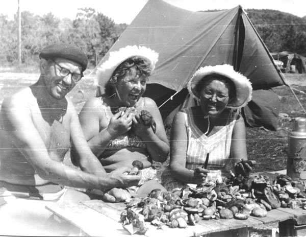

nieder. Zu allem Überfluss verschlammte der vom Meer her wehende Wind die Mündung des Schapsuga-Flusses, und das Flusswasser strömte den Strand hinunter. Rufe, Gebrüll und Kindergeschrei wurden laut. Die Motoren der Autos dröhnten. Von Blitzen erhellt und von Donnergrollen begleitet, machten sich die Urlauber auf den Weg zur Straße. Das Wasser erreichte uns nicht, und nachdem wir uns die ganze Nacht abgewechselt hatten, warteten wir sicher bis zum Morgen. Am Morgen beleuchtete eine graue Morgendämmerung den trostlosen Strand. Zu unserer Rechten gab es kein einziges Zelt. Auf der linken Seite standen drei einsam. Unrat, Baumstümpfe und ganze Stämme liegen am Ufer verstreut. Im Zelt schliefen ein paar junge Leute, die aneinander gekuschelt waren und alles angezogen hatten, was gerade zur Hand gewesen war.

Bis zum Abendessen hatte sich das Wetter aufgeklärt, das Meer sich wieder beruhigt. Die Sonne schien, als ob nichts geschehen wäre, und spottete über unsere Probleme. Nach und nach kehrten die Urlauber zurück, manche in Autos, manche zu Fuß.

Lermontowo. Wir nach dem Pilzesammeln.

Wir bauten die Zelte wieder an ihrem vorherigen Platz auf. Valera stellte auch sein vom Wind eingestürztes Zelt wieder auf, das er mit in den Sand getriebenen Pflöcken sicherte. Einige Tage später, am 22. August, verkündete der Moskauer Rundfunk den Einmarsch der gemeinsamen Streitkräfte des Warschauer Paktes in die Tschechoslowakei. Für diejenigen, die die jüngsten Ereignisse in diesem Land verfolgt hatten, war dies keine große Überraschung.

Aus Gesprächen mit den Urlaubern konnte man entnehmen, dass die überwiegende Mehrheit von ihnen das Vorgehen unserer Regierung guthieß. So auch Sinaida Michailowna. Ich wollte unbedingt BBC oder Stimme Amerikas hören, aber die Störsender liefen auf Hochtouren, und ich konnte in der Nähe von Lermontowo keinen Ort finden, an dem ein einziges Wort zu hören war.

Bald darauf reisten die Patjukows ab. Da Nina und die Kinder ohne mich nach Hause fahren sollten, beschloss ich, sie nicht über Moskau zu schicken, sondern direkt mit dem Zug, der auf der südlichen Nebenstrecke von Sotschi fuhr. Das heute übliche System des Kartenvorverkaufs gab es damals noch nicht, also musste ich nach Sotschi fahren, um sie zu bekommen. Nachdem ich seit dem frühen Morgen in einer endlosen Schlange gestanden hatte, gelang es mir erst am vierten Tag, Fahrkarten zu kaufen, und dann auch nur für den Wagen der zweiten Klasse. Völlig erschöpft, aber glücklich und mit den Tickets in der Hand kehrte ich nach Lermontowo zurück. Olga, auf deren Ankunft wir gewartet hatten, war immer noch nicht da. Drei Tage später brachte ich Nina und die Kinder nach Sotschi. Ich ließ das Zelt und das Bettzeug in der Obhut meiner Nachbarn und bat sie, Olga zu sagen, dass ich am Abend aus Sotschi zurück sein würde, falls diese inzwischen auftauchen würde.

- Sie soll im Zelt bleiben und warten, - meinte Nina.

Der Zug, in den ich Nina und die Kinder setzte, machte einen miserablen Eindruck.

Schmutzige Waggons, zerbrochene Fenster, halb betrunkene Schaffner. Nina sagt, es sei eine schreckliche Reise gewesen. Der Wagen war überfüllt, alle Gänge waren mit Kisten, Ballen und Körben vollgestellt. Der Dreck war unglaublich, es gab keine Wäsche, kein kochendes Wasser, die Schaffner waren unhöflich. Valerik hat uns viel Ärger gemacht, vor allem auf der Fahrt von Sotschi nach Tuapse. Während der langen Wartezeiten auf den Zug ging er den Hang hinunter zum Meer und badete. Und Nina und die Kinder waren nervös.

Zurück in Lermontowo sah ich Olga schon von weitem. Sie stand vor unserem Zelt und sprach mit einem Nachbarn über irgendetwas. Sie hatte eine

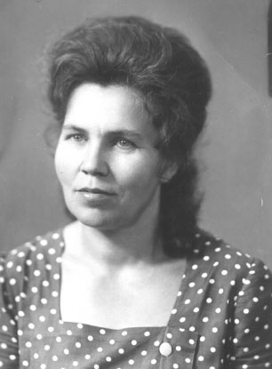

schlanke Figur, trug ein rot-kariertes Chintz-Kleid und gewellte Haare, die zu einem Knoten aufgesteckt waren.

Olga Butenko Eine unbestimmte Erregung ergriff mich. Es war das erste Mal, dass Olja und ich auf diese Weise allein zusammen waren.

Nina und Olga waren sehr eng miteinander befreundet. Nina hatte mir immer wieder, allein und in Olgas Beisein, gesagt, dass ich im Falle ihres Todes (eine Annahme, gegen die sie uns gegenüber natürlich protestierte) Olga heiraten solle und sonst niemanden. Obwohl sie sowohl äußerlich als auch geistig sehr unterschiedlich und manchmal genau das Gegenteil waren, sah ich in Olga eine natürliche Fortsetzung von Nina. Außerdem konnte ich mit ihr über Dinge sprechen, über die ich mit Nina nie gesprochen hatte. Wenn wir über unsere Familienprobleme redeten, stellte sich Olga immer auf Ninas Seite und schimpfte mich oft aus wie einen ungezogenen Jungen. Sie hatte ein typisch russisches, ovales Gesicht, schöne graue Augen und starke, blitzende weiße Zähne. Der angenehme Gesamteindruck wurde durch die unregelmäßige Stellung ihrer oberen Zähne etwas getrübt, die dazu führte, dass sie ihre Lippen immer fest zusammenpresste und ihr Lächeln mitleidig und angestrengt aussah. Deshalb lachte Olga im Gegensatz zu Nina sehr selten, und wenn, dann bedeckte sie ihren Mund mit der Hand und tat es, wie mir schien, vergeblich. In den vielen Jahren, in denen wir uns kannten, hatte ich sie schon einige Male offen lachen sehen, und das war viel schöner gewesen als lachende Augen und fest zusammengepresste Lippen.

Olga kleidete sich geschmackvoll und nähte nicht nur für sich selbst, sondern auch für alle ihre Freunde und Bekannten, einschließlich Nina. Ihre Haltung gegenüber Nina war nicht verlogen, es gab keine Spielchen, keinen heimlichen Neid, wie er oft in Beziehungen zwischen Freunden vorkommt.

In der ersten Zeit unserer Bekanntschaft im Lager, als David und ich uns über den Weg liefen, war sie gegen mich, da sie meine Haltung gegenüber Nina für leichtsinnig hielt, vielleicht wegen Nelia Soroka und Ninel Manikowskaja. Mit der Zeit schien diese Feindseligkeit zu schwinden, aber der nörgelnde Ton blieb bestehen, und das machte die ständige Distanz zwischen uns aus.

Olga war leider eine sehr kränkliche Person. Nach einem Sturz in das offene Einstiegsloch einer Walzstraße war ihre Wirbelsäule verletzt. Wenn die Dämmerung einsetzte, schaukelte sie hin und her und konnte ohne Hilfe keine zwei Schritte gehen. Auch im Meer wurde sie hin- und hergeworfen, so dass sie sich beim Schwimmen ständig an einem ihrer Begleiter festhalten musste. In solchen Momenten war ich vielleicht ein wenig übereifrig. Als ich jedoch Olins missbilligendem Blick begegnete, wurde ich schnell ruhiger. Doch ihre besondere Beziehung nicht nur zu Nina, sondern zur ganzen Familie, ihr teilnahmsvolle Haltung gegenüber den intimsten Aspekten meiner Beziehung zu Nina, gaben mir eine vage Hoffnung. Ihre, wie ich hoffte, vorgetäuschte Feindseligkeit und Ironie gaben dieser Hoffnung einen bitteren Beigeschmack. Obwohl Nina für mich äußerlich und innerlich interessanter war als Olga, hatte letztere etwas Geheimnisvolles an sich, etwas, das sich mir hartnäckig widersetzte und das mich immer wieder zu ihr hinzog. Ich wollte diese Hartnäckigkeit überwinden, liebevolle Worte von ihr hören und vielleicht sogar ein Geständnis meiner Gefühle für sie. Ich muss gestehen, dass Olga meine zaghaften Versuche in dieser Richtung entschieden unterdrückte. Ich nahm ihre Abfuhr sogar mit einer gewissen Erleichterung und Dankbarkeit wahr, da mir klar wurde, welchen Gewissensbissen ich mich sonst unterworfen hätte.

Ob Nina meine besondere Einstellung zu Olga bemerkt hat? Ich glaube, das hat sie, und sie hat sehr viel verstanden. Normalerweise war sie sehr eifersüchtig und bemerkte jeden meiner unvorsichtigen Blicke in Richtung einer hübschen Frau, aber im Hinblick auf Olga verriet sie, zumindest äußerlich, ihre Gefühle in keiner Weise. Außerdem legte sie sich bei den seltenen Gelegenheiten, bei denen wir zusammen in einem Zelt schlafen mussten, so hin, dass ich zwischen ihnen lag. Ich weiß nicht, was Nina dabei empfand, aber ich glaube, es war etwas Ähnliches wie das, was mich dazu brachte, David aufzusuchen und ihn zu uns nach Hause zu holen. Ich nehme an, ihre Bitte, nicht nach Moskau zu fahren, sondern einige Tage mit Olga auf See zu bleiben, hatte die gleiche Grundlage.

Und hier sind wir allein. Die letzten Tage im August. Der Strand war bereits merklich ausgedünnt. Die meisten waren zu Beginn des Unterrichts schon weg. Nur ein Dutzend oder zwei Zelte blieben übrig. Die Sonne brennt weiter unerbittlich, als hätte sie ihre Abreise nicht bemerkt. Das Meer ist immer noch sonnendurchflutet und der Sand am Strand ist glühend heiß. Ich bin braungebrannt, frei und ein wenig selbstbewusst und kümmere mich um Olga: kochen, füttern, mit ihr im Meer schwimmen. Die Nachbarn schauen missbilligend in unsere Richtung. Aber sie sind mir egal. Ich denke mit angehaltenem Atem an die bevorstehende Nacht. Noch nichts Definitives. Nur eine gemeinsame Nacht. Ein schwarzer Sternenhimmel, das Rauschen der Wellen am Ufer, ein wandernder Suchscheinwerfer, ein leeres, sinnloses Gespräch. Vielleicht eine leichte Berührung der Hände, ein Kuss. Das war's, das ist die Grenze. Dann Dunkelheit und Finsternis, dann Verrat. Und doch ergreift mich ein süßer Schauer.

Der karmesinrote Sonnenuntergang spiegelt sich in den rollenden Wellen. Das Zelt. Olga, die wie immer sorgfältig jede Falte glättet und nach verlorenen Sandkörnern sucht, macht zwei Betten, die so weit wie möglich auseinander liegen. Die Sätze, die sie von sich gibt, sind trocken und förmlich, als würde sie Befehle erteilen. Sie stellt klar, dass es keinen Flirt geben wird, nicht einmal den kleinsten Flirt.

Ich liege da, zusammengekauert an der Zeltwand. Ich bin schlecht gelaunt und überlege, was ich Olga sagen soll. Zum Schluss möchte ich noch eine Frage stellen:

- Nun, was bedeutet diese Demarche. Meinst du, ich würde dich belästigen?

Olga mit einer unschuldigen Stimme:

- Komm schon, Robert, welche Demarche und was bedeutet das Wort Demarche überhaupt?

- Verstelle dich nicht. Du weißt ganz genau, was dieses Wort bedeutet und was ich damit gemeint habe.

- Und was hast du gemeint», spielt Olga weiter den Narren.

- Warum hast du die Betten in verschiedenen Ecken aufgeschlagen, das Zelt ist überhängend, man kann kaum atmen, und du selbst liegst fast auf dem nackten Boden?

- Ich fand es so besser, es ist nicht so heiß», setzte Olga ihr Spiel fort.

- Nina hat immer in der Mitte geschlafen, und uns war nie heiß», protestierte ich heftig.

- Ihr liebt euch also.

- Und du kannst mich immer noch nicht ausstehen? - Die Frage hing in der dunklen und sehr stickigen Tiefe des Zeltes.

Nach einer langen bedeutungsvollen Pause antwortete Olja:

- Ich werde nicht über meine Gefühle für dich und deine für mich sprechen. Aber Nina ist die Person, die mir am nächsten steht, keine meiner Schwestern und nicht einmal meine Mutter haben solche Gefühle wie ich für Nina, und ich werde sie niemals verraten. Lass uns schlafen gehen.

Ich weiß nicht, ob sie in dieser Nacht eingeschlafen ist, aber ich konnte lange Zeit nicht schlafen, weil ich über unser Gespräch in dieser Nacht nachdachte. Ich weiß, dass viele Leute mich verurteilen werden. Männer, weil sie unmännlich sind, Frauen, weil sie versuchen, Nina zu betrügen. Ich versicherte mir, dass es nicht so sehr die körperliche Intimität war, die ich wollte, sondern eher das Gefühl oder sogar die Erkenntnis davon. Aber warum? Wenn das geschähe, würde sich alles ändern. Ich teile vollkommen die Meinung von Exupery in „Der kleine Prinz“: «Wir sind verantwortlich für die, die wir gezähmt haben». Welche Qualen hätte ich auf mich genommen, wenn das Falsche passiert wäre. Sogar die Tatsache, dass ich Olga wissen ließ, dass ich es wollte, widerte mich an, als hätte ich eine schmutzige, unehrliche Sache getan und so getan, als würde ich am Morgen schlafen, um das Gespräch zu verschieben.

Aber Olga hatte das Feingefühl, das Geschehene nicht wieder aufzugreifen, und in den verbleibenden zwei Tagen war unser Verhältnis zwar betont freundlich, aber distanziert. Am dritten Tag, nachdem wir unser Zelt eingepackt hatten, fuhren wir mit dem Bus über Gorjatschij Kljutsch nach Krasnodar, von wo aus Olga den Zug zu ihrem Haus in Rostow nahm und ich das Flugzeug nach Moskau zur Fakultät für Weiterbildung nahm.

Ich flog nach Moskau, braungebrannt, schlank, voller Energie und voller guter Pläne. Vier Monate lagen vor mir, frei von häuslichen Problemen, vier Monate, die ich meiner Dissertation widmen wollte. Seltsamerweise störte mich der Gedanke an zu Hause, an die Kinder, an Nina, der mich sonst auf jeder Reise bedrängt, jetzt nicht mehr. Viel mehr beunruhigte mich der Gedanke an Olga. Wie hatte ich mich nur so gehenlassen, meinen Grundprinzipien so untreu werden können, dass ich meine Wünsche nie offen geäußert hatte. Die Scham gegenüber Olga und natürlich die Schuldgefühle vor Nina verfolgten mich wie ein quälender Zahnschmerz. Natürlich war ich sicher, dass Olga Nina nichts sagen würde, nicht so sehr meinetwegen, sondern um Ninas und unseres gemeinsamen Seelenfriedens willen. Was könnte sie gesagt haben, und was bedeuteten diese wenigen Worte im Zelt überhaupt? Aber mein Gewissen quälte mich und verdarb mir die gute Laune.

Ich kam mit einiger Verspätung in der Weiterbildungsabteilung an. Die Gruppe, der ich zugeteilt wurde, hatte bereits seit zwei Tagen am Unterricht teilgenommen. Ich wurde in einem Hotel für Minister untergebracht, das im Erdgeschoss des Wohnheims des Staatlichen Pädagogischen Instituts Moskau in der Straße der Kosmonauten 13 «A» gelegen war. Der Unterricht fand im Gebäude der mathematischen Abteilung des Moskauer Staatlichen Pädagogischen Instituts statt, das sich zwischen den Hochhäusern der Oktober-Eisenbahnverwaltung in der Dawidowskij-Gasse 2 befand. Zum Unterricht und zurück fuhr ich mit der Metro. Aber wenn ich es nicht eilig hatte, nahm ich gerne die Straßenbahn, die am Rande des alten und, wie ich damals dachte, verlassenen Parks entlangfuhr. Es waren immer nur wenige Leute in der Straßenbahn und sie fuhr sehr ruhig, fast geräuschlos. Bäume in herbstlichem Karmesinrot flankierten den Park zu beiden Seiten. Die Luft war frisch und klar. Nachdem ich die Endstation des Kultur- und Erholungsparks erreicht hatte, nahm ich die U-Bahn und fuhr zwei weitere Stationen bis zum Komsomolskaja-Platz.

Die anderen Mitglieder unserer Gruppe wohnten in einem Wohnheim in der Korolew-Straße, die nur fünfzehn bis zwanzig Gehminuten von meinem Hotel entfernt war. Wir haben meistens in der Cafeteria des Studentenwohnheims gegessen. Ab und zu gingen wir, wie Studenten, die ein Stipendium erhalten hatten, in ein nahegelegenes Café namens «Aquarium». Ich habe in meinem Zimmer gefrühstückt und zu Abend gegessen: Tee oder Kaffee, ein Brötchen mit Butter und Käse oder Wurst. Das Mittagessen habe ich in der Hotel-Cafeteria eingenommen, wo es hauptsächlich Würstchen gab. Etwa einmal pro Woche ging ich zum Mittagessen in ein Restaurant im Jaroslawer Bahnhof. Tagsüber waren dort noch einige Tische frei. Das antike Interieur und die schläfrigen Kellner luden zu ruhigen Gedanken und Erinnerungen ein. Dort hat sich ein amüsanter Vorfall ereignet, dessen Geschichte Gorst so sehr gefiel.

Ich nahm einen freien Tisch am Fenster, bestellte und las die «Iswestija». Ein Offizier, ich glaube ein Oberst, kommt auf mich zu und fragt mich in einem nicht ganz nüchternen, aber betont freundlichen Ton:

- «Darf ich mich setzen, bitte?

- Natürlich, setzen Sie sich», sage ich freundlich.

Ein Kellner kommt herbei und nimmt die Bestellung auf. Ich habe den Eindruck, dass die Anwesenheit eines Militäroffiziers die Angelegenheit etwas beschleunigt. Bald steht eine Auswahl an Tagesgerichten auf dem Tisch, denn zu dieser Tageszeit waren keine anderen Gäste im Restaurant, und vor dem Milizangehörigen stehen eine ziemlich große Wodkakaraffe und ein paar Schnapsgläser. Es beginnt ein unvermeidliches Gespräch. Er beklagt sich über sein schwieriges Leben wegen seiner Nachbarn, welche die ganze Nacht hindurch über seinem Kopf tanzen, und schenkt zwei Gläser Wodka ein, von denen er mir eines herüberreicht.

- Ein Toast auf das Kennenlernen! - Er sagt die übliche Floskel für solche Gelegenheiten.

Das ist alles, was ich brauche! Nach einem Moment der Verblüffung bedanke ich mich mit zuckersüßer, aber antipathischer Stimme für das Angebot und lehne kategorisch ab.

- Danke für das Angebot, aber ich trinke nicht!

- Wie kann es denn sein, dass du nicht trinkst? - fragt mich mein Begleiter überrascht, indem er zum Du übergeht.

- Du trinkst überhaupt nicht?

- Ich trinke überhaupt nicht», sage ich und lege so viel Entschlossenheit und kategorische Kraft in meine Antwort wie möglich.

Der Oberst schweigt nun in seiner Verwirrung. Bald jedoch blitzt eine Ahnung in seinen Augen auf, und sein Gesicht verzieht sich zu einem Lächeln des Bedauerns und der Sorge.

- Wurden Sie behandelt?

Jetzt friere ich. Wie lautet die Antwort? Zu sagen, dass ich überhaupt nicht trinke, ich trinke nicht aus Prinzip und vor allem, weil es eklig ist - das wird er nicht verstehen und auf seinem Angebot bestehen. Ich entscheide mich also für die vom Oberst vorgeschlagene Option. Mit düsterer Miene bestätige ich:

- Ja!

- Das habe ich mir gedacht», sagt der Oberst mitfühlend. Und ich wollte von ihm wissen, was an meinem Äußeren ihn auf eine solche Annahme schließen lässt.

Nach einer Pause, die es mir ermöglichte, mit der ersten fertigzuwerden, fragte der Oberst mit gesenkter Stimme und einem tiefen Atemzug.

- Möchten Sie denn gern?

Was sollte ich nun antworten? Woher sollte ich wissen, ob ich wollte oder nicht? Wenn ich sage, dass ich das will, fängt er an, mich zu bedrängen. So beschloss ich, die Frage zu verneinen.

- Nein, das tue ich nicht!

Beugt sich der Oberst über den Tisch, senkt seine Stimme noch mehr und fragt:

- Sie wollen das auf gar keinen Fall?

Ich beschließe, dass ich, wenn ich anfange zu lügen, so weitermachen würde wie bisher:

- Nein ich möchte es nicht!

Nach diesen Worten sah mir der Oberst ungläubig in die Augen und lehnte sich dann seufzend in seinem Stuhl zurück, richtete sich auf und bedeckte aus irgendeinem Grund seine Augen mit den Händen. Er muss versucht haben, herauszufinden, wie es sein kann, dass jemand keinen Alkohol trinken will.

Zu Beginn waren meine Beziehungen zu den Mitgliedern der Gruppe nicht gut, um genau zu sein, sie waren überhaupt nicht gut. Ich blieb für mich, vermied es, methodische Probleme zu diskutieren, und schämte mich, zuzugeben, dass ich ein Methodiker und kein Mathematiker war. Losgelöst von der Gruppe, besuchte ich Vorlesungen von Otschan und Raikow über mathematische Analyse und Gurewitsch über Geometrie. Auch die Tatsache, dass sich die meisten Kursteilnehmer zumindest teilweise auf gemeinsamen Seminaren und Konferenzen durch Dritte kennengelernt haben, wirkte sich aus. Ich kannte keinen von ihnen, nicht einmal mit Namen. Es war demütigend, zuzugeben, dass ich in einer Provinzstadt lebte und an einer Provinz-Universität arbeitete. In meinem ersten Monat an der Fakultät für Fortbildung fühlte ich mich furchtbar einsam. In meiner Freizeit drehten sich alle meine Gedanken um Jenisseisk, die Angelegenheiten unseres Instituts, meine Familie, meine Kinder, Nina. Ich habe mindestens dreimal pro Woche zu Hause angerufen. Ich wollte öfter anrufen, aber ich musste Geld sparen. Meine Familie, meine Kinder, Nina: In den einsamsten Momenten fand ich Trost und Lebenssinn, wenn ich an sie dachte.

Die Beziehung zur Gruppe änderte sich, nachdem wir Mitte Oktober einen Kurs über Algorithmen-Theorie und Programmierung begonnen hatten. Soweit ich mich erinnere, wurde der Kurs aus dem Buch «Programmieren in Substantive Notation» von Brudno gelesen. Dieser Kurs gefiel mir sehr gut, und ich erledigte die Aufgaben nicht nur für meine Version, sondern für alle, die an mich herantraten, mit großer Freude. Nach und nach bildete sich eine Gruppe von Praktikanten, meist Frauen, denen ich systematisch beim Schreiben von Programmen half.

Von da an kehrte mein Selbstvertrauen zurück. Ich störte mich an jeder ungenauen Formulierung, ließ mich auf langwierige und oft fruchtlose Auseinandersetzungen ein, vor allem in Seminaren unter der Leitung von G. G. Maslowa und R. S. Cherkassow. An der Fakultät für Fortbildung lernte ich Wladimir Georgiewitsch Aschkinuse kennen, der mir als wissenschaftlicher Berater zugeteilt wurde. Er kam abends in das Gebäude der mathematischen Fakultät, wenn die Rechenmaschine, offenbar eine «Nairi», frei war. Die Sprechstunden, sowohl für seine Studenten als auch für mich, wurden nach 22 Uhr angesetzt, und wir saßen manchmal bis Mitternacht auf. Seine Urteile waren stets unkonventionell, interessant und nützlich. Er befürwortete meine These, lehnte es aber ab, mein Doktorvater zu sein, da seine Nationalität mir ernsthaft schaden könnte.

Meine Beziehungen zur Gruppe, insbesondere zu der oben genannten Gesellschaft, verbesserten sich rasch. Gemeinsam besuchten wir im Polytechnischen Museum Seminare von A. N. Kolmogorow, ein Seminar von A. J. Margulis an der Moskauer Staatsuniversität und ein Seminar von A. F. Tschetweruchin am Institut für Erziehungsmethoden.

Abends gingen wir jedoch nur selten ins Kino und noch seltener ins Theater. Ein solcher Ausflug ins sowjetische Armeetheater, um Kaverins Stück «Die beiden Hauptleute» zu sehen, blieb in Erinnerung. An diesem Abend wollte ich nicht ins Theater gehen, vor allem nicht ins Theater der Sowjetarmee. Aber die Frauen waren hartnäckig und ich musste mitkommen. Sie hatten zwei Karten in der vierten Reihe und den Rest auf der Tribüne. Mein Platz, sagten die Frauen, die die Karten abnahmen, sei in der vierten Reihe. Neben mir saß jemand aus unserer Firma. Ich weiß nicht mehr, wer es war, ich weiß nur noch, dass es eine Frau war. Sie hat mir während des gesamten ersten Abschnitts etwas erzählt, und ich war nervös, weil wir unsere Sitz-Nachbarn störten. Nach der Pause setzte sich eine andere Frau neben mich, jeder wollte in der vierten Reihe sitzen. Wieder wurde getuschelt und wieder gab es missbilligende Blicke von den Nachbarn. Ich saß wie auf Kohlen und konnte weder sehen noch hören, was auf der Bühne geschah. Als nach der zweiten Pause das dritte Mitglied unserer Truppe den Platz neben uns einnahm, bat ich darum, mich auf die Galerie begeben zu dürfen, aber meine Bitte wurde mit aller Schärfe abgelehnt. Die Zuschauer um uns herum beobachteten das Sitze-Wechseln mit Interesse. Ich konnte es kaum erwarten, bis das Stück zu Ende war, so erschöpft war ich vor Sorge. Ich wollte meinen Begleitern sagen, was ich von ihnen hielt, aber ich hielt mich zurück, um ihnen die Stimmung nicht zu verderben. Am Abend trank ich in ihrem Schlafsaal Tee und Kuchen und erzählte lachend von meinen Erlebnissen in der vierten Reihe.

Ende Oktober stach in unserer Gesellschaft eine Frau hervor, die im Kino, im Theater und im Unterricht oft an meiner Seite war. Ihr Name war Maria Michailowna. Sie war eine ruhige und bescheidene Frau von etwa fünfunddreißig Jahren, die seit mehreren Jahren geschieden war und zwei Kinder hatte. Abends, wenn ich zum Treffpunkt am Kirow-Prospekt ging, bat sie, die Moskau nicht sehr gut kannte, darum, dass sie mit mir mitkommen dürfe, um mit ihren Kindern zu sprechen. Ich hatte keine besonderen Gefühle für sie, so dass ich mich im Gespräch mit ihr recht wohl fühlte. Und als sie mich einmal zu einem gemeinsamen Spaziergang in der Nähe der Ausstellung der Errungenschaften der Volkswirtschaft einlud, konnte ich ihr nicht absagen. An diesem Winterabend machten wir einen langen Spaziergang durch die Gassen und entlang der schneebedeckten Tannen. Ich rezitierte Gedichte, und sie erzählte mir von ihrem einsamen und leeren Leben, wie sie meinte.

Ich ging neben ihr her, hörte mir ihre Geschichte an und fühlte mit ihr. Obwohl zu diesem Zeitpunkt nichts zwischen uns passiert war, nicht einmal ein unschuldiger Kuss, machte ich mir tief im Inneren Sorgen. Ich machte mir nicht nur Sorgen um meinen Verrat an Nina, sondern auch um Maria Michailowna, weil ich nicht auf ihre Gefühle eingehen konnte.

Und zur gleichen Zeit schnupperten die Kinder in Jenissejsk an meinen Kleidern, die im Kleiderschrank hingen, der, wie Nina behauptete, all die vier Monate meinen Duft bewahrt hatte.

Am einundzwanzigsten Dezember gratulierte mir Maria Michailowna zu meinem Geburtstag und schenkte mir, sehr zu meiner Verlegenheit, von den Mitgliedern unserer Gesellschaft einen Kulturbeutel. Das Geschenk war zu teuer, und ich glaubte nicht so recht an seinen kollektiven Charakter. Ich konnte Maria Michailowna jedoch nicht dazu bringen, das Geschenk zurückzunehmen. Sie sah in diesem Moment sehr unglücklich aus. Nina glaubte auch nicht an den kollektiven Charakter des Geschenks, als ich es dummerweise mit nach Hause brachte.

Als sie Ende Dezember Moskau verließ, nahm mir Maria Michailowna das Versprechen ab, sie zu Hause zu besuchen.

- Ich könnte ohne die Hoffnung auf dieses Treffen nicht leben -, platzte sie heraus, und mit einem Kuss auf die Wange flüchtete sie mit Tränen in den Augen in den Waggon.

Ich stand lange Zeit auf dem leeren Bahnsteig und verfluchte mich wegen Nina und Maria Michailowna, in deren Seele ich Hoffnungen gepflanzt hatte, die sich nicht erfüllen sollten.

### Kapitel 26. Verteidigung der Doktorarbeit (1969-74)

Die sechziger Jahre neigten sich dem Ende zu. Seit Chruschtschows Rücktritt waren mehr als fünf Jahre vergangen. Im politischen Leben des Landes herrschte eine relative Flaute. Keine skandalösen Enthüllungen, keine stürmischen Umwälzungen und Reformen. Alle Meinungsverschiedenheiten und Konflikte innerhalb der Führung wurden «hinter verschlossenen Türen» beigelegt. Die Parteitage fanden regelmäßig alle fünf Jahre statt. Sie billigten einstimmig die von den Leitungsgremien erlassenen Richtlinien. Politische Veränderungen in der Zusammensetzung des Politbüros oder des Sekretariats erfolgten nicht auf den Kongressen, sondern auf dem Plenum des Zentralkomitees.

Um unerwünschte innerparteiliche Konflikte zu vermeiden, wurde den ehrgeizigsten Vertretern des Parteiapparats die Möglichkeit gegeben, durch die Reihen der Partei bis in die höchsten Ränge der Macht aufzusteigen. Aus demselben Grund waren die Sitze für Parteimitglieder reserviert, die bereits dort platziert worden waren. Infolgedessen wuchsen das Zentralkomitee und der Parteiapparat insgesamt stetig und recht schnell.

Im Rahmen der 1965 eingeleiteten Wirtschaftsreformen, die während der Chruschtschow-Regierung konzipiert worden waren, wurden Maßnahmen ergriffen, um den Aufbau von Unternehmen zu beschleunigen, die den Markt mit Konsumgütern sättigen können. Die Kolchosen und Sowchosen wurden erneut entschuldet (zu diesem Zeitpunkt waren sie fast alle unrentabel) und die Einkaufspreise wurden erneut erhöht. Durch die massive Bereitstellung von Mitteln für die Landwirtschaft wurde eine Reihe von Programmen eingeleitet: umfassende Mechanisierung der landwirtschaftlichen Produktion, Boden-Chemisierung und Landgewinnung.

Diese Innovationen wirkten sich positiv auf das Wirtschaftsleben des Landes aus. Verglichen mit der Armut der dreißiger Jahre und des ersten Nachkriegsjahrzehnts hatte sich die materielle Situation des Großteils der Bevölkerung verbessert. Immer weniger Menschen lebten in Kommunalkas und Kasernen. Fernsehgeräte, Radios, Kühlschränke, Telefone und andere Hilfsmittel wurden alltäglich. Die Menschen begannen, sich besser zu kleiden und zu essen. Viele hatten Bibliotheken zu Hause. In diesen Jahren kauften wir den ersten Fernseher und den ersten Kühlschrank in unserer Familie. Leider war die positive Wirkung der von der Regierung vorgenommenen massiven Finanzspritze nur von kurzer Dauer. Ende der sechziger Jahre war die Industriereform verpufft, da es ihr nicht gelungen war, die sowjetische Wirtschaft von den ausgetretenen Pfaden abzubringen: erweiterte Reproduktion mit Schwerpunkt auf den traditionellen Industriesektoren und rigider administrativer Druck auf die Unternehmen von oben. Die Versuche, wissensintensive Industrien wie Mikroelektronik, Informatik, Robotik, Biotechnologie und ein Netz von Forschungs- und Produktionsverbänden einzuführen, brachten nicht die erwarteten Ergebnisse. Das Rückgrat der Wirtschaft bilden nach wie vor der Brennstoff- und Energiekomplex sowie die Militärindustrie. Heute weiß man, dass der militärisch-industrielle Komplex in jenen Jahren etwa achtzig Prozent aller Maschinenbaufabriken des Landes beschäftigte.

Auf einer meiner Geschäftsreisen nach Moskau machte ich Kerim ausfindig, der, nachdem er eine neue Dreizimmerwohnung erhalten hatte, mit seiner Mutter in der Straße der Bauarbeiter wohnte. Seine geschiedene Frau, eine Ärztin, und seine Tochter, Schülerin, lebten von ihm getrennt. Trotz seines Junggesellenlebens und der Notwendigkeit, seine alte und kranke Mutter zu pflegen, schaffte Kerim es, die Wohnung in perfekter Ordnung und Sauberkeit zu halten. Er arbeitete am Gosplan-Forschungsinstitut der UdSSR in der Abteilung Holzindustrie und kannte viele Menschen in Moskau unter den wissenschaftlichen Mitarbeitern und anderen Moskauer Intellektuellen. Dies ermöglichte es ihm, über viele Moskauer Nachrichten, insbesondere über das Wirtschaftsleben des Landes, auf dem Laufenden zu bleiben.

Wann immer ich mich in der Hauptstadt aufhielt, was vor allem in den Wintermonaten recht häufig der Fall war, besuchte ich Kerim und seine Mutter. An langen Winterabenden saß ich in seinem kleinen, gemütlich eingerichteten Salon und lauschte seinen Erzählungen über die neuesten Ereignisse in Moskau. Er machte mich auch mit Samisdat-Literatur bekannt, die er mir von Freunden mitbrachte. Die Themen unserer Gespräche wurden jedoch hauptsächlich von Kerims beruflichen Interessen und dem Thema seiner Doktorarbeit über die Entstehung und Dynamik der Produktivität der Industrie bestimmt, an der er in jenen Jahren arbeitete. Wir sprachen vor allem über die wirtschaftliche Lage des Landes, die trotz der rasch steigenden Energiepreise in der Welt recht schwierig war. Alle statistischen Daten und konkreten Fakten zeigten, dass die Dynamik der Kapitalrendite in der Branche schlecht war und Kerim es nicht schaffte, seine Dissertation in würdiger Weise abzuschließen. Er war nervös, entrüstet und wusste nicht, wie er sich ausdrücken sollte. Ich hatte Mitleid mit ihm und war froh, dass mich das Schicksal vor einem so undankbaren Thema bewahrt hatte.

Wenn ich in Moskau war, besuchte ich auch gerne die Pantins, zumal sie im Zentrum von Moskau in der Nähe des Rossija-Kinos wohnten. Die Gespräche dort waren weniger politisiert und betrafen vor allem Probleme der Pädagogik, der Psychologie und des Hochschulwesens. Abends, bei einer Tasse Tee, schwelgten wir gerne in Erinnerungen an unsere Ignolininsker Odyssee.

Meine Arbeit als Vize-Rektor ist in den letzten Jahren immer besser geworden. Das Studium von Unterrichtsunterlagen, Lehrplänen und Lehrplänen, die Vorbereitung von analytischen Kurzberichten, Berichten an den Rat und an Parteiversammlungen sowie die Teilnahme an Weiterbildungskursen trugen dazu bei. Ich lernte, meine Handlungen nicht nur mit dem gesunden Menschenverstand zu rechtfertigen, den jeder hat, sondern auch mit den Paragrafen von Gesetzen und Anweisungen. Die gute Kenntnis der Arbeit aller Abteilungen des Instituts bis hin zu den einzelnen Lehrern, die ich nicht nur durch die Teilnahme am Mathematikunterricht, am Komsomol und an Gruppentreffen erworben hatte, wurde zu einem schlagkräftigen Argument bei der Behandlung vieler akademischer und wirtschaftlicher Fragen. Die Dekane und Abteilungsleiter arbeiteten nun in engem Kontakt mit mir.

Bei den vom Ministerium und dem regionalen Parteikomitee durchgeführten Inspektionen wurden keine wesentlichen Mängel in der Arbeit des Instituts festgestellt. Alle Indikatoren, die das Niveau ihrer Arbeit charakterisierten, entsprachen den Normen der Universitäten der dritten Kategorie jener Jahre. Bei einigen Indikatoren, z. B. der Mitarbeiterbindung und der Anwesenheit der Absolventen am Arbeitsplatz, übertrafen wir sogar das Pädagogische Institut Krasnojarsk. So seltsam es klingen mag, wir waren dem Pädagogischen Institut in Krasnojarsk in der Anzahl der Veröffentlichungen pro Professor im Durchschnitt nicht unterlegen.

Ich selbst litt jedoch sehr unter der Provinzialität des Jenisseisker Lehrerausbildungsinstituts. Die Größe der Universität, die Abgeschiedenheit von den kulturellen Zentren und das Fehlen einer minimalen Ausstattung machten alle Bemühungen zunichte, das wissenschaftliche Potenzial des Lehrkörpers zu erhöhen und die Qualität der Bewerber zu verbessern. Es war fast unmöglich, vielversprechende junge Doktoranden zu finden. Gleichzeitig war jeder unserer Dozenten, der seinen Doktortitel verteidigt hatte, in der Regel bestrebt, in eine andere Stadt und an eine vielversprechendere Hochschuleinrichtung zu wechseln. Unter diesen Umständen erschien mir ein enger Kontakt zu den Forschungsteams des Pädagogischen Instituts in Krasnojarsk sehr nützlich. Alle meine Appelle, stabilere und systematischere Beziehungen zwischen den Lehrkräften unseres Instituts und den Lehrkräften des Pädagogischen Instituts Krasnojarsk zu schaffen und ihre Forschungsarbeit zumindest auf der Grundlage von «kleinen Brüdern» zu unterstützen, stießen jedoch stets auf einen Geist des stillen Wettbewerbs und wurden weder von den Dekanen noch von den Abteilungsleitern noch von der Parteiorganisation unterstützt. Es erschien ihnen vielversprechender, Verbindungen zu den pädagogischen Universitäten in Moskau und Leningrad zu unterhalten und sich auf ihre eigenen Anstrengungen zu verlassen.

1969 wurde Aleksandr Jakowlewitsch Plaksin, Dekan der philologischen Fakultät des Pädagogischen Instituts Jenisseisk, außerordentlicher Professor für Literatur und Spezialist für das Werk des bulgarischen Schriftstellers Gulaschka, zum Rektor des Instituts ernannt. Wie Sinaida Wassiljewna gehörte Alexander Jakowlewitsch, wie mir schien, zu keiner der Gruppen, die es am Institut gab. Sein besonderer Wunsch, das Institut zu leiten, war noch niemandem aufgefallen. Auf Parteiversammlungen waren von ihm keine besondere Kritik oder denkwürdige Vorschläge zu hören.

Alexander Jakowlewitsch war ein leidenschaftlicher und sehr erfahrener Jäger, der die nähere und weitere Umgebung von Jenisseisk wie seine Westentasche kannte. Bevor er Rektor wurde, nahm er mich mehrmals mit in den Wald, und ich war erstaunt, wie gut er sich mit allen Pilzarten auskannte.

- Man sollte nicht nach Pilzen suchen, sondern nach einer Landschaft, die ihnen entspricht, lehrte er mich:

- Dort, am Rande des Fichtenwaldes mit dem feinen, frischen, dunkelgrünen Gras, muss es Ingwerpilze geben.

Im Gegensatz zu Sinaida Wassiljewna hatte Alexandr Jakowlewitsch, der eine Amtszeit als Dekan verbracht hatte, einige Erfahrung in der Verwaltung. Aber er mochte keine Büroarbeit und verbrachte nicht viel Zeit in seinem Büro. Während der Jagdsaison bat er oft darum, ihn für ein paar Tage zu vertreten. In diesen Jahren hatte er einen Jagdhund, Charlie, der ihn immer auf seinen Jagdausflügen begleitete und den alle in seiner Familie sehr liebten, insbesondere sein Sohn Serjoscha. Ich weiß noch, wie seine ganze Familie trauerte, als Charlie von einem Auto angefahren wurde.

Zu Beginn des Schuljahres hatten wir mehrere neue Lehrer: die Mathematiker Gurarij und Silberberg, den Physiker Kroser, den Pädagogen Veit und seine Frau Kowalewa, eine Philosophielehrerin. Die Veits hatten einen Doktortitel, was ihren Ehrgeiz und die besondere Haltung des Rektors ihnen gegenüber von Anfang an bestimmte. Sie wurden schnell Freunde, zunächst mit dem Vizerektor für Verwaltung und Wirtschaft, Alexander Iwanowitsch Styschnych, mit dem sie ein Mietshaus teilten, und dann mit Alexander Jakowlewitsch Plaksin. Nach und nach wurden einige unserer Lehrer in die Umlaufbahn des neuen Einflusszentrums gezogen.

Wir waren in der Familie mit Gurarij und seiner Frau befreundet, wir gingen zusammen im Wald Pilze sammeln, schwammen zusammen im Jenissei und feierten gemeinsam Feiertage. An der Fakultät gab Gurarij einen Kurs in analytischer Geometrie - auf eine eigentümliche Art und Weise: zuerst formulierte er ein Theorem, erklärte seine Bedeutung, lehrte, wie man es anwendet, und erst danach erbrachte er den Beweis, als ob er das Problem lösen wolle. Ich habe oft an seinen Vorlesungen teilgenommen, und vieles war umstritten, hat aber nie Anstoß erregt. Ich war damals noch sehr jung, und Nahum Josifowitsch Silberberg führte einen, wie mir schien, etwas introvertierten Lebensstil. Er interessierte sich für Wissenschaft und Sport. Er war es, der unseren Romotschka für Basketball begeisterte und ihm beibrachte, sich nicht seiner Schlankheit zu schämen. Nina und ich waren ihm dafür sehr dankbar. Ich korrespondierte viele Jahre lang mit Kroser, nachdem er nach Deutschland gezogen war.

Meine Beziehung zu Veit war anders. Alles begann, als Beschwerden über seine Frau eingingen, die einen Philosophie-Kurs im Fachbereich Physik belegte. Die Studenten äußerten ihre Unzufriedenheit mit der Qualität ihrer Philosophievorlesungen. Ich musste dafür sorgen, dass sie daran teilnehmen konnte, und sie erhielt daraufhin mehrere Bemerkungen. Dies reichte aus, um Veit, wenn nicht zum Feind, so doch zumindest zum Gegner zu machen.

Die Arbeit an der Dissertation kostete viel Zeit und Mühe. Auf Anraten von Wladimir Georgijewitsch Aschkinuse nannte er sie «Das System der Aufgaben mit funktionalem Inhalt im Algebrakurs einer Acht-Klassen-Schule». Die Dissertation wurde sehr lang und umfasste schließlich etwa vierhundert Seiten. Nina tippte und tippte, bis ihre Finger verkrampften.

Im Frühjahr kam Wladimir Georgiewitsch als Vorsitzender der Staatlichen Experten-Kommission nach Jenisseisk. Hier hielt er zusätzlich zu seinen direkten Aufgaben Vorlesungen für Schüler und Lehrer in der Stadt und im Bezirk über neue Ideen im Mathematikunterricht und unterrichtete Lehrer in unserer Abteilung über das Programmieren und Beweisen geometrischer Theoreme auf dem Computer.

In den ersten Tagen, bevor wir uns um einen Platz im Hotel kümmerten, wohnte Vladimir Georgiewitsch bei uns, wofür wir ihm das Kinderzimmer zur Verfügung stellten. Freilich waren diese Tage mit wichtigen und interessanten Gesprächen gefüllt, aber ich erinnere mich an etwas ganz anderes. Wie es sich für einen erfahrenen Reisenden jener Jahre gehörte, brachte Wladimir Georgiewitsch aus Moskau Delikatessen mit, die in Jenisseisk nicht zu bekommen waren: Arabica-Kaffee, geräucherte Würste, Roquefort-Käse und sogar ein Glas Kaviar. Als Wladimir Georgiewitsch beschloss, uns mit den mitgebrachten Köstlichkeiten zu verwöhnen, stellte sich heraus, dass der Kaffee, die Wurst und der Kaviar da waren, aber der Käse war verschwunden, als hätte er sich in Luft aufgelöst. Nina, die sich sicher war, dass niemand in unserer Familie solchen Käse essen würde, wandte sich dennoch an Olga Fedotowna:

- Mama, hast du den Käse im Kühlschrank gesehen, hast du ihn weggeräumt?

- Käse, im Kühlschrank? - Olga Fedotowna fragte: «Ja, aber er war vollkommen verschimmelt? Man hätte ihn unmöglich essen können, er war völlig verdorben. Ich habe ihn weggeworfen!

- Wo ist er jetzt? - Nina war entsetzt.

- Im Mülleimer, wo sonst. Hätte ich das nicht tun sollen? - fragte sich Olga Fedotowna.

- Ekelhaft, - spottete Nina über Olga Fedotowna. Der Käse ist absichtlich so gemacht, er ist sehr teuer und vor allem gehört er jemand anderem.

Nina musste sich für ihre unaufgeklärte Mutter entschuldigen, die lange Zeit murrte:

- Diese Bastarde essen so ekelhafte Dinge.

Im Laufe der Jahre wechselte Valera noch einige Wohnungen in Krasnojarsk, bis er als Student im dritten Jahr einen Platz in einem Wohnheim auf der Katscha bekam. Er lebte zusammen mit Kuprikow und Durakow in einem separaten Haus. Die jungen Leute erwiesen sich als seriös, was Nina und mich sehr freute. Einmal in der Woche rief uns Valera in Jenisseisk an. In den ersten beiden Jahren flog Valera jedes Mal, wenn eine Prüfungssession begann, zusammen mit Kuprikow und Durakow nach Jenisseisk, und ich half ihnen bei der Vorbereitung auf ihre Prüfungen. Während seines dritten Studienjahres freundete er sich mit Sinaida Nowikowa an, einer Chemiestudentin an der Universität. Im Mai 1969, als er sein drittes Jahr beendet hatte, brachte Valera sie nach Jenisseisk mit, damit sie unsere Familie kennenlernte. Sie war klein, rundlich, ordentlich gekleidet und machte einen guten Eindruck auf uns. Wir verbrachten lange Abende damit, vor unseren Fotos zu sitzen und ihr die komplizierte und schwierige Geschichte unserer Familie zu erzählen.

Die Nachricht, dass Valera eine Braut mitgebracht hatte, verbreitete sich schnell unter seinen Freunden. Am dritten Tag kam eine seiner Klassenkameradinnen zu Nina und bettelte wie eine Verrückte, Valera zu ihr zurückzubringen. Nina versuchte, sie zu beruhigen, aber es war vergeblich.

- Eines Tages wirst du verstehen, was es bedeutet, jemanden zu verlieren, den du liebst», sprach sie die in ihrer ganzen Unsinnigkeit prophetischen Worte aus.

Kurz nachdem sie abgereist waren, wurde Roma in den Süden geschickt. Er wurde zusammen mit Wladimir Sergejewitsch Schdanow geschickt, der eine Gruppe unserer Sportler in ein Sportlager am Asowschen Meer brachte. Dort übergab Wolodja ihn wie vereinbart an Vitja, Ninas Bruder, der mit seiner Frau Vera und den beiden Söhnen in Asow lebte. Vera versuchte, ihn zu mästen, aber ohne Erfolg. Er aß Gänse, Hühner und Enten, nahm aber kein einziges Gramm an Gewicht zu. Wolodjas Gruppe kehrte über Rostow zurück, wo er Roma mitnahm und ihn in der Obhut von Ljalja zurückließ, die die Aufgabe übernahm, ihn aufzupäppeln, aber ebenso wie Vera keine großen Fortschritte dabei erzielte. Igor übernahm die Funktion des Nachhilfelehrers und brachte Roma zunächst zum Friseur, wo er ihm gemäß seinen militärischen Vorstellungen befahl, sich die Haare auf „Null“ schneiden zu lassen. Roma war bereits 15 Jahre alt und seine Vorstellung von einem Haarschnitt deckte sich, gelinde gesagt, nicht sehr mit Igors Vorstellungen. Nach einer kurzen Debatte wurde ein Kompromiss gefunden, aber Roma entpuppte sich nicht als tapferer Kämpfer. Dafür trieb er sich gern in Rostow herum, was Ljalja große Sorgen bereitete. Besonders beunruhigt war sie über seine Angewohnheit, auf den Straßenbahnschienen entlangzulaufen. Wir haben immer noch ein Bild von Lalja, die vom Balkon aus nach dem verspäteten Romotschka Ausschau hält, während er auf den Straßenbahnschienen vor dem Balkon herum-läuft. Der Kutscher läutet hektisch, Ljalja auf dem Balkon fasst sich ans Herz und Igor packt seinen Gürtel. Es stellte sich heraus, dass unser ruhiger Junge genauso sein könnte. Er wurde von Olga nach Jenisseisk gebracht, die, nachdem sie etwa drei Monate bei uns gelebt hatte, im Dezember nach Nowosibirsk abreiste, um ihren Neffen zu besuchen.

Im Sommer 1970 fuhren Nina, Valera, Roma und Natascha ans Meer. Zina kam später und nahm eine weitere Prüfung ab. Wir blieben wie üblich in Lermontowo und badeten viel. Abends gingen die Jugendlichen zu Tanzveranstaltungen, die regelmäßig im Sportzentrum des Polytechnischen Instituts Krasnodar stattfanden. Ich kam Anfang August an und musste für Plaksin einspringen, der entweder zur Jagd oder zum Fischen gegangen war. Bald nach meiner Ankunft in Lermontowo fuhren Valera und Sina nach Hause. Sie wollten sich beim Standesamt anmelden. Am Ende der Saison brach im Süden eine Cholera-Epidemie aus. Es entstand eine Panik. Die Menschen stürmten die Waggons und reichten ihr Gepäck

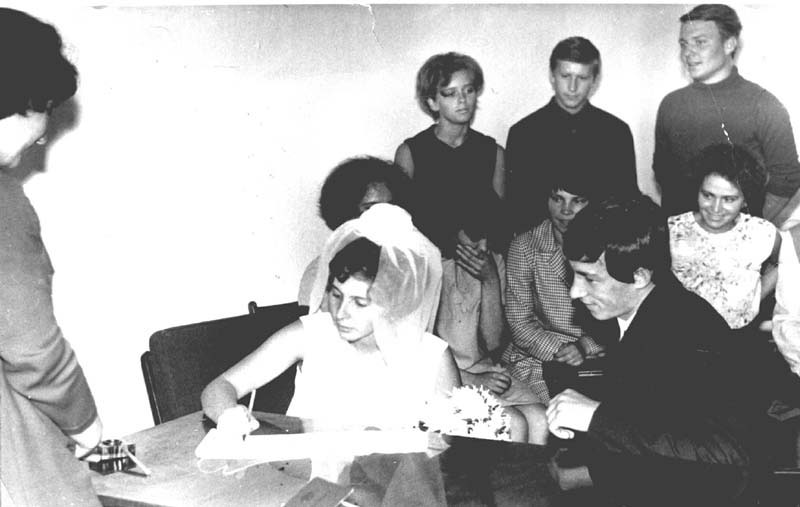

und ihre Kinder über die Köpfe weiter. Wir konnten erst Anfang September abreisen.

Krasnojarsk. Valerijs und Sinas Eheschließung.

In der Zwischenzeit hatten Valera und Sina ihre Heirat in Krasnojarsk eintragen lassen und begaben sich nach dem Ereignis im Haus von Sinas Freundin mit Durakow und Podufalow zu den Gorsts, um die Feierlichkeiten im kleinen Kreis zu vollenden. Raissa Iwanowna war in Semipalatinsk bei ihrer Schwester, und Jura, der davon ausging, dass eine große Hochzeit geplant war, verließ das Haus, um die jungen Leute nicht zu stören. Er wollte zurückkommen, wenn die Hochzeit in vollem Gange war. Als er jedoch um elf Uhr nach Hause kam, fand er nur Sina und Valera vor, die ihr Zimmer aufräumten. Die «Party» war schon lange vorbei. Es stand keine einzige Flasche auf dem Tisch. Es war leicht, sich Juris Verärgerung vorzustellen. Dann beschwerte er sich bei jeder Gelegenheit bei unseren gemeinsamen Freunden über mich und über unsere ganze «abnorme» Familie, die angeblich sogar für die Hochzeit seines Erstgeborenen Geld sparte. Am Tag nach der Hochzeit fuhren Valera und Sina nach Jenisseisk, um dort ihre Flitterwochen zu verbringen. Nur Olga Fedotowna war zu Hause, und sie hätten sich gut erholt, wenn Valera nicht an Angina erkrankt wäre, mit der er bis zu unserer Rückkehr aus dem Süden im Bett lag.

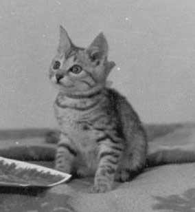

Im Mai 1971 fand an der Fakultät für Physik und Mathematik des Pädagogischen Instituts Krasnojarsk eine zonale wissenschaftlich-methodische Konferenz über Mathematik der Mittelsibirischen Pädagogischen Institute statt. Die Konferenz war mit mehr als hundert Teilnehmern recht repräsentativ. Es gab vier Themenkreise: Algebra, Geometrie, mathematische Analyse und Methoden des Mathematikunterrichts. Das auf der Konferenz behandelte Material wurde veröffentlicht. Nina nahm damals mit mir an der Konferenz teil. Jura, der Leiter des Organisationskomitees, brachte uns im Hotel «Ogni Jenisseja» in einem Doppelzimmer mit allen Annehmlichkeiten unter. Befreit von den alltäglichen Familienproblemen, Roma und Natascha in der Obhut von Olga Fedotowna zurücklassend, begaben wir uns auf eine «freie Reise». Obwohl ich fast fünfzig und Nina achtundvierzig war, benahmen wir uns wie Dreißigjährige. Das Mittag- und Abendessen nahmen wir in einem Restaurant im Erdgeschoss des Hotels ein. Nachmittags, nachdem wir die Arbeit beendet hatten, gingen wir zu den Gorsts und den Jelins. Abends spazierten wir am Kai entlang und bewunderten den Jenissej und die malerische Flussstation, die im Abendlicht erstrahlte. Alle Sorgen, Ängste und Befürchtungen traten in den Hintergrund. Wir versuchten sogar, nicht an die Vergangenheit zu denken.

Valera und Sina schlossen in diesem Jahr ihr Studium ab. Sina kam während ihrer Diplomarbeit nach Jenisseisk, und ich erstellte für sie Tabellen für Demonstrationszwecke. Damals oder vielleicht auch schon früher brachten sie «Kapjoscha» mit - eine charmante kurzhaarige, grau gestreifte Katze, die bald unser gemeinsamer Liebling wurde. Wir haben immer noch ein Bild von ihr mit einer großen Schleife um den Hals.

Nach seinem Universitätsabschluss 1971 absolvierte Valera ein Postgraduiertenstudium bei S. L. Edelman. Sein Doktorvater war nämlich Viktor Michailowitsch Busarkin, der an der Staatlichen Universität Krasnojarsk Algebra lehrte und einen speziellen Kurs über endliche Gruppen leitete. In diesem Jahr Kapjoscha wohnten Valera und Sina noch im Studentenwohnheim in Akademgorodok, wo Natascha sie im Sommer besuchte.

Im selben Jahr, nach dem Abitur, schrieb sich Roma in der Physik- und Mathematikabteilung des Pädagogischen Instituts Jenisseisk ein. Natürlich war mir klar, dass der Beruf des Lehrers nicht zu ihm passte und dass es für ihn besser gewesen wäre, ein Institut für Planung und Finanzen oder zumindest eine technische Hochschule zu besuchen, aber solche Einrichtungen gab es in Jenisseisk nicht.

Der Sommer 1972 war ein trauriger Sommer für unsere Familie, denn Kapjoscha starb an Staupe. Ich versuchte, sie zu retten, indem ich ihr Penicillin und ein anderes Medikament spritzte, das ich beim Tierarzt gekauft hatte. Aber es half nichts, Kapjoscha erbrach unaufhörlich, und sie verlor vor meinen Augen an Gewicht. Auch ihr Kätzchen Bimka wurde krank. Ich kann gar nicht sagen, wie viele Tränen und Hysterie es gab. Als klar wurde, dass sie nicht mehr zu retten waren, beschloss ich, Natascha und Nina nach Rostow zu schicken, ohne das Ende der Schule abzuwarten. Kurz nach ihrer Abreise starben Kapjoscha und Bimka. Ich erinnere mich noch daran, wie Roma und ich in der vom Mondlicht beleuchteten Ecke unseres Vorgartens ein Loch aushoben, in dem wir unsere vierbeinigen Freunde vergruben. Roma weinte heftig, ohne dass es ihm vor den vorbeigehenden Studenten peinlich war, und auch mir standen die Tränen in den Augen. Olga Fedotowna, die ihr ganzes Leben im Dorf verbracht und mehr als ein Dutzend Hühner geköpft hatte, war über unser ungebührliches Verhalten entrüstet.

Roma und ich fuhren in den Süden, sobald er seine letzte Prüfung für die Sommersession bestanden hatte. Valera und Sina schlossen sich uns in Krasnojarsk an. Wir reisten über Moskau in einem Waggon zweiter Klasse. Valera, Sina und Roma spielten die ganze Zeit Karten. Ich war wütend auf sie wegen dieses Zeitvertreibs, besonders auf Valerij, weil er unfair spielte. Er selbst wollte nicht verlieren, aber er wollte auch Sina nicht verletzen, also ließ er es an Roma aus. In Moskau wohnten wir im Haus des ältesten Sohnes von Schirokolobow. Ich erinnere mich, dass um uns herum ein Torfmoor brannte, und wir konnten nur schlecht schlafen. Valera und Sina waren einkaufen und suchten einen Pelzmantel für Sinas Schwester. Ich konnte sie nicht in Museen und die Tretjakowka locken. Aber ich nahm Romotschka zu allen interessanten Orten in Moskau mit, die ich kannte. Als Ausgleich schaute ich mir am Abend das Spiel Spartak-Ararat im Luschniki-Stadion an. Roma hat stets für Spartak gefiebert. Doch an diesem Tag verlor seine Lieblingsmannschaft 0:2, und er nahm sich die Niederlage schwer zu Herzen.

Zwei Tage später reiste die ganze Gesellschaft nach Krasnodar. Wir fuhren über Rostow, wo Nina und Natascha zu uns ins Abteil stiegen, obwohl sie es nicht geschafft hatten, Fahrkarten zu kaufen. Wir bezahlten die Schaffner, und alles klappte, zum Glück war es nicht zu weit weg. Von Krasnodar aus fuhren wir mit dem Bus nach Gorjatschij Kljutsch, wo Olja auf uns wartete. Als wir schließlich Lermontowo erreichten, stellte sich heraus, dass es verboten war, Zelte am Strand

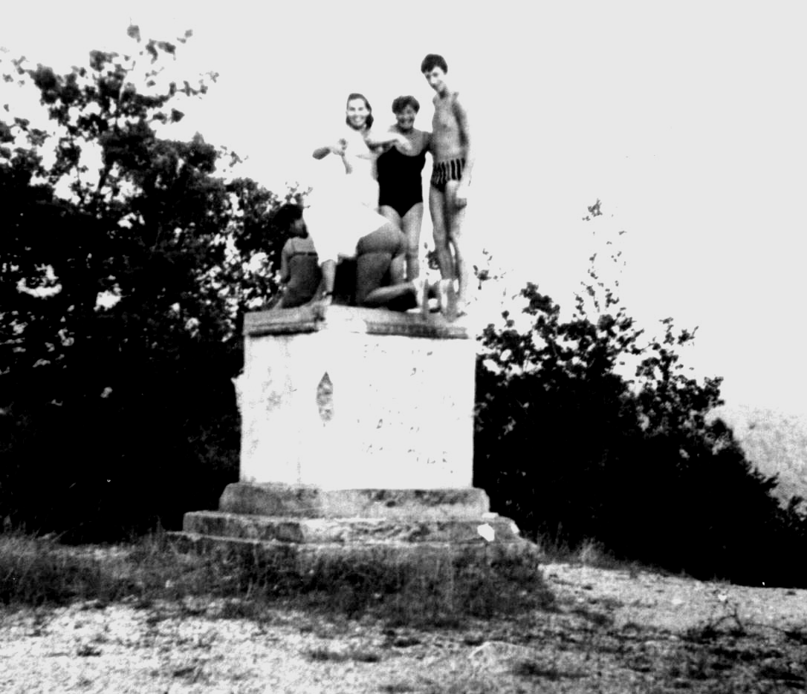

aufzustellen. Wir mussten ins Dorf gehen, um eine Unterkunft zu suchen. Aber alle Wohnungen, Zimmer und sogar einzelne Bettstellen im Dorf waren bereits belegt. Nur eine Vermieterin erklärte sich bereit, uns unsere Zelte gegen eine geringe Gebühr im Garten aufstellen zu lassen. Ringsherum gab es Haselnusssträucher, Apfelund Birnbäume. Sie gab uns auch ein kleines Zimmer im Haus, das fast vollständig mit einem Doppelbett vollgestellt war, für den Fall, dass das Wetter schlecht würde. Alle anderen Räume in ihrem Haus, der Schuppen und die Gartenlaube waren bereits von Urlaubern belegt. Keiner wollte in dem uns zugewiesenen Zimmer schlafen. Alle zogen die Zelte vor, zumal es jetzt nicht mehr unsere Planen-Zelte waren, sondern die polnischen, breit und hoch. Nur wenn es regnete, gingen Nina und ich zum Schlafen ins Haus. Tagsüber verbrachten wir alle den Tag am Strand, wo wir neben dem Sonnen und Baden auch Volleyball spielten. Abends gingen wir ins Sommerkino: vier Wände, eine Leinwand und ein schwarzer Sternenhimmel über uns. An den Wänden und in den umliegenden Bäumen hingen «Filmhasen» - meist Kinder. Wir liefen mit Decken herum. Solange es warm war, wurden sie auf harte Bänke gelegt. Wenn es nachts kühl wurde, bedeckten wir uns damit wie mit Plaids.

Wir liebten es, durch die umliegenden Wälder zu wandern. Wir erinnerten uns an unsere Wanderung entlang der alten Straße nach Dschubga. Die Straße führte von der Küste weg, bergauf und bergab und um die Berge herum. Natürlich war die neue Straße, die wir manchmal zu Fuß und öfter mit dem Auto nach Dschubga nahmen, besser.

Erstens war sie kürzer, und zweitens gab es auf der einen Seite das Meer und auf der anderen die Klippen, was sie besonders malerisch machte.

Aber hier, auf der alten Die alte Straße von Lermontowo nach Tuapse Straße, herrschte eine unberührte Stille. Keine Autos oder Menschen. Auf beiden Seiten gab es Berge und Wälder. Die Straße selbst war zwar asphaltiert, aber der Asphalt war bereits rissig und das Gras wuchs durch ihn hindurch. An den Rändern gab es noch Kilometermasten und weiße Metersteine. Etwa auf halber Strecke befand sich ein Sockel. Wahrscheinlich stand dort einst ein Denkmal für Stalin. Jetzt war er leer, und unsere Jugendlichen, die auf ihn kletterten, gaben malerische Figuren ab. Sogar Olga wurde mit hinaufgezogen.

Wir mochten die Besitzer sehr. Karpo Iwanowitsch Oflijan, das Familienoberhaupt, arbeitete als Chauffeur in einem Sanatorium, während «Tante Walja», seine Frau, eine fettleibige und kränkliche Armenierin, den Haushalt führte. Sie hatten zwei Söhne und eine Tochter. Der älteste Sohn, Iwan, war ein typischer Armenier; er hatte eine russische Frau namens Valja und zwei Kinder: Tochter Valja, wir nannten sie «Valjucha», mit großen dunklen Augen, und Sohn Igor, der kaum etwas Armenisches an sich hatte. Der zweite Sohn der Eigentümer, Boris, war ebenfalls mit einer Russin verheiratet. Er hatte eine Tochter, Natascha, die ein Jahr jünger war als Valjucha. Das jüngste Kind der Besitzer war Anja, die von Geburt an blind war. Sie war ein wissbegieriges und fähiges Mädchen, las Bücher in Blindenschrift, kannte viele Gedichte und schrieb sie selbst. Sie freundete sich schnell mit Natascha an, und immer, wenn wir einen Film sahen, kam sie mit. Natascha musste Anja zum Ärger ihrer Sitz-Nachbarn alles erzählen, was auf dem Bildschirm passierte.

Im Hof der Oflijans stand ein alter Maulbeerbaum, unter dem sich die ganze Familie und die Feriengäste abends versammelten. Natürlich kam auch der Wein nicht zu kurz. Es machte mir nichts aus, mit ihnen zusammenzusitzen und über unser Leben in Sibirien zu sprechen, aber ich lehnte den Wein ab, obwohl ich ziemlich schwach war. Nina war nach der Operation auf Diät und konnte mir auch nicht weiterhelfen. Karpo Iwanowitsch verzieh ihr, aber mir nahm er das übel.

Seitdem fuhren wir, wenn wir ans Meer reisten, nach dem Besuch von Rostow und Gorjatschij Kljutsch immer nach Lermontow, um die Oflijans zu sehen.

In der zweiten Novemberhälfte 1972, als ich in Moskau an einem Fortbildungskurs für Rektoren teilnahm, reichte ich meine Dissertation zur Verteidigung ein, ließ eine Vorverteidigung durchführen, druckte und verschickte die Zusammenfassung. Die Verteidigung selbst fand am 8. Januar 1973 statt. Die offiziellen Gegner waren W. G. Boltjanskij und N. D. Koschkina. Die führende Hochschuleinrichtung war die Abteilung für mathematische Analyse und Methoden des Mathematikunterrichts am Moskauer Regionalen Pädagogischen Institut Krupskaja, geleitet von Iwan Kosmitsch Andronow. Der Bericht wurde von Schapkin erstellt. Ich erinnere mich, dass ich auf der Suche nach dieser Rezension durch einige Gänge und Korridore von Stockwerk zu Stockwerk gelaufen bin.

Mehrmals musste ich das Steklow-Institut für Mathematik, das im Volksmund «Steklowka» genannt wurde, aufsuchen, um Boltjanskijs Gutachten zu lesen.

Die Verteidigung fand im Gebäude der mathematischen Abteilung des Moskauer Staatlichen Pädagogischen Instituts statt. Rafikowa aus Sterlitamak verteidigte sich mit mir.

In Moskau wütete damals die Grippe, und so lud man Professor S.B. Stetschkin ein, der nicht nur bei den Dissertationsstudenten wegen seines Jähzorns und seiner unverschämten Reden gefürchtet war, um die Beschlussfähigkeit zu gewährleisten. Ich lag ebenfalls mit Grippe und etwa 38 Grad Fieber danieder. Professor Kulikow führte den Vorsitz des Rates. Meine Verteidigung war die erste. Er stellte Tische auf und verteilte Handbücher. Ich hielt meinen Vortrag innerhalb der vorgegebenen Zeit, beantwortete Fragen. Dann ergriff Boltjanskij das Wort. Er lobte größtenteils und machte lediglich eine Bemerkung über die von mir angeblich empfohlene Einführung einer Funktion, die auf dem Konzept der Korrespondenz und der Verwendung von, wie er es ausdrückte, «Makarytschews Pfannkuchen» basiert. In Wirklichkeit hatte ich diesen Ansatz in meiner Dissertation kritisiert. Dann wurde eine positive Kritik von Koschkina verlesen. Es wurden noch zwei oder drei weitere Reden gehalten. Schließlich ergriff Stetschkin wie erwartet das Wort. Er hielt eine ausführliche Rede, in der er vor allem die Handbücher lobte und sogar auf einige der darin behandelten Probleme einging. Nach seiner Rede fragte Kulikov:

- Sergej Borissowitsch, ich verstehe immer noch nicht, ob Sie für oder gegen die in der Dissertation dargelegten Ideen sind.

- Natürlich bin ich dafür», antwortete er und lobte nicht so sehr die Dissertation, die er wahrscheinlich nicht gelesen hatte, sondern die Handbücher.

In jenem Jahr trat zum ersten Mal eine Verordnung in Kraft, die keine Festmahle mehr zuließ, worüber ich überglücklich war, denn ich hatte kein Geld, keine Bekannten und keine Erfahrung mit der Ausrichtung solcher Veranstaltungen. Nach der Abstimmung, bei der festgestellt wurde, dass der Rat einstimmig für die Verleihung des Grades gestimmt hatte, überreichte mir der Sekretär des Rates einen Rosenstrauß.

Nach der Verteidigung luden mich Aschkinuse und seine Frau in ihr Zimmer ein. Ich wohnte im Hotel Universitetskaja auf den Leninbergen und hatte vor, mit ihnen ins Restaurant zu gehen, aber zu meinem Leidwesen war es an diesem Abend aus irgendeinem Grund nicht in Betrieb, und ich musste auf der Suche nach Cognac und etwas zu essen durch Moskau streifen.

Im Sommer 1973 setzten bei Nina Magenschmerzen ein. Sie wurde ins Jenisseisker Krankenhaus eingeliefert, und wir alle besuchten sie jeden Tag als Familie. Eines Tages brachten wir ihr auf Anraten des behandelnden Arztes eine starke Hühnerbrühe, woraufhin sie anfing zu erbrechen und starke Bauchschmerzen hatte. Bei ihr wurde eine Gallenblasen-Entzündung diagnostiziert. Es wurde empfohlen, die Gallenblase zu entfernen. Die Operation wurde im Regionalkrankenhaus Krasnojarsk Nr. 1 durchgeführt. Während Nina auf die Operation vorbereitet wurde und auch für einige Tage nach der Operation lebte ich bei den Gorsts. Ich erinnere mich, wie ich dem Chirurgen zum Dank für die erfolgreiche Operation zwei Flaschen Cognac und Schokolade brachte. Ich war furchtbar nervös, weil ich dachte, dass er sie nicht annehmen würde. Das Treffen fand im Garten des Krankenhauses statt. Eine Bank, umgeben von Fliedergebüsch. Ich saß an einem Ende, der Chirurg, der damit beschäftigt war, das mitgebrachte Geschenk in seine Aktentasche zu legen, am anderen. Er reichte mir ein Fläschchen mit zweihundert kleinen braunen Steinen aus Ninas Gallenblase.

Zu dieser Zeit kam Natascha nach ihrem Schulabschluss nach Krasnojarsk, um sich in der Abteilung für Physik und Mathematik des Pädagogischen Instituts von Krasnojarsk einzuschreiben. Sie lebte bei den Busarkins und half bei der Betreuung von Irischka. Wir kombinierten die Vorbereitung auf die Prüfungen mit Ninas Besuch im Krankenhaus und ihrer Betreuung. Gleich nach der Immatrikulation ging Natascha zusammen mit allen Erstsemestern auf den staatlichen Bauernhof Nasarowskij, um dort Erntearbeiten zu verrichten. Valera ging als Ältester mit seiner Gruppe mit. Niemand, nicht einmal Nataschas engste Freunde, wusste, dass sie seine Schwester war. Das Geheimnis wurde erst gelüftet, als Natascha am 31. August Valerik zu seinem Geburtstag gratulierte, ihn hinter einen Schuppen führte und küsste.

1974 lief die Amtszeit von Alexander Jakowlewitsch als Rektor des Instituts aus, und wie ich erfuhr, war er in Gesprächen mit dem Ministerium über seine Versetzung an eine der Universitäten im europäischen Teil des Landes. Außerdem hielten sich hartnäckig Gerüchte über einen Umzug des Instituts in die neu errichtete Stadt Lessosibirsk. Unter diesen Umständen beschlossen Nina und ich, dass es für uns an der Zeit war, unseren Arbeits- und Wohnort zu wechseln.

Ich arbeite seit fast zwanzig Jahren in Jenisseisk. Ich hatte mich sowohl finanziell erholt als auch beruflich gefestigt. Die Kinder waren erwachsen geworden, Valera und Natascha lebten nun in Krasnojarsk. Ich musste an Romotschkas Schicksal denken. Und schließlich Ninas schlechte Gesundheit. Dieser letzte Umstand beunruhigte mich sehr. Entgegen den Beteuerungen des behandelnden Arztes verschlechterte sich ihr Gesundheitszustand von Jahr zu Jahr. Sie fühlte sich besonders krank, wenn es draußen kalt war. Eine systematische medizinische Beobachtung war notwendig. Der völlige Mangel an Annehmlichkeiten in unserem Haus, und Olga war schon weit über siebzig, war ebenfalls beunruhigend.

Ich schrieb und schickte Briefe an alle Lehrerkollegien des Landes und bot meine Dienste an. Es kamen Einladungen von mehreren Universitäten, aber nur zwei sagten zu, sofort eine Wohnung zur Verfügung zu stellen: die Universitäten in Arsamas und Jelez. Eines Tages schimpfte die Leiterin der Personalabteilung des Ministeriums in einem Telefongespräch über mich, weil ich Briefe verschickt hatte, in denen ich den Lehrerausbildungsinstituten meine Dienste angeboten hatte.

- Sie sind Teil unserer Nomenklatur. Hätten Sie sich an uns gewandt, hätten wir Ihnen geholfen, eine geeignete Universität und eine Stelle zu finden, wies sie mich zurecht, aber jetzt bekommen wir Anrufe von Rektoren, die sich fragen, wer dieser Maier ist, der um eine Stelle gebeten hat, ob er ein Säufer oder, schlimmer noch, ein Verräter ist?

Bald darauf wurde ich zum Regionalkomitee der Partei vorgeladen, wo Feodosij Maksimowitsch Popow, der in der Abteilung für Wissenschaft und Hochschulbildung arbeitete, in harschen Worten forderte, dass ich die Region nicht verlassen dürfe. Unter Berücksichtigung der familiären Umstände versprach er, meine Versetzung an das Pädagogische Institut in Krasnojarsk mit einer Wohnung zu ermöglichen. In der Zwischenzeit wuchs die Zahl der externen Angebote, und es wurde immer schwieriger, sich zu entscheiden. Die Rektoren der pädagogischen Institute von Arsama und Jelez waren besonders interessiert. Worobjow, der Rektor des Pädagogischen Instituts von Arsama, erläuterte sein Beharren in einem seiner Briefe: «Ich habe früher mit Deutschen gearbeitet und ihren Fleiß, ihre Pünktlichkeit und ihre Ehrlichkeit immer bewundert. Sie wurden mir im Ministerium auf die bestmögliche Weise beschrieben.» Bald kam auch ein Telegramm aus Jelez: «Die Wohnung ist fertig. Telegrafieren Sie das Datum Ihrer Abreise. Trotz der Verlockung all dieser Vorschläge entschied ich mich nach langer Überlegung und Beratung mit Nina und den Kindern für Krasnojarsk. Immerhin lebte und arbeitete hier Valera, Natascha studierte an diesem Ort, und, was nicht unwichtig war, es gab Freunde und vor allem natürlich Jura. Daher nahm ich die zahlreichen und hartnäckigen Warnungen des Regionalausschusses, dass ich auf keinen Fall von der Abmeldung der Partei ausgeschlossen werden könne, mit Erleichterung auf. In meinen nach Jelez und Arsamas geschickten Telegrammen bedankte ich mich für die Einladungen und entschuldigte mich: «Ich kann nicht kommen, das regionale Parteikomitee will mich nicht von der Liste streichen».

Natürlich hätte ich fahren können. In jenen Jahren konnte das Parteikomitee höchstens einen Verweis erteilen, eventuell mit einem Vermerk auf dem Zeugnis, aber das wurde von den Parteiorganisationen der Universitäten, die den Ausreißer aufnahmen, in der Regel sehr milde gehandhabt.

Die Entscheidung war also gefallen und wir mussten handeln. Mir wurden zwei Wohnungen angeboten: eine Drei-Zimmer-Wohnung in einem neunstöckigen Gebäude in der Schelesnodoroschnikowa-Straße und eine Vier-Zimmer-Wohnung in einem fünfstöckigen Gebäude in der Stadt Komsomolsk, nicht weit vom im Bau befindlichen Kulturpalast der Fabrik für Fernseher. Obwohl die erste der beiden Wohnungen näher am Institut lag und höhere Decken hatte, entschied ich mich für die zweite. Die Umgebung, die hohe und schöne Lage, das viele Grün, die vier kleinen, aber separaten Zimmer und schließlich der dritte Stock haben mich verführt.

Im tiefen Herbst, als der Schnee bereits gefallen war, fuhr Valera mit einem Lastwagen nach Krasnojarsk, um unsere kümmerlichen Habseligkeiten zu transportieren. Nina und Olga Fedotowna folgten Valera ins Flugzeug. Roma und ich blieben in Jenisseisk. Ich beendete meine Vorlesungen und übergab meine Arbeit an Veit, während Roma die laufenden Prüfungen des dritten Kurses in mehreren Fächern ablegte, um den Unterschied in den Lehrplänen auszugleichen. Wir wohnten mit ihm in einer leeren Wohnung. Es gab zwei Feldbetten, zwei Matratzen und ein paar Bettbezüge aus dem Umkleideraum des Schlafsaals. Wir haben so viel wie möglich gegessen, hauptsächlich Trockenkost. An einem unserer letzten Tage in Jenisseisk, erschöpft vom ständigen Lernen und wahllosen Essen, beschlossen wir, in ein lokales Restaurant zu gehen. Ein gedrungener einstöckiger Holzbau, der aus einer Kantine umgebaut worden war. Ein Saal mit zwei Gummibäumen darin. Neben kleinen Tischchen, die mit unsauberen Tischdecken bedeckt sind, stehen Stühle in der Form von Weingläsern: breite, kunstlederbezogene Sitze und dünne, eiserne, eng beieinanderstehende Beine. Es war eine instabile und wackelige Konstruktion, von der mir eine einen grausamen Streich spielte.

Es war Abend, etwa acht Uhr. Roma und ich betraten das Restaurant und gingen zur Umkleidekabine. Unser Erscheinungsbild passte nicht zu dem Restaurant. Die schlaflosen Nächte hatten uns Augenringe beschert, unsere Gesichter waren faltig, unsere Kleidung unansehnlich und unser Gang unsicher vor Müdigkeit. Der Garderobier warf uns einen misstrauischen Blick zu und sagte entschlossen:

- Ich werde Sie nicht bedienen, gehen Sie nach Hause und schlafen Sie sich aus.

Ich war natürlich entrüstet, da ich der Ansicht war, dass unsere lebhaften Gesichter die beste Garantie für unsere Integrität sein würden.

- Sie machen wohl Witze, ich trinke überhaupt keinen Wein!

Wie üblich löste eine solche Aussage, wenn nicht gerade Gelächter, so doch zumindest ein Lächeln aus.

Die Garderobiere, der meine Bemerkung als unangebrachten Scherz auffasste, wandte sich an die Anwesenden und sagte:

- Seht sie euch an, Männer, die sind seit mindestens einer Woche «stocknüchtern».

Ich wollte sagen, dass wir studieren, sehr müde und hungrig sind, aber ich merkte, dass dies nur weiteres Gelächter hervorrufen und das Spielchen weitergehen würde. Roma zupfte an meinem Arm und flüsterte:

- Papa, lass uns von hier verschwinden!

Aber ich wurde richtig wütend und verlangte, die Direktorin zu sehen. Ihre Tochter war Studentin in unserer Abteilung, und ich hoffte, dass sie mein Gesicht erkennen würde. Nach langem Gezänk holten sie sie schließlich. Sie erkannte mich und ordnete an, dass ich sofort bedient werde. Die Garderobiere, die von ihrer Rechtmäßigkeit überzeugt war, nahm unsere Kleidung mit missmutiger Miene entgegen. Wir betraten die Halle, fanden einen freien Tisch und setzten uns. Leider habe ich die Eigenheiten der Stühle nicht berücksichtigt und mich nicht genau in die Mitte gesetzt. Mitsamt dem Stuhl verlor ich sofort das Gleichgewicht, und wir fielen um. Der Lärm ließ die Kellner, den Manager und die Garderobiere herbeieilen. Alle im Saal drehten sich in unsere Richtung. Einen Moment lang herrschte Schweigen, dann ertönte die triumphierende Stimme der Garderobenfrau:

- Ich sagte doch, sie sind betrunken! Und Sie «servieren sofort'«, fiel sie spöttisch über den Manager her.

Ich kämpfte mich unter den ironischen Blicken der Besucher wütend und frustriert aus dem blöden Stuhl heraus, der mich an das Tischbein gefesselt hatte, und setzte mich dann auf den Platz meiner Wahl. Romotschka saß da, mehr tot als lebendig. Es war das erste Mal, dass er mich in einer solchen Situation gesehen hatte. Ob er Mitleid, Scham oder Angst empfand, habe ich ihn nie gefragt.

Ein paar Tage später flogen Roma und ich nach Krasnojarsk. Der Zeitpunkt erwies sich als sehr ungünstig, denn die meisten Leute in meiner Nähe waren im Unterricht und konnten uns offenbar nicht zum Hafen begleiten. Wir versammelten uns in unserer nun leeren Wohnung. Wir schleppten einen Tisch und einige Stühle aus dem Schulgebäude. Wir saßen, tranken etwas und verabschiedeten uns. Weder Plaksin, noch die Patjukows, noch die Schdanows, noch die Veits kamen. Es war ein bisschen schade, aber was konnte ich schon tun, ich war für sie nur noch Schrott.

Wir erreichten den Hafen mit dem Bus. Der kleine Warteraum war voll von Menschen. Draußen herrschte leichter Frost. Schade, ich hätte nicht gedacht, dass ich Jenisseisk auf diese Weise verlassen musste. Wir befanden uns bereits in der Nähe der Gangway, als auf dem Flugfeld zahlreiche Studenten und Berufskollegen auftauchten, die gekommen waren, um uns zu verabschieden. Unter Missachtung aller Regeln liefen sie in einer Reihe. Allen voran Patjukow und Wodinow mit einem großen Bündel auf den Schultern, gefolgt von all den lieben Menschen, mit denen ich fast fünfundzwanzig Jahre lang zusammengearbeitet hatte. Lärm, Krawall. Die diensthabenden Beamten sind empört und verlangen, dass die Personen, die sie verabschieden, sofort das Flugfeld verlassen und drohen mit Geldstrafen. Niemand schenkt ihnen Beachtung. Patjukov verliest eine Botschaft und überreicht ein gemeinsames Geschenk - einen luxuriösen Perserteppich. Gläser erscheinen wie aus dem Nichts, Sektkorken knallen, warme Worte und Wünsche. Schüler singen mein Lieblingsschülerlied. Ich bin zutiefst berührt. Aber alles hat irgendwann ein Ende. Auch der Abschied, der mich so begeistert hat, ist vorbei.

Wir sitzen im Flugzeug und sind mit Sicherheitsgurten angeschnallt. Die Luken sind verriegelt. Die AN-24 rollt an, nimmt an Fahrt auf. Die Motoren heulen auf, der Körper sinkt in den Sitz. Die letzten Momente des Kontakts mit Jenisseisker Boden, ein leichter Schub und das Flugzeug hebt ab. Quadrate von Feldern, ein Netz von Straßen, auf denen Autos vorbeirauschen. Und schließlich haben wir Jenisseisk hinter uns gelassen. Die schneebedeckte Taiga der Region Karelien, in der Ferne das schneeweiße Band des Jenisseis. Die Lichtungen sind noch zu sehen, aber schon bald geht alles in einen weißen Teppich über. Der Aufstieg geht weiter, die Maschine reagiert problemlos auf alle Luftströmungen.Als er in die «Luftschächte» fällt, steigt Übelkeit in meiner Kehle auf. Ich bin überrascht von Romotschka, er reagiert überhaupt nicht auf das Schaukeln. Endlich war auch dieser Test zu Ende, das Flugzeug erreichte die vorgegebene Höhe. Unter uns schneebedeckte Wolkenberge und über uns der strahlend blaue Himmel. Ich schnallte meinen Sicherheitsgurt ab und entspannte mich. In den ersten Minuten konnte ich nicht klar denken. Ich war immer noch von meinen Gefühlen überwältigt. Es stellte sich heraus, dass ich unnötigerweise an meinen Kameraden gezweifelt hatte. Sie waren unserer Freundschaft treu geblieben. Ich beruhige mich und versuche, die Bedeutung der Jahre, die ich in Jenisseisk gelebt habe, zu begreifen. Schließlich war nun ein weiterer Abschnitt meines Lebens vorbei. Eine große und wichtige Bühne. War ich mit meinem Leben zufrieden, habe ich das, was ich anstrebte, zumindest teilweise erreicht? Was habe ich angestrebt? Und war es notwendig, ein solches Ziel im Leben zu haben? Oder bin ich nur ein Brownsches Teilchen, das sich chaotisch unter den Schlägen der Umstände bewegt? Und ich wurde an eine Passage aus einem Gedicht erinnert, das ich einmal übersetzt hatte:

Im verspiegelten Glas gehe ich vor mir her Und ich schaue fragend aus der Ferne.

Wer bist du, Fremder, der du vor mir gehst?

Wohin führen dich deine Wege?

Jetzt führen sie mich nach Krasnojarsk. Was erwartet unsere Familie dort?

### Kapitel 27. Pädagogische Universität Krasnojarsk

Die sechziger Jahre neigten sich dem Ende zu. Seit Chruschtschows Rücktritt waren mehr als fünf Jahre vergangen. Im politischen Leben des Landes herrschte eine relative Flaute. Keine skandalösen Enthüllungen, keine stürmischen Umwälzungen und Reformen. Alle Meinungsverschiedenheiten und Konflikte innerhalb der Führung wurden «hinter verschlossenen Türen» beigelegt. Die Parteitage fanden regelmäßig alle fünf Jahre statt. Sie billigten einstimmig die von den Leitungsgremien erlassenen Richtlinien. Politische Veränderungen in der Zusammensetzung des Politbüros oder des Sekretariats erfolgten nicht auf den Kongressen, sondern auf dem Plenum des Zentralkomitees.

Krasnojarsk begrüßte mich untergehender Sonne und feuchter, nach Benzin stinkender Luft. Von Südosten zog eine dunkle Wolke heran, die fast ein Drittel des Himmels bedeckte. Sein zotteliger Rand, der von der untergehenden Sonne angestrahlt wurde, war düster karminrot, ein Vorbote für schlechtes Wetter. Obwohl es noch nicht fünf Uhr war, war der Flughafen, der fast im Zentrum der Stadt liegt, bereits beleuchtet. Unsere AN-24, die lange über das Flugfeld gerumpelt war, kam endlich an seinem Ende zum Stehen. Daneben, hinter einem niedrigen Zaun, sah man graue fünfstöckige Gebäude, hupende Autos, Menschen, die irgendwohin eilten. Und hier, nur wenige hundert Meter von den Wohnblocks der Stadt entfernt, starteten und landeten Flugzeuge mit brüllendem Motorengeräusch. Wir, die mit dem Flug aus Jenisseisk angekommenen Passagiere, drängten uns um unsere AN24 und warteten auf den Flughafenbus, aber wie sich herausstellen sollte, warteten wir vergeblich. An seiner Stelle kam eine der diensthabenden Frauen und brachte uns zum Flughafenterminal. Sie ging zügig, rannte fast. Die Gruppe erstreckte sich über gut hundert Meter. Das Gehen fiel uns nicht leicht, denn der Teppich war schwer und rutschte uns aus den Händen, die Betonplatten waren mit schmutzigem Schnee bedeckt. Valerij erkannten wir schon von Weitem. Er überragte die Menge der Menschen, die uns begrüßten, und winkte. Er durfte das Flugfeld nicht betreten. Seit dem Herbst hatte man eine strenge Kontrolle aller aus dem Norden einreisenden Personen eingeführt. Sie suchten nach Zobel-, Fuchs- und Nerzfellen. Sie durchsuchten Koffer, Rucksäcke und Kleidung. Es war wie bei einer Lagerwache.

Zu dem Zeitpunkt, als diese kränkende Durchsuchung vorbei war und wir endlich auf dem Bahnhofsvorplatz waren, bedeckte eine Wolke den Himmel und ein Schneesturm zog über die Stadt. In wenigen Minuten war alles rundherum mit einer unberührten weißen Schneeschicht bedeckt: Bürgersteige, Gehwege, Bänke, Bus- und Autodächer, kahle Äste, Drähte, Hüte und die Schultern der Passanten.

An der Trolleybus-Haltestelle herrscht großes Gedränge. Es herrscht Hauptverkehrszeit, alle haben es eilig, nach Hause zu kommen. Sie sagen, die Drähte seien abgerissen. Schließlich tauchte der Bus auf, hielt aber nicht an, sondern fuhr vorbei und setzte irgendwo um die Ecke Fahrgäste ab. Und es gab eine weitere Wartezeit. Einige gingen zur Bushaltestelle, wo es noch voller war. Wir blieben stehen. Uns war es lieber, den Trolleybus zu nehmen.

Wir kamen erst um sechs Uhr zu Hause an, müde und hungrig. Alle waren schon da: Nina, Oma Olja, Natascha, Sina. Die gesamte weibliche Hälfte unserer Familie. Auch sie hatten gewartet und sich bereits Sorgen gemacht, und es gab niemanden, den man hätte anrufen können, um zu erfahren, ob das Flugzeug angekommen war. Die Begrüßung fand in einem engen Flur statt. Fragen, Ausrufe, Küsse. Meine Kleidung war nass vom geschmolzenen Schnee, Pfützen unter meinen Füßen. Nina murrt, sie muss sie aufwischen. Wir packen das Gepäck aus. Die Hauptsache ist der Teppich, der alle fasziniert. Woher kommt er? Welche Farbe hat er? Wir wissen es nicht. Wir mussten ihn erst auspacken. Der Teppich war tatsächlich gut. Nina freute sich besonders. Es war ihr erster eigener Teppich, und sie hatte sich schon Gedanken gemacht, wo sie ihn hinlegen wollte. Dann begaben sich alle ins Esszimmer, wo der Tisch schon lange auf uns gewartet hatte. Wir haben meinen Geburtstag, Weihnachten und Neujahr gleichzeitig gefeiert. Natürlich haben Nina und ich auch das alte Jahr gefeiert. Wir schwelgten in Erinnerungen an die Vergangenheit, diskutierten über die Gegenwart und schmiedeten Pläne für die Zukunft.

Nina war beinahe glücklich. Schließlich waren wir alle wieder zusammen. Wir wohnten in einer Wohnung mit allem Komfort, klein, aber so, dass jeder seine eigene Ecke hatte. Für Nina und mich gab es ein Schlafzimmer, Oma Olja und Natascha haben ihre eigenen Zimmer, auch wenn sie klein sind. Nur Roma muss im Wohnzimmer schlafen. Natürlich ist es schlecht, dass Valera und Sina am anderen Ende der Stadt wohnen, aber das lässt sich nicht ändern. Nina hoffte, dass sie irgendwann in unsere Nähe ziehen würden. Im Großen und Ganzen war alles in Ordnung. Und das Beste war, dass es Wasser ab! Reichlich Wasser! Tag und Nacht, kalt und heiß. Ihr ganzes Leben lang hatte sie Geschirr in einer Schüssel gewaschen und sich gefragt, ob das Wasser reichen würde, bevor die nächste Fähre kam. Jetzt konnte sie es ohne Einsparungen und vor allem ohne es zu Erhitzen nutzen. Zweifel nagten an mir. Als ich nach Krasnojarsk zog, verlor ich fast die Hälfte meines Gehalts. Nina arbeitete nicht, sie war arbeitsunfähig. Nataschas Stipendium betrug 36 Rubel. Der durchschnittliche Betrag betrug 80 für jedes Familienmitglied. Und fast keine Ersparnisse, keine Rücklagen. Normalerweise brachten alle, die aus dem Norden kamen, eine Menge Geld mit, aber ich hatte weniger als tausend auf meinem Sparkonto. Es gab eine Menge Ausgaben zu tätigen. Zunächst musste die Wohnung instandgesetzt werden: Wie in jedem Neubau jener Zeit waren die Tapeten trist und schlecht geklebt, die Wände waren uneben, die Böden waren nicht passgerecht. Außerdem war das Mobiliar alt, fiel auseinander und musste erneuert werden. Auch Valerij hatte viele Probleme. Er und Sina wohnten am rechten Ufer, ungefähr an dem Ort, an dem ich einst, als ich zum ersten Mal in Krasnojarsk ankam, Petjas Bekannten suchte. Siehatten ein kleines Zimmer bei Tante Dusja gemietet. Sina arbeitete als Technikerin im Labor von Professor Kedrinskij und verdiente sehr wenig Geld. Valera beendete gerade sein Postgraduiertenstudium und hatte keine Zeit für Nebeneinkünfte, die in jenen Jahren auch nicht gefördert wurden.

Ich machte mir auch Sorgen um meinen Job im Dekanat. Ich hatte eine vage Ahnung, dass es für mich schwierig werden würde, in die Belegschaft aufgenommen zu werden. Für die meisten Fakultätsmitglieder war ich ein Fremder, ein «dunkles Pferd». Sie hatten ihre eigenen Ansichten, Gewohnheiten, Traditionen, ihre eigenen angesehenen Führer. Ich musste mich nur anpassen. Das war der schwierigste Teil. Ich hatte schon immer viele Ideen und den Wunsch, sie in die Tat umzusetzen. Ob ich in der Lage sein würde, mich zu zügeln, mich dem Willen anderer zu unterwerfen? Selbst meine Freundschaft mit Jura konnte dieses Problem nicht lösen, denn es lag in mir selbst, und ich musste es allein lösen.

Ich schlief in dieser Nacht nur mit Mühe ein und wachte am Morgen mit Kopfschmerzen auf. Nina, die sich offen darüber freute, dass die ganze Familie endlich zusammen war, konnte oder wollte meine Probleme nicht verstehen. Sie war sich wie immer sicher, dass sie mich verstehen und schätzen würden, dass sie nicht umhin könnten dies zu tun.

Die Wahl fand Mitte März auf einer Sitzung des Fakultätsrats statt. Die Rektorin, Olga Gawrilowna Pelymskaja, war anwesend. Zunächst gab der Dekan der Fakultät, Wladimir Sergejewitsch Tscherkaschin, einen Bericht über die Ergebnisse der Wintersession ab, dann folgte eine lange und emotionale Diskussion über die Gründe für die schlechten Noten und die hohen Abbrecherquoten. Und schließlich die Wahlen. Ich wurde von Pelymskaja vorgestellt. Ich wurde von Tscherkaschin unterstützt. Ich hatte die Gelegenheit zu sprechen, aber es kam mir seltsam vor, da er sich so sehr bemüht hatte, mich zu überzeugen, dem Vorschlag von Pelymskaja zuzustimmen. Dann meine Rede. Ich habe über meine Sicht der Probleme und meine Pläne für die nahe Zukunft gesprochen. Natürlich waren einige meiner Ideen nicht nach jedermanns Geschmack, aber sie stimmten, soweit ich mich erinnere, einstimmig oder fast einstimmig für mich.

Am 20. März 1974 trat ich mein Amt an. Wie oft habe ich mich in der Vergangenheit dafür gescholten, dass ich diesen Schritt getan habe, dass ich mich bereit erklärt habe, die Abteilung zu leiten. Wie viel Zeit, körperliche und geistige Energie ich verloren habe. Die Abteilung, die ich übernahm, war die größte pädagogische Unterabteilung des Instituts. Es gab zwei Fakultäten (Mathematik und Physik), fünf Spezialabteilungen, mehr als sechzig Lehrkräfte (ohne die Lehrkräfte der öffentlichen Fakultäten) und schließlich etwa eintausend Vollzeitstudenten und mehr als dreihundert Teilzeitstudenten. Es gab nur zwei Assistenten: Waleri Petrowitsch Iwanow, ein geselliger, unternehmungslustiger und erfindungsreicher Mann, der sowohl die Lehrer als auch die Schüler sehr gut kannte und auch einen guten künstlerischen Geschmack besaß, und Walentin Wassiljewitsch Rogow, ein Mathematiker, der am Anfang der Computerisierung der Abteilung stand, eine intelligente und verantwortungsbewusste Person, die die Arbeit der Fernstudien-Abteilung leitete.

Von meinen ersten Arbeitstagen an musste ich mich mit einer Reihe von Problemen auseinandersetzen, die mir neu waren: über zweihundert rückständige Wintersemester, geringe Anwesenheit in den Unterrichtsstunden, viele unpünktliche Schüler, kalte Hörsäle, mit unebenem, schäbigem Linoleum bedeckte Tafeln, überfüllte Gemeinschaftsunterkünfte, keine Möglichkeiten für die Schüler, selbstständig zu arbeiten. Aber es war keine Zeit, sich mit diesen Problemen zu befassen. Bereits im April begannen die Vorbereitungen für den Einsatz der Studenten an den Schulen der Region, vor allem in ländlichen Gebieten. Es gab viele Anfragen, Tränen, Telefonanrufe, Bescheinigungen, eine Unmenge Dokumente. Sie alle wollen in der Stadt bleiben und arbeiten. Alle wollen in der Stadt bleiben und an den städtischen Schulen arbeiten. Dann die «Lenin-Tage», Kundgebungen, wissenschaftliche Studentenkonferenzen. Dann die Maifeiertage selbst. Einigen Leuten haben sie gefallen, aber nicht mir und Valerij Petrowitsch. Porträts der Führer, Fahnen, Transparente, Slogans, Plakate, Studenten, die nach Hause wollen. Es ist bedauerlich, denn sie wollen ins Dorf, zu ihren Eltern, aber wir müssen für ihre Anwesenheit sorgen. Abends ist Arbeit in der Gemeinschaftsunterkunft angesagt. Und dort befinden sich die meisten Mädchen, die an diesen Festtagen von den oft betrunkenen Jugendlichen gerne besucht werden.

Kaum hatte ich mich von den Maiferien erholt, standen die Staatsexamina an, gefolgt von den Kursprüfungen. Es gab eine Fülle von Abwesenheiten, eine Menge von Misserfolgen. Nach jedem Bericht über den Stand der Prüfungen wurde ich in das Büro des Rektors zitiert. Lange und schmerzhafte Erklärungen von Seiten der Vorgesetzten.

Ich bemerkte nicht, wie die Schneeverwehungen tauten und vom Frühlingsregen fortgespült wurden, wie die Vogelkirsche blühte und der Flaum der Pappeln davonflog. Der kurze sibirische Sommer hatte begonnen. Meine Seele sehnte sich nach dem Süden, nach dem Meer, aber wegen des Umzugs hatte ich in diesem Jahr keinen Anspruch auf Urlaub. Wir waren erschöpft von der stickigen Luft, dem Staub und der sengenden Sonne. Natascha und Roma legten den ganzen Juni über Prüfungen ab. Es war eine schwere Zeit für mich. Ich kam erschöpft von der Arbeit nach Hause, und dort wurde ich mit einer Flut von Fragen bombardiert, und das nicht nur in Mathematik. Geschichte der KPdSU, Philosophie, Pädagogik, Psychologie und natürlich Physik. Zu jedem dieser Themen wollten meine Kinder und manchmal auch ihre Mitschüler, dass ich ihnen alles genau erkläre. Ich habe sie selbst daran gewöhnt. Ich wusste, dass ich es verderben würde, dass ich sie auf Bücher verweisen und ihnen beibringen musste, selbständig zu arbeiten, aber ich konnte nicht anders. Was ist, wenn sie denken, dass ich etwas nicht weiß, dass ich etwas nicht tun kann?

Im Juli, nachdem die Sitzung vorbei war, ging Roma zu Pionierübungen hinaus. Er verbrachte das Praktikum im Pionierlager «Solnyschko». Er war in einer Jugendgruppe. Die Kinder gehorchten schlecht, schliefen abends lange Zeit nicht ein und verlangten nach Märchen. Der ältere Betreuer schimpfte mit ihm, weil er sich nicht an das Regime hielt, und forderte ihn auf, strenger mit den Kindern umzugehen. Er war nicht sehr gut darin, also gingen Nina und ich zu ihm und versuchten, ihn moralisch zu unterstützen. Wir trafen uns heimlich, versteckten uns im Gebüsch, damit uns niemand sehen konnte.

Auch Valerik hatte einen arbeitsreichen Sommer. Sein Postgraduiertenstudium neigte sich dem Ende zu. Er hatte mehrere Artikel und eine Dissertation zu beenden. An Samstagen und Sonntagen gingen er und seine Freunde ins Naturschutzgebiet «Stolby». Manchmal nahm er Natascha mit. Ich war wie immer sehr nervös und malte mir beängstigende Bilder aus. Ich habe sie ein paar Mal begleitet. Es gibt immer noch ein Foto von mir, wie ich den «Großvater»-Felsen hinauf- oder hinunterklettere. Ich habe aus eigener Erfahrung gelernt, dass es viel schwieriger ist, eine Klippe hinabzusteigen als sie zu erklimmen.

Sonntags gingen Nina und ich, die immer häufiger Kopfschmerzen hatte, mit einer Decke in den Wald im Bezirk «Sopki», der nicht weit von uns entfernt war. Wir suchten uns eine abgelegene Lichtung, legten eine Decke darauf, und Nina atmete die frische Waldluft ein und schlief beim Zwitschern der Vögel schnell ein. Sie war sich sicher, dass solche Spaziergänge und das Schlafen im Freien gesund sind.

Im August begannen die Aufnahmeprüfungen und unmittelbar danach die Suche nach Absolventen, die nicht zu ihrem Praktikum erschienen waren. Briefe, Telegramme, Telefonate, Besuche bei den Eltern. Es war gut, wenn sie einen empfingen. Aber einmal ließen sie ihren Hund auf mich los.

Auf dem Höhepunkt der Fahndungstätigkeiten begann die Agrarkampagne. Alle Erstsemester der Fakultät wurden für anderthalb Monate in den Nasarowsker Bezirk geschickt, um dort Erntearbeiten durchzuführen. Eine Lehrkraft, vorzugsweise ein Mann, sollte jede Studiengruppe begleiten. Aber es gab nicht genug Männer. Wir mussten Frauen schicken, von denen viele krank waren und Kinder hatten. Und in den Dörfern gab es ständig Notfälle. Es gab schlechtes Essen, unzureichende Unterkünfte, Verletzungen und Streiks. Der gesamte September und ein Teil des Oktobers wurden mit Reisen in Dörfer und Siedlungen verbracht, um die Beschwerden der Leiter und Schüler zu bearbeiten. Ende September fand das Roden der Kartoffeln und Rüben statt, an dem alle in der Stadt verbliebenen Schüler und Lehrer teilnahmen. In der Regel wurde das landwirtschaftliche Epos bis zum Schnee fortgesetzt.

Ende Oktober begannen die Vorbereitungen für die Feierlichkeiten erneut. Dekorationen für die Festsäule. Banner, Fahnen, Transparente und das ewige Problem der Teilnahme von Studenten an der Demonstration. Valerij Petrowitsch war für diese Arbeit verantwortlich. Das hatte ich in Jenisseisk noch nie machen müssen, und ich habe von ihm gelernt.

Auch die endlosen Sitzungen, die teilweise bis in den späten Abend dauerten, waren ermüdend. Die Räte des Instituts und der Fakultät, die Parteiversammlungen des Instituts, die in der Regel etwa vier Stunden dauerten, die Parteiversammlungen der Fakultät, institutsweite, fakultäts- und kursinterne Komsomol-Versammlungen, Versammlungen der Partei- und Komsomol-Büros auf allen Ebenen, an denen ich oft nicht nur teilnehmen, sondern auch das Wort ergreifen musste. Und Sitzungen aller Arten von Kommissionen: Jubiläums-, Vorwahl-, Schulungs- und Bildungskommissionen. Und schließlich die Sitzungen der Schülervertretungen. Es herrschte ein katastrophales Zeitdefizit. Ich bin immer um halb neun in der Abteilung eingetroffen und nie vor acht Uhr abends nach Hause gekommen.

Es war schwierig und anstrengend, aber das war nicht das Schlimmste. Wie ich vorausgesehen hatte, war es für mich am schmerzhaftesten, einem neuen Kollektiv beizutreten, einem Kollektiv, das durch lange Traditionen, persönliche Freundschaft und maßgebliche und geachtete Führer fest verbunden war.

Als das Institut noch klein und in einem einzigen Gebäude untergebracht war und alle Abteilungen problemlos direkt vom Rektorat verwaltet werden konnten, beschränkte sich die Tätigkeit des Dekans traditionell auf die Arbeit mit den Studierenden. Er hatte den Stundenplan zu erstellen, die Klassenräume zu verteilen, die Anwesenheit zu kontrollieren, für Sauberkeit und Ordnung im Gebäude und im Wohnheim zu sorgen, Schüler, die nicht bestanden, von der Schule zu verweisen sowie gesellschaftliche Veranstaltungen zu organisieren und durchzuführen. Fragen im Zusammenhang mit der Personalausstattung, der Qualität des Unterrichts, der wissenschaftlichen Forschungsarbeit, Sabbaticals und Dienstreisen wurden von den Abteilungen direkt im Rektorat geklärt. Es war nicht üblich, dass sich Dekane in diese Angelegenheiten einmischten. Eine ähnliche Praxis gab es am Pädagogischen Institut Jenisseisk.

Doch die Pelymskaja war nicht länger bereit, diesen Zustand hinzunehmen. In einer der ersten Sitzungen, in denen sie mich unterrichtete, erklärte sie, dass die Zahl der Studenten und Vorschulkinder an der Fakultät inzwischen erheblich gestiegen sei. Die Rolle des Dekans bei der Verwaltung der Fakultät musste erheblich ausgeweitet werden, da die Fakultät nun räumlich vom Hauptgebäude getrennt war. Ihrer Meinung nach musste ich an den Sitzungen der Fakultäten teilnehmen, mich an der Einstellung von Personal beteiligen und für Arbeitsdisziplin nicht nur bei den Studierenden, sondern auch bei den Mitarbeitern der Fakultät sorgen. Auf Rektoratssitzungen und in privaten Gesprächen forderte sie ein Ende des kollektiven «Saufens», das ihrer Meinung nach an der Fakultät schon lange gang und gäbe war.

Die Fakultätsmitglieder und vor allem die Abteilungsleiter wollten diese neue und ungewöhnliche Rolle des Dekans jedoch nicht akzeptieren. Der erste Sturm brach los, als Pelymskaja verlangte, dass die von den Vorsitzenden übermittelten Dokumente von mir genehmigt werden. Mein Versuch, an Abteilungsbesprechungen teilzunehmen, verärgerte die Leiter ebenfalls. Nach einem schwierigen Gespräch mit Gorst und Lojko stellte ich diese Versuche ein, obwohl an diesen Besuchen nichts auszusetzen war. Ich wollte einfach das Personal besser kennen lernen und die Fragen der Lehrer beantworten. Sie waren misstrauisch gegenüber meiner Absicht, die Personalausstattung zentral für den gesamten Fachbereich zu berechnen. Alle Versuche, die Lehrer in eine aktivere pädagogische Arbeit einzubinden, durch Besuche in Wohnheimen, Komsomol- und Parteiversammlungen, durch die Teilnahme an Sonntagsfeiern, freiwilligen Brigadeeinsatz und vor allem durch das Mentoren-System, in das ich aufgrund meiner Erfahrungen am Pädagogischen Institut Jenisseisk große Hoffnungen gesetzt hatte. Gerade diese Initiative stieß auf besonders heftigen Widerstand. Nach Ansicht der meisten Lehrer untergrub die Aufsicht die Autonomie der Schülerschaft. Ich argumentierte vehement, dass alles vom Inhalt und vom Stil des Betreuers abhängt, der die Aktivisten nicht ersetzen, sondern sie nur in ihrer Arbeit unterstützen sollte. Aber meine Worte haben viele Menschen nicht überzeugt. Die Mehrheit war nach wie vor der Meinung, dass all diese nach Ansicht der Lehrer auffälligen sozialen Aktivitäten mehr schaden als nutzen.

Es kam zu zahlreichen Streitigkeiten und Missverständnissen wegen nicht bestandener Prüfungen. Die Lehrkräfte forderten den sofortigen Ausschluss von Schülern, die sich nicht gut benahmen. Meine Forderung, ihnen mehr Aufmerksamkeit zu schenken, wurde als Druck auf die Lehrer empfunden, um die Abbrecherquote zu senken. Mein Wunsch, den Stundenplan nach den Regeln zu gestalten und nicht nach dem, was einzelne, übermäßig beharrliche Lehrer für richtig hielten, rief ebenfalls viel Kritik hervor. Ich war überrascht von der Reaktion einiger Teammitglieder auf mein Tagebuch, in dem ich meine Ängste notiert hatte, Versprechen oder Anweisungen zu vergessen, die ich jemandem gegeben hatte, und in dem ich auch Probleme notierte, die gelöst werden mussten. Aus irgendeinem Grund waren einige der Lehrer, die gegen mich waren, der Meinung, dass ich ein «schwarzes Buch» über sie führte, und beschwerten sich sogar beim Ersten Sekretär des Stadtkomitees der KPdSU.

Es gab auch einige besondere Probleme, die meine Beziehungen zu den Mitarbeitern erschwerten. Die schwerwiegendste Maßnahme war die Verlegung des Dekanats. Die Tatsache, dass ich diesem Schritt gegen meine Überzeugung zugestimmt hatte, machte mir noch mehr Sorgen.

Natürlich war jede meiner Maßnahmen für den einen oder anderen Teil des Lehrkörpers nachteilig, aber im Großen und Ganzen, so schien es mir damals, zielten sie darauf ab, die Qualität der Ausbildung für junge Fachkräfte zu verbessern. Sie richteten sich nicht nur an Lehrer, sondern auch an Schüler. Die Anwesenheit wurde streng kontrolliert. Mindestens zweimal pro Woche ging ich persönlich in alle Klassenzimmer und notierte die Abwesenden. Wenn sie dann im Institut erschienen, verlangte ich einen Bericht. Auf Initiative von Valerij Petrowitsch schrieben wir Briefe an die Eltern. Dieser Umstand wurde jedoch vom Kollektiv nicht beachtet. Sie haben auch nicht berücksichtigt, dass ich mir während meiner Amtszeit als Dekan kein einziges hartes Wort erlaubt habe, geschweige denn ein unhöfliches, und mich nicht ein einziges Mal an das Rektorat gewandt habe, um einen Konflikt zu lösen.

Es war besonders frustrierend, dass Jura Gorst ein ständiger Gegner und Sprecher der gegen mich eingenommenen Fakultätsmitglieder war. Ich erinnere mich noch an die vielen unverdienten und beleidigenden Worte, die er zu mir sagte, als Valerij nach Abschluss seiner Aspirantur zum Personalbestand der Fakultät gehörte. Ich hatte mit dieser Entscheidung nichts zu tun, außerdem hatte ich Valerij überredet, eine Stelle an der Universität anzunehmen. Doch nachdem er das gesamte Studium an unserem Institut beendet hatte, hielt er eine derartige Vorgehensweise für sich als ungeeignet.

Abends, wenn ich schon im Bett lag, dachte ich über mein Handeln nach und versuchte, die Fehler, die ich gemacht hatte, zu verstehen. So etwas war mir in meinen zehn Jahren als Prorektor noch nie passiert, vielleicht weil dort in Jenisseisk die Dekane zwischen mir und dem Personal standen und der Rektor hinter mir. Es stellte sich heraus, dass ich selbst nicht gelernt hatte, wie man mit Menschen arbeitet. Das war frustrierend. Im Prinzip habe ich die Menschen respektiert, und ich hatte keine besonderen Ambitionen: Ich habe mich ohne großes Bedauern vom Amt des Prorektors und später vom Amt des Dekans getrennt und das Angebot, die Abteilung für Fernunterricht zu leiten, abgelehnt. Nach einer gründlichen Analyse kam ich zu dem Schluss, dass der Grund dafür mein deutscher Charakter war, meine Angewohnheit, jede Anweisung, jeden Befehl meiner Vorgesetzten gewissenhaft und ohne weitere Ermahnung zu befolgen. Das lag nicht an dem Wunsch, weiterzukommen, in meiner Karriere voranzukommen. Es war nur so, dass der Prozess der Erfüllung dieser Aufgabe mir nicht weniger Befriedigung verschaffte als die Lösung eines mathematischen Problems.

Vielleicht ist das nicht der Fall, und ich versuche nur, mich zu rechtfertigen. Es scheint ein gewisses Prinzip der Unbeobachtbarkeit in der menschlichen Natur zu geben, das eine objektive Selbsterkenntnis nicht zulässt.

Die größte Freude innerhalb meiner Tätigkeit bereiteten mir die Studenten, zu denen ich in den ersten Monaten ein gutes Verhältnis entwickelte. Und das trotz des Kampfes gegen die nachlässigen Studenten, vor allem die Erstsemester, die Valerij Petrowitsch und ich ständig kontrollierten, indem wir sie für jeden versäumten Unterricht zur Rechenschaft zogen und sie im Wohnheim und in ihren Wohnungen besuchten. In all den acht Jahren, in denen ich im Dekanat arbeitete, habe ich nie einen Studenten unterbrochen oder ein unhöfliches Wort gesagt. Die Türen des Dekanats standen ihnen immer offen, ebenso wie die der Lehrer. In dieser Hinsicht habe ich meine Assistenten als zuverlässig und gleichgesinnt erlebt.

Wir haben die Meinung der Schüler immer ernst genommen, haben sie nie auf eine vertraute Art und Weise behandelt, selbst wenn wir mit ihnen schimpften.

Wenn ich an die vergangenen Jahre zurückdenke, hoffe ich, dass nicht alle Professoren der Fakultät eine so negative Einstellung zu meiner Arbeit hatten. Mein Fehler und mein Pech waren, dass ich mich vor der entstandenen Konfrontation und den Gesichtern meiner Gegner verschloss und um jeden Preis versuchte, mein Handeln zu rechtfertigen und zu beweisen, dass ich es im Interesse der Sache tat.

Auch zu Hause lief es nicht gut. Ich kam spät nach Hause, vor allem an den Tagen, an denen ich mich im Studentenwohnheim aufhielt, was ziemlich oft der Fall war, und ich war sowohl körperlich als auch geistig erschöpft. Zu Hause hatte ich meine eigenen Probleme und Sorgen. Ich musste Roma und Natascha in ihren Klassen helfen und Nina beruhigen, die sich oft Sorgen wegen ihrer Kopfschmerzen machte. Schließlich musste sie sich für ihren eigenen Unterricht fertig machen. Auch beim Transport gab es viele Probleme. Es fuhren nur wenige Linienbusse. Zur Hauptverkehrszeit drängten sich die Menschen an der Bushaltestelle und versuchten vergeblich zu erraten, ob der Busfahrer vor oder nach der Haltestelle halten würde. Wenn du rätst, musst du vor allem deinen Kopf in den Bus stecken, den Rest erledigt die Menge, die durch die Tür stürmt. Im Bus wiederum besteht das Problem darin, dass man auf einem Bein steht und versucht, einen Platz für das andere zu finden. Mit Bedauern erinnerte ich mich an Jenisseisk, wo der Weg zur Arbeit nur fünf Minuten betrug.

Die Suche nach Lebensmitteln war nicht weniger problematisch. In den ersten Jahren unseres Aufenthalts in Krasnojarsk wurde die Wirtschaft durch schwere Ernteausfälle erschüttert. Schlangen von Menschen standen nach Brot an, Butter und sogar Aufstrich waren aus den Geschäften verschwunden. Milch gab es nur in Kinderküchen. Es gab riesige Schlangen für Eier. Es hieß, es gäbe Fleisch, Wurst, Butter und Zucker in den Geschäften, aber diese Produkte seien nur «unter dem Ladentisch» oder «durch die Hintertür» zu bekommen. Es war zwecklos, nach solchen Geschäften zu suchen, es sei denn man verfügte über Beziehungen. Bei denjenigen, die sie hatten, waren die Kühlschränke mit Lebensmitteln gut gefüllt. Unser Kühlschrank war leer. Lebensmittel waren im Stadtzentrum leichter zu finden, vor allem auf dem zentralen Markt, und so wurde es schließlich meine Aufgabe, sie zu beschaffen.

Ich erinnere mich gut an eine solche Fahrt. Der Bus war voll. Ich stand auf einem Bein und versuchte vergeblich, mich auf dem anderen abzustützen. Hitze, der Schweiß tropfte. Meine Brille rutschte langsam von meiner verschwitzten Nase herunter und war kurz davor, herunterzufallen. Ich konnte sie nicht zurechtrücken, da meine Hände zu sehr mit meiner Aktentasche und den Tüten mit dem Essen beschäftigt waren. Ich werfe den Kopf zurück und schüttle ihn, in der Hoffnung, meine Brille wieder an ihren Platz zu bekommen, aber vergeblich. Schließlich finde ich heraus, dass ich meine Tasche loslassen kann, da ich sie unter meinen Beinen und in den Taschen anderer Leute verkeilt habe und sie nicht herunterfallen wird. Endlich ist meine Haltestelle erreicht. Die Menge trägt mich aus dem Bus, und jetzt ist es das Wichtigste, nicht das Gleichgewicht zu verlieren. An der Bushaltestelle fühle ich mich wie ein Astronaut, der für ein paar Sekunden von der Überlastung in die Schwerelosigkeit wechselt.

Abends, bevor ich ins Bett gehe, schaue ich die neuesten Nachrichten im Fernsehen, lese Zeitungen und höre Radio. Manchmal gelingt es mir, bis an die «feindlichen Stimmen» heranzukommen. Die neuesten Nachrichten berichten über die Heldentaten der Arbeiter, der Kolchosbauern und der Arbeiterintelligenz, über die Probleme in der Landwirtschaft, über die Notwendigkeit, das Getreide ohne Verluste in die Kornkammern des Vaterlandes zu liefern, über den Bau der BAM. Wir wollten unsere Nerven schonen. Aber es wurde viel über die führende Rolle der Partei und ihres Generalsekretärs gesprochen.

Auf dem Fernsehbildschirm sind Mähdrescher bei der Ernte zu sehen, Chauffeure, die jede Lücke im Kofferraum ihres Wagens zustopften, die lächelnden Gesichter junger Bauarbeiter, Stahlarbeiter, Milchmädchen, Sportler und Entertainer. Unveränderte Episoden vom Bau der BAM, der dieses Jahr begonnen hat. Es gab keine Erklärung für die schnell wachsende Warenknappheit, außer vielleicht einen Hinweis auf schlechte Ernten.

Obwohl das Land in jenem Jahr in der Atmosphäre der «Entspannung» zwischen der Sowjetunion und den Vereinigten Staaten von 1972 lebte, erschien mir dieser Waffenstillstand seltsam und unzuverlässig. Ich war überzeugt, dass Breschnews Handeln weder politisch noch wirtschaftlich etwas Gutes bringen würde. Ich hatte Mitleid mit Chruschtschow, dessen zahlreiche Unternehmungen ich für sinnvoll hielt, auch wenn sie schlecht umgesetzt wurden. Im Allgemeinen mochte ich Breschnew grundsätzlich nicht. Er hatte eindeutig die Stalinisten unterstützt, hatte Chruschtschow heimtückisch beseitigt und war nun dabei, Kossygin schrittweise zu verdrängen, von dem ich dachte, dass einige seiner Reformen mit Chruschtschows Ideen übereinstimmten.

n letzter Zeit werden in Zeitungen und Zeitschriften die Artikel der Technokraten und Reformer, die bis vor kurzem unter dem Banner der «wissenschaftlich-technischen Revolution» standen, allmählich durch Artikel ersetzt, die von «Parteigeist» und einem militärisch-patriotischen Geist durchdrungen sind und die Mobilisierung aller Kräfte, größere Aktivität, stärkere Kontrolle, stärkere Arbeitsdisziplin und Patriotismus fordern. Es gab eine wachsende Zahl von fast unverhohlenen Drohungen gegen die «Schuldigen der Laxheit». Diese Reden erinnerten mich an die nicht allzu ferne Vergangenheit.

Die Ausweisung Solschenizyns aus dem Land war ein Skandal. Seine Erzählung «Ein Tag im Leben des Iwan Denissowitsch», die ich die ganze Nacht hindurch gelesen hatte, vermittelte mir nicht den ganzen Schrecken des Lagerlebens. Ich hatte große Lust, den «Archipel Gulag» zu lesen, aber er war für mich unerreichbar, und ich bin sicher, dass die meisten, die ihn und seinen Autor bespuckt und gescholten haben, das auch hatten.

Ninotschka bevorzugte Spielfilme und vor allem Eiskunstlauf. Als der Fernsehbildschirm die Eisarena und die darauf laufenden Paare unserer Läufer zeigte, war es unmöglich, sich ihr zu nähern. Auf alle Fragen oder Bitten winkte Nina nur mit den Händen, bat uns, sie nicht bei ihrer Lieblingssendung zu stören, und kreischte laut, wenn ein Sportler stürzte.

Lalja kam im Oktober aus Kemerowo, wo sie mit Alik wohnte. Es war noch recht warm, aber die Blätter an den Bäumen wurden bereits gelb und raschelten unter den Füßen. Das Schuljahr nahm Fahrt auf, und ich fand kaum Zeit, mit meiner Schwester zu sprechen. Nur an dem freien Tag konnten wir endlich zusammen sein. Wir fuhren an den Jenissei. Wie mir damals schien, machten seine Majestät und seine Strenge nicht den Eindruck, den Lalja erwartet hatte. Da sie an den Ufern der sanften und milden Wolga aufgewachsen war, zog sie den Don mit seinen sonnenbeschienenen Sandstränden sehr vor. Im Herbstwind kauernd, standen wir am Ufer des großen Flusses und waren still. In Momenten solch seltener Begegnungen konnte man den unaufhaltsamen Lauf der Zeit spüren. Wenn man bedenkt, dass Laljuska bereits achtundfünfzig Jahre alt ist. Wie lange ist es her, dass sie, ein sechsjähriges Mädchen, versuchte, mich zum Einschlafen zu bringen, indem sie ihre Finger gegen meine Augenlider drückte, während ich schrie und mit den Beinen strampelte. Ein paar Jahre später habe ich sie dann an den Zöpfen gezogen. Dann war da noch Wolodja Plotnikow und sein Soldatengürtel. Da war Tambow und eine Dorfhochzeit, an die ich mich für den Rest meines Lebens erinnern werde. Und schließlich waren da noch der Krieg und das Lager, die uns trennten. Aber wir sind im selben Haus aufgewachsen, im selben Kinderzimmer, und haben zum selben Gott gebetet. Unsere Eltern liebten uns, und wir liebten sie. Und wir haben uns auch geliebt, eine Liebe, die uns unser ganzes Leben lang begleitet hat. Jetzt, am Ende unseres Lebens, durch die Jahre und die ganze Wucht unseres Lebens getrennt, versuchten wir, die zerstörte Harmonie wiederherzustellen. Sie erzählte von Aliks unglücklichem Leben und Tanjuschas Problemen. Meine Familie, meine Beziehung zu Nina stellten für sie das Ideal dar. Ich hörte ihr zu, genoss die mir so vertraute Stimme, aber meine Gedanken waren weit weg. Ich war alt, ich war vierundfünfzig. Mir blieb bestenfalls noch die Zeit von zwei Lagerstrafen. Warum habe ich mich so aufgeregt, Probleme geschaffen und sie so mühsam gelöst, auf Kosten von nervlichem Stress? Und war meine Beziehung zu Nina wirklich so perfekt. Ich liebte sie immer noch, aber es fühlte sich mehr und mehr wie die Liebe an, die Eltern für ihre Kinder empfinden. Es gab Zärtlichkeit, Loyalität und Mitgefühl, die Bereitschaft, alles für ihr Wohlbefinden zu opfern. Und doch war es ganz und gar nicht das, was ich in den ersten Jahren unserer Intimität empfunden hatte. Die Zeit, die Krankheit, der Alltag hatten das Geheimnis der Seele des anderen, die Konfrontation mit Haltungen und Gewohnheiten, den herben Geschmack der Eifersucht und die Süße der Überwindung aus ihr herausgewittert. Aber nichts davon war für meine kleine Schwester sichtbar. Ihre Probleme waren sichtbarer und greifbarer, und es ging ihr überhaupt nicht um Romantik. Wir trennten uns traurig, als wir feststellten, dass alle schönen Dinge des Lebens der Vergangenheit angehörten.

1975 war ein ereignisreiches Jahr für unsere Familie. Im März reiste Valera für einen Vortrag nach Swerdlowsk und nahm Natascha mit. Auf dem Rückweg hielten sie am Haus von Adjuscha in Pjerwouralsk. Sie blieben dort fast drei Tage lang. Wir haben mehrere Fotos von dieser Episode in ihrem Leben. Auf einem davon imitiert Natascha das Klavierspiel. Sie ist bereits 19 Jahre alt. Auf der Rückseite steht in Ninas Handschrift: «...sie ist eine Stubenhockerin, die gerne lernt».

Im Juni kamen Ernotschka und Petja. Sie brachten ihren Enkel Volodja, Goldins Sohn, mit. Er hatte die Schule abgeschlossen und sollte nun auf das Polytechnische Institut gehen. Ernotschka bat mich, ihm Nachhilfe zu geben, um ihn auf die Aufnahmeprüfungen vorzubereiten. Wir vier, ich, Nina, Ernotschka und Petja, fuhren nach Diwnogorsk. Ernotschka war begeistert von der Schönheit, die sie entdeckte. Petja drückte seine Emotionen wie immer eher zurückhaltend aus.

Im Gegensatz zu Lalja spürte Ernotschka sofort die Veränderungen in unserer Familie. Sie verbrachte viel Zeit allein mit Nina und gab ihr weibliche Ratschläge.

Sie drängte mich, mich nicht völlig zu öffnen, meine Individualität zu bewahren, meine eigenen Interessen und Ziele im Leben zu verfolgen. Sie schimpfte mit mir und beschuldigte mich, Ninas Persönlichkeit völlig zu unterdrücken und sie ihrer Identität und der Romantik in unserer Beziehung zu berauben. Sie riet mir,

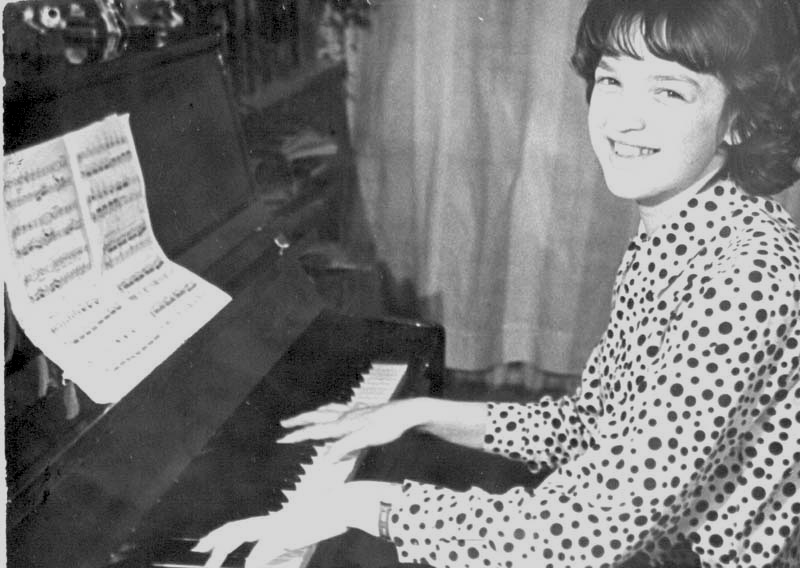

Nina ins Theater und in Konzerte mitzunehmen, um sie von ihrem Gesundheitszustand abzulenken, und natürlich, sie in ein Krankenhaus zu bringen, um sie vollständig untersuchen zu lassen.

- Du kannst nicht zulassen, dass ihre Gesundheit und eure Beziehungen sich langsam verschlechtern», beharrte sie.

Im Juli fuhren wir wieder in den Süden. Wir waren nur zu dritt: ich, Roma und Natascha. Sina war im siebten Monat schwanger und Nina und Valerik blieben in Krasnojarsk. Die Reiseroute war neu: zuerst Rostow, wo wir nicht länger als eine Woche blieben, dann drei Tage in Gorjatschij Kljutsch, eine Woche in Lermontowo, von dort mit dem Bus die Küste hinunter nach Tuapse und weiter nach Sotschi. Dort ließen Pjerwouralsk, 1975 Natascha am Klavier wir uns für einen Monat nieder. Wir wohnten in einem gut eingerichteten Zimmer in einer gut ausgestatteten Wohnung, fast im Zentrum der Stadt. Wir gingen an einem der nahegelegenen Sanatoriumsstrände schwimmen, zu dem uns unsere Gastgeberin gegen eine zusätzliche Gebühr Zugang verschaffte. Abends schlenderten wir durch die Stadtparks, obwohl ich persönlich am liebsten am Meer gesessen hätte. Mehrmals am Nachmittag, wenn es besonders heiß war, gingen wir in das Arboretum von Sotschi. Es war immer möglich, dort einen kühlen Platz zu finden.

Auf dieser Reise, zurück in Rostow, schenkte Olga Natascha ein wunderschönes Kleid mit tiefem Rückenausschnitt, in einer ungewöhnlich hellen Farbe, mit Spitze und Rüschen besetzt, welches ihr eine Freundin aus Amerika geschickt hatte. In diesem für die damalige Zeit ungewöhnlichen Kleid sah Natascha aus wie eine deutsche Trauzeugin. Als sie nach langem und schwierigem Zureden den Bitten von Olga Pawlowna nachgab und auf die Straße hinausging, schauten alle Passanten neugierig auf das Mädchen in dem langen, hellen und schönen Kleid. Vor lauter Verlegenheit wusste Natascha nicht, wohin sie gehen sollte. Ihre Wangen glühten, was ihre Jugendlichkeit und Spontaneität hervorhob.

Erst in Sotschi, bei einem Besuch im Arboretum, konnte ich sie überreden, das Kleid ein zweites Mal zu tragen. Ich erinnere mich, dass wir eine der zentralen Treppen hinuntergingen. Eine Gruppe ausländischer Touristen kam auf uns zu.

Plötzlich wandte sich einer von ihnen, der Natascha offenbar mit einer Landsmännin verwechselte, auf Deutsch mit einer Frage an sie. Weder tot noch lebendig, murmelte sie eine Entschuldigung und rannte davon und verlangte, dass ich sofort nach Hause in unsere Wohnung in Sotschi gehen sollte. Aber Roma, der den unteren Teil des Arboretums sehen wollte, widersetzte sich. Wir blieben, nur mieden wir jetzt sorgfältig alle überfüllten Orte. Natascha trug ein letztes Mal das Kleid bei einem Besuch im Rosengarten von Sotschi. Ich habe dort eine Reihe von guten Fotos gemacht. Natasha sah sehr hübsch aus vor den üppig blühenden Rosen. Es war auf dem Höhepunkt ihrer jugendlichen Schönheit und Frische. Wir reisten als Teil einer Exkursionsgruppe von Sotschi nach Abchasien. Wir besuchten Gagra, Neu-Athos und Suchumi und fuhren zum Ritsa-See hinauf.

Zur gleichen Zeit renovierten Valera und Sina, die jetzt im Wohnheim der Physikabteilung in der Nähe des Busbahnhofs wohnten, mit Ninas und Olga Fedotownas Hilfe unsere Wohnung: Tapeten abreißen, Wände glätten, weiß tünchen, Böden mit Holzfliesen belegen.

Am Nachmittag des Achtundzwanzigsten brachte Sina eine Tochter zur Welt, die schwarzäugig und schwarzhaarig war und Olja genannt wurde und um die sich bald alle Interessen unserer Familie drehten. Ich, Roma und Natascha kehrten gerade noch rechtzeitig zu Valeriks Geburtstag nach Krasnojarsk zurück. Sina und Oletschka wurden bald aus dem Krankenhaus entlassen. Nina, die sich an alle Schwierigkeiten bei der Betreuung eines Babys erinnerte, überredete Sina, zumindest in den ersten Monaten bei uns zu bleiben. Nina und ich haben unser Schlafzimmer, das größer und heller war als die anderen Zimmer, schnell geräumt. Von da an herrschte im Haus der Baby-Kult. Wir schlichen auf Zehenspitzen und flüsterten. Die Räume waren mit trocknenden Windeln vollgehängt. Sie hätten unsere kleine Prinzessin beim Baden sehen sollen: weiße Kittel, Mullbinden, Thermometer, Windeln, konzentrierte und besorgte Gesichter.

Ich erinnere mich an einen Tag, an dem Oletschka gestillt wurde, an der Muttermilch fast erstickte, schon gänzlich außer Atem war und wild mit den Ärmchen und Händchen fuchtelte. Ihre Lippen und dann ihr Gesicht wurden schnell weiß. Auf den Schrei von Sina hin kam die ganze Familie herbeigelaufen. Wie Natascha sich erinnerte, rannte sie, die Oletschka so sehr liebte und verhätschelte, vor Schreck in die Küche und hielt sich die Ohren zu. Wie immer in schwierigen Zeiten zeigte Nina Standhaftigkeit und Entschlossenheit. Bald saugte Oletschka an ihrer Brust und alle beruhigten sich. Natascha saß immer noch in der Küche, hielt sich die Ohren zu und war förmlich zu einem Häufchen Elend zusammengesackt.

Mit der Oletschkas Geburt trat ich sofort in eine andere Alterskategorie ein, ich war nun Großvater. Und sofort spürte ich die Last der vergangenen Jahre. Wenn ich jetzt die Straße hinunterging, schaute ich mir die Gesichter der Männer an, die ich traf, und versuchte, diejenigen zu erkennen, die älter waren als ich, und es stellte sich heraus, dass es nur sehr wenige von ihnen gab.

Und ich, trotz meines gesetzten Alters, wuselte weiter herum. Das Schuljahr beginnt. Zusammen mit den Partei-, Komsomol- und Gewerkschaftsorganisationen muss ich dringend den Arbeitsplan der Fakultät, den Sitzungsplan des Fakultätsrats und auch die Pläne für die Partei- und Komsomol-Sitzungen und die Sitzungen des Büros vorbereiten. Alle Entscheidungen höherer Instanzen, insbesondere die der Partei, sollten berücksichtigt werden, deren Ausführung für alle Mitglieder des Kollektivs, vom Rektor bis zur Putzfrau, streng verpflichtend war. Nach der Fülle der Beschlüsse zu urteilen, war die Aktivität unserer Parteiorganisation im vergangenen Studienjahr sehr hoch.

Also stelle ich die Schreibtische der Dekane um und lege ein großes Blatt Baumwollpapier aus, auf das ich Spalten und Reihen zeichne. Die Spalten entsprechen den Monaten des akademischen Jahres, die Zeilen den Abteilungen und Dienststellen. In den Zellen schreiben wir die Aktivitäten auf, die den Anforderungen der Verordnungen entsprechen, und geben an, wer sie in welchen Monaten umsetzen muss. Nach dieser Tabelle werden dann die Sitzungen des Fakultätsrates, die Partei- und Komsomol-Sitzungen und die Präsidiumssitzungen geplant.

All dies war von einem schrecklichen Formalismus geprägt. Die Probleme wurden von Ebene zu Ebene weitergegeben. Ihre Diskussion gab Anlass zu neuen Entschließungen und einem neuen Diskussionszyklus. Viele wichtige Fragen wurden auf der Ebene zahlreicher Sitzungen vertagt. Es war fast unmöglich, diesen Fluss zu stoppen, da die Arbeit der Referate vor allem an der Quantität und Qualität ihrer Entscheidungen und Beschlüsse gemessen wurde.

Einige der behandelten Themen betrafen selbstverständlich die Tätigkeiten der Dienststellen, was sich in unserer Tabelle widerspiegelte. Auch hier stieß das System auf großen Widerstand. Ich erinnere mich, wie die Mitglieder der Algebra-Abteilung auf einer von Lojko geleiteten Sitzung zu jedem dieser Punkte Forderungen stellten:

- Streichen Sie es, es wird sich sowieso niemand daran halten.

- Schon gut, schon gut, ich werde es streichen, versicherte Lojko eilig.

Das größte Problem zu Beginn des Schuljahres war jedoch die Arbeit der Erstklässler in den Kolchosen. Das Zentralkomitee der Partei und die Parteipresse haben in diesem Jahr der Erntekampagne besondere Aufmerksamkeit geschenkt.

Die schlechten Ernten der letzten Jahre hatten den Rückgang der landwirtschaftlichen Produktion vervollständigt und sie in eine kritische Lage gebracht. Um sie zu unterstützen, wurden die Einkaufspreise für landwirtschaftliche Erzeugnisse mehrfach erhöht, und 1975 wurde die Bezahlung für Arbeitstage durch einen Monatslohn ersetzt. Diese Maßnahmen halfen jedoch nicht, denn parallel zum Anstieg der Einkaufspreise stiegen die Preise für landwirtschaftliche Maschinen und Geräte, Treibstoff und Düngemittel noch schneller, so dass die Kolchosen kein Geld mehr hatten, um die den Kolchosbauern zugesagten Löhne zu zahlen.

Das Recht der Kolchosbauern auf einen Bürgerausweis, welches ihre Leibeigenschaft beendete, verstärkte nur ihre Flucht in die Städte. Auch die Einführung von Renten für die Kolchosbauern half nicht. Und wie hätte diese Maßnahme ihre Flucht aus den Dörfern aufhalten können, wenn beispielsweise Olga Fedotowna, die ihr ganzes Leben lang auf den Feldern der Kolchose gearbeitet hatte, eine Rente von 12 Rubel pro Monat erhielt. Infolgedessen war das Land lange Zeit, bis in die neunziger Jahre hinein, gezwungen, in großem Umfang Getreide aus Kanada und den Vereinigten Staaten von Amerika zu kaufen.

Unter diesen Umständen schenkten die regionalen und Bezirks-Parteikomitees den Studentenbrigaden natürlich besondere Aufmerksamkeit, zumal ihre Arbeit in den letzten Jahren problematischer geworden war als je zuvor.

Ich weiß nicht mehr, in welchem Bezirk sich diese Tragödie abgespielt hat, aber ich erinnere mich gut daran. Zur Mittagszeit beschlossen einige Schüler, die bei der Getreideernte arbeiteten, im Schatten eines großen Heuhaufens ein Nickerchen zu machen. Nicht alle von ihnen sind eingeschlafen. Einer der aufgeweckten Schüler, der beschlossen hatte, die Technik des Traktorfahrens selbst zu erlernen, setzte sich an die Hebel, startete den Motor und fuhr vorwärts. Er war nicht in der Lage, sich von der für die schlafenden Studenten verhängnisvollen Richtung abzuwenden. Der fahrerlose Traktor zertrümmerte einen Heuhaufen, der ihm im Weg stand, und zerquetschte die schlafenden Kinder mit seinen Raupen.

Diese grausame Geschichte wurde uns auf verschiedenen Ebenen wiederholt vorgetragen, wobei auf die strafrechtliche Verantwortung all jener hingewiesen wurde, die in irgendeiner Weise mit der Leitung von Studentengruppen zu tun haben.

Unter diesen Umständen klang der Bericht über den Zwischenfall auf der staatlichen Farm Krasnaja Poljana, wo Studenten unserer Fakultät arbeiteten, für mich wie ein Urteil. Wir mussten zusammen mit Iwan Jakowlewitsch Ganja, dem Sekretär des Parteibüros des Instituts, und einigen Vertretern des Bezirkskomitees mit dem Auto des Instituts nach Nasarowo fahren.

Heute erinnere ich mich so daran: der Staatsbetrieb Krasnopoljanskij im Bezirk Nasarovskij. Ein Getreidetrockner. Mit Getreide beladene Wagen für den Transport zum Getreidesilo. Hier fand das Ereignis statt, das den Anlass zu unserer Ankunft gab. Wie uns gesagt wurde, machte eine Gruppe unserer Erstsemester morgens eine Pause und hielt sich in der Nähe der Fahrzeuge auf, um mit den Fahrern zu scherzen. In diesem Moment rutschte eines der Mädchen, das mit dem Bein gegen das vorwärtsfahrende Fahrzeug trat aus und geriet unter den Wagen, wodurch ihre Beckenknochen gequetscht wurden. Das Mädchen wurde sofort ins Nasarowsker Krankenhaus gebracht, wo es bereits operiert wurde, als wir eintrafen.

Wir haben die Eltern angerufen, sind ins Krankenhaus gefahren, das Opfer lag auf der Intensivstation. Wir dürfen nicht zu ihr, aber der Chirurg beruhigt uns und sagt, die Operation sei erfolgreich verlaufen und sie könne später auch Kinder bekommen.

- Zum Glück war das Auto nicht beladen», sagt er abschließend.

Ich blieb eine ganze Woche in Nasarowa. Es fanden mehrere Gespräche mit dem Opfer, ihren Eltern, Ärzten und Vertretern des Bezirksausschusses und der Staatsanwaltschaft statt. Dank des geschickten Vorgehens von Iwan Jakowlewitsch konnten wir alle Streitfragen klären und einen gefährlichen Prozess vermeiden. Das Mädchen, das aus dem Krankenhaus entlassen wurde, setzte ihr Studium fort, schloss es erfolgreich ab und brachte sogar, wie ich später erfuhr, eine Tochter zur Welt.

Die Arbeit der freiwilligen Volksgarde hat viel Unruhe verursacht. Die meisten Mitglieder waren ältere Schüler und Lehrer. An fünf Tagen im Monat waren zwanzig Personen im Dienst. Der Dienst begann um sechs Uhr abends mit der Zuteilung zum Bezirksstab bei der Milizdienststelle und endete gegen zwölf Uhr nachts. Während der Einweisung wurden die Mitglieder der Volksgarde über die operativen Berichte bezüglich der begangenen Straftaten, die Täter und ihre Kennzeichen informiert. Die Gardisten wurden in Dreiergruppen eingesetzt, oft in den dunkelsten und finstersten Gegenden des Bezirks. Man verlangte von ihnen, dass sie Keller und vor allem Dachböden kontrollierten, wo sich Kriminelle oft versteckten. Das waren sehr beunruhigende Tage für mich. Schließlich konnte alles passieren, und wie sollte ich den Eltern gegenübertreten? Wenn ich nach der Instruktion hinausging, warnte ich sie in der Regel davor, in die Keller hinabzusteigen oder auf die Dachböden zu klettern, und oft nahm ich selbst an solchen Aufsichtsdiensten teil, was Nina sehr missfiel.
